Chapter 

# 12 The Geom etry Shader

Assuming we are not using the tessellation stages, the geometry shader stage is an optional stage that sits between the vertex and pixel shader stages. While the vertex shader inputs vertices, the geometry shader inputs entire primitives. For example, if we were drawing triangle lists, then conceptually the geometry shader program would be executed for each triangle T in the list: 

```javascript
for (UINT i = 0; i < numTriangles; ++i) OutputPrimitiveList = GeometryShader(T[i].vertexList); 
```

Notice the three vertices of each triangle are input into the geometry shader, and the geometry shader outputs a list of primitives. Unlike vertex shaders which cannot destroy or create vertices, the main advantage of the geometry shader is that it can create or destroy geometry; this enables some interesting effects to be implemented on the GPU. For example, the input primitive can be expanded into one or more other primitives, or the geometry shader can choose not to output a primitive based on some condition. Note that the output primitives need not be the same type as the input primitive; for instance, a common application of the geometry shader is to expand a point into a quad (two triangles). 

The primitives output from the geometry shader are defined by a vertex list. Vertex positions leaving the geometry shader must be transformed to homogeneous clip space. After the geometry shader stage, we have a list of vertices defining primitives in homogeneous clip space. These vertices are projected (homogeneous divide), and then rasterization occurs as usual. 

# Chapter Objectives:

1. To learn how to program geometry shaders. 

2. To discover how billboards can be implemented efficiently using the geometry shader. 

3. To recognize auto generated primitive IDs and some of their applications. 

4. To find out how to create and use texture arrays, and understand why they are useful. 

5. To understand how alpha-to-coverage helps with the aliasing problem of alpha cutouts. 

# 12.1 PROGRAMMING GEOMETRY SHADERS

Programming geometry shaders is a lot like programming vertex or pixel shaders, but there are some differences. The following code shows the general form: 

```txt
[maxvertexcount(N)]  
void ShaderName(
    PrimitiveType InputVertexType InputName [NumElements],
    inout StreamOutputObject<OutputVertexType> OutputName)
{
    // Geometry shader body...
} 
```

We must first specify the maximum number of vertices the geometry shader will output for a single invocation (the geometry shader is invoked per primitive). This is done by setting the max vertex count before the shader definition using the following attribute syntax: 

```txt
[maxvertexcount(N)] 
```

where N is the maximum number of vertices the geometry shader will output for a single invocation. The number of vertices a geometry shader can output per invocation is variable, but it cannot exceed the defined maximum. For performance purposes, maxvertexcount should be as small as possible; [NVIDIA08] states that peak performance of the GS is achieved when the GS outputs between 1-20 scalars, and performance drops to $5 0 \%$ if the GS outputs between 27-40 scalars. The number of scalars output per invocation is the product of maxvertexcount and the number of scalars in the output vertex type structure. Working with such restrictions is difficult in practice, so we can either accept lower than peak performance as good enough, or choose an alternative implementation that does not use the geometry shader; however, we must also consider that an alternative 

implementation may have other drawbacks, which can still make the geometry shader implementation a better choice. Furthermore, the recommendations in [NVIDIA08] are from 2008 (first generation geometry shaders), so things should have improved. 

The geometry shader takes two parameters: an input parameter and an output parameter. (Actually, it can take more, but that is a special topic; see $\ S 1 2 . 2 . 4 .$ ) The input parameter is always an array of vertices that define the primitive—one vertex for a point, two for a line, three for a triangle, four for a line with adjacency, and six for a triangle with adjacency. The vertex type of the input vertices is the vertex type returned by the vertex shader (e.g., VertexOut). The input parameter must be prefixed by a primitive type, describing the type of primitives being input into the geometry shader. This can be anyone of the following: 

1. point: The input primitives are points. 

2. line: The input primitives are lines (lists or strips). 

3. triangle: The input primitives triangles (lists or strips). 

4. lineadj: The input primitives are lines with adjacency (lists or strips). 

5. triangleadj: The input primitives are triangles with adjacency (lists or strips). 


The input primitive into a geometry shader is always a complete primitive (e.g., two vertices for a line, and three vertices for a triangle). Thus the geometry shader does not need to distinguish between lists and strips. For example, if you are drawing triangle strips, the geometry shader is still executed for every triangle in the strip, and the three vertices of each triangle are passed into the geometry shader as input. This entails additional overhead, as vertices that are shared by multiple primitives are processed multiple times in the geometry shader. 

The output parameter always has the inout modifier. Additionally, the output parameter is always a stream type. A stream type stores a list of vertices which defines the geometry the geometry shader is outputting. A geometry shader adds a vertex to the outgoing stream list using the intrinsic Append method: 

void StreamOutputObject<OutputVertexType>::Append(OutputVertexType v); 

A stream type is a template type, where the template argument is used to specify the vertex type of the outgoing vertices (e.g., GeoOut). There are three possible stream types: 

1. PointStream<OutputVertexType>: A list of vertices defining a point list. 

2. LineStream<OutputVertexType>: A list of vertices defining a line strip. 

3. TriangleStream<OutputVertexType>: A list of vertices defining a triangle strip. 

The vertices output by a geometry shader form primitives; the type of output primitive is indicated by the stream type (PointStream, LineStream, TriangleStream). For lines and triangles, the output primitive is always a strip. Line and triangle lists, however, can be simulated by using the intrinsic RestartStrip method: 

```cpp
void StreamOutputObject<OutputVertexType>::RestartStrip(); 
```

For example, if you wanted to output triangle lists, then you would call RestartStrip every time after three vertices were appended to the output stream. 

Below are some specific examples of geometry shader signatures: 

```txt
// EXAMPLE 1: GS outputs at most 4 vertices. The input primitive  
// is a line. The output is a triangle strip.  
//  
[maxvertexcount(4)]  
void GS(line VertexOut gin[2],  
    inout TriangleStream<GeoOut> triStream)  
{  
    // Geometry shader body...  
}  
// EXAMPLE 2: GS outputs at most 32 vertices. The input primitive is  
// a triangle. The output is a triangle strip.  
//  
[maxvertexcount(32)]  
void GS(triangle VertexOut gin[3],  
    inout TriangleStream<GeoOut> triStream)  
{  
    // Geometry shader body...  
}  
// EXAMPLE 3: GS outputs at most 4 vertices. The input primitive  
// is a point. The output is a triangle strip.  
//  
[maxvertexcount(4)]  
void GS(point VertexOut gin[1],  
    inout TriangleStream<GeoOut> triStream)  
{  
    // Geometry shader body...  
} 
```

The following geometry shader illustrates the Append and RestartStrip methods; it inputs a triangle, subdivides it (Figure 12.1) and outputs the four subdivided triangles: 

```txt
struct VertexOut
{
    float3 PosL : POSITION;
    float3 NormalL : NORMAL;
    float2 Tex : TEXCOORD;
}; 
```

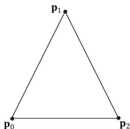


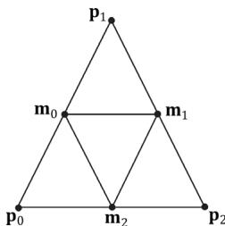


Figure 12.1. Subdividing a triangle into four equally sized triangles. Observe that the three new vertices are the midpoints along the edges of the original triangle.


```txt
float4 PosH : SV POSITION; float3 PosW : POSITION; float3 NormalW : NORMAL; float2 Tex : TEXCOORD;   
};   
void Subdivide(VertexOut inVertices[3], out VertexOut outVertices[6]) { // v1 // \ / \ // / \ \m0\*--\*m1 // /\/ \ \/ /\/ \ \m0\*--\*m1 // / \ /\/ \ \m0\*--\*m1 // v0 m2 v2 VertexOut m[3]; // Compute edge midpoints. m[0].PosL = 0.5f\*(inVertices[0].PosL+inVertices[1].PosL); m[1].PosL = 0.5f\*(inVertices[1].PosL+inVertices[2].PosL); m[2].PosL = 0.5f\*(inVertices[2].PosL+inVertices[0].PosL); //Project onto unit sphere m[0].PosL = normalize(m[0].PosL); m[1].PosL = normalize(m[1].PosL); m[2].PosL = normalize(m[2].PosL); // Derive normals. m[0].NormalL = m[0].PosL; m[1].NormalL = m[1].PosL; m[2].NormalL = m[2].PosL; //Interpolate texture coordinates. m[0].Tex = 0.5f\*(inVertices[0].Tex+inVertices[1].Tex); m[1].Tex = 0.5f\*(inVertices[1].Tex+inVertices[2].Tex); m[2].Tex = 0.5f\*(inVertices[2].Tex+inVertices[0].Tex); outVertices[0] = inVertices[0]; 
```

outVertices[1] $=$ m[0]; outVertices[2] $=$ m[2]; outVertices[3] $=$ m[1]; outVertices[4] $=$ inVertices[2]; outVertices[5] $=$ inVertices[1];   
};   
void OutputSubdivision(VertexOut v[6],   
inout TriangleStream<GeoOut> triStream)   
{ GeoOut gout[6]; [unroll] for(int i = 0; i < 6; ++i) { // Transform to world space space. gout[i].PosW $=$ mul(float4(v[i].PosL, 1.0f), gWorld).xyz; gout[i].NormalW $=$ mul(v[i].NormalL, (float3x3)gWorldInvTranspose); // Transform to homogeneous clip space. gout[i].PosH $=$ mul(float4(v[i].PosL, 1.0f), gWorldViewProj); gout[i].Tex $=$ v[i].Tex; } // // v1 // \*/ // / \*/ // m0\*--\*m1 // /\/ \*/ // / \/ \*/ // \*--\*--\* --\*/ v0 m2 v2 // We can draw the subdivision in two strips: Strip 1: bottom three triangles Strip 2: top triangle [unroll] for(int j = 0; j < 5; ++j) { triStream.Addend(gout[j]); } triStream RestartStrip(); triStream.Addend(gout[1]); triStream.Addend(gout[5]); triStream.Addend(gout[3]); }   
[maxvertexcount(8)]   
void GS(triangle VertexOut gin[3], inout TriangleStream<GeoOut>) 

```txt
{ VertexOut v[6]; Subdivide(gin, v); OutputSubdivision(v, triStream); } 
```

Geometry shaders are compiled very similarly to vertex and pixel shaders. Suppose we have a geometry shader called GS in TreeSprite.hlsl, then we would compile the shader to bytecode like so: 

```cpp
std::vector< LPCWSTR> gsArgs = std::vector< LPCWSTR> { L"-E", L"GS", L"-T", L"gs_6_6" COMMA_DEBUG_args }; mShaders["treeSpriteGS"] = d3dUtil::CompileShader( L"Shaders\TreeSprite.hlsl", gsArgs); 
```

Like vertex and pixel shaders, a given geometry shader is bound to the rendering pipeline as part of a pipeline state object (PSO): 

D3D12graphicspipeline_STATE_DESC treeSpritePsoDesc $=$ basePsoDesc;   
...   
treeSpritePsoDesc.GS $=$ { reinterpret_cast<BYTE\*>(mShaders["treeSpriteGS"]-> GetBufferPointer(), mShaders["treeSpriteGS"]->GetBufferSize()   
}； 


Given an input primitive, the geometry shader can choose not to output it based on some condition. In this way, geometry is “destroyed” by the geometry shader, which can be useful for some algorithms. 


If you do not output enough vertices to complete a primitive in a geometry shader, then the partial primitive is discarded. 

# 12.2 TREE BILLBOARDS DEMO

# 12.2.1 Overview

When trees are far away, a billboarding technique is used for efficiency. That is, instead of rendering the geometry for a fully 3D tree, a quad with a picture of a 3D tree is painted on it (see Figure 12.2). From a distance, you cannot tell that a billboard is being used. However, the trick is to make sure that the billboard always faces the camera (otherwise the illusion would break). 

Assuming the y-axis is up and the $x z$ -plane is the ground plane, the tree billboards will generally be aligned with the $y .$ -axis and just face the camera in 

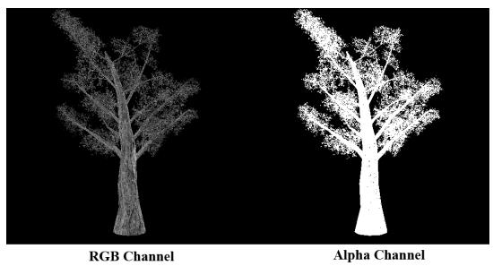


Figure 12.2. A tree billboard texture with alpha channel.


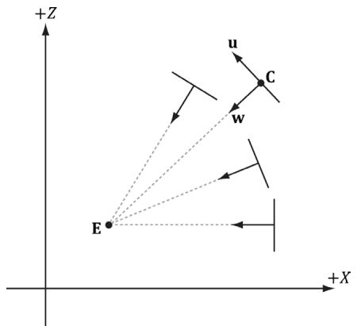


Figure 12.3. Billboards facing the camera.


the $_ { x z }$ -plane. Figure 12.3 shows the local coordinate systems of several billboards from a bird’s eye view—notice that the billboards are “looking” at the camera. 

So given the center position $\mathbf { C } = ( C _ { x } , C _ { y } , C _ { z } )$ of a billboard in world space and the position of the camera $\mathbf { E } = ( E _ { x } , E _ { y } , E _ { z } )$ in world space, we have enough information to describe the local coordinate system of the billboard relative to the world space: 

$$
\mathbf {w} = \frac {\left(E _ {x} - C _ {x} , 0 , E _ {z} - C _ {z}\right)}{\left| \left(E _ {x} - C _ {x} , 0 , E _ {z} - C _ {z}\right) \right|}
$$

$$
\mathbf {v} = (0, 1, 0)
$$

$$
\mathbf {u} = \mathbf {v} \times \mathbf {w}
$$

Given the local coordinate system of the billboard relative to the world space, and the world size of the billboard, the billboard quad vertices can be obtained as follows (see Figure 12.4): 

$\begin{array} { r l } { \mathbf { \nabla } \mathbf { v } \left[ \mathbf { \nabla } 0 \right] } & { { } = } \end{array}$ float4(gin[0].CenterW $^ +$ halfWidth*right - halfHeight*up, 1.0f); 

$\begin{array} { r l } { \mathbf { v } \left[ \mathbf { 1 } \right] = } \end{array}$ float4(gin[0].CenterW $^ +$ halfWidth*right $^ +$ halfHeight*up, 1.0f); 

$\begin{array} { r l } { \mathbf { \nabla } \mathbf { v } \left[ 2 \right] } & { { } = } \end{array}$ float4(gin[0].CenterW - halfWidth*right - halfHeight*up, 1.0f); 

$\begin{array} { r l } { \mathbf { \nabla } \mathbf { v } \left[ 3 \right] } & { { } = } \end{array}$ float4(gin[0].CenterW - halfWidth*right $^ +$ halfHeight*up, 1.0f); 

Note that the local coordinate system of a billboard differs for each billboard, so it must be computed for each billboard. 

For this demo, we will construct a list of point primitives (D3D12_PRIMITIVE_ TOPOLOGY_TYPE_POINT for the PrimitiveTopologyType of the PSO and D3D11_ PRIMITIVE_TOPOLOGY_POINTLIST as the argument for ID3D12GraphicsCommandLi st::IASetPrimitiveTopology) that lie slightly above a land mass. These points represent the centers of the billboards we want to draw. In the geometry shader, we will expand these points into billboard quads. In addition, we will compute 

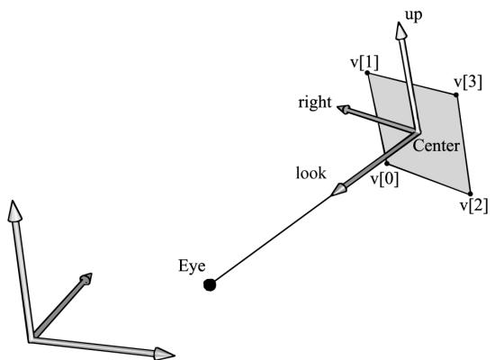


Figure 12.4. Computing the billboard quad vertices from the local coordinate system and world size of the billboard.


the world matrix of the billboard in the geometry shader. Figure 12.5 shows a screenshot of the demo. 

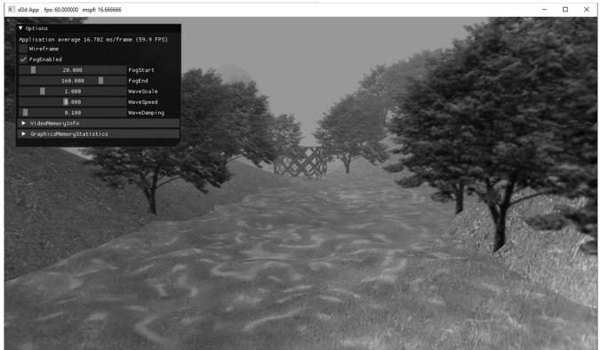


Figure 12.5. Screenshot of the tree billboard demo.


As Figure 12.5 shows, this sample builds off the “Blend” demo from Chapter 10. 


A common CPU implementation of billboards would be to use four vertices per billboard in a dynamic vertex buffer. Then every time the camera moves, the vertices would be updated on the CPU so that the billboards face the camera. This approach must submit four vertices per billboard to the IA stage, and requires updating dynamic vertex buffers, which means the data is being read from system memory over the PCI-Express bus. With the geometry shader approach, we can use static vertex buffers since the geometry shader does the billboard expansion and makes the billboards face the camera. Moreover, the memory footprint of the billboards is quite small, as we only have to submit one 

vertex per billboard to the IA stage. 

# 12.2.2 Vertex Structure

We use the following vertex structure for our billboard points: 

```c
struct TreeSpriteVertex
{
    XMFLOAT3 Pos;
    XMFLOAT2 Size;
};
mTreeSpriteInputLayout = 
{
    "POSITION", 0, DXGI_FORMAT_R32G32B32_FLOAT, 0, 0,
    D3D12_INPUT_CLASSIFICATION_PER鼓舞_DATA, 0},
    "SIZE", 0, DXGI_FORMAT_R32G32_FLOAT, 0, 12,
    D3D12_INPUT_CLASSIFICATION_PER鼓舞_DATA, 0},
}; 
```

The vertex stores a point which represents the center position of the billboard in world space. It also includes a size member, which stores the width/height of the billboard (scaled to world space units); this is so the geometry shader knows how large the billboard should be after expansion (Figure 12.6). By having the size vary per vertex, we can easily allow for billboards of different sizes. 

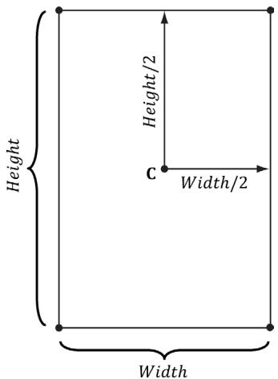


Figure 12.6. Expanding a point into a quad.


Excepting texture arrays (§12.3), the other $\mathrm { C } { + + }$ code in the “Tree Billboard” demo should be routine Direct3D code by now (creating vertex buffers, effects, invoking draw methods, etc.). Thus we will now turn our attention to the TreeSprite.hlsl file. 

# 12.2.3 The HLSL File

Since this is our first demo with a geometry shader, we will show the entire HLSL file here so that you can see how it fits together with the vertex and pixel shaders. This effect also introduces some new objects that we have not discussed yet (SV_ PrimitiveID and Texture2DArray); these items will be discussed next. For now, mainly focus on the geometry shader program GS; this shader expands a point into a quad aligned with the world’s y-axis that faces the camera, as described in $\$ 12.2.1$ . 

```txt
// Include common HLSL code. #include "Shaders/Common.hls1"   
struct VertexIn { float3 PosW : POSITION; float2 SizeW : SIZE; } ;   
struct VertexOut { float3 CenterW : POSITION; float2 SizeW : SIZE; } ;   
struct GeoOut { float4 PosH : SV POSITION; float3 PosW : POSITION; float3 NormalW : NORMAL; float2 TexC : TEXCOORD; uint PrimID : SV_PrimitiveID; } ;   
VertexOut VS(VertexIn vin) { VertexOut vout; // Just pass data over to geometry shader. voutCenterW = vin(PosW; vout.SizeW = vin.SizeW; return vout; }   
// We expand each point into a quad (4 vertices), so the maximum // number of vertices we output per geometry shader invocation is 4. [maxvertexcount(4)]   
void GS(point VertexOut gin[1], uint primID : SV_PrimitiveID, inout TriangleStream<GeoOut> triStream) 
```

{ // // Compute the local coordinate system of the sprite relative // to the world space such that the billboard is aligned with // the y-axis and faces the eye. // float3 up $=$ float3(0.0f, 1.0f, 0.0f); float3 look $=$ gEyePosW - gin[0].CenterW; look.y $= 0.0\mathrm{f}$ ;//y-axis aligned, so project to xz-plane look $=$ normalize(look); float3 right $=$ cross(up, look); // // Compute triangle strip vertices (quad) in world space. // float halfWidth $= 0.5\mathrm{f}*$ gin[0].SizeW.x; float halfHeight $= 0.5\mathrm{f}*$ gin[0].SizeW.y; float4 v[4]; v[0] $=$ float4(gin[0].CenterW + halfWidth \*right - halfHeight \*up, 1.0f); v[1] $=$ float4(gin[0].CenterW + halfWidth \*right + halfHeight \*up, 1.0f); v[2] $=$ float4(gin[0].CenterW - halfWidth \*right - halfHeight \*up, 1.0f); v[3] $=$ float4(gin[0].CenterW - halfWidth \*right + halfHeight \*up, 1.0f); // Transform quad vertices to world space and output // them as a triangle strip. // float2 texC[4] = { float2(0.0f, 1.0f), float2(0.0f, 0.0f), float2(1.0f, 1.0f), float2(1.0f, 0.0f) }; GeoOut gout; [unroll] for(int i $= 0$ ; i $<  4$ ; ++i) { gout_PosH $=$ mul(v[i], gViewProj); gout_PosW $=$ v[i].xyz; gout.NormalW $=$ look; gout.TexC $=$ texC[i]; gout.PrimID $=$ primID; triStream.Addend(gout); 

}   
}   
float4 PS(GeoOut pin) : SV_Target { MaterialData matData = gMaterialData[gMaterialIndex]; float4 diffuseAlbedo = matData.DiffuseAlbedo; float3 fresnelR0 = matData.FresnelR0; float roughness = matData.Roughness; uint diffuseMapIndex = matData.DiffuseMapIndex; //Dynamically look up the texture in the heap. float3 uvw = float3(pin.TexC, pin.PrimID % 3); Texture2DArray diffuseMap = ResourceDescriptorHeap[diffuseMapIndex ex]; diffuseAlbedo $\ast =$ diffuseMap_SAMPLE(GetAnisoWrapSampler(), uvw); #ifdef ALPHA_TEST //Discard pixel if texture alpha $<  0.25f$ .We do this test as soon //as possible in the shader so that we can potentially exit the //shader early, thereby skipping the rest of the shader code. clip(diffuseAlbedo.a - 0.25f); #endif // Interpolating normal can unnormalize it, so renormalize it. float3 normalW $=$ normalize(pin.NormalW); // Vector from point being lit to eye. float3 toEyeW $=$ gEyePosW - pin(PosW; float distToEye $=$ length(toEyeW); toEyeW $= =$ distToEye; // normalize // Light terms. float4 ambient $=$ gAmbientLight\*diffuseAlbedo; const float shininess $= (1.0f -$ roughness); Material mat $=$ { diffuseAlbedo,fresnelR0, shininess }; float4 directLight $=$ ComputeLighting(gLights,mat, pin(PosW, normalW,toEyeW); float4 litColor $=$ ambient + directLight; if( gFogEnabled ) { float fogAmount $=$ saturate((distToEye-gFogStart)/ gFogRange); litColor $=$ lerp(litColor,gFogColor,fogAmount); } // Common convention to take alpha from diffuse albedo. litColor.a $=$ diffuseAlbedo.a; 

```txt
returnlitColor; 
```

# 12.2.4 SV_PrimitiveID

The geometry shader in this example takes a special unsigned integer parameter with semantic SV_PrimitiveID. 

```txt
[maxvertexcount(4)]  
void GS(point VertexOut gin[1], uint primID : SV_PrimitiveID, inout TriangleStream<GeoOut> triStream) 
```

When this semantic is specified, it tells the input assembler stage to automatically generate a primitive ID for each primitive. When a draw call is executed to draw n primitives, the first primitive is labeled 0; the second primitive is labeled 1; and so on, until the last primitive in the draw call is labeled n-1. The primitive IDs are only unique for a single draw call. In our billboard example, the geometry shader does not use this ID (although a geometry shader could); instead, the geometry shader writes the primitive ID to the outgoing vertices, thereby passing it on to the pixel shader stage. The pixel shader uses the primitive ID to index into a texture array, which leads us to the next section. 

# Note:

If a geometry shader is not present, the primitive ID parameter can be added to the parameter list of the pixel shader: 

```txt
float4 PS(VertexOut pin, uint primID : SV_PrimitiveID) : SV_Target  
{ // Pixel Shader body... 
```

However, if a geometry shader is present, then the primitive ID parameter must occur in the geometry shader signature. Then the geometry shader can use the primitive ID or pass it on to the pixel shader stage (or both). 

# Note:

It is also possible to have the input assembler generate a vertex ID. To do this, add an additional parameter of type uint to the vertex shader signature with semantic SV_VertexID: 

The following vertex shader signature shows how this is done: 

```txt
VertexOut VS (VertexIn vin, uint vertID : SV_VertexID) { 
```

```txt
//vertexshaderbody... 
```

For a Draw call, the vertices in the draw call will be labeled with IDs from 0, 1, …, n-1, where n is the number of vertices in the draw call. For a DrawIndexed call, the vertex IDs correspond to the vertex index values. 

# 12.3 TEXTURE ARRAYS

# 12.3.1 Overview

A texture array stores an array of textures that all have the same dimension and format. In $\mathrm { C } { + + }$ code, a texture array is represented by the ID3D12Resource interface just like all resources are (textures and buffers). When creating an ID3D12Resource object, there is a property called DepthOrArraySize that can be set to specify the number of texture elements the texture stores (or the depth for a 3D texture). In an HLSL file, a texture array is represented by the Texture2DArray type: 

Texture2DArray gTreeMapArray; 

The DirectXTK texture loading code we have been using, DirectX::CreateDDSTe xtureFromFileEx, supports loading DDS files that store texture arrays. However, SRVs to texture arrays need to be created differently. We can detect a texture array by looking at the DepthOrArraySize property in the texture description: 

```cpp
if(texResource->GetDesc().DepthOrArraySize > 1)  
{ CreateSrv2dArray( md3dDevice.Get(), texResource, texResource->GetDesc().Format, texResource->GetDesc().MipLevels, texResource->GetDesc().DepthOrArraySize, hDescriptor); } else { CreateSrv2d( md3dDevice.Get(), texResource, texResource->GetDesc().Format, texResource->GetDesc().MipLevels, hDescriptor); } inline void CreateSrv2dArray( 
```

```txt
ID3D12Device* device, ID3D12Resource* resource, DXGI_FORMAT format, UINT mipLevels, UINT arraySize, CD3DX12_CPU_DESCRIPTOR_handle hDescriptor) { D3D12_SHADER_RESOURCE(View_DESC srvDesc = {}; srvDesc.Shader4ComponentMapping = D3D12_DEFAULT_SHADER_4 ComponentMapping; srvDesc.ViewDimension = D3D12_SRV_DIMENSION-textURE2ARRAY; srvDesc.Texture2Array MostDetailedMip = 0; srvDesc.Texture2Array.FirstArraySlice = 0; srvDesc.Texture2Array.Size = arraySize; srvDesc.Texture2Array.ResourceMinLODClamp = 0.0f; srvDesc.Format = format; srvDesc.Texture2Array.MipLevels = mipLevels; device->CreateShaderResourceView(resource, &srvDesc, hDescriptor); } 
```

Why do we need texture arrays? Texture arrays predate bindless resources where we can just index the CBV/UAV/SRV descriptor heap directly in a shader. They were introduced in DirectX 10 and provided a way to get access to a large collection of textures in a shader (provided the textures were the same format and dimension) before bindless texturing existed. We discuss texture arrays here because you may still encounter code that uses them. Furthermore, using a texture array could still be a performance boost over bindless, as texture arrays are treated as a single resource entity, whereas with bindless you will be indexing different resources. 

# 12.3.2 Sampling a Texture Array

In the Billboards demo, we sample a texture array with the following code: 

```javascript
float3 uvw = float3(pin.TexC, pin.PrimID % 3); Texture2DArray diffuseMap = ResourceDescriptorHeap[diffuseMapIndex]; diffuseAlbedo *= diffuseMap_SAMPLE(GetAnisoWrapSampler(), uvw); 
```

When using a texture array, three texture coordinates are required. The first two texture coordinates are the usual 2D texture coordinates; the third texture coordinate is an index into the texture array. For example, 0 is the index to the first texture in the array, 1 is the index to the second texture in the array, 2 is the index to the third texture in the array, and so on. 

In the Billboards demo, we use a texture array with three texture elements, each with a different tree texture (Figure 12.7 is an example with four). However, because we are drawing more than three trees per draw call, the primitive IDs will become greater than two. Thus, we take the primitive ID modulo 3 (pin.PrimID % 

3) to map the primitive ID to 0, 1, or 2, which are valid array indices for an array with three elements. 

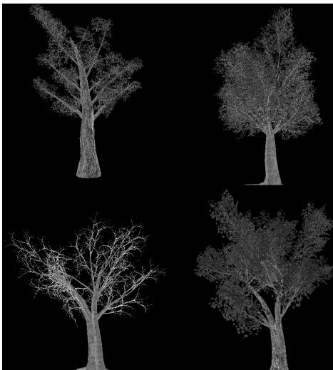


Figure 12.7. Tree billboard images.


# 12.3.3 Loading Texture Arrays

The texture loading function DirectX::CreateDDSTextureFromFileEx that we have been using supports loading DDS files that store texture arrays. It is important to create a DDS file that contains a texture array. To do this, we use the texassemble tool provided by Microsoft at https://github.com/Microsoft/DirectXTex/wiki/ Texassemble. The following syntax shows how to create a texture array called treeArray.dds from four images: t0.dds, t1.dds, t2.dds, and t3.dds. 

texassemble -array -o treeArray.dds t0.dds t1.dds t2.dds t2.dds 

Note that when building a texture array with texassemble, the input images should only have one mipmap level. After you have invoked texassemble to build the texture array, you can use texconv (https://github.com/Microsoft/DirectXTex/wiki/ Texconv) to generate mipmaps and change the pixel format if needed: 

texconv -m 10 -f BC3_UNORM treeArray.dds 

Alternatively, you can use the NVIDIA texture tools exporter application (https:// developer.nvidia.com/nvidia-texture-tools-exporter) that has a UI. 

# 12.3.4 Texture Subresources

Now that we have discussed texture arrays, we can talk about subresources. Figure  12.8 shows an example of a texture array with several textures. In turn, each texture has its own mipmap chain. The Direct3D API uses the term array slice to refer to an element in a texture along with its complete mipmap chain. The Direct3D API uses the term mip slice to refer to all the mipmaps at a particular level in the texture array. A subresource refers to a single mipmap level in a texture array element. 

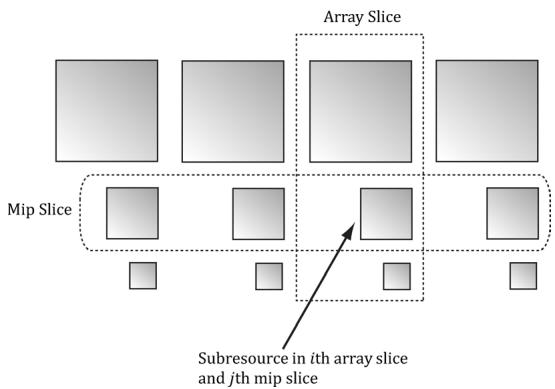


Figure 12.8. A texture array with four textures. Each texture has three mipmap levels.


Given the texture array index, and a mipmap level, we can access a subresource in a texture array. However, the subresources can also be labeled by a linear index; Direct3D uses a linear index ordered as shown in Figure 12.9. 

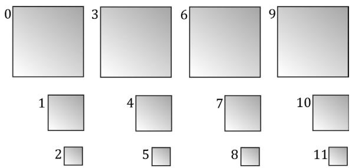


Figure 12.9. Subresources in a texture array labeled with a linear index.


The following utility function is used to compute the linear subresource index given the mip level, array index, and the number of mipmap levels: 

```txt
inline UINT D3D12CalcSubresource( UINT MipSlice, UINT ArraySlice,  
    UINT PlaneSlice, UINT MipLevels, UINT ArraySize)  
{  
    return MipSlice + ArraySlice * MipLevels + PlaneSlice * MipLevels *  
    ArraySize;  
} 
```

1. Assuming we are not using the tessellation stages, the geometry shader stage is an optional stage that sits between the vertex and pixel shader stages. The geometry shader is invoked for each primitive sent through the input assembler. The geometry shader can output zero, one, or more primitives. The output primitive type may be different from the input primitive type. The vertices of the output primitives should be transformed to homogeneous clip space before leaving the geometry shader. The primitives output from the geometry shader next enter the rasterization stage of the rendering pipeline. Geometry shaders are programmed in effect files, side-by-side vertex and pixel shaders. 

2. The billboard technique is where a quad textured with an image of an object is used instead of a true 3D model of the object. For objects far away, the viewer cannot tell a billboard is being used. The advantage of billboards is that the GPU does not have to waste processing time rendering a full 3D object, when a textured quad will suffice. This technique can be useful for rendering forests of trees, where true 3D geometry is used for trees near the camera, and billboards are used for trees in the distance. In order for the billboard trick to work, the billboard must always face the camera. The billboard technique can be implemented efficiently in a geometry shader. 

3. A special parameter of type uint and semantic SV_PrimitiveID can be added to the parameter list of a geometry shader as the following example shows: 

```txt
[maxvertexcount(4)]  
void GS(point VertexOut gin[1], uint primID: SV_PrimitiveID, inout TriangleStream<GeoOut> triStream); 
```

When this semantic is specified, it tells the input assembler stage to automatically generate a primitive ID for each primitive. When a draw call is executed to draw n primitives, the first primitive is labeled 0; the second primitive is labeled 1; and so on, until the last primitive in the draw call is labeled n-1. If a geometry shader is not present, the primitive ID parameter can be added to the parameter list of the pixel shader. However, if a geometry shader is present, then the primitive ID parameter must occur in the geometry shader signature. Then the geometry shader can use the primitive ID or pass it on to the pixel shader stage (or both). 

4. The input assembler stage can generate a vertex ID. To do this, add an additional parameter of type uint to the vertex shader signature with 

semantic SV_VertexID. For a Draw call, the vertices in the draw call will be labeled with IDs from 0, 1, …, n-1, where n is the number of vertices in the draw call. For a DrawIndexed call, the vertex IDs correspond to the vertex index values. 

5. A texture array stores an array of textures. In $\mathrm { C } { + + }$ code, a texture array is represented by the ID3D12Resource interface just like all resources are (textures and buffers). When creating an ID3D12Resource object, there is a property called DepthOrArraySize that can be set to specify the number of texture elements the texture stores (or the depth for a 3D texture). In HLSL, a texture array is represented by the Texture2DArray type. When using a texture array, three texture coordinates are required. The first two texture coordinates are the usual 2D texture coordinates; the third texture coordinate is an index into the texture array. For example, 0 is the index to the first texture in the array, 1 is the index to the second texture in the array, 2 is the index to the third texture in the array, and so on. One of the advantages with texture arrays is that we were able to draw a collection of primitives, with different textures, in one draw call. Each primitive will have an index into the texture array which indicates which texture to apply to the primitive. 

# 12.5 EXERCISES

1. Consider a circle, drawn with a line strip, in the $_ { x z }$ -plane. Expand the line strip into a cylinder with no caps using the geometry shader. 

2. An icosahedron is a rough approximation of a sphere. By subdividing each triangle (Figure 12.10), and projecting the new vertices onto the sphere, a better approximation is obtained. (Projecting a vertex onto a unit sphere simply amounts to normalizing the position vector, as the heads of all unit vectors coincide with the surface of the unit sphere.) For this exercise, build and render an icosahedron. Use a geometry shader to subdivide the icosahedron based on its distance $d$ from the camera. For example, if $d < 1 5$ , then subdivide the original icosahedron twice; if $1 5 \leq d < 3 0$ , then subdivide the original icosahedron once; if $d \geq 3 0$ , then just render the original icosahedron. The idea of this is to only use a high number of polygons if the object is close to the camera; if the object is far away, then a coarser mesh will suffice, and we need not waste GPU power processing more polygons than needed. Figure 12.10 shows the three LOD levels side-by-side in wireframe and solid (lit) mode. Refer back to $\ S 7 . 4 . 3$ for a discussion on tessellating an icosahedron. 

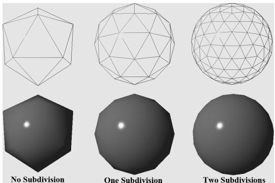


Figure 12.10. Subdivision of an icosahedron with vertices projected onto the unit sphere.


3. A simple explosion effect can be simulated by translating triangles in the direction of their face normal as a function of time. This simulation can be implemented in a geometry shader. For each triangle input into the geometry shader, the geometry shader computes the face normal n, and then translates the three triangle vertices, $\mathbf { p } _ { 0 } , \mathbf { p } _ { 1 } ,$ and $\mathbf { p } _ { 2 } ,$ in the direction n based on the time $t$ since the explosion started: 

$$
\mathbf {p} _ {i} ^ {\prime} = \mathbf {p} _ {i} + t \mathbf {n} \quad \text {f o r} \quad i = 0, 1, 2
$$

The face normal n need not be unit length, and can be scaled accordingly to control the speed of the explosion. One could even make the scale depend on the primitive ID, so that each primitive travels at a different speed. Use an icosahedron (not subdivided) as a sample mesh for implementing this effect. 

4. It can be useful for debugging to visualize the vertex normals of a mesh. Write an effect that renders the vertex normals of a mesh as short line segments. To do this, implement a geometry shader that inputs the point primitives of the mesh (i.e., its vertices with topology D3D_PRIMITIVE_TOPOLOGY_POINTLIST), so that each vertex gets pumped through the geometry shader. Now the geometry shader can expand each point into a line segment of some length L. If the vertex has position p and normal n, then the two endpoints of the line segment representing the vertex normal are p and $\mathbf { p } + L \mathbf { n }$ . After this is implemented, draw the mesh as normal, and then draw the scene again with the normal vector visualization technique so that the normals are rendered on top of the scene. Use the “Blend” demo as a test scene. 

5. Similar to the previous exercise, write an effect that renders the face normals of a mesh as short line segments. For this effect, the geometry shader will input a triangle, calculate its normal, and output a line segment. 