# Chapter

# 14 The Tessell ation Stages

The tessellation stages refer to three stages in the rendering pipeline involved in tessellating geometry. Simply put, tessellation refers to subdividing geometry into smaller triangles and then offsetting the newly generated vertices in some way. The motivation to increase the triangle count is to add detail to the mesh. But why not just create a detailed high-poly mesh to start with and be done? Below are three reasons for tessellation. 

1. Dynamic LOD on the GPU. We can dynamically adjust the detail of a mesh based on its distance from the camera and other factors. For example, if a mesh is very far away, it would be wasteful to render a high-poly version of it, as we would not be able to see all that detail anyway. As the object gets closer to the camera, we can continuously increase tessellation to increase the detail of the object. 

2. Physics and animation efficiency. We can perform physics and animation calculations on the low-poly mesh, and then tessellate to the higher polygon version. This saves computation power by performing the physics and animation calculations at a lower frequency. 

3. Memory savings. We can store lower polygon meshes in memory (on disk, RAM, and VRAM), and then have the GPU tessellate to the higher polygon version on the fly. 

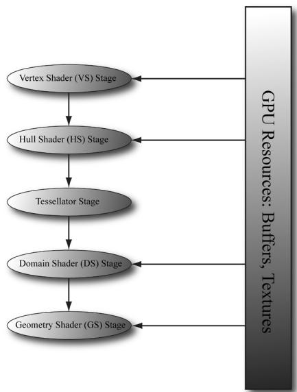


Figure 14.1. A subset of the rendering pipeline showing the tessellation stages.


Figure 14.1 shows that the tessellation stages sit between the vertex shader and geometry shader. These stages are optional, as we have not been using them in this book so far. 

# Chapter Objectives:

1. To discover the patch primitive types used for tessellation. 

2. To obtain an understanding of what each tessellation stage does, and what the expected inputs and outputs are for each stage. 

3. To be able to tessellate geometry by writing hull and domain shader programs. 

4. To become familiar with different strategies for determining when to tessellate and to become familiar with performance considerations regarding hardware tessellation. 

5. To learn the mathematics of Bézier curves and surfaces and how to implement them in the tessellation stages. 

# 14.1 TESSELLATION PRIMITIVE TYPES

When we render for tessellation, we do not submit triangles to the IA stage. Instead, we submit patches with a number of control points. Direct3D supports 

patches with 1-32 control points, and these are described by the following primitive types: 

D3D_PRIMITIVE_TOPOLOGY_1_CONTROL_POINT PatchLIST $= 33$ D3D_PRIMITIVE_TOPOLOGY_2_CONTROL_POINT_PATCHLIST $= 34$ D3D_PRIMITIVE_TOPOLOGY_3_CONTROL_POINT_PATCHLIST $= 35$ D3D_PRIMITIVE_TOPOLOGY_4_CONTROL_POINT_PATCHLIST $= 36$ .   
.   
.   
D3D_PRIMITIVE_TOPOLOGY_31_CONTROL_POINT_PATCHLIST $= 63$ D3D_PRIMITIVE_TOPOLOGY_32_CONTROL_POINT_PATCHLIST $= 64$ 

A triangle can be thought of a triangle patch with three control points (D3D_ PRIMITIVE_3_CONTROL_POINT_PATCH), so you can still submit your usual triangle meshes to be tessellated. A simple quad patch can be submitted with four control points (D3D_PRIMITIVE_4_CONTROL_POINT_PATCH). These patches are eventually tessellated into triangles by the tessellation stages. 


```cpp
When passing control point primitive types to ID3D12GraphicsCommandList::I ASetPrimitiveTopology, you need to set the D3D12(Graphics_PIPELINE_STATE_ DESC::PrimitiveTopologyType field to D3D12_PRIMITIVE_TOPOLOGY_TYPE_ PATCH: 
```

```javascript
opaquePsoDesc.PrimitiveTopologyType = D3D12_PRIMITIVE_TOPOLOGY_TYPEPatch; 
```

So what about the patches with a higher number of control points? The idea of control points comes from the construction of certain kinds of mathematical curves and surfaces. If you have ever worked with Bézier curves in a drawing program like Adobe Illustrator, then you know that you mold the shape of the curve via control points. The mathematics of Bézier curves can be generalized to Bézier surfaces. For example, you can create a Bézier quad patch that uses nine control points to shape it or sixteen control points; increasing the number of control points gives you more degrees of freedom in shaping the patch. So the motivation for all these control type primitives is to provide support for these kinds of curved surfaces. We give an explanation and demo of Bézier quad patches in this chapter. 

# 14.1.1 Tessellation and the Vertex Shader

Because we submit patch control points to the rendering pipeline, the control points are what get pumped through the vertex shader. Thus, when tessellation is enabled, the vertex shader is really a “vertex shader for control points,” and we can do any control point work we need before tessellation starts. Typically, animation or physics calculations are done in the vertex shader at the lower frequency before the geometry is tessellated. 

# 14.2 THE HULL SHADER

In the following subsections, we explore the hull shader, which actually consists of two shaders: 

1. Constant Hull Shader 

2. Control Point Hull Shader 

# 14.2.1 Constant Hull Shader

This constant hull shader is evaluated per patch, and is tasked with outputting the so-called tessellation factors of the mesh. The tessellation factors instruct the tessellation stage how much to tessellate the patch. Here is an example of a quad patch with four control points, where we tessellate it uniformly three times. 

```txt
struct PatchTess
{
    float EdgeTess[4] : SV_TessFactor;
    float InsideTess[2] : SV_InsideTessFactor;
    // Additional info you want associated per patch.
};
PatchTess ConstantHS(InputPatch<vertexOut, 4> patch, uint patchID : SV_PrimitiveID)
{
    PatchTess pt;
    // Uniformly tessellate the patch 3 times.
    pt-edgeTess[0] = 3; // Left edge
    pt-edgeTess[1] = 3; // Top edge
    pt-edgeTess[2] = 3; // Right edge
    pt-edgeTess[3] = 3; // Bottom edge
    pt.InsiderTess[0] = 3; // u-axis (columns)
    pt.InsiderTess[1] = 3; // v-axis (rows)
    return pt;
} 
```

The constant hull shader inputs all the control points of the patch, which is defined by the type InputPatch<VertexOut, $4 >$ . Recall that the control points are first pumped through the vertex shader, so their type is determined by the output type of the vertex shader VertexOut. In this example, our patch has four control points, so we specify 4 for the second template parameter of InputPatch. The system also provides a patch ID value via the SV_PrimitiveID semantic that can be used if needed; the ID uniquely identifies the patches in a draw call. The constant 

hull shader must output the tessellation factors; the tessellation factors depend on the topology of the patch. 


Besides the tessellation factors (SV_TessFactor and SV_InsideTessFactor), you can output other patch information from the constant hull shader. The domain shader receives the output from the constant hull shader as input, and could make use of this extra patch information. 

Tessellating a quad patch consists of two parts: 

1. Four edge tessellation factors control how much to tessellate along each edge. 

2. Two interior tessellation factors indicate how to tessellate the quad patch (one tessellation factor for the horizontal dimension of the quad, and one tessellation factor for the vertical dimension of the quad). 

Figure 14.2 shows examples of different quad patch configurations we can get when the tessellation factors are not the same. Study these figures until you are comfortable with how the edge and interior tessellation factors work. 

Tessellating a triangle patch also consists of two parts: 

1. Three edge tessellation factors control how much to tessellate along each edge. 

2. One interior tessellation factor indicates how much to tessellate the triangle patch. 

Figure 14.3 shows examples of different triangle patch configurations we can get when the tessellation factors are not the same. 

The maximum tessellation factor supported by Direct3D is 64. If all the tessellation factors are zero, the patch is rejected from further processing. This allows us to implement optimizations such as frustum culling and backface culling on a per patch basis. 

1. If a patch is not visible by the frustum, then we can reject the patch from further processing (if we did tessellate it, the tessellated triangles would be rejected during triangle clipping). 

2. If a patch is backfacing, then we can reject the patch from further processing (if we did tessellate it, the tessellated triangles would be rejected in the backface culling part of rasterization). 

A natural question to ask is how much should you tessellate. So remember that the basic idea of tessellation is to add detail to your meshes. However, we do not want to unnecessarily add details if they cannot be appreciated by the user. The following are some common metrics used to determine the amount to tessellate: 

1. Distance from the camera: The further an object is from the eye, the less we will notice fine details; therefore, we can render a low-poly version of the object when it is far away, and tessellate more as it gets closer to the eye. 

2. Screen area coverage: We can estimate the number of pixels an object covers on the screen. If this number is small, then we can render a low-poly version of the object. As its screen area coverage increases, we can tessellate more. 

3. Orientation: The orientation of the triangle with respect to the eye is taken into consideration with the idea that triangles along silhouette edges will be more refined than other triangles. 

4. Roughness: Rough surfaces with lots of details will need more tessellation than smooth surfaces. A roughness value can be precomputed by examining the surface textures, which can be used to decide how much to tessellate. 

[Story10] gives the following performance advice: 

1. If the tessellation factors are 1 (which basically means we are not really tessellating), consider rendering the patch without tessellation, as we will be wasting GPU overhead going through the tessellation stages when they are not doing anything. 

2. For performance reasons related to GPU implementations, do not tessellate such that the triangles are so small they cover less than eight pixels. 

3. Batch draw calls that use tessellation (i.e., turning tessellation on and off between draw calls is expensive). 

# 14.2.2 Control Point Hull Shader

The control point hull shader inputs a number of control points and outputs a number of control points. The control point hull shader is invoked once per control point output. One application of the hull shader is to change surface representations, say from an ordinary triangle (submitted to the pipeline with three control points) to a cubic Bézier triangle patch (a patch with ten control points). For example, suppose your mesh is modeled as usual by triangles (three control points); you can use the hull shader to augment the triangle to a higher order cubic Bézier triangle patch with 10 control points, then detail can be added with the additional control points and the triangle patch tessellated to the desired amount. This strategy is the so-called N-patches scheme or PN triangles scheme [Vlachos01]; it is convenient because it uses tessellation to improve existing triangle meshes with no modification to the art pipeline. For our first demo, it will be a simple pass-through shader, where we just pass the control point through unmodified. 

Drivers can detect and optimize pass-through shaders [Bilodeau10b]. 

```txt
struct HullOut
{
    float3 PosL: POSITION;
};
[domain("quad")] [partitioning("integer")] [outputtopology("triangle_cw")] [outputcontrolpoints(4)];
[patchconstantfunc("ConstantHS")] [maxtessfactor(64.0f)];
HullOut HS(InputPatch<VertexOut, 4> p, uint i: SV_OutputControlPointID, uint patchId: SV_PrimitiveID)
{
    HullOut hout;
    hout(PosL = p[i].PosL;
    return hout;
} 
```

The hull shader inputs all of the control points of the patch via the InputPatch parameter. The system value SV_OutputControlPointID gives an index identifying the output control point the hull shader is working on. Note that the input patch control point count does not need to match the output control point count; for example, the input patch could have 4 control points and the output patch could have sixteen control points; the additional control points could be derived from the four input control points. 

The control point hull shader introduces a number of attributes: 

1. domain: The patch type. Valid arguments are tri, quad, or isoline. 

2. partitioning: Specifies the subdivision mode of the tessellation. 

a. integer: New vertices are added/removed only at integer tessellation factor values. The fractional part of a tessellation factor is ignored. This creates a noticeable “popping” when a mesh changes is tessellation level. 

b. Fractional tessellation (fractional_even/fractional_odd): New vertices are added/removed at integer tessellation factor values, but “slide” in gradually based on the fractional part of the tessellation factor. This is useful when you want to smoothly transition from a coarser version of the mesh to a finer version through tessellation, rather than abruptly at integer steps. The difference between integer and fractional tessellation is best understood by an animation, so the exercises at the end of this chapter will have you experiment to see the difference first hand. 

3. outputtopology: The winding order of the triangles created via subdivision. 

a. triangle_cw: clockwise winding order. 

b. triangle_ccw: counterclockwise winding order. 

c. line: For line tessellation. 

4. outputcontrolpoints: The number of times the hull shader executes, outputting one control point each time. The system value SV_OutputControlPointID gives an index identifying the output control point the hull shader is working on. 

5. patchconstantfunc: A string specifying the constant hull shader function name. 

6. maxtessfactor: A hint to the driver specifying the maximum tessellation factor your shader uses. This can potentially enable optimizations by the hardware if it knows this upper bound, as it will know how much resources are needed for the tessellation. The maximum tessellation factor supported by Direct3D 11 hardware is 64. 

# 14.3 THE TESSELLATION STAGE

As programmers, we do not have control of the tessellation stage. This stage is all done by the hardware, and tessellates the patches based on the tessellation factors output from the constant hull shader program. The following figures illustrate different subdivisions based on the tessellation factors. 

# 14.3.1 Quad Patch Tessellation Examples

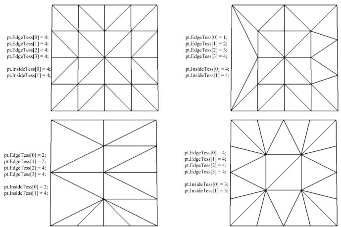


Figure 14.2. Quad subdivisions based on edge and interior tessellation factors.


# 14.3.2 Triangle Patch Tessellation Examples

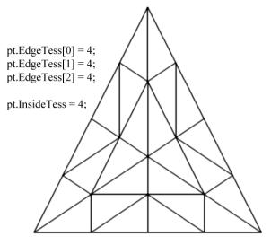


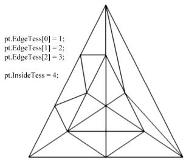


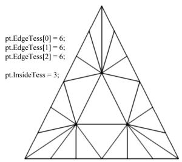


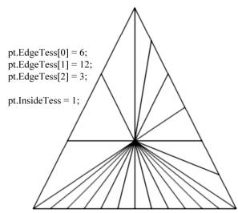


Figure 14.3. Triangle subdivisions based on edge and interior tessellation factors.


# 14.4 THE DOMAIN SHADER

The tessellation stage outputs all of our newly created vertices and triangles. The domain shader is invoked for each vertex created by the tessellation stage. With tessellation enabled, whereas the vertex shader acts as a vertex shader for each control point, the hull shader is essentially the vertex shader for the tessellated patch. In particular, it is here that we project the vertices of the tessellated patch to homogeneous clip space. 

For a quad patch, the domain shader inputs the tessellation factors (and any other per patch information you output from the constant hull shader), the parametric $( u , \nu )$ coordinates of the tessellated vertex positions, and all the patch control points output from the control point hull shader. Note that the domain shader does not give you the actual tessellated vertex positions; instead it gives you the parametric $( u , \nu )$ coordinates (Figure 14.4) of these points in the patch domain space. It is up to you to use these parametric coordinates and the control points to derive the actual 3D vertex positions; in the code below, we do this via bilinear interpolation (which works just like texture linear filtering). 

```txt
struct DomainOut
{
    float4 PosH: SV POSITION;
}; 
```

```txt
// The domain shader is called for every vertex created by  
// the tessellator. It is like the vertex shader after tessellation.  
domain("quad")]  
DomainOut DS(PatchTess patchTess, float2 uv: SV_DomainLocation, const OutputPatch<HullOut, 4> quad)  
{ DomainOut dout; // Bilinear interpolation. float3 v1 = lerp(quad[0].PosL, quad[1].PosL, uv.x); float3 v2 = lerp(quad[2].PosL, quad[3].PosL, uv.x); float3 p = lerp(v1, v2, uv.y); float4 posW = mul(float4(p, 1.0f), gWorld); dout(PosH = mul(posW, gViewProj); return dout; } 
```

Note: 

As shown in Figure 14.4, the ordering of the quad patch control points is rowby-row. 

The domain shader for a triangle patch is similar, except that instead of the parametric $( u , \nu )$ values being input, the float3 barycentric $( u , \nu , w )$ coordinates of the vertex are input (see $\ S { \bf C } . 3 $ ) for an explanation of barycentric coordinates. The reason for outputting barycentric coordinates for triangle patches is probably due to the fact that Bézier triangle patches are defined in terms of barycentric coordinates. 

# 14.5 TESSELLATING A QUAD

For our one of the demos in this chapter, we submit a quad patch to the rendering pipeline, tessellate it based on the distance from the camera, and displace the 

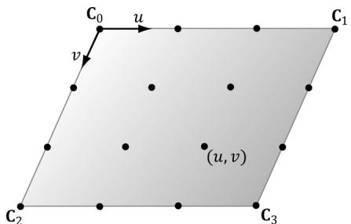


Figure 14.4. The tessellation of a quad patch with 4 control points generating 16 vertices in the normalized uv-space, with coordinates in [0,1]2 .


generated vertices by a mathematic function that is similar to the one we have been using for this “hills” in our past demos. 

Our vertex buffer storing the four control points is created like so: 

```cpp
std::unique_ptr<MeshGeometry> BasicTessellationApp::BuildQuadPatchGeometry()   
{ std::array<XMFLOAT3, 4> vertices = { XMFLOAT3(-10.0f, 0.0f, +10.0f), XMFLOAT3(+10.0f, 0.0f, +10.0f), XMFLOAT3(-10.0f, 0.0f, -10.0f), XMFLOAT3(+10.0f, 0.0f, -10.0f) }; std::array<uint16_t, 4> indices = { 0, 1, 2, 3 }; const UINT vbByteSize = (UINT)vertices.size() * sizeof(XMFLOAT3); const UINT ibByteSize = (UINT)indices.size() * sizeof( uint16_t); auto geo = std::make_unique<MeshGeometry>(); geo->Name = "quadpatchGeo"; geo->VertexBufferCPU.resize(vbByteSize); CopyMemory(geo->VertexBufferCPU.data(), vertices.data(), vbByteSize); geo->IndexBufferCPU.resize(ibByteSize); CopyMemory(geo->IndexBufferCPU.data(), indices.data(), ibByteSize); CreateStaticBuffer (md3dDevice.Get(), *mUploadBatch, vertices.data(), vertices.size(), sizeof(XMFLOAT3), D3D12Resource_STATEvertex_and_constant_buffer, &geo->VertexBufferGPU); CreateStaticBuffer (md3dDevice.Get(), *mUploadBatch, indices.data(), indices.size(), sizeof uint16_t), D3D12Resource_STATE_INDEX_buffer, &geo->IndexBufferGPU); geo->VertexByteStride = sizeof(XMFLOAT3); geo->VertexBufferByteSize = vbByteSize; geo->IndexFormat = DXGI_FORMAT_R16_UID; geo->IndexBufferByteSize = ibByteSize; SubmeshGeometry quadSubmesh; quadSubmesh.IndexCount = 4; quadSubmesh.StartIndexLocation = 0; quadSubmesh.BaseVertexLocation = 0; quadSubmeshVertexCount = (UINT)vertices.size(); quadSubmesh.Bounds = BoundingBox(XMFLOAT3(0.0f, 0.0f, 0.0f), 
```

```txt
XMFLOAT3(10.0f, 10.0f, 10.0f)); geo->DrawArgs["quadpatch"] = quadSubmesh; return geo; 
```


Our render-item for the quad patch is created as follows:


void BasicTessellationApp::Add:NOtem (   
RenderLayer layer,   
const DirectX::XMFLOAT4X4& world,   
const XMFLOAT4X4& texTransform,   
Material\* mat,   
MeshGeometry\* geo,   
SubmeshGeometry& drawArgs,   
D3D_PRIMITIVE_TOPOLOGY primType)   
{ auto rItem $=$ std::make_unique<MenuItem>(); rItem->World $=$ world;   
rItem->TexTransform $=$ texTransform;   
rItem->Mat $=$ mat;   
rItem->Geo $=$ geo;   
rItem->PrimitiveType $=$ primType;   
rItem->IndexCount $=$ drawArgs.IndexCount;   
rItem->StartIndexLocation $=$ drawArgs.StartIndexLocation;   
rItem->BaseVertexLocation $=$ drawArgs.BaseVertexLocation;   
mRItemLayer[(int)layer].push_back(rItem.get());   
mAllRItems.push_back(std::move(rItem));   
}   
void BasicTessellationApp::BuildItems()   
{ MaterialLib& matLib $=$ MaterialLib::GetLib();   
XMFLOAT4X4 worldTransform $=$ MathHelper::Identity4x4();   
XMFLOAT4X4 texTransform $=$ MathHelper::Identity4x4();   
Add:NOtem(   
RenderLayer::OpaqueTess,   
worldTransform,   
texTransform,   
matLib["whiteMat"],   
mGeometries["quadpatchGeo"].get(),   
mGeometries["quadpatchGeo"]->DrawArgs["quadpatch"], D3D_PRIMITIVE_TOPOLOGY_4_CONTROL_POINT_PATCHLIST);   
} 

We will now turn attention to the hull shader. The hull shader is similar to what we showed in $\ S 1 4 . 2 . 1$ and $\ S 1 4 . 2 . 2$ , except that we now determine the tessellation factors based on the distance from the eye. The idea behind this is to use a lowpoly mesh in the distance, and increase the tessellation (and hence triangle count) as the mesh approaches the eye (see Figure 14.5). The hull shader is simply a passthrough shader. 

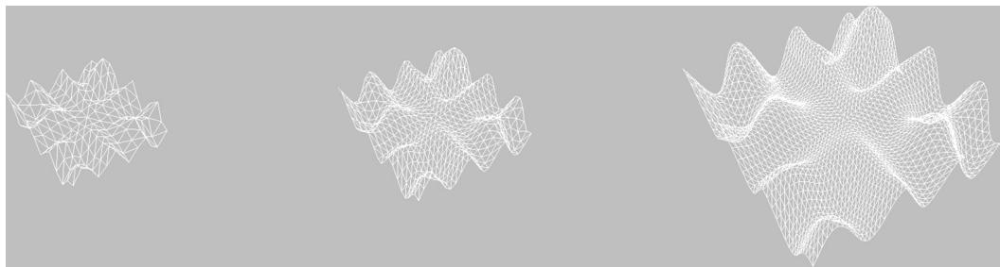


Figure 14.5. The mesh is tessellated more as the distance to the eye decreases.


```txt
struct VertexIn
{
    float3 PosL : POSITION;
};
struct VertexOut
{
    float3 PosL : POSITION;
};
VertexOut VS(VertexIn vin)
{
    VertexOut vout;
    vout(PosL = vin(PosL);
    return vout;
}
struct PatchTess
{
    float EdgeTess[4] : SV_TessFactor;
    float InsideTess[2] : SV_InsideTessFactor;
};
PatchTess ConstantHS(InputPatch<vertex out, 4> patch, uint patchID : SV_PrimitiveID)
{
    PatchTess pt;
    float3 centerL = 0.25f*(patch[0].PosL + patch[1].PosL + patch[2].PosL + patch[3].PosL);
    float3 centerW = mul(float4(centerL, 1.0f), gWorld).xyz;
    float d = distance(centerW, gEyePosW);
    // Tessellate the patch based on distance from the eye such that // the tessellation is 0 if d >= d1 and 64 if d <= d0. The interval // [d0, d1] defines the range we tessellate in.
    const float d0 = 20.0f;
    const float d1 = 100.0f;
}; 
```

float tess $= 64.0f^{\star}$ saturate( $(\mathrm{d}1 - \mathrm{d}) / (\mathrm{d}1 - \mathrm{d}0)$ ); //Uniformly tessellate the patch. pt.EdgTess[0] $=$ tess; pt.EdgTess[1] $=$ tess; pt.EdgTess[2] $=$ tess; pt.EdgTess[3] $=$ tess; pt.InsiderTess[0] $=$ tess; pt.InsiderTess[1] $=$ tess; return pt;   
}   
struct HullOut { float3 PosL:POSITION;   
};   
[domain("quad")] [partitioning("integer")] [outputtopology("triangle_cw")] [outputcontrolpoints(4)] [patchconstantfunc("ConstantHS")] [maxtessfactor(64.0f)] HullOut HS(InputPatch<VertexOut,4> p, uint i:SV_OutputControlPointID, uint patchId:SV_PrimitiveID)   
{ HullOut hout; hout(PosL $=$ p[i].PosL; return hout; 

Simply tessellating is not enough to add detail, as the new triangles just lie on the patch that was subdivided. We must offset those extra vertices in some way to better approximate the shape of the object we are modeling. This is done in the domain shader. In this demo, we offset the y-coordinates by the “hills” function we introduced in $\ S 6 . 1 1$ . 

```txt
struct DomainOut
{
    float4 PosH:SV_POSITION;
};
// The domain shader is called for every vertex created by
// the tessellator. It is like the vertex shader after tessellation.
[domain("quad")] DomainOut DS(PatchTess patchTess, float2 uv:SV_DomainLocation, const OutputPatch<HullOut, 4> quad) 
```

{ DomainOut dout; //Bilinear interpolation. float3 v1 $=$ lerp(quad[0].PosL, quad[1].PosL, uv.x); float3 v2 $=$ lerp(quad[2].PosL, quad[3].PosL, uv.x); float3 p $=$ lerp(v1, v2, uv.y); // Displacement mapping $\mathrm{p.y} = 0.3\mathrm{f}^{\star}$ (p.z\*sin(p.x) $^+$ p.x\*cos(p.z)); float4 posW $=$ mul(float4(p, 1.0f), gWorld); dout_PosH $=$ mul(posW, qViewProj); return dout;   
}   
float4 PS(DomainOut pin): SV_Target   
{ return float4(1.0f, 1.0f, 1.0f, 1.0f); 

# 14.6 CUBIC BÉZIER QUAD PATCHES

In this section, we describe cubic Bézier quad patches to show how surfaces are constructed via a higher number of control points. Before we get to surfaces, however, it helps to first start with Bézier curves. 

# 14.6.1 Bézier Curves

Consider three noncollinear points $\mathbf { p } _ { 0 } , \mathbf { p } _ { 1 } ,$ and ${ \bf p } _ { 2 }$ which we will call the control points. These three control points define a Bézier curve in the following way. A point $\mathbf { p } ( t )$ on the curve is first found by linearly interpolating between $\mathbf { p } _ { 0 }$ and $\mathbf { p } _ { 1 }$ by $t _ { : }$ , and $\mathbf { p } _ { 1 }$ and ${ \bf p } _ { 2 }$ by $t$ to get the intermediate points: 

$$
\mathbf {p} _ {0} ^ {1} = (1 - t) \mathbf {p} _ {0} + t \mathbf {p} _ {1}
$$

$$
\mathbf {p} _ {1} ^ {1} = (1 - t) \mathbf {p} _ {1} + t \mathbf {p} _ {2}
$$

Then $\mathbf { p } ( t )$ is found by linearly interpolating between $\mathbf { p } _ { 0 } ^ { 1 }$ and $\mathbf { p } _ { 1 } ^ { 1 }$ by $t { \mathrm { : } }$ : 

$$
\begin{array}{l} \mathbf {p} (t) = (1 - t) \mathbf {p} _ {0} ^ {1} + t \mathbf {p} _ {1} ^ {1} \\ = (1 - t) \left((1 - t) \mathbf {p} _ {0} + t \mathbf {p} _ {1}\right) + t \left((1 - t) \mathbf {p} _ {1} + t \mathbf {p} _ {2}\right) \\ = (1 - t) ^ {2} \mathbf {p} _ {0} + 2 (1 - t) t \mathbf {p} _ {1} + t ^ {2} \mathbf {p} _ {2} \\ \end{array}
$$

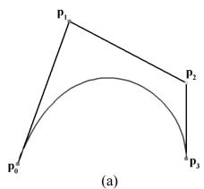


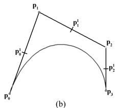


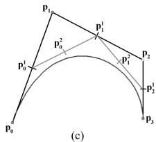


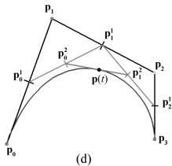


Figure 14.6. Repeated linear interpolation defined points on the cubic Bézier curve. The figure uses $t = 0 . 5$ . (a) The four control points and the curve they define. (b) Linearly interpolate between the control points to calculate the first generation of intermediate points. (c) Linearly interpolate between the first generation intermediate points to get the second generation intermediate points. (d) Linearly interpolate between the second generation intermediate points to get the point on the curve.


In other words, this construction by repeated interpolation leads to the parametric formula for a quadratic (degree 2) Bézier curve: 

$$
\mathbf {p} (t) = (1 - t) ^ {2} \mathbf {p} _ {0} + 2 (1 - t) t \mathbf {p} _ {1} + t ^ {2} \mathbf {p} _ {2}
$$

In a similar manner, four control points $\mathbf { p } _ { 0 } , \mathbf { p } _ { 1 } , \mathbf { p } _ { 2 }$ and $\mathbf { p } _ { 3 }$ define a cubic (degree 3) Bézier curve, and a point $\mathbf { p } ( t )$ on the curve is found again by repeated interpolation. Figure 14.6 shows the situation. First linearly interpolate along each line segment the four given control points define to get three first generation intermediate points: 

$$
\mathbf {p} _ {0} ^ {1} = (1 - t) \mathbf {p} _ {0} + t \mathbf {p} _ {1}
$$

$$
\mathbf {p} _ {1} ^ {1} = (1 - t) \mathbf {p} _ {1} + t \mathbf {p} _ {2}
$$

$$
\mathbf {p} _ {2} ^ {1} = (1 - t) \mathbf {p} _ {2} + t \mathbf {p} _ {3}
$$

Next, linearly interpolate along each line segment these first generation intermediate points define to get two second generation intermediate points: 

$$
\begin{array}{l} \mathbf {p} _ {0} ^ {2} = (1 - t) \mathbf {p} _ {0} ^ {1} + t \mathbf {p} _ {1} ^ {1} \\ = (1 - t) ^ {2} \mathbf {p} _ {0} + 2 (1 - t) t \mathbf {p} _ {1} + t ^ {2} \mathbf {p} _ {2} \\ \end{array}
$$

$$
\begin{array}{l} \mathbf {p} _ {1} ^ {2} = (1 - t) \mathbf {p} _ {1} ^ {1} + t \mathbf {p} _ {2} ^ {1} \\ = (1 - t) ^ {2} \mathbf {p} _ {1} + 2 (1 - t) t \mathbf {p} _ {2} + t ^ {2} \mathbf {p} _ {3} \\ \end{array}
$$

Finally, $\mathbf { p } ( t )$ is found by linearly interpolating between these last generation intermediate points: 

$$
\begin{array}{l} \mathbf {p} (t) = (1 - t) \mathbf {p} _ {0} ^ {2} + t \mathbf {p} _ {1} ^ {2} \\ = (1 - t) ((1 - t) ^ {2} \mathbf {p} _ {0} + 2 (1 - t) t \mathbf {p} _ {1} + t ^ {2} \mathbf {p} _ {2}) + t ((1 - t) ^ {2} \mathbf {p} _ {1} + 2 (1 - t) t \mathbf {p} _ {2} + t ^ {2} \mathbf {p} _ {3}) \\ \end{array}
$$

which simplifies to the parametric formula for a cubic (degree 3) Bézier curve: 

$$
\mathbf {p} (t) = (1 - t) ^ {3} \mathbf {p} _ {0} + 3 t (1 - t) ^ {2} \mathbf {p} _ {1} + 3 t ^ {2} (1 - t) \mathbf {p} _ {2} + t ^ {3} \mathbf {p} _ {3} \tag {eq.14.1}
$$

Generally, people stop at cubic curves, as they give enough smoothness and degrees of freedom for controlling the curve, but you can keep going to higherorder curves with the same recursive pattern of repeated interpolation. 

It turns out, that the formula for Bézier curves of degree n can be written in terms of the Bernstein basis functions, which are defined by: 

$$
B _ {i} ^ {n} (t) = \frac {n !}{i ! (n - i) !} t ^ {i} (1 - t) ^ {n - i}
$$

For degree 3 curves, the Bernstein basis functions are: 

$$
\begin{array}{l} B _ {0} ^ {3} (t) = \frac {3 !}{0 ! (3 - 0) !} t ^ {0} (1 - t) ^ {3 - 0} = (1 - t) ^ {3} \\ B _ {1} ^ {3} (t) = \frac {3 !}{1 ! (3 - 1) !} t ^ {1} (1 - t) ^ {3 - 1} = 3 t (1 - t) ^ {2} \\ B _ {2} ^ {3} (t) = \frac {3 !}{2 ! (3 - 2) !} t ^ {2} (1 - t) ^ {3 - 2} = 3 t ^ {2} (1 - t) \\ B _ {3} ^ {3} (t) = \frac {3 !}{3 ! (3 - 3) !} t ^ {3} (1 - t) ^ {3 - 3} = t ^ {3} \\ \end{array}
$$

Compare these values to the factors in Equation 14.1. Therefore, we can write a cubic Bézier curve as: 

$$
\mathbf {p} (t) = \sum_ {j = 0} ^ {3} B _ {j} ^ {3} (t) \mathbf {p} _ {j} = B _ {0} ^ {3} (t) \mathbf {p} _ {0} + B _ {1} ^ {3} (t) \mathbf {p} _ {1} + B _ {2} ^ {3} (t) \mathbf {p} _ {2} + B _ {3} ^ {3} (t) \mathbf {p} _ {3}
$$

The derivatives of the cubic Bernstein basis functions can be found by application of the power and product rules: 

$$
\begin{array}{l} B _ {0} ^ {3 ^ {\prime}} (t) = - 3 (1 - t) ^ {2} \\ B _ {1} ^ {3 ^ {\prime}} (t) = 3 (1 - t) ^ {2} - 6 t (1 - t) \\ B _ {2} ^ {3 ^ {\prime}} (t) = 6 t (1 - t) - 3 t ^ {2} \\ B _ {3} ^ {3 ^ {\prime}} (t) = 3 t ^ {2} \\ \end{array}
$$

And the derivative of the cubic Bézier curve is: 

$$
\mathbf {p} ^ {\prime} (t) = \sum_ {j = 0} ^ {3} B _ {j} ^ {3 ^ {\prime}} (t) \mathbf {p} _ {j} = B _ {0} ^ {3 ^ {\prime}} (t) \mathbf {p} _ {0} + B _ {1} ^ {3 ^ {\prime}} (t) \mathbf {p} _ {1} + B _ {2} ^ {3 ^ {\prime}} (t) \mathbf {p} _ {2} + B _ {3} ^ {3 ^ {\prime}} (t) \mathbf {p} _ {3}
$$

Derivatives are useful for computing the tangent vector along the curve. 

# 14.6.2 Cubic Bézier Surfaces

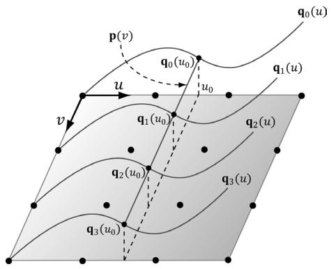


Figure 14.7. Constructing a Bézier surface. Some simplifications were made to make the figure easier to understand—the control points do not all lie in the plane, all the $\pmb { \mathsf { q } } _ { \mathrm { i } } ( u )$ need not be the same as the figure suggests (they would only be the same if the control points were the same for each row to give the same curves), and ${ \mathsf p } ( v )$ generally would not be a straight line but a cubic Bézier curve.


Refer to Figure 14.7 throughout this section. Consider a patch of $4 \times 4$ control points. Each row, therefore, contains 4 control points that can be used to define cubic Bézier curve; the Bézier curve of the ith row is given by: 

$$
\mathbf {q} _ {i} (u) = \sum_ {j = 0} ^ {3} B _ {j} ^ {3} (u) \mathbf {p} _ {i, j}
$$

If we evaluate each of these Bézier curves at say $u _ { 0 } ,$ then we get a “column” of 4 points, one along each curve. We can use these 4 points to define another Bézier curve that lies on the Bézier surface at $u _ { 0 }$ : 

$$
\mathbf {p} (v) = \sum_ {i = 0} ^ {3} B _ {i} ^ {3} (v) \mathbf {q} _ {i} \left(u _ {0}\right)
$$

Now, if we let u vary as well, we sweep out a family of cubic Bézier curves that form the cubic Bézier surface: 

$$
\begin{array}{l} \mathbf {p} (u, v) = \sum_ {i = 0} ^ {3} B _ {i} ^ {3} (v) \mathbf {q} _ {i} (u) \\ = \sum_ {i = 0} ^ {3} B _ {i} ^ {3} (\nu) \sum_ {j = 0} ^ {3} B _ {j} ^ {3} (u) \mathbf {p} _ {i, j} \\ \end{array}
$$

The partial derivatives of a Bézier surface are useful for computing tangent and normal vectors: 

$$
\frac {\partial \mathbf {p}}{\partial u} (u, v) = \sum_ {i = 0} ^ {3} B _ {i} ^ {3} (v) \sum_ {j = 0} ^ {3} \frac {\partial B _ {j} ^ {3}}{\partial u} (u) \mathbf {p} _ {i, j}
$$

$$
\frac {\partial \mathbf {p}}{\partial v} (u, v) = \sum_ {i = 0} ^ {3} \frac {\partial B _ {i} ^ {3}}{\partial v} (v) \sum_ {j = 0} ^ {3} B _ {j} ^ {3} (u) \mathbf {p} _ {i, j}
$$

# 14.6.3 Cubic Bézier Surface Evaluation Code

In this section, we give code to evaluate a cubic Bézier surface. To help understand the code that follows, we expand out the summation notation: 

$$
\mathbf {q} _ {0} (u) = B _ {0} ^ {3} (u) \mathbf {p} _ {0, 0} + B _ {1} ^ {3} (u) \mathbf {p} _ {0, 1} + B _ {2} ^ {3} (u) \mathbf {p} _ {0, 2} + B _ {3} ^ {3} (u) \mathbf {p} _ {0, 3}
$$

$$
\mathbf {q} _ {1} (u) = B _ {0} ^ {3} (u) \mathbf {p} _ {1, 0} + B _ {1} ^ {3} (u) \mathbf {p} _ {1, 1} + B _ {2} ^ {3} (u) \mathbf {p} _ {1, 2} + B _ {3} ^ {3} (u) \mathbf {p} _ {1, 3}
$$

$$
\mathbf {q} _ {2} (u) = B _ {0} ^ {3} (u) \mathbf {p} _ {2, 0} + B _ {1} ^ {3} (u) \mathbf {p} _ {2, 1} + B _ {2} ^ {3} (u) \mathbf {p} _ {2, 2} + B _ {3} ^ {3} (u) \mathbf {p} _ {2, 3}
$$

$$
\mathbf {q} _ {3} (u) = B _ {0} ^ {3} (u) \mathbf {p} _ {3, 0} + B _ {1} ^ {3} (u) \mathbf {p} _ {3, 1} + B _ {2} ^ {3} (u) \mathbf {p} _ {3, 2} + B _ {3} ^ {3} (u) \mathbf {p} _ {3, 3}
$$

$$
\begin{array}{l} \mathbf {p} (u, v) = B _ {0} ^ {3} (v) \mathbf {q} _ {0} (u) + B _ {1} ^ {3} (v) \mathbf {q} _ {1} (u) + B _ {2} ^ {3} (v) \mathbf {q} _ {2} (u) + B _ {3} ^ {3} (v) \mathbf {q} _ {3} (u) \\ = B _ {0} ^ {3} (\nu) \left[ B _ {0} ^ {3} (u) \mathbf {p} _ {0, 0} + B _ {1} ^ {3} (u) \mathbf {p} _ {0, 1} + B _ {2} ^ {3} (u) \mathbf {p} _ {0, 2} + B _ {3} ^ {3} (u) \mathbf {p} _ {0, 3} \right] \\ + B _ {1} ^ {3} (v) \left[ B _ {0} ^ {3} (u) \mathbf {p} _ {1, 0} + B _ {1} ^ {3} (u) \mathbf {p} _ {1, 1} + B _ {2} ^ {3} (u) \mathbf {p} _ {1, 2} + B _ {3} ^ {3} (u) \mathbf {p} _ {1, 3} \right] \\ + B _ {2} ^ {3} (\nu) \left[ B _ {0} ^ {3} (u) \mathbf {p} _ {2, 0} + B _ {1} ^ {3} (u) \mathbf {p} _ {2, 1} + B _ {2} ^ {3} (u) \mathbf {p} _ {2, 2} + B _ {3} ^ {3} (u) \mathbf {p} _ {2, 3} \right] \\ + B _ {3} ^ {3} (v) \left[ B _ {0} ^ {3} (u) \mathbf {p} _ {3, 0} + B _ {1} ^ {3} (u) \mathbf {p} _ {3, 1} + B _ {2} ^ {3} (u) \mathbf {p} _ {3, 2} + B _ {3} ^ {3} (u) \mathbf {p} _ {3, 3} \right] \\ \end{array}
$$

The code below maps directly to the formulas just given: 

float4 BernsteinBasis(float t)  
{ float invT = 1.0f - t; return float4( invT * invT * invT, // $B_0^3(t) = (1 - t)^3$ 3.0f * t * invT * invT, // $B_1^3(t) = 3t(1 - t)^2$ 3.0f * t * t * invT, // $B_2^3(t) = 3t^2(1 - t)$ t * t * t); // $B_3^3(t) = t^3$ }  
float4 dBernsteinBasis(float t)  
{ float invT = 1.0f - t; return float4( -3 * invT * invT, // $B_0^{3'}(t) = -3(1 - t)^2$ 3 * invT * invT - 6 * t * invT, // $B_1^{3'}(t) = 3(1 - t)^2 - 6t(1 - t)$ 6 * t * invT - 3 * t * t, // $B_2^{3'}(t) = 6t(1 - t) - 3t^2$ 3 * t * t); // $B_3^{3'}(t) = 3t^2$ } 

```txt
float3 CubicBezierSum(const OutputPatch<HullOut, 16> bezpatch, float4 basisU, float4 basisV)  
{  
float3 sum = float3(0.0f, 0.0f, 0.0f);  
sum = basisV.x * (basisU.x*bezpatch[0].PosL + basisU.y*bezpatch[1].PosL + basisU.z*bezpatch[2].PosL + basisU.w*bezpatch[3].PosL);  
sum += basisV.y * (basisU.x*bezpatch[4].PosL + basisU.y*bezpatch[5].PosL + basisU.z*bezpatch[6].PosL + basisU.w*bezpatch[7].PosL);  
sum += basisV.z * (basisU.x*bezpatch[8].PosL + basisU.y*bezpatch[9].PosL + basisU.z*bezpatch[10].PosL + basisU.w*bezpatch[11].PosL);  
sum += basisV.w * (basisU.x*bezpatch[12].PosL + basisU.y*bezpatch[13].PosL + basisU.z*bezpatch[14].PosL + basisU.w*bezpatch[15].PosL);  
return sum;  
} 
```

The above functions can be utilized like so to evaluate $\pmb { \mathrm { p } } ( u , \nu )$ and compute the partial derivatives: 

float4 basisU = BernsteinBasis(uv.x);  
float4 basisV = BernsteinBasis(uv.y);  
// p(u,v)  
float3 p = CubicBezierSum(bezPatch, basisU, basisV);  
float4 dBasisU = dBernsteinBasis(uv.x);  
float4 dBasisV = dBernsteinBasis(uv.y);  
// $\frac{\partial\mathbf{p}}{\partial u} (u,v)$ float3 dpdu = CubicBezierSum(bezPatch, dbsisU, basisV);  
// $\frac{\partial\mathbf{p}}{\partial v} (u,v)$ float3 dpdv = CubicBezierSum(bezPatch, basisU, dbsisV); 

Observe that we pass the evaluated basis function values to CubicBezierSum. This enables us to use CubicBezierSum for evaluating both $\pmb { \mathrm { p } } ( u , \nu )$ and the partial derivatives, as the summation form is the same, the only differencing being the basis functions. 

# 14.6.4 Defining the Patch Geometry

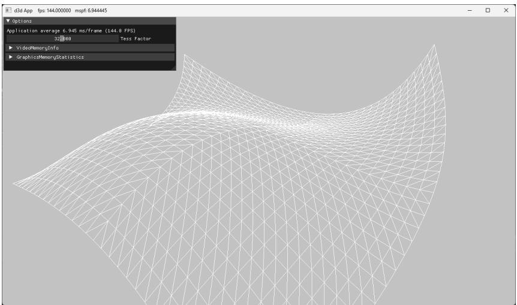


Figure 14.8. Screenshot of the Bézier surface demo.


# Our vertex buffer storing the sixteen control points is created like so:

```cpp
std::unique_ptr<MeshGeometry> BezierPatchApp::BuildQuadPatchGeometry()
{
    std::array<XMFLOAT3, 16> vertices =
        {
            // Row 0
                XMFLOAT3(-10.0f, -10.0f, +15.0f),
                XMFLOAT3(-5.0f, 0.0f, +15.0f),
                XMFLOAT3(+5.0f, 0.0f, +15.0f),
                XMFLOAT3(+10.0f, 0.0f, +15.0f),
            // Row 1
                XMFLOAT3(-15.0f, 0.0f, +5.0f),
                XMFLOAT3(-5.0f, 0.0f, +5.0f),
                XMFLOAT3(+5.0f, 20.0f, +5.0f),
                XMFLOAT3(+15.0f, 0.0f, +5.0f),
            // Row 2
                XMFLOAT3(-15.0f, 0.0f, -5.0f),
                XMFLOAT3(-5.0f, 0.0f, -5.0f),
                XMFLOAT3(+5.0f, 0.0f, -5.0f),
                XMFloat3(+15.0f, 0.0f, -5.0f),
            // Row 3
                XMFloat3(-10.0f, 10.0f, -15.0f),
                XMFloat3(-5.0f, 0.0f, -15.0f),
                XMFloat3(+5.0f, 0.0f, -15.0f),
                XMFloat3(+25.0f, 10.0f, -15.0f)
}; 
```

std::array<uint16_t, 16> indices = {0, 1, 2, 3,4, 5, 6, 7,8,9,10,11,12,13,14,15};const UINT vbByteSize $\equiv$ (UINT)vertices.size() \* sizeof(XMFLOAT3);const UINT ibByteSize $\equiv$ (UINT)indices.size() \* sizeof( uint16_t);auto geo $=$ std::make_unique<MeshGeometry>();geo->Name $\equiv$ "quadpatchGeo";geo->VertexBufferCPU.resize(vbByteSize);CopyMemory(geo->VertexBufferCPU.data(), vertices.data(),vbByteSize);geo->IndexBufferCPU.resize(ibByteSize);CopyMemory(geo->IndexBufferCPU.data(), indices.data(), ibByteSize);CreateStaticBuffer(md3dDevice.Get(), \*mUploadBatch,vertices.data(), vertices.size(),sizeof(XMFLOAT3),D3D12RESOURCE_STATEvertex_AND_constant_buffer,&geo->VertexBufferGPU);CreateStaticBuffer(md3dDevice.Get(), \*mUploadBatch, indices.data(), indices.size(), sizeof uint16_t), D3D12RESOURCE_STATE_INDEX_buffer,&geo->IndexBufferGPU);geo->VertexByteStride $\equiv$ sizeof(XMFLOAT3);geo->VertexBufferByteSize $\equiv$ vbByteSize;geo->IndexFormat $\equiv$ DXGIFORMAT_R16_UID;geo->IndexBufferByteSize $\equiv$ ibByteSize;SubmeshGeometry quadSubmesh;quadSubmesh.IndexCount $\equiv$ (UINT)indices.size();quadSubmesh.StartIndexLocation $\equiv$ 0;quadSubmesh.BaseVertexLocation $\equiv$ 0;quadSubmesh.VertecCount $\equiv$ (UINT)vertices.size();quadSubmesh.Bounds $\equiv$ BoundingBox(XMFLOAT3(0.0f,0.0f,0.0f),XMFLOAT3(10.0f,10.0f,10.0f));geo->DrawArgs["quadpatch"] $\equiv$ quadSubmesh;return geo; 


Our render-item for the quad patch is created as follows:


void BezierPatchApp::Add:NOtem(   
RenderLayer layer,   
const DirectX::XMFLOAT4X4& world,   
const XMFLOAT4X4& texTransform,   
Material\* mat,   
MeshGeometry\* geo,   
SubmeshGeometry& drawArgs,   
D3D_PRIMITIVE_TOPOLOGY primType)   
{ auto ritem $=$ std::make_unique<MenuItem>(); ritem->World $=$ world;   
ritem->TexTransform $=$ texTransform;   
ritem->Mat $=$ mat;   
ritem->Geo $=$ geo;   
ritem->PrimitiveType $=$ primType;   
ritem->IndexCount $=$ drawArgs.IndexCount;   
ritem->StartIndexLocation $=$ drawArgs.StartIndexLocation;   
ritem->BaseVertexLocation $=$ drawArgs.BaseVertexLocation; mRItemLayer[(int)layer].push_back(ritem.get());   
mAllRItems.push_back(std::move(ritem));   
}   
void BezierPatchApp::BuildItems()   
{ MaterialLib& matLib $=$ MaterialLib::GetLib();   
XMFLOAT4X4 worldTransform $=$ MathHelper::Identity4x4();   
XMFLOAT4X4 texTransform $=$ MathHelper::Identity4x4();   
XMFLOAT3 tessConstants;   
Add:NOtem(   
RenderLayer::OpaqueTess,   
worldTransform,   
texTransform,   
matLib["whiteMat"],   
mGeometries["quadpatchGeo"].get(),   
mGeometries["quadpatchGeo"]->DrawArgs["quadpatch"], D3D_PRIMITIVE_TOPOLOGY_16_CONTROL_POINT_PATCHLIST);   
mPatchRItem $=$ mAllRItems.back().get();   
} 

# 14.7 SUMMARY

1. The tessellation stages are optional stages of the rendering pipeline. They consist of the hull shader, the tessellator, and the domain shader. The hull and domain shaders are programmable, and the tessellator is completely controlled by the hardware. 

2. Hardware tessellation provides memory benefits, as a low-poly asset can be stored and then detail can be added on the fly via tessellation. Additionally, computations such as animation and physics can be done on the low-poly mesh frequency before tessellation. Finally, continuous LOD algorithms can now be implemented completely on the GPU, which always had to be implemented on the CPU before hardware tessellation was available. 

3. New primitive types are used only with tessellation to submit control points to the rendering pipeline. Direct3D 12 supports between one and thirty-two control points, which are represented by the enumerated types D3D_PRIMITIVE_1_CONTROL_POINT_PATCH... D3D_PRIMITIVE_32_CONTROL_ POINT_PATCH. 

4. With tessellation, the vertex shader inputs control points and generally animates or performs physics computations per control point. The hull shader consists of the constant hull shader and the control point hull shader. The constant hull shader operates per patch and outputs the tessellation factors of the patch, which instruct the tessellator how much to tessellate the patch, as well as any other optional per patch data. The control point hull shader inputs a number of control points and outputs a number of control points. The control point hull shader is invoked once per control point output. Typically, the control point hull shader changes the surface representation of the input patch. For example, this stage might input a triangle with three control points, and output a Bézier triangle surface patch with ten control points. 

5. The domain shader is invoked for each vertex created by the tessellation stage. Whereas the vertex shader acts as a vertex shader for each control point, with tessellation enabled the hull shader is essentially the vertex shader for the tessellated patch vertices. In particular, it is here that we project the vertices of the tessellated patch to homogeneous clip space and do other per vertex work. 

6. If you are not going to tessellate an object (e.g., tessellation factors are close to 1), then do not render the object with the tessellation stages enabled, as there is overhead. Avoid tessellating so much that triangles are smaller than eight pixels. Draw all your tessellated objects together to avoid turning tessellation on and off during a frame. Use back face culling and frustum culling in the hull shader to discard patches that are not seen from being tessellated. 

7. Bézier curves and surfaces, specified by parametric equations, can be used to describe smooth curves and surfaces. They are “shaped” via control points. In 

addition to allowing us to draw smooth surfaces directly, Bézier surfaces are used in many popular hardware tessellation algorithms such as PN Triangles and Catmull-Clark approximations. 

# 14.8 EXERCISES

1. Redo the “Basic Tessellation” demo, but tessellate a triangle patch instead of a quad patch. 

2. Tessellate an iscoahedron into a sphere based on distance. 

3. Modify the “Basic Tessellation” demo so that it does fixed tessellation of a flat quad. Experiment with different edge/interior tessellation factors until you are comfortable with how the tessellation factors work. 

4. Explore fractional tessellation. That is, try the “Basic Tessellation” demo with: 

```txt
[partitioning("fractional_even")]  
[partitioning("fractional_odd")] 
```

5. Compute the Bernstein basis functions $B _ { 0 } ^ { 2 } ( t ) , B _ { 1 } ^ { 2 } ( t ) , B _ { 2 } ^ { 2 } ( t )$ for a quadratic Bézier curve, and compute the derivatives $B _ { 0 } ^ { 2 \prime } ( t ) , B _ { 1 } ^ { 2 \prime } ( t ) , B _ { 2 } ^ { 2 \prime } ( t )$ . Derive the parametric equation for a quadratic Bézier surface. 

6. Experiment with the “Bézier Patch” demo by changing the control points to change the Bézier surface. 

7. Redo the “Bézier Patch” demo to use a quadratic Bézier surface with nine control points. 

8. Modify the “Bézier Patch” demo to light and shade the Bézier surface. You will need to compute vertex normals in the domain shader. A normal at a vertex position can be found by taking the cross product of the partial derivatives at the position. 

9. Research and implement Bézier triangle patches. 