# Chapter

# 16 Instancing and Frustum Cull ing

In this chapter, we study instancing and frustum culling. Instancing refers to drawing the same object more than once in a scene. Instancing can provide significant optimization, and so there is dedicated Direct3D support for instancing. Frustum culling refers to rejecting entire groups of triangles from further processing that are outside the viewing frustum with a simple test. 

# Chapter Objectives:

1. To learn how to implement hardware instancing. 

2. To become familiar with bounding volumes, why they are useful, how to create them, and how to use them. 

3. To discover how to implement frustum culling. 

# 16.1 HARDWARE INSTANCING

Instancing refers to drawing the same object more than once in a scene, but with different positions, orientations, scales, materials, and textures. Here are a few examples: 

1. A few different tree models are drawn multiple times to build a forest. 

2. A few different asteroid models are drawn multiple times to build an asteroid field. 

3. A few different character models are drawn multiple times to build a crowd of people. 

It would be wasteful to duplicate the vertex and index data for each instance. Instead, we store a single copy of the geometry (i.e., vertex and index lists) relative to the object’s local space. Then we draw the object several times, but each time with a different world matrix and a different material if additional variety is desired. 

Although this strategy saves memory, it still requires per-object API overhead. That is, for each object, we must set its unique material, its world matrix, and invoke a draw command. Although Direct3D 12 was redesigned to minimize a lot of the API overhead that existed in Direct3D 11 when executing a draw call, there is still some overhead. The Direct3D instancing API allows you to instance an object multiple times with a single draw call; and moreover, with bindless heap indexing, instancing is more flexible than in Direct3D 11. 

Note: 

Why the concern about API overhead? It was common for Direct3D 11 applications to be CPU bound due to the API overhead (this means the CPU was the bottleneck, not the GPU). The reason for this is that level designers like to draw many objects with unique materials and textures, and this requires state changes and draw calls for each object. When there is a high-level of CPU overhead for each API call, scenes would be limited to a few thousand draw calls in order to still maintain real-time rendering speeds. Graphics engines would then employ batching techniques (see [Wloka03]) to minimize the number of draw calls. Hardware instancing is one aspect where the API helps perform batching. 

# 16.1.1 Drawing Instanced Data

Perhaps surprisingly, we have already been drawing instanced data in all the previous chapter demos. However, the instance count has always been 1 (second parameter): 

```txt
const uint32_t instanceof = 1;  
cmdList->DrawIndexedIndexed(ri->IndexCount, instanceof, ri->StartIndexLocation, ri->BaseVertexLocation, 0); 
```

The second parameter, InstanceCount, specifies the number of times to instance the geometry we are drawing. If we specify ten, the geometry will be drawn 10 times. 

Drawing an object ten times alone does not really help us, though. The object will be drawn in the same place using the same materials and textures. So the next step is to figure out how to specify additional per-instance data so that we can vary the instances by rendering them with different transforms, materials, and textures. 

# 16.1.2 Instance Data

Earlier versions of this book obtained instance data from the input assembly stage. When creating an input layout, you can specify that data streams in per-instance rather than at a per-vertex frequency by using D3D12_INPUT_CLASSIFICATION_ PER_INSTANCE_DATA instead of D3D12_INPUT_CLASSIFICATION_PER_VERTEX_DATA, respectively. You would then bind a secondary vertex buffer to the input stream that contained the instancing data. Direct3D 12 still supports this way of feeding instancing data into the pipeline, but we opt for a more modern approach. 

The modern approach is to create a structured buffer that contains the perinstance data for all of our instances. For example, if we were going to instance an object 100 times, we would create a structured buffer with 100 per-instance data elements. We then bind the structured buffer resource to the rendering pipeline, and index into it in the vertex shader based on the instance we are drawing. How do we know which instance is being drawn in the vertex shader? Direct3D provides the system value identifier SV_InstanceID which you can use in your vertex shader. For example, vertices of the first instance will have id 0, vertices of the second instance will have id 1, and so on. So in our vertex shader, we can index into the structured buffer to fetch the per-instance data we need. The following shader code shows how this all works: 

```cpp
// Common.hsl1
StructuredBuffer<MaterialData> gMaterialData : register(t0);
StructuredBuffer<InstanceData> gInstanceData : register(t1);
// DefaultGeo.hsl1
// Include common HLSL code.
#include "Shaders/Common.hsl1"
struct VertexIn
{
    float3 PosL : POSITION;
    float3 NormalL : NORMAL;
    float2 TexC : TEXCOORD;
    float3 TangentU : TANGENT;
    #if SKINNED
        float3 BoneWeights : WEIGHTS;
        uint4 BoneIndices : BONEINDICES;
    #endif
}; 
```

```lisp
struct VertexOut {
    float4 PosH : SV POSITION;
    float4 ShadowPosH : POSITION0;
    float4 SsaoPosH : POSITION1;
    float3 PosW : POSITION2;
    float3 NormalW : NORMAL;
    float3 TangentW : TANGENT;
    float2 TexC : TEXCOORD;
}
if DRAW_INSTANCED
    // nointerpolation is used so the index is not interpolated
    // across the triangle.
    nointerpolation uint MatIndex : MATINDEX;
    nointerpolation uint CubeMapIndex : CUBEMAP_INDEX;
#endif
};
VertexOut VS(VertexIn vin
    #if DRAW_INSTANCED,
        uint instanceID : SV InstanceID
        #endif)
{
    VertexOut vout = (VertexOut)0.0f;
}
if DRAW_INSTANCED
    // Fetch the instance data.
    InstanceData instData = gInstanceData[instanceID];
    float4x4 world = instData.World;
    float4x4 texTransform = instData.TexTransform;
    uint matIndex = instData.MaterialIndex;
    vout.MatIndex = matIndex;
    vout.CubeMapIndex = instData.CubeMapIndex;
    MaterialData matData = gMaterialData[matIndex];
    #else
        MaterialData matData = gMaterialData[gMaterialIndex];
        float4x4 world = gWorld;
        float4x4 texTransform = gTexTransform;
    #endif
}
if SKINNED
    ApplySkinning(vin.BoneWeights, vin.BoneIndices, vin(PosL, vin.NormalL, vin.TangentU.xyz);
}
endif
// Transform to world space.
float4 posW = mul(float4(vin(PosL, 1.0f), world);
vout-posW = posW.xyz;
// Assumes nonuniform scaling; otherwise, need to use inverse-transpose of world matrix.
vout.NormalW = mul(vin.NormalL, (float3x3)world); 
```

```javascript
vout.TangentW = mul(vin.TangentU, (float3x3)world); // Transform to homogeneous clip space. vout_PosH = mul(posW, gViewProj); if( gSsaoEnabled ) { // Generate projective tex-coords to project SSAO map // onto scene. vout.SsaoPosH = mul(posW, gViewProjTex); } // Output vertex attributes for interpolation across triangle. float4 texC = mul(float4(vin.TexC, 0.0f, 1.0f), texTransform); vout.TexC = mul(texC, Data.matTransform).xy; if( gShadowsEnabled ) { // Generate projective tex-coords to project shadow map // onto scene. vout.ShadowPosH = mul(posW, gShadowTransform); } return vout; } // DefaultPS.hls1 // Include common HLSL code. #include "Shaders/Common.hls1" struct VertexOut { float4 PosH : SV POSITION; float4 ShadowPosH : POSITION0; float4 SsaoPosH : POSITION1; float3 PosW : POSITION2; float3 NormalW : NORMAL; float3 TangentW : TANGENT; float2 TexC : TEXCOORD; #if DRAW_INSTANCED // nointerpolation is used so the index is not interpolated // across the triangle. nointerpolation uint MatIndex : MATINDEX; nointerpolation uint CubeMapIndex : CUBEMAP_INDEX; #endif }; float4 PS(TVertexOut pin) : SV_Target { // Fetch the material data. #if DRAW_INSTANCED MaterialData matData = gMaterialData[pin(MatIndex)]; uint cubeMapIndex = pin.CubeMapIndex; 
```

```txt
else
    MaterialData.matData = gMaterialData[gMaterialIndex];
    uint cubeMapIndex = gCubeMapIndex;
}
endif
    float4 diffuseAlbedo =.matData.DiffuseAlbedo;
    float3 fresnelR0 =.matData.FresnelR0;
    float roughness =.matData.Roughness;
    uint diffuseMapIndex =.matData.DiffuseMapIndex;
    uint normalMapIndex =.matData.NormalMapIndex;
    uint glossHeightAoMapIndex =.matData.GlossHeightAoMapIndex;
    //Dynamically look up the texture in the array.
Texture2D diffuseMap = ResourceDescriptorHeap[diffuseMapIndex];
diffuseAlbedo *= diffuseMap_SAMPLE(GetAnisoWrapSampler(), pin.TexC);
}
#ifdef ALPHA_TEST
//Discard pixel if texture alpha < 0.1. We do this test as soon
//as possible in the shader so that we can potentially exit the
//shader early, thereby skipping the rest of the shader code.
clip(diffuseAlbedo.a - 0.1f);
#endif
//Interpolating normal can unnormalize it, so renormalize it.
pin.NormalW = normalize(pin.NormalW);
float3 bumpedNormalW = pin.NormalW;
if(gNormalMapsEnabled)
{
    Texture2D normalMap = ResourceDescriptorHeap[normalMapIndex];
    float3 normalMapSample = normalMap;
    Sample(GetAnisoWrapSampler(), pin.TexC).rgb;
    bumpedNormalW = NormalSampleToWorldSpace(normalMapSample, pin.NormalW, pin.TangentW);
}
Texture2D glossHeightAoMap = ResourceDescriptorHeap[glossHeightAoMapIndex];
float3 glossHeightAo = glossHeightAoMap;
Sample(GetAnisoWrapSampler(), pin.TexC).rgb;
//Vector from point being lit to eye.
float3 toEyeW = normalize(gEyePosW - pin(PosW);
float ambientAccess = 1.0f;
if(gSsaoEnabled)
{
    //Finish texture projection and sample SSAO map.
    pin.SsaoPosH /= pin.SsaoPosH.w;
    Texture2D ssaoMap = ResourceDescriptorHeap[gSsaoAmbientMap0Index];
    ambientAccess = ssaoMap/sample(GetLinearClampSampler(), pin.SsaoPosH.xy, 0.0f).r;
} 
```

// Light terms. float4 ambient $=$ ambientAccess\*gAmbientLight\*diffuseAlbedo; ambient $\ast =$ glossHeightAo.z; // Only the first light casts a shadow. float3 shadowFactor $=$ float3(1.0f, 1.0f, 1.0f); if( gShadowsEnabled ) { shadowFactor[0] $=$ CalcShadowFactor(pin.ShadowPosH); } const float shininess $=$ glossHeightAo.x \* (1.0f - roughness); Material mat $=$ { diffuseAlbedo, fresnelR0, shininess }; float4 directLight $=$ ComputeLighting(gLights,mat, pin(PosW, bumpedNormalW,toEyeW,shadowFactor); float4 litColor $=$ ambient + directLight; // Add in specular reflections. if( gReflectionsEnabled ) { TextureCube gCubeMap $=$ ResourceDescriptorHeap[cubeMapIndex]; float3 r $=$ reflect(-toEyeW,bumpedNormalW); float4 reflectionColor $=$ gCubeMap. Sample(GetLinearWrapSampler(),r); float3 fresnelFactor $=$ SchlickFresnel(fresnelR0,bumpedNormalW, r); litColor.rgb $+ =$ ambientAccess\*shininess \* fresnelFactor \* reflectionColor.rgb; } // Common convention to take alpha from diffuse albedo. litColor.a $=$ diffuseAlbedo.a; return litColor; 

Draw calls that use instancing will use shaders compiled with -D DRAW_INSTANCED $^ { 1 = 1 }$ for example: 

```cpp
std::vector< LPCWSTR> vsDrawInstancedArgs = std::vector< LPCWSTR> {
    L"-E", L"VS", L"-T", L"vs_6_6", L"-D DRAW_INSTANCED=1" COMMA_DEBUG_
    ARGS };
std::vector< LPCWSTR> psDrawInstancedArgs = std::vector< LPCWSTR> {
    L"-E", L"PS", L"-T", L"ps_6_6", L"-D DRAW_INSTANCED=1" COMMA_DEBUG_
    ARGS }; 
```

Note that we no longer use a per-object constant buffer if we are using instancing; the per-object data comes from the instance buffer. 

The DefaultGeo.hlsl file contains our “default” vertex shader now, and the DefaultPS.hlsl contains our “default” pixel shader now. In other words, to avoid duplicating code, we are not going to introduce a new .hlsl file for each new feature we add to a shader. Instead, we have a “master/uber” shader and use constant 

buffer variables to switch features on and off. Therefore, in DefaultGeo/DefaultPS. hlsl, you will see code that we have not discussed yet. Features will be turned off until they are covered in the book. For example, gShadowsEnabled is set to false in demos until Chapter 20, which covers shadow mapping. Also, the reason for splitting up the vertex shader from the pixel shader into separate files is that different vertex/geometry/domain/mesh shaders can be used with the same pixel shader. For example, in Chapter 19, we create a displacement mapped shader that uses hardware tessellation and ultimately a domain shader for vertex processing, but still uses DefaultPS.hlsl for shading pixels. 

For completeness, the corresponding root signature description that adds an instance buffer is shown below that corresponds to the above shader programs. Shaders that do not use instancing will naturally ignore the instance buffer that is bound. We could have defined two root signatures, one for instancing and one for not, but our root signature is still relatively small (root signatures have a max size of 64 DWORDs), so we make the trade-off to use a single root signature so that we do not have to maintain multiple root signatures and call SetGraphicsRootSignature multiple times. 

```txt
CD3DX12_ROOT_PARAMETER gfxRootParameters[GFX_ROOT.Arg_COUNT]; //Performance TIP: Order from most frequent to least frequent.  
gfxRootParameters[GFX_ROOT.Arg_OBJECT_CBV].InitAsConstantBufferView(0)  
gfxRootParameters[GFX_ROOT.Arg_PASS_CBV].InitAsConstantBufferView(1);  
gfxRootParameters[GFX_ROOT.Arg_SKINNED_CBV].InitAsConstantBufferView(2);  
gfxRootParameters[GFX_ROOT.Arg_MATERIAL_SRV].InitAsShaderResourceView(0);  
gfxRootParameters[GFX_ROOT.Arg_INSTANCEDATA_SRV].InitAsShaderResourceView(1);  
CD3DX12_ROOT_SIGNATURE_DESC gfxRootSigDesc(GFX_ROOT.Arg_COUNT, gfxRootParameters, 0, nullptr, //static samplers D3D12_ROOT_SIGNATURE_FLAG ALLOW_INPUT_ASSEMBLER_INPUT_LAYOUT | D3D12_ROOT_SIGNATURE_FLAG_CBV_SRV_UAV_HEAP_DIRECTLY_INDEXED | D3D12_ROOT_SIGNATURE_FLAG_SAMPLER_HEAP_DIRECTLY_INDEXED);  
...  
ID3D12Resource* instanceBuffer = mCurrFrameResource->InstanceBuffer->Resource();  
mCommandList->SetGraphicsRootShaderResourceView(GFX_ROOT.Arg_INSTANCEDATA_SRV, instanceBuffer->GetGPUVirtualAddress()); 
```

Note that the GFX_ROOT_ARG_SKINNED_CBV constant buffer is not used until the chapter on character animation. 

# 16.1.3 Creating the Instanced Buffer

The instance buffer stores the data that varies per-instance. It looks a lot like the data we previously put in our per-object constant buffer. On the CPU side, our instance data structure looks like this: 

```c
// Defined in SharedTypes.h  
struct InstanceData  
{ float4x4 World; float4x4 TexTransform; uint MaterialIndex; } 
```

The per-instance data in system memory is stored as part of the render-item structure, as the render-item maintains how many times it should be instanced: 

```cpp
struct RenderItem {
    ...
    std::vector<InstanceData> Instances;
    ...
}； 
```

For the GPU to consume the instance data, we need to create a structured buffer with element type InstanceData. Moreover, this buffer will be dynamic (i.e., an upload buffer) so that we can update it every frame; in our demo, we copy the instanced data of only the visible instances into the structure buffer (this is related to frustum culling, see $\ S 1 6 . 3$ ), and the set of visible instances will change as the camera moves/looks around. Creating a dynamic buffer is simple with our UploadBuffer helper class: 

```cpp
struct FrameResource
{
public:
    FrameResource(ID3D12Device* device, UINT passCount, UINT maxInstanceCount, UINT materialCount);
    FrameResource(const FrameResource& rhs) = delete;
    FrameResource& operator=(const FrameResource& rhs) = delete;
    ~FrameResource();
    // We cannot reset the allocator until the GPU is done processing
    // the commands. So each frame needs their own allocator.
    Microsoft::WRL::ComPtr<ID3D12CommandAllocator> CmdListAlloc;
    // We cannot update a cbuffer until the GPU is done processing
    // the commands that reference it. So each frame needs their
    // own cbuffers. 
```

```cpp
// std::unique_ptr<UploadBuffer<FrameConstants>> FrameCB = nullptr; std::unique_ptr<UploadBuffer<PassConstants>> PassCB = nullptr; std::unique_ptr<UploadBuffer<MaterialData>> MaterialBuffer = nullptr; // NOTE: In this demo, we instance only one render-item, so we // only have one structured buffer to store instancing data. To // make this more general (i.e., to support instancing multiple // render-items), you would need to have a structured buffer for // each render-item, and allocate each buffer with enough room // for the maximum number of instances you would ever draw. // This sounds like a lot, but it is actually no more than the // amount of per-object constant data we would need if we were // not using instancing. For example, if we were drawing 1000 // objects without instancing, we would create a constant buffer // with enough room for a 1000 objects. With instancing, we // would just create a structured buffer large enough to store the // instance data for 1000 instances. std::unique_ptr<UploadBuffer<InstanceData>> InstanceBuffer = nullptr; // Fence value to mark commands up to this fence point. This lets us // check if these frame resources are still in use by the GPU. UINT64 Fence = 0;   
};   
FrameResource::FrameResource(ID3D12Device* device, UINT passCount, UINT maxInstanceCount, UINT materialCount) { ThrowIfFailed(device->CreateCommandAllocator( D3D12_COMMAND_LIST_TYPE_DIRECT, IID_PPV_args(CCmdListAlloc.GetAddressOf())); PassCB = std::make_unique<UploadBuffer<PassConstants>>( device, passCount, true); MaterialBuffer = std::make_unique<UploadBuffer<MaterialData>>( device, materialCount, false); InstanceBuffer = std::make_unique<UploadBuffer<InstanceData>>( device, maxInstanceCount, false); } 
```

Note that InstanceBuffer is not a constant buffer, so we specify false for the last parameter. 

# 16.2 BOUNDING VOLUMES AND FRUSTUMS

In order to implement frustum culling, we need to become familiar with the mathematical representation of a frustum and various bounding volumes. Bounding volumes are primitive geometric objects that approximate the volume of an object—see Figure 16.1. The tradeoff is that although the bounding volume 

only approximates the object its form has a simple mathematical representation, which makes it easy to work with. 

# 16.2.1 DirectX Math Collision

We use the DirectXCollision.h utility library, which is part of DirectX Math. This library provides fast implementations to common geometric primitive intersection tests such as ray/triangle intersection, ray/box intersection, box/ box intersection, box/plane intersection, box/frustum, sphere/frustum, and much more. Exercise 3 asks you to explore this library to get familiar with what it offers. 

# 16.2.2 Boxes

The axis-aligned bounding box (AABB) of a mesh is a box that tightly surrounds the mesh and such that its faces are parallel to the major axes. An AABB can be described by a minimum point $\mathbf { v } _ { m i n }$ and a maximum point $\mathbf { v } _ { m a x }$ (see Figure 16.2). The minimum point $\mathbf { v } _ { m i n }$ is found by searching through all the vertices of the mesh and finding the minimum $x \mathrm { - } , y \mathrm { - }$ , and $z$ -coordinates, and the maximum point $\mathbf { v } _ { m a x }$ is found by searching through all the vertices of the mesh and finding the maximum x-, y-, and $z \mathrm { . }$ -coordinates. 

Alternatively, an AABB can be represented with the box center point c and extents vector e, which stores the distance from the center point to the sides of the box along the coordinate axes (see Figure 16.3). 

The DirectX collision library uses the center/extents representation: 

```c
struct BoundingBox
{
    static const size_t CORNER_COUNT = 8; 
```

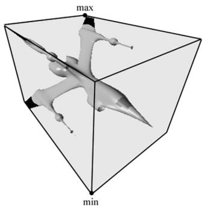


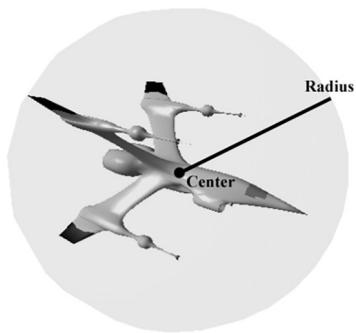


Figure 16.1. A mesh rendered with its AABB and bounding sphere.


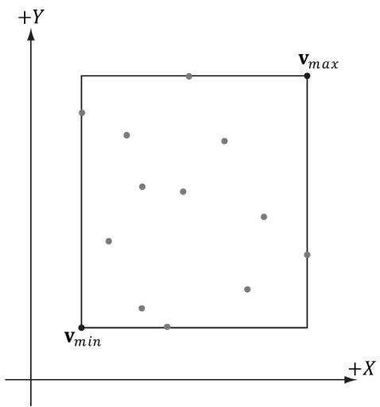


Figure 16.2. The AABB of a set of points using minimum and maximum point representation.


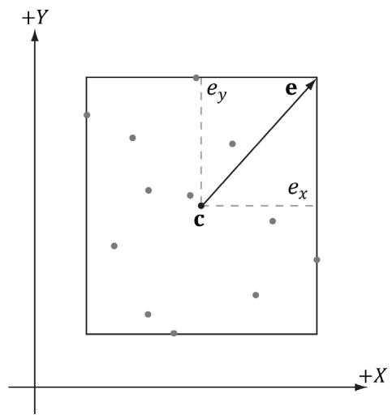


Figure 16.3. The AABB of a set of points using center and extents representation.


```txt
XMFLOAT3 Center; // Center of the box.  
XMFLOAT3 Extents; // Distance from the center to each side. 
```

It is easy to convert from one representation to the other. For example, given a bounding box defined by $\mathbf { v } _ { m i n }$ and $\mathbf { v } _ { m a x } ,$ the center/extents representation is given by: 

$$
\mathbf {c} = 0. 5 \left(\mathbf {v} _ {\text {m i n}} + \mathbf {v} _ {\text {m a x}}\right)
$$

$$
\mathbf {e} = 0. 5 \left(\mathbf {v} _ {\max } - \mathbf {v} _ {\min }\right)
$$

The following code shows how we compute the bounding box of the skull mesh in this chapter’s demo: 

XMFLOAT3 vMinf3(+MathHelper::Infinity, +MathHelper::Infinity, +MathHelper::Infinity);   
XMFLOAT3 vMaxf3(-MathHelper::Infinity, -MathHelper::Infinity, -MathHelper::Infinity);   
XMVectoror vMin $\equiv$ XmlLoadFloat3(&vMinf3);   
XMVectoror vMax $\equiv$ XmlLoadFloat3(&vMaxf3);   
std::vector<Vertex> vertices(vcount);   
for(BOOL i = 0; i < vcount; ++i) { fin >> vertices[i].Pos.x >> vertices[i].Pos.y >> vertices[i].Pos.z; fin >> vertices[i].Normal.x >> vertices[i].Normal.y >> vertices[i]. Normal.z; 

```javascript
XMVECTOR P = XmlLoadFloat3(&vertices[i].Pos); // Project point onto unit sphere and generate spherical // texture coordinates. XMFLOAT3 spherePos; XMStoreFloat3(&spherePos, XMVector3Normalize(P)); float theta = atan2f(spherePos.z, spherePos.x); // Put in [0, 2pi]. if(theta < 0.0f) theta += XM_2PI; float phi = acosf(spherePos.y); float u = theta / (2.0f*XM.PI); float v = phi / XM.PI; vertices[i].TexC = {u, v}; vMin = XMVectorMin(vMin, P); vMax = XMVectorMax(vMax, P); } BoundingBox bounds; XMStoreFloat3(&boundsCENTER, 0.5f*(vMin + vMax)); XMStoreFloat3(&bounds.Exteents, 0.5f*(vMax - vMin)); 
```

The XMVectorMin and XMVectorMax functions return the vectors: 

$$
\operatorname {m i n} (\mathbf {u}, \mathbf {v}) = \left(\min  \left(u _ {x}, v _ {x}\right), \min  \left(u _ {y}, v _ {y}\right), \min  \left(u _ {z}, v _ {z}\right), \min  \left(u _ {w}, v _ {w}\right)\right)
$$

$$
\mathbf {m a x} (\mathbf {u}, \mathbf {v}) = \left(\max  \left(u _ {x}, v _ {x}\right), \max  \left(u _ {y}, v _ {y}\right), \max  \left(u _ {z}, v _ {z}\right), \max  \left(u _ {w}, v _ {w}\right)\right)
$$

# 16.2.2.1 Rotations and Axis-Aligned Bounding Boxes

Figure 16.4 shows that a box axis-aligned in one coordinate system may not be axis-aligned with a different coordinate system. In particular, if we compute the AABB of a mesh in local space, it gets transformed to an oriented bounding box (OBB) in world space. However, we can always transform into the local space of the mesh and do the intersection there where the box is axis-aligned. 

Alternatively, we can recompute the AABB in the world space, but this can result in a “fatter” box that is a poorer approximation to the actual volume (see Figure 16.5). 

Yet another alternative is to abandon axis-aligned bounding boxes, and just work with oriented bounding boxes, where we maintain the orientation of the box relative to the world space. The DirectX collision library provides the following structure for representing an oriented bounding box. 

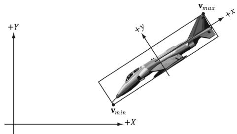


Figure 16.4. The bounding box is axis aligned with the xy-frame, but not with the XY-frame.


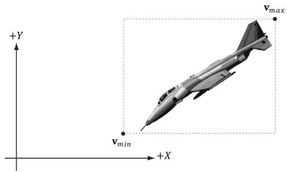


Figure 16.5. The bounding box is axis aligned with the XY-frame.


```txt
struct BoundingOrientedBox
{
    static const size_t CORNER_COUNT = 8;
    XMFLOAT3 Center; // Center of the box.
    XMFLOAT3 Extents; // Distance from the center to each side.
    XMFLOAT4 Orientation; // Unit quaternion representing rotation (box -> world).
} 
```

# Note:

In this chapter, you will see mention of quaternions for representing rotations/ orientations. Briefly, a unit quaternion can represent a rotation just like a rotation matrix can. We cover quaternions in Chapter 22. For now, just think of it as representing a rotation like a rotation matrix. 

An AABB and OBB can also be constructed from a set of points using the DirectX collision library with the following static member functions: 

```cpp
void BoundingBox::CreateFromPoints( _Out_BoundingBox& Out, _In_size_t Count, _In_reads_bytes_(sizeof(XMFLOAT3) + Stride*(Count-1)) const XMFLOAT3* pPoints, _In_size_t Stride);   
void BoundingOrientedBox::CreateFromPoints( _Out_BoundingOrientedBox& Out, _In_size_t Count, _In_reads_bytes_(sizeof(XMFLOAT3) + Stride*(Count-1)) const XMFLOAT3* pPoints, _In_size_t Stride); 
```

If your vertex structure looks like this: 

```txt
struct Basic32
{
    XMFLOAT3 Pos;
    XMFLOAT3 Normal; 
```

```txt
XMFLOAT2TexC;   
}； 
```

And you have an array of vertices forming your mesh: 

```cpp
std::vector<Vertex::Basic32> vertices; 
```

Then you call this function like so: 

```rust
BoundingBox box;   
BoundingBox::CreateFromPoints( box, vertices.size(), &vertices[0].Pos, sizeof(Vertex::Basic32)); 
```

The stride indicates how many bytes to skip to get to the next position element. 

Note: 

In order to compute bounding volumes of your meshes, you need to have a system memory copy of your vertex list available, such as one stored in std::vector. This is because the CPU cannot read from a vertex buffer created for rendering. Therefore, it is common for applications to keep a system memory copy around for things like this, as well as picking (Chapter 17), and collision detection. 

# 16.2.3 Spheres

The bounding sphere of a mesh is a sphere that tightly surrounds the mesh. A bounding sphere can be described with a center point and radius. One way to compute the bounding sphere of a mesh is to first compute its AABB. We then take the center of the AABB as the center of the bounding sphere: 

$$
\mathbf {c} = 0. 5 \left(\mathbf {v} _ {\min } + \mathbf {v} _ {\max }\right)
$$

The radius is then taken to be the maximum distance between any vertex p in the mesh from the center c: 

$$
r = \max  \left\{\left| \left| \mathbf {c} - \mathbf {p} \right| \right|: \mathbf {p} \in m e s h \right\}
$$

Suppose we compute the bounding sphere of a mesh in local space. After the world transform, the bounding sphere may not tightly surround the mesh due to scaling. Thus the radius needs to be rescaled accordingly. To compensate for nonuniform scaling, we must scale the radius by the largest scaling component so that the sphere encapsulates the transformed mesh. Another possible strategy is to avoid scaling all together by having all your meshes modeled to the same scale 

of the game world. This way, models will not need to be rescaled once loaded into the application. 

The DirectX collision library provides the following structure for representing a bounding sphere: 

```txt
struct BoundingSphere   
{ XMFLOAT3 Center; //Center of the sphere. float Radius; //Radius of the sphere. 
```

And it provides the following static member function for creating one from a set of points: 

```cpp
void BoundingSphere::CreateFromPoints(  
    Out_BoundingSphere& Out,  
    In_size_t Count,  
    In_reads_bytes_(sizeof(XMFLOAT3) + Stride* (Count-1)) const XMFLOAT3* pPoints,  
    In_size_t Stride); 
```

# 16.2.4 Frustums

We are well familiar with frustums from Chapter 5. One way to specify a frustum mathematically is as the intersection of six planes: the left/right planes, the top/ bottom planes, and the near/far planes. We assume the six frustum planes are “inward” facing—see Figure 16.6. 

This six plane representation makes it easy to do frustum and bounding volume intersection tests. 

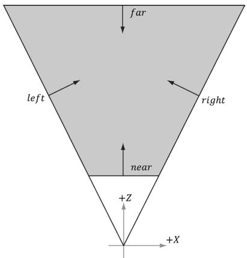


Figure 16.6. The intersection of the positive half spaces of the frustum planes defines the frustum volume.


# 16.2.4.1 Constructing the Frustum Planes

One easy way to construct the frustum planes is in view space, where the frustum takes on a canonical form centered at the origin looking down the positive $z$ -axis. Here, the near and far planes are trivially specified by their distances along the $z$ -axis, the left and right planes are symmetric and pass through the origin (see Figure 16.6 again), and the top and bottom planes are symmetric and pass through the origin. Consequently, we do not even need to store the full plane equations to represent the frustum in view space, we just need the plane slopes for the top/bottom/left/right planes, and the $z$ distances for the near and far plane. The DirectX collision library provides the following structure for representing a frustum: 

```txt
struct BoundingFrustum {
    static const size_t CORNER_COUNT = 8;
    XMFLOAT3 Origin; // Origin of the frustum (and projection).
    XMFLOAT4 Orientation; // Quaternion representing rotation.
    float RightSlope; // Positive X slope (X/Z).
    float LeftSlope; // Negative X slope.
    float TopSlope; // Positive Y slope (Y/Z).
    float BottomSlope; // Negative Y slope.
    float Near, Far; // Z of the near plane and far plane.
} 
```

In the local space of the frustum (e.g., view space for the camera), the Origin would be zero, and the Orientation would represent an identity transform (no rotation). We can position and orientate the frustum somewhere in the world by specifying an Origin position and Orientation quaternion. 

If we cached the frustum vertical field of view, aspect ratio, near and far planes of our camera, then we can determine the frustum plane equations in view space with a little mathematical effort. However, it is also possible to derive the frustum plane equations in view space from the projection matrix in a number of ways (see [Lengyel02] or [Möller08] for two different ways). The XNA collision library takes the following strategy. In NDC space, the view frustum has been warped into the box $[ - 1 , 1 ] \times [ - 1 , 1 ] \times [ 0 , 1 ]$ . So the eight corners of the view frustum are simply: 

```c
// Corners of the projection frustum in homogenous space.  
static XMVECTORF32 HomogeneousPoints[6] = {  
{ 1.0f, 0.0f, 1.0f, 1.0f }, // right (at far plane)  
{ -1.0f, 0.0f, 1.0f, 1.0f }, // left  
{ 0.0f, 1.0f, 1.0f, 1.0f }, // top  
{ 0.0f, -1.0f, 1.0f, 1.0f }, // bottom 
```

```txt
{0.0f，0.0f，0.0f，1.0f}， //near{0.0f，0.0f，1.0f，1.0f} //far}; 
```

We can compute the inverse of the projection matrix (as well is invert the homogeneous divide), to transform the eight corners from NDC space back to view space. One we have the eight corners of the frustum in view space, some simple mathematics is used to compute the plane equations (again, this is simple because in view space, the frustum is positioned at the origin, and axis aligned). The following DirectX collision code computes the frustum in view space from a projection matrix: 

//   
// Build a frustum from a perseptive projection matrix. The matrix   
// may only contain a projection; any rotation, translation or scale   
// will cause the constructed frustum to be incorrect.   
//   
Use declannotations   
inline void XM_CALLCONV BoundingFrustum::CreateFromMatrix(   
BoundingFrustum& Out,   
FXMMatrix Projection)   
{ // Corners of the projection frustum in homogenous space. static XMVECTORF32 HomogenousPoints[6] = { 1.0f, 0.0f, 1.0f, 1.0f }, // right (at far plane) { -1.0f, 0.0f, 1.0f, 1.0f }, // left { 0.0f, 1.0f, 1.0f, 1.0f }, // top { 0.0f, -1.0f, 1.0f, 1.0f }, // bottom { 0.0f, 0.0f, 0.0f, 1.0f }, // near { 0.0f, 0.0f, 1.0f, 1.0f } // far };   
XMVECTOR Determinant;   
XMMatrix matInverse $=$ XMMatrixInverse( &Determinant, Projection );   
// Compute the frustum corners in world space.   
XMVECTOR Points[6];   
for( size_t i = 0; i < 6; ++i ) { // Transform point. Points[i] $=$ XMVector4Transform( HomogenousPoints[i], matInverse ); }   
Out-Origin $=$ XMFLOAT3( 0.0f, 0.0f, 0.0f );   
Out,Orientation $=$ XMFLOAT4( 0.0f, 0.0f, 0.0f, 1.0f );   
// Compute the slopes. 

```txt
Points[0] = Points[0] * XMVectorReciprocal(XMVectorSplatZ(Points[0]));  
Points[1] = Points[1] * XMVectorReciprocal(XMVectorSplatZ(Points[1]));  
Points[2] = Points[2] * XMVectorReciprocal(XMVectorSplatZ(Points[2]));  
Points[3] = Points[3] * XMVectorReciprocal(XMVectorSplatZ(Points[3]));  
Out RightSlope = XMVectorGetX(Points[0]);  
Out.LeftSlope = XMVectorGetX(Points[1]);  
Out.TopSlope = XMVectorGetY(Points[2]);  
Out_bottomSlope = XMVectorGetY(Points[3]);  
// Compute near and far.  
Points[4] = Points[4] * XMVectorReciprocal(XMVectorSplatW(Points[4]));  
Points[5] = Points[5] * XMVectorReciprocal(XMVectorSplatW(Points[5]));  
Out.Near = XMVectorGetZ(Points[4]);  
Out.Far = XMVectorGetZ(Points[5]); 
```

# 16.2.4.2 Frustum/Sphere Intersection

For frustum culling, one test we will want to perform is a frustum/sphere intersection test. This tells us whether a sphere intersects the frustum. Note that a sphere completely inside the frustum counts as an intersection because we treat the frustum as a volume, not just a boundary. Because we model a frustum as six inward facing planes, a frustum/sphere test can be stated as follows: If there exists a frustum plane $L$ such that the sphere is in the negative half-space of L, then we can conclude that the sphere is completely outside the frustum. If such a plane does not exist, then we conclude that the sphere intersects the frustum. 

So a frustum/sphere intersection test reduces to six sphere/plane tests. Figure 16.7 shows the setup of a sphere/plane intersection test. Let the sphere have center point c and radius $r .$ . Then the signed distance from the center of the sphere to the plane is $k = \mathbf { n } \cdot \mathbf { c } + d$ (Appendix C). If $| k | \leq r$ then the sphere intersects the plane. If $k < - r$ then the sphere is behind the plane. If $k > r$ then the sphere is in front of the plane and the sphere intersects the positive half-space of the plane. For the purposes of the frustum/sphere intersection test, if the sphere is in front of the plane, then we count it as an intersection because it intersects the positive halfspace the plane defines. 

The BoundingFrustum class provides the following member function to test if a sphere intersects a frustum. Note that the sphere and frustum must be in the same coordinate system for the test to make sense. 

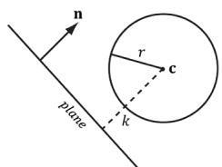


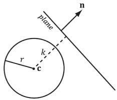


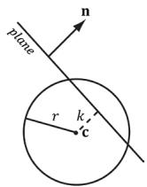


(@)


(b)


(c）)


Figure 16.7. Sphere/plane intersection. (a) $k > r$ and the sphere intersects the positive half-space of the plane. (b) $k < - r$ and the sphere is completely behind the plane in the negative half-space. (c) $| k | < r$ and the sphere intersects the plane.


enum ContainmentType   
{ // The object is completely outside the frustum. DISJOINT $= 0$ // The object intersects the frustum boundaries. INTERSECTS $= 1$ // The object lies completely inside the frustum volume. CONTAINS $= 2$ };   
ContainmentType BoundingFrustum::Contains( _In_ const BoundingSphere& sphere) const; 

# Note:

BoundingSphere contains a symmetrical member function: 

ContainmentType BoundingSphere::Contains( _In_ const BoundingFrustum& fr ) const; 

# 16.2.4.3 Frustum/AABB Intersection

The frustum/AABB intersection test follows the same strategy as the frustum/ sphere test. Because we model a frustum as six inward facing planes, a frustum/ AABB test can be stated as follows: If there exists a frustum plane $L$ such that the box is in the negative half-space of $L$ , then we can conclude that the box is completely outside the frustum. If such a plane does not exist, then we conclude that the box intersects the frustum. 

So a frustum/AABB intersection test reduces to six AABB/plane tests. The algorithm for an AABB/plane test is as follows. Find the box diagonal vector $\mathbf { v } = { \overrightarrow { P Q } }$ , passing through the center of the box, that is most aligned with the plane normal n. From Figure 16.8, (a) if $P$ is in front of the plane, then $Q$ must be also in front of the plane; (b) if Q is behind the plane, then $P$ must be also be behind the plane; (c) if $P$ is behind the plane and Q is in front of the plane, then the box intersects the plane. 

Finding $P Q$ most aligned with the plane normal vector n can be done with the following code: 

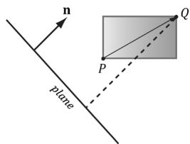


(@)


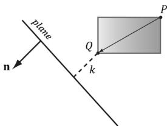


(b)


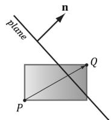


(c）


Figure 16.8. AABB/plane intersection test. The diagonal $\overrightarrow { P Q }$ is always the diagonal most directed with the plane normal.


```txt
// For each coordinate axis x, y, z...  
for(int j = 0; j < 3; ++j)  
{ // Make PQ point in the same direction as // the plane normal on this axis. if( planeNormal[j] >= 0.0f ) { P[j] = box.minPt[j]; Q[j] = box.maxPt[j]; } else { P[j] = box.maxPt[j]; Q[j] = box.minPt[j]; } 
```

This code just looks at one dimension at a time, and chooses $P _ { i }$ and $Q _ { i }$ such that $Q _ { i } - P _ { i }$ has the same sign as the plane normal coordinate $n _ { i }$ (Figure 16.9). 

The BoundingFrustum class provides the following member function to test if an AABB intersects a frustum. Note that the AABB and frustum must be in the same coordinate system for the test to make sense. 

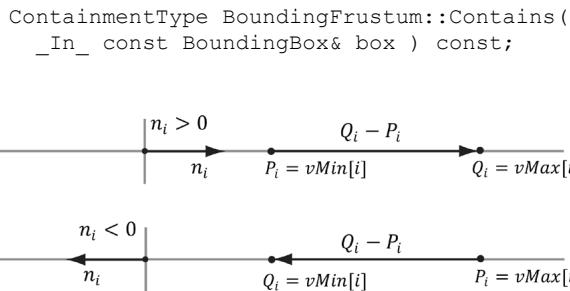


Figure 16.9. (Top) The normal component along the ith axis is positive, so we choose $P _ { i } = v M i n [ i ]$ and $Q _ { i } =$ vMax[i] so that $Q _ { i } - P _ { i }$ has the same sign as the plane normal coordinate $n _ { j }$ . (Bottom) The normal component along the ith axis is negative, so we choose $P _ { j } =$ vMax[i] and $Q _ { i } =$ vMin[i] so that $Q _ { i } - P _ { j }$ has the same sign as the plane normal coordinate $n _ { j }$ .


# 16.3 FRUSTUM CULLING

Recall from Chapter 5 that the hardware automatically discards triangles that are outside the viewing frustum in the clipping stage. However, if we have millions of triangles, all the triangles are still submitted to the rendering pipeline via draw calls (which has API overhead), and all the triangles go through the vertex shader, possibly through the tessellation stages, and possibly through the geometry shader, only to be discarded during the clipping stage. Clearly, this is wasteful inefficiency. 

The idea of frustum culling is for the application code to cull groups of triangles at a higher level than on a per-triangle basis. Figure 16.10 shows a simple example. We build a bounding volume, such as a sphere or box, around each object in the scene. If the bounding volume does not intersect the frustum, then we do not need to submit the object (which could contain thousands of triangles) to Direct3D for drawing. This saves the GPU from having to do wasteful computations on invisible geometry, at the cost of an inexpensive CPU test. Assuming a camera with a $9 0 ^ { \circ }$ field of view and infinitely far away far plane, the camera frustum only occupies $1 / 6 ^ { \mathrm { t h } }$ of the world volume, so $5 / 6 ^ { \mathrm { t h } }$ of the world objects can be frustum culled, assuming objects are evenly distributed throughout the scene. In practice, cameras use smaller field of view angles than $9 0 ^ { \circ }$ and a finite far plane, which means we could cull even more than $5 / 6 ^ { \mathrm { t h } }$ of the scene objects. 

In our demo, we render a $1 5 \times 1 5 \times 1 5$ grid of skull meshes (see Figure 16.11) using instancing. We compute the AABB of the skull mesh in local space. In the UpdateInstanceData method, we perform frustum culling on all of our instances. If the instance intersects the frustum, then we add it to the next available slot in our structured buffer containing the instance data and increment the visibleInstanceCount counter. This way, the front of the structured buffer contains the data for all the visible instances. (Of course, the structured buffer is sized to match the number of instances in case all the instances are visible.) Because the AABB of the skull mesh is in local space, we must transform the view frustum into the local space of each instance in order to perform the intersection test; we could use alternative spaces, like transform the AABB to world space and the frustum to world space, for example. The frustum culling update code is given below: 

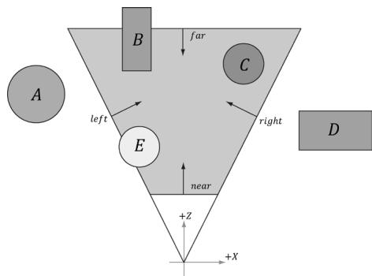


Figure 16.10. The objects bounded by volumes A and $D$ are completely outside the frustum, and so do not need to be drawn. The object corresponding to volume C is completely inside the frustum, and needs to be drawn. The objects bounded by volumes B and $E$ are partially outside the frustum and partially inside the frustum; we must draw these objects and let the hardware clip and triangles outside the frustum.


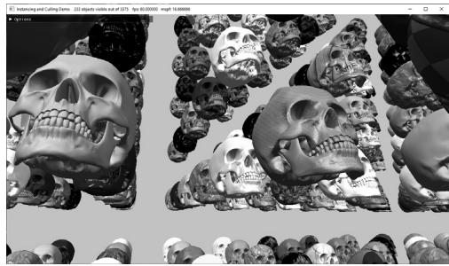


Figure 16.11. Screenshot of the “Instancing and Culling” demo.


```cpp
void InstancingAndCullingApp::UpdateInstanceData(const GameTimer& gt)  
{  
    XMMATRIX view = mCamera.GetView();  
    XMMatrix invView = XMMatrixInverse(&XMMatrixDeterminant_view), view);  
    auto currInstanceBuffer = mCurrFrameResource->InstanceBuffer.get();  
    for (auto e : mRItemLayer[(int)RenderLayer::OpaqueInstanced]) {  
        const auto& instanceData = e->Instances;  
        int visibleInstanceCount = 0;  
        for (UINT i = 0; i < (UINT)instanceData.size(); ++i) {  
            XMMatrix world = XMLoadFloat4x4(&instanceData[i].World);  
            XMMatrix texTransform = XMLoadFloat4x4(&instanceData[i].TexTransform);  
            XMMatrix invWorld = XMMatrixInverse(&XMMatrixDeterminant(world), world);  
        }  
        // View space to the object's local space.  
        XMMatrix viewToLocal = XMMatrixMultiply(fovView, invWorld);  
        // Transform the camera frustum from view space to the object's local space.  
        BoundingFrustum localSpaceFrustum;  
        mCamFrustum.Transform(localSpaceFrustum, viewToLocal);  
        // Perform the box/frustum intersection test in local space. 
```

auto result $=$ localSpaceFrustum.Contains(e->Bounds); if(mFrustumCullingEnabled $\equiv$ false || result != DirectX::DISJOINT) { InstanceData data; XMStoreFloat4x4(&data.World, XMMatrixTranspose的世界)); XMStoreFloat4x4(&data.TexTransform, XMMatrixTranspose(t exTransform)); data.MaterialIndex $=$ instanceof[i].MaterialIndex; data.CubeMapIndex $=$ mSkyBindlessIndex; //Write the instance data to structured buffer for the //visible objects. currInstanceBuffer->CopyData(possibleInstanceCount++, data); } } e->InstanceCount $=$ visibleInstanceCount; std::wosingletonouts; outs.precision(6); outs<< L"Instancing and Culling Demo" << L" " $<  <   \mathrm{e - >}$ InstanceCount << L" objects visible out of" $<  <   \mathrm{e - >}$ Instances.size(); mMainWndCaption $=$ outs.str(); } 

When we build the instanced render-item, we assign each instance cycles through the materials in the material library in the following way: 

```javascript
skullRitem->Instances[index].MaterialIndex = index % matLib. GetMaterialCount(); 
```

Even though our instanced buffer has room for every instance, we only draw the visible instances which correspond to instances from 0 to visibleInstanceCount-1: 

```txt
cmdList->DrawIndexedInstanced(ri->IndexCount, ri->InstanceCount, ri->StartIndexLocation, ri->BaseVertexLocation, 0); 
```

Figure 16.12 shows the performance difference between having frustum culling enabled and not. With frustum culling, we only submit eleven instances to the rendering pipeline for processing. Without frustum culling, we submit all 3,375 instances to the rendering pipeline for processing. Even though the visible scene is the same, with frustum culling disabled, we waste computation power drawing thousands of skull meshes whose geometry is eventually discarded during the clipping stage. Each skull has about 60K triangles, so that is a lot of vertices to process and a lot of triangles to clip per skull. By doing one frustum/AABB test, 

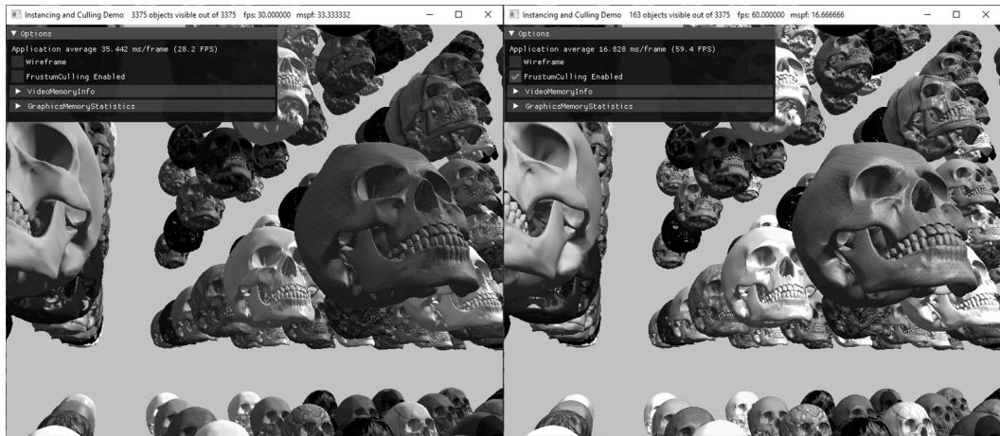


Figure 16.12. (Left) Frustum culling is turned off, and we are rendering all 3,375 instances; it takes about 33.33 ms to render a frame. (Right) Frustum culling is turned on, and we see that 163 out of 3,375 instances are visible, and our frame rate doubles.


we can reject 60K triangles from even being sent to the graphics pipeline—this is the advantage of frustum culling and we see the difference in the frames per second. 

# 16.4 SUMMARY

1. Instancing refers to drawing the same object more than once in a scene, but with different positions, orientations, scales, materials, and textures. To save memory, we can only create one mesh, and submit multiple draw calls to Direct3D with a different world matrix, material, and texture. To avoid the API overhead of issuing resource changes and multiple draw calls, we can bind an SRV to a structured buffer that contains all of our instance data and index into it in our vertex shader using the SV_InstancedID value. Furthermore, we can use dynamic indexing to index into arrays of textures. The number of instances to draw with one draw call is specified by the second parameter, InstanceCount, of the ID3D12GraphicsCommandList::DrawIndexedInstanced method. 

2. Bounding volumes are primitive geometric objects that approximate the volume of an object. The tradeoff is that although the bounding volume only approximates the object its form has a simple mathematical representation, which makes it easy to work with. Examples of bounding volumes are spheres, axis-aligned bounding boxes (AABB), and oriented bounding boxes (OBB). 

The DirectXCollision.h library has structures representing bounding volumes, and functions for transforming them, and computing various intersection tests. 

3. The GPU automatically discards triangles that are outside the viewing frustum in the clipping stage. However, clipped triangles are still submitted to the rendering pipeline via draw calls (which has API overhead), and all the triangles go through the vertex shader, possibly through the tessellation stages, and possibly through the geometry shader, only to be discarded during the clipping stage. To fix this inefficiency, we can implement frustum culling. The idea is to build a bounding volume, such as a sphere or box, around each object in the scene. If the bounding volume does not intersect the frustum, then we do not need to submit the object (which could contain thousands of triangles) to Direct3D for drawing. This saves the GPU from having to do wasteful computations on invisible geometry, at the cost of an inexpensive CPU test. 

# 16.5 EXERCISES

1. Modify the “Instancing and Culling” demo to use bounding spheres instead of bounding boxes. 

2. The plane equations in NDC space take on a very simple form. All points inside the view frustum are bounded as follows: 

$$
\begin{array}{l} - 1 \leq x _ {n d c} \leq 1 \\ - 1 \leq y _ {n d c} \leq 1 \\ 0 \leq z _ {n d c} \leq 1 \\ \end{array}
$$

In particular, the left plane equation is given by $x = - 1$ and the right plane equation is given by $x = 1$ in NDC space. In homogeneous clip space before the perspective divide, all points inside the view frustum are bounded as follows: 

$$
\begin{array}{l} - w \leq x _ {h} \leq w \\ - w \leq y _ {h} \leq w \\ 0 \leq z _ {h} \leq w \\ \end{array}
$$

Here, the left plane is defined by $w = - x$ and the right plane is defined by $w = x$ . Let $\mathbf { M } = \mathbf { V } \mathbf { P }$ be the view-projection matrix product, and let $\mathbf { v } = ( x , y , z , 1 )$ 

be a point in world space inside the frustum. Consider $( x _ { h } , y _ { h } , z _ { h } , w ) = \mathbf { v } \mathbf { M } =$ $( \mathbf { v } \cdot \mathbf { M } _ { * , 1 } , \mathbf { v } \cdot \mathbf { M } _ { * , 2 } , \mathbf { v } \cdot \mathbf { M } _ { * , 3 } , \mathbf { v } \cdot \mathbf { M } _ { * , 4 } )$ $\mathbf { v } \cdot \mathbf { M } _ { * , 2 }$ $\mathbf { v } \cdot \mathbf { M } _ { * , 3 }$ $\mathbf { v } \cdot \mathbf { M } _ { \ast , 4 } )$ to show that the inward facing frustum planes in world space are given by: 

<table><tr><td>Left</td><td>0 = v · (M*,1, + M*,4)</td></tr><tr><td>Right</td><td>0 = v · (M*,4, - M*,1)</td></tr><tr><td>Bottom</td><td>0 = v · (M*,2, + M*,4)</td></tr><tr><td>Top</td><td>0 = v · (M*,4, - M*,2)</td></tr><tr><td>Near</td><td>0 = v · M*,3</td></tr><tr><td>Far</td><td>0 = v · (M*,4, - M*,3)</td></tr></table>


a) We ask for inward facing normals. That means a point inside the frustum has a positive distance from the plane; in other words, $\mathbf { n } \cdot \mathbf { p } + d \geq 0$ for a point p inside the frustum. 

b) Note that $\nu _ { w } = 1$ , so the above dot product formulas do yield plane equations of the form $A x + B y + C z + D = 0$ . 

c) The calculated plane normal vectors are not unit length; see Appendix C for how to normalize a plane. 

3. Examine the DirectXCollision.h header file to get familiar with the functions it provides for intersection tests and bounding volume transformations. 

4. An OBB can be defined by a center point C, three orthonormal axis vectors $\mathbf { r } _ { 0 } , \mathbf { r } _ { 1 } ,$ , and $\mathbf { r } _ { 2 }$ defining the box orientation, and three extent lengths $a _ { 0 } , a _ { 1 } .$ , and $a _ { 2 }$ along the box axes $\mathbf { r } _ { 0 } , \mathbf { r } _ { 1 } ;$ and $\mathbf { r } _ { 2 } .$ , respectivey, that give the distance from the box center to the box sides. 

a) Consider Figure 16.13 (which shows the situation in 2D) and conclude the projected “shadow” of the OBB onto the axis defined by the normal vector is $2 r _ { ; }$ , where 

$$
r = \left| a _ {0} \mathbf {r} _ {0} \cdot \mathbf {n} \right| + \left| a _ {1} \mathbf {r} _ {1} \cdot \mathbf {n} \right| + \left| a _ {2} \mathbf {r} _ {2} \cdot \mathbf {n} \right|
$$

b) In the previous formula for $r ,$ , explain why we must take the absolute values instead of just computing $\boldsymbol { r } = \left( a _ { 0 } \mathbf { r } _ { 0 } + a _ { 1 } \mathbf { r } _ { 1 } + a _ { 2 } \mathbf { r } _ { 2 } \right) \cdot \mathbf { n } \boldsymbol { ? }$ 

c) Derive a plane/OBB intersection test that determines if the OBB is in front of the plane, behind the plane, or intersecting the plane. 

d) An AABB is a special case of an OBB, so this test also works for an AABB. However, the formula for $r$ simplifies in the case of an AABB. Find the simplified formula for $r$ for the AABB case. 

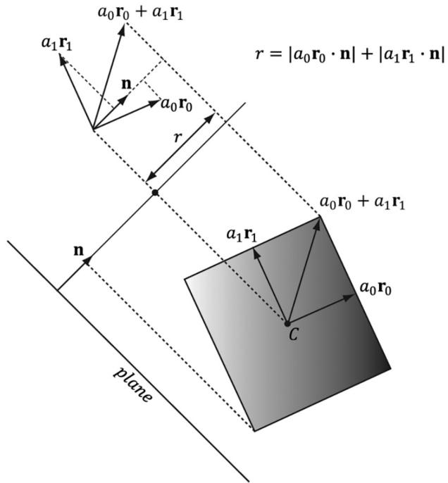


Figure 16.13. Plane/OBB intersection setup
