# Chapter

# 19 Norm al Mapp ing

In Chapter 9, we introduced texture mapping, which enabled us to map fine details from an image onto our triangles. However, our normal vectors are still defined at the coarser vertex level and interpolated over the triangle. For part of this chapter, we study a popular method for specifying surface normals at a higher resolution. Specifying surface normals at a higher resolution increases the detail of the lighting, but the mesh geometry detail remains unchanged. Displacement mapping, combined with tessellation, allows us to increase the detail of our meshes. 

# Chapter Objectives:

1. To understand why we need normal mapping. 

2. To discover how normal maps are stored. 

3. To learn how normal maps can be created. 

4. To find out the coordinate system the normal vectors in normal maps are stored relative to and how it relates to the object space coordinate system of a 3D triangle. 

5. To learn how to implement normal mapping in a vertex and pixel shader. 

6. To discover how displacement maps and tessellation can be combined to improve mesh detail. 

# 19.1 MOTIVATION

Consider Figure 19.1. The specular highlights on the cone shaped columns do not look right—they look unnaturally smooth compared to the bumpiness of the brick texture. This is because the underlying mesh geometry is smooth, and we have merely applied the image of bumpy bricks over the smooth cylindrical surface. However, the lighting calculations are performed based on the mesh geometry (in particular, the interpolated vertex normals), and not the texture image. Thus the lighting is not completely consistent with the texture. 

Ideally, we would tessellate the mesh geometry so much that the actual bumps and crevices of the bricks could be modeled by the underlying geometry. Then the lighting and texture could be made consistent. Hardware tessellation could help in this area, but we still need a way to specify the normals for the vertices generated by the tessellator (using interpolated normals does not increase our normal resolution). 

Another possible solution would be to bake the lighting details directly into the textures. However, this will not work if the lights are allowed to move, as the texel colors will remain fixed as the lights move. 

Thus our goal is to find a way to implement dynamic lighting such that the fine details that show up in the texture map also show up in the lighting. Since textures provide us with the fine details to begin with, it is natural to look for a texture mapping solution to this problem. Figure 19.2 shows the same scene shown in Figure 19.1 with normal mapping; we can see now that the dynamic lighting is much more consistent with the brick texture. 

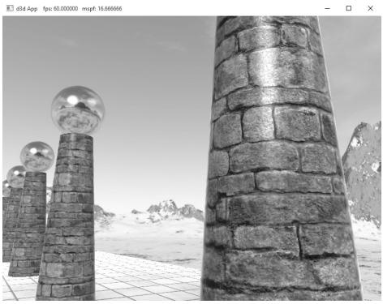


Figure 19.1. Smooth specular highlights.


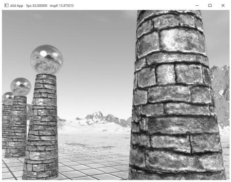


Figure 19.2. Bumpy specular highlights.


# 19.2 NORMAL MAPS

A normal map is a texture, but instead of storing RGB data at each texel, we store a compressed $x$ -coordinate, y-coordinate, and $z$ -coordinate in the red component, green component, and blue component, respectively. These coordinates define a normal vector; thus a normal map stores a normal vector at each pixel. Figure 19.3 shows an example of how to visualize a normal map. 

For illustration, we will assume a 24-bit image format, which reserves a byte for each color component, and therefore, each color component can range from 0–255. (A 32-bit format could be employed where the alpha component goes unused or stores some other scalar value such as a heightmap or specular map. Also, a floating-point format could be used in which no compression is necessary, but this requires more memory.) 

Note: 

As Figure 19.3 shows, the vectors are generally mostly aligned with the z-axis. That is, the z-coordinate has the largest magnitude. Consequently, normal maps usually appear mostly blue when viewed as a color image. This is because the z-coordinate is stored in the blue channel and since it has the largest magnitude, this color dominates. 

So how do we compress a unit vector into this format? First note that for a unit vector, each coordinate always lies in the range [–1, 1]. If we shift and scale this range to [0, 1] and multiply by 255 and truncate the decimal, the result will be an integer in the range 0–255. That is, if $x$ is a coordinate in the range [–1, 1], then the integer part of ${ \dot { f } } ( x )$ is an integer in the range 0–255, where $f$ is defined by 

$$
f (x) = (0. 5 x + 0. 5) \cdot 2 5 5
$$

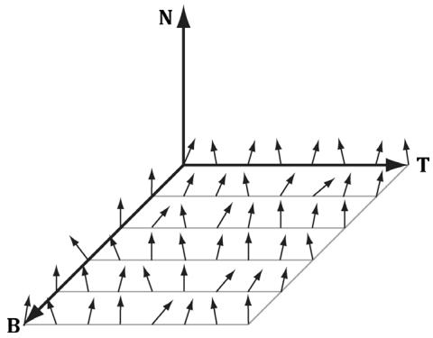


Figure 19.3. Normals stored in a normal map relative to a texture space coordinate system defined by the vectors T (x-axis), B (y-axis), and N (z-axis). The T vector runs right horizontally to the texture image; the B vector runs down vertically to the texture image; and N is orthogonal to the texture plane.


So to store a unit vector in 24-bit image, we just apply $f$ to each coordinate and write the coordinate to the corresponding color channel in the texture map. 

The next question is how to reverse the compression process; that is, given a compressed texture coordinate in the range 0–255, how can we recover its true value in the interval [–1, 1]. The answer is to simply invert the function $f ,$ which after a little thought, can be seen to be: 

$$
f ^ {- 1} (x) = \frac {2 x}{2 5 5} - 1
$$

That is, if $x$ is an integer in the range 0–255, then $f ^ { - 1 } ( x )$ is a floating-point number in the range [–1, 1]. 

We will not have to do the compression process ourselves, as we will use a tool to convert images to normal maps. However, when we sample a normal map in a pixel shader, we will have to do part of the inverse process to uncompress it. When we sample a normal map in a shader like this: 

```javascript
Texture2D normalMap = ResourceDescriptorHeap[normalMapIndex];
float3 normalMapSample = normalMapSAMPLE(GetAnisoWrapSampler(), pin.TexC).rgb; 
```

The color vector normalT will have normalized components $( r , g , b )$ such that $0 \leq$ $r , g , b \leq 1$ . 

Thus, the Sample method has already done part of the uncompressing work for us (namely the divide by 255, which transforms an integer in the range 0–255 to the floating-point interval [0, 1]). We complete the transformation by shifting and scaling each component in [0, 1] to [–1, 1] with the function $g \colon [ 0 , 1 ]  [ - 1 , 1 ]$ defined by: 

$$
g (x) = 2 x - 1
$$

In code, we apply this function to each color component like this: 

```txt
// Uncompress each component from [0,1] to [-1,1].  
normalT = 2.0f*normalT - 1.0f; 
```

This works because the scalar 1.0 is augmented to the vector (1, 1, 1) so that the expression makes sense and is done componentwise. You can also use a signed SNORM format to store normals such as DXGI_FORMAT_R8G8B8A8_SNORM so that you do not need to remap from [0, 1] to [–1, 1]. 

There are algorithms to estimate a normal map from a colored image. However, typically you want to generate a normal map from a height map that describes the bumps and crevices of a surface. The NVIDIA Texture Tools exporter (https://developer.nvidia.com/nvidia-texture-tools-exporter) has support for generating normal maps from colored images and heightmaps. Other tools are 

available for generating normal maps such as http://www.crazybump.com/, https://shadermap.com/home/, and https://boundingboxsoftware.com/ materialize/. In addition, it is also common for 3D modeling tools to be able to generate normal maps from high resolution meshes (a process often called normal map baking). Then the game will use a lower resolution mesh with the normal maps applied to add detail. 

# 19.3 TEXTURE/TANGENT SPACE

Consider a 3D texture mapped triangle. For the sake of discussion, suppose that there is no distortion in the texture mapping; in other words, mapping the texture triangle onto the 3D triangle requires only a rigid body transformation (translation and rotation). Now, suppose that the texture is like a decal. So we pick the decal up, translate it, and rotate it onto the 3D triangle. Now Figure 19.4 shows how the texture space axes relate to the 3D triangle: they are tangent to the triangle and lie in the plane of the triangle. The texture coordinates of the triangle are, of course, relative to the texture space coordinate system. Incorporating the triangle face normal N, we obtain a 3D TBN-basis in the plane of the triangle that we call texture space or tangent space. Note that the tangent space generally varies from triangle-to-triangle (see Figure 19.5). 

Now, as Figure 19.3 shows, the normal vectors in a normal map are defined relative to the texture space. But our lights are defined in world space. In order to do lighting, the normal vectors and lights need to be in the same space. So our first step is to relate the tangent space coordinate system with the object space 

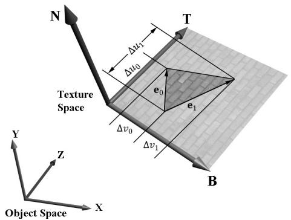


Figure 19.4. The relationship between the texture space of a triangle and the object space. The 3D tangent vector T aims in the $u$ -axis direction of the texturing coordinate system, and the 3D tangent vector B aims in the $V ^ { \prime }$ -axis direction of the texturing coordinate system.


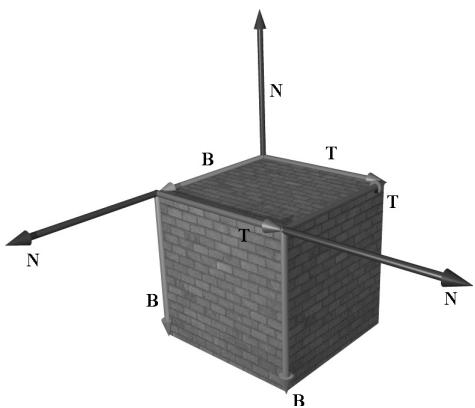


Figure 19.5. The texture space is different for each face of the box.


coordinate system the triangle vertices are relative to. Once we are in object space, we can use the world matrix to get from object space to world space (the details of this are covered in the next section). Let $\mathbf { v } _ { 0 } , \mathbf { v } _ { 1 } ,$ and $\mathbf { v } _ { 2 }$ define the three vertices of a 3D triangle with corresponding texture coordinates $( u _ { 0 } , \nu _ { 0 } )$ , $( u _ { 1 } , \nu _ { 1 } )$ , and $( u _ { 2 } , \nu _ { 2 } )$ that define a triangle in the texture plane relative to the texture space axes (i.e., T and B). Let $\mathbf { e } _ { 0 } = \mathbf { v } _ { 1 } - \mathbf { v } _ { 0 }$ and $\mathbf { e } _ { 1 } = \mathbf { v } _ { 2 } - \mathbf { v } _ { 0 }$ be two edge vectors of the 3D triangle with corresponding texture triangle edge vectors $( \Delta u _ { 0 } , \Delta \nu _ { 0 } ) = ( u _ { 1 } - u _ { 0 } ,$ $\nu _ { 1 } - \nu _ { 0 } )$ and $( \Delta u _ { 1 } , \Delta \nu _ { 1 } ) = ( u _ { 2 } - u _ { 0 } , \nu _ { 2 } - \nu _ { 0 } )$ . From Figure 19.4, it is clear that 

$$
\mathbf {e} _ {0} = \Delta u _ {0} \mathbf {T} + \Delta v _ {0} \mathbf {B}
$$

$$
\mathbf {e} _ {1} = \Delta u _ {1} \mathbf {T} + \Delta v _ {1} \mathbf {B}
$$

Representing the vectors with coordinates relative to object space, we get the matrix equation: 

$$
\left[ \begin{array}{l l l} e _ {0, x} & e _ {0, y} & e _ {0, z} \\ e _ {1, x} & e _ {1, y} & e _ {1, z} \end{array} \right] = \left[ \begin{array}{l l} \Delta u _ {0} & \Delta v _ {0} \\ \Delta u _ {1} & \Delta v _ {1} \end{array} \right] \left[ \begin{array}{l l l} T _ {x} & T _ {y} & T _ {z} \\ B _ {x} & B _ {y} & B _ {z} \end{array} \right]
$$

Note that we know the object space coordinates of the triangle vertices; hence we know the object space coordinates of the edge vectors, so the matrix 

$$
\left[ \begin{array}{c c c} e _ {0, x} & e _ {0, y} & e _ {0, z} \\ e _ {1, x} & e _ {1, y} & e _ {1, z} \end{array} \right]
$$

is known. Likewise, we know the texture coordinates, so the matrix 

$$
\left[ \begin{array}{c c} \Delta u _ {0} & \Delta v _ {0} \\ \Delta u _ {1} & \Delta v _ {1} \end{array} \right]
$$

is known. Solving for the T and B object space coordinates we get: 

$$
\begin{array}{l} \left[ \begin{array}{c c c} T _ {x} & T _ {y} & T _ {z} \\ B _ {x} & B _ {y} & B _ {z} \end{array} \right] = \left[ \begin{array}{c c} \Delta u _ {0} & \Delta v _ {0} \\ \Delta u _ {1} & \Delta v _ {1} \end{array} \right] ^ {- 1} \left[ \begin{array}{c c c} e _ {0, x} & e _ {0, y} & e _ {0, z} \\ e _ {1, x} & e _ {1, y} & e _ {1, z} \end{array} \right] \\ = \frac {1}{\Delta u _ {0} \Delta v _ {1} - \Delta v _ {0} \Delta u _ {1}} \left[ \begin{array}{c c} \Delta v _ {1} & - \Delta v _ {0} \\ - \Delta u _ {1} & \Delta u _ {0} \end{array} \right] \left[ \begin{array}{c c c} e _ {0, x} & e _ {0, y} & e _ {0, z} \\ e _ {1, x} & e _ {1, y} & e _ {1, z} \end{array} \right] \\ \end{array}
$$

In the above, we used the fact that the inverse of a matrix $\mathbf { A } = { \left[ \begin{array} { l l } { a } & { b } \\ { c } & { d } \end{array} \right] }$ b is given by: 

$$
\mathbf {A} ^ {- 1} = \frac {1}{a d - b c} \left[ \begin{array}{c c} d & - b \\ - c & a \end{array} \right]
$$

Note that the vectors T and B are generally not unit length in object space, and if there is texture distortion, they will not be orthonormal either. 

The T, B, and N vectors are commonly referred to as the tangent, binormal (or bitangent), and normal vectors, respectively. 

# 19.4 VERTEX TANGENT SPACE

In the previous section, we derived a tangent space per triangle. However, if we use this texture space for normal mapping, we will get a triangulated appearance since the tangent space is constant over the face of the triangle. Therefore, we specify tangent vectors per vertex, and we do the same averaging trick that we did with vertex normals to approximate a smooth surface: 

1. The tangent vector T for an arbitrary vertex v in a mesh is found by averaging the tangent vectors of every triangle in the mesh that shares the vertex v. 

2. The bitangent vector B for an arbitrary vertex v in a mesh is found by averaging the bitangent vectors of every triangle in the mesh that shares the vertex v. 

Generally, after averaging, the TBN-bases will generally need to be orthonormalized, so that the vectors are mutually orthogonal and of unit length. This is usually done using the Gram-Schmidt procedure. Code is available on the web for building a per-vertex tangent space for an arbitrary triangle mesh: http:// www.terathon.com/code/tangent.html. 

In our system, we will not store the bitangent vector B directly in memory. Instead, we will compute $\mathbf { B } = \mathbf { N } \times \mathbf { T }$ when we need B, where N is the usual averaged vertex normal. Hence, our vertex structure looks like this: 

```txt
struct Vertex
{
    XMFLOAT3 Pos;
    XMFLOAT3 Normal;
    XMFLOAT2 Tex;
    XMFLOAT3 TangentU;
}; 
```

Recall that our procedurally generated meshes created by MeshGen compute the tangent vector T corresponding to the $u$ -axis of the texture space. The object space coordinates of the tangent vector T is easily specified at each vertex for box and grid meshes (see Figure 19.5). For cylinders and spheres, the tangent vector T at each vertex can be found by forming the vector-valued function of two variables ${ \bf P } ( u , \nu )$ of the cylinder/sphere and computing ${ \partial \mathbf { p } } / { \partial u }$ , where the parameter $u$ is also used as the $u$ -texture coordinate. 

# 19.5 TRANSFORMING BETWEEN TANGENT SPACE AND OBJECT SPACE

At this point, we have an orthonormal TBN-basis at each vertex in a mesh. Moreover, we have the coordinates of the TBN vectors relative to the object space of the mesh. So now that we have the coordinate of the TBN-basis relative to the object space coordinate system, we can transform coordinates from tangent space to object space with the matrix: 

$$
\mathbf {M} _ {o b j e c t} = \left[ \begin{array}{c c c} T _ {x} & T _ {y} & T _ {z} \\ B _ {x} & B _ {y} & B _ {z} \\ N _ {x} & N _ {y} & N _ {z} \end{array} \right]
$$

Since this matrix is orthogonal, its inverse is its transpose. Thus, the change of coordinate matrix from object space to tangent space is: 

$$
\mathbf {M} _ {t a n g e n t} = \mathbf {M} _ {o b j e c t} ^ {- 1} = \mathbf {M} _ {o b j e c t} ^ {T} = \left[ \begin{array}{l l l} T _ {x} & B _ {x} & N _ {x} \\ T _ {y} & B _ {y} & N _ {y} \\ T _ {z} & B _ {z} & N _ {z} \end{array} \right]
$$

In our shader program, we will actually want to transform the normal vector from tangent space to world space for lighting. One way would be to transform the normal from tangent space to object space first, and then use the world matrix to transform from object space to world space: 

$$
\mathbf {n} _ {\text {w o r l d}} = \left(\mathbf {n} _ {\text {t a n g e n t}} \mathbf {M} _ {\text {o b j e c t}}\right) \mathbf {M} _ {\text {w o r l d}}
$$

However, since matrix multiplication is associative, we can do it like this: 

$$
\mathbf {n} _ {\text {w o r l d}} = \mathbf {n} _ {\text {t a n g e n t}} \left(\mathbf {M} _ {\text {o b j e c t}} \mathbf {M} _ {\text {w o r l d}}\right)
$$

And note that 

$$
\mathbf {M} _ {o b j e c t} \mathbf {M} _ {w o r l d} = \left[\begin{array}{l}{\leftarrow \mathbf {T} \rightarrow}\\{\leftarrow \mathbf {B} \rightarrow}\\{\leftarrow \mathbf {N} \rightarrow}\end{array}\right] \mathbf {M} _ {w o r l d} = \left[\begin{array}{l}{\leftarrow \mathbf {T} ^ {\prime} \rightarrow}\\{\leftarrow \mathbf {B} ^ {\prime} \rightarrow}\\{\leftarrow \mathbf {N} ^ {\prime} \rightarrow}\end{array}\right] = \left[\begin{array}{l l l}{T _ {x} ^ {\prime}}&{T _ {y} ^ {\prime}}&{T _ {z} ^ {\prime}}\\{B _ {x} ^ {\prime}}&{B _ {y} ^ {\prime}}&{B _ {z} ^ {\prime}}\\{N _ {x} ^ {\prime}}&{N _ {y} ^ {\prime}}&{N _ {z} ^ {\prime}}\end{array}\right]
$$

where $\mathbf { T ^ { \prime } } = \mathbf { T } \cdot \mathbf { M } _ { w o r l d }$ , $\mathbf { B ^ { \prime } } = \mathbf { B } \cdot \mathbf { M } _ { w o r l d }$ , and $\mathbf { N } ^ { \prime } = \mathbf { N } \cdot \mathbf { M } _ { w o r l d }$ . So to go from tangent space directly to world space, we just have to describe the tangent basis in world coordinates, which can be done by transforming the TBN-basis from object space coordinates to world space coordinates. 

We will only be interested in transforming vectors (not points). Thus, we only need a $3 \times 3$ matrix. Recall that the fourth row of an affine matrix is for translation, but we do not translate vectors. 

# 19.6 NORMAL MAPPING SHADER CODE

We summarize the general process for normal mapping: 

1. Create the desired normal maps from some art program or utility program and store them in an image file. Create 2D textures from these files when the program is initialized. 

2. For each triangle, compute the tangent vector T. Obtain a per-vertex tangent vector for each vertex v in a mesh by averaging the tangent vectors of every triangle in the mesh that shares the vertex v. (In our demo, we use simply geometry and are able to specify the tangent vectors directly, but this averaging process would need to be done if using arbitrary triangle meshes made in a 3D modeling program.) 

3. In the vertex shader, transform the vertex normal and tangent vector to world space and output the results to the pixel shader. 

4. Using the interpolated tangent vector and normal vector, we build the TBNbasis at each pixel point on the surface of the triangle. We use this basis to transform the sampled normal vector from the normal map from tangent space to the world space. We then have a world space normal vector from the normal map to use for our usual lighting calculations. 

To help us implement normal mapping, we have added the following function to Common.hlsl: 

```txt
// Transforms a normal map sample to world space.
// 
float3 NormalSampleToWorldSpace(float3 normalMapSample,
    float3 unitNormalW,
    float3 tangentW)
{
    // Uncompress each component from [0,1] to [-1,1].
    float3 normalT = 2.0f*normalMapSample - 1.0f;
    // Build orthonormal basis.
    float3 N = unitNormalW;
    float3 T = normalize(tangentW - dot(tangentW, N)*N);
    float3 B = cross(N, T);
} 
```

float3x3 TBN $=$ float3x3(T,B,N); //Transform from tangent space to world space. float3 bumpedNormalW $=$ mul(normalT,TBN); return bumpedNormalW;   
1 

This function is used like this in the pixel shader: 

```txt
Texture2D normalMap = ResourceDescriptorHeap[normalMapIndex];  
float3 normalMapSample = normalMap_SAMPLE(GetAnisoWrapSampler(), pin. TexC).rgb;  
bumpedNormalW = NormalSampleToWorldSpace( normalMapSample, pin.NormalW, pin.TangentW); 
```

Two lines that might not be clear are these: 

```txt
float3 N = unitNormalW;  
float3 T = normalize(tangentW - dot(tangentW, N) * N); 
```

After the interpolation, the tangent vector and normal vector may not be orthonormal. This code makes sure T is orthonormal to N by subtracting off any component of T along the direction N (see Figure 19.6). Note that there is the assumption that unitNormalW is normalized. 

Once we have the normal from the normal map, which we call the “bumped normal,” we use it for all the subsequent calculation involving the normal vector (e.g., lighting, cube mapping). The entire normal mapping effect is shown below for completeness, with the parts relevant to normal mapping in bold. 

```txt
// Include common HLSL code. #include "Shaders/Common.hls1" struct VertexIn { float3 PosL : POSITION; float3 NormalL : NORMAL; 
```

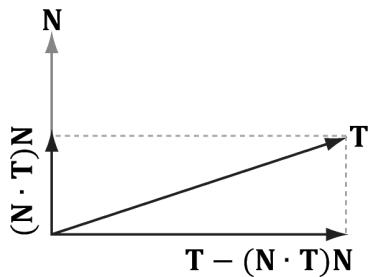


Figure 19.6. Since $| | \mathsf { N } | | = 1$ , $\mathsf { p r o j } _ { \mathsf { N } } ( \mathsf { T } ) = ( \mathsf { T } { \cdot } \mathsf { N } ) \mathsf { N }$ . The vector T-projN (T) is the portion of T orthogonal to N.


```txt
float2 TexC : TEXCOORD; float3 TangentU : TANGENT; #if SKINNED float3 BoneWeights : WEIGHTS; uint4 BoneIndices : BONEINDICES; #endif };   
struct VertexOut { float4 PosH : SV POSITION; float4 ShadowPosH : POSITION0; float4 SsaoPosH : POSITION1; float3 PosW : POSITION2; float3 NormalW : NORMAL; float3 TangentW : TANGENT; float2 TexC : TEXCOORD; #if DRAW_INSTANCED // nointerpolation is used so the index is not interpolated // across the triangle. nointerpolation uint MatIndex : MATINDEX; #endif };   
VertexOut VS(VertexIn vin #if DRAW_INSTANCED , uint instanceID : SV InstanceID #endif } { VertexOut vout = (VertexOut)0.0f;   
#if DRAW_INSTANCED // Fetch the instance data. InstanceData instData = gInstanceData[instanceID]; float4x4 world = instData.World; float4x4 texTransform = instData.TexTransform; uint matIndex = instData.MaterialIndex; vout.MatIndex = matIndex; MaterialData matData = gMaterialData[matIndex]; #else MaterialData matData = gMaterialData[gMaterialIndex]; float4x4 world = gWorld; float4x4 texTransform = gTexTransform; #endif   
#if SKINNED ApplySkinning( vin.BoneWeights, vin.BoneIndices, vin(PosL, vin. NormalL, vin.TangentU.xyz); #endif 
```

// Transform to world space. float4 posW = mul(float4(vin(PosL, 1.0f), world); voutPosW = posW.xyz; // Assumes nonuniform scaling; otherwise, need to use // inverse-transpose of world matrix. vout.NormalW = mul(vin.NormalL, (float3x3)world); vout.TangentW = mul(vin.TangentU, (float3x3)world); // Transform to homogeneous clip space. vout_PosH = mul(posW, gViewProj); if( gSsaoEnabled ) { // Generate projective tex-coords to project SSAO map // onto scene. vout.SsaoPosH = mul(posW, gViewProjTex); } // Output vertex attributes for interpolation across triangle. float4 texC = mul(float4(vin.TexC, 0.0f, 1.0f), texTransform); vout.TexC = mul(texC, DataMatTransformation).xy; if( gShadowsEnabled ) { // Generate projective tex-coords to project shadow map // onto scene. vout.ShadowPosH = mul(posW, gShadowTransform); } return vout; } float4 PS(VertexOut pin): SV_Target { // Fetch the material data. #if DRAW_INSTANCED MaterialData matData = gMaterialData[pin.matIndex]; #else MaterialData matData = gMaterialData[gMaterialIndex]; #endif float4 diffuseAlbedo = matData.DiffuseAlbedo; float3 fresnelR0 = matData.FresnelR0; float roughness = matData.Roughness; uint diffuseMapIndex = matData.DiffuseMapIndex; uint normalMapIndex = matData.NormalMapIndex; uint glossHeightAoMapIndex = matData.GlossHeightAoMapIndex; // Dynamically look up the texture in the array. Texture2D diffuseMap = ResourceDescriptorHeap[diffuseMapIndex]; diffuseAlbedo $\ast =$ diffuseMap_SAMPLE(GetAnisoWrapSampler(), pin. TexC); 

```txt
def ALPHA_TEST
// Discard pixel if texture alpha < 0.1. We do this test as soon
// as possible in the Shader so that we can potentially exit the
// Shader early, thereby skipping the rest of the Shader code.
clip(diffuseAlbedo.a - 0.1f);
endif
// Interpolating normal can unnormalize it, so renormalize it.
pin.NormalW = normalize(pin.NormalW);
float3 bumpedNormalW = pin.NormalW;
if(gNormalMapsEnabled)
{
Texture2D normalMap = DescriptorHeap[normalMapIndex];
float3 normalMapSample = normalMap;
Sample(GetAnisoWrapSampler(), pinTEXC).rgb;
bumpedNormalW = NormalSampleToWorldSpace(normalMapSample,
pin.NormalW, pin.TangentW);
}
Texture2D glossHeightAoMap = DescriptorHeap[glossHeightAo
MapIndex];
float3 glossHeightAo = glossHeightAoMap;
Sample(GetAnisoWrapSampler(), pinTEXC).rgb;
// Vector from point being lit to eye.
float3 toEyeW = normalize(gEyePosW - pin(PosW);
float ambientAccess = 1.0f;
if(gSsaoEnabled)
{
// Finish texture projection and sample SSAO map.
pin.SsaoPosH /= pin.SsaoPosH.w;
Texture2D ssaoMap = DescriptorHeap[gSsaoAmbientMap0Ind
ex];
ambientAccess = ssaoMap_SAMPLE(GetLinearClampSampler(), pin.
SsaoPosH.xy, 0.0f).r;
}
// Light terms.
float4 ambient = ambientAccess*gAmbientLight*diffuseAlbedo;
ambient *= glossHeightAo.z;
// Only the first light casts a shadow.
float3 shadowFactor = float3(1.0f, 1.0f, 1.0f);
if(gShadowsEnabled)
{
shadowFactor[0] = CalcShadowFactor(pin.ShadowPosH);
}
// gloss is per-pixel shininess.
const float shininess = glossHeightAo.x * (1.0f - roughness);
Material mat = { diffuseAlbedo, fresnelR0, shininess }; 
```

float4 directLight $=$ ComputeLighting(gLights,mat，pin(PosW, bumpedNormalW,toEyeW，shadowFactor);   
float4 litColor $=$ ambient $^+$ directLight;   
//Add in specular reflections.   
if( gReflectionsEnabled）{ TextureCube gCubeMap $=$ ResourceDescriptorHeap[gSkyBoxIndex]; float3r $=$ reflect(-toEyeW,bumpedNormalW); float4reflectionColor $\equiv$ gCubeMap. Sample(GetLinearWrapSampler(),r); float3fresnelFactor $=$ SchlickFresnel(fresnelR0, bumpedNormalW,r); litColor.rgb $+ =$ ambientAccess\*shininess \*fresnelFactor\* reflectionColor.rgb;   
}   
//Common convention to take alpha from diffuse albedo. litColor.a $=$ diffuseAlbedo.a; return litColor; 

Observe that the “bumped normal” vector is use in the light calculation, but also in the reflection calculation for modeling reflections from the environment map. In addition, we introduce a new texture map associated with each material. 

```c
struct MaterialData
{
    [...] 
    uint GlossHeightAoMapIndex;
    [...] 
}; 
```

This texture map stores three separate scalar values: gloss, height, and ambient occlusion. For us, gloss represents shininess, so it gives us a shininess value at the texture granularity instead of at the per-mesh granularity. The height component stores a value that denotes the height of the surface per-texel. Using a heightmap in combination with tessellation, we can do displacement mapping where the heightmap indicates how the new tessellated geometry should be offset to create detailed bumps and crevices. Finally, the ambient occlusion component stores a static ambient occlusion factor included in the texture. Ambient occlusion is discussed in Chapter 21, but we can think of it as darkening areas like cracks and crevices that receive less overall light due to the surrounding geometry. 

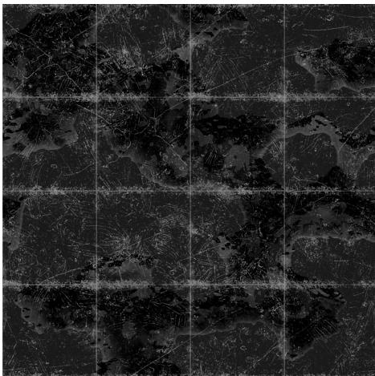


Figure 19.7. This is the red channel of the stonefloor_gloss_height_ao.dds image from the book’s downloadable materials. The alpha channel denotes the shininess of the surface. White values indicate a shininess value of 1.0 and black values indicate a shininess value of 0.0. This gives us per-pixel control of the shininess material property.


# 19.7 DISPLACEMENT MAPPING

Now that we understand normal mapping, we can improve the effect by combining it with tessellation and displacement mapping. The motivation for this is that normal mapping just improves the lighting detail, but it does not improve the detail of the actual geometry. In a sense, normal mapping is just a lighting trick. The idea of displacement mapping is to utilize an additional texture map, called a heightmap, which describes the bumps and crevices of a surface. In other words, whereas a normal map has three color channels to yield a normal vector $( x , y , z )$ for each pixel, the heightmap has a single color channel to yield a height value $h$ at each pixel. Visually, a heightmap is just a grayscale image (gray, since there is only one color channel), where each pixel is interpreted as a height value—it is basically a discrete representation of a 2D scalar field $h = f ( x , y )$ . When we tessellate the mesh, we sample the heightmap in the domain shader to offset the vertices in the normal vector direction to add geometric detail to the mesh (see Figure 19.8). 

While tessellating geometry adds triangles, it does not add detail on its own. That is, if you subdivide a triangle several times, you just get more triangles that lie on the original triangle plane. To add detail (e.g., bumps and crevices), then you need to offset the tessellated vertices in some way. A heightmap is one input source that can be used to displace the tessellated vertices. Typically, the following formula is used to displace a vertex position p, where we also utilize the outward surface normal vector n as the direction of displacement: 

$$
\mathbf {p} ^ {\prime} = \mathbf {p} + s (h - 1) \mathbf {n}
$$

The scalar $h \in [ 0 , 1 ]$ is the scalar value obtained from the heightmap. We subtract 1 from $h$ to shift the interval $[ 0 , 1 ]  [ - 1 , 0 ]$ ; because the surface normal is outward facing from the mesh, this means that we displace “inward” instead of “outward.” This is common convention, as it is usually more convenient to “pop” geometry in rather than “pop” geometry out. The scalar $s$ is a scale factor to scale the overall height to some world space value. The height value $h$ from the heightmap is in a 

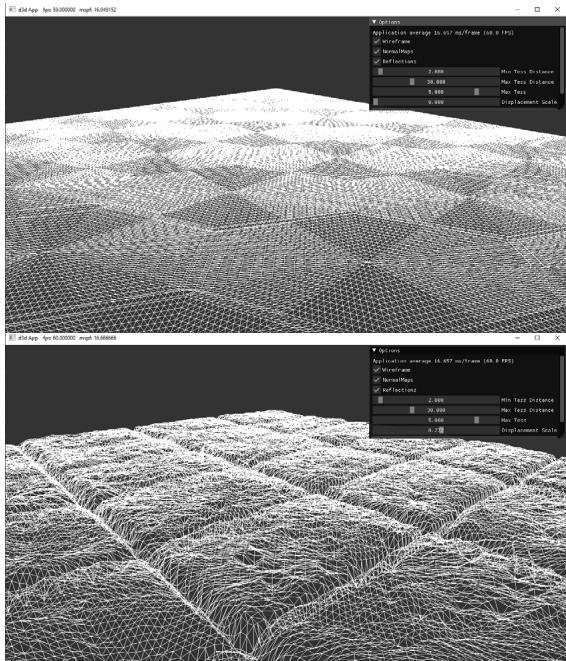


Figure 19.8. The tessellation stage creates additional triangles so that we can model small bumps and crevices in the stone tile floor geometry. The displacement map displaces the vertices to create true geometric bumps and crevices.


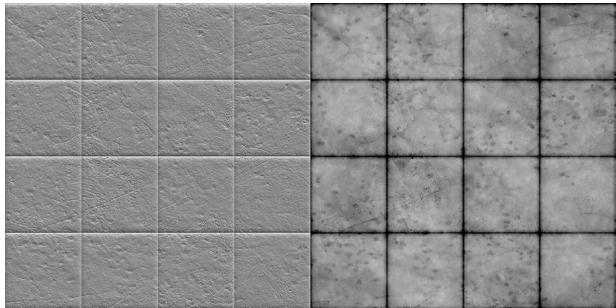


Figure 19.9. (Left) Normal map of stonefloor_normal.dds. (Right) Heightmap stored in the green channel of the stonefloor_gloss_height_ao.dds texture. A white value represents the highest height, and a black value represents the lowest height. Gray values represent intermediate heights.


normalized range where 0 means the lowest height (most inward displacement) and 1 means the highest height (no displacement). Let’s say we want to, at most, offset by 5 world units. Then we take $s = 5$ so that $s ( h - 1 ) \in [ - 5 , 0 ]$ . 

Generating heightmaps is an artistic task, and the texture artists can paint them or use tools to generate them (e.g., http://www.crazybump.com/, https:// shadermap.com/home/, and https://boundingboxsoftware.com/materialize/). Note that the corresponding heightmap and normal map are related; you could estimate the normal map from the heightmap, for example. 

From Figure 19.8, we see that displacement mapping requires many triangles to show the small details at a geometric level; therefore, you should use it where it can noticeably improve the quality and use normal mapping when it is sufficient. Furthermore, you can use displacement mapping up close and then fade it out to just a normal mapping effect over distance. 

We now discuss the shader code for displacement mapping. Most of the displacement mapping code occurs in the vertex shader, the hull shader, and the domain shader. The pixel shader is identical to the one we used for normal mapping. 


The implementation for tessellated geometry as described in these sections is in the TessGeo.hlsl. The actual pipeline state object (PSO) uses the same DefaultPS.hlsl we have been using in Part 3 of this book. Only render-items that use displacement mapping will use a PSO that uses TessGeo.hlsl, and such render-items are drawn in a separate RenderLayer::OpaqueTess. 

# 19.7.1 Primitive Type

To integrate displacement mapping into our rendering, we need to support tessellation so that we can refine our geometry resolution to one that better matches the resolution of the displacement map. We can incorporate tessellation into our existing triangle meshes very easily by drawing our meshes with primitive type D3D_PRIMITIVE_TOPOLOGY_3_CONTROL_POINT_PATCHLIST instead of D3D_ PRIMITIVE_TOPOLOGY_TRIANGLELIST. This way, the three vertices of a triangle are interpreted as the three control points of a triangle patch, allowing us to tessellate each triangle. 

# 19.7.2 Vertex Shader

When using hardware tessellation, recall that the vertex shader operates per patch control point. It is like a shader for control points rather than vertices. In our implementation, the only vertex shader work we do is transform the attributes to world space and propagate the texture coordinates. 

```lisp
struct VertexIn
{
    float3 PosL : POSITION;
    float3 NormalL : NORMAL;
    float2 TexC : TEXCOORD;
    float3 TangentU : TANGENT;
};
struct VertexOut
{
    float3 PosW : POSITION;
    float3 NormalW : NORMAL;
    float2 TexC : TEXCOORD;
    float3 TangentU : TANGENT;
};
VertexOut VS(VertexIn vin)
{
    VertexOut vout;
    vout(PosW = mul(float4(vin(PosL, 1.0f), gWorld).xyz);
    // Assumes nonuniform scaling; otherwise, need to use
    // inverse-transpose of world matrix.
    vout.NormalW = mul(vin.NormalL, (float3x3)gWorld);
    vout.TexC = vin.TexC;
    vout.TangentU = mul(vin.TangentU, (float3x3)gWorld);
    return vout;
} 
```

# 19.7.3 Hull Shader

Recall that the constant hull shader is evaluated per patch and is tasked with outputting the tessellation factors of the mesh. The tessellation factors instruct the tessellation stage how much to tessellate the patch. For this, we compute a distance-based tessellation factor for each edge, as well as the triangle interior. In addition, we frustum cull each triangle, as there is no point tessellating a triangle if it is going to be culled anyway; setting the tessellation factors to zero essentially removes the triangle from further processing. 

float CalcTessFactor(float3 p)   
{ float d $=$ distance(p,gEyePosW); float s $=$ saturate((d-gMeshMinTessDist)/(gMeshMaxTessDist-gMeshMinTessDist)); return pow(2,(lerp(gMeshMaxTess,gMeshMinTess,s))）;   
} 

```txt
struct PatchTess {
    float EdgeTess[3] : SV_TessFactor;
    float InsideTess[1] : SV_InsideTessFactor;
    // Extra data per patch
    float TessLevel : TESS_LEVEL;
};
PatchTess ConstantHS(InputPatch<vertex out, 3> patch, uint patchID : SV_PrimitiveID)
{
    PatchTess pt;
    // 
    // Frustum cull the triangle--if the box containing the triangle 
    // is outside the frustum then no point tessellating it.
    // 
    float3 vMin = min(
        min(float3(batch[0].PosW), float3(batch[1].PosW)), 
        float3(batch[2].PosW));
    float3 vMax = max(
        max(float3(batch[0].PosW), float3(batch[1].PosW)), 
        float3(batch[2].PosW));
    float3 boxCenter = 0.5f*(vMin + vMax);
    // Inflate box a bit to compensate for displacement mapping.
    float3 boxExtents = 0.5f*(vMax - vMin) + float3(1, 1, 1);
    if (AabbOutsideFrustumTest.boxCenter, boxExtents, gWorldFrustumPlanes)) 
    {
        pt.Edgewise[0] = 0.0f;
        pt.Edgewise[1] = 0.0f;
        pt.Edgewise[2] = 0.0f;
        pt.InsidesTess[0] = 0.0f;
        return pt;
    }
    // Do normal tessellation based on distance.
    // 
    else
    {
        // It is important to do the tess factor calculation 
        // based on the edge properties so that edges 
        // shared by more than one patch will have the 
        // same tessellation factor. Otherwise, gaps can 
        // appear. 
```

```javascript
// Compute midpoint on edges, and patch center float3 e0 = 0.5f\* (patch[1].PosW + patch[2].PosW); float3 e1 = 0.5f\* (patch[0].PosW + patch[2].PosW); float3 e2 = 0.5f\* (patch[0].PosW + patch[1].PosW); float3 c = (patch[0].PosW + patch[1].PosW + patch[2].PosW) / 3.0f; pt.EddTess[0] = CalcTessFactor(e0); pt.EddTess[1] = CalcTessFactor(e1); pt.EddTess[2] = CalcTessFactor(e2); pt.InsiderTess[0] = CalcTessFactor(c, pt.TessLevel); return pt; } 
```

The constant buffer values are as follows: 

```txt
float gMeshMinTessDist;  
float gMeshMaxTessDist;  
float gMeshMinTess;  
float gMeshMaxTess; 
```

These values are part of the PerObjectCB, but are only used for objects that use displacement mapping. Because it is not a lot of memory, we decided it was not worth making a separate data structure for displacement mapping objects. 

It is important that edges shared by more than one triangle have the same tessellation factor, otherwise cracks in the mesh can appear (see Figure 19.10). One way to guarantee shared edges have the same tessellation factor is to compute the tessellation factor solely on properties of the edge like we do in the above code. As an example of a way not to compute the tessellation factors, suppose that we compute the interior tessellation factor by looking at the distance between the 

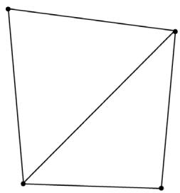


(a)


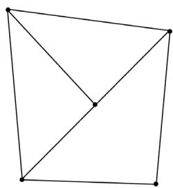


(b)


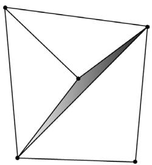


(c)


Figure 19.10. a) Two triangles that share an edge. (b) The top triangle gets tessellated so that an extra vertex along the edge is introduced. The bottom triangle does not get tessellated. (c) From displacement mapping, the newly created vertex gets moved. This creates a gap (denoted by the shaded region) between the two triangles that once shared an edge.


eye and triangle centroid. Then we propagate the interior tessellation factor to the edge tessellation factors. If two adjacent triangles had different tessellation factors, then their edges would have different tessellation factors creating a T-junction that could lead to cracks after displacement mapping. 

Recall that the control point hull shader inputs the control points for a patch and outputs the control points for a patch (possibly different from the input patch size). The control point hull shader is invoked once per control point output but has access to the entire input patch. In our case, we input a triangle patch and output a triangle patch, and the control point hull shader is simply a “pass through” shader: 

```lisp
struct HullOut
{
    float3 PosW : POSITION;
    float3 NormalW : NORMAL;
    float2 TexC : TEXCOORD;
    float3 TangentU : TANGENT;
};
[domain("tri")] [partitioning("fractional_odd")] [outputtopology("triangle_cw")] [outputcontrolpoints(3)];
[patchconstantfunc("ConstantHS")] [maxtessfactor(64.0f)];
HullOut HS(InputPatch<vertexOut, 3> p, uint i : SV_OutputControlPointID, uint patchId : SV_PrimitiveID)
{
    HullOut hout;
    // Pass through shader.
    hout(PosW = p[i].PosW;
    hout.NormalW = p[i].NormalW;
    hout.TexC = p[i].TexC;
    hout.TangentU = p[i].TangentU;
    return hout;
} 
```

# 19.7.4 Domain Shader

While the vertex shader is executed for each input patch control point, the domain shader is invoked for each vertex created by the tessellation stage. It is here that we do the displacement mapping by sampling the heightmap and offsetting the vertices in the normal direction according to the formula discussed in $\$ 19.7$ . 

```lisp
struct DomainOut
{
    float4 PosH : SV_POSITION;
    float4 ShadowPosH : POSITION0;
    float4 SsaoPosH : POSITION1;
    float3 PosW : POSITION2;
    float3 NormalW : NORMAL;
    float3 TangentW : TANGENT;
    float2 TexC : TEXCOORD;
};
[domain("tri")] DomainOut DS(PatchTess patchTess, float3 baryCoords : SV_DomainLocation, const OutputPatch<HullOut, 3> tri)
{
    DomainOut dout = (DomainOut)0.0f;
    dout(PosW = baryCoords.x * tri[0].PosW + baryCoords.y * tri[1].PosW + baryCoords.z * tri[2].PosW);
    dout.NormalW = baryCoords.x * tri[0].NormalW + baryCoords.y * tri[1].NormalW + baryCoords.z * tri[2].NormalW;
    dout.TexC = baryCoords.x * tri[0].TexC + baryCoords.y * tri[1].TexC + baryCoords.z * tri[2].TexC;
    dout.TangentW = baryCoords.x * tri[0].TangentU + baryCoords.y * tri[1].TangentU + baryCoords.z * tri[2].TangentU;
    dout.NormalW = normalize(dout.NormalW);
    // Reorthogonalize the normal and tangent.
    dout.TangentW = normalize(dout.TangentW - dot(dout.NormalW, dout.TangentW) * dout.NormalW);
    float4 posW = float4(dout-posW, 1.0f);
    MaterialData matData = gMaterialData[gMaterialIndex];
    // Output vertex attributes for interpolation across triangle.
    float4 texC = mul(float4(dout.TexC, 0.0f, 1.0f), gTexTransform);
    dout.TexC = mulTEXC, matData.MatTransform).xy;
    uint glossHeightAoMapIndex = Data.glossHeightAoMapIndex;
    Texture2D glossHeightAoMap = ResourceDescriptorHeap[glossHeightAoMapIndex]; 
```

// Do displacement mapping. Use the interior triangle // TessLevel as a way to estimate the mipLevel to // prevent oversampling artifacts. float mipLevel $=$ gMeshMaxTess - patchTess.TessLevel; float layerHeight $=$ glossHeightAoMap_SAMPLELevel(GetAnisoWrapSamp1 er(), dout.TexC, mipLevel).g; posW.xyz $+ =$ matData.DisplacementScale\*layerHeight\*dout.NormalW; // Transform to homogeneous clip space. dout_PosH $=$ mul(posW,gViewProj); if( gSsaoEnabled ) { // Generate projective tex-coords to project SSAO map // onto scene. dout.SsaoPosH $=$ mul(posW,gViewProjTex); } if( gShadowsEnabled ) { // Generate projective tex-coords to project shadow map // onto scene. dout.ShadowPosH $=$ mul(posW,gShadowTransform); } return dout; 

One thing worth mentioning is that we need to do our own mipmap level selection in the domain shader. The usual pixel shader method Texture2D::Sample is not available in the domain shader, so we must use the Texture2D::SampleLevel method. This method requires us to specify the mipmap level. You can use distance or some other metric to select a lower mip level so that you do not get oversampling artifacts with displacement mapping as the geometry becomes more distant from the camera. 

# 19.8 SUMMARY

1. The strategy of normal mapping is to texture our polygons with normal maps. We then have per-pixel normals, which capture the fine details of a surface like bumps, scratches, and crevices. We then use these per-pixel normals from the normal map in our lighting calculations, instead of the interpolated vertex normal. 

2. A normal map is a texture, but instead of storing RGB data at each texel, we store a compressed $x$ -coordinate, $y$ -coordinate, and $z \mathrm { . }$ -coordinate in the red component, green component, and blue component, respectively. We use various tools to generate normal maps, such as the ones located at https:// developer.nvidia.com/nvidia-texture-tools-exporter, http://www.crazybump. com/, https://shadermap.com/home/, and https://boundingboxsoftware.com/ materialize/. 

3. The coordinates of the normals in a normal map are relative to the texture space coordinate system. Consequently, to do lighting calculations, we need to transform the normal from the texture space to the world space so that the lights and normals are in the same coordinate system. The TBN-bases built at each vertex facilitates the transformation from texture space to world space. 

4. The idea of displacement mapping is to utilize an additional map, called a heightmap, which describes the bumps and crevices of a surface. When we tessellate the mesh, we sample the heightmap in the domain shader to offset the vertices in the normal vector direction to add geometric detail to the mesh. 

# 19.9 EXERCISES

1. Download the NVIDIA Texture Tools exporter (https://developer.nvidia.com/ nvidia-texture-tools-exporter) and experiment with making different normal maps. Try your normal maps out in this chapter’s demo application. 

2. Download versions of Crazy Bump (http://www.crazybump.com/), Shader Map (https://shadermap.com/home/), and Materialize (https:// boundingboxsoftware.com/materialize/). Load a color image, and experiment with making a normal map as well as the other kind of material maps they can generate such as heightmaps, gloss, and occlusion maps. Try your normal maps out in this chapter’s demo application. 

3. If you apply a rotation texture transformation, then you need to rotate the tangent space coordinate system accordingly. Explain why. In particular, this means you need to rotate T about N in world space, which will require expensive trigonometric calculations (more precisely, a rotation transform about an arbitrary axis N). Another solution is to transform T from world space to tangent space, where you can use the texture transformation matrix directly to rotate T, and then transform back to world space. 

4. Instead of doing lighting in world space, we can transform the eye and light vector from world space into tangent space and do all the lighting calculations in that space. Modify the normal mapping shader to do the lighting calculations in tangent space. 

5. Displacement mapping can be used to implement ocean waves. The idea is to scroll two (or more) heightmaps over a flat vertex grid at different speeds and directions. For each vertex of the grid, we sample the heightmaps and add the heights together; the summed height becomes the height (i.e., y-coordinate) of the vertex at this instance in time. By scrolling the heightmaps, waves continuously form and fade away, giving the illusion of ocean waves (see Figure 19.11). For this exercise, implement the ocean wave effect just described using the two ocean wave heightmaps (and corresponding normal maps) available to download for this chapter (Figure 19.12). Here are a few hints for making the waves look good: 

a) Tile the heightmaps differently so that one set can be used to model broad low frequency waves with high amplitude and the other can be used to model high frequency small choppy waves with low amplitude. You will need two sets of texture coordinates for the heightmaps maps and two texture transformations for the heightmaps. 

b) The normal map textures should be tiled more than the heightmap textures. The heightmaps give the shape of the waves, and the normal maps are used to light the waves per pixel. As with the heightmaps, the normal maps should translate over time and in different directions to give the illusion of new waves forming and fading. The two normals can then be combined using code similar to the following: 

```txt
float3 normalMapSample0 = gNormalMap0SAMPLE(samLinear, pin. WaveNormalTex0).rgb;   
float3 bumpedNormalW0 = NormalSampleToWorldSpace( normalMapSample0, pin.NormalW, pin.TangentW);   
float3 normalMapSample1 = gNormalMap1SAMPLE(samLinear, pin. WaveNormalTex1).rgb;   
float3 bumpedNormalW1 = NormalSampleToWorldSpace( normalMapSample1, pin.NormalW, pin.TangentW);   
float3 bumpedNormalW = normalize(bumpedNormalW0 + bumpedNormalW1); 
```

c) Create a new “ocean” material to give it a bluish tint, but still keep some reflection in from the environment map. 

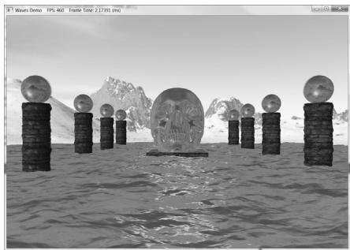


Figure 19.11. Ocean waves modeled with heightmaps, normal maps, and environment mapping.


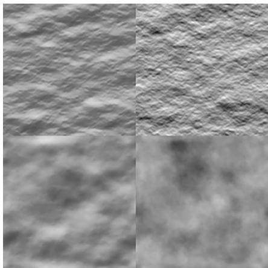


Figure 19.12. (Top Row) Ocean waves normal map and heightmap for high frequency choppy waves. (Bottom Row) Ocean waves normal map and heightmap for low frequency broad waves.
