# Chapter

# 21 Am bient Occl usion

Due to performance constraints, it is common for real-time lighting models not to take indirect light (i.e., light that has bounced off other objects in the scene) into consideration. However, much light we see in the real world is indirect. In Chapter 8 we introduced the ambient term to the lighting equation: 

$$
\mathbf {c} _ {a} = \mathbf {A} _ {L} \otimes \mathbf {m} _ {d}
$$

The color $\mathbf { A } _ { L }$ specifies the total amount of indirect (ambient) light a surface receives from a light source, and the diffuse albedo $\mathbf { m } _ { d }$ specifies the amount of incoming light that the surface reflects due to diffuse reflectance. All the ambient term does is uniformly brighten up the object a bit so that it does not go completely black in shadow—there is no real physics calculation at all. The idea is that the indirect light has scattered and bounced around the scene so many times that it strikes the object equally in every direction. Figure 21.1 shows that if we draw a model using only the ambient term, it is rendered out as a constant color. 

Figure 21.1 makes it clear that our ambient term could use some improvement. In this chapter, we discuss the popular technique of ambient occlusion to improve our ambient term. 

# Chapter Objectives:

1. To understand the basic idea behind ambient occlusion and how to implement ambient occlusion via ray casting. 

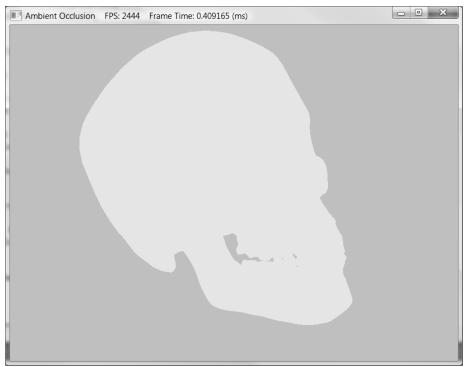


Figure 21.1. A mesh rendered with only the ambient term appears as a solid color.


2. To learn how to implement a real-time approximation of ambient occlusion in screen space called screen space ambient occlusion. 

# 21.1 AMBIENT OCCLUSION VIA RAY CASTING

The idea of ambient occlusion is that the amount of indirect light a point p on a surface receives is proportional to how occluded it is to incoming light over the hemisphere about p—see Figure 21.2. 

One way to estimate the occlusion of a point p is via ray casting. We randomly cast rays over the hemisphere about p, and check for intersections against the mesh (Figure 21.3). If we cast $N$ rays, and $h$ of them intersect the mesh, then the point has the occlusion value: 

$$
o c c l u s i o n = \frac {h}{N} \in [ 0, 1 ]
$$

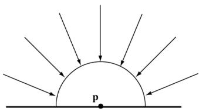


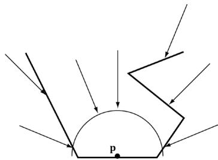


Figure 21.2. a) A point p is completely unoccluded and all incoming light over the hemisphere about p reaches p. (b) Geometry partially occludes p and blocks incoming light rays over the hemisphere about p.


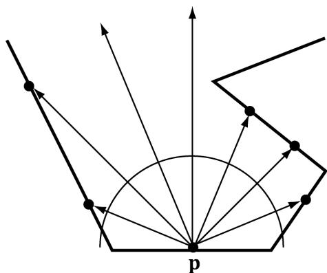


Figure 21.3. Estimating ambient occlusion via ray casting.


Only rays with an intersection point q whose distance from p is less than some threshold value $d$ should contribute to the occlusion estimate; this is because an intersection point q far away from p is too far to occlude it. 

The occlusion factor measures how occluded the point is (i.e., how much light it does not receive). For the purposes of calculations, we like to work with the inverse of this. That is, we want to know how much light the point does receive—this is called accessibility (or we call it ambient-access) and is derived from occlusion as: 

$$
a c c e s s i b l i t y = 1 - o c c l u s i o n \in [ 0, 1 ]
$$

The following code performs the ray cast per triangle, and then averages the occlusion results with the vertices that share the triangle. The ray origin is the triangle’s centroid, and we generate a random ray direction over the hemisphere of the triangle. 

```cpp
void AmbientOcclusionApp::BuildVertexAmbientOcclusion(
    std::vector<vertex> & vertices,
    const std::vector<UINT>& indices)
{
    UINT vcount = vertices.size();
    UINT tcount = indices.size() / 3;
    std::vector<XMFOAT3> positions(vcount);
    for (UINT i = 0; i < vcount; ++i)
        positions[i] = vertices[i].Pos;
    Octree octree;
    octree.Build(positions, indices);
    // For each vertex, count how many triangles contain the vertex.
    std::vector<int> vertexSharedCount(vcount);
    // Cast rays for each triangle, and average triangle occlusion
    // with the vertices that share this triangle.
    for (UINT i = 0; i < tcount; ++i) 
```

```txt
{   
UINT i0 = indices[i*3+0];   
UINT i1 = indices[i*3+1];   
UINT i2 = indices[i*3+2];   
XMVECTOR v0 = XMLoadFloat3(&vertices[i0].Pos);   
XMVECTOR v1 = XMLoadFloat3(&vertices[i1].Pos);   
XMVECTOR v2 = XMLoadFloat3(&vertices[i2].Pos);   
XMVECTOR edge0 = v1 - v0;   
XMVECTOR edge1 = v2 - v0;   
XMVECTOR normal = XMVector3Normalize(   
XMVector3Cross(edge0, edge1));   
XMVECTOR centroid = (v0 + v1 + v2)/3.0f;   
// Offset to avoid self intersection.   
centroid += 0.001f*normal;   
const int NumSampleRays = 32;   
float numUnoccluded = 0;   
for(int j = 0; j < NumSampleRays; ++j) {   
XMVECTOR randomDir = MathHelper::RandHemisphereUnitVec3(normal);   
// Test if the random ray intersects the scene mesh.   
//   
// TODO: Technically we should not count intersections   
// that are far away as occluding the triangle, but   
// this is OK for demo.   
if(!octree.RayOctreeIntersect centroid, randomDir)   
{   
numUnoccluded++;   
}   
}   
float ambientAccess = numUnoccluded / NumSampleRays;   
// Average with vertices that share this face.   
vertices[i0].AmbientAccess += ambientAccess;   
vertices[i1].AmbientAccess += ambientAccess;   
vertices[i2].AmbientAccess += ambientAccess;   
vertexSharedCount[i0]++;   
vertexSharedCount[i1]++;   
vertexSharedCount[i2]++;   
}   
// Finish average by dividing by the number of samples we added,   
// and store in the vertex attribute.   
for(UINT i = 0; i < vcount; ++i) {   
vertices[i].AmbientAccess /= vertexSharedCount[i]; 
```

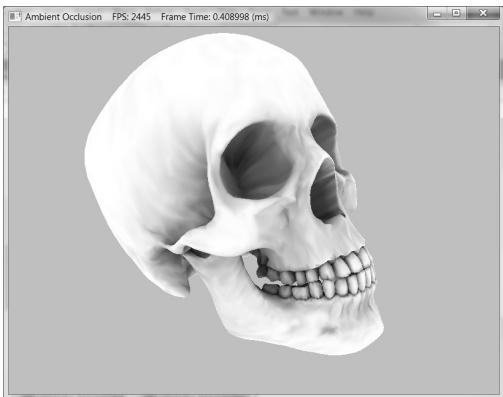


Figure 21.4. The mesh is rendered only with ambient occlusion—there are no scene lights. Notice how the crevices are darker; this is because when we cast rays out they are more likely to intersect geometry and contribute to occlusion. On the other hand, the skull cap is white (unoccluded) because when we cast rays out over the hemisphere for points on the skull cap, they will not intersect any geometry of the skull.


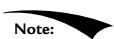


The demo uses an octree to speed up the ray/triangle intersection tests. For a mesh with thousands of triangles, it would be very slow to test each random ray with every mesh triangle. An octree sorts the triangles spatially, so we can quickly find only the triangles that have a good chance of intersecting the ray; this reduces the number of ray/triangle intersection tests substantially. An octree is a classic spatial data structure, and Exercise 1 asks you to research them further. 

Figure 21.4 shows a screenshot of a model rendered only with ambient occlusion generated by the previous algorithm (there are no light sources in the scene). The ambient occlusion is generated as a precomputation step during initialization and stored as vertex attributes. As we can see, it is a huge improvement over Figure 21.1—the model actually looks 3D now. 

Precomputing ambient occlusion works well for static models; there are even tools (http://www.xnormal.net) that generate ambient occlusion maps—textures that store ambient occlusion data. However, for animated models these static approaches break down. If you load and run the “Ambient Occlusion” demo, you will notice that it takes a few seconds to precompute the ambient occlusion for just one model. Hence, casting rays at runtime to implement dynamic ambient occlusion is not feasible. In the next section, we examine a popular technique for computing ambient occlusion in real-time using screen space information. 

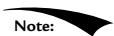


With recent ray tracing GPU support, it is possible to implement dynamic ambient occlusion using ray tracing methods. However, this is still an expensive method and requires a high-end GPU with ray tracing support. One day, it will probably become the standard way to implement dynamic ambient occlusion. 

# 21.2 SCREEN SPACE AMBIENT OCCLUSION

The strategy of screen space ambient occlusion (SSAO) is, for every frame, render the scene view space normals to a full screen render target and the scene depth to the usual depth/stencil buffer, and then estimate the ambient occlusion at each pixel using only the view space normal render target and the depth/stencil buffer as input. Once we have a texture that represents the ambient occlusion at each pixel, we render the scene as usual to the back buffer, but apply the SSAO information to scale the ambient term at each pixel. 

# 21.2.1 Render Normals and Depth Pass

First we render the view space normal vectors of the scene objects to a screen sized DXGI_FORMAT_R16G16B16A16_FLOAT texture map, while the usual depth/stencil buffer is bound to lay down the scene depth. The vertex/pixel shaders used for this pass are as follows: 

```txt
// Include common HLSL code. #include "Shaders/Common.hls1"   
struct VertexIn { float3 PosL : POSITION; float3 NormalL : NORMAL; float2 TexC : TEXCOORD; float3 TangentU : TANGENT; #if SKINNED float3 BoneWeights : WEIGHTS; uint4 BoneIndices : BONEINDICES; #endif } ;   
struct VertexOut { float4 PosH : SV POSITION; float3 NormalW : NORMAL; float3 TangentW : TANGENT; float2 TexC : TEXCOORD; } ;   
VertexOut VS (VertexIn vin) { VertexOut vout = (VertexOut)0.0f; // Fetch the material data. MaterialData matData = gMaterialData[gMaterialIndex]; #if SKINNED ApplySkinning( vin.BoneWeights, vin.BoneIndices, vin(PosL, 
```

```txt
vin.NormalL, vin.TangentU.xyz);
#endif
// Assumes nonuniform scaling; otherwise, need to use
// inverse-transpose of world matrix.
vout.NormalW = mul(vin.NormalL, (float3x3)gWorld);
vout.TangentW = mul(vin.TangentU, (float3x3)gWorld);
// Transform to homogeneous clip space.
float4 posW = mul(float4(vin-posL, 1.0f), gWorld);
vout(PosH = mul(posW, gViewProj);
// Output vertex attributes for interpolation across triangle.
float4 texC = mul(float4(vin.TexC, 0.0f, 1.0f), gTexTransform);
vout.TexC = mulTEXC, matData.MatTransform).xy;
return vout;
}
// Used for SSAO
float4 DrawViewNormalsPS(VertexOut pin) : SV_Target
{
// Fetch the material data.
MaterialData.matData = gMaterialData[gMaterialIndex];
float4 diffuseAlbedo = matData.DiffuseAlbedo;
uint diffuseMapIndex = matData.DiffuseMapIndex;
uint normalMapIndex = matData.NormalMapIndex;
// Dynamically look up the texture in the array.
Texture2D diffuseMap = ResourceDescriptorHeap[diffuseMapIndex];
diffuseAlbedo *= diffuseMap_SAMPLE(GetAnisoWrapSampler(), pin. TexC);
#endif
alpha_TEST
// Discard pixel if texture alpha < 0.1. We do this test as soon
// as possible in the shader so that we can potentially exit the
// shade early, thereby skipping the rest of the shader code.
clip(diffuseAlbedo.a - 0.1f);
#endif
// Interpolating normal can unnormalize it, so renormalize it.
pin.NormalW = normalize(pin.NormalW);
// NOTE: We use interpolated vertex normal for SSAO.
// Write normal in view space coordinates
float3 normalV = mul(pin.NormalW, (float3x3)gView);
return float4(normalV, 0.0f);
} 
```

As the code shows, the pixel shader outputs the normal vector in view space. Observe that we are writing to a floating-point render target, so there is no problem writing out arbitrary floating-point data. 

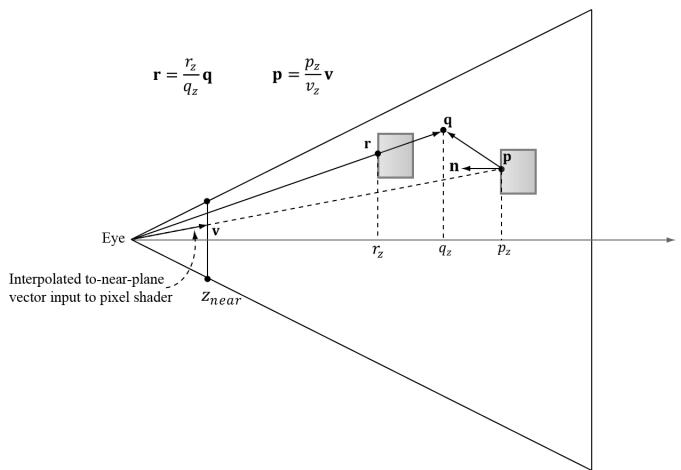


Figure 21.5. The points involved in SSAO. The point p corresponds to the current pixel we are processing, and it is reconstructed from the depth value stored in the depth buffer and the vector v that passes through the near plane at this pixel. The point q is a random point in the hemisphere of p. The point r corresponds to the nearest visible point along the ray from the eye to q. The point r contributes to the occlusion of p if $\displaystyle \dot { | p _ { z } - r _ { z } | }$ is sufficiently small and the angle between r - p and n is less than $9 0 ^ { \circ }$ . In the demo, we take 14 random sample points and average the occlusion from each to estimate the ambient occlusion in screen space.


# 21.2.2 Ambient Occlusion Pass

After we have laid down the view space normals and scene depth, we disable the depth buffer (we do not need it for generating the ambient occlusion texture), and draw a full screen quad to invoke the SSAO pixel shader at each pixel. The pixel shader will then use the normal texture and depth buffer to generate an ambient accessibility value at each pixel. We call the generated texture map in this pass the SSAO map. Although we render the normal/depth map at full screen resolution (i.e., the resolution of our back buffer), we render to the SSAO map at half the width and height of the back buffer for performance reasons. Rendering at half the dimensions does not affect quality too much, as ambient occlusion is a low frequency effect. Refer to Figure 21.5 throughout the following subsections. 

# 21.2.2.1 Reconstruct View Space Position

When we draw the full screen quad to invoke the SSAO pixel shader at each pixel of the SSAO map, we can use the inverse of the projection matrix to transform the quad corner points in NDC space to points on the near projection plane window: 

```javascript
static const float2 gTexCoords[6] = {float2(0.0f, 1.0f),float2(0.0f, 0.0f),float2(1.0f, 0.0f),float2(0.0f, 1.0f),float2(1.0f, 0.0f),float2(1.0f, 1.0f)}; 
```

// Draw call with 6 vertices   
VertexOut VS uint vid : SV_VertexID)   
{ VertexOut vout; vout.TexC $=$ gTexCoords[vid]; //Quad covering screen in NDC space. vout_PosH $=$ float4(2.0f*vout.TexC.x - 1.0f, 1.0f - 2.0f*vout.TexC.y, 0.0f, 1.0f); //Transform quad corners to view space near plane. float4 ph $=$ mul(vout_PosH, gInvProj); vout_PosV $=$ ph.xyz / ph.w; return vout; 

These to-near-plane vectors are interpolated across the quad and give us a vector v (Figure 21.5) from the eye to the near plane for each pixel. Now, for each pixel, we sample the depth buffer so that we have the $z$ -coordinate $\scriptstyle { p _ { z } }$ of the nearest visible point to the eye in NDC coordinates. The goal is to reconstruct the view space position $\mathbf { p } = ( p _ { x } , p _ { y } , p _ { z } )$ from the sampled NDC $z$ -coordinate $\ b { p } _ { z }$ and the interpolated to-near-plane vector v. This reconstruction is done as follows. Since the ray of v passes through p, there exists a $t$ such that $\mathbf { p } = t \mathbf { v }$ . In particular, $p _ { z } = t \nu _ { z }$ so that $t = p _ { z } / \nu _ { z }$ . Thus $\begin{array} { r } { \mathbf { p } = { \frac { \vec { P } _ { z } } { \nu _ { z } } } \mathbf { v } } \end{array}$ . The reconstruction code in the pixel shader is as follows: 

float NdcDepthToViewDepth(float z_nde{ // We can invert the calculation from NDC space to view space for the // z-coordinate. We have that // $z_{-}\mathrm{ndc} = \mathrm{A} + \mathrm{B}/$ viewZ, where gProj[2,2] $\equiv$ A and gProj[3,2] $\equiv$ B. // Therefore... float viewZ $\equiv$ gProj[3][2] / (z_nde - gProj[2][2]); return viewZ;   
1   
float4 PS(VertexOut pin) : SV_Target { // Get z-coord of this pixel in NDC space from depth map. float pz $\equiv$ gDepthMap_SAMPLELevel(gsamDepthMap, pin.TexC, 0.0f).r; // Transform depth to view space. pz $\equiv$ NdcDepthToViewDepth(pz); // Reconstruct the view space position of the point with depth pz. float3 p $\equiv$ (pz/ pin(PosV.z)*pin-posV; [...]   
1 

# 21.2.2.2 Generate Random Samples

This step is analogous to the random ray cast over the hemisphere. We randomly sample $N$ points $\mathbf { q }$ about $\mathbf { p }$ that are also in front of p and within a specified occlusion radius. The occlusion radius is an artistic parameter to control how far away from p we want to take the random sample points. Choosing to only sample points in front of p is analogous to only casting rays over the hemisphere instead of the whole sphere when doing ray casted ambient occlusion. 

The next question is how to generate the random samples. We can generate random vectors and store them in a texture map, and then sample this texture map at $N$ different positions to get $N$ random vectors. However, since they are random we have no guarantee that the vectors we sample will be uniformly distributed—they may all clump together in roughly the same direction, which would give a bad occlusion estimate. To overcome this, we do the following trick. In our implementation, we use $N = 1 4$ samples, and we generate fourteen equally distributed vectors in the $\mathrm { C } { + + }$ code: 

```cpp
void Ssao::BuildOffsetVectors()
{
    // Start with 14 uniformly distributed vectors. We choose the
    // 8 corners of the cube and the 6 center points along each
    // cube face. We always alternate the points on opposite sides
    // of the cubes. This way we still get the vectors spread out
    // even if we choose to use less than 14 samples.
    // 8 cube corners
    mOffsets[0] = XMFLOAT4(+1.0f, +1.0f, +1.0f, 0.0f);
    mOffsets[1] = XMFLOAT4(-1.0f, -1.0f, -1.0f, 0.0f);
    mOffsets[2] = XMFLOAT4(-1.0f, +1.0f, +1.0f, 0.0f);
    mOffsets[3] = XMFLOAT4(+1.0f, -1.0f, -1.0f, 0.0f);
    mOffsets[4] = XMFLOAT4(+1.0f, +1.0f, -1.0f, 0.0f);
    mOffsets[5] = XMFLOAT4(-1.0f, -1.0f, +1.0f, 0.0f);
    mOffsets[6] = XMFLOAT4(-1.0f, +1.0f, -1.0f, 0.0f);
    mOffsets[7] = XMFLOAT4(+1.0f, -1.0f, +1.0f, 0.0f);
    // 6 centers of cube faces
    mOffsets[8] = XMFLOAT4(-1.0f, 0.0f, 0.0f, 0.0f);
    mOffsets[9] = XMFLOAT4(+1.0f, 0.0f, 0.0f, 0.0f);
    mOffsets[10] = XMFLOAT4(0.0f, -1.0f, 0.0f, 0.0f);
    mOffsets[11] = XMFLOAT4(0.0f, +1.0f, 0.0f, 0.0f);
    mOffsets[12] = XMFLOAT4(0.0f, 0.0f, -1.0f, 0.0f);
    mOffsets[13] = XMFLOAT4(0.0f, 0.0f, +1.0f, 0.0f);
    for (int i = 0; i < 14; ++i)
        { 
```

```objectivec
// Create random lengths in [0.25, 1.0].  
float s = MathHelper::RandF(0.25f, 1.0f);  
XMVECTOR v = s * XMVector4Normalize(XMLoadFloat4(&mOffsets[i]));  
XMStoreFloat4(&mOffsets[i], v);  
} 
```


We use 4D homogeneous vectors just so we do not have to worry about any alignment issues when setting the array of offset vectors to the effect. 

Now, in the pixel shader we just sample the random vector texture map once, and use it to reflect our fourteen equally distributed vectors. This results in 14 equally distributed random vectors. 

# 21.2.2.3 Generate the Potential Occluding Points

We now have random sample points q surrounding p. However, we know nothing about them—whether they occupy empty space or a solid object; therefore, we cannot use them to test if they occlude p. To find potential occluding points, we need depth information from the depth buffer. So what we do is generate projective texture coordinates for each q with respect to the camera, and use these to sample the depth buffer to get the depth in NDC space, and then transform to view space to obtain the depth $r _ { z }$ of the nearest visible pixel along the ray from the eye to q. With the $z$ -coordinates $r _ { z }$ known, we can reconstruct the full 3D view space position r in an analogous way we did in §21.2.2.1. Because the vector from the eye to q passes through r there exists a $t$ such that $\mathbf { r } = t \mathbf { q }$ . In particular, $r _ { z } =$ $t q _ { z }$ so $t = r _ { z } / q _ { z }$ . Therefore, $\begin{array} { r } { \mathbf { r } = \frac { r _ { z } } { q _ { z } } \mathbf { q } } \end{array}$ . The points r, one generated for each random sample point q, are our potential occluding points. 

# 21.2.2.4 Perform the Occlusion Test

Now that we have our potential occluding points r, we can perform our occlusion test to estimate if they occlude p. The test relies on two quantities: 

1. The view space depth distance $\left| p _ { z } - r _ { z } \right|$ . We linearly scale down the occlusion as the distance increases since points farther away from have less of an occluding effect. If the distance is beyond some specified maximum distance, then no occlusion occurs. Also, if the distance is very small, then we assume $\mathbf { p }$ and $\mathbf { q }$ are on the same plane so q cannot occlude p. 

2. The angle between n and $\mathbf { r } - \mathbf { p }$ measured by $\begin{array} { r } { \operatorname* { m a x } \Big ( \mathbf { n } \cdot \Big ( \frac { \mathbf { r } - \mathbf { p } } { \| \mathbf { r } - \mathbf { p } \| } \Big ) , 0 \Big ) . } \end{array}$ . This is to prevent self-intersection (see Figure 21.6). 

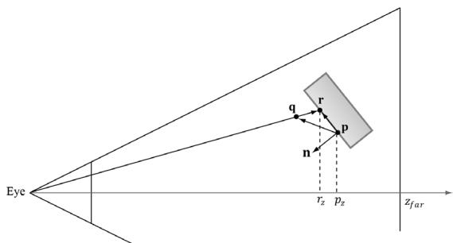


Figure 21.6. If r lies on the same plane as p, it can pass the first condition that the distance $\left| \hat { p } _ { z } - r _ { z } \right|$ is small enough that r occludes p. However, the figure shows this is incorrect as r does not occlude p since they lie on the same plane. Scaling the occlusion by $\scriptstyle \operatorname* { m a x } \left( \mathbf { n } \cdot \left( { \frac { \mathbf { r } - \mathbf { p } } { \| \mathbf { r } - \mathbf { p } \| } } \right) , 0 \right)$ prevents this situation.


# 21.2.2.5 Finishing the Calculation

After we have summed the occlusion from each sample, we compute the average occlusion by dividing by the sample count. Then we compute the ambient-access, and finally raise the ambient-access to a power to increase the contrast. You may also wish to increase the brightness of the ambient map by adding some number to increase the intensity. You can experiment with different contrast/brightness values. 

occlusionSum $=$ gSampleCount;   
float access $= 1.0f$ - occlusionSum;   
// Sharpen the contrast of the SSAO map to make the SSAO affect // more dramatic.   
return saturate(pow(access,6.0f)); 

# 21.2.2.6 Implementation

The previous section outlined the key ingredients for generating the SSAO map. Below are the HLSL programs: 

```txt
// Include common HLSL code. #include "Shaders/Common.hls1"   
DEFINE_CBUFFER(SsaoCB,b0) { float4 gOffsetVectors[14]; // For SsaoBlur.hsl float4 gBlurWeights[3]; // Coordinates given in view space. float gOcclusionRadius; float gOcclusionFadeStart; float gOcclusionFadeEnd; 
```

float gSurfaceEpsilon; float2 gInvAmbientMapSize; uint gHorzBlur; uint gSsaoCB_Pad;   
};   
static const int gSampleCount $= 14$ static const float2 gTexCoords[6] $=$ { float2(0.0f, 1.0f), float2(0.0f, 0.0f), float2(1.0f, 0.0f), float2(0.0f, 1.0f), float2(1.0f, 0.0f), float2(1.0f, 1.0f)   
};   
struct VertexOut { float4 PosH : SV POSITION; float3 PosV : POSITION; float2 TexC : TEXCOORDO;   
}；   
VertexOut VS(void : SV VertexID) { VertexOut vout; vout.TexC = gTexCoords[vid]; // Quad covering screen in NDC space. vout.PosH $=$ float4(2.0f*vout.TexC.x - 1.0f, 1.0f - 2.0f*vout. TexC.y, 0.0f, 1.0f); // Transform quad corners to view space near plane. float4 ph $=$ mul(vout.PosH, gInvProj); vout.PosV $=$ ph.xyz / ph.w; return vout;   
}   
// Determines how much the sample point q occludes the point p   
// as a function of distZ.   
float OcclusionFunction(float distZ) { /\* // If depth(q) is "behind" depth(p), then q cannot occlude p. // Moreover, if depth(q) and depth(p) are sufficiently close, // then we also assume q cannot occlude p because q needs // to be in front of p by Epsilon to occlude p. 

```lisp
// We use the following function to determine the occlusion.  
//  
//  
// 1.0  
//  
//  
//  
//  
//  
//  
//  
//  
//  
//  
//  
//  
//  
//  
//  
//  
float occlusion = 0.0f;  
if(distZ > gSurfaceEpsilon)  
{ float fadeLength = gOcclusionFadeEnd - gOcclusionFadeStart; // Linearly decrease occlusion from 1 to 0 as distZ goes // from gOcclusionFadeStart to gOcclusionFadeEnd. occlusion = saturate( (gOcclusionFadeEnd-distZ)/fadeLength ); } return occlusion;  
}  
float NdcDepthToViewDepth(float z_nde); // z_nde = A + B/viewZ, where gProj[2,2] = A and gProj[3,2] = B. float viewZ = gProj[3][2] / (z_nde - gProj[2][2]); return viewZ;  
}  
float4 PS(VertexOut pin) : SV_Target  
{ Texture2D normalMap = ResourceDescriptorHeap[gSceneNormalMapIndex]; Texture2D depthMap = ResourceDescriptorHeap[gSceneDepthMapIndex]; Texture2D randomVecMap = ResourceDescriptorHeap[gRandomTexIndex]; // p -- the point we are computing the ambient occlusion for. // n -- normal vector at p. // q -- a random offset from p. // r -- a potential occluder that might occlude p.  
// Get viewspace normal and z-coord of this pixel. float3 n = normalize(normalMapSAMPLELevel(GetPointClampSampler(), pin.TexC, 0.0f).xyz); float pz = depthMapSAMPLELevel(GetPointClampSampler(), pin.TexC, 0.0f).r; pz = NdcDepthToViewDepth(pz);  
// Reconstruct full view space position (x,y,z).  
// Find t such that p = t*pin(PosV. 
```

```lisp
// p.z = t*pin(PosV.z
// t = p.z / pin(PosV.z
//float3 p = (pz/pin(PosV.z) *pin(PosV;
// Extract random vector and map from [0,1] ---> [-1, +1].
float3 randVec = 2.0f*randomVecMap_SAMPLELevel(GetLinearWrapSampler(   ), 4.0f*pin.TexC, 0.0f).rgb - 1.0f;
float occlusionSum = 0.0f;
// Sample neighboring points about p in the hemisphere oriented by n.
for(int i = 0; i < gSampleCount; ++i)
{
// Are offset vectors are fixed and uniformly distributed
// (so that our offset vectors do not clump in the same
// direction). If we reflect them about a random vector
// then we get a random uniform distribution of offset
// vectors.
float3 offset = reflect(gOffsetVectors[i].xyz, randVec);
// Flip offset vector if it is behind the plane defined by
(p, n).
float flip = sign( dot(offset, n) );
// Sample a point near p within the occlusion radius.
float3 q = p + flip * gOcclusionRadius * offset;
// Project q and generate projective tex-coords.
float4 projQ = mul(float4(q, 1.0f), gProj);
projQ /= projQ.w;
projQ.x = +0.5f*projQ.x + 0.5f;
projQ.y = -0.5f*projQ.y + 0.5f;
// Find the nearest depth value along the ray from the
// eye to q (this is not the depth of q, as q is just an
// arbitrary point near p and might occupy empty
// space). To find the nearest depth we look it up
// in the depthmap.
float rz = depthMap/sampleLevel(GetPointClampSampler(), projQ.
xy, 0.0f).r;
rz = NdcDepthToViewDepth(rz);
// Reconstruct full view space position r = (rx, ry, rz).
// We know r lies on the ray of q, so there exists a t
// such that r = t*q. r.z = t*q.z => t = r.z / q.z
float3 r = (rz / q.z) * q;
// Test whether r occludes p.
// * The product dot(n, normalize(r - p)) measures how 
```

// much in front of the plane(p,n) the occluder point r is. // The more in front it is, the more occlusion weight we // give it. This also prevents self shadowing where // a point r on an angled plane (p,n) could give a false // occlusion since they have different depth values with // respect to the eye. // \* The weight of the occlusion is scaled based on how // far the occluder is from the point we are computing // the occlusion of. If the occluder r is far away // from p, then it does not occlude it. // float distZ $=$ p.z - r.z; float dp $=$ max.dot(n, normalize(r - p)), 0.0f); float occlusion $=$ dp\*OcclusionFunction(distZ); occlusionSum $+=$ occlusion; } occlusionSum $= =$ gSampleCount; float access $= 1.0f$ - occlusionSum; // Sharpen the contrast of the SSAO map to make the // SSAO affect more dramatic. return saturate(pow(access, 6.0f)); 

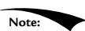


For scenes with large viewing distances, rendering errors can result due to the limited accuracy of the depth buffer. A simple solution is to fade out the affect of SSAO with distance. 

# 21.2.3 Blur Pass

Figure 21.7 shows what our ambient occlusion map currently looks like. The noise is due to the fact that we have only taken a few random samples. Taking enough samples to hide the noise is impractical for real-time. The common solution is to apply an edge preserving blur (i.e., bilateral blur) to the SSAO map to smooth it out. If we used a non-edge preserving blur, then we lose definition in the scene as sharp discontinuities become smoothed out. The edge preserving blur is similar to the blur we implemented in Chapter 13, except we add a conditional statement so that we do not blur across edges (edges are detected from the normal/depth map): 

```txt
//  
// Performs a bilateral edge preserving blur of the ambient map. We use  
// a pixel shader instead of compute shader to avoid the switch from  
// compute mode to rendering mode. The texture cache makes up for some  
// of the loss of not having shared memory. The ambient map uses 
```

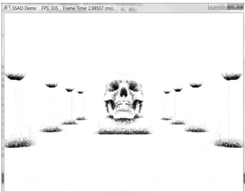


Figure 21.7. SSAO appears noisy due to the fact that we have only taken a few random samples.


```c
// 16-bit texture format, which is small, so we should be able to  
// fit a lot of texels in the cache.  
DEFINE_CBUFFER(SsaoCB, b0)  
{ float4 gOffsetVectors[14]; // For SsaoBlur.hls1 float4 gBlurWeights[3]; // Coordinates given in view space. float gOcclusionRadius; float gOcclusionFadeStart; float gOcclusionFadeEnd; float gSurfaceEpsilon; float2 gInvAmbientMapSize; uint gHorzBlur; uint gSsaoCB_Pad; }; // Include common HLSL code. #include "Shaders/Common.hls1"  
static const int gSsaoBlurRadius = 5;  
static const float2 gTexCoords[6] = { float2(0.0f, 1.0f), float2(0.0f, 0.0f), float2(1.0f, 0.0f), float2(0.0f, 1.0f), float2(1.0f, 0.0f), float2(1.0f, 1.0f); } 
```

```lisp
struct VertexOut {
    float4 PosH : SV POSITION;
    float2 TexC : TEXCOORD;
};
VertexOut VS( uint vid : SV_VertexID)
{
    VertexOut vout;
    vout.TexC = gTexCoords[vid];
    // Quad covering screen in NDC space.
    vout(PosH = float4(2.0f*vout.TexC.x - 1.0f, 1.0f - 2.0f*vout. TexC.y, 0.0f, 1.0f);
    return vout;
}
float NdcDepthToViewDepth(float z_nde)
{
    // z_nde = A + B/viewZ, where gProj[2,2] = A and gProj[3,2] = B. float viewZ = gProj[3][2] / (z_nde - gProj[2][2]);
    return viewZ;
}
float4 PS( VertexOut pin) : SV_Target
{
    // unpack into float array. float blurWeights[12] =
        {
            gBlurWeights[0].x, gBlurWeights[0].y, gBlurWeights[0].z,
            gBlurWeights[0].w,
            gBlurWeights[1].x, gBlurWeights[1].y, gBlurWeights[1].z,
            gBlurWeights[1].w,
            gBlurWeights[2].x, gBlurWeights[2].y, gBlurWeights[2].z,
            gBlurWeights[2].w,
        };
    uint inputBindlessIndex;
    float2 texOffset;
    if(gHorzBlur)
        {
            texOffset = float2(gInvAmbientMapSize.x, 0.0f);
            inputBindlessIndex = gSsaoAmbientMap0Index;
        }
    else
        {
            texOffset = float2(0.0f, gInvAmbientMapSize.y);
            inputBindlessIndex = gSsaoAmbientMap1Index;
        }
} 
```

Texture2D inputMap $=$ ResourceDescriptorHeap[inputBindlessIndex];   
// The center value always contributes to the sum. float4 color $=$ blurWeights[gSsaoBlurRadius] \* inputMap.SampleLevel(GetPointClampSampler(), pin.TexC, 0.0); float totalWeight $=$ blurWeights[gSsaoBlurRadius];   
float3 centerNormal $=$ normalMap.SampleLevel(GetPointClampSampler(), pin.TexC, 0.0f).xyz; float centerDepth $=$ NdcDepthToViewDepth( depthMap.SampleLevel(GetPointClampSampler(), pin.TexC, 0.0f).r);   
for(float i $=$ -gSsaoBlurRadius; i $<   =$ gSsaoBlurRadius; ++i) { // We already added in the center weight. if(i $= = 0$ ） continue; float2 tex $=$ pin.TexC + i\*texOffset; float3 neighborNormal $=$ normalMap.SampleLevel( GetPointClampSampler(), tex, 0.0f).xyz; float neighborDepth $=$ NdcDepthToViewDepth( depthMap.SampleLevel(GetPointClampSampler(), tex, 0.0f).r); // // If the center value and neighbor values differ too much / (either in normal or depth), then we assume we are sampling across a discontinuity. // We discard such samples from the blur.. // if( dot(neighborsormal, centerNormal) $> = 0.8f$ && abs(neighborsdepth - centerDepth) $<   = 0.2f$ ） { float weight $=$ blurWeights[i + gSsaoBlurRadius]; // Add neighbor pixel to blur. color $+ =$ weight\*inputMap.SampleLevel( GetPointClampSampler(), tex, 0.0); totalWeight $+ =$ weight; } }   
// Compensate for discarded samples by making total   
// weights sum to 1. return color / totalWeight; 

Figure 21.8 shows the ambient map after an edge preserving blur. 

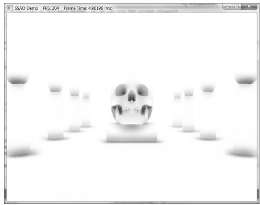


Figure 21.8. An edge preserving blur smoothes out the noise. In our demo, we blur the image four times.


# 21.2.4 Using the Ambient Occlusion Map

Thus far we have constructed the ambient occlusion map. The final step is to apply it to the scene. One might think to use alpha blending and modulate the ambient map with the back buffer. However, if we do this, then the ambient map modifies not just the ambient term, but also the diffuse and specular term of the lighting equation, which is incorrect. Instead, when we render the scene to the back buffer, we bind the ambient map as a shader input. We then generate projective texture coordinates (with respect to the camera), sample the SSAO map, and apply it only to the ambient term of the lighting equation: 

// In vertex shader, generate projective tex-coords to project   
// SSAO map onto scene.   
if( gSsaoEnabled )   
{ vout.SsaoPosH = mul(posW, gViewProjTex);   
}   
// In pixel shader, finish texture projection and sample SSAO map. float ambientAccess $= 1$ .0f;   
if( gSsaoEnabled) { // Finish texture projection and sample SSAO map. pin.SsaoPosH $\equiv$ pin.SsaoPosH.w; Texture2D ssaoMap $=$ ResourceDescriptorHeap[gSsaoAmbientMap0Index]; ambientAccess $=$ ssaoMap_SAMPLE(GetLinearClampSampler(), pin.SsaoPosH.xy, 0.0f).r;   
}   
// Scale ambient light term. float4 ambient $=$ ambientAccess*gAmbientLight*diffuseAlbedo; 

Figure 21.9 shows the scene with the SSAO map applied. The SSAO can be subtle, and your scene has to reflect enough ambient light so that scaling it by the 

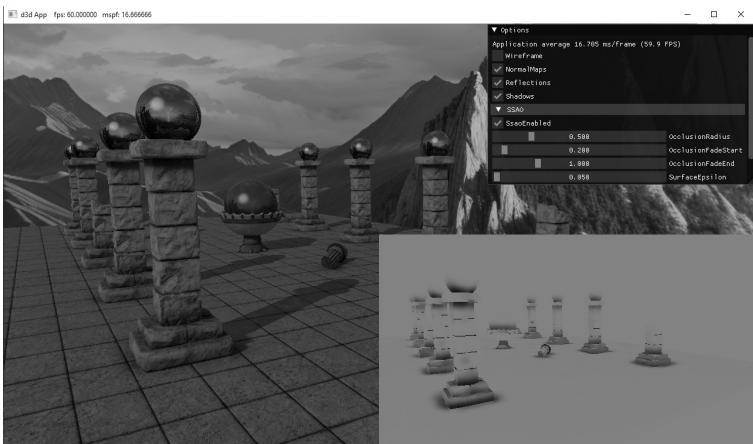


Figure 21.9. Screenshot of the demo. The affects are subtle as they only affect the ambient term, but you can see darkening at the base of the columns and box, under the spheres, and around the sphere pedestal.


ambient-access makes enough of a noticeable difference. The advantage of SSAO is most apparent when objects are in shadow. For when objects are in shadow, the diffuse and specular terms are killed; thus only the ambient term shows up. Without SSAO, objects in shadow will appear flatly lit by a constant ambient term, but with SSAO they will keep their 3D definition. 

When we render the scene view space normals, we also build the depth buffer for the scene. Consequently, when we render the scene the second time with the SSAO map, we modify the depth comparison test to “EQUALS.” This prevents any overdraw in the second rendering pass, as only the nearest visible pixels will pass this depth comparison test. Moreover, the second rendering pass does not need to write to the depth buffer because we already wrote the scene to the depth buffer in the normal render target pass. 

```javascript
// Note: Because for SSAO we do a separate depth prepass, when we draw // the main opaque pass, we can change the depth test to EQUAL. D3D12graphics_pipeLINE_STATE_DESC opaqueWithPrepassPsoDesc = basePsoDesc; opaqueWithPrepassPsoDesc.DepthStencilState.DepthFunc = D3D12_COMPARISONFUNC_EQUAL; opaqueWithPrepassPsoDesc.DepthStencilState.DepthWriteMask = D3D12_DEPTH_WRITE_MASK_ZERO; ThrowIfFailed(device->CreateGraphicsPipelineState( &opaqueWithPrepassPsoDesc, IID_PPV Arguments(&mPSOs["opaque_wprepass"])); 
```

# 21.3 SUMMARY

1. The ambient term of the lighting equation models indirect light. In our lighting model, the ambient term is simply a constant value. Therefore, when 

an object is in shadow and only ambient light is applied to the surface, the model appears very flat with no solid definition. The goal of ambient occlusion is to find a better estimate for the ambient term so that the object still looks 3D even with just the ambient term applied. 

2. The idea of ambient occlusion is that the amount of indirect light a point p on a surface receives is proportional to how occluded it is to incoming light over the hemisphere about p. One way to estimate the occlusion of a point p is via ray casting. We randomly cast rays over the hemisphere about p, and check for intersections against the mesh. If the rays do not intersect any geometry, then the point is completely unoccluded; however, the more intersections there are, the more occluded p must be. 

3. Ray casted ambient occlusion is too expensive to do in real-time for dynamic objects. Screen space ambient occlusion (SSAO) is a real-time approximation that is based on the view space normal/depth values. You can definitely find flaws and situations where it gives wrong results, but the results are very good in practice with the limited information it has to work with. 

# 21.4 EXERCISES

1. Research on the web: KD-Trees, quadtrees, and octrees. 

2. Modify the “Ssao” demo to do a Gaussian blur instead of an edge preserving blur. Which one do you like better? 

3. Can SSAO be implemented on the compute shader? If yes, sketch out an implementation. 

4. Figure 21.10 shows what happens to the SSAO map if we do not include a check for self-intersection (§21.2.2.4). Modify the “Ssao” demo to remove the self-intersection check and reproduce the results in Figure 21.10. 

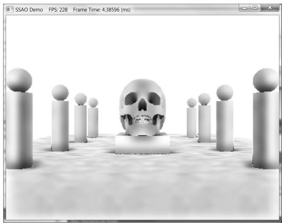


Figure 21.10. False occlusions everywhere.
