# Chapter

# 23 Character Anim ation

# Note:

Portions of this chapter appeared in the book by Frank D. Luna, Introduction to 3D Game Programming with DirectX 9.0c: A Shader Approach, 2006: Jones and Bartlett Learning, Burlington, MA. www.jblearning.com. Reprinted with permission. 

In this chapter, we learn how to animate complex characters like a human or animal. Characters are complex because they have many moving parts that all move at the same time. Consider a human running—every bone is moving in some way. Creating such complicated animations is not practical to manually generate, and motion capture technology is used along with special modeling and animation tools. Assuming we already have a character and its corresponding animation data created, in this chapter we will learn how to animate and render it using Direct3D. 

# Chapter Objectives:

1. To become familiar with the terminology of animated skinned meshes. 

2. To learn the mathematics of mesh hierarchy transformations and how to traverse tree-based mesh hierarchies. 

3. To understand the idea and mathematics of vertex blending. 

4. To find out how to load animation data from file. 

5. To discover how to implement character animation in Direct3D. 

# 23.1 FRAME HIERARCHIES

Many objects are composed of parts, with a parent-child relationship, where one or more child objects can move independently on their own (with possible physical motion constraints—e.g., human joints have a particular range of motion), but are also forced to move when their parent moves. For example, consider an arm divided into the parts: upper arm, forearm, and hand. The hand can rotate in isolation about its wrist joint; however, if the forearm rotates about its elbow joint, then the hand must rotate with it. Similarly, if the upper arm rotates about the shoulder joint, the forearm rotates with it, and if the forearm rotates, then the hand rotates with it (see Figure 23.1). Thus we see a definite object hierarchy: The hand is a child of the forearm; the forearm is a child of the upper arm, and if we extended our situation, the upper arm would be a child of the torso, and so on and so forth, until we have completed the skeleton (Figure 23.2 shows a more complex hierarchy example). 

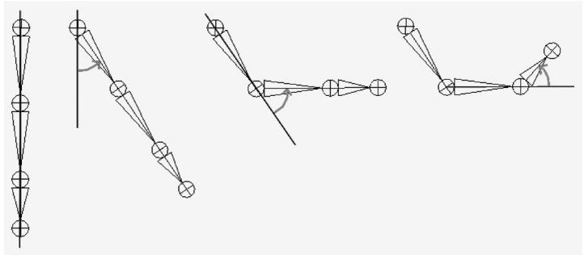


Figure 23.1. Hierarchy transforms; observe that the parent transformation of a bone influences itself and all of its children.


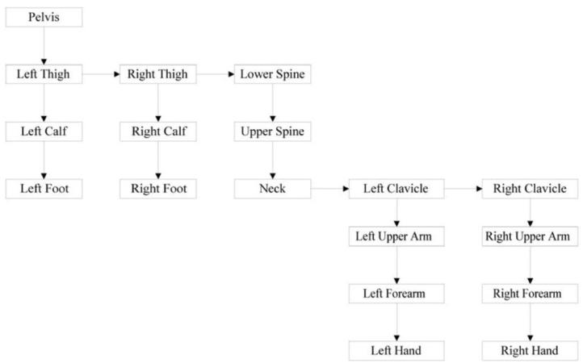


Figure 23.2. A more complex tree hierarchy to model a bipedal humanoid character. Down arrows represent “first child” relationships, and right arrows represent “sibling” relationships. For example, “Left Thigh,” “Right Thigh,” and “Lower Spine” are all children of the “Pelvis” bone.


The aim of this section is to show how to place an object in the scene based on its position, and also the position of its ancestors (i.e., its parent, grandparent, greatgrandparent, etc.). 

# 23.1.1 Mathematical Formulation

# Note:

The reader may wish to review Chapter 3 of this book, specifically the topic of change-of-coordinate transformations. 

To keep things simple and concrete, we work with the upper arm (the root), forearm, and hand hierarchy, which we label as Bone 0, Bone 1, and Bone 2, respectively (see Figure 23.3). 

Once the basic concept is understood, a straightforward generalization is used to handle more complex situations. So given an object in the hierarchy, how do we correctly transform it to world space? Obviously, we cannot just transform it directly into the world space because we must also take into consideration the transformations of its ancestors since they also influence its placement in the scene. 

Each object in the hierarchy is modeled about its own local coordinate system with its pivot joint at the origin to facilitate rotation (see Figure 23.4). 

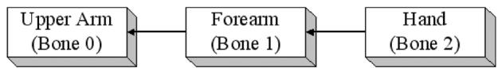


Figure 23.3. A simple hierarchy.


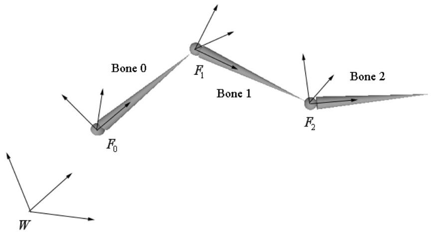


Figure 23.4. The geometry of each bone is described relative to its own local coordinate system. Furthermore, because all the coordinate systems exist in the same universe, we can relate them to one another.


Because all the coordinate systems exist in the same universe, we can relate them; in particular, for an arbitrary instant in time (we fix time and study a snapshot because, in general, these mesh hierarchies are animated and so these relationships change as a function of time), we describe each coordinate system relative to its parent coordinate system. (The parent coordinate system of the root frame $F _ { 0 }$ is the world space coordinate system W; that is, the coordinate system $F _ { 0 }$ is described relative to the world coordinate system.) Now that we have related the child and parent coordinate systems, we can transform from a child’s space to its parent’s space with a transformation matrix. (This is the same idea as the localto-world transformation. However, instead of transforming from local space to world space, we transform from the local space to the space of the parent.) Let $\mathbf { A } _ { 2 }$ be a matrix that transforms geometry from frame $F _ { 2 }$ into $F _ { 1 { \mathrm { : } } }$ , let $\mathbf { A } _ { 1 }$ be a matrix that transform geometry from frame $F _ { 1 }$ into $F _ { 0 } ,$ and let $\mathbf { A } _ { 0 }$ be a matrix that transform geometry from frame $F _ { 0 }$ into W. (We call $\mathbf { A } _ { i }$ a to-parent matrix since it transforms geometry from a child’s coordinate system into its parent’s coordinate system.) Then, we can transform the ith object in the arm hierarchy into world space by the matrix $\mathbf { M } _ { i }$ defined as follows: 

$$
\mathbf {M} _ {i} = \mathbf {A} _ {i} \mathbf {A} _ {i - 1} \dots \mathbf {A} _ {1} \mathbf {A} _ {0} \tag {eq.23.1}
$$

Specifically, in our example, $\mathbf { M } _ { 2 } = \mathbf { A } _ { 2 } \mathbf { A } _ { 1 } \mathbf { A } _ { 0 } ,$ , $\mathbf { M } _ { 1 } = \mathbf { A } _ { 1 } \mathbf { A } _ { 0 } ,$ and $\mathbf { M } _ { 0 } = \mathbf { A } _ { 0 }$ transforms the hand into world space, the forearm into world space, and the upper arm into world space, respectively. Observe that an object inherits the transformations of its ancestors; this is what will make the hand move if the upper arm moves, for example. 

Figure 23.5 illustrates what Equation 23.1 says graphically; essentially, to transform an object in the arm hierarchy, we just apply the to-parent transform of the object and all of its ancestors (in ascending order) to percolate up the coordinate system hierarchy until the object arrives in the world space. 

The example we have been working with is a simple linear hierarchy. But the same idea generalizes to a tree hierarchy; that being, for any object in the hierarchy, its world space transformation is found by just applying the to-parent transform of the object and all of its ancestors (in ascending order) to percolate up the coordinate system hierarchy until the object arrives in the world space (we again reiterate that the parent coordinate system of the root is the world space). The only real difference is that we have a more complicated tree data structure to traverse instead of a linear list. 

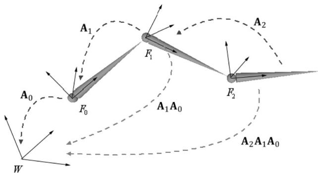


Figure 23.5. Because the coordinate systems exist in the same universe we can relate them, and therefore, transform from one to the other. In particular, we relate them by describing each bone’s coordinate system relative to its parent’s coordinate system. From that, we can construct a to-parent transformation matrix that transforms the geometry of a bone from its local coordinate system to its parent’s coordinate system. Once in the parent’s coordinate system, we can then transform by the parent’s to-parent matrix to transform to the grandparent’s coordinate system, and so on and so forth, until we have visited each ancestor’s coordinate system and finally reached the world space.


As an example, consider the left clavicle in Figure 23.2. It is a sibling of the neck bone, and therefore a child of the upper spine. The upper spine is a child of the lower spine, and the lower spine is a child of the pelvis. Therefore, the world transform of the left clavicle it formed by concatenating the left clavicle’s to-parent transform, followed by the upper spine’s to-parent transform, followed by the lower spine’s to-parent transform, followed by the pelvis’ to-parent transform. 

# 23.2 SKINNED MESHES

# 23.2.1 Definitions

Figure 23.6 shows a character mesh. The highlighted chain of bones in the figure is called a skeleton. A skeleton provides a natural hierarchal structure for driving a character animation system. The skeleton is surrounded by an exterior skin, which we model as 3D geometry (vertices and polygons). Initially, the skin vertices are relative to the bind space, which is the local coordinate system that the entire skin is defined relative to (usually the root coordinate system). Each bone in the skeleton influences the shape and position of the subset of skin it influences (i.e., the vertices it influences), just like in real life. Thus, as we animate the skeleton, the attached skin is animated accordingly to reflect the current pose of the skeleton. 

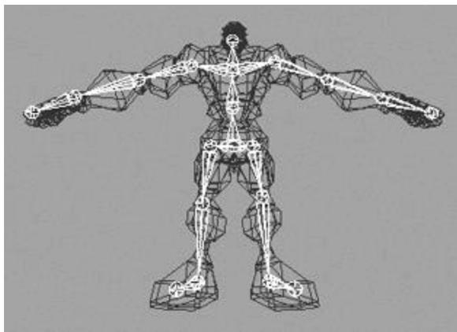


Figure 23.6. A character mesh. The highlighted bone chain represents the character’s skeleton. The dark colored polygons represent the character’s skin. The skin vertices are relative to the bind space, which is the coordinate system the mesh was modeled in.


# 23.2.2 Reformulating the Bones To-Root Transform

One difference from $\ S 2 3 . 1$ is that here we will transform from the root coordinate system to the world coordinate system in a separate step. So rather than finding the to-world matrix for each bone, we find the to-root (i.e., the transformation that transforms from the bone’s local coordinate system to the root bone’s coordinate system) matrix for each bone. 

A second difference is that in $\ S 2 3 . 1$ , we traversed the ancestry of a node in a bottom-up fashion, where we started at a bone and moved up its ancestry. However, it is actually more efficient to take a top-down approach (see Equation 23.2), where we start at the root and move down the tree. Labeling the $n$ bones with an integer number $0 , 1 , . . . , n { - 1 } ,$ , we have the following formula for expressing the ith bone’s to-root transformation: 

$$
t o R o o t _ {i} = t o P a r e n t _ {i} \cdot t o R o o t _ {p} \tag {eq.23.2}
$$

Here, $\boldsymbol { p }$ is the bone label of the parent of bone i. Does this make sense? Indeed, toRoot  gives us a direct map that sends geometry from the coordinate system of bone $\boldsymbol { p }$ to the coordinate system of the root. So to get to the root coordinate system, it follows that we just need to get geometry from the coordinate system of bone $i$ to the coordinate system of its parent bone $\textstyle p ,$ , and toParent does that job. 

The only issue is that for this to work, when we go to process the ith bone, we must have already computed the to-root transformation of its parent. However, if 

we traverse the tree top-down, then a parent’s to-root transformation will always be computed before its children’s to-root transformation. 

We can also see why this is more efficient. With the top-down approach, for any bone i, we already have the to-root transformation matrix of its parent; thus, we are only one step away from the to-root transformation for bone i. With a bottoms-up technique, we’d traverse the entire ancestry for each bone, and many matrix multiplications would be duplicated when bones share common ancestors. 

# 23.2.3 The Offset Transform

There is a small subtlety that comes from the fact that the vertices influenced by a bone are not relative to the coordinate system of the bone (they are relative to the bind space, which is the coordinate system the mesh was modeled in). So before we apply Equation 15.2, we first need to transform the vertices from bind space to the space of the bone that influences the vertices. A so-called offset transformation does this; see Figure 23.7. 

Thus, by transforming the vertices by the offset matrix of some arbitrary bone B, we move the vertices from the bind space to the bone space of B. Then, once we have the vertices in bone space of B, we can use B’s to-root transform to position it back in character space in its current animated pose. 

We now introduce a new transform, call it the final transform, which combines a bone’s offset transform with its to-root transform. Mathematically, the final transformation matrix of the ith bone $\mathbf { F } _ { i }$ is given by: 

$$
\mathbf {F} _ {i} = \text {o f f s e t} _ {i} \cdot \text {t o R o o t} _ {i} \tag {eq.23.3}
$$

# 23.2.4 Animating the Skeleton

In the demo of the last chapter, we showed how to animate a single object. We defined that a key frame specifies the position, orientation, and scale of an object 

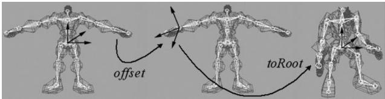


Figure 23.7. We first transform the vertices influenced by a bone from bind space to the space of the influencing bone via the offset transform. Then, once in the space of the bone, we apply the bone’s to-root transformation to transform the vertices from the space of the bone to the space of the root bone. The final transformation is the combination of the offset transform, followed by the to-root transform.


at an instance in time, and that an animation is a list of key frames sorted by time, which roughly define the look of the overall animation. We then showed how to interpolate between key frames to calculate the placement of the object at times between key frames. We now extend our animation system to animating skeletons. These animation classes are defined in SkinnedData.h/.cpp in the “Skinned Mesh” demo of this chapter. 

Animating a skeleton is not much harder than animating a single object. Whereas we can think of a single object as a single bone, a skeleton is just a collection of connected bones. We will assume that each bone can move independently. Therefore, to animate a skeleton, we just animate each bone locally. Then after each bone has done its local animation, we take into consideration the movement of its ancestors, and transform it to the root space. 

We define an animation clip to be a list of animations (one for each bone in the skeleton) that work together to form a specific animation of the skeleton. For example, “walking,” “running,” “fighting,” “ducking,” and “jumping” are examples of animation clips. 

```cpp
///<summary>   
/// Examples of AnimationClips are "Walk", "Run", "Attack", "Defend".   
/// An AnimationClip requires a BoneAnimation for every bone to form   
/// the animation clip.   
///</summary>   
struct AnimationClip   
{ // Smallest end time over all bones in this clip. float GetClipStartTime()const; // Largest end time over all bones in this clip. float GetClipEndTime()const; // Loops over each BoneAnimation in the clip and interpolates // the animation. void Interpolate(float t, std::vector<XMFLOAT4X4>& boneTransforms) const; // Animation for each bone. std::vector<BoneAnimation> BoneAnimations;   
}； 
```

A character will generally have several animation clips for all the animations the character needs to perform in the application. All the animation clips work on the same skeleton, however, so they use the same number of bones (although some bones may be stationary for a particular animation). We can use an unordered_map data structure to store all the animation clips and to refer to an animation clip by a readable name: 

```cpp
std::unordered_map<std::string, AnimationClip> mAnimations; AnimationClip& clip = mAnimations["attack"]; 
```

Finally, as already mentioned, each bone needs an offset transform to transform the vertices from bind space to the space of the bone; and additionally, we need a way to represent the skeleton hierarchy (we use an array—see the next section for details). 

This gives us our final data structure for storing our skeleton animation data: 

```cpp
class SkinnedData   
{   
public:   
UINT BoneCount(const; float GetClipStartTime(const std::string& clipName) const; float GetClipEndTime(const std::string& clipName) const;   
void Set( std::vector<int>& boneHierarchy, std::vector<DirectX::XMFLOAT4X4>& boneOffsets, std::unordered_map<std::string, AnimationClip>& animations); // In a real project, you'd want to cache the result if there was a chance // that you were calling this several times with the same clipName at // the same timePos. void GetFinalTransforms(const std::string& clipName, float timePos, std::vector<DirectX::XMFLOAT4X4>& finalTransforms) const;   
private: // Gives parentIndex of ith bone. std::vector<int> mBoneHierarchy; std::vector<DirectX::XMFLOAT4X4> mBoneOffsets; std::unordered_map<std::string, AnimationClip> mAnimations;   
}; 
```

# 23.2.5 Calculating the Final Transform

Our frame hierarchy for a character will generally be a tree, similar to the one in Figure 23.2. We model the hierarchy with an array of integers such that the ith array entry gives the parent index of the ith bone. Moreover, the ith entry corresponds to the ith BoneAnimation in the working animation clip and the ith entry corresponds to the ith offset transform. The root bone is always at element 0 and it has no parent. So for example, the animation and offset transform of the grandparent of bone $i$ is obtained by: 

```objectivec
int parentIndex = mBoneHierarchy[i];  
int grandParentIndex = mBoneHierarchy[parentsIndex];  
XMFLOAT4X4 offset = mBoneOffsets[grandParentIndex];  
AnimationClip& clip = mAnimations["attack"];  
BoneAnimation& anim = clip.BoneAnimations[grandParentIndex]; 
```


We can therefore compute the final transform for each bone like so:


```cpp
void SkinnedData::GetFinalTransforms(const std::string& clipName, float timePos, std::vector<XMFLOAT4X4>& finalTransforms) const { UINT numBones = mBoneOffsets.size(); std::vector<XMFLOAT4X4> toParentTransforms(numBones); // Interpolate all the bones of this clip at the given time instance. auto clip = mAnimations.find(clipName); clip->second.Interpolate(timePos, toParentTransforms); // // Traverse the hierarchy and transform all the bones to // the root space. std::vector<XMFLOAT4X4> toRootTransforms(numBones); // The root bone has index 0. The root bone has no parent, so // its toRootTransform is just its local bone transform. toRootTransforms[0] = toParentTransforms[0]; // Now find the toRootTransform of the children. for(UINT i = 1; i < numBones; ++i) { XMMatrix toParent = XmlLoadFloat4x4(&toParentTransforms[i]); int parentIndex = mBoneHierarchy[i]; XMMatrix parentToRoot = XmlLoadFloat4x4(&toRootTransforms[parentsEx]); XMMatrix toRoot = XMMatrixMultiply(toParent, parentToRoot); XStoreFloat4x4(&toRootTransforms[i], toRoot); } // Premultiply by the bone offset transform to get the // final transform. for(UINT i = 0; i < numBones; ++i) { XMMatrix offset = XmlLoadFloat4x4(&mBoneOffsets[i]); XMMatrix toRoot = XmlLoadFloat4x4(&toRootTransforms[i]); XStoreFloat4x4(&finalTransforms[i], XMMatrixMultiply(offset, toRoot)); } 
```

There is one requirement needed to make this work. When we traverse the bones in the loop, we look up the to-root transform of the bone’s parent: 

```txt
int parentIndex = mBoneHierarchy[i];  
XMMatrix parentToRoot = XmlFloat4x4(&toRootTransforms[parentIndex]); 
```

This only works if we are guaranteed that the parent bone’s to-root transform has already been processed earlier in the loop. We can, in fact, make this guarantee if we ensure that the bones are always ordered in the arrays such that a parent bone always comes before a child bone. Our sample 3D data has been generated such that this is the case. Here is some sample data of the first ten bones in the hierarchy array of some character model: 

```txt
ParentIndexedBone0: -1  
ParentIndexedBone1: 0  
ParentIndexedBone2: 0  
ParentIndexedBone3: 2  
ParentIndexedBone4: 3  
ParentIndexedBone5: 4  
ParentIndexedBone6: 5  
ParentIndexedBone7: 6  
ParentIndexedBone8: 5  
ParentIndexedBone9: 8 
```

So take Bone9. Its parent is Bone8, the parent of Bone8 is Bone5, the parent of Bone5 is Bone4, the parent of Bone4 is Bone3, the parent of Bone3 is Bone2, and the parent of Bone2 is the root node Bone0. Notice that a child bone never comes before its parent bone in the ordered array. 

# 23.3 VERTEX BLENDING

We have showed how to animate the skeleton. In this section we will focus on animating the skin of vertices that cover the skeleton. The algorithm for doing this is called vertex blending. 

The strategy of vertex blending is as follows. We have an underlying bone hierarchy, but the skin itself is one continuous mesh (i.e., we do not break the mesh up into parts to correspond with each bone and animate them individually). Moreover, one or more bones can influence a vertex of the skin; the net result being determined by a weighted average of the influencing bones’ final transforms (the weights are specified by an artist when the model is being made and saved to file). With this setup, a smooth transitional blend can be achieved at joints (which are typically the troubled areas), thereby making the skin feel elastic; see Figure 23.8. 

In practice, [Möller08] notes that we usually do not need more than four bone influences per vertex. Therefore, in our design we will consider a maximum of four influential bones per vertex. So to implement vertex blending, we model the character mesh’s skin as one continuous mesh. Each vertex contains up to four indices that index into a bone matrix palette, which 

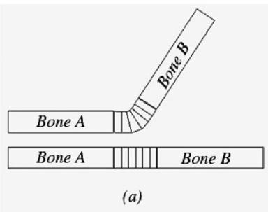


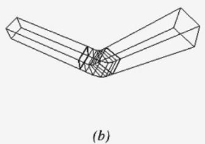


Figure 23.8. The skin is one continuous mesh that covers both bones. Observe that the vertices near the joint are influenced by both bone A and bone $B$ to create a smooth transitional blend to simulate a flexible skin


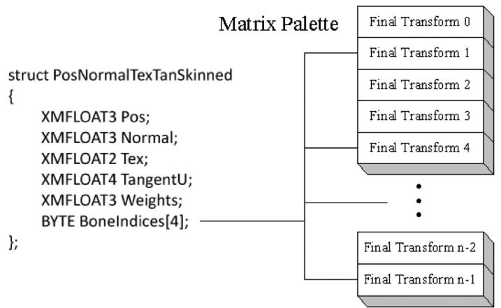


Figure 23.9. The matrix palette stores the final transformation for each bone. Observe how the four bone indices index into the matrix palette. The bone indices identify the bones of the skeleton that influence the vertex. Note that the vertex is not necessarily influenced by four bones; for instance, only two of the four indices might be used, thereby indicating that only two bones influence the vertex. We can set a bone weight to zero to effectively remove the bone from influencing the vertex.


is the array of final transformation matrices (one entry for each bone in the skeleton). Additionally, each vertex also has up to four weights that describe the respective amount of influence each of the four influencing bones has on that vertex. Thus we have the following vertex structure for vertex blending (Figure 23.9): 

A continuous mesh whose vertices have this format is ready for vertex blending, and we call it a skinned mesh. 

The vertex-blended position $\mathbf { v } ^ { \prime }$ of any vertex v, relative to the root frame (remember we perform the world transformation as a last step once we have 

everything in the root coordinate system), can be calculated with the following weighted average formula: 

$$
\mathbf {v} ^ {\prime} = w _ {0} \mathbf {v} \mathbf {F} _ {0} + w _ {1} \mathbf {v} \mathbf {F} _ {1} + w _ {2} \mathbf {v} \mathbf {F} _ {2} + w _ {3} \mathbf {v} \mathbf {F} _ {3}
$$

where $w _ { 0 } + w _ { 1 } + w _ { 2 } + w _ { 3 } = 1$ ; that is, the sum of the weights sums to one. 

Observe that in this equation, we transform a given vertex v individually by all of the final bone transforms that influence it (i.e., matrices $\mathbf { F } _ { 0 } , \mathbf { F } _ { 1 } , \mathbf { F } _ { 2 } , \mathbf { F } _ { 3 } )$ . We then take a weighted average of these individually transformed points to compute the final vertex blended position $\mathbf { v } ^ { \prime }$ . 

Transforming normals and tangents are done similarly: 

$$
\begin{array}{l} \mathbf {n} ^ {\prime} = \text {n o r m a l i z e} \left(w _ {0} \mathbf {n} \mathbf {F} _ {0} + w _ {1} \mathbf {n} \mathbf {F} _ {1} + w _ {2} \mathbf {n} \mathbf {F} _ {2} + w _ {3} \mathbf {n} \mathbf {F} _ {3}\right) \\ \mathbf {t} ^ {\prime} = \text {n o r m a l i z e} \left(w _ {0} \mathbf {t} \mathbf {F} _ {0} + w _ {1} \mathbf {t} \mathbf {F} _ {1} + w _ {2} \mathbf {t} \mathbf {F} _ {2} + w _ {3} \mathbf {t} \mathbf {F} _ {3}\right) \\ \end{array}
$$

Here we assume that the transformation matrices $\mathbf { F } _ { i }$ do not contain any nonuniform scaling. Otherwise, we need to use the inverse-transpose $\left( \mathbf { F } _ { i } ^ { - 1 } \right) ^ { T }$ when transforming the normals (see $\ S 7 . 2 . 2 )$ . 

The following vertex shader fragment shows the key code that does vertex blending with a maximum of four bone influences per vertex: 

```c
DEFINE_CBUFFER(SkinnedCB，b2)   
{ float4x4 gBoneTransforms[96];   
}；   
struct VertexIn { float3PosL：POSITION; float3NormalL：NORMAL; float2TexC：TEXCOORD; float3TangentU：TANGENT; #if SKINNED float3BoneWeights：WEIGHTS; uint4 BoneIndices：BONEINDICES; #endif }；   
struct VertexOut { float4PosH：SV_POSITION; float4ShadowPosH：POSITIONO; float4SsaoPosH：POSITION1; float3PosW：POSITION2; float3NormalW：NORMAL; float3TangentW：TANGENT; float2TexC：TEXCOORD; 
```

```c
if DRAW_INSTANCED // nointerpolation is used so the index is not interpolated // across the triangle. ninterpolation uint MatIndex : MATINDEX;   
endif   
};   
void ApplySkinning( float3 boneWeights, uint4 boneIndices, inout float3 posL, inout float3 normalL, inout float3 tangentU ) { float weights[4] = { 0.0f, 0.0f, 0.0f, 0.0f }; weights[0] = boneWeights.x; weights[1] = boneWeights.y; weights[2] = boneWeights.z; weights[3] = 1.0f - weights[0] - weights[1] - weights[2]; float3 skinnedPosL = float3(0.0f, 0.0f, 0.0f); float3 skinnedNormalL = float3(0.0f, 0.0f, 0.0f); float3 skinnedTangentL = float3(0.0f, 0.0f, 0.0f); for(int i = 0; i < 4; ++i) { // Assume no nonuniform scaling when transforming normals, so // that we do not have to use the inverse-transpose. skinnedPosL += weights[i] * mul(float4(posL, 1.0f), gBoneTransforms[boneIndices[i]).xyz; skinnedNormalL += weights[i] * mul(normalL, (float3x3)gBoneTransforms[boneIndices[i]])); skinnedTangentL += weights[i] * mul(tangentU.xyz, (float3x3)gBoneTransforms[boneIndices[i]]); } posL = skinnedPosL; normalL = skinnedNormalL; tangentU = skinnedTangentL;   
}   
// For shadows, we only need to animate position.   
void ApplySkinningShadows( float3 boneWeights, uint4 boneIndices, inout float3 posL ) { float weights[4] = { 0.0f, 0.0f, 0.0f, 0.0f }; weights[0] = boneWeights.x; weights[1] = boneWeights.y; weights[2] = boneWeights.z; weights[3] = 1.0f - weights[0] - weights[1] - weights[2]; float3 skinnedPosL = float3(0.0f , 0.0f , 0.0f); for(int i = 0; i < 4; ++i) { // Assume no nonuniform scaling when transforming normals, so 
```

// that we do not have to use the inverse-transpose. skinnedPosL += weights[i] * mul(float4(posL, 1.0f), gBoneTransforms[boneIndices[i]).xyz; } posL = skinnedPosL;   
}   
VertexOut VS(VertexIn vin #if DRAW_INSTANCED , uint instanceof : SV_InstanceID #endif ） { VertexOut vout $=$ (VertexOut)0.0f; #if DRAW_INSTANCED // Fetch the instance data. InstanceData instData $=$ gInstanceData[instanceID]; float4x4 world $=$ instData.World; float4x4 texTransform $=$ instData.TexTransform; uint matIndex $=$ instData.MaterialIndex; vout.MatIndex $=$ matIndex; MaterialData matData $=$ gMaterialData[matIndex]; #else MaterialData matData $=$ gMaterialData[gMaterialIndex]; float4x4 world $=$ gWorld; float4x4 texTransform $=$ gTexTransform; #endif   
#if SKINNED ApplySkinning( vin.BoneWeights, vin.BoneIndices, vin_PosL, vin.NormalL, vin.TangentU.xyz); #endif // Transform to world space. float4 posW $=$ mul(float4(vin(PosL, 1.0f), world); vout-posW $=$ posW.xyz; // Assumes nonuniform scaling; otherwise, need to use inverse- transpose of world matrix. vout.NormalW $=$ mul(vin.NormalL,(float3x3)world); vout.TangentW $=$ mul(vin.TangentU,(float3x3)world); // Transform to homogeneous clip space. vout-posH $=$ mul(posW,gViewProj); if( gSsaoEnabled ) { // Generate projective tex-coords to project SSAO map onto scene. 

vout.SsaoPosH $=$ mul(posW,gViewProjTex);   
}   
// Output vertex attributes for interpolation across triangle. float4 texC $=$ mul(float4(vin.TexC,0.0f,1.0f)，texTransform); vout.TexC $=$ mul(texC，matData.MatTransform).xy; if( gShadowsEnabled ) { // Generate projective tex-coords to project shadow map onto scene. vout.ShadowPosH $=$ mul(posW,gShadowTransform); } return vout; 

If the above vertex shader does vertex blending with a maximum of four bone influences per vertex, then why do we only input three weights per vertex instead of four? Well, recall that the total weight must sum to one; thus, for four weights we have: $w _ { 0 } + w _ { 1 } + w _ { 2 } + w _ { 3 } = 1 \Longleftrightarrow w _ { 3 } = 1 - w _ { 0 } - w _ { 1 } - w _ { 2 }$ . 

# 23.4 LOADING ANIMATION DATA FROM FILE

We use a text file to store a 3D skinned mesh with animation data. We call this an . $\mathrm { . m } 3 \mathrm { d }$ file for “model 3D.” The format has been designed for simplicity in loading and readability—not for performance—and the format is just used for this book. 

# 23.4.1 Header

At the beginning, the .m3d format defines a header which specifies the number of materials, vertices, triangles, bones, and animations that make up the model: 

```txt
\*\*\*\*\*\*\*\*\*\*\*\*\*\*\*\*\*\*\*\*\*\*\*\*\*\*\*\*\*\*\*\*\*\*\*\*\*\*\*\*\*\*\*\*\*\*\*\*\*\*\*\*\*\*\*\*\*\*\*\*\*\*\*\*\*\*\*\*\*\*\*\*\*\*\*\*\*\*\*\*\*\*\*\*\*\*\*\*\*\*\*\*\*\*\*\*\*\*\*\*\*m3d-File-Header\*\*\*\*\*\*\*\*\*\*\*\*\*\*\*\*  
#Materials 3  
#Vertices 3121  
#Triangles 4062  
#Bones 44  
#AnimationClips 15 
```

1. #Materials: The number of distinct materials the mesh uses. 

2. #Vertices: The number of vertices of the mesh. 

3. #Triangles: The number of triangles in the mesh. 

4. #Bones: The number of bones in the mesh. 

5. #AnimationClips: The number of animation clips in the mesh. 

# 23.4.2 Materials

The next “chunk” in the . $\mathrm { \ m } 3 \mathrm { d }$ format is a list of materials. Below is an example of the first two materials in the soldier.m3d file: 

```yaml
**********Materials**********  
Name: soldier_head  
Diffuse: 1 1 1  
Fresnel0: 0.05 0.05 0.05  
Roughness: 0.5  
AlphaClip: 0  
MaterialTypeName: Skinned  
DiffuseMap: head_diff.dds  
NormalMap: head_norm.dds  
Name: soldier_jacket  
Diffuse: 1 1 1  
Fresnel0: 0.05 0.05 0.05  
Roughness: 0.8  
AlphaClip: 0  
MaterialTypeName: Skinned  
DiffuseMap: jacket_diff.dds  
NormalMap: jacket_norm.dds 
```

The file contains the material data we are familiar with (diffuse, roughness, etc.), but also contains additional information such as the textures to apply, whether alpha clipping needs to be applied, and the material type name. The material type name is used to indicate which shader programs are needed for the given material. In the example above, the “Skinned” type indicates that the material will need to be rendered with shader programs that support skinning. 

# 23.4.3 Subsets

A mesh consists of one or more subsets. A subset is a group of triangles in a mesh that can all be rendered using the same material. Figure 23.10 illustrates how a mesh representing a car may be divided into several subsets. 

There is a subset corresponding to each material and the ith subset corresponds to the ith material. The ith subset defines a contiguous block of geometry that should be rendered with the ith material. 

```txt
******SubsetTable******  
SubsetID: 0 VertexStart: 0 VertexCount: 3915 FaceStart: 0 FaceCount: 7230  
SubsetID: 1 VertexStart: 3915 VertexCount: 2984 FaceStart: 7230  
FaceCount: 4449  
SubsetID: 2 VertexStart: 6899 VertexCount: 4270 FaceStart: 11679  
FaceCount: 6579  
SubsetID: 3 VertexStart: 11169 VertexCount: 2305 FaceStart: 18258  
FaceCount: 3807  
SubsetID: 4 VertexStart: 13474 VertexCount: 274 FaceStart: 22065  
FaceCount: 442 
```

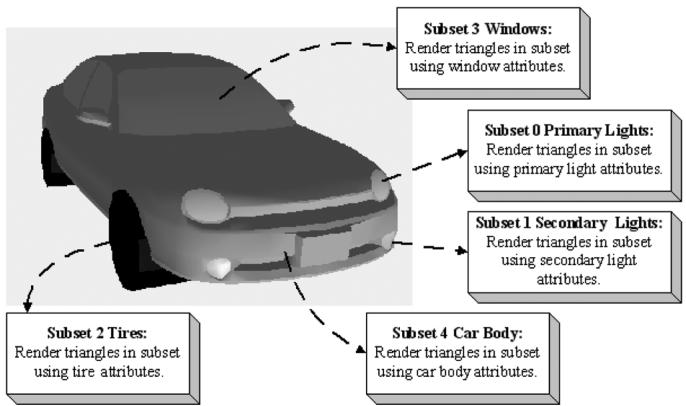


Figure 23.10. A car broken up by subset. Here only the materials per subset differ, but we could also imagine textures being added and differing as well. In addition, the render states may differ; for example, the glass windows may be rendered with alpha blending for transparency.


In the above example, the first 7230 triangles of the mesh (which reference vertices [0, 3915)) should be rendered with material 0, and the next 4449 triangles of the mesh (which reference vertices [3915, 6899)) should be rendered with material 1. 

# 23.4.4 Vertex Data and Triangles

The next two chunks of data are just lists of vertices and indices (3 indices per triangle): 

```txt
**********Vertices**********  
Position: -14.34667 90.44742 -12.08929  
Tangent: -0.3069077 0.2750875 0.9111171 1  
Normal: -0.3731041 -0.9154652 0.150721  
Tex-Coords: 0.21795 0.105219  
BlendWeights: 0.483457 0.483457 0.0194 0.013686  
BlendIndices: 3 2 39 34  
Position: -15.87868 94.60355 9.362272  
Tangent: -0.3069076 0.2750875 0.9111172 1  
Normal: -0.3731041 -0.9154652 0.150721  
Tex-Coords: 0.278234 0.091931  
BlendWeights: 0.4985979 0.4985979 0.002804151 0  
BlendIndices: 39 2 3 0  
...  
**********Triangles**********  
0 1 2  
3 4 5  
6 7 8  
9 10 11  
12 13 14  
... 
```

# 23.4.5 Bone Offset Transforms

The bone offset transformation chunk, just stores a list of $4 \times 4$ matrices, one for each bone. 

```csv
**********BoneOffsets**********  
BoneOffset0 -0.8669753 0.4982096 0.01187624 0  
0.04897417 0.1088907 -0.9928461 0  
-0.4959392 -0.8601914 -0.118805 0  
-10.94755 -14.61919 90.63506 1  
BoneOffset1 1 4.884964E-07 3.025227E-07 0  
-3.145564E-07 2.163151E-07 -1 0  
4.884964E-07 0.9999997 -9.59325E-08 0  
3.284225 7.236738 1.556451 1  
... 
```

# 23.4.6 Hierarchy

The hierarchy chunk stores the hierarchy array—an array of integers such that the ith array entry gives the parent index of the ith bone. To reiterate, these are ordered such that a parent bone always comes before a child bone. In this way, we can compute the final transforms top-down, as shown in $\ S 2 3 . 2 . 5$ . 

```txt
**********BoneHierarchy**********  
ParentIndexOfBone0: -1  
ParentIndexOfBone1: 0  
ParentIndexOfBone2: 1  
ParentIndexOfBone3: 2  
ParentIndexOfBone4: 3  
ParentIndexOfBone5: 4  
ParentIndexOfBone6: 5  
ParentIndexOfBone7: 6  
ParentIndexOfBone8: 7  
ParentIndexOfBone9: 7  
ParentIndexOfBone10: 7  
ParentIndexOfBone11: 7  
ParentIndexOfBone12: 6  
ParentIndexOfBone13: 12 
```

# 23.4.7 Animation Data

The last chunk we need to read are the animation clips. Each animation has a readable name and a list of key frames for each bone in the skeleton. Each key frame stores the time position, the translation vector specifying the position of the bone, the scaling vector specifying the bone scale, and the quaternion specifying the orientation of the bone. 

```txt
\*\*\*\*\*\*\*\*\*\*\*\*\*\*\*\*\*\*\*\*\*\*\*\*\*\*\*\*\*\*\*\*\*\*\*\*\*\*\*\*\*\*\*\*\*\*\*\*\*\*\*\*\*\*\*\*\*\*\*\*\*\*\*\*\*\*\*\*\*\*\*\*\*\*\*\*\*\*\*\*\*\*\*\*\*\*\*\*\*\*\*\*\*\*\*\*\*\*\*\*\*  
AnimationClip run_loop  
{Bone0 #Keyframes: 18Time:0Pos:2.538344 101.6727 -0.52932Scale:111Quat:0.4042651 0.3919331 -0.5853591 0.5833637Time:0.0666666Pos:0.81979 109.6893 -1.575387Scale:0.9999998 0.9999998 0.9999998Quat:0.4460441 0.3467651 -0.5356012 0.6276384...}  
Bone1 #Keyframes: 18Time:0Pos:36.48329 1.210869 92.7378Scale:111Quat:0.126642 0.1367731 0.69105 0.6983587Time:0.0666666Pos:36.30672 -2.835898 93.15854Scale:111Quat:0.1284061 0.1335271 0.6239273 0.7592083...}  
...  
}  
AnimationClip walk_loop  
{Boneo #Keyframes: 33Time:0Pos:1.418595 98.13201 -0.051082Scale:0.9999985 0.999999 0.9999991Quat:0.3164562 0.6437552 -0.6428624 0.2686314Time:0.0333333Pos:0.956079 96.42985 -0.047988Scale:0.999999 0.999999 0.999999Quat:0.3250651 0.6395872 -0.6386833 0.2781091...}  
Bone1 #Keyframes: 33Time:OPos:-5.831432 2.521564 93.75848Scale:0.9999995 0.9999995 1Quat:-0.033817 -0.000631005 0.9097761 0.4137191Time:0.0333333Pos:-5.688324 2.551427 93.71078 
```

```txt
Scale:0.9999998 0.99999981 Quat:-0.033202-0.0006390021 0.903874 0.426508 } ...   
} 
```


The following code shows how we read the animation clips from file:


```cpp
void M3DLoader::ReadAnimationClips(
    std::ifstream& fin,
    UINT numBones,
    UINT numAnimationClips,
    std::unordered_map<std::string, AnimationClip>& animations)
{
    std::string ignore;
    fin >> ignore; // AnimationClips header text
    for (UINT clipIndex = 0; clipIndex < numAnimationClips; ++clipIndex)
    {
        std::string clipName;
        fin >> ignore >> clipName;
        fin >> ignore; // {
            AnimationClip clip;
            clip.BoneAnimations.resize(numBones);
            for (UINT boneIndex = 0; boneIndex < numBones; ++boneIndex)
            {
                ReadBoneKeyframes(fin, numBones, clip.BoneAnimations[boneIndex]);
            }
            fin >> ignore; // }
            animations[clipName] = clip;
        }
}
void M3DLoader::ReadBoneKeyframes(
    std::ifstream& fin,
    UINT numBones,
    BoneAnimation& boneAnimation)
{
    std::string ignore;
    UINT numKeyframes = 0;
    fin >> ignore >> ignore >> numKeyframes;
    fin >> ignore; // {
        boneAnimation.Keyframes.resize(numKeyframes);
        for (UINT i = 0; i < numKeyframes; ++i)
        {
            std::string id;
            std::string key;
            std::string key1;
            std::string key2;
            std::string key3;
            std::string key4;
            std::string key5;
            std::string key6;
            std::string key7;
            std::string key8;
            std::string key9;
            std::string key10;
            std::string key11);
            std::string key12);
            std::string key13);
            std::string key14);
            std::string key15);
            std::string key16);
            std::string key17);
            std::string key18);
            std::string key19);
            std::string key20);
            std::string key21);
            std::string key22);
            std::string key23);
            std::string key24);
            std::string key25);
            std::string key26);
            std::string key27);
            std::string key28);
            std::string key29);
            std::string key30);
            std::string key31);
            std::string key32);
            std::string key33);
            std::string key34);
            std::string key35);
            std::string key36);
            std::string key37);
            std::string key38);
            std::string key39);
            std::string key40);
            std::string key41);
            std::string key42);
            std::string key43);
            std::string key44);
            std::string key45);
            std::string key46);
            std::string key47);
            std::string key48);
            std::string key49);
            std::string key50);
            std::string key51);
            std::string key52);
            std::string key53);
            std::string key54);
            std::string key55);
            std::string key56);
            std::string key57);
            std::string key58);
            std::string key59);
            std::string key60);
            std::string key61);
            std::string key62);
            std::string key63);
            std::string key64);
            std::string key65);
            std::string key66);
        }
} 
```

float t $= 0.0f$ XMFLOAT3 p(0.0f, 0.0f, 0.0f);   
XMFLOAT3 s(1.0f, 1.0f, 1.0f);   
XMFLOAT4 q(0.0f, 0.0f, 0.0f, 1.0f);   
fin >> ignore >> t;   
fin >> ignore >> p.x >> p.y >> p.z;   
fin >> ignore >> s.x >> s.y >> s.z;   
fin >> ignore >> q.x >> q.y >> q.z >> q.w;   
boneAnimation.Keyframes[i].TimePos $\equiv$ t;   
boneAnimation.Keyframes[i].Translation $=$ p;   
boneAnimation.Keyframes[i].Scale $=$ s;   
boneAnimation.Keyframes[i].RotationQuat $=$ q;   
}   
fin >> ignore; //} 

# 23.4.8 M3DLoader

The code to load the data from an .m3d file is contained in LoadM3D.h/.cpp, in particular, the LoadM3d function: 

```cpp
bool M3DLoader::LoadM3d(
    const std::string& filename,
    std::vector<SkinnedVertex>& vertices,
    std::vector<USHORT>& indices,
    std::vector<Subset>& subsets,
    std::vector<M3dMaterial>& mats,
    SkinnedData&skinInfo)
{
    std::ifstream fin(filename);
    UINT numMaterials = 0;
    UINT numVertices = 0;
    UINT numTriangles = 0;
    UINT numBones = 0;
    UINT numAnimationClips = 0;
    std::string ignore;
    if (fin)
    {
        fin >> ignore; // file header text
        fin >> ignore >> numMaterials;
        fin >> ignore >> numVertices;
        fin >> ignore >> numTriangles;
        fin >> ignore >> numBones;
        fin >> ignore >> numAnimationClips; 
```

```cpp
std::vector<XMFLOAT4X4> boneOffsets; std::vector<int> boneIndexToParentIndex; std::unordered_map<std::string, AnimationClip> animations; ReadMaterials(fin, numMaterials, mats); ReadSubsetTable(fin, numMaterials, subsets); ReadSkinnedVertices(fin, numVertices, vertices); ReadTriangles(fin, numTriangles, indices); ReadBoneOffsets(fin, numBones, boneOffsets); ReadBoneHierarchy(fin, numBones, boneIndexToParentIndex); ReadAnimation Clips(fin, numBones, numAnimation Clips, animations); skinInfo.Set(boneIndexToParentIndex, boneOffsets, animations); return true; } return false; 
```

The helper functions ReadMaterials, and etc., are straightforward text file parsing using std::ifstream. We leave it to the read to examine the source code for the implementation details. 

# 23.5 CHARACTER ANIMATION DEMO

As we saw in the skinned mesh shader code, the final bone transforms are stored in a constant buffer where they are accessed in the vertex shader to do the animation transformations. 

```javascript
DEFINE_CBUFFER(SkinnedCB，b2) float4x4 gBoneTransforms[96];   
}; 
```

For this, we reserve another root CBV in our root signature: 

```txt
CD3DX12_ROOT_PARAMETER gfxRootParameters[GFX_ROOT.Arg_COUNT];  
gfxRootParameters[GFX_ROOT.Arg_OBJECT_CBV].InitAsConstantBufferView(0);  
gfxRootParameters[GFX_ROOT.Arg_PASS_CBV].InitAsConstantBufferView(1);  
gfxRootParameters[GFX_ROOT.Arg_SKINNED_CBV].InitAsConstantBufferView(2);  
gfxRootParameters[GFX_ROOT.Arg_MATERIAL_SRV].InitAsShaderResourceView(0);  
gfxRootParameters[GFX_ROOT.Arg_INSTANCEDATA_SRV].InitAsShaderResourceView(1); 
```

As with our per-object constants, we allocate new constant buffer memory in an upload heap as needed from the linear allocator: 

SkinnedCBskinnedConstants;   
std::copy( std::begin(mSkinnedModelInst->FinalTransforms), std::end(mSkinnedModelInst->FinalTransforms), &skinnedConstants.gBoneTransforms[0]);   
mSkinnedModelInst->MemHandleToSkinnedCB $=$ mLinearAllocator->AllocateConstant(skinnedConstants); 

We need one SkinnedCB for each instance of an animated character. An animated character instance is generally composed of multiple render-items (one per material), but all render-items for the same character instance can share the same SkinnedCB since they all use the same underlying animated skeleton. 

To represent an animated character instance at an instance in time, we define the following structure: 

struct SkinnedModelInstance   
{ SkinnedData\* SkinnedInfo $\equiv$ nullptr; // Storage for final transforms at the given time position std::vector< DirectX::XMFLOAT4X4>FinalTransforms; // Current animation clip. std::string ClipName; // Animation time position. float TimePos $= 0.0f$ . // Handle to SkinnedCB memory in linear allocator.DirectX::GraphicsResource MemHandleToSkinnedCB; // Call every frame to increment the animation. void UpdateSkinnedAnimation(float dt) { TimePos $+ =$ dt; // Loop animation if(TimePos $>$ SkinnedInfo->GetClipEndTime(clipName)) TimePos $= 0.0f$ . // Called every frame and increments the time position, // interpolates the animations for each bone based on // the current animation clip, and generates the final // transforms which are ultimately set to the effect // for processing in the vertex Shader. SkinnedInfo->GetFinalTransforms(clipName,TimePos, FinalTransforms); }   
}； 

Then we add the following data member to our render-item structure: 

```txt
struct RenderItem
{
    [...]
    // Pointer to the animation instance associated with this render item.
    // nullptr if this render-item is not animated by skinned mesh. SkinnedModelInstance* SkinnedModelInst = nullptr; [...] 
```

In every frame, we update the animated character instances (in our demo, we only have one): 

```cpp
void SkinnedMeshApp::UpdateSkinnedCBs(const GameTimer& gt)  
{ // We only have one skinned model being animated. mSkinnedModelInst->UpdateSkinnedAnimation(gt.DeltaTime(), SkinnedCB skinnedConstants; std::copy( std::begin(mSkinnedModelInst->FinalTransforms), std::end(mSkinnedModelInst->FinalTransforms), &skinnedConstants.gBoneTransforms[0]); mSkinnedModelInst->MemHandleToSkinnedCB = mLinearAllocator->AllocateConstant(skinnedConstants); } 
```

When we draw the render-items, we bind the associated final bone transforms if the render-item is animated by a skinned mesh: 

```cpp
if (ri->SkinnedModelInst != nullptr)  
{  
    cmdList->SetGraphicsRootConstantBufferView(GFX_ROOT.Arg_SKINNED_CBV, ri->SkinnedModelInst->MemHandleToSkinnedCB.GpuAddress());  
}  
else  
{  
    cmdList->SetGraphicsRootConstantBufferView(GFX_ROOT.Arg_SKINNED_CBV, 0);  
} 
```

Figure 23.11 shows a screenshot of our demo. The original animated model and textures were taken from the DirectX SDK and converted to the .m3d format for demoing purposes. This sample model only has one animation clip called Take1. 

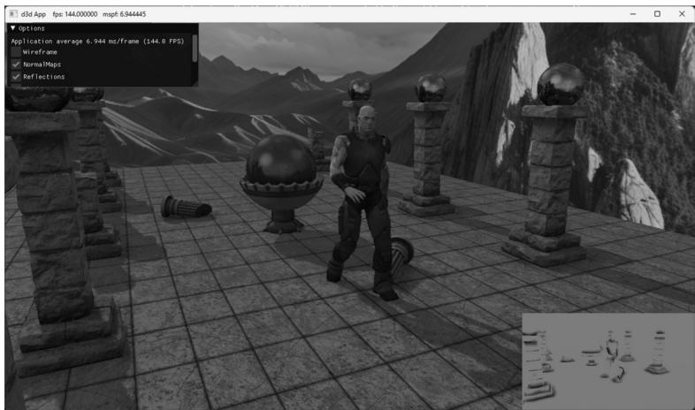


Figure 23.11. Screenshot of the “Skinned Mesh” demo


# 23.6 SUMMARY

1. Many real world objects we wish to model graphically in a computer program consist of parts with a parent-children relationship, where a child object can move independently on its own, but is also forced to move when its parent moves. For example, a tank turret can rotate independently of the tank, but it is still fixed to the tank and moves with the tank. Another classic example is skeletons, in which bones are attached to other bones and must move when they move. Consider game characters on a train. The characters can move independently inside the train, but they also move as the train moves. This example illustrates how, in a game, the hierarchy can change dynamically and must be updated. That is, before a character enters a train, the train is not part of the character’s hierarchy, but once the player does enter a train, the train does become part of the character’s hierarchy (the character inherits the train transformation). 

2. Each object in a mesh hierarchy is modeled about its own local coordinate system with its pivot joint at the origin to facilitate rotation. Because the coordinate systems exist in the same universe we can relate them, and therefore, transform from one to the other. In particular, we relate them by describing each object’s coordinate system relative to its parent’s coordinate system. From that, we can construct a to-parent transformation matrix that transforms the geometry of an object from its local coordinate system to its parent’s coordinate system. Once in the parent’s coordinate system, 

we can then transform by the parent’s to-parent matrix to transform to the grandparent’s coordinate system, and so on and so forth, until we have visited each ancestor’s coordinate system and finally reach the world space. Stated in other words, to transform an object in a mesh hierarchy from its local space to world space, we apply the to-parent transform of the object and all of its ancestors (in ascending order) to percolate up the coordinate system hierarchy until the object arrives in the world space. In this way, the object inherits the transformations of its parents and moves when they move. 

3. We can express the to-root transformation of the ith bone with the recurrence relation: $t o R o o t _ { i } = t o P a r e n t _ { i } \cdot t o R o o t _ { p }$ , where $\boldsymbol { p }$ refers to the parent bone of the ith bone. 

4. The bone-offset transformation transforms vertices from bind space to the space of the bone. There is an offset transformation for each bone in the skeleton. 

5. In vertex blending, we have an underlying bone hierarchy, but the skin itself is one continuous mesh, and one or more bones can influence a vertex. The magnitude in which a bone influences a vertex is determined by a bone weight. For four bones, the transformed vertex v', relative to the root of the skeleton, is given by the weighted averaging formula $\mathbf { v } ^ { \prime } = w _ { 0 } \mathbf { v } \mathbf { F } _ { 0 } + w _ { 1 } \mathbf { v } \mathbf { F } _ { 1 } + w _ { 2 } \mathbf { v } \mathbf { F } _ { 2 } + w _ { 3 } \mathbf { v } \mathbf { F } _ { 3 }$ , where $w _ { 0 } + w _ { 1 } + w _ { 2 } + w _ { 3 } = 1$ . By using a continuous mesh, and several weighted bone influences per vertex, a more natural elastic skin effect is achieved. 

6. To implement vertex blending, we store an array of final transformation matrices for each bone (the array is called a matrix palette). (The ith bone’s final transformation is defined as $\mathbf { F } _ { i } = o f f s e t _ { i } \cdot t o R o o t _ { i }$ —that is, the bone’s offset transformation followed by its to-root transformation.) Then, for each vertex, we store a list of vertex weights and matrix palette indices. The matrix palette indices of a vertex identify the final transformations of the bones that influence the vertex. 

# 23.7 EXERCISES

1. Model and render an animated linear hierarchy by hand. For example, you might model a simple robot arm built from sphere and cylinder meshes; the sphere could model a joint and the cylinder an arm. 

2. Model and render an animated tree hierarchy by hand such as the one shown in Figure 23.12. You can again use spheres and cylinders. 

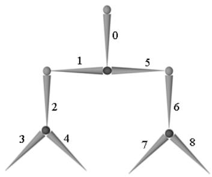


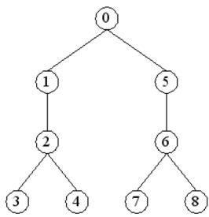


Figure 23.12. Simple mesh hierarchy.


3. If you have access to an animation package (Blender http://www.blender.org/ is free), try learning how to model a simple animated character using bones and blend weights. Export your data to the .x file format which supports vertex blending, and try to convert the file data to the . $. \mathrm { m } 3 \mathrm { d }$ format for rendering in the “Skinned Mesh” demo. This is not a short project. 

4. In this Chapter’s demo, we performed the bone animation on the CPU, and then the GPU accessed the final bone transformations from a constant buffer in an upload heap. For this exercise, move the animation and final bone transformation calculations to the GPU using compute shaders. In this way, the shader that does the vertex skinning does not need to read across the PCI-Express Bus. 