# Chapter

# 9

# Tex turing

Our demos are getting a little more interesting, but the objects drawn in the previous chapter are essentially lit colored objects. Real-world objects typically have more details than constant material properties per draw call can capture. Texture mapping is a technique that allows us to map image data onto a triangle, thereby enabling us to increase the details and realism of our scene significantly. For instance, we can build a cube and turn it into a crate by mapping a crate texture on each side (Figure 9.1). 

# Chapter Objectives:

1. To learn how to specify the part of a texture that gets mapped to a triangle. 

2. To find out how to create and enable textures. 

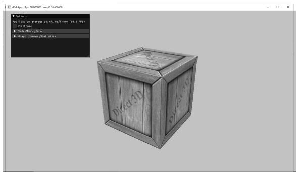


Figure 9.1. The Crate demo creates a cube with a crate texture.


3. To learn how textures can be filtered to create a smoother image. 

4. To discover how to tile a texture several times with address modes. 

5. To find out how multiple textures can be combined to create new textures and special effects. 

6. To learn how to create some basic effects via texture animation. 

# 9.1 TEXTURE AND RESOURCE RECAP

Recall that we have already been using textures since Chapter 4; in particular, the depth buffer and back buffer are 2D texture objects represented by the ID3D12Resource interface with the D3D12_RESOURCE_DESC::Dimension of D3D12_ RESOURCE_DIMENSION_TEXTURE2D. For easy reference, in this first section we review much of the material on textures we have already covered in Chapter 4. 

A 2D texture is a matrix of data elements. One use for 2D textures is to store 2D image data, where each element in the texture stores the color of a pixel. However, this is not the only usage; for example, in an advanced technique called normal mapping, each element in the texture stores a 3D vector instead of a color. Therefore, although it is common to think of textures as storing image data, they are really more general purpose than that. A 1D texture (D3D12_RESOURCE_DIMENSION_ TEXTURE1D) is like a 1D array of data elements, and a 3D texture (D3D12_RESOURCE DIMENSION_TEXTURE3D) is like a 3D array of data elements. The 1D, 2D, and 3D texture interfaces are all represented by the generic ID3D12Resource. 

Textures are different than buffer resources, which just store arrays of data; textures can have mipmap levels, and the GPU can do special operations on them, such as apply filters and multisampling. Because of these special operations that are supported for texture resources, they are limited to certain kind of data formats, whereas buffer resources can store arbitrary data. The data formats supported for textures are described by the DXGI_FORMAT enumerated type. Some example formats are: 

1. DXGI_FORMAT_R32G32B32_FLOAT: Each element has three 32-bit floating-point components. 

2. DXGI_FORMAT_R16G16B16A16_UNORM: Each element has four 16-bit components mapped to the [0, 1] range. 

3. DXGI_FORMAT_R32G32_UINT: Each element has two 32-bit unsigned integer components. 

4. DXGI_FORMAT_R8G8B8A8_UNORM: Each element has four 8-bit unsigned components mapped to the [0, 1] range. 

5. DXGI_FORMAT_R8G8B8A8_SNORM: Each element has four 8-bit signed components mapped to the [-1, 1] range. 

6. DXGI_FORMAT_R8G8B8A8_SINT: Each element has four 8-bit signed integer components mapped to the [-128, 127] range. 

7. DXGI_FORMAT_R8G8B8A8_UINT: Each element has four 8-bit unsigned integer components mapped to the [0, 255] range. 

Note that the R, G, B, A letters are used to stand for red, green, blue, and alpha, respectively. However, as we said earlier, textures need not store color information; for example, the format 

DXGI_FORMAT_R32G32B32_FLOAT 

has three floating-point components and can therefore store a 3D vector with floating-point coordinates (not necessarily a color vector). There are also typeless formats, where we just reserve memory and then specify how to reinterpret the data at a later time (sort of like a cast) when the texture is bound to the rendering pipeline; for example, the following typeless format reserves elements with four 8-bit components, but does not specify the data type (e.g., integer, floating-point, unsigned integer): 

DXGI_FORMAT_R8G8B8A8_TYPELESS 


The DirectX 11 SDK documentation says: “Creating a fully typed resource restricts the resource to the format it was created with. This enables the runtime to optimize access […].” Therefore, you should only create a typeless resource if you really need it; otherwise, create a fully typed resource. 

A texture can be bound to different stages of the rendering pipeline; a common example is to use a texture as a render target (i.e., Direct3D draws into the texture) and as a shader resource (i.e., the texture will be sampled in a shader). A texture can also be used as both a render target and as a shader resource, but not at the same time. Rendering to a texture and then using it as a shader resource, a method called renderto-texture, allows for some interesting special effects which we will use later in this book. For a texture to be used as both a render target and a shader resource, we would need to create two descriptors to that texture resource: 1) one that lives in a render target heap (i.e., D3D12_DESCRIPTOR_HEAP_TYPE_RTV) and 2) one that lives in a shader resource heap (i.e., D3D12_DESCRIPTOR_HEAP_TYPE_CBV_SRV_UAV). (Note that a shader resource heap can also store constant buffer view descriptors and unordered access view descriptors.) Then the resource can be bound as a render target or bound as a shader input to a root parameter in the root signature (but never at the same time): 

//Bind as render target.   
CD3DX12_CPU describingrHandle rtv $=$ ...;   
CD3DX12_CPU describingrHandle dsv $=$ ...;   
cmdList->OMSetRenderTargets(1，&rtv，true，&dsv); 

//Bind as shader input to root parameter. CD3DX12_GPU_DESCRIPTOR_handle tex $= \ldots$ .   
cmdList->SetGraphicsRootDescriptorTable(rootParamIndex，tex); 

Resource descriptors essentially do two things: they tell Direct3D how the resource will be used (i.e., what stage of the pipeline you will bind it to), and if the resource format was specified as typeless at creation time, then we must now state the type when creating a view. Thus, with typeless formats, it is possible for the elements of a texture to be viewed as floating-point values in one pipeline stage and as integers in another; this essentially amounts to a reinterpret cast of the data. 

Textures have a layout property, and we typically specify D3D12_TEXTURE_LAYOUT_ UNKNOWN, which means the layout of the texture data in memory is determined by the GPU for optimal access and caching patterns. It is worth noting that on the GPU, texture data is likely not stored sequentially row-by-row; instead, it is often tiled and swizzled to optimize texture access patterns and caching (see [Giesen11]). When the GPU is writing to a resource as is the case for the depth/stencil buffer, D3D12_TEXTURE_LAYOUT_UNKNOWN is fine as the GPU knows the internal layout and can read and write to it without a problem. However, suppose we need to copy a texture from disk, stored in row major layout, to GPU memory; the pattern is to create an upload buffer with the texture data stored in row-major layout, and then issue a GPU copy command to copy it to a texture in a default heap with layout D3D12_TEXTURE_LAYOUT_UNKNOWN. During this copy, the GPU will convert the image data from the row major layout to the optimized tiled/swizzled layout. 

Note that SRVs to textures cannot be bound as a root descriptor $( \ S 7 . 4 . 1 )$ . The main reason textures cannot be root descriptors is that textures need the full descriptor data (such as info about dimensions and format), so a pointer is not sufficient. 

In this chapter, we are only interested in binding textures as shader resources so that our pixel shaders can sample the textures and use them to color pixels. However, textures can be accessed in all shader stages. 

# 9.2 TEXTURE COORDINATES

Direct3D uses a texture coordinate system that consists of a $u$ -axis that runs horizontally to the image and a $\nu$ -axis that runs vertically to the image. The coordinates, $( u , \ \nu )$ such that $0 \leq u , \nu \leq 1$ , identify an element on the texture called a texel. Notice that the $\nu$ -axis is positive in the “down” direction (see Figure 9.2). Also, notice the normalized coordinate interval, [0, 1], which is used because it gives Direct3D a dimension independent range to work with; for example, (0.5, 0.5) always specifies the middle texel no matter if the actual texture 

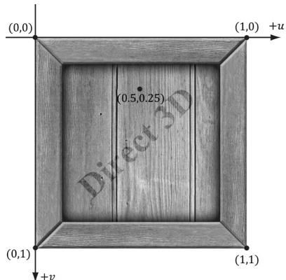


Figure 9.2. The texture coordinate system, sometimes called texture space.


dimensions are $2 5 6 \times 2 5 6$ , $5 1 2 \times 1 0 2 4$ , or $2 0 4 8 \times 2 0 4 8$ in pixels. Likewise, (0.25, 0.75) identifies the texel a quarter of the total width in the horizontal direction, and three-quarters of the total height in the vertical direction. For now, texture coordinates are always in the range [0, 1], but later we explain what can happen when you go outside this range. 

For each 3D triangle, we want to define a corresponding triangle on the texture that is to be mapped onto the 3D triangle (see Figure 9.3). Let $\mathbf { p } _ { 0 } , \mathbf { p } _ { 1 }$ , and ${ \bf p } _ { 2 }$ be the vertices of a 3D triangle with respective texture coordinates ${ \bf q } _ { 0 } , { \bf q } _ { 1 }$ , and $\mathbf { q } _ { 2 }$ . An arbitrary point $\scriptstyle \mathbf { p } = ( x , y , z )$ on the 3D triangle can be written in terms of the edge vectors of the triangle: $\mathbf { p } = \mathbf { p } _ { 0 } + s ( \mathbf { p } _ { 1 } - \mathbf { p } _ { 0 } ) + t ( \mathbf { p } _ { 2 } - \mathbf { p } _ { 0 } )$ . The texture coordinates $( u , \nu )$ corresponding to $\mathbf { p }$ are given by linearly interpolating the vertex texture coordinates across the 3D triangle by the same s, t parameters; that is, if 

$$
(x, y, z) = \mathbf {p} = \mathbf {p} _ {0} + s (\mathbf {p} _ {1} - \mathbf {p} _ {0}) + t (\mathbf {p} _ {2} - \mathbf {p} _ {0})
$$

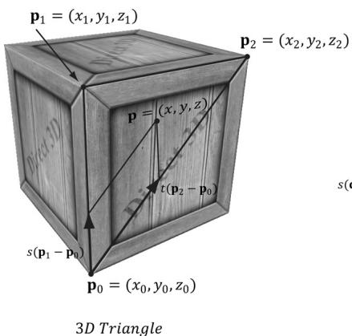


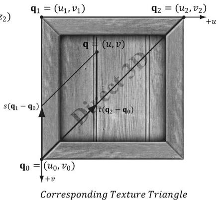


Figure 9.3. On the left is a triangle in 3D space, and on the right we define a 2D triangle on the texture that is going to be mapped onto the 3D triangle.


for $s \geq 0 , t \geq 0 , s + t \leq 1$ then, 

$$
(u, v) = \mathbf {q} = \mathbf {q} _ {0} + s \left(\mathbf {q} _ {1} - \mathbf {q} _ {0}\right) + t \left(\mathbf {q} _ {2} - \mathbf {q} _ {0}\right)
$$

In this way, every point on the triangle has a corresponding texture coordinate. 

Recall from $\ S 8 . 1 4 . 1$ that we introduced the ModelVertex structure which had a TexC member that was not used in Chapter 8. This member is for storing texture coordinates at each vertex. Now every 3D vertex has a corresponding 2D texture vertex. Thus, every 3D triangle defined by three vertices also defines a 2D triangle in texture space (i.e., we have associated a 2D texture triangle for every 3D triangle). 

```c
struct ModelVertex
{
    DirectX::XMFLOAT3 Pos;
    DirectX::XMFLOAT3 Normal;
    DirectX::XMFLOAT2 TexC;
    DirectX::XMFLOAT3 TangentU;
};
std::vector<D3D12_INPUT_element_DESC> mInputLayout = {
    {"POSITION", 0, DXGI_FORMAT_R32G32B32_FLOAT, 0, 0, D3D12_INPUT_CLASSIFICATION_PER_FLOAT_DATA, 0}, { "NORMAL", 0, DXGI_format_R32G32B32_FLOAT, 0, 12, D3D12_INPUT_CLASSIFICATION_PER_FLOAT_DATA, 0}, { "TEXCOORD", 0, DXGI_format_R32G32_FLOAT, 0, 24, D3D12_INPUT_CLASSIFICATION_PER_FLOAT_DATA, 0}, { "TANGENT", 0, DXGI_format_R32G32B32_FLOAT, 0, 32, D3D12_INPUT_CLASSIFICATION_PER_FLOAT_DATA, 0},
}; 
```

Note: 

You can create “odd” texture mappings where the 2D texture triangle is much different than the 3D triangle. Thus, when the 2D texture is mapped onto the 3D triangle, a lot of stretching and distortion occurs making the results not look good. For example, mapping an acute angled triangle to a right angled triangle requires stretching. In general, texture distortion should be minimized, unless the texture artist desires the distortion look. 

Observe that in Figure 9.3, we map the entire texture image onto each face of the cube. This is by no means required. We can map only a subset of a texture onto geometry. In fact, we can place several unrelated images on one big texture map (this is called a texture atlas), and use it for several different objects (Figure 9.4). The texture coordinates are what will determine what part of the texture gets mapped on the triangles. 

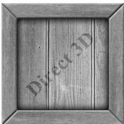


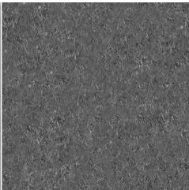


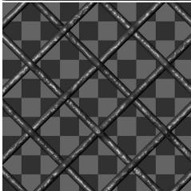


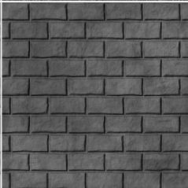


Figure 9.4. A texture atlas storing four subtextures on one large texture. The texture coordinates for each vertex are set so that the desired part of the texture gets mapped onto the geometry.


# 9.3 TEXTURE DATA SOURCES

The most prevalent way of creating textures for games is for an artist to make them in Photoshop or some other image editor, and then save them as an image file like BMP, DDS, TGA, or PNG. Then the game application will load the image data at load time into an ID3D12Resource object. For real-time graphics applications, the DDS (DirectDraw Surface format) image file format is preferred, as it supports a variety of image formats that are natively understood by the GPU; in particular, it supports compressed image formats that can be natively decompressed by the GPU. 


Artists should not use the DDS format as a working image format. Instead, they should use their preferred format for saving work. Then when the texture is complete, they export out to DDS for the game application. 

# 9.3.1 DDS Overview

The DDS format is ideal for 3D graphics because it supports special formats and texture types that are specifically used for 3D graphics. It is essentially an image format built for GPUs. For example, DDS textures support the following features (not yet discussed) used in 3D graphics development: 

1. mipmaps 

2. compressed formats that the GPU can natively decompress 

3. texture arrays 

4. cube maps 

5. volume textures 

The DDS format can support different pixel formats. The pixel format is described by a member of the DXGI_FORMAT enumerated type; however, not all formats apply to DDS textures. Typically, for uncompressed image data you will use the formats: 

1. DXGI_FORMAT_B8G8R8A8_UNORM or DXGI_FORMAT_B8G8R8X8_UNORM: For lowdynamic-range images. 

2. DXGI_FORMAT_R16G16B16A16_FLOAT: For high-dynamic-range images. 

The GPU memory requirements for textures add up quickly as your virtual worlds grow with thousands of textures (remember we need to keep all these textures in GPU memory to apply them quickly). To help alleviate these memory requirements, Direct3D supports compressed texture formats: BC1, BC2, BC3, BC4, BC5, BC6, and BC7. The BC stands for “block compressed” and the compression works by compressing 4x4 blocks of pixels. The pixels next to each other should not vary too much, and so we should be able to reduce memory by removing some redundancy. 

1. BC1 (DXGI_FORMAT_BC1_UNORM): Use this format if you need to compress a format that supports three color channels, and only a 1-bit (on/off) alpha component. 

2. BC2 (DXGI_FORMAT_BC2_UNORM): Use this format if you need to compress a format that supports three color channels, and only a 4-bit alpha component. 

3. BC3 (DXGI_FORMAT_BC3_UNORM): Use this format if you need to compress a format that supports three color channels, and a 8-bit alpha component. 

4. BC4 (DXGI_FORMAT_BC4_UNORM): Use this format if you need to compress a format that contains one color channel (e.g., a grayscale image). 

5. BC5 (DXGI_FORMAT_BC5_UNORM): Use this format if you need to compress a format that supports two color channels. Each block essentially stores two BC4 blocks. 

6. BC6 (DXGI_FORMAT_BC6_UF16): Use this format for compressed HDR (high dynamic range) image data. 

7. BC7 (DXGI_FORMAT_BC7_UNORM): Use this format for high quality RGBA compression. This format significantly reduces the errors caused by compressing normal maps. 

For readers interested in the details of how block compression works, see the articles by [Reed12] and [Microsoft22], both available online. 

A compressed texture can only be used as an input to the shader stage of the rendering pipeline, not as a render target. Because the block compression algorithms work with 4x4 pixel blocks, the dimensions of the texture must be multiples of 4. 

Again, the advantage of these formats is that they can be stored compressed in GPU memory, and then decompressed on the fly by the GPU when needed. An additional advantage of storing your textures compressed in DDS files is that they also take up less hard disk space. 

# 9.3.2 Creating DDS Files

If you are new to graphics programming, you are probably unfamiliar with DDS and are probably more used to using formats like BMP, TGA, or PNG. Here are two ways to convert traditional image formats to the DDS format: 

1. NVIDIA has a standalone tool that can export common image formats to DDS and has a plugin for Adobe Photoshop that can export images to the DDS format. The tool/plugin is available at https://developer.nvidia.com/ nvidia-texture-tools-exporter. Among other options, it allows you to specify the DXGI_FORMAT of the DDS file and generate mipmaps (see Figure 9.5). 

2. Microsoft provides a command line tool called texconv that can be used to convert traditional image formats to DDS. In addition, the texconv program can be used for more actions, such as resizing images, changing pixel formats, and generating mipmaps. You can find the documentation and download link at the following website: https://github.com/Microsoft/DirectXTex/wiki/Texconv. 

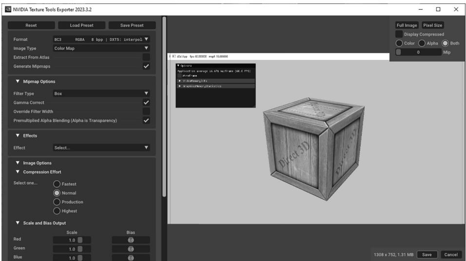


Figure 9.5. Screenshot of the NVIDIA Texture Tools Exporter


The following example inputs a BMP file bricks.bmp and outpts a DDS file bricks. dds with format BC3_UNORM and generates a mipmaps chain with 10 mipmaps. 

texconv -m 10 -f BC3_UNORM treeArray.dds 

# Note:

Microsoft provides an additional command line tool called texassemble, which is used to create DDS files that store texture arrays, volume maps, and cube maps. We will need this tool later in the book. Its documentation and download link can be found at https://github.com/Microsoft/DirectXTex/ wiki/Texassemble. 

# Note:

Visual Studio 2015 and beyond has a built-in image editor that supports DDS in addition to other popular formats. You can drag an image into Visual Studio and it should open it in the image editor. For DDS files, you can view the mipmap levels, change the DDS format, and view the various color channels. 

# 9.4 CREATING AND ENABLING A TEXTURE

# 9.4.1 Loading DDS Files

The DirectX Toolkit has code in DDSTextureLoader.h/.cpp to load DDS files into an ID3D12Resource: 

```txt
HRESULT DirectX::CreateDDSTextureFromFileEx(
ID3D12Device* d3dDevice,
ResourceUploadBatch& resourceUpload,
const wchar_t* fileName,
size_t maximize,
D3D12Resource Flags resFlags,
DDSloader Flags loadFlags,
ID3D12Resource** texture,
DDS ALPHA_MODE* alphaMode,
bool* isCubeMap); 
```

1. d3dDevice: Pointer to the D3D device to create the texture resources. 

2. resourceUpload: A reference to an instance of the ResourceUploadBatch helper class (introduced in $\ S 6 . 2 )$ . 

3. fileName: Filename of the image to load. 

4. maxsize: If maxsize $> ~ 0$ , then it instructs the function to ignore mipmap levels larger than maxsize. If maxsize $\scriptstyle = = 0$ , then nothing is ignored. 

5. resFlags: Resource flags. For read-only textures mapped onto geometry, anything other than D3D12_RESOURCE_FLAG_NONE would be uncommon. 

6. loadFlags: Either DDS_LOADER_DEFAULT (use what is in the file), DDS_LOADER_ FORCE_SRGB (force the image to be SRGB color space) or DDS_LOADER_MIP_ AUTOGEN (auto generate mipmaps). For demos auto generating mipmaps is fine, but typically, you would want to do this offline as part of an asset pipeline. 

7. texture: Outputs a pointer to the created texture resource. 

8. alphaMode: Outputs a member of the DDS_ALPHA_MODE enumerated type that provides extra metadata on how the texture uses the alpha channel. This is an optional output parameter, and we specify null for it. Our application will manually interpret what the data in the alpha channel is used for. 

9. isCubeMap: Outputs whether the image is a cube map or not (cube mapping is discussed in Part III of this book). 

To create a texture from an image called WoodCreate01.dds and auto generate mipmaps we would write the following code. Note that it is helpful to write a lightweight wrapper structure around a texture with some additional data. 

```cpp
struct Texture {
    Texture() = default;
    Texture(const Texture& rhs) = delete;
    Texture& operator = (const Texture& rhs) = delete;
    // Unique material name for lookup.
    std::string Name;
    std::wstring Filename;
    bool IsCubeMap = false;
    int BindlessIndex = -1;
    const D3D12Resource_DESC& Info() const { return Resource->GetDesc(); }
    Microsoft::WRL::ComPtr<ID3D12Resource> Resource = nullptr;
}; 
```

# 9.4.2 Texture and Material Lib

To not repeat texture loading code in every demo of this book, we implement a TextureLib utility class in Common/TextureLib.h/.cpp. This class is mostly a wrapper around an unordered map of textures so that we can look up a texture by name: 

std::unordered_map<std::string, std::unique_ptr<Texture>> mTextures; 

In the TextureLib::Init function, we populate the unordered map with all the textures we will use in the demos of this book. This is a little wasteful since each demo does not utilize all the textures in the library, but there are not that many textures in these examples. In a real application, you could trim the texture list to just those that your application uses. For us, the primary motivation for this is to not repeat texture loading code in every demo of this book, we can lookup whatever texture we need, and have access to a texture library for writing demos. For brevity, we do not show the entire list of textures, but the following gives an idea of what TextureLib::Init does: 

```cpp
void TextureLib::Init(ID3D12Device* device, ResourceUploadBatch& uploadBatch)   
{ std::vector<std::string> texNames = { "crateDiffuseMap", "waterDiffuseMap", "fenceDiffuseMap", "grassDiffuseMap", }; std::vector<std::wstring> texFilenames = { L"Textures/WoodCrate01.dds", L"Textures/waterl.dds", L"Textures/WireFence.dds", L"Textures/grass.dds", }; for(int i = 0; i < (int) texNames.size(); ++i) { auto texMap = std::make_unique<Texture>(); texMap->Name = texNames[i]; texMap->Filename = texFilenames[i]; ThrowIfFailed(DirectX::CreateDDSTextureFromFileEx( device, uploadBatch, texMap->Filename.c_str(), 0, D3D12Resource_FLAG_NONE, DDSloader_MIP_AUTOGEN, &texMap->Resource, nullptr, &texMap->IsCubeMap)); mTextures[TEXmap->Name] = std::moveTEXmap); } 
```

```txt
mIs Initialized = true; 
```

The TextureLib class is a singleton with method: 

```txt
static TextureLib& GetLib()   
{ static TextureLib singleton; return singleton;   
} 
```

Two other methods we will use are the overloaded operator[] for looking up a texture by name, and getting the entire map collection so we can iterate over it: 

```cpp
Texture\* TextureLib::operator[] (const std::string& name)   
{ if(mTextures.find(name) != mTextures.end()) { return mTextures[name].get(); } return nullptr;   
}   
const std::unordered_map<std::string, std::unique_ptr<Texture>>& TextureLib::GetCollection() const { return mTextures;   
} 
```

Similar to textures, we do not want to redefine materials in every demo of this book, and if a material needs to be tweaked by an artist, it is helpful to only have to update it in one place. Furthermore, for writing new demos it is convenient to have a library of common materials as a starting point. 

The MaterialLib defined in Common/MaterialLib.h/.cpp has a similar interface to TextureLib. It is also a wrapper around an unordered map of Materials: 

```cpp
struct Material {
    // Unique material name for lookup.
    std::string Name;
    // Index into material buffer.
    int MatIndex = -1;
    // For bindless texturing.
    int AlbedoBindlessIndex = -1;
    int NormalBindlessIndex = -1;
    int GlossHeightAoBindlessIndex = -1;
    // Dirty flag indicating the material has changed and we need to update the buffer. Because we have a material buffer for each FrameResource, we have to apply the update to each 
```


```cpp
// FrameResource. Thus, when we modify a material we should set // NumFramesDirty = gNumFrameResources so that each frame resource // gets the update. int NumFramesDirty = gNumFrameResources; // Material constant buffer data used for shading. DirectX::XMFLOAT4 DiffuseAlbedo = { 1.0f, 1.0f, 1.0f, 1.0f }; DirectX::XMFLOAT3 FresnelR0 = { 0.01f, 0.01f, 0.01f }; float Roughness = .25f; float DisplacementScale = 1.0f; DirectX::XMFLOAT4X4 MatTransform = MathHelper::Identity4x4(); // Used in ray tracing demos only. float TransparencyWeight = 0.0f; float IndexOfRefraction = 0.0f; }; std::unordered_map<std::string, std::unique_ptr材Material>> mMaterials; 
```

The Material struct references three different kinds of textures. For now, we are concerned about the albedo texture, which defines the diffuse reflectivity; it is basically a more detailed image representation of the constant DiffuseAlbedo member. The other two textures are placeholders for more advanced techniques described later in this book. 

For brevity, we do not show the entire list of materials, but the following gives an idea of what MaterialLib::Init does: 

```cpp
bool MaterialLib::AddMaterial(
    const std::string& name,
    Texture* albedoMap,
    Texture* normalMap,
    Texture* glossHeightAoMap,
    const XMFOAT4& diffuse,
    const XMFOAT3& fresnel,
    float roughness,
    float displacementScale,
    const DirectX::XMFOAT4X4& matTransform,
    float transparency,
    float indexOfRefraction)
{
    if (mMaterials.find(name) == mMaterials.end())
        {
            static int matIndex = 0;
            auto mat = std::make_unique<Material>();
            mat->Name = name;
            mat->MatIndex = matIndex;
            mat->AlbedoBindlessIndex = albedoMap != nullptr ?
                albedoMap->BindlessIndex : -1;
            mat->NormalBindlessIndex = normalMap != nullptr ?
                normalMap->BindlessIndex : -1; 
```

mat->GlossHeightAoBindlessIndex = glossHeightAoMap != nullptr? glossHeightAoMap->BindlessIndex : -1;   
mat->DiffuseAlbedo = diffuse;   
mat->FresnelR0 = fresnel;   
mat->Roughness = roughness;   
mat->DisplacementScale = displacementScale;   
mat->MatTransform = matTransform;   
// Used in ray tracing demos only.   
mat->TransparencyWeight = transparency;   
mat->indexOfRefraction =indexOfRefraction;   
matIndex++;   
mMaterials[name] = std::move(mat);   
return true;   
}   
return false;   
}   
void MaterialLib::Init(ID3D12Device* device)   
{ TextureLib& texLib $=$ TextureLib::GetLib();   
AddMaterial("crate", texLib["crateDiffuseMap"], texLib["defaultNormalMap"], texLib["defaultGlossHeightAoMap"], XMFLOAT4(1.0f, 1.0f, 1.0f, 1.0f), XMFLOAT3(0.1f, 0.1f, 0.1f), 0.3f);   
AddMaterial("fence", texLib["fenceDiffuseMap"], texLib["defaultNormalMap"], texLib["defaultGlossHeightAoMap"], XMFLOAT4(1.0f, 1.0f, 1.0f, 1.0f), XMFLOAT3(0.1f, 0.1f, 0.1f), 0.25f);   
AddMaterial("grass", texLib["grassDiffuseMap"], texLib["defaultNormalMap"], texLib["defaultGlossHeightAoMap}], XMFLOAT4(1.0f, 1.0f, 1.0f, 1.0f), XMFLOAT3(0.1f, 0.1f, 0.1f), 0.8f);   
AddMaterial("bricksO", texLib["bricksDiffuseMap"], texLib["bricksNormalMap"], texLib["bricksGlossHeightAoMap}], XMFLOAT4(1.0f, 1.0f, 1.0f, 1.0f), XMFloat3(0.1f, 0.1f, 0.1f), 0.3f); 

```javascript
AddMaterial("tile0", texLib["tileDiffuseMap"], texLib["tileNormalMap"], texLib["tileGlossHeightAoMap"], XMFLOAT4(0.9f, 0.9f, 0.9f, 1.0f), XMFLOAT3(0.2f, 0.2f, 0.2f), 0.1f); AddMaterial("rock0", texLib["rock_color"], texLib["rock_normal"], texLib["rock_gloss_height_ao"], XMFLOAT4(0.9f, 0.9f, 0.9f, 1.0f), XMFLOAT3(0.2f, 0.2f, 0.2f), 0.1f); mIs Initialized = true; 
```

Loading textures and building materials in our sample applications now gets handled by the texture and material libs: 

```cpp
void CrateApp::BuildMaterials()
{
    MaterialLib::GetLib().Init.md3dDevice.Get());
}
void CrateApp::LoadTextures()
{
    TextureLib& texLib = TextureLib::GetLib();
    texLib.Import.md3dDevice.Get(), *mUploadBatch.get());
} 
```

# 9.4.3 Creating SRV Descriptors

As described in $\ S 4 . 1 . 6$ , resources (e.g., textures) do not get bound to the rendering pipeline directly. Instead, we must create a descriptor that describes the resource and then the GPU can access the resource from the descriptor. An SRV descriptor is described by filling out a D3D12_SHADER_RESOURCE_VIEW_DESC object, which describes how the resource is used and other information—its format, dimension, mipmaps count, etc. 

```txt
typedef struct D3D12_SHADER_RESOURCE.View_DESC { DXGI_FORMAT Format; D3D12_SRV_DIMENSION ViewDimension; UINT Shader4ComponentMapping; union { D3D12_buffer_SRV Buffer; D3D12TEX1D_SRV Texture1D; D3D12TEX1D_ARRAY_SRV Texture1DArray; D3D12TEX2D_SRV Texture2D; 
```

```javascript
D3D12_TX2D_ARRAY_SRV Texture2DArray; D3D12_TX2DMS_SRV Texture2DMS; D3D12_TX2DMS_ARRAY_SRV Texture2DMSArray; D3D12_TX3D_SRV Texture3D; D3D12_TXCUBE_SRV TextureCube; D3D12_TXCUBE_ARRAY_SRV TextureCubeArray; }; } D3D12_SHADER_RESOURCE.'<VIEW_DESC; typedef struct D3D12_TX2D_SRV { UINT MostDetailedMip; UINT MipLevels; UINT PlaneSlice; FLOAT ResourceMinLODClamp; } D3D12_TX2D_SRV; 
```

For 2D textures, we are only interested in the D3D12_TEX2D_SRV part of the union. 

1. Format: The format of the resource. Set this to the DXGI_FORMAT of the resource you are creating a view to if the format was non-typeless. If you specified a typeless DXGI_FORMAT for the resource during creation, then you must specify a non-typeless format for the view here so that the GPU knows how to interpret the data. 

typeless format when creating 

2. ViewDimension: The resource dimension; for now, we are using 2D textures so we specify D3D12_SRV_DIMENSION_TEXTURE2D. Other common texture dimensions would be: 

a) D3D12_SRV_DIMENSION_TEXTURE1D: The resource is a 1D texture. 

b) D3D12_SRV_DIMENSION_TEXTURE3D: The resource is a 3D texture. 

c) D3D12_SRV_DIMENSION_TEXTURECUBE: The resource is a cube texture. 

3. Shader4ComponentMapping: When a texture is sampled in a shader, it will return a vector of the texture data at the specified texture coordinates. This field provides a way to reorder the vector components returned when sampling the texture. For example, you could use this field to swap the red and green color components. This would be used in special scenarios, which we do not need in this book. So we just specify D3D12_DEFAULT_SHADER_4_COMPONENT_MAPPING which will not reorder the components and just return the data in the order it is stored in the texture resource. 

4. MostDetailedMip: Specifies the index of the most detailed mipmap level to view. This will be a number between 0 and MipCount-1. 

5. MipLevels: The number of mipmap levels to view, starting at MostDetailedMip. This field, along with MostDetailedMip allows us to specify a subrange of 

mipmap levels to view. You can specify -1 to indicate to view all mipmap levels from MostDetailedMip down to the last mipmap level. 

6. PlaneSlice: Plane index. 

7. ResourceMinLODClamp: Specifies the minimum mipmap level that can be accessed. 0.0 means all the mipmap levels can be accessed. Specifying 3.0 means mipmap levels 3.0 to MipCount-1 can be accessed. 

We define the following utility function for making SRVs to 2D textures in DescriptorUtil.h. This function uses typical settings. If you need more flexibility, you can always fill out the D3D12_SHADER_RESOURCE_VIEW_DESC manually or modify the parameters. 

```txt
inline void CreateSrv2d(ID3D12Device* device, ID3D12Resource* resource, DXGI_FORMAT format, UINT mipLevels, CD3DX12_CPU DescriptorHandle hDescriptor) { D3D12_SHADER_RESOURCE_DEVC DESC srvDesc = {}; svrDesc.Shader4ComponentMapping = D3D12_DEFAULT_SHADER_4_componentMapping; svrDesc.ViewDimension = D3D12_SRV_DIMENSION-textURE2D; svrDesc.Texture2D.MostDetailedMip = 0; svrDesc.Texture2D.ResourceMinLODClamp = 0.0f; svrDesc.Format = format; svrDesc.Texture2D.MipLevels = mipLevels; device->CreateShaderResourceView(resource, &srvDesc, hDescriptor); } 
```

The following code iterates over the texture library collection and populates the descriptor heap with SRVs: 

void CrateApp::BuildCbvSrvUavDescriptorHeap()   
{ CbvSrvUavHeap& cbvSrvUavHeap $\equiv$ CbvSrvUavHeap::Get(); cbvSrvUavHeap Init (md3dDevice.Get(),CBV_SRV_UAV HEAP_CAPACITY); InitImgui(cbvSrvUavHeap); TextureLib& texLib $\equiv$ TextureLib::GetLib(); forauto&it: texLib.GetCollection()) { Texture\*tex $\equiv$ it(second.get(); tex->BindlessIndex $\equiv$ cbvSrvUavHeap.NextFreeIndex(); CD3DX12_CPU Descriptor HANDLE hDescriptor $=$ cbvSrvUavHeap.CpuHandle(tex->BindlessIndex); ID3D12Resource\* texResource $\equiv$ tex->Resource.Get(); if(tex->IsCubeMap) { CreateSrvCube (md3dDevice.Get(), texResource, texResource->GetDesc().Format, 

```txt
texResource->GetDesc().MipLevels,
hDescriptor);
}
else
{
CreateSrv2d(fd3dDevice.Get(), texResource, texResource->GetDesc().Format, texResource->GetDesc().MipLevels, hDescriptor);
}
} 
```

# 9.4.4 SRV Heap and Bindless Texturing

Once a texture resource is created, we need to create an SRV descriptor to it stored in a descriptor heap of type D3D12_DESCRIPTOR_HEAP_TYPE_CBV_SRV_UAV. We continue to use the CbvSrvUavHeap utility class that we introduced in $\ S 6 . 6 . 4$ , which can store CBV, SRV and UAV descriptors. 

Prior to shader model 6.6, if we wanted to access a texture in a shader, we had to set a root table of the texture SRVs we wanted to access. 

```cpp
// Add root argument for texture table in root signature.  
CD3DX12 Descriptor_RANGE texTable;  
texTable Init( D3D12 Descriptor_RANGE_TYPE_SRV, 1, // number of descriptors 0); // register t0  
CD3DX12_ROOT_PARAMETER slotRootParameter[4]; slotRootParameter[0].InitAsDescriptorTable(1, &texTable, D3D12_SHADER_VISIBILITY_PIXEL);  
...  
CbvSrvUavHeap& cbvSrvUavHeap = CbvSrvUavHeap::Get();  
// Set root argument before draw call.  
CD3DX12_GPU DescriptorHandle tex = cbvSrvUavHeap.GpuHandle( renderItem->Mat->AlbedoBindlessIndex);  
cmdList->SetGraphicsRootDescriptorTable(0, tex);  
DrawRenderItem( renderItem);  
///**** Shader code ****  
// HLSL texture object mapped to register t0 Texture2D gDiffuseMap : register(t0);  
float4 PS(VertexOut pin) : SV_Target { 
```

```txt
// Read the texture in the shader float4 diffuseAlbedo = gDiffuseMap.Sample(GetAnisoWrapSampler(), pinTEXC);   
} 
```

Shader model 6.6 introduced a new mechanism where the CBV, SRV, and UAV heap can be indexed directly in shader code. This is where the following members are used: 

```javascript
albedoMap->BindlessIndex = cbvSrvUavHeap.NextFreeIndex(); // Propagate texture bindless index to the material data. mat->AlbedoBindlessIndex = albedoMap != nullptr ? albedoMap->BindlessIndex : -1; 
```

Each texture has a descriptor in the heap, and we store that index in the material data buffer (which is accessible to the shader). In the shader, we look up the material by index from the material buffer, and then from the material data we can get the texture index. Then, using the special HLSL syntax ResourceDescriptorHeap to access the heap, we can index the heap to get the texture in a shader: 

```txt
float4 PS(VertexOut pin) : SV_Target   
{ MaterialData matData = gMaterialData[gMaterialIndex]; float4 diffuseAlbedo = matData.DiffuseAlbedo; float3 fresnelR0 = matData.FresnelR0; float roughness = matData.Roughness; uint diffuseMapIndex = matData.DiffuseMapIndex; //Dynamically look up the texture in the heap. Texture2D diffuseMap = ResourceDescriptorHeap[diffuseMapIndex]; 
```

This is called bindless texturing because we do not have to bind textures explicitly to root arguments on the $\mathrm { C } { + + }$ side. However, in order to use this functionality, the root signature needs the special flag D3D12_ROOT_SIGNATURE_FLAG_CBV_SRV_UAV_ 

```javascript
HEAP_DIRECTLY_INDEXED: // Root parameter can be a table, root descriptor or // root constants. CD3DX12_ROOT_PARAMETER gfxRootParameters[GFX_ROOT.Arg_COUNT]; // performance TIP: Order from most frequent to least frequent. gfxRootParameters[GFX_ROOT.Arg_OBJECT_CBV]. InitAsConstantBufferView(0); gfxRootParameters[GFX_ROOT.Arg_PASS_CBV]. InitAsConstantBufferView(1); 
```

```c
gfxRootParameters[GFX_ROOT_arg_MATERIAL_SRV]. InitAsShaderResourceView(0);   
// A root signature is an array of root parameters.   
CD3DX12_ROOT_SIGNATURE_DESC rootSigDesc( GFX_ROOT.Arg_COUNT, gfxRootParameters, 0, nullptr, D3D12_ROOT_SIGNATURE_FLAG_OPEN_INPUT_ASSEMBLER_INPUT_LAYOUT | D3D12_ROOT_SIGNATURE_FLAG_CBV_SRV_UAV_HEAP_DIRECTLY_INDEXED | D3D12_ROOT_SIGNATURE_FLAG_SAMPLETER_HEAP_DIRECTLY_INDEXED); 
```

Samplers (and D3D12_ROOT_SIGNATURE_FLAG_SAMPLER_HEAP_DIRECTLY_INDEXED) are discussed later in this chapter in $\ S 9 . 7$ . 


A texture resource can actually be used by any shader (vertex, geometry, or pixel shader). For now, we will be using them in pixel shaders. As we mentioned, textures are essentially special arrays that support special operations on the GPU, so it is not difficult to imagine that they could be useful in other shader programs, too. 

# 9.5 FILTERS

# 9.5.1 Magnification

The elements of a texture map should be thought of as discrete color samples from a continuous image; they should not be thought of as rectangles with areas. So the question is: What happens if we have texture coordinates $( u , \nu )$ that do not coincide with one of the texel points? This can happen in the following situation. Suppose the player zooms in on a wall in the scene so that the wall covers the entire screen. For the sake of example, suppose the monitor resolution is $1 0 2 4 \times 1 0 2 4$ and the wall’s texture resolution is $2 5 6 \times 2 5 6$ . This illustrates texture magnification— we are trying to cover many pixels with a few texels. In our example, between every texel point lies four pixels. Each pixel will be given a pair of unique texture coordinates when the vertex texture coordinates are interpolated across the triangle. Thus there will be pixels with texture coordinates that do not coincide with one of the texel points. Given the colors at the texels we can approximate the colors between texels using interpolation. There are two methods of interpolation graphics hardware supports: constant interpolation and linear interpolation. In practice, linear interpolation is almost always used. 

Figure 9.6 illustrates these methods in 1D: Suppose we have a 1D texture with 256 samples and an interpolated texture coordinate $u = 0 . 1 2 6 4 8 4 3 7 5$ . This normalized texture coordinate refers to the $0 . 1 2 6 4 8 4 3 7 5 \times 2 5 6 = 3 2 . 3 8$ texel. Of course, this value lies between two of our texel samples, so we must use interpolation to approximate it. 

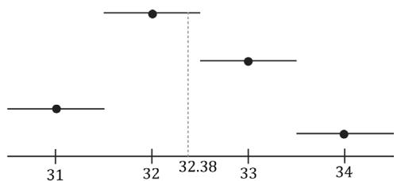


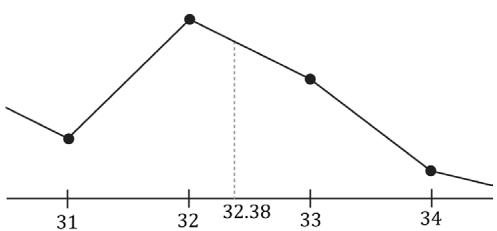


(b)


Figure 9.6. (a) Given the texel points, we construct a piecewise constant function to approximate values between the texel points; this is sometimes called nearest neighbor point sampling, as the value of the nearest texel point is used. (b) Given the texel points, we construct a piecewise linear function to approximate values between texel points.


2D linear interpolation is called bilinear interpolation and is illustrated in Figure 9.7. Given a pair of texture coordinates between four texels, we do two 1D linear interpolations in the $u$ -direction, followed by one 1D interpolation in the $\nu$ -direction. 

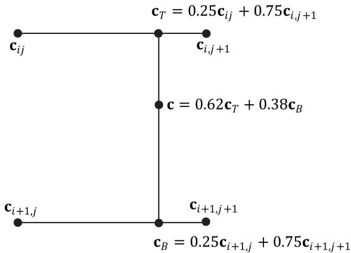


Figure 9.7. Here we have four texel points: $\mathbf { c } _ { i j }$ , $\mathbf { c } _ { i , j + 1 }$ , $\mathbf { c } _ { i + 1 , j } ,$ and $\pmb { c } _ { i + 1 , j + 1 }$ . We want to approximate the color of $\mathbf { c } _ { \mathbf { y } }$ which lies between these four texel points, using interpolation; in this example, c lies 0.75 units to the right of $\mathbf { c } _ { i j }$ and 0.38 units below $\mathbf { c } _ { i j }$ . We first do a 1D linear interpolation between the top two colors to get $\pmb { c } _ { T }$ . Likewise, we do a 1D linear interpolate between the bottom two colors to get $\pmb { c } _ { B }$ . Finally, we do a 1D linear interpolation between $\pmb { c } _ { T }$ and $\pmb { c } _ { B }$ to get c.


Figure 9.8 shows the difference between constant and linear interpolation. As you can see, constant interpolation has the characteristic of creating a blocky looking image. Linear interpolation is smoother, but still will not look as good as if we had real data (e.g., a higher resolution texture) instead of derived data via interpolation. 

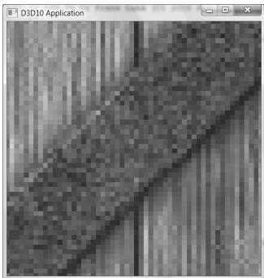


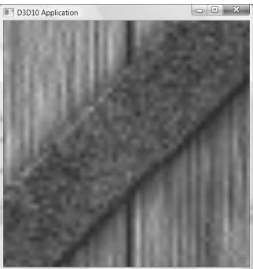


Figure 9.8. We zoom in on a cube with a crate texture so that magnification occurs. On the left we use constant interpolation, which results in a blocky appearance; this makes sense because the interpolating function has discontinuities (Figure 9.6a), which makes the changes abrupt rather than smooth. On the right we use linear filtering, which results in a smoother image due to the continuity of the interpolating function.


One thing to note about this discussion is that there is no real way to get around magnification in an interactive 3D program where the virtual eye is free to move around and explore. From some distances, the textures will look great, but will start to break down as the eye gets too close to them. Some games limit how close the virtual eye can get to a surface to avoid excessive magnification. Using higher resolution textures can help. 


In the context of texturing, using constant interpolation to find texture values for texture coordinates between texels is also called point filtering. And using linear interpolation to find texture values for texture coordinates between texels is also called linear filtering. Point and linear filtering is the terminology Direct3D uses. 

# 9.5.2 Minification

Minification is the opposite of magnification. In minification, too many texels are being mapped to too few pixels. For instance, consider the following situation where we have a wall with a $2 5 6 \times 2 5 6$ texture mapped over it. The eye, looking at the wall, keeps moving back so that the wall gets smaller and smaller until it only covers $6 4 \times 6 4$ pixels on screen. So now we have $2 5 6 \times 2 5 6$ texels getting mapped to $6 4 \times 6 4$ screen pixels. In this situation, texture coordinates for pixels will still generally not coincide with any of the texels of the texture map, so constant and linear interpolation filters still apply to the minification case. However, there is more that can be done with minification. Intuitively, a sort of average 

downsampling of the $2 5 6 \times 2 5 6$ texels should be taken to reduce it to $6 4 \times 6 4$ . The technique of mipmapping offers an efficient approximation for this at the expense of some extra memory. At initialization time (or asset creation time), smaller versions of the texture are made by downsampling the image to create a mipmap chain (see Figure 9.8). Thus the averaging work is precomputed for the mipmap sizes. At runtime, the graphics hardware will do two different things based on the mipmap settings specified by the programmer: 

1. Pick and use the mipmap level that best matches the projected screen geometry resolution for texturing, applying constant or linear interpolation as needed. This is called point filtering for mipmaps because it is like constant interpolation— you just choose the nearest mipmap level and use that for texturing. 

2. Pick the two nearest mipmap levels that best match the projected screen geometry resolution for texturing (one will be bigger and one will be smaller than the screen geometry resolution). Next, apply constant or linear filtering to both of these mipmap levels to produce a texture color for each one. Finally, interpolate between these two texture color results. This is called linear filtering for mipmaps because it is like linear interpolation—you linearly interpolate between the two nearest mipmap levels. 

By choosing the best texture levels of detail from the mipmap chain, the amount of minification is greatly reduced. 

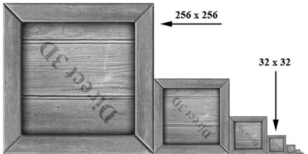


Figure 9.9. A chain of mipmaps; each successive mipmap is half the size, in each dimension, of the previous mipmap level of detail down to $1 \times 1$ .


As mentioned in $\ S 9 . 3 . 2 ,$ mipmaps can be created using the NVIDIA Texture Tools Exporter, or using the texconv program. These programs use a downsampling algorithm to generate the lower mipmap levels from the base image data. Sometimes these algorithms do not preserve the details we want, and an artist has to manually create/edit the lower mipmap levels to keep the important details. 

# 9.5.3 Anisotropic Filtering

Another type of filter that can be used is called anisotropic filtering. This filter helps alleviate the distortion that occurs when the angle between a polygon’s 

normal vector and camera’s look vector is wide (e.g., when a polygon is orthogonal to the view window). This filter is the most expensive but can be worth the cost for correcting the distortion artifacts. Figure 9.10 shows a screenshot comparing anisotropic filtering with linear filtering. 

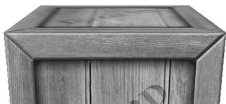


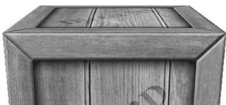


Figure 9.10. The top face of the crate is nearly orthogonal to the view window. (Left) Using linear filtering the top of the crate is badly blurred. (Right) Anisotropic filtering does a better job at rendering the top face of the crate from this angle.


# 9.6 ADDRESS MODES

A texture, combined with constant or linear interpolation, defines a vector-valued function $T ( u , \nu ) = ( r , g , b , a )$ . That is, given the texture coordinates $( u , \nu ) \in [ 0 , 1 ] ^ { 2 }$ the texture function $T$ returns a color $( r , g , b , a )$ . Direct3D allows us to extend the domain of this function in four different ways (called address modes): wrap, border color, clamp, and mirror. 

1. wrap extends the texture function by repeating the image at every integer junction (see Figure 9.11). 

2. border color extends the texture function by mapping each $( u , \nu )$ not in [0, 1]2 to some color specified by the programmer (see Figure 9.12). 

3. clamp extends the texture function by mapping each $( u , \nu )$ not in $[ 0 , 1 ] ^ { 2 }$ to the color $T ( u _ { 0 } , \nu _ { 0 } )$ , where $( u _ { 0 } , \nu _ { 0 } )$ is the nearest point to $( u , \nu )$ contained in [0, 1]2 (see Figure 9.13). 

4. mirror extends the texture function by mirroring the image at every integer junction (see Figure 9.14). 

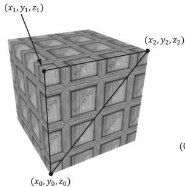


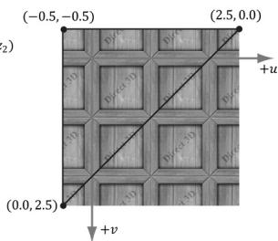


Figure 9.11. Wrap address mode


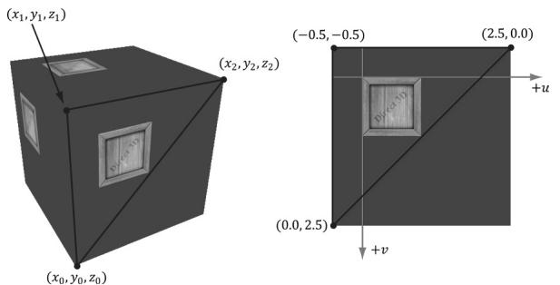


Figure 9.12. Border color address mode


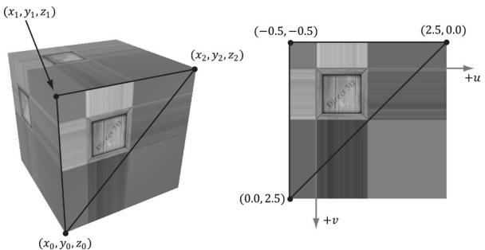


Figure 9.13. Clamp address mode


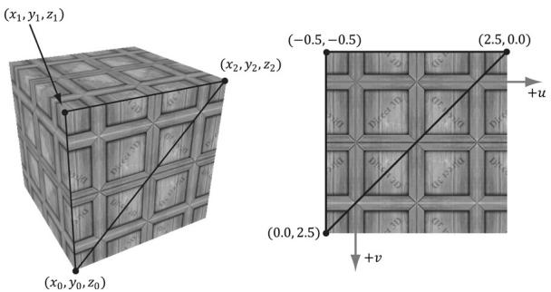


Figure 9.14. Mirror address mode


An address mode is always specified (wrap mode is the default), so therefore, texture coordinates outside the [0, 1] range are always defined. 

The wrap address mode is probably the most often employed; it allows us to tile a texture repeatedly over some surface. This effectively enables us to increase the texture resolution without supplying additional data (although the extra resolution is repetitive). With tiling, it is usually important that the texture is seamless. For example, the crate texture is not seamless, as you can see the repetition clearly. However, Figure 9.15 shows a seamless brick texture repeated $2 \times 3$ times. 

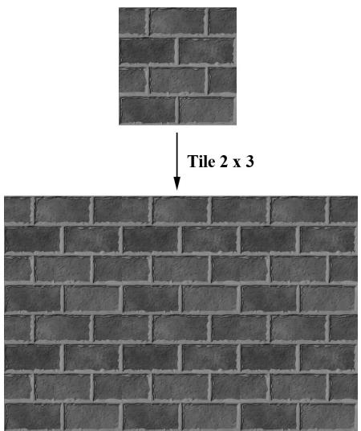


Figure 9.15. A brick texture tiled $2 \times 3$ times. Because the texture is seamless, the repetition pattern is harder to notice.


Address modes are described in Direct3D via the D3D12_TEXTURE_ADDRESS_MODE enumerated type: 

```txt
typedef enum D3D12-textURE_ADDRESS_MODE  
{  
    D3D12-textURE_ADDRESS_MODE.WRAP = 1,  
    D3D12-textURE_ADDRESS_MODE_MIRROR = 2,  
    D3D12-textURE_ADDRESS_MODE_CLAMP = 3,  
    D3D12-textURE_ADDRESS_MODE BORDER = 4,  
    D3D12-textURE_ADDRESS_MODE_MIRROR_ONCE = 5  
} D3D12-textURE_ADDRESS_MODE; 
```

# 9.7 SAMPLER OBJECTS

From the previous two sections, we see that in addition to texture data, there are two other key concepts involved with using textures: texture filtering and address modes. What filter and address mode to use when sampling a texture resource is defined by a sampler object. An application will usually need several sampler objects to sample textures in different ways. 

# 9.7.1 Creating Samplers

As we will see in the next section, samplers are used in shaders. To bind samplers to shaders for use, we need to bind descriptors to sampler objects. The following 

code shows an example root signature such that the second slot takes a table of one sampler descriptor bound to sampler register slot 0. 

enum ROOT_arg   
{ ROOTArg_textURE $= 0$ ， ROOT.Arg_SAMPLEER, ROOT.ArgCONSTANTS, ROOT.Arg_COUNT   
}；   
CD3DX12_DESCRIPTOR_RANGE descRange[3]; descRange[ROOT.Arg_textURE].Init(D3D12_DESCRIPTOR_RANGE_TYPE_SRV，1, 0); descRange[ROOT.Arg_SAMPLEER].Init(D3D12_DESCRIPTOR_RANGE_TYPE_SAMPLEER, 1,0); descRange[ROOT.ArgConstants].Init(D3D12_DESCRIPTOR_RANGE_TYPE_CBV，1, 0);   
CD3DX12_ROOT_PARAMETER rootParameters[3]; rootParameters[ROOT.Arg_textURE].InitAsDescriptorTable( 1,&descRange[ROOT.Arg_textURE],D3D12_SHADER_VISIBILITY_PIXEL); rootParameters[ROOT.Arg_SAMPLEER].InitAsDescriptorTable( 1,&descRange[ROOT.Arg_SAMPLEER],D3D12_SHADER_VISIBILITY_PIXEL); rootParameters[ROOT.ArgConstants].InitAsDescriptorTable( 1,&descRange[ROOT.ArgConstants],D3D12_SHADER_VISIBILITY_ALL);   
CD3DX12_ROOT_SIGNATURE_DESC descRootSignature; descRootSignature. Init (ROOT.Arg_COUNT, rootParameters, 0, nullptr, D3D12_ROOT_SIGNATURE_FLAGAllow_INPUT_ASSEMBLER_INPUTLayout); 

If we are going to be setting sampler descriptors, we need a sampler heap. A sampler heap is created by filling out a D3D12_DESCRIPTOR_HEAP_DESC instance and specifying the heap type D3D12_DESCRIPTOR_HEAP_TYPE_SAMPLER: 

```c
D3D12 Descriptor_HEAP_DESC descHeapSampler = {};  
descHeapSampler.NumDescriptors = 1;  
descHeapSampler.Type = D3D12 Descriptor_HEAP_TYPE Sampler;  
descHeapSampler Flags = D3D12 Descriptor_HEAP_FLAG_SHADER.Visible;  
ComPtr<ID3D12DescriptorHeap> mSamplerDescriptorHeap;  
ThrowIfFailed(mDevice->CreateDescriptorHeap(&descHeapSampler, uuidof(ID3D12DescriptorHeap), (void**) &mSamplerDescriptorHeap)); 
```

Once we have a sampler heap, we can create sampler descriptors. It is here that we specify the address mode and filter type, as well as other parameters by filling out a D3D12_SAMPLER_DESC object: 

```c
typedef struct D3D12_SAMPLEER_DESC { D3D12_FILTER Filter; D3D12TEXTURE_ADDRESS_MODE AddressU; 
```

```c
D3D12-textURE_ADDRESS_MODE AddressV;  
D3D12-textURE_ADDRESS_MODE AddressW;  
FLOAT MipLODBias;  
UINT MaxAnisotropy;  
D3D12_COMPARISONFUNC ComparisonFunc;  
FLOAT BorderColor[4];  
FLOAT MinLOD;  
FLOAT MaxLOD;  
} D3D12_SAMPLEER_DESC; 
```

1. Filter: A member of the D3D12_FILTER enumerated type to specify the kind of filtering to use. 

2. AddressU: The address mode in the horizontal $u$ -axis direction of the texture. 

3. AddressV: The address mode in the vertical $\nu$ -axis direction of the texture. 

4. AddressW: The address mode in the depth $w$ -axis direction of the texture (applicable to 3D textures only). 

5. MipLODBias: A value to bias the mipmap level picked. Specify 0.0 for no bias. 

6. MaxAnisotropy: The maximum anisotropy value which must be between 1-16 inclusively. This is only applicable for D3D12_FILTER_ANISOTROPIC or D3D12_ FILTER_COMPARISON_ANISOTROPIC. Larger values are more expensive but can give better results. 

7. ComparisonFunc: Advanced options used for some specialized applications like shadow mapping. For now, just set to D3D12_COMPARISON_FUNC_ALWAYS until the shadow mapping chapter. 

8. BorderColor: Used to specify the border color for address mode D3D12_ TEXTURE_ADDRESS_MODE_BORDER. 

9. MinLOD: Minimum mipmap level that can be selected. 

10. MaxLOD: Maximum mipmap level that can be selected. 

Below are some examples of commonly used D3D12_FILTER types: 

1. D3D12_FILTER_MIN_MAG_MIP_POINT: Point filtering over a texture map, and point filtering across mipmap levels (i.e., the nearest mipmap level is used). 

2. D3D12_FILTER_MIN_MAG_LINEAR_MIP_POINT: Bilinear filtering over a texture map, and point filtering across mipmap levels (i.e., the nearest mipmap level is used). 

3. D3D12_FILTER_MIN_MAG_MIP_LINEAR: Bilinear filtering over a texture map, and linear filtering between the two nearest lower and upper mipmap levels. This is often called trilinear filtering. 

4. D3D12_FILTER_ANISOTROPIC: Anisotropic filtering for minification, magnification, and mipmapping. 

You can figure out the other possible permutations from these examples, or you can look up the D3D12_FILTER enumerated type in the SDK documentation. 

The following example shows how to create a descriptor to a sampler in the heap that uses linear filtering, wrap address mode, and typical default values for the other parameters: 

```txt
D3D12_SAMPLER_DESC samplerDesc = {};   
samplerDesc.Filter = D3D12_FILTER_MIN_MAG_MIP_LINEAR;   
samplerDesc.AddressU = D3D12-textURE_ADDRESS_MODE_WRAP;   
samplerDesc.AddressV = D3D12-textURE_ADDRESS_MODE_WRAP;   
samplerDesc.AddressW = D3D12-textURE_ADDRESS_MODE_WRAP;   
samplerDesc.MinLOD = 0;   
samplerDesc.MaxLOD = D3D12_FLOAT32_MAX;   
samplerDesc.MipLODBias = 0.0f;   
samplerDesc.MaxAnisotropy = 1;   
samplerDesc.ComparisonFunc = D3D12_COMPARISON_FUNC_ALWAYS;   
auto hcpu = CD3DX12_CPU DescriptorHandle( samplerDescriptorHeap->GetCPUDescriptorHandleForHeapStart());   
hcpu OFFSET(index, mDescriptorSize);   
md3dDevice->CreateSampler(&samplerDesc, hcpu); 
```

The following code shows how to bind a sampler descriptor to a root signature parameter slot for use by the shader programs: 

```txt
auto hcpu = CD3DX12_CPU DescriptorHANDLE(
    samplerDescriptorHeap->GetCPUDescriptorHandleForHeapStart());
hcpuOFFSET(index, mDescriptorSize);
commandList->SetGraphicsRootDescriptorTable(ROOT.Arg_SAMPLEER,
hcpu); 
```

As with the CBV/SRV/UAV heap, in Common/DescriptorUtil.h/.cpp, we define a utility class that wraps the sampler heap. Typically, applications only use a handful of different sampler types. Therefore, it is common to just maintain a list of all the samplers an application might use. Therefore, in the SamplerHeap::Init function, we also populate the sampler heap with all the samplers we need for this book (similar to the TextureLib or MaterialLib we made): 

// Applications usually only need a handful of samplers. So just define   
// them all up front in the sampler heap, and index them in shaders. class SamplerHeap : public DescriptorHeap   
public: SamplerHeap(const SamplerHeap& rhs) $=$ delete; SamplerHeap& operator $\equiv$ (const SamplerHeap& rhs) $=$ delete; static SamplerHeap& Get() { 

static SamplerHeap singleton; return singleton;   
} bool Is Initialized(）const; void Init(ID3D12Device\* device);   
private: SamplerHeap() $=$ default; D3D12_SAMPLER_DESC InitSamplerDesc( D3D12_FILTER filter $\equiv$ D3D12_FILTER_ANISOTROPIC, D3D12-textURE_ADDRESS_MODE addressU $\equiv$ D3D12-textURE_ADDRESS MODE_WRAP, D3D12-textURE_ADDRESS_MODE addressV $\equiv$ D3D12-textURE_ADDRESS MODE_WRAP, D3D12-textURE_ADDRESS_MODE addressW $\equiv$ D3D12-textURE_ADDRESS MODE_WRAP, FLOAT mipLODBias $= 0$ ，UINT maxAnisotropy $= 16$ ， D3D12_COMPARISONFUNC comparisonFunc $\equiv$ D3D12_COMPARISON FUNC NONE, const DirectX::XMFLOAT4& borderColor $\equiv$ DirectX::XMFLOAT4(0.0f, 0.0f，0.0f，0.0f), FLOAT minLOD $= 0$ .f, FLOAT maxLOD $=$ D3D12_FLOAT32_MAX);   
private: bool mIs Initialized $=$ false;   
}；   
bool SamplerHeap::Is Initialized(）const { return mIs Initialized;   
}   
D3D12_SAMPLER_DESC SamplerHeap::InitSamplerDesc( D3D12_FILTER filter, D3D12_textURE_ADDRESS_MODE addressU, D3D12_textURE_ADDRESS_MODE addressV, D3D12_textURE_ADDRESS_MODE addressW, FLOAT mipLODBias, UINT maxAnisotropy, D3D12_COMPARISONFUNC comparisonFunc, const XMFLOAT4& borderColor, FLOAT minLOD, FLOAT maxLOD) { D3D12_SAMPLER_DESC desc; desc.Filter $\equiv$ filter; desc.AddressU $\equiv$ addressU; desc.AddressV $\equiv$ addressV; desc.AddressW $\equiv$ addressW; 

desc.MipLODBias $=$ mipLODBias; desc.MaxAnisotropy $\equiv$ maxAnisotropy; desc.ComparisonFunc $\equiv$ comparisonFunc; desc.BorderColor[0] $\equiv$ borderColor.x; desc.BorderColor[1] $\equiv$ borderColor.y; desc.BorderColor[2] $\equiv$ borderColor.z; desc.BorderColor[3] $\equiv$ borderColor.w; desc.MinLOD $\equiv$ minLOD; desc.MaxLOD $\equiv$ maxLOD; return desc;   
}   
void SamplerHeap::Init(ID3D12Device\* device) { if(mIs Initialized) return; // bump as needed const uint32_t capacity $= 16$ .. DescriptorHeap::Init(device, D3D12_DESCRIPTOR_HEAP_TYPESampler, capacity); const D3D12_SAMPLER_DESC pointWrap $\equiv$ InitSamplerDesc( D3D12_FILTER_MIN_MAG_MIP_POINT, // filter D3D12-textURE_ADDRESS_MODE Wrap, // addressU D3D12-textURE_ADDRESS_MODE Wrap, // addressV D3D12-textURE_ADDRESS_MODE Wrap); // addressW const D3D12_SAMPLER_DESC pointClamp $\equiv$ InitSamplerDesc( D3D12_FILTER_MIN_MAG_MIP_POINT, // filter D3D12-textURE_ADDRESS_MODE_CLAMP, // addressU D3D12-textURE_ADDRESS_MODE_CLAMP, // addressV D3D12-textURE_ADDRESS_MODE_CLAMP); // addressW const D3D12_SAMPLER_DESC linearWrap $\equiv$ InitSamplerDesc( D3D12_FILTER_MIN_MAG_MIP_LINEAR, // filter D3D12-textURE_ADDRESS_MODE_CLAMP, // addressU D3D12-textURE_ADDRESS_MODE_CLAMP, // addressV D3D12-textURE_ADDRESS_MODE_CLAMP); // addressW const D3D12_SAMPLER_DESC linearClamp $\equiv$ InitSamplerDesc( D3D12_FILTER_MIN_MAG_MIP_LINEAR, // filter D3D12-textURE_ADDRESS_MODE_CLAMP, // addressU D3D12-textURE_ADDRESS_MODE_CLAMP, // addressV D3D12-textURE_ADDRESS_MODE_CLAMP); // addressW   
const D3D12_SAMPLER_DESC anisotropicWrap $\equiv$ InitSamplerDesc( D3D12_FILTER_ANISOTROPIC, // filter D3D12-textURE_ADDRESS_MODE Wrap, // addressU D3D12-textURE_ADDRESS_MODE Wrap, // addressV D3D12-textURE_ADDRESS_MODE Wrap, // addressW 0.0f, // mipLODBias 8); // maxAnisotropy 

const D3D12Sampler_DESC anisotropicClamp $=$ InitSamplerDesc( D3D12_FILTER_ANISOTROPIC, // filter D3D12-textURE_ADDRESS_MODE_CLAMP, // addressU D3D12-textURE_ADDRESS_MODE_CLAMP, // addressV D3D12-textURE_ADDRESS_MODE_CLAMP, // addressW 0.0f, // mipLODBias 8); // maxAnisotropy   
const D3D12Sampler_DESC shadow $=$ InitSamplerDesc( D3D12_FILTER_COMPARISON_MIN_MAG_LINEAR_MIP_POINT, // filter D3D12-textURE_ADDRESS_MODE Borders, // addressU D3D12-textURE_ADDRESS_MODE Borders, // addressV D3D12-textURE_ADDRESS_MODE Borders, // addressW 0.0f, // mipLODBias 16, // maxAnisotropy D3D12_COMPARISON_FUNC LESS_EQUAL, XMFLOAT4(0.0f, 0.0f, 0.0f, 0.0f));   
D3D12Sampler_DESC samplers[] = { pointWrap, pointClamp, linearWrap, linearClamp, anisotropicWrap, anisotropicClamp, shadow, };   
for(int i $= 0$ ;i $<$ _countof(samplers); ++i) { CD3DX12_CPU DescriptorHandle h $=$ CpuHandle(i); device->CreateSampler(&samplers[i],h); } 

Recall $\ S 9 . 4 . 4$ where we discussed bindless texturing. Shader model 6.6 also supports indexing a sampler heap directly in shader code. This allows us to skip the call to SetGraphicsRootDescriptorTable for binding a sampler descriptor in the $\mathrm { C } { + } { + }$ code. We can index the sampler heap in HLSL using the SamplerDescriptorHeap object. Indexing a sampler heap in the shader requires the root signature be created with the D3D12_ROOT_SIGNATURE_ FLAG_SAMPLER_HEAP_DIRECTLY_INDEXED flag. Being careful to match the order samplers were created in SamplerHeap::Init, we define the following convenience functions in Shaders/Common.hlsl so that we do not have to remember the heap index. 

```c
// Fixed indices in sampler heap.  
#define SAM_POINT_WRAP 0  
#define SAM_POINT_CLAMP 1  
#define SAM_LINEAR_WRAP 2  
#define SAM_LINEAR_CLAMP 3 
```

```m4
define SAM_ANISO_WRAP 4
#define SAM_ANISO_CLAMP 5
#define SAM_SHADOW 6
SamplerState GetPointWrapSampler()
{
    return SamplerDescriptorHeap[SAM_POINT_WRAP];
}
SamplerState GetPointClampSampler()
{
    return SamplerDescriptorHeap[SAM_POINT_CLAMP];
}
SamplerState GetLinearWrapSampler()
{
    return SamplerDescriptorHeap[SAM_LINEAR_WRAP];
}
SamplerState GetLinearClampSampler()
{
    return SamplerDescriptorHeap[SAM_LINEAR_CLAMP];
}
SamplerState GetAnisoWrapSampler()
{
    return SamplerDescriptorHeap[SAM_ANISO_WRAP];
}
SamplerState GetAnisoClampSampler()
{
    return SamplerDescriptorHeap[SAM_ANISO_CLAMP];
}
SamplerComparisonState GetShadowSampler()
{
    return SamplerDescriptorHeap[SAM_SHADOW];
} 
```

Observe that in HLSL, a sampler object has type SamplerState. A special kind of sampler used for shadow mapping (Chapter 20) has type SamplerComparisonState. 

Recall that we set our GPU visible descriptor heaps with the SetDescriptorHeaps API: 

```cpp
CbvSrvUavHeap& cbvSrvUavHeap = CbvSrvUavHeap::Get();   
SamplerHeap& samHeap = SamplerHeap::Get();   
ID3D12DescriptorHeap* descriptorHeaps[] = { cbvSrvUavHeap.GetD3dHeap(), samHeap.GetD3dHeap() };   
mCommandList->SetDescriptorHeaps( countof(descriptorHeaps), descriptorHeaps); 
```

# 9.7.2 Static Samplers

Although we use bindless samplers in this book demos, we discuss static samplers in this section which we used in the previous edition prior to shader model 6.6. 

As mentioned, it turns out that a graphics application usually only uses a handful of samplers. Therefore, Direct3D provides a special shortcut to define an array of samplers and set them without going through the process of creating a sampler heap. The Init function of the CD3DX12_ROOT_SIGNATURE_DESC class has two parameters that allow you to define an array of so-called static samplers your application can use. Static samplers are described by the D3D12_STATIC_SAMPLER_ DESC structure. This structure is very similar to D3D12_SAMPLER_DESC, with the following exceptions: 

1. There are some limitations on what the border color can be. Specifically, the border color of a static sampler must be a member of: 

```c
enum D3D12_STATIC BORDER_COLOR  
{  
    D3D12_STATIC BORDER_COLOR_TRANSPARENTBLACK = 0,  
    D3D12_STATIC BORDER_COLOR_OPAQUEBLACK = (D3D12_STATIC BORDER_COLOR_TRANSPARENTBLACK + 1),  
    D3D12_STATIC BORDER_COLOR_OPAQUE_WHITE = (D3D12_STATIC BORDER_COLOR_OPAQUEBLACK + 1)  
}D3D12_STATIC BORDER_COLOR; 
```

2. It contains additional fields to specify the shader register, register space, and shader visibility, which would normally be specified as part of the sampler heap. 

In addition, you can only define 2032 static samplers, which is more than enough for most applications. If you do need more, however, you can just use non-static samplers and go through a sampler heap. 

The following code shows how to define static samplers. Note that we do not need all these static samplers in our demos, but we define them anyway so that they are there if we do need them. It is only a handful anyway, and it does not hurt to define a few extra samplers that may or may not be used. 

```cpp
std::array<const CD3DX12_STATICSampler DESC, 6>TexColumnsApp::GetStaticSamplers()   
{ //Applications usually only need a handful of samplers. So just define them   
//all up front and keep them available as part of the root signature.   
const CD3DX12_STATICSampler_DESC pointWrap( 0，//shaderRegister D3D12_FILTER_MIN_MAG_MIP_POINT，//filter 
```

```cpp
D3D12-textURE_ADDRESS_MODE Wrap, // addressU D3D12-textURE_ADDRESS_MODE Wrap, // addressV D3D12-textURE_ADDRESS_MODE Wrap); // addressW   
const CD3DX12_STATICSampler_DESC pointClamp( 1, // shaderRegister D3D12_FILTER_MIN_MAG_MIP_POINT, // filter D3D12-textURE_ADDRESS_MODE_CLAMP, // addressU D3D12-textURE_ADDRESS_MODE_CLAMP, // addressV D3D12-textURE_ADDRESS_MODE_CLAMP); // addressW   
const CD3DX12_STATICSampler_DESC linearWrap( 2, // shaderRegister D3D12_FILTER_MIN_MAG_MIP_LINEAR, // filter D3D12-textURE_ADDRESS_MODE_CLAMP, // addressU D3D12-textURE_ADDRESS_MODE_CLAMP, // addressV D3D12-textURE_ADDRESS_MODE_CLAMP); // addressW   
const CD3DX12_STATICSampler_DESC linearClamp( 3, // shaderRegister D3D12_FILTER_MIN_MAG_MIP_LINEAR, // filter D3D12-textURE_ADDRESS_MODE_CLAMP, // addressU D3D12-textURE_ADDRESS_MODE_CLAMP, // addressV D3D12-textURE_ADDRESS_MODE_CLAMP); // addressW   
const CD3DX12_STATICSampler_DESC anisotropicWrap( 4, // shaderRegister D3D12_FILTER_ANISOTROPIC, // filter D3D12-textURE_ADDRESS_MODE Wrap, // addressU D3D12-textURE_ADDRESS_MODE Wrap, // addressV D3D12-textURE_ADDRESS_MODE Wrap, // addressW 0.0f, // mipLODBias 8); // maxAnisotropy   
const CD3DX12_STATICSampler_DESC anisotropicClamp( 5, // shaderRegister D3D12_FILTER_ANISOTROPIC, // filter D3D12-textURE_ADDRESS_MODE_CLAMP, // addressU D3D12-textURE_ADDRESS_MODE_CLAMP, // addressV D3D12-textURE_ADDRESS_MODE_CLAMP, // addressW 0.0f, // mipLODBias 8); // maxAnisotropy   
return { pointWrap, pointClamp, linearWrap, linearClamp, anisotropicWrap, anisotropicClamp };   
}   
void TexColumnsApp::BuildRootSignature() { CD3DX12~-DESCRiSOR_RANGE texTable; texTable Init(D3D12~-DESCRiSOR_RANGE_TYPE_SRV, 1, 0); // Root parameter can be a table, root descriptor or root constants. CD3DX12~-ROOT_PARAMETER slotRootParameter[4]; 
```

```cpp
slotRootParameter[0].InitAsDescriptorTable(1, &texTable, D3D12_SHADER_VISIBILITY_PIXEL); slotRootParameter[1].InitAsConstantBufferView(0); slotRootParameter[2].InitAsConstantBufferView(1); slotRootParameter[3].InitAsConstantBufferView(2); auto staticSamplers = GetStaticSamplers(); // A root signature is an array of root parameters. CD3DX12_ROOT_SIGNATURE_DESC rootSigDesc(4, slotRootParameter, (UINT)staticSamplers.size(), staticSamplers.data(), D3D12_ROOT_SIGNATURE_FLAG_OPEN_INPUT_ASSEMBLER_INPUT_LAYOUT); // create a root signature with a single slot which points to a // descriptor range consisting of a single constant buffer ComPtr<ID3DBlob> serializedRootSig = nullptr; ComPtr<ID3DBlob> errorBlob = nullptr; HRESULT hr = D3D12SerializableRootSignature(&rootSigDesc, D3D_ROOT_SIGNATURE_VERSION_1, serializedRootSig.GetAddressOf(), errorBlob.GetAddressOf()); if(errorBlob != nullptr) { ::OutputDebugStringA((char*)errorBlob->GetBufferPointer()); } ThrowIfFailed(hr); ThrowIfFailed.md3dDevice->CreateRootSignature( 0, serializedRootSig->GetBufferPointer(), serializedRootSig->GetBufferSize(), IID_PPV.ArgS(mRootSignature.GetAddressOf())); 
```

# 9.8 SAMPLING TEXTURES IN A SHADER

A texture object is defined in HLSL and assigned to a texture register with the following syntax: 

```txt
// Not using bindless Texture2D gDiffuseMap : register(t0); // Using bindless Texture2D diffuseMap = ResourceDescriptorHeap[diffuseMapIndex]; 
```

Note that texture/SRV registers are specified by tn where n is an integer identifying the texture/SRV register slot. The root signature definition specifies the mapping from the root parameter to the shader register; this is how the application code can bind an SRV to a particular Texture2D object in a shader. If we are using bindless, then no register needs to be specified. 

Similarly, sampler objects are defined HLSL and assigned to a sampler register with the following syntax: 

```txt
// Not using bindless   
SamplerState gsamPointWrap : register(s0);   
SamplerState gsamPointClamp : register(s1);   
SamplerState gsamLinearWrap : register(s2);   
SamplerState gsamLinearClamp : register(s3);   
SamplerState gsamAnisotropicWrap : register(s4);   
SamplerState gsamAnisotropicClamp : register(s5);   
// Using bindless   
SamplerState samPointWrap = SamplerDescriptorHeap[SAM_POINT_CLAMP];   
SamplerState samPointClamp = SamplerDescriptorHeap[SAM_POINT_CLAMP];   
SamplerState samLinearWrap = SamplerDescriptorHeap[SAM_LINEAR_CLAMP];   
SamplerState samLinearClamp = SamplerDescriptorHeap[SAM_LINEAR_CLAMP];   
SamplerState samAnisotropicWrap = SamplerDescriptorHeap[SAM_ANISO_CLAMP];   
SamplerState samAnisotropicClamp = SamplerDescriptorHeap[SAM_ANISO_CLAMP]; 
```

Texture registers are specified by sn where $n$ is an integer identifying the sampler register slot. If we are using bindless, then no register needs to be specified. 

Now, given a pair of texture coordinate $( u , \nu )$ for a pixel in the pixel shader, we actually sample a texture (that is, obtain its value at the specified coordinates) using the Texture2D::Sample method: 

```lisp
struct VertexOut
{
    float4 PosH : SV POSITION;
    float3 PosW : POSITION;
    float3 NormalW : NORMAL;
    float2 TexC : TEXCOORD;
};
float4 PS(VertexOut pin) : SV_Target
{
    MaterialData.matData = gMaterialData[gMaterialIndex];
    float4 diffuseAlbedo =.matData.DiffuseAlbedo;
    float3 fresnelR0 =.matData.FresnelR0;
    float roughness =.matData.Roughness;
    uint diffuseMapIndex =.matData.DiffuseMapIndex;
    //Dynamically look up the texture in the heap.
    Texture2D diffuseMap = ResourceDescriptorHeap[diffuseMapIndex];
    diffuseAlbedo *= diffuseMap_SAMPLE(GetAnisoWrapSampler(), pin, TexC);
} 
```

We pass a SamplerState object for the first parameter indicating how the texture data will be sampled, and we pass in the pixel’s $( u , \nu )$ texture coordinates for the second parameter. This method returns the interpolated color from the texture map at the specified $( u , \nu )$ point using the filtering methods specified by the SamplerState object. 

# 9.9 CRATE DEMO

We now review the key points of adding a crate texture to a cube (as shown in Figure 9.1) that we have not already discussed. 

# 9.9.1 Specifying Texture Coordinates

The MeshGen::CreateBox generates the texture coordinates for the box so that the entire texture image is mapped onto each face of the box. For brevity, we only show the vertex definitions for the front, back, and top face. Note also that we omit the coordinates for the normal and tangent vectors in the Vertex constructor (the texture coordinates are bolded). 

```cpp
MeshGenData MeshGen::CreateBox(
    float width, float height, float depth,
    uint32 numSubdivisions)
{
    MeshData meshData;
    Vertex v[24];
    float w2 = 0.5f*width;
    float h2 = 0.5f*height;
    float d2 = 0.5f*depth;
    // Fill in the front face vertex data.
    v[0] = MeshGenVertex(-w2, -h2, -d2, ..., 0.0f, 1.0f);
    v[1] = MeshGenVertex(-w2, +h2, -d2, ..., 0.0f, 0.0f);
    v[2] = MeshGenVertex(+w2, +h2, -d2, ..., 1.0f, 0.0f);
    v[3] = MeshGenVertex(+w2, -h2, -d2, ..., 1.0f, 1.0f);
    // Fill in the back face vertex data.
    v[4] = MeshGenVertex(-w2, -h2, +d2, ..., 1.0f, 1.0f);
    v[5] = MeshGenVertex(+w2, -h2, +d2, ..., 0.0f, 1.0f);
    v[6] = MeshGenVertex(+w2, +h2, +d2, ..., 0.0f, 0.0f);
    v[7] = MeshGenVertex(-w2, +h2, +d2, ..., 1.0f, 0.0f);
    // Fill in the top face vertex data.
    v[8] = MeshGenVertex(-w2, +h2, -d2, ..., 0.0f, 1.0f);
    v[9] = MeshGenVertex(-w2, +h2, +d2, ..., 0.0f, 0.0f);
    v[10] = MeshGenVertex(+w2, +h2, +d2, ..., 1.0f, 0.0f);
    v[11] = MeshGenVertex(+w2, +h2, -d2, ..., 1.0f, 1.0f); 
```

Refer back to Figure 9.3 if you need help seeing why the texture coordinates are specified this way. 

# 9.9.2 Updated HLSL

Below is the BasicTex.hlsl file that now supports texturing (texturing code has been bolded): 

```lisp
// Include common HLSL code. #include "Shaders/Common.hls1"   
struct VertexIn { float3 PosL : POSITION; float3 NormalL : NORMAL; float2 TexC : TEXCOORD; } ;   
struct VertexOut { float4 PosH : SV POSITION; float3 PosW : POSITION0; float3 NormalW : NORMAL; float2 TexC : TEXCOORD; } ;   
VertexOut VS(VertexIn vin) { VertexOut vout = (VertexOut)0.0f; MaterialData matData = gMaterialData[gMaterialIndex]; // Transform to world space. float4 posW = mul(float4(vin(PosL, 1.0f), gWorld); voutPosW = posW.xyz; // Assumes nonuniform scaling; otherwise, need to use // inverse-transpose of world matrix. vout.NormalW = mul(vin.NormalL, (float3x3)gWorld); // Transform to homogeneous clip space. vout_PosH = mul(posW, gViewProj); // Output vertex attributes for interpolation across triangle. float4 texC = mul(float4(vin.TexC, 0.0f, 1.0f), gTexTransform); vout.TexC = mul(texC,.matData.MatTransform).xy; return vout; }   
float4 PS(VertexOut pin) : SV_Target { MaterialData matData = gMaterialData[gMaterialIndex]; 
```

float4 diffuseAlbedo = Data.Data.DiffuseAlbedo; float3 fresnelR0 = Data.Data.FresnelR0; float roughness = Data.Data.Roughness; uint diffuseMapIndex = Data.Data.DiffuseMapIndex; //Dynamically look up the texture in the heap. Texture2D diffuseMap = DescriptorHeap[diffuseMapIndex]; diffuseAlbedo $\equiv$ diffuseMap_SAMPLE(GetAnisoWrapSampler(), pin. TexC); // Interpolating normal can unnormalize it, so renormalize it. float3 normalW = normalize(pin.NormalW); // Vector from point being lit to eye. float3 toEyeW = normalize(gEyePosW - pin(PosW); // Light terms. float4 ambient $=$ gAmbientLight\*diffuseAlbedo; const float shininess $= (1.0f -$ roughness); Material mat $=$ { diffuseAlbedo, fresnelR0, shininess }; float4 directLight $=$ ComputeLighting(gLights,mat, pin(PosW, normalW,toEyeW); float4 litColor $=$ ambient + directLight; // Common convention to take alpha from diffuse albedo. litColor.a $=$ diffuseAlbedo.a; return litColor;   
} 

In this demo, we add a diffuse albedo texture map to specify the diffuse albedo component of our material. The FresnelR0 and Roughness material values will still be specified at the per draw call frequency via the material data buffer; however, in the chapter on “Normal Mapping” we will describe how to use texturing to specify roughness at a per-pixel level. Note that with texturing we will still keep the DiffuseAlbedo component in the material data buffer. In fact, we combine it with the texture diffuse albedo value in the following way in the pixel-shader: 

# float4 diffuseAlbedo $=$ matData.DiffuseAlbedo;

float3 fresnelR0 = Data.FresnelR0;   
float roughness $=$ Data.Roughness;   
uint diffuseMapIndex $=$ Data.DiffuseMapIndex;   
//Dynamically look up the texture in the heap. Texture2D diffuseMap $=$ DescriptorHeap[diffuseMapIndex]; 

diffuseAlbedo $\star =$ diffuseMap.Sample(GetAnisoWrapSampler(), pin. TexC); 

When using texturing, usually we will set DiffuseAlbed $\scriptstyle \gamma = ( 1 , 1 , 1 , 1 , 1 )$ ) so that it does not modify the value from the texture. However, sometimes it is useful to slightly tweak the diffuse albedo without having to author a new texture. For example, suppose we had a brick texture and an artist wanted to slightly tint it blue. This could be accomplished by reducing the red and green components by setting DiffuseAlbedo $=$ (0.9,0.9,1,1). 

# 9.10 TRANSFORMING TEXTURES

Two variables we have not discussed are gTexTransform (part of PerObjectCB) and MatTransform (part of MaterialData). These variables are used in the vertex shader to transform the input texture coordinates: 

// Output vertex attributes for interpolation across triangle. float4 texC $=$ mul(float4(vin.TexC, 0.0f, 1.0f), gTexTransform); vout.TexC $=$ mul(texC, matData.MatTransform).xy; 

Texture coordinates represent 2D points in the texture plane. Thus, we can translate, rotate, and scale them like we could for any other point. Here are some example uses for transforming textures: 

1. A brick texture is stretched along a wall. The wall vertices currently have texture coordinates in the range [0, 1]. We scale the texture coordinates by 4 to scale them to the range [0, 4], so that the texture will be repeated four-by-four times across the wall. 

2. We have cloud textures stretching over a clear blue sky. By translating the texture coordinates as a function of time, the clouds are animated over the sky. 

3. Texture rotation is sometimes useful for particle like effects, where we rotate a fireball texture over time, for example. 

In the “Crate” demo, we use an identity matrix transformation so that the input texture coordinates are left unmodified, but in the next section we explain a demo that does use texture transforms. 

Note that to transform the 2D texture coordinates by a $4 \times 4$ matrix, we augment it to a 4D vector: 

vin.TexC ---> float4(vin.Tex, 0.0f, 1.0f) 

After the multiplication is done, the resulting 4D vector is cast back to a 2D vector by throwing away the $z \cdot$ - and $w$ -components. That is, 

vout.TexC $=$ mul(float4(vin.TexC, 0.0f, 1.0f), gTexTransform).xy; 

We use two separate texture transformation matrices gTexTransform and matData.MatTransform because sometimes it makes more sense for the material to transform the textures (for animated materials like water), but sometimes it makes more sense for the texture transform to be a property of the object. In this way, we can get some per object variation without changing the material. 

Because we are working with 2D texture coordinates, we only care about transformations done to the first two coordinates. For instance, if the texture matrix translated the $z$ -coordinate, it would have no effect on the resulting texture coordinates. 

# 9.11 TEXTURED HILLS AND WAVES DEMO

In this demo, we add textures to our land and water scene. The first key issue is that we tile a grass texture over the land. Because the land mesh is a large surface, if we simply stretched a texture over it, then too few texels would cover each triangle. In other words, there is not enough texture resolution for the surface; we would thus get magnification artifacts. Therefore, we repeat the grass texture over the land mesh to get more resolution. The second key issue is that we scroll the water texture over the water geometry as a function of time. This added motion makes the water a bit more convincing. Figure 9.16 shows a screenshot of the demo. 

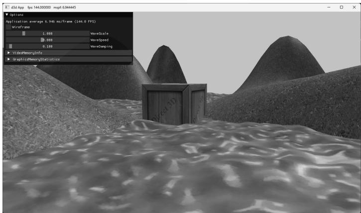


Figure 9.16. Screenshot of the TexWaves demo.


# 9.11.1 Grid Texture Coordinate Generation

Figure 9.17 shows an $m \times n$ grid in the $_ { x z }$ -plane and a corresponding grid in the normalized texture space domain [0, 1]2 . From the picture, the texture coordinates 

of the ijth grid vertex in the $_ { x z }$ -plane are the coordinates of the ijth grid vertex in the texture space. The texture space coordinates of the ijth vertex are: 

$$
u _ {i j} = j \cdot \Delta u
$$

$$
\nu_ {i j} = i \cdot \Delta \nu
$$

where ∆ = u 1 $\begin{array} { r } { \Delta u = \frac { 1 } { n - 1 } } \end{array}$ and $\begin{array} { r } { \Delta \nu = \frac { 1 } { m - 1 } } \end{array}$ 

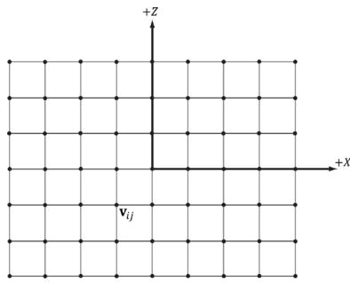


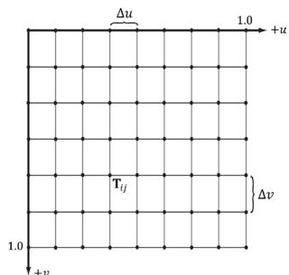


Figure 9.17. The texture coordinates of the grid vertex $\mathbf { v } _ { i j }$ in xz-space are given by the ijth grid vertex $\boldsymbol { \mathsf { T } } _ { i j }$ in uv-space.


Thus, we use the following code to generate texture coordinates for a grid in the MeshGen::CreateGrid method: 

```cpp
MeshGenData MeshGen::CreateGrid(
    float width, float depth,
    uint32_t m, uint32_t n)
{
    MeshData meshData;
    uint32 vertexCount = m*n;
    uint32 faceCount = (m-1)*(n-1)*2;
    float halfWidth = 0.5f*width;
    float halfDepth = 0.5f*depth;
    float dx = width / (n-1);
    float dz = depth / (m-1);
    float du = 1.0f / (n-1);
    float dv = 1.0f / (m-1);
    meshDataVertices resize(vertexCount);
    for (uint32 i = 0; i < m; ++i)
        {
            float z = halfDepth - i*dz;
            for (uint32 j = 0; j < n; ++j)
                {
                    printf("%d", z[i+j]); 
```

float $\mathbf{x} =$ -halfWidth $^+$ j\*dx;   
meshData.Contents[i\*n+j].Position $=$ XMFLOAT3(x,0.0f,z);   
meshData.Contents[i\*n+j].Normal $=$ XMFLOAT3(0.0f,1.0f,0.0f);   
meshData.Contents[i\*n+j].TangentU $=$ XMFLOAT3(1.0f,0.0f,0.0f);   
// Stretch texture over grid.   
meshData.Contents[i\*n+j].TexC.x $=$ j\*du;   
meshData.Contents[i\*n+j].TexC.y $=$ i\*dv;   
} 

# 9.11.2 Texture Tiling

We said we wanted to tile a grass texture over the land mesh. But so far, the texture coordinates we have computed lie in the unit domain [0, 1]2 ; so no tiling will occur. To tile the texture, we specify the wrap address mode and scale the texture coordinates by 8 using a texture transformation matrix. Thus, the texture coordinates are mapped to the domain [0, 8]2 so that the texture is tiled $8 \times 8$ times across the land mesh surface: 

```cpp
void TexWavesApp::BuildRenderItems()   
{ XMStoreFloat4x4(&texTransform, XMMatrixScaling(8.0f, 8.0f, 1.0f)); AddRenderItem(RenderLayer::Opaque, worldTransform, texTransform, matLib["grass"], mGeometries["landGeo"].get(), mGeometries["landGeo"]->DrawArgs["grid"]);   
} 
```

# 9.11.3 Texture Animation

To scroll a water texture over the water geometry, we translate the texture coordinates in the texture plane as a function of time in the AnimateMaterials method, which gets called every update cycle. Provided the displacement is small for each frame, this gives the illusion of a smooth animation. We use the wrap address mode along with a seamless texture so that we can seamlessly translate the texture coordinates around the texture space plane. The following code shows how we calculate the offset vector for the water texture, and how we build and set the water’s texture matrix: 

```cpp
void TexWavesApp::AnimateMaterials(const GameTimer& gt) { MaterialLib& matLib = MaterialLib::GetLib(); 
```

```txt
// Scroll the water material texture coordinates. auto waterMat = matLib["water"]; float& tu = waterMat->MatTransform(3, 0); float& tv = waterMat->MatTransform(3, 1); tu += 0.1f * gt.DeltaTime(); tv += 0.02f * gt.DeltaTime(); if(tu >= 1.0f) tu -= 1.0f; if(tv >= 1.0f) tv -= 1.0f; waterMat->MatTransform(3, 0) = tu; waterMat->MatTransform(3, 1) = tv; // Material has changed, so need to update cbuffer. waterMat->NumFramesDirty = gNumFrameResources; } 
```

# 9.12 SUMMARY

1. Texture coordinates are used to define a triangle on the texture that gets mapped to the 3D triangle. 

2. The most prevalent way of creating textures for games is for an artist to make them in Photoshop or some other image editor, and then save them as an image file like BMP, DDS, TGA, or PNG. Then the game application will load the image data at load time into an ID3D12Resource object. For realtime graphics applications, the DDS (DirectDraw Surface format) image file format is preferred, as it supports a variety of image formats that are natively understood by the GPU; in particular, it supports compressed image formats that can be natively decompressed by the GPU. 

3. There are two popular ways to convert traditional image formats to the DDS format: use an image editor/toolthat exports to DDS or use a Microsoft command line tool called texconv. 

4. We can create textures from DDS image files stored on disk using the CreateDDSTextureFromFileEx function, which is part of the DirectX Toolkit located in DDSTextureLoader.h/.cpp. 

5. Magnification occurs when we zoom in on a surface and are trying to cover too many screen pixels with a few texels. Minification occurs when we zoom out of a surface and too many texels are trying to cover too few screen pixels. 

Mipmaps and texture filters are techniques to handle magnification and minification. GPUs support three kinds of texture filtering natively (in order of lowest quality and least expensive to highest quality and most expensive): point, linear, and anisotropic filters. 

6. Address modes define what Direct3D is supposed to do with texture coordinates outside the [0, 1] range. For example, should the texture be tiled, mirrored, clamped, etc.? 

7. Texture coordinates can be scaled, rotated, and translated just like other points. By incrementally transforming the texture coordinates by a small amount each frame, we animate the texture. 

# 9.13 EXERCISES

1. Experiment with the “Crate” demo by changing the texture coordinates and using different address mode combinations and filtering options. In particular, reproduce the images in Figures 9.8, 9.10, 9.11, 9.12, 9.13, and 9.14. 

2. Create a DDS file with a mipmap chain like the one in Figure 9.18, with a different textual description or color on each level so that you can easily distinguish between each mipmap level. Modify the Crate demo by using this texture and have the camera zoom in and out so that you can explicitly see the mipmap levels changing. Try both point and linear mipmap filtering. 

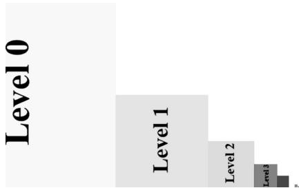


Figure 9.18. A mipmap chain manually constructed so that each level is easily distinguishable.


3. Given two textures of the same size, we can combine them via different operations to obtain a new image. More generally, this is called multitexturing, where multiple textures are used to achieve a result. For example, we can add, subtract, or (component-wise) multiply the corresponding texels of two textures. Figure 9.19 shows the result of component-wise multiplying two textures to get a fireball like result. For this exercise, modify the “Crate” demo by combining the two source textures in Figure 9.19 in a pixel shader 

to produce the fireball texture over each cube face. (The image files for this exercise may be downloaded from the book’s website.) Note that you will have to modify the BasicTex.hlsl to support more than one texture. 

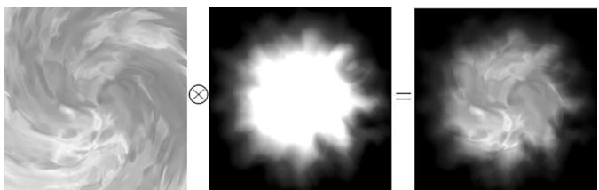


Figure 9.19. Component-wise multiplying corresponding texels of two textures to produce a new texture.


4. Modify the solution to Exercise 3 by rotating the fireball texture as a function of time over each cube face. 

5. Let $\mathbf { p } _ { 0 } , \mathbf { p } _ { 1 }$ , and ${ \bf p } _ { 2 }$ be the vertices of a 3D triangle with respective texture coordinates ${ \bf q } _ { 0 } , { \bf q } _ { 1 }$ , and $\mathbf { q } _ { 2 }$ . Recall from $\ S 9 . 2$ that for an arbitrary point on a 3D triangle $\mathbf { p } ( s , t ) = \mathbf { p } _ { 0 } + s ( \mathbf { p } _ { 1 } - \mathbf { p } _ { 0 } ) + t ( \mathbf { p } _ { 2 } - \mathbf { p } _ { 0 } )$ where s t ≥ ≥ 0 0 , , $s + t \leq 1$ , its texture coordinates $( u , \nu )$ are found by linearly interpolating the vertex texture coordinates across the 3D triangle by the same s, t parameters: 

$$
(u, v) = \mathbf {q} _ {0} + s \left(\mathbf {q} _ {1} - \mathbf {q} _ {0}\right) + t \left(\mathbf {q} _ {2} - \mathbf {q} _ {0}\right)
$$

a) Given $( u , \nu )$ and ${ \bf q } _ { 0 } , { \bf q } _ { 1 }$ , and $\mathbf { q } _ { 2 }$ , solve for $( s , t )$ in terms of $u$ and $\nu$ (Hint: Consider the vector equation $( u , \nu ) - \mathbf { q } _ { 0 } = s ( \mathbf { q } _ { 1 } - \mathbf { q } _ { 0 } ) + t ( \mathbf { q } _ { 2 } - \mathbf { q } _ { 0 } )$ . 

b) Express p as a function of $u$ and $\nu$ ; that is, find a formula $ { \mathbf { p } } =  { \mathbf { p } } ( u , \nu )$ . 

c) Compute $\hat { c } \mathbf { p } / \hat { c } u$ and ${ \hat { c } } { \mathfrak { p } } / { \hat { c } } \nu$ and give a geometric interpretation of what these vectors mean. 

6. Modify the “LitShapes” demo from the previous chapter by adding textures to the ground, columns, and spheres (Figure 9.20). The textures can be found in the Textures folder. 

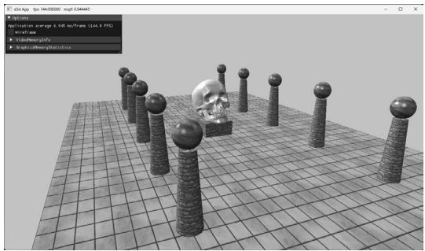


Figure 9.20. Textured column scene.
