# Chapter 00 Preface

# # Chapter_00_Preface

## Introduction to 3D Game Programming With DirectX 12, Second Edition

**Frank D. Luna**

Mercury Learning and Information 路 Boston, Massachusetts 路 漏 2025

ISBN: 978-1-68392-916-1

---

By purchasing or using this book and companion files (the 鈥淲ork鈥?, you agree that this license grants permission to use the contents contained herein, including the disc, but does not give you the right of ownership to any of the textual content in the book聽/ disc or ownership to any of the information or products contained in it. This license does not permit uploading of the Work onto the Internet or on a network (of any kind) without the written consent of the Publisher. Duplication or dissemination of any text, code, simulations, images, etc. contained herein is limited to and subject to licensing terms for the respective products, and permission must be obtained from the Publisher or the owner of the content, etc., in order to reproduce or network any portion of the textual material (in any media) that is contained in the Work. 

Mercury Learning And Information (鈥淢LI鈥?or 鈥渢he Publisher鈥? and anyone involved in the creation, writing, or production of the companion disc, accompanying algorithms, code, or computer programs (鈥渢he software鈥?, and any accompanying Web site or software of the Work, cannot and do not warrant the performance or results that might be obtained by using the contents of the Work. The author, developers, and the Publisher have used their best efforts to ensure the accuracy and functionality of the textual material and/or programs contained in this package; we, however, make no warranty of any kind, express or implied, regarding the performance of these contents or programs. The Work is sold 鈥渁s is鈥?without warranty (except for defective materials used in manufacturing the book or due to faulty workmanship). 

The author, developers, and the publisher of any accompanying content, and anyone involved in the composition, production, and manufacturing of this work will not be liable for damages of any kind arising out of the use of (or the inability to use) the algorithms, source code, computer programs, or textual material contained in this publication. This includes, but is not limited to, loss of revenue or profit, or other incidental, physical, or consequential damages arising out of the use of this Work. 

The sole remedy in the event of a claim of any kind is expressly limited to replacement of the book and/or disc, and only at the discretion of the Publisher. The use of 鈥渋mplied warranty鈥?and certain 鈥渆xclusions鈥?varies from state to state and might not apply to the purchaser of this product. 

All companion files for this title are available by visiting the website for the book at sciendo.com/book/ 9781683929161 and by clicking on the 鈥淐OMPANION FILES鈥?tab. 

# Introduction to

# 3D Game Programming

# With DirectX 12,

# Second Edition

Frank D. Luna 


Mercury Learning and Inform ation 

Boston, Massachusetts 

Copyright $\Theta 2 0 2 5$ by Mercury Learning And Information. 

An Imprint of DeGruyter Inc. All rights reserved. 

This publication, portions of it, or any accompanying software may not be reproduced in any way, stored in a retrieval system of any type, or transmitted by any means, media, electronic display, or mechanical display, including, but not limited to, photocopy, recording, Internet postings, or scanning, without prior permission in writing from the publisher. 

Mercury Learning And Information 

121 High Street, $3 ^ { \mathrm { r d } }$ Floor 

Boston, MA 02110 

info@merclearning.com 

F. Luna. Introduction to 3D Game Programming With DirectX 12, Second Edition. 

ISBN: 978-1-68392-916-1 

The publisher recognizes and respects all marks used by companies, manufacturers, and developers as a means to distinguish their products. All brand names and product names mentioned in this book are trademarks or service marks of their respective companies. Any omission or misuse (of any kind) of service marks or trademarks, etc. is not an attempt to infringe on the property of others. 

Library of Congress Control Number: 2025931803 

242526321 This book is printed on acid-free paper in the United States of America. 

Our titles are available for adoption, license, or bulk purchase by institutions, corporations, etc. 

All of our titles are available in digital format at various digital vendors. All companion files for this title are available by visiting the website for the book at sciendo.com/book/ 9781683929161 and by clicking on the 鈥淐OMPANION FILES鈥?tab. The sole obligation of Mercury Learning and Information to the purchaser is to replace the files, based on defective materials or faulty workmanship, but not based on the operation or functionality of the product. 

To my nieces and nephews, Marrick, Hans, Max, Anna, Augustus, Presley, and Elyse 

# Contents

Acknowledgments xxvii 

Introduction xxix 

Intended Audience xxx 

Prerequisites xxx 

Required Development Tools and Hardware xxxi 

Using the DirectX SDK Documentation and SDK Samples xxxi 

Clarity xxxiii 

Sample Programs and Online Supplements xxxiii 

Demo Project Setup in Visual Studio 2022 xxxiii 

Download the Book鈥檚 Source Code xxxiv 

External Libraries xxxv 

Create a Win32 Project xxxv 

Adding the Source Code xxxv 

Agility SDK xxxviii 

Project Settings xxxix 

Linking the DirectX Libraries xli 

Copy DXC DLLs to Bin xlii 

Building and Running the Code xlii 

PART I MATHEMATICAL PREREQUISITES 1 

Chapter 1 Vector Algebra 3 

1.1 Vectors 4 

1.1.1 Vectors and Coordinate Systems 5 

1.1.2 Left-Handed Versus Right-Handed Coordinate Systems 6 

1.1.3 Basic Vector Operations 7 

1.2 Length and Unit Vectors 9 

1.3 The Dot Product 10 

1.3.1 Orthogonalization 13 

1.4 The Cross Product 14 

1.4.1 Pseudo 2D Cross Product 16 

1.4.2 Orthogonalization with the Cross Product 16 

1.5 Points 17 

1.6 DirectX Math Vectors 18 

1.6.1 Vector Types 19 

1.6.2 Loading and Storage Methods 21 

1.6.3 Parameter Passing 21 

1.6.4 Constant Vectors 23 

1.6.5 Overloaded Operators 24 

1.6.6 Miscellaneous 24 

1.6.7 Setter Functions 25 

1.6.8 Vector Functions 26 

1.6.9 Floating-Point Error 30 

1.7 Summary 31 

1.8 Exercises 33 

# Chapter 2 Matrix Algebra 37

2.1 Definition 38 

2.2 Matrix Multiplication 40 

2.2.1 Definition 40 

2.2.2 Vector-Matrix Multiplication 41 

2.2.3 Associativity 42 

2.3 The Transpose of a Matrix 42 

2.4 The Identity Matrix 43 

2.5 The Determinant of a Matrix 44 

2.5.1 Matrix Minors 45 

2.5.2 Definition 45 

2.6 The Adjoint of a Matrix 47 

2.7 The Inverse of a Matrix 48 

2.8 DirectX Math Matrices 50 

2.8.1 Matrix Types 50 

2.8.2 Matrix Functions 52 

2.8.3 DirectX Math Matrix Sample Program 53 

2.9 Summary 55 

2.10 Exercises 56 

# Chapter 3 Transformations 61

3.1 Linear Transformations 62 

3.1.1 Definition 62 

3.1.2 Matrix Representation 62 

3.1.3 Scaling 63 

3.1.4 Rotation 65 

3.2 Affine Transformations 68 

3.2.1 Homogeneous Coordinates 68 

3.2.2 Definition and Matrix Representation 69 

3.2.3 Translation 69 

3.2.4 Affine Matrices for Scaling and Rotation 72 

3.2.5 Geometric Interpretation of an Affine Transformation Matrix 72 

3.3 Composition of Transformations 74 

3.4 Change of Coordinate Transformations 75 

3.4.1 Vectors 

3.4.2 Points 76 

3.4.3 Matrix Representation 77 

3.4.4 Associativity and Change of Coordinate Matrices 78 

3.4.5 Inverses and Change of Coordinate Matrices 79 

3.5 Transformation Matrix versus Change of Coordinate Matrix 80 

3.6 DirectX Math Transformation Functions 81 

3.7 Simple Math 82 

3.8 Summary 84 

3.9 Exercises 85 

# PART II DIRECT3D FOUNDATIONS 91

# Chapter 4 Direct3D Initialization 93

4.1 Preliminaries 94 

4.1.1 Direct3D 12 Overview 94 

4.1.2 COM 94 

4.1.3 Textures Formats 95 

4.1.4 The Swap Chain and Page Flipping 97 

4.1.5 Depth Buffering 98 

4.1.6 Resources and Descriptors 100 

4.1.7 Multisampling Theory 102 

4.1.8 Multisampling in Direct3D 104 

4.1.9 Feature Levels 105 

4.1.10 DirectX Graphics Infrastructure 106 

4.1.11 Checking Feature Support 110 

4.1.12 Residency 110 

4.1.13 Resources 111 

4.1.14 Common Heap Types 113 

4.2 CPU/GPU Interaction 115 

4.2.1 The Command Queue and Command Lists 115 

4.2.2 CPU/GPU Synchronization 119 

4.2.3 Resource Transitions 122 

4.2.4 Multithreading with Commands 123 

4.3 Initializing Direct3D 124 

4.3.1 Create the Device 124 

4.3.2 Create the Fence 126 

4.3.3 Create Command Queue and Command List 126 

4.3.4 Describe and Create the Swap Chain 127 

4.3.5 Create the Descriptor Heaps 130 

4.3.6 Create the Render Target View 132 

4.3.7 Create the Depth/Stencil Buffer and View 133 

4.3.8 Set the Viewport 138 

4.3.9 Set the Scissor Rectangles 139 

4.4 Timing and Animation 140 

4.4.1 The Performance Timer 140 

4.4.2 Game Timer Class 141 

4.4.3 Time Elapsed Between Frames 142 

4.4.4 Total Time 144 

4.5 The Demo Application Framework 148 

4.5.1 D3DApp 148 

4.5.2 Non-Framework Methods 151 

4.5.3 Framework Methods 152 

4.5.4 Frame Statistics 155 

4.5.5 The Message Handler 156 

4.5.6 ImGUI 158 

4.5.7 The 鈥淚nit Direct3D鈥?Demo 162 

4.6 Debugging Direct3D Applications 170 

4.7 Summary 171 

# Chapter 5 The Rendering Pipeline 175

5.1 The 3D Illusion 176 

5.2 Model Representation 179 

5.3 Basic Computer Color 180 

5.3.1 Color Operations 181 

5.3.2 128-Bit Color 182 

5.3.3 32-Bit Color 182 

5.4 Overview of the Rendering Pipeline 184 

5.5 The Input Assembler Stage 185 

5.5.1 Vertices 185 

5.5.2 Primitive Topology 186 

5.5.2.1 Point List 187 

5.5.2.2 Line Strip 187 

5.5.2.3 Line List 187 

5.5.2.4 Triangle Strip 187 

5.5.2.5 Triangle List 188 

5.5.2.6 Primitives with Adjacency 188 

5.5.2.7 Control Point Patch List 189 

5.5.3 Indices 189 

5.6 The Vertex Shader Stage 192 

5.6.1 Local Space and World Space 192 

5.6.2 View Space 196 

5.6.3 Projection and Homogeneous Clip Space 199 

5.6.3.1 Defining a Frustum 200 

5.6.3.2 Projecting Vertices 202 

5.6.3.3 Normalized Device Coordinates (NDC) 202 

5.6.3.4 Writing the Projection Equations with a Matrix 203 

5.6.3.5 Normalized Depth Value 205 

5.6.3.6 XMMatrixPerspectiveFovLH 206 

5.7 The Tessellation Stages 207 

5.8 The Geometry Shader Stage 208 

5.9 Clipping 208 

5.10 The Rasterization Stage 210 

5.10.1 Viewport Transform 210 

5.10.2 Backface Culling 211 

5.10.3 Vertex Attribute Interpolation 212 

5.11 The Pixel Shader Stage 213 

5.12 The Output Merger Stage 214 

5.13 Summary 214 

5.14 Exercises 215 

# Chapter 6 Drawing in Direct3D 219

6.1 Vertices and Input Layouts 219 

6.2 Vertex Buffers 223 

6.3 Indices and Index Buffers 228 

6.4 Example Vertex Shader 232 

6.4.1 Input Layout Description and Input Signature Linking 235 

6.5 Example Pixel Shader 238 

6.6 Constant Buffers 241 

6.6.1 Creating Constant Buffers 241 

6.6.2 Updating Constant Buffers 243 

6.6.3 Upload Buffer Helper 244 

6.6.4 Constant Buffer Descriptors 249 

6.6.5 Root Signature and Descriptor Tables 253 

6.7 Compiling Shaders 258 

6.8 Rasterizer State 262 

6.9 Pipeline State Object 263 

6.10 Geometry Helper Structure 268 

6.11 Box Demo 269 

6.12 Summary 283 

6.13 Exercises 285 

# Chapter 7 Drawing in Direct3D Part II 291

7.1 Frame Resources 292 

7.2 Linear Allocator 295 

7.3 Render Items 297 

7.4 More on Root Signatures 298 

7.4.1 Root Parameters 298 

7.4.2 Descriptor Tables 300 

7.4.3 Root Descriptors 303 

7.4.4 Root Constants 303 

7.4.5 A More Complicated Root Signature Example 305 

7.4.6 Root Parameter Versioning 306 

7.5 Shape Geometry 307 

7.5.1 Generating a Cylinder Mesh 309 

7.5.1.1 Cylinder Side Geometry 309 

7.5.1.2 Cap Geometry 312 

7.5.2 Generating a Sphere Mesh 313 

7.5.3 Generating a Geosphere Mesh 314 

7.6 Shapes Demo 318 

7.6.1 Vertex and Index Buffers 319 

7.6.2 Render Items 322 

7.6.3 Root Constant Buffer Views 323 

7.6.4 Drawing the Scene 325 

7.7 Waves Demo 327 

7.7.1 Generating the Grid Vertices 329 

7.7.2 Generating the Grid Indices 330 

7.7.3 Applying the Height Function 331 

7.7.4 Dynamic Vertex Buffers 333 

7.8 Summary 336 

7.9 Exercises 337 

# Chapter 8 Lighting 339

8.1 Light and Material Interaction 340 

8.2 Normal Vectors 342 

8.2.1 Computing Normal Vectors 343 

8.2.2 Transforming Normal Vectors 345 

8.3 Important Vectors in Lighting 347 

8.4 Lambert鈥檚 Cosine Law 347 

8.5 Diffuse Lighting 349 

8.6 Ambient Lighting 350 

8.7 Specular Lighting 351 

8.7.1 Fresnel Effect 352 

8.7.2 Roughness 354 

8.8 Lighting Model Recap 357 

8.9 Implementing Materials 358 

8.9.1 Shared Resources 359 

8.9.2 Material Data 361 

8.10 Parallel Lights 368 

8.11 Point Lights 369 

8.11.1 Attenuation 369 

8.12 Spotlights 371 

8.13 Lighting Implementation 372 

8.13.1 Light Structure 372 

8.13.2 Common Helper Functions 374 

8.13.3 Implementing Directional Lights 375 

8.13.4 Implementing Point Lights 376 

8.13.5 Implementing Spotlights 377 

8.13.6 Accumulating Multiple Lights 377 

8.13.7 The Main HLSL File 379 

8.14 Lighting Demo 380 

8.14.1 Vertex Format 381 

8.14.2 Normal Computation 382 

8.15 Summary 384 

8.16 Exercises 385 

# Chapter 9 Texturing 389

9.1 Texture and Resource Recap 390 

9.2 Texture Coordinates 392 

9.3 Texture Data Sources 395 

9.3.1 DDS Overview 395 

9.3.2 Creating DDS Files 397 

9.4 Creating and Enabling a Texture 398 

9.4.1 Loading DDS Files 398 

9.4.2 Texture and Material Lib 400 

9.4.3 Creating SRV Descriptors 404 

9.4.4 SRV Heap and Bindless Texturing 407 

9.5 Filters 409 

9.5.1 Magnification 409 

9.5.2 Minification 411 

9.5.3 Anisotropic Filtering 412 

9.6 Address Modes 413 

9.7 Sampler Objects 415 

9.7.1 Creating Samplers 415 

9.7.2 Static Samplers 423 

9.8 Sampling Textures in a Shader 425 

9.9 Crate Demo 427 

9.9.1 Specifying Texture Coordinates 427 

9.9.2 Updated HLSL 428 

9.10 Transforming Textures 430 

9.11 Textured Hills and Waves Demo 431 

9.11.1 Grid Texture Coordinate Generation 431 

9.11.2 Texture Tiling 433 

9.11.3 Texture Animation 433 

9.12 Summary 434 

9.13 Exercises 435 

# Chapter 10 Blending 437

10.1 The Blending Equation 438 

10.2 Blend Operations 439 

10.3 Blend Factors 440 

10.4 Blend State 442 

10.5 Examples 444 

10.5.1 No Color Write 445 

10.5.2 Adding/Subtracting 445 

10.5.3 Multiplying 446 

10.5.4 Transparency 446 

10.5.5 Blending and the Depth Buffer 447 

10.6 Alpha Channels 448 

10.7 Clipping Pixels 449 

10.8 Fog 451 

10.9 Summary 457 

10.10 Exercises 458 

# Chapter 11 Stenciling 459

11.1 Depth/Stencil Formats and Clearing 460 

11.2 The Stencil Test 461 

11.3 Describing the Depth/Stencil State 462 

11.3.1 Depth Settings 463 

11.3.2 Stencil Settings 463 

11.3.3 Creating and Binding a Depth/Stencil State 465 

11.4 Implementing Planar Mirrors 466 

11.4.1 Mirror Overview 466 

11.4.2 Defining the Mirror Depth/Stencil States 469 

11.4.3 Drawing the Scene 470 

11.4.4 Winding Order and Reflections 472 

11.5 Implementing Planar Shadows 472 

11.5.1 Parallel Light Shadows 473 

11.5.2 Point Light Shadows 475 

11.5.3 General Shadow Matrix 476 

11.5.4 Using the Stencil Buffer to Prevent Double Blending 476 

11.5.5 Shadow Code 477 

11.6 Summary 479 

11.7 Exercises 

# Chapter 12 The Geometry Shader 485

12.1 Programming Geometry Shaders 486 

12.2 Tree Billboards Demo 491 

12.2.1 Overview 491 

12.2.2 Vertex Structure 494 

12.2.3 The HLSL File 495 

12.2.4 SV_PrimitiveID 498 

12.3 Texture Arrays 499 

12.3.1 Overview 499 

12.3.2 Sampling a Texture Array 500 

12.3.3 Loading Texture Arrays 501 

12.3.4 Texture Subresources 502 

12.4 Summary 503 

12.5 Exercises 504 

# Chapter 13 The Compute Shader 507

13.1 Threads and Thread Groups 510 

13.2 A Simple Compute Shader 511 

13.2.1 Compute PSO 512 

13.3 Data Input and Output Resources 513 

13.3.1 Texture Inputs 513 

13.3.2 Texture Outputs and Unordered Access Views (UAVs) 513 

13.3.3 Indexing and Sampling Textures 516 

13.3.4 Structured Buffer Resources 519 

13.3.5 Copying CS Results to System Memory 522 

13.4 Thread Identification System Values 526 

13.5 Append and Consume Buffers 528 

13.6 Shared Memory and Synchronization 529 

13.7 Blur Demo 531 

13.7.1 Blurring Theory 531 

13.7.2 Render-to-Texture 534 

13.7.3 Blur Implementation Overview 537 

13.7.4 Compute Shader Program 542 

13.8 Summary 546 

13.9 Exercises 548 

# Chapter 14 The Tessellation Stages 553

14.1 Tessellation Primitive Types 554 

14.1.1 Tessellation and the Vertex Shader 555 

14.2 The Hull Shader 556 

14.2.1 Constant Hull Shader 556 

14.2.2 Control Point Hull Shader 558 

14.3 The Tessellation Stage 560 

14.3.1 Quad Patch Tessellation Examples 560 

14.3.2 Triangle Patch Tessellation Examples 561 

14.4 The Domain Shader 561 

14.5 Tessellating a Quad 562 

14.6 Cubic B茅zier Quad Patches 567 

14.6.1 B茅zier Curves 567 

14.6.2 Cubic B茅zier Surfaces 570 

14.6.3 Cubic B茅zier Surface Evaluation Code 571 

14.6.4 Defining the Patch Geometry 573 

14.7 Summary 575 

14.8 Exercises 577 

# PART III TOPICS 579

# Chapter 15 Building a First Person Camera 581

15.1 View Transform Review 581 

15.2 The Camera Class 583 

15.3 Selected Method Implementations 585 

15.3.1 XMVECTOR Return Variations 585 

15.3.2 SetLens 585 

15.3.3 Derived Frustum Info 586 

15.3.4 Transforming the Camera 586 

15.3.5 Building the View Matrix 588 

15.4 Demo Comments 589 

15.5 PSO Lib 590 

15.6 Summary 591 

15.7 Exercises 591 

# Chapter 16 Instancing and Frustum Culling 593

16.1 Hardware Instancing 593 

16.1.1 Drawing Instanced Data 594 

16.1.2 Instance Data 595 

16.1.3 Creating the Instanced Buffer 601 

16.2 Bounding Volumes and Frustums 602 

16.2.1 DirectX Math Collision 603 

16.2.2 Boxes 603 

16.2.2.1 Rotations and Axis-Aligned Bounding Boxes 605 

16.2.3 Spheres 607 

16.2.4 Frustums 608 

16.2.4.1 Constructing the Frustum Planes 609 

16.2.4.2 Frustum/Sphere Intersection 611 

16.2.4.3 Frustum/AABB Intersection 612 

16.3 Frustum Culling 614 

16.4 Summary 617 

16.5 Exercises 618 

# Chapter 17 Picking 621

17.1 Screen to Projection Window聽Transform 623 

17.2 World/Local Space Picking Ray 626 

17.3 Ray/Mesh Intersection 628 

17.3.1 Ray/AABB Intersection 629 

17.3.2 Ray/Sphere Intersection 630 

17.3.3 Ray/Triangle Intersection 631 

17.4 Demo Application 633 

17.4.1 New Scene Models 634 

17.5 Summary 639 

17.6 Exercises 640 

# Chapter 18 Cube Mapping 641

18.1 Cube Mapping 641 

18.2 Environment Maps 643 

18.2.1 Loading and Using Cube Maps in Direct3D 645 

18.3 Texturing a Sky 646 

18.4 Modeling Reflections 649 

18.5 Dynamic Cube Maps 652 

18.5.1 Dynamic Cube Map Helper Class 653 

18.5.2 Building the Cube Map Resource 654 

18.5.3 Extra Descriptor Heap Space 654 

18.5.4 Building the Descriptors 656 

18.5.5 Building the Depth Buffer 656 

18.5.6 Cube Map Viewport and Scissor Rectangle 657 

18.5.7 Setting up the Cube Map Camera 658 

18.5.8 Drawing into the Cube Map 660 

18.6 Dynamic Cube Maps with the Geometry Shader 663 

18.7 Dynamic Cube Maps with the Vertex Shader and Instancing 666 

18.8 Summary 667 

18.9 Exercises 668 

# Chapter 19 Normal Mapping 671

19.1 Motivation 672 

19.2 Normal Maps 673 

19.3 Texture/Tangent Space 675 

19.4 Vertex Tangent Space 677 

19.5 Transforming Between Tangent Space and Object Space 678 

19.6 Normal Mapping Shader Code 679 

19.7 Displacement Mapping 685 

19.7.1 Primitive Type 687 

19.7.2 Vertex Shader 687 

19.7.3 Hull Shader 688 

19.7.4 Domain Shader 691 

19.8 Summary 693 

19.9 Exercises 694 

# Chapter 20 Shadow Mapping 697

20.1 Rendering Scene Depth 697 

20.2 Orthographic Projections 701 

20.3 Projective Texture Coordinates 703 

20.3.1 Code Implementation 705 

20.3.2 Points Outside the Frustum 706 

20.3.3 Orthographic Projections 706 

20.4 Shadow Mapping 707 

20.4.1 Algorithm Description 707 

20.4.2 Biasing and Aliasing 709 

20.4.3 PCF Filtering 711 

20.4.4 Building the Shadow Map 716 

20.4.5 The Shadow Factor 722 

20.4.6 The Shadow Map Test 724 

20.4.7 Rendering the Shadow Map 724 

20.5 Large PCF Kernels 725 

20.5.1 The DDX and DDY Functions 726 

20.5.2 Solution to the Large PCF Kernel Problem 726 

20.5.3 An Alternative Solution to the Large PCF Kernel Problem 729 

20.6 Summary 730 

20.7 Exercises 731 

# Chapter 21 Ambient Occlusion 733

21.1 Ambient Occlusion via Ray Casting 734 

21.2 Screen Space Ambient Occlusion 738 

21.2.1 Render Normals and Depth Pass 738 

21.2.2 Ambient Occlusion Pass 740 

21.2.2.1 Reconstruct View Space Position 740 

21.2.2.2 Generate Random Samples 742 

21.2.2.3 Generate the Potential Occluding Points 743 

21.2.2.4 Perform the Occlusion Test 743 

21.2.2.5 Finishing the Calculation 744 

21.2.2.6 Implementation 744 

21.2.3 Blur Pass 748 

21.2.4 Using the Ambient Occlusion Map 752 

21.3 Summary 753 

21.4 Exercises 754 

# Chapter 22 Quaternions 755

22.1 Review of the Complex Numbers 756 

22.1.1 Definitions 756 

22.1.2 Geometric Interpretation 757 

22.1.3 Polar Representation and Rotations 758 

22.2 Quaternion Algebra 759 

22.2.1 Definition and Basic Operations 759 

22.2.2 Special Products 760 

22.2.3 Properties 761 

22.2.4 Conversions 761 

22.2.5 Conjugate and Norm 762 

22.2.6 Inverses 763 

22.2.7 Polar Representation 764 

22.3 Unit Quaternions and Rotations 765 

22.3.1 Rotation Operator 765 

22.3.2 Quaternion Rotation Operator to Matrix 767 

22.3.3 Matrix to Quaternion Rotation Operator 768 

22.3.4 Composition 770 

22.4 Quaternion Interpolation 771 

22.5 DirectX Math Quaternion Functions 776 

22.6 Rotation Demo 777 

22.7 Summary 782 

22.8 Exercises 783 

# Chapter 23 Character Animation 785

23.1 Frame Hierarchies 786 

23.1.1 Mathematical Formulation 787 

23.2 Skinned Meshes 789 

23.2.1 Definitions 789 

23.2.2 Reformulating the Bones To-Root Transform 790 

23.2.3 The Offset Transform 791 

23.2.4 Animating the Skeleton 791 

23.2.5 Calculating the Final Transform 793 

23.3 Vertex Blending 795 

23.4 Loading Animation Data from File 800 

23.4.1 Header 800 

23.4.2 Materials 801 

23.4.3 Subsets 801 

23.4.4 Vertex Data and Triangles 802 

23.4.5 Bone Offset Transforms 803 

23.4.6 Hierarchy 803 

23.4.7 Animation Data 803 

23.4.8 M3DLoader 806 

23.5 Character Animation Demo 807 

23.6 Summary 810 

23.7 Exercises 811 

# Chapter 24 Terrain Rendering 813

24.1 Heightmaps 813 

24.1.1 Creating a Heightmap 815 

24.1.2 Loading a RAW File 816 

24.1.3 Heightmap Shader Resource View 817 

24.2 Terrain Tessellation 818 

24.2.1 Grid Construction 819 

24.2.2 Terrain Vertex Shader 822 

24.2.3 Tessellation Factors 823 

24.2.4 Displacement Mapping 825 

24.2.5 Tangent and Normal Vector Estimation 826 

24.3 Frustum Culling Patches 828 

24.4 Texturing 833 

24.4.1 Material Displacement 838 

24.5 Terrain Height 839 

24.6 Summary 842 

24.7 Exercises 843 

# Chapter 25 Particle Systems 845

25.1 Particle Representation 845 

25.2 Particle Motion 847 

25.3 Randomness 848 

25.4 Blending and Particle Systems 851 

25.5 GPU Particle System 852 

25.5.1 Compute-Based 853 

25.5.2 Particle Structure 853 

25.5.3 Particle Buffers 854 

25.5.4 Emitting Particles 855 

25.5.5 Updating Particles 860 

25.5.6 Post Update: Prepare for Indirect Draw/Dispatch 861 

25.5.6.1 Command Signature 862 

25.5.6.2 Command Buffer 863 

25.5.6.3 Execute Indirect 865 

25.5.6.4 More on Indirect Draw/Dispatch 866 

25.5.7 Drawing 867 

25.5.8 Application Update and Draw 870 

25.6 Demo 873 

25.6.1 Rain 873 

25.6.2 Explosion 875 

25.7 Summary 878 

25.8 Exercises 879 

# Chapter 26 Amplification and Mesh Shaders 881

26.1 Mesh Shaders and Meshlets 882 

26.1.1 Shader Definition Details 883 

26.1.2 Common Data Structure for Triangle Meshes 885 

26.1.3 Mesh Shader and PSO 889 

26.1.4 Dispatching Mesh Shaders 891 

26.2 Mesh Shader Point Sprites 891 

26.2.1 Mesh Shader Group Counts 892 

26.2.2 Helix Particle Motion 892 

26.2.3 Shader Code 893 

26.3 Amplification Shader 896 

26.4 Terrain Amplification and Mesh Shader Demo 897 

26.4.1 Quad Patch Amplification Shader 897 

26.4.2 Quad Patch Mesh Shader 900 

26.4.3 Skirts 904 

26.4.4 Demo Options 906 

26.5 Summary 906 

26.6 Exercises 907 

# Chapter 27 Ray Tracing 909

27.1 Basic Ray Tracing Concepts 910 

27.1.1 Rays 910 

27.1.2 View Rays 911 

27.1.3 Reflection 911 

27.1.4 Refraction 913 

27.1.5 Shadows 914 

27.1.6 Ray/Object Intersection Examples 916 

27.1.6.1 Ray/Quad 917 

27.1.6.2 Ray/Cylinder 918 

27.1.6.3 Ray/Box 921 

27.1.6.4 Ray/Triangle 926 

27.2 Overview of the Ray Tracing Shaders 926 

27.2.1 Ray Generation 926 

27.2.2 Intersection 929 

27.2.3 Any-Hit 931 

27.2.4 Closest-Hit 932 

27.2.5 Miss 937 

27.2.6 Ray Tracing .lib 937 

27.3 Shader Binding Table 938 

27.4 Ray Tracing State Object 942 

27.5 Classical Ray Tracer Demo 946 

27.5.1 Scene Management 946 

27.5.2 Acceleration Structures 948 

27.5.2.1 Bottom Level Acceleration Structures 949 

27.5.2.2 Top Level Acceleration Structures 951 

27.5.2.3 Top Level Acceleration Structures 953 

27.5.6 Dispatching Rays 954 

27.6 Hybrid Ray Tracer Demo 954 

27.6.1 Hybrid Strategy 955 

27.6.2 Scene Management 955 

27.6.3 Acceleration Structures 959 

27.6.4 Ray Tracing Shaders 961 

27.6.5 Rasterization Pixel Shader 966 

27.8 Dynamic Scenes/Objects 968 

27.9 Overview of Distribution Ray Tracing 969 

27.10 Summary 973 

27.11 Exercises 975 

# Appendix A: Introduction to Windows Programming 979

A.1 Overview 980 

A.1.1 Resources 980 

A.1.2 Events, the Message Queue, Messages, and the Message Loop 980 

A.1.3 GUI 981 

A.1.4 Unicode 983 

A.2 Basic Windows Application 983 

A.3 Explaining the Basic Windows Application 987 

A.3.1 Includes, Global Variables, and Prototypes 987 

A.3.2 WinMain 988 

A.3.3 WNDCLASS and Registration 989 

A.3.4 Creating and Displaying the Window 991 

A.3.5 The Message Loop 993 

A.3.6 The Window Procedure 995 

A.3.7 The MessageBox Function 996 

A.4 A Better Message Loop 997 

A.5 Summary 998 

A.6 Exercises 998 

# Appendix B: High Level Shader Language Reference 1001

B.1 Variable Types 1001 

B.1.1 Scalar Types 1001 

B.1.2 Vector Types 1001 

B.1.2.1 Swizzles 1002 

B.1.3 Matrix Types 1003 

B.1.4 Arrays 1004 

B.1.5 Structures 1004 

B.1.6 The typedef Keyword 1005 

B.1.7 Variable Prefixes 1005 

B.1.8 Casting 1005 

B.2 Keywords and Operators 1006 

B.2.1 Keywords 1006 

B.2.2 Operators 1006 

B.3 Program Flow 1008 

B.4 Functions 1009 

B.4.1 User Defined Functions 1009 

B.4.2 Built-in Functions 1011 

B.4.3 Constant Buffer Packing 1013 

# Appendix C: Some Analytic Geometry 1017

C.1 Rays, Lines and Segments 1017 

C.2 Parallelograms 1018 

C.3 Triangles 1019 

C.4 Planes 1020 

C.4.1 DirectX Math Planes 1021 

C.4.2 Point/Plane Spatial Relation 1021 

C.4.3 Construction 1022 

C.4.4 Normalizing a Plane 1023 

C.4.5 Transforming a Plane 1023 

C.4.6 Nearest Point on a Plane to a Given Point 1023 

C.4.7 Ray/Plane Intersection 1024 

C.4.8 Reflecting Vectors 1025 

C.4.9 Reflecting Points 1025 

C.4.10 Reflection Matrix 1025 

C.5 Exercises 1027 

Appendix D: Solutions to Selected Exercises 1029 

Bibliography and Further Reading 1031 

Index 1037 

# Acknowledgments

I would like to thank Rod Lopez, Jim Leiterman, Hanley Leung, Rick Falck, Tybon Wu, Tuomas Sandroos, Eric Sandegren, Jay Tennant and William Goschnick for reviewing earlier editions of the book. Special thanks to Remar Jones for building the 3D models and textures used in some of the demo programs available on the book鈥檚 website. Thanks to Dale E. La Force, Adam Hoult, Gary Simmons, James Lambers, and William Chin for their assistance in the past. I also want to thank the DirectX team members and other experts that participate in the DirectX discord channel. Finally, I want to thank the staff at Mercury Learning and Information. 

# Introducti on

Direct3D 12 is a $\mathrm { C } { + + }$ rendering library for writing high-performance 3D graphics applications using modern graphics hardware on Windows PC and Xbox platforms. Direct3D is a low-level library in the sense that its application programming interface (API) closely models the underlying graphics hardware it controls. The predominant consumer of Direct3D is the games industry, where high-level rendering engines are built on top of Direct3D. However, other industries need high performance interactive 3D graphics as well, such as medical, architectural, and scientific visualization. In addition, with every new PC being equipped with a modern graphics card, non-3D applications are beginning to take advantage of the GPU (graphics processing unit) to offload work to the graphics card for intensive calculations; this is known as general purpose GPU computing, and Direct3D provides the compute shader API for writing general purpose GPU programs. 

This book presents an introduction to programming interactive computer graphics, with an emphasis on game development, using Direct3D 12. It teaches the fundamentals of Direct3D and shader programming, after which the reader will be prepared to go on and learn more advanced techniques. The book is divided into three main parts. Part I explains the mathematical tools that will be used throughout this book. Part II shows how to implement fundamental tasks in Direct3D, such as initialization; defining 3D geometry; setting up cameras; creating vertex, pixel, geometry, and compute shaders; lighting; texturing; blending; stenciling; and tessellation. Part III is largely about applying Direct3D 

to implement a variety of interesting techniques and special effects, such as working with animated character meshes, picking, environment mapping, normal mapping, real-time shadows, ambient occlusion, and ray tracing. 

For the beginner, this book is best read front to back. The chapters have been organized so that the difficulty increases progressively with each chapter. In this way, there are no sudden jumps in complexity leaving the reader lost. In general, for a particular chapter, we will use the techniques and concepts previously developed. Therefore, it is important that you have mastered the material of a chapter before continuing. Experienced readers can pick the chapters of interest. 

Finally, you may be wondering what kinds of games you can develop after reading this book. The answer to that question is best obtained by skimming through this book and seeing the types of applications that are developed. From that you should be able to visualize the types of games that can be developed based on the techniques taught in this book and some of your own ingenuity. 

# INTENDED AUDIENCE

This book was designed with the following three audiences in mind: 

1. Intermediate level $\mathrm { C } { + + }$ programmers who would like an introduction to 3D programming using the latest iteration of Direct3D. 

2. 3D programmers experienced with an API other than DirectX (e.g., OpenGL) who would like an introduction to Direct3D 12 

3. Experienced Direct3D programmers wishing to learn the latest version of Direct3D. 

# PREREQUISITES

It should be emphasized that this is an introduction to Direct3D 12, shader programming, and 3D game programming; it is not an introduction to general computer programming. The reader should satisfy the following prerequisites: 

1. High School mathematics: algebra, trigonometry, and (mathematical) functions, for example. 

2. Competence with Visual Studio: should know how to create projects, add files, and specify external libraries to link, for example. 

3. Intermediate $\mathrm { C } { + + }$ and data structure skills: comfortable with pointers, arrays, operator overloading, linked lists, inheritance and polymorphism. 

4. Familiarity with Windows programming with the Win32 API is helpful, but not required; we provide a Win32 primer in Appendix A. 

# REQUIRED DEVELOPMENT TOOLS AND HARDWARE

We recommend the following software and hardware for the second edition of this book: 

1. Windows 10 or later 

2. Visual Studio 2022 or later. 

3. A graphics card that supports Direct3D 12 ray tracing and mesh shaders. The demos in this book were tested on a Geforce RTX 3070 and on a Geforce RTX 2060. 

# USING THE DIRECTX SDK DOCUMENTATION AND SDK SAMPLES

Direct3D is a huge API and we cannot hope to cover all of its details in this one book. Therefore, to obtain extended information it is imperative that you learn how to use the DirectX SDK documentation. The most up to date documentation will be available on MSDN: 

https://learn.microsoft.com/en-us/windows/win32/direct3d12/directx-12- programming-guide 

Figure 1 shows a screenshot of the online documentation. 

The DirectX documentation covers just about every part of the DirectX API; therefore, it is very useful as a reference, but because the documentation doesn鈥檛 go into much depth or assumes some previous knowledge, it isn鈥檛 the best learning tool. However, it does get better and better with every new DirectX version released. 

As said, the documentation is primarily useful as a reference. Suppose you come across a DirectX related type or function, say the function ID3D12Device::C reateCommittedResource, which you would like more information on. You simply do a search in the documentation and get a description of the object type, or in this case function; see Figure 2. 

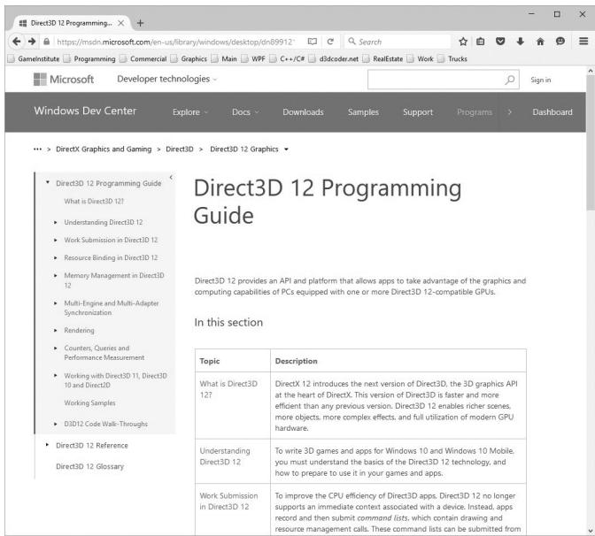


Figure 1. Direct3D Programming Guide in the DirectX documentation.

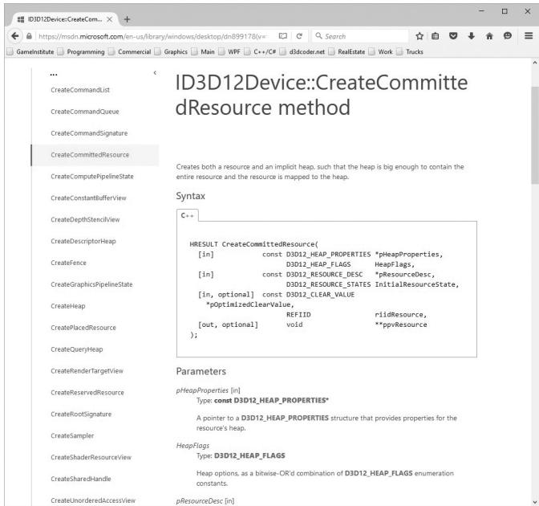


Figure 2. Getting documentation of a function.

We would also like to point out the available Direct3D 12 sample programs from Microsoft that are available online: 

https://github.com/Microsoft/DirectX-Graphics-Samples 

More samples may come in the future, and also be on the lookout for Direct3D 12 samples on NVIDIA鈥檚, AMD鈥檚, and Intel鈥檚 websites. 

# CLARITY

Although we strive to write efficient code and follow best Direct3D 12 programming practices, the main goal of each sample program is to demonstrate Direct3D concepts or graphics programming techniques. Writing the most optimal code was not the goal and would likely obfuscate the ideas trying to be illustrated. Keep this in mind if you are using any of the sample code in your own projects, as you may wish to rework it for better efficiency. Moreover, in order to focus on the Direct3D API, we have built minimal infrastructure on top of Direct3D. This means we hardcode values and define things in the source code that might normally be data driven. In a large 3D application, you will likely implement a rendering engine on top of Direct3D; however, the topic of this book is the Direct3D API, not rendering engine design. 

# SAMPLE PROGRAMS AND ONLINE SUPPLEMENTS

The website for this book (www.d3dcoder.net) plays an integral part in getting the most out of this book. On the website you will find the complete source code and project files for every samples in this book. In many cases, DirectX programs are too large to fully embed in a textbook; therefore, we only embed relevant code fragments based on the ideas being shown. It is highly recommended that the reader studies the corresponding demo code to see the program in its entirety. (We have aimed to make the demos small and focused for easy study.) As a general rule, the reader should be able to implement a chapter鈥檚 demo(s) on his or her own after reading the chapter and spending some time studying the demo code. In fact, a good exercise is trying to implement the samples on your own using the book and sample code as a reference. 

# DEMO PROJECT SETUP IN VISUAL STUDIO 2022

The demos for this book can be opened simply by double clicking the corresponding project file (.vcxproj) or solution file (.sln) This section describes how to create and build a project from scratch using the book鈥檚 demo application framework using Visual Studio 2022. You would do this if you wanted to make 

your own demo app. (An easier method is to just copy and paste an existing demo, and change the solution and project names and GUIDs, and modify the code accordingly.) As a working example, we will show how to recreate and build the 鈥淏ox鈥?demo of Chapter 6. 

# Download the Book鈥檚 Source Code

First, download the book鈥檚 source code to some folder on your hard drive. For the sake of discussion, we will assume this folder is C:\d3d12book. In the source code folder, you will see several subfolders: 

1. Demos: This folder contains the source code for each book demo. Each demo has a name as well as a prefix C# indicating which Chapter it corresponds to. For example, the Box demo is from Chapter 6, so its folder is named C6_Box. 

2. Common: This folder contains shared source code that is reused in all of the demo projects. 

3. External: Contains some open source libraries we use. We will elaborate on this in the next section. 

4. Shaders: This folder contains the shaders used by the demo apps. Several demos will use the same shader files, which is why we put them in a shared location. 

5. Textures: Image data stored on disk that some of the demos use. Several demos will use the same texture files, which is why we put them in a shared location. 

6. Models: 3D models stored on disk that some of the demos use. Several demos will use the same model files, which is why we put them in a shared location. 

7. bin: Each demo project is configured to output the generated binaries to this directory. We have a build step to copy the shader files a demo uses to this folder. However, you need to manually copy the Textures and Models folders into this directory. 

Now, in the source code folder, create a new folder where you want to store your demos. For example, C:\d3d12book\MyDemos. This folder is where you will create new projects based on the book鈥檚 sample framework. 

This directory structure is not completely necessary, but it is the structure the book demos follow. If you are comfortable with setting additional include paths, you can put your demo projects anywhere so long as you direct Visual Studio how to find the dependencies. 

# External Libraries

The book uses three external libraries. We will discuss these libraries later in this book, but for now we are just concerned with project setup. 

1. DXC: This is the DirectX Shader Compiler, and it is the library we use to compile shader programs (available at https://github.com/microsoft/ DirectXShaderCompiler/). 

2. Imgui: A GUI framework that supports various rendering APIs that can easily be integrated into our applications. For us, we are interested in the Direct3D 12 backend. This is used for displaying debug information and toggling optional features. It is available at https://github.com/ocornut/imgui. 

3. DirectXTK12 (DirectX Toolkit): This is a Microsoft open source project that provides various utility code for writing Direct3D 12 applications. We will use some of these utilities in this book. It is available at https://github.com/ microsoft/DirectXTK12. 

For convenience, we have included these open source libraries in the book鈥檚 source directory \d3d12book\External, but potentially newer versions can be obtained directly from the links above. 

# Create a Win32 Project

First launch Visual Studio 2022, then go to the main menu and select File-> New- $\cdot >$ Project. 

The New Project dialog box will appear (Figure 3). Select $\mathrm { C } { + + }$ , Windows, and Desktop projects from the dropdowns and choose the 鈥淲indows Desktop Wizard鈥?item. Now hit Next. 

A new dialog box will appear. Give the project a name and specify the location and press Create. On the new sub-dialog that appears, choose 鈥淓mpty Project鈥?and 鈥淒esktop Application, as shown in Figure 4. Then press OK. At this point, you have successfully created an empty Win32 project, but there are still some things to do before you can build a DirectX project demo. 

# Adding the Source Code

Our project is created, and we can now add our source code files to the project and build it. First, copy the 鈥淏ox鈥?demo source code (d3d12book\Demos\C6_Box) BoxApp.h/.cpp to your project鈥檚 directory. Next, create the project filter hierarchy as shown in Figure 5; a filter can be created by right clicking on the project/filter name under the Solution Explorer and selecting Add $>$ New Filter. 

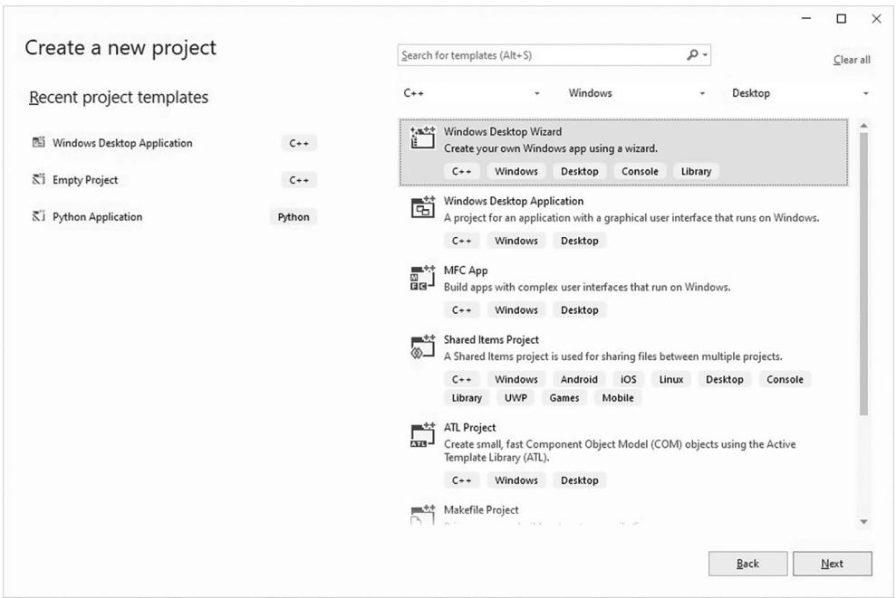


Figure 3. New Project creation.

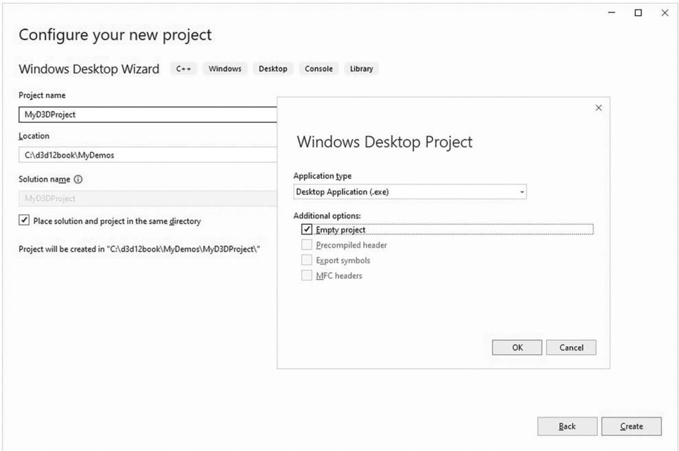


Figure 4. New Project settings.

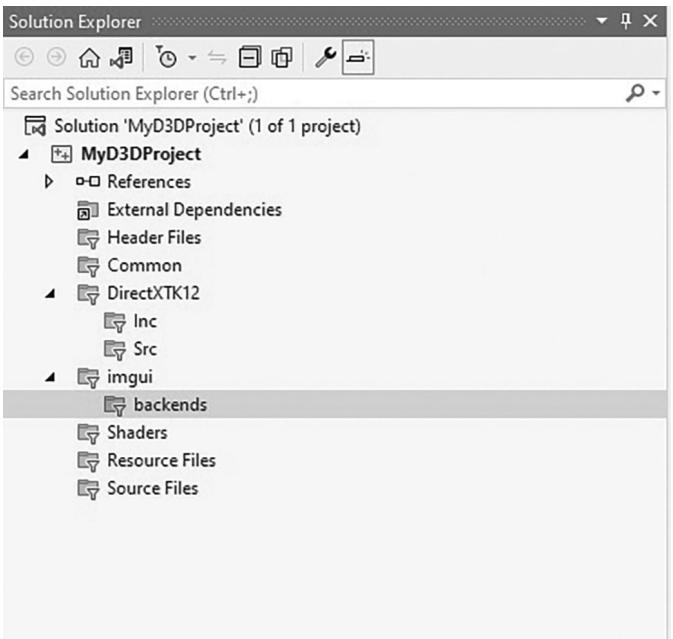


Figure 5. Solution Explorer after adding the appropriate filters.

Now, follow these steps to add the code to your project. 

1. Right click on the project name under the Solution Explorer and select Add > Existing Item鈥?from the dropdown menu and add BoxApp.h/.cpp to the project. 

2. Right click on the Shaders filter under the Solution Explorer and select Add > Existing Item鈥?from the dropdown menu, navigate to \d3d12book\Shaders and add BasicColor.hlsl to the project. 

3. Right click on the Common filter under the Solution Explorer and select Add $>$ Existing Item鈥?from the dropdown menu, navigate to \d3d12book\ Common and add all the .h/.cpp files from that directory to the project. 

4. Right click on the DirectXTK12\Inc filter under the Solution Explorer and select Add $>$ Existing Item鈥?from the dropdown menu, navigate to \ d3d12book\External\DirectXTK12\Inc and add all the .h/.cpp files from that directory to the project. Likewise, do the same thing for DirectXTK12\Src, but note that you do not need to add the subdirectory Src\Shaders. 

5. Right click on the imgui filter under the Solution Explorer and select Add > Existing Item鈥?from the dropdown menu, navigate to \d3d12book\External\ imgui and add all the .h/.cpp files from that directory to the project. Similarly, also add \d3d12book\External\imgui\backends\ imgui_impl_dx12.h/.cpp and \d3d12book\External\imgui\backends\imgui_impl_win32.h/.cpp to the imgui\backends filter. 

# Agility SDK

Typically, new DirectX versions ship with Windows updates as part of the OS. In order to get access to newer features faster, the idea of the Agility SDK was introduced. This is obtained from a Nuget package (see Figure 6). Right click on the project name under the Solution Explorer and select 鈥淢anage Nuget Packages鈥︹€?Under 鈥淏rowse鈥?search for 鈥渁gility sdk鈥?and choose Microsoft. Direct3D.D3D12, and then press the Install button. At the time of writing this book, we used version 1.614.1. 

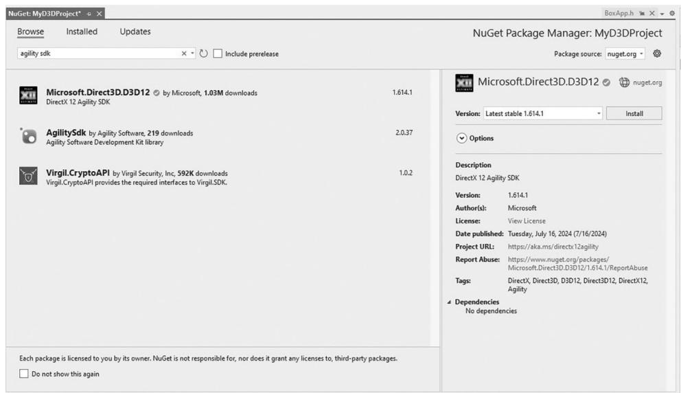


Figure 6. Installing the Agility SDK.

After installing, right click on the project name under the Solution Explorer, select Properties, and verify you have a D3D12 NuGet item as shown in Figure 7. This is the path for the newer DirectX SDK code and DLLs from the Agility SDK. 

One important thing to note is that the code must specify the agility SDK version. So, if you upgrade a project to a newer version, you will need to update the following code in Common/d3dApp.cpp as well: 

```c
// Required exports for DX12-Agility SDK  
// https://devblogs.microsoft.com/directx/gettingstarted-dx12agility/  
extern "C" { __declspec(dllexport) extern const UINT D3D12SDKVersion = 614; }  
extern "C" { __declspec(dllexport) extern const char* D3D12SDKPath = ".\D3D12\"; } 
```

All of the existing projects in this book are built against version 1.614.1. 

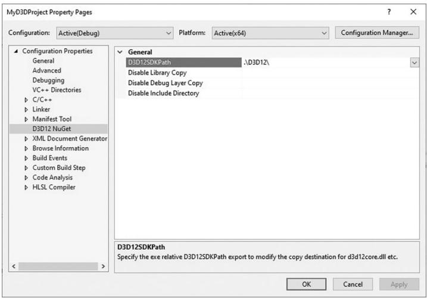


Figure 7. Agility SDK path.

# Project Settings

Figure 8 shows our general application settings for the debug configuration. In particular, there are three changes from the default. 

1. Output Directory: We output our executables to the bin folder (i.e., \d3d12book\bin). 

2. Target Name: The executable name is built from the project name with _debug and _release, for debug and release configurations, respectively. 

3. $\mathrm { C } { + + }$ Language Standard: We used ISO $C { + } { + } I 7$ Standard $( / s t d { : } c + + 1 7 )$ for this book, but $c + + 2 0$ should also work. 

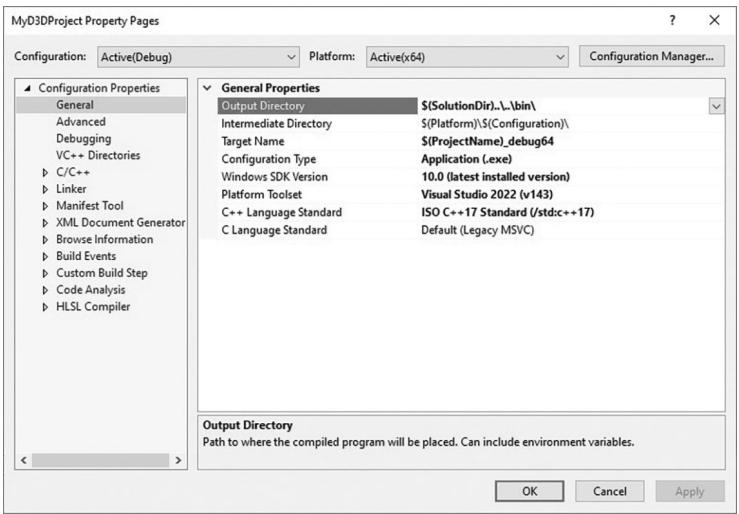


Figure 8. General Properties.

Because we output our executables to \d3d12book\bin, we also need to set the working directory to be the same, as shown in Figure 9. 

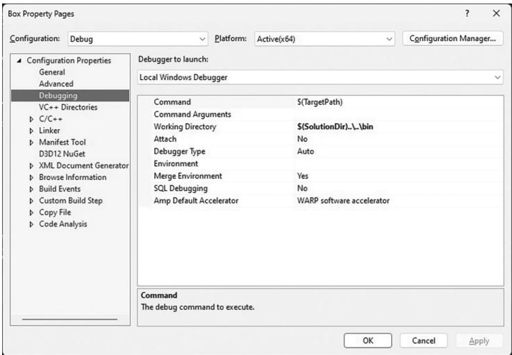


Figure 9. Setting the working directory.

Next, we need to set the 鈥淎dditional Include Directories鈥?for the external code we are using; see Figure 10. 

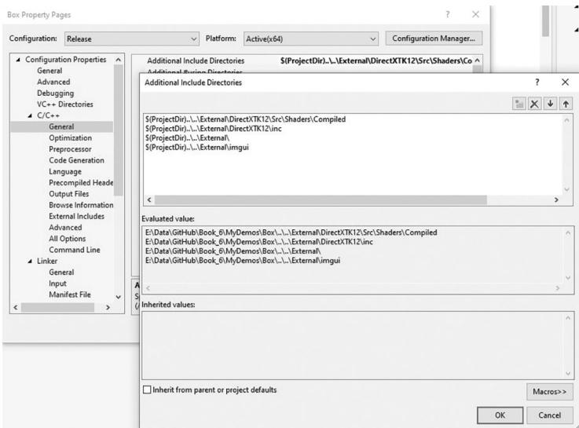


Figure 10. Include paths to the external code projects.

Finally, it is convenient to edit the shader files (.hlsl extension) that a demo uses in Visual Studio. But when it is changed, we want to make sure the updated shader file gets copied over to the \d3d12book\bin\Shaders directory. Therefore, we make 

a custom build step for each shader file added to the project; see Figure 11 and Figure 12. 

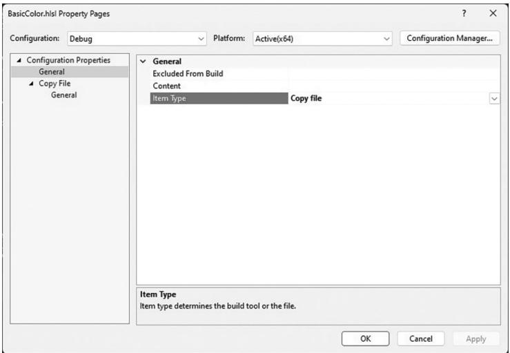


Figure 11. Changing the Item Type to 鈥淐opy file.鈥?
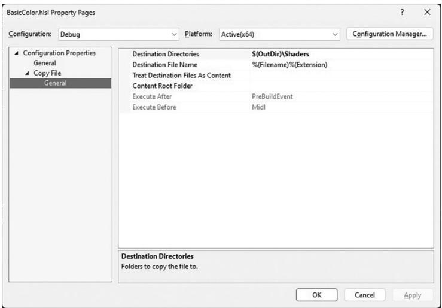


Figure 12. Specifying where to copy shader files.

# Linking the DirectX Libraries

We link the necessary library files through the source code using #pragmas in Common/d3dApp.h like so: 

// Link necessary d3d12 libraries. #pragma comment(lib,"d3dcompiler.lib") 

```cpp
pragma comment.lib, "D3D12.lib") #pragma comment.lib, "dxgi.lib") 
```

For making demo applications, this saves us from the additional step of opening the project property pages and specifying additional dependencies under the Linker settings. 

# Copy DXC DLLs to Bin

Because our demos need to compile shader code, one final step before we can build is to copy the DXC (DirectX Shader Compiler) DLLs to our working directory. Specifically, we need to copy \d3d12book\External\dxc\bin\x64\dxil.dll and \d3d12book\External\dxc\bin\x64\dxcompiler.dll to \d3d12book\bin. 

# Building and Running the Code

At this point, setup is complete, and you can now go to the main menu, and select Debug- $\cdot >$ Start Debugging to compile, link, and execute the demo. The application in Figure 13 should appear. 

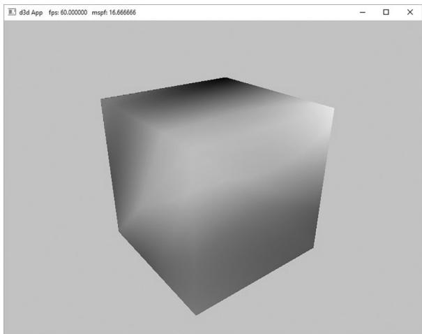


Figure 13. Screenshot of the 鈥淏ox鈥?demo.


A lot of the code in the Common directory is built up over the course of the book. So, we recommend that you do not start looking through the code. Instead, wait until you are reading the chapter in the book where that code is covered. 

