# Chapter 01 Vector Algebra


# Mathematical Prerequisites

Video games attempt to simulate a virtual world. However, computers, by their very nature, crunch numbers. Thus, the problem of how to convey a world to a computer arises. The answer is to describe our by their very nature, crunch numbers. Thus, the problem of how to convey a world to a computer arises. The answer is to describe our worlds, and the interactions therein, completely mathematically. Consequently, mathematics plays a fundamental role in video game development. 

In this prerequisites part, we introduce the mathematical tools that are used throughout this book. The emphasis is on vectors, coordinate systems, matrices, and transformations, as these tools are used in just about every sample program of this book. In addition to the mathematical explanations, a survey and demonstration of the relevant classes and functions from the DirectXMath library are provided. 

Note that the topics covered here are only those essential to understanding the rest of this book. This book is by no means a comprehensive treatment of video game mathematics, as entire books are devoted to this topic. For readers desiring a more complete reference about video game mathematics, we recommend [Verth04] and [Lengyel02]. 

Chapter 1, Vector Algebra: Vectors are, perhaps, the most fundamental mathematical objects used in computer games. For example, we use vectors to represent positions, displacements, directions, velocities, and forces. In this chapter, we study vectors and the operations used to manipulate them. 

Chapter 2, Matrix Algebra: Matrices provide an efficient and compact way of representing transformations. In this chapter, we become familiar with matrices and the operations defined on them. 

Chapter 3, Transformations: This chapter examines three fundamental geometric transformations: scaling, rotation, and translation. We use these transformations to manipulate 3D objects in space. In addition, we explain change of coordinate transformations, which are used to transform coordinates representing geometry from one coordinate system into another. 

# Chapter 1 Vector Algebra
Vectors play a crucial role in computer graphics, collision detection, and physical simulation, all of which are common components in modern video games. Our approach here is informal and practical; for a book dedicated to 3D game/graphics math, we recommend [Verth04]. We emphasize the importance of vectors by noting that they are used in just about every demo program in this book. 

# Objectives:

1. To learn how vectors are represented geometrically and numerically. 

2. To discover the operations defined on vectors and their geometric applications. 

3. To become familiar with the vector functions and classes of the DirectXMath library. 

# 1.1 VECTORS

A vector refers to a quantity that possesses both magnitude and direction. Quantities that possess both magnitude and direction are called vector-valued quantities. Examples of vector-valued quantities are forces (a force is applied in a particular direction with a certain strength鈥攎agnitude), displacements (the net direction and distance a particle moved), and velocities (speed and direction). Thus, vectors are used to represent forces, displacements, and velocities. In addition, we also use vectors to specify pure directions, such as the direction the player is looking in a 3D game, the direction a polygon is facing, the direction in which a ray of light travels, or the direction in which a ray of light reflects off a surface. 

A first step in characterizing a vector mathematically is geometrically: We graphically specify a vector by a directed line segment (see Figure 1.1), where the length denotes the magnitude of the vector and the aim denotes the direction of the vector. We note that the location in which we draw a vector is immaterial because changing the location does not change the magnitude or direction (the two properties a vector possesses). Therefore, we say two vectors are equal if and only if they have the same length and they point in the same direction. Thus, the vectors u and v drawn in Figure $1 . 1 a$ are actually equal because they have the same length and point in the same direction. In fact, because location is unimportant for vectors, we can always translate a vector without changing its meaning (since a translation changes neither length nor direction). Observe that we could translate u such that it completely overlaps with v (and conversely), thereby making them indistinguishable鈥攈ence their equality. As a physical example, the vectors u and v in Figure $1 . 1 b$ both tell the ants at two different points $A$ and B to move north ten 

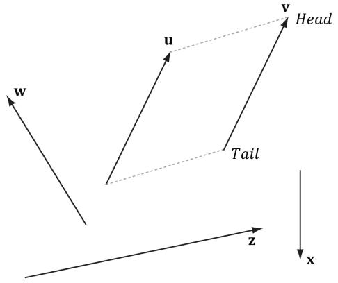


锛坅)


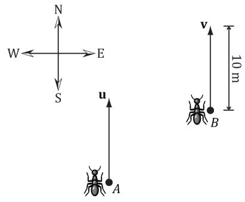


(b)


Figure 1.1. (a) Vectors drawn on a 2D plane. (b) Vectors instructing ants to move 10 meters north.


meters from where they are. Again we have that $\mathbf { u } = \mathbf { v }$ . The vectors themselves are independent of position; they simply instruct the ants how to move from where they are. In this example, they tell the ants to move north (direction) ten meters (length). 

# 1.1.1 Vectors and Coordinate Systems

We could now define useful geometric operations on vectors, which can then be used to solve problems involving vector-valued quantities. However, since the computer cannot work with vectors geometrically, we need to find a way of specifying vectors numerically instead. So what we do is introduce a 3D coordinate system in space, and translate all the vectors so that their tails coincide with the origin (Figure 1.2). Then we can identify a vector by specifying the coordinates of its head, and write ${ \bf v } = ( x , y , z )$ as shown in Figure 1.3. Now we can represent a vector with three floats in a computer program. 


If working in 2D, then we just use a 2D coordinate system and the vector only has two coordinates: $\mathbf { v } = ( x , y )$ and we can represent a vector with two floats in a computer program. 

Consider Figure 1.4, which shows a vector v and two frames in space. (Note that we use the terms frame, frame of reference, space, and coordinate system to all mean the same thing in this book.) We can translate v so that it is in standard position in either of the two frames. Observe, however, that the coordinates of the vector v relative to frame A are different than the coordinates of the vector v relative to frame B. In other words, the same vector v has a different coordinate representation for distinct frames. 

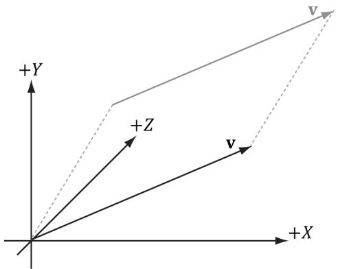


Figure 1.2. We translate v so that its tail coincides with the origin of the coordinate system. When a vector鈥檚 tail coincides with the origin, we say that it is in standard position.


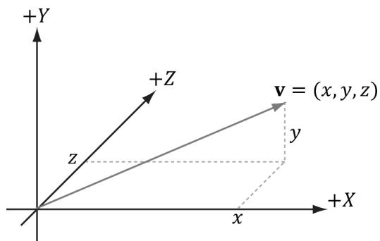


Figure 1.3. A vector specified by coordinates relative to a coordinate system.


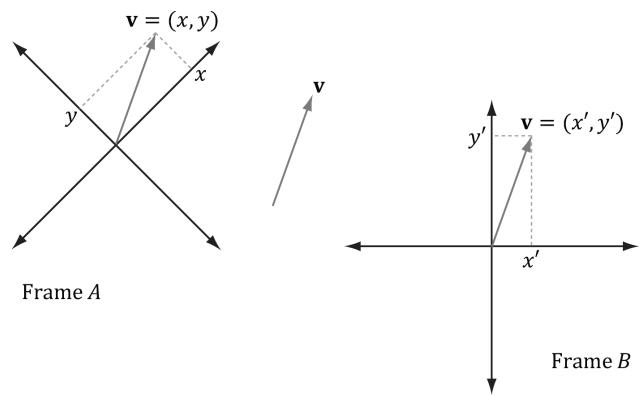


Figure 1.4. The same vector v has different coordinates when described relative to different frames.


The idea is analogous to, say, temperature. Water boils at $1 0 0 ^ { \circ }$ Celsius or $2 1 2 ^ { \circ }$ Fahrenheit. The physical temperature of boiling water is the same no matter the scale (i.e., we can鈥檛 lower the boiling point by picking a different scale), but we assign a different scalar number to the temperature based on the scale we use. Similarly, for a vector, its direction and magnitude, which are embedded in the directed line segment, does not change; only the coordinates of it change based on the frame of reference we use to describe it. This is important because it means whenever we identify a vector by coordinates, those coordinates are relative to some frame of reference. Often in 3D computer graphics, we will utilize more than one frame of reference and, therefore, we will need to keep track of which frame a vector鈥檚 coordinates are relative to; additionally, we will need to know how to convert vector coordinates from one frame to another. 


We see that both vectors and points can be described by coordinates $( x , y , z )$ relative to a frame. However, they are not the same; a point represents a location in 3-space, whereas a vector represents a magnitude and direction. We will have more to say about points in $\$ 1.5$ . 

# 1.1.2 Left-Handed Versus Right-Handed Coordinate Systems

Direct3D uses a so-called left-handed coordinate system. If you take your left hand and aim your fingers down the positive $x$ -axis, and then curl your fingers towards the positive $\boldsymbol { y }$ -axis, your thumb points roughly in the direction of the positive $z$ -axis. Figure 1.5 illustrates the differences between a left-handed and right-handed coordinate system. 

Observe that for the right-handed coordinate system, if you take your right hand and aim your fingers down the positive $x$ -axis, and then curl your fingers towards the positive y-axis, your thumb points roughly in the direction of the positive $z$ -axis. 

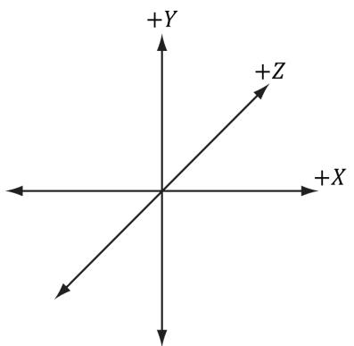


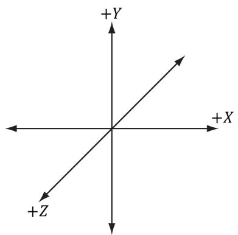


Figure 1.5. On the left we have a left-handed coordinate system. Observe that the positive $Z$ -axis goes into the page. On the right we have a right-handed coordinate system. Observe that the positive $Z$ -axis comes out of the page.


# 1.1.3 Basic Vector Operations

We now define equality, addition, scalar multiplication, and subtraction on vectors using the coordinate representation. For these four definitions, let $\mathbf { u } = \left( u _ { x } , u _ { y } , u _ { z } \right)$ and $\mathbf { v } = \left( \nu _ { _ { x } } , \nu _ { _ { y } } , \nu _ { _ { z } } ^ { _ { \mathbf { \nu } } } \right)$ . 

1. Two vectors are equal if and only if their corresponding components are equal. That is, $\mathbf { u } = \mathbf { v }$ if and only if $u _ { x } = \nu _ { x } , \ u _ { y } = \nu _ { y }$ , and $u _ { z } = \nu _ { z }$ . 

2. We add vectors component-wise: $\mathbf u + \mathbf v = \left( u _ { x } + \nu _ { x } , u _ { y } + \nu _ { y } , u _ { z } + \nu _ { z } \right)$ . Observe that it only makes sense to add vectors of the same dimension. 

3. We can multiply a scalar (i.e., a real number) and a vector and the result is a vector. Let $k$ be a scalar, then $k \mathbf { u } = \left( k u _ { x } , \dot { k } u _ { y } , k u _ { z } \right)$ . This is called scalar multiplication. 

4. We define subtraction in terms of vector addition and scalar multiplication. That is, $\mathbf { u } - \mathbf { v } = \mathbf { u } + ( - 1 \cdot \mathbf { v } ) = \mathbf { u } + ( - \mathbf { v } ) = \left( u _ { x } - \nu _ { x } , u _ { y } - \nu _ { y } , u _ { z } - \nu _ { z } \right) .$ . 

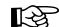


# Example 1.1

Let $\mathbf { u } = \left( 1 , 2 , 3 \right)$ , $\mathbf { v } = \left( 1 , 2 , 3 \right)$ , $\mathbf { w } = \left( 3 , 0 , - 2 \right)$ , and $k = 2$ . Then, 

1. $\mathbf { u } + \mathbf { w } = \left( 1 , 2 , 3 \right) + \left( 3 , 0 , - 2 \right) = \left( 4 , 2 , 1 \right)$ 

2. $\mathbf { u } = \mathbf { v }$ 

3. $\mathbf { u } - \mathbf { v } = \mathbf { u } + { \bigl ( } - \mathbf { v } { \bigr ) } = { \bigl ( } 1 , 2 , 3 { \bigr ) } + { \bigl ( } - 1 , - 2 , - 3 { \bigr ) } = { \bigl ( } 0 , 0 , 0 { \bigr ) } = \mathbf { 0 } ;$ 

4. $k \mathbf { w } = 2 { \left( 3 , 0 , - 2 \right) } = { \left( 6 , 0 , - 4 \right) }$ 

The difference in the third bullet illustrates a special vector, called the zero-vector, which has zeros for all of its components and is denoted by 0. 

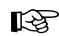


# Example 1.2

We will illustrate this example with 2D vectors to make the drawings simpler. The ideas are the same as in 3D; we just work with one less component in 2D. 

1. Let $\mathbf { v } = ( 2 , 1 )$ . How do $\mathbf { v }$ and $- { \frac { 1 } { 2 } } \mathbf { v }$ compare geometrically? We note that $- { \frac { 1 } { 2 } } \mathbf { v } = \left( - 1 , - { \frac { 1 } { 2 } } \right)$ . Graphing both $\mathbf { v }$ and $- { \frac { 1 } { 2 } } \mathbf { v }$ (Figure 1.6a), we notice that $- { \frac { 1 } { 2 } } \mathbf { v }$ is in the direction directly opposite of v and its length is 1/2 that of v. Thus, geometrically, negating a vector can be thought of as 鈥渇lipping鈥?its direction, and scalar multiplication can be thought of as scaling the length of a vector. 

2. Let $\mathbf { u } = \left( 2 , \textstyle { \frac { 1 } { 2 } } \right)$ and $\mathbf { v } = ( 1 , 2 )$ . Then $\mathbf { u } + \mathbf { v } = \left( 3 , \frac { 5 } { 2 } \right)$ . Figure $1 . 6 b$ shows what vector addition means geometrically: We parallel translate u so that its tail coincided with the head of v. Then, the sum is the vector originating at the tail of v and ending at the head of the translated u. (We get the same result if we keep u fixed and translate v so that its tail coincided with the head of u. In this case, $\mathbf { u } + \mathbf { v }$ would be the vector originating at the tail of u and ending at the head of the translated v.) Observe also that our rules of vector addition agree with what we would intuitively expect to happen physically when we add forces together to produce a net force: If we add two forces (vectors) in the same direction, we get another stronger net force (longer vector) in that direction. If we add two forces (vectors) in opposition to each other, then we get a weaker net force (shorter vector). Figure 1.7 illustrates these ideas. 

3. Let $\mathbf { u } = \left( 2 , \textstyle { \frac { 1 } { 2 } } \right)$ and $\mathbf { v } = ( 1 , 2 )$ . Then $\mathbf { v } - \mathbf { u } = \left( - 1 , \frac { 3 } { 2 } \right)$ . Figure $1 . 6 c$ shows what vector subtraction means geometrically. Essentially, the difference v 鈥?u gives us a vector aimed from the head of u to the head of v. If we instead interpret u and v as points, then v 鈥?u gives us a vector aimed from the point u to the point v; this interpretation is important as we will often want the vector aimed 

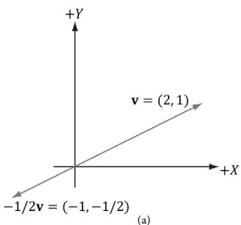


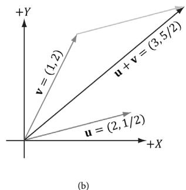


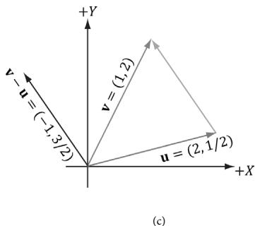


Figure 1.6. (a) The geometric interpretation of scalar multiplication. (b) The geometric interpretation of vector addition. (c) The geometric interpretation of vector subtraction.


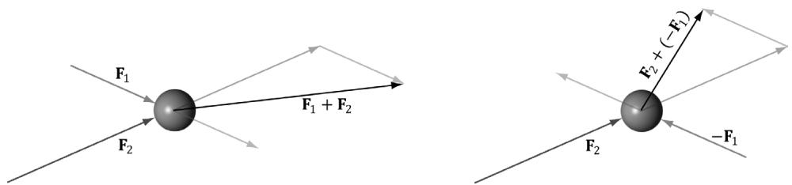


Figure 1.7. Forces applied to a ball. The forces are combined using vector addition to get a net force.


from one point to another. Observe also that the length of v 鈥?u is the distance from u to v, when thinking of u and v as points. 

# 1.2 LENGTH AND UNIT VECTORS

Geometrically, the magnitude of a vector is the length of the directed line segment. We denote the magnitude of a vector by double vertical bars (e.g., $\lvert \lvert \mathbf { u } \rvert \rvert$ denotes the magnitude of u). Now, given a vector $\mathbf { u } = ( x , y , z )$ , we wish to compute its magnitude algebraically. The magnitude of a 3D vector can be computed by applying the Pythagorean theorem twice; see Figure 1.8. 

First, we look at the triangle in the $_ { x z }$ -plane with sides $x , z ,$ and hypotenuse $^ a$ . From the Pythagorean theorem, we have $a = { \sqrt { x ^ { 2 } + z ^ { 2 } } }$ . Now look at the triangle with sides a, y, and hypotenuse $\lvert \lvert \mathbf { u } \rvert \rvert$ . From the Pythagorean theorem again, we arrive at the following magnitude formula: 

$$
\left| \left| \mathbf {u} \right| \right| = \sqrt {y ^ {2} + a ^ {2}} = \sqrt {y ^ {2} + \left(\sqrt {x ^ {2} + z ^ {2}}\right) ^ {2}} = \sqrt {x ^ {2} + y ^ {2} + z ^ {2}} \quad (\text {e q . 1 . 1})
$$

For some applications, we do not care about the length of a vector because we want to use the vector to represent a pure direction. For such direction-only 

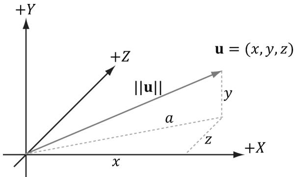


Figure 1.8. The 3D length of a vector can be computed by applying the Pythagorean theorem twice.


vectors, we want the length of the vector to be exactly 1. When we make a vector unit length, we say that we are normalizing the vector. We can normalize a vector by dividing each of its components by its magnitude: 

$$
\hat {\mathbf {u}} = \frac {\mathbf {u}}{\| \mathbf {u} \|} = \left(\frac {x}{\| \mathbf {u} \|}, \frac {y}{\| \mathbf {u} \|}, \frac {z}{\| \mathbf {u} \|}\right) \tag {eq.1.2}
$$

To verify that this formula is correct, we can compute the length of u藛: 

$$
\left\| \hat {\mathbf {u}} \right\| = \sqrt {\left(\frac {x}{\left\| \mathbf {u} \right\|}\right) ^ {2} + \left(\frac {y}{\left\| \mathbf {u} \right\|}\right) ^ {2} + \left(\frac {z}{\left\| \mathbf {u} \right\|}\right) ^ {2}} = \frac {\sqrt {x ^ {2} + y ^ {2} + z ^ {2}}}{\sqrt {\left\| \mathbf {u} \right\| ^ {2}}} = \frac {\left\| \mathbf {u} \right\|}{\left\| \mathbf {u} \right\|} = 1
$$

So $\hat { \mathbf { u } }$ is indeed a unit vector. 

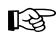


# Example 1.3

Normalize the vector $\mathbf { v } = ( - 1 , 3 , 4 )$ . We have $\left\| \mathbf { v } \right\| = { \sqrt { \left( - 1 \right) ^ { 2 } + 3 ^ { 2 } + 4 ^ { 2 } } } = { \sqrt { 2 6 } }$ . Thus, 

$$
\left\| \hat {\mathbf {v}} \right\| = \frac {\mathbf {v}}{\left\| \mathbf {v} \right\|} = \left(- \frac {1}{\sqrt {2 6}}, \frac {3}{\sqrt {2 6}}, \frac {4}{\sqrt {2 6}}\right).
$$

To verify that $\hat { \mathbf { v } }$ is indeed a unit vector, we compute its length: 

$$
\left\| \hat {\mathbf {v}} \right\| = \sqrt {\left(- \frac {1}{\sqrt {2 6}}\right) ^ {2} + \left(\frac {3}{\sqrt {2 6}}\right) ^ {2} + \left(\frac {4}{\sqrt {2 6}}\right) ^ {2}} = \sqrt {\frac {1}{2 6} + \frac {9}{2 6} + \frac {1 6}{2 6}} = \sqrt {1} = 1.
$$

# 1.3 THE DOT PRODUCT

The dot product is a form of vector multiplication that results in a scalar value; for this reason, it is sometimes referred to as the scalar product. Let $\mathbf { u } = ( u _ { x } , u _ { y } , u _ { z } )$ and $\mathbf { v } = ( \nu _ { x } , \nu _ { y } , \nu _ { z } )$ , then the dot product is defined as follows: 

$$
\mathbf {u} \cdot \mathbf {v} = u _ {x} v _ {x} + u _ {y} v _ {y} + u _ {z} v _ {z} \tag {eq.1.3}
$$

In words, the dot product is the sum of the products of the corresponding components. 

The dot product definition does not present an obvious geometric meaning. Using the law of cosines (see Exercise 10), we can find the relationship, 

$$
\mathbf {u} \cdot \mathbf {v} = \left\| \mathbf {u} \right\| \left\| \mathbf {v} \right\| \cos \theta \tag {eq.1.4}
$$

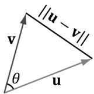


锛坅锛?


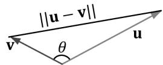


(b锛?


Figure 1.9. In the left figure, the angle $\theta$ between u and $\pmb { v }$ is an acute angle. In the right figure, the angle $\theta$ between u and $\pmb { v }$ is an obtuse angle. When we refer to the angle between two vectors, we always mean the smallest angle, that is, the angle $\theta$ such that $0 \le \theta \le \pi$ .


where $\theta$ is the angle between the vectors u and v such that $0 \leq \theta \leq \pi$ ; see Figure聽1.9. So, Equation 1.4 says that the dot product between two vectors is the cosine of the angle between them scaled by the vectors鈥?magnitudes. In particular, if both u and v are unit vectors, then u 鈰?v is the cosine of the angle between them (i.e., $\mathbf { u } \cdot \mathbf { v } { } = { \cos \theta } { } ,$ ). 

Equation 1.4 provides us with some useful geometric properties of the dot product: 

1. If $\mathbf { u } \cdot \mathbf { v } = 0$ , then $\mathbf { u } \perp \mathbf { v }$ (i.e., the vectors are orthogonal). 

2. If $\mathbf { u } \cdot \mathbf { v } > 0$ , then the angle $\theta$ between the two vectors is less than 90 degrees (i.e., the vectors make an acute angle). 

3. If $\mathbf { u } \cdot \mathbf { v } < 0$ , the angle $\theta$ between the two vectors is greater than 90 degrees (i.e., the vectors make an obtuse angle). 

Note: 

The word 鈥渙rthogonal鈥?can be used as a synonym for 鈥減erpendicular.鈥?

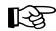


# Example 1.4

Let $\mathbf { u } = ( 1 , 2 , 3 )$ and $\mathbf { v } = \left( - 4 , 0 , - 1 \right)$ . Find the angle between u and v. First we compute: 

$$
\mathbf {u} \cdot \mathbf {v} = (1, 2, 3) \cdot (- 4, 0, - 1) = - 4 - 3 = - 7
$$

$$
\left| \left| \mathbf {u} \right| \right| = \sqrt {1 ^ {2} + 2 ^ {2} + 3 ^ {2}} = \sqrt {1 4}
$$

$$
\left\| \mathbf {v} \right\| = \sqrt {\left(- 4\right) ^ {2} + 0 ^ {2} + \left(- 1\right) ^ {2}} = \sqrt {1 7}
$$

Now, applying Equation 1.4 and solving for theta, we get: 

$$
\cos \theta = \frac {\mathbf {u} \cdot \mathbf {v}}{\| \mathbf {u} \| \| \mathbf {v} \|} = \frac {- 7}{\sqrt {1 4} \sqrt {1 7}}
$$

$$
\theta = \cos^ {- 1} \frac {- 7}{\sqrt {1 4} \sqrt {1 7}} \approx 1 1 7 ^ {\circ}
$$

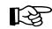


# Example 1.5

Consider Figure 1.10. Given v and the unit vector n, find a formula for $\mathbf { p }$ in terms of v and n using the dot product. 

First, observe from the figure that there exists a scalar $k$ such that $\mathbf { p } = k \mathbf { n }$ ; moreover, since we assumed $| | \mathbf { n } | | = 1 ,$ we have $\| \mathbf { p } \| = \| k \mathbf { n } \| = \left| k \right| \| \mathbf { n } \| = \left| k \right|$ . (Note that $k$ may be negative if and only if $\mathbf { p }$ and n aim in opposite directions.) Using trigonometry, we have that $k = \lVert \mathbf { v } \rVert \cos \theta$ ; therefore, $\mathbf { p } = k \mathbf { n } = { \big ( } | | \mathbf { v } | | \cos \theta { \big ) } \mathbf { n }$ . However, because n is a unit vector, we can say this in another way: 

$$
\mathbf {p} = \left(\left|\left| \mathbf {v} \right|\right| \cos \theta\right) \mathbf {n} = \left(\left|\left| \mathbf {v} \right|\right| \cdot 1 \cos \theta\right) \mathbf {n} = \left( \right.\left|\left| \mathbf {v} \right|\right|\left. \right\rvert\left|\left| \mathbf {n} \right|\right| \cos \theta\left. \right) \mathbf {n} = (\mathbf {v} \cdot \mathbf {n}) \mathbf {n}
$$

In particular, this shows $k = \mathbf { v } \cdot \mathbf { n }$ , and can be viewed as the length of the shadow of v when projected onto the vector n when n is a unit vector. We call $\mathbf { p }$ the orthogonal projection of $\mathbf { v }$ on n, and it is commonly denoted by 

$$
\mathbf {p} = \operatorname {p r o j} _ {\mathbf {n}} (\mathbf {v}) = (\mathbf {v} \cdot \mathbf {n}) \mathbf {n}
$$

If we interpret v as a force, p can be thought of as the portion of the force v that acts in the direction n. Likewise, the vector $\mathbf { w } = \mathrm { p e r p } _ { \mathbf { n } } \left( \mathbf { \hat { v } } \right) = \mathbf { v } - \mathbf { p }$ is the portion of the force v that acts orthogonal to the direction n (which is why we also denote it by $\mathrm { p e r p } _ { \mathbf { n } } \bigl ( \mathbf { v } \bigr )$ for perpendicular). Observe that $\mathbf { v } = \mathbf { p } + \mathbf { w } = \mathrm { p r o j } _ { \mathbf { n } } \left( \mathbf { v } \right) + \mathrm { p e r p } _ { \mathbf { n } } \left( \mathbf { v } \right)$ , which is to say we have decomposed the vector v into the sum of two orthogonal vectors p and w. 

If n is not of unit length, we can always normalize it first to make it unit length. Replacing n by the unit vector $\frac { \mathbf { n } } { \| \mathbf { n } \| }$ gives us the more general projection formula: 

$$
\mathbf {p} = \operatorname {p r o j} _ {\mathbf {n}} (\mathbf {v}) = \left(\mathbf {v} \cdot \frac {\mathbf {n}}{| | \mathbf {n} | |}\right) \frac {\mathbf {n}}{| | \mathbf {n} | |} = \frac {(\mathbf {v} \cdot \mathbf {n})}{| | \mathbf {n} | | ^ {2}} \mathbf {n}
$$

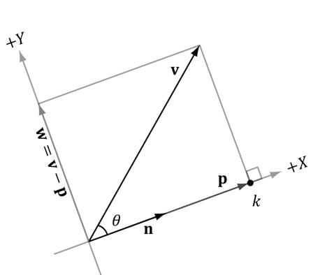


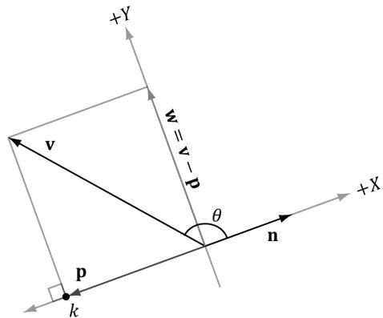


Figure 1.10. The orthogonal projection of v on n.


# 1.3.1 Orthogonalization (正交化)

A set of vectors $\left\{ \mathbf { v } _ { 0 } , . . . , \mathbf { v } _ { n - 1 } \right\}$ is called orthonormal if the vectors are mutually orthogonal (every vector in the set is orthogonal to every other vector in the set) and unit length. Sometimes we have a set of vectors that are almost orthonormal, but not quite. A common task is to orthogonalize the set and make it orthonormal. In 3D computer graphics we might start off with an orthonormal set, but due to numerical precision issues, the set gradually becomes un-orthonormal. We are mainly concerned with the 2D and 3D cases of this problem (that is, sets that contain two and three vectors, respectively). 

We examine the simpler 2D case first. Suppose we have the set of vectors $\left\{ \mathbf { v } _ { 0 } , \mathbf { v } _ { 1 } \right\}$ that we want to orthogonalize into an orthonormal set $\left\{ \mathbf { w } _ { 0 } , \mathbf { w } _ { 1 } \right\}$ as shown in Figure聽1.11. We start with $\mathbf { w } _ { 0 } { = } \mathbf { v } _ { 0 }$ and modify $\mathbf { v } _ { 1 }$ to make it orthogonal to $\mathbf { w } _ { 0 }$ ; this is done by subtracting out the portion of $\mathbf { v } _ { 1 }$ that acts in the ${ \bf w } _ { 0 }$ direction: 

$$
\mathbf {w} _ {1} = \mathbf {v} _ {1} - \operatorname {p r o j} _ {\mathbf {w} _ {0}} (\mathbf {v} _ {1})
$$

We now have a mutually orthogonal set of vectors $\left\{ { \bf w } _ { 0 } , { \bf w } _ { 1 } \right\}$ ; the last step to constructing the orthonormal set is to normalize ${ \bf w } _ { 0 }$ and $\mathbf { w } _ { 1 }$ to make them unit length. 

The 3D case follows in the same spirit as the 2D case, but with more steps. Suppose we have the set of vectors $\left\{ \mathbf { v } _ { 0 } , \mathbf { v } _ { 1 } , \mathbf { v } _ { 2 } \right\}$ that we want to orthogonalize into an orthonormal set $\left\{ \mathbf { w } _ { 0 } , \mathbf { w } _ { 1 , } \mathbf { w } _ { 2 } \right\}$ as shown in Figure 1.12. We start with $\mathbf { w } _ { 0 } = \mathbf { v } _ { 0 }$ and modify $\mathbf { v } _ { 1 }$ to make it orthogonal to $\mathbf { w } _ { 0 } ;$ ; this is done by subtracting out the portion of $\mathbf { v } _ { 1 }$ that acts in the $\mathbf { w } _ { 0 }$ direction: 

$$
\mathbf {w} _ {1} = \mathbf {v} _ {1} - \operatorname {p r o j} _ {\mathbf {w} _ {0}} (\mathbf {v} _ {1})
$$

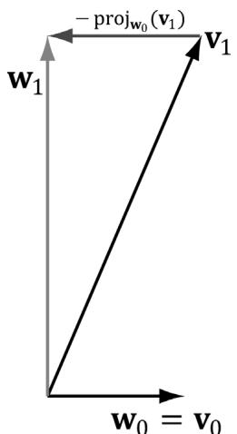


Figure 1.11. 2D orthogonalization.


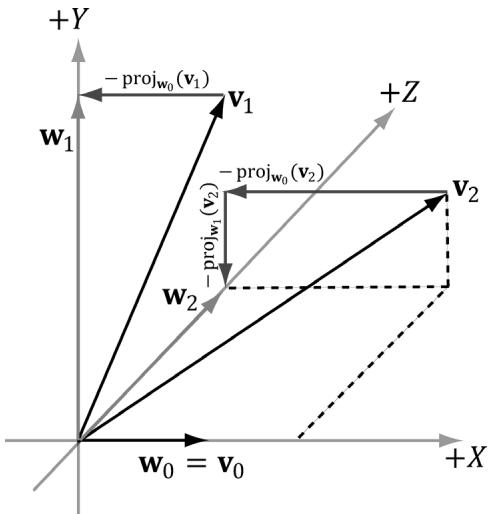


Figure 1.12. 3D orthogonalization.


Next, we modify $\mathbf { v } _ { 2 }$ to make it orthogonal to both $\mathbf { w } _ { 0 }$ and $\mathbf { w } _ { 1 }$ . This is done by subtracting out the portion of $\mathbf { v } _ { 2 }$ that acts in the $\mathbf { w } _ { 0 }$ direction and the portion of $\mathbf { v } _ { 2 }$ that acts in the $\mathbf { w } _ { 1 }$ direction: 

$$
\mathbf {w} _ {2} = \mathbf {v} _ {2} - \operatorname {p r o j} _ {\mathbf {w} _ {0}} (\mathbf {v} _ {2}) - \operatorname {p r o j} _ {\mathbf {w} _ {1}} (\mathbf {v} _ {2})
$$

We now have a mutually orthogonal set of vectors $\left\{ \mathbf { w } _ { 0 } , \mathbf { w } _ { 1 } , \mathbf { w } _ { 2 } \right\}$ ; the last step to constructing the orthonormal set is to normalize $\mathbf { w } _ { 0 }$ , $\mathbf { w } _ { 1 }$ and $\mathbf { w } _ { 2 }$ to make them unit length. 

For the general case of $n$ vectors $\left\{ \mathbf { v } _ { 0 } , . . . , \mathbf { v } _ { n - 1 } \right\}$ that we want to orthogonalize into an orthonormal set $\left\{ \mathbf { v } _ { 0 } , . . . , \overset { \backprime } { \mathbf { v } } _ { n - 1 } \right\}$ , we have the following procedure commonly called the Gram-Schmidt Orthogonalization process: 

Base Step: Set $\mathbf { w } _ { 0 } = \mathbf { v } _ { 0 }$ 

$\begin{array} { l } { { \displaystyle \mathrm { F o r } 1 \leq i \leq n - 1 , \mathrm { S e t } { \bf w } _ { i } = { \bf v } _ { i } - \sum _ { j = 0 } ^ { i - 1 } \mathrm { p r o j } _ { { \bf w } _ { j } } \left( { \bf v } _ { i } \right) } } \\ { { \displaystyle \mathrm { N o r m a l i z a t i o n } \mathrm { S t e p } } \colon \mathrm { S e t } { \bf w } _ { i } = \frac { { \bf w } _ { i } } { \displaystyle \| { \bf w } _ { i } \| } } \end{array}$ $1 \leq i \leq n - 1 .$ 

$\mathbf { w } _ { i } = \frac { \mathbf { w } _ { i } } { \left\| \mathbf { w } _ { i } \right\| }$ 

Again, the intuitive idea is that when we pick a vector $\mathbf { v } _ { i }$ from the input set to add to the orthonormal set, we need to subtract out the components of $\mathbf { v } _ { i }$ that act in the directions of the other vectors $( \mathbf { w } _ { 0 } , \mathbf { w } _ { 1 } , . . . , \mathbf { w } _ { i - 1 } )$ that are already in the orthonormal set to ensure the new vector being added is orthogonal to the other vectors already in the orthonormal set. 

# 1.4 THE CROSS PRODUCT

The second form of multiplication vector math defines is the cross product. Unlike the dot product, which evaluates to a scalar, the cross product evaluates to another vector; moreover, the cross product is only defined for 3D vectors (in particular, there is no 2D cross product). Taking the cross product of two 3D vectors u and v yields another vector, w that is mutually orthogonal to u and v. By that we mean w is orthogonal to u, and w is orthogonal to v; see Figure 1.13. If $\mathbf { u } = \left( u _ { x } , u _ { y } , u _ { z } \right)$ and $\mathbf { \check { v } } = \left( \nu _ { _ x } , \nu _ { _ y } , \nu _ { _ z } \right)$ , then the cross product is computed like so: 

$$
\mathbf {w} = \mathbf {u} \times \mathbf {v} = \left(u _ {y} v _ {z} - u _ {z} v _ {y}, u _ {z} v _ {x} - u _ {x} v _ {z}, u _ {x} v _ {y} - u _ {y} v _ {x}\right) \tag {eq.1.5}
$$

# 鈽?Example 1.6

Let $\mathbf { u } = \left( 2 , 1 , 3 \right)$ and $\mathbf { v } = \left( 2 , 0 , 0 \right)$ . Compute $\mathbf { w } = \mathbf { u } \times \mathbf { v }$ and $\mathbf { z } = \mathbf { v } \times \mathbf { u }$ , and then verify that w is orthogonal to $\mathbf { u }$ and that w is orthogonal to v. Applying Equation 1.5 we have, 

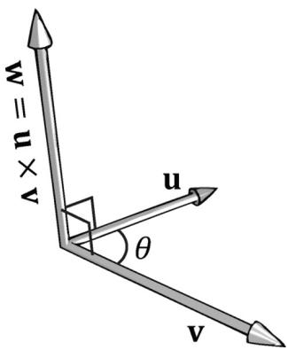


Figure 1.13. The cross product of two 3D vectors u and $\pmb { v }$ yields another vector w that is mutually orthogonal to u and v. If you take your left hand and aim the fingers in the direction of the first vector u, and then curl your fingers toward v along an angle $0 \leq \theta \leq \pi$ , then your thumb roughly points in the direction of $\mathbf { w } = \mathbf { u } \times \mathbf { v } $ ; this is called the left-hand-thumb rule.


$$
\begin{array}{l} \mathbf {w} = \mathbf {u} \times \mathbf {v} \\ = (2, 1, 3) \times (2, 0, 0) \\ = (1 \cdot 0 - 3 \cdot 0, 3 \cdot 2 - 2 \cdot 0, 2 \cdot 0 - 1 \cdot 2) \\ = (0, 6, - 2) \\ \end{array}
$$

And 

$$
\begin{array}{l} \mathbf {z} = \mathbf {v} \times \mathbf {u} \\ = (2, 0, 0) \times (2, 1, 3) \\ = (0 \cdot 3 - 0 \cdot 1, 0 \cdot 2 - 2 \cdot 3, 2 \cdot 1 - 0 \cdot 2) \\ = (0, - 6, 2) \\ \end{array}
$$

This result makes one thing clear, generally speaking $\mathbf { u } \times \mathbf { v } \neq \mathbf { v } \times \mathbf { u }$ . Therefore, we say that the cross product is anti-commutative. In fact, it can be shown that $\mathbf { u } \times \mathbf { v } = - \mathbf { v } \times \mathbf { u }$ . You can determine the vector returned by the cross product by the left-hand-thumb rule. If you first aim your fingers in the direction of the first vector, and then curl your fingers towards the second vector (always take the path with the smallest angle), your thumb points in the direction of the returned vector, as shown in Figure 1.13. 


If you are working in a right-handed coordinate system, then you use the right-hand-thumb rule: If you take your right hand and aim the fingers in the direction of the first vector u, and then curl your fingers toward v along an angle $0 \leq \theta \leq \pi$ , then your thumb roughly points in the direction of $\mathbf { w } = \mathbf { u } \times \mathbf { v }$ . 

To show that w is orthogonal to u and that w is orthogonal to v, we recall from $\$ 1.3$ that if $\mathbf { u } \cdot \mathbf { v } = 0$ , then $\mathbf { u } \perp \mathbf { v }$ (i.e., the vectors are orthogonal). Because 

$$
\mathbf {w} \cdot \mathbf {u} = (0, 6, - 2) \cdot (2, 1, 3) = 0 \cdot 2 + 6 \cdot 1 + (- 2) \cdot 3 = 0
$$

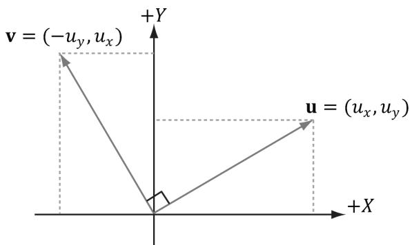


Figure 1.14. The 2D Pseudo Cross Product of a vector u evaluates to an orthogonal vector v.


And 

$$
\mathbf {w} \cdot \mathbf {v} = (0, 6, - 2) \cdot (2, 0, 0) = 0 \cdot 2 + 6 \cdot 0 + (- 2) \cdot 0 = 0
$$

we conclude that w is orthogonal to u and that w is orthogonal to v. 

# 1.4.1 Pseudo 2D Cross Product

The cross product allows us to find a vector orthogonal to two given 3D vectors. In 2D we do not quite have the same situation, but given a 2D vector $\mathbf { u } = \left( u _ { x } , u _ { y } \right)$ it can be useful to find a vector v orthogonal to u. Figure 1.14 shows the geometric setup from which it is suggested that $\mathbf { v } = \left( - u _ { y } , u _ { x } \right)$ . The formal proof is straightforward: 

$$
\mathbf {u} \cdot \mathbf {v} = \left(u _ {x}, u _ {y}\right) \cdot \left(- u _ {y}, u _ {x}\right) = - u _ {x} u _ {y} + u _ {y} u _ {x} = 0
$$

Thus $\mathbf { u } \perp \mathbf { v }$ . Observe that $\mathbf { u } \cdot - \mathbf { v } = u _ { x } u _ { y } + u _ { y } \left( - u _ { x } \right) = 0$ , too, so we also have that $\mathbf { u } \perp - \mathbf { v }$ . 

# 1.4.2 Orthogonalization with the Cross Product

In $\ S 1 . 3 . 1$ , we looked at a way to orthogonalize a set of vectors using the Gram-Schmidt process. For 3D, there is another strategy to orthogonalize a set of vectors $\left\{ \mathbf { v } _ { 0 } , \mathbf { v } _ { 1 } , { \bf { \bar { v } } } _ { 2 } \right\}$ that are almost orthonormal, but perhaps became un-orthonormal due to accumulated numerical precision errors, using the cross product. Refer to Figure 1.15 for the geometry of this process: 

1. Set w 0 0= v||v || . $\mathbf { w } _ { 0 } = \frac { \mathbf { v } _ { 0 } } { \lVert \mathbf { v } _ { 0 } \rVert }$ 

2. Set w2 = $\mathbf { w } _ { 2 } = \frac { \mathbf { w } _ { 0 } \times \mathbf { v } _ { 1 } } { \| \mathbf { w } _ { 0 } \times \mathbf { v } _ { 1 } \| }$ 0 1脳w v 

3. Set $\mathbf { w } _ { 1 } = \mathbf { w } _ { 2 } \times \mathbf { w } _ { 0 }$ By Exercise 14, $\left| \left| \mathbf { w } _ { 2 } \times \mathbf { w } _ { 0 } \right| \right| = 1$ because $\mathbf { w } _ { 2 } \perp \mathbf { w } _ { 0 }$ and $| | \mathbf { w } _ { 2 } | | =$ $\left. \left. \mathbf { w } _ { 0 } \right. \right. = 1$ , so we do not need to do any normalization in this last step. 

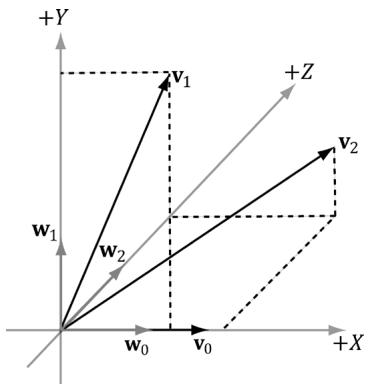


Figure 1.15. 3D orthogonalization with the cross product.


At this point, the set of vectors $\left\{ \mathbf { w } _ { 0 } , \mathbf { w } _ { 1 } , \mathbf { w } _ { 2 } \right\}$ is orthonormal. 


In the above example, we started with w0 00= v||v || $\mathbf { w } _ { 0 } = \frac { \mathbf { v } _ { 0 } } { \lVert \mathbf { v } _ { 0 } \rVert }$ which means we did not change the direction when going from $\mathbf { v } _ { 0 }$ to $\mathbf { w } _ { 0 }$ ; we only changed the length. However, the directions of $\mathbf { w } _ { 1 }$ and $\mathbf { w } _ { 2 }$ could be different from $\mathbf { v } _ { 1 }$ and $\mathbf { v } _ { 2 }$ , respectively. Depending on the specific application, the vector you choose not to change the direction of might be important. For example, later in this book we represent the orientation of the camera with three orthonormal vectors $\left\{ \mathbf { v } _ { 0 } , \mathbf { \hat { v } } _ { 1 } , \mathbf { v } _ { 2 } \right\}$ where the third vector $\mathbf { v } _ { 2 }$ describes the direction the camera is looking. When orthogonalizing these vectors, we often do not want to change the direction we are looking, and so we will start the above algorithm with $\mathbf { v } _ { 2 }$ and modify $\mathbf { v } _ { 0 }$ and $\mathbf { v } _ { 1 }$ to orthogonalize the vectors. 

# 1.5 POINTS

So far we have been discussing vectors, which do not describe positions. However, we will also need to specify positions in our 3D programs, for example, the position of 3D geometry and the position of the 3D virtual camera. Relative to a coordinate system, we can use a vector in standard position (Figure 1.16) to represent a 3D position in space; we call this a position vector. In this case, the location of the tip of the vector is the characteristic of interest, not the direction or magnitude. We will use the terms 鈥減osition vector鈥?and 鈥減oint鈥?interchangeably since a position vector is enough to identify a point. 

One side effect of using vectors to represent points, especially in code, is that we can do vector operations that do not make sense for points; for instance, geometrically, what should the sum of two points mean? On the other hand, some operations can be extended to points. For example, we define the difference of two points $\mathbf { q } - \mathbf { p }$ to be the vector from p to q. Also, we define a point p plus a 

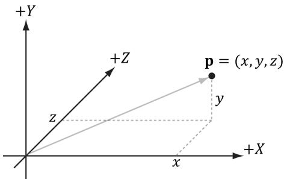


Figure 1.16. The position vector, which extends from the origin to the point, fully describes where the point is located relative to the coordinate system.


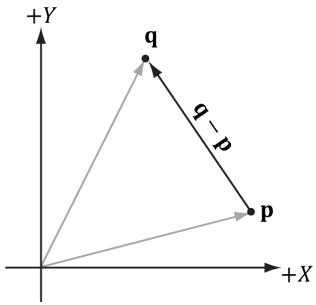


(a锛?


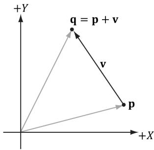


Figure 1.17. (a) The difference ${ \mathfrak { q } } - { \mathfrak { p } }$ between two points is defined as the vector from p to q. (b) A point p plus the vector v is defined to be the point q obtained by displacing p by the vector v.


vector v to be the point q obtained by displacing p by the vector v. Conveniently, because we are using vectors to represent points relative to a coordinate system, no extra work needs to be done for the point operations just discussed, as the vector algebra framework already takes care of them; see Figure 1.17. 

Note: 

Actually there is a geometric meaningful way to define a special sum of points, called an affine combination, which is like a weighted average of points. 

# 1.6 DIRECTX MATH VECTORS

For Windows 8 and above, DirectX Math is a 3D math library for Direct3D application that is part of the Windows SDK. The library uses the SSE2 (Streaming SIMD Extensions 2) instruction set. With 128-bit wide SIMD (single instruction multiple data) registers, SIMD instructions can operate on four 32-bit floats or ints with one instruction. This is very useful for vector calculations; for example, if you look at vector addition: 

$$
\mathbf {u} + \mathbf {v} = \left(u _ {x} + v _ {x}, u _ {y} + v _ {y}, u _ {z} + v _ {z}\right)
$$

we see that we just add corresponding components. By using SIMD, we can do 4D vector addition with one SIMD instruction instead of four scalar instructions. If we only required three coordinates for 3D work, we can still use SIMD, but we would just ignore the fourth coordinate; likewise, for 2D we would ignore the third and fourth coordinates. 

Our coverage of the DirectX Math library is not comprehensive, and we only cover the key parts needed for this book. For all the details, we recommend the online documentation [DirectXMath]. For readers wishing to understand how an SIMD vector library might be developed optimally, and, perhaps, to gain some insight why the DirectX Math library made some of the design decisions that it did, we recommend the article Designing Fast Cross-Platform SIMD Vector Libraries by [Oliveira2010]. 

To use the DirectX Math library, you need to #include <DirectXMath.h>, and for some additional data types #include <DirectXPackedVector.h>. There are no additional library files, as all the code is implemented inline in the header file. The DirectXMath.h code lives in the DirectX namespace, and the DirectXPackedVector.h code lives in the DirectX::PackedVector namespace. In addition, for the x86 platform you should enable SSE2 (Project Properties $>$ Configuration Properties > C/C++ > Code Generation $>$ Enable Enhanced Instruction Set), and for all platforms you should enable the fast floating point model /fp:fast (Project Properties $>$ Configuration Properties $> \mathbf { C } / \mathbf { C } \mathbf { + } \mathbf { + } > \mathbf { C o d e }$ Generation $>$ Floating Point Model). You do not need to enable SSE2 for the x64 platform because all x64 CPUs support SSE2 (http://en.wikipedia.org/wiki/ SSE2). 

# 1.6.1 Vector Types

In DirectX Math, the core vector type is XMVECTOR, which maps to SIMD hardware registers. This is a 128-bit type that can process four 32-bit floats with a single SIMD instruction. When SSE2 is available, it is defined like so for $\mathbf { x } 8 6$ and x64 platforms: 

```cpp
typedef __m128 XMVECTOR; 
```

where _ $\mathtt { m l } 2 8$ is a special SIMD type. When doing calculations, vectors must be of this type to take advantage of SIMD. As already mentioned, we still use this type for 2D and 3D vectors to take advantage of SIMD, but we just zero out the unused components and ignore them. 

XMVECTOR needs to be 16-byte aligned, and this is done automatically for local and global variables. For class data members, it is recommended to use XMFLOAT2 (2D), XMFLOAT3 (3D), and XMFLOAT4 (4D) instead; these structures are defined below: 

```cpp
struct XMFLOAT2
{
    float x;
    float y;
    XMFLOAT2() {}
    XMFLOAT2(float_x, float_y) : x(_x), y(_y) {}
    explicit XMFLOAT2(_In_reads_2) const float *pArray) :
        x(pArray[0]), y(pArray[1]) {}
    XMFLOAT2& operator = (const XMFLOAT2& Float2)
        { x = Float2.x; y = Float2.y; return *this; }
};
struct XMFLOAT3
{
    float x;
    float y;
    float z;
    XMFLOAT3()
}
XMFLOAT3(float_x, float_y, float_z) : x(_x), y(_y), z(_z) {}
    explicit XMFLOAT3(_In_reads_3) const float *pArray) :
        x(pArray[0]), y(pArray[1]), z(pArray[2])
    XMFLOAT3& operator = (const XMFLOAT3& Float3)
        { x = Float3.x; y = Float3.y; z = Float3.z; return *this; }
};
struct XMFLOAT4
{
    float x;
    float y;
    float z;
    float w;
    XMFLOAT4()
}
XMFLOAT4(float_x, float_y, float_z, float_w):
        x(_x), y(_y), z(_z), w(_w)}
    explicit XMFLOAT4(_In_reads_4) const float *pArray) :
        x(pArray[0]), y(pArray[1]), z(pArray[2]), w(pArray[3])
    XMFLOAT4& operator = (const XMFLOAT4& Float4)
        { x = Float4.x; y = Float4.y; z = Float4.z; w = Float4.w; return *this; }
}; 
```

However, if we use these types directly for calculations, then we will not take advantage of SIMD. In order to use SIMD, we need to convert instances of these types into the XMVECTOR type. This is done with the DirectX Math loading functions. Conversely, DirectX Math provides storage functions which are used to convert data from XMVECTOR into the XMFLOATn types above. 

# To summarize,

1. Use XMVECTOR for local or global variables. 

2. Use XMFLOAT2, XMFLOAT3, and XMFLOAT4 for class data members. 

3. Use loading functions to convert from XMFLOATn to XMVECTOR before doing calculations. 

4. Do calculations with XMVECTOR instances. 

5. Use storage functions to convert from XMVECTOR to XMFLOATn. 

# 1.6.2 Loading and Storage Methods

We use the following methods to load data from XMFLOATn into XMVECTOR: 

```cpp
//Loads XMFLOAT2 into XMVECTOR   
XMVECTOR XM_CALLCONV XMLoadFloat2(const XMFLOAT2 \*pSource);   
//Loads XMFLOAT3 into XMVECTOR   
XMVECTOR XM_CALLCONV XMLoadFloat3(const XMFLOAT3 \*pSource);   
//Loads XMFLOAT4 into XMVECTOR   
XMVECTOR XM_CALLCONV XMLoadFloat4(const XMFLOAT4 \*pSource); 
```

We use the following methods to store data from XMVECTOR into XMFLOATn: 

```c
//LoadsXMVECTORintoXMFLOAT2   
voidXM_CALLCONVXMStoreFloat2(XMFLOAT2\*pDestination锛孎XMVECTORV);   
//LoadsXMVECTOR into XMFLOAT3   
voidXM_CALLCONVXMStoreFloat3(XMFLOAT3\*pDestination锛孎XMVECTORV);   
//LoadsXMVECTOR into XMFLOAT4   
voidXM(CallCONVXMStoreFloat4(XMFLOAT4\*pDestination锛孎XMVECTORV); 
```

Sometimes we just want to get or set one component of an XMVECTOR; the following getter and setter functions facilitate this: 

```cpp
float XM_CALLCONV XMVectorGetX(FXMVECTOR V);   
float XM_CALLCONV XMVectorGetY(FXMVECTOR V);   
float XM_CALLCONV XMVectorGetZ(FXMVECTOR V);   
float XM_CALLCONV XMVectorGetW(FXMVECTOR V);   
XMVECTOR XM_CALLCONV XMVectorSetX(FXMVECTOR V, float x);   
XMVECTOR XM_CALLCONV XMVectorSetY(FXMVECTOR V, float y);   
XMVECTOR XM_CALLCONV XMVectorSetZ(FXMVECTOR V, float z);   
XMVECTOR XM_CALLCONV XMVectorSetW(FXMVECTOR V, float w); 
```

# 1.6.3 Parameter Passing

For efficiency purposes, XMVECTOR values can be passed as arguments to functions in SSE/SSE2 registers instead of on the stack. The number of arguments that 

can be passed this way depends on the platform (e.g., 32-bit Windows, 64-bit Windows, and Windows RT) and compiler. Therefore, to be platform/compiler independent, we use the types FXMVECTOR, GXMVECTOR, HXMVECTOR and CXMVECTOR for passing XMVECTOR parameters; these are defined to the right type based on the platform and compiler. Furthermore, the calling convention annotation XM_ CALLCONV must be specified before the function name so that the proper calling convention is used, which again depends on the compiler version. 

Now the rules for passing XMVECTOR parameters are as follows: 

1. the first three XMVECTOR parameters should be of type FXMVECTOR; 

2. the fourth XMVECTOR should be of type GXMVECTOR; 

3. the fifth and sixth XMVECTOR parameter should be of type HXMVECTOR; 

4. any additional XMVECTOR parameters should be of type CXMVECTOR. 

We illustrate how these types are defined on 32-bit Windows with a compiler that supports the __fastcall calling convention and a compiler that supports the newer __vectorcall calling convention: 

```c
// 32-bit Windows fastcall passes first 3 XMVECTOR arguments  
// via registers, the remaining on the stack.  
typedef const XMVECTOR FXMVECTOR;  
typedef const XMVECTOR& GXMVECTOR;  
typedef const XMVECTOR& HXMVECTOR;  
typedef const XMVECTOR& CXMVECTOR;  
// 32-bit Windows vectorcall passes first 6 XMVECTOR arguments  
// via registers, the remaining on the stack.  
typedef const XMVECTOR FXMVECTOR;  
typedef const XMVECTOR GXMVECTOR;  
typedef const XMVECTOR HXMVECTOR;  
typedef const XMVECTOR& CXMVECTOR; 
```

For the details on how these types are defined for the other platforms, see 鈥淐alling Conventions鈥?under 鈥淟ibrary Internals鈥?in the DirectX Math documentation [DirectXMath]. The exception to these rules is with constructor methods. [DirectXMath] recommends using FXMVECTOR for the first three XMVECTOR parameters and CXMVECTOR for the rest when writing a constructor that takes XMVECTOR parameters. Furthermore, do not use the annotation XM_CALLCONV for constructors 

Here is an example from the DirectXMath library: 

```javascript
inline XMMatrix XM_CALLCONV XMMatrixTransformation(FXMVector ScalingOrigin, FXMVector ScalingOrientationQuaternion, . FXMVector Scaling, GXMVector RotationOrigin, HXMVector RotationQuaternion, HXMVector Translation); 
```

This function takes 6 XMVECTOR parameters, but following the parameter passing rules, it uses FXMVECTOR for the first three parameters, GXMVECTOR for the fourth, and HXMVECTOR for the fifth and sixth. 

You can have non-XMVECTOR parameters between XMVECTOR parameters. The same rules apply and the XMVECTOR parameters are counted as if the non-XMVECTOR parameters were not there. For example, in the following function, the first three XMVECTOR parameters are of type FXMVECTOR as and the fourth XMVECTOR parameter is of type GXMVECTOR. 

```cpp
inline XMMatrix XM_CALLCONV XMMatrixTransformation2D(FXMVECTOR ScalingOrigin, float ScalingOrientation, FXMVECTOR Scaling, FXMVECTOR RotationOrigin, float Rotation, GXMVECTOR Translation); 
```

The rules for passing XMVECTOR parameters apply to 鈥渋nput鈥?parameters. 鈥淥utput鈥?XMVECTOR parameters (XMVECTOR& or XMVECTOR*) will not use the SSE/SSE2 registers and so will be treated like non-XMVECTOR parameters. 

# 1.6.4 Constant Vectors

Constant XMVECTOR instances should use the XMVECTORF32 type. Here are some examples from the DirectX SDK's CascadedShadowMaps11 sample: 

```cpp
static const XMVECTORF32 g_vHalfVector = {0.5f, 0.5f, 0.5f, 0.5f};  
static const XMVECTORF32 g_vZero = {0.0f, 0.0f, 0.0f, 0.0f};  
XMVECTORF32 vRightTop = {vViewFrustRightslope, vViewFrust.TopSlope, 1.0f, 1.0f};  
XMVECTORF32 vLeftBottom = {vViewFrust.LeftSlope, vViewFrust_bottomSlope, 1.0f, 1.0f}; 
```

Essentially, we use XMVECTORF32 whenever we want to use initialization syntax. 

XMVECTORF32 is a 16-byte aligned structure with a XMVECTOR conversion operator; it is defined as follows: 

```cpp
// Conversion types for constants  
declspec(align(16)) struct XMVECTORF32  
{  
union 
```

```c
{ float f[4]; XMVECTOR v; }; inline operator XMVECTOR() const { return v; } inline operator const float\*() const { return f; } #if !defined(_XM_NO_INTRINSICS_) && defined(_XM_SSE_INTRINSICS_) inline operator _m128i() const { return _mmCASTPS_si128(v); } inline operator _m128d() const { return _mmCASTps_pd(v); } #endif   
}; 
```

You can also create a constant XMVECTOR of integer data using XMVECTORU32: 

```cpp
static const XMVECTORU32 vGrabY = {0x00000000, 0xFFFFFFF, 0x00000000, 0x00000000}; 
```

# 1.6.5 Overloaded Operators

The XMVECTOR has several overloaded operators for doing vector addition, subtraction, and scalar multiplication. 

```cpp
XMVECTOR XM_CALLCONV operator+ (FXMVECTOR V);  
XMVECTOR XM_CALLCONV operator- (FXMVECTOR V);  
XMVECTOR& XM_CALLCONV operator+= (XMVECTOR& V1, FXMVECTOR V2);  
XMVECTOR& XM_CALLCONV operator-= (XMVECTOR& V1, FXMVECTOR V2);  
XMVECTOR& XM_CALLCONV operator* = (XMVECTOR& V1, FXMVECTOR V2);  
XMVECTOR& XM_CALLCONV operator/ = (XMVECTOR& V1, FXMVECTOR V2);  
XMVECTOR& operator* = (XMVECTOR& V, float S);  
XMVECTOR& operator/ = (XMVECTOR& V, float S);  
XMVECTOR XM_CALLCONV operator+ (FXMVECTOR V1, FXMVECTOR V2);  
XMVECTOR XM_CALLCONV operator- (FXMVECTOR V1, FXMVECTOR V2);  
XMVECTOR XM_CALLCONV operator* (FXMVECTOR V1, FXMVECTOR V2);  
XMVECTOR XM_CALLCONV operator/ (FXMVECTOR V1, FXMVECTOR V2);  
XMVECTOR XM_CALLCONV operator* (FXMVECTOR V, float S);  
XMVECTOR XM_CALLCONV operator* (float S, FXMVECTOR V);  
XMVECTOR XM_CALLCONV operator/ (FXMVECTOR V, float S); 
```

# 1.6.6 Miscellaneous

The DirectX Math library defined the following constants useful for approximating different expressions involving 蟺: 

```cpp
const float XM.PI = 3.141592654f;  
const float XM_2PI = 6.283185307f;  
const float XM_1DIVPI = 0.318309886f;  
const float XM_1DIV2PI = 0.159154943f; 
```

```cpp
const float XM_PIDIV2 = 1.570796327f;  
const float XM_PIDIV4 = 0.785398163f; 
```

In addition, it defines the following inline functions for converting between radians and degrees: 

```cpp
inline float XMConvertToAxes(float fDegrees)  
{ return fDegrees * (XM.PI / 180.0f); }  
inline float XMConvertToDegrees(float fAxes)  
{ return fAxes * (180.0f / XM.PI); } 
```

It also defines min/max functions: 

```cpp
template<class T> inline T XMMin(T a, T b) { return (a < b) ? a : b; }
template<class T> inline T XMMax(T a, T b) { return (a > b) ? a : b; } 
```

# 1.6.7 Setter Functions

DirectX Math provides the following functions to set the contents of an XMVECTOR: 

// Returns the zero vector 0  
XMVector XM_CALLCONV XMVectorZero();  
// Returns the vector (1, 1, 1, 1)  
XMVector XM_CALLCONV XMVectorSplatOne();  
// Returns the vector $(x, y, z, w)$ XMVector XM_CALLCONV XMVectorSet(float x, float y, float z, float w);  
// Returns the vector $(s, s, s, s)$ XMVector XM_CALLCONV XMVectorReplicate(float Value);  
// Returns the vector $(v_x, v_y, v_z, v_x)$ XMVector XM_CALLCONV XMVectorSplatX(FXMVECTOR V);  
// Returns the vector $(v_y, v_z, v_y, v_z)$ XMVector XM_CALLCONV XMVectorSplatY(FXMVECTOR V);  
// Returns the vector $(v_z, v_z, v_z, v_z)$ XMVector XM_CALLCONV XMVectorSplatZ(FXMVECTOR V); 

The following program illustrates most of these functions: 

```cpp
include <windows.h> // for XMVerifyCPUSupport  
#include <DirectXMath.h>  
#include <DirectXPackedVector.h>  
#include <iostream>  
using namespace std;  
using namespace DirectX;  
using namespace DirectX::PackedVector;  
// Overload the "<" operators so that we can use cout to  
// output XMVECTOR objects. 
```

```cpp
ostream& XM_CALLCONV operator<<(ostream& os, FXMVECTOR v) {
    XMFLOAT3 dest;
    XMStoreFloat3(&dest, v);
    os << "(" << dest.x << ", " << dest.y << ", " << dest.z << ")" );
    return os;
}
int main()
{
    cout.setfios_base::boolalpha);
    // Check support for SSE2 (Pentium4, AMD K8, and above).
    if (!XMVerifyCPUSupport())
        {
            cout << "directx math not supported" << endl;
            return 0;
        }
    XMVECTOR p = XMVectorZero();
    XMVECTOR q = XMVectorSplatOne();
    XMVECTOR u = XMVectorSet(1.0f, 2.0f, 3.0f, 0.0f);
    XMVECTOR v = XMVectorReplicate(-2.0f);
    XMVECTOR w = XMVectorSplatZ(u);
    cout << "p = " << p << endl;
    cout << "q = " << q << endl;
    cout << "u = " << u << endl;
    cout << "v = " << v << endl;
    cout << "w = " << w << endl;
    return 0;
} 
```

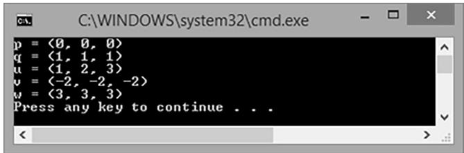


Figure 1.18. Output for the above program.


# 1.6.8 Vector Functions

DirectX Math provides the following functions to do various vector operations. We illustrate with the 3D versions, but there are analogous versions for 2D and 4D; the 2D and 4D versions have the same names as the 3D versions, with the exception of a 2 and 4 substituted for the 3, respectively. 

XMVECTOR XM_CALLCONV XMVector3Length( // Returns $||\mathbf{v}||$ FXMVECTOR V); // Input v  
XMVECTOR XM_CALLCONV XMVector3LengthSq( // Returns $||\mathbf{v}||^2$ FXMVECTOR V); // Input v  
XMVECTOR XM_CALLCONV XMVector3Dot( // Returns $\mathbf{v}_1\cdot \mathbf{v}_2$ FXMVECTOR V1, // Input $\mathbf{v}_1$ FXMVECTOR V2); // Input $\mathbf{v}_2$ XMVECTOR XM_CALLCONV XMVector3Cross( // Returns $\mathbf{v}_1\cdot \mathbf{v}_2$ FXMVECTOR V1, // Input $\mathbf{v}_1$ FXMVECTOR V2); // Input $\mathbf{v}_2$ XMVECTOR XM_CALLCONV XMVector3Normalize( // Returns $\mathbf{v}/\mathbf{v}$ FXMVECTOR V); // Input v  
XMVECTOR XM_CALLCONV  
XMVector3AngleBetweenVectors( // Returns the angle between $\mathbf{v}_1$ and $\mathbf{v}_2$ FXMVECTOR V1, // Input $\mathbf{v}_1$ FXMVECTOR V2); // Input $\mathbf{v}_2$ void XM_CALLCONV XMVector3ComponentsFromNormal(  
XMVECTOR* pParallel, // Returns $\mathrm{proj}_{\mathbf{n}}(\mathbf{v})$ XMVECTOR* pPerpendicular, // Returns $\mathrm{perp}_{\mathbf{n}}(\mathbf{v})$ FXMVECTOR V, // Input $\mathbf{v}$ FXMVECTOR Normal); // Input n  
bool XM_CALLCONV XMVector3Equal( // Returns $\mathbf{v}_1 = \mathbf{v}_2$ FXMVECTOR V1, // Input $\mathbf{v}_1$ FXMVECTOR V2); // Input $\mathbf{v}_2$ bool XM_CALLCONV XMVector3NotEqual( // Returns $\mathbf{v}_1\neq \mathbf{v}_2$ FXMVECTOR V1, // Input $\mathbf{v}_1$ FXMVECTOR V2); // Input $\mathbf{v}_2$ 

Observe that these functions return XMVECTORs even for operations that mathematically return a scalar (for example, the dot product $k = \mathbf { v } _ { 1 } \cdot \mathbf { v } _ { 2 } )$ ). The scalar result is replicated in each component of the XMVECTOR. For example, for the dot product, the returned vector would be $\left( \mathbf { v } _ { 1 } \cdot \mathbf { v } _ { 2 } , \mathbf { v } _ { 1 } \cdot \mathbf { v } _ { 2 } , \mathbf { v } _ { 1 } \cdot \mathbf { v } _ { 2 } , \mathbf { v } _ { 1 } \cdot \mathbf { v } _ { 2 } \right)$ . One reason for this is to minimize mixing of scalar and SIMD vector operations; it is more efficient to keep everything SIMD until you are done with your calculations. 

The following demo program shows how to use most of these functions, as well as some of the overloaded operators: 

```cpp
include <windows.h> // for XMVerifyCPUSupport   
#include <DirectXMath.h>   
#include <DirectXPackedVector.h>   
#include <iostream>   
using namespace std;   
using namespace DirectX;   
using namespace DirectX::PackedVector;   
// Overload the "<" operators so that we can use cout to   
// output XMVECTOR objects.   
osstream& XM_CALLCONV operator<<(osstream& os, FXMVECTOR v)   
{ XMFLOAT3 dest; XMStoreFloat3(&dest,v); os << "(" << dest.x << ", " << dest.y << ", " << dest.z << ")"); return os;   
}   
int main()   
{ cout.setfios_base::boolalpha); // Check support for SSE2 (Pentium4, AMD K8, and above). if (!XMVerifyCPUSupport()) { cout << "directx math not supported" << endl; return 0; } XMVECTOR n = XMVectorSet(1.0f, 0.0f, 0.0f, 0.0f); XMVECTOR u = XMVectorSet(1.0f, 2.0f, 3.0f, 0.0f); XMVECTOR v = XMVectorSet(-2.0f, 1.0f, -3.0f, 0.0f); XMVECTOR w = XMVectorSet(0.707f, 0.707f, 0.0f, 0.0f); // Vector addition: XMVECTOR operator + XMVECTOR a = u + v; // Vector subtraction: XMVECTOR operator - XMVECTOR b = u - v; // Scalar multiplication: XMVECTOR operator * XMVECTOR c = 10.0f*u; // ||u|| XMVECTOR L = XMVector3Length(u); // d = u / ||u|| XMVECTOR d = XMVector3Normalize(u); // s = u dot v XMVECTOR s = XMVector3Dot(u, v); 
```

```cpp
// e = u x v
XMVECTOR e = XMVector3Cross(u, v);
// Find projn(w) and perp_n(w)
XMVECTOR projW;
XMVECTOR perpW;
XMVector3ComponentsFromNormal(&projW, &perpW, w, n);
// Does projW + perpW == w?
bool equal = XMVector3Equal(projW + perpW, w) != 0;
bool notEqual = XMVector3NotEqual(projW + perpW, w) != 0;
// The angle between projW and perpW should be 90 degrees.
XMVECTOR angleVec = XMVector3AngleBetweenVectors(projW, perpW);
float angleRadians = XMVectorGetX(angleVec);
float angleDegrees = XMConvertToDegrees(angleRadians);
cout << "u = " << u << endl;
cout << "v = " << v << endl;
cout << "w = " << w << endl;
cout << "n = " << n << endl;
cout << "a = u + v = " << a << endl;
cout << "b = u - v = " << b << endl;
cout << "c = 10 * u = " << c << endl;
cout << "d = u / ||u| = " << d << endl;
cout << "e = u x v = " << e << endl;
cout << "L = ||u| = " << L << endl;
cout << "s = u.v = " << s << endl;
cout << "projW = " << projW << endl;
cout << "perpW = " << perpW << endl;
cout << "projW + perpW == w = " << equal << endl;
cout << "projW + perpW != w = " << notEqual << endl;
cout << "angle = " << angleDegrees << endl;
return 0; 
```

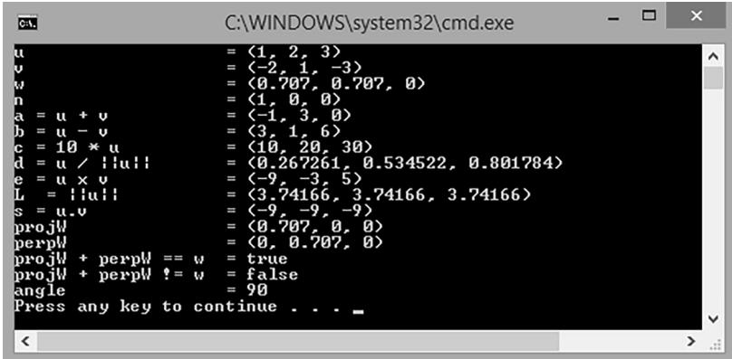


Figure 1.19. Output for the above program.


The DirectX Math library also includes some estimation methods, which are less accurate but faster to compute. If you are willing to sacrifice some accuracy for speed, then use the estimate methods. Here are two examples of estimate functions: 

```javascript
XMVECTOR XM_CALLCONV XMVector3LengthEst( // Returns estimated ||v|| FXMVECTOR V); // Input v  
XMVECTOR XM_CALLCONV XMVector3NormalizeEst( // Returns estimated v/||v|| FXMVECTOR V); // Input v 
```

# 1.6.9 Floating-Point Error

While on the subject of working with vectors on a computer, we should be aware of the following. When comparing floating-point numbers, care must be taken due to floating-point imprecision. Two floating-point numbers that we expect to be equal may differ slightly. For example, mathematically, we鈥檇 expect a normalized vector to have a length of 1, but in a computer program, the length will only be approximately 1. Moreover, mathematically, $1 ^ { p } = 1$ for any real number $\boldsymbol { p }$ , but when we only have a numerical approximation for 1, we see that the approximation raised to the pth power increases the error; thus, numerical error also accumulates. The following short program illustrates these ideas: 

```cpp
include <windows.h> // for XMVerifyCPUSupport   
#include <DirectXMath.h>   
#include <DirectXPackedVector.h>   
#include<iostream>   
using namespace std;   
using namespace DirectX;   
using namespace DirectX::PackedVector;   
int main()   
{ cout precision(8); // Check support for SSE2 (Pentium4, AMD K8, and above). if (!XMVerifyCPUSupport()) { cout << "directx math not supported" << endl; return 0; } XMVECTOR u = XMVectorSet(1.0f, 1.0f, 1.0f, 0.0f); XMVECTOR n = XMVector3Normalize(u); float LU = XMVectorGetX(XMVector3Length(n)); // Mathematically, the length should be 1. Is it numerically? cout << LU << endl; 
```

```cpp
if (LU == 1.0f)  
    cout << "Length 1" << endl;  
else  
    cout << "Length not 1" << endl;  
// Raising 1 to any power should still be 1. Is it? float powLU = powf(LU, 1.0e6f);  
cout << "LU^(10^6) = " << powLU << endl; 
```

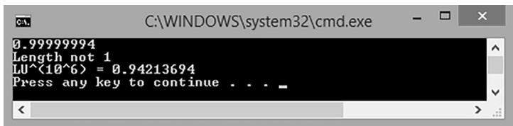


Figure 1.20. Output for the above program.


To compensate for floating-point imprecision, we test if two floating-point numbers are approximately equal. We do this by defining an Epsilon constant, which is a very small value we use as a 鈥渂uffer.鈥?We say two values are approximately equal if their distance is less than Epsilon. In other words, Epsilon gives us some tolerance for floating-point imprecision. The following function illustrates how Epsilon can be used to test if two floating-point values are equal: 

```cpp
const float Epsilon = 0.001f;   
bool Equals(float lhs, float rhs)   
{ // Is the distance between lhs and rhs less than EPSILON? return fabs(lhs - rhs) < Epsilon ? true : false;   
} 
```

The DirectX Math library provides the XMVector3NearEqual function when testing the equality of vectors with an allowed tolerance Epsilon parameter: 

```cpp
// Returns  
// abs(U.x - V.x) <= Epsilon.x &&  
// abs(U.y - V.y) <= Epsilon.y &&  
// abs(U.z - V.z) <= Epsilon.z  
XMINLINE bool XM_CALLCONV XMVector3NearEqual(FXMVECTOR U, FXMVECTOR V, FXMVECTOR Epsilon); 
```

# 1.7 SUMMARY

1. Vectors are used to model physical quantities that possess both magnitude and direction. Geometrically, we represent a vector with a directed line 

segment. A vector is in standard position when it is translated parallel to itself so that its tail coincides with the origin of the coordinate system. A vector in standard position can be described numerically by specifying the coordinates of its head relative to a coordinate system. 

2. If $\mathbf { u } = \left( u _ { x } , u _ { y } , u _ { z } \right)$ and $\mathbf { v } = \left( \nu _ { _ { x } } , \nu _ { _ { y } } , \nu _ { _ { z } } \right)$ , then we have the following vector operations: 

(a) Addition: u v + = ( ) u v + + u v u v + x x y y z z , , 

(b) Subtraction: $\mathbf { u } - \mathbf { v } = \left( u _ { x } - \nu _ { x } , u _ { y } - \nu _ { y } , u _ { z } - \nu _ { z } \right)$ 

(c) Scalar Multiplication: $k \mathbf { u } = \left( k u _ { _ x } , k u _ { _ y } , k u _ { _ z } \right)$ 

(d) Length: $\left\| \mathbf { u } \right\| = \sqrt { x ^ { 2 } + y ^ { 2 } + z ^ { 2 } }$ 

(e) Normalization: $\begin{array} { r } { \hat { \mathbf { u } } = \frac { \mathbf { u } } { \| \mathbf { u } \| } = \left( \frac { x } { \| \mathbf { u } \| } , \frac { y } { \| \mathbf { u } \| } , \frac { z } { \| \mathbf { u } \| } \right) } \end{array}$ 

(f) Dot Product: $\mathbf { u } \cdot \mathbf { v } = \left| \left| \mathbf { u } \right| \right| \left| \left| \mathbf { v } \right| \right| \cos \theta = u _ { x } \nu _ { x } + u _ { \nu } \nu _ { \nu } + u _ { z } \nu _ { z }$ 

(g) Cross Product: $\mathbf { u } \times \mathbf { v } = \left( u _ { _ { y } } \nu _ { _ { z } } - u _ { _ { z } } \nu _ { _ { y } } , u _ { _ { z } } \nu _ { _ { x } } - u _ { _ { x } } \nu _ { _ { z } } , u _ { _ { x } } \nu _ { _ { y } } - u _ { _ { y } } \nu _ { _ { x } } \right)$ 

3. We use the DirectX Math XMVECTOR type to describe vectors efficiently in code using SIMD operations. For class data members, we use the XMFLOAT2, XMFLOAT3, and XMFLOAT4 classes, and then use the loading and storage methods to convert back and forth between XMVECTOR and XMFLOATn. Constant vectors that require initialization syntax should use the XMVECTORF32 type. 

4. For efficiency purposes, XMVECTOR values can be passed as arguments to functions in SSE/SSE2 registers instead of on the stack. To do this in a platform independent way, we use the types FXMVECTOR, GXMVECTOR, HXMVECTOR and CXMVECTOR for passing XMVECTOR parameters. Then the rule for passing XMVECTOR parameters is that the first three XMVECTOR parameters should be of type FXMVECTOR; the fourth XMVECTOR should be of type GXMVECTOR; the fifth and sixth XMVECTOR parameter should be of type HXMVECTOR; and any additional XMVECTOR parameters should be of type CXMVECTOR. 

5. The XMVECTOR class overloads the arithmetic operators to do vector addition, subtraction, and scalar multiplication. Moreover, the DirectX Math library provides the following useful functions for computing the length of a vector, the squared length of a vector, computing the dot product of two vectors, computing the cross product of two vectors, and normalizing a vector: 

```cpp
XMVECTOR XM_CALLCONV XMVector3Length(FXMVECTOR V);  
XMVECTOR XM_CALLCONV XMVector3LengthSq(FXMVECTOR V);  
XMVECTOR XM_CALLCONV XMVector3Dot(FXMVECTOR V1, FXMVECTOR V2);  
XMVECTOR XM_CALLCONV XMVector3Cross(FXMVECTOR V1, FXMVECTOR V2);  
XMVECTOR XM_CALLCONV XMVector3Normalize(FXMVECTOR V); 
```

# 1.8 EXERCISES

1. Let $\mathbf { u } = \left( 1 , 2 \right)$ and $\mathbf { v } = \left( 3 , - 4 \right)$ . Perform the following computations and draw the vectors relative to a 2D coordinate system. 

(a) u v + 

(b) u v - 

(c) 2 12u v + 

(d) $- 2 \mathbf { u } + \mathbf { v }$ 

2. Let $\mathbf { u } = \left( - 1 , 3 , 2 \right)$ and $\mathbf { v } = \left( 3 , - 4 , 1 \right)$ . Perform the following computations. 

(a) $\mathbf { u } + \mathbf { v }$ 

(b) u v - 

(c) 3 2 u v + 

(d) 鈭?+ 2u v 

3. This exercise shows that vector algebra shares many of the nice properties of real numbers (this is not an exhaustive list). Assume $\mathbf { u } = \left( u _ { x } ^ { ^ { \ast } } , u _ { y } ^ { ^ { \ast } } , u _ { z } \right)$ , $\mathbf { \underline { { v } } } = \left( \nu _ { _ { x } } , \nu _ { _ { y } } , \nu _ { _ { z } } \right)$ , and $\mathbf { w } = \left( w _ { x } , w _ { y } , w _ { z } \right)$ . Also assume that $c$ and $\dot { k }$ are scalars. Prove the following vector properties. 

(a) $\mathbf { u } + \mathbf { v } = \mathbf { v } + \mathbf { u }$ (Commutative Property of Addition) 

(b) $\mathbf { u } + \left( \mathbf { v } + \mathbf { w } \right) = \left( \mathbf { u } + \mathbf { v } \right) + \mathbf { w }$ (Associative Property of Addition) 

(c) ${ \big ( } c k { \big ) } \mathbf { u } = c { \big ( } k \mathbf { u } { \big ) }$ (Associative Property of Scalar Multiplication) 

(d) $k { \big ( } \mathbf { u } + \mathbf { v } { \big ) } = k \mathbf { u } + k \mathbf { v }$ (Distributive Property 1) 

(e) $\mathbf { u } \big ( k + c \big ) = k \mathbf { u } + c \mathbf { u }$ (Distributive Property 2) 


Just use the definition of the vector operations and the properties of real numbers. For example, 

$$
\begin{array}{l} \left(c k\right) \mathbf {u} = \left(c k\right) \left(u _ {x}, u _ {y}, u _ {z}\right) \\ = \left(\left(c k\right) u _ {x}, \left(c k\right) u _ {y}, \left(c k\right) u _ {z}\right) \\ = \left(c \left(k u _ {x}\right), c \left(k u _ {y}\right), c \left(k u _ {z}\right)\right) \\ = c \left(k u _ {x}, k u _ {y}, k u _ {z}\right) \\ = c (k \mathbf {u}) \\ \end{array}
$$

4. Solve the equation $2 { \big ( } { \big ( } 1 , 2 , 3 { \big ) } - \mathbf { x } { \big ) } - { \big ( } - 2 , 0 , 4 { \big ) } = - 2 { \big ( } 1 , 2 , 3 { \big ) }$ for $\mathbf { x }$ 

5. Let $\mathbf { u } = \left( - 1 , 3 , 2 \right)$ and $\mathbf { v } = \left( 3 , - 4 , 1 \right)$ . Normalize u and v. 

6. Let $k$ be a scalar and let $\mathbf { u } = \left( u _ { x } , u _ { y } , u _ { z } \right)$ . Prove that $\left\| k \mathbf { u } \right\| = \left| k \right| \left\| \mathbf { u } \right\| .$ 

7. Is the angle between u and v orthogonal, acute, or obtuse? 

(a) $\mathbf { u } = { \left( { 1 , 1 , 1 } \right) } , \ \mathbf { v } = { \left( { 2 , 3 , 4 } \right) }$ 

(b) u = ( ) 1 1, , 0 , v = 鈭? ) 2 2 0 , , 

(c) u = 鈭? ) 1 1 1 , , 鈭?鈭?, v = ( ) 3 1, , 0 

8. Let $\mathbf { u } = \left( - 1 , 3 , 2 \right)$ and $\mathbf { v } = \left( 3 , - 4 , 1 \right)$ . Find the angle $\theta$ between u and v. 

9. Let $\mathbf { u } = \left( u _ { x } , u _ { y } , u _ { z } \right)$ , $\mathbf { v } = \left( \boldsymbol { \nu } _ { _ { x } } , \boldsymbol { \nu } _ { _ { y } } , \boldsymbol { \nu } _ { _ { z } } \right)$ , and $\mathbf { w } = \left( w _ { x } , w _ { y } , w _ { z } \right)$ . Also let $c$ and $k$ be scalars. Prove the following dot product properties. 

(a) $\mathbf { u } \cdot \mathbf { v } = \mathbf { v } \cdot \mathbf { u }$ 

(b) 

(c) 

(d) 

(e) 


Just use the definitions, for example, 

$$
\begin{array}{l} \mathbf {v} \cdot \mathbf {v} = v _ {x} v _ {x} + v _ {y} v _ {y} + v _ {z} v _ {z} \\ = \nu_ {x} ^ {2} + \nu_ {y} ^ {2} + \nu_ {z} ^ {2} \\ = \left(\sqrt {\nu_ {x} ^ {2} + \nu_ {y} ^ {2} + \nu_ {z} ^ {2}}\right) ^ {2} \\ = | | \mathbf {v} | | ^ {2} \\ \end{array}
$$

10. Use the law of cosines ( $\dot { c } = a ^ { 2 } + b ^ { 2 } - 2 a b \cos \theta$ , where $a , \ b ;$ , and $c$ are the lengths of the sides of a triangle and $\theta$ is the angle between sides $^ a$ and $^ { b }$ ) to show 

$$
u _ {x} v _ {x} + u _ {y} v _ {y} + u _ {z} v _ {z} = \left\| \mathbf {u} \right\| \left\| \mathbf {v} \right\| \cos \theta
$$


Consider Figure 1.9 and set $c ^ { 2 } = \lvert | \mathbf { u } - \mathbf { v } \rvert | , ~ a ^ { 2 } = \lvert | \mathbf { u } \rvert | ^ { 2 }$ and $b ^ { 2 } = | | \textbf { v } | | ^ { 2 }$ , and use the dot product properties from the previous exercise. 

11. Let $\mathbf { n } = \left( - 2 , 1 \right)$ . Decompose the vector $\mathbf { g } = \left( 0 , - 9 . 8 \right)$ into the sum of two orthogonal vectors, one parallel to n and the other orthogonal to n. Also, draw the vectors relative to a 2D coordinate system. 

12. Let $\mathbf { u } = \left( - 2 , 1 , 4 \right)$ and $\mathbf { v } = \left( 3 , - 4 , 1 \right)$ . Find $\mathbf { w } = \mathbf { u } \times \mathbf { v }$ , and show $\mathbf { w } \cdot \mathbf { u } = 0$ and $\mathbf { w } \cdot \mathbf { v } = 0$ . 

13. Let the following points define a triangle relative to some coordinate system: $\mathbf { A } = { \Big ( } 0 , 0 , 0 { \Big ) }$ , $\overset { \vartriangle } { \mathbf { B } } = \left( 0 , 1 , 3 \right)$ , and $\mathbf { C } = \left( 5 , 1 , 0 \right)$ . Find a vector orthogonal to this triangle. 


Find two vectors on two of the triangle鈥檚 edges and use the cross product. 

14. Prove that $\left\| \mathbf { u \times v } \right\| = \left\| \mathbf { u } \right\| \left\| \mathbf { v } \right\| \sin \theta$ . 


Start with $\| \mathbf { u } \| \| \mathbf { v } \| \sin \theta$ and use the trigonometric identity $\cos ^ { 2 } \theta + \sin ^ { 2 } \theta = 1 \Rightarrow \sin \theta = { \sqrt { 1 - \cos ^ { 2 } \theta } }$ ;  then apply Equation 1.4. 

15. Prove that $\left| \left| \mathbf { u } \times \mathbf { v } \right| \right|$ gives the area of the parallelogram spanned by u and v; see Figure 1.21. 

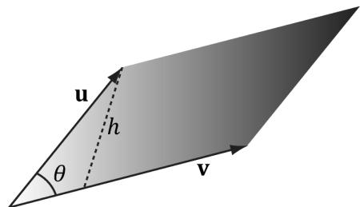


Figure 1.21. Parallelogram spanned by two 3D vectors u and v; the parallelogram has base $| | \mathbf { v } | |$ and height h.


16. Give an example of 3D vectors u, v, and w such that $\mathbf { u } \times \left( \mathbf { v } \times \mathbf { w } \right) \neq \left( \mathbf { u } \times \mathbf { v } \right) \times \mathbf { w } .$ This shows the cross product is generally not associative. 


Consider combinations of the simple vectors $\mathbf { i } = \left( 1 , 0 , 0 \right)$ , ${ \bf j } = \left( 0 , 1 , 0 \right)$ , and $\mathbf { k } = \left( 0 , 0 , 1 \right)$ . 

17. Prove that the cross product of two nonzero parallel vectors results in the null vector; that is, $\mathbf { u } \times k \mathbf { u } = 0$ . 


Just use the cross product definition. 

18. Orthonormalize the set of vectors $\left\{ \left( 1 , 0 , 0 \right) , \left( 1 , 5 , 0 \right) , \left( 2 , 1 , - 4 \right) \right\}$ using the Gram-Schmidt process. 

19. Consider the following program and output. Make a conjecture of what each XMVector* function does; then look up each function in the DirectXMath documentation. 

```cpp
include <windows.h> // for XMVerifyCPUSupport  
#include <DirectXMath.h>  
#include <DirectXPackedVector.h>  
#include <iostream>  
using namespace std;  
using namespace DirectX;  
using namespace DirectX::PackedVector;  
// Overload the "<" operators so that we can use cout to  
// output XMVECTOR objects.  
ostream& XM_CALLCONV operator<<(ostream& os, FXMVECTOR v)  
{ 
```

```cpp
XMFLOAT4 dest;   
XMStoreFloat4(&dest,v);   
os \(<  <   "(" <   <   dest.x <   <   ", " <   <   dest.y <   <   ", " <   <   dest.z <   <   ", " <   <   dest.w <   <   ")"); return os;   
}   
int main()   
{ cout.setf(ios_base::boolalpha); // Check support for SSE2 (Pentium4, AMD K8, and above). if (!XMVerifyCPUSupport()) { cout \(<  <   "directx\) math not supported" \(<  <   \) endl; return 0; }   
XMVECTOR p = XMVectorSet(2.0f, 2.0f, 1.0f, 0.0f); XMVECTOR q = XMVectorSet(2.0f, -0.5f, 0.5f, 0.1f); XMVECTOR u = XMVectorSet(1.0f, 2.0f, 4.0f, 8.0f); XMVECTOR v = XMVectorSet(-2.0f, 1.0f, -3.0f, 2.5f); XMVECTOR w = XMVectorSet(0.0f, XM_PIDIV4, XM_PIDIV2, XM.PI); cout \(<  <   "XMVectorAbs(v)\) \(= ^{\prime \prime}\ll \mathrm{XMVectorAbs}(v)\ll \mathrm{endl};\) cout \(<  <   "XMVectorCos(w)\) \(= ^{\prime \prime}\ll \mathrm{XMVectorCos}(w)\ll \mathrm{endl};\) cout \(<  <   "XMVectorLog(u)\) \(= ^{\prime \prime}\ll \mathrm{XMVectorLog}(u)\ll \mathrm{endl};\) cout \(<  <   "XMVectorExp(p)\) \(= ^{\prime \prime}\ll \mathrm{XMVectorExp}(p)\ll \mathrm{endl};\) cout \(<  <   "XMVectorPow(u,p)\) \(= ^{\prime \prime}\ll \mathrm{XMVectorPow}(u,p)\ll \mathrm{endl};\) cout \(<  <   "XMVectorSqrt(u)\) \(= ^{\prime \prime}\ll \mathrm{XMVectorSqrt}(u)\ll \mathrm{endl};\) cout \(<  <   "XMVectorSwizzle(u,2,2,1,3) = "\) . .XMVectorSwizzle(u,2,2,1,3) \(<  <   \) endl; cout \(<  <   "XMVectorSwizzle(u,2,1,0,3) = "\) . .XMVectorSwizzle(u,2,1,0,3) \(<  <   \) endl; cout \(<  <   "XMVectorMultiply(u,v)\) \(= ^{\prime \prime}\ll \mathrm{XMVectorMultiply}(u,v)\ll \mathrm{endl};\) cout \(<  <   "XMVectorSaturate(q)\) \(= ^{\prime \prime}\ll \mathrm{XMVectorSaturate}(q)\ll \mathrm{endl};\) cout \(<  <   "XMVectorMin(p,v)\) \(= ^{\prime \prime}\ll \mathrm{XMVectorMin}(p,v)\ll \mathrm{endl};\) cout \(<  <   "XMVectorMax(p,v)\) \(= ^{\prime \prime}\ll \mathrm{XMVectorMax}(p,v)\ll \mathrm{endl};\) return 0; 
```

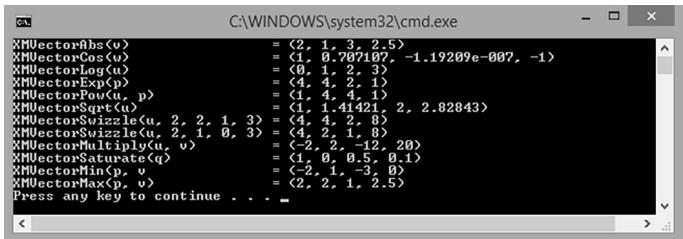


Figure 1.22. Output for the above program.

