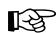
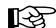
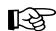
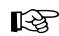
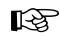
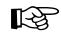
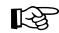
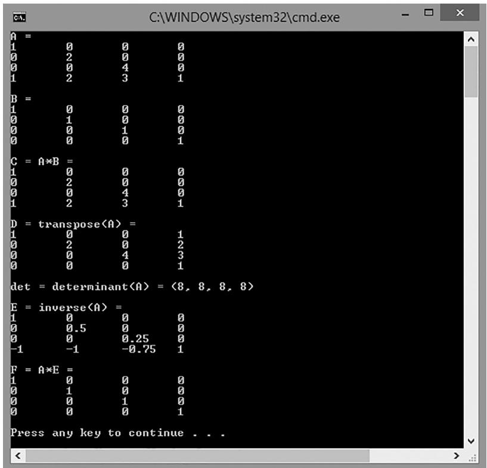
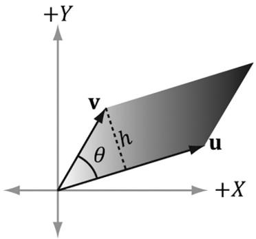

# Chapter 02 Matrix Algebra

# Chapter 2 Matrix Algebra

In 3D computer graphics, we use matrices to compactly describe geometric transformations such as scaling, rotation, and translation, and also to change the coordinates of a point or vector from one frame to another. This chapter explores the mathematics of matrices. 

# Objectives:

1. To obtain an understanding of matrices and the operations defined on them. 

2. To discover how a vector-matrix multiplication can be viewed as a linear combination. 

3. To learn what the identity matrix is, and what the transpose, determinant, and inverse of a matrix are. 

4. To become familiar with the subset of classes and functions provided by the DirectX Math library used for matrix mathematics. 

# 2.1 DEFINITION

An $m \times n$ matrix M is a rectangular array of real numbers with m rows and n columns. The product of the number of rows and columns gives the dimensions of the matrix. The numbers in a matrix are called elements or entries. We identify a matrix element by specifying the row and column of the element using a double subscript notation $M _ { i j } ,$ where the first subscript identifies the row and the second subscript identifies the column. 




# Example 2.1

Consider the following matrices: 

$$
\mathbf {A} = \left[ \begin{array}{c c c c} 3. 5 & 0 & 0 & 0 \\ 0 & 1 & 0 & 0 \\ 0 & 0 & 0. 5 & 0 \\ 2 & - 5 & \sqrt {2} & 1 \end{array} \right] \mathbf {B} = \left[ \begin{array}{c c} B _ {1 1} & B _ {1 2} \\ B _ {2 1} & B _ {2 2} \\ B _ {3 1} & B _ {3 2} \end{array} \right] \mathbf {u} = \left[ u _ {1}, u _ {2}, u _ {3} \right] \mathbf {v} = \left[ \begin{array}{l} 1 \\ 2 \\ \sqrt {3} \\ \pi \end{array} \right]
$$

1. The matrix A is a $4 \times 4$ matrix; the matrix B is a $3 \times 2$ matrix; the matrix u is a $1 \times 3$ matrix; and the matrix $\mathbf { v }$ is a $4 \times 1$ matrix. 

2. We identify the element in the fourth row and second column of the matrix A by ${ \cal A } _ { 4 2 } = - 5$ . We identify the element in the second row and first column of the matrix B by $B _ { 2 1 }$ . 

3. The matrices u and v are special matrices in the sense that they contain a single row or column, respectively. We sometimes call these kinds of matrices row vectors or column vectors because they are used to represent a vector in matrix form (e.g., we can freely interchange the vector notations $( x , y , z )$ and $[ x , y , z ] ,$ ). Observe that for row and column vectors, it is unnecessary to use a double subscript to denote the elements of the matrix鈥攚e only need one subscript. 

Occasionally we like to think of the rows of a matrix as vectors. For example, we might write: 

$$
\left[\begin{array}{c c c}A _ {1 1}&A _ {1 2}&A _ {1 3}\\A _ {2 1}&A _ {2 2}&A _ {2 3}\\A _ {3 1}&A _ {3 2}&A _ {3 3}\end{array}\right] = \left[\begin{array}{c}\leftarrow \mathbf {A} _ {1, *} \rightarrow\\\leftarrow \mathbf {A} _ {2, *} \rightarrow\\\leftarrow \mathbf {A} _ {3, *} \rightarrow\end{array}\right]
$$

where $\mathbf { A } _ { 1 , * } = \left[ A _ { 1 1 } , A _ { 1 2 } , A _ { 1 3 } \right]$ , $A _ { 2 , * } = \left[ A _ { 2 1 } , A _ { 2 2 } , A _ { 2 3 } \right]$ , and $\mathbf { A } _ { 3 , * } = \left[ A _ { 3 1 } , A _ { 3 2 } , A _ { 3 3 } \right]$ . In this notation, the first index specifies the row, and we put a $\bullet _ { \star } \bullet$ in the second 

index to indicate that we are referring to the entire row vector. Likewise, we like to do the same thing for the columns: 

$$
\left[ \begin{array}{l l l} A _ {1 1} & A _ {1 2} & A _ {1 3} \\ A _ {2 1} & A _ {2 2} & A _ {2 3} \\ A _ {3 1} & A _ {3 2} & A _ {3 3} \end{array} \right] = \left[ \begin{array}{c c c} \uparrow & \uparrow & \uparrow \\ \mathbf {A} _ {\star , 1} & \mathbf {A} _ {\star , 2} & \mathbf {A} _ {\star , 3} \\ \downarrow & \downarrow & \downarrow \end{array} \right]
$$

where 

$$
\mathbf {A} _ {\star , 1} = \left[ \begin{array}{l} A _ {1 1} \\ A _ {2 1} \\ A _ {3 1} \end{array} \right], \quad \mathbf {A} _ {\star , 2} = \left[ \begin{array}{l} A _ {1 2} \\ A _ {2 2} \\ A _ {3 2} \end{array} \right], \quad \mathbf {A} _ {\star , 3} = \left[ \begin{array}{l} A _ {1 3} \\ A _ {2 3} \\ A _ {3 3} \end{array} \right]
$$

In this notation, the second index specifies the column, and we put a 鈥?鈥?in the first index to indicate that we are referring to the entire column vector. 

We now define equality, addition, scalar multiplication, and subtraction on matrices. 

1. Two matrices are equal if and only if their corresponding elements are equal; as such, two matrices must have the same number of rows and columns in order to be compared. 

2. We add two matrices by adding their corresponding elements; as such, it only makes sense to add matrices that have the same number of rows and columns. 

3. We multiply a scalar and a matrix by multiplying the scalar with every element in the matrix. 

4. We define subtraction in terms of matrix addition and scalar multiplication. That is, $\mathbf { A } - \mathbf { B } = \mathbf { A } + ( - 1 { \cdot } \mathbf { B } ) = \mathbf { A } + ( - \mathbf { B } )$ . 




# Example 2.2

Let 

$$
\mathbf {A} = \left[ \begin{array}{l l} 1 & 5 \\ - 2 & 3 \end{array} \right], \mathbf {B} = \left[ \begin{array}{l l} 6 & 2 \\ 5 & - 8 \end{array} \right], \mathbf {C} = \left[ \begin{array}{l l} 1 & 5 \\ - 2 & 3 \end{array} \right], \mathbf {D} = \left[ \begin{array}{l l l} 2 & 1 & - 3 \\ - 6 & 3 & 0 \end{array} \right]
$$

Then, 

$$
\mathbf {A} + \mathbf {B} = \left[ \begin{array}{l l} 1 & 5 \\ - 2 & 3 \end{array} \right] + \left[ \begin{array}{l l} 6 & 2 \\ 5 & - 8 \end{array} \right] = \left[ \begin{array}{l l} 1 + 6 & 5 + 2 \\ - 2 + 5 & 3 + (- 8) \end{array} \right] = \left[ \begin{array}{l l} 7 & 7 \\ 3 & - 5 \end{array} \right] \tag {i}
$$

(ii) A C= 

(iii) $3 \mathbf { D } = 3 { \left[ \begin{array} { l l l } { 2 } & { 1 } & { - 3 } \\ { - 6 } & { 3 } & { 0 } \end{array} \right] } = { \left[ \begin{array} { l l l } { 3 { \left( 2 \right) } } & { 3 { \left( 1 \right) } } & { 3 { \left( - 3 \right) } } \\ { 3 { \left( - 6 \right) } } & { 3 { \left( 3 \right) } } & { 3 { \left( 0 \right) } } \end{array} \right] } = { \left[ \begin{array} { l l l } { 6 } & { 3 } & { - 9 } \\ { - 1 8 } & { 9 } & { 0 } \end{array} \right] }$ 

(iv) $\mathbf { A } - \mathbf { B } = { \left[ \begin{array} { l l } { 1 } & { 5 } \\ { - 2 } & { 3 } \end{array} \right] } - { \left[ \begin{array} { l l } { 6 } & { 2 } \\ { 5 } & { - 8 } \end{array} \right] } = { \left[ \begin{array} { l l } { 1 - 6 } & { 5 - 2 } \\ { - 2 - 5 } & { 3 - \left( - 8 \right) } \end{array} \right] } = { \left[ \begin{array} { l l } { - 5 } & { 3 } \\ { - 7 } & { 1 1 } \end{array} \right] }$ 

Because addition and scalar multiplication is done element-wise, matrices essentially inherit the following addition and scalar multiplication properties from real numbers: 

1. $\mathbf { A } + \mathbf { B } = \mathbf { B } + \mathbf { A }$ 

Commutative law of addition 

2. $( \mathbf { A } + \mathbf { B } ) + \mathbf { C } = \mathbf { A } + ( \mathbf { B } + \mathbf { C } )$ 

Associative law of addition 

3. $r ( \mathbf { A } + \mathbf { B } ) = r \mathbf { A } + r \mathbf { B }$ 

Scalar distribution over matrices 

4. $( r + s ) \mathbf { A } = r \mathbf { A } + s \mathbf { A }$ 

Matrix distribution over scalars 

# 2.2 MATRIX MULTIPLICATION

# 2.2.1 Definition

If A is a $m \times n$ matrix and B is a $n \times p$ matrix, then the product AB is defined and is a $m \times p$ matrix C, where the ijth entry of the product C is given by taking the dot product of the ith row vector in A with the jth column vector in B, that is, 

$$
C _ {i j} = \mathbf {A} _ {i, *} \cdot \mathbf {B} _ {* , j} \tag {eq.2.1}
$$

So note that in order for the matrix product AB to be defined, we require that the number of columns in A equal the number of rows in B, which is to say, we require that the dimension of the row vectors in A equal the dimension of the column vectors in B. If these dimensions did not match, then the dot product in Equation 2.1 would not make sense. 

# 鈽?Example 2.3

Let 

$$
\mathbf {A} = \left[ \begin{array}{c c} 1 & 5 \\ - 2 & 3 \end{array} \right] \text {a n d} \mathbf {B} = \left[ \begin{array}{c c} 2 & - 6 \\ 1 & 3 \\ - 3 & 0 \end{array} \right]
$$

The product AB is not defined since the row vectors in A have dimension 2 and the column vectors in B have dimension 3. In particular, we cannot take the dot product of the first row vector in A with the first column vector in B because we cannot take the dot product of a 2D vector with a 3D vector. 




# Example 2.4

Let 

$$
\mathbf {A} = \left[ \begin{array}{c c c} - 1 & 5 & - 4 \\ 3 & 2 & 1 \end{array} \right] \text {a n d} \mathbf {B} = \left[ \begin{array}{c c c} 2 & 1 & 0 \\ 0 & - 2 & 1 \\ - 1 & 2 & 3 \end{array} \right]
$$

We first point out that the product AB is defined (and is a $2 \times 3$ matrix) because the number of columns of A equals the number of rows of B. Applying Equation 2.1 yields: 

$$
\begin{array}{l} \mathbf {A B} = \left[ \begin{array}{c c c} - 1 & 5 & - 4 \\ 3 & 2 & 1 \end{array} \right] \left[ \begin{array}{c c c} 2 & 1 & 0 \\ 0 & - 2 & 1 \\ - 1 & 2 & 3 \end{array} \right] \\ = \left[ \begin{array}{c c c} (- 1, 5, - 4) \cdot (2, 0, - 1) & (- 1, 5, - 4) \cdot (1, - 2, 2) & (- 1, 5, - 4) \cdot (0, 1, 3) \\ (3, 2, 1) \cdot (2, 0, - 1) & (3, 2, 1) \cdot (1, - 2, 2) & (3, 2, 1) \cdot (0, 1, 3) \end{array} \right] \\ = \left[ \begin{array}{c c c} 2 & - 1 9 & - 7 \\ 5 & 1 & 5 \end{array} \right] \\ \end{array}
$$

Observe that the product BA is not defined because the number of columns in B does not equal the number of rows in A. This demonstrates that, in general, matrix multiplication is not commutative; that is, $\mathbf { A B } \neq \mathbf { B A }$ . 

# 2.2.2 Vector-Matrix Multiplication

Consider the following vector-matrix multiplication: 

$$
\mathbf {u} \mathbf {A} = \left[ x, y, z \right] \left[ \begin{array}{l l l} A _ {1 1} & A _ {1 2} & A _ {1 3} \\ A _ {2 1} & A _ {2 2} & A _ {2 3} \\ A _ {3 1} & A _ {3 2} & A _ {3 3} \end{array} \right] = \left[ x, y, z \right] \left[ \begin{array}{l l l} \uparrow & \uparrow & \uparrow \\ \mathbf {A} _ {\star , 1} & \mathbf {A} _ {\star , 2} & \mathbf {A} _ {\star , 3} \\ \downarrow & \downarrow & \downarrow \end{array} \right]
$$

Observe that uA evaluates to a $1 \times 3$ row vector in this case. Now, applying Equation 2.1 gives: 

$$
\begin{array}{l} \mathbf {u} \mathbf {A} = \left[ \begin{array}{l l l} \mathbf {u} \cdot \mathbf {A} _ {*, 1} & \mathbf {u} \cdot \mathbf {A} _ {*, 2} & \mathbf {u} \cdot \mathbf {A} _ {*, 3} \end{array} \right] \\ = \left[ x A _ {1 1} + y A _ {2 1} + z A _ {3 1}, \quad x A _ {1 2} + y A _ {2 2} + z A _ {3 2}, \quad x A _ {1 3} + y A _ {2 3} + z A _ {3 3} \right] \\ = \left[ x A _ {1 1}, x A _ {1 2}, x A _ {1 3} \right] + \left[ y A _ {2 1}, y A _ {2 2}, y A _ {2 3} \right] + \left[ z A _ {3 1}, z A _ {3 2}, z A _ {3 3} \right] \\ = x \left[ A _ {1 1}, A _ {1 2}, A _ {1 3} \right] + y \left[ A _ {2 1}, A _ {2 2}, A _ {2 3} \right] + z \left[ A _ {3 1}, A _ {3 2}, A _ {3 3} \right] \\ = x \mathbf {A} _ {1, *} + y \mathbf {A} _ {2, *} + z \mathbf {A} _ {3, *} \\ \end{array}
$$

Thus, 

$$
\mathbf {u} \mathbf {A} = x \mathbf {A} _ {1, *} + y \mathbf {A} _ {2, *} + z \mathbf {A} _ {3, *} \tag {eq.2.2}
$$

Equation 2.2 is an example of a linear combination, and it says that the vectormatrix product uA is equivalent to a linear combination of the row vectors of the matrix A with scalar coefficients $x , y ,$ and $z$ given by the vector u. Note that, although we showed this for a $1 \times 3$ row vector and a $3 \times 3$ matrix, the result is true in general. That is, for a $1 \times n$ row vector u and a $n \times m$ matrix A, we have that uA is a linear combination of the row vectors in A with scalar coefficients given by u: 

$$
\left[ u _ {1}, \dots , u _ {n} \right] \left[ \begin{array}{c c c} A _ {1 1} & \dots & A _ {1 m} \\ \vdots & \ddots & \vdots \\ A _ {n 1} & \dots & A _ {n m} \end{array} \right] = u _ {1} \mathbf {A} _ {1, *} + \dots + u _ {n} \mathbf {A} _ {n, *} \tag {eq.2.3}
$$

# 2.2.3 Associativity

Matrix multiplication has some nice algebraic properties. For example, matrix multiplication distributes over addition: $\mathbf { A } ( \mathbf { B } + \mathbf { C } ) = \mathbf { A B } + \mathbf { A C }$ and $( \mathbf { A } + \mathbf { B } ) \mathbf { C } = \mathbf { A } \mathbf { C } + \mathbf { B } \mathbf { C }$ . In particular, however, we will use the associative law of matrix multiplication from time to time, which allows us to choose the order we multiply matrices: 

$$
(\mathbf {A B}) \mathbf {C} = \mathbf {A} (\mathbf {B C})
$$

# 2.3 THE TRANSPOSE OF A MATRIX

The transpose of a matrix is found by interchanging the rows and columns of the matrix. Thus the transpose of an $m \times n$ matrix is an $n \times m$ matrix. We denote the transpose of a matrix M as ${ \bf M } ^ { T }$ . 


# Example 2.5

Find the transpose for the following three matrices: 

$$
\mathbf {A} = \left[ \begin{array}{c c c} 2 & - 1 & 8 \\ 3 & 6 & - 4 \end{array} \right], \mathbf {B} = \left[ \begin{array}{c c c} a & b & c \\ d & e & f \\ g & h & i \end{array} \right], \mathbf {C} = \left[ \begin{array}{c} 1 \\ 2 \\ 3 \\ 4 \end{array} \right]
$$

To reiterate, the transposes are found by interchanging the rows and columns, thus 

$$
\mathbf {A} ^ {T} = \left[ \begin{array}{l l} 2 & 3 \\ - 1 & 6 \\ 8 & - 4 \end{array} \right], \mathbf {B} ^ {T} = \left[ \begin{array}{l l l} a & d & g \\ b & e & h \\ c & f & i \end{array} \right], \mathbf {C} ^ {T} = \left[ \begin{array}{l l l l} 1 & 2 & 3 & 4 \end{array} \right]
$$

The transpose has the following useful properties: 

1. $( \mathbf { A } + \mathbf { B } ) ^ { T } = \mathbf { A } ^ { T } + \mathbf { B } ^ { T }$ 

2. $( c \mathbf { A } ) ^ { T } = c \mathbf { A } ^ { T }$ 

3. $( \mathbf { A } \mathbf { B } ) ^ { T } = \mathbf { B } ^ { T } \mathbf { A } ^ { T }$ 

4. $( \mathbf { A } ^ { T } ) ^ { T } = \mathbf { A }$ 

5. $( \mathbf { A } ^ { - 1 } ) ^ { T } = ( \mathbf { A } ^ { T } ) ^ { - 1 }$ 

# 2.4 THE IDENTITY MATRIX

There is a special matrix called the identity matrix. The identity matrix is a square matrix that has zeros for all elements except along the main diagonal; the elements along the main diagonal are all ones. 

For example, below are $2 \times 2$ , $3 \times 3$ , and $4 \times 4$ identity matrices. 

$$
\left[ \begin{array}{c c} 1 & 0 \\ 0 & 1 \end{array} \right], \left[ \begin{array}{c c c} 1 & 0 & 0 \\ 0 & 1 & 0 \\ 0 & 0 & 1 \end{array} \right], \left[ \begin{array}{c c c c} 1 & 0 & 0 & 0 \\ 0 & 1 & 0 & 0 \\ 0 & 0 & 1 & 0 \\ 0 & 0 & 0 & 1 \end{array} \right]
$$

The identity matrix acts as a multiplicative identity; that is, if A is an $m \times n$ matrix, B is an $n \times p$ matrix, and I is the $n \times n$ identity matrix, then 

::: v-pre

$$
\\mathbf {A I} = \\mathbf {A} \\text { a n d } \\mathbf {I B} = \\mathbf {B}
$$

:::
$$

In other words, multiplying a matrix by the identity matrix does not change the matrix. The identity matrix can be thought of as the number 1 for matrices. In particular, if M is a square matrix, then multiplication with the identity matrix is commutative: 

$$
\mathbf {M} \mathbf {I} = \mathbf {I} \mathbf {M} = \mathbf {M}
$$




# Example 2.6

Let $\mathbf { M } = { \left[ \begin{array} { l l } { 1 } & { 2 } \\ { 0 } & { 4 } \end{array} \right] }$ and let $\mathbf { I } = { \left[ \begin{array} { l l } { 1 } & { 0 } \\ { 0 } & { 1 } \end{array} \right] } .$ 铮? 铮? Verify that $\mathbf { M I } = \mathbf { I M } = \mathbf { M }$ 

Applying Equation 2.1 yields: 

$$
\mathbf {M I} = \left[ \begin{array}{l l} 1 & 2 \\ 0 & 4 \end{array} \right] \left[ \begin{array}{l l} 1 & 0 \\ 0 & 1 \end{array} \right] = \left[ \begin{array}{l l} (1, 2) \cdot (1, 0) & (1, 2) \cdot (0, 1) \\ (0, 4) \cdot (1, 0) & (0, 4) \cdot (0, 1) \end{array} \right] = \left[ \begin{array}{l l} 1 & 2 \\ 0 & 4 \end{array} \right]
$$

and 

$$
\mathbf {I M} = \left[ \begin{array}{l l} 1 & 0 \\ 0 & 1 \end{array} \right] \left[ \begin{array}{l l} 1 & 2 \\ 0 & 4 \end{array} \right] = \left[ \begin{array}{l l} (1, 0) \cdot (1, 0) & (1, 0) \cdot (2, 4) \\ (0, 1) \cdot (1, 0) & (0, 1) \cdot (2, 4) \end{array} \right] = \left[ \begin{array}{l l} 1 & 2 \\ 0 & 4 \end{array} \right]
$$

Thus it is true that $\mathbf { M } \mathbf { I } = \mathbf { I } \mathbf { M } = \mathbf { M }$ . 




# Example 2.7

$\mathbf { u } = \left[ - 1 , 2 \right]$ and let $\mathbf { I } = { \left[ \begin{array} { l l } { 1 } & { 0 } \\ { 0 } & { 1 } \end{array} \right] } .$ . Verify that $\mathbf { u } \mathbf { I } = \mathbf { u }$ 

Applying Equation 2.1 yields: 

$$
\mathbf {u} \mathbf {I} = \left[ \begin{array}{l l} - 1, & 2 \end{array} \right] \left[ \begin{array}{l l} 1 & 0 \\ 0 & 1 \end{array} \right] = \left[ \left(- 1, 2\right) \cdot (1, 0), \quad (- 1, 2) \cdot (0, 1) \right] = \left[ \begin{array}{l l} - 1, & 2 \end{array} \right]
$$

Note that we cannot take the product Iu because the matrix multiplication is not defined. 

# 2.5 THE DETERMINANT OF A MATRIX

The determinant is a special function which inputs a square matrix and outputs a real number. The determinant of a square matrix A is commonly denoted by det聽 A. It can be shown that the determinant has a geometric interpretation related to volumes of boxes and that the determinant provides information on how volumes change under linear transformations. In addition, determinants are 

used to solve systems of linear equations using Cramer鈥檚 Rule. However, for our purposes, we are mainly motivated to study the determinant because it gives us an explicit formula for finding the inverse of a matrix (the topic of $\ S 2 . 7 \AA$ ). In addition, it can be proved that: A square matrix A is invertible if and only if det $\mathbf A \neq 0$ . This fact is useful because it gives us a computational tool for determining if a matrix is invertible. Before we can define the determinant, we first introduce the concept of matrix minors. 

# 2.5.1 Matrix Minors

Given an $n \times n$ matrix A, the minor matrix $\overline { { \mathbf { A } } } _ { i j }$ is the $\left( n - 1 \right) \times \left( n - 1 \right)$ matrix found by deleting the ith row and jth column of A. 

# 鈽?Example 2.8

Find the minor matrices $\overline { { \mathbf { A } } } _ { 1 1 }$ , $\overline { { \mathbf { A } } } _ { 2 2 }$ , and $\overline { { \mathbf { A } } } _ { 1 3 }$ of the following matrix: 

$$
\mathbf {A} = \left[ \begin{array}{c c c} A _ {1 1} & A _ {1 2} & A _ {1 3} \\ A _ {2 1} & A _ {2 2} & A _ {2 3} \\ A _ {3 1} & A _ {3 2} & A _ {3 3} \end{array} \right]
$$

For $\overline { { \mathbf { A } } } _ { 1 1 }$ we eliminate the first row and first column to obtain: 

$$
\overline {{\mathbf {A}}} _ {1 1} = \left[ \begin{array}{c c} A _ {2 2} & A _ {2 3} \\ A _ {3 2} & A _ {3 3} \end{array} \right]
$$

For $\overline { { \mathbf { A } } } _ { 2 2 }$ we eliminate the second row and second column to obtain: 

$$
\overline {{\mathbf {A}}} _ {2 2} = \left[ \begin{array}{c c} A _ {1 1} & A _ {1 3} \\ A _ {3 1} & A _ {3 3} \end{array} \right]
$$

For $\overline { { \mathbf { A } } } _ { 1 3 }$ we eliminate the first row and third column to obtain: 

$$
\overline {{\mathbf {A}}} _ {1 3} = \left[ \begin{array}{c c} A _ {2 1} & A _ {2 2} \\ A _ {3 1} & A _ {3 2} \end{array} \right]
$$

# 2.5.2 Definition

The determinant of a matrix is defined recursively; for instance, the determinant of a $4 \times 4$ matrix is defined in terms of the determinant of a $3 \times 3$ matrix, and the determinant of a $3 \times 3$ matrix is defined in terms of the determinant of a $2 \times 2$ matrix, and the determinant of a $2 \times 2$ matrix is defined in terms of the 

determinant of a $1 \times 1$ matrix (the determinant of a $1 \times 1$ matrix $\mathbf { A } = \left[ A _ { 1 1 } \right]$ is trivially defined to be det $\left[ A _ { 1 1 } \right] = A _ { 1 1 } ,$ ). 

Let A be an $n \times n$ matrix. Then for $n > 1$ we define: 

$$
\det  \mathbf {A} = \sum_ {j = 1} ^ {n} A _ {1 j} (- 1) ^ {1 + j} \det  \bar {\mathbf {A}} _ {1 j} \tag {eq.2.4}
$$

Recalling the definition of the minor matrix $\overline { { \mathbf { A } } } _ { i j }$ , for $2 \times 2$ matrices, this gives the formula: 

$$
\det  \left[ \begin{array}{l l} A _ {1 1} & A _ {1 2} \\ A _ {2 1} & A _ {2 2} \end{array} \right] = A _ {1 1} \det  \left[ \begin{array}{l} A _ {2 2} \end{array} \right] - A _ {1 2} \det  \left[ \begin{array}{l} A _ {2 1} \end{array} \right] = A _ {1 1} A _ {2 2} - A _ {1 2} A _ {2 1}
$$

For $3 \times 3$ matrices, this gives the formula: 

$$
\begin{array}{l} \det  \left[ \begin{array}{c c c} A _ {1 1} & A _ {1 2} & A _ {1 3} \\ A _ {2 1} & A _ {2 2} & A _ {2 3} \\ A _ {3 1} & A _ {3 2} & A _ {3 3} \end{array} \right] \\ = A _ {1 1} \det  \left[ \begin{array}{l l} A _ {2 2} & A _ {2 3} \\ A _ {3 2} & A _ {3 3} \end{array} \right] - A _ {1 2} \det  \left[ \begin{array}{l l} A _ {2 1} & A _ {2 3} \\ A _ {3 1} & A _ {3 3} \end{array} \right] + A _ {1 3} \det  \left[ \begin{array}{l l} A _ {2 1} & A _ {2 2} \\ A _ {3 1} & A _ {3 2} \end{array} \right] \\ \end{array}
$$

And for $4 \times 4$ matrices, this gives the formula: 

$$
\begin{array}{l} \det  \left[ \begin{array}{l l l l} A _ {1 1} & A _ {1 2} & A _ {1 3} & A _ {1 4} \\ A _ {2 1} & A _ {2 2} & A _ {2 3} & A _ {2 4} \\ A _ {3 1} & A _ {3 2} & A _ {3 3} & A _ {3 4} \\ A _ {4 1} & A _ {4 2} & A _ {4 3} & A _ {4 4} \end{array} \right] = A _ {1 1} \det  \left[ \begin{array}{l l l} A _ {2 2} & A _ {2 3} & A _ {2 4} \\ A _ {3 2} & A _ {3 3} & A _ {3 4} \\ A _ {4 2} & A _ {4 3} & A _ {4 4} \end{array} \right] - A _ {1 2} \det  \left[ \begin{array}{l l l} A _ {2 1} & A _ {2 3} & A _ {2 4} \\ A _ {3 1} & A _ {3 3} & A _ {3 4} \\ A _ {4 1} & A _ {4 3} & A _ {4 4} \end{array} \right] \\ + A _ {1 3} \det  \left[ \begin{array}{l l l} A _ {2 1} & A _ {2 2} & A _ {2 4} \\ A _ {3 1} & A _ {3 2} & A _ {3 4} \\ A _ {4 1} & A _ {4 2} & A _ {4 4} \end{array} \right] - A _ {1 4} \det  \left[ \begin{array}{l l l} A _ {2 1} & A _ {2 2} & A _ {2 3} \\ A _ {3 1} & A _ {3 2} & A _ {3 3} \\ A _ {4 1} & A _ {4 2} & A _ {4 3} \end{array} \right] \\ \end{array}
$$

In 3D graphics, we primarily work with $4 \times 4$ matrices, and so we do not need to continue generating explicit formulas for $n > 4$ . 




# Example 2.9

Find the determinant of the matrix 

$$
\mathbf {A} = \left[ \begin{array}{c c c} 2 & - 5 & 3 \\ 1 & 3 & 4 \\ - 2 & 3 & 7 \end{array} \right]
$$

We have that: 

$$
\det  \mathbf {A} = A _ {1 1} \det  \left[ \begin{array}{l l} A _ {2 2} & A _ {2 3} \\ A _ {3 2} & A _ {3 3} \end{array} \right] - A _ {1 2} \det  \left[ \begin{array}{l l} A _ {2 1} & A _ {2 3} \\ A _ {3 1} & A _ {3 3} \end{array} \right] + A _ {1 3} \det  \left[ \begin{array}{l l} A _ {2 1} & A _ {2 2} \\ A _ {3 1} & A _ {3 2} \end{array} \right]
$$

$$
\begin{array}{l} \det  \mathbf {A} = 2 \det  \left[ \begin{array}{l l} 3 & 4 \\ 3 & 7 \end{array} \right] - (- 5) \det  \left[ \begin{array}{l l} 1 & 4 \\ - 2 & 7 \end{array} \right] + 3 \det  \left[ \begin{array}{l l} 1 & 3 \\ - 2 & 3 \end{array} \right] \\ = 2 (3 \cdot 7 - 4 \cdot 3) + 5 (1 \cdot 7 - 4 \cdot (- 2)) + 3 (1 \cdot 3 - 3 \cdot (- 2)) \\ = 2 (9) + 5 (1 5) + 3 (9) \\ = 1 8 + 7 5 + 2 7 \\ = 1 2 0 \\ \end{array}
$$

# 2.6 THE ADJOINT OF A MATRIX

Let A be an $n \times n$ matrix. The product $C _ { i j } = \left( - 1 \right) ^ { i + j } \operatorname* { d e t } { \overline { { \mathbf { A } } } _ { i j } }$ $\mathbf { \bar { A } } _ { i j }$ is called the cofactor of $A _ { i j }$ . If we compute $C _ { i j }$ and place it in the ijth position of a corresponding matrix $\mathbf { C _ { A } }$ for every element in A, we obtain the cofactor matrix of A: 

$$
\mathbf {C} _ {\mathbf {A}} = \left[ \begin{array}{c c c c} C _ {1 1} & C _ {1 2} & \dots & C _ {1 n} \\ C _ {2 1} & C _ {2 2} & \dots & C _ {2 n} \\ \vdots & \vdots & \ddots & \vdots \\ C _ {n 1} & C _ {n 2} & \dots & C _ {n n} \end{array} \right]
$$

If we take the transpose of $\mathbf { C _ { A } }$ we get a matrix that is called adjoint of A, which we denote by 

$$
\mathbf {A} ^ {*} = \mathbf {C} _ {\mathbf {A}} ^ {T} \tag {eq.2.5}
$$

In the next section, we learn that the adjoint enables us to find an explicit formula for computing matrix inverses. 

# 2.7 THE INVERSE OF A MATRIX

Matrix algebra does not define a division operation, but it does define a multiplicative inverse operation. The following list summarizes the important information about inverses: 

1. Only square matrices have inverses; therefore, when we speak of matrix inverses, we assume we are dealing with a square matrix. 

2. The inverse of an $n \times n$ matrix M is an $n \times n$ matrix denoted by ${ { \bf { M } } ^ { - 1 } }$ . 

3. Not every square matrix has an inverse. A matrix that does have an inverse is said to be invertible, and a matrix that does not have an inverse is said to be singular. 

4. The inverse is unique when it exists. 

5. Multiplying a matrix with its inverse results in the identity matrix: $\mathbf { M } \mathbf { M } ^ { - 1 } = \mathbf { M } ^ { - 1 } \mathbf { M } = \mathbf { I } .$ Note that multiplying a matrix with its own inverse is a case when matrix multiplication is commutative. 

Matrix inverses are useful when solving for other matrices in a matrix equation. For example, suppose that we are given the matrix equation $\mathbf { p ^ { \prime } } = \mathbf { p } \mathbf { M }$ . Further suppose that we are given $\boldsymbol { \mathsf { p ^ { \prime } } }$ and M, and want to solve for p. Assuming that M is invertible (i.e., $\mathbf { M } ^ { - 1 }$ exists), we can solve for $\mathbf { p }$ like so: 

$$
\mathbf {p} ^ {\prime} = \mathbf {p M}
$$

${ { \bf { M } } ^ { - 1 } }$ 

$\mathbf { M } \mathbf { M } ^ { - 1 } = \mathbf { I }$ 

$\mathbf { p I } = \mathbf { p }$ 

A formula for finding inverses, which we do not prove here but should be proved in any college level linear algebra text, can be given in terms of the adjoint and determinant: 

$$
\mathbf {A} ^ {- 1} = \frac {\mathbf {A} ^ {*}}{\det \mathbf {A}} \tag {eq.2.6}
$$




# Example 2.10

Find a general formula for the inverse of a 2x2 matrix $\begin{array} { r } { \mathbf { A } = \left[ \begin{array} { l l } { A _ { 1 1 } } & { A _ { 1 2 } } \\ { A _ { 2 1 } } & { A _ { 2 2 } } \end{array} \right] , } \end{array}$ and use A21 this formula to find the inverse of the matrix $\mathbf { M } = { \left[ \begin{array} { l l } { 3 } & { 0 } \\ { - 1 } & { 2 } \end{array} \right] } .$ 

We have that 

$$
\det  \mathbf {A} = A _ {1 1} A _ {2 2} - A _ {1 2} A _ {2 1}
$$

$$
\mathbf {C} _ {\mathbf {A}} = \left[ \begin{array}{l l} (- 1) ^ {1 + 1} \det  \overline {{\mathbf {A}}} _ {1 1} & (- 1) ^ {1 + 2} \det  \overline {{\mathbf {A}}} _ {1 2} \\ (- 1) ^ {2 + 1} \det  \overline {{\mathbf {A}}} _ {2 1} & (- 1) ^ {2 + 2} \det  \overline {{\mathbf {A}}} _ {2 2} \end{array} \right] = \left[ \begin{array}{l l} A _ {2 2} & - A _ {2 1} \\ - A _ {1 2} & A _ {1 1} \end{array} \right]
$$

Therefore, 

$$
\mathbf {A} ^ {- 1} = \frac {\mathbf {A} ^ {*}}{\det \mathbf {A}} = \frac {\mathbf {C} _ {\mathbf {A}} ^ {T}}{\det \mathbf {A}} = \frac {1}{A _ {1 1} A _ {2 2} - A _ {1 2} A _ {2 1}} \left[ \begin{array}{l l} A _ {2 2} & - A _ {1 2} \\ - A _ {2 1} & A _ {1 1} \end{array} \right]
$$

Now we apply this formula to invert $\mathbf { M } = { \left[ \begin{array} { l l } { 3 } & { 0 } \\ { - 1 } & { 2 } \end{array} \right] } \colon$ 铮?3 0 : 

$$
\mathbf {M} ^ {- 1} = \frac {1}{3 \cdot 2 - 0 \cdot (- 1)} \left[ \begin{array}{l l} 2 & 0 \\ 1 & 3 \end{array} \right] = \left[ \begin{array}{l l} 1 / 3 & 0 \\ 1 / 6 & 1 / 2 \end{array} \right]
$$

To check our work we verify $\mathbf { M } \mathbf { M } ^ { - 1 } = \mathbf { M } ^ { - 1 } \mathbf { M } = \mathbf { I }$ : 

$$
\left[ \begin{array}{l l} 3 & 0 \\ - 1 & 2 \end{array} \right] \left[ \begin{array}{l l} 1 / 3 & 0 \\ 1 / 6 & 1 / 2 \end{array} \right] = \left[ \begin{array}{l l} 1 & 0 \\ 0 & 1 \end{array} \right] = \left[ \begin{array}{l l} 1 / 3 & 0 \\ 1 / 6 & 1 / 2 \end{array} \right] \left[ \begin{array}{l l} 3 & 0 \\ - 1 & 2 \end{array} \right]
$$

Note: 

For small matrices (sizes $4 \times 4$ and smaller), the adjoint method is computationally efficient. For larger matrices, other methods are used like Gaussian elimination. However, the matrices we are concerned about in 3D computer graphics have special forms, which enable us to determine the inverse formulas ahead of time, so that we do not need to waste CPU cycles finding the inverse of a general matrix. Consequently, we rarely need to apply Equation 2.6 in code. 

To conclude this section on inverses, we present the following useful algebraic property for the inverse of a product: 

$$
(\mathbf {A} \mathbf {B}) ^ {- 1} = \mathbf {B} ^ {- 1} \mathbf {A} ^ {- 1}
$$

This property assumes both A and B are invertible and that they are both square matrices of the same dimension. To prove that $\mathbf { B } ^ { - 1 } \mathbf { A } ^ { - 1 }$ is the inverse of AB, we must show (AB) $\left( \mathbf { B } ^ { - 1 } \mathbf { A } ^ { - 1 } \right) = \mathbf { I }$ and $( \mathbf { B } ^ { - 1 } \mathbf { A } ^ { - 1 } ) ( \mathbf { A } \mathbf { B } ) = \mathbf { I } .$ . This is done as follows: 

$$
\begin{array}{l} (\mathbf {A B}) (\mathbf {B} ^ {- 1} \mathbf {A} ^ {- 1}) = \mathbf {A} (\mathbf {B B} ^ {- 1}) \mathbf {A} ^ {- 1} = \mathbf {A I A} ^ {- 1} = \mathbf {A A} ^ {- 1} = \mathbf {I} \\ (\mathbf {B} ^ {- 1} \mathbf {A} ^ {- 1}) (\mathbf {A B}) = \mathbf {B} ^ {- 1} (\mathbf {A} ^ {- 1} \mathbf {A}) \mathbf {B} = \mathbf {B} ^ {- 1} \mathbf {I} \mathbf {B} = \mathbf {B} ^ {- 1} \mathbf {B} = \mathbf {I} \\ \end{array}
$$

# 2.8 DIRECTX MATH MATRICES

For transforming points and vectors, we use $1 \times 4$ row vectors and $4 \times 4$ matrices. The reason for this will be explained in the next chapter. For now, we just concentrate on the DirectX Math types used to represent $4 \times 4$ matrices. 

# 2.8.1 Matrix Types

To represent $4 \times 4$ matrices in DirectX math, we use the XMMATRIX class, which is defined as follows in the DirectXMath.h header file (with some minor adjustments we have made for clarity): 

```c
if (defined(_M_IX86) || defined(_M_X64) || defined(_M_ARM)) &&  
defined(_XM_NO_INTRINSICS_)  
struct XMMATRIX  
#else  
__declspec(algn(16)) struct XMMATRIX  
#endif  
{ // Use 4 XMVECTORS to represent the matrix for SIMD.  
XMVECTOR r[4];  
XMMATRIX() {}  
// Initialize matrix by specifying 4 row vectors.  
XMMatrix(FXMVECTOR R0, FXMVECTOR R1, FXMVECTOR R2, CXMVECTOR R3) { r[0] = R0; r[1] = R1; r[2] = R2; r[3] = R3; }  
// Initialize matrix by specifying 4 row vectors.  
XMMatrix(float m00, float m01, float m02, float m03, float m10, float m11, float m12, float m13, float m20, float m21, float m22, float m23, float m30, float m31, float m32, float m33);  
// Pass array of sixteen floats to construct matrix.  
explicit XMMatrix(_In_reads_(16) const float *pArray);  
XMMATRIX& operator= (const XMMATRIX& M) { r[0] = M.r[0]; r[1] = M.r[1]; r[2] = M.r[2]; r[3] = M.r[3]; return *this; }  
XMMATRIX operator+ () const { return *this; }  
XMMATRIX operator- () const; 
```

```c
XMMatrix& XM_CALLCONV operator+= (FXMMATRIX M);  
XMMatrix& XM_CALLCONV operator-= (FXMMATRIX M);  
XMMatrix& XM_CALLCONV operator\*=(FXMMATRIX M);  
XMMatrix& operator\*= (float S);  
XMMatrix& operator/=(float S);  
XMMatrix XM_CALLCONV operator+ (FXMMATRIX M) const;  
XMMatrix XM_CALLCONV operator- (FXMM MATRIX M) const;  
XMMatrix XM_CALLCONV operator\* (FXMMATRIX M) const;  
XMMatrix operator\* (float S) const;  
XMMatrix operator/(float S) const;  
friend XMMatrix XM_CALLCONV operator\* (float S, FXMMATRIX M); 
```

As you can see, XMMATRIX uses four XMVECTOR instances to use SIMD. Moreover, XMMATRIX provides overloaded operators for matrix arithmetic. 

In addition to using the various constructors, an XMMATRIX instance can be created using the XMMatrixSet function: 

```cpp
XMMMATRIX XM_CALLCONV XMMMatrixSet( float m00, float m01, float m02, float m03, float m10, float m11, float m12, float m13, float m20, float m21, float m22, float m23, float m30, float m31, float m32, float m33); 
```

Just as we use XMFLOAT2 (2D), XMFLOAT3 (3D), and XMFLOAT4 (4D) when storing vectors in a class, it is recommended, by the DirectXMath documentation to use the XMFLOAT4X4 type to store matrices as class data members. 

```c
struct XMFLOAT4X4
{
    union
    {
        struct
        {
            float _11, _12, _13, _14;
            float _21, _22, _23, _24;
            float _31, _32, _33, _34;
            float _41, _42, _43, _44;
        };
        float m[4][4];
    };
} 
```

```cpp
float operator() (size_t Row, size_t Column) const { return m[Row] [Column]; } float& operator() (size_t Row, size_t Column) { return m[Row] [Column]; } XMFLOAT4X4& operator = (const XMFLOAT4X4& Float4x4); }; 
```

We use the following method to load data from XMFLOAT4X4 into XMMATRIX: 

```cpp
inline XMMMATRIX XM_CALLCONV  
XMLoadFloat4x4(const XMFLOAT4X4* pSource); 
```

We use the following method to store data from XMMATRIX into XMFLOAT4X4: 

```cpp
inline void XM_CALLCONV  
XMStoreFloat4x4(XMFLOAT4X4* pDestination, FXMMATRIX M); 
```

# 2.8.2 Matrix Functions

The DirectX Math library includes the following useful matrix related functions: 

XMMatrix XM_CALLCONV XMMatrixIdentity(); // Returns the identity matrix I  
bool XM_CALLCONV XMMatrixIsIdentity( // Returns true if M is the identity matrix  
FXMMatrix M); // Input M  
XMMatrix XM_CALLCONV XMMatrixMultiply( // Returns the matrix product AB  
FXMMatrix A, // Input A  
CXMMatrix B); // Input B  
XMMatrix XM_CALLCONV XMMatrixTranspose( // Returns $\mathbf{M}^T$ FXMMatrix M); // Input M  
XMVector XM_CALLCONV XMMatrixDeterminant( // Returns (det M, det M, det M, det M)  
FXMMatrix M); // Input M  
XMMatrix XM_CALLCONV XMMatrixInverse( // Returns $\mathbf{M}^{-1}$ XMVector* pDeterminant, // Input (det M, det M, det M, det M)  
FXMMatrix M); // Input M 

When we declare a XMMATRIX parameter to a function, we use the same rules we used when passing XMVECTOR parameters (see $\ S 1 . 6 . 3 \}$ ), except that an XMMATRIX counts as four XMVECTOR parameters. Assuming there are no more than two additional FXMVECTOR parameters in total to the function, the first XMMATRIX should be of type FXMMATRIX, and any other XMMATRIX should be of type CXMMATRIX. We illustrate how these types are defined on 32-bit Windows with a compiler that 

supports the __fastcall calling convention and a compiler that supports the newer __vectorcall calling convention: 

```c
// 32-bit Windows fastcall passes first 3 XMVECTOR arguments  
// via registers, the remaining on the stack.  
typedef const XMMatrix& FXMMatrix;  
typedef const XMMatrix& CXMMatrix;  
// 32-bit Windows vectorcall passes first 6 XMVECTOR  
// arguments via registers, the remaining on the stack.  
typedef const XMMatrix FXMMatrix;  
typedef const XMMatrix& CXMMatrix; 
```

Observe that on 32-bit Windows with __fastcall, a XMMATRIX cannot be passed through SSE/SSE2 registers because only three XMVECTOR arguments via registers are supported, and a XMMATRIX requires four; thus the matrix is just passed on the stack by reference. For the details on how these types are defined for the other platforms, see 鈥淐alling Conventions鈥?under 鈥淟ibrary Internals鈥?in the DirectXMath documentation [DirectXMath]. The exception to these rules is with constructor methods. [DirectXMath] recommends always using CXMMATRIX for constructors that takes XMMATRIX parameters. Furthermore, do not use the annotation XM_CALLCONV for constructors. 

# 2.8.3 DirectX Math Matrix Sample Program

The following code provides some examples on how to use the XMMATRIX class and most of the functions listed in the previous section. 

```cpp
include <windows.h> // for XMVerifyCPUSupport   
#include <DirectXMath.h>   
#include <DirectXPackedVector.h>   
#include<iostream>   
using namespace std;   
using namespace DirectX;   
using namespace DirectX::PackedVector;   
// Overload the "<" operators so that we can use cout to   
// output XMVECTOR and XMMatrix objects.   
ostream& XM_CALLCONV operator << (ostream& os, FXMVECTOR v)   
{ XMFLOAT4 dest; XMStoreFloat4(&dest,v); os << "("<< dest.x << ", " << dest.y << ", " << dest.z << ", " << dest.w << ")"); return os;   
} 
```

```cpp
ostream& XM_CALLCONV operator << (ostream& os, FXMMATRIX m)
{
    for (int i = 0; i < 4; ++i)
        {
            os << XMVectorGetX(m.r[i]) << "\t";
            os << XMVectorGetY(m.r[i]) << "\t";
            os << XMVectorGetZ(m.r[i]) << "\t";
            os << XMVectorGetW(m.r[i]);
            os << endl;
        }
    return os;
}
int main()
{
// Check support for SSE2 (Pentium4, AMD K8, and above).
if (!XMVerifyCPUSupport())
{
    cout << "directx math not supported" << endl;
    return 0;
}
XMMATRIX A(1.0f, 0.0f, 0.0f, 0.0f, 0.0f, 2.0f, 0.0f, 0.0f, 0.0f, 0.0f, 4.0f, 0.0f, 1.0f, 2.0f, 3.0f, 1.0f);
XMMATRIX B = XMMatrixIdentity();
XMMATRIX C = A * B;
XMMATRIX D = XMMatrixTranspose(A);
XMVECTOR det = XMMatrixDeterminant(A);
XMMATRIX E = XMMatrixInverse(&det, A);
XMMATRIX F = A * E;
cout << "A = " << endl << A << endl;
cout << "B = " << endl << B << endl;
cout << "C = A*B = " << endl << C << endl;
cout << "D = transpose(A) = " << endl << D << endl;
cout << "det = determinant(A) = " << det << endl << endl;
cout << "E = inverse(A) = " << endl << E << endl;
cout << "F = A*E = " << endl << F << endl;
return 0;
} 
```




Figure 2.1. Output of the above program.


# 2.9 SUMMARY

1. An $m \times n$ matrix M is a rectangular array of real numbers with m rows and n columns. Two matrices of the same dimensions are equal if and only if their corresponding components are equal. We add two matrices of the same dimensions by adding their corresponding elements. We multiply a scalar and a matrix by multiplying the scalar with every element in the matrix. 

2. If A is a $m \times n$ matrix and $\mathbf { B }$ is a $n \times p$ matrix, then the product AB is defined and is a $m \times p$ matrix C, where the ijth entry of the product C is given by taking the dot product of the ith row vector in A with the jth column vector in B, that is, $C _ { i j } = \mathbf { A } _ { i , * } \cdot \mathbf { B } _ { * , j }$ . 

3. Matrix multiplication is not commutative (i.e., $\mathbf { A B } \neq \mathbf { B A }$ , in general). Matrix multiplication is associative: $( \mathbf { A B } ) \mathbf { C } = \mathbf { A } ( \mathbf { B C } )$ . 

4. The transpose of a matrix is found by interchanging the rows and columns of the matrix. Thus the transpose of an $m \times n$ matrix is an $n \times m$ matrix. We denote the transpose of a matrix M as ${ \bf M } ^ { T }$ . 

5. The identity matrix is a square matrix that has zeros for all elements except along the main diagonal, and the elements along the main diagonal are all ones. 

6. The determinant, det A, is a special function which inputs a square matrix and outputs a real number. A square matrix A is invertible if and only if det $\mathbf A \neq 0$ . The determinant is used in the formula for computing the inverse of a matrix. 

7. Multiplying a matrix with its inverse results in the identity matrix: $\mathbf { M } \mathbf { M } ^ { - 1 } = \mathbf { M } ^ { - 1 } \mathbf { M } = \mathbf { I }$ . The inverse of a matrix, if it exists, is unique. Only square matrices have inverses and even then, a square matrix may not be invertible. The inverse of a matrix can be computed with the formula: $\mathbf { A } ^ { - 1 } = \mathbf { A } ^ { * }$ A / det , where $\mathbf { A } ^ { * }$ is the adjoint (transpose of the cofactor matrix of A). 

8. We use the DirectX Math XMMATRIX type to describe $4 \times 4$ matrices efficiently in code using SIMD operations. For class data members, we use the XMFLOAT4X4 class, and then use the loading (XMLoadFloat4x4) and storage (XMStoreFloat4x4) methods to convert back and forth between XMMATRIX and XMFLOAT4X4. The XMMATRIX class overloads the arithmetic operators to do matrix addition, subtraction, matrix multiplication, and scalar multiplication. Moreover, the DirectX Math library provides the following useful matrix functions for computing the identity matrix, product, transpose, determinant, and inverse: 

```c
XMMatrix XM_CALLCONV XMMatrixIdentity();  
XMMatrix XM_CALLCONV XMMatrixMultiply(FXMMATRIX A, CXMMATRIX B);  
XMMatrix XM_CALLCONV XMMatrixTranspose(FXMMATRIX M);  
XMJECTOR XM_CALLCONV XMMatrixDeterminant(FXMMATRIX M);  
XMMatrix XM_CALLCONV XMMatrixInverse(XMVECTOR* pDeterminant, FXMMatrix M); 
```

# 2.10 EXERCISES

1. Solve the following matrix equation for X: 3 2 01 3 2 2 2 01 3铮垝铮帮／ 铮癸；铮?鈭?铮－铮， 铮讹８铮凤７ = 铮垝铮帮／ 铮癸；X 铮?. 

2. Compute the following matrix products: 

$$
(a) \left[ \begin{array}{r r r} - 2 & 0 & 3 \\ 4 & 1 & - 1 \end{array} \right] \left[ \begin{array}{l l} 2 & - 1 \\ 0 & 6 \\ 2 & - 3 \end{array} \right],
$$

${ \left[ \begin{array} { l l } { 1 } & { 2 } \\ { 3 } & { 4 } \\ { } & { } \end{array} \right] } { \left[ \begin{array} { l l } { - 2 } & { 0 } \\ { 1 } & { 1 } \end{array} \right] }$ 

(c) $\begin{array} { r } { \left[ 2 \phantom { - } 0 \phantom { - } 2 \right] \left[ \begin{array} { c } { 1 } \\ { 1 } \\ { 2 } \\ { 0 } \end{array} \right] } \\ { \phantom { - } \bigl [ 0 \phantom { - } 0 \phantom { - } 1 \bigl ] \left[ \begin{array} { c } { 1 } \\ { 1 } \\ { 2 } \\ { 1 } \end{array} \right] } \end{array}$ 

3. Compute the transpose of the following matrices: 

(a) 铮? 2 , , 3 铮?铮癸； , 

${ \left[ \begin{array} { l l } { x } & { y } \\ { z } & { w } \end{array} \right] } ,$ 

(c) $\begin{array} { r } { \left[ \begin{array} { l l } { 1 } & { 2 } \\ { 3 } & { 4 } \\ { 5 } & { 6 } \\ { 7 } & { 8 } \end{array} \right] } \end{array}$ 

4. Write the following linear combinations as vector-matrix products: 

(a) $\mathbf { v } = 2 { \left( 1 , 2 , 3 \right) } - 4 { \left( - 5 , 0 , - 1 \right) } + 3 { \left( 2 , - 2 , 3 \right) }$ 

(b) $\mathbf { v } = 3 { \big ( } 2 , - 4 { \big ) } + 2 { \big ( } 1 , 4 { \big ) } - 1 { \big ( } - 2 , - 3 { \big ) } + 5 { \big ( } 1 , 1 { \big ) }$ 

5. Show that 

$$
\mathbf {A} \mathbf {B} = \left[\begin{array}{l l l}A _ {1 1}&A _ {1 2}&A _ {1 3}\\A _ {2 1}&A _ {2 2}&A _ {2 3}\\A _ {3 1}&A _ {3 2}&A _ {3 3}\end{array}\right] \left[\begin{array}{l l l}B _ {1 1}&B _ {1 2}&B _ {1 3}\\B _ {2 1}&B _ {2 2}&B _ {2 3}\\B _ {3 1}&B _ {3 2}&B _ {3 3}\end{array}\right] = \left[\begin{array}{l}\leftarrow \mathbf {A} _ {1, *} \mathbf {B} \rightarrow\\\leftarrow \mathbf {A} _ {2, *} \mathbf {B} \rightarrow\\\leftarrow \mathbf {A} _ {3, *} \mathbf {B} \rightarrow\end{array}\right]
$$

6. Show that 

$$
\mathbf {A} \mathbf {u} = \left[ \begin{array}{l l l} A _ {1 1} & A _ {1 2} & A _ {1 3} \\ A _ {2 1} & A _ {2 2} & A _ {2 3} \\ A _ {3 1} & A _ {3 2} & A _ {3 3} \end{array} \right] \left[ \begin{array}{l} x \\ y \\ z \end{array} \right] = x \mathbf {A} _ {\star , 1} + y \mathbf {A} _ {\star , 2} + z \mathbf {A} _ {\star , 3}
$$

7. Prove that the cross product can be expressed by the matrix product: 

$$
\mathbf {u} \times \mathbf {v} = \left[ \begin{array}{l l l} v _ {x} & v _ {y} & v _ {z} \end{array} \right] \left[ \begin{array}{c c c} 0 & u _ {z} & - u _ {y} \\ - u _ {z} & 0 & u _ {x} \\ u _ {y} & - u _ {x} & 0 \end{array} \right]
$$

$\mathbf { 8 . ~ L e t } = { \left[ \begin{array} { l l l } { 2 } & { 0 } & { 1 } \\ { 0 } & { - 1 } & { - 3 } \\ { 0 } & { 0 } & { 1 } \end{array} \right] } . { \mathrm { ~ I s ~ } } \mathbf { B } = { \left[ \begin{array} { l l l } { 1 / 2 } & { 0 } & { - 1 / 2 } \\ { 0 } & { - 1 } & { - 3 } \\ { 0 } & { 0 } & { 1 } \end{array} \right] } { \mathrm { ~ t h e ~ i n v e r s e ~ o f ~ } } \mathbf { A } \mathbf { 2 }$ 

9. Let $\mathbf { A } = { \left[ \begin{array} { l l } { 1 } & { 2 } \\ { 3 } & { 4 } \end{array} \right] } .$ . Is $\mathbf { B } = \left[ { \begin{array} { c c } { - 2 } & { 1 } \\ { 3 / 2 } & { 1 / 2 } \end{array} } \right]$ the inverse of A? 铮帮／3 

10. Find the determinants of the following matrices: 

$$
\left[ \begin{array}{c c} 2 1 & - 4 \\ 1 0 & 7 \end{array} \right]
$$

$$
\left[ \begin{array}{c c c} 2 & 0 & 0 \\ 0 & 3 & 0 \\ 0 & 0 & 7 \end{array} \right]
$$

11. Find the inverse of the following matrices: 

$$
\left[ \begin{array}{c c} 2 1 & - 4 \\ 1 0 & 7 \end{array} \right]
$$

$$
\left[ \begin{array}{c c c} 2 & 0 & 0 \\ 0 & 3 & 0 \\ 0 & 0 & 7 \end{array} \right]
$$

12. Is the following matrix invertible? 

$$
\left[ \begin{array}{c c c} 1 & 2 & 3 \\ 0 & 4 & 5 \\ 0 & 0 & 0 \end{array} \right]
$$

13. Show that $( \mathbf { A } ^ { - 1 } ) ^ { T } = ( \mathbf { A } ^ { T } ) ^ { - 1 }$ , assuming A is invertible. 

14. Let A and $\mathbf { B }$ be $n \times n$ matrices. A fact proved in linear algebra books is that det(AB) = det A 鈰?det B. Use this fact along with the fact that det I $\ l = 1$ to prove det $\mathbf { A } ^ { - 1 } = { \frac { 1 } { \operatorname* { d e t } \mathbf { A } } }$ assuming A is invertible. 

15. Prove that the 2D determinant $\begin{array} { r } { \left[ \begin{array} { l l } { u _ { x } } & { u _ { y } } \\ { \nu _ { x } } & { \nu _ { y } } \end{array} \right] } \end{array}$ gives the signed area of the parallelogram spanned by $\mathbf { u } = ( u _ { x } , u _ { y } )$ and $\mathbf { v } = ( \nu _ { x } , \nu _ { y } )$ . The result is positive if u can be rotated counterclockwise to coincide with $\mathbf { v }$ by an angle $\theta \in ( 0 , \pi )$ , and negative otherwise. 




16. Find the area of the parallelogram spanned by: 

(a) $\mathbf { u } = ( 3 , 0 )$ and $\mathbf { v } = ( 1 , 1 )$ 

(b) $\mathbf { u } = ( - 1 , - 1 )$ and $\mathbf { v } = ( 0 , 1 )$ 

$\mathbf { A } = { \left[ \begin{array} { l l } { A _ { 1 1 } } & { A _ { 1 2 } } \\ { A _ { 2 1 } } & { A _ { 2 2 } } \end{array} \right] } , \quad \mathbf { B } = { \left[ \begin{array} { l l } { B _ { 1 1 } } & { B _ { 1 2 } } \\ { B _ { 2 1 } } & { B _ { 2 2 } } \end{array} \right] } , \quad { \mathrm { a n d } } \quad \mathbf { C } = { \left[ \begin{array} { l l } { C _ { 1 1 } } & { C _ { 1 2 } } \\ { C _ { 2 1 } } & { C _ { 2 2 } } \end{array} \right] } .$ 铮?B 1 2 $\mathbf { C } = { \left[ \begin{array} { l l } { C _ { 1 1 } } & { C _ { 1 2 } } \\ { C _ { 2 1 } } & { C _ { 2 2 } } \end{array} \right] } .$ 17. Let Show that 铮?A 2 2 $\mathbf { A } ( \mathbf { B C } ) = ( \mathbf { A B } ) \mathbf { C }$ . This shows that matrix multiplication is associative for $2 \times 2$ matrices. (In fact, matrix multiplication is associative for general sized matrices, whenever the multiplication is defined.) 

18. Write a computer program that computes the transpose of an $m \times n$ matrix without using DirectX Math (just use an array of arrays in $\mathrm { C } { + + }$ ). 

19. Write a computer program that computes the determinant and inverse of $4 \times 4$ matrices without using DirectX Math (just use an array of arrays in $\mathrm { C } { + + }$ ). 
