# Chapter 3 Transformations

We describe objects in our 3D worlds geometrically; that is, as a collection of triangles that approximate the exterior surfaces of the objects. It would be an uninteresting world if our objects remained motionless. Thus we are interested in methods for transforming geometry; examples of geometric transformations are translation, rotation, and scaling. In this chapter, we develop matrix equations, which can be used to transform points and vectors in 3D space. 

# Objectives:

1. To understand how linear and affine transformations can be represented by matrices. 

2. To learn the coordinate transformations for scaling, rotating, and translating geometry. 

3. To discover how several transformation matrices can be combined into one net transformation matrix through matrix-matrix multiplication. 

4. To find out how we can convert coordinates from one coordinate system to another, and how this change of coordinate transformation can be represented by a matrix. 

5. To become familiar with the subset of functions provided by the DirectX Math library used for constructing transformation matrices. 

# 3.1 LINEAR TRANSFORMATIONS

# 3.1.1 Definition

Consider the mathematical function $\tau ( \mathbf { v } ) = \tau ( x , y , z ) = ( x ^ { \prime } , y ^ { \prime } , z ^ { \prime } )$ . This function inputs a 3D vector and outputs a 3D vector. We say that $\tau$ is a linear transformation if and only if the following properties hold: 

$$
\begin{array}{l} \begin{array}{l} 1. \tau (\mathbf {u} + \mathbf {v}) = \tau (\mathbf {u}) + \tau (\mathbf {v}) \\ 2. \tau (k \mathbf {u}) = k \tau (\mathbf {u}) \end{array} \tag {eq.3.1} \\ 2. \quad \tau (k \mathbf {u}) = k \tau (\mathbf {u}) \\ \end{array}
$$

where $\mathbf { u } = ( u _ { x } , u _ { y } , u _ { z } )$ and $\mathbf { v } = ( \nu _ { _ { x } } , \nu _ { _ { y } } , \nu _ { _ { z } } )$ are any 3D vectors, and $k$ is a scalar. 

Note: 

A linear transformation can consist of input and output values other than 3D vectors, but we do not need such generality in a $3 D$ graphics book. 

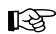


# Example 3.1

Define the function $\tau ( x , y , z ) = ( x ^ { 2 } , y ^ { 2 } , z ^ { 2 } )$ ; for example, $\tau ( 1 , 2 , 3 ) = ( 1 , 4 , 9 )$ . This function is not linear since, for $k = 2$ and $\mathbf { u } = ( 1 , 2 , 3 )$ , we have: 

$$
\tau (k \mathbf {u}) = \tau (2, 4, 6) = (4, 1 6, 3 6)
$$

but 

$$
k \tau (\mathbf {u}) = 2 (1, 4, 9) = (2, 8, 1 8)
$$

So property 2 of Equation 3.1 is not satisfied. 

If $\tau$ is linear, then it follows that: 

$$
\begin{array}{l} \tau (a \mathbf {u} + b \mathbf {v} + c \mathbf {w}) = \tau (a \mathbf {u} + (b \mathbf {v} + c \mathbf {w})) \\ = \tau (a \mathbf {u}) + \tau (b \mathbf {v} + c \mathbf {w}) \\ = a \tau (\mathbf {u}) + \tau (b \mathbf {v}) + \tau (c \mathbf {w}) \tag {eq.3.2} \\ = a \tau (\mathbf {u}) + b \tau (\mathbf {v}) + c \tau (\mathbf {w}) \\ \end{array}
$$

We will use this result in the next section. 

# 3.1.2 Matrix Representation

Let $\mathbf { u } = ( x , y , z )$ . Observe that we can always write this as: 

$$
\mathbf {u} = (x, y, z) = x \mathbf {i} + y \mathbf {j} + z \mathbf {k} = x (1, 0, 0) + y (0, 1, 0) + z (0, 0, 1)
$$

The vectors $\mathbf { i } = ( 1 , 0 , 0 ) , \ \mathbf { j } = ( 0 , 1 , 0 )$ $\mathbf { i } = ( 1 , 0 , 0 )$ ${ \bf j } = ( 0 , 1 , 0 )$ , and $\mathbf { k } = ( 0 , 0 , 1 )$ , which are unit vectors that aim along the working coordinate axes, respectively, are called the standard basis 

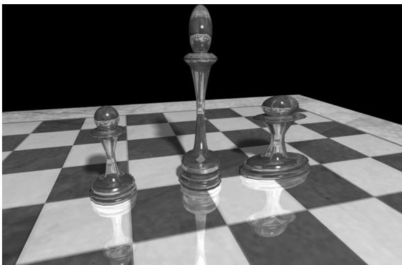


Figure 3.1. The left pawn is the original object. The middle pawn is the original pawn scaled 2 units on the y-axis making it taller. The right pawn is the original pawn scaled 2 units on the $x$ -axis making it fatter.


vectors for $\mathbb { R } ^ { 3 }$ . ( $\mathbb { R } ^ { 3 }$ denotes the set of all 3D coordinate vectors $( x , y , z )$ ). Now let $\tau$ be a linear transformation; by linearity (i.e., Equation 3.2), we have: 

$$
\tau (\mathbf {u}) = \tau (x \mathbf {i} + y \mathbf {j} + z \mathbf {k}) = x \tau (\mathbf {i}) + y \tau (\mathbf {j}) + z \tau (\mathbf {k}) \tag {eq.3.3}
$$

In other words, Equation 3.3 tells us that a linear transform is characterized by its action on the basis vectors. Observe that this is nothing more than a linear combination, which, as we learned in the previous chapter, can be written by a vector-matrix multiplication. By Equation 2.2 we may rewrite Equation 3.3 as: 

$$
\begin{array}{l} \tau (\mathbf {u}) = x \tau (\mathbf {i}) + y \tau (\mathbf {j}) + z \tau (\mathbf {k}) \\ = \mathbf {u} \mathbf {A} = [ x, \quad y, \quad z ] \left[\begin{array}{l}\leftarrow \tau (\mathbf {i}) \rightarrow\\\leftarrow \tau (\mathbf {j}) \rightarrow\\\leftarrow \tau (\mathbf {k}) \rightarrow\end{array}\right] = [ x, \quad y, \quad z ] \left[\begin{array}{l l l}A _ {1 1}&A _ {1 2}&A _ {1 3}\\A _ {2 1}&A _ {2 2}&A _ {2 3}\\A _ {3 1}&A _ {3 2}&A _ {3 3}\end{array}\right] \tag {eq.3.4} \\ \end{array}
$$

where $\tau ( \mathbf { i } ) = ( A _ { 1 1 } , A _ { 1 2 } , A _ { 1 3 } )$ , $\tau ( \mathbf { j } ) = ( A _ { 2 1 } , A _ { 2 2 } , A _ { 2 3 } )$ ,  and $\tau ( \mathbf { k } ) = ( A _ { 3 1 } , A _ { 3 2 } , A _ { 3 3 } )$ . We call the matrix A the matrix representation of the linear transformation $\tau$ . 

# 3.1.3 Scaling

Scaling refers to changing the size of an object as shown in Figure 3.1. 

We define the scaling transformation by: 

$$
S (x, y, z) = \left(s _ {x} x, s _ {y} y, s _ {z} z\right)
$$

This scales the vector by $s _ { x }$ units on the $x$ -axis, $s _ { y }$ units on the $y$ -axis, and $s _ { z }$ units on the $z \mathrm { . }$ -axis, relative to the origin of the working coordinate system. We now show that S is indeed a linear transformation. We have that: 

$$
\begin{array}{l} S (\mathbf {u} + \mathbf {v}) = \left(s _ {x} \left(u _ {x} + v _ {x}\right), s _ {y} \left(u _ {y} + v _ {y}\right), s _ {z} \left(u _ {z} + v _ {z}\right)\right) \\ = \left(s _ {x} u _ {x} + s _ {x} v _ {x}, s _ {y} u _ {y} + s _ {y} v _ {y}, s _ {z} u _ {z} + s _ {z} v _ {z}\right) \\ = \left(s _ {x} u _ {x}, s _ {y} u _ {y}, s _ {z} u _ {z}\right) + \left(s _ {x} v _ {x}, s _ {y} v _ {y}, s _ {z} v _ {z}\right) \\ = S (\mathbf {u}) + S (\mathbf {v}) \\ \end{array}
$$

$$
\begin{array}{l} S (k \mathbf {u}) = \left(s _ {x} k u _ {x}, s _ {y} k u _ {y}, s _ {z} k u _ {z}\right) \\ = k \left(s _ {x} u _ {x}, s _ {y} u _ {y}, s _ {z} u _ {z}\right) \\ = k S (\mathbf {u}) \\ \end{array}
$$

Thus both properties of Equation 3.1 are satisfied, so S is linear, and thus there exists a matrix representation. To find the matrix representation, we just apply S to each of the standard basis vectors, as in Equation 3.3, and then place the resulting vectors into the rows of a matrix (as in Equation 3.4): 

$$
S (\mathbf {i}) = \left(s _ {x} \cdot 1, s _ {y} \cdot 0, s _ {z} \cdot 0\right) = \left(s _ {x}, 0, 0\right)
$$

$$
S (\mathbf {j}) = \left(s _ {x} \cdot 0, s _ {y} \cdot 1, s _ {z} \cdot 0\right) = (0, s _ {y}, 0)
$$

$$
S (\mathbf {k}) = \left(s _ {x} \cdot 0, s _ {y} \cdot 0, s _ {z} \cdot 1\right) = \left(0, 0, s _ {z}\right)
$$

Thus the matrix representation of S is: 

$$
\mathbf {S} = \left[ \begin{array}{c c c} s _ {x} & 0 & 0 \\ 0 & s _ {y} & 0 \\ 0 & 0 & s _ {z} \end{array} \right]
$$

We call this matrix the scaling matrix. 

The inverse of the scaling matrix is given by: 

$$
\mathbf {S} ^ {- 1} = \left[ \begin{array}{c c c} 1 / s _ {x} & 0 & 0 \\ 0 & 1 / s _ {y} & 0 \\ 0 & 0 & 1 / s _ {z} \end{array} \right]
$$

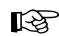


# Example 3.2

Suppose we have a square defined by a minimum point $( - 4 , - 4 , 0 )$ and a maximum point ( , 4 4, ) 0 . Suppose now that we wish to scale the square 0.5 units on the $x$ -axis, 2.0 units on the $y$ -axis, and leave the $z$ -axis unchanged. The corresponding scaling matrix is: 

$$
\mathbf {S} = \left[ \begin{array}{c c c} 0. 5 & 0 & 0 \\ 0 & 2 & 0 \\ 0 & 0 & 1 \end{array} \right]
$$

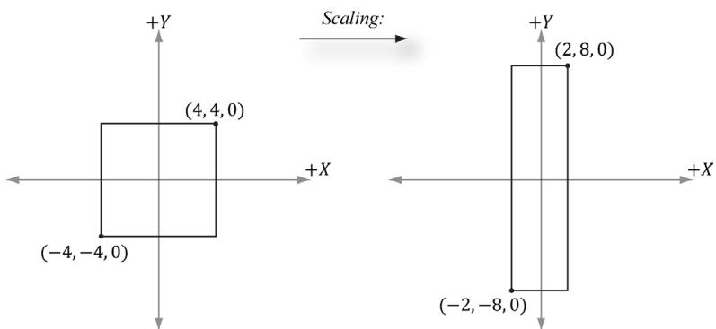


Figure 3.2. Scaling by one-half units on the $x$ -axis and two units on the y-axis. Note that when looking down the negative z-axis, the geometry is basically 2D since $z = 0$ .


Now to actually scale (transform) the square, we multiply both the minimum point and maximum point by this matrix: 

$$
[ - 4, - 4, 0 ] \left[ \begin{array}{l l l} 0. 5 & 0 & 0 \\ 0 & 2 & 0 \\ 0 & 0 & 1 \end{array} \right] = [ - 2, - 8, 0 ]
$$

$$
[ 4, 4, 0 ] \left[ \begin{array}{l l l} 0. 5 & 0 & 0 \\ 0 & 2 & 0 \\ 0 & 0 & 1 \end{array} \right] = [ 2, 8, 0 ]
$$

The result is shown in Figure 3.2. 

# 3.1.4 Rotation

In this section, we describe rotating a vector v about an axis n by an angle $\theta$ ; see Figure 3.3. Note that we measure the angle clockwise when looking down the axis n; moreover, we assume $\left\| \mathbf { n } \right\| { = } 1$ . 

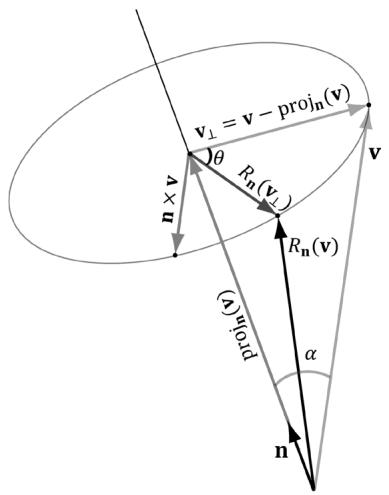


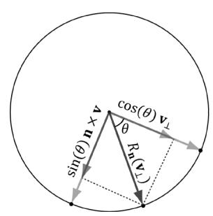


Figure 3.3. The geometry of rotation about a vector n.


First, decompose v into two parts: one part parallel to n and the other part orthogonal to n. The parallel part is just $\mathrm { p r o j } _ { \mathbf { n } } ( \mathbf { v } )$ (recall Example 1.5); the orthogonal part is given by $\mathbf { v } _ { \perp } = \mathrm { p e r p } _ { \mathbf { n } } ( \mathbf { v } ) = \mathbf { v } - \mathrm { p r o j } _ { \mathbf { n } } ( \mathbf { v } )$ . (Recall, also from Example 1.5, that since n is a unit vector, we have $\mathrm { p r o j } _ { \mathbf { n } } ( \mathbf { v } ) = ( \mathbf { n } \cdot \mathbf { v } ) \mathbf { n }$ .) The key observation is that the part proj ( ) v that is parallel to n is invariant under the rotation, so we only need to figure out how to rotate the orthogonal part. That is, the rotated vector $R _ { \mathbf { n } } \left( \mathbf { v } \right) = \mathrm { p r o j } _ { \mathbf { n } } \left( \mathbf { v } \right) + R _ { \mathbf { n } } \left( \mathbf { v } _ { \perp } \right)$ , by Figure 3.3. 

To find $R _ { \mathbf { n } } ( \mathbf { v } _ { \perp } )$ , we set up a 2D coordinate system in the plane of rotation. We will use $\mathbf { v } _ { \perp }$ as one reference vector. To get a second reference vector orthogonal to $\mathbf { v } _ { \perp }$ and n we take the cross product $\mathbf { n } \times \mathbf { v }$ (left-hand-thumb rule). From the trigonometry of Figure 3.3 and Exercise 14 of Chapter 1, we see that 

$$
\left\| \mathbf {n} \times \mathbf {v} \right\| = \left\| \mathbf {n} \right\| \left\| \mathbf {v} \right\| \sin \alpha = \left\| \mathbf {v} \right\| \sin \alpha = \left\| \mathbf {v} _ {\perp} \right\|
$$

where $\alpha$ is the angle between n and v. So both reference vectors have the same length and lie on the circle of rotation. Now that we have set up these two reference vectors, we see from trigonometry that: 

$$
R _ {\mathbf {n}} (\mathbf {v} _ {\perp}) = \cos \theta \mathbf {v} _ {\perp} + \sin \theta (\mathbf {n} \times \mathbf {v})
$$

This gives us the following rotation formula: 

$$
\begin{array}{l} R _ {\mathbf {n}} (\mathbf {v}) = \operatorname {p r o j} _ {\mathbf {n}} (\mathbf {v}) + R _ {\mathbf {n}} (\mathbf {v} _ {\perp}) \\ = (\mathbf {n} \cdot \mathbf {v}) \mathbf {n} + \cos \theta \mathbf {v} _ {\perp} + \sin \theta (\mathbf {n} \times \mathbf {v}) \tag {eq.3.5} \\ = (\mathbf {n} \cdot \mathbf {v}) \mathbf {n} + \cos \theta (\mathbf {v} - (\mathbf {n} \cdot \mathbf {v}) \mathbf {n}) + \sin \theta (\mathbf {n} \times \mathbf {v}) \\ = \cos \theta \mathbf {v} + (1 - \cos \theta) (\mathbf {n} \cdot \mathbf {v}) \mathbf {n} + \sin \theta (\mathbf {n} \times \mathbf {v}) \\ \end{array}
$$

We leave it as an exercise to show that this is a linear transformation. To find the matrix representation, we just apply $R _ { \mathbf { n } }$ to each of the standard basis vectors, as in Equation 3.3, and then place the resulting vectors into the rows of a matrix (as in Equation 3.4). The final result is: 

$$
\mathbf {R} _ {\mathbf {n}} = \left[ \begin{array}{l l l} c + (1 - c) x ^ {2} & (1 - c) x y + s z & (1 - c) x z - s y \\ (1 - c) x y - s z & c + (1 - c) y ^ {2} & (1 - c) y z + s x \\ (1 - c) x z + s y & (1 - c) y z - s x & c + (1 - c) z ^ {2} \end{array} \right]
$$

where we let $c = c \cos \theta$ and $s = s \mathrm { i n } \theta$ . 

The rotation matrices have an interesting property. Each row vector is unit length (verify) and the row vectors are mutually orthogonal (verify). Thus the row vectors are orthonormal (i.e., mutually orthogonal and unit length). A matrix whose rows are orthonormal is said to be an orthogonal matrix. An orthogonal matrix has the attractive property that its inverse is actually equal to its transpose. Thus, the inverse of $\mathbf { R _ { n } }$ is: 

$$
\mathbf {R} _ {\mathbf {n}} ^ {- 1} = \mathbf {R} _ {\mathbf {n}} ^ {T} = \left[ \begin{array}{l l l} c + (1 - c) x ^ {2} & (1 - c) x y - s z & (1 - c) x z + s y \\ (1 - c) x y + s z & c + (1 - c) y ^ {2} & (1 - c) y z - s x \\ (1 - c) x z - s y & (1 - c) y z + s x & c + (1 - c) z ^ {2} \end{array} \right]
$$

In general, orthogonal matrices are desirable to work with since their inverses are easy and efficient to compute. 

In particular, if we choose the $x \mathrm { - } , y \mathrm { - }$ , and $z$ -axes for rotation (i.e., ${ \bf n } = ( 1 , 0 , 0 )$ , ${ \bf n } = ( 0 , 1 , 0 )$ , and ${ \mathbf { n } } = ( 0 , 0 , 1 )$ , respectively), then we get the following rotation matrices which rotate about the $x \mathrm { - } , y \mathrm { - }$ , and $z$ -axis, respectively: 

$$
\mathbf {R} _ {\mathbf {x}} = \left[ \begin{array}{c c c c} 1 & 0 & 0 & 0 \\ 0 & \cos \theta & \sin \theta & 0 \\ 0 & - \sin \theta & \cos \theta & 0 \\ 0 & 0 & 0 & 1 \end{array} \right], \mathbf {R} _ {\mathbf {y}} = \left[ \begin{array}{c c c c} \cos \theta & 0 & - \sin \theta & 0 \\ 0 & 1 & 0 & 0 \\ \sin \theta & 0 & \cos \theta & 0 \\ 0 & 0 & 0 & 1 \end{array} \right], \mathbf {R} _ {\mathbf {z}} = \left[ \begin{array}{c c c c} \cos \theta & \sin \theta & 0 & 0 \\ - \sin \theta & \cos \theta & 0 & 0 \\ 0 & 0 & 1 & 0 \\ 0 & 0 & 0 & 1 \end{array} \right]
$$

Note that we show the rotation matrices about the $x \mathrm { - } , y \mathrm { - }$ -, and $z$ -axes using $4 { \times } 4$ matrices. The reason for this is described in $\ S 3 . 2 . 4$ . For now you can ignore the fourth row and column. 

# ☞	Example 3.3

Suppose we have a square defined by a minimum point $( - 1 , 0 , - 1 )$ and a maximum point ( , 1 0 1, ) . Suppose now that we wish to rotate the square $- 3 0 ^ { \circ }$ clockwise about the y-axis (i.e., $3 0 ^ { \circ }$ counterclockwise). In this case, ${ \bf { n } } = ( 0 , 1 , 0 )$ , which simplifies $\mathbf { R _ { n } }$ considerably; the corresponding y-axis rotation matrix is: 

$$
\mathbf {R} _ {\mathbf {y}} = \left[ \begin{array}{c c c} \cos \theta & 0 & - \sin \theta \\ 0 & 1 & 0 \\ \sin \theta & 0 & \cos \theta \end{array} \right] = \left[ \begin{array}{c c c} \cos (- 3 0 ^ {\circ}) & 0 & - \sin (- 3 0 ^ {\circ}) \\ 0 & 1 & 0 \\ \sin (- 3 0 ^ {\circ}) & 0 & \cos (- 3 0 ^ {\circ}) \end{array} \right] = \left[ \begin{array}{c c c} \frac {\sqrt {3}}{2} & 0 & \frac {1}{2} \\ 0 & 1 & 0 \\ - \frac {1}{2} & 0 & \frac {\sqrt {3}}{2} \end{array} \right]
$$

Now to actually rotate (transform) the square, we multiply both the minimum point and maximum point by this matrix: 

$$
[ - 1, 0, - 1 ] \left[ \begin{array}{l l l} \frac {\sqrt {3}}{2} & 0 & \frac {1}{2} \\ 0 & 1 & 0 \\ - \frac {1}{2} & 0 & \frac {\sqrt {3}}{2} \end{array} \right] \approx [ - 0. 3 6, 0, - 1. 3 6 ] [ 1, 0, 1 ] \left[ \begin{array}{l l l} \frac {\sqrt {3}}{2} & 0 & \frac {1}{2} \\ 0 & 1 & 0 \\ - \frac {1}{2} & 0 & \frac {\sqrt {3}}{2} \end{array} \right] \approx [ 0. 3 6, 0, 1. 3 6 ]
$$

The result is shown in Figure 3.4. 

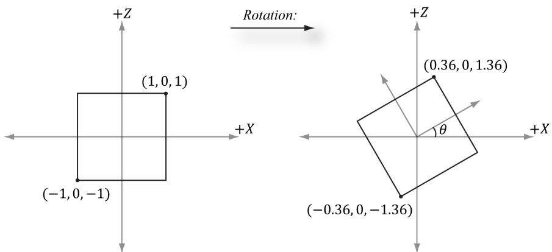


Figure 3.4. Rotating $- 3 0 ^ { \circ }$ clockwise around the y-axis. Note that when looking down the positive y-axis, the geometry is basically 2D since $y = 0$ .


# 3.2 AFFINE TRANSFORMATIONS

# 3.2.1 Homogeneous Coordinates

We will see in the next section that an affine transformation is a linear transformation combined with a translation. However, translation does not make sense for vectors because a vector only describes direction and magnitude, independent of location; in other words, vectors should be unchanged under translations. Translations should only be applied to points (i.e., position vectors). Homogeneous coordinates provide a convenient notational mechanism that enables us to handle points and vectors uniformly. With homogeneous coordinates, we augment to 4-tuples and what we place in the fourth w-coordinate depends on whether we are describing a point or vector. Specifically, we write: 

1. $( x , y , z , 0 )$ for vectors 

2. $( x , y , z , 1 )$ for points 

We will see later that setting $w = 1$ for points allows translations of points to work correctly, and setting $w = 0$ for vectors prevents the coordinates of vectors from being modified by translations (we do not want to translate the coordinates of a vector, as that would change its direction and magnitude—translations should not alter the properties of vectors). 

The notation of homogeneous coordinates is consistent with the ideas shown in Figure 1.17. That is, the difference between two points $\mathbf { q } - \mathbf { p } = ( q _ { x } , q _ { y } , q _ { z } , 1 ) -$ $( p _ { x } , p _ { y } , p _ { z } , 1 ) = ( q _ { x } - p _ { x } , q _ { y } - p _ { y } , q _ { z } - p _ { z } , 0 )$ results in a vector, and a point plus a vector $\mathbf { p } + \mathbf { v } = ( p _ { x } , p _ { y } , p _ { z } , 1 ) + ( \nu _ { x } , \nu _ { y } , \nu _ { z } , 0 ) = ( p _ { x } + \nu _ { x } , p _ { y } + \nu _ { y } , p _ { z } + \nu _ { z } , 1 )$ results in a point. 

# 3.2.2 Definition and Matrix Representation

A linear transformation cannot describe all the transformations we wish to do; therefore, we augment to a larger class of functions called affine transformations. An affine transformation is a linear transformation plus a translation vector b; that is: 

$$
\alpha (\mathbf {u}) = \tau (\mathbf {u}) + \mathbf {b}
$$

Or in matrix notation: 

$$
\alpha (\mathbf {u}) = \mathbf {u} \mathbf {A} + \mathbf {b} = [ x, \quad y, \quad z ] \left[ \begin{array}{l l l} A _ {1 1} & A _ {1 2} & A _ {1 3} \\ A _ {2 1} & A _ {2 2} & A _ {2 3} \\ A _ {3 1} & A _ {3 2} & A _ {3 3} \end{array} \right] + [ b _ {x}, \quad b _ {y}, \quad b _ {z} ] = [ x ^ {\prime}, \quad y ^ {\prime}, \quad z ^ {\prime} ]
$$

where A is the matrix representation of a linear transformation. 

If we augment to homogeneous coordinates with $w = 1$ , then we can write this more compactly as: 

$$
[ x, \quad y, \quad z, \quad 1 ] \left[ \begin{array}{l l l l} A _ {1 1} & A _ {1 2} & A _ {1 3} & 0 \\ A _ {2 1} & A _ {2 2} & A _ {2 3} & 0 \\ A _ {3 1} & A _ {3 2} & A _ {3 3} & 0 \\ b _ {x} & b _ {y} & b _ {z} & 1 \end{array} \right] = [ x ^ {\prime}, \quad y ^ {\prime}, \quad z ^ {\prime}, \quad 1 ] \tag {eq.3.6}
$$

The $4 \times 4$ matrix in Equation 3.6 is called the matrix representation of the affine transformation. 

Observe that the addition by b is essentially a translation (i.e., change in position). We do not want to apply this to vectors because vectors have no position. However, we still want to apply the linear part of the affine transformation to vectors. If we set $w = 0$ in the fourth component for vectors, then the translation by b is not applied (verify by doing the matrix multiplication). 


Because the dot product of the row vector with the fourth column of the above $4 \times 4$ affine transformation matrix is: $[ x , y , z , w ] \cdot [ 0 , 0 , 0 , 1 ] = w$ ,  this matrix does not modify the w-coordinate of the input vector. 

# 3.2.3 Translation

The identity transformation is a linear transformation that just returns its argument; that is, $I ( \mathbf { u } ) { = } \mathbf { u }$ . It can be shown that the matrix representation of this linear transformation is the identity matrix. 

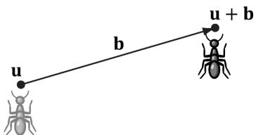


Figure 3.5. Displacing the position of the ant by some displacement vector b.


Now, we define the translation transformation to be the affine transformation whose linear transformation is the identity transformation; that is, 

$$
\tau (\mathbf {u}) = \mathbf {u} \mathbf {I} + \mathbf {b} = \mathbf {u} + \mathbf {b}
$$

As you can see, this simply translates (or displaces) point u by b. Figure 3.5 illustrates how this could be used to displace objects—we translate every point on the object by the same vector b to move it. 

By Equation 3.6, $\tau$ has the matrix representation: 

$$
\mathbf {T} = \left[ \begin{array}{c c c c} 1 & 0 & 0 & 0 \\ 0 & 1 & 0 & 0 \\ 0 & 0 & 1 & 0 \\ b _ {x} & b _ {y} & b _ {z} & 1 \end{array} \right]
$$

This is called the translation matrix. 

The inverse of the translation matrix is given by: 

$$
\mathbf {T} ^ {- 1} = \left[ \begin{array}{c c c c} 1 & 0 & 0 & 0 \\ 0 & 1 & 0 & 0 \\ 0 & 0 & 1 & 0 \\ - b _ {x} & - b _ {y} & - b _ {z} & 1 \end{array} \right]
$$

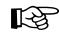


# Example 3.4

Suppose we have a square defined by a minimum point (-8 2 0 , , ) and a maximum point (-2 8 0 , , ) . Suppose now that we wish to translate the square 12 units on the $x$ -axis, -10.0 units on the y-axis, and leave the $z$ -axis unchanged. The corresponding translation matrix is: 

$$
\mathbf {T} = \left[ \begin{array}{c c c c} 1 & 0 & 0 & 0 \\ 0 & 1 & 0 & 0 \\ 0 & 0 & 1 & 0 \\ 1 2 & - 1 0 & 0 & 1 \end{array} \right]
$$

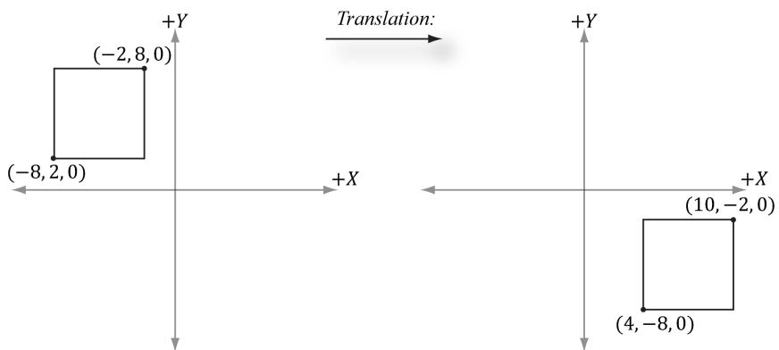


Figure 3.6. Translating 12 units on the $x$ -axis and $^ { - 1 0 }$ units on the y-axis. Note that when looking down the negative $Z$ -axis, the geometry is basically 2D since $z = 0$ .


Now to actually translate (transform) the square, we multiply both the minimum point and maximum point by this matrix: 

$$
[ - 8, \quad 2, \quad 0, \quad 1 ] \left[ \begin{array}{c c c c} 1 & 0 & 0 & 0 \\ 0 & 1 & 0 & 0 \\ 0 & 0 & 1 & 0 \\ 1 2 & - 1 0 & 0 & 1 \end{array} \right] = [ 4, \quad - 8 \quad 0, \quad 1 ]
$$

$$
[ - 2, \quad 8, \quad 0, \quad 1 ] \left[ \begin{array}{c c c c} 1 & 0 & 0 & 0 \\ 0 & 1 & 0 & 0 \\ 0 & 0 & 1 & 0 \\ 1 2 & - 1 0 & 0 & 1 \end{array} \right] = [ 1 0, \quad - 2, \quad 0, \quad 1 ]
$$

The result is shown in Figure 3.6. 


Let T be a transformation matrix, and recall that we transform a point/vector by computing the product $\mathbf { v } \mathbf { T } = \mathbf { v } ^ { \prime }$ . Observe that if we transform a point/ vector by T and then transform it again by the inverse $\mathbf { T } ^ { - 1 }$ we end up with the original vector: $\mathbf { v } \mathbf { T } \mathbf { T } ^ { - 1 } = \mathbf { v } \mathbf { I } = \mathbf { v }$ . In other words, the inverse transformation undoes the transformation. For example, if we translate a point 5 units on the x-axis, and then translate by the inverse -5 units on the x-axis, we end up where we started. Likewise, if we rotate a point $3 0 ^ { \circ }$ about the y-axis, and then rotate by the inverse $- 3 0 ^ { \circ }$ about the y-axis, then we end up with our original point. In summary, the inverse of a transformation matrix does the opposite transformation such that the composition of the two transformations leaves the geometry unchanged. 

# 3.2.4 Affine Matrices for Scaling and Rotation

Observe that if $\mathbf b = \mathbf 0$ , the affine transformation reduces to a linear transformation. Thus we can express any linear transformation as an affine transformation with $\mathbf b = \mathbf 0$ . This, in turn, means we can represent any linear transformation by a $4 \times 4$ affine matrix. For example, the scaling and rotation matrices written using $4 \times 4$ matrices are given as follows: 

$$
\mathbf {S} = \left[ \begin{array}{c c c c} s _ {x} & 0 & 0 & 0 \\ 0 & s _ {y} & 0 & 0 \\ 0 & 0 & s _ {z} & 0 \\ 0 & 0 & 0 & 1 \end{array} \right]
$$

$$
\mathbf {R} _ {\mathbf {n}} = \left[ \begin{array}{c c c c} c + (1 - c) x ^ {2} & (1 - c) x y + s z & (1 - c) x z - s y & 0 \\ (1 - c) x y - s z & c + (1 - c) y ^ {2} & (1 - c) y z + s x & 0 \\ (1 - c) x z + s y & (1 - c) y z - s x & c + (1 - c) z ^ {2} & 0 \\ 0 & 0 & 0 & 1 \end{array} \right]
$$

In this way, we can express all of our transformations consistently using $4 \times 4$ matrices and points and vectors using $1 \times 4$ homogeneous row vectors. 

# 3.2.5 Geometric Interpretation of an Affine Transformation Matrix

In this section, we develop some intuition of what the numbers inside an affine transformation matrix mean geometrically. First, let us consider a rigid body transformation, which is essentially a shape preserving transformation. A real world example of a rigid body transformation might be picking a book off your desk and placing it on a bookshelf; during this process you are translating the book from your desk to the bookshelf, but also very likely changing the orientation of the book in the process (rotation). Let $\tau$ be a rotation transformation describing how we want to rotate an object and let b define a displacement vector describing how we want to translate an object. This rigid body transform can be described by the affine transformation: 

$$
\alpha (x, y, z) = \tau (x, y, z) + \mathbf {b} = x \tau (\mathbf {i}) + y \tau (\mathbf {j}) + z \tau (\mathbf {k}) + \mathbf {b}
$$

In matrix notation, using homogeneous coordinates ( $w = 1$ for points and $w = 0$ for vectors so that the translation is not applied to vectors), this is written as: 

$$
\left[\begin{array}{l l l l}x,&y,&z,&w\end{array}\right] \left[\begin{array}{l}\leftarrow \tau (\mathbf {i}) \rightarrow\\\leftarrow \tau (\mathbf {j}) \rightarrow\\\leftarrow \tau (\mathbf {k}) \rightarrow\\\leftarrow \mathbf {b} \rightarrow\end{array}\right] = \left[\begin{array}{l l l l}x ^ {\prime},&y ^ {\prime},&z ^ {\prime},&w\end{array}\right] \tag {eq.3.7}
$$

Now, to see what this equation is doing geometrically, all we need to do is graph the row vectors in the matrix (see Figure 3.7). Because $\tau$ is a rotation transformation it preserves lengths and angles; in particular, we see that $\tau$ is just rotating the standard basis vectors i, j, and k into a new orientation $\tau ( \mathbf { i } )$ , $\tau ( \mathbf { j } )$ ，and $\tau ( \mathbf { k } )$ . Thevector $\mathbf { b }$ is just a position vector denoting a displacement from the origin. Now Figure 3.7 shows how the transformed point is obtained geometrically when $\alpha ( x , y , z ) = x \tau ( \mathbf { i } ) + y \tau ( \mathbf { j } ) + z \tau ( \mathbf { k } ) + \mathbf { b }$ is computed. 

The same idea applies to scaling or skew transformations. Consider the linear transformation $\tau$ that warps a square into a parallelogram as shown in Figure 3.8. The warped point is simply the linear combination of the warped basis vectors. 

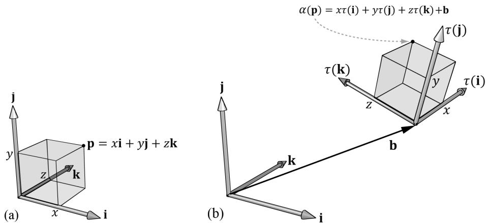


Figure 3.7. The geometry of the rows of an affine transformation matrix. The transformed point, $\alpha ( \mathfrak { p } )$ , is given as a linear combination of the transformed basis vectors τ(i) ,τ(j), $\tau ( \mathbf { k } )$ , and the offset b.


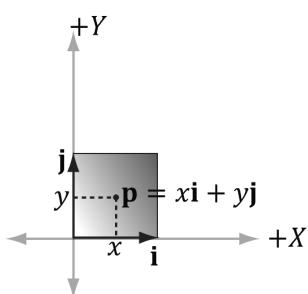


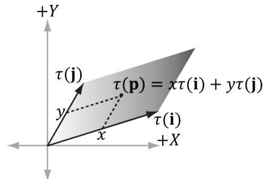


Figure 3.8. For a linear transformation that warps a square into a parallelogram, the transformed point $\tau ( \mathsf { p } ) = ( x , y )$ is given as a linear combination of the transformed basis vectors t(i),t(j).


# 3.3 COMPOSITION OF TRANSFORMATIONS

Suppose S is a scaling matrix, R is a rotation matrix, and T is a translation matrix. Assume we have a cube made up of eight vertices $\mathbf { v } _ { i }$ for $i = 0$ , 1, …, 7, and we wish to apply these three transformations to each vertex successively. The obvious way to do this is step-by-step: 

$$
\left(\left(\mathbf {v} _ {i} \mathbf {S}\right) \mathbf {R}\right) ^ {\prime} \mathbf {T} = \left(\mathbf {v} _ {i} ^ {\prime} \mathbf {R}\right) ^ {\prime} \mathbf {T} = \mathbf {v} _ {i} ^ {\prime \prime} \mathbf {T} = \mathbf {v} _ {i} ^ {\prime \prime} \text {f o r} i = 0, 1, \dots , 7
$$

However, because matrix multiplication is associative, we can instead write this equivalently as: 

$$
\mathbf {v} _ {i} (\mathbf {S R T}) = \mathbf {v} _ {i} ^ {\prime \prime} \text {f o r} i = 0, 1, \dots , 7
$$

We can think of the matrix $\mathbf { C } = \mathbf { S R T }$ as a matrix that encapsulates all three transformations into one net transformation matrix. In other words, matrixmatrix multiplication allows us to concatenate transforms. 

This has performance implications. To see this, assume that a 3D object is composed of 20,000 points and that we want to apply these three successive geometric transformations to the object. Using the step-by-step approach, we would require $2 0 { , } 0 0 0 \times 3$ vector-matrix multiplications. On the other hand, using the combined matrix approach requires 20,000 vector-matrix multiplications and 2 matrix-matrix multiplications. Clearly, two extra matrix-matrix multiplications is a cheap price to pay for the large savings in vector-matrix multiplications. 

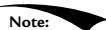


Again we point out that matrix multiplication is not commutative. This is even seen geometrically. For example, a rotation followed by a translation, which we can describe by the matrix product RT, does not result in the same transformation as the same translation followed by the same rotation, that is, TR. Figure 3.9 demonstrates this. 

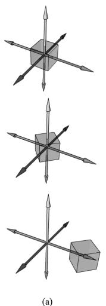


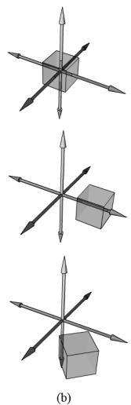


Figure 3.9. (a) Rotating first and then translating. (b) Translating first and then rotating.


# 3.4 CHANGE OF COORDINATE TRANSFORMATIONS

The scalar $1 0 0 ^ { \circ } \mathrm { C }$ represents the temperature of boiling water relative to the Celsius scale. How do we describe the same temperature of boiling water relative to the Fahrenheit scale? In other words, what is the scalar, relative to the Fahrenheit scale, that represents the temperature of boiling water? To make this conversion (or change of frame), we need to know how the Celsius and Fahrenheit scales relate. 

They are related as follows: $T _ { \scriptscriptstyle F } = \frac { 9 } { 5 } T _ { \scriptscriptstyle C } + 3 2 { ^ { \circ } }$ = . Therefore, the temperature of boiling water relative to the Fahrenheit scale is given by $T _ { _ { F } } = { \frac { 9 } { 5 } } ( 1 0 0 ) ^ { \circ } + 3 2 ^ { \circ } = 2 1 2 ^ { \circ } F$ . 

This example illustrates that we can convert a scalar $k$ that describes some quantity relative to a frame $A$ into a new scalar $k ^ { \prime }$ that describes the same quantity relative to a different frame $B _ { i }$ , provided that we knew how frame $A$ and $B$ were related. In the following subsections, we look at a similar problem, but instead of scalars, we are interested in how to convert the coordinates of a point/vector relative to one frame into coordinates relative to a different frame (see Figure 3.10). We call the transformation that converts coordinates from one frame into coordinates of another frame a change of coordinate transformation. 

It is worth emphasizing that in a change of coordinate transformation, we do not think of the geometry as changing; rather, we are changing the frame of reference, which thus changes the coordinate representation of the geometry. This is in contrast to how we usually think about rotations, translations, and scaling, where we think of actually physically moving or deforming the geometry. 

In 3D computer graphics, we employ multiple coordinate systems, so we need to know how to convert from one to another. Because location is a property of 

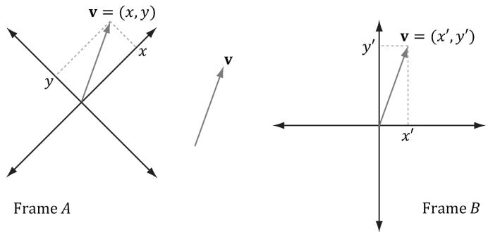


Figure 3.10. The same vector v has different coordinates when described relative to different frames. It has coordinates $( x , y )$ relative to frame $A$ and coordinates $( x ^ { \prime } , y ^ { \prime } )$ relative to frame $B$ .


points, but not of vectors, the change of coordinate transformation is different for points and vectors. 

# 3.4.1 Vectors

Consider Figure 3.11, in which we have two frames $A$ and B and a vector p . Suppose we are given the coordinates ${ \pmb { \mathrm { p } } } _ { A } = ( x , y )$ of $\mathbf { p }$ relative to frame A, and we wish to find the coordinates $ { \mathbf { p } } _ { B } = ( x ^ { \prime } , y ^ { \prime } )$ of p relative to frame B. In other words, given the coordinates identifying a vector relative to one frame, how do we find the coordinates that identify the same vector relative to a different frame? 

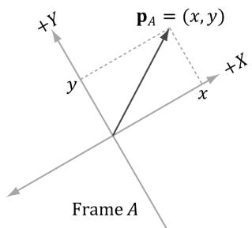


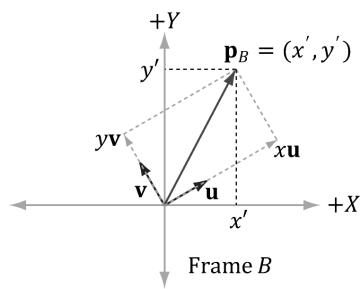


Figure 3.11. The geometry of finding the coordinates of p relative to frame B.


From Figure 3.11, it is clear that 

$$
\mathbf {p} = x \mathbf {u} + y \mathbf {v}
$$

where u and v are unit vectors which aim, respectively, along the $x -$ and $\boldsymbol { y }$ -axes of frame A. Expressing each vector in the above equation in frame $B$ coordinates we get: 

$$
\mathbf {p} _ {B} = x \mathbf {u} _ {B} + y \mathbf {v} _ {B}
$$

Thus, if we are given ${ \pmb { \mathrm { p } } } _ { A } = ( x , y )$ and we know the coordinates of the vectors u and v relative to frame $B$ , that is if we know $\mathbf { u } _ { B } = ( u _ { x } , u _ { y } )$ and $\mathbf { v } _ { B } = ( \nu _ { x } , \nu _ { y } )$ , then we can always find $ { \mathbf { p } } _ { B } = ( x ^ { \prime } , y ^ { \prime } )$ . 

Generalizing to 3D, if ${ \bf p } _ { A } = ( x , y , z )$ , then 

$$
\mathbf {p} _ {B} = x \mathbf {u} _ {B} + y \mathbf {v} _ {B} + z \mathbf {w} _ {B}
$$

where u , v , and w are unit vectors which aim, respectively, along the x-, y- and $z$ -axes of frame $A$ . 

# 3.4.2 Points

The change of coordinate transformation for points is slightly different than it is for vectors; this is because location is important for points, so we cannot translate points as we translated the vectors in Figure 3.11. 

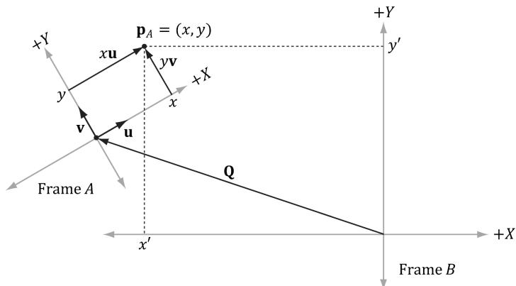


Figure 3.12. The geometry of finding the coordinates of p relative to frame B.


Figure 3.12 shows the situation, and we see that the point p can be expressed by the equation: 

$$
\mathbf {p} = x \mathbf {u} + y \mathbf {v} + \mathbf {Q}
$$

where u and v are unit vectors which aim, respectively, along the $x -$ and y-axes of frame $A$ , and Q is the origin of frame A. Expressing each vector/point in the above equation in frame B coordinates we get: 

$$
\mathbf {p} _ {B} = x \mathbf {u} _ {B} + y \mathbf {v} _ {B} + \mathbf {Q} _ {B}
$$

Thus, if we are given $\pmb { \mathrm { p } } _ { A } = ( x , y )$ and we know the coordinates of the vectors u and v, and origin Q relative to frame $B$ , that is if we know ${ \bf u } _ { B } = ( u _ { x } , u _ { y } )$ , $\mathbf { v } _ { B } = ( \nu _ { x } , \nu _ { y } )$ , and $\mathbf { Q } _ { B } = \left( Q _ { x } , Q _ { y } \right)$ , then we can always find $\mathbf { p } _ { B } = \left( x ^ { \prime } , y ^ { \prime } \right)$ . 

Generalizing to 3D, if $\mathbf { p } _ { A } = ( x , y , z )$ , then 

$$
\mathbf {p} _ {B} = x \mathbf {u} _ {B} + y \mathbf {v} _ {B} + z \mathbf {w} _ {B} + \mathbf {Q} _ {B}
$$

where u, v, and w are unit vectors which aim, respectively, along the $x \mathrm { - } , y \mathrm { - }$ and $z \mathrm { . }$ -axes of frame $A$ , and Q is the origin of frame A. 


For both points and vectors, the key relationship in transforming points/vectors from frame A coordinates into frame B coordinates is knowing how to describe the axes and origin of frame A relative to frame B. 

# 3.4.3 Matrix Representation

To review so far, the vector and point change of coordinate transformations are: 

$\left( x ^ { \prime } , y ^ { \prime } , z ^ { \prime } \right) = \mathbf { \boldsymbol { x } } \mathbf { \boldsymbol { u } } _ { B } + y \mathbf { \boldsymbol { v } } _ { B } + z \mathbf { \boldsymbol { w } } _ { B }$ for vectors 

$\left( x ^ { \prime } , y ^ { \prime } , z ^ { \prime } \right) = x \mathbf { u } _ { B } + y \mathbf { v } _ { B } + z \mathbf { w } _ { B } + \mathbf { Q } _ { B }$ for points 

If we use homogeneous coordinates, then we can handle vectors and points by one equation: 

$$
\left(x ^ {\prime}, y ^ {\prime}, z ^ {\prime}, w\right) = x \mathbf {u} _ {B} + y \mathbf {v} _ {B} + z \mathbf {w} _ {B} + w \mathbf {Q} _ {B} \tag {eq.3.8}
$$

If $w = 0$ , then this equation reduces to the change of coordinate transformation for vectors; if $w = 1$ , then this equation reduces to the change of coordinate transformation for points. The advantage of Equation 3.8 is that it works for both vectors and points, provided we set the w-coordinates correctly; we no longer need two equations (one for vectors and one for points). Equation 2.3 says that we can write Equation 3.8 in the language of matrices: 

$$
\begin{array}{l} \left[\begin{array}{l l l l}x ^ {\prime},&y ^ {\prime},&z ^ {\prime},&w\end{array}\right] = \left[\begin{array}{l l l l}x,&y,&z,&w\end{array}\right] \left[\begin{array}{l}\leftarrow \mathbf {u} _ {B} \rightarrow\\\leftarrow \mathbf {v} _ {B} \rightarrow\\\leftarrow \mathbf {w} _ {B} \rightarrow\\\leftarrow \mathbf {Q} _ {B} \rightarrow\end{array}\right] \tag {eq.3.9} \\ = \left[ \begin{array}{l l l l} x, & y, & z, & w \end{array} \right] \left[ \begin{array}{c c c c} u _ {x} & u _ {y} & u _ {z} & 0 \\ v _ {x} & v _ {y} & v _ {z} & 0 \\ w _ {x} & w _ {y} & w _ {z} & 0 \\ Q _ {x} & Q _ {y} & Q _ {z} & 1 \end{array} \right] \\ = x \mathbf {u} _ {B} + y \mathbf {v} _ {B} + z \mathbf {w} _ {B} + w \mathbf {Q} _ {B} \\ \end{array}
$$

where $\mathbf { Q } _ { B } = ( Q _ { x } , Q _ { y } , Q _ { z } , 1 )$ , ${ \bf u } _ { B } = ( u _ { x } , u _ { y } , u _ { z } , 0 ) , { \bf v } _ { B } = ( \nu _ { x } , \nu _ { y } , \nu _ { z } , 0 )$ , and $\mathbf { w } _ { B } = ( w _ { x } , w _ { y } , w _ { z } ,$ 0) describe the origin and axes of frame $A$ with homogeneous coordinates relative to frame B. We call the $4 { \times } 4$ matrix in Equation 3.9 a change of coordinate matrix or change of frame matrix, and we say it converts (or maps) frame A coordinates into frame $B$ coordinates. 

# 3.4.4 Associativity and Change of Coordinate Matrices

Suppose now that we have three frames F, G, and H. Moreover, let A be the change of frame matrix from $F$ to $G _ { ; }$ , and let B be the change of frame matrix from $G$ to $H$ . Suppose we have the coordinates ${ \bf p } _ { F }$ of a vector relative to frame $F$ and we want the coordinates of the same vector relative to frame $H _ { ; }$ , that is, we want $\mathbf { p } _ { H }$ . One way to do this is step-by-step: 

$$
(\mathbf {p} _ {F} \mathbf {A}) \mathbf {B} = \mathbf {p} _ {H}
$$

$$
(\mathbf {p} _ {G}) \mathbf {B} = \mathbf {p} _ {H}
$$

However, because matrix multiplication is associative, we can instead rewrite $( { \bf p } _ { F } { \bf A } ) { \bf B } = { \bf p } _ { H }$ as: 

$$
\mathbf {p} _ {F} (\mathbf {A B}) = \mathbf {p} _ {H}
$$

In this sense, the matrix product $\mathbf { C } = \mathbf { A } \mathbf { B }$ can be thought of as the change of frame matrix from $F$ directly to $H _ { ; }$ ; it combines the affects of A and B into a net matrix. (The idea is like composition of functions.) 

This has performance implications. To see this, assume that a 3D object is composed of 20,000 points and that we want to apply two successive change of 

frame transformation to the object. Using the step-by-step approach, we would require $2 0 , 0 0 0 \times 2$ vector-matrix multiplications. On the other hand, using the combined matrix approach requires 20,000 vector-matrix multiplications and 1 matrix-matrix multiplication to combine the two change of frame matrices. Clearly, one extra matrix-matrix multiplication is a cheap price to pay for the large savings in vector-matrix multiplications. 


Again, matrix multiplication is not commutative, so we expect that AB and BA do not represent the same composite transformation. More specifically, the order in which you multiply the matrices is the order in which the transformations are applied, and in general, it is not a commutative process. 

# 3.4.5 Inverses and Change of Coordinate Matrices

Suppose that we are given $\mathbf { p } _ { B }$ (the coordinates of a vector p relative to frame $B$ ), and we are given the change of coordinate matrix M from frame $A$ to frame $B$ ; that is, $\mathbf { p } _ { B } = \mathbf { p } _ { A } \mathbf { M }$ . We want to solve for $\mathbf { p } _ { A }$ . In other words, instead of mapping from frame $A$ into frame $B$ , we want the change of coordinate matrix that maps us from $B$ into $A$ . To find this matrix, suppose that M is invertible (i.e., ${ { \bf { M } } ^ { - 1 } }$ exists). We can solve for $\mathbf { p } _ { A }$ like so: 

$$
\mathbf {p} _ {B} = \mathbf {p} _ {A} \mathbf {M}
$$

$$
\mathbf {p} _ {B} \mathbf {M} ^ {- 1} = \mathbf {p} _ {A} \mathbf {M} \mathbf {M} ^ {- 1} \quad \text {M u l t i p l y i n g b o t h s i d e s o f t h e e q u a t i o n b y} \mathbf {M} ^ {- 1}
$$

$$
\mathbf {p} _ {B} \mathbf {M} ^ {- 1} = \mathbf {p} _ {A} \mathbf {I} \quad \mathbf {M} \mathbf {M} ^ {- 1} = \mathbf {I}, b y
$$

$$
\mathbf {p} _ {B} \mathbf {M} ^ {- 1} = \mathbf {p} _ {A} \quad \mathbf {p} _ {A} \mathbf {I} = \mathbf {p} _ {A}, \text {b y}
$$

Thus the matrix ${ { \bf { M } } ^ { - 1 } }$ is the change of coordinate matrix from $B$ into $A$ . 

Figure 3.13 illustrates the relationship between a change of coordinate matrix and its inverse. Also note that all of the change of frame mappings that we do in this book will be invertible, so we won’t have to worry about whether the inverse exists. 

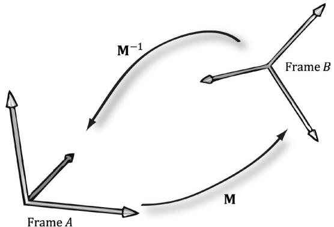


Figure 3.13. M maps A into B and $\mathbf { M } ^ { - 1 }$ maps from $B$ into $A$ .


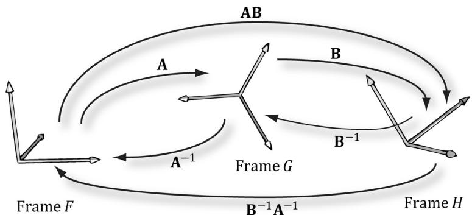


Figure 3.14. A maps from $F$ into G, B maps from G into $H$ , and AB maps from F directly into H. $\mathbf { B } ^ { - 1 }$ maps from $H$ into G, $\pmb { \mathsf { A } } ^ { - 1 }$ maps from G into $F$ and $\mathbf { B } ^ { - 1 } \mathbf { A } ^ { - 1 }$ maps from $H$ directly into $F$ .


Figure 3.14 shows how the matrix inverse property $( \mathbf { A } \mathbf { B } ) ^ { - 1 } = \mathbf { B } ^ { - 1 } \mathbf { A } ^ { - 1 }$ can be interpreted in terms of change of coordinate matrices. 

# 3.5 TRANSFORMATION MATRIX VERSUS CHANGE OF COORDINATE MATRIX

So far we have distinguished between “active” transformations (scaling, rotation, translation) and change of coordinate transformations. We will see in this section that mathematically, the two are equivalent, and an active transformation can be interpreted as a change of coordinate transformation, and conversely. 

Figure 3.15 shows the geometric resemblance between the rows in Equation 3.7 (rotation followed by translation affine transformation matrix) and the rows in Equation 3.9 (change of coordinate matrix). 

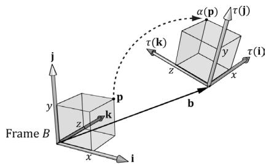


（a）


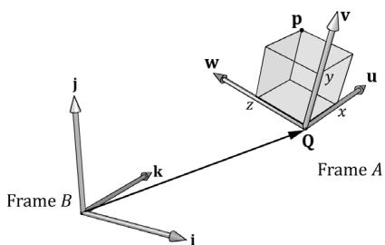


（b）


Figure 3.15. We see that $\boldsymbol { \mathsf { b } } = \boldsymbol { \mathsf { Q } }$ , τ(i) = u, τ(j) = v, and $\tau ( \mathbf { k } ) = \mathbf { w }$ . (a) We work with one coordinate system, call it frame $B$ , and we apply an affine transformation to the cube to change its position and orientation relative to frame B: $\alpha ( x , y , z , w ) = x \tau ( \mathbf { i } ) + y \tau ( \mathbf { j } ) + z \tau ( \mathbf { k } ) + w \mathbf { b }$ . (b) We have two coordinate systems called frame A and frame B. The points of the cube relative to frame A can be converted to frame B coordinates by the formula $\mathsf { p } _ { B } = x \mathbf { u } _ { B } + y \mathbf { v } _ { B } + z \mathbf { w } _ { B } + w \mathbf { Q } _ { B } .$ , where $\mathtt { p } _ { A } = ( x , y , z , w )$ . In both cases, we have $\ a ( \pmb { p } ) = ( x ^ { \prime } , y ^ { \prime } , z ^ { \prime } , w ) = \pmb { p } _ { B }$ with coordinates relative to frame $B$ .


If we think about this, it makes sense. For with a change of coordinate transformation, the frames differ in position and orientation. Therefore, the mathematical conversion formula to go from one frame to the other would require rotating and translating the coordinates, and so we end up with the same mathematical form. In either case, we end up with the same numbers; the difference is the way we interpret the transformation. For some situations, it is more intuitive to work with multiple coordinate systems and convert between the systems where the object remains unchanged, but its coordinate representation changes since it is being described relative to a different frame of reference (this situation corresponds with Figure $3 . 1 5 b$ ). Other times, we want to transform an object inside a coordinate system without changing our frame of reference (this situation corresponds with Figure 3.15a). 


In particular, this discussion shows that we can interpret a composition of active transformations (scaling, rotation, translation) as a change of coordinate transformation. This is important because we will often define our world space (Chapter 5) change of coordinate matrix as a composition of scaling, rotation, and translation transformations. 

# 3.6 DIRECTX MATH TRANSFORMATION FUNCTIONS

We summarize the DirectX Math related transformation functions for reference. 

// Constructs a scaling matrix:  
XMMatrix XM_CALLCONV XMMatrixScaling(float ScaleX, float ScaleY, float ScaleZ); // Scaling factors  
// Constructs a scaling matrix from components in vector:  
XMMatrix XM_CALLCONV XMMatrixScalingFromVector(FXMVECTOR Scale); // Scaling factors $(s_x,s_y,s_z)$ // Constructs a $x$ -axis rotation matrix $\mathbf{R}_x$ :  
XMMatrix XM_CALLCONV XMMatrixRotationX(float Angle); // Clockwise angle $\theta$ to rotate  
// Constructs a $y$ -axis rotation matrix $\mathbf{R}_y$ :  
XMMatrix XM_CALLCONV XMMatrixRotationY(float Angle); // Clockwise angle $\theta$ to rotate  
// Constructs a $z$ -axis rotation matrix $\mathbf{R}_z$ :  
XMMatrix XM_CALLCONV XMMatrixRotationZ(float Angle); // Clockwise angle $\theta$ to rotate 

// Constructs an arbitrary axis rotation matrix $\mathbf{R}_{\mathrm{n}}$ ..   
XMMatrix XM_CALLCONV XMMatrixRotationAxis( FXMVECTOR Axis, // Axis n to rotate about float Angle); //Clockwise angle $\theta$ to rotate 

```cpp
Constructs a translation matrix:  
XMMatrix XM_CALLCONV XMMatrixTranslation( float OffsetX, float OffsetY, float OffsetZ); // Translation factors 
```

Constructs a translation matrix from components in a vector:  
XMMatrix XM_CALLCONV XMMatrixTranslationFromVector(FXMVECTOR Offset); // Translation factors $(t_x, t_y, t_z)$ 

//Computesthe vector-matrix product $\mathbf{v}\mathbf{M}$ where $\nu_{w} = 1$ for transforming points: XMVECTORXMCALLCONVXMVector3TransformCoord( FXMVECTORV, //Input $\mathbf{v}$ CXMMATIX M); //Input M 

//Computesthe vector-matrix product $\mathbf{v}\mathbf{M}$ where $\nu_{w} = 0$ for transforming vectors: XMVECTORXMCALLCONVXMVector3TransformNormal( FXMVECTORV, //Input $\mathbf{v}$ CXMMATRIX M); //Input M 

For the last two functions XMVector3TransformCoord and XMVector3TransformNormal, you do not need to explicitly set the $w$ coordinate. The functions will always use $\nu _ { w } = 1$ and $\nu _ { w } = 0$ for XMVector3TransformCoord and XMVector3TransformNormal, respectively. 

# 3.7 SIMPLE MATH

DirectX Math can be a bit cumbersome to use since we must load the data to SIMD registers, do the calculations, and then move the data back to non-SIMD data structures. The DirectX Toolkit introduces a wrapper over DirectX Math that hides the register load/store operations. It lives in the DirectXTK12/Inc/ SimpleMath.h header file and the DirectX::SimpleMath namespace. The main benefit of Simple Math is that it simplifies code. For example, below is code that loops over some vectors representing light directions and rotates them using DirectX Math and Simple Math. The Simple Math version has the benefit of not explicitly having to do the load/store operations. 

//WithDirectXMath...   
//XMFLOAT3mBaseLightDirections[3]   
//XMFLOAT3mRotatedLightDirections[3]   
XMMATRIXR $=$ XMMatrixRotationY(mLightRotationAngle);   
for(int $\mathrm{i} = 0$ . $\mathrm{i} <   3$ ++i)   
{ 

XMVECTOR lightDir $=$ XmlLoadFloat3(&mBaseLightDirections[i]); lightDir $=$ XMVector3TransformNormal(lightDir,R); XMStoreFloat3(&mRotatedLightDirections[i],lightDir);   
1   
//WithSimpleMath...   
//SimpleMath::Vector3 mBaseLightDirections[3]   
//SimpleMath::Vector3 mRotatedLightDirections[3]   
SimpleMath::Matrix R $=$ SimpleMath::Matrix::CreateRotationY (mLightRotationAngle);   
for(int $\mathrm{i} = 0$ .i<3;++i)   
{ mRotatedLightDirections[i] $=$ SimpleMath::Vector3::TransformNormal (mBaseLightDirections[i],R);   
} 

Simple Math defines the types Vector2, Vector3, Vector4, and Matrix, which inherit from XMFLOAT2, XMFLOAT3, XMFLOAT4, and XMFLOAT4X4, respectively, so that conversion from Simple Math to DirectX Math is easy. Furthermore, these types define constructors that work with DirectX Math types to facilitate conversion from DirectX Math to Simple Math. Thus, it is quite easy to mix and match both libraries. We could use Simple Math when the number of calculations is small and performance is not critical, and then we could switch to using DirectX Math when doing math calculations in a large loop where performance is critical. 

The Simple Math provides wrappers for the DirectX Math functions, which hides the load/store operations. For example, the equivalent to XMVector3TransformNormal in Simple Math is SimpleMath::Vector3::TransformNo rmal: 

```cpp
inline Vector3 Vector3::TransformNormal(const Vector3& v, const Matrix& m) noexcept  
{ using namespace DirectX; const XMVECTOR v1 = XmlLoadFloat3(&v); const XMMatrix M = XmlLoadFloat4x4(&m); const XMVECTOR X = XMVector3TransformNormal(v1, M); Vector3 result; XMStoreFloat3(&result, X); return result; } 
```

As you can see, it hides the load/store functions. 

We mostly use the DirectX Math functions directly, but the reader might prefer Simple Math for their own applications. Note that Simple Math also has classes for planes (SimpleMath::Plane), rays (SimpleMath::Ray), and quaternions (SimpleMath::Quaternion). These types of mathematical objects are discussed later in this book. 

# 3.8 SUMMARY

1. The fundamental transformation matrices—scaling, rotation, and translation—are given by: 

$$
\mathbf {S} = \left[ \begin{array}{c c c c} s _ {x} & 0 & 0 & 0 \\ 0 & s _ {y} & 0 & 0 \\ 0 & 0 & s _ {z} & 0 \\ 0 & 0 & 0 & 1 \end{array} \right] \quad \mathbf {T} = \left[ \begin{array}{c c c c} 1 & 0 & 0 & 0 \\ 0 & 1 & 0 & 0 \\ 0 & 0 & 1 & 0 \\ b _ {x} & b _ {y} & b _ {z} & 1 \end{array} \right]
$$

$$
\mathbf {R} _ {\mathbf {n}} = \left[ \begin{array}{c c c c} c + (1 - c) x ^ {2} & (1 - c) x y + s z & (1 - c) x z - s y & 0 \\ (1 - c) x y - s z & c + (1 - c) y ^ {2} & (1 - c) y z + s x & 0 \\ (1 - c) x z + s y & (1 - c) y z - s x & c + (1 - c) z ^ {2} & 0 \\ 0 & 0 & 0 & 1 \end{array} \right]
$$

2. We use $4 \times 4$ matrices to represent transformations and $1 \times 4$ homogeneous coordinates to describe points and vectors, where we denote a point by setting the fourth component to $w = 1$ and a vector by setting $w = 0$ . In this way, translations are applied to points but not to vectors. 

3. A matrix is orthogonal if all of its row vectors are of unit length and mutually orthogonal. An orthogonal matrix has the special property that its inverse is equal to its transpose, thereby making the inverse easy and efficient to compute. All the rotation matrices are orthogonal. 

4. From the associative property of matrix multiplication, we can combine several transformation matrices into one transformation matrix, which represents the net effect of applying the individual matrices sequentially. 

5. Let $\mathbf { Q } _ { B } , \mathbf { u } _ { B } , \mathbf { v } _ { B } ,$ and ${ \bf w } _ { B }$ describe the origin, $x \mathrm { - } , y \mathrm { - }$ , and $z$ -axes of frame A with coordinates relative to frame $B$ , respectively. If a vector/point p has coordinates $\pmb { \mathrm { p } } _ { A } = ( x , y , z )$ relative to frame $A$ , then the same vector/point relative to frame $B$ has coordinates: 

(a) ${ \bf p } _ { B } = ( x ^ { \prime } , y ^ { \prime } , z ^ { \prime } ) = x { \bf u } _ { B } + y { \bf v } _ { B } + z { \bf w } _ { B }$ For vectors (direction and magnitude) 

(b) $\mathbf { p } _ { B } = ( x ^ { \prime } , y ^ { \prime } , z ^ { \prime } ) = \mathbf { Q } _ { B } + x \mathbf { u } _ { B } + y \mathbf { v } _ { B } + z \mathbf { w } _ { B }$ For position vectors (points) 

These change of coordinate transformations can be written in terms of matrices using homogeneous coordinates. 

6. Suppose we have three frames, $F , G ,$ and $H _ { ; }$ , and let A be the change of frame matrix from $F$ to $G$ , and let B be the change of frame matrix from G to H. Using matrix-matrix multiplication, the matrix $\mathbf { C } = \mathbf { A } \mathbf { B }$ can be thought of as the 

change of frame matrix $F$ directly to $H ;$ that is, matrix-matrix multiplication combines the effects of A and B into one net matrix, and so we can write: $\mathbf { p } _ { F } ( \mathbf { A B } ) = \mathbf { p } _ { H } .$ . 

7. If the matrix M maps frame A coordinates into frame B coordinates, then the matrix ${ { \bf { M } } ^ { - 1 } }$ maps frame $B$ coordinates into frame $A$ coordinates. 

8. An active transformation can be interpreted as a change of coordinate transformation, and conversely. For some situations, it is more intuitive to work with multiple coordinate systems and convert between the systems where the object remains unchanged, but its coordinate representation changes since it is being described relative to a different frame of reference. Other times, we want to transform an object inside a coordinate system without changing our frame of reference of reference. 

# 3.9 EXERCISES

1. Let $\tau \colon { \mathbb { R } ^ { 3 } }  { \mathbb { R } ^ { 3 } }$ be defined by $\tau ( x , y , z ) = ( x + y , x - 3 , z )$ . Is $\tau$ a linear transformation? If it is, find its standard matrix representation. 

2. Let $\tau : \mathbb { R } ^ { 3 }  \mathbb { R } ^ { 3 }$ be defined by $\tau ( x , y , z ) = ( 3 x + 4 z , 2 x - z , x + y + z )$ . Is $\tau$ a linear transformation? If it is, find its standard matrix representation. 

3. Assume that $\tau : \mathbb { R } ^ { 3 }  \mathbb { R } ^ { 3 }$ is a linear transformation. Further suppose that $\tau ( 1 ,$ $0 , 0 ) = ( 3 , 1 , 2 )$ , $\tau ( 0 , 1 , 0 ) = ( 2 , - 1 , 3 )$ , and $\tau ( 0 , 0 , 1 ) = ( 4 , 0 , 2 )$ . Find $\tau ( 1 , 1 , 1 )$ . 

4. Build a scaling matrix that scales 2 units on the $x$ -axis, -3 units on the y-axis, and keeps the $z$ -dimension unchanged. 

5. Build a rotation matrix that rotates $3 0 ^ { \circ }$ along the axis (1, 1, 1). 

6. Build a translation matrix that translates 4 units on the $x$ -axis, no units on the y-axis, and $^ { - 9 }$ units on the $z$ -axis. 

7. Build a single transformation matrix that first scales 2 units on the $x$ -axis, $^ { - 3 }$ units on the y-axis, and keeps the $z$ -dimension unchanged, and then translates 4 units on the $x$ -axis, no units on the y-axis, and -9 units on the $z$ -axis. 

8. Build a single transformation matrix that first rotates $4 5 ^ { \circ }$ about the $y$ -axis and then translates $^ { - 2 }$ units on the $x$ -axis, 5 units on the $\boldsymbol { y }$ -axis, and 1 unit on the $z \mathrm { . }$ -axis. 

9. Redo Example 3.2, but this time scale the square 1.5 units on the $x$ -axis, 0.75 units on the $y .$ -axis, and leave the $z \mathrm { . }$ -axis unchanged. Graph the geometry before and after the transformation to confirm your work. 

10. Redo Example 3.3, but this time rotate the square $- 4 5 ^ { \circ }$ clockwise about the $y$ -axis (i.e., $4 5 ^ { \circ }$ counterclockwise). Graph the geometry before and after the transformation to confirm your work. 

11. Redo Example 3.4, but this time translate the square $^ { - 5 }$ units on the $x$ -axis, $- 3 . 0$ units on the y-axis, and 4.0 units on the $z$ -axis. Graph the geometry before and after the transformation to confirm your work. 

12. Show that $R _ { \mathbf { n } } ( \mathbf { v } ) = { \cos \theta } \mathbf { v } + ( 1 - { \cos \theta } ) ( \mathbf { n } \cdot \mathbf { v } ) \mathbf { n } + { \sin \theta } ( \mathbf { n } \times \mathbf { v } )$ is a linear transformation and find its standard matrix representation. 

13. Prove that the rows of $\mathbf { R } _ { \mathbf { y } }$ are orthonormal. For a more computational intensive exercise, the reader can do this for the general rotation matrix (rotation matrix about an arbitrary axis), too. 

14. Prove the matrix M is orthogonal if and only if $\mathbf { M } ^ { T } = \mathbf { M } ^ { - 1 }$ . 

15. Compute: 

$$
\left[ x, y, z, 1 \right] \left[ \begin{array}{c c c c} 1 & 0 & 0 & 0 \\ 0 & 1 & 0 & 0 \\ 0 & 0 & 1 & 0 \\ b _ {x} & b _ {y} & b _ {z} & 1 \end{array} \right] \text {a n d} \left[ x, y, z, 0 \right] \left[ \begin{array}{c c c c} 1 & 0 & 0 & 0 \\ 0 & 1 & 0 & 0 \\ 0 & 0 & 1 & 0 \\ b _ {x} & b _ {y} & b _ {z} & 1 \end{array} \right]
$$

Does the translation translate points? Does the translation translate vectors? Why does it not make sense to translate the coordinates of a vector in standard position? 

16. Verify that the given scaling matrix inverse is indeed the inverse of the scaling matrix; that is, show, by directly doing the matrix multiplication, $\mathbf { S } \mathbf { S } ^ { - 1 } = \mathbf { S } ^ { - 1 } \mathbf { S } = \mathbf { I } .$ Similarly, verify that the given translation matrix inverse is indeed the inverse of the translation matrix; that is, show that $\mathbf { T } \mathbf { T } ^ { - 1 } = \mathbf { T } ^ { - 1 } \mathbf { T } = \mathbf { I }$ . 

17. Suppose that we have frames $A$ and B. Let ${ \bf p } _ { A } = ( 1 , - 2 , 0 )$ and $\mathbf { q } _ { A } = ( 1 , 2 , 0 )$ represent a point and force, respectively, relative to frame A. Moreover, let $\mathbf { Q } _ { B } \ = \ ( - 6 , \ 2 , \ 0 )$ , $\begin{array} { r } { \mathbf { u } _ { B } = \left( \frac { 1 } { \sqrt { 2 } } , \frac { 1 } { \sqrt { 2 } } , 0 \right) } \end{array}$ , $\begin{array} { r } { { \bf v } _ { B } = \left( - \frac { 1 } { \sqrt { 2 } } , \frac { 1 } { \sqrt { 2 } } , 0 \right) } \end{array}$ , and $\mathbf { w } _ { B } = ( 0 , 0 , 1 )$ describe frame A with coordinates relative to frame $B$ . Build the change of coordinate matrix that maps frame $A$ coordinates into frame $B$ coordinates, and find ${ \bf p } _ { B } = ( x , y , z )$ and $\mathbf { q } _ { B } ^ { } = ( x , y , z )$ . Draw a picture on graph paper to verify that your answer is reasonable. 

18. The analog for points to a linear combination of vectors is an affine combination: $\mathbf { p } = a _ { 1 } \mathbf { p } _ { 1 } + \ldots + a _ { n } \mathbf { p } _ { n }$ where $a _ { 1 } + \ldots + a _ { n } = 1$ and $\mathbf { p } _ { 1 } , \ldots , \mathbf { p } _ { n }$ are points. The scalar coefficient $a _ { k }$ can be thought of as a “point” weight that describe how much influence the point $\mathbf { p } _ { k }$ has in determining p; loosely 

speaking, the closer $a _ { k }$ is to 1, the closer p will be to $\mathbf { p } _ { k } ,$ and a negative $a _ { k }$ “repels” p from $\mathbf { p } _ { k }$ . (The next exercise will help you develop some intuition on this.) The weights are also known as barycentric coordinates. Show that an affine combination can be written as a point plus a vector: 

$$
\mathbf {p} = \mathbf {p} _ {1} + a _ {2} (\mathbf {p} _ {2} - \mathbf {p} _ {1}) + \ldots + a _ {n} (\mathbf {p} _ {n} - \mathbf {p} _ {1})
$$

19. Consider the triangle defined by the points $\mathbf { p } _ { 1 } = ( 0 , 0 , 0 ) , \mathbf { p } _ { 2 } = ( 0 , 1 , 0 )$ , and $\mathbf { p } _ { 3 } =$ (2, 0, 0). Graph the following points: 

a) 1 1p + 1 2  p + 13 3p 3 

b) 0 7 0 2 0 1 1 2 3 . . p p + + . p 

c) 0 0 0 5 0 5 1 2 3 . . p p + + . p 

d) − + 0 2 0 6 + 0 6 1 2 3 . . p p . p 

e) 0 6 0 5 0 1 1 2 3 . . p p + − . p 

f ) 0 8 0 3 0 5 1 2 3 . . p p − + . p 

What is special about the point in part (a)? What would be the barycentric coordinates of ${ \bf p } _ { 2 }$ and the point (1, 0, 0) in terms of $\mathbf { p } _ { 1 } , \mathbf { p } _ { 2 } , \mathbf { p } _ { 3 } ?$ Can you make a conjecturer about where the point p will be located relative to the triangle if one of the barycentric coordinates is negative? 

20. One of the defining factors of an affine transformation is that it preserves affine combinations. Prove that the affine transformation ${ \alpha } ( { \alpha } )$ preserves affine transformations; that is, $\alpha ( a _ { 1 } { \bf p } _ { 1 } + . . . + a _ { n } { \bf p } _ { n } ) = a _ { 1 } \alpha ( { \bf p } _ { 1 } ) + . . . + a _ { n } \alpha ( { \bf p } _ { n } )$ where $a _ { 1 } + \ldots + a _ { n } = 1$ 

21. Consider Figure 3.16. A common change of coordinate transformation in computer graphics is to map coordinates from frame $A$ (the square $[ - 1 , 1 ] ^ { 2 } )$ to frame $B$ (the square [0, 1]2 where the $\boldsymbol { \gamma }$ -axes aims opposite to the one in Frame $A$ ). Prove that the change of coordinate transformation from Frame $A$ to Frame $B$ is given by: 

$$
\left[ \begin{array}{l l l l} x, & y, & 0 & 1 \end{array} \right] \left[ \begin{array}{c c c c} 0. 5 & 0 & 0 & 0 \\ 0 & - 0. 5 & 0 & 0 \\ 0 & 0 & 1 & 0 \\ 0. 5 & 0. 5 & 0 & 1 \end{array} \right] = \left[ \begin{array}{l l l l} x ^ {\prime}, & y ^ {\prime}, & 0 & 1 \end{array} \right]
$$

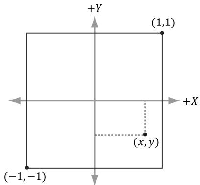


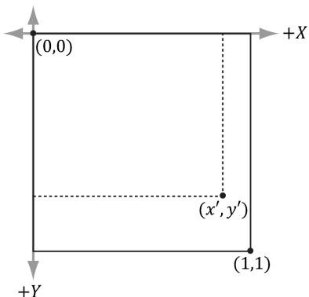


Figure 3.16. Change of coordinates from frame A (the square $[ - 1 , 1 ] ^ { 2 }$ ) to frame B (the square [0, 1]2 where the y-axes aims opposite to the one in Frame A)


22. It was mentioned in the last chapter that the determinant was related to the change in volume of a box under a linear transformation. Find the determinant of the scaling matrix and interpret the result in terms of volume. 

23. Consider the transformation $\tau$ that warps a square into a parallelogram given by: 

$$
\tau (x, y) = (3 x + y, x + 2 y)
$$

Find the standard matrix representation of this transformation, and show that the determinant of the transformation matrix is equal to the area of the parallelogram spanned by $\tau ( \mathbf { i } )$ and $\tau ( \mathbf { j } )$ . 

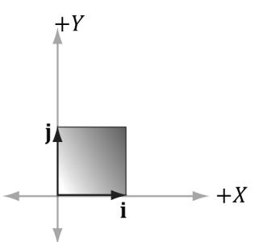


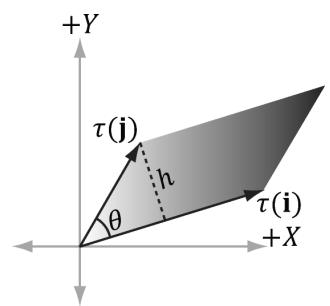


Figure 3.17. Transformation that maps square into parallelogram.


24. Show that the determinant of the y-axis rotation matrix is 1. Based on the above exercise, explain why it makes sense that it is 1. For a more computational intensive exercise, the reader can show the determinant of the general rotation matrix (rotation matrix about an arbitrary axis) is 1. 

25. A rotation matrix can be characterized algebraically as an orthogonal matrix with determinant equal to 1. If we reexamine Figure 3.7 along with Exercise 24 

this makes sense; the rotated basis vectors $\tau ( \mathbf { i } ) \textrm { , } \tau ( \mathbf { j } )$ , and $\tau ( \mathbf { k } )$ are unit length and mutually orthogonal; moreover, rotation does not change the size of the object, so the determinant should be 1. Show that the product of two rotation matrices $\mathbf { R } _ { 1 } \mathbf { R } _ { 2 } = \mathbf { R }$ is a rotation matrix. That is, show $\mathbf { R } \mathbf { R } ^ { T } = \mathbf { R } ^ { T } \mathbf { R } = \mathbf { I }$ (to show R is orthogonal), and show det $\mathbf { R } = 1$ . 

26. Show that the following properties hold for a rotation matrix R: 

a) $( \mathbf { u R } ) \cdot ( \mathbf { v R } ) = \mathbf { u } \cdot \mathbf { v }$ 

Preservation of dot product 

b) $\left. \lvert \mathbf { u R } \right. \rvert = \left. \lvert \mathbf { u } \right. \rvert$ 

Preservation of length 

c) $\theta ( \mathbf { u R } , \mathbf { v R } ) = \theta ( \mathbf { u } , \mathbf { v } )$ 

Preservation of angle, where $\theta ( \mathbf { x } , \mathbf { y } )$ 

evaluates to the angle between x and y: 

$$
\theta (\mathbf {x}, \mathbf {y}) = \cos^ {- 1} \frac {\mathbf {x} \cdot \mathbf {y}}{\| \mathbf {x} \| \| \mathbf {y} \|}
$$

Explain why all these properties make sense for a rotation transformation. 

27. Find a scaling, rotation, and translation matrix whose product transforms the line segment with start point $\mathbf { p } = ( 0 , 0 , 0 )$ and endpoint ${ \bf q } = ( 0 , 0 , 1 )$ into the line segment with length 2, parallel to the vector (1, 1, 1), with start point (3, 1, 2). 

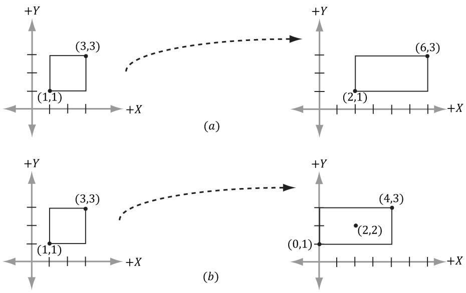


Figure 3.18. (a) Scaling 2-units on the $x \cdot$ -axis relative to the origin results in a translation of the rectangle. (b) Scaling 2-units on the x-axis relative to the center of the rectangle does not result in a translation (the rectangle maintains its original center point).


28. Suppose we have a box positioned at $( x , y , z )$ . The scaling transform we have defined uses the origin as a reference point for the scaling, so scaling this box (not centered about the origin) has the side effect of translating the box (Figure 3.18); this can be undesirable in some situations. Find a transformation that scales the box relative to its center point. 


Change coordinates to the box coordinate system with origin at the center of the box, scale the box, then transform back to the original coordinate system. 