# Direct3D Foundations

n this part, we study fundamental Direct3D concepts and techniques that are used throughout the rest of this book. With these fundamentals mastered, we can move on to writing more interesting applications. A brief description of the chapters in this part follows. 

Chapter 4, Direct3D Initialization: In this chapter, we learn what Direct3D is about and how to initialize it in preparation for 3D drawing. Basic Direct3D topics are also introduced, such as surfaces, pixel formats, page flipping, depth buffering, and multisampling. We also learn how to measure time with the performance counter, which we use to compute the frames rendered per second. In addition, we give some tips on debugging Direct3D applications. We develop and use our own application framework. 

Chapter 5, The Rendering Pipeline: In this long chapter, we provide a thorough introduction to the rendering pipeline, which is the sequence of steps necessary to generate a 2D image of the world based on what the virtual camera sees. We learn how to define 3D worlds, control the virtual camera, and project 3D geometry onto a 2D image plane. 

Chapter 6, Drawing in Direct3D: This chapter focuses on the Direct3D API interfaces and methods needed to define 3D geometry, configure the rendering pipeline, create vertex and pixel shaders, and submit geometry to the rendering pipeline for drawing. By the end of this chapter, you will be able to draw a 3D box and transform it. 

Chapter 7, Drawing in Direct3D Part II: This chapter introduces a number of drawing patterns that are used throughout the remainder of the book, from improving the workload balance between CPU and GPU to organizing how our renderer draws objects. The chapter concludes by showing how to draw more complicated objects like grids, spheres, cylinders, and an animated wave simulation. 

Chapter 8, Lighting: This chapter shows how to create light sources and define the interaction between light and surfaces via materials.  In particular, we show how to implement directional lights, point lights, and spotlights with vertex and pixel shaders. 

Chapter 9, Texturing: This chapter describes texture mapping, which is a technique used to increase the realism of the scene by mapping 2D image data onto a 3D primitive. For example, using texture mapping, we can model a brick wall by applying a 2D brick wall image onto a 3D rectangle. Other important texturing topics covered include texture tiling and animated texture transformations. 

Chapter 10, Blending: Blending allows us to implement a number of special effects, like transparency. In addition, we discuss the intrinsic clip function, which enables us to mask out certain parts of an image from showing up. For example, this can be used to implement fences and gates. We also show how to implement a fog effect. 

Chapter 11, Stenciling: This chapter describes the stencil buffer, which, like a stencil, allows us to block pixels from being drawn. Masking out pixels is a useful tool for a variety of situations. To illustrate the ideas of this chapter, we include a thorough discussion on implementing planar reflections and planar shadows using the stencil buffer. 

Chapter 12, The Geometry Shader: This chapter shows how to program geometry shaders, which are special because they can create or destroy entire geometric primitives. Some applications include billboards, fur rendering, subdivisions, and particle systems. In addition, this chapter explains primitive IDs and texture arrays. 

Chapter 13, The Compute Shader: The Compute Shader is a programmable shader Direct3D exposes that is not directly part of the rendering pipeline. It enables applications to use the graphics processing unit (GPU) for general purpose computation. For example, an imaging application can take advantage of the GPU to speed up image processing algorithms by implementing them with the compute shader. Because the Compute Shader is part of Direct3D, it reads from and writes to Direct3D resources, which enables us integrate results directly to the rendering pipeline. Therefore, in addition to general purpose computation, the compute shader is still applicable for 3D rendering. 

Chapter 14, The Tessellation Stages: This chapter explores the tessellation stages of the rendering pipeline. Tessellation refers to subdividing geometry into smaller triangles and then offsetting the newly generated vertices in some way. The motivation to increase the triangle count is to add detail to the mesh. To illustrate the ideas of this chapter, we show how to tessellate a quad patch based on distance, and we show how to render cubic Bézier quad patch surfaces. 

# Chapter 4 Direct3D Initialization
The initialization process of Direct3D requires us to be familiar with some basic Direct3D types and basic graphics concepts; the first and second sections of this chapter address these requirements. We then detail the necessary steps to initialize Direct3D. Next, a small detour is taken to introduce accurate timing and the time measurements needed for real-time graphics applications. Finally, we explore the sample framework code, which is used to provide a consistent interface that all demo applications in this book follow. 

# Objectives:

1. To obtain a basic understanding of Direct3D’s role in programming 3D hardware. 

2. To understand the role COM plays with Direct3D. 

3. To learn fundamental graphics concepts, such as how 2D images are stored, page flipping, depth buffering, multi-sampling, and how the CPU and GPU interact. 

4. To learn how to use the performance counter functions for obtaining highresolution timer readings. 

5. To find out how to initialize Direct3D. 

6. To become familiar with the general structure of the application framework that all the demos of this book employ. 

# 4.1 PRELIMINARIES

The Direct3D initialization process requires us to be familiar with some basic graphics concepts and Direct3D types. We introduce these ideas and types in this section, so that we do not have to digress when we cover the initialization process. 

# 4.1.1 Direct3D 12 Overview

Direct3D is a low-level graphics API (application programming interface) used to control and program the GPU (graphics processing unit) from our application, thereby allowing us to render virtual 3D worlds using hardware acceleration. For example, to submit a command to the GPU to clear a render target (e.g., the screen), we would call the Direct3D method ID3D12GraphicsCommandList::Cle arRenderTargetView. The Direct3D layer and hardware drivers will translate the Direct3D commands into native machine instructions understood by the system’s GPU; thus, we do not have to worry about the specifics of the GPU, so long as it supports the Direct3D version we are using. To make this work, GPU vendors like NVIDIA, Intel, and AMD must work with the Direct3D team and provide compliant Direct3D drivers. 

Direct3D 12 adds some new rendering features, but the main improvement over the previous version is that it has been redesigned to significantly reduce CPU overhead and improve multi-threading support. In order to achieve these performance goals, Direct3D 12 has become a much lower level API than Direct3D 11; it has less abstraction, requires additional manual “bookkeeping” from the developer, and more closely mirrors modern GPU architectures. The improved performance is, of course, the reward for using this more difficult API. Furthermore, new advancements in DirectX are only coming to Direct3D 12. If you want to use ray tracing or mesh shaders in Direct3D, then you are forced to use Direct3D 12. 

# 4.1.2 COM

Component Object Model (COM) is the technology that allows DirectX to be programming-language independent and have backwards compatibility. We usually refer to a COM object as an interface, which for our purposes can be thought of and used as a $\mathrm { C } { + + }$ class. Most of the details of COM are hidden to us when programming DirectX with $\mathrm { C } { + + }$ . The only thing that we must know is that we obtain pointers to COM interfaces through special functions or by the methods of another COM interface—we do not create a COM interface with the $\mathrm { C } { + + }$ new keyword. In addition, COM objects are reference counted; when we are done with an interface we call its Release method (all COM interfaces inherit 

functionality from the IUnknown COM interface, which provides the Release method) rather than delete it—COM objects will free their memory when their reference count goes to 0. 

To help manage the lifetime of COM objects, the Windows Runtime Library (WRL) provides the Microsoft::WRL::ComPtr class (#include <wrl.h>), which can be thought of as a smart pointer for COM objects. When a ComPtr instance goes out of scope, it will automatically call Release on the underlying COM object, thereby saving us from having to manually call Release. The three main ComPtr methods we use in this book are: 

1. Get: Returns a pointer to the underlying COM interface. This is often used to pass arguments to functions that take a raw COM interface pointer. For example: 

```cpp
ComPtr<ID3D12RootSignature> mRootSignature;  
...  
// SetGraphicsRootSignature expects ID3D12RootSignature* argument.  
mCommandList->SetGraphicsRootSignature(mRootSignature.Get()); 
```

2. GetAddressOf: Returns the address of the pointer to the underlying COM interface. This is often used to return a COM interface pointer through a function parameter. For example: 

```c
ComPtr<ID3D12CommandAllocator> mDirectCmdListAlloc;  
...  
ThrowIfFailed Md3dDevice->CreateCommandAllocator(D3D12_COMMAND_LIST_TYPE_DIRECT, mDirectCmdListAlloc.GetAddressOf()); 
```

3. Reset: Sets the ComPtr instance to nullptr and decrements the reference count of the underlying COM interface. Equivalently, you can assign nullptr to a ComPtr instance. 

There is, of course, much more to COM, but more detail is not necessary for using DirectX effectively. 

# 4.1.3 Textures Formats

A 2D texture is a matrix of data elements. One use for 2D textures is to store 2D image data, where each element in the texture stores the color of a pixel. However, this is not the only usage; for example, in an advanced technique called normal mapping, each element in the texture stores a 3D vector instead of a color. 

Therefore, although it is common to think of textures as storing image data, they are really more general purpose than that. A 1D texture is like a 1D array of data elements, a 2D texture is like a 2D array of data elements, and a 3D texture is like a 3D array of data elements. As will be discussed in later chapters, textures are actually more than just arrays of data; they can have mipmap levels, and the GPU can do special operations on them, such as apply filters and multi-sampling. In addition, a texture cannot store arbitrary kinds of data elements; it can only store certain kinds of data element formats, which are described by the DXGI_FORMAT enumerated type. Some example formats are: 

1. DXGI_FORMAT_R32G32B32_FLOAT: Each element has three 32-bit floating-point components. 

2. DXGI_FORMAT_R16G16B16A16_UNORM: Each element has four 16-bit components mapped to the [0, 1] range. 

3. DXGI_FORMAT_R32G32_UINT: Each element has two 32-bit unsigned integer components. 

4. DXGI_FORMAT_R8G8B8A8_UNORM: Each element has four 8-bit unsigned components mapped to the [0, 1] range. 

5. DXGI_FORMAT_R8G8B8A8_SNORM: Each element has four 8-bit signed components mapped to the [-1, 1] range. 

6. DXGI_FORMAT_R8G8B8A8_SINT: Each element has four 8-bit signed integer components mapped to the [-128, 127] range. 

7. DXGI_FORMAT_R8G8B8A8_UINT: Each element has four 8-bit unsigned integer components mapped to the [0, 255] range. 

Note that the R, G, B, A letters are used to stand for red, green, blue, and alpha, respectively. Colors are formed as combinations of the basis colors red, green, and blue (e.g., equal red and equal green makes yellow). The alpha channel or alpha component is generally used to control transparency. However, as we said earlier, textures need not store color information even though the format names suggest that they do; for example, the format 

DXGI_FORMAT_R32G32B32_FLOAT 

has three floating-point components and can therefore store any 3D vector with floating-point coordinates. There are also typeless formats, where we just reserve memory and then specify how to reinterpret the data at a later time (sort of like a $\mathrm { C } { + + }$ reinterpret cast) when the texture is bound to the pipeline; for example, the following typeless format reserves elements with four 16-bit components, but does not specify the data type (e.g., integer, floating-point, unsigned integer): 

DXGI_FORMAT_R16G16B16A16_TYPELESS 

We will see in Chapter 6 that the DXGI_FORMAT enumerated type is also used to describe vertex data formats and index data formats. 

# 4.1.4 The Swap Chain and Page Flipping

To avoid flickering in animation, it is best to draw an entire frame of animation into an off-screen texture called the back buffer. Once the entire scene has been drawn to the back buffer for the given frame of animation, it is presented to the screen as one complete frame; in this way, the viewer does not watch as the frame gets drawn—the viewer only sees complete frames. To implement this, two texture buffers are maintained by the hardware, one called the front buffer and a second called the back buffer. The front buffer stores the image data currently being displayed on the monitor, while the next frame of animation is being drawn to the back buffer. After the frame has been drawn to the back buffer, the roles of the back buffer and front buffer are reversed: the back buffer becomes the front buffer and the front buffer becomes the back buffer for the next frame of animation. Swapping the roles of the back and front buffers is called presenting. Presenting is an efficient operation, as the pointer to the current front buffer and the pointer to the current back buffer just need to be swapped. Figure 4.1 illustrates the process. 

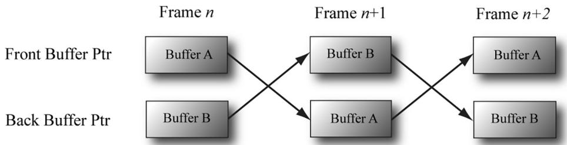


Figure 4.1. For frame n, Buffer A is currently being displayed and we render the next frame to Buffer B, which is serving as the current back buffer. Once the frame is completed, the pointers are swapped and Buffer B becomes the front buffer and Buffer A becomes the new back buffer. We then render the next frame $n { + 1 }$ to Buffer A. Once the frame is completed, the pointers are swapped and Buffer A becomes the front buffer and Buffer B becomes the back buffer again.


The front and back buffer form a swap chain. In Direct3D, a swap chain is represented by the IDXGISwapChain interface. This interface stores the front and back buffer textures, as well as provides methods for resizing the buffers (IDXGISwapChain::ResizeBuffers) and presenting (IDXGISwapChain::Present). 

Using two buffers (front and back) is called double buffering. More than two buffers can be employed; using three buffers is called triple buffering. Two buffers are usually sufficient, however. Note that presenting is usually synchronized to the monitor refresh interval; there are ways to override this, but may result in “screen tearing” where you see a portion of one frame and a portion of the next frame on the same screen. 


Even though the back buffer is a texture (so an element should be called a texel), we often call an element a pixel since, in the case of the back buffer, it stores color information. Sometimes people will call an element of a texture a pixel, even if it doesn’t store color information (e.g., “the pixels of a normal map”). 

# 4.1.5 Depth Buffering

The depth buffer is an example of a texture that does not contain image data, but rather depth information about a particular pixel. The possible depth values range from 0.0 to 1.0, where 0.0 denotes the closest an object in the view frustum can be to the viewer and 1.0 denotes the farthest an object in the view frustum can be from the viewer. There is a one-to-one correspondence between each element in the depth buffer and each pixel in the back buffer (i.e., the ijth element in the back buffer corresponds to the ijth element in the depth buffer). So if the back buffer had a resolution of $1 2 8 0 \times 1 0 2 4$ , there would be $1 2 8 0 \times 1 0 2 4$ depth entries. 

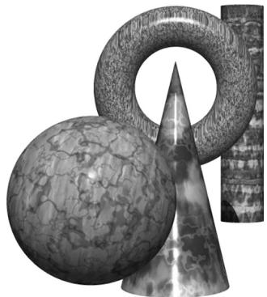


Figure 4.2. A group of objects that partially obscure each other.


Figure 4.2 shows a simple scene, where some objects partially obscure the objects behind them. In order for Direct3D to determine which pixels of an object are in front of another, it uses a technique called depth buffering or $z$ -buffering. Let us emphasize that with depth buffering, the order in which we draw the objects does not matter. 


To handle the depth problem, one might suggest drawing the objects in the scene in the order of farthest to nearest. In this way, near objects will be painted over far objects, and the correct results should be rendered. This is how a painter would draw a scene. However, this method has its own problems—sorting a large data set in back-to-front order and intersecting geometry. Besides, the graphics hardware gives us depth buffering for free. 

To illustrate how depth buffering works, let us look at an example. Consider Figure 4.3, which shows the volume the viewer sees and a 2D side view of that volume. From the figure, we observe that three different pixels compete to be rendered onto the pixel $P$ on the view window. (Of course, we know the closest pixel should be rendered to $P$ since it obscures the ones behind it, but the computer does not.) First, before any rendering takes place, the back buffer is cleared to a default color, and the depth buffer is cleared to a default value—usually 1.0 (the farthest depth value a pixel can have). Now, suppose that the objects are rendered in the order of cylinder, sphere, and cone. The following table summarizes how the pixel $P$ and its corresponding depth value $d$ are updated as the objects are drawn; a similar process happens for the other pixels. 

<table><tr><td>Operation</td><td>P</td><td>d</td><td>Description</td></tr><tr><td colspan="4"></td></tr><tr><td>Clear Operation</td><td>Black</td><td>1.0</td><td>Pixel and corresponding depth entry initialized.</td></tr><tr><td>Draw Cylinder</td><td>P3</td><td>d3</td><td>Since d3 ≤ d = 1.0 the depth test passes and we update the buffers by setting P = P3 and d = d3.</td></tr><tr><td>Draw Sphere</td><td>P1</td><td>d1</td><td>Since d1 ≤ d = d3 the depth test passes and we update the buffers by setting P = P1 and d = d1.</td></tr><tr><td>Draw Cone</td><td>P1</td><td>d1</td><td>Since d2 &gt; d = d1 the depth test fails and we do not update the buffers.</td></tr></table>

As you can see, we only update the pixel and its corresponding depth value in the depth buffer when we find a pixel with a smaller depth value. In this way, after all is said and done, the pixel that is closest to the viewer will be the one rendered. (You can try switching the drawing order around and working through this example again if you are still not convinced.) 

To summarize, depth buffering works by computing a depth value for each pixel and performing a depth test. The depth test compares the depths of pixels competing to be written to a particular pixel location on the back buffer. The pixel with the depth value closest to the viewer wins, and that is the pixel that gets written to the back buffer. This makes sense because the pixel closest to the viewer obscures the pixels behind it. 

The depth buffer is a texture, so it must be created with certain data formats. The formats used for depth buffering are as follows: 

1. DXGI_FORMAT_D32_FLOAT_S8X24_UINT: Specifies a 32-bit floating-point depth buffer, with 8-bits (unsigned integer) reserved for the stencil buffer mapped to the [0, 255] range and 24-bits not used for padding. 

2. DXGI_FORMAT_D32_FLOAT: Specifies a 32-bit floating-point depth buffer. 

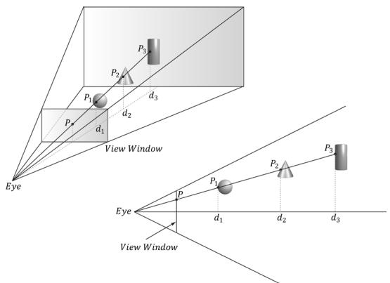


Figure 4.3. The view window corresponds to the 2D image (back buffer) we generate of the 3D scene. We see that three different pixels can be projected to the pixel P. Intuition tells us that $P _ { \mathcal { 1 } }$ should be written to $P$ since it is closer to the viewer and blocks the other two pixels. The depth buffer algorithm provides a mechanical procedure for determining this on a computer. Note that we show the depth values relative to the 3D scene being viewed, but they are actually normalized to the range [0.0, 1.0] when stored in the depth buffer.


3. DXGI_FORMAT_D24_UNORM_S8_UINT: Specifies an unsigned 24-bit depth buffer mapped to the [0, 1] range with 8-bits (unsigned integer) reserved for the stencil buffer mapped to the [0, 255] range. 

4. DXGI_FORMAT_D16_UNORM: Specifies an unsigned 16-bit depth buffer mapped to the [0, 1] range. 


An application is not required to have a stencil buffer, but if it does, the stencil buffer is always attached to the depth buffer. For example, the 32-bit format 

DXGI_FORMAT_D24_UNORM_S8_UINT 

uses 24-bits for the depth buffer and 8-bits for the stencil buffer. For this reason, the depth buffer is better called the depth/stencil buffer. Using the stencil buffer is a more advanced topic and will be explained in Chapter 11. 

# 4.1.6 Resources and Descriptors

During the rendering process, the GPU will write to resources (e.g., the back buffer, the depth/stencil buffer), and read from resources (e.g., textures that describe the appearance of surfaces, buffers that store the 3D positions of geometry in the scene). Before we issue a draw command, we need to bind (or link) the resources to the rendering pipeline that are going to be referenced in that draw call. Some of the resources may change per draw call, so we need to update 

the bindings per draw call if necessary. However, GPU resources are not bound directly. Instead, a resource is referenced through a descriptor object, which can be thought of as lightweight structure that describes the resource to the GPU. Essentially, it is a level of indirection; given a resource descriptor, the GPU can get the actual resource data and know the necessary information about it. We bind resources to the rendering pipeline by specifying the descriptors that will be referenced in the draw call. 

Why go to this extra level of indirection with descriptors? The reason is that GPU resources are essentially generic chunks of memory. Resources are kept generic so they can be used at different stages of the rendering pipeline; a common example is to use a texture as a render target (i.e., Direct3D draws into the texture) and later as a shader resource (i.e., the texture will be sampled and serve as input data for a shader). A resource by itself does not say if it is being used as a render target, depth/stencil buffer, or shader resource. Also, perhaps we only want to bind a subregion of the resource data to the rendering pipeline—how can we do that given the whole resource? Moreover, a resource can be created with a typeless format, so the GPU would not even know the format of the resource. 

This is where descriptors come in. In addition to identifying the resource data, descriptors describe the resource to the GPU: they tell Direct3D how the resource will be used (i.e., what stage of the pipeline you will bind it to), where applicable we can specify a subregion of the resource we want to bind in the descriptor, and if the resource format was specified as typeless at creation time, then we must now state the type when creating the descriptor. 


A view is a synonym for descriptor. The term “view” was used in previous versions of Direct3D, and it is still used in some parts of the Direct3D 12 API. We use both interchangeably in this book; for example, constant buffer view and constant buffer descriptor mean the same thing. 

Descriptors have a type, and the type implies how the resource will be used. The types of descriptors we use in this book are as follows: 

1. CBV/SRV/UAV descriptors describe constant buffers, shader resources, and unordered access resources. As we will see, all three of these descriptor types can be stored in the same descriptor heap. 

2. Sampler descriptors describe sampler resources (used in texturing). 

3. RTV descriptors describe render target resources. 

4. DSV descriptors describe depth/stencil resources. 

A descriptor heap is an array of descriptors; it is the memory backing for all the descriptors of a particular type your application uses. You will need a separate 

descriptor heap for each type of descriptor. You can also create multiple heaps of the same descriptor type. 

We can have multiple descriptors referencing the same resource. For example, we can have multiple descriptors referencing different subregions of a resource. Also, as mentioned, resources can be bound to different stages of the rendering pipeline. For each stage, we need a separate descriptor. For the example of using a texture as a render target and shader resource, we would need to create two descriptors: an RTV typed descriptor, and an SRV typed descriptor. Similarly, if you create a resource with a typeless format, it is possible for the elements of a texture to be viewed as floating-point values or as integers, for example; this would require two descriptors, where one descriptor specifies the floating-point format, and the other the integer format. 


Descriptors should be created at initialization time. This is because there is some type checking and validation that occurs, and it is better to do this at initialization time rather than runtime. 


The August 2009 SDK documentation says: “Creating a fully-typed resource restricts the resource to the format it was created with. This enables the runtime to optimize access […].” Therefore, you should only create a typeless resource if you really need the flexibility they provide (the ability to reinterpret the data in multiple ways with multiple views); otherwise, create a fully typed resource. 

# 4.1.7 Multisampling Theory

Because the pixels on a monitor are not infinitely small, an arbitrary line cannot be represented perfectly on the computer monitor. Figure 4.4 illustrates a “stairstep” (aliasing) effect, which can occur when approximating a line by a matrix of pixels. Similar aliasing effects occur with the edges of triangles. 

Shrinking the pixel sizes by increasing the monitor resolution can alleviate the problem significantly to where the stair-step effect goes largely unnoticed. 

When increasing the monitor resolution is not possible or not enough, we can apply antialiasing techniques. One technique, called supersampling, works by making the back buffer and depth buffer 4X bigger than the screen resolution. The 3D scene is then rendered to the back buffer at this larger resolution. Then, when it comes time to present the back buffer to the screen, the back buffer is resolved (or downsampled) such that 4 pixel block colors are averaged together to get an averaged pixel color. In effect, supersampling works by increasing the resolution in software. 

Supersampling is expensive because it increases the amount of pixel processing and memory by fourfold. Direct3D supports a compromising antialiasing 

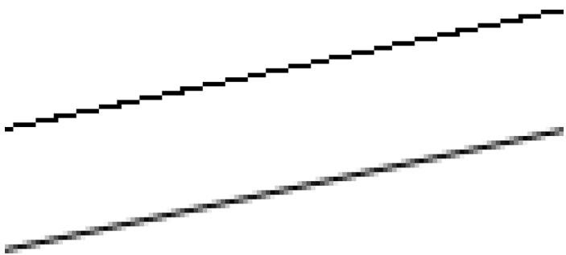


Figure 4.4. On the top we observe aliasing (the stairstep effect when trying to represent a line by a matrix of pixels) On the bottom, we see an antialiased line, which generates the final color of a pixel by sampling and using its neighboring pixels; this results in a smoother image and dilutes the stairstep effect.


technique called multisampling, which shares some computational information across subpixels making it less expensive than supersampling. Assuming we are using 4X multisampling (4 subpixels per pixel), multisampling also uses a back buffer and depth buffer 4X bigger than the screen resolution; however, instead of computing the image color for each subpixel, it computes it only once per pixel, at the pixel center, and then shares that color information with its subpixels based on visibility (the depth/stencil test is evaluated per subpixel) and coverage (does the subpixel center lie inside or outside the polygon?). Figure 4.5 shows an example. 

Observe the key difference between supersampling and multisampling. With supersampling, the image color is computed per subpixel, and so each subpixel 

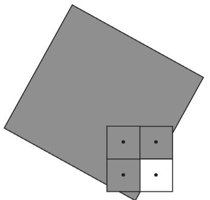


(a)


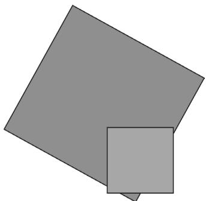


(b)


Figure 4.5. We consider one pixel that crosses the edge of a polygon. (a) The green color evaluated at the pixel center is stored in the three visible subpixels that are covered by the polygon. The subpixel in the fourth quadrant is not covered by the polygon and so does not get updated with the green color—it just keeps its previous color computed from previously drawn geometry or the Clear operation. (b) To compute the resolved pixel color, we average the four subpixels (three green pixels and one white pixel) to get a light green along the edge of the polygon. This results in a smoother looking image by diluting the stairstep effect along the edge of the polygon.


could potentially be a different color. With multisampling (Figure 4.5), the image color is computed once per pixel and that color is replicated into all visible subpixels that are covered by the polygon. Because computing the image color is one of the most expensive steps in the graphics pipeline, the savings from multisampling over supersampling is significant. On the other hand, supersampling is more accurate. 

With the popularity of affordable 4K monitors, multisampling is becoming less important than it once was. The memory cost of 4X multisampling on a 4K back/depth buffer can become cost prohibitive. In fact, with high resolution monitors, pixel processing also becomes a significant cost, so a new technique called variable-rate shading (VRS) was introduced that allows a group of pixels to be shaded as a single unit to save on computations. This could be used in parts of an image that are out of focus or not changing much where the effect of skipping samples will not be noticed. 


In Figure 4.5, we show a pixel subdivided into four subpixels in a uniform grid pattern. The actual pattern used (the points where the subpixels are positioned) can vary across hardware vendors, as Direct3D does not define the placement of the subpixels. Some patterns do better than others in certain situations. 

# 4.1.8 Multisampling in Direct3D

In the next section, we will be required to fill out a DXGI_SAMPLE_DESC structure. This structure has two members and is defined as follows: 

```c
typedef struct DXGI_SAMPLE_DESC  
{  
    UINT Count;  
    UINT Quality;  
} DXGI_SAMPLE_DESC; 
```

The Count member specifies the number of samples to take per pixel, and the Quality member is used to specify the desired quality level (what “quality level” means can vary across hardware manufacturers). Higher sample counts or higher quality is more expensive to render, so a tradeoff between quality and speed must be made. The range of quality levels depends on the texture format and the number of samples to take per pixel. 

We can query the number of quality levels for a given texture format and sample count using the ID3D12Device::CheckFeatureSupport method like so: 

```cpp
typedef struct D3D12_FEATURE_DATA Multisample_QALITY_LEVELS { DXGI_format Format; UINT SampleCount; D3D12 MULTISAMPLE_QALITY_LEVELS_FLAG Flags; 
```

```cpp
UINT NumQualityLevels;
} D3D12_FEATURE_DATAMULTISAMPLE_QUALITY_LEVELS;  
D3D12_FEATURE_DATAMULTISAMPLE QUALITY_LEVELS msQualityLevels;  
msQualityLevels.Format = mBackBufferFormat;  
msQualityLevels_SAMPLECount = 4;  
msQualityLevels Flags = D3D12MULTISAMPLE QUALITY_LEVELS_FLAG_NONE;  
msQualityLevels.NumQualityLevels = 0;  
ThrowIfFailed Md3dDevice->CheckFeatureSupport(
    D3D12_FEATUREMULTISAMPLE QUALITY_LEVELS,
    &msQualityLevels,
    sizeof(msQualityLevels));
} 
```

Note that the second parameter is both an input and output parameter. For the input, we must specify the texture format, sample count, and flag we want to query multisampling support for. The function will then fill out the quality level as the output. Valid quality levels for a texture format and sample count combination range from zero to NumQualityLevels–1. 

The maximum number of samples that can be taken per pixel is defined by: 

```m4
define D3D11_MAX Multisample_SAMPLE_COUNT (32) 
```

However, a sample count of 4 or 8 is common in order to keep the performance and memory cost of multisampling reasonable. If you do not wish to use multisampling, set the sample count to 1 and the quality level to 0. All Direct3D 11 capable devices support 4X multisampling for all render target formats. 


A DXGI_SAMPLE_DESC structure needs to be filled out for both the swap chain buffers and the depth buffer. Both the back buffer and depth buffer must be created with the same multisampling settings. 

# 4.1.9 Feature Levels

Direct3D 11 first introduced the concept of feature levels (represented in code by the D3D_FEATURE_LEVEL enumerated type), which roughly correspond to various Direct3D versions from version 9 to 12: 

```hcl
typedef
enum D3D_FEATURE_LEVEL
{
    D3D_FEATURE_LEVEL_1_0_CORE = 0x1000,
    D3D_FEATURE_LEVEL_9_1 = 0x9100,
    D3D_FEATURE_LEVEL_9_2 = 0x9200,
    D3D_FEATURE_LEVEL_9_3 = 0x9300,
    D3D_FEATURE_LEVEL_10_0 = 0xa000,
    D3D_FEATURE_LEVEL_10_1 = 0xa100,
    D3D_FEATURE_LEVEL_11_0 = 0xb000,
    D3D_FEATURE_LEVEL_11_1 = 0xb100,
    D3D_FEATURE_LEVEL_12_0 = 0xc000,
} 
```

```cpp
D3D_FEATURE_LEVEL_12_1 = 0xc100, D3D_FEATURE_LEVEL_12_2 = 0xc200 } D3D_FEATURE_LEVEL; 
```

Feature levels define a strict set of functionality (see the SDK documentation for the specific capabilities each feature level supports). For example, a GPU that supports feature level 11 must support the entire Direct3D 11 capability set, with few exceptions (some things like the multisampling count still need to be queried, as they are allowed to vary between different Direct3D 11 hardware). Feature sets make development easier—once you know the supported feature set, you know the Direct3D functionality you have at your disposal. Before feature levels, Direct3D developers were supposed to query capabilities for almost every single feature, which was quite unwieldy. 

If a user’s hardware does not support a certain feature level, the application can “fall back” to an older feature level that might be supported. For example, to support a wider audience, an application might support feature level D3D_FEATURE_ LEVEL_12_2 down to Direct3D 11 level hardware D3D_FEATURE_LEVEL_11_0. The application would check feature level support from newest to oldest. In this book, we require a GPU that supports D3D_FEATURE_LEVEL_12_2, which means it supports the latest features such as ray tracing and mesh shaders. However, real-world applications do need to worry about supporting older hardware to maximize their audience. 

# 4.1.10 DirectX Graphics Infrastructure

DirectX Graphics Infrastructure (DXGI) is an API used along with Direct3D. The basic idea of DXGI is that some graphics related tasks are common to multiple graphics APIs. For example, a 2D rendering API would need swap chains and page flipping for smooth animation just as much as a 3D rendering API; thus the swap chain interface IDXGISwapChain (§4.1.4) is actually part of the DXGI API. DXGI handles other common graphical functionality like full-screen mode transitions, enumerating graphical system information like display adapters, monitors, and supported display modes (resolution, refresh rate, and such); it also defines the various supported surface formats (DXGI_FORMAT). 

We briefly describe some DXGI concepts and interfaces that will be used during our Direct3D initialization. One of the key DXGI interfaces is the IDXGIFactory interface, which is primarily used to create the IDXGISwapChain interface and enumerate display adapters. Display adapters implement graphical functionality. Usually, the display adapter is a physical piece of hardware (e.g., graphics card); however, a system can also have a software display adapter that emulates hardware graphics functionality. A system can have several adapters (e.g., if it has several 

graphics cards). An adapter is represented by the IDXGIAdapter interface. We can enumerate all the adapters on a system with the following code: 

```cpp
void D3DApp::LogAdapters()
{
    UINT i = 0;
    IDXGIAdapter* adapter = nullptr;
    std::vector<IDXGIAdapter>adapterList;
    while (mdxgiFactory->EnumAdapters(i, &adapter) != DXGI_ERROR_NOT FOUND)
    {
        DXGI_ADAPTER_DESC desc;
        adapter->GetDesc(&desc);
        std::wstring text = L"***Adapter: ";
        text += desc.Description;
        text += L"\n";
        OutputDebugString(text.c_str());
        adapterList.push_back(adapter);
        ++i;
    }
    for (size_t i = 0; i < adapterList.size(); ++i)
    {
        LogAdapterOutputs(adapterList[i]);
        ReleaseCom(adapterList[i]);
    }
} 
```

An example of the output from this method is the following: 

```typescript
***Adapter: NVIDIA GeForce GTX 760  
***Adapter: Microsoft Basic Render Driver 
```

The “Microsoft Basic Render Driver” is a software adapter included with Windows 8 and above. 

A system can have several monitors. A monitor is an example of a display output. An output is represented by the IDXGIOutput interface. Each adapter is associated with a list of outputs. For instance, consider a system with two graphics cards and three monitors, where two monitors are hooked up to one graphics card, and the third monitor is hooked up to the other graphics card. In this case, one adapter has two outputs associated with it, and the other adapter has one output associated with it. We can enumerate all the outputs associated with an adapter with the following code: 

```cpp
void D3DApp::LogAdapterOutputs(IDXGIAdapter* adapter)  
{  
    UINT i = 0;  
    IDXGIOput* output = nullptr; 
```

```cpp
while(adapter->EnumOutputs(i, &output) != DXGI_ERROR_NOT_found) { DXGI_OUTPUT_DESC desc; output->GetDesc(&desc); std::wstring text = L"***Output: "; text += desc.DeviceName; text += L"\n"; OutputDebugString(text.c_str()); LogOutputDisplayModes(output, DXGI_FORMAT_B8G8R8A8_UNORM); ReleaseCom(output); ++i; } 
```

Note that, per the documentation, the “Microsoft Basic Render Driver” has no display outputs. 

Each monitor has a set of display modes it supports. A display mode refers to the following data in DXGI_MODE_DESC: 

```c
typedef struct DXGI_MODE_DESC   
{   
UINT Width; // Resolution width   
UINT Height; // Resolution height   
DXGI_RATIONAL RefreshRate;   
DXGI_MODE_SCANNLINE_ORDER ScanlineOrdering;   
// How the image is stretched over the monitor.   
DXGI_MODE_SCALING Scaling;   
} DXGI_MODE_DESC;   
typedef struct DXGI_RATIONAL   
{   
UINT Numerator;   
UINT Denominator;   
} DXGI_RATIONAL;   
typedef enum DXGI_MODE_SCANNLINE_ORDER   
{   
DXGI_MODE_SCANNLINE_ORDER_UNSPECIFIED = 0,   
DXGI_MODE_SCANNLINE_ORDER_PROGRESSIVE = 1,   
DXGI_MODE_SCANNLINE_ORDER_upper_FIELD_FIRST = 2,   
DXGI_MODE_SCANNLINE_ORDER_LOWER_FIELD_FIRST = 3   
} DXGI_MODE_SCANNLINE_ORDER;   
typedef enum DXGI_MODE_SCALING   
{   
DXGI_MODE_SCALING_UNSPECIFIED = 0,   
DXGI_MODE_SCALING_CENTERED = 1,   
DXGI_MODE_SCALING_STRETCHED = 2   
} DXGI_MODE_SCALING; 
```

Fixing a display mode format, we can get a list of all supported display modes an output supports in that format with the following code: 

void D3DApp::LogOutputDisplayModes(IDXGIOput \* output, DXGI_MODE format)   
{ UINT count $= 0$ .   
UINT flags $= 0$ ..   
// Call with nullptr to get list count.   
output->GetDisplayModeList.format, flags, &count, nullptr);   
std::vector<DXGI_MODE_DESC> modeList(count);   
output->GetDisplayModeList.format, flags, &count, &modeList[0]);   
for(auto& x : modeList)   
{ UINT n $=$ x.RefreshRate.Numerator;   
UINT d $=$ x.RefreshRate.Denominator; std::wstring text = L"Width $=$ " + std::to_wstring(x.Width) $^+$ L" " + L"Height $=$ " + std::to_wstring(x.Height) $^+$ L" " + L"Refresh $=$ " + std::to_wstring(n) $^+$ L"/" + std::to_wstring(d) + L"\n"; ::OutputDebugString(text.c_str()); }   
} 

An example of some of the output from this code is as follows: 

\*\*Output: \\.DISPLAY2   
Width $=$ 1920 Height $=$ 1080 Refresh $=$ 59950/1000 Width $=$ 1920 Height $=$ 1200 Refresh $=$ 59950/1000 

Enumerating display modes is particularly important when going into full-screen mode. In order to get optimal full-screen performance, the specified display mode (including refresh rate), must match exactly a display mode the monitor supports. Specifying an enumerated display mode guarantees this. 

For more reference material on DXGI, we recommend reading the online articles “DXGI Overview” and “DirectX Graphics Infrastructure: Best Practices” available online at: 

http://msdn.microsoft.com/en-us/library/windows/desktop/bb205075( $\scriptstyle \nu = \nu s . 8 5 ,$ ). aspx 

http://msdn.microsoft.com/en-us/library/windows/desktop/ee417025( $\scriptstyle \nu = \nu s . 8 5 )$ ). aspx 

https://msdn.microsoft.com/en-us/library/windows/desktop/mt427784%28v= vs.85%29.aspx 

# 4.1.11 Checking Feature Support

As new features are added to Direct3D 12, some features might not be supported by all Direct3D 12 hardware or guaranteed by a particular feature level. Therefore, support for such features needs to be checked. This is done with the ID3D12Device ::CheckFeatureSupport method. We will not discuss this function because having a GPU that supports D3D_FEATURE_LEVEL_12_2 gives us all the features we need for this book, but you should be aware of it when shipping an application that needs to support a range of hardware. The number of feature options is quite long, and we recommend looking in the Direct3D 12 documentation to at least familiarize yourself with what kind of feature support can be checked. 

# 4.1.12 Residency

A complex game will use a lot of resources such as textures and 3D meshes, but many of these resources will not be needed by the GPU all the time. For example, if we imagine a game with an outdoor forest that has a large cave in it, the cave resources will not be needed until the player enters the cave, and when the player enters the cave, the forest resources will no longer be needed. 

In Direct3D 12, applications manage resource residency (essentially, whether a resource is in GPU memory) by evicting resources from GPU memory and then making them resident on the GPU again as needed. The basic idea is to minimize how much GPU memory the application is using because there might not be enough to store every resource for the entire game, or the user has other applications running that require GPU memory. As a performance note, the application should avoid the situation of swapping the same resources in and out of GPU memory within a short time frame, as there is overhead for this. Ideally, if you are going to evict a resource, that resource should not be needed for a while. Game level/area changes are good examples of times to change resource residency. 

By default, when a resource is created it is made resident and it is evicted when it is destroyed. However, an application can manually control residency with the following methods: 

```cpp
HRESULT ID3D12Device::MakeResident(  
    UINT NumObjects,  
    ID3D12Pageable *const *ppObjects);  
HRESULT ID3D12Device::Evict(  
    UINT NumObjects,  
    ID3D12Pageable *const *ppObjects); 
```

For both methods, the second parameter is an array of ID3D12Pageable resources, and the first parameter is the number of resources in the array. 

In this book, for simplicity and due to our demos being small compared to a game, we do not manage residency. See the documentation on residency for more information: https://msdn.microsoft.com/en-us/library/windows/desktop/ $m t 1 8 6 6 2 2 \% 2 8 \nu = \nu s . 8 5 \% 2 9 . a s p .$ x 

# 4.1.13 Resources

As we will learn throughout this book, we use two kinds of resources when programming GPUs: buffers and textures. Buffers are arrays of data elements of some type. Textures were briefly introduced in $\ S 4 . 1 . 3$ and Chapter 9 covers them in detail, but for now let us just think of textures as storing a grid of image data. For performance, we want to keep resources in video memory (VRAM) which has high bandwidth to the GPU; however, it is possible for the GPU to read from system memory over the PCI express bus. The term heap is used in several places in Direct3D. For example, we have descriptor heaps and resource heaps. A heap is just a chunk of memory. A descriptor heap is the memory to store descriptors, and a resource heap is the memory to store resources (buffers and textures). 

# Committed Resources

Committed resources are the simplest and most common way of creating a resource, where a single API call creates a heap (the memory backing) at the same time as you create a resource. In this way, the heap and resource are essentially coupled together as a single entity. Creating a committed resource is a relatively expensive operation since it allocates memory. Ideally, you would create your committed resources at initialization/load time and not in the middle of rendering a frame. A committed resource is created with the ID3D12Device::CreateCommitte dResource method. The details of this method are described in $\ S 4 . 3 . 7$ . 

# Placed Resources

The idea of placed resources is that we create a large heap, and then “place” resources into the heap. In other words, it separates allocating the memory and creating the resource in that memory. It is analogous to a custom memory pool on the CPU where we allocate a fixed block of bytes and then allocate variables inside the memory pool. Because heap allocation and resource creation/destruction are separated, placed resources are much faster to create/destroy than committed resources, and would be the preferred method for on-the-fly resource creating/ destruction. 

Another motivation for placed resources is to alias memory. This basically means we overlap resources in memory provided they are not used at the same time. Typically, a frame uses several intermediate resources that are only needed for some step in the frame. For example, a blur effect might use a couple intermediate texture resources, but once the blur effect is done, those intermediate textures are no longer needed until the next frame. (Note that we would not want to delete and recreate these intermediate textures every frame as committed resource because creating committed resources is expensive.) A second special effect performed in the same frame after blurring might also need intermediate textures (possibly of different sizes or format). We could have a second set of intermediate textures for this effect. However, because we are done with the intermediate textures from the blur effect, it would be nice to reuse that memory. Placed resources allow this; see Figure 4.6. 


GPU Memory


Heap


Figure 4.6. Memory aliasing. We have a heap in GPU memory. We place resources R1, R2, and R3 in the heap. We also place resources R4 and R5 in the heap where R4 overlaps R1 and partially overlaps R2, and R5 overlaps R3.


Placed resources are particularly useful for a task/frame graph type system where memory reuse can be automated. See [Birtwistle23] and [Odonnell17]. 

A heap is created with the ID3D12Device::CreateHeap method and a placed resource is created with the ID3D12Device::CreatePlacedResource method. We do not go into details here, as we do not use placed resources in this book. We consider it more of an optimization that would add distracting complexity to this book, but it is something you would likely use for a commercial product and should at least be aware of it. 

# Reserved Resources

This is another advanced resource type that we will briefly describe, but do not use in this book. Reserved resources facilitate a virtual memory type system for GPU resources. It allows you to create very large resources that when created do not occupy any physical memory. The large resource is divided up into “tiles” and Direct3D provides APIs to move tiles in and out of physical memory as needed by the application. The idea here is that although the resource is very large, the application does not need the entire resource in physical memory for a given frame. For example, if you had a giant satellite image of the United States, but were 

zoomed in on the city of Los Angeles, then most of the image does not need to be in physical memory. As you panned the map you would move tiles in and out of physical memory. [Sandy14] and [Cebenoyan14] both give video presentations (available online) on reserved resources (which were called tiled resources in Direct3D 11). Although these presentations were made for Direct3D 11, the ideas are the same as reserved resources. 

# 4.1.14 Common Heap Types

As mentioned, a heap is just a chunk of memory. But where does this memory live? On platforms with discrete GPUs, we have CPU memory and GPU memory. 

1. D3D12_HEAP_TYPE_DEFAULT: This means to store the resource in GPU memory (VRAM). Resources in VRAM can only be read and written to by the GPU. Some resources are static and only need to be read by the GPU such as textures and 3D models. For this case, we use the next heap type (upload heap) and copy the data from system memory to resources in a default heap. Note that the GPU can access VRAM at very high bandwidth so for performance we want to use this heap type as much as possible. 

2. D3D12_HEAP_TYPE_UPLOAD: This is system memory (so it is writeable from the CPU) that is optimized for being read by the GPU over the PCI express bus. It uses write combining, which batches memory writes into large chunks for performance. Furthermore, the memory is uncached, so we should not read from it on the CPU. (A subtle performance bug is to do a $+ =$ operation on the data which does a read and write.) Reading memory in an upload heap will be limited by the PCI Express bandwidth and is usually quite a bit slower than reading from VRAM. However, GPUs can cache the data to help with this if the data is read multiple times, so it does not have to read the same data multiple times across the PCI Express bus. Data that is frequently updated by the CPU (e.g., every frame) that needs to be read by the GPU would generally be stored in an upload heap. Another option would be to use an upload heap to write the data from the CPU and then copy the data to a resource in a default heap. If the resource needs to be read multiple times by the GPU in a single frame, then this might be more efficient, as we pay the price of one copy and then the GPU can read from the resource in the default heap at high bandwidth. 

3. D3D12_HEAP_TYPE_READBACK: This is where we allocate resources that will be the target of a GPU to CPU memory copy. This will also require copying memory over the PCI Express bus. When a GPU to CPU memory copy command is issued, it is important to realize that the copy will not take place right away. 

Therefore, we want to structure our code to not block the CPU while waiting for the GPU to complete the copy. A common pattern to avoid blocking is to accept some latency in the readback data. In other words, the readback data might be a frame or two behind what the GPU is currently working on. 

4. D3D12_HEAP_TYPE_GPU_UPLOAD: At the time of this writing, this heap type is part of a developer only preview. It requires we check D3D12_FEATURE_DATA_D3D12_ OPTIONS16::GPUUploadHeapSupported support using the ID3D12Device::Chec kFeatureSupport method. It also requires some BIOS configuration. We do not use this heap type in this book, but we briefly outline it. With this heap type, we can get a pointer on the CPU directly to VRAM, and the CPU can then write directly to VRAM over the PCI Express bus. This is ideal for CPU writeable resources as you could update the resource once per frame, and then the GPU can read it directly from VRAM at high bandwidth. Another use case is that we can initialize static GPU resources directly from the CPU without having to use an upload heap and copy to a default heap. 


Figure 4.7 summarizes these heap types.


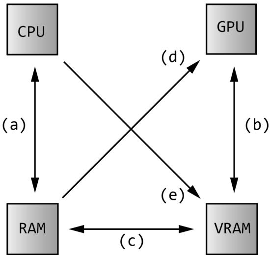


Figure 4.7. (a) The CPU can read and write to system memory. (b) The GPU can read and write to video memory (this is fast). Resources stored in VRAM are in the default heap. (c) Resources can be created in system memory in an upload heap and copied to a resource in a default heap in VRAM. Likewise, resource data can be copied from the GPU back to the CPU via readback. (d) The GPU can read from an upload heap in system memory. This is slower and limited by PCI Express bandwidth. (e) With D3D12_HEAP TYPE_GPU_UPLOAD, the CPU can write directly to VRAM over PCI Express. This is also limited by PCI Express bandwidth, but once in VRAM it can be accessed by the GPU very fast.


Further details on GPU memory can be found in the short video presentation by [Sawicki21] and the blog post by [Pettineo22]. 

# 4.2 CPU/GPU INTERACTION

We must understand that with graphics programming we have two processors at work: the CPU and GPU. They work in parallel and sometimes need to be synchronized. For optimal performance, the goal is to keep both busy for as long as possible and minimize synchronizations. Synchronizations are undesirable because it means one processing unit is idle while waiting on the other to finish some work; in other words, it ruins the parallelism. 

# 4.2.1 The Command Queue and Command Lists

The GPU has a command queue. The CPU submits commands to the queue through the Direct3D API using command lists (see Figure 4.8). It is important to understand that once a set of commands have been submitted to the command queue, they are not immediately executed by the GPU. They sit in the queue until the GPU is ready to process them, as the GPU is likely busy processing previously inserted commands. 

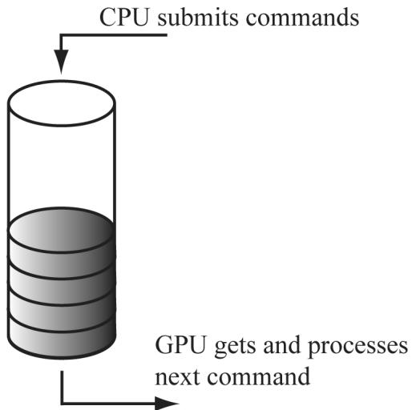


Figure 4.8. The command queue


If the command queue gets empty, the GPU will idle because it does not have any work to do; on the other hand, if the command queue gets too full, the CPU will at some point have to idle while the GPU catches up [Crawfis12]. Both of these situations are undesirable; for high performance applications like games, the goal is to keep both CPU and GPU busy to take full advantage of the hardware resources available. 

In Direct3D 12, the command queue is represented by the ID3D12CommandQueue interface. It is created by filling out a D3D12_COMMAND_QUEUE_DESC structure describing the queue and then calling ID3D12Device::CreateCommandQueue. The way we create our command queue in this book is as follows: 

```cpp
Microsoft::WRL::ComPtr&lt;ID3D12CommandQueue&gt; mCommandQueue;  
D3D12_COMMAND_queue_DESC queueDesc = {};  
queueDesc.Type = D3D12_COMMAND_LIST_TYPE_DIRECT;  
queueDesc Flags = D3D12_COMMAND_queue_FLAG_NONE;  
ThrowIfFailed Md3dDevice-&gt;CreateCommandQueue(&amp;queueDesc, IID_PPV_args(&amp;mCommandQueue)); 
```

In this book, we use a single command queue of type D3D12_COMMAND_LIST_TYPE_ DIRECT. This is perfectly fine for demos and many kinds of 3D applications. However, for a commercial level product, there are two other queues that would be used concurrently. One is called the copy queue (D3D12_COMMAND_LIST_TYPE_ COPY). The copy queue is a special queue optimized for copying data from the CPU to the GPU asynchronously. For example, to avoid long load times, your game might start rendering with low resolution textures using the main (direct) queue and asynchronously load higher resolution textures using the copy queue. Another use case would be to preemptively asynchronously load data that the game will need soon. The other type of queue you will often hear about is the compute queue (D3D12_COMMAND_LIST_TYPE_COMPUTE). The idea of the compute queue is to implement a technique called async compute. We are jumping ahead, but a typical game frame will do a lot of work: generate shadow maps, do a prepass, update particles, calculate effects like ambient occlusion and tone mapping, draw opaque objects, draw particle systems, and do post processing effects. At some point in this sequence, the entire GPU might not be fully utilized. The idea is to feed the GPU some other compute task (Compute is covered in Chapter 13) that is done in parallel to typical graphics processing (that is, work done on the direct queue). For example, in the above frame description, the GPU could work on updating particles (work from the compute queue) while generating shadow maps and doing the prepass (work from the direct queue). Ideally, the particle update will be finished by the time we are ready to draw the particles on the direct queue. If not, then we would have to block, which would ruin some of the parallelism. 

Note: 

The IID_PPV_ARGS helper macro is defined as: 

#define IID_PPV_ARGS(ppType) __uuidof(**(ppType)), IID_PPV_ARGS_ Helper(ppType) 

where __uuidof(**(ppType)) evaluates to the COM interface ID of (**(ppType)), which in the above code is ID3D12CommandQueue. The IID_PPV_ 

ARGS_Helper function essentially casts ppType to a void**. We use this macro throughout this book, as many Direct3D 12 API calls have a parameter that requires the COM ID of the interface we are creating and take a void**. 

One of the primary methods of this interface is the ExecuteCommandLists method which adds the commands in the command lists to the queue: 

```cpp
void ID3D12CommandQueue::ExecuteCommandLists( // Number of commands lists in the array  
UINT Count, // Pointer to the first element in an array of command lists  
ID3D12CommandList *const *ppCommandLists); 
```

Commands may be reordered or executed in parallel on the GPU if output is unaffected. For example, you could imagine multiple opaque draw calls being executed in parallel on the GPU, or multiple compute shaders. This is essentially how work gets scaled to more powerful GPUs with more compute units. 

As the above method declarations imply, a command list for graphics is represented by the ID3D12GraphicsCommandList interface which inherits from the ID3D12CommandList interface. The ID3D12GraphicsCommandList interface has numerous methods for adding commands to the command list. For example, the following code adds commands that set the viewport, clear the render target view, and issue a draw call: 

```cpp
// mCommandList pointer to ID3D12GraphicsCommandList  
mCommandList->RSServletports(1, &mScreenViewport);  
mCommandList->ClearRenderTargetView(mBackBufferView, Colors::LightSteelBlue, 0, nullptr);  
mCommandList->DrawIndexedInstanced(36, 1, 0, 0, 0); 
```

The names of these methods suggest that the commands are executed immediately, but they are not. The above code just adds commands to the command list. The ExecuteCommandLists method adds the commands to the command queue, and the GPU processes commands from the queue. We will learn about the various commands ID3D12GraphicsCommandList supports as we progress through this book. When we are done adding commands to a command list, we must indicate that we are finished recording commands by calling the ID3D12GraphicsCommandLi st::Close method: 

```cpp
// Done recording commands.  
mCommandList->Close(); 
```

The command list must be closed before passing it off to ID3D12CommandQueue::Ex ecuteCommandLists. 

Associated with a command list is a memory backing class called an ID3D12CommandAllocator. As commands are recorded to the command list, they 

will actually be stored in the associated command allocator. When a command list is executed via ID3D12CommandQueue::ExecuteCommandLists, the command queue will reference the commands in the allocator. A command allocator is created from the ID3D12Device and the following code shows how we create a command allocator in this book: 

```cpp
Microsoft::WRL::ComPtr<ID3D12CommandAllocator> CmdListAlloc;  
ThrowIfFailed(device->CreateCommandAllocator(D3D12_COMMAND_LIST_TYPE_DIRECT, IID_PPV_args(CmdListAlloc.GetAddressOf())); 
```

Command lists are also created from the ID3D12Device: 

```c
HRESULT ID3D12Device::CreateCommandList(  
    UINT nodeMask,  
    D3D12_COMMAND_LIST_TYPE type,  
    ID3D12CommandAllocator *pCommandAllocator,  
    ID3D12PipelineState *pInitialState,  
    REFIID riid,  
    void **ppCommandList); 
```

1. nodeMask: Set to 0 for single GPU system. Otherwise, the node mask identifies the physical GPU this command list is associated with. In this book we assume single GPU systems. 

2. type: The type of command list: we use D3D12_COMMAND_COMMAND_LIST_TYPE_ DIRECT in this book. 

3. pCommandAllocator: The allocator to be associated with the created command list. The command allocator type must match the command list type. 

4. pInitialState: Specifies the initial pipeline state of the command list. This can be null for bundles, and in the special case where a command list is executed for initialization purposes and does not contain any draw commands. We discuss ID3D12PipelineState in Chapter 6. 

5. riid: The COM ID of the ID3D12CommandList interface we want to create. 

6. ppCommandList: Outputs a pointer to the created command list. 

Note: 

You can use the ID3D12Device::GetNodeCount method to query the number of GPU adapter nodes on the system. 

You can create multiple command lists associated with the same allocator, but you cannot record at the same time. That is, all command lists must be closed except the one whose commands we are going to record. Thus, all commands from a given command list will be added to the allocator contiguously. Note that when a 

command list is created or reset, it is in an “open” state. So if we tried to create two command lists in a row with the same allocator, we would get an error: 

D3D12 ERROR: ID3D12CommandList::{Create,Reset}CommandList: The command allocator is currently in-use by another command list. 

After we have called ID3D12CommandQueue::ExecuteCommandList(C), it is safe to reuse the internal memory of C to record a new set of commands by calling the ID3D12CommandList::Reset method. The parameters of this method are the same as the matching parameters in ID3D12Device::CreateCommandList. 

```cpp
HRESULT ID3D12CommandList::Reset( ID3D12CommandAllocator \*pAllocator, ID3D12PipelineState \*pInitialState); 
```

This method puts the command list in the same state as if it was just created, but allows us to reuse the internal memory and avoid deallocating the old command list and allocating a new one. Note that resetting the command list does not affect the commands in the command queue because the associated command allocator still has the commands in memory that the command queue references. 

After we have submitted the rendering commands for a complete frame to the GPU, we would like to reuse the memory in the command allocator for the next frame. The ID3D12CommandAllocator::Reset method may be used for this: 

```cpp
HRESULT ID3D12CommandAllocator::Reset(void); 
```

The idea of this is analogous to calling std::vector::clear, which resizes a vector back to zero, but keeps the current capacity the same. However, because the command queue may be referencing data in an allocator, a command allocator must not be reset until we are sure the GPU has finished executing all the commands in the allocator; how to do this is covered in the next section. 

# 4.2.2 CPU/GPU Synchronization

Due to having two processors running in parallel, a number of synchronization issues appear. 

Suppose we have some resource $R$ that stores the position of some geometry we wish to draw. Furthermore, suppose the CPU updates the data of R to store position $\scriptstyle { p _ { 1 } }$ and then adds a drawing command $C$ that references $R$ to the command queue with the intent of drawing the geometry at position $\scriptstyle { p _ { 1 } }$ . Adding commands to the command queue does not block the CPU, so the CPU continues on. It would be an error for the CPU to continue on and overwrite the data of $R$ to store a new position $\scriptstyle { p _ { 2 } }$ before the GPU executed the draw command $R$ (see Figure 4.9). 

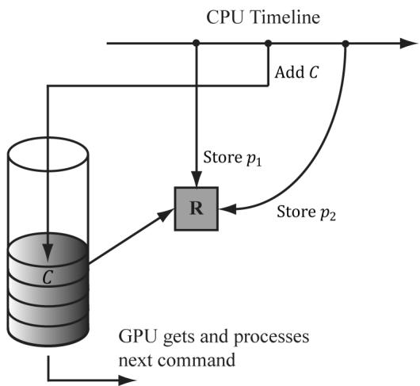


Figure 4.9. This is an error because C draws the geometry with $\pmb { \mathscr { p } } _ { 2 }$ or draws while $R$ is in the middle of being updated. In any case, this is not the intended behavior.


One solution to this situation is to force the CPU to wait until the GPU has finished processing all the commands in the queue up to a specified fence point. We call this flushing the command queue. We can do this using a fence. A fence is represented by the ID3D12Fence interface and is used to synchronize the GPU and CPU. A fence object can be created with the following method: 

```cpp
HRESULT ID3D12Device::CreateFence(  
    UINT64 InitialValue,  
    D3D12_FENCE Flags Flags,  
    REFIID riid,  
    void **ppFence);  
// Example  
ThrowIfFailed Md3dDevice->CreateFence(  
    0,  
    D3D12_FENCE_FLAG_NONE,  
    IID_PPV_args(&mFence)); 
```

A fence object maintains a UINT64 value, which is just an integer to identify a fence point in time. We start at value zero and every time we need to mark a new fence point, we just increment the integer. Now, the following code/comments show how we can use a fence to flush the command queue. 

UINT64 mCurrentFence $= 0$ void D3DApp::FlushCommandQueue()   
{ // Advance the fence value to mark commands up to this fence point. mCurrentFence++; // Add an instruction to the command queue to set a new fence point. // Because we are on the GPU timeline, the new fence point won't be // set until the GPU finishes 

```cpp
// processing all the commands prior to this Signal().  
ThrowIfFailed(mCommandQueue->Signal(mFence.Get(), mCurrentFence));  
// Wait until the GPU has completed commands up to this fence point.  
if(mFence->GetCompletedValue() < mCurrentFence)  
{  
    HANDLE eventHandle = CreateEventEx(nullptr, false, false, EVENT_ALL_ACCESS);  
    // Fire event when GPU hits current fence.  
    ThrowIfFailed(mFence->SetEventOnCompletion(mCurrentFence, eventHandle));  
    // Wait until the GPU hits current fence event is fired.  
    WaitForSingleObject(eventHandle, INFINITE);  
    CloseHandle(eventHandle);  
} 
```


Figure 4.10 explains this code graphically.


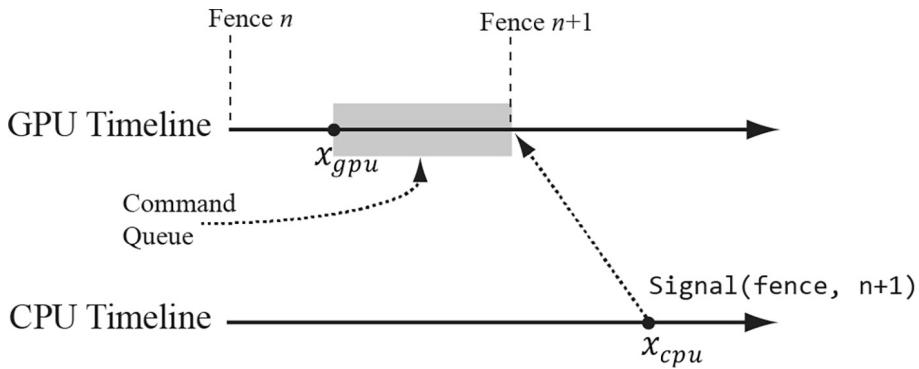


Figure 4.10. At this snapshot, the GPU has processed commands up to $x _ { g p u }$ and the CPU has just called the ID3D12CommandQueue::Signal(fence, $\nrightarrow 1$ ) method. This essentially adds an instruction to the end of the queue to change the fence value to $n { + 1 }$ . However, mFence->GetCompletedValue() will continue to return n until the GPU processes all the commands in the queue that were added prior to the Signal(fence, $n { + 1 }$ ) instruction.


So in the previous example, after the CPU issued the draw command C, it would flush the command queue before overwriting the data of $R$ to store a new position ${ \boldsymbol { p } } _ { 2 }$ . This solution is not ideal because it means the CPU is idle while waiting for the GPU to finish, but it provides a simple solution that we will use until Chapter 7. You can flush the command queue at almost any point (not necessarily only once per frame); if you have some initialization GPU commands, you can flush the command queue to execute the initialization before entering the main rendering loop, for example. 

Note that flushing the command queue also can be used to solve the problem we mentioned at the end of the last section; that is, we can flush the command queue to be sure that all the GPU commands have been executed before we reset the command allocator. 

# 4.2.3 Resource Transitions

To implement common rendering effects, it is common for the GPU to write to a resource $R$ in one step, and then, in a later step, read from the resource R. However, it would be a resource hazard to read from a resource if the GPU has not finished writing to it or not started writing at all. To solve this problem, Direct3D associates a state to resources. Resources are in a default state when they are created, and it is up to the application to tell Direct3D any state transitions. This enables the GPU to do any work it needs to do to make the transition and prevent resource hazards. For example, if we are writing to a resource, say a texture, we will set the texture state to a render target state; when we need to read the texture, we will change its state to a shader resource state. By informing Direct3D of a transition, the GPU can take steps to avoid the hazard, for example, by waiting for all the write operations to complete before reading from the resource. The burden of resource transition falls on the application developer for performance reasons. The application developer knows when these transitions are happening. An automatic transition tracking system would impose additional overhead. 

A resource transition is specified by setting an array of transition resource barriers on the command list; it is an array in case you want to transition multiple resources with one API call. In code, a resource barrier is represented by the D3D12_RESOURCE_BARRIER_DESC structure. The following helper function (defined in d3dx12.h) returns a transition resource barrier description for a given resource, and specifies the before and after states: 

```cpp
struct CD3DX12Resource_BARRIER : public D3D12Resource_BARRIER {
    // [... ] convenience methods
}
static inline CD3DX12Resource_BARRIER Transition(
    _In_ID3D12Resource* pResource,
    D3D12Resource STATES stateBefore,
    D3D12Resource STATES stateAfter,
    UINT subresource = D3D12Resource_BARRIER_ALL_SUBRESOURCES,
    D3D12Resource_BARRIER_FLAGS flags = D3D12Resource_BARRIER_FLAG_NON)
{
    CD3DX12Resource_BARRIER result;
    ZeroMemory(&result, sizeof(result));
    D3D12Resource_BARRIER &barrier = result;
    result.Type = D3D12Resource_BARRIER_TYPE_TRANSITION;
    resultFLAGS = flags;
    barrier.Transition.pResource = pResource;
    barrier.Transition.StateBefore = stateBefore;
    barrier.Transition.StateAfter = stateAfter;
    barrier.Transition.Subresource = subresource;
    return result;
} 
```

```javascript
// [...] more convenience methods }; 
```


Observe that CD3DX12_RESOURCE_BARRIER extends D3D12_RESOURCE_BARRIER_ DESC and adds convenience methods. Most Direct3D 12 structures have extended helper variations, and we prefer those variations for the convenience. The CD3DX12 variations are all defined in d3dx12.h. This file is not part of the core DirectX 12 SDK but is available for download from Microsoft. For convenience, a copy is included in the Common directory of the book’s source code. 

An example of this function from this chapter’s sample application is as follows: 

```cpp
mCommandList->ResourceBarrier(1, &CD3DX12_RESOURCE_BARRIER::Transition(CurrentBackBuffer(), D3D12_RESOURCE_STATE_present, D3D12_RESOURCE_STATE-render_TARGET)); 
```

This code transitions a texture representing the image we are displaying on screen from a presentation state to a render target state. Observe that the resource barrier is added to the command list. You can think of the resource barrier transition as a command itself instructing the GPU that the state of a resource is being transitioned, so that it can take the necessary steps to prevent a resource hazard when executing subsequent commands. 


There are other types of resource barriers besides transition types. For now, we only need the transition types. We will introduce the other types when we need them. 

# 4.2.4 Multithreading with Commands

Direct3D 12 was designed for efficient multithreading. The command list design is one way Direct3D takes advantage of multithreading. For large scenes with lots of objects, building the command list to draw the entire scene can take CPU time. So the idea is to build command lists in parallel; for example, you might spawn four threads, each responsible for building a command list to draw $2 5 \%$ of the scene objects. 

A few things to note about command list multithreading: 

1. Command list are not free-threaded; that is, multiple threads may not share the same command list and call its methods concurrently. So generally, each thread will get its own command list. 

2. Command allocators are not free-threaded; that is, multiple threads may not share the same command allocator and call its methods concurrently. So generally, each thread will get its own command allocator. 

3. The command queue is free-threaded, so multiple threads can access the command queue and call its methods concurrently. In particular, each thread can submit their generated command list to the thread queue concurrently. 

4. For performance reasons, the application must specify at initialization time the maximum number of command lists they will record concurrently. 

For simplicity, we will not use multithreading in this book. Once the reader is finished with this book, we recommend they study the Multithreading12 SDK sample to see how command lists can be generated in parallel. Applications that want to maximize system resources should use multithreading to take advantage of multiple CPU cores. 

# 4.3 INITIALIZING DIRECT3D

The following subsections show how to initialize Direct3D for our demo framework. It is a long process, but only needs to be done once. Our process of initializing Direct3D can be broken down into the following steps: 

1. Create the ID3D12Device using the D3D12CreateDevice function. 

2. Create an ID3D12Fence object. 

3. Create the command queue, command list allocator, and main command list. 

4. Describe and create the swap chain. 

5. Create the descriptor heaps the application requires. 

6. Resize the back buffer and create a render target view to the back buffer. 

7. Create the depth/stencil buffer and its associated depth/stencil view. 

8. Set the viewport and scissor rectangles. 

# 4.3.1 Create the Device

Initializing Direct3D begins by creating the Direct3D 12 device (ID3D12Device). The device represents a display adapter. Usually, the display adapter is a physical piece of 3D hardware (e.g., graphics card); however, a system can also have a software display adapter that emulates 3D hardware functionality (e.g., the WARP adapter). The Direct3D 12 device is used to check feature support, and create all 

other Direct3D interface objects like resources, views, and command lists. The device can be created with the following function: 

```c
HRESULT WINAPI D3D12CreateDevice(IUnknown\* pAdapter, D3D_FEATURE_LEVEL MinimumFeatureLevel, REFIID riid, // Expected: ID3D12Device void\*\* ppDevice); 
```

1. pAdapter: Specifies the display adapter we want the created device to represent. Specifying null for this parameter uses the primary display adapter. We always use the primary adapter in the sample programs of this book. $\ S 4 . 1 . 1 0$ showed how to enumerate all the system’s display adapters. 

2. MinimumFeatureLevel: The minimum feature level our application requires support for; device creation will fail if the adapter does not support this feature level. In our framework, we specify D3D_FEATURE_LEVEL_12_2 (i.e., Direct3D 12 feature support with ray tracing and mesh shaders). 

3. riid: The COM ID of the ID3D12Device interface we want to create. 

4. ppDevice: Returns the created device. 

Here is an example call of this function: 

UINT factoryFlags $= 0$ #if defined DEBUG) || defined(_DEBUG) factoryFlags $\equiv$ DXGI_CREATE_FFACTORY_DEBUG; // Enable the D3D12 debug layer. ComPtr<ID3D12Debug> debugController0; ComPtr<ID3D12Debug1> debugController1; ThrowIfFailed(D3D12GetDebugInterface(IID_PPV_ ARGS(&debugController0)); ThrowIfFailed(debugController0->QueryInterface(IID_PPV_ ARGS(&debugController1)); debugController1->EnableDebugLayer(); //debugController1->SetEnableGPUBasedValidation(true); #endif ThrowIfFailed(CreateDXGIFactory2( factoryFlags, IID_PPV.ArgS(&mdxgiFactory)); std::vector<ComPtr<IDXGIAAdapter> adapters; ComPtr<IDXGIAAdapter> foundAdapter; // Find an adapter that supports D3D_FEATURE_LEVEL_12_2. // This is mainly for laptops so it picks the discrete // GPU over the integrated GPU. HRESULT hardwareResult $=$ E_FAIL; 

```c
for(int i = 0; mdxgiFactory->EnumAdapters(i, &foundAdapter) != DXGI_ERROR_NOT_found; ++i) { // Try to create hardware device. ComPtr<ID3D12Device> device = nullptr; hardwareResult = D3D12CreateDevice( foundAdapter.Get(), D3D_FEATURE_LEVEL_12_2, IID_PPV.ArgS(&device)); if (SUCCEEDED(hardwareResult)) { ThrowIfFailed(device->QueryInterface( IID_PPV.ArgS(&md3dDevice)); break; } } 
```

Note that md3dDevice is of type ID3D12Device5. This is just interface versioning. We need interface version 5 to get access to the newer ray tracing and mesh shader APIs. Checking and getting a newer interface is done with the COM QueryInterface method. In the demo code, we will see several places where we do similar things. 

Observe that we first enable the debug layer for debug mode builds. When the debug layer is enabled, Direct3D will enable extra debugging and send debug messages to the $\mathrm { V C } { + + }$ output window like the following: 

D3D12 ERROR: ID3D12CommandList::Reset: Reset fails because the command list was not closed. 

The mdxgiFactory object will also be used to create our swap chain since it is part of the DXGI. 

# 4.3.2 Create the Fence

After we have created our device, we can create our fence object for CPU/GPU synchronization. 

ThrowIfFailed(md3dDevice->CreateFence( 0, D3D12_FENCE_FLAG_NONE, IID_PPV_ARGS(&mFence))); 

# 4.3.3 Create Command Queue and Command List

Recall from $\ S 4 . 2 . 1$ that a command queue is represented by the ID3D12CommandQueue interface, a command allocator is represented by the ID3D12CommandAllocator interface, and a command list is represented by the ID3D12GraphicsCommandList 

interface. The following function shows how we create a command queue, command allocator, and command list: 

```cpp
ComPtr<ID3D12CommandQueue> mCommandQueue; ComPtr<ID3D12CommandAllocator> mDirectCmdListAlloc; ComPtr<ID3D12GraphicsCommandList6> mCommandList; void D3DApp::CreateCommandObjects() { D3D12_COMMAND_queue_DESC queueDesc = {}; queueDesc.Type = D3D12_COMMAND_LIST_TYPE_DIRECT; queueDescFLAGS = D3D12_COMMAND_queue_FLAG_NONe; ThrowIfFailed (md3dDevice->CreateCommandQueue ( &queueDesc, IID_PPV_args (&mCommandQueue)); ThrowIfFailed (md3dDevice->CreateCommandAllocator( D3D12_COMMAND_LIST_TYPE_DIRECT, IID_PPV_args(mDirectCmdListAlloc.GetAddressOf())); ThrowIfFailed (md3dDevice->CreateCommandList( 0, D3D12_COMMAND_LIST_TYPE_DIRECT, mDirectCmdListAlloc.Get(), // Associated command allocator nullptr, // Initial PipelineStateObject IID_PPV_args(mCommandList↘GetAddressOf())); ThrowIfFailed (cmdList->QueryInterface (IID_PPV_ ARGS (&mCommandList))); // Start off in a closed state. This is because the first time we // refer to the command list we will Reset it, and it needs to be // closed before calling Reset. mCommandList->Close(); } 
```

Note that mCommandList is of type ID3D12GraphicsCommandList6. This is just interface versioning. We need interface version 6 to get access to the newer ray tracing and mesh shader APIs. Checking and getting a newer interface is done with the COM QueryInterface method. 

Observe that for CreateCommandList, we specify null for the pipeline state object parameter. In this chapter’s sample program, we do not issue any draw commands, so we do not need a valid pipeline state object. We will discuss pipeline state objects in Chapter 6. 

# 4.3.4 Describe and Create the Swap Chain

The next step in the initialization process is to create the swap chain. This is done by first filling out an instance of the DXGI_SWAP_CHAIN_DESC structure, 

which describes the characteristics of the swap chain we are going to create. This structure is defined as follows: 

```c
typedef struct DXGI_swapCHAIN_DESC   
{ DXGI_MODE_DESC BufferDesc; DXGI_SAMPLE_DESC SampleDesc; DXGI_USAGE BufferUsage; UINT BufferCount; HWND OutputWindow; BOOL Windowed; DXGI_swap_EFFECT SwapEffect; UINT Flags;   
}DXGI_swapCHAIN_DESC; 
```

The DXGI_MODE_DESC type is another structure, defined as: 

```c
typedef struct DXGI_MODE_DESC   
{ UINT Width; //Buffer resolution width   
UINT Height; //Buffer resolution height   
DXGI_RATIONAL RefreshRate;   
DXGI_FORMAT Format; //Buffer display format   
DXGI_MODE_SCANNLINE_ORDER ScanlineOrdering; //Progressive vs. interlaced   
DXGI_MODE_SCALING Scaling; //How the image is stretched //over the monitor.   
}DXGI_MODE_DESC; 
```

Note: 

In the following data member descriptions, we only cover the common flags and options that are most important to a beginner at this point. For a description of further flags and options, refer to the SDK documentation. 

1. BufferDesc: This structure describes the properties of the back buffer we want to create. The main properties we are concerned with are the width and height, and pixel format; see the SDK documentation for further details on the other members. 

2. SampleDesc: The number of multisamples and quality level; see $\ S 4 . 1 . 8$ . For single sampling, specify a sample count of 1 and quality level of 0. 

3. BufferUsage: Specify DXGI_USAGE_RENDER_TARGET_OUTPUT since we are going to be rendering to the back buffer (i.e., use it as a render target). 

4. BufferCount: The number of buffers to use in the swap chain; specify two for double buffering. 

5. OutputWindow: A handle to the window we are rendering into. 

6. Windowed: Specify true to run in windowed mode or false for full-screen mode. 

7. SwapEffect: Specify DXGI_SWAP_EFFECT_FLIP_DISCARD. 

8. Flags: Optional flags. If you specify DXGI_SWAP_CHAIN_FLAG_ALLOW_MODE_ SWITCH, then when the application is switching to full-screen mode, it will choose a display mode that best matches the current application window dimensions. If this flag is not specified, then when the application is switching to full-screen mode, it will use the current desktop display mode. 

After we have described out swap chain, we can create it with the IDXGIFactory::CreateSwapChain method: 

```cpp
HRESULT IDXGIFactory::CreateSwapChain(IUnknown *pDevice, // Pointer to ID3D12CommandQueue. DXGI_swapCHAIN_DESC *pDesc, // Pointer to swap chain description. IDXGISwapChain **ppSwapChain); // Returns created swap chain interface. 
```

The following code shows how we create the swap chain in our sample framework. Observe that this function has been designed so that it can be called multiple times. It will destroy the old swap chain before creating the new one. This allows us to recreate the swap chain with different settings; in particular, when the window is resized. 

DXGI_FORMAT mBackBufferFormat $\equiv$ DXGI_FORMAT_R8G8B8A8_UNORM;   
Microsoft::WRL::ComPtr<IDXGISwapChain4> mSwapChain;   
void D3DApp::CreateSwapChain()   
{ // Release the previous swapchain we will be recreating. mSwapChain Reset(); DXGI_swapCHAIN_DESC1 sd; sd.Width $=$ mClientWidth; sd.Height $=$ mClientHeight; sd.Format $=$ mBackBufferFormat; sd.Stereo $=$ false; sdSampleDesc.Count $= 1$ . sdSampleDesc.Quality $= 0$ . sd_bufferUsage $\equiv$ DXGI_USAGE_RENDER_TARGET_OUTPUT; sd_bufferCount $=$ SwapChainBufferCount; sd.Scaling $\equiv$ DXGI_SCALING_NONE; sd.SwapEffect $\equiv$ DXGI_swap_EFFECT_FLIP_DISCARD; sd ALPHAMode $\equiv$ DXGI ALPHA_MODE_UNSPECIFIED; sdFLAGS $\equiv$ DXGI_swapCHAIN_FLAG ALLOW_MODE_SWITCH; // Note: Swap chain uses queue to perform flush. ComPtr<IDXGISwapChain1> swapChain1; ThrowIfFailed(mdxgiFactory->CreateSwapChainForHwnd( mCommandQueue.Get(), mhMainWnd, &sd, 

```cpp
nullptr,   
nullptr,   
swapChain1.GetAddressOf();   
ThrowIfFailed(swapChain1.As(&mSwapChain));   
} 
```

# 4.3.5 Create the Descriptor Heaps

We need to create the descriptor heaps to store the descriptors/views (§4.1.6) our application needs. A descriptor heap is represented by the ID3D12DescriptorHeap interface. A heap is created with the ID3D12Device::CreateDescriptorHeap method. In this chapter’s sample program, we need SwapChainBufferCount many render target views (RTVs) to describe the buffer resources in the swap chain we will render into, and one depth/stencil view (DSV) to describe the depth/ stencil buffer resource for depth testing. Therefore, we need a heap for storing SwapChainBufferCount RTVs, and we need a heap for storing one DSV. We define the following helper class (Common/DescriptorUtil.h/.cpp) for managing a heap: 

class DescriptorHeap   
{   
public: DescriptorHeap() $=$ default; DescriptorHeap(const DescriptorHeap& rhs) $=$ delete; DescriptorHeap& operator=(const DescriptorHeap& rhs) $=$ delete; void Init(ID3D12Device\* device, D3D12 DescriptorHEAP_TYPE type, UINT capacity); ID3D12DescriptorHeap\* GetD3dHeap() const; CD3DX12_CPU DescriptorHandle CpuHandle( uint32_t index); CD3DX12_GPU DescriptorHandle GpuHandle( uint32_t index); protected: Microsoft::WRL::ComPtr<ID3D12DescriptorHeap> mHeap $\equiv$ nullptr; UINT mDescriptorSize $= 0$ .   
}；   
void DescriptorHeap::Init(ID3D12Device\* device, D3D12 DescriptorHEAP_TYPE type, UINT capacity)   
{ assert(mHeap $\equiv$ nullptr); D3D12 DescriptorHEAP_DESC heapDesc; heapDesc.NumDescriptors $=$ capacity; heapDesc.Type $=$ type; heapDescFLAGS $\equiv$ type $\equiv$ D3D12 DescriptorHEAP_TYPE_CBV_SRV_UAV || type $\equiv$ D3D12 DescriptorHEAP_TYPE_SAMPLEER ? D3D12 DescriptorHEAP_FLAGSHADER.Visible : 

D3D12 DescriptorHeap_FLAG_NONE; heapDesc.NodeMask $= 0$ ： ThrowIfFailed(device->CreateDescriptorHeap( &heapDesc，IID_PPV_args(mHeap.GetAddressOf())）； mDescriptorSize $\equiv$ device->GetDescriptorHandleIncrementSize(type);   
}   
ID3D12DescriptorHeap\* DescriptorHeap::GetD3dHeap()const { return mHeap.Get();   
}   
CD3DX12_CPU DescriptorHANDLE DescriptorHeap::CpuHandle(void32_t index) { Auto hcpu $=$ CD3DX12_CPU DescriptorHANDLE( mHeap->GetCPUDescriptorHandleForHeapStart()); hcpu Offset(index，mDescriptorSize); return hcpu;   
}   
CD3DX12_CPU Descriptor HANDLE DescriptorHeap::GpuHandle(void32_t index) { auto hgpu $=$ CD3DX12GPU Descriptor HANDLE( mHeap->GetGPUDescriptorHandleForHeapStart()); hgpu Offset(index，mDescriptorSize); return hgpu; 

Note that RTV and DSV descriptors are not considered shader visible because we do not access these resources explicitly in a shader program. Descriptor sizes can vary across GPUs; therefore, after creating the heap, we need to query the descriptor size using GetDescriptorHandleIncrementSize. This is needed to index into the descriptor heap to get a descriptor handle at each index in the heap. Each descriptor has two different kinds of handles: a CPU handle and a GPU handle. The CPU handle is used to identify the resource on the CPU and the GPU handle is used to identify the resource on the GPU (e.g., ID3D12GraphicsCommandList: :SetGraphicsRootDescriptorTable takes a GPU handle because the resources identified by the table of descriptors will be read by the GPU). 

These heaps are created with the following code: 

```cpp
DescriptorHeap mRtvHeap;   
DescriptorHeap mDsvHeap;   
void D3DApp::CreateRtvAndDsvDescriptorHeaps()   
{ mRtvHeap Init (md3dDevice.Get(), D3D12 Descriptor_TYPE_RTV, SwapChainBufferCount); mDsvHeap. Init (md3dDevice.Get(), D3D12 Descriptor_TYPE_DSV, 1); 
```

In our application framework, we define: 

```cpp
static const int SwapChainBufferCount = 2;  
int mCurrBackBuffer = 0; 
```

We keep track of the current back buffer index with mCurrBackBuffer (recall that the front and back buffers get swapped in page flipping, so we need to track which buffer is the current back buffer, so we know which one to render to). 

The following functions get the current back buffer RTV and DSV, respectively: 

```cpp
CD3DX12_CPU DescriptorHandle D3DApp::CurrentBackBufferView()
{
    return mRtvHeap.CpuHandle(mCurrBackBuffer);
} 
```

# 4.3.6 Create the Render Target View

As said in $\ S 4 . 1 . 6$ , we do not bind a resource to a pipeline stage directly; instead, we must create a resource view (descriptor) to the resource and bind the view to the pipeline stage. In particular, to bind the back buffer to the output merger stage of the pipeline (so Direct3D can render onto it), we need to create a render target view to the back buffer. The first step is to get the buffer resources which are stored in the swap chain: 

```cpp
HRESULT IDXGISwapChain::GetBuffer(  
    UINT Buffer,  
    REFIID riid,  
    void **ppSurface); 
```

1. Buffer: An index identifying the back buffer we want to get (in case there is more than one). 

2. riid: The COM ID of the ID3D12Resource interface we want to obtain a pointer to. 

3. ppSurface: Returns a pointer to an ID3D12Resource that represents the back buffer. 

The call to IDXGISwapChain::GetBuffer increases the COM reference count to the back buffer, so we must release it when we are finished with it. This is done automatically if using a ComPtr. 

To create the render target view, we use the ID3D12Device::CreateRenderTargetView method: 

```cpp
void ID3D12Device::CreateRenderTargetView(ID3D12Resource *pResource, const D3D12_RENDER_TARGET.View_DESC *pDesc, D3D12_CPU DescriptorHandle DestDescriptor); 
```

1. pResource: Specifies the resource that will be used as the render target, which, in the example above, is the back buffer (i.e., we are creating a render target view to the back buffer). 

2. pDesc: A pointer to a D3D12_RENDER_TARGET_VIEW_DESC. Among other things, this structure describes the data type (format) of the elements in the resource. If the resource was created with a typed format (i.e., not typeless), then this parameter can be null, which indicates to create a view to the first mipmap level of this resource (the back buffer only has one mipmap level) with the format the resource was created with. (Mipmaps are discussed in Chapter 9.) Because we specified the type of our back buffer, we specify null for this parameter. 

3. DestDescriptor: Handle to the descriptor that will store the created render target view. 

Below is an example of calling these two methods where we create an RTV to each buffer in the swap chain: 

```cpp
ComPtr<ID3D12Resource> mSwapChainBuffer[SwapChainBufferCount];  
for (UINT i = 0; i < SwapChainBufferCount; i++)  
{  
    ThrowIfFailed(mSwapChain->GetBuffer(i, IID_PPVALRS(&mSwapChainBuffer[i])));  
    md3dDevice->CreateRenderTargetView(mSwapChainBuffer[i].Get(), nullptr, mRtvHeap.CpuHandle(i));  
} 
```

# 4.3.7 Create the Depth/Stencil Buffer and View

We now need to create the depth/stencil buffer. As described in $\ S 4 . 1 . 5$ , the depth buffer is just a 2D texture that stores the depth information of the nearest visible objects (and stencil information if using stenciling). A texture is a kind of GPU resource, so we create one by filling out a D3D12_RESOURCE_DESC structure describing the texture resource, and then calling the ID3D12Device::CreateCommi ttedResource method. The D3D12_RESOURCE_DESC structure is defined as follows: 

```cpp
typedef struct D3D12.Resource_DESC
{
    D3D12.Resource_DIMENSION Dimension;
    UINT64 Alignment;
    UINT64 Width;
    UINT Height;
    UINT16 DepthOrArraySize;
    UINT16 MipLevels;
    DXGI_format Format;
    DXGI_SAMPLE_DESC SampleDesc;
    D3D12TEXTURE_LAYOUT Layout;
    D3D12RESOURCE_misc_FLAG MiscFlags;
} D3D12.Resource_DESC; 
```

1. Dimension: The dimension of the resource, which is one of the following enumerated types: 

```cpp
enum D3D12_RESOURCE_DIMENSION  
{  
    D3D12.Resource_DIMENSION unknow = 0,  
    D3D12.Resource_DIMENSION_BUFFER = 1,  
    D3D12.Resource_DIMENSION-textURE1D = 2,  
    D3D12.Resource_DIMENSION-textURE2D = 3,  
    D3D12.Resource.dimension_texture3D = 4  
} D3D12_RESOURCE_dimENSION; 
```

2. Width: The width of the texture in texels. For buffer resources, this is the number of bytes in the buffer. 

3. Height: The height of the texture in texels. 

4. DepthOrArraySize: The depth of the texture in texels, or the texture array size (for 1D and 2D textures). Note that you cannot have a texture array of 3D textures. 

5. MipLevels: The number of mipmap levels. Mipmaps are covered in the chapter on texturing. For creating the depth/stencil buffer, our texture only needs one mipmap level. 

6. Format: A member of the DXGI_FORMAT enumerated type specifying the format of the texels. For a depth/stencil buffer, this needs to be one of the formats shown in $\ S 4 . 1 . 5$ . 

7. SampleDesc: The number of multisamples and quality level; see $\ S 4 . 1 . 7$ and $\ S 4 . 1 . 8$ . Recall that 4X MSAA uses a back buffer and depth buffer 4X bigger than the screen resolution, in order to store color and depth/stencil information per subpixel. Therefore, the multisampling settings used for the depth/stencil buffer must match the settings used for the render target. 

8. Layout: A member of the D3D12_TEXTURE_LAYOUT enumerated type that specifies the texture layout. Typically, we specify D3D12_TEXTURE_LAYOUT_ 

UNKNOWN which means the layout of the texture data in memory is determined by the GPU for optimal access and caching patterns. It is worth noting that on the GPU, texture data is likely not stored sequentially row-by-row; instead, it is often tiled and swizzled to optimize texture access patterns and caching (see [Giesen11]). When the GPU is writing to a resource, as is the case for the depth/stencil buffer, D3D12_TEXTURE_LAYOUT_UNKNOWN is fine as the GPU knows the internal layout and can read and write to it without a problem. However, suppose we need to copy a texture from disk stored in row major layout to GPU memory; the pattern is to create an upload buffer with the texture data stored in row-major layout, and then issue a GPU copy command to copy it to a texture in a default heap with layout D3D12_TEXTURE_LAYOUT_UNKNOWN. During this copy, the GPU will convert the image data from the row major layout to the optimized tiled/swizzled layout. 

9. MiscFlags: Miscellaneous resource flags. For a depth/stencil buffer resource, specify D3D12_RESOURCE_MISC_DEPTH_STENCIL. 

GPU resources live in heaps, which are essentially blocks of GPU memory with certain properties. The ID3D12Device::CreateCommittedResource method creates and commits a resource to a particular heap with the properties we specify. 

```cpp
HRESULT ID3D12Device::CreateCommittedResource(
const D3D12_HEAP_PROPERTYES *pHeapProperties,
D3D12_HEAP_misc_FLAG HeapMiscFlags,
const D3D12_RESOURCE_DESC *pResourceDesc,
D3D12.Resource_USAGE InitialResourceState,
const D3D12_CLEAR_VALUE *pOptimizedClearValue,
REFIID riidResource,
void **ppvResource);
typedef struct D3D12_HEAP_PROPERTYES {
D3D12_HEAP_TYPE Type;
D3D12_CPU_PAGE_PROPERTYIES CPUPageProperties;
D3D12_MEMORY_pool MemoryPoolPreference;
UINT CreationNodeMask;
UINT VisibleNodeMask;
} D3D12_HEAP_PROPERTYES; 
```

1. pHeapProperties: The properties of the heap we want to commit the resource to. Some of these properties are for advanced usage. For now, the main property we need to worry about is the D3D12_HEAP_TYPE, which can be one of the following members of the D3D12_HEAP_PROPERTIES enumerated type: 

a) D3D12_HEAP_TYPE_DEFAULT: Default heap. See $\ S 4 . 1 . 1 4$ for details. 

b) D3D12_HEAP_TYPE_UPLOAD: Upload heap. See $\ S 4 . 1 . 1 4$ for details. 

c) D3D12_HEAP_TYPE_READBACK: Read-back heap. See $\ S 4 . 1 . 1 4$ for details. 

d) D3D12_HEAP_TYPE_CUSTOM: For advanced usage scenarios—see the MSDN documentation for more information. 

2. HeapMiscFlags: Additional flags about the heap we want to commit the resource to. This will usually be D3D12_HEAP_MISC_NONE. 

3. pResourceDesc: Pointer to a D3D12_RESOURCE_DESC instance describing the resource we want to create. 

4. InitialResourceState: Recall from $\ S 4 . 2 . 3$ that resources have a current usage state. Use this parameter to set the initial state of the resource when it is created. For the depth/stencil buffer, the initial state will be D3D12_RESOURCE_ USAGE_INITIAL, and then we will want to transition it to the D3D12_RESOURCE_ USAGE_DEPTH so it can be bound to the pipeline as a depth/stencil buffer. 

5. pOptimizedClearValue: Pointer to a D3D12_CLEAR_VALUE object that describes an optimized value for clearing resources. Clear calls that match the optimized clear value can potentially be faster than clear calls that do not match the optimized clear value. Null can also be specified for this value to not specify an optimized clear value. 

```c
struct D3D12_CLEAR_VALUE
{
    DXGI_format Format;
    union
    {
        FLOAT Color[4];
        D3D12_DEPTHStencil_VALUE DepthStencil;
    };
} D3D12_CLEAR_VALUE; 
```

6. riidResource: The COM ID of the ID3D12Resource interface we want to obtain a pointer to. 

7. ppvResource: Returns pointer to an ID3D12Resource that represents the newly created resource. 

In addition, before using the depth/stencil buffer, we must create an associated depth/stencil view to be bound to the pipeline. This is done similarly to creating the render target view. The following code example shows how we create the depth/stencil texture and its corresponding depth/stencil view: 

```cpp
// Create the depth/stencil buffer and view.  
D3D12Resource_DESC depthStencilDesc;  
depthStencilDesc.Dimension = D3D12Resource_DIMENSION-textSTANCE2D;  
depthStencilDesc Alignment = 0;  
depthStencilDesc.Width = mClientWidth;  
depthStencilDesc.Height = mClientHeight;  
depthStencilDesc.DepthOrArraySize = 1;  
depthStencilDesc.MipLevels = 1;  
depthStencilDesc.Format = mDepthStencilFormat;  
depthStencilDesc_SAMPLEDesc.Count = 1;  
depthStencilDesc_SAMPLEDesc.Quality = 0;  
depthStencilDesc LZayout = D3D12_textURE_LAYOUT_UNKNOWN; 
```

depthStencilDescFLAGS $=$ D3D12RESOURCE_FLAG_OPEN_DEPTHStencil;   
D3D12_CLEAR_VALUE optClear; optClear.Format $\equiv$ mDepthStencilFormat; optClear.DepthStencil.Depth $= 1.0f$ . optClear.DepthStencil.Stencil $= 0$ -   
ThrowIfFailed(md3dDevice->CreateCommittedResource( &CD3DX12_HEAP_PROPERTIES(D3D12_HEAP_TYPE_DEFAULT), D3D12_HEAP_FLAG_NONE, &depthStencilDesc, D3D12RESOURCE_STATE_COMMON, &optClear, IID_PPV.ArgS(mDepthStencilBuffer.GetAddressOf()));   
// Create descriptor to mip level O of entire resource using the   
// format of the resource.   
md3dDevice->CreateDepthStencilView( mDepthStencilBuffer.Get(), nullptr, DepthStencilView());   
// Transition the resource from its initial state to be used as a depth   
// buffer.   
mCommandList->ResourceBarrier( 1, &CD3DX12RESOURCE_BARRIER::Transition( mDepthStencilBuffer.Get(), D3D12RESOURCE_STATE_COMMON, D3D12RESOURCE_STATEDEPTH_WRITE)); 

Note that we use the CD3DX12_HEAP_PROPERTIES helper constructor to create the heap properties structure, which is implemented like so: 

```objectivec
explicit CD3DX12_HEAP_PROPERTIES(
    D3D12_HEAP_TYPE type,
    UINT creationNodeMask = 1,
    UINT nodeMask = 1) {
    Type = type;
    CPUPageProperty = D3D12_CPU_PAGE_PROPERTY_UNKNOWN;
    MemoryPoolPreference = D3D12_MEMORY_pool_UNKNOWN;
    CreationNodeMask = creationNodeMask;
    VisibleNodeMask = nodeMask;
} 
```

The second parameter of CreateDepthStencilView is a pointer to a D3D12_DEPTH_ STENCIL_VIEW_DESC. Among other things, this structure describes the data type (format) of the elements in the resource. If the resource was created with a typed format (i.e., not typeless), then this parameter can be null, which indicates to create a view to the first mipmap level of this resource (the depth/stencil buffer was created with only one mipmap level) with the format the resource was created with. (Mipmaps are discussed in Chapter 9.) Because we specified the type of our depth/stencil buffer, we specify null for this parameter. 

# 4.3.8 Set the Viewport

Usually, we like to draw the 3D scene to the entire back buffer, where the back buffer size corresponds to the entire screen (full-screen mode) or the entire client area of a window. However, sometimes we only want to draw the 3D scene into a subrectangle of the back buffer; see Figure 4.11. 

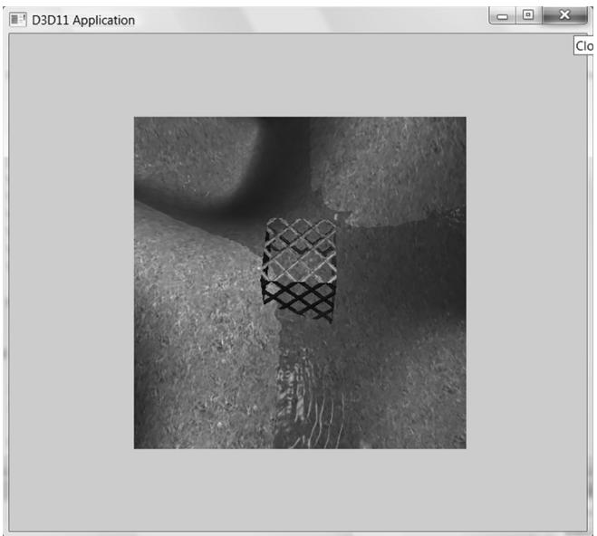


Figure 4.11. By modifying the viewport, we can draw the 3D scene into a subrectangle of the back buffer. The back buffer then gets presented to the client area of the window.


The subrectangle of the back buffer we draw into is called the viewport and it is described by the following structure: 

```cpp
typedef struct D3D12_VIEWPORT{ FLOATTopLeftX; FLOATTopLeftY;FLOATWidth;FLOATHeight;FLOATMinDepth;FLOATMaxDepth;}D3D12_VIEWPORT; 
```

The first four data members define the viewport rectangle relative to the back buffer (observe that we can specify fractional pixel coordinates because the data members are of type float). In Direct3D, depth values are stored in the depth buffer in a normalized range of 0 to 1. The MinDepth and MaxDepth members are used to transform the depth interval [0, 1] to the depth interval [MinDepth, MaxDepth]. Being able to transform the depth range can be used to achieve certain effects; for example, you could set MinDepth $\scriptstyle = 0$ and MaxDepth ${ } = 0$ , so that all objects 

drawn with this viewport will have depth values of 0 and appear in front of all other objects in the scene. However, usually MinDepth is set to 0 and MaxDepth is set to 1 so that the depth values are not modified. 

Once we have filled out the D3D12_VIEWPORT structure, we set the viewport with Direct3D with the ID3D12CommandList::RSSetViewports method. The following example creates and sets a viewport that draws onto the entire back buffer: 

```cpp
D3D12_VIEWPORT vp;  
vp.TopLeftX = 0.0f;  
vp.TopLeftY = 0.0f;  
vp.Width = static_cast<mClientWidth>;  
vp.Height = static_cast<mClientHeight>;  
vp.MinDepth = 0.0f;  
vp.MaxDepth = 1.0f;  
mCommandList->RSServletports(1, &vp); 
```

The first parameter is the number of viewports to bind (using more than one is for advanced effects), and the second parameter is a pointer to an array of viewports. You cannot specify multiple viewports to the same render target. Multiple viewports are used for advanced techniques that render to multiple render targets at the same time. The viewport needs to be reset whenever the command list is reset. 

You could use the viewport to implement split screens for two-player game modes, for example. You would create two viewports, one for the left half of the screen and one for the right half of the screen. Then you would draw the 3D scene from the perspective of Player 1 into the left viewport and draw the 3D scene from the perspective of Player 2 into the right viewport. 

# 4.3.9 Set the Scissor Rectangles

We can define a scissor rectangle relative to the back buffer such that pixels outside this rectangle are culled (i.e., not rasterized to the back buffer). This can be used for optimizations. For example, if we know an area of the screen will contain a rectangular UI element on top of everything, we do not need to process the pixels of the 3D world that the UI element will obscure. 

A scissor rectangle is defined by a D3D12_RECT structure which is typedefed to the following structure: 

```cpp
typedef struct tagRECT   
{ LONG left; LONG top; LONG right; LONG bottom;   
} RECT; 
```

We set the scissor rectangle with Direct3D with the ID3D12CommandList::RSSetSci ssorRects method. The following example creates and sets a scissor rectangle that covers the upper-left quadrant of the back buffer: 

```c
mScissorRect = { 0, 0, mClientWidth/2, mClientHeight/2 };  
mCommandList->RSSetScissorRects(1, &mScissorRect); 
```

Similar to RSSetViewports, the first parameter is the number of scissor rectangles to bind (using more than one is for advanced effects), and the second parameter is a pointer to an array of rectangles. You cannot specify multiple scissor rectangles on the same render target. Multiple scissor rectangles are used for advanced techniques that render to multiple render targets at the same time. The scissors rectangles need to be reset whenever the command list is reset. 

# 4.4 TIMING AND ANIMATION

To do animation correctly, we will need to keep track of the time. In particular, we will need to measure the amount of time that elapses between frames of animation. If the frame rate is high, these time intervals between frames will be very short; therefore, we need a timer with a high level of accuracy. 

# 4.4.1 The Performance Timer

For accurate time measurements, we use the performance timer (or performance counter). To use the Win32 functions for querying the performance timer, we must #include <windows.h>. 

The performance timer measures time in units called counts. We obtain the current time value, measured in counts, of the performance timer with the QueryPerformanceCounter function like so: 

```cpp
int64 currTime;  
QueryPerformanceCounter((LARGE_INTEGER*) & currTime); 
```

Observe that this function returns the current time value through its parameter, which is a 64-bit integer value. 

To get the frequency (counts per second) of the performance timer, we use the QueryPerformanceFrequency function: 

```cpp
int64 countsPerSec;  
QueryPerformanceFrequency((LARGE_countsPerSec); 
```

Then the number of seconds (or fractions of a second) per count is just the reciprocal of the counts per second: 

mSecondsPerCount $= 1.0$ / (double) countsPerSec; 

Thus, to convert a time reading valueInCounts to seconds, we just multiply it by the conversion factor mSecondsPerCount 

valueInSecs $=$ valueInCounts * mSecondsPerCount; 

The values returned by the QueryPerformanceCounter function are not particularly interesting in and of themselves. What we do is get the current time value using QueryPerformanceCounter, and then get the current time value a little later using QueryPerformanceCounter again. Then the time that elapsed between those two time calls is just the difference. That is, we always look at the relative difference between two time stamps to measure time, not the actual values returned by the performance counter. The following better illustrates the idea: 

```cpp
int64 A = 0;  
QueryPerformanceCounter((LARGE_INTEGER*) & A);  
/* Do work */  
int64 B = 0;  
QueryPerformanceCounter((LARGE_INTEGER*) & B); 
```

So it took (B–A) counts to do the work, or (B–A)*mSecondsPerCount seconds to do the work. 


MSDN has the following remark about QueryPerformanceCounter: “On a multiprocessor computer, it should not matter which processor is called. However, you can get different results on different processors due to bugs in the basic input/output system (BIOS) or the hardware abstraction layer (HAL).” You can use the SetThreadAffinityMask function so that the main application thread does not get switch to another processor. 

# 4.4.2 Game Timer Class

In the next two sections, we will discuss the implementation of the following GameTimer class. 

```cpp
class GameTimer   
{   
public: GameTimer(); float GameTime()const; // in seconds float DeltaTime(const; // in seconds void Reset(); // Call before message loop. void Start(); // Call when unpaused. void Stop(); // Call when paused. void Tick(); // Call every frame. 
```

```cpp
private: double mSecondsPerCount; double mDeltaTime; int64 mBaseTime; int64 mPasedTime; int64 mStopTime; int64 mPrevTime; int64 mCurrTime; bool mStopped;   
}; 
```

The constructor, in particular, queries the frequency of the performance counter. The other member functions are discussed in the next two sections. 

```cpp
GameTimer::GameTimer()
: mSecondsPerCount(0.0), mDeltaTime(-1.0), mBaseTime(0),
mPausedTime(0), mPrevTime(0), mCurrTime(0), mStopped(false)
{
    int64 countsPerSec;
    QueryPerformanceFrequency((LARGE_integer*)&countsPerSec);
    mSecondsPerCount = 1.0 / (double) countsPerSec;
} 
```


The GameTimer class and implementations are in the GameTimer.h and GameTimer.cpp files, which can be found in the Common directory of the sample code. 

# 4.4.3 Time Elapsed Between Frames

When we render our frames of animation, we will need to know how much time has elapsed between frames so that we can update our game objects based on how much time has passed. Computing the time elapsed between frames proceeds as follows. Let $t _ { i }$ be the time returned by the performance counter during the ith frame and let $t _ { i - 1 }$ be the time returned by the performance counter during the previous frame. Then the time elapsed between the $t _ { i - 1 }$ reading and the $t _ { i }$ reading is $\Delta t = t _ { i } - t _ { i - 1 }$ . For real-time rendering, we typically require at least 30 frames per second for smooth animation (and we usually have much higher rates); thus, $\Delta t =$ $t _ { i } - t _ { i - 1 }$ tends to be a relatively small number. 

The following code shows how $\Delta t$ is computed in code: 

```cpp
void GameTimer::Tick()  
{ if(mStopped) { mDeltaTime = 0.0; return; 
```

} //Get the time this frame. int64 currTime; QueryPerformanceCounter((LARGE_INTEGER*)&currTime); mCurrTime $=$ currTime; // Time difference between this frame and the previous. mDeltaTime $=$ (mCurrTime - mPrevTime)*mSecondsPerCount; //Prepare for next frame. mPrevTime $=$ mCurrTime; // Force nonnegative. The DXSDK's CDXUTTimer mentions that if the //processor goes into a power save mode or we get shuffled to another //processor, then mDeltaTime can be negative. if(mDeltaTime $<  0.0$ 1 { mDeltaTime $= 0.0$ . }   
}   
float GameTimer::DeltaTime()const { return(float)mDeltaTime; 

The function Tick is called in the application message loop as follows: 

```cpp
int D3DApp::Run()
{
MSG msg = {0};
mTimer Reset();
while(msg.message != WM_QUIT)
{
// If there are Window messages then process them.
if( PeekMessage( &msg, 0, 0, 0, PM_REMOVE ))
{
TranslateMessage( &msg );
DispatchMessage( &msg );
}
// Otherwise, do animation/game stuff.
else
{
mTimer Tick();
if( !mAppPaused )
{
CalculateFrameStats();
Update(mTimer);
Draw(mTimer);
} 
```

```javascript
else { Sleep(100); } } return (int)msg.wParam; 
```

In this way, $\Delta t$ is computed every frame and fed into the UpdateScene method so that the scene can be updated based on how much time has passed since the previous frame of animation. The implementation of the Reset method is: 

void GameTimer::Reset()   
{ int64 currTime; QueryPerformanceCounter((LARGE_INTEGER\*)&currTime); mBaseTime $=$ currTime; mPrevTime $=$ currTime; mStopTime $= 0$ . mStopped $=$ false; 

Some of the variables shown have not been discussed yet (they will be in the next section). However, we see that this initializes mPrevTime to the current time when Reset is called. It is important to do this because for the first frame of animation, there is no previous frame, and therefore, no previous time stamp $t _ { i - 1 }$ . Thus this value needs to be initialized in the Reset method before the message loop starts. 

# 4.4.4 Total Time

Another time measurement that can be useful is the amount of time that has elapsed since the application start, not counting paused time; we will call this total time. The following situation shows how this could be useful. Suppose the player has 300 seconds to complete a level. When the level starts, we can get the time $t _ { s t a r t }$ which is the time elapsed since the application started. Then after the level has started, every so often we can check the time $t$ since the application started. If $t - t _ { s t a r t } > 3 0 0 s$ (see Figure 4.12) then the player has been in the level for over 300 seconds and loses. Obviously in this situation, we do not want to count any time the game was paused against the player. 

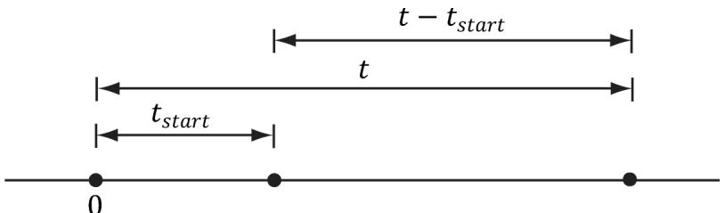


Figure 4.12. Computing the time since the level started. Note that we choose the application start time as the origin (0), and measure time values relative to that frame of reference.


Another application of total time is when we want to animate a quantity as a function of time. For instance, suppose we wish to have a light orbit the scene as a function of time. Its position can be described by the parametric equations: 

$$
\left\{ \begin{array}{l} x = 1 0 \cos t \\ y = 2 0 \\ z = 1 0 \sin t \end{array} \right.
$$

Here $t$ represents time, and as $t$ (time) increases, the coordinates of the light are updated so that the light moves in a circle with radius 10 in the $y = 2 0$ plane. For this kind of animation, we also do not want to count paused time; see Figure 4.13. 

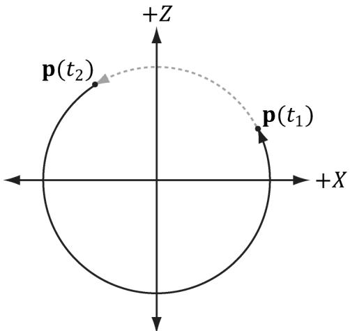


Figure 4.13. If we paused at $t _ { 1 }$ and unpaused at $t _ { 2 }$ , and counted paused time, then when we unpause, the position will jump abruptly from ${ \sf p } ( t _ { 1 } )$ to ${ \sf p } ( t _ { 2 } )$ .


To implement total time, we use the following variables: 

```cpp
int64 mBaseTime;  
int64 mPausedTime;  
int64 mStopTime; 
```

As we saw in $\ S 4 . 4 . 3$ , mBaseTime is initialized to the current time when Reset was called. We can think of this as the time when the application started. In most cases, you will only call Reset once before the message loop, so mBaseTime stays constant throughout the application’s lifetime. The variable mPausedTime accumulates all the time that passes while we are paused. We need to accumulate this time so we can subtract it from the total running time, in order to not count paused time. The mStopTime variable gives us the time when the timer is stopped (paused); this is used to help us keep track of paused time. 

Two important methods of the GameTimer class are Stop and Start. They should be called when the application is paused and unpaused, respectively, so that the GameTimer can keep track of paused time. The code comments explain the details of these two methods. 

```cpp
void GameTimer::Stop()
{
    // If we are already stopped, then don't do anything.
    if (!mStopped)
    {
        __int64 currTime;
        QueryPerformanceCounter((LARGE_INTEGER*) & currTime);
        // Otherwise, save the time we stopped at, and set
        // the Boolean flag indicating the timer is stopped.
        mStopTime = currTime;
        mStopped = true;
    }
}
void GameTimer::Start()
{
    __int64 startTime;
    QueryPerformanceCounter((LARGE_INTEGER*) & startTime);
    // Accumulate the time elapsed between stop and start pairs.
    // |<----d---->|
    // --time
    // mStopTime startTime
    // If we are resuming the timer from a stopped state...
    if (mStopped)
    {
        // then accumulate the paused time.
        mPausedTime += (startTime - mStopTime);
        // since we are starting the timer back up, the current
        // previous time is not valid, as it occurred while paused.
        // So reset it to the current time.
        mPrevTime =startTime;
    }
} 
```

```javascript
// no longer stopped...  
mStopTime = 0;  
mStopped = false; 
```

Finally, the TotalTime member function, which returns the time elapsed since Reset was called not counting paused time, is implemented as follows: 

```cpp
float GameTimer::TotalTime() const
{
    // If we are stopped, do not count the time that has passed
    // since we stopped. Moreover, if we previously already had
    // a pause, the distance mStopTime - mBaseTime includes paused
    // time, which we do not want to count. To correct this, we can
    // subtract the paused time from mStopTime:
    // previous paused time
    // |<--------|
    // --*--------*--------*--------*--------*--------> time
    // mBaseTime   mStopTime   mCurrTime
if( mStopped )
{
    return (float)((mStopTime - mPausedTime)-
        mBaseTime) * mSecondsPerCount);
}
// The distance mCurrTime - mBaseTime includes paused time,
// which we do not want to count. To correct this, we can subtract
// the paused time from mCurrTime:
// (mCurrTime - mPausedTime) - mBaseTime
// |<--paused time-->
else
{
    return (float)((mCurrTime - mPausedTime)-
        mBaseTime) * mSecondsPerCount);
} 
```

Note: 

Our demo framework creates an instance of GameTimer for measuring the total time since the application started, and the time elapsed between frames; however, you can also create additional instances and use them as generic “stopwatches.” For example, when a bomb is ignited, you could start a new GameTimer, and when the TotalTime reached 5 seconds, you could raise an event that the bomb exploded. 

# 4.5 THE DEMO APPLICATION FRAMEWORK

The demos in this book use code from the Common directory. This folder contains some utility code that we will use in this demo, but it also contains utility code that we will not use until later on in this book. For now, the main files we want to concentrate on are d3dUtil.h/.cpp, d3dApp.h/.cpp, and DescriptorUtil.h/.cpp, which can be downloaded from the book’s website. The d3dUtil.h and d3dUtil.cpp files contain useful utility code, and the d3dApp.h and d3dApp.cpp files contain the core Direct3D application class code that is used to encapsulate a Direct3D sample application. We already saw in $\ S 4 . 3 . 5$ that DescriptorUtil.h/.cpp defines a helper class for managing descriptor heaps for render target views and depth/ stencil views (we will add new heap classes as needed throughout this book as we come to need other types of descriptor heaps). The reader is encouraged to study these files after reading this chapter, as we do not cover every line of code in these files (e.g., we do not show how to create a window, as basic Win32 programming is a prerequisite of this book). The goal of this framework was to hide the window creation code and Direct3D initialization code; by hiding this code, we feel it makes the demos less distracting, as you can focus only on the specific details the sample code is trying to illustrate. 

# 4.5.1 D3DApp

The D3DApp class is the base Direct3D application class, which provides functions for creating the main application window, running the application message loop, handling window messages, and initializing Direct3D. Moreover, the class defines the framework functions for the demo applications. Clients are to derive from D3DApp, override the virtual framework functions, and instantiate only a single instance of the derived D3DApp class. The D3DApp class is defined as follows: 

```cpp
include "d3dUtil.h" #include "GameTimer.h" #include "DescriptorUtil.h" // IMGUI is an opensource library used for drawing GUI elements // using Direct3D 12 (and other graphics APIs). #include "imgui/imgui.h" #include "imgui/backends/imgui Impl_win32.h" #include "imgui/backends/imgui Impl_dx12.h" // Link necessary d3d12 libraries. #pragma comment (lib, "d3dcompiler.lib") #pragma comment (lib, "D3D12.lib") #pragma comment (lib, "dxgi.lib") #pragma comment (lib, "dxcompiler.lib") // dxc 
```

class D3DApp   
{ protected: D3DApp(HINSTANCE hInstance); D3DApp(const D3DApp& rhs) $=$ delete; D3DApp& operator=(const D3DApp& rhs) $=$ delete; virtual \~D3DApp();   
public: static D3DApp\* GetApp(); HINSTANCE AppInst()const; HWND MainWnd()const; float AspectRatio(const; int Run(); void FlushCommandQueue(); virtual bool Initialize(); virtual LRESULT MsgProc(HWND hwnd, UINT msg, WPARAM wParam, LPARAM lParam); static const int SwapChainBufferCount $= 2$ protected: virtual void CreateRtvAndDsvDescriptorHeaps(); virtual void OnResize(); virtual void Update(const GameTimer& gt) $= 0$ virtual void Draw(const GameTimer& gt) $= 0$ // Override to define GUI (call once per frame). // Make sure to call base implementation first. virtual void UpdateImgui(const GameTimer& gt); // Convenience overrides for handling mouse input. virtual void OnMouseDown(WPARAM bgnState, int x, int y){ virtual void OnMouseUp(WPARAM bgnState, int x, int y){ virtual void OnMouseMove(WPARAM bgnState, int x, int y){ protected: bool InitMainWindow(); bool InitDirect3D(); void CreateCommandObjects(); void CreateSwapChain(); ID3D12Resource\* CurrentBackBuffer()const; CD3DX12_CPU Descriptor HANDLE CurrentBackBufferView(); CD3DX12_CPU Descriptor HANDLE DepthStencilView(); // Need to call after cbvSrvUavHeap created in derived app. 

```c
void InitImgui(CbvSrvUavHeap& cbvSrvUavHeap);   
void ShutdownImgui();   
void CalculateFrameStats();   
void LogAdapters();   
void LogAdapterOutputs(IDXGIAdapter* adapter);   
void LogOutputDisplayModes(IDXGIOutput* output, DXGI_format format); 
```


protected:


static D3DApp* mApp;


```cpp
HINSTANCE mhAppInst = nullptr; // application instance handle  
HWND mhMainWnd = nullptr; // main window handle  
bool mAppPurchased = false; // is the application paused?  
bool mMinimized = false; // is the application minimized?  
bool mMaximized = false; // is the application maximized?  
bool mResizing = false; // are the resize bars being dragged? 
```


// Used to keep track of the "delta-time" and game time (§4.4). GameTimer mTimer;


```cpp
Microsoft::WRL::ComPtr<IDXGIFactory6> mdxgiFactory;  
Microsoft::WRL::ComPtr<IDXGISwapChain4> mSwapChain;  
Microsoft::WRL::ComPtr<IDXGIAdapter4> mDefaultAdapter;  
Microsoft::WRL::ComPtr<ID3D12Device5> md3dDevice; 
```


Microsoft::WRL::ComPtr<ID3D12Fence> mFence; UINT64 mCurrentFence $\qquad = \quad 0$ ;


```cpp
Microsoft::WRL::ComPtr<ID3D12CommandQueue> mCommandQueue;  
Microsoft::WRL::ComPtr<ID3D12CommandAllocator> mDirectCmdListAlloc;  
Microsoft::WRL::ComPtr<ID3D12GraphicsCommandList6> mCommandList; 
```


int mCurrBackBuffer $\qquad = \quad 0$ ; Microsoft::WRL::ComPtr<ID3D12Resource> mSwapChainBuffer[SwapChainBu fferCount]; Microsoft::WRL::ComPtr<ID3D12Resource> mDepthStencilBuffer;


```cpp
// Utility that grows/shrinks GPU upload heap memory for fire  
// and forget scenarios. This is particularly useful for  
// per-draw constant buffers. This is explained in Chapter 7.  
std::unique_ptr<DirectX::GraphicsMemory> mLinearAllocator =  
nullptr; 
```


// Utility for uploading data to GPU memory. This is explained in // Chapter 6. std::unique_ptr<DirectX::ResourceUploadBatch> mUploadBatch $=$ nullptr;


DescriptorHeap mRtvHeap; DescriptorHeap mDsvHeap;


D3D12_VIEWPORT mScreenViewport; D3D12_RECT mScissorRect; //Derived class should set these in derived constructor to //customize starting values. std::wstring mMainWndCaption $\equiv$ L"d3d App"; D3D_DRV_TYPE md3dDriverType $=$ D3D_DRV_TYPE_HARDWARE; DXGI_FORMAT mBackBufferFormat $=$ DXGI_FORMAT_R8G8B8A8_UNORM; DXGI_FORMAT mDepthStencil1Format $=$ DXGI_FORMAT_D24_UNORM_S8_UID; int mClientWidth $= 1280$ int mClientHeight $= 720$ 

We have used comments in the above code to describe some of the data members; the methods are discussed in the subsequent sections. 

# 4.5.2 Non-Framework Methods

1. D3DApp: The constructor simply initializes the data members to default values. 

2. ~D3DApp: The destructor releases the COM interfaces the D3DApp acquires, and flushes the command queue. The reason we need to flush the command queue in the destructor is that we need to wait until the GPU is done processing the commands in the queue before we destroy any resources the GPU is still referencing. Otherwise, the GPU might crash when the application exits. 

D3DApp::\~D3DApp()   
{ if(md3dDevice $! =$ nullptr) FlushCommandQueue();   
} 

3. AppInst: Trivial access function returns a copy of the application instance handle. 

4. MainWnd: Trivial access function returns a copy of the main window handle. 

5. AspectRatio: The aspect ratio is defined as the ratio of the back buffer width to its height. The aspect ratio will be used in the next chapter. It is trivially implemented as: 

```cpp
float D3DApp::AspectRatio() const  
{  
    return static_cast<float>(mClientWidth) / mClientHeight; 
```

6. Run: This method wraps the application message loop. It uses the Win32 PeekMessage function so that it can process our game logic when no messages are present. The implementation of this function was shown in $\ S 4 . 4 . 3$ . 

7. FlushCommandQueue: Forces the CPU to wait until the GPU has finished processing all the commands in the queue (see $\ S 4 . 2 . 2 $ ). 

8. InitMainWindow: Initializes the main application window; we assume the reader is familiar with basic Win32 window initialization. 

9. InitDirect3D: Initializes Direct3D by implementing the steps discussed in $\ S 4 . 3$ . 

10. CreateCommandObjects: Creates the command queue, a command list allocator, and a command list, as described in $\ S 4 . 3 . 3$ . 

11. CreateSwapChain: Creates the swap chain (§4.3.4.). 

12. CurrentBackBuffer: Returns an ID3D12Resource to the current back buffer in the swap chain. 

13. CurrentBackBufferView: Returns the RTV (render target view) to the current back buffer. 

14. DepthStencilView: Returns the DSV (depth/stencil view) to the main depth/ stencil buffer. 

15. CalculateFrameStats: Calculates the average frames per second and the average milliseconds per frame. The implementation of this method is discussed in $\ S 4 . 4 . 4$ . 

16. LogAdapters: Enumerates all the adapters on a system (§4.1.10). 

17. LogAdapterOutputs: Enumerates all the outputs associated with an adapter (§4.1.10). 

18. LogOutputDisplayModes: Enumerates all the display modes an output supports for a given format (§4.1.10). 

19. InitImgui: Initializes the ImGUI open-source library, which is used to render GUI elements in Direct3D 12. We discuss ImGUI in $\ S 4 . 5 . 6$ . 

20. ShutdownImgui: Shuts down ImGUI. 

# 4.5.3 Framework Methods

For each sample application in this book, we consistently override seven virtual functions of D3DApp. These seven functions are used to implement the code specific to the particular sample. The benefit of this setup is that the initialization code, message handling, etc., is implemented in the D3DApp class, so that the derived class needs to only focus on the specific code of the demo application. Here is a description of the framework methods: 

1. Initialize: Use this method to put initialization code for the application such as allocating resources, initializing objects, and setting up the 3D scene. The D3DApp implementation looks like this: 

```cpp
bool D3DApp::Initialize()
{
    if (!InitMainWindow())
        return false;
    if (!InitDirect3D())
        return false;
    mLinearAllocator = make_unique<GraphicsMemory>(md3dDevice.Get());
    mUploadBatch = make_unique<ResourceUploadBatch>(md3dDevice.Get());
    // Do the initial resize code.
    OnResize();
    return true;
} 
```

Therefore, you should call the D3DApp version of this method in your derived implementation first like this: 

```cpp
bool TestApp::Init()
{
    if (!D3DApp::Init())
        return false;
    /* Rest of initialization code goes here */
} 
```

so that your initialization code can access the initialized members of D3DApp. The linear allocator and upload batch is also created here. We will introduce the upload batch helper in Chapter 6 and the linear allocator in Chapter 7. 

2. MsgProc: This method implements the window procedure function for the main application window. Generally, you only need to override this method if there is a message you need to handle that D3DApp::MsgProc does not handle (or does not handle to your liking). The D3DApp implementation of this method is explored in $\ S 4 . 5 . 5$ . If you override this method, any message that you do not handle should be forwarded to D3DApp::MsgProc. 

3. CreateRtvAndDsvDescriptorHeaps: Virtual function where you create the RTV and DSV descriptor heaps your application needs. The default implementation creates an RTV heap with SwapChainBufferCount many descriptors (for the buffer in the swap chain) and a DSV heap with one descriptor (for the depth/ stencil buffer). The default implementation will be sufficient for a lot of our 

demos; for more advanced rendering techniques that use multiple render targets, we will have to override this method. 

4. OnResize: This method is called by D3DApp::MsgProc when a WM_SIZE message is received. When the window is resized, some Direct3D properties need to be changed, as they depend on the client area dimensions. In particular, the back buffer and depth/stencil buffers need to be recreated to match the new client area of the window (§4.3.6 and $\ S 4 . 3 . 7 )$ ). The back buffer can be resized by calling the IDXGISwapChain::ResizeBuffers method. The depth/stencil buffer needs to be destroyed and then remade based on the new dimension. In addition, the render target and depth/stencil views need to be recreated. The D3DApp implementation of OnResize handles the code necessary to resize the back and depth/stencil buffers; see the source code for the straightforward details. In addition to the buffers, other properties depend on the size of the client area (e.g., the projection matrix), so this method is part of the framework because the client code may need to execute some of its own code when the window is resized. 

5. Update: This abstract method is called every frame and should be used to update the 3D application over time (e.g., perform animations, move the camera, do collision detection, and check for user input). 

6. Draw: This abstract method is invoked every frame and is where we issue rendering commands to draw our current frame to the back buffer. When we are done drawing our frame, we call the IDXGISwapChain::Present method to present the back buffer to the screen. 

7. UpdateImgui: Implement custom UI drawing here using IMGUI. We use this to implement checkboxes and sliders so that we can enable/disable features at runtime, and tweak parameters. 

Note: 

In addition to the above seven framework methods, we provide three other virtual functions for convenience to handle the events when a mouse button is pressed, released, and when the mouse moves: 

virtual void OnMouseDown(WPARAM btnState, int x, int y){ } virtual void OnMouseUp(WPARAM btnState, int x, int y) { } virtual void OnMouseMove(WPARAM btnState, int x, int y){ } 

In this way, if you want to handle mouse messages, you can override these methods instead of overriding the MsgProc method. The first parameter is the same as the WPARAM parameter for the various mouse messages, which stores the mouse button states (i.e., which mouse buttons were pressed when the event was raised). The second and third parameters are the client area $( x , y )$ coordinates of the mouse cursor. 

# 4.5.4 Frame Statistics

It is common for games and graphics application to measure the number of frames being rendered per second (FPS). To do this, we simply count the number of frames processed (and store it in a variable $n$ ) over some specified time period t. Then, the average FPS over the time period $t$ is $f p s _ { a \nu g } = n / \mathrm { t }$ . If we set $t = 1$ , then $f p s _ { a \nu g } =$ $n / 1 = n$ . In our code, we use $t = 1$ (second) since it avoids a division, and moreover, one second gives a pretty good average—it is not too long and not too short. The code to compute the FPS is provided by the D3DApp::CalculateFrameStats method: 

```cpp
void D3DApp::CalculateFrameStats()
{
    // Code computes the average frames per second, and also the
    // average time it takes to render one frame. These stats
    // are appended to the window caption bar.
    static int frameCnt = 0;
    static float timeElapsed = 0.0f;
    frameCnt++;
    // Compute averages over one second period.
    if (mTimer.TotalTime() - timeElapsed) >= 1.0f)
        float fps = (float)frameCnt; // fps = frameCnt / 1
        float mspf = 1000.0f / fps;
    wstring fpsStr = to_wstring(fps);
    wstring mspfStr = to_wstring(mspf);
    wstring windowText = mMainWndCaption +
        L" fps: " + fpsStr +
        L" mspf: " + mspfStr;
    SetWindowText(mhMainWnd, windowText.c_str());
    // Reset for next average.
    frameCnt = 0;
    timeElapsed += 1.0f;
} 
```

This method would be called every frame to increment the frame count and update the statistics. 

In addition to computing the FPS, the above code also computes the number of milliseconds it takes, on average, to process a frame: 

```cpp
float mspf = 1000.0f / fps; 
```


The seconds per frame is just the reciprocal of the FPS, but we multiply by 1000 ms / 1 s to convert from seconds to milliseconds (recall there are 1000 ms per second). 

The idea behind this line is to compute the time, in milliseconds, it takes to render a frame; this is a different quantity than FPS (but observe this value can be derived from the FPS). In actuality, the time it takes to render a frame is more useful than the FPS, as we may directly see the increase/decrease in time it takes to render a frame as we modify our scene. On the other hand, the FPS does not immediately tell us the increase/decrease in time as we modify our scene. Moreover, as [Dunlop03] points out in his article FPS versus Frame Time, due to the non-linearity of the FPS curve, using the FPS can give misleading results. For example, consider situation (1): Suppose our application is running at 1000 FPS, taking 1 ms (millisecond) to render a frame. If the frame rate drops to 250 FPS, then it takes 4 ms to render a frame. Now consider situation (2): Suppose that our application is running at 100 FPS, taking $1 0 ~ \mathrm { m s }$ to render a frame. If the frame rate drops to about 76.9 FPS, then it takes about $1 3 \mathrm { m s }$ to render a frame. In both situations, the rendering per frame increased by $3 \mathrm { \ m s }$ , and thus both represent the same increase in time it takes to render a frame. Reading the FPS is not as straightforward. The drop from 1000 FPS to 250 FPS seems much more drastic than the drop from 100 FPS to 76.9 FPS; however, as we have just showed, they actually represent the same increase in time it takes to render a frame. 

# 4.5.5 The Message Handler

The window procedure we implement for our application framework does the bare minimum. In general, we won’t be working very much with Win32 messages anyway. In fact, the core of our application code gets executed during idle processing (i.e., when no window messages are present). Still, there are some important messages we do need to process. However, because of the length of the window procedure, we do not embed all the code here; rather, we just explain the motivation behind each message we handle. We encourage the reader to download the source code files and spend some time getting familiar with the application framework code, as it is the foundation of every sample for this book. 

The first message we handle is the WM_ACTIVATE message. This message is sent when an application becomes activated or deactivated. We implement it like so: 

```cpp
case WM_ACTIVATE: if (LOWORD(wParam) == WA_INACTIVE) { mAppPased = true; mTimer_STOP(); } 
```

else   
{ mAppPaused $=$ false; mTimer.Start();   
}   
return 0; 

As you can see, when our application becomes deactivated, we set the data member mAppPaused to true, and when our application becomes active, we set the data member mAppPaused to false. In addition, when the application is paused, we stop the timer, and then resume the timer once the application becomes active again. If we look back at the implementation to D3DApp::Run (§4.4.3), we find that if our application is paused, then we do not update our application code, but instead free some CPU cycles back to the OS; in this way, our application does not hog CPU cycles when it is inactive. 

The next message we handle is the WM_SIZE message. Recall that this message is called when the window is resized. The main reason for handling this message is that we want the back buffer and depth/stencil dimensions to match the dimensions of the client area rectangle (so no stretching occurs). Thus, every time the window is resized, we want to resize the buffer dimensions. The code to resize the buffers is implemented in D3DApp::OnResize. As already stated, the back buffer can be resized by calling the IDXGISwapChain::ResizeBuffers method. The depth/stencil buffer needs to be destroyed and then remade based on the new dimensions. In addition, the render target and depth/stencil views need to be recreated. If the user is dragging the resize bars, we must be careful because dragging the resize bars sends continuous WM_SIZE messages, and we do not want to continuously resize the buffers. Therefore, if we determine that the user is resizing by dragging, we actually do nothing (except pause the application) until the user is done dragging the resize bars. We can do this by handling the WM_ EXITSIZEMOVE message. This message is sent when the user releases the resize bars. 

// WMENTERSIZEMOVE is sent when the user grabs the resize bars.   
case WMENTERSIZEMOVE: mAppPaused $=$ true; mResizing $\equiv$ true; mTimer_STOP(); return 0;   
// WM_EXITSIZEMOVE is sent when the user releases the resize bars.   
// Here we reset everything based on the new window dimensions.   
case WM_EXITSIZEMOVE: mAppPaused $=$ false; mResizing $\equiv$ false; mTimer.Start(); OnResize(); return 0; 

The next three messages we handle are trivially implemented and so we just show the code: 

```cpp
// WM_DESToy is sent when the window is being destroyed.   
case WM_DESToy: PostQuitMessage(0); return 0;   
// The WM MenuCHAR message is sent when a menu is active and the user presses   
// a key that does not correspond to any mnemonic or accelerator key.   
case WM MenuCHAR: // Don't beep when we alt-enter. return MAKELRESULT(0,MNC_CLOSE);   
// Catch this message to prevent the window from becoming too small.   
case WM_GETMINMAXINFO: ((MINMAXINFO\*)lParam) ->ptMinTrackSize.x = 200; ((MINMAXINFO\*)lParam) ->ptMinTrackSize.y = 200; return 0; 
```

Finally, to support our mouse input virtual functions, we handle the following messages as follows: 

```c
case WM_LBUTTONDOWN:  
case WM_MBUTTONDOWN:  
case WM_RBBUTTONDOWN:  
    OnMouseDown(wParam, GET_X_LPARAM(lParam), GET_Y_LPARAM(lParam));  
    return 0;  
case WM_LBUTTONUP:  
case WM_MBUTTONUP:  
case WM_RBBUTTONUP:  
    OnMouseUp(wParam, GET_X_LPARAM(lParam), GET_Y_LPARAM(lParam));  
    return 0;  
case WM_MOUSEMOVE:  
    OnMouseMove(wParam, GET_X_LPARAM(lParam), GET_Y_LPARAM(lParam));  
    return 0; 
```


We must #include <Windowsx.h> for the GET_X_LPARAM and GET_Y_LPARAM macros. 

# 4.5.6 ImGUI

One thing that proves useful in a 3D application is some form of GUI system. For example, we will want checkboxes to toggle features on and off, and slider controls to modify settings that change the visual appearance of objects. We could use a full GUI framework like the Win32 API or WPF, but with these kinds of frameworks we would generally have a control element we render onto and then have the other GUI controls off in a tools panel. Furthermore, these APIs are not lightweight, 

require a lot of boilerplate code, and the reader would need to be familiar with them. It would be nice to have a simple lightweight GUI framework that was rendered using Direct3D 12. Although we could author our own, there is now a mature, stable, open-source library available that is popular in the game industry called Dear ImGui (ImGUI). As mentioned, it supports rendering GUI elements using Direct3D 12 (among other graphics APIs), so it is easy to integrate into our Direct3D 12 applications. It is ideal for debug output and basic UI controls such as toggle buttons and slider controls. 

The source code can be downloaded from https://github.com/ocornut/imgui, and the link also contains further details and documentation. After some setup, it is quite easy to learn by example. In the demos folder of this book, we put third party libraries in an external folder. For example, we download the ImGUI source code and put it in External\imgui. We then add the source code to our Visual Studio project (see Figure 4.14). ImGUI supports other graphics APIs besides Direct3D 12 and ImGUI calls these “backends.” Because we only care about the Windows Direct3D 12 backend, we only need to add the imgui_impl_dx12.h/.cpp and imgui_impl_win32.h/.cpp backend files to our project. 

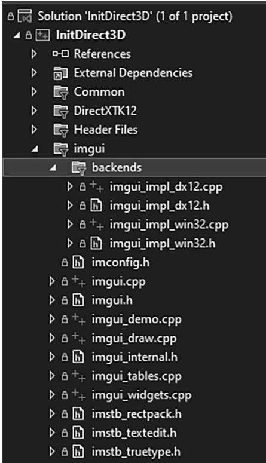


Figure 4.14. Adding ImGUI to the project.


Now our framework code has two functions to handle initializing ImGUI and shutting it down: 

void D3DApp::InitImgui(CbvSrvUavHeap& cbvSrvUavHeap)   
{ const uint32_t imgGuiBindlessIndex $=$ cbvSrvUavHeap.NextFreeIndex(); // Setup Dear ImGui context IMGUI_CHECKVERSION(); auto ctx $=$ ImGui::CreateContext(); // Setup Dear ImGui style ImGui::StyleColorsDark(); //ImGui::StyleColorsClassic(); // Setup Platform/Rendererer callbacks ImGui_ImplWin32_Init(mhMainWnd); ImGui_ImplDX12_Init(md3dDevice.Get(),gNumFrameResources, mBackBufferFormat, cbvSrvUavHeap.GetD3dHeap(), cbvSrvUavHeap.CpuHandle(imgGuiBindlessIndex), cbvSrvUavHeap.GpuHandle(imgGuiBindlessIndex));   
}   
void D3DApp::ShutdownImgui() { if(ImGui::GetCurrentContext() != nullptr) { ImGui_ImplDX12_Shutdown(); ImGui_ImplWin32_Shutdown(); ImGui::DestroyContext(); }   
} 

This is basically just a wrapper for calling ImGUI initialization and shutdown functions. However, one thing to note is that ImGUI requires a descriptor in a CBV_SRV_UAV heap to do its work. We have discussed RTV (render target view) and DSV (depth stencil view) descriptor heaps, but we have not discussed CBV_SRV_UAV heaps. For now we will ignore it, and this type of heap will be introduced in Chapter 6. 

Next we have the D3DApp::UpdateImgui virtual function. Derived classes override this function and implement custom UI drawing here using IMGUI. We use this to implement checkboxes and sliders so that we can enable/disable features at runtime, and tweak parameters. The base implementation is implemented as follows: 

```cpp
void D3DApp::UpdateImgui(const GameTimer& gt)  
{  
    Imgui_ImplDX12_NewFrame();  
    Imgui_ImplWin32_NewFrame();  
    Imgui::NewFrame();  
} 
```

Derived implementations must invoke the base implementation. The following example illustrates how to make a GUI with text boxes, check boxes, and sliders. Our use of ImGUI in this book does not get much more complicated than this. 

```cpp
void DemoApp::UpdateImgui(const GameTimer& gt)  
{ D3DApp::UpdateImgui(gt); // Define a panel to render GUI elements. ImGui::Begin("Options"); // Output some text. ImGui::Text("Application average %.3f ms/frame (%1f FPS)", 1000.0f / ImGui::GetIO().Framerate, ImGui::GetIO().Framerate); // Define a collapsable panel. if(ImGui::CollapsingHeader("Features")) { // Define checkboxes synced to member variables. ImGui::Checkbox("NormalMaps", &mNormalMapsEnabled); ImGui::Checkbox("Reflections", &mReflectionsEnabled); ImGui::Checkbox("Shadows", &mShadowsEnabled); } if(ImGui::CollapsingHeader("SSAO")) { // Define checkbox and sliders synced to member variables. // The sliders take a minimum and maximum range. ImGui::Checkbox("SsaOEnabled", &mSsaOEnabled); ImGui::SliderFloat("OcclusionRadius", &mOcclusionRadius, 0.1f, 2.0f); ImGui::SliderFloat("OcclusionFadeStart", &mOcclusionFadeStart, 0.0f, 4.0f); ImGui::SliderFloat("OcclusionFadeEnd", &mOcclusionFadeEnd, 0.0f, 4.0f); ImGui::SliderFloat("SurfaceEpsilon", &mSurfaceEpsilon, 0.0f, 10.0f); } ImGui::End(); ImGui::Render(); } 
```

Note that ImGUI::Render does not actually render anything. You can think of it more as generating the data (geometry and textures) needed to draw the GUI. To draw the GUI, we submit the render commands to a command list using the following function: 

```rust
// Draw imgui UI.  
ImGui_ImplDX12_CanvasData(ImGui::GetDrawData(), mCommandList.Get()); 
```

Before we conclude our discussion of ImGUI let us talk about mouse capture. Starting in Chapter 6, we will use mouse input to move the 3D camera around. But we will need to distinguish between when to move the camera around and when the user is manipulating an ImGUI control such as a slider. We can check if ImGUI has mouse focus with the ImGui::GetIO::WantCaptureMouse property: 

```cpp
void DemoApp::OnMouseMove(WPARAM btwState, int x, int y)  
{  
    ImGuiIO& io = ImGui::GetIO();  
if (!io WantCaptureMouse)  
{  
    if ((btnState & MK_LBUTTON) != 0)  
    {  
        // Make each pixel correspond to a quarter of a degree. float dx = XMConvertToRadians(0.25f * static_cast <float>(x - mLastMousePos.x)); float dy = XMConvertToRadians(0.25f * static_cast <float>(y - mLastMousePos.y));  
        mCamera.Pitch(dx);  
        mCamera RotateY(dx);  
    }  
    mLastMousePos.x = x;  
    mLastMousePos.y = y;  
} 
```

# 4.5.7 The “Init Direct3D” Demo

Now that we have discussed the application framework, let us make a small application using it. The program requires almost no real work on our part since the parent class D3DApp does most of the work required for this demo. The main thing to note is how we derive a class from D3DApp and implement the framework functions, where we will write our sample specific code. All of the programs in this book will follow the same template. 

```cpp
#pragma once   
#include"../Common/d3dApp.h" #include"../Common/MathHelper.h" #include"../Common/UploadBuffer.h" #include"../Common/MeshGen.h" #include"../Common/DescriptorUtil.h"   
class InitDirect3DApp:public D3DApp { public: InitDirect3DApp(HINSTANCE hInstance); 
```

InitDirect3DApp(const InitDirect3DApp& rhs) $=$ delete; InitDirect3DApp& operator $\equiv$ (const InitDirect3DApp& rhs) $=$ delete; ~InitDirect3DApp(); virtual bool Initialize()override;   
private: virtual void CreateRtvAndDsvDescriptorHeaps()override; virtual void OnResize() override; virtual void Update(const GameTimer& gt)override; virtual void Draw(const GameTimer& gt)override; virtual void UpdateImgui(const GameTimer& gt)override; virtual void OnMouseDown(WPARAM btwState, int x, int y)override; virtual void OnMouseUp(WPARAM btwState, int x, int y)override; virtual void OnMouseMove(WPARAM btwState, int x, int y)override; void BuildCbvSrvUavDescriptorHeap();   
private: POINT mLastMousePos; #include "InitDirect3DApp.h" using Microsoft::WRL::ComPtr; using namespace DirectX; using namespace DirectX::PackedVector; const int gNumFrameResources $= 3$ .   
constexpr UINT CBV_SRV_UAV_HEAP_CAPACITY $= 16384$ .   
int WINAPI WinMain(HINSTANCE hInstance, HINSTANCE prevInstance, PSTR cmdLine, int showCmd) { // Enable run-time memory check for debug builds. #if defined(NULL) | defined(NULL) _CrtSetDbgFlag(_CRTDBG_ALLOC_MEM_DF | _CRTDBG_LEAK_CHECK_DF); #endif try { InitDirect3DApp theApp(hInstance); if(!theApp.Initialize()) return 0; return theAppRUN(); } catch(DxException& e) { MessageBox(nullptr,e.ToString().c_str(),L"HR Failed",MB_OK); 

```cpp
return 0;   
}   
InitDirect3DApp::InitDirect3DApp(HINSTANCE hInstance) : D3DApp(hInstance)   
{   
}   
InitDirect3DApp::~InitDirect3DApp() { if (md3dDevice != nullptr) FlushCommandQueue();   
}   
bool InitDirect3DApp::Initialize() { if(!D3DApp::Initialize()) return false; BuildCbvSrvUavDescriptorHeap(); return true;   
}   
void InitDirect3DApp::CreateRtvAndDsvDescriptorHeaps() { mRtvHeap Init (md3dDevice.Get(), D3D12 Descriptor_TYPE_RTV, SwapChainBufferCount); mDsvHeap. Init (md3dDevice.Get(), D3D12 Descriptor_TYPE_DSV, SwapChainBufferCount);   
}   
void InitDirect3DApp::OnResize() { D3DApp::OnResize();   
}   
void InitDirect3DApp::Update(const GameTimer& gt) {   
}   
void InitDirect3DApp::Draw(const GameTimer& gt) { CbvSrvUavHeap& cbvSrvUavHeap = CbvSrvUavHeap::Get(); UpdateImgui (gt); // Reuse the memory associated with command recording. // We can only reset when the associated command lists have // finished execution on the GPU. 
```

ThrowIfFailed(mDirectCmdListAlloc->Reset()); 

```javascript
// A command list can be reset after it has been added to the // command queue via ExecuteCommandList. Reusing the command list // reuses memory. ThrowIfFailed(mCommandList->Reset(mDirectCmdListAlloc.Get(), nullptr)); 
```

```javascript
ID3D12DescriptorHeap* descriptorHeaps[] = { cbvSrvUavHeap. GetD3dHeap();  
mCommandList->SetDescriptorHeaps(_countof(descriptorHeaps), descriptorHeaps); 
```

```c
mCommandList->RSServletports(1, &mScreenViewport);  
mCommandList->RSSetScissorRects(1, &mScissorRect); 
```

```cpp
// Indicate a state transition on the resource usage.  
mCommandList->ResourceBarrier(1, &CD3DX12_RESOURCE_BARRIER::Transition(CurrentBackBuffer(), D3D12_RESOURCE_STATE_present, D3D12_RESOURCE_STATEweenTarget)); 
```

```cpp
// Clear the back buffer and depth buffer.  
mCommandList->ClearRenderTargetView(  
CurrentBackBufferView(),  
Colors::LightSteelBlue,  
0, nullptr);  
mCommandList->ClearDepthStencilView(  
DepthStencilView(),  
D3D12_CLEAR_FLAG_DEPTH | D3D12_CLEAR_FLAG_STENCIL,  
1.0f, 0, 0, nullptr); 
```

```cpp
// Specify the buffers we are going to render to.  
mCommandList->OMSetRenderTargets(1, &CurrentBackBufferView(), true, &DepthStencilView()); 
```

```rust
// Draw imgui UI.  
ImGui_ImplDX12_CanvasData(ImGui::GetDrawData(), mCommandList.Get()); 
```

```cpp
// Indicate a state transition on the resource usage.  
mCommandList->ResourceBarrier(1, &CD3DX12_RESOURCE_BARRIER::Transition(CurrentBackBuffer(), D3D12_RESOURCE_STATE-render_TARGET, D3D12_RESOURCE_STATE_present)); 
```

```cpp
//Done recording commands.   
ThrowIfFailed(mCommandList->Close());; 
```

```cpp
// Add the command list to the queue for execution.  
ID3D12CommandList* cmdLists[] = { mCommandList.Get();  
mCommandQueue->ExecuteCommandLists( countof(cmdLists), cmdLists); 
```

```cpp
// Swap the back and front buffers DXGI_present_PARAMETERs presentParams = { 0 }; ThrowIfFailed(mSwapChain->Present1(0, 0, &presentParams)); mCurrBackBuffer = (mCurrBackBuffer + 1) % SwapChainBufferCount; // Wait until frame commands are complete. This waiting is inefficient and is done for simplicity. Later we will show how to organize our rendering code so we do not have to wait per frame. FlushCommandQueue(); }  
void InitDirect3DApp::UpdateImgui(const GameTimer& gt) { D3DApp::UpdateImgui(gt); // Define a panel to render GUI elements. ImGui::Begin("Options"); ImGui::Text("Application average %.3f ms/frame (%1f FPS)", 1000.0f / ImGui::GetIO().Framerate, ImGui::GetIO().Framerate); GraphicsMemoryStatistics gfxMemStats = GraphicsMemory::Get( md3dDevice.Get()).GetStatistics(); if (ImGui::CollapsingHeader("VideoMemoryInfo")) { static float vidMemPollTime = 0.0f; vidMemPollTime += gt.DeltaTime(); static DXGI_QUERY_Video MEMORY_INFO videoMemInfo; if (vidMemPollTime >= 1.0f) // poll every second { mDefaultAdapter->QueryVideoMemoryInfo( 0, // assume single GPU DXGI MEMORY_SEGMENT_GROUP_LOCAL, // interested in local GPU memory, not shared &videoMemInfo); vidMemPollTime -= 1.0f; } ImGui::Text("Budget (bytes): %u", videoMemInfo.Budget); ImGui::Text("CurrentUsage (bytes): %u", videoMemInfo. CurrentUsage); ImGui::Text("AvailableForReservation (bytes): %u", videoMemInfo. AvailableForReservation); ImGui::Text("CurrentReservation (bytes): %u", videoMemInfo. CurrentReservation); } 
```

```autohotkey
if (ImGui::CollapsingHeader("GraphicsMemoryStatistics")) { ImGui::Text("Bytes of memory in-flight: %u", gfxMemStats.committedMemory); ImGui::Text("Total bytes used: %u", gfxMemStats.totalMemory); ImGui::Text("Total page count: %u", gfxMemStats.totalPages); } ImGui::End(); ImGui::Render(); } void InitDirect3DApp::OnMouseDown(WPARAM btwState, int x, int y) { ImGuiIO& io = ImGui::GetIO(); if (!io WantCaptureMouse) { mLastMousePos.x = x; mLastMousePos.y = y; SetCapture(mhMainWnd); } } void InitDirect3DApp::OnMouseUp(WPARAM btwState, int x, int y) { ImGuiIO& io = ImGui::GetIO(); if (!io WantCaptureMouse) { ReleaseCapture(); } } void InitDirect3DApp::OnMouseMove(WPARAM btwState, int x, int y) { ImGuiIO& io = ImGui::GetIO(); if (!io WantCaptureMouse) { mLastMousePos.x = x; mLastMousePos.y = y; } } void InitDirect3DApp::BuildCbvSrvUavDescriptorHeap() { CbvSrvUavHeap& cbvSrvUavHeap = CbvSrvUavHeap::Get(); cbvSrvUavHeap.Initial(md3dDevice.Get(), CBV_SRV_UAV HEAP_CAPACITY); InitImgui(cbvSrvUavHeap); } 
```

There are some methods we have not yet discussed. The ClearRenderTargetView method clears the specified render target to a given color, and the ClearDepthStencilView method clears the specified depth/stencil buffer. We always clear the back buffer render target and depth/stencil buffer every frame before drawing to start the image fresh. These methods are declared as follows: 

```cpp
void ID3D12GraphicsCommandList::ClearRenderTargetView(
    D3D12_CPU DescriptorHandle RenderTargetView,
    const FLOAT ColorRGBA[4],
    UINT NumRects,
    constD3D12_RECT *pRects); 
```

1. RenderTargetView: RTV to the resource we want to clear. 

2. ColorRGBA: Defines the color to clear the render target to. 

3. NumRects: The number of elements in the pRects array. This can be 0. 

4. pRects: An array of D3D12_RECTs that identify rectangle regions on the render target to clear. This can be a nullptr to indicate to clear the entire render target. 

```cpp
void ID3D12GraphicsCommandList::ClearDepthStencilView( D3D12_CPU describingrHandle DepthStencilView, D3D12_CLEAR_flags ClearFlags, FLOAT Depth, UINT8 Stencil, UINT NumRects, const D3D12_RECT *pRects); 
```

1. DepthStencilView: DSV to the depth/stencil buffer to clear. 

2. ClearFlags: Flags indicating which part of the depth/stencil buffer to clear. This can be either D3D12_CLEAR_FLAG_DEPTH, D3D12_CLEAR_FLAG_STENCIL, or both bitwised ORed together. 

3. Depth: Defines the value to clear the depth values to. 

4. Stencil: Defines the value to clear the stencil values to. 

5. NumRects: The number of elements in the pRects array. This can be 0. 

6. pRects: An array of D3D12_RECTs that identify rectangle regions on the render target to clear. This can be a nullptr to indicate to clear the entire render target. 

Another new method is the ID3D12GraphicsCommandList::OMSetRenderTargets method. This method sets the render target and depth/stencil buffer we want to use to the pipeline. For now, we want to use the current back buffer as a render target and our main depth/stencil buffer. This method has the following prototype: 

void ID3D12GraphicsCommandList::OMSetRenderTargets( 

UINT NumRenderTargetDescriptors, const D3D12_CPU_DESCRIPTOR_HANDLE *pRenderTargetDescriptors, BOOL RTsSingleHandleToDescriptorRange, const D3D12_CPU_DESCRIPTOR_HANDLE *pDepthStencilDescriptor); 

1. NumRenderTargetDescriptors: Specifies the number of RTVs we are going to bind. Using multiple render targets simultaneously is used for some advanced techniques. For now, we always use one RTV. 

2. pRenderTargetDescriptors: Pointer to an array of RTVs that specify the render targets we want to bind to the pipeline. 

3. RTsSingleHandleToDescriptorRange: Specify true if all the RTVs in the previous array are contiguous in the descriptor heap. Otherwise, specify false. 

4. pDepthStencilDescriptor: Pointer to a DSV that specifies the depth/stencil buffer we want to bind to the pipeline. 

Finally, the IDXGISwapChain::Present method swaps the back and front buffers. When we Present the swap chain to swap the front and back buffers, we have to update the index to the current back buffer as well so that we render to the new back buffer on the subsequent frame: 

ThrowIfFailed(mSwapChain->Present(0, 0)); mCurrBackBuffer $=$ (mCurrBackBuffer + 1) % SwapChainBufferCount; 

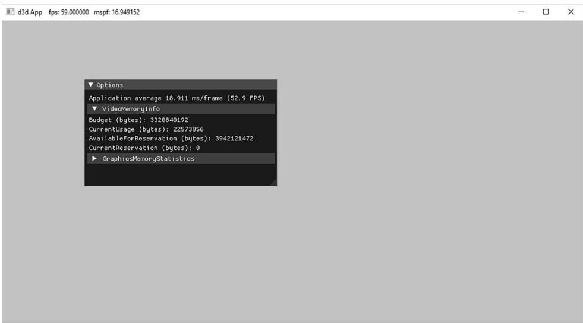


Figure 4.15. A screenshot of the sample program for Chapter 4.


# 4.6 DEBUGGING DIRECT3D APPLICATIONS

Many Direct3D functions return HRESULT error codes. For our sample programs, we use a simple error handling system where we check a returned HRESULT, and if it failed, we throw an exception that stores the error code, function name, filename, and line number of the offending call. This is done with the following code in d3dUtil.h: 

class DxException   
{   
public: DxException() $=$ default; DxException(HRESULT hr, const std::wstring& functionName, const std::wstring& filename, int lineNumber); std::wstringToString(const; HRESULTErrorCode $\equiv$ S_OK; std::wstring FunctionName; std::wstring Filename; int LineNumber $= -1$ ）; #endif ThrowIfFailed #define ThrowIfFailed(x) { HRESULT hr $\equiv$ (x); std::wstring wfn $\equiv$ AnsiToWString(_FILE_); if(FAILED(hr)) { throw DxException(hr_, L#x, wfn, _LINE_); }   
} #endif 

Observe that ThrowIfFailed must be a macro and not a function; otherwise FILE__ and __LINE__ would refer to the file and line of the function implementation instead of the file and line where ThrowIfFailed was written. 

Note: 

The L#x turns the ThrowIfFailed macro’s argument token into a Unicode string. In this way, we can output the function call that caused the error to the message box. 

For a Direct3D function that returns an HRESULT, we use the macro like so: 

```cpp
ThrowIfFailed Md3dDevice->CreateCommittedResource (&CD3D12_HEAP_PROPERTIES(D3D12_HEAP_TYPE_DEFAULT), D3D12_HEAP_MISC_NONE, &depthStencilDesc, D3D12_RESOURCE_USAGE_INITIAL, IID_PPV_args(&mDepthStencilBuffer)); 
```

Our entire application exists in a try/catch block: 

```javascript
try { InitDirect3DApp theApp(hInstance); if(!theApp.Initialize()) return 0; return theAppRUN(); } catch(DxException& e) { MessageBox(nullptr, e.ToString().c_str(), L"HR Failed", MB_OK); return 0; } 
```

If an HRESULT fails, an exception is thrown, we output information about it via the MessageBox function, and then exit the application. For example, if we pass an invalid argument to CreateCommittedResource, we get the following message box: 

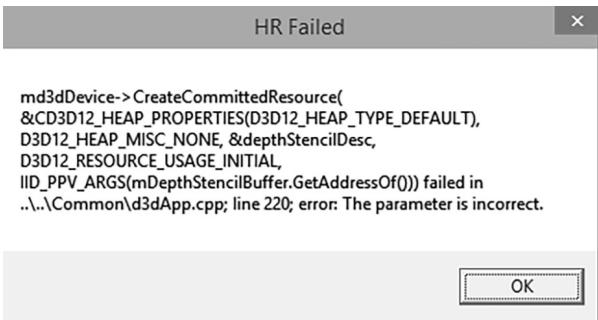


Figure 4.16. Example of the error message box shown when an HRESULT fails.


# 4.7 SUMMARY

1. Direct3D can be thought of as a mediator between the programmer and the graphics hardware. For example, the programmer calls Direct3D functions to bind resource views to the hardware rendering pipeline, to configure the output of the rendering pipeline, and to draw 3D geometry. 

2. Component Object Model (COM) is the technology that allows DirectX to be language independent and have backwards compatibility. Direct3D programmers don’t need to know the details of COM and how it works; they need only to know how to acquire COM interfaces and how to release them. 

3. A 1D texture is like a 1D array of data elements, a 2D texture is like a 2D array of data elements, and a 3D texture is like a 3D array of data elements. 

The elements of a texture must have a format described by a member of the DXGI_FORMAT enumerated type. Textures typically contain image data, but they can contain other data, too, such as depth information (e.g., the depth buffer). The GPU can do special operations on textures, such as filter and multisample them. 

4. To avoid flickering in animation, it is best to draw an entire frame of animation into an off-screen texture called the back buffer. Once the entire scene has been drawn to the back buffer for the given frame of animation, it is presented to the screen as one complete frame; in this way, the viewer does not watch as the frame gets drawn. After the frame has been drawn to the back buffer, the roles of the back buffer and front buffer are reversed: the back buffer becomes the front buffer and the front buffer becomes the back buffer for the next frame of animation. Swapping the roles of the back and front buffers is called presenting. The front and back buffer form a swap chain, represented by the IDXGISwapChain interface. Using two buffers (front and back) is called double buffering. 

5. Assuming opaque scene objects, the points nearest to the camera occlude any points behind them. Depth buffering is a technique for determining the points in the scene nearest to the camera. In this way, we do not have to worry about the order in which we draw our scene objects. 

6. In Direct3D, resources are not bound to the pipeline directly. Instead, we bind resources to the rendering pipeline by specifying the descriptors that will be referenced in the draw call. A descriptor object can be thought of as lightweight structure that identifies and describes a resource to the GPU. Different descriptors of a single resource may be created. In this way, a single resource may be viewed in different ways; for example, bound to different stages of the rendering pipeline or have its bits interpreted as a different DXGI_ FORMAT. Applications create descriptor heaps which form the memory backing of descriptors. 

7. The ID3D12Device is the chief Direct3D interface that can be thought of as our software controller of the physical graphics device hardware; through it, we can create GPU resources, and create other specialized interfaces used to control the graphics hardware and instruct it to do things. 

8. The GPU has a command queue. The CPU submits commands to the queue through the Direct3D API using command lists. A command instructs the GPU to do something. Submitted commands are not executed by the GPU until they reach the front of the queue. If the command queue gets empty, the GPU will idle because it does not have any work to do; on the other hand, if the command queue gets too full, the CPU will at some point have to idle 

while the GPU catches up. Both of these scenarios underutilize the system’s hardware resources. 

9. The GPU is a second processor in the system that runs in parallel with the CPU. Sometimes the CPU and GPU will need to be synchronized. For example, if the GPU has a command in its queue that references a resource, the CPU must not modify or destroy that resource until the GPU is done with it. Any synchronization methods that cause one of the processors to wait and idle should be minimized, as it means we are not taking full advantage of the two processors. 

10. The performance counter is a high-resolution timer that provides accurate timing measurements needed for measuring small time differentials, such as the time elapsed between frames. The performance timer works in time units called counts. The QueryPerformanceFrequency outputs the counts per second of the performance timer, which can then be used to convert from units of counts to seconds. The current time value of the performance timer (measured in counts) is obtained with the QueryPerformanceCounter function. 

11. To compute the average frames per second (FPS), we count the number of frames processed over some time interval $\Delta t .$ . Let $n$ be the number of frames counted over time $\Delta t _ { : }$ , then the average frames per second over that time interval is $\begin{array} { r } { f p s _ { _ { a \nu g } } = \frac { n } { \Delta t } } \end{array}$ . The frame rate can give misleading conclusions about performance; the time it takes to process a frame is more informative. The amount of time, in seconds, spent processing a frame is the reciprocal of the frame rate, i.e., 1/fpsavg. $1 / f p s _ { a \nu g } .$ 

12. The sample framework is used to provide a consistent interface that all demo applications in this book follow. The code provided in the d3dUtil.h, d3dUtil. cpp, d3dApp.h and d3dApp.cpp files, wrap standard initialization code that every application must implement. By wrapping this code up, we hide it, which allows the samples to be more focused on demonstrating the current topic. 

13. For debug mode builds, we enable the debug layer (debugController->EnableDebugLayer()). When the debug layer is enabled, Direct3D will send debug messages to the $\mathrm { V C } { + + }$ output window. 