# Chapter 05 The Rendering Pipeline

Chapter 

# 5

# The Rendering Pip el ine

The primary theme of this chapter is the rendering pipeline. Given a geometric description of a 3D scene with a positioned and oriented virtual camera, the rendering pipeline refers to the entire sequence of steps necessary to generate a 2D image based on what the virtual camera sees (Figure 5.1). This chapter is mostly theoretical鈥攖he next chapter puts the theory into practice as we learn to draw with Direct3D. Before we begin coverage of the rendering pipeline, we have two short stops: First, we discuss some elements of the 3D illusion (i.e., the illusion that we are looking into a 3D world through a flat 2D monitor screen); and second, we explain how colors will be represented and worked with mathematically and in Direct3D code. 

# Chapter Objectives:

1. To discover several key signals used to convey a realistic sense of volume and spatial depth in a 2D image. 

2. To find out how we represent 3D objects in Direct3D. 

3. To learn how we model the virtual camera. 

4. To understand the rendering pipeline鈥攖he process of taking a geometric description of a 3D scene and generating a 2D image from it. 

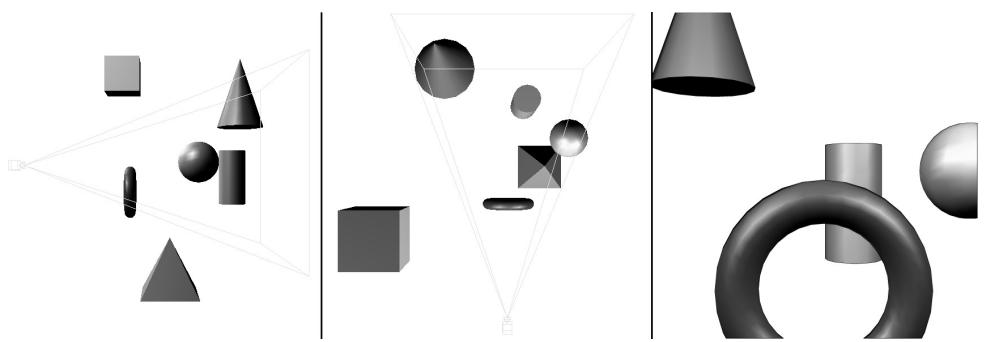


Figure 5.1. The left image shows a side view of some objects setup in the 3D world with a camera positioned and aimed; the middle image shows the same scene, but from a top-down view. The 鈥減yramid鈥?volume specifies the volume of space that the viewer can see; objects (and parts of objects) outside this volume are not seen. The image on the right shows the 2D image created based on what the camera 鈥渟ees鈥?


# 5.1 THE 3D ILLUSION

Before we embark on our journey of 3D computer graphics, a simple question remains outstanding: How do we display a 3D world with depth and volume on a flat 2D monitor screen? Fortunately for us, this problem has been well studied, as artists have been painting 3D scenes on 2D canvases for centuries. In this section, we outline several key techniques that make an image look 3D, even though it is actually drawn on a 2D plane. 

Suppose that you have encountered a railroad track that doesn鈥檛 curve, but goes along a straight line for a long distance. Now the railroad rails remain parallel to each other for all time, but if you stand on the railroad and look down its path, you will observe that the two railroad rails get closer and closer together as their distance from you increases, and eventually they converge at an infinite distance. This is one observation that characterizes our human viewing system: parallel lines of vision converge to a vanishing point; see Figure 5.2. 

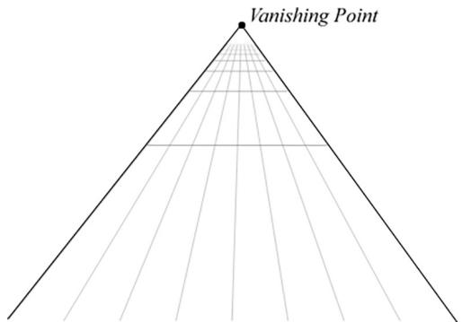


Figure 5.2. Parallel lines of vision converge to a vanishing point. Artists sometimes call this linear perspective.


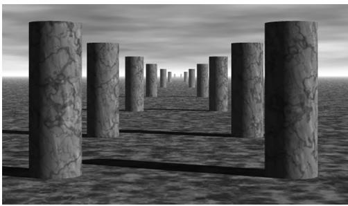


Figure 5.3. Here, all the columns are of the same size, but a viewer observes a diminishing in size with respect to depth phenomenon.


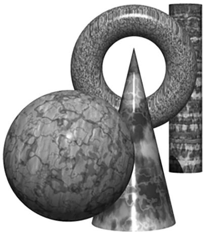


Figure 5.4. A group of objects that partially obscure each other because one is in front of the other, etc. (they overlap).


Another simple observation of how humans see things is that the size of an object appears to diminish with depth; that is, objects near us look bigger than objects far away. For example, a house far away on a hill will look very small, while a tree near us will look very large in comparison. Figure 5.3 shows a simple scene where parallel rows of columns are placed behind each other, one after another. The columns are actually all the same size, but as their depths increase from the viewer, they get smaller and smaller. Also notice how the columns are converging to the vanishing point at the horizon. 

We all experience object overlap (Figure 5.4), which refers to the fact that opaque objects obscure parts (or all) of the objects behind them. This is an important perception, as it conveys the depth ordering relationship of the objects in the scene. We already discussed (Chapter 4) how Direct3D uses a depth buffer to figure out which pixels are being obscured and thus should not be drawn. 

Consider Figure 5.5. On the left we have an unlit sphere, and on the right, we have a lit sphere. As you can see, the sphere on the left looks rather flat鈥攎aybe it 

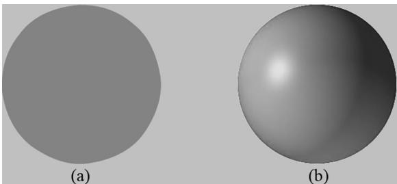


Figure 5.5. (a) An unlit sphere that looks 2D. (b) A lit sphere that looks 3D.


is not even a sphere at all, but just a textured 2D circle! Thus, lighting and shading play a very important role in depicting the solid form and volume of 3D objects. 

Figure $5 . 6 a$ shows a scene with lighting only. Although it looks 3D, it certainly lacks detail. In Figure $5 . 6 b \mathrm { . }$ , shadows are added along with ambient occlusion. Shadows tell us the origin of the light sources in the scene and can give an idea of how large or how far off the ground an object is. Ambient occlusion is somewhat related to shadows. It has the effect of darkening areas in cracks and crevices. Informally, this is because nearby geometry is occluding light from some directions (i.e., not as much light will enter cracks and crevices). Figure $5 . 6 c$ adds textures to the scene, which is where we 鈥渟tretch鈥?image data over a 3D object to give it detail. This adds quite a lot to the look and feel of the scene. 

Finally, Figure $5 . 6 d$ shows two orbs. The one on the left is glass, where the light refracts and makes it transparent, and the one on the right has mirror-like reflections. Some materials like glass and water are both reflective and refractive and the amount varies depending on the viewing angle. Besides perfect mirrors, most materials that are not completely matte have some mirror-like reflectivity, such as polished stone or finished wood floors. Modeling this reflectivity in everyday materials enhances the realism of computer graphics. Another thing to keep in mind when modeling surfaces is how paints and clearcoats, for example, affect the optical properties of a surface. 

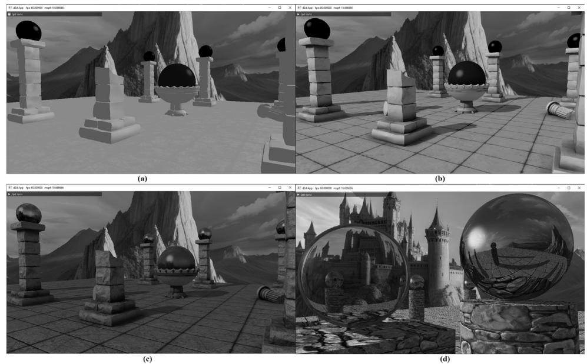


Figure 5.6. (a) A lit scene only. (b) Shadows and ambient occlusion added to the previous figure. (c)聽Texture data added to the previous figure. (d) Transparency and reflections.


The observations just discussed, no doubt, are intuitively obvious from our day-to-day experiences. Nonetheless, it is helpful to explicitly state what we know and to keep these observations in mind as we study and work on 3D computer graphics. 

# 5.2 MODEL REPRESENTATION

A solid 3D object is represented by a triangle mesh approximation, and consequently, triangles form the basic building blocks of the objects we model. As Figure 5.7 implies, we can approximate any real-world 3D object by a triangle mesh. In general, the more triangles you use to approximate an object, the better the approximation, as you can model finer details. Of course, the more triangles we use, the more processing power is required, and so a balance must be made based on the hardware power of the application鈥檚 target audience. In addition to triangles, it is sometimes useful to draw lines or points. For example, a curve could be graphically drawn by a sequence of short line segments a pixel thick. 

The large number of triangles used in Figure 5.7 makes one thing clear: It would be extremely cumbersome to manually list the triangles of a 3D model. For all but the simplest models, special 3D applications called 3D modelers are used to generate and manipulate 3D objects. These modelers allow the user to build complex and realistic meshes in a visual and interactive environment with a rich tool set, thereby making the entire modeling process much easier. Examples of popular modelers used for game development are 3D Studio Max (https://www. autodesk.com/products/3ds-max), Maya (https://www.autodesk.com/products/ maya), Mudbox (https://www.autodesk.com/products/mudbox), and Blender (www.blender.org/). (Blender has the advantage for hobbyists of being open source and free.) Digital scanners can also generate 3D mesh data. Nevertheless, for the 

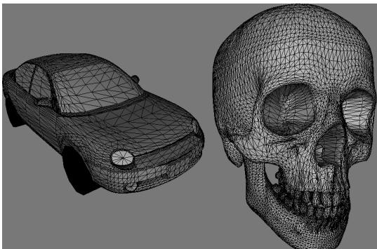


Figure 5.7. (Left) A car approximated by a triangle mesh. (Right) A skull approximated by a triangle mesh.


first part of this book, we will generate our 3D models manually by hand, or via a mathematical formula (the triangle list for cylinders and spheres, for example, can easily be generated with parametric formulas). In the third part of this book, we show how to load and display 3D models exported from 3D modeling programs. 

# 5.3 BASIC COMPUTER COLOR

Computer monitors emit a mixture of red, green, and blue light through each pixel. When the light mixture enters the eye and strikes an area of the retina, cone receptor cells are stimulated and neural impulses are sent down the optic nerve toward the brain. The brain interprets the signal and generates a color. As the light mixture varies, the cells are stimulated differently, which in turn generates a different color in the mind. Figure 5.8 shows some examples of mixing red, green, and blue to get different colors; it also shows different intensities of red. By using different intensities for each color component and mixing them together, we can describe all the colors we need to display realistic images. 

The best way to get comfortable with describing colors by RGB (red, green, blue) values is to use a paint program like Adobe Photoshop, or even the Win32 ChooseColor dialog box (Figure 5.9), and experiment with different RGB combinations to see the colors they produce. 

A monitor has a maximum intensity of red, green, and blue light it can emit. To describe the intensities of light, it is useful to use a normalized range from 0 to 1. 

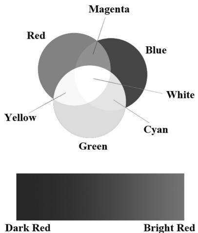


Figure 5.8. (Top) The mixing of pure red, green, and blue colors to get new colors. (Bottom) Different shades of red found by controlling the intensity of red light.


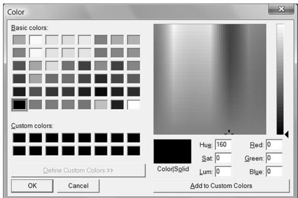


Figure 5.9. The ChooseColor dialog box.


0 denotes no intensity and 1 denotes the full intensity. Intermediate values denote intermediate intensities. For example, the values ( . 0 25 0, .67, . 1 0) mean the light mixture consists of $2 5 \%$ intensity of red light, $6 7 \%$ intensity of green light, and $1 0 0 \%$ intensity of blue light. As the example just stated implies, we can represent a color by a 3D color vector $( r , g , b )$ , where $0 \leq r , g , b \leq 1 ,$ and each color component describes the intensity of red, green, and blue light in the mixture. 

# 5.3.1 Color Operations

Some vector operations also apply to color vectors. For example, we can add color vectors to get new colors: 

$$
(0. 0, 0. 5, 0) + (0, 0. 0, 0. 2 5) = (0. 0, 0. 5, 0. 2 5)
$$

By combining a medium intensity green color with a low intensity blue color, we get a dark-green color. 

Colors can also be subtracted to get new colors: 

$$
(1, 1, 1) - (1, 1, 0) = (0, 0, 1)
$$

That is, we start with white and subtract out the red and green parts, and we end up with blue. 

Scalar multiplication also makes sense. Consider the following: 

$$
0. 5 (1, 1, 1) = (0. 5, 0. 5, 0. 5)
$$

That is, we start with white and multiply by 0.5, and we end up with a medium shade of gray. On the other hand, the operation $2 ( 0 . 2 5 , 0 , 0 ) = ( 0 . 5 , 0 , 0 )$ doubles the intensity of the red component. 

Obviously expressions like the dot product and cross product do not make sense for color vectors. However, color vectors do get their own special color operation called modulation or componentwise multiplication. It is defined as: 

$$
\left(c _ {r}, c _ {g}, c _ {b}\right) \otimes \left(k _ {r}, k _ {g}, k _ {b}\right) = \left(c _ {r} k _ {r}, c _ {g} k _ {g}, c _ {b} k _ {b}\right)
$$

This operation is mainly used in lighting equations. For example, suppose we have an incoming ray of light with color $( r , g , b )$ and it strikes a surface which reflects $5 0 \%$ red light, $7 5 \%$ green light, and $2 5 \%$ blue light, and absorbs the rest. Then the color of the reflected light ray is given by: 

$$
(r, g, b) \otimes (0. 5, 0. 7 5, 0. 2 5) = (0. 5 r, 0. 7 5 g, 0. 2 5 b)
$$

So we can see that the light ray lost some intensity when it struck the surface, since the surface absorbed some of the light. 

When doing color operation, it is possible that that your color components go outside the [ , 0 1] interval; consider the equation, $( 1 , 0 . 1 , 0 . 6 ) + ( 0 , 0 . 3 , 0 . 5 ) = ( 1 , 0 . 4 , 1 . 1 )$ , for example. Since 1.0 represents the maximum intensity of a color component, you cannot become more intense than it. Thus 1.1 is just as intense as 1.0. So what we do is clamp $1 . 1  1 . 0$ . Likewise, a monitor cannot emit negative light, so any negative color component (which could result from a subtraction operation) should be clamped to 0.0. 

# 5.3.2 128-Bit Color

It is common to incorporate an additional color component, called the alpha component. The alpha component is often used to denote the opacity of a color, which is useful in blending (Chapter 10). (Since we are not using blending yet, just set the alpha component to 1 for now.) Including the alpha component, means we can represent a color by a 4D color vector $( r , g , b , a )$ where $0 \leq r , g , b , a \leq 1$ . To represent a color with 128-bits, we use a floating-point value for each component. Because mathematically a color is just a 4D vector, we can use the XMVECTOR type to represent a color in code, and we gain the benefit of SIMD operations whenever use the DirectXMath vector functions to do color operations (e.g., color addition, subtraction, scalar multiplication). For componentwise multiplication, the DirectX Math library provides the following function: 

XMVECTOR XM_CALLCONV XMColorModulate(/ Returns $\mathbf{c}_1\otimes \mathbf{c}_2$ FXMVECTOR C1, FXMVECTOR C2); 

# 5.3.3 32-Bit Color

To represent a color with 32-bits, a byte is given to each component. Since each color is given an 8-bit byte, we can represent 256 different shades for each color component鈥? being no intensity, 255 being full intensity, and intermediate values being intermediate intensities. A byte per color component may seem small, but when we look at all the combinations $( 2 5 6 \times 2 5 6 \times 2 5 6 = 1 6 , 7 7 7 , 2 1 6 )$ , we see millions of distinct colors can be represented. The DirectX Math library (#include <DirectXPackedVector.h>) provides the following structure, in the 

DirectX::PackedVector namespace, for storing a 32-bit color: 

```cpp
namespace DirectX  
{  
namespace PackedVector  
{  
// ARGB Color; 8-8-8-8 bit unsigned normalized integer components  
// packed into a 32 bit integer. The normalized color is packed into  
// 32 bits using 8 bit unsigned, normalized integers for the alpha,  
// red, green, and blue components. 
```

```c
// The alpha component is stored in the most significant bits and the
// blue component in the least significant bits (A8R8G8B8):
// [32] aaaaaaaa rrrrrrrr ggggggg bbbbbbb [0]
struct XMCOLOR
{
union
{
struct
{
uint8_t b; // Blue: 0/255 to 255/255
uint8_t g; // Green: 0/255 to 255/255
uint8_t r; // Red: 0/255 to 255/255
uint8_t a; // Alpha: 0/255 to 255/255
};
uint32_t c;
};
XMCOLOR() {}
XMCOLOR uint32_t Color): c(Color) {}
XMCOLOR(float _r, float _g, float _b, float _a);
explicit XMCOLOR(_In_reads_(4) const float *pArray);
operator uint32_t () const { return c; }
XMCOLOR& operator= (const XMCOLOR& Color) { c = Color.c; return
*c; }
XMCOLOR& operator= (const uint32_t Color) { c = Color; return *this;
}
};
} // end PackedVector namespace
} // end DirectX namespace 
```

A 32-bit color can be converted to a 128-bit color by mapping the integer range [0, 255] onto the real-valued interval [0, 1]. This is done by dividing by 255. That is, if $0 \leq n \leq 2 5 5$ is an integer, then $\textstyle 0 \leq { \frac { n } { 2 5 5 } } \leq 1$ gives the intensity in the normalized range from 0 to 1. For example, the 32-bit color ( , 80 140, , 200 255) becomes: 

$$
(8 0, 1 4 0, 2 0 0, 2 5 5) \rightarrow \left(\frac {8 0}{2 5 5}, \frac {1 4 0}{2 5 5}, \frac {2 0 0}{2 5 5}, \frac {2 5 5}{2 5 5}\right) \approx (0. 3 1, 0. 5 5, 0. 7 8, 1. 0)
$$

On the other hand, a 128-bit color can be converted to a 32-bit color by multiplying each component by 255 and rounding to the nearest integer. For example: 

$$
(0. 3, 0. 6, 0. 9, 1. 0) \rightarrow (0. 3 \cdot 2 5 5, 0. 6 \cdot 2 5 5, 0. 9 \cdot 2 5 5, 1. 0 \cdot 2 5 5) = (7 7, 1 5 3, 2 3 0, 2 5 5)
$$

Additional bit operations must usually be done when converting a 32-bit color to a 128-bit color and conversely because the 8-bit color components are usually packed into a 32-bit integer value (e.g., an unsigned int), as it is in XMCOLOR. The 

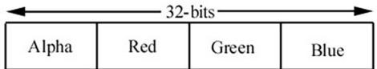


Figure 5.10. A 32-bit color, where a byte is allocated for each color component alpha, red, green, and blue.


DirectXMath library defines the following function which takes a XMCOLOR and returns an XMVECTOR from it: 

```cpp
XMVECTOR XM_CALLCONV PackedVector::XMLoadColor(const XMCOLOR* pSource); 
```

Figure 5.10 shows how the 8-bit color components are packed into a UINT. Note that this is just one way to pack the color components. Another format might be ABGR or RGBA, instead of ARGB; however, the XMCOLOR class uses the ARGB layout. The DirectX Math library also provides a function to convert an XMVECTOR color to a XMCOLOR: 

```cpp
void XM_CALLCONV PackedVector::XMStoreColor(XMCOLOR* pDestination, FXMVECTOR V); 
```

Typically, 128-bit colors values are used where high precision color operations are needed (e.g., in a pixel shader); in this way, we have many bits of accuracy for the calculations so arithmetic error does not accumulate too much. The final pixel color, however, is usually stored in a 32-bit color value in the back buffer; current physical display devices cannot take advantage of the higher resolution color [Verth04]. 

# 5.4 OVERVIEW OF THE RENDERING PIPELINE

Given a geometric description of a 3D scene with a positioned and oriented virtual camera, the rendering pipeline refers to the entire sequence of steps necessary to generate a 2D image based on what the virtual camera sees. Figure 5.11 shows a diagram of the stages that make up the rendering pipeline, as well as GPU memory resources off to the side. An arrow going from the resource memory pool to a stage means the stage can access the resources as input; for example, the pixel shader stage may need to read data from a texture resource stored in memory in order to do its work. An arrow going from a stage to memory means the stage writes to GPU resources; for example, the output merger stage writes data to textures such as the back buffer and depth/stencil buffer. Observe that the arrow for the output merger stage is bidirectional (it reads and writes to GPU resources). As we can see, most stages do not write to GPU resources. Instead, their output is just fed in as input to the next stage of the pipeline; for example, the Vertex Shader stage inputs data from the Input Assembler stage, does its own 

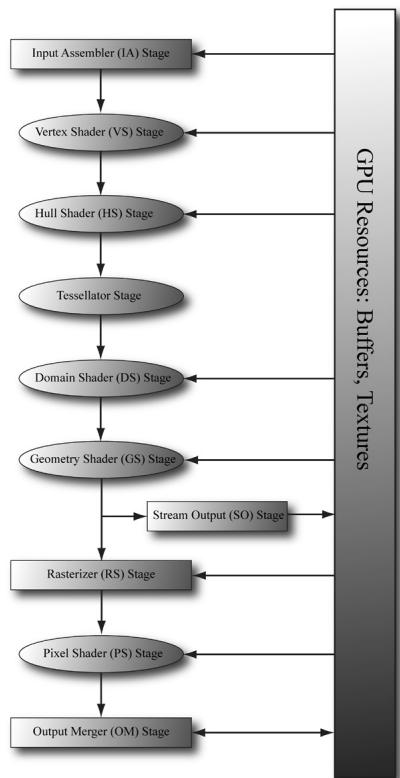


Figure 5.11. The stages of the rendering pipeline.


work, and then outputs its results to the Geometry Shader stage. The subsequent sections give an overview of each stage of the rendering pipeline. 

# 5.5 THE INPUT ASSEMBLER STAGE

The input assembler (IA) stage reads geometric data (vertices and indices) from memory and uses it to assemble geometric primitives (e.g., triangles, lines). (Indices are covered in a later subsection, but briefly, they define how the vertices should be put together to form the primitives.) 

# 5.5.1 Vertices

Mathematically, the vertices of a triangle are where two edges meet; the vertices of a line are the endpoints; for a single point, the point itself is the vertex. Figure 5.12 illustrates vertices pictorially. 

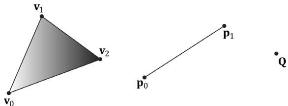


Figure 5.12. A triangle defined by the three vertices $\mathbf { v } _ { 0 } , \mathbf { v } _ { 1 , } \mathbf { v } _ { 2 }$ ; a line defined by the two vertices $\mathsf { \pmb P 0 } , \mathsf { \pmb P } ^ { \dagger }$ ; a point defined by the vertex Q.


From Figure 5.12, it seems that a vertex is just a special point in a geometric primitive. However, in Direct3D, vertices are much more general than that. Essentially, a vertex in Direct3D can consist of additional data besides spatial location, which allows us to perform more sophisticated rendering effects. For example, in Chapter 8, we will add normal vectors to our vertices to implement lighting, and in Chapter 9, we will add texture coordinates to our vertices to implement texturing. Direct3D gives us the flexibility to define our own vertex formats (i.e., it allows us to define the components of a vertex), and we will see the code used to do this in the next chapter. In this book, we will define several different vertex formats based on the rendering effect we are doing. 

# 5.5.2 Primitive Topology

Vertices are bound to the rendering pipeline in a special Direct3D data structure called a vertex buffer. A vertex buffer just stores a list of vertices in contiguous memory. However, it does not say how these vertices should be put together to form geometric primitives. For example, should every two vertices in the vertex buffer be interpreted as a line or should every three vertices in the vertex buffer be interpreted as a triangle? We tell Direct3D how to form geometric primitives from the vertex data by specifying the primitive topology: 

```cpp
void ID3D12CommandList::IASetPrimitiveTopology(
    D3D_PRIMITIVE_TOPOLOGY Topology);
typedef enum D3D_PRIMITIVE_TOPOLOGY
{
    D3D_PRIMITIVE_TOPOLOGY_UNDEFINED = 0,
    D3D_PRIMITIVE_TOPOLOGY_POINTERLIST = 1,
    D3D_PRIMITIVE_TOPOLOGYLineList = 2,
    D3D_PRIMITIVE_TOPOLOGYLineStrip = 3,
    D3D_PRIMITIVE_TOPOLOGY_TRIANGLEList = 4,
    D3D_PRIMITIVE_TOPOLOGY_TRIANGLEADJ = 10,
    D3D_PRIMITIVE_TOPOLOGYLineStripADJ = 11,
    D3D_PRIMITIVE_TOPOLOGY_TRIANGLEADJ = 12,
    D3D_PRIMITIVE_TOPOLOGY_TRIANGLEADJ = 13,
    D3D_PRIMITIVE_TOPOLOGY1_CONTROL_POINT PatchList = 33, 
```

D3D_PRIMITIVE_TOPOLOGY_2_CONTROL_POINT PATCHLIST $= 34$ 路 D3D_PRIMITIVE_TOPOLOGY_32_CONTROL_POINT PATCHLIST $= 64$ }D3D_PRIMITIVE_TOPOLOGY; 

All subsequent drawing calls will use the currently set primitive topology until the topology is changed via the command list. The following code illustrates: 

```c
mCommandList->IASetPrimitiveTopology( D3D_PRIMITIVE_TOPOLOGY_LINELIST); /* ...draw objects using line list... */  
mCommandList->IASetPrimitiveTopology( D3D_PRIMITIVE_TOPOLOGY_TRIANGLELIST); /* ...draw objects using triangle list... */  
mCommandList->IASetPrimitiveTopology( D3D_PRIMITIVE_TOPOLOGY_TRIANGLESTRIP); /* ...draw objects using triangle strip... */ 
```

The following subsections elaborate on the different primitive topologies. In this book, we mainly use triangle lists exclusively with few exceptions. 

# 5.5.2.1 Point List

A point list is specified by D3D_PRIMITIVE_TOPOLOGY_POINTLIST. With a point list, every vertex in the draw call is drawn as an individual point, as shown in Figure $5 . 1 3 a$ . 

# 5.5.2.2 Line Strip

A line strip is specified by D3D_PRIMITIVE_TOPOLOGY_LINESTRIP. With a line strip, the vertices in the draw call are connected to form lines (see Figure 5.13b); so $n { \mathrel { + { 1 } } }$ vertices induce n lines. 

# 5.5.2.3 Line List

A line list is specified by D3D_PRIMITIVE_TOPOLOGY_LINELIST. With a line list, every two vertices in the draw call forms an individual line (see Figure 5.13c); so $2 n$ vertices induce n lines. The difference between a line list and strip is that the lines in the line list may be disconnected, whereas a line strip automatically assumes they are connected; by assuming connectivity, fewer vertices can be used since each interior vertex is shared by two lines. 

# 5.5.2.4 Triangle Strip

A triangle strip is specified by D3D_PRIMITIVE_TOPOLOGY_TRIANGLESTRIP. With a triangle strip, it is assumed the triangles are connected as shown in Figure $5 . 1 3 d$ to form a strip. By assuming connectivity, we see that vertices are shared between adjacent triangles, and n vertices induce $n - 2$ triangles. 

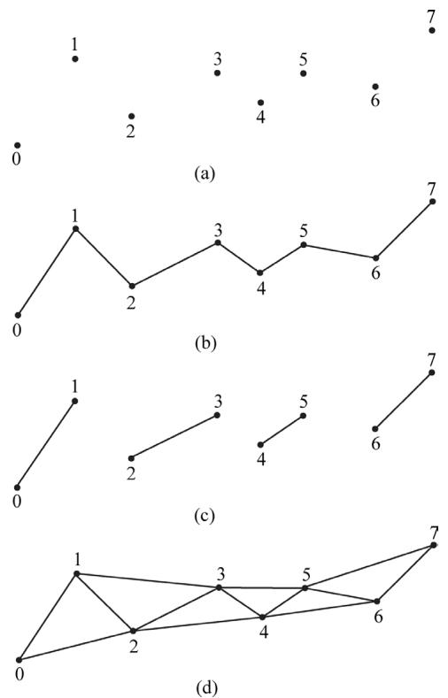


Figure 5.13. (a) A point list; (b) a line strip; (c) a line list; (d) a triangle strip.


Observe that the winding order for even triangles in a triangle strip differs from the odd triangles, thereby causing culling issues (see 搂5.7.2). To fix this problem, the GPU internally swaps the order of the first two vertices of even triangles, so that they are consistently ordered like the odd triangles. 

# 5.5.2.5 Triangle List

A triangle list is specified by D3D_PRIMITIVE_TOPOLOGY_TRIANGLELIST. With a triangle list, every three vertices in the draw call forms an individual triangle (see Figure 5.14a); so 3n vertices induce n triangles. The difference between a triangle list and strip is that the triangles in the triangle list may be disconnected, whereas a triangle strip assumes they are connected. 

# 5.5.2.6 Primitives with Adjacency

A triangle list with adjacency is where, for each triangle, you also include its three neighboring triangles called adjacent triangles; see Figure $5 . 1 4 b$ to observe how these triangles are defined. This is used for the geometry shader, where certain geometry shading algorithms need access to the adjacent triangles. In order for the geometry shader to get those adjacent triangles, the adjacent triangles need 

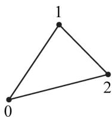


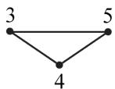


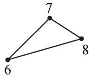


(a)


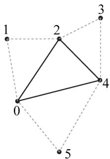


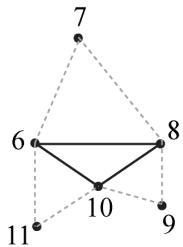


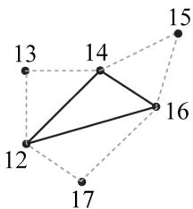


Figure 5.14. (a) A triangle list; (b) A triangle list with adjacency鈥攐bserve that each triangle requires 6 vertices to describe it and its adjacent triangles. Thus 6n vertices induce n triangles with adjacency info.


to be submitted to the pipeline in the vertex/index buffers along with the triangle itself, and the D3D_PRIMITIVE_TOPOLOGY_TRIANGLELIST_ADJ topology must be specified so that the pipeline knows how construct the triangle and its adjacent triangles from the vertex buffer. Note that the vertices of adjacent primitives are only used as input into the geometry shader鈥攖hey are not drawn. If there is no geometry shader, the adjacent primitives are still not drawn. 

It is also possible to have a line list with adjacency, line strip with adjacency, and triangle with strip adjacency primitives; see the SDK documentation for details. 

# 5.5.2.7 Control Point Patch List

The D3D_PRIMITIVE_TOPOLOGY_N_CONTROL_POINT_PATCHLIST topology type indicates that the vertex data should be interpreted as a patch lists with $N$ control points. These are used in the (optional) tessellation stage of the rendering pipeline, and therefore, we will postpone a discussion of them until Chapter 14. 

# 5.5.3 Indices

As already mentioned, triangles are the basic building blocks for solid 3D objects. The following code shows the vertex arrays used to construct a quad and octagon using triangle lists (i.e., every three vertices form a triangle). 

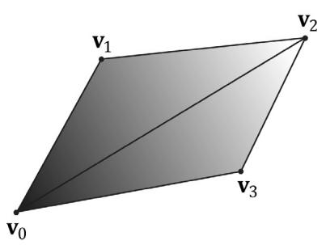


(a)


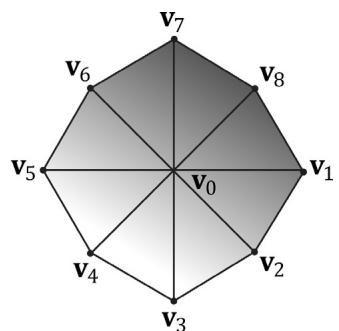


(b)


Figure 5.15. (a) A quad built from two triangles. (b) An octagon built from eight triangles.


```javascript
Vertex quad[6] = { v0, v1, v2, // Triangle 0 v0, v2, v3, // Triangle 1 };  
Vertex octagon[24] = { v0, v1, v2, // Triangle 0 v0, v2, v3, // Triangle 1 v0, v3, v4, // Triangle 2 v0, v4, v5, // Triangle 3 v0, v5, v6, // Triangle 4 v0, v6, v7, // Triangle 5 v0, v7, v8, // Triangle 6 v0, v8, v1 // Triangle 7 }; 
```

Note: 

The order in which you specify the vertices of a triangle is important and is called the winding order; see 搂5.10.2 for details. 

As Figure 5.15 illustrates, the triangles that form a 3D object share many of the same vertices. More specifically, each triangle of the quad in Figure $5 . 1 5 a$ shares the vertices $\mathbf { v } _ { 0 }$ and $\mathbf { v } _ { 2 }$ . While duplicating two vertices is not too bad, the duplication is worse in the octagon example (Figure 5.15b), as every triangle duplicates the center vertex $\mathbf { v } _ { 0 }$ , and each vertex on the perimeter of the octagon is shared by two triangles. In general, the number of duplicate vertices increases as the detail and complexity of the model increases. 

There are two reasons why we do not want to duplicate vertices: 

1. Increased memory requirements. (Why store the same vertex data more than once?) 

2. Increased processing by the graphics hardware. (Why process the same vertex data more than once?) 

Triangle strips can help the duplicate vertex problem in some situations, provided the geometry can be organized in a strip like fashion. However, triangle lists are more flexible (the triangles need not be connected), and so it is worth devising a method to remove duplicate vertices for triangle lists. The solution is to use indices. It works like this: We create a vertex list and an index list. The vertex list consists of all the unique vertices and the index list contains values that index into the vertex list to define how the vertices are to be put together to form triangles. Returning to the shapes in Figure 5.15, the vertex list of the quad would be constructed as follows: 

```javascript
Vertex v[4] = {v0, v1, v2, v3}; 
```

Then the index list needs to define how the vertices in the vertex list are to be put together to form the two triangles. 

```cpp
UINT indexList[6] = {0, 1, 2, // Triangle 0
	0, 2, 3}; // Triangle 1 
```

In the index list, every three elements define a triangle. So the above index list says, 鈥渇orm triangle 0 by using the vertices v[0], v[1], and v[2], and form triangle 1 by using the vertices v[0], v[2], and $\boldsymbol { \nabla } [  3 ]$ .鈥?

Similarly, the vertex list for the octagon would be constructed as follows: 

```cpp
Vertex v [9] = {v0, v1, v2, v3, v4, v5, v6, v7, v8}; 
```

and the index list would be: 

```cpp
UINT indexList[24] = {  
0, 1, 2, // Triangle 0  
0, 2, 3, // Triangle 1  
0, 3, 4, // Triangle 2  
0, 4, 5, // Triangle 3  
0, 5, 6, // Triangle 4  
0, 6, 7, // Triangle 5  
0, 7, 8, // Triangle 6  
0, 8, 1 // Triangle 7  
}; 
```

After the unique vertices in the vertex list are processed, the graphics card can use the index list to put the vertices together to form the triangles. Observe that we have moved the 鈥渄uplication鈥?over to the index list, but this is not bad since: 

1. Indices are simply integers and do not take up as much memory as a full vertex structure (and vertex structures can get big as we add more components to them). 

2. With good vertex cache ordering, the graphics hardware won鈥檛 have to process duplicate vertices (too often). 

# 5.6 THE VERTEX SHADER STAGE

After the primitives have been assembled, the vertices are fed into the vertex shader stage. The vertex shader can be thought of as a function that inputs a vertex and outputs a vertex. Every vertex drawn will be pumped through the vertex shader; in fact, we can conceptually think of the following happening on the hardware: 

```c
for (UINT i = 0; i < numVertices; ++i)  
    outputVertex[i] = VertexShader( inputVertex[i]); 
```

The vertex shader function is something we implement, but it is executed by the GPU for each vertex, so it is very fast. 

Many special effects can be done in the vertex shader such as transformations, lighting, and displacement mapping. Remember that not only do we have access to the input vertex data, but we also can access textures and other data stored in GPU memory such as transformation matrices, and scene lights. 

We will see many examples of different vertex shaders throughout this book; so by the end, you should have a good idea of what can be done with them. For our first code example, however, we will just use the vertex shader to transform vertices. The following subsections explain the kind of transformations that generally need to be done. 

# 5.6.1 Local Space and World Space

Suppose for a moment that you are working on a film and your team has to construct a miniature version of a train scene for some special effect shots. In particular, suppose that you are tasked with making a small bridge. Now, you would not construct the bridge in the middle of the scene, where you would likely have to work from a difficult angle and be careful not to mess up the other miniatures that compose the scene. Instead, you would work on the bridge at your workbench away from the scene. Then when it is all done, you would place the bridge at its correct position and angle in the scene. 

3D artists do something similar when constructing 3D objects. Instead of building an object鈥檚 geometry with coordinates relative to a global scene coordinate system (world space), they specify them relative to a local coordinate system (local space); the local coordinate system will usually be some convenient coordinate system located near the object and axis-aligned with the object. Once the vertices of the 3D model have been defined in local space, it is placed in the global scene. In order to do this, we must define how the local space and world space are related; this is done by specifying where we want the origin and axes of the local space coordinate system relative to the global scene coordinate system, and executing a change of coordinate transformation (see Figure 5.16 and recall 

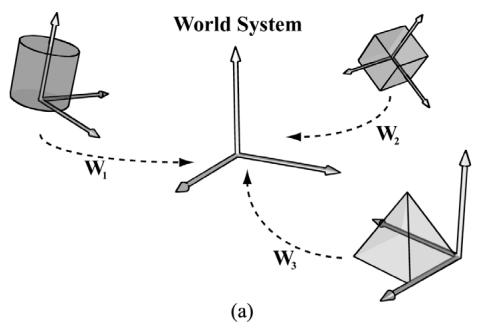


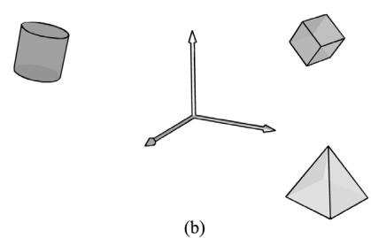


Figure 5.16. (a) The vertices of each object are defined with coordinates relative to their own local coordinate system. In addition, we define the position and orientation of each local coordinate system relative to the world space coordinate system based on where we want the object in the scene. Then we execute a change of coordinate transformation to make all coordinates relative to the world space system. (b) After the world transform, the objects鈥?vertices have coordinates all relative to the same world system.


$\ S 3 . 4 )$ . The process of changing coordinates relative to a local coordinate system into the global scene coordinate system is called the world transform, and the corresponding matrix is called the world matrix. Each object in the scene has its own world matrix. After each object has been transformed from its local space to the world space, then all the coordinates of all the objects are relative to the same coordinate system (the world space). If you want to define an object directly in the world space, then you can supply an identity world matrix. 

Defining each model relative to its own local coordinate system has several advantages: 

1. It is easier. For instance, usually in local space the object will be centered at the origin and symmetrical with respect to one of the major axes. As another example, the vertices of a cube are much easier to specify if we choose a local coordinate system with origin centered at the cube and with axes orthogonal to the cube faces; see Figure 5.17. 

2. The object may be reused across multiple scenes, in which case it makes no sense to hardcode the object鈥檚 coordinates relative to a particular scene. Instead, it is better to store its coordinates relative to a local coordinate system and then define, via a change of coordinate matrix, how the local coordinate system and world coordinate system are related for each scene. 

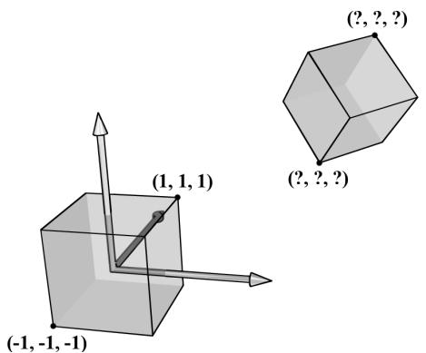


Figure 5.17. The vertices of a cube are easily specified when the cube is centered at the origin and axisaligned with the coordinate system. It is not so easy to specify the coordinates when the cube is at an arbitrary position and orientation with respect to the coordinate system. Therefore, when we construct the geometry of an object, we usually always choose a convenient coordinate system near the object and aligned with the object, from which to build the object around.


3. Finally, sometimes we draw the same object more than once in a scene, but in different positions, orientations, and scales (e.g., a tree object may be reused several times to build a forest). It would be wasteful to duplicate the object鈥檚 vertex and index data for each instance. Instead, we store a single copy of the geometry (i.e., vertex and index lists) relative to its local space. Then we draw the object several times, but each time with a different world matrix to specify the position, orientation, and scale of the instance in the world space. This is called instancing. 

As $\ S 3 . 4 . 3$ shows, the world matrix for an object is given by describing its local space with coordinates relative to the world space, and placing these coordinates in the rows of a matrix. If $\mathbf { Q } _ { \scriptscriptstyle W } = ( Q _ { x } , Q _ { y } , Q _ { z } , 1 ) .$ , $\mathbf { u } _ { { W } } = ( u _ { { x } } , u _ { { y } } , u _ { { z } } , 0 )$ , $\mathbf { v } _ { \scriptscriptstyle W } = ( \nu _ { \scriptscriptstyle x } , \nu _ { \scriptscriptstyle y } , \nu _ { \scriptscriptstyle z } , 0 ) .$ , and $\mathbf { w } _ { W } = ( w _ { x } , w _ { y } , w _ { z } , 0 )$ describe, respectively, the origin, $x \mathrm { - } , y \mathrm { - }$ , and $z$ -axes of a local space with homogeneous coordinates relative to world space, then we know from $\ S 3 . 4 . 3$ that the change of coordinate matrix from local space to world space is: 

$$
\mathbf {W} = \left[ \begin{array}{c c c c} u _ {x} & u _ {y} & u _ {z} & 0 \\ \nu_ {x} & \nu_ {y} & \nu_ {z} & 0 \\ w _ {x} & w _ {y} & w _ {z} & 0 \\ Q _ {x} & Q _ {y} & Q _ {z} & 1 \end{array} \right]
$$

We see that to construct a world matrix, we must directly figure out the coordinates of the local space origin and axes relative to the world space. This is sometimes not that easy or intuitive. A more common approach is to define W as a sequence of transformations, say $\mathbf { W } = \mathbf { S } \mathbf { R } \mathbf { T }$ , the product of a scaling matrix 

S to scale the object into the world, followed by a rotation matrix R to define the orientation of the local space relative to the world space, followed by a translation matrix T to define the origin of the local space relative to the world space. From $\ S 3 . 5$ , we know that this sequence of transformations may be interpreted as a change of coordinate transformation, and that the row vectors of $\mathbf { W } = \mathbf { S } \mathbf { R } \mathbf { T }$ store the homogeneous coordinates of the $x$ -axis, $\boldsymbol { y }$ -axis, $z$ -axis and origin of the local space relative to the world space. 

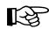


# Example

Suppose we have a unit square defined relative to some local space with minimum and maximum points $( - 0 . 5 , 0 , - 0 . 5 )$ and ( . 0 5, , 0 0. )5 , respectively. Find the world matrix such that the square has a length of 2 in world space, the square is rotated $4 5 ^ { \circ }$ clockwise in the $x z$ -plane of the world space, and the square is positioned at ( , 10 0 1, ) 0 in world space. We construct S, R, T, and W as follows: 

$$
\begin{array}{l} \mathbf {S} = \left[ \begin{array}{l l l l} 2 & 0 & 0 & 0 \\ 0 & 1 & 0 & 0 \\ 0 & 0 & 2 & 0 \\ 0 & 0 & 0 & 1 \end{array} \right] \quad \mathbf {R} = \left[ \begin{array}{c c c c} \sqrt {2} / 2 & 0 & - \sqrt {2} / 2 & 0 \\ 0 & 1 & 0 & 0 \\ \sqrt {2} / 2 & 0 & \sqrt {2} / 2 & 0 \\ 0 & 0 & 0 & 1 \end{array} \right] \quad \mathbf {T} = \left[ \begin{array}{l l l l} 1 & 0 & 0 & 0 \\ 0 & 1 & 0 & 0 \\ 0 & 0 & 1 & 0 \\ 1 0 & 0 & 1 0 & 1 \end{array} \right] \\ \mathbf {W} = \mathbf {S R T} = \left[ \begin{array}{c c c c} \sqrt {2} & 0 & - \sqrt {2} & 0 \\ 0 & 1 & 0 & 0 \\ \sqrt {2} & 0 & \sqrt {2} & 0 \\ 1 0 & 0 & 1 0 & 1 \end{array} \right] \\ \end{array}
$$

Now from $\$ 3.5$ , the rows in W describe the local coordinate system relative to the world space; that is, $\mathbf { u } _ { \scriptscriptstyle W } = ( \sqrt { 2 } , 0 , - \sqrt { 2 } , 0 )$ , ${ \bf v } _ { W } = ( 0 , 1 , 0 , 0 )$ , $\begin{array} { r } { \dot { \mathbf { w } } _ { W } = ( \sqrt { 2 } , 0 , \sqrt { 2 } , 0 ) . } \end{array}$ , and $\mathbf { Q } _ { \scriptscriptstyle W } = ( 1 0 , 0 , 1 0 , 1 )$ . When we change coordinates from the local space to the world space with W, the square end up in the desired place in world space (see Figure 5.18). 

$$
\begin{array}{l} \left[ \begin{array}{c c c c} - 0. 5, & 0, & - 0. 5, & 1 \end{array} \right] \mathbf {W} = \left[ \begin{array}{c c c c} 1 0 - \sqrt {2}, & 0, & 0, & 1 \end{array} \right] \\ \left[ \begin{array}{l l l l} - 0. 5, & 0, & + 0. 5, & 1 \end{array} \right] \mathbf {W} = \left[ \begin{array}{l l l l} 0, & 0, & 1 0 + \sqrt {2}, & 1 \end{array} \right] \\ [ + 0. 5, \quad 0, \quad + 0. 5, \quad 1 ] \mathbf {W} = [ 1 0 + \sqrt {2}, \quad 0, \quad 0, \quad 1 ] \\ [ + 0. 5, \quad 0, \quad - 0. 5, \quad 1 ] \mathbf {W} = [ 0, \quad 0, \quad 1 0 - \sqrt {2}, \quad 1 ] \\ \end{array}
$$

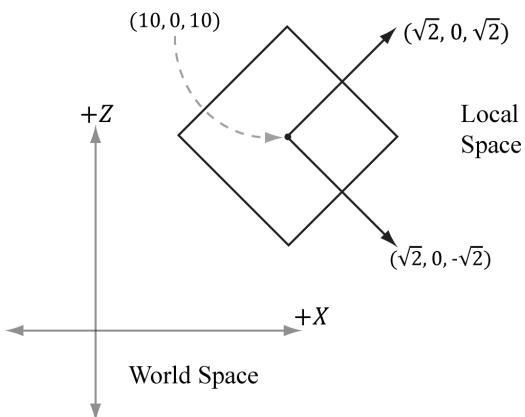


Figure 5.18. The row vectors of the world matrix describe the local coordinate system with coordinates relative to the world coordinate system.


The point of this example is that instead of figuring out ${ \bf Q } _ { W }$ , ${ \bf u } _ { W }$ , ${ \bf v } _ { W }$ , and ${ \bf w } _ { W }$ directly to form the world matrix, we were able to construct the world matrix by compositing a sequence of simple transforms. This is often much easier than figuring out $\mathbf { Q } _ { w }$ , ${ \bf u } _ { W }$ , ${ \bf v } _ { w }$ , and ${ \bf w } _ { W }$ directly, as we need only ask: what size do we want the object in world space, at what orientation do we want the object in world space, and at what position do we want the object in world space. 

Another way to consider the world transform is to just take the local space coordinates and treat them as world space coordinates (this is equivalent to using an identity matrix as the world transform). Thus if the object is modeled at the center of its local space, the object is just at the center of the world space. In general, the center of the world is probably not where we want to position all of our objects. So now, for each object, just apply a sequence of transformations to scale, rotation, and position the object where you want in the world space. Mathematically, this will give the same world transform as building the change of coordinate matrix from local space to world space. 

# 5.6.2 View Space

In order to form a 2D image of the scene, we must place a virtual camera in the scene. The camera specifies what volume of the world the viewer can see and thus what volume of the world we need to generate a 2D image of. Let us attach a local coordinate system (called view space, eye space, or camera space) to the camera as shown in Figure 5.19; that is, the camera sits at the origin looking down the positive $z$ -axis, the $x$ -axis aims to the right of the camera, and the y-axis aims above the camera. Instead of describing our scene vertices relative to the world space, it is convenient for later stages of the rendering pipeline to describe them relative to the camera coordinate system. The change of coordinate transformation from 

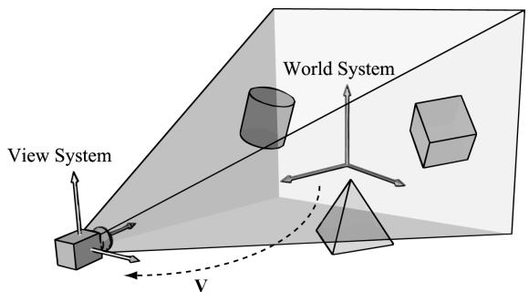


Figure 5.19. Convert the coordinates of vertices relative to the world space to make them relative to the camera space.


world space to view space is called the view transform, and the corresponding matrix is called the view matrix. 

If $\mathbf { Q } _ { W } = ( Q _ { x } , Q _ { y } , Q _ { z } , 1 ) .$ $\mathbf { Q } _ { W } = ( Q _ { x } , Q _ { y } , Q _ { z } , 1 ) , ~ \mathbf { u } _ { W } = ( u _ { x } , u _ { y } , u _ { z } , 0 ) , ~ \mathbf { v } _ { W } = ( \nu _ { x } , \nu _ { y } , \nu _ { z } , 0 ) ,$ $\mathbf { v } _ { W } = ( \nu _ { { x } } , \nu _ { { y } } , \nu _ { { z } } , 0 )$ and $\mathbf { w } _ { W } = ( w _ { x } , w _ { y } , w _ { z } , 0 )$ describe, respectively, the origin, $x \mathrm { - } , y \mathrm { - }$ , and $z$ -axes of view space with homogeneous coordinates relative to world space, then we know from $\ S 3 . 4 . 3$ that the change of coordinate matrix from view space to world space is: 

$$
\mathbf {W} = \left[ \begin{array}{c c c c} u _ {x} & u _ {y} & u _ {z} & 0 \\ v _ {x} & v _ {y} & v _ {z} & 0 \\ w _ {x} & w _ {y} & w _ {z} & 0 \\ Q _ {x} & Q _ {y} & Q _ {z} & 1 \end{array} \right]
$$

However, this is not the transformation we want. We want the reverse transformation from world space to view space. But recall from $\$ 3.4.5$ that reverse transformation is just given by the inverse. Thus $\mathbf { W } ^ { - 1 }$ transforms from world space to view space. 

The world coordinate system and view coordinate system generally differ by position and orientation only, so it makes intuitive sense that ${ \bf W } = { \bf R } { \bf T } $ (i.e., the world matrix can be decomposed into a rotation followed by a translation). This form makes the inverse easier to compute: 

$$
\begin{array}{l} \mathbf {V} = \mathbf {W} ^ {- 1} = (\mathbf {R T}) ^ {- 1} = \mathbf {T} ^ {- 1} \mathbf {R} ^ {- 1} = \mathbf {T} ^ {- 1} \mathbf {R} ^ {T} \\ = \left[ \begin{array}{c c c c} 1 & 0 & 0 & 0 \\ 0 & 1 & 0 & 0 \\ 0 & 0 & 1 & 0 \\ - Q _ {x} & - Q _ {y} & - Q _ {z} & 1 \end{array} \right] \left[ \begin{array}{c c c c} u _ {x} & v _ {x} & w _ {x} & 0 \\ u _ {y} & v _ {y} & w _ {y} & 0 \\ u _ {z} & v _ {z} & w _ {z} & 0 \\ 0 & 0 & 0 & 1 \end{array} \right] = \left[ \begin{array}{c c c c} u _ {x} & v _ {x} & w _ {x} & 0 \\ u _ {y} & v _ {y} & w _ {y} & 0 \\ u _ {z} & v _ {z} & w _ {z} & 0 \\ - \mathbf {Q} \cdot \mathbf {u} & - \mathbf {Q} \cdot \mathbf {v} & - \mathbf {Q} \cdot \mathbf {w} & 1 \end{array} \right] \\ \end{array}
$$

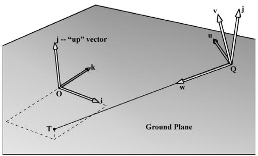


Figure 5.20. Constructing the camera coordinate system given the camera position, a target point, and a world 鈥渦p鈥?vector.


So the view matrix has the form: 

$$
\mathbf {V} = \left[ \begin{array}{c c c c} u _ {x} & v _ {x} & w _ {x} & 0 \\ u _ {y} & v _ {y} & w _ {y} & 0 \\ u _ {z} & v _ {z} & w _ {z} & 0 \\ - \mathbf {Q} \cdot \mathbf {u} & - \mathbf {Q} \cdot \mathbf {v} & - \mathbf {Q} \cdot \mathbf {w} & 1 \end{array} \right]
$$

We now show an intuitive way to construct the vectors needed to build the view matrix. Let Q be the position of the camera and let $\mathbf { T }$ be the target point the camera is aimed at. Furthermore, let j be the unit vector that describes the 鈥渦p鈥?direction of the world space. (In this book, we use the world $_ { x z }$ -plane as our world 鈥済round plane鈥?and the world y-axis describes the 鈥渦p鈥?direction; therefore, ${ \bf j } = ( 0 , 1 , 0 )$ is just a unit vector parallel to the world $\boldsymbol { y }$ -axis. However, this is just a convention, and some applications might choose the $x y$ -plane as the ground plane, and the $z$ -axis as the 鈥渦p鈥?direction.) Referring to Figure 5.20, the direction the camera is looking is given by: 

$$
\mathbf {w} = \frac {\mathbf {T} - \mathbf {Q}}{\left\| \mathbf {T} - \mathbf {Q} \right\|}
$$

This vector describes the local $z$ -axis of the camera. A unit vector that aims to the 鈥渞ight鈥?of w is given by: 

$$
\mathbf {u} = \frac {\mathbf {j} \times \mathbf {w}}{| | \mathbf {j} \times \mathbf {w} | |}
$$

This vector describes the local $x$ -axis of the camera. Finally, a vector that describes the local y-axis of the camera is given by: 

$$
\mathbf {v} = \mathbf {w} \times \mathbf {u}
$$

Since w and u are orthogonal unit vectors, $\mathbf { w } \times \mathbf { u }$ is necessarily a unit vector, and so it does not need to be normalized. 

Thus, given the position of the camera, the target point, and the world 鈥渦p鈥?direction, we were able to derive the local coordinate system of the camera, which can be used to form the view matrix. 

The DirectXMath library provides the following function for computing the view matrix based on the just described process: 

```cpp
XMMMATRIX XM_CALLCONV XMMatrixLookAtLH( // Outputs view matrix V  
FXMVECTOR EyePosition, // Input camera position Q  
FXMVECTOR FocusPosition, // Input target point T  
FXMVECTOR UpDirection); // Input world up direction j 
```

Usually the world鈥檚 $y$ -axis corresponds to the 鈥渦p鈥?direction, so the 鈥渦p鈥?vector is usually always ${ \bf j } = ( 0 , 1 , 0 )$ . As an example, suppose we want to position the camera at the point ( , 5 3, ) 鈭?0 relative to the world space, and have the camera look at the origin of the world (0 0 0 , , ). We can build the view matrix by writing: 

```cpp
XMVECTOR pos = XMVectorSet(5, 3, -10, 1.0f);  
XMVECTOR target = XMVectorZero();  
XMVECTOR up = XMVectorSet(0.0f, 1.0f, 0.0f, 0.0f);  
XMMATRIX V = XMMatrixLookAtLH(pos, target, up); 
```

# 5.6.3 Projection and Homogeneous Clip Space

So far we have described the position and orientation of the camera in the world, but there is another component to a camera, which is the volume of space the camera sees. This volume is described by a frustum (Figure 5.21). 

Our next task is to project the 3D geometry inside the frustum onto a 2D projection window. The projection must be done in such a way that parallel lines converge to a vanishing point, and as the 3D depth of an object increases, 

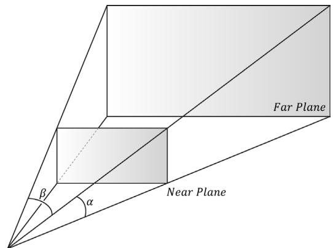


Eye /Center of Projection


Figure 5.21. A frustum defines the volume of space that the camera 鈥渟ees.鈥?


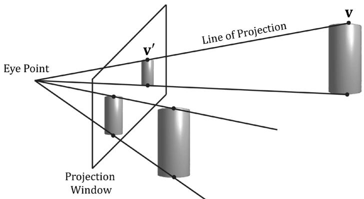


Figure 5.22. Both cylinders in 3D space are the same size but are placed at different depths. The projection of the cylinder closer to the eye is bigger than the projection of the farther cylinder. Geometry inside the frustum is projected onto a projection window; geometry outside the frustum, gets projected onto the projection plane, but will lie outside the projection window.


the size of its projection diminishes; a perspective projection does this, and is illustrated in Figure 5.22. We call the line from a vertex to the eye point the vertex鈥檚 line of projection. Then we define the perspective projection transformation as the transformation that transforms a 3D vertex v to the point $\mathbf { v ^ { \prime } }$ where its line of projection intersects the 2D projection plane; we say that $\mathbf { v } ^ { \prime }$ is the projection of v. The projection of a 3D object refers to the projection of all the vertices that make up the object. 

# 5.6.3.1 Defining a Frustum

We can define a frustum in view space, with center of projection at the origin and looking down the positive $z$ -axis, by the following four quantities: a near plane $n$ , far plane $f$ , vertical field of view angle $\alpha$ , and aspect ratio r. Note that in view space, the near plane and far plane are parallel to the $x y$ -plane; thus we simply specify their distance from the origin along the $z$ -axis. The aspect ratio is defined by $r = w / h$ where $w$ is the width of the projection window and $h$ is the height of the projection window (units in view space). The projection window is essentially the 2D image of the scene in view space. The image here will eventually be mapped to the back buffer; therefore, we like the ratio of the projection window dimensions to be the same as the ratio of the back buffer dimensions. So the ratio of the back buffer dimensions is usually specified as the aspect ratio (it is a ratio so it has no units). For example, if the back buffer dimensions are $8 0 0 \times 6 0 0$ , then we specify $\begin{array} { r } { r = { \frac { 8 0 0 } { 6 0 0 } } \approx 1 . 3 3 3 } \end{array}$ .  If the aspect ratio of the projection window and the back buffer were not the same, then a non-uniform scaling would be necessary to map the projection window to the back buffer, which would cause distortion (e.g., a circle on the projection window might get stretched into an ellipse when mapped to the back buffer). 

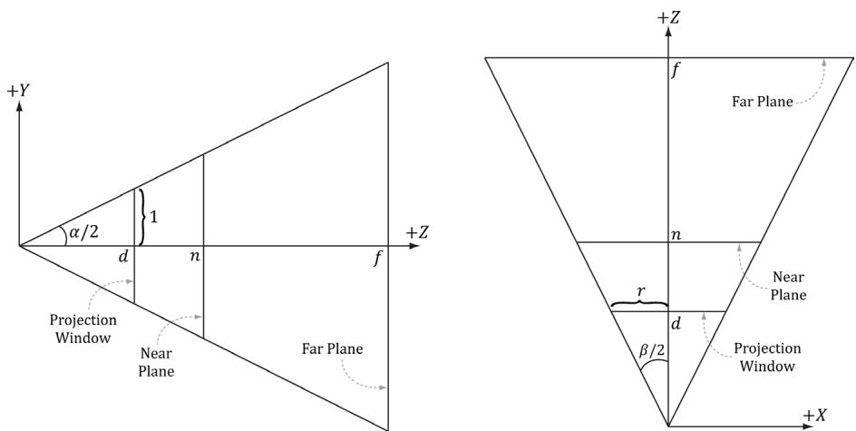


Figure 5.23. Deriving the horizontal field of view angle $\beta$ given the vertical field of view angle $\alpha$ and the aspect ratio r.


We label the horizontal field of view angle $\beta$ , and it is determined by the vertical field of view angle $\alpha$ and aspect ratio $r$ . To see how $r$ helps us find $\beta$ , consider Figure 5.23. Note that the actual dimensions of the projection window are not important, just the aspect ratio needs to be maintained. Therefore, we will choose the convenient height of 2, and thus the width must be: 

$$
r = \frac {w}{h} = \frac {w}{2} \Rightarrow w = 2 r
$$

In order to have the specified vertical field of view $\alpha$ , the projection window must be placed a distance $d$ from the origin: 

$$
\tan \left(\frac {\alpha}{2}\right) = \frac {1}{d} \Rightarrow d = \cot \left(\frac {\alpha}{2}\right)
$$

We have now fixed the distance $d$ of the projection window along the $z$ -axis to have a vertical field of view $\alpha$ when the height of the projection window is 2. Now we can solve for $\beta$ . Looking at the $x z$ -plane in Figure 5.23, we now see that: 

$$
\begin{array}{l} \tan \left(\frac {\beta}{2}\right) = \frac {r}{d} = \frac {r}{\cot \left(\frac {\alpha}{2}\right)} \\ = r \cdot \tan \left(\frac {\alpha}{2}\right) \\ \end{array}
$$

So given the vertical field of view angle $\alpha$ and the aspect ratio $r$ , we can always get the horizontal field of view angle $\beta$ : 

$$
\beta = 2 \tan^ {- 1} \left(r \cdot \tan \left(\frac {\alpha}{2}\right)\right)
$$

# 5.6.3.2 Projecting Vertices

Refer to Figure 5.24. Given a point $( x , y , z )$ , we wish to find its projection $( x ^ { \prime } , y ^ { \prime } , d )$ on the projection plane $z = d$ . By considering the x- and y-coordinates separately and using similar triangles, we find: 

$$
{\frac {x ^ {\prime}}{d}} = {\frac {x}{z}} \Rightarrow x ^ {\prime} = {\frac {x d}{z}} = {\frac {x \cot (\alpha / 2)}{z}} = {\frac {x}{z \tan (\alpha / 2)}}
$$

and 

$$
{\frac {y ^ {\prime}}{d}} = {\frac {y}{z}} \Rightarrow y ^ {\prime} = {\frac {y d}{z}} = {\frac {y \cot (\alpha / 2)}{z}} = {\frac {y}{z \tan (\alpha / 2)}}
$$

Observe that a point $( x , y , z )$ is inside the frustum if and only if 

$$
\begin{array}{l} - r \leq x ^ {\prime} \leq r \\ - 1 \leq y ^ {\prime} \leq 1 \\ n \leq z \leq f \\ \end{array}
$$

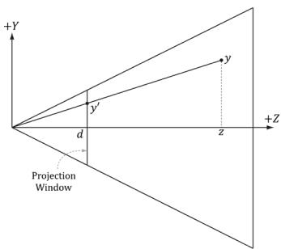


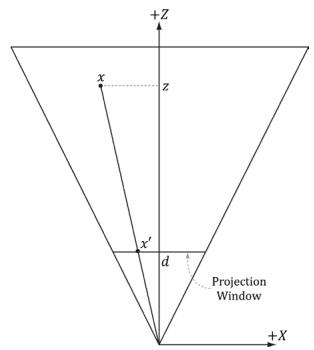


Figure 5.24. Similar triangles.


# 5.6.3.3 Normalized Device Coordinates (NDC)

The coordinates of the projected points in the preceding section are computed in view space. In view space, the projection window has a height of 2 and a width of $2 r$ , where $r$ is the aspect ratio. The problem with this is that the dimensions 

depend on the aspect ratio. This means we would need to tell the hardware the aspect ratio, since the hardware will later need to do some operations that involve the dimensions of the projection window (such as map it to the back buffer). It would be more convenient if we could remove this dependency on the aspect ratio. The solution is to scale the projected $x$ -coordinate from the interval $[ - r , r ]$ to [ , 鈭? 1] like so: 

$$
\begin{array}{l} - r \leq x ^ {\prime} \leq r \\ - 1 \leq x ^ {\prime} / r \leq 1 \\ \end{array}
$$

After this mapping, the x- and y-coordinates are said to be normalized device coordinates (NDC) (the $z$ -coordinate has not yet been normalized), and a point $( x , y , z )$ is inside the frustum if and only if 

$$
\begin{array}{l} - 1 \leq x ^ {\prime} / r \leq 1 \\ - 1 \leq y ^ {\prime} \leq 1 \\ n \leq z \leq f \\ \end{array}
$$

The transformation from view space to NDC space can be viewed as a unit conversion. We have the relationship that one NDC unit equals $r$ units in view space (i.e., $1 { \mathrm { n d c } } = r \cdot$ s) on the $x$ -axis. So given $x$ view space units, we can use this relationship to convert units: 

$$
x \mathrm {v s} \cdot \frac {1 \mathrm {n d c}}{r \mathrm {v s}} = \frac {x}{r} \mathrm {n d c}
$$

We can modify our projection formulas to give us the projected x- and $\boldsymbol { y }$ -coordinates directly in NDC coordinates: 

$$
\begin{array}{l} x ^ {\prime} = \frac {x}{r z \tan (\alpha / 2)} \tag {eq.5.1} \\ y ^ {\prime} = \frac {y}{z \tan (\alpha / 2)} \\ \end{array}
$$

Note that in NDC coordinates, the projection window has a height of 2 and a width of 2. So now the dimensions are fixed, and the hardware need not know the aspect ratio, but it is our responsibility to always supply the projected coordinates in NDC space (the graphics hardware assumes we will). 

# 5.6.3.4 Writing the Projection Equations with a Matrix

For uniformity, we would like to express the projection transformation by a matrix. However, Equation 5.1 is nonlinear, so it does not have a matrix representation. The 鈥渢rick鈥?is to separate it into two parts: a linear part and a nonlinear part. The 

nonlinear part is the divide by $z$ . As will be discussed in the next section, we are going to normalize the $z \mathrm { . }$ -coordinate; this means we will not have the original $z \mathrm { . }$ -coordinate around for the divide. Therefore, we must save the input $z$ -coordinate before it is transformed; to do this, we take advantage of homogeneous coordinates and copy the input $z$ -coordinate to the output w-coordinate. In terms of matrix multiplication, this is done by setting entry $\left[ 2 \right] \left[ 3 \right] = 1$ and entry $\big [ 3 \big ] \big [ 3 \big ] = 0$ (zerobased indices). Our projection matrix looks like this: 

$$
\mathbf {P} = \left[ \begin{array}{c c c c} \frac {1}{r \tan (\alpha / 2)} & 0 & 0 & 0 \\ 0 & \frac {1}{\tan (\alpha / 2)} & 0 & 0 \\ 0 & 0 & A & 1 \\ 0 & 0 & B & 0 \end{array} \right]
$$

Note that we have placed constants (to be determined in the next section) $A$ and B into the matrix; these constants will be used to transform the input $z$ -coordinate into the normalized range. Multiplying an arbitrary point $( x , y , z , 1 )$ by this matrix gives: 

$$
[ x, y, z, 1 ] \left[ \begin{array}{c c c c} \frac {1}{r \tan (\alpha / 2)} & 0 & 0 & 0 \\ 0 & \frac {1}{\tan (\alpha / 2)} & 0 & 0 \\ 0 & 0 & A & 1 \\ 0 & 0 & B & 0 \end{array} \right] = \left[ \begin{array}{c} \frac {x}{r \tan (\alpha / 2)}, \frac {y}{\tan (\alpha / 2)}, A z + B, z \\ \end{array} \right] \tag {eq.5.2}
$$

After multiplying by the projection matrix (the linear part), we complete the transformation by dividing each coordinate by $w = z$ (the nonlinear part): 

$$
\left[ \frac {x}{r \tan (\alpha / 2)}, \frac {y}{\tan (\alpha / 2)}, A z + B, z \right] \xrightarrow {\text {d i v i d e b y} w} \left[ \frac {x}{r z \tan (\alpha / 2)}, \frac {y}{z \tan (\alpha / 2)}, A + \frac {B}{z}, 1 \right] \tag {eq.5.3}
$$

Incidentally, you may wonder about a possible divide by zero; however, the near plane should be greater than zero, so such a point would be clipped (搂5.6). The divide by $w$ is sometimes called the perspective divide or homogeneous divide. We see that the projected $x$ - and y-coordinates agree with Equation 5.1. 

# 5.6.3.5 Normalized Depth Value

It may seem like after projection, we can discard the original 3D $z \mathrm { . }$ -coordinate, as all the projected points now lay on the 2D projection window, which forms the 2D image seen by the eye. However, we still need 3D depth information around for the depth buffering algorithm. Just like Direct3D wants the projected x- and $\boldsymbol { y }$ -coordinates in a normalized range, Direct3D wants the depth coordinates in the normalized range [ , 0 1]. Therefore, we must construct an order preserving function $g ( z )$ that maps the interval $[ n , f ]$ onto [ , 0 1]. Because the function is order preserving, if $z _ { 1 } , z _ { 2 } \in [ n , f ]$ and $z _ { 1 } < z _ { 2 }$ , then $g ( z _ { 1 } ) < g ( z _ { 2 } )$ ; so even though the depth values have been transformed, the relative depth relationships remain intact, so we can still correctly compare depths in the normalized interval, which is all we need for the depth buffering algorithm. 

Mapping $[ n , f ]$ onto [ , 0 1] can be done with a scaling and translation. However, this approach will not integrate into our current projection strategy. We see from Equation 5.3, that the $z$ -coordinate undergoes the transformation: 

$$
g (z) = A + \frac {B}{z}
$$

We now need to choose $A$ and $B$ subject to the constraints: 

Condition 1: $g ( n ) = A + B / n = 0$ (the near plane gets mapped to zero) 

Condition 2: $g ( f ) = A + B / f = 1$ (the far plane gets mapped to one) 

Solving condition 1 for $B$ yields: $B = - A n$ . Substituting this into condition 2 and solving for $A$ gives: 

$$
\begin{array}{l} A + \frac {- A n}{f} = 1 \\ \frac {A f - A n}{f} = 1 \\ A f - A n = f \\ A = \frac {f}{f - n} \\ \end{array}
$$

Therefore, 

$$
g (z) = \frac {f}{f - n} - \frac {n f}{(f - n) z}
$$

A graph of $g$ (Figure 5.25) shows it is strictly increasing (order preserving) and nonlinear. It also shows that most of the range is 鈥渦sed up鈥?by depth values close to the near plane. Consequently, the majority of the depth values get mapped to 

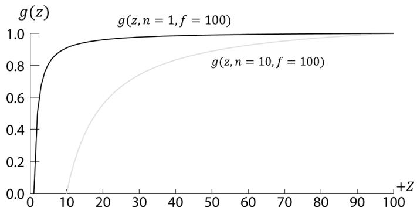


Figure 5.25. Graph of $g ( z )$ for different near planes.


a small subset of the range. This can lead to depth buffer precision problems (the computer can no longer distinguish between slightly different transformed depth values due to finite numerical representation). The general advice is to make the near and far planes as close as possible to minimize depth precision problems. 

Now that we have solved for A and B, we can state the full perspective projection matrix: 

$$
\mathbf {P} = \left[ \begin{array}{c c c c} \frac {1}{r \tan (\alpha / 2)} & 0 & 0 & 0 \\ 0 & \frac {1}{\tan (\alpha / 2)} & 0 & 0 \\ 0 & 0 & \frac {f}{f - n} & 1 \\ 0 & 0 & \frac {- n f}{f - n} & 0 \end{array} \right]
$$

After multiplying by the projection matrix, but before the perspective divide, geometry is said to be in homogeneous clip space or projection space. After the perspective divide, the geometry is said to be in normalized device coordinates (NDC). 

# 5.6.3.6 XMMatrixPerspectiveFovLH

A perspective projection matrix can be built with the following DirectX Math function: 

```cpp
XMMatrix XM_CALLCONV XMMatrixPerspectiveFovLH(/ / Returns the projection matrix float FovAngleY, // vertical field of view angle in radians float Aspect, // aspect ratio = width / height float NearZ, // distance to near plane float FarZ); // distance to far plane 
```

The following code snippet illustrates how to use XMMatrixPerspectiveFovLH. Here, we specify a $4 5 ^ { \circ }$ vertical field of view, a near plane at $z = 1$ and a far plane at $z = 1 0 0 0$ (these lengths are in view space). 

```cpp
XMMatrix P = XMMatrixPerspectiveFovLH(0.25f*XM.PI, AspectRatio(), 1.0f, 1000.0f); 
```

The aspect ratio is taken to match our window aspect ratio: 

float D3DApp::AspectRatio(const{ return static cast(float $\gimel$ mClientWidth) / mClientHeight;   
1 

# 5.7 THE TESSELLATION STAGES

Tessellation refers to subdividing the triangles of a mesh to add new triangles. These new triangles can then be offset into new positions to create finer mesh detail (see Figure 5.26). 

There are a number of benefits to tessellations: 

1. We can implement a level-of-detail (LOD) mechanism, where triangles near the camera are tessellated to add more detail, and triangles far away from the camera are not tessellated. In this way, we only use more triangles where the extra detail will be noticed. 

2. We keep a simpler low-poly mesh (low-poly means low triangle count) in memory, and add the extra triangles on the fly, thus saving memory. 

3. We do operations like animation and physics on a simpler low-poly mesh, and only use the tessellated high-poly mesh for rendering. 

The tessellation stages are new to Direct3D 11, and they provide a way to tessellate geometry on the GPU. Before Direct3D 11, if you wanted to implement a form of tessellation, it would have to be done on the CPU, and then the new tessellated 

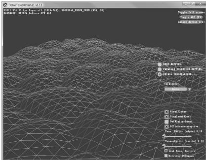


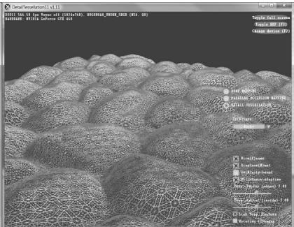


Figure 5.26. The left image shows the original mesh. The right image shows the mesh after tessellation.


geometry would have to be uploaded back to the GPU for rendering. However, uploading new geometry from CPU memory to GPU memory is slow, and it also burdens the CPU with computing the tessellation. For this reason, tessellation methods have not been very popular for real-time graphics prior to Direct3D 11. Direct3D 11 provides an API to do tessellation completely in hardware with a Direct3D 11 capable video card. This makes tessellation a much more attractive technique. The tessellation stages are optional (you only need to use it if you want tessellation). We defer our coverage of tessellation until Chapter 13. 

# 5.8 THE GEOMETRY SHADER STAGE

The geometry shader stage is optional, and we do not use it until Chapter 11, so we will be brief here. The geometry shader inputs entire primitives. For example, if we were drawing triangle lists, then the input to the geometry shader would be the three vertices defining the triangle. (Note that the three vertices will have already passed through the vertex shader.) The main advantage of the geometry shader is that it can create or destroy geometry. For example, the input primitive can be expanded into one or more other primitives, or the geometry shader can choose not to output a primitive based on some condition. This is in contrast to a vertex shader, which cannot create vertices: it inputs one vertex and outputs one vertex. A common example of the geometry shader is to expand a point into a quad or to expand a line into a quad. 

We also notice the 鈥渟tream-out鈥?arrow from Figure 5.11. That is, the geometry shader can stream-out vertex data into a buffer in memory, which can later be drawn. This is an advanced technique, and will be discussed in a later chapter. 


Vertex positions leaving the geometry shader must be transformed to homogeneous clip space. 

# 5.9 CLIPPING

Geometry completely outside the viewing frustum needs to be discarded, and geometry that intersects the boundary of the frustum must be clipped, so that only the interior part remains; see Figure 5.27 for the idea illustrated in 2D. 

We can think of the frustum as being the region bounded by six planes: the top, bottom, left, right, near, and far planes. To clip a polygon against the frustum, we clip it against each frustum plane one-by-one. When clipping a polygon against a plane (Figure 5.28), the part in the positive half-space of the plane is kept, and the 

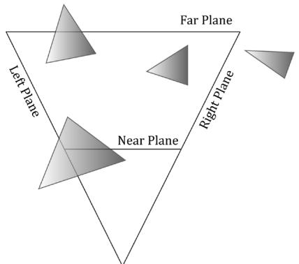


(a)


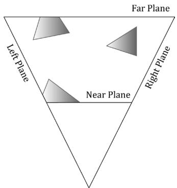


(b)


Figure 5.27. (a) Before clipping. (b) After clipping.


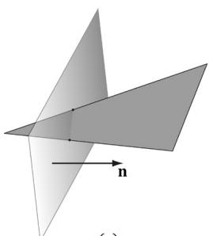


(a)


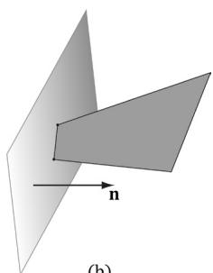


(b)


Figure 5.28. (a) Clipping a triangle against a plane. (b) The clipped triangle. Note that the clipped triangle is not a triangle, but a quad. Thus the hardware will need to triangulate the resulting quad, which is straightforward to do for convex polygons.


part in the negative half space is discarded. Clipping a convex polygon against a plane will always result in a convex polygon. Because the hardware does clipping for us, we will not cover the details here; instead, we refer the reader to the popular Sutherland-Hodgeman clipping algorithm [Sutherland74]. It basically amounts to finding the intersection points between the plane and polygon edges, and then ordering the vertices to form the new clipped polygon. 

[Blinn78] describes how clipping can be done in 4D homogeneous space. After the perspective divide, points $\begin{array} { r } { \left( \frac { x } { w } , \frac { y } { w } , \frac { z } { w } , 1 \right) } \end{array}$ , inside the view frustum are in normalized device coordinates and bounded as follows: 

$$
\begin{array}{l} - 1 \leq x / w \leq 1 \\ - 1 \leq y / w \leq 1 \\ 0 \leq z / w \leq 1 \\ \end{array}
$$

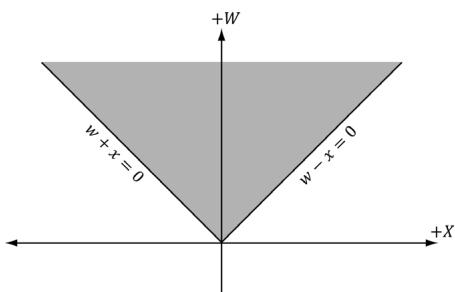


Figure 5.29. The frustum boundaries in the xw-plane in homogeneous clip space.


So in homogeneous clip space, before the divide, 4D points $( x , y , z , w )$ inside the frustum are bounded as follows: 

$$
\begin{array}{l} - w \leq x \leq w \\ - w \leq y \leq w \\ 0 \leq z \leq w \\ \end{array}
$$

That is, the points are bounded by the simple 4D planes: 

Left: $w = - x$ 

Right: $w = x$ 

Bottom: $w = - \gamma$ 

Top: $w = y$ 

Near: $z = 0$ 

Far: $z = w$ 

Once we know the frustum plane equations in homogeneous space, we can apply a clipping algorithm (such as Sutherland-Hodgeman). Note that the mathematics of the segment/plane intersection test generalizes to $\mathbb { R } ^ { 4 }$ , so we can do the test with 4D points and the 4D planes in homogeneous clip space. 

# 5.10 THE RASTERIZATION STAGE

The main job of the rasterization stage is to compute pixel colors from the projected 3D triangles. 

# 5.10.1 Viewport Transform

After clipping, the hardware can do the perspective divide to transform from homogeneous clip space to normalized device coordinates (NDC). Once vertices are in NDC space, the 2D $x \cdot$ - and $y$ -coordinates forming the 2D image are transformed to a rectangle on the back buffer called the viewport (recall $\ S 4 . 3 . 1 0 $ ). After this transform, the x- and $y$ -coordinates are in units of pixels. Usually the 

viewport transformation does not modify the $z$ -coordinate, as it is used for depth buffering, but it can by modifying the MinDepth and MaxDepth values of the D3D11_ VIEWPORT structure. The MinDepth and MaxDepth values must be between 0 and 1. 

# 5.10.2 Backface Culling

A triangle has two sides. To distinguish between the two sides we use the following convention. If the triangle vertices are ordered $\mathbf { v } _ { 0 } , \mathbf { v } _ { 1 } , \mathbf { v } _ { 2 }$ then we compute the triangle normal n like so: 

$$
\begin{array}{l} \mathbf {e} _ {0} = \mathbf {v} _ {1} - \mathbf {v} _ {0} \\ \mathbf {e} _ {1} = \mathbf {v} _ {2} - \mathbf {v} _ {0} \\ \mathbf {n} = \frac {\mathbf {e} _ {0} \times \mathbf {e} _ {1}}{| | \mathbf {e} _ {0} \times \mathbf {e} _ {1} | |} \\ \end{array}
$$

The side the normal vector emanates from is the front side and the other side is the back side. Figure 5.30 illustrates this. 

We say that a triangle is front-facing if the viewer sees the front side of a triangle, and we say a triangle is back-facing if the viewer sees the back side of a triangle. From our perspective of Figure 5.30, the left triangle is front-facing while the right triangle is back-facing. Moreover, from our perspective, the left triangle is ordered clockwise while the right triangle is ordered counterclockwise. This is no coincidence: with the convention we have chosen (i.e., the way we compute the triangle normal), a triangle ordered clockwise (with respect to that viewer) is front-facing, and a triangle ordered counterclockwise (with respect to that viewer) is back-facing. 

Now, most objects in 3D worlds are enclosed solid objects. Suppose we agree to construct the triangles for each object in such a way that the normals are always aimed outward. Then, the camera does not see the back-facing triangles of a solid object because the front-facing triangles occlude the back-facing triangles; Figure 5.31 illustrates this in 2D and 5.32 in 3D. Because the front-facing triangles occlude the back-facing triangles, it makes no sense to draw them. Backface culling 

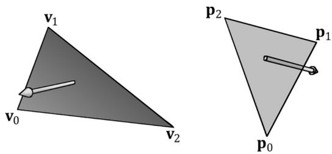


Figure 5.30. The left triangle is front-facing from our viewpoint, and the right triangle is back-facing from our viewpoint.


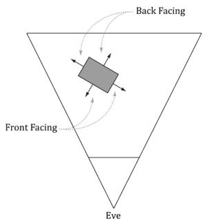


(a)


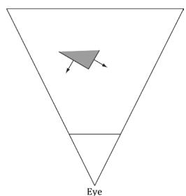


(b)


Figure 5.31. (a) A solid object with front-facing and back-facing triangles. (b) The scene after culling the back-facing triangles. Note that backface culling does not affect the final image since the back-facing triangles are occluded by the front-facing ones.


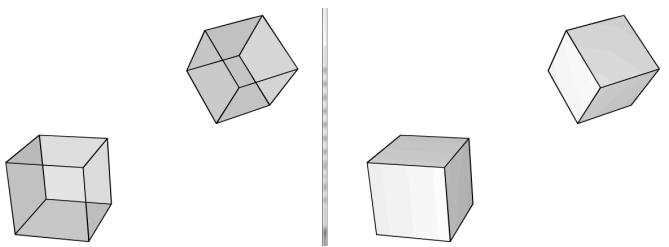


Figure 5.32. (Left) We draw the cubes with transparency so that you can see all six sides. (Right) We draw the cubes as solid blocks. Note that we do not see the three back-facing sides since the three front-facing sides occlude them鈥攖hus the back-facing triangles can actually be discarded from further processing and no one will notice.


refers to the process of discarding back-facing triangles from the pipeline. This can potentially reduce the amount of triangles that need to be processed by half. 

By default, Direct3D treats triangles with a clockwise winding order (with respect to the viewer) as front-facing, and triangles with a counterclockwise winding order (with respect to the viewer) as back-facing. However, this convention can be reversed with a Direct3D render state setting. 

# 5.10.3 Vertex Attribute Interpolation

Recall that we define a triangle by specifying its vertices. In addition to position, we can attach attributes to vertices such as colors, normal vectors, and texture coordinates. After the viewport transform, these attributes need to be interpolated for each pixel covering the triangle. In addition to vertex attributes, vertex depth values need to get interpolated so that each pixel has a depth value for the depth buffering algorithm. The vertex attributes are interpolated in screen space in such a way that the attributes are interpolated linearly across the triangle in 3D space (Figure 5.33); this requires the so-called perspective correct interpolation. Essentially, interpolation allows us to use the vertex values to compute values for the interior pixels. 

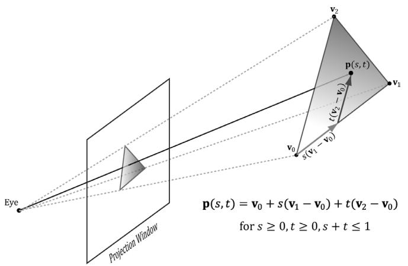


Figure 5.33. An attribute value $\mathsf { p } ( s , t )$ on a triangle can be obtained by linearly interpolating between the attribute values at the vertices of the triangle.


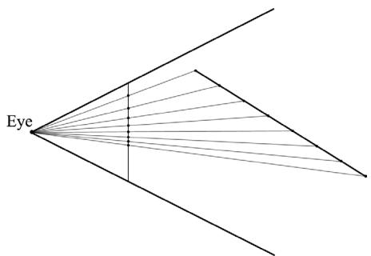


Figure 5.34. A 3D line is being projected onto the projection window (the projection is a 2D line in screen space). We see that taking uniform step sizes along the 3D line corresponds to taking non-uniform step sizes in 2D screen space. Therefore to do linear interpolation in 3D space, we need to do nonlinear interpolation in screen space.


The mathematical details of perspective correct attribute interpolation are not something we need to worry about since the hardware does it; the interested reader may find the mathematical derivation in [Eberly01]. However, Figure 5.34 gives the basic idea of what is going on. 

# 5.11 THE PIXEL SHADER STAGE

Pixel shaders are programs we write that are executed on the GPU. A pixel shader is executed for each pixel fragment and uses the interpolated vertex attributes as input to compute a color. A pixel shader can be as simple as returning a constant color, to doing more complicated things like per-pixel lighting, reflections and shadowing effects. 

# 5.12 THE OUTPUT MERGER STAGE

After pixel fragments have been generated by the pixel shader, they move onto the output merger (OM) stage of the rendering pipeline. In this stage, some pixel fragments may be rejected (e.g., from the depth or stencil buffer tests). Pixel fragments that are not rejected are written to the back buffer. Blending is also done in this stage, where a pixel may be blended with the pixel currently on the back buffer instead of overriding it completely. Some special effects like transparency are implemented with blending; Chapter 9 is devoted to blending. 

# 5.13 SUMMARY

1. We can simulate 3D scenes on 2D images by employing several techniques based on the way we see things in real life. We observe parallel lines converge to vanishing points, the size of objects diminishes with depth, objects obscure the objects behind them, lighting and shading depict the solid form and volume of 3D objects, and shadows imply the location of light sources and indicate the position of objects relative to other objects in the scene. 

2. We approximate objects with triangle meshes. We can define each triangle by specifying its three vertices. In many meshes, vertices are shared among triangles; indexed lists can be used to avoid vertex duplication. 

3. Colors are described by specifying an intensity of red, green, and blue. The additive mixing of these three colors at different intensities allows us to describe millions of colors. To describe the intensities of red, green, and blue, it is useful to use a normalized range from 0 to 1. 0 denotes no intensity, 1 denotes the full intensity, and intermediate values denote intermediate intensities. It is common to incorporate an additional color component, called the alpha component. The alpha component is often used to denote the opacity of a color, which is useful in blending. Including the alpha component, means we can represent a color by a 4D color vector $( r , g , b , a )$ where $0 \leq r , g , b , a \leq 1$ . Because the data needed to represent a color is a 4D vector, we can use the XMVECTOR type to represent a color in code, and we gain the benefit of SIMD operations whenever use the DirectX Math vector functions to do color operations. To represent a color with 32-bits, a byte is given to each component; the DirectX Math library provides the following structure for storing a 32-bit color. Color vectors are added, subtracted, and scaled just like regular vectors, except that we must clamp their components to the [ , 0 1] interval (or [0, 255] for 32-bit colors). The other vector operations 

such as the dot product and cross product do not make sense for color vectors. The symbol $\otimes$ denotes component-wise multiplication and it is defined as: $( c _ { 1 } , c _ { 2 } , c _ { 3 } , c _ { 4 } ) \otimes ( k _ { 1 } , k _ { 2 } , k _ { 3 } , k _ { 4 } ) = ( c _ { 1 } k _ { 1 } , c _ { 2 } k _ { 2 } , c _ { 3 } k _ { 3 } , c _ { 4 } k _ { 4 } ) ;$ 

4. Given a geometric description of a 3D scene and a positioned and aimed virtual camera in that scene, the rendering pipeline refers to the entire sequence of steps necessary to generate a 2D image that can be displayed on a monitor screen based on what the virtual camera sees. 

5. The rendering pipeline can be broken down into the following major stages. The input assembly (IA) stage; the vertex shader (VS) stage; the tessellation stages; the geometry shader (GS) stage; the clipping stage; the rasterization stage (RS); the pixel shader (PS) stage; and the output merger (OM) stage. 

# 5.14 EXERCISES

1. Construct the vertex and index list of a pyramid, as shown in Figure 5.35. 

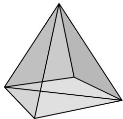


Figure 5.35. The triangles of a pyramid.


2. Consider the two shapes shown in Figure 5.36. Merge the objects into one vertex and index list. (The idea here is that when you append the second index list to the first, you will need to update the appended indices since they reference vertices in the original vertex list, not the merged vertex list.) 

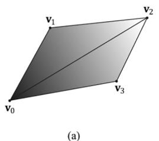


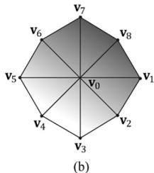


Figure 5.36. Shapes for Exercise 2.


3. Relative to the world coordinate system, suppose that the camera is positioned at $( - 2 0 , 3 5 , - 5 0 )$ and looking at the point ( , 10 0 3, ) 0 . Compute the view matrix assuming $( 0 , 1 , 0 )$ describes the 鈥渦p鈥?direction in the world. 

4. Given that the view frustum has a vertical field of view angle $\theta = 4 5 ^ { \circ }$ , the aspect ratio is $a = 4 / 3$ , the near plane is $n = 1 ;$ and the far plane is $f = 1 0 0$ , find the corresponding perspective projection matrix. 

5. Suppose that the view window has height 4. Find the distance $d$ from the origin the view window must be to create a vertical field of view angle $\theta = 6 0 ^ { \circ }$ . 

6. Consider the following perspective projection matrix: 

$$
\left[ \begin{array}{c c c c} 1. 8 6 6 0 3 & 0 & 0 & 0 \\ 0 & 3. 7 3 2 0 5 & 0 & 0 \\ 0 & 0 & 1. 0 2 5 6 4 & 1 \\ 0 & 0 & - 5. 1 2 8 2 1 & 0 \end{array} \right]
$$

Find the vertical field of view angle $\alpha$ the aspect ratio $r$ , and the near and far plane values that were used to build this matrix. 

7. Suppose that you are given the following perspective projection matrix with fixed $A , B , C , D$ : 

$$
\left[ \begin{array}{c c c c} A & 0 & 0 & 0 \\ 0 & B & 0 & 0 \\ 0 & 0 & C & 1 \\ 0 & 0 & D & 0 \end{array} \right]
$$

Find the vertical field of view angle $\alpha$ the aspect ratio $r$ , and the near and far plane values that were used to build this matrix in terms of $A , B , C , D$ . That is, solve the following equations: 

$$
\begin{array}{l} A = \frac {1}{r \tan (\alpha / 2)} \\ B = \frac {1}{\tan (\alpha / 2)} \\ C = \frac {f}{f - n} \\ D = \frac {- n f}{f - n} \\ \end{array}
$$

Solving these equations will give you formulas for extracting the vertical field of view angle $\alpha$ the aspect ratio $r$ , and the near and far plane values from any perspective projection matrix of the kind described in this book. 

8. For projective texturing algorithms, we multiply an affine transformation matrix T after the projection matrix. Prove that it does not matter if we do the perspective divide before or after multiplying by T. Let, v be a 4D vector, P be a projection matrix, T be a $4 \times 4$ affine transformation matrix, and let a w subscript denote the w-coordinate of a 4D vector, prove: 

$$
\left(\frac {\mathbf {v} \mathbf {P}}{(\mathbf {v P}) _ {w}}\right) \mathbf {T} = \frac {(\mathbf {v P T})}{(\mathbf {v P T}) _ {w}}
$$

9. Prove that the inverse of the projection matrix is given by: 

$$
\mathbf {P} ^ {- 1} = \left[ \begin{array}{c c c c} r \tan \left(\frac {\alpha}{2}\right) & 0 & 0 & 0 \\ 0 & \tan \left(\frac {\alpha}{2}\right) & 0 & 0 \\ 0 & 0 & 0 & - \frac {f - n}{n f} \\ 0 & 0 & 1 & \frac {1}{n} \end{array} \right]
$$

10. Let $[ x , y , z , 1 ]$ be the coordinates of a point in view space, and let $[ x _ { n d c } , y _ { n d c } , z _ { n d c } , 1 ]$ be the coordinates of the same point in NDC space. Prove that you can transform from NDC space to view space in the following way: 

$$
\left[ x _ {n d c}, y _ {n d c}, z _ {n d c}, 1 \right] \mathbf {P} ^ {- 1} = \left[ \frac {x}{z}, \frac {y}{z}, 1, \frac {1}{z} \right] \frac {\text {d i v i d e b y w}}{2} [ x, y, z, 1 ]
$$

Explain why you need the division by w. Would you need the division by $w$ if you were transforming from homogeneous clip space to view space? 

11. Another way to describe the view frustum is by specifying the width and height of the view volume at the near plane. Given the width $w$ and height $h$ of the view volume at the near plane, and given the near plane $n$ and far plane $f$ show that the perspective projection matrix is given by: 

$$
\mathbf {P} = \left[ \begin{array}{l l l l} \frac {2 n}{w} & 0 & 0 & 0 \\ 0 & \frac {2 n}{h} & 0 & 0 \\ 0 & 0 & \frac {f}{f - n} & 1 \\ 0 & 0 & \frac {- n f}{f - n} & 0 \end{array} \right]
$$

12. Given a view frustum with vertical field of view angle $\theta$ , aspect ratio is $^ a$ , near plane $n _ { \mathrm { { ; } } }$ , and far plane $f$ , find the 8 vertex corners of the frustum. 

13. Consider the 3D shear transform given by $S _ { x y } ( x , y , z ) = ( x + z t _ { x } , y + z t _ { y } , z )$ . This transformation is illustrated in Figure 5.37. Prove that this is a linear transformation and has the following matrix representation: 

$$
\mathbf {S} _ {x y} = \left[ \begin{array}{c c c} 1 & 0 & 0 \\ 0 & 1 & 0 \\ t _ {x} & t _ {y} & 1 \end{array} \right]
$$


Figure 5.37. The x- and y-coordinates sheared by the $Z$ -coordinate. The top face of the box lies in the $z = 1$ plane. Observe that the shear transform translates points in this plane.


14. Consider 3D points in the plane $z = 1$ ; that is, points of the form $( x , y , 1 )$ . Observe that transforming a point $( x , y , 1 )$ by the shear transformation $\mathbf { S } _ { x y }$ given in the previous exercise amounts to a 2D translation in the $z = 1$ plane: 

$$
[ x, \quad y, \quad 1 ] \left[ \begin{array}{l l l} 1 & 0 & 0 \\ 0 & 1 & 0 \\ t _ {x} & t _ {y} & 1 \end{array} \right] = [ x + t _ {x}, \quad y + t _ {y}, \quad 1 ]
$$

If we are working on a 2D application, we could use 3D coordinates, but where our 2D universe always lies on the plane $z = 1$ ; then we could use $\mathbf { S } _ { x y }$ to do translations in our 2D space. 

Conclude the following generalizations: 

a. Just as a plane in 3D space is a 2D space, a plane in 4D space is a 3D space. When we write homogeneous points $( x , y , z , 1 )$ we are working in the 3D space that lives in the 4D plane $w = 1$ . 

b. The translation matrix is the matrix representation of the 4D shear transformation $S _ { x y z } ( x , y , z , w ) = ( x + w t _ { x } , y + w t _ { y } , z + w t _ { z } , w )$ . The 4D shear transformation has the effect of translating points in the plane $w = 1$ . 
