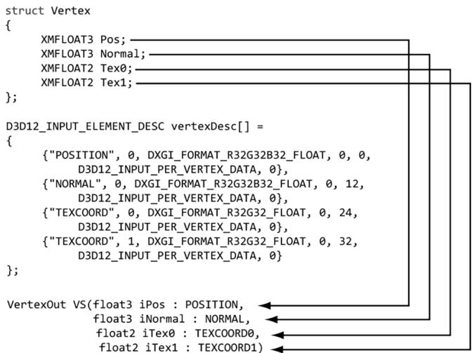
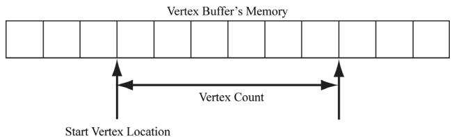
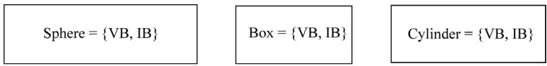
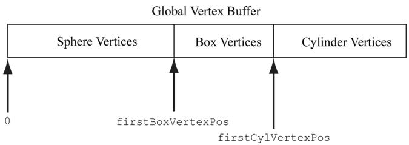
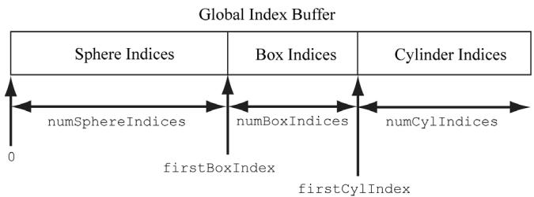
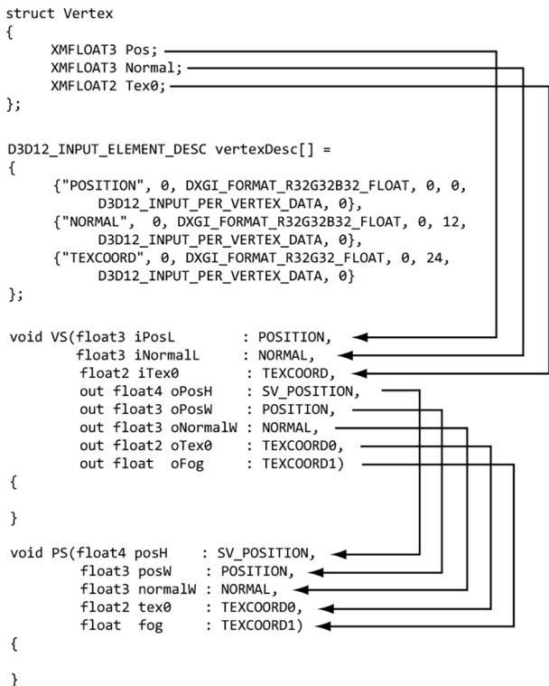
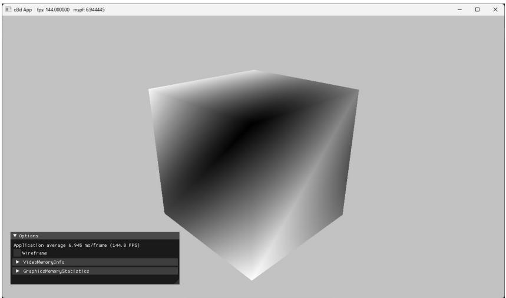
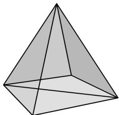
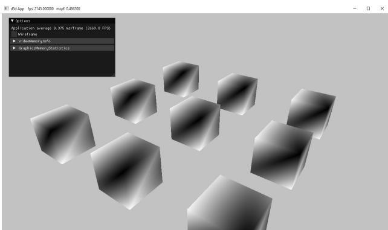

Chapter 

# 6

# Drawing i n Direct3D

In the previous chapter, we mostly focused on the conceptual and mathematical aspects of the rendering pipeline. This chapter, in turn, focuses on the Direct3D API interfaces and methods needed to configure the rendering pipeline, define vertex and pixel shaders, and submit geometry to the rendering pipeline for drawing. By the end of this chapter, you will be able to draw a 3D box with solid coloring or in wireframe mode. 

# Chapter Objectives:

1. To discover the Direct3D interfaces methods for defining, storing, and drawing geometric data. 

2. To learn how to write basic vertex and pixel shaders. 

3. To find out how to configure the rendering pipeline with pipeline state objects. 

4. To understand how to create and bind constant buffer data to the pipeline, and to become familiar with the root signature. 

# 6.1 VERTICES AND INPUT LAYOUTS

Recall from $\ S 5 . 5 . 1$ that a vertex in Direct3D can consist of additional data besides spatial location. To create a custom vertex format, we first create a structure 

that holds the vertex data we choose. For instance, the following illustrates two different kinds of vertex formats; one consists of position and color, and the second consists of position, normal vector, and two sets of 2D texture coordinates. 

```c
struct Vertex1
{
    XMFLOAT3 Pos;
    XMFLOAT4 Color;
};
struct Vertex2
{
    XMFLOAT3 Pos;
    XMFLOAT3 Normal;
    XMFLOAT2 Tex0;
    XMFLOAT2 Tex1;
}; 
```

Once we have defined a vertex structure, we need to provide Direct3D with a description of our vertex structure so that it knows what to do with each component. This description is provided to Direct3D in the form of an input layout description which is represented by the D3D12_INPUT_LAYOUT_DESC structure: 

```c
typedef struct D3D12_INPUT_LAYOUT_DESC   
{ const D3D12_INPUT_element_DESC \*pInputElementDescs; UINT NumElements;   
} D3D12_INPUT_LAYOUT_DESC; 
```

An input layout description is simply an array of D3D12_INPUT_ELEMENT_DESC elements, and the number of elements in the array. 

Each element in the D3D12_INPUT_ELEMENT_DESC array describes and corresponds to one component in the vertex structure. So if the vertex structure has two components, then the corresponding D3D12_INPUT_ELEMENT_DESC array will have two elements. The D3D12_INPUT_ELEMENT_DESC structure is defined as: 

```cpp
typedef struct D3D12_INPUT_element_DESC   
{ LPCSTR SemanticName; UINT SemanticIndex; DXGI_FORMAT Format; UINT InputSlot; UINT AlignedByteOffset; D3D12_INPUT_CLASSIFICATION InputSlotClass; UINT InstanceDataStepRate; } D3D12_INPUT_element_DESC; 
```

1. SemanticName: A string to associate with the element. This can be any valid variable name. Semantics are used to map elements in the vertex structure to elements in the vertex shader input signature; see Figure 6.1. 




Figure 6.1. Each element in the vertex structure is described by a corresponding element in the D3D12 INPUT_ELEMENT_DESC array. The semantic name and index provides way for mapping vertex elements to the corresponding parameters of the vertex shader.


2. SemanticIndex: An index to attach to a semantic. The motivation for this is illustrated in Figure 6.1, where, for example, a vertex structure may have more than one set of texture coordinates; so rather than introducing a new semantic name, we can just attach an index to the end to distinguish the two texture coordinate sets. A semantic with no index specified in the shader code defaults to index zero; for instance, POSITION is equivalent to POSITION0 in Figure 6.1. 

3. Format: A member of the DXGI_FORMAT enumerated type specifying the format (i.e., the data type) of this vertex element to Direct3D; here are some common examples of formats used: 

```c
DXGI_FORMAT_R32_FLOAT // 1D 32-bit float scalar  
DXGI_FORMAT_R32G32_FLOAT // 2D 32-bit float vector  
DXGI_FORMAT_R32G32B32_FLOAT // 3D 32-bit float vector  
DXGI_FORMAT_R32G32B32A32_FLOAT // 4D 32-bit float vector  
DXGI_FORMAT_R8_UID // 1D 8-bit unsigned integer scalar  
DXGI_FORMAT_R16G16_SINT // 2D 16-bit signed integer vector  
DXGI_FORMAT_R32G32B32_UID // 3D 32-bit unsigned integer vector  
DXGI_FORMAT_R8G8B8A8_SINT // 4D 8-bit signed integer vector  
DXGI_FORMAT_R8G8B8A8_UID // 4D 8-bit unsigned integer vector 
```

4. InputSlot: Specifies the input slot index this element will come from. Direct3D supports sixteen input slots (indexed from 0-15) through which you can feed vertex data. For now, we will only be using input slot 0 (i.e., all vertex elements come from the same input slot); Exercise 2 asks you to experiment with multiple input slots. 

5. AlignedByteOffset: The offset, in bytes, from the start of the $\mathrm { C } { + + }$ vertex structure of the specified input slot to the start of the vertex component. For example, in the following vertex structure, the element Pos has a 0-byte offset since its start coincides with the start of the vertex structure; the element Normal has a 12-byte offset because we have to skip over the bytes of Pos to get to the start of Normal; the element Tex0 has a 24-byte offset because we need to skip over the bytes of Pos and Normal to get to the start of Tex0; the element Tex1 has a 32-byte offset because we need to skip over the bytes of Pos, Normal, and Tex0 to get to the start of Tex1. 

```cpp
struct Vertex2
{
    XMFLOAT3 Pos; // 0-byte offset
    XMFLOAT3 Normal; // 12-byte offset
    XMFLOAT2 Tex0; // 24-byte offset
    XMFLOAT2 Tex1; // 32-byte offset
}; 
```

6. InputSlotClass: Specify D3D12_INPUT_PER_VERTEX_DATA for now; the other option is used for the advanced technique of instancing. 

7. InstanceDataStepRate: Specify 0 for now; other values are only used for the advanced technique of instancing. 

For the previous two example vertex structures, Vertex1 and Vertex2, the corresponding input layout descriptions would be: 

```c
D3D12_INPUT_element_DESC desc1[] = { {"POSITION", 0, DXGI_FORMAT_R32G32B32_FLOAT, 0, 0, D3D12_INPUT_PERAnthex_DATA, 0}, {"COLOR", 0, DXGI_FORMAT_R32G32B32A32_FLOAT, 0, 12, D3D12_INPUT_PERAnthex_DATA, 0} };   
D3D12_INPUT_element_DESC desc2[] = { {"POSITION", 0, DXGI_FORMAT_R32G32B32_FLOAT, 0, 0, D3D12_INPUT_PERAnthex_DATA, 0}, {"NORMAL", 0, DXGI_FORMAT_R32G32B32_FLOAT, 0, 12, D3D12_INPUT_PERAnthex_DATA, 0}, {"TEXCOORD", 0, DXGI_FORMAT_R32G32_FLOAT, 0, 24, D3D12_INPUT_PERAnthex_DATA, 0} {"TEXCOORD", 1, DXGI_format_R32G32_FLOAT, 0, 32, D3D12_INPUT_PERAnthex_DATA, 0} }; 
```

# 6.2 VERTEX BUFFERS

For the GPU to access an array of vertices, they need to be placed in a GPU resource (ID3D12Resource) called a buffer. We call a buffer that stores vertices a vertex buffer. Buffers are simpler resources than textures; they are not multidimensional, and do not have mipmaps, filters, or multisampling support. We will use buffers whenever we need to provide the GPU with an array of data elements such as vertices. 

As we did in $\ S 4 . 3 . 7$ , we create an ID3D12Resource object by filling out a D3D12_ RESOURCE_DESC structure describing the buffer resource, and then calling the ID3 D12Device::CreateCommittedResource method. See $\ S 4 . 3 . 7$ for a description of all the members of the D3D12_RESOURCE_DESC structure. Direct3D 12 provides a $\mathrm { C } { + + }$ wrapper class CD3DX12_RESOURCE_DESC, which derives from D3D12_RESOURCE_DESC and provides convenience constructors and methods. In particular, it provides the following method that simplifies the construction of a D3D12_RESOURCE_DESC describing a buffer: 

```c
static inline CD3DX12.Resource_DESC Buffer(  
    UINT64 width,  
    D3D12.Resource Flags flags = D3D12.Resource_FLAG_NONE,  
    UINT64 alignment = 0)  
{  
    return CD3DX12.Resource_DESC(D3D12.Resource_DIMENSIONBUFFER,  
                    alignment, width, 1, 1, 1,  
                    DXGI_FORMAT_unknown, 1, 0,  
                    D3D12TEXTURE_LAYOUT_ROWMajor, flags);  
} 
```

For a buffer, the width refers to the number of bytes in the buffer. For example, if the buffer stored 64 floats, then the width would be $6 4 ^ { \star }$ sizeof(float). 


The CD3DX12_RESOURCE_DESC class also provides convenience methods for constructing a D3D12_RESOURCE_DESC that describes texture resources and querying information about the resource: 

1. CD3DX12_RESOURCE_DESC::Tex1D 

2. CD3DX12_RESOURCE_DESC::Tex2D 

3. CD3DX12_RESOURCE_DESC::Tex3D 

For static geometry (i.e., geometry that does not change on a per-frame basis), we put vertex buffers in the default heap (D3D12_HEAP_TYPE_DEFAULT) for optimal performance. (The reader may wish to reread $\ S 4 . 1 . 1 4$ for the discussion about heap types.) Generally, most geometry in a game will be like this (e.g., trees, buildings, terrain, and characters). After the vertex buffer has been initialized, only the GPU needs to read from the vertex buffer to draw the geometry, so the 

default heap makes sense. However, if the CPU cannot write to the vertex buffer in the default heap, how do we initialize the vertex buffer? Because this is a onetime initialization, it makes the most sense to do option (c) from Figure 4.7. That is, we create an intermediate upload buffer resource with heap type D3D12_HEAP_TYPE_ UPLOAD. The CPU can write to an upload buffer since it is stored in the system memory. After we create the upload buffer, we copy our vertex data to the upload buffer on the CPU, and then we copy the vertex data from the upload buffer to the vertex buffer in a default heap. This last copy happens on the GPU timeline (i.e., we submit a command to the command list to do this copy). Because this is such a common pattern, the DirectX Toolkit has a utility function in DirectXTK12/Src/BufferHelpers.h/.cpp called CreateStaticBuffer. This function and similar functions for transferring data from the CPU to GPU rely on the ResourceUploadBatch helper class (also part of the DirectX Toolkit). 

```cpp
HRESULT DirectX::CreateStaticBuffer(
ID3D12Device* device,
ResourceUploadBatch& resourceUpload,
const void* ptr,
size_t count,
size_t stride,
D3D12_RESOURCE STATES afterState,
ID3D12Resource** pBuffer,
D3D12_RESOURCE Flags resFlags = D3D12.Resource_FLAG_NONE) noexcept 
```

1. device: Pointer to the ID3D12Device used to create resources. 

2. resourceUpload: A reference to an instance of the ResourceUploadBatch helper class. 

3. ptr: Pointer to an array of (CPU) data we want to transfer to a default buffer in GPU memory. This is a void pointer because it can be whatever data we want. 

4. count: The number of elements in the array ptr points to. 

5. stride: The size in bytes of each element in the array. 

6. afterState: The resource state to put the buffer in after being created and initialized with data. This depends on how the buffer is being used. For a vertex buffer, we would use D3D12_RESOURCE_STATE_VERTEX_AND_CONSTANT_ BUFFER, and for an index buffer we would use D3D12_RESOURCE_STATE_INDEX_ BUFFER. 

7. pBuffer: Returns a pointer to the created buffer. 

8. resFlags: Resource flags. For now, we specify D3D12_RESOURCE_FLAG_NONE (the default parameter). We will introduce resource flags as we need them in this book. 

The CreateStaticBuffer function takes a ResourceUploadBatch, which we have made a member variable: D3DApp::mUploadBatch. Functions that take a ResourceUploadBatch in order to create resources need to be called between a ResourceUploadBatch::Begin/ResourceUploadBatch::End() pair. The following code shows how we would create a default buffer that stores the 8 vertices of a cube, where each vertex had a different color associated with it: 

```cpp
ComPtr<ID3D12Resource>vertexBufferGPU = nullptr;   
mUploadBatch->Begin(D3D12_COMMAND_LIST_TYPE_DIRECT);   
std::array<ColorVertex, 8> vertices = { ColorVertex({ XMFLOAT3(-1.0f, -1.0f, -1.0f), XMFLOAT4(Colors::White)}), ColorVertex({ XMFLOAT3(-1.0f, +1.0f, -1.0f), XMFLOAT4(Colors::Black)}), ColorVertex({ XMFLOAT3(+1.0f, +1.0f, -1.0f), XMFLOAT4(Colors::Red)}), ColorVertex({ XMFLOAT3(+1.0f, -1.0f, -1.0f), XMFLOAT4(Colors::Green)}), ColorVertex({ XMFLOAT3(-1.0f, -1.0f, +1.0f), XMFLOAT4(Colors::Blue)}), ColorVertex({ XMFLOAT3(-1.0f, +1.0f, +1.0f), XMFLOAT4(Colors::Yellow)}), ColorVertex({ XMFLOAT3(+1.0f, +1.0f, +1.0f), XMFLOAT4(Colors::Cyan)}), ColorVertex({ XMFLOAT3(+1.0f, -1.0f, +1.0f), XMFloat4(CoIerrs::Magenta)}});   
};   
CreateStaticBuffer( device, uploadBatch, vertices.data(), vertices.size(), sizeof(ColorVertex), D3D12RESOURCE_STATEVERTEX_ANDCONSTANT BUFFER, &vertexBufferGPU);   
/ Kick off upload work asynchronously.. std::future<void> result = mUploadBatch->End(mCommandQueue.Get()); // Do other init work on CPU...   
// Block until the upload work is complete. result.wait(); 
```

where the ColorVertex type is defined as follows: 

```cpp
struct ColorVertex {
    XMFLOAT3 Pos;
    XMFLOAT4 Color;
}; 
```

The Colors namespace is defined in DirectXColors.h and is part of DirectX Math. As you will see in Chapter 9, we will use ResourceUploadBatch for uploading textures to GPU memory. 

If you are creating more than one resource, put them all inside the ResourceUploadBatch::Begin/ResourceUploadBatch::End() pair so that the uploads get batched together. The single parameter to ResourceUploadBatch::Begin() is the queue we will use to transfer the data. We use the direct (graphics) queue. For a commercial application, the copy queue may be ideal to transfer data from the CPU to the GPU asynchronously while the graphics queue submits its own work. 

After we call ResourceUploadBatch::End(), the work begins to transfer the data over to the GPU. But while that is happening on the GPU timeline, we can do other CPU initialization work. Internally, ResourceUploadBatch will use fences to determine when the GPU copy is complete, and the future is ready. 

After getting more comfortable with Direct3D 12, we encourage the reader at some point to look at the implementation of CreateStaticBuffer and ResourceUpl oadBatch::Impl::Upload. The key work happens in the call to UpdateSubresources. You will see that it copies the system memory data to the resource in the upload heap, and then issues a ID3D12GraphicsCommandList::CopyBufferRegion (for buffers) or a ID3D12GraphicsCommandList::CopyTextureRegion (for textures). 

To bind a vertex buffer to the pipeline, we need to create a vertex buffer view to the vertex buffer resource. Unlike an RTV (render target view), we do not need a descriptor heap for a vertex buffer view. A vertex buffer view is represented by the 

D3D12_VERTEX_BUFFER_VIEW_DESC structure: 

```c
typedef struct D3D12_VERTEX_BUFFERVIEW  
{ D3D12_GPU_VIRTUAL_ADDRESS BufferLocation; UINT SizeInBytes; UINT StrideInBytes; } D3D12_VERTEX_BUFFER(View; 
```

1. BufferLocation: The virtual address of the vertex buffer resource we want to create a view to. We can use the ID3D12Resource::GetGPUVirtualAddress method to get this. 

2. SizeInBytes: The number of bytes to view in the vertex buffer starting from BufferLocation. 

3. StrideInBytes: The size of each vertex element, in bytes. 

After a vertex buffer has been created and we have created a view to it, we can bind it to an input slot of the pipeline to feed the vertices to the input assembler stage of the pipeline. This can be done with the following method: 

```cpp
void ID3D12GraphicsCommandList::IASetVertexBuffers(  
    UINT StartSlot,  
    UINT NumBuffers,  
    const D3D12vertex_buffer_view *pViews); 
```

1. StartSlot: The input slot to start binding vertex buffers to. There are 16 input slots indexed from 0-15. 

2. NumBuffers: The number of vertex buffers we are binding to the input slots. If the start slot has index $k$ and we are binding n buffers, then we are binding buffers to input slots $I _ { k } , I _ { k + l } , . . . , I _ { k + n - l }$ . 

3. pViews: Pointer to the first element of an array of vertex buffers views. 

# Below is an example call:

```c
D3D12_VERTEX_BUFFERVIEW vbv;  
vbv.Location = VertexBufferGPU->GetGPUVirtualAddress();  
vbv.StrideInBytes = sizeof(Vertex);  
vbv.SizeInBytes = 8 * sizeof(Vertex);  
D3D12_VERTEX_BUFFERVIEW vertexBuffers[1] = { vbv };  
mCommandList->IASetVertexBuffers(0, 1, vertexBuffers); 
```

The IASetVertexBuffers method may seem a little complicated because it supports setting an array of vertex buffers to various input slots. However, we will only use one input slot. An end-of-chapter exercise gives you some experience working with two input slots. 

A vertex buffer will stay bound to an input slot until you change it. So you may structure your code like this, if you are using more than one vertex buffer: 

```c
ID3D12Resource* mVB1; // stores vertices of type Vertex1  
ID3D12Resource* mVB2; // stores vertices of type Vertex2  
D3D12vertex_buffer_view_DESC mBoxVBView1; // view to mVB1  
D3D12vertex_buffer_view_DESC mBoxVBView2; // view to mVB2  
/*...Create the vertex buffers and views...*/  
mCommandList->IASetVertexBuffers(0, 1, &mBoxVBView1);  
/* ...draw objects using vertex buffer 1... */  
mCommandList->IASetVertexBuffers(0, 1, &mBoxVBView2);  
/* ...draw objects using vertex buffer 2... */ 
```

Setting a vertex buffer to an input slot does not draw them; it only makes the vertices ready to be fed into the pipeline. The final step to actually draw the vertices is done with the ID3D12GraphicsCommandList::DrawInstanced method: 

```cpp
void ID3D12CommandList::DrawInstanced(  
    UINT VertexCountPerInstance,  
    UINT InstanceCount,  
    UINT StartVertexLocation,  
    UINT StartInstanceLocation); 
```

1. VertexCountPerInstance: The number of vertices to draw (per instance). 

2. InstanceCount: Used for an advanced technique called instancing; for now, set this to 1 as we only draw one instance. 

3. StartVertexLocation: specifies the index (zero-based) of the first vertex in the vertex buffer to begin drawing. 

4. StartInstanceLocation: Used for an advanced technique called instancing; for now, set this to 0. 

The two parameters VertexCountPerInstance and StartVertexLocation define a contiguous subset of vertices in the vertex buffer to draw; see Figure 6.2. 




Figure 6.2. StartVertexLocation specifies the index (zero-based) of the first vertex in the vertex buffer to begin drawing. VertexCountPerInstance specifies the number of vertices to draw.


The DrawInstanced method does not specify what kind of primitive the vertices define. Should they be drawn as points, line lists, or triangle lists? Recall from $\ S 5 . 5 . 2$ that the primitive topology state is set with the ID3D12GraphicsCommandList 

::IASetPrimitiveTopology method. Here is an example call: 

cmdList->IASetPrimitiveTopology(D3D_PRIMITIVE_TOPOLOGY_TRIANGLELIST); 

# 6.3 INDICES AND INDEX BUFFERS

Similar to vertices, in order for the GPU to access an array of indices, they need to be placed in a buffer GPU resource (ID3D12Resource). We call a buffer that stores indices an index buffer. Because the CreateStaticBuffer function works with generic data via a void*, we can use this same function to create an index buffer (or any default buffer). In order to bind an index buffer to the pipeline, we need to create an index buffer view to the index buffer resource. As with vertex buffer views, we do not need a descriptor heap for an index buffer view. An index buffer view is represented by the D3D12_INDEX_BUFFER_VIEW structure: 

```c
typedef struct D3D12_INDEX_BUFFERER.View  
{ D3D12_GPU_VIRTUAL_ADDRESS BufferLocation; UINT SizeInBytes; DXGI_format Format; } D3D12_INDEX_bufferView; 
```

1. BufferLocation: The virtual address of the vertex buffer resource we want to create a view to. We can use the ID3D12Resource::GetGPUVirtualAddress method to get this. 

2. SizeInBytes: The number of bytes to view in the index buffer starting from BufferLocation. 

3. Format: The format of the indices which must be either DXGI_FORMAT_R16_UINT for 16-bit indices or DXGI_FORMAT_R32_UINT for 32-bit indices. You should use 16-bit indices to reduce memory and bandwidth, and only use 32-bit indices if you have index values that need the extra 32-bit range. 

As with vertex buffers, and other Direct3D resource for that matter, before we can use it, we need to bind it to the pipeline. An index buffer is bound to the input assembler stage with the ID3D12GraphicsCommandList::IASetIndexBuffer method. The following code shows how to create an index buffer defining the triangles of a cube, create a view to it, and bind it to the pipeline: 

```cpp
ComPtr<ID3D12Resource> indexBufferGPU = nullptr;  
mUploadBatch->Begin(D3D12_COMMAND_LIST_TYPE_DIRECT);  
std::array<std::uint16_t, 36> indices = {  
    // front face  
    0, 1, 2,  
    0, 2, 3,  
    // back face  
    4, 6, 5,  
    4, 7, 6,  
    // left face  
    4, 5, 1,  
    4, 1, 0,  
    // right face  
    3, 2, 6,  
    3, 6, 7,  
    // top face  
    1, 5, 6,  
    1, 6, 2, 
```

```cpp
// bottom face
4, 0, 3,
4, 3, 7
};
CreateStaticBuffer(
device, uploadBatch,
indices.data(), indices.size(), sizeof uint16_t),
D3D12Resource_STATE_INDEX BUFFER,
&indexBufferGPU);
/ Kick off upload work asynchronously.
std::future<void> result = mUploadBatch->End(mCommandQueue.Get());
// Do other init work on CPU..
// Block until the upload work is complete.
result.wait();
D3D12_INDEXBUFFERVIEW ibv;
ibv.BufferLocation = IndexBufferGPU->GetGPUVirtualAddress();
ibv.Format = DXGI_format_R16_UID;
ibv.SizeInBytes = ibByteSize;
mCommandList->IASetIndexBuffer(&ibv); 
```

Finally, when using indices, we must use the ID3D12GraphicsCommandList::DrawIn dexedInstanced method instead of DrawInstanced: 

```cpp
void ID3D12GraphicsCommandList::DrawIndexedInstanced(  
    UINT IndexCountPerInstance,  
    UINT InstanceCount,  
    UINT StartIndexLocation,  
    INT BaseVertexLocation,  
    UINT StartInstanceLocation); 
```

1. IndexCountPerInstance: The number of indices to draw (per instance). 

2. InstanceCount: Used for an advanced technique called instancing; for now, set this to 1 as we only draw one instance. 

3. StartIndexLocation: Index to an element in the index buffer that marks the starting point from which to begin reading indices. 

4. BaseVertexLocation: An integer value to be added to the indices used in this draw call before the vertices are fetched. 

5. StartInstanceLocation: Used for an advanced technique called instancing; for now, set this to 0. 

To illustrate these parameters, consider the following situation. Suppose we have three objects: a sphere, box, and cylinder. At first, each object has its own vertex buffer and its own index buffer. The indices in each local index buffer 










Figure 6.3. Concatenating several vertex buffers into one large vertex buffer, and concatenating several index buffers into one large index buffer.


are relative to the corresponding local vertex buffer. Now suppose that we concatenate the vertices and indices of the sphere, box, and cylinder into one global vertex and index buffer, as shown in Figure 6.3. (One might concatenate vertex and index buffers because there is some API overhead when changing the vertex and index buffers. Most likely this will not be a bottleneck, but if you have many small vertex and index buffers that could be easily merged, it may be worth doing so for performance reasons.) After this concatenation, the indices are no longer correct, as they store index locations relative to their corresponding local vertex buffers, not the global one; thus the indices need to be recomputed to index correctly into the global vertex buffer. The original box indices were computed with the assumption that the box’s vertices ran through the indices 

0, 1, ..., numBoxVertices-1 

But after the merger, they run from 

```cpp
firstBoxVertexPos,  
firstBoxVertexPos+1,  
...  
firstBoxVertexPos+numBoxVertices-1 
```

Therefore, to update the indices, we need to add firstBoxVertexPos to every box index. Likewise, we need to add firstCylVertexPos to every cylinder index. Note that the sphere’s indices do not need to be changed (since the first sphere vertex position is zero). Let us call the position of an object’s first vertex relative to the global vertex buffer its base vertex location. In general, the new indices of an object are computed by adding its base vertex location to each index. Instead of having to compute the new indices ourselves, we can let Direct3D do it by passing the base vertex location to the third parameter of 


DrawIndexedInstanced.


We can then draw the sphere, box, and cylinder one-by-one with the following three calls: 

```c
mCmdList->DrawIndexedInstanced( numSphereIndices,1，0，0，0);   
mCmdList->DrawIndexedInstanced( numBoxIndices，1，firstBoxIndex，firstBoxVertexPos，0);   
mCmdList->DrawIndexedInstanced( numCylIndices，1，firstCylIndex，firstCylVertexPos，0); 
```

The “Shapes” demo project in the next chapter uses this technique. 

# 6.4 EXAMPLE VERTEX SHADER

Below in an implementation of the simple vertex shader (recall §5.6): 

```cpp
cbuffer cbPerObject : register(b0)  
{  
    float4x4 gWorldViewProj;  
};  
void VS(float3 iPosL : POSITION, float4 iColor : COLOR, out float4 oPosH : SV POSITION, out float4 oColor : COLOR)  
{  
    // Transform to homogeneous clip space. oPosH = mul(float4(iPosL, 1.0f), gWorldViewProj);  
    // Just pass vertex color into the pixel shader. oColor = iColor;  
} 
```

Shaders are written in a language called the high level shading language (HLSL), which has similar syntax to $\mathrm { C } { + + }$ , so it is easy to learn. Appendix B provides a concise reference to the HLSL. Our approach to teaching the HLSL and programming shaders will be example based. That is, as we progress through the 

book, we will introduce any new HLSL concepts we need in order to implement the demo at hand. Shaders are usually written in text-based files with a .hlsl extension. 

The vertex shader is the function called VS. Note that you can give the vertex shader any valid function name. This vertex shader has four parameters; the first two are input parameters, and the last two are output parameters (indicated by the out keyword). The HLSL does not have references or pointers, so to return multiple values from a function, you need to either use structures or out parameters. In HLSL, functions are always inlined. 

The first two input parameters form the input signature of the vertex shader and correspond to data members in our custom vertex structure we are using for the draw. The parameter semantics “:POSITION” and “:COLOR” are used for mapping the elements in the vertex structure to the vertex shader input parameters, as Figure 6.4 shows. 

The output parameters also have attached semantics (“:SV_POSITION” and “:COLOR”). These are used to map vertex shader outputs to the corresponding inputs of the next stage (either the geometry shader or pixel shader). Note that the SV_POSITION semantic is special (SV stands for system value). It is used to denote the vertex shader output element that holds the vertex position in homogeneous clip space. We must attach the SV_POSITION semantic to the position output because the GPU needs to be aware of this value because it is involved in operations the other attributes are not involved in, such as clipping, depth testing and rasterization. The semantic name for output parameters that are not system values can be any valid semantic name. 

The first line transforms the vertex position from local space to homogeneous clip space by multiplying by the $4 \times 4$ matrix gWorldViewProj: 

```cpp
// Transform to homogeneous clip space.  
oPosH = mul(float4(iPosL, 1.0f), gWorldViewProj); 
```

The constructor syntax float4(iPosL, 1.0f) constructs a 4D vector and is equivalent to float4(iPosL.x, iPosL.y, iPosL.z, 1.0f); because we know the position of vertices are points and not vectors, we place a 1 in the fourth component $( w = 1 )$ ). The float2 and float3 types represent 2D and 3D vectors, respectively. The matrix variable gWorldViewProj lives in what is called a constant buffer, which will be discussed in the next section. The built-in function mul is used for the vector-matrix multiplication. Incidentally, the mul function is overloaded for matrix multiplications of different sizes; for example, you can use it to multiply two $4 \times 4$ matrices, two $3 \times 3$ matrices, or a $1 \times 3$ vector and a $3 \times 3$ matrix. The last line in the shader body just copies the 

input color to the output parameter so that the color will be fed into the next stage of the pipeline: 

```cpp
oColor = iColor; 
```

We can equivalently rewrite the above vertex shader above using structures for the return type and input signature (as opposed to a long parameter list): 

```cpp
cbuffer cbPerObject : register(b0) { float4x4 gWorldViewProj; } ;   
struct VertexIn { float3 PosL : POSITION; float4 Color : COLOR; } ;   
struct VertexOut { float4 PosH : SV POSITION; float4 Color : COLOR; } ;   
VertexOut VS(VertexIn vin) { VertexOut vout; // Transform to homogeneous clip space. vout(PosH = mul(float4(vin(PosL, 1.0f), gWorldViewProj); // Just pass vertex color into the pixel shader. vout.Color = vin.Color; return vout; } 
```

# Note:

If there is no geometry shader (geometry shaders are covered in Chapter 12), then the vertex shader must output the vertex position in homogenous clip space with the SV_POSITION semantic because this is the space the hardware expects the vertices to be in when leaving the vertex shader (if there is no geometry shader). If there is a geometry shader, the job of outputting the homogenous clip space position can be deferred to the geometry shader. 

# Note:

A vertex shader (or geometry shader) does not do the perspective divide; it just does the projection matrix part. The perspective divide will be done later by the hardware. 

```c
struct Vertex
{
    XMFLOAD3 Pos;
    XMFLOAD4 Color;
};
D3D12_INPUT ELEMENT_DESC vertexDesc[] = {
    {"POSITION", 0, DXGI_FORMAT_R32G32B32_FLOAT, 0, 0, D3D12_INPUT_PER_FLOAT_DATA, 0},
    {"COLOR", 0, DXGI_FORMAT_R32G32B32A32_FLOAT, 0, 12, D3D12_INPUT_PER_FLOAT_DATA, 0}
};
void VS(float3 iPosL: POSITION, float4 iColor: COLOR, out float4 oPosH: SV POSITION, out float4 oColor: COLOR)
{
    // Transform to homogeneous clip space.
    oPosH = mul(float4(iPosL, 1.0f), gWorldViewProj);
    // Just pass vertex color into the pixel shader.
    oColor = iColor;
} 
```

Figure 6.4. Each vertex element has an associated semantic specified by the D3D12_INPUT_ELEMENT DESC array. Each parameter of the vertex shader also has an attached semantic. The semantics are used to match vertex elements with vertex shader parameters. 

# 6.4.1 Input Layout Description and Input Signature Linking

Note from Figure 6.4 that there is a linking between the attributes of the vertices being fed into the pipeline, which is defined by the input layout description. If you feed in vertices that do not supply all the inputs a vertex shader expects, an error will result. For example, the following vertex shader input signature and vertex data are incompatible: 

```c
//   
// C++ app code   
//   
struct Vertex   
{ XMFLOAT3 Pos; XMFLOAT4 Color;   
}；   
D3D12_INPUT_element_DESC desc[] = { {"POSITION",0，DXGI_FORMAT_R32G32B32_FLOAT，0，0, D3D12_INPUT_PER_FLOAT_DATA，0}, {"COLOR",0，DXGI_FORMAT_R32G32B32A32_FLOAT，0，12, D3D12_INPUT_PER_FLOAT_DATA，0}   
}；   
//   
// Vertex Shader   
//   
struct VertexIn 
```

```cpp
float3PosL:POSITION; float4Color:COLOR; float3Normal:NORMAL;   
};   
struct VertexOut { float4PosH:SV POSITION; float4Color:COLOR; }；   
VertexOutVS(VertexInvin){...} 
```

As we will see in $\ S 6 . 9$ , when we create an ID3D12PipelineState object, we must specify both the input layout description and the vertex shader. Direct3D will then validate that the input layout description and vertex shader are compatible. 

The vertex data and input signature do not need to match exactly. What is needed is for the vertex data to provide all the data the vertex shader expects. Therefore, it is allowed for the vertex data to provide additional data the vertex shader does not use. That is, the following are compatible: 

```c
//   
// C++ app code   
//   
struct Vertex   
{ XMFLOAT3 Pos; XMFLOAT4 Color; XMFLOAT3 Normal;   
}；   
D3D12_INPUT_element_DESC desc[] = { {"POSITION",0，DXGI_FORMAT_R32G32B32_FLOAT，0，0, D3D12_INPUT_PER_FLOAT_DATA，0}, {"COLOR",0，DXGI_FORMAT_R32G32B32A32_FLOAT，0，12, D3D12_INPUT_PER_FLOAT_DATA，0}, {"NORMAL",0，DXGI_FORMAT_R32G32B32_FLOAT，0，28, D3D12_INPUT_PER_FLOAT_DATA，0}   
}；   
//   
// Vertex Shader   
//   
struct VertexIn   
{ float3PosL：POSITION; float4Color：COLOR;   
}； 
```

```cpp
struct VertexOut
{
    float4 PosH : SV POSITION;
    float4 Color : COLOR;
}; 
```

Now consider the case where the vertex structure and input signature have matching vertex elements, but the types are different for the color attribute: 

```c
//--------  
// C++ app code  
//--------  
struct Vertex  
{  
    XMFLOAT3 Pos;  
    XMFLOAT4 Color;  
}；  
D3D12_INPUT_element_DESC desc[] = {  
    {"POSITION", 0, DXGI_FORMAT_R32G32B32_FLOAT, 0, 0, D3D12_INPUT_PER鼓舞_DATA, 0},  
    {"COLOR", 0, DXGI_format_R32G32B32A32_FLOAT, 0, 12, D3D12_INPUT_PER鼓舞_DATA, 0}  
};  
//--------  
// Vertex shader  
//--------  
struct VertexIn  
{  
    float3 PosL : POSITION;  
    int4 Color : COLOR;  
}；  
struct VertexOut  
{  
    float4 PosH : SV POSITION;  
    float4 Color : COLOR;  
}；  
VertexOut VS(VertexIn vin) { ... } 
```

This is actually legal because Direct3D allows the bits in the input registers to be reinterpreted. However, the $\mathrm { V C } { + + }$ debug output window gives the following warning: 

D3D12 WARNING: ID3D11Device::CreateInputLayout: The provided input signature expects to read an element with SemanticName/Index: 'COLOR'/0 and component(s) of the type 'int32'. However, the matching entry in the Input Layout declaration, element[1], specifies mismatched format: 

'R32G32B32A32_FLOAT'. This is not an error, since behavior is well defined: The element format determines what data conversion algorithm gets applied before it shows up in a shader register. Independently, the shader input signature defines how the shader will interpret the data that has been placed in its input registers, with no change in the bits stored. It is valid for the application to reinterpret data as a different type once it is in the vertex shader, so this warning is issued just in case reinterpretation was not intended by the author. 

# 6.5 EXAMPLE PIXEL SHADER

As discussed in $\ S 5 . 1 0 . 3$ , during rasterization vertex attributes output from the vertex shader (or geometry shader) are interpolated across the pixels of a triangle. The interpolated values are then fed into the pixel shader as input (§5.11). Assuming there is no geometry shader, Figure 6.5 illustrates the path vertex data takes up to now. 

A pixel shader is like a vertex shader in that it is a function executed for each pixel fragment. Given the pixel shader input, the job of the pixel shader is to calculate a color value for the pixel fragment. We note that the pixel fragment may not survive and make it onto the back buffer; for example, it might be clipped in the pixel shader (the HLSL includes a clip function which can discard a pixel fragment from further processing), occluded by another pixel fragment with a smaller depth value, or the pixel fragment may be discarded by a later pipeline test like the stencil buffer test. Therefore, a pixel on the back buffer may have several pixel fragment candidates; this is the distinction between what is meant by “pixel fragment” and “pixel,” although sometimes the terms are used interchangeably, but context usually makes it clear what is meant. 


As a hardware optimization, it is possible that a pixel fragment is rejected by the pipeline before making it to the pixel shader (e.g., early-z rejection). This is where the depth test is done first, and if the pixel fragment is determined to be occluded by the depth test, then the pixel shader is skipped. However, there are some cases that can disable the early- $_ z$ rejection optimization. For example, if the pixel shader modifies the depth of the pixel, then the pixel shader has to be executed because we do not really know what the depth of the pixel is before the pixel shader if the pixel shader changes it. 

Below is a simple pixel shader which corresponds to the vertex shader given in $\ S 6 . 4$ . For completeness, the vertex shader is shown again. 




Figure 6.5. Each vertex element has an associated semantic specified by the D3D12_INPUT_ELEMENT DESC array. Each parameter of the vertex shader also has an attached semantic. The semantics are used to match vertex elements with vertex shader parameters. Likewise, each output from the vertex shader has an attached semantic, and each pixel shader input parameter has an attached semantics. These semantics are used to map vertex shader outputs into the pixel shader input parameters.


```objectivec
cbuffer cbPerObject : register(b0) { float4x4 gWorldViewProj; } ;   
void VS(float3 iPos : POSITION, float4 iColor : COLOR, out float4 oPosH : SV POSITION, out float4 oColor : COLOR) { // Transform to homogeneous clip space. oPosH = mul(float4(iPos, 1.0f), gWorldViewProj); // Just pass vertex color into the pixel shader. oColor = iColor; }   
float4 PS(float4 posH : SV POSITION, float4 color : COLOR) : SV_Target { return pin.Color; } 
```

In this example, the pixel shader simply returns the interpolated color value. Notice that the pixel shader input exactly matches the vertex shader output; this is a requirement. The pixel shader returns a 4D color value, and the SV_TARGET semantic following the function parameter listing indicates the return value type should match the render target format. 

We can equivalently rewrite the above vertex and pixel shaders using input/ output structures. The notation varies in that we attach the semantics to the members of the input/output structures, and that we use a return statement for output instead of output parameters. 

```cpp
cbuffer cbPerObject : register(b0) { float4x4 gWorldViewProj; } ;   
struct VertexIn { float3 Pos : POSITION; float4 Color : COLOR; } ;   
struct VertexOut { float4 PosH : SV POSITION; float4 Color : COLOR; } ;   
VertexOut VS(VertexIn vin) { VertexOut vout; // Transform to homogeneous clip space. voutPosH = mul(float4(vin(Pos, 1.0f), gWorldViewProj); // Just pass vertex color into the pixel shader. vout.Color = vin.Color; return vout; }   
float4 PS(VertexOut pin) : SV_Target { return pin.Color; } 
```

# 6.6.1 Creating Constant Buffers

A constant buffer is an example of a GPU resource (ID3D12Resource) whose data contents can be read in shader programs. As we will learn throughout this book, textures and other types of buffer resources can also be referenced in shader programs. The example vertex shader in the $\ S 6 . 4$ had the code: 

```cpp
cbuffer cbPerObject : register(b0)  
{  
    float4x4 gWorldViewProj;  
}; 
```

This code refers to a cbuffer object (constant buffer) called cbPerObject. In this example, the constant buffer stores a single $4 \times 4$ matrix called gWorldViewProj, representing the combined world, view, and projection matrices used to transform a point from local space to homogeneous clip space. In HLSL, a $4 \times 4$ matrix is declared by the built-in float4x4 type; to declare a $3 \times 4$ matrix and $2 \times 2$ matrix, for example, you would use the float3x4 and float2x2 types, respectively. 

As we will learn later in this book, there are other kinds of buffers besides constant buffers. So, what makes constant buffers special? Constant buffers should be small (in fact, they are limited to 64 KB), and the data should be accessed in a uniform manner (i.e., all vertex/pixel shader invocations in a draw call are accessing the constant buffer data in the same way). If you need more than 64 KB or each vertex/pixel shader invocation needs to index into the data randomly, then a constant buffer would not be an ideal choice. Constant buffers also have the special hardware requirement that their size must be a multiple of the minimum hardware allocation size (256 bytes). The primary use case for constant buffers is to pass a small amount of data to a shader program that is fixed over a draw call. World, view, and projection matrices are good examples, but so are properties of active light sources, the camera position, and features enabled. Based on constant buffers being relatively small, and their intended access patterns, GPUs can often optimize for them, such as with special hardware caches. Unlike vertex and index buffers (which are usually static), constant buffers are usually updated once per frame by the CPU. For example, if the camera is moving every frame, the constant buffer would need to be updated with the new view matrix every frame. Therefore, we typically create constant buffers in an upload heap rather than a default heap so that we can update the contents from the CPU and have the GPU read from it over the PCI Express. Because constant buffers are small and they typically have special caches, this usually works fine. If the GPU is going to read from the same constant buffer multiple times per frame, it might be beneficial to transfer the data to a constant buffer in a default heap. 

Often, we will need multiple constant buffers of the same type. For example, the above constant buffer cbPerObject stores constants that vary per object, so if we have n objects, then we will need n constant buffers of this type. The following code shows how we create a buffer that stores NumElements many constant buffers: 

```cpp
struct ObjectConstants
{
    DirectX::XMFLOAT4X4 WorldViewProj = MathHelper::Identity4x4();
};
UINT elementByteSize = d3dUtil::CalcConstantBufferByteSize(sizeof(Object Constants));
ComPtr<ID3D12Resource> mUploadCBuffer;
device->CreateCommittedResource(
    &CD3DX12_heapProperties(D3D12_heap_TYPE_upload),
    D3D12_heap_FLAG_NON,
    &CD3DX12_RESOURCE_DESC::Buffer(mElementByteSize * NumElements),
    D3D12.Resource_STATE.Generic_READ,
    nullptr,
    IID_PPV_args(&mUploadCBuffer)); 
```

We can think of the mUploadCBuffer as storing an array of constant buffers of type ObjectConstants (with padding to make a multiple of 256 bytes). When it comes time to draw an object, we just bind a constant buffer view (CBV) to a subregion of the buffer that stores the constants for that object. Note that we will often call the buffer mUploadCBuffer a constant buffer since it stores an array of constant buffers. 

The utility function d3dUtil::CalcConstantBufferByteSize does the arithmetic to round the byte size of the buffer to be a multiple of the minimum hardware allocation size (256 bytes): 

UINT d3dUtil::CalcConstantBufferByteSize(UINT byteSize)   
{ // Constant buffers must be a multiple of the minimum hardware // allocation size (usually 256 bytes). So round up to nearest // multiple of 256. We do this by adding 255 and then masking off // the lower 2 bytes which store all bits $<  256$ - // Example: Suppose byteSize $= 300$ . // $(300 + 255)\& \sim 255$ // 555 & ~255 // 0x022B & \~0x00ff // 0x022B & 0xff00 // 0x0200 // 512 return (byteSize + 255) & \~255;   
} 

Note: 

Even though we allocate constant data in multiples of 256, it is not necessary to explicitly pad the corresponding constant data in the HLSL structure because it is done implicitly: 

```javascript
// Implicitly padded to 256 bytes.  
cbuffer cbPerObject : register(b0)  
{  
    float4x4 gWorldViewProj;  
};  
// Explicitly padded to 256 bytes.  
cbuffer cbPerObject : register(b0)  
{  
    float4x4 gWorldViewProj;  
    float4x4 Pad0;  
    float4x4 Pad1;  
    float4x4 Pad1;  
}; 
```


To avoid dealing with rounding constant buffer elements to a multiple of 256 bytes, you could explicitly pad all your constant buffer structures to always be a multiple of 256 bytes. 

Direct3D 12 introduced shader model 5.1. Shader model 5.1 has introduced an alternative HLSL syntax for defining a constant buffer which looks like this: 

```javascript
struct ObjectConstants
{
    float4x4 gWorldViewProj;
    uint matIndex;
}; 
```

Here the data elements of the constant buffer are just defined in a separate structure, and then a constant buffer is created from that structure. Fields of the constant buffer are then accessed in the shader using data member syntax: 

```cpp
uint index = gObjConstants.matIndex; 
```

# 6.6.2 Updating Constant Buffers

Because a constant buffer is created with the heap type D3D12_HEAP_TYPE_UPLOAD, we can upload data from the CPU to the constant buffer resource. To do this, we first must obtain a pointer to the resource data, which can be done with the Map method: 

```cpp
ComPtr<ID3D12Resource> mUploadBuffer;  
BYTE* mMappedData = nullptr;  
mUploadBuffer->Map(0, nullptr, reinterpret_cast<void**>(&mMappedData)); 
```

The first parameter is a subresource index identifying the subresource to map. For a buffer, the only subresource is the buffer itself, so we just set this to 0. The second parameter is an optional pointer to a D3D12_RANGE structure that describes 

the range of memory to map; specifying null maps the entire resource. The second parameter returns a pointer to the mapped data. To copy data from system memory to the constant buffer, we can just do a memcpy: 

memcpy(mMappedData, &data, dataSizeInBytes); 

Note: 

When doing a memcpy, we need to be careful to take into account that the constant data is allocated in multiples of 256 bytes. If the source data elements are not a multiple of 256, then we cannot just memcpy an array (source) to mapped data (destination) because their byte sizes would not match and the elements would be misaligned. We would have to do it element-by-element like this: 

```cpp
// T data[n];
for(int i = 0; i < n; ++i)
{
    memcpy(&mMappedData[i*mElementByteSize], // offset toith
        constant buffer
        &data[i], //ith source element
        sizeof(T));
} 
```

where mElementByteSize is rounded up to a multiple of 256. 

When we are done with a constant buffer, we should Unmap it before releasing the memory: 

```c
if(mUploadBuffer != nullptr)  
    mUploadBuffer->Unmap(0, nullptr);  
mMappedData = nullptr; 
```

The first parameter to Unmap is a subresource index identifying the subresource to map, which will be 0 for a buffer. The second parameter to Unmap is an optional pointer to a D3D12_RANGE structure that describes the range of memory to unmap; specifying null unmaps the entire resource. 

# 6.6.3 Upload Buffer Helper

It is convenient to build a light wrapper around an upload buffer. We define the following class in UploadBuffer.h to make working with upload buffers easier. It handles the construction and destruction of an upload buffer resource for us, handles mapping and unmapping the resource, and provides the CopyData method to update a particular element in the buffer. We use the CopyData method when we need to change the contents of an upload buffer from the CPU (e.g., when the view matrix changes). Note that this class can be used for any upload buffer, 

not necessarily a constant buffer. If we do use it for a constant buffer, however, we need to indicate so via the isConstantBuffer constructor parameter. If it is storing a constant buffer, then it will automatically pad the memory to make each constant buffer a multiple of 256 bytes. 

```cpp
template<typename T> class UploadBuffer { public: UploadBuffer(ID3D12Device* device, UINT elementCount, bool isConstantBuffer): mIsConstantBuffer(isConstantBuffer) { mElementByteSize = sizeof(T); // Constant buffer elements need to be multiples of 256 bytes. // This is because the hardware can only view constant data // at m*256 byte offsets and of n*256 byte lengths. // typedef struct D3D12CONSTANTBUFFERVIEW_DESC { // UINT64 OffsetInBytes; // multiple of 256 // UINT SizeInBytes; // multiple of 256 // } D3D12CONSTANTBUFFERVIEW_DESC; if(isConstantBuffer) mElementByteSize = d3dUtil::CalcConstantBufferByteSize(sizeof(T)); ThrowIfFailed(device->CreateCommittedResource(&CD3DX12_heapProperties(D3D12_heap_TYPE_upload), D3D12_heap_FLAG_NONE, &CD3DX12_RESOURCE_DESC::Buffer(mElementByteSize*elementCount), D3D12.Resource_STATE.Generic_READ, nullptr, IID_PPV_args(&mUploadBuffer)); ThrowIfFailed(mUploadBuffer->Map(0, nullptr, reinterpret_cast<void**>(&mMappedData)); // We do not need to unmap until we are done with the resource. // However, we must not write to the resource while it is in use by // the GPU (so we must use synchronization techniques). } UploadBuffer(const UploadBuffer& rhs) = delete; UploadBuffer& operator=(const UploadBuffer& rhs) = delete; ~UploadBuffer() { if(mUploadBuffer != nullptr) mUploadBuffer->Unmap(0, nullptr); mMappedData = nullptr; } ID3D12Resource* Resource() const 
```

```cpp
{ return mUploadBuffer.Get(); } void CopyData(int elementIndex, const T& data) { memcpy(&mMappedData[elementIndex*mElementByteSize], &data, sizeof(T)); } void CopyData(const T* data, uint32_t count) { assert(mElementByteSize == sizeof(T)); memcpy(mMappedData, data, count * sizeof(T)); } private: Microsoft::WRL::ComPtr<ID3D12Resource> mUploadBuffer; BYTE* mMappedData = nullptr; UINT mElementByteSize = 0; bool mIsConstantBuffer = false; }; 
```

Thus far we have seen examples of shaders with one constant buffer that stored the combined world-view-projection matrix. However, it is common to use a few constant buffers separated by frequency of update. For example, the view and projection matrix only change once per frame, whereas the world matrix changes once per object. Therefore, we define a per-pass constant buffer and an object constant buffer: 

```cpp
cbuffer cbPerObject : register(b0) { float4x4 gWorld; } ;   
cbuffer cbPerPass : register(b1) { float4x4 gViewProj; } ;   
// C++ Side   
struct ObjectConstants { DirectX::XMFLOAT4X4 World = MathHelper::Identity4x4();   
} ;   
struct PassConstants { DirectX::XMFLOAT4X4 ViewProj = MathHelper::Identity4x4();   
} ; 
```

We could have still kept the combined world-view-projection matrix as part of the per-object constant buffer, but as we will see in later chapters, we often want to do some work in world space anyway. The updated shader code would look like this: 

```cpp
cbuffer cbPerObject : register(b0)  
{  
    float4x4 gWorld;  
};  
cbuffer cbPerPass : register(b1)  
{  
    float4x4 gViewProj;  
};  
struct VertexIn  
{  
    float3 PosL : POSITION;  
    float4 Color : COLOR;  
};  
struct VertexOut  
{  
    float4 PosH : SV POSITION;  
    float4 Color : COLOR;  
};  
VertexOut VS(VertexIn vin)  
{  
    VertexOut vout;  
    // Transform to world space.  
    float4 posW = mul(float4(vin(PosL, 1.0f), gWorld);  
    // Transform to homogeneous clip space.  
    voutPosH = mul(posW, gViewProj);  
    // Just pass vertex color into the pixel shader.  
    vout.Color = vin.Color;  
    return vout;  
}  
float4 PS(VertexOut pin) : SV_Target  
{  
    return pin.Color; 
```

Typically, the world matrix of an object will change when it moves/rotates/scales, the view matrix changes when the camera moves/rotates, and the projection matrix changes when the window is resized. In our demo for this chapter, we allow the user to rotate and move the camera with the mouse, and we update the world, view, and projection matrices every frame in the Update function: 

```cpp
void BoxApp::OnMouseMove(WPARAM btwState, int x, int y)  
{  
    ImGuiIO& io = ImGui::GetIO();  
if (!io.WantCaptureMouse)  
{  
    if ((btnState & MK_LBUTTON) != 0)  
{  
        // Make each pixel correspond to a quarter of a degree. float dx = XMConvertToRadians(0.25f*static_cast(float(x - mLastMousePos.x)); float dy = XMConvertToRadians(0.25f*static_cast(float(y - mLastMousePos.y));  
        // Update angles based on input to orbit camera around box. mTheta += dx; mPhi += dy;  
        // Restrict the angle mPhi. mPhi = MathHelper::Clamp(mPhi, 0.1f, MathHelper::Pi - 0.1f);  
    } else if ((btnState & MK_RBUTTON) != 0)  
{  
        // Make each pixel correspond to 0.005 unit in the scene. float dx = 0.005f*static_cast(float(x - mLastMousePos.x)); float dy = 0.005f*static_cast(float(y - mLastMousePos.y));  
        // Update the camera radius based on input. mRadius += dx - dy;  
        // Restrict the radius. mRadius = MathHelper::Clamp(mRadius, 3.0f, 15.0f);  
    }  
    mLastMousePos.x = x; mLastMousePos.y = y;  
}  
}  
void BoxApp::Update(const GameTimer& gt)  
{  
    // Convert Spherical to Cartesian coordinates. float x = mRadius*sinf(mPhi)*cosf(mTheta); float z = mRadius*sinf(mPhi)*sinf(mTheta); float y = mRadius*cosf(mPhi);  
    // Build the view matrix. XMVECTOR pos = XMVectorSet(x, y, z, 1.0f); XMVECTOR target = XMVectorZero(); XMVECTOR up = XMVectorSet(0.0f, 1.0f, 0.0f, 0.0f); XMMatrix view = XMMatrixLookAtLH(pos, target, up); XMStoreFloat4x4(&mView, view); 
```

XMMatrixworld $\equiv$ XMLoadFloat4x4(&mWorld);   
XMMatrixproj $\equiv$ XMLoadFloat4x4(&mProj);   
XMMatrixviewProj $=$ view\*proj;   
// Update the per-object buffer with the latest world matrix. ObjectConstants objConstants;   
XMStoreFloat4x4(&objConstants.World, XMMatrixTranspose的世界)); mObjectCB->CopyData(0, objConstants);   
// Update the per-pass buffer with the latest viewProj matrix. PassConstants passConstants;   
XMStoreFloat4x4(&passConstants.ViewProj, XMMatrixTranspose/viewProj)); mPassCB->CopyData(0, passConstants); 


We could add a dirty flag to not update the constant buffer data if nothing changed from frame-to-frame, but writing a small amount to system memory from the CPU is not particularly slow. 

# 6.6.4 Constant Buffer Descriptors

Recall from $\ S 4 . 1 . 6$ that we bind a resource to the rendering pipeline through a descriptor object. So far, we have used descriptors/views for render targets, depth/ stencil buffers, and vertex and index buffers. We also need descriptors to bind constant buffers to the pipeline. Constant buffer descriptors live in a descriptor heap of type D3D12_DESCRIPTOR_HEAP_TYPE_CBV_SRV_UAV. Such a heap can store a mixture of constant buffer, shader resource, and unordered access descriptors. To store these new types of descriptors we will need to create a new descriptor heap of this type. To facilitate this, we create a new utility class CbvSrvUavHeap, in Common/DescriptorUtil.h/.cpp, that inherits from DescriptorHeap (§4.3.5). 

class CbvSrvUavHeap : public DescriptorHeap   
public: CbvSrvUavHeap(const DescriptorHeap& rhs) $=$ delete; CbvSrvUavHeap& operator $\equiv$ (const CbvSrvUavHeap& rhs) $=$ delete; static CbvSrvUavHeap& Get() { static CbvSrvUavHeap singleton; return singleton; } bool Is Initialized(){ void Init(ID3D12Device\* device, UINT capacity); 

```cpp
uint32_t NextFreeIndex(); 
void ReleaseIndex uint32_t index);   
private: 
    CbvSrvUavHeap() = default;   
private: 
    bool mIs Initialized = false; 
    std::queue<uint32_t> mFreeIndices; 
    // Used for validation. Could put in debug builds only. 
    std::unordered_set<uint32_t> mUsedIndices;  
};   
bool CbvSrvUavHeap::Is Initialized() const { 
    return mIs Initialized; 
}   
void CbvSrvUavHeap::Init(ID3D12Device* device, UINT capacity) { 
    DescriptorHeap::Init(device, D3D12 DescriptorHeap_TYPE_CBV_SRV_UAV, capacity); 
    for(UINT i = 0; i < capacity; ++i) 
        mFreeIndices.push(i); 
    mUsedIndices.clear(); 
    mIs Initialized = true;   
}   
uint32_t CbvSrvUavHeap::NextFreeIndex() { 
    assert(!mFreeIndices.empty()); 
    const uint32_t index = mFreeIndices.front(); 
    mUsedIndices.insert(index); 
    mFreeIndices.pop(); 
    return index;   
}   
void CbvSrvUavHeap::ReleaseIndex(UINT32_t index) { 
    // If a resource is destroyed, we can reuse its index. 
    auto it = mUsedIndices.find(index); 
    // Make sure we are releasing a used index. 
    assert(it != std::end(mUsedIndices)); 
```

```javascript
mUsedIndices. erase (it); mFreeIndices.push(index); } 
```

Observe that this class is a singleton with a static Get() method. The idea of this class is to somewhat automate getting a slot in the HEAP_TYPE_CBV_SRV_UAV descriptor heap. Whenever we need to create a new descriptor, we call NextFreeIndex(), and if the descriptor is no longer needed, we can call ReleaseIndex(uint32_t index) so that the descriptor heap slot can be recycled. 

Recall from the DescriptorHeap::Init implementation that a heap of type D3D12_DESCRIPTOR_HEAP_TYPE_CBV_SRV_UAV or D3D12_DESCRIPTOR_HEAP_TYPE_ SAMPLER makes the heap shader visible (D3D12_DESCRIPTOR_HEAP_FLAG_SHADER_ VISIBLE) since the descriptors will be accessed by shader programs. 

```cpp
void DescriptorHeap::Init(ID3D12Device* device, D3D12 Descriptor_HEAP_TYPE type, UINT capacity) { assert(mHeap == nullptr); D3D12 Descriptor_HEAP_DESC heapDesc; heapDesc.NumDescriptors = capacity; heapDesc.Type = type; heapDescFLAGS = type == D3D12 Descriptor_HEAP_TYPE_CBV_SRV_UAV || type == D3D12 Descriptor_HEAP_TYPE_SAMPLEER? D3D12 Descriptor_HEAP_FLAG_SHADER_VISIBLE : D3D12 Descriptor_HEAP_FLAG_NON; heapDesc.NodeMask = 0; ThrowIfFailed(device->CreateDescriptorHeap( &heapDesc, IID_PPV Arguments(mHeap.GetAddressOf()))); mDescriptorSize = device->GetDescriptorHandleIncrementSize(type); } 
```

In the demo for his chapter, we have no SRV or UAV descriptors, and we are only going to draw one object; therefore, we only need 2 descriptor in this heap to store 2 CBVs (one for the per-object constant buffer and one for the per-pass constant buffer). Even though we only need room for two descriptors, in this book, we create a CBV_SRV_UAV heap with capacity: 

constexprUINTCBV_SRV_UAV_HEAP_CAPACITY $= 16384$ 

Descriptors do not take up a lot of memory, so this is actually not a lot. But it is more than we need in this book and gives room to grow. This number can be bumped up as needed. Modern GPUs can support CBV_SRV_UAV heaps with over a million descriptors. 

A constant buffer view is created by filling out a D3D12_CONSTANT_BUFFER_ VIEW_DESC instance and calling ID3D12Device::CreateConstantBufferView. The 

following code creates the two constant buffers (per-object and per-pass), and creates the two corresponding CBVs to them in the descriptor heap: 

```cpp
struct ObjectConstants
{
    DirectX::XMFLOAT4X4 World = MathHelper::Identity4x4();
};
struct PassConstants
{
    DirectX::XMFLOAT4X4 ViewProj = MathHelper::Identity4x4();
};
uint32_t mBoxCBHeapIndex = -1;
std::unique_ptr<UploadBuffer<ObjectConstants>> mObjectCB = nullptr;
uint32_t mPassCBHeapIndex = -1;
std::unique_ptr<UploadBuffer<PassConstants>> mPassCB = nullptr;
void BoxApp::BuildConstantBuffers()
{
    CbvSrvUavHeap& cbvSrvUavHeap = CbvSrvUavHeap::Get();
    mBoxCBHeapIndex = cbvSrvUavHeap.NextFreeIndex();
    mPassCBHeapIndex = cbvSrvUavHeap.NextFreeIndex();
    const UINT elementCount = 1;
    const bool isConstantBuffer = true;
    mObjectCB = std::make_unique<UploadBuffer<ObjectConstants>>(md3dDevice.Get(), elementCount, isConstantBuffer);
    mPassCB = std::make_unique<UploadBuffer<PassConstants>>(md3dDevice.Get(), elementCount, isConstantBuffer);
    // Constant buffers must be a multiple of the
    // minimum hardware allocation size (usually 256 bytes).
    UINT objCBByteSize = d3dUtil::CalcConstantBufferByteSize(sizeOf(ObjectConstants));
    UINT passCBByteSize = d3dUtil::CalcConstantBufferByteSize(sizeOf(PassConstants));
    // In this demo we only have one constant buffer element
    // per upload buffer, but a buffer could store an array of
    // constant buffers. So, in general, we need to offset to the
    //ith constant buffer when creating a view to it.
    int cbObjElementOffset = 0;
    D3D12_GPU_VIRTUAL_ADDRESS objCBAddress = mObjectCB->Resource()->GetGPUVirtualAddress(); 
```

cbObjElementOffset \* objCBByteSize; int cbPassElementOffset $= 0$ D3D12_GPU_VIRTUAL_ADDRESS passCBAddress $=$ mPassCB->Resource()->GetGPUVirtualAddress(）+ cbPassElementOffset \* passCBByteSize; D3D12CONSTANT_bufferVIEW_DESC cbvObj; cbvObj.BufferLocation $=$ objCBAddress; cbvObj.SizeInBytes $=$ objCBByteSize; md3dDevice->CreateConstantBufferView( &cbvObj, cbsvRvUavHeap.CpuHandle(mBoxCBHeapIndex)); D3D12CONSTANT_bufferVIEW_DESC cbvPassDesc; cbvPassDesc.BufferLocation $=$ passCBAddress; cbvPassDesc.SizeInBytes $=$ passCBByteSize; md3dDevice->CreateConstantBufferView( &cbvPassDesc, cbsvRvUavHeap.CpuHandle(mPassCBHeapIndex)); 

The D3D12_CONSTANT_BUFFER_VIEW_DESC structure describes a subset of the constant buffer resource to bind to the HLSL constant buffer structure. As mentioned, typically a constant buffer stores an array of per-object constants for $n$ objects, but we can get a view to the ith object constant data by using the BufferLocation and SizeInBytes. The D3D12_CONSTANT_BUFFER_VIEW_DESC::SizeInBytes and D3D12_ CONSTANT_BUFFER_VIEW_DESC::BufferLocation members must by a multiple of 256 bytes due to hardware requirements. For example, if you specified 64, then you would get the following debug errors: 

D3D12 ERROR: ID3D12Device::CreateConstantBufferView: SizeInBytes of 64 is invalid. Device requires SizeInBytes be a multiple of 256. 

D3D12 ERROR: ID3D12Device::CreateConstantBufferView: Pointer 142512192 is incorrectly aligned. Device requires alignment be a multiple of 256. 

# 6.6.5 Root Signature and Descriptor Tables

Generally, different shader programs will expect different resources to be bound to the rendering pipeline before a draw call is executed. Resources are bound to particular register slots, where they can be accessed by shader programs. For example, the previous vertex and pixel shaders shown at the end of $\ S 6 . 6 . 3$ expect constant buffers bound to register b0 (cbPerObject) and b1 (cbPerPass). A more advanced set of vertex and pixel shaders that we use later in this book expect several constant buffers, textures, and samplers to be bound to various register slots: 

```cpp
// Texture resource bound to texture register slot 0. Texture2D gDiffuseMap : register(t0);   
// Sampler resources bound to sampler register slots 0-5. SamplerState gsamPointWrap : register(s0); SamplerState gsamPointClamp : register(s1); SamplerState gsamLinearWrap : register(s2); SamplerState gsamLinearClamp : register(s3); SamplerState gsamAnisotropicWrap : register(s4); SamplerState gsamAnisotropicClamp : register(s5);   
// cbuffer resource bound to cbuffer register slots 0-2 cbuffer cbPerObject : register(b0) { float4x4 gWorld; float4x4 gTexTransform; };   
// Constant data that varies per material. cbuffer cbPass : register(b1) { float4x4 gView; float4x4 gProj; [...] // Other fields omitted for brevity. };   
cbuffer cbMaterial : register(b2) { float4 gDiffuseAlbedo; float3 gFresnelR0; float gRoughness; float4x4 gMatTransform; }; 
```

The root signature defines what resources the application will bind to the rendering pipeline before a draw call can be executed and where those resources get mapped to shader input registers. The root signature must be compatible with the shaders it will be used with (i.e., the root signature must provide all the resources the shaders expect to be bound to the rendering pipeline before a draw call can be executed); this will be validated when the pipeline state object is created (§6.9). Different draw calls may use a different set of shader programs, which will require a different root signature. 

Note: 

If we think of the shader programs as a function, and the input resources the shaders expect as function parameters, then the root signature can be thought of as defining a function signature (hence the name root signature). By binding different resources as arguments, the shader output will be different. So, for example, a vertex shader will depend on the actual vertex being input to the shader, and also the bound resources. 

A root signature is represented in Direct3D by the ID3D12RootSignature interface. It is defined by an array of root parameters that describe the resources the shaders expect for a draw call. A root parameter can be a root constant, root descriptor, or descriptor table. We will discuss root constants and root descriptors in the next chapter; in this chapter, we will just use descriptor tables. A descriptor table specifies a contiguous range of descriptors in a descriptor heap. 

The following code creates a root signature that has two root parameters (one for per-pass constants and one for per-object constants) that are descriptor tables large enough to store one CBV (constant buffer view) each: 

enum ROOTArg   
{ ROOT.Arg_OBJECT_CBV $= 0$ , ROOT.Arg_PASS_CBV, ROOT.Arg_COUNT   
}；   
void BoxApp::BuildRootSignature()   
{ // Root parameter can be a table, root descriptor or root constants. CD3DX12_ROOT_PARAMETER slotRootParameter[ROOT.Arg_COUNT] $= \{\}$ ： // Create a table for per-object constants. Arguments would need to be // set once per object. CD3DX12 Descriptor_RANGE objectCbvTable; UINT numDescriptors $= 1$ ; UINT baseRegister $= 0$ . objectCbvTable Init(D3D12 Descriptor_RANGE_TYPE_CBV, numDescriptors, baseRegister); // Create a table for per-pass constants. Arguments would need to be // set once per pass. CD3DX12 Descriptor_RANGE passCbvTable; baseRegister $= 1$ . passCbvTable Init(D3D12 Descriptor_RANGE_TYPE_CBV, numDescriptors, baseRegister); slotRootParameter[ROOT.Arg_OBJECT_CBV].InitAsDescriptorTable(1, &objectCbvTable); slotRootParameter[ROOT.Arg_PASS_CBV].InitAsDescriptorTable(1, &passCbvTable); // A root signature is an array of root parameters. CD3DX12_ROOT_SIGNATURE_DESC rootSigDesc( ROOT.Arg_COUNT, slotRootParameter, 0, nullptr, D3D12_ROOT_SIGNATURE_FLAGAllow_INPUT_ASSEMBLER_INPUT_LAYOUT); 

```cpp
// create a root signature
ComPtr<ID3DBlob> serializedRootSig = nullptr;
ComPtr<ID3DBlob> errorBlob = nullptr;
HRESULT hr = D3D12SerializerRootSignature(
    &rootSigDesc,
    D3D_ROOT_SIGNATURE_VERSION_1,
    serializedRootSig↘↘↘↘↘↘↘↘↘↘
    errorBlob↘↘↘↘↘↘↘↘↘
); 
```

Note that the per-object table maps to baseRegister $\qquad = \quad 0$ and the per-pass table maps to baseRegister $\qquad = \quad 1$ . These numbers correspond to the register numbers specified in the shader register(b0) and register(b1), respectively: 

```javascript
cbuffer cbPerObject : register(b0)  
{  
    float4x4 gWorld;  
};  
cbuffer cbPerPass : register(b1)  
{  
    float4x4 gViewProj;  
}; 
```

This is the link so that Direct3D knows how to map the CBV to the appropriate shader register. 


Our root signature example in this chapter is very simple. We will see lots of examples of root signatures throughout this book, and they will grow in complexity as needed. 

The root signature only defines what resources the application will bind to the rendering pipeline; it does not actually do any resource binding. Once a root signature has been set with a command list, we use the ID3D12GraphicsCommandL 

ist::SetGraphicsRootDescriptorTable to bind a descriptor table to the pipeline: 

```cpp
void ID3D12GraphicsCommandList::SetGraphicsRootDescriptorTable(  
    UINT RootParameterIndex,  
    D3D12_GPU DescriptorHandle BaseDescriptor); 
```

1. RootParameterIndex: Index of the root parameter we are setting. 

2. BaseDescriptor: Handle to a descriptor in the heap that specifies the first descriptor in the table being set. For example, if the root signature specified that this table had five descriptors, then BaseDescriptor and the next four descriptors in the heap are being set to this root table. 

The following code sets the root signature and CBV heap to the command list, and sets the descriptor tables identifying the resources we want to bind to the pipeline: 

mCommandList->SetGraphicsRootSignature(mRootSignature.Get());   
CbvSrvUavHeap& cbvSrvUavHeap $=$ CbvSrvUavHeap::Get();   
ID3D12DescriptorHeap\* descriptorHeaps[] $=$ {cbvSrvUavHeap.GetD3dHeap() };   
mCommandList->SetDescriptorHeaps(_countof(descriptorHeaps), descriptorHeaps);   
mCommandList->SetGraphicsRootDescriptorTable( ROOT_arg_OBJECT_CBV, cbvSrvUavHeap.GpuHandle(mBoxCBHeapIndex));   
mCommandList->SetGraphicsRootDescriptorTable( ROOT_arg_PASS_CBV, cbvSrvUavHeap.GpuHandle(mPassCBHeapIndex)); 


For performance, make the root signature as small as possible, and try to minimize the number of times you change the root signature per rendering frame. 


The contents of the Root Signature (the descriptor tables, root constants and root descriptors) that the application has bound automatically get versioned by the D3D12 driver whenever any part of the contents change between draw/ dispatch calls. So, each draw/dispatch gets a unique full set of Root Signature state. In this way, we do not have to worry about the state changing between draw/dispatch calls. 


If you change the root signature then you lose all the existing bindings. That is, you need to rebind all the resources to the pipeline the new root signature expects. 

# 6.7 COMPILING SHADERS

In Direct3D 12, shader programs must first be compiled from HLSL to a portable bytecode (DXIL – DirectX Intermediate Language) using the DirectX Shader Compiler (DXC). The graphics driver will then take this bytecode and compile it again into optimal native instructions for the system’s GPU [ATI1]. DXC is open source, but we are mostly interested in the releases, which are available at https:// github.com/microsoft/DirectXShaderCompiler/wiki/Releases. This will include the necessary header, .lib and DLLs. As with ImGUI, we put the DXC release files in the Externals/dxc folder relative to the root of the book’s demos folder. Important: We must copy dxil.dll and dxcompiler.dll to the bin directory where our demo executables live. 

# Note:

The release package of DXC also includes dxc.exe, which is a command line tool. You can use this tool to compile your shaders offline and then load the compiled DXIL into your application, but in this book, we compile at runtime. The actual API for compiling a shader uses string arguments that match the command line strings, so it is straightforward to switch to offline compiling. Typically, a game will compile shaders offline to ensure they compile at build time and to speed up load times as compiling numerous shaders can take a while. 

The first step to using DXC is to include the header files: 

```cpp
include "dxc/inc/dxcapi.h" #include "dxc/inc/d3d12shi er.h" 
```

Once we have that, we can obtain pointers to the DXC interfaces we need: 

```cpp
ComPtr<IDxcUtilities>utils = nullptr;  
ComPtr<IDxcCompiler3> compiler = nullptr;  
ComPtr<IDxcIncludeHandler> defaultIncludeHandler = nullptr; 
```

```c
DxcCreateInstance(CLSID_DxcArgs, IID_PPV_args(&args));  
DxcCreateInstance(CLSID_DxcCompiler, IID_PPV_args(&compiler));  
utils->CreateDefaultIncludeHandler(&defaultIncludeHandler); 
```

The IDxcUtils interface provides some DXC utility functions that we will use to load files and obtain a default include handler. The IDxcIncludeHandler interface provides a custom way to handle include directives for your shader code; in general, the default include handler is sufficient and is what we use in this book. The IDxcCompiler3 interface provides the main IDxcCompiler3::Compile method. A pointer to an IDxcResult interface is output from IDxcCompiler3::Compile, and this interface has a GetOutput method that allows us to query various outputs from the compilation process such as errors, PDBs, and the DXIL code. Of course, we 

need the DXIL code, but for shader debugging in PIX, we also want the PDBs (program database). We define the following utility function in d3dUtil.h/.cpp to compile a file containing HLSL source code with the specified compile arguments. 

```cpp
// See "HLSL Compiler | Michael Dougherty | DirectX Developer Day"  
// https://www.youtube.com/watch?v=tyyKeTsdtmo  
ComPtr<IDxcBlob> d3dUtil::CompileShader(  
const std::wstring& filename,  
std::vector<LPCWSTR>& compileArgs)  
{  
static ComPtr<IDxcTargets> utils = nullptr;  
static ComPtr<IDxcCompiler3> compiler = nullptr;  
static ComPtr<IDxcIncludeHandler> defaultIncludeHandler = nullptr;  
// Only need one of these.  
if (compiler == nullptr)  
{  
ThrowIfFailed(DxcCreateInstance(  
CLSID_DxcTargets, IID_PPVALRS(&utils));  
ThrowIfFailed(DxcCreateInstance(  
CLSID_DxcCompiler, IID_PPVALRS(&compiler));  
ThrowIfFailed(args->CreateDefaultIncludeHandler(  
&defaultIncludeHandler));  
}  
// Use IDxcTargets to load the text file.  
uint32_t codePage = CP_UTF8;  
ComPtr<IDxcBlobEncoding> sourceBlob = nullptr;  
ThrowIfFailed(args->LoadFilefilename.c_str(), &codePage,  
&sourceBlob));  
// Create a DxcBuffer buffer to the source code.  
DxcBuffer sourceBuffer;  
sourceBuffer.Ptr = sourceBlob->GetBufferPointer();  
sourceBuffer.Size = sourceBlob->GetBufferSize();  
sourceBuffer.Encoding = 0;  
ComPtr<IDxcResult> result = nullptr;  
HRESULT hr = compiler->Compile(  
&sourceBuffer, // source code  
compileArgs.data(), // arguments  
(UINT)compileArgs.size(), // argument count  
defaultIncludeHandler.Get(), // include handler  
IID_PPVALRS(result.GetAddressOf())); // output  
if (SUCCEEDED(hr))  
result->GetStatus(&hr);  
// Get errors and output them if any.  
ComPtr<IDxcBlobUtf8> errorMsgs = nullptr;  
result->GetOutput(DXC_OUT_ERROR,  
IID_PPVALRS(&errorMsgs), nullptr); 
```

```cpp
if (errorMsgs && errorMsgs->GetStringLength())
{
    OutputDebugStringA(errorMsgs->GetStringPointer());
    ThrowIfFailed(E_FAIL);
}
// Get the DX intermediate language, which the GPU driver
// will translate into native GPU code.
ComPtr<IDxcBlob> dxil = nullptr;
ThrowIfFailed(result->GetOutput(DXC_OUT_OBJECT,
        IID_PPV_args(&dxil), nullptr));
#if defined(NULL) || defined(NULL)
// Write PDB data for PXI debugging.
const std::string mdbDirectory = "HLSL PDB/";
if (!std::filesystem::exists(pdbDirectory))
{
    std::filesystem::create_directory(pdbDirectory);
}
ComPtr<IDxcBlob> mdbData = nullptr;
ComPtr<IDxcBlobUtf16> mdbPathFromCompiler = nullptr;
ThrowIfFailed(result->GetOutput(DXC_OUT_PDB, IID_PPV__
    ARGS (&pdbData), &pdbPathFromCompiler));
WriteBinaryToFile(pdbData.Get(), 
    AnsiToString(pdbDirectory) +
        std::wstring(pdbPathFromCompiler->GetStringPointer())); 
```

# Here are some examples of calling this function:

std::unordered_map<std::string,ComPtr<IDxcBlob>>mShaders;   
#if defined(DEBUG) || defined(_DEBUG)   
#defineCOMMA_DEBUG Arguments,DXC.Arg_DEBUG，DXC.Arg_SKIP_OPTIMIZATIONS #else   
#defineCOMMA_DEBUG_args   
endif   
std::vector<LPCWSTR> vsArgs $=$ std::vector<LPCWSTR> { L"-E"，L"VS"，L"-T"，L"vs_6_6"COMMA_DEBUGArguments}；   
std::vector<LPCWSTR>psArgs $=$ std::vector<LPCWSTR> { L"-E"，L"PS"，L"-T"，L"ps_6_6"COMMA_DEBUGArguments}；   
std::vector<LPCWSTR>psAlphaTestedArgs $=$ std::vector<LPCWSTR> { L"-E"，L"PS"，L"-T"，L"ps_6_6"，L"-D ALPHA_TEST=1"COMMA_DEBUG ARGs}；   
std::vector<LPCWSTR> vsSkinnedArgs $=$ std::vector<LPCWSTR> { 

```cpp
L"-E", L"VS", L"-T", L"vs_6_6", L"-D SKINNED=1" COMMA_DEBUG_
ARGS };  
mShaders["standardVS"] = d3dUtil::CompileShader( L"Shaders\Default.hlsl", vsArgs);  
mShaders["opaquePS"] = d3dUtil::CompileShader( L"Shaders\Default.hlsl", psArgs);  
mShaders["opaqueAlphaTestedPS"] = d3dUtil::CompileShader( L"Shaders\Default.hlsl", psAlphaTestedArgs);  
mShaders["skinnedVS"] = d3dUtil::CompileShader( L"Shaders\Default.hlsl", vsSkinnedArgs); 
```

The above code illustrates a couple shader compile arguments DXC_ARG_DEBUG (compile for debug mode) and DXC_ARG_SKIP_OPTIMIZATIONS, which we want to use when debugging. These arguments are defined as: 

```c
define DXC.Arg_DEBUG L"-Zi"  
#define DXC.Arg_SKIP_OPTIMIZATIONS L"-Od" 
```

Three other arguments we use in this book are as follows: 

1. -E: Defines the shader entry point function name. For example, we often use “VS” for vertex shader, $\mathrm { { } ^ { \mathfrak { { c } } } { } _ { M \mathrm { { S } ^ { \mathfrak { { \rangle } } } } } }$ for mesh shader, and “PS” for pixel shader, but these can be any valid function names. 

2. -T: Defines the shader model target profile. In this book, we use shader version 6.6. There is a separate target for each shader type: 

a) vs_6_6: vertex shader 

b) ps_6_6: pixel shader 

c) hs_6_6: hull shader 

d) ds_6_6: domain shader 

e) gs_6_6: geometry shader 

f) ms_6_6: mesh shader 

g) cs_6_6: compute shader 

h) lib_6_6: shader library (used for ray tracing) 

3. -D: Defines a macro. This is often used to enable/disable shader code. For example, the vertex shader used to render skinned meshes (i.e., animated characters) is almost the same as rendering static meshes with the exception of the animation code. Instead of duplicating the code and adding some animation code, we write the code once but can compile the code with and without skinned animation by defining a macro: 

```cpp
if SKINNED ApplySkinning(vin.BoneWeights,vin.BoneIndices, vin_PosL，vin.NormalL，vin.TangentU.xyz); #endif 
```

HLSL errors are output to the debug window; for example, if we misspelled the mul function, then we get the following error output to the debug window: 

```javascript
BasicTex.hlsl:37:17: error: use of undeclared identifier 'mu' vout-posH = mu(posW, gViewProj); 
```

Compiling a shader does not bind it to the rendering pipeline for use. We will see how to do that in $\ S 6 . 9$ . 

# 6.8 RASTERIZER STATE

While many parts of the rendering pipeline are programmable, some parts are only configurable. The rasterizer state group, represented by the D3D12_ RASTERIZER_DESC structure, is used to configure the rasterization stage of the rendering pipeline: 

```cpp
typedef struct D3D12_RASTERIZER_DESC {
    D3D12 fills_MODE FillMode; // Default: D3D12 fills_solID
    D3D12_fill_MODE CullMode; // Default: D3D12_fill_BACK
    BOOL FrontCounterClockwise; // Default: false
    INT DepthBias; // Default: 0
    FLOAT DepthBiasClamp; // Default: 0.0f
    FLOAT SlopeScaledDepthBias; // Default: 0.0f
    BOOL DepthClipEnable; // Default: true
    BOOL ScissorEnable; // Default: false
    BOOL MultisampleEnable; // Default: false
    BOOL AntialiasedLineEnable; // Default: false
    UINT ForcedSampleCount; // Default: 0
} D3D12_RASTERIZER_DESC; 
```

Most of these members are advanced or not used very often; therefore, we refer you to the SDK documentation for the descriptions of each member. We only describe four here. 

1. FillMode: Specify D3D12_FILL_WIREFRAME for wireframe rendering or D3D12_ FILL_SOLID for solid rendering. Solid rendering is the default. 

2. CullMode: Specify D3D12_CULL_NONE to disable culling, D3D12_CULL_BACK to cull back-facing triangles, or D3D12_CULL_FRONT to cull front-facing triangles. Back-facing triangles are culled by default. 

3. FrontCounterClockwise: Specify false if you want triangles ordered clockwise (with respect to the camera) to be treated as front-facing and triangles ordered counterclockwise (with respect to the camera) to be treated as back-facing. Specify true if you want triangles ordered counterclockwise (with respect to the camera) to be treated as front-facing and triangles ordered clockwise (with respect to the camera) to be treated as back-facing. This state is false by default. 

4. ScissorEnable: Specify true to enable the scissor test (§4.3.10) and false to disable it. The default is false. 

The following code shows how to create a rasterize state that turns on wireframe mode and disables backface culling: 

```cpp
CD3DX12_RASTERIZER_DESC rsDesc(D3D12_DEFAULT);  
rsDesc.FillMode = D3D12_fill_WIREFRAME;  
rsDesc.CullMode = D3D12_CULL_NONE; 
```

CD3DX12_RASTERIZER_DESC is a convenience class that extends D3D12_RASTERIZER_ DESC and adds some helper constructors. In particular, it has a constructor that takes an object of type CD3D12_DEFAULT, which is just a dummy type used for overloading to indicate the rasterizer state members should be initialized to the default values. CD3D12_DEFAULT and D3D12_DEFAULT are defined like so: 

```c
struct CD3D12_DEFAULT {};  
extern const DECLSPEC_SELECTANY CD3D12_DEFAULT D3D12_DEFAULT; 
```

D3D12_DEFAULT is used in several of the Direct3D convenience classes. 

# 6.9 PIPELINE STATE OBJECT

We have shown, for example, how to describe an input layout description, how to create vertex and pixel shaders, and how to configure the rasterizer state group. However, we have not yet shown how to bind any of these objects to the graphics pipeline for actual use. Most of the objects that control the state of the graphics pipeline are specified as an aggregate called a pipeline state object (PSO), which is represented by the ID3D12PipelineState interface. To create a PSO, we first describe it by filling out a D3D12_GRAPHICS_PIPELINE_STATE_DESC instance: 

```cpp
typedef struct D3D12 grafICS_PIPELINE_STATE_DESC { ID3D12RootSignature \*pRootSignature; D3D12_SHADER_BYTECODE VS; D3D12_SHADER_BYTECODE PS; D3D12_SHADER_BYTECODE DS; D3D12_SHADER_BYTECODE HS; 
```

```c
D3D12_SHADER_BYTECODE GS;  
D3D12_STREAM_OUTPUT_DESC StreamOutput;  
D3D12_BLEND_DESC BlendState;  
UINT SampleMask;  
D3D12_RASTERIZER_DESC RasterizerState;  
D3D12_DEPTHStencil_DESC DepthStencilState;  
D3D12_INPUT_LAYOUT_DESC InputLayout;  
D3D12_PRIMITIVE_TOPOLOGY_TYPE PrimitiveTopologyType;  
UINT NumRenderTargets;  
DXGI_FORMAT RTVFormats[8];  
DXGI_FORMAT DSVFormat;  
DXGI_SAMPLE_DESC SampleDesc;  
} D3D12_DRAWINGS_PIPELINE_STATE_DESC; 
```

1. pRootSignature: Pointer to the root signature to be bound with this PSO. The root signature must be compatible with the shaders specified with this PSO. 

2. VS: The vertex shader to bind. This is specified by the D3D12_SHADER_BYTECODE structure which is a pointer to the compiled bytecode data, and the size of the bytecode data in bytes. 

```c
typedef struct D3D12_SHADER_BYTECODE {
    const BYTE *pShaderBytecode;
    SIZE_T BytecodeLength;
} D3D12_SHADER_BYTECODE; 
```

3. PS: The pixel shader to bind. 

4. DS: The domain shader to bind (we will discuss this type of shader in a later chapter). 

5. HS: The hull shader to bind (we will discuss this type of shader in a later chapter). 

6. GS: The geometry shader to bind (we will discuss this type of shader in a later chapter). 

7. StreamOutput: Used for an advanced technique called stream-out. We just zero-out this field for now. 

8. BlendState: Specifies the blend state which configures blending. We will discuss this state group in a later chapter; for now, specify the default CD3DX12_ BLEND_DESC(D3D12_DEFAULT). 

9. SampleMask: Multisampling can take up to 32 samples. This 32-bit integer value is used to enable/disable the samples. For example, if you turn off the 5th bit, then the 5th sample will not be taken. Of course, disabling the 5th sample only has any consequence if you are actually using multisampling with at least 5 samples. If an application is using single sampling, then only the first bit of this parameter matters. Generally, the default of 0xffffffff is used, which does not disable any samples. 

10. RasterizerState: Specifies the rasterization state which configures the rasterizer (§6.8). 

11. DepthStencilState: Specifies the depth/stencil state which configures the depth/stencil test. We will discuss this state group in a later chapter; for now, specify the default CD3DX12_DEPTH_STENCIL_DESC(D3D12_DEFAULT). 

12. InputLayout: An input layout description which is simply an array of D3D12_ INPUT_ELEMENT_DESC elements, and the number of elements in the array. 

```c
typedef struct D3D12_INPUT_LAYOUT_DESC   
{ const D3D12_INPUT_element_DESC \*pInputElementDescs; UINT NumElements;   
} D3D12_INPUT_LAYOUT_DESC; 
```

13. PrimitiveTopologyType: Specifies the primitive topology type. 

typedef enum D3D12_PRIMITIVE_TOPOLOGY_TYPE { D3D12_PRIMITIVE_TOPOLOGY_TYPEundefined $= 0$ D3D12_PRIMITIVE_TOPOLOGY_TYPE_POINT $= 1$ D3D12_PRIMITIVE_TOPOLOGY_TYPELine $= 2$ D3D12_PRIMITIVE_TOPOLOGY_TYPE_TRIANGLE $= 3$ D3D12_PRIMITIVE_TOPOLOGY_TYPE PATCH $= 4$ } D3D12_PRIMITIVE_TOPOLOGY_TYPE; 

14. NumRenderTargets: The number of render targets we are using simultaneously. 

15. RTVFormats: The render target formats. This is an array to support writing to multiple render targets simultaneously. This should match the settings of the render target we are using the PSO with. 

16. DSVFormat: The format of the depth/stencil buffer. This should match the settings of the depth/stencil buffer we are using the PSO with. 

17. SampleDesc: Describes the multisample count and quality level. This should match the settings of the render target we are using. 

After we have filled out a D3D12_GRAPHICS_PIPELINE_STATE_DESC instance, we create an ID3D12PipelineState object using the ID3D12Device::CreateGraphicsP ipelineState method. Because there are many properties in the D3D12_GRAPHICS_ PIPELINE_STATE_DESC, we like to create a default instance with typical settings. Then we modify the default with the changes we need when creating a new PSO. For this, we add to our utility code d3dUtil::InitDefaultPso: 

```cpp
static D3D12_SHADER_BYTECODE ByteCodeFromBlob(IDxcBlob\* Shader)   
{ return { reinterpret_cast<BYTE\*>(shader->GetBufferPointer(), shader->GetBufferSize()) }； 
```

```cpp
}   
D3D12graphics_pipeLINE_STATE_DESC d3dUtil::InitDefaultPso( DXGI_FORMAT rtvFormat, DXGI_FORMAT dsvFormat, const std::vector<D3D12_INPUT ELEMENT_DESC>& inputLayout, ID3D12RootSignature* rootSig, IDxcBlob* vertexShader, IDxcBlob* pixelShader)   
{ D3D12graphics_pipeLINE_STATE_DESC psoDesc; ZeroMemory(&psoDesc, sizeof(D3D12graphics_pipeLINE_STATE_DESC)); psoDesc.InputLayout = {inputLayout.data(), (UINT)inputLayout. size(); psoDesc.pRootSignature = rootSig; psoDesc.VS = ByteCodeFromBlob(vertexShader); psoDesc.PS = ByteCodeFromBlob(pixelShader); psoDesc.RasterizerState = CD3DX12_RASTERIZER_DESC(D3D12_DEFAULT); psoDesc.BlendState = CD3DX12_BLEND_DESC(D3D12_DEFAULT); psoDesc.DepthStencilState = CD3DX12_DEPTH_STENCIL_DESC(D3D12 DEFAULT); psoDesc/sampleMask = UINT_MAX; psoDesc.PrimitiveTopologyType = D3D12_PRIMITIVE_TOPOLOGY_TYPE TRIANGLE; psoDesc.NumRenderTargets = 1; psoDesc.RTVFormats[0] = rtvFormat; psoDesc_SAMPLEDesc.Count = 1; psoDesc_SAMPLEDesc.Quality = 0; psoDesc.DSVFormat = dsvFormat; return psoDesc;   
}   
ComPtr<ID3D12PipelineState> mSolidPSO = nullptr;   
D3D12raphics_pipeLINE_STATE_DESC basePsoDesc = d3dUtil::InitDefaultPso( mBackBufferFormat, mDepthStencilFormat, mInputLayout, mRootSignature.Get(), mvsByteCode.Get(), mpsByteCode.Get());   
ThrowIfFailed(md3dDevice->CreateGraphicsPipelineState( &basePsoDesc, IID_PPV_args(&mSolidPSO)); // Create a new PSO based off the default PSO: ComPtr<ID3D12PipelineState> mWireframePSO = nullptr;   
D3D12raphics_pipeLINE_STATE_DESC wireframePsoDesc = basePsoDesc; wireframePsoDesc.RasterizerState.FillMode = D3D12 fills_MODE_WIREFRAME; 
```

```cpp
ThrowIfFailed Md3dDevice->CreateGraphicsPipelineState( &wireframePsoDesc, IID_PPV Arguments(&mWireframePSO)); 
```

This is quite a lot of state in one aggregate ID3D12PipelineState object. We specify all these objects as an aggregate to the graphics pipeline for performance. By specifying them as an aggregate, Direct3D can validate that all the state is compatible, and the driver can generate all the code up front to program the hardware state. In the Direct3D 11 state model, these render states pieces were set separately. However, the states are related; if one piece of state gets changed, it may additionally require the driver to reprogram the hardware for another piece of dependent state. As many states are changed to configure the pipeline, the state of the hardware could get reprogrammed redundantly. To avoid this redundancy, the drivers typically deferred programming the hardware state until a draw call is issued when the entire pipeline state would be known. But this deferral requires additional bookkeeping work by the driver at runtime; it needs to track which states have changed, and then generate the code to program the hardware state at runtime. In the new Direct3D 12 model, the driver can generate all the code needed to program the pipeline state at initialization time because we specify the majority of pipeline state as an aggregate. 


Because PSO validation and creation can be time consuming, PSOs should be generated at initialization time. One exception to this might be to create a PSO at runtime on demand the first time it is referenced; then store it in a collection such as a hash table so it can quickly be fetched for future use. 

Not all rendering states are encapsulated in a PSO. Some states like the viewport and scissor rectangles are specified independently to the PSO. Such state can efficiently be set independently to the other pipeline state, so no advantage was gained by including them in the PSO. 

Direct3D is basically a state machine. Things stay in their current state until we change them. If some objects you are drawing use one PSO, and other objects you are drawing require a different PSO, then you need to structure your code like this: 

```cpp
//Reset specifies initial PSO.   
mCommandList->Reset(mDirectCmdListAlloc.Get(),mPSO1.Get())   
/\*...draw objects using PSO 1...\*/   
//Change PSO   
mCommandList->SetPipelineState(mPSO2.Get());   
/\*...draw objects using PSO 2...\*/   
//Change PSO   
mCommandList->SetPipelineState(mPSO3.Get());   
/\*...draw objects using PSO 3...\*/ 
```

In other words, when a PSO is bound to the command list, it does not change until you overwrite it (or the command list is reset). 

Note: 

PSO state changes should be kept to a minimum for performance. Draw all objects together that can use the same PSO. Do not change the PSO per draw call! 

# 6.10 GEOMETRY HELPER STRUCTURE

It is helpful to create a structure that groups a vertex and index buffer together to define a group of geometry. In addition, this structure can keep a system memory backing of the vertex and index data so that it can be read by the CPU. The CPU will need access to the geometry data for things like picking and collision detection. In addition, the structure caches the important properties of the vertex and index buffers such as the format and stride, and provides methods that return views to the buffers. We use the following MeshGeometry (defined in d3dUtil.h) structure throughout the book whenever we define a chunk of geometry. 

// Defines a subrange of geometry in a MeshGeometry. This is for   
// when multiple geometries are stored in one vertex and index   
// buffer. It provides the offsets and data needed to draw a subset   
// of geometry stores in the vertex and index buffers so that we   
// can implement the technique described by Figure 6.3.   
struct SubmeshGeometry   
{ UINT IndexCount $= 0$ .   
UINT StartIndexLocation $= 0$ INT BaseVertexLocation $= 0$ ..   
UINT VertexCount $= 0$ ..   
// Bounding box of the geometry defined by this submesh.   
// This is used in later chapters of the book. DirectX::BoundingBox Bounds;   
}；   
struct MeshGeometry   
{ // Give it a name so we can look it up by name. std::string Name; // System memory copies. Use byte blobs because the   
// vertex/index format can be generic. // It is up to the client to cast appropriately. std::vector<byte> VertexBufferCPU; 

```cpp
std::vector<byte> IndexBufferCPU; Microsoft::WRL::ComPtr<ID3D12Resource> VertexBufferGPU = nullptr; Microsoft::WRL::ComPtr<ID3D12Resource> IndexBufferGPU = nullptr; // Data about the buffers. UINT VertexByteStride = 0; UINT VertexBufferByteSize = 0; DXGI_FORMAT IndexFormat = DXGI_FORMAT_R16_UID; UINT IndexBufferByteSize = 0; // A MeshGeometry may store multiple geometries in one // vertex/index buffer. Use this container to define the Submesh // geometries so we can draw the Submeshes individually. std::unordered_map<std::string, SubmeshGeometry> DrawArgs; D3D12_VERTEX_BUFFER_MODE VertexBufferView() const { D3D12_VERTEX_BUFFER_MODE vbv; vbv.Location = VertexBufferGPU->GetGPUVirtualAddress(); vbv.StrideInBytes = VertexByteStride; vbv.SizeInBytes = VertexBufferByteSize; return vbv; } D3D12_INDEX_bufferView IndexBufferView() const { D3D12_INDEX_bufferView ibv; ibv.Location = IndexBufferGPU->GetGPUVirtualAddress(); ibv.Format = IndexFormat; ibv.SizeInBytes = IndexBufferByteSize; return ibv; } }; 
```

# 6.11 BOX DEMO

At last, we have covered enough material to present a simple 3D demo, which renders a colored box. This example essentially puts everything we have discussed in this chapter up to now into a single program. The reader should study the code and refer to the previous sections of this chapter until every line is understood. Note that the program uses the Shaders\BasicColor.hlsl, which was shown in $\ S 6 . 6 . 3$ . 

// Controls:   
// Hold the left mouse button down and move the mouse to rotate.   
// Hold the right mouse button down and move the mouse to zoom in and out.   
#pragma once   
#include "...//..Common/d3dApp.h"   
#include "...//..Common/MathHelper.h"   
#include "...//..Common/UploadBuffer.h"   
#include "...//..Common/MeshGen.h"   
#include "...//..Common/DescriptorUtil.h"   
#include "...//..Common/Camera.h"   
struct ObjectConstants { DirectX::XMFLOAT4X4 World = MathHelper::Identity4x4();   
};   
struct PassConstants { DirectX::XMFLOAT4X4 ViewProj = MathHelper::Identity4x4();   
};   
enum ROOTArg {ROOT.Arg_OBJECT_CBV = 0,ROOT.Arg_PASS_CBV,ROOT.Arg_COUNT}；   
class BoxApp : public D3DApp {public: BoxApp(HINSTANCE hInstance); BoxApp(const BoxApp& rhs) $=$ delete; BoxApp& operator=(const BoxApp& rhs) $=$ delete; ~BoxApp(); virtual bool Initialize()override;   
private: virtual void CreateRtvAndDsvDescriptorHeaps()override; virtual void OnResize()override; virtual void Update(const GameTimer& gt)override; virtual void Draw(const GameTimer& gt)override; virtual void UpdateImgui(const GameTimer& gt)override; virtual void OnDown(WPARAM btnState,int x,int y)override; virtual void OnMouseUp(WPARAM btnState,int x,int y)override; virtual void OnMove(WPARAM btnState,int x,int y)override; void BuildCbvSrvUavDescriptorHeap(); 

void BuildConstantBuffers();   
void BuildRootSignature();   
void BuildShadersAndInputLayout();   
void BuildBoxGeometry(ID3D12Device* device,   
DirectX::ResourceUploadBatch& uploadBatch);   
void BuildPSO();   
private:   
Microsoft::WRL::ComPtr<ID3D12RootSignature> mRootSignature = nullptr;   
uint32_t mBoxCBHeapIndex $= -1$ std::unique_ptr<UploadBuffer<ObjectConstants>> mObjectCB $=$ nullptr; uint32_t mPassCBHeapIndex $= -1$ std::unique_ptr<UploadBuffer<PassConstants>> mPassCB $=$ nullptr; std::unique_ptr<MeshGeometry> mBoxGeo $=$ nullptr;   
Microsoft::WRL::ComPtr<IDxcBlob> mvsByteCode $=$ nullptr; Microsoft::WRL::ComPtr<IDxcBlob> mpsByteCode $=$ nullptr; std::vector<D3D12_INPUT ELEMENT_DESC> mInputLayout;   
Microsoft::WRL::ComPtr<ID3D12PipelineState> mSolidPSO $=$ nullptr; Microsoft::WRL::ComPtr<ID3D12PipelineState> mWireframePSO $=$ nullptr; DirectX::XMFLOAT4X4 mWorld $=$ MathHelper::Identity4x4(); DirectX::XMFLOAT4X4 mView $=$ MathHelper::Identity4x4(); DirectX::XMFLOAT4X4 mProj $=$ MathHelper::Identity4x4(); float mTheta $= 1.25f^{*}$ DirectX::XMPI; float mPhi $= 0.25f^{*}$ DirectX::XMPI; float mRadius $= 5.0f$ POINT mLastMousePos; bool mDrawWireframe $=$ false;   
};   
#include "BoxApp.h"   
using Microsoft::WRL::ComPtr;   
using namespace DirectX;   
using namespace DirectX::PackedVector;   
const int gNumFrameResources $= 3$ .   
constexpr UINT CBV_SRV_UAV_HEAP_CAPACITY $= 16384$ .   
struct ColorVertex 

```cpp
{ XMFLOAT3 Pos; XMFLOAT4 Color;   
}；   
int WINAPI WinMain(HINSTANCE hInstance，HINSTANCE prevInstance, PSTR cmdLine，int showCmd) { //Enable run-time memory check for debug builds. #if defined(DEBUG) | defined(_DEBUG) _CrtSetDbgFlag(_CRTDBG_ALLOC_MEM_DF| _CRTDBG_LEAK_CHECK_DF); #endif try { BoxApp theApp(hInstance); if(!theApp.Initialize()) return 0; return theAppRUN(); } catch(DxException& e) { MessageBox(nullptr，e.ToString().c_str()，L"HR Failed"，MB_OK); return 0; } } BoxApp::BoxApp(HINSTANCE hInstance) : D3DApp(hInstance) { } BoxApp::~BoxApp() { if (md3dDevice != nullptr) FlushCommandQueue(); } bool BoxApp::Initialize() { if(!D3DApp::Initialize()) return false; // We will upload on the direct queue for the book samples, but // copy queue would be better for real game. mUploadBatch->Begin(D3D12_COMMAND_LIST_TYPE_DIRECT); BuildBoxGeometry (md3dDevice.Get(), *mUploadBatch.get()); // Kick off upload work asynchronously. std::future<void> result = mUploadBatch->End(mCommandQueue.Get()); 
```

```cpp
// Other init work...
BuildCbvSrvUavDescriptorHeap();
BuildConstantBuffers(   );
BuildRootSignature(   );
BuildShadersAndInputLayout(   );
BuildPSO(   );
// Block until the upload work is complete.
result.wait(   );
return true;
}
void BoxApp::CreateRtvAndDsvDescriptorHeaps(   )
\{
	mRtvHeap Init (md3dDevice.Get(   ), D3D12 Descriptor_HEAP_TYPE_RTV,
	SwapChainBufferCount);
	mDsvHeap Init (md3dDevice.Get(   ), D3D12 Descriptor_HEAP_TYPE_DSV,
	SwapChainBufferCount);
\}
void BoxApp::OnResize(   )
\{
	D3DApp::OnResize(   );
	// The window resized, so update the aspect ratio and recompute
	// the projection matrix.
	XXMMatrix P = XMMatrixPerspectiveFovLH (0.25f*MathHelper::Pi,
	AspectRatio(   ), 1.0f, 1000.0f);
	XMStoreFloat4x4 (&mProj, P);
\}
void BoxApp::Update(const GameTimer& gt)
\{
	// Convert Spherical to Cartesian coordinates.
	float x = mRadius*sinf(mPhi) *cosf(mTheta);
	float z = mRadius*sinf(mPhi) *sinf(mTheta);
	float y = mRadius*cosf(mPhi);
	// Build the view matrix.
	XMVectoror pos = XMVectorSet(x, y, z, 1.0f);
	XMVectoror target = XMVectorZero(   );
	XMVectoror up = XMVectorSet(0.0f, 1.0f, 0.0f, 0.0f);
	XXMMatrix view = XMMatrixLookAtLH(pos, target, up);
	XMStoreFloat4x4 (&mView, view);
	XXMMatrix world = XMLoadFloat4x4 (&mWorld);
	XXMMatrix proj = XMLoadFloat4x4 (&mProj);
	XXMMatrix viewProj = view*proj;
	// Update the per-object buffer with the latest world matrix.
 ObjectConstants objConstants;
	XMStoreFloat4x4 (&objConstants.World, XMMatrixTranspose (world)); 
```

```cpp
mObjectCB->CopyData(0, objConstants); // Update the per-pass buffer with the latest viewProj matrix. PassConstants passConstants; XMStoreFloat4x4(&passConstants.ViewProj, XMMatrixTranspose_viewProj)); mPassCB->CopyData(0, passConstants);   
}   
void BoxApp::Draw(const GameTimer& gt) { CbvSrvUavHeap& cbvSrvUavHeap = CbvSrvUavHeap::Get(); UpdateImgui(gt); // Reuse the memory associated with command recording. // We can only reset when the associated command lists have // finished execution on the GPU. ThrowIfFailed(mDirectCmdListAlloc->Reset()); // A command list can be reset after it has been added to the // command queue via ExecuteCommandList. Reusing the // command list reuses memory. ThrowIfFailed(mCommandList->Reset(mDirectCmdListAlloc.Get(), mSolidPSO.Get())); ID3D12DescriptorHeap* descriptorHeaps[] = { cbvSrvUavHeap. GetD3dHeap(); mCommandList->SetDescriptorHeaps(_countof(descriptorHeaps), descriptorHeaps); mCommandList->RSSViewports(1, &mScreenViewport); mCommandList->RSSSetScissorRects(1, &mScissorRect); // Indicate a state transition on the resource usage. mCommandList->ResourceBarrier(1, &CD3DX12RESOURCE_BARRIER::Transition(CurrentBackBuffer(), D3D12_RESOURCE_STATE_present, D3D12.Resource_STATE_RENDER_TARGET)); // Clear the back buffer and depth buffer. mCommandList->ClearRenderTargetView(CurrentBackBufferView(), Colors::LightSteelBlue, 0, nullptr); mCommandList->ClearDepthStencilView(DepthStencilView(), D3D12_CLEAR_FLAG_DEPTH | D3D12_CLEAR_FLAG_STENCIL, 1.0f, 0, 0, nullptr); // Specify the buffers we are going to render to. mCommandList->OMSetRenderTargets(1, &CurrentBackBufferView(), true, &DepthStencilView()); mCommandList->SetPipelineState(mDrawWireframe ? mWireframePSO.Get() : mSolidPSO.Get()); mCommandList->SetGraphicsRootSignature(mRootSignature.Get()); 
```

mCommandList->SetGraphicsRootDescriptorTable(ROOT_arg_OBJECT_CBV,cbvSrvUavHeap.GpuHandle(mBoxCBHeapIndex));mCommandList->SetGraphicsRootDescriptorTable(ROOT_argPASS_CBV,cbvSrvUavHeap.GpuHandle(mPassCBHeapIndex));  
mCommandList->IASetVertexBuffers(0,1,&mBoxGeo->VertexBufferView());mCommandList->IASetIndexBuffer(&mBoxGeo->IndexBufferView());mCommandList->IASetPrimitiveTopology(D3D_PRIMITIVE_TOPOLOGY_TRIANGLELIST);  
mCommandList->DrawIndexedInstanced(mBoxGeo->DrawArgs["box"].IndexCount,1，//instanceCountmBoxGeo->DrawArgs["box"].StartIndexLocation,mBoxGeo->DrawArgs["box"].BaseVertexLocation,0）; // startInstanceLocation  
//Draw imgui UI.ImGui_ImplDX12_RenderDrawData(ImGui::GetDrawData(),mCommandList.Get();  
//Indicate a state transition on the resource usage.mCommandList->ResourceBarrier(1,&CD3DX12RESOURCE_BARRIER::Transition(CurrentBackBuffer()，D3D12_RESOURCE_STATE_RENDER_TARGET，D3D12_RESOURCE_STATE_PRESENT)）;  
//Done recording commandsThrowIfFailed(mCommandList->Close();  
//Add the command list to the queue for execution.ID3D12CommandList\* cmdLists[] $\equiv$ {mCommandList.Get();mCommandQueue->ExecuteCommandLists(_countof(cmdLists)，cmdLists);  
//Swap the back and front buffersDXGI_present_PARAMETERSPresentParams $=$ {0}；ThrowIfFailed(mSwapChain->Presentl(0，0，&presentParams));mCurrBackBuffer $=$ (mCurrBackBuffer+1)%SwapChainBufferCount;//Wait until frame commands are complete. This waiting is//inefficient and is done for simplicity.Later we will show//how to organize our rendering code so we do not have to//wait per frame.FlushCommandQueue();  
}  
void BoxApp::UpdateImgui(const GameTimer&gt)  
{D3DApp::UpdateImgui(gt); 

//   
// Define a panel to render GUI elements.   
//   
ImGui::Begin("Options");   
ImGui::Text("Application average %.3f ms/frame (%.1f FPS)", 1000.0f / ImGui::GetIO().Framerate, ImGui::GetIO().Framerate);   
ImGui::Checkbox("Wireframe", &mDrawWireframe);   
GraphicsMemoryStatistics@gfxMemStats = GraphicsMemory::Get (md3dDevice.Get().GetStatistics();   
if (ImGui::CollapsingHeader("VideoMemoryInfo")) { static float vidMemPollTime $= 0$ .0f; vidMemPollTime $+ =$ gt.DeltaTime(); static DXGI_QUERYVIDEO_MEMORY_INFO videoMemInfo; if (vidMemPollTime $> = 1$ .0f) // poll every second { mDefaultAdapter->QueryVideoMemoryInfo( 0, // assume single GPU DXGI MEMORY_SEGMENT_GROUP_LOCAL, // interested in local GPU memory, not shared &videoMemInfo); vidMemPollTime $- = 1$ .0f; } ImGui::Text("Budget (bytes): %u", videoMemInfo.Budget); ImGui::Text("CurrentUsage (bytes): %u", videoMemInfo. CurrentUsage); ImGui::Text("AvailableForReservation (bytes): %u", videoMemInfo. AvailableForReservation); ImGui::Text("CurrentReservation (bytes): %u", videoMemInfo. CurrentReservation); } if (ImGui::CollapsingHeader("GraphicsMemoryStatistics")) { ImGui::Text("Bytes of memory in-flight: %u", gfxMemStats. committedMemory); ImGui::Text("Total bytes used: %u", gfxMemStats.totalMemory); ImGui::Text("Total page count: %u", gfxMemStats.totalPages); } ImGui::End(); ImGui::Render();   
}   
void BoxApp::OnMouseDown(WPARAM btwState, int x, int y)   
{ 

```cpp
ImGuiIO& io = ImGui::GetIO(); if (!io WantCaptureMouse) { mLastMousePos.x = x; mLastMousePos.y = y; SetCapture(mhMainWnd); }   
}   
void BoxApp::OnMouseUp(WPARAM btwState, int x, int y) { ImGuiIO& io = ImGui::GetIO(); if (!io WantCaptureMouse) { ReleaseCapture(); }   
}   
void BoxApp::OnMouseMove(WPARAM btwState, int x, int y) { ImGuiIO& io = ImGui::GetIO(); if (!io WantCaptureMouse) { if ((btnState & MK_LBUTTON) != 0) { // Make each pixel correspond to a quarter of a degree. float dx = XMConvertToRadians(0.25f*static_cast<float> (x - mLustMousePos.x)); float dy = XMConvertToRadians(0.25f*static_cast<float> (y - mLustMousePos.y)); // Update angles based on input to orbit camera around box. mTheta += dx; mPhi += dy; // Restrict the angle mPhi. mPhi = MathHelper::Clamp(mPhi, 0.1f, MathHelper::Pi - 0.1f); } else if((btnState & MK_RBUTTON) != 0) { // Make each pixel correspond to 0.005 unit in the scene. float dx = 0.005f*static_cast<float>(x - mLustMousePos.x); float dy = 0.005f*static_cast<float>(y - mLustMousePos.y); // Update the camera radius based on input. mRadius += dx - dy; // Restrict the radius. mRadius = MathHelper::Clamp(mRadius, 3.0f, 15.0f); 
```

```cpp
}   
mLastMousePos.x = x; mLastMousePos.y = y;   
}   
void BoxApp::BuildCbvSrvUavDescriptorHeap()   
{ CbvSrvUavHeap& cbvSrvUavHeap = CbvSrvUavHeap::Get(); cbvSrvUavHeap Init (md3dDevice.Get(), CBV_SRV_UAV_HEAP_CAPACITY); InitImgui (cbvSrvUavHeap);   
}   
void BoxApp::BuildConstantBuffers()   
{ CbvSrvUavHeap& cbvSrvUavHeap = CbvSrvUavHeap::Get(); mBoxCBHeapIndex = cbvSrvUavHeap.NextFreeIndex(); mPassCBHeapIndex = cbvSrvUavHeap.NextFreeIndex(); const UINT elementCount = 1; const bool isConstantBuffer = true; mObjectCB = std::make_unique<UploadBuffer<objectConstants>> ( md3dDevice.Get(), elementCount, isConstantBuffer); mPassCB = std::make_unique<UploadBuffer<objectConstants>> ( md3dDevice.Get(), elementCount, isConstantBuffer); // Constant buffers must be a multiple of the // minimum hardware allocation size (usually 256 bytes). UINT objCBByteSize = d3dUtil::CalcConstantBufferByteSize(sizeof ObjectConstants); UINT passCBByteSize = d3dUtil::CalcConstantBufferByteSize(sizeof (PassConstants)); // In this demo we only have one constant buffer element per upload buffer, but a buffer could store an array of constant // buffers. So, in general, we need to offset to the ith constant // buffer when creating a view to it. int cbObjElementOffset = 0; D3D12_GPU_VIRTUAL_ADDRESS objCBAddress = mObjectCB->Resource()->GetGPUVirtualAddress() + cbObjElementOffset * objCBByteSize; int cbPassElementOffset = 0; D3D12_GPU_VIRTUAL_ADDRESS passCBAddress = mPassCB->Resource()->GetGPUVirtualAddress() + 
```

cbPassElementOffset \* passCBByteSize;   
D3D12CONSTANT_bufferVIEW_DESC cbvObj; cbvObj.BufferLocation $=$ objCBAddress; cbvObj.SizeInBytes $=$ objCBByteSize; md3dDevice->CreateConstantBufferView( &cbvObj, cbvSrvUavHeap.CpuHandle(mBoxCBHeapIndex)); D3D12CONSTANT_bufferVIEW_DESC cbvPassDesc; cbvPassDesc.BufferLocation $=$ passCBAddress; cbvPassDesc.SizeInBytes $=$ passCBByteSize; md3dDevice->CreateConstantBufferView( &cbvPassDesc, cbvSrvUavHeap.CpuHandle(mPassCBHeapIndex));   
}   
void BoxApp::BuildRootSignature()   
{ // Shader programs typically require resources as input (constant // buffers, textures, samplers). The root signature defines the // resources the Shader programs expect. If we think of the Shader // programs as a function, and the input resources as function // parameters, then the root signature can be thought of as // defining the function signature. // Root parameter can be a table, root descriptor or root // constants. CD3DX12_ROOT_PARAMETER slotRootParameter[ROOT.Arg_COUNT] $= \{\}$ . // Create a table for per-object constants. Arguments would need to be // set once per object. CD3DX12 DescriptorRange objectCbvTable; UINT numDescriptors $= 1$ .. UINT baseRegister $= 0$ . objectCbvTable Init(D3D12 DescriptorRange_TYPE_CBV, numDescriptors, baseRegister); // Create a table for per-pass constants. Arguments would need to be // set once per pass. CD3DX12 DescriptorRange passCbvTable; baseRegister $= 1$ .. passCbvTable Init(D3D12 DescriptorRange_TYPE_CBV, numDescriptors, baseRegister); slotRootParameter[ROOT.Arg_OBJECT_CBV].InitAsDescriptorTable(1, &objectCbvTable); slotRootParameter[ROOT.Arg_PASS_CBV].InitAsDescriptorTable(1, &passCbvTable); 

```cpp
// A root signature is an array of root parameters. CD3DX12_ROOT_SIGNATURE_DESC rootSigDesc( ROOT.Arg_COUNT, slotRootParameter, 0, nullptr, D3D12_ROOT_SIGNATURE_FLAGAllow_INPUT_ASSEMBLER_INPUT_LAYOUT); // create a root signature ComPtr<ID3DBlob> serializedRootSig = nullptr; ComPtr<ID3DBlob> errorBlob = nullptr; HRESULT hr = D3D12SERYZeizeRootSignature( &rootSigDesc, D3D_ROOT_SIGNATURE_VERSION_1, serializedRootSig.GetAddressOf(), errorBlob.GetAddressOf(); if(errorBlob != nullptr) { ::OutputDebugStringA((char*)errorBlob->GetBufferPointer()); } ThrowIfFailed(hr); ThrowIfFailed(md3dDevice->CreateRootSignature( 0, serializedRootSig->GetBufferPointer(), serializedRootSig->GetBufferSize(), IID_PPV_args(&mRootSignature)); } void BoxApp::BuildShadersAndInputLayout() { #if defined(DEBUG) || defined(_DEBUG) #define COMMA_DEBUG_args ,DXC.Arg_DEBUG , DXC.Arg_SKIP_OPTIMIZATIONS #else #define COMMA_DEBUG_args #endif std::vector<LPCWSTR> vsArgs = std::vector<LPCWSTR> { L"-E", L"VS", L"-T", L"vs_6_6" COMMA_DEBUG_args }; std::vector<LPCWSTR> psArgs = std::vector<LPCWSTR> { L"-E", L"PS", L"-T", L"ps_6_6" COMMA_DEBUG_args }; mvsByteCode = d3dUtil::CompileShader(L"Shaders\BasicColor.hlsl", vsArgs); mpsByteCode = d3dUtil::CompileShader(L"Shaders\BasicColor.hlsl", psArgs); mInputLayout = { {"POSITION", 0, DXGI_FORMAT_R32G32B32 FLOAT, 0, 0, D3D12_INPUT_CLASSIFICATION_PERDegree_DATA, 0}, {"COLOR", 0, DXGI_FORMAT_R32G32B32FLOAT, 0, 12, D3D12_INPUT_CLASSIFICATION_PERDegree_DATA, 0} }; 
```

```cpp
}   
void BoxApp::BuildBoxGeometry(ID3D12Device* device, DirectX::ResourceUploadBatch& uploadBatch)   
{ std::array< color vertex, 8> vertices = { ColorVertex({ XMFLOAT3(-1.0f, -1.0f, -1.0f), XMFLOAT4 (Colors::White) }）， ColorVertex({ XMFLOAT3(-1.0f, +1.0f, -1.0f), XMFLOAT4 (Colors::Black) }）， ColorVertex({ XMFLOAT3(+1.0f, +1.0f, -1.0f), XMFLOAT4 (Colors::Red) }）， ColorVertex({ XMFLOAT3(+1.0f, -1.0f, -1.0f), XMFLOAT4 (Colors::Green) }）， ColorVertex({ XMFLOAT3(-1.0f, -1.0f, +1.0f), XMFLOAT4 (Colors::Blue) }）， ColorVertex({ XMFLOAT3(-1.0f, +1.0f, +1.0f), XMFLOAT4 (Colors::Yellow) }）， ColorVertex({ XMFLOAT3(+1.0f, +1.0f, +1.0f), XMFLOAT4 (Colors::Cyan) }）， ColorVertex({ XMFLOAT3(+1.0f, -1.0f, +1.0f), XMFLOAT4 (Colors::Magenta) }）}; std::array< std::uint16_t, 36> indices = { // front face 0, 1, 2, 0, 2, 3, // back face 4, 6, 5, 4, 7, 6, // left face 4, 5, 1, 4, 1, 0, // right face 3, 2, 6, 3, 6, 7, // top face 1, 5, 6, 1, 6, 2, // bottom face 4, 0, 3, 4, 3, 7 }; const UINT vbByteSize = (UINT)vertices.size() * sizeof(ColorVertex); const UINT ibByteSize = (UINT)indices.size() * sizeof( uint16_t); 
```

mBoxGeo $=$ std::make_unique<MeshGeometry $\rightharpoondown$ ); mBoxGeo->Name $=$ "boxGeo"; mBoxGeo->VertexBufferCPU.resize(vbByteSize); CopyMemory(mBoxGeo->VertexBufferCPU.data(), vertices.data(), vbByteSize); mBoxGeo->IndexBufferCPU.resize(ibByteSize); CopyMemory(mBoxGeo->IndexBufferCPU.data(), indices.data(), ibByteSize); CreateStaticBuffer( device, uploadBatch, vertices.data(), vertices.size(), sizeof(ColorVertex), D3D12Resource_STATEVertex_ANDCONSTANT_BUFFER, &mBoxGeo->VertexBufferGPU); CreateStaticBuffer( device, uploadBatch, indices.data(), indices.size(), sizeof uint16_t), D3D12Resource_STATE_INDEX_buffer, &mBoxGeo->IndexBufferGPU); mBoxGeo->VertexByteStride $=$ sizeof(ColorVertex); mBoxGeo->VertexBufferByteSize $=$ vbByteSize; mBoxGeo->IndexFormat $=$ DXGI_FORMAT_R16_UID; mBoxGeo->IndexBufferByteSize $=$ ibByteSize; SubmeshGeometry submesh; submesh.IndexCount $=$ (UINT)indices.size(); submesh.StartIndexLocation $= 0$ . submesh.BaseVertexLocation $= 0$ . submesh.VortexCount $= 8$ // Box that tightly contains all the geometry. This // is used in later chapters of the book. submesh.Bounds $=$ BoundingBox( XMFLOAT3(0.0f,0.0f,0.0f)，// center XMFLOAT3(1.0f，1.0f，1.0f));// extents mBoxGeo->DrawArgs["box"] $=$ submesh;   
}   
void BoxApp::BuildPSO() { D3D12graphics_pipeLINE_STATE_DESC basePsoDesc = d3dUtil::InitDefaultPso( mBackBufferFormat, mDepthStencilFormat, mInputLayout, mRootSignature.Get(), mvsByteCode.Get(), mpsByteCode.Get()); 

```cpp
ThrowIfFailed Md3dDevice->CreateGraphicsPipelineState( &basePsoDesc, IID_PPV_args(&mSolidPSO)); // Create a new PSO based off the default PSO: D3D12_GRAPHICS_PIPELINE_STATE_DESC wireframePsoDesc = basePsoDesc; wireframePsoDesc.RasterizerState.FillMode = D3D12 fills_MODE_ WIREFRAME; ThrowIfFailed (md3dDevice->CreateGraphicsPipelineState( &wireframePsoDesc, IID_PPV_args(&mWireframePSO)); } 
```




Figure 6.6. Screenshot of the “Box” demo.


# 6.12 SUMMARY

1. A vertex in Direct3D can consist of additional data besides spatial location. To create a custom vertex format, we first define a structure that holds the vertex data we choose. Once we have defined a vertex structure, we describe it to Direct3D by defining an input layout description (D3D12_INPUT_LAYOUT_DESC), which is an array of D3D12_INPUT_ELEMENT_DESC elements, and the number of elements in the array. Each element in the D3D12_INPUT_ELEMENT_DESC array describes and corresponds to one component in the vertex structure. An input layout description is set as a field in the D3D12_GRAPHICS_PIPELINE_STATE_DESC structure, where it becomes part of a PSO, and is validated against the vertex 

shader input signature. An input layout is bound to the IA stage when the PSO it is part of gets bound. 

2. In order for the GPU to access an array of vertices/indices, they need to be placed in a resource called a buffer, which is represented by the ID3D12Resource interface. 

A buffer that stores vertices is called a vertex buffer and a buffer that stores indices is called an index buffer. A buffer resource is created by filling out a D3D12_RESOURCE_DESC structure and then calling the ID3D12Device::CreateCom mittedResource method. A view to a vertex buffer is represented by the D3D12_ VERTEX_BUFFER_VIEW structure, and a view to an index buffer is represented by the D3D12_INDEX_BUFFER_VIEW structure. A vertex buffer is bound to the IA stage with the ID3D12GraphicsCommandList::IASetVertexBuffers method, and an index buffer is bound to the IA stage with the ID3D12GraphicsCommandList ::IASetIndexBuffer method. Non-indexed geometry can be drawn with ID3D 12GraphicsCommandList::DrawInstanced, and indexed geometry can be drawn with ID3D12GraphicsCommandList::DrawIndexedInstanced. 

3. A vertex shader is a program written in HLSL, executed on the GPU, which inputs a vertex and outputs a vertex. Every drawn vertex goes through the vertex shader. This enables the programmer to do specialized work on a per  vertex basis to achieve various rendering effects. The values output from the vertex shader are passed on to the next stage in the pipeline. 

4. A constant buffer is a GPU resource (ID3D12Resource) whose data contents can be read in shader programs. In this way, the $\mathrm { C } { + + }$ application can communicate with the shader and update the values in the constant buffers the shader uses; for example, the $\mathrm { C } { + + }$ application can change the world-view-projection matrix the shader uses. Constant buffers should be small (in fact, they are limited to 64 KB), and the data should be accessed in a uniform manner (i.e., all vertex/pixel shader invocations in a draw call are accessing the constant buffer data in the same way). Constant buffers also have the special hardware requirement that their size must be a multiple of the minimum hardware allocation size (256 bytes). The primary use case for constant buffers is to pass a small amount of data to a shader program that is fixed over a draw call. World, view, and projection matrices are good examples, but so are properties of active light sources, the camera position, and features enabled. Based on constant buffers being relatively small, and their intended access patterns, GPUs can often optimize for them, such as with special hardware caches. When a constant buffer is updated, all its variables must be updated; therefore, it is efficient to group them based on their update frequency to minimize redundant updates. 

5. A pixel shader is a program written in HLSL, executed on the GPU, which inputs interpolated vertex data and outputs a color value. As a hardware optimization, it is possible that a pixel fragment is rejected by the pipeline before making it to the pixel shader (e.g., early-z rejection). Pixel shaders enable the programmer to do specialized work on a per pixel basis to achieve various rendering effects. The values output from the pixel shader are passed on to the next stage in the pipeline. 

6. Most of the Direct3D objects that control the state of the graphics pipeline are specified as an aggregate called a pipeline state object (PSO), which is represented by the ID3D12PipelineState interface. We specify all these objects as an aggregate to the graphics pipeline for performance. By specifying them as an aggregate, Direct3D can validate that all the state is compatible, and the driver can generate all the code up front to program the hardware state. 

# 6.13 EXERCISES

1. Write down the D3D12_INPUT_ELEMENT_DESC array for the following vertex structure: 

```cpp
struct Vertex
{
    XMFLOAT3 Pos;
    XMFLOAT3 Tangent;
    XMFLOAT3 Normal;
    XMFLOAT2 Tex0;
    XMFLOAT2 Tex1;
    XMCOLOR Color;
}; 
```

2. Redo the Colored Cube demo, but this time use two vertex buffers (and two input slots) to feed the pipeline with vertices, one that stores the position element and the other that stores the color element. For this you will use two vertex structures to store the split data: 

```cpp
struct VPosData
{
    XMFOAT3 Pos;
};
struct VColorData
{
    XMFOAT4 Color;
}; 
```

Your D3D12_INPUT_ELEMENT_DESC array will look like this: 

```c
D3D12_INPUT_element_DESC vertexDesc[] =  
{  
    {"POSITION", 0, DXGI_FORMAT_R32G32B32_FLOAT, 0, 0, D3D12_INPUT_PERAnthex_DATA, 0},  
    {"COLOR", 0, DXGI_FORMAT_R32G32B32A32_FLOAT, 1, 0, D3D12_INPUT_PERAnthex_DATA, 0}  
}; 
```

The position element is hooked up to input slot 0, and the color element is hooked up to input slot 1. Moreover note that the D3D12_INPUT_ELEMENT_ DESC::AlignedByteOffset is 0 for both elements; this is because the position and color elements are no longer interleaved in a single input slot. Then use ID3D12GraphicsCommandList::IASetVertexBuffers to bind the two vertex buffers to slots 0 and 1. Direct3D will then use the elements from the different input slots to assemble the vertices. This can be used as an optimization. For example, in the shadow mapping algorithm, we need to draw our scene twice per frame: once from the perspective of the light source (shadow pass) and once from the perspective of the main camera (main pass). The shadow pass only requires the position data and texture coordinates (for alpha tested geometry). So we can split the vertex data into two slots: one slot contains position and texture coordinates, and the other slot contains the other vertex attributes (e.g., normal and tangent vectors). Now we can easily only stream in the vertex data the shadow pass needs (position and texture coordinates), thereby saving data bandwidth for the shadow pass. The main render pass would use both vertex input slots to get all the vertex data it needs. For performance, the advice is to minimize the number of input slots used to a small number less than or equal to 3. 

3. Draw 

a) a point list like the one shown in Figure 5.13a. 

b) a line strip like the one shown in Figure $5 . 1 3 b$ . 

c) a line list like the one shown in Figure 5.13c. 

d) a triangle strip like the one shown in Figure 5.13d. 

e) a triangle list like the one shown in Figure 5.14a. 

4. Construct the vertex and index list of a pyramid, as shown in Figure 6.7, and draw it. Color the base vertices green and the tip vertex red. 

5. Run the “Box” demo, and recall that we specified colors at the vertices only. Explain how pixel colors were obtained for each pixel on the triangle. 




Figure 6.7. The triangles of a pyramid.


6. Modify the Box demo by applying the following transformation to each vertex in the vertex shader prior to transforming to world space. 

```c
vin(PosL.xy += 0.5f*sin(vinL(PosL.x)*sin(3.0f*gTime));  
vin(PosL.z *= 0.6f + 0.4f*sin(2.0f*gTime); 
```

You will need to add a gTime constant buffer variable; this variable corresponds to the current GameTimer::TotalTime() value. This will animate the vertices as a function of time by distorting them periodically with the sine function. 

7. Merge the vertices of a box and pyramid (Exercise 4) into one large vertex buffer. Also merge the indices of the box and pyramid into one large index buffer (but do not update the index values). Then draw the box and pyramid one-by-one using the parameters of ID3D12GraphicsCommandList::DrawIndexe dInstanced. Use the world transformation matrix so that the box and pyramid are disjoint in world space. 

8. Modify the Box demo to render a 3x3 grid of boxes, as in Figure 6.8. (Hint: Draw the same box geometry multiple times with a different world matrix.) 




Figure 6.8. A grid of boxes


9. Modify the Box demo by disabling backface culling (D3D12_CULL_NONE); also try culling front faces instead of back faces (D3D12_CULL_FRONT). Output your results in wireframe mode so that you can more easily see the difference. 

10. If vertex memory is significant, then reducing from 128-bit color values to 32-bit color values may be worthwhile. Modify the “Box” demo by using a 32-bit color value instead of a 128-bit color value in the vertex structure. Your vertex structure and corresponding vertex input description will look like this: 

```c
struct Vertex
{
    XMFLOAT3 Pos;
    XMCOLOR Color;
};
D3D12_INPUT ELEMENT_DESC vertexDesc[] = 
{
    {"POSITION", 0, DXGI_FORMAT_R32G32B32_FLOAT, 0, 0, D3D12_INPUT_PER鼓舞_DATA, 0},
    {"COLOR", 0, DXGI_FORMAT_B8G8R8A8_UNORM, 0, 12, D3D12_INPUT_PER鼓舞_DATA, 0}
}; 
```

We use the DXGI_FORMAT_B8G8R8A8_UNORM format (8-bits red, green, blue, and alpha). This format corresponds to the common 32-bit graphics color format ARGB, but the DXGI_FORMAT symbol lists the bytes as they appear in memory in little-endian notation. In little-endian, the bytes of a multi-byte data word are written from least significant byte to most significant byte, which is why ARGB appears in memory as BGRA with the least significant byte at the smallest memory address and the most significant byte at the highest memory address. 

11. Consider the following $\mathrm { C } { + + }$ vertex structure: 

```cpp
struct Vertex
{
    XMFLOAT3 Pos;
    XMFLOAT4 Color;
}; 
```

a) Does the input layout description order need to match the vertex structure order? That is, is the following vertex declaration correct for this vertex structure? Do an experiment to find out. Then give reasoning for why you think it works or does not work. 

```c
D3D12_INPUT ELEMENT_DESC vertexDesc[] = { {"COLOR", 0, DXGI_FORMAT_R32G32B32A32_FLOAT, 0, 12, D3D12_INPUT_CLASSIFICATION_PERAnthex_DATA, 0}, {"POSITION", 0, DXGI_FORMAT_R32G32B32_FLOAT, 0, 0, D3D12_INPUT_CLASSIFICATION_PERAnthex_DATA, 0}, }; 
```

b) Does the corresponding vertex shader structure order need to match the $\mathrm { C } { + } { + }$ vertex structure order? That is, does the following vertex shader structure work with the above $\mathrm { C } { + } { + }$ vertex structure? Do an experiment to find out. Then give reasoning for why you think it works or does not work. 

```cpp
struct VertexIn
{
    float4 Color : COLOR;
    float3 Pos : POSITION;
}; 
```

12. Set the viewport to the left half of the back buffer. 

13. Use the scissor test to cull all pixels outside a rectangle centered about the back buffer with width mClientWidth/2 and height mClientHeight/2. Remember that you also need to enable the scissor test with the rasterizer state group. 

14. Pixel shader color tint. Use constant buffer to animate color over time. Use smooth easing function. Do it in vertex shader and pixel shader. 

15. Modify the pixel shader in the Box demo to be the following: 

```cpp
float4 PS(VertexOut pin) : SV_Target  
{  
    clip(pin.Color.r - 0.5f);  
    return pin.Color;  
} 
```

Run the demo and make a conjecture of what the built-in clip function does. 

16. Modify the pixel shader in the Box demo to smoothly pulse between the interpolated vertex color and a gPulseColor specified through the constant buffer. You will also need to update the constant buffer on the application side. The constant buffer and pixel shader in the HLSL code should look like the following: 

```cpp
cbuffer cbPerPass : register(b1)  
{  
    float4x4 gViewProj;  
    float4 gPulseColor;  
    float gTime;  
};  
float4 PS(VertexOut pin) : SV_Target  
{  
    const float pi = 3.14159;  
    // Oscillate a value in [0,1] over time using a sine function. float s = 0.5f*sin(2*gTime - 0.25f*pi) + 0.5f; 
```

```cpp
// Linearly interpolate between pin.Color and gPulseColor based on parameter s. float4 c = lerp(pin.Color, gPulseColor, s); return c; } 
```

The gTime variable corresponds to the current GameTimer::TotalTime() value. 