# 7 Drawing in Chapter Direct3D Part II

This chapter introduces a number of drawing patterns that we will use throughout the rest of this book. The chapter begins by introducing a drawing optimization, which we refer to as “frame resources.” With frame resources, we modify our render loop so that we do not have to flush the command queue every frame; this improves CPU and GPU utilization. Next, we look at a memory management tool called a linear allocator that will make it simpler to work with “set and forget” constant buffers. In addition, we examine root signatures in more detail and learn about the other root parameter types: root descriptors and root constants. Finally, we show how to draw some more complicated objects; by the end of this chapter, you will be able to draw a surface that resembles hills and valleys, cylinders, spheres, and an animated wave simulation. 

# Chapter Objectives:

1. To understand a modification to our rendering process that does not require us to flush the command queue every frame, thereby improving performance. 

2. To learn about the two other types of root signature parameter types: root descriptors and root constants. 

3. To discover how to procedurally generate and draw common geometric shapes like grids, cylinders, and spheres. 

4. To find out how we can animate vertices on the CPU and upload the new vertex positions to the GPU using dynamic vertex buffers. 

# 7.1 FRAME RESOURCES

Recall from $\ S 4 . 2$ that the CPU and GPU work in parallel. The CPU builds and submits command lists (in addition to other CPU work) and the GPU processes commands in the command queue. The goal is to keep both CPU and GPU busy to take full advantage of the hardware resources available on the system. So far in our demos, we have been synchronizing the CPU and GPU once per frame. Two examples of why this is necessary are: 

1. The command allocator cannot be reset until the GPU is finished executing the commands. Suppose we did not synchronize so that the CPU could continue on to the next frame $n { + 1 }$ before the GPU has finished processing the current frame n: If the CPU resets the command allocator in frame $n { + 1 }$ , but the GPU is still processing commands from frame $n$ , then we would be clearing the commands the GPU is still working on. 

2. A constant buffer cannot be updated by the CPU until the GPU has finished executing the drawing commands that reference the constant buffer. This example corresponds to the situation described in $\ S 4 . 2 . 2$ and Figure 4.9. Suppose we did not synchronize so that the CPU could continue on to the next frame $n { + 1 }$ before the GPU has finished processing the current frame n: If the CPU overwrites the constant buffer data in frame $n { + 1 }$ , but the GPU has not yet executed the draw call that references the constant buffer in frame n, then the constant buffer contains the wrong data for when the GPU executes the draw call for frame n. 

Thus we have been calling D3DApp::FlushCommandQueue at the end of every frame to ensure the GPU has finished executing all the commands for the frame. This solution works but is inefficient for the following reasons: 

1. At the beginning of a frame, the GPU will not have any commands to process since we waited to empty the command queue. It will have to wait until the CPU builds and submits some commands for execution. 

2. At the end of a frame, the CPU is waiting for the GPU to finish processing commands. 

So every frame, the CPU and GPU are idling at some point. 

One solution to this problem is to create a circular array of the resources the CPU needs to modify each frame. We call such resources frame resources, and we usually use a circular array of three frame resource elements. The idea is that for frame $n$ , the CPU will cycle through the frame resource array to get the next available (i.e., not in use by GPU) frame resource. The CPU will then do any resource updates, and build and submit command lists for frame n while the 

GPU works on previous frames. The CPU will then continue on to frame $n { + 1 }$ and repeat. If the frame resource array has three elements, this lets the CPU get up to two frames ahead of the GPU, ensuring that the GPU is kept busy. Below is an example of the frame resource class we use for the “Shapes” demo in this chapter. Because the CPU only needs to modify constant buffers in this demo, the frame resource class only contains constant buffers. 

// Stores the resources needed for the CPU to build the command lists   
// for a frame. The contents here will vary from app to app based on   
// the needed resources.   
struct FrameResource   
public:   
FrameResource(ID3D12Device\* device, UINT passCount);   
FrameResource(const FrameResource& rhs) $=$ delete;   
FrameResource& operator $\equiv$ (const FrameResource& rhs) $=$ delete;   
~FrameResource();   
// We cannot reset the allocator until the GPU is done processing   
// the commands. So each frame needs their own allocator.   
// Microsoft::WRL::ComPtr<ID3D12CommandAllocator> CmdListAlloc;   
// We cannot update a buffer until the GPU is done processing the   
// commands that reference it. So each frame needs its own buffers. std::unique_ptr<UploadBuffer<PassConstants>> PassCB $=$ nullptr;   
// Fence value to mark commands up to this fence point. This lets us   
// check if these frame resources are still in use by the GPU.   
UINT64 Fence $= 0$ .   
};   
FrameResource::FrameResource(ID3D12Device\* device, UINT passCount)   
{ ThrowIfFailed(device->CreateCommandAllocator( D3D12_COMMAND_LIST_TYPE_DIRECT, IID_PPV_args(CmdListAlloc.GetAddressOf())); PassCB $=$ std::make_unique<UploadBuffer<PassConstants>>( device, passCount, true);   
}   
FrameResource::~FrameResource() { } 

Our application class will then instantiate a vector of three frame resources, and keep member variables to track the current frame resource: 

```c
static const int gNumFrameResources = 3;  
std::vector<std::unique_ptr<FrameResource>> mFrameResources;  
FrameResource* mCurrFrameResource = nullptr;  
int mCurrFrameResourceIndex = 0; 
```

void ShapesApp::BuildFrameResources()   
{ constexpr UINT passCount $= 1$ for(int $\mathrm{i} = 0$ ;i $<$ gNumFrameResources; $+ + \mathrm{i}$ ） { mFrameResources.push_back( std::make_unique<FrameResource>(md3dDevice.Get(), passCount)); }   
} 


Now, for CPU frame n, the algorithm works like so:


void ShapesApp::Update(const GameTimer& gt)   
{ // Cycle through the circular frame resource array. mCurrFrameResourceIndex $=$ (mCurrFrameResourceIndex + 1) % gNumFrameResources; mCurrFrameResource $=$ mFrameResources[mCurrFrameResourceIndex]. get(); // Has the GPU finished processing the commands of the current // frame resource? If not, wait until the GPU has completed // commands up to this fence point. if(mCurrFrameResource->Fence != 0 && mFence->GetCompletedValue() < mCurrFrameResource->Fence) { HANDLE eventHandle $=$ CreateEventEx( nullptr, nullptr, false, EVENT_ALL_ACCESS); ThrowIfFailed(mFence->SetEventOnCompletion( mCurrFrameResource->Fence, eventHandle)); WaitForSingleObject(eventHandle, INFINITE); CloseHandle(eventHandle); } // [...] Update resources in mCurrFrameResource (like cbuffers).   
}   
void ShapesApp::Draw(const GameTimer& gt)   
{ // [...] Build and submit command lists for this frame. // Advance the fence value to mark commands up to this fence point. mCurrFrameResource->Fence $=$ ++mCurrentFence; // Add an instruction to the command queue to set a new fence point. // Because we are on the GPU timeline, the new fence point won't be // set until the GPU finishes processing all the commands prior to // this Signal(). mCommandQueue->Signal(mFence.Get(), mCurrentFence); 

```cpp
// Note that GPU could still be working on commands from previous // frames, but that is okay, because we are not touching any frame // resources associated with those frames. } 
```

Note that this solution does not completely prevent waiting. If one processor is processing frames much faster than the other, one processor will eventually have to wait for the other to catch up, as we cannot let one get too far ahead of the other. If the GPU is processing commands faster than the CPU can submit work, then the GPU will idle. In general, if we are trying to push the graphical limit, we want to avoid this situation, as we are not taking full advantage of the GPU. On the other hand, if the CPU is always processing frames faster than the GPU, then the CPU will have to wait at some point. This is the desired situation, as the GPU is being fully utilized; the extra CPU cycles can always be used for other parts of the game such as AI, physics, and game play logic. 

So if multiple frame resources do not prevent any waiting, how does it help us? The idea is to keep both the GPU and CPU busy as much as possible so that all the system resources are being utilized. While the GPU is processing commands from frame $n$ , it allows the CPU to continue on to build and submit commands for frames $n { + 1 }$ and $n { + 2 }$ . This helps keep the command queue nonempty so that the GPU always has work to do. 

# 7.2 LINEAR ALLOCATOR

In the previous chapter, we rendered a box using one per-object constant buffer. If you did Exercise 8 in Chapter 6, you created a per-object constant buffer for each box in the grid. This works well when the number of objects in a scene is fixed, but often in a game, enemies spawn in and out of the scene, powerups may appear and disappear, and projectiles get fired based on user input. This makes it a little tricky to pre-allocate a fixed sized array for per-object data. 

A more general solution is to use a linear allocator from an upload heap. The idea works similar to std::vector, which automatically grows. We can allocate a large chunk of memory in an upload heap and then linearly suballocate from it when we need to allocate a constant buffer. (Remember, to create a CBV, all we need is the size and the offset to its virtual address in an upload heap.) If for some reason the memory we initially allocated is not large enough, we can keep resizing the upload heap until it is sufficient. Although resizing will be slow, it will eventually stabilize to the size we need. Furthermore, fences can be used to track when the GPU us done with the constant buffer so that the memory can be recycled for subsequent frames. 

Using this linear allocator pattern is much more convenient for per-object constant buffers and any per-draw/dispatch constant buffer. We could use it for per-pass constant buffers too, but since we know how many passes we have per frame, we have elected to just keep the per-pass constant buffer in the FrameResource struct. 

Now, implementing a linear allocator takes considerable work. The good news is that the DirectXTK12 has an implementation defined in DirectXTK12/Inc/ GraphicsMemory.h. D3DApp has a member variable: 

```cpp
std::unique_ptr<DirectX::GraphicsMemory> mLinearAllocator = nullptr; // Initialized as:  
mLinearAllocator = make_unique<GraphicsMemory>(md3dDevice.Get()); 
```

Suppose we have the following per-object structure: 

```cpp
struct ObjectConstants
{
    DirectX::XMFLOAT4X4 World = MathHelper::Identity4x4();
}; 
```

We can set the data and then allocate a constant buffer with that data as follows: 

```cpp
DirectX::GraphicsResource memHandleToObjectCB; ObjectConstants objConst; XMStoreFloat4x4( &objConst.World, XMMatrixTranspose(XMLoadFloat4x4(&worldMatrix)); // Need to hold handle until we submit work to GPU. memHandleToObjectCB = mLinearAllocator->AllocateConstant(ri->ObjectCB); 
```

Note that AllocateConstant is templated and will allocate the data with the right alignment and size to satisfy the constant buffer requirements. 

We can then get the virtual address of the memory from the handle: 

```javascript
D3D12_GPU_VIRTUAL_ADDRESS virtualAddress = memHandleToObjectCB. GpuAddress(); 
```

Right before we execute our command lists, we need to call the following: 

```javascript
mLinearAllocator->Commit(mCommandQueue.Get()); 
```

This essentially marks that once the GPU reaches this point (on GPU timeline), the memory can be recycled because all the commands that depend on it have been executed on the GPU timeline. 

# 7.3 RENDER ITEMS

Drawing an object requires setting multiple parameters such as binding vertex and index buffers, binding object constants, setting a primitive type, and specifying the DrawIndexedInstanced parameters. As we begin to draw more objects in our scenes, it is helpful to create a lightweight structure that stores the data needed to draw an object; this data will vary from app to app as we add new features which will require different drawing data. We call the set of data needed to submit a full draw call the rendering pipeline a render item. For this demo, our RenderItem structure looks like this: 

// Lightweight structure stores parameters to draw a shape. This will vary from app-to-app.   
struct RenderItem   
{ RenderItem() $=$ default; RenderItem(const RenderItem& rhs) $=$ delete; // World matrix of the shape that describes the object's // local space relative to the world space, which defines // the position, orientation, and scale of the object in the // world. DirectX::XMFLOAT4X4 World $\equiv$ MathHelper::Identity4x4(); DirectX::XMFLOAT4X4 TexTransform $\equiv$ MathHelper::Identity4x4(); // Per object constant data. ObjectConstants ObjectCB; // Handle to per-object memory in linear allocator. DirectX::GraphicsResource MemHandleToObjectCB; Material\* Mat $\equiv$ nullptr; MeshGeometry\* Geo $\equiv$ nullptr; // Primitive topology. D3D_PRIMITIVE_TOPOLOGY PrimitiveType $\equiv$ D3D_PRIMITIVE_TOPOLOGY TRIANGLELIST; // DrawIndexedInstanced parameters. UINT IndexCount $= 0$ ; UINT StartIndexLocation $= 0$ int BaseVertexLocation $= 0$ .   
}； 

Our application will maintain lists of render items based on how they need to be drawn; that is, render items that need different PSOs will be kept in different lists. For example, rendering transparent objects will require a different PSO than 

opaque objects. To minimize changing the PSO state, we want to render objects that use the same PSO as a batch. 

```cpp
enum class RenderLayer : int
{
   Opaque = 0,
   Transparent,
   Debug,
   Sky,
   Count
};
// List of all the render items.
std::vector<std::unique_ptr<RenderItem>> mAllRItems;
// Render items divided by PSO.
std::vector<RenderItem*> mRItemLayer[(int)RenderLayer::Count]; 
```

Note: 

Recall from §6.6.3 that we separated constant buffers based on constants needed per-pass and constants needed per-object. Per-pass constant data stores data that is constant over all draw calls in the pass, such as the view and projection matrices. Per-object constant data stores data that varies per-object such as the world matrix and other per-object properties. Furthermore, observe from $\mathbb { \ S } 7 . 1$ that we put the per-pass constant buffer in our FrameResource class and we use the linear allocator (§7.2) for per-object constants (this is why the RenderItem structure stores a DirectX::GraphicsResource MemHandleToObjectCB member). We could have used the linear allocator for per-pass constant buffers too, but since we know how many passes we have per frame, we have elected to just keep the per-pass constant buffer in the FrameResource struct. 

# 7.4 MORE ON ROOT SIGNATURES

We introduced root signatures in $\ S 6 . 6 . 5$ of the previous chapter. A root signature defines what resources need to be bound to the pipeline before issuing a draw call and how those resources get mapped to shader input registers. What resources need to be bound depends on what resources the current shader programs expect. When the PSO is created, the root signature and shader programs combination will be validated. 

# 7.4.1 Root Parameters

Recall that a root signature is defined by an array of root parameters. Thus far, we have only created a root parameter that stores a descriptor table. However, a root parameter can actually be one of three types: 

1. Descriptor Table: Expects a descriptor table referencing a contiguous range in a heap that identifies the resources to be bound. 

2. Root descriptor (inline descriptor): Essentially a pointer (D3D12_GPU_ VIRTUAL_ADDRESS) that identifies the resource to be bound; we do not need a descriptor in a heap. Only CBVs to constant buffers, and SRV/ UAVs to buffers can be bound as a root descriptor. In particular, this means SRVs to textures cannot be bound as a root descriptor. The main reason textures cannot be root descriptors is that textures need the full descriptor data (info about dimensions, format, etc.), so a pointer is not sufficient. 

3. Root constant: Expects a list of 32-bit constant values to be bound directly. 

For performance, there is a limit of 64 DWORDs that can be put in a root signature. The three types of root parameters have the following costs: 

1. Descriptor Table: 1 DWORD 

2. Root Descriptor: 2 DWORDs because it is a 64-bit address 

3. Root Constant: 1 DWORD per 32-bit constant 

We can create an arbitrary root signature, provided we do not go over the sixtyfour DWORD limit. Root constants are very convenient, but their cost adds up quickly. For example, we could use sixteen root constants to store a world-viewprojection matrix, which would make us not need to bother with a constant buffer and CBV heap. However, that consumes a quarter of our root signature budget. Using a root descriptor would only be two DWORDs, and a descriptor table is only one DWORD. As our applications become more complex, our constant buffer data will become larger, and it is unlikely we will be able to get away with using only root constants. 

In code, a root parameter is described by filling out a CD3DX12_ROOT_PARAMETER structure. As we have seen with the CD3DX code, the CD3DX12_ROOT_PARAMETER extends D3D12_ROOT_PARAMETER and adds some helper initialization functions. 

```c
typedef struct D3D12_ROOT_PARAMETER   
{ D3D12_ROOT_PARAMETER_TYPE ParameterType; union { D3D12_ROOT Descriptor_TABLE DescriptorTable; D3D12_ROOTConstants Constants; D3D12_ROOT Descriptor; }； D3D12_SHADER_VISIBILITY ShaderVisibility; }D3D12_ROOT_PARAMETER; 
```

1. ParameterType: A member of the following enumerated type indicating the root parameter type (descriptor table, root constant, CBV root descriptor, SRV root descriptor, or UAV root descriptor). 

```cpp
enum D3D12_ROOT_PARAMETER_TYPE  
{  
    D3D12_ROOT_PARAMETER_TYPE-describedSOR_TABLE = 0,  
    D3D12_ROOT_PARAMETER_TYPE_32BITCONSTANTS=1,  
    D3D12_ROOT_PARAMETER_TYPE_CBV = 2,  
    D3D12_ROOT_PARAMETER_TYPE_SRV = 3,  
    D3D12_ROOT_PARAMETER_TYPE_UAV = 4  
} D3D12_ROOT_PARAMETER_TYPE; 
```

2. DescriptorTable/Constants/Descriptor: A structure describing the root parameter. The member of the union you fill out depends on the root parameter type. $\$ 7.4.2$ , $\ S 7 . 4 . 3$ , and $\ S 7 . 4 . 4$ discuss these structures. 

3. ShaderVisibility: A member of the following enumeration that specifies which shader programs this root parameter is visible to. Usually, we specify D3D12_SHADER_VISIBILITY_ALL. However, if we know a resource is only going to be used in a pixel shader, for example, then we can specify D3D12_SHADER_ VISIBILITY_PIXEL. Limiting the visibility of a root parameter can potentially lead to some optimizations. 

enum D3D12_SHADER_VISIBILITY   
{ D3D12_SHADER_VISIBILITY_ALL $= 0$ D3D12_SHADER_VISIBILITYVertex $\equiv 1$ D3D12_SHADER_VISIBILITY_HULL $= 2$ D3D12_SHADER_VISIBILITY_DOMAIN $= 3$ D3D12_SHADER_VISIBILITYGEOMETRY $= 4$ D3D12_SHADER_VISIBILITY_PIXEL $= 5$ D3D12_SHADER_VISIBILITY_AMPLIFICATION $= 6$ D3D12_SHADER_VISIBILITY_MESH $= 7$ } D3D12_SHADER_VISIBILITY; 

# 7.4.2 Descriptor Tables

A descriptor table root parameter is further defined by filling out the DescriptorTable member of D3D12_ROOT_PARAMETER. 

```c
typedef struct D3D12_ROOT Descriptor_TABLE  
{  
    UINT NumDescriptorRanges;  
    const D3D12 Descriptor_RANGE *pDescriptorRanges;  
} D3D12_ROOT Descriptor_TABLE; 
```

This simply specifies an array of D3D12_DESCRIPTOR_RANGEs and the number of ranges in the array. 

The D3D12_DESCRIPTOR_RANGE structure is defined like so: 

```cpp
typedef struct D3D12 Descriptor_RANGE  
{  
    D3D12 Descriptor_RANGE_TYPE RangeType;  
    UINT NumDescriptors;  
    UINT BaseShaderRegister;  
    UINT RegisterSpace;  
    UINT OffsetInDescriptorsFromTableStart;  
} D3D12 Descriptor_RANGE; 
```

1. RangeType: A member of the following enumerated type indicating the type of descriptors in this range: 

```cpp
enum D3D12 Descriptor_RANGE_TYPE
{
    D3D12 Descriptor_RANGE_TYPE_SRV = 0,
    D3D12 Descriptor_RANGE_TYPE_UAV = 1,
    D3D12 Descriptor_RANGE_TYPE_CBV = 2,
    D3D12 Descriptor_RANGE_TYPE_SAMPLEER = 3
} D3D12 Descriptor_RANGE_TYPE; 
```

Sampler descriptors are discussed in Chapter 9. 

2. NumDescriptors: The number of descriptors in the range. 

3. BaseShaderRegister: Base shader register arguments are bound to. For example, if you set NumDescriptors to 3, BaseShaderRegister to 1 and the range type is CBV (for constant buffers), then you will be binding CBVs to HLSL registers: 

```cpp
cbuffer cbA : register(b1) {...};  
cbuffer cbB : register(b2) {...};  
cbuffer cbC : register(b3) {...}; 
```

4. RegisterSpace: This property gives you another dimension to specify shader registers. For example, the following two registers seem to overlap register slot t0, but they are different registers because they live in different spaces: 

```javascript
Texture2D gDiffuseMap : register(t0, space0); Texture2D gNormalMap : register(t0, space1); 
```

If no space register is explicitly specified in the shader, it automatically defaults to space0. Usually we use space0, but for arrays of resources it is useful to use multiple spaces to disambiguate overlapping slot numbers, and necessary if the arrays are of an unknown size. 

5. OffsetInDescriptorsFromTableStart: The offset of this range of descriptors from the start of the table. See the example below. 

A slot parameter initialized as a descriptor table takes an array of D3D12_ DESCRIPTOR_RANGE instances because we can mix various types of descriptors in 

one table. Suppose we defined a table of six descriptors by the following three ranges in order: two CBVs, three SRVs, and one UAV. This table would be defined like so: 

```c
// Create a table with 2 CBVs, 3 SRVs and 1 UAV.  
CD3DX12 DescriptorRange descRange[3];  
descRange[0].Init(  
D3D12 Descriptor_RANGE_TYPE_CBV, // descriptor type  
2, // descriptor count  
0, // base shader register arguments are bound to for this root parameter  
0, // register space  
0); // offset from start of table  
descRange[1].Init(  
D3D12 Descriptor_RANGE_TYPE_SRV, // descriptor type  
3, // descriptor count  
0, // base shader register arguments are bound to for this root parameter  
0, // register space  
2); // offset from start of table  
descRange[2].Init(  
D3D12 Descriptor_RANGE_TYPE_UAV, // descriptor type  
1, // descriptor count  
0, // base shader register arguments are bound to for this root parameter  
0, // register space  
5); // offset from start of table  
slotRootParameter[0].InitAsDescriptorTable(  
3, descRange, D3D12_SHADER_VISIBILITY_ALL); 
```

As usual, there is a CD3DX12_DESCRIPTOR_RANGE variation that inherits from D3D12_DESCRIPTOR_RANGE, and we use the following initialization function: 

```cpp
void CD3DX12 DescriptorRange::Init( D3D12 Descriptor_RANGE_TYPE rangeType, UINT numDescriptors, UINT baseShaderRegister, UINT registerSpace = 0, UINT offsetInDescriptorsFromTableStart = D3D12 Descriptor_RANGE_OFFSET_APPEND); 
```

This table covers six descriptors, and the application is expected to bind a contiguous range of descriptors in a descriptor heap that includes two CBVs followed by three SRVs followed by one UAV. We see that all the range types start at register 0 but there is no “overlap” conflict because CBVs, SRVs, and UAVs all get bound to different register types, each starting at register 0. 

We can have Direct3D compute the OffsetInDescriptorsFromTableStart value for us by specifying D3D12_DESCRIPTOR_RANGE_OFFSET_APPEND; this instructs Direct3D to use the previous range descriptor counts in the table to compute 

the offset. Note that the CD3DX12_DESCRIPTOR_RANGE::Init method defaults to the register space to 0, and the OffsetInDescriptorsFromTableStart to D3D12_ DESCRIPTOR_RANGE_OFFSET_APPEND. 

# 7.4.3 Root Descriptors

A root descriptor root parameter is further defined by filling out the Descriptor member of D3D12_ROOT_PARAMETER. 

```c
typedef struct D3D12_ROOT_DESCRIPTOR  
{  
    UINT ShaderRegister;  
    UINT RegisterSpace;  
}D3D12_ROOT_DESCRIPTOR; 
```

1. ShaderRegister: The shader register the descriptor will be bound to. For example, if you specify 2 and this root parameter is a CBV, then the parameter gets mapped to the constant buffer in register(b2): 

```cpp
cbuffer cbPass : register(b2) {...}; 
```

2. RegisterSpace: See D3D12_DESCRIPTOR_RANGE::RegisterSpace. 

Unlike descriptor tables, which require us to set a descriptor handle in a descriptor heap, to set a root descriptor, we simply bind the virtual address of the resource directly. 

enumROOTArg   
{ ROOT.Arg_OBJECT_CBV $= 0$ ， ROOT.Arg_PASS_CBV, ROOT.Arg_COUNT   
}；   
ID3D12Resource\*passCB $=$ mCurrFrameResource->PassCB->Resource(); mCommandList->SetGraphicsRootConstantBufferView( ROOT.Arg_PASS_CBV，passCB->GetGPUVirtualAddress()); 

# 7.4.4 Root Constants

A descriptor table root parameter is further defined by filling out the Constants member of D3D12_ROOT_PARAMETER. 

```c
typedef struct D3D12_ROOTCONSTANTS  
{  
    UINT ShaderRegister;  
    UINT RegisterSpace; 
```

```cpp
UINT Num32BitValues;
} D3D12_ROOTConstants; 
```

1. ShaderRegister: See D3D12_ROOT_DESCRIPTOR::ShaderRegister. 

2. RegisterSpace: See D3D12_DESCRIPTOR_RANGE::RegisterSpace. 

3. Num32BitValues: The number of 32-bit constants this root parameter expects. Setting root constants still maps the data to a constant buffer from the shader’s perspective. The following example illustrates this: 

```cpp
// Application code: Root signature definition. CD3DX12_ROOT_PARAMETER slotRootParameter[1]; UINT numConstants = 12; UINT shaderRegister = 0; slotRootParameter[0].InitAsConstants(numConstants, shaderRegister); // A root signature is an array of root parameters. CD3DX12_ROOT_SIGNATURE_DESC rootSigDesc(1, slotRootParameter, 0, nullptr, D3D12_ROOT_SIGNATURE_FLAG_OPEN_INPUT_ASSEMBLER_INPUT_LAYOUT); // Application code: to set the constants to register b0. auto weights = CalcGaussWeights(2.5f); int blurRadius = (int)weights.size() / 2; cmdList->SetGraphicsRoot32BitConstants(0, 1, &blurRadius, 0); cmdList->SetGraphicsRoot32BitConstants(0, (UINT)weights.size(), weights.data(), 1); // HLSL code. cbuffer cbSettings : register(b0) { // We cannot have an array entry in a constant buffer that gets // mapped onto root constants, so list each element. int gBlurRadius; // Support up to 11 blur weights. float w0; float w1; float w2; float w3; float w4; float w5; float w6; float w7; float w8; float w9; float w10; }; 
```

The ID3D12GraphicsCommandList::SetGraphicsRoot32BitConstants method has the following prototype: 

```cpp
void ID3D12GraphicsCommandList::SetGraphicsRoot32BitConstants(  
    UINT RootParameterIndex,  
    UINT Num32BitValuesToSet,  
    const void *pSrcData,  
    UINT DestOffsetIn32BitValues); 
```

1. RootParameterIndex: Index of the root parameter we are setting. 

2. Num32BitValuesToSet: The number of 32-bit values to set. 

3. pSrcData: Pointer to an array of 32-bit values to set. 

4. DestOffsetIn32BitValues: Offset in 32-bit values in the constant buffer. 

As with root descriptors, setting root constants bypasses the need for a descriptor heap. 

# 7.4.5 A More Complicated Root Signature Example

Consider a shader that expects the following resources: 

```cpp
Texture2D gDiffuseMap : register(t0);  
cbuffer cbPerObject : register(b0)  
{  
    float4x4 gWorld;  
    float4x4 gTexTransform;  
};  
cbuffer cbPass : register(b1)  
{  
    float4x4 gView;  
    float4x4 gInvView;  
    float4x4 gProj;  
    float4x4 gInvProj;  
    float4x4 gViewProj;  
    float4x4 gInvViewProj;  
    float3 gEyePosW;  
    float cbPerObjectPad1;  
    float2 gRenderTargetSize;  
    float2 gInvRenderTargetSize;  
    float gNearZ;  
    float gFarZ;  
    float gTotalTime;  
    float gDeltaTime;  
    float4 gAmbientLight;  
    Light gLights[MaxLights];  
}; 
```

```javascript
cbuffer cbMaterial : register(b2)  
{  
    float4 gDiffuseAlbedo;  
    float3 gFresnelR0;  
    float gRoughness;  
    float4x4 gMatTransform;  
}; 
```


The root signature for this shader would be described as follows:


```javascript
CD3DX12 Descriptor_RANGE texTable; texTable Init( D3D12 Descriptor_RANGE_TYPE_SRV, 1, // number of descriptors 0); // register t0 // Root parameter can be a table, root descriptor or root constants. CD3DX12_ROOT_PARAMETER slotRootParameter[4]; // Performance TIP: Order from most frequent to least frequent. slotRootParameter[0].InitAsDescriptorTable(1, &texTable, D3D12_SHADER_VISIBILITY_PIXEL); slotRootParameter[1].InitAsConstantBufferView(0); // register b0 slotRootParameter[2].InitAsConstantBufferView(1); // register b1 slotRootParameter[3].InitAsConstantBufferView(2); // register b2 // A root signature is an array of root parameters. CD3DX12_ROOT_SIGNATURE_DESC rootSigDesc(4, slotRootParameter, 0, nullptr, D3D12_ROOT_SIGNATURE_FLAGAllow_INPUT_ASSEMBLER_INPUT_LAYOUT); 
```

# 7.4.6 Root Parameter Versioning

Root arguments refer to the actual values we pass to root parameters. Consider the following code where we change the root arguments (only root CBV in this case) between draw calls: 

```c
for(size_t i = 0; i < ritems.size(); ++i)  
{ auto ri = r items[i];  
cmdList->IASetVertexBuffers(0, 1, &ri->Geo->VertexBufferView());  
cmdList->IASetIndexBuffer(&ri->Geo->IndexBufferView());  
cmdList->IASetPrimitiveTopology(ri->PrimitiveType);  
cmdList->SetGraphicsRootConstantBufferView(ROOTArg_OBJECT_CBV, ri->MemHandleToObjectCB.GpuAddress());  
cmdList->DrawIndexedInstanced(ri->IndexCount, 1, ri->StartIndexLocation, ri->BaseVertexLocation, 0);  
} 
```

Each draw call will be executed with the currently set state of the root arguments at the time of the draw call. This works because the driver automatically saves a snapshot of the current state of the root arguments for each draw call. In other words, the root arguments are automatically versioned for each draw call. 

Note that a root signature can provide more fields than a shader uses. For example, if the root signature specifies a root CBV in root parameter 2, but the shader does not use that constant buffer, then this combination is valid as long as the root signature does specify all the resources the shader does use. 

For performance, we should aim to keep the root signature small. One reason for this is the automatic versioning of the root arguments per draw call. The larger the root signature, the larger these snapshots of the root arguments will be. Additionally, the SDK documentation advises that root parameters should be ordered in the root signature from most frequently changed to least frequently changed. The Direct3D 12 documentation also advises avoiding switching the root signature when possible, so it is a good idea to share the same root signature across many PSOs you create. In particular, it may be beneficial to have a “super” root signature that works with several shader programs even though not all the shaders use all the parameters the root signature defines. It also depends how big this “super” root signature has to be for this to work. If it is too big, it could cancel out the gains of not switching the root signature. 

# 7.5 SHAPE GEOMETRY

In this section, we show how to create the geometry for ellipsoids, spheres, cylinders and cones. These shapes are useful for drawing sky domes, debugging, visualizing collision detection, and deferred rendering. For example, you might want to render all of your game characters as spheres for a debug test. 

We put our procedural geometry generation code in the MeshGen class (Common/ MeshGen.h/.cpp). MeshGen is a utility class for generating simple geometric shapes like grids, sphere, cylinders, and boxes, which we use throughout this book for our demo programs. This class generates the data in system memory, and we must then copy the data we want to our vertex and index buffers. MeshGen creates some vertex data that will be used in later chapters. We do not need this data in our current demos, and so we do not copy this data into our vertex buffers. The MeshGenData structure is a simple structure that stores a vertex and index list: 

```cpp
struct MeshGenVertex
{
    MeshGenVertex()
        : Position(0.0f, 0.0f, 0.0f),
        Normal(0.0f, 0.0f, 0.0f),
        // ...
} 
```

```cpp
TangentU(0.0f, 0.0f, 0.0f), TexC(0.0f, 0.0f) {}   
MeshGenVertex( const DirectX::XMFLOAT3& p, const DirectX::XMFLOAT3& n, const DirectX::XMFLOAT3& t, const DirectX::XMFLOAT2& uv): Position(p), Normal(n), TangentU(t), TexC(uv)}   
MeshGenVertex( float px, float py, float pz, float nx, float ny, float nz, float tx, float ty, float tz, float u, float v): Position(px, py, pz), Normal(nx, ny, nz), TangentU(tx, ty, tz), TexC(u, v)} DirectX::XMFLOAT3 Position; DirectX::XMFLOAT3 Normal; DirectX::XMFLOAT3 TangentU; DirectX::XMFLOAT2 TexC; }；   
struct MeshGenData { std::vector<MeshGenVertex>Vertices; std::vector<uint32_t> Indices32; SubmeshGeometry AppendSubmesh(const MeshGenData& meshData); std::vector<uint16_t>& GetIndices16() { if (mIndices16.empty()) { mIndices16resize(Indices32.size()); for (size_t i = 0; i < Indices32.size(); ++i) mIndices16[i] = static cast<uint16_t>(Indices32[i]); } return mIndices16; }   
private: std::vector<uint16_t> mIndices16;   
}； 
```

Attributes like normals, tangents, and texture coordinates are used in later chapters. 

# 7.5.1 Generating a Cylinder Mesh

We define a cylinder by specifying its bottom and top radii, its height, and the slice and stack count, as shown in Figure 7.1. We break the cylinder into three parts: 1) the side geometry, 2) the top cap geometry, and 3) the bottom cap geometry. 

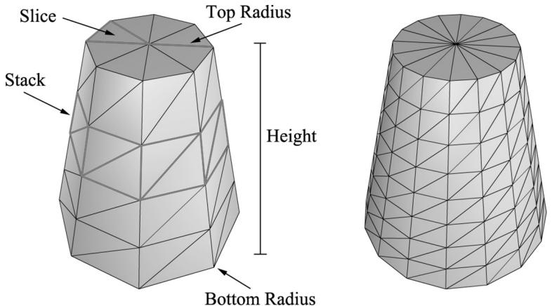


Figure 7.1. In this illustration, the cylinder on the left has eight slices and four stacks, and the cylinder on the right has sixteen slices and eight stacks. The slices and stacks control the triangle density. Note that the top and bottom radii can differ so that we can create cone-shaped objects, not just “pure” cylinders.


# 7.5.1.1 Cylinder Side Geometry

We generate the cylinder centered at the origin, parallel to the y-axis. From Figure 7.1, all the vertices lie on the “rings” of the cylinder, where there are stackCount+1 rings, and each ring has sliceCount unique vertices. The difference in radius between consecutive rings is $\Delta r =$ t( ) opRadius − bottomRadius s/ . tackCount If we start at the bottom ring with index 0, then the radius of the ith ring is $r _ { i } =$ bottomRadius i r  + ∆ and the height of the ith ring is $h _ { i } = - \frac { h } { 2 } + i \Delta h$ , where $\Delta h$ is the stack height and $h$ is the cylinder height. So, the basic idea is to iterate over each ring, and generate the vertices that lie on that ring. This gives the following implementation: 

```cpp
MeshGenData MeshGen::CreateCylinder(
    float bottomRadius,
    float topRadius,
    float height,
    uint32_t sliceCount,
    uint32_t stackCount)
{
    MeshGenData meshData;
    // 
    // Build Stacks. 
```

```cpp
float stackHeight = height / stackCount;  
// Amount to increment radius as we move up each stack level  
// from bottom to top.  
float radiusStep = (topRadius - bottomRadius) / stackCount;  
uint32_t ringCount = stackCount + 1;  
// Compute vertices for each stack ring starting at the bottom  
// and moving up.  
for (uint32_t i = 0; i < ringCount; ++i)  
{  
    float y = -0.5f*height + i*stackHeight;  
    float r = bottomRadius + i*radiusStep;  
    // vertices of ring  
    float dTheta = 2.0f*XM_DI/sliceCount;  
    for (uint32_t j = 0; j <= sliceCount; ++j)  
{  
        MeshGenVertex vertex;  
        float c = cosf(j*dTheta);  
        float s = sinh(j*dTheta);  
        vertex.Position = XMFLOAT3(r*c, y, r*s);  
        vertex.TexC.x = (float)j/sliceCount;  
        vertex.TexC.y = 1.0f - (float)i/stackCount;  
        // Cylinder can be parameterized as follows, where we  
        // introduce v parameter that goes in the same direction  
        // as the v tex- coord so that the bitangent goes in the  
        // same direction as the v tex-coord. Let r0 be the bottom  
        // radius and let r1 be the top radius.  
        // y(v) = h - hv for v in [0,1].  
        // r(v) = r1 + (r0-r1)v  
        // x(t, v) = r(v)*cos(t)  
        // y(t, v) = h - hv  
        // z(t, v) = r(v)*sin(t)  
        // dx/dt = -r(v)*sin(t)  
        // dy/dt = 0  
        // dz/dt = +r(v)*cos(t)  
        // dx/dv = (r0-r1)*cos(t)  
        // dy/dv = -h  
        // dz/dv = (r0-r1)*sin(t)  
        // This is unit length.  
vertex.TangentU = XMFLOAT3(-s, 0.0f, c); 
```

```cpp
float dr = bottomRadius-topRadius;   
XMFLOAT3 bitangent(dr*c, -height, dr*s);   
XMVECTOR T = XMLoadFloat3(&vertex.TangentU);   
XMVECTOR B = XMLoadFloat3(&bitangent);   
XMVECTOR N = XMVector3Normalize(XMVector3Cross(T, B));   
XMStoreFloat3(&vertex.Normal, N);   
meshDataVertices.push_back(vertex);   
} 
```


Observe that the first and last vertex of each ring is duplicated in position, but the texture coordinates are not duplicated. We have to do this so that we can apply textures to cylinders correctly. 


The actual method MeshGen::CreateCylinder creates additional vertex data such as normal vectors and texture coordinates that will be useful for future demos. Do not worry about these quantities for now. 

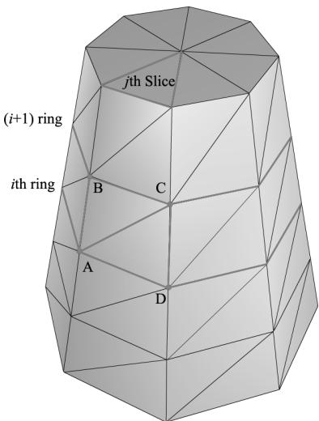


Figure 7.2. The vertices A,B,C,D contained in the ith and $j +$ 1th ring, and jth slice.


Observe from Figure 7.2 that there is a quad (two triangles) for each slice in every stack. Figure 7.2 shows that the indices for the ith stack and jth slice are given by: 

$$
\begin{array}{l} \Delta A B C = (i \cdot n + j, \quad (i + 1) \cdot n + j, (i + 1) \cdot n + j + 1) \\ \Delta A C D = (i \cdot n + j, (i + 1) \cdot n + j + 1, i \cdot n + j + 1) \\ \end{array}
$$

where $n$ is the number of vertices per ring. The main idea is to loop over every slice in every stack and apply the above formulas. 

```cpp
// Add one because we duplicate the first and last vertex per ring // since the texture coordinates are different. uint32_t ringVertexCount = sliceCount + 1;   
// Compute indices for each stack.   
for (uint32_t i = 0; i < stackCount; ++i) { for (uint32_t j = 0; j < sliceCount; ++j) { meshData.Indices32.push_back(i*ringVertexCount + j); meshData.Indices32.push_back((i+1)*ringVertexCount + j); meshData.Indices32.push_back((i+1)*ringVertexCount + j+1); meshData.Indices32.push_back(i*ringVertexCount + j); meshData.Indices32.push_back((i+1)*ringVertexCount + j+1); meshData.Indices32.push_back(i*ringVertexCount + j+1); } } BuildCylinderTopCap(bottomRadius, topRadius, height, sliceCount, stackCount, meshData); BuildCylinderBottomCap(bottomRadius, topRadius, height, sliceCount, stackCount, meshData); return meshData; 
```

# 7.5.1.2 Cap Geometry

Generating the cap geometry amounts to generating the slice triangles of the top and bottom rings to approximate a circle: 

```cpp
void MeshGen::BuildCylinderTopCap(
    float bottomRadius,
    float topRadius,
    float height,
    uint32_t sliceCount,
    uint32_t stackCount,
    MeshGenData& meshData)
{
    uint32_t baseIndex = (uint32_t)meshDataVertices.size();
    float y = 0.5f * height; 
```

float dTheta $= 2.0f$ \*XM.PI / sliceCount;   
// Duplicate cap ring vertices because the texture coordinates   
// and normals differ.   
for uint32_t i = 0; i <= sliceCount; ++i)   
{ float x = topRadius \* cosf(i \* dTheta); float z = topRadius \* sinh(i \* dTheta); // Scale down by the height to try and make top cap   
// texture coord area proportional to base. float u = x / height + 0.5f; float v = z / height + 0.5f; meshData.Vectics.push_back(MeshGenVertex( x, y, z, 0.0f, 1.0f, 0.0f, 1.0f, 0.0f, 0.0f, u, v));   
}   
// Cap center vertex.   
meshData.Vectics.push_back(MeshGenVertex( 0.0f, y, 0.0f, 0.0f, 1.0f, 0.0f, 0.0f, 0.5f, 0.5f));   
// Index of center vertex.   
uint32_t_centerIndex $=$ (uint32_t)meshData.Vectics.size() - 1;   
for (uint32_t i = 0; i < sliceCount; ++i)   
{ meshData.Indices32.push_back(centerIndex); meshData.Indices32.push_back(baseIndex + i + 1); meshData.Indices32.push_back(baseIndex + i); } 

The bottom cap code is analogous. 

# 7.5.2 Generating a Sphere Mesh

We define a sphere by specifying its radius, and the slice and stack count, as shown in Figure 7.3. The algorithm for generating the sphere is very similar to that of the cylinder, except that the radius per ring changes is a nonlinear way based on trigonometric functions. We will leave it to the reader to study the MeshGen::CreateSphere code. Note that we can apply a non-uniform scaling world transformation to transform a sphere into an ellipsoid. 

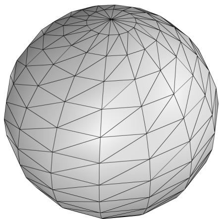


Figure 7.3. The idea of slices and stacks also apply to a sphere to control the level of tessellation.


# 7.5.3 Generating a Geosphere Mesh

Observe from Figure 7.3 that the triangles of the sphere do not have equal areas. This can be undesirable for some situations. A geosphere approximates a sphere using triangles with almost equal areas as well as equal side lengths (see Figure 7.4). 

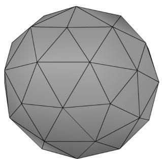


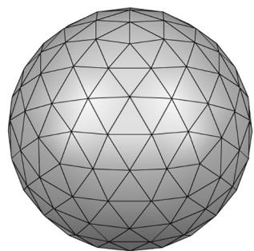


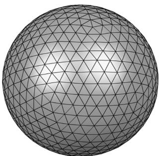


Figure 7.4. Approximating a geosphere by repeated subdivision and reprojection onto the sphere.


To generate a geosphere, we start with an icosahedron, subdivide the triangles, and then project the new vertices onto the sphere with the given radius. We can repeat this process to improve the tessellation. 

Figure 7.5 shows how a triangle can be subdivided into four equal sized triangles. The new vertices are found just by taking the midpoints along the edges of the original triangle. The new vertices can then be projected onto a sphere of radius $r$ by projecting the vertices onto the unit sphere and then scalar multiplying by r : v′ = vvr . $r : \mathbf { v } ^ { \prime } = r { \frac { \mathbf { v } } { \| \mathbf { v } \| } }$ 

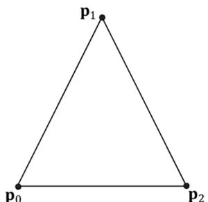


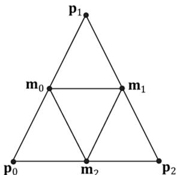


Figure 7.5. Subdividing a triangle into four triangles of equal area.


# The code is given below:

```cpp
void MeshGen::Subdivide(MeshGenData& meshData)  
{ // Save a copy of the input geometry. MeshGenData inputCopy = meshData;  
meshDataVertices resize(0);  
meshData.Indices32resize(0);  
// v1  
// *  
// / \  
// / \  
// m0*----*m1  
// / \ / \  
// / \ / \  
// *----*  
// v0 m2 v2  
uint32_t numTris = (uint32_t)inputCopy.Indices32.size()/3;  
for (uint32_t i = 0; i < numTris; ++i)  
{ MeshGenVertex v0 = inputCopy.Vertices[inputCopy. Indices32[i*3+0]]; MeshGenVertex v1 = inputCopy.Vertices[inputCopy. Indices32[i*3+1]]; MeshGenVertex v2 = inputCopy.Vertices[inputCopy. Indices32[i*3+2]]; // Generate the midpoints. // Generate the midpoints.  
MeshGenVertex m0 = MidPoint(v0, v1);  
MeshGenVertex m1 = MidPoint(v1, v2);  
MeshGenVertex m2 = MidPoint(v0, v2); // Add new geometry. 
```

```cpp
//   
meshData.Contents.push_back(v0); // 0   
meshData.Contents.push_back(v1); // 1   
meshData.Contents.push_back(v2); // 2   
meshData.Contents.push_back(m0); // 3   
meshData.Contents.push_back(m1); // 4   
meshData.Contents.push_back(m2); // 5   
meshData.Contents.push_back(i*6+0);   
meshData.Contents.push_back(i*6+3);   
meshData.Contents.push_back(i*6+5);   
meshData.Contents.push_back(i*6+3);   
meshData.Contents.push_back(i*6+4);   
meshData.Contents.push_back(i*6+5);   
meshData.Contents.push_back(i*6+5);   
meshData.Contents.push_back(i*6+4);   
meshData.Contents.push_back(i*6+2);   
meshData.Contents.push_back(i*6+3);   
meshData.Contents.push_back(i*6+1);   
meshData.Contents.push_back(i*6+4);   
}   
}   
MeshGenVertex MeshGen::MidPoint(const MeshGenVertex& v0, const MeshGenVertex& v1)   
{ XMVECTOR p0 = XmlLoadFloat3(&v0.Position); XMVECTOR p1 = XmlLoadFloat3(&v1.Position); XMVECTOR n0 = XmlLoadFloat3(&v0.Normal); XMVECTOR n1 = XmlLoadFloat3(&v1.Normal); XMVECTOR tan0 = XmlLoadFloat3(&v0.TangentU); XMVECTOR tan1 = XmlLoadFloat3(&v1.TangentU); XMVECTOR tex0 = XmlLoadFloat2(&v0.TexC); XMVECTOR tex1 = XmlLoadFloat2(&v1.TexC); // Compute the midpoints of all the attributes. Vectors need to be // normalized since linear interpolating can make them not unit length. XMVECTOR pos = 0.5f*(p0 + p1); XMVECTOR normal = XMVector3Normalize(0.5f*(n0 + n1)); XMVECTOR tangent = XMVector3Normalize(0.5f*(tan0+tan1)); XMVECTOR tex = 0.5f*(tex0 + tex1);   
MeshGenVertex v;   
XMStoreFloat3(&v.Position, pos);   
XMStoreFloat3(&v.Normal, normal); 
```

XMStoreFloat3(&v.TangentU, tangent);   
XMStoreFloat2(&v.TexC, tex);   
return v;   
}   
MeshGenData MeshGen::CreateGeosphere( float radius, uint32_t numSubdivisions)   
{ MeshGenData meshData; // Put a cap on the number of subdivisions. numSubdivisions $=$ std::min<uint32_t>(numSubdivisions, 6u); // Approximate a sphere by tessellating an icosahedron. const float $\mathrm{x} = 0.525731\mathrm{f}$ . const float $\mathbf{Z} = 0.850651\mathbf{f}$ .   
XMFLOAT3 pos[12] $=$ { XMFLOAT3(-x, 0.0f, Z), XMFLOAT3(X, 0.0f, Z), XMFLOAT3(-x, 0.0f, -z), XMFLOAT3(X, 0.0f, -z), XMFLOAT3(0.0f, Z, X), XMFLOAT3(0.0f, Z, -X), XMFLOAT3(0.0f, -Z, X), XMFLOAT3(0.0f, -Z, -X), XMFLOAT3(Z, X, 0.0f), XMFLOAT3(-Z, X, 0.0f), XMFLOAT3(Z, -X, 0.0f), XMFLOAT3(-Z, -X, 0.0f) }; uint32_t k[60] $=$ { 1,4,0, 4,9,0, 4,5,9, 8,5,4, 1,8,4, 1,10,8,10,3,8,8,3,5, 3,2,5, 3,7,2, 3,10,7, 10,6,7, 6,11,7, 6,0,11, 6,1,0, 10,1,6,11,0,9, 2,11,9, 5,2,9, 11,2,7 };   
meshDataVertices resize(12);   
meshDataIndices32.assign(&k[0], &k[60]);   
for (uint32_t i = 0; i < 12; ++i) meshDataVertices[i].Position = pos[i];   
for (uint32_t i = 0; i < numSubdivisions; ++i) Subdivide(meshData);   
// Project vertices onto sphere and scale. for (uint32_t i = 0; i < meshDataVertices.size(); ++i) { // Project onto unit sphere. XMVECTOR n = XMVector3Normalize(XMLoadFloat3(&meshData. Vertices[i].Position)); 

```javascript
// Project onto sphere. XMVECTOR p = radius*n; XMStoreFloat3(&meshData.Contents[i].Position, p); XMStoreFloat3(&meshData.Contents[i].Normal, n); // Derive texture coordinates from spherical coordinates. float theta = atan2f( meshData.Contents[i].Position.z, meshData.Contents[i].Position.x); // Put in [0, 2pi]. if(theta < 0.0f) theta += XM_2PI; float phi = acosf(meshData.Contents[i].Position.y / radius); meshData.Contents[i].TexC.x = theta/XM_2PI; meshData.Contents[i].TexC.y = phi/XM_PI; // Partial derivative of P with respect to theta meshData.Contents[i].TangentU.x = -radius*sinf(phi)*sinf(theta); meshData.Contents[i].TangentU.y = 0.0f; meshData.Contents[i].TangentU.z = +radius*sinf phi)*cosf(theta); XMVECTOR T = XMLoadFloat3(&meshData.Contents[i].TangentU); XMStoreFloat3(&meshData.Contents[i].TangentU, XMVector3Normalize(T)); } return meshData; 
```

# 7.6 SHAPES DEMO

To demonstrate our sphere and cylinder generation code, we implement the “Shapes” demo shown in Figure 7.6. In addition, you will also gain experience positioning and drawing multiple objects in a scene (i.e., creating multiple world transformation matrices). Furthermore, we place all of the scene geometry in one big vertex and index buffer. Then we will use the DrawIndexedInstanced method to draw one object at a time (as the world matrix needs to be changed between objects); so you will see an example of using the StartIndexLocation and 

BaseVertexLocation parameters of DrawIndexedInstanced. 

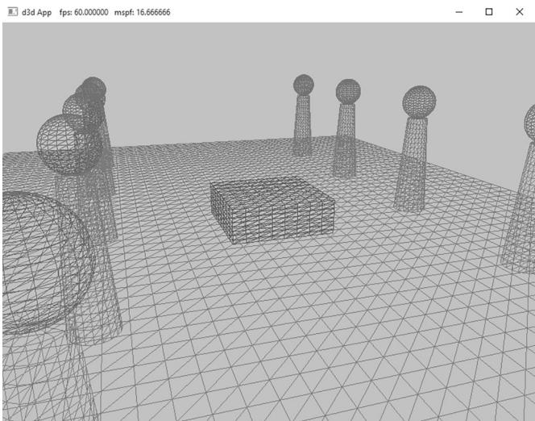


Figure 7.6. Screenshot of the “Shapes” demo.


# 7.6.1 Vertex and Index Buffers

As Figure 7.6 shows, in this demo we draw a box, a grid, cylinders, and spheres. Even though we draw multiple spheres and cylinders in this demo, we only need one copy of the sphere and cylinder geometry. We simply redraw the same sphere and cylinder mesh multiple times, but with different world matrices; this is an example of instancing geometry, which saves memory. 

We pack all the mesh vertices and indices into one vertex and index buffer. This is done by concatenating the vertex and index arrays. This means that when we draw an object, we are only drawing a subset of the vertex and index buffers. There are three quantities we need to know in order to draw only a subset of the geometry using ID3D12GraphicsCommandList::DrawIndexedInstanced (recall Figure 6.3 and the discussion about it from Chapter 6). We need to know the starting index to the object in the concatenated index buffer, its index count, and we need to know the base vertex location—the index of the object’s first vertex relative to the concatenated vertex buffer. Recall that the base vertex location is an integer value added to the indices in a draw call before the vertices are fetched, so that the indices reference the proper subset in the concatenated vertex buffer. (See also Exercise 2 in Chapter 5.) 

The code below shows how the geometry buffers are created, how the necessary drawing quantities are cached, and how the objects are drawn. 

```cpp
std::unique_ptr<MeshGeometry> ShapesApp::BuildShapeGeometry(
ID3D12Device* device,
ResourceUploadBatch& uploadBatch) 
```

{   
MeshGen meshGen;   
MeshGenData box $=$ meshGen.CreateBox(1.0f, 1.0f, 1.0f, 3);   
MeshGenData grid $=$ meshGen.CreateGrid(20.0f, 30.0f, 60, 40);   
MeshGenData sphere $=$ meshGen.CreateSphere(0.5f, 20, 20);   
MeshGenData cylinder $=$ meshGen.CreateCylinder(0.5f, 0.3f, 3.0f, 20, 20);   
MeshGenData quad $=$ meshGen.CreateQuad(0.0f, 0.0f, 1.0f, 1.0f, 0.0f);   
//   
// We are concatenating all the geometry into one big   
// vertex/index buffer. So define the regions in the buffer   
// each submesh covers.   
//   
MeshGenData compositeMesh;   
SubmeshGeometry boxSubmesh $=$ compositeMesh.Addsubmesh (box);   
SubmeshGeometry gridSubmesh $=$ compositeMesh.Addsubmesh (grid);   
SubmeshGeometry sphereSubmesh $=$ compositeMesh. AppendSubmesh (sphere);   
SubmeshGeometry cylinderSubmesh $=$ compositeMesh. AppendSubmesh (cylinder);   
SubmeshGeometry quadSubmesh $=$ compositeMesh. AppendSubmesh (quad);   
XMFLOAT4 color $=$ XMFLOAT4(0.2f, 0.2f, 0.2f, 1.0f);   
// Extract the vertex elements we are interested into our   
// vertex buffer. std::vector<ColorVertex> vertices(compositeMeshVertices.size()); for(size_t i = 0; i < compositeMeshVertices.size(); ++i) { vertices[i].Pos $=$ compositeMeshVertices[i].Position; vertices[i].Color $=$ color;   
}   
const uint32_t indexCount $=$ (UINT)compositeMeshIndices32.size();   
const UINT indexElementByteSize $=$ sizeof( uint16_t);   
const UINT vbByteSize $=$ (UINT)vertices.size() \* sizeof(ColorVertex);   
const UINT ibByteSize $=$ indexCount \* indexElementByteSize;   
const byte\* indexData $=$ reinterpretcast<byte\*/ (compositeMesh. GetIndices16().data());   
auto geo $=$ std::make_unique<MeshGeometry>(); geo->Name $=$ "shapeGeo";   
geo->VertexBufferCPU.resize(vbByteSize); CopyMemory(geo->VertexBufferCPU.data(), vertices.data(), vbByteSize); geo->IndexBufferCPU.resize(ibByteSize); CopyMemory(geo->IndexBufferCPU.data(), indexData, ibByteSize); 

```javascript
CreateStaticBuffer( device, uploadBatch, vertices.data(), vertices.size(), sizeof(ColorVertex), D3D12Resource_STATEvertex_andCONSTANT BUFFER, &geo->VertexBufferGPU);   
CreateStaticBuffer( device, uploadBatch, indexData, indexCount, indexElementByteSize, D3D12Resource_STATE_INDEXUFFER, &geo->IndexBufferGPU); geo->VertexByteStride = sizeof(ColorVertex); geo->VertexBufferByteSize = vbByteSize; geo->IndexFormat = DXGI_FORMAT_R16_UID; geo->IndexBufferByteSize = ibByteSize; geo->DrawArgs["box"] = boxSubmesh; geo->DrawArgs["grid"] = gridSubmesh; geo->DrawArgs["sphere"] = sphereSubmesh; geo->DrawArgs["cylinder"] = cylinderSubmesh; geo->DrawArgs["quad"] = quadSubmesh; return geo; 
```

Because this code creates resources in a default heap, we need to use the ResourceUploadBatch helper to transfer the data from CPU memory to GPU memory: 

mUploadBatch->Begin(D3D12_COMMAND_LIST_TYPE_DIRECT);   
std::unique_ptr<MeshGeometry> shapeGeo $=$ BuildShapeGeometry( md3dDevice.Get(), \*mUploadBatch.get());   
if(shapeGeo != nullptr)   
{ mGeometries[shapeGeo->Name] $=$ std::move(shapeGeo);   
}   
// Kick off upload work asynchronously.   
std::future<void> result $=$ mUploadBatch->End(mCommandQueue.Get());; 

The mGeometries variable used in the last line of the above method is defined like so: 

```cpp
std::unordered_map<std::string, std::unique_ptr<MeshGeometry>> mGeometries; 
```

This is a common pattern we employ for the rest of this book. It is cumbersome to create a new variable name for each geometry, PSO, texture, shader, etc., so we use unordered maps for constant time lookup and reference our objects by name. Here are some more examples: 

```cpp
std::unordered_map<std::string, ComPtr<IDxcBlob >> mShaders; std::unordered_map<std::string, ComPtr<ID3D12PipelineState>> mPSOs; 
```

# 7.6.2 Render Items

We now define our scene render items. Observe how all the render items share the same MeshGeometry, and we use the DrawArgs to get the DrawIndexedInstanced parameters to draw a subregion of the vertex/index buffers. 

// List of all the render items.   
std::vector<std::unique_ptr<RenderItem>> mAllRItems;   
// Render items divided by PSO.   
std::vector<RenderItem\*> mRItemLayer[(int)RenderLayer::Count];   
void ShapesApp::AddRenderItem(RenderLayer layer, const DirectX::XMFLOAT4X4& world, MeshGeometry\* geo, SubmeshGeometry& drawArgs)   
{ auto ritem $=$ std::make_unique<RenderItem>(); ritem->World $=$ world; ritem->TexTransform $\equiv$ MathHelper::Identity4x4(); ritem->Mat $\equiv$ nullptr; ritem->Geo $\equiv$ geo; ritem->PrimitiveType $\equiv$ D3D_PRIMITIVE_TOPOLOGY_TRIANGLELIST; ritem->IndexCount $\equiv$ drawArgs.IndexCount; ritem->StartIndexLocation $\equiv$ drawArgs.StartIndexLocation; ritem->BaseVertexLocation $\equiv$ drawArgs.BaseVertexLocation; mRItemLayer[(int)layer].push_back(ritem.get()); mAllRItems.push_back(std::move(ritem));   
}   
void ShapesApp::BuildRenderItems()   
{ XMFLOAT4X4 worldTransform; XMStoreFloat4x4(&worldTransform, XMMatrixScaling(2.0f, 1.0f, 2.0f) \* XMMatrixTranslation(0.0f, 0.5f, 0.0f)); AddRenderItem(RenderLayer::Opaque, worldTransform, mGeometries["shapeGeo"].get(), mGeometries["shapeGeo"]->DrawArgs["box"]); worldTransform $=$ MathHelper::Identity4x4(); AddRenderItem(RenderLayer::Opaque, worldTransform, mGeometries["shapeGeo"].get(), mGeometries["shapeGeo"]->DrawArgs["grid"]); for(int i = 0; i < 5; ++i) { XMStoreFloat4x4(&worldTransform, XMMatrixTranslation(-5.0f, 1.5f, -10.0f + i * 5.0f)); AddRenderItem(RenderLayer::Opaque, worldTransform, 

```objectivec
mGeometries["shapeGeo"].get(), mGeometries["shapeGeo"].->DrawArgs["cylinder"]);   
XMStoreFloat4x4(&worldTransform, XMMatrixTranslation(+5.0f, 1.5f, -10.0f + i * 5.0f)); AddRenderItem(RenderLayer::Opaque, worldTransform, mGeometries["shapeGeo"].get(), mGeometries["shapeGeo"].->DrawArgs["cylinder"]);   
XMStoreFloat4x4(&worldTransform, XMMatrixTranslation(-5.0f, 3.5f, -10.0f + i * 5.0f)); AddRenderItem(RenderLayer::Opaque, worldTransform, mGeometries["shapeGeo"].get(), mGeometries["shapeGeo"].->DrawArgs["sphere"]);   
XMStoreFloat4x4(&worldTransform, XMMatrixTranslation(+5.0f, 3.5f, -10.0f + i * 5.0f)); AddRenderItem(RenderLayer::Opaque, worldTransform, mGeometries["shapeGeo"].get(), mGeometries["shapeGeo"].->DrawArgs["sphere"]);   
} 
```

# 7.6.3 Root Constant Buffer Views

Another change we make starting in this chapter is that we use root descriptors so that we can bind CBVs directly without having to put CBVs in a descriptor heap. As we will see in this book, we only need a few constant buffers, and it makes it much more convenient not to have to put CBVs in heaps and create descriptor tables. 

Here are the changes that need to be made to do this: 

1. The root signature needs to be changed to take two root CBVs instead of two descriptor tables. 

2. No do not need to create CBVs and put them in a descriptor heap. 

3. There is a new Direct3D method for binding a root descriptors. 

The new root signature is defined like so: 

enumROOTArg   
{ ROOT.Arg_OBJECT_CBV $= 0$ ， ROOT.Arg_PASS_CBV, ROOT.Arg_COUNT   
}；   
void ShapesApp::BuildRootSignature()   
{ //Root parameter can be a table, root descriptor or root constants. 

```cpp
CD3DX12_ROOT_PARAMETER gfxRootParameters[ROOT.Arg_COUNT]; // Performance TIP: Order from most frequent to least frequent. gfxRootParameters[ROOT.Arg_OBJECT_CBV].InitAsConstantBufferView(0); gfxRootParameters[ROOT.Arg_PASS_CBV].InitAsConstantBufferView(1); // A root signature is an array of root parameters. CD3DX12_ROOT_SIGNATURE_DESC rootSigDesc( ROOT.Arg_COUNT, gfxRootParameters, 0, nullptr, D3D12_ROOT_SIGNATURE_FLAG_OPEN_INPUT_ASSEMBLER_INPUT_LAYOUT); // create a root signature with a single slot which points to a descriptor range consisting of a single constant buffer ComPtr<ID3DBlob> serializedRootSig = nullptr; ComPtr<ID3DBlob> errorBlob = nullptr; HRESULT hr = D3D12SERIALIZeRootSignature( &rootSigDesc, D3D_ROOT_SIGNATURE_VERSION_1, serializedRootSig↘GetAddressOf(), errorBlob↘GetAddressOf()); if(errorBlob != nullptr) { ::OutputDebugStringA((char*)errorBlob->GetBufferPointer()); } ThrowIfFailed(hr); ThrowIfFailed (md3dDevice->CreateRootSignature( 0, serializedRootSig->GetBufferPointer(), serializedRootSig->GetBufferSize(), IID_PPV Arguments (&mRootSignature)); } 
```

Observe that we use the InitAsConstantBufferView helper method to create a root CBV; the parameter specifies the shader register the parameter is bound to (in the above code, shader constant buffer register $^ { \mathrm { e } } \mathrm { b 0 } ^ { \mathrm { p } }$ and “b1”). 

Now, we bind a CBV as an argument to a root descriptor using the following method: 

```cpp
void
ID3D12GraphicsCommandList::SetGraphicsRootConstantBufferView(
    UINT RootParameterIndex,
    D3D12_GPU_VIRTUAL_ADDRESS BufferLocation); 
```

1. RootParameterIndex: The index of the root parameter we are binding a CBV to. 

2. BufferLocation: The virtual address to the resource that contains the constant buffer data. 


With this change, our drawing code now looks like this:


void ShapesApp::Draw(const GameTimer& gt)   
{ [...] ID3D12Resource\* passCB $=$ mCurrFrameResource->PassCB->Resource(); mCommandList->SetGraphicsRootConstantBufferView( ROOT_arg_PASS_CBV，passCB->GetGPUVirtualAddress()); mCommandList->SetPipelineState( mDrawWireframe ? mPSOs["opaque_wireframe"].Get() : mPSOs["opaque"].Get(); DrawRenderItems(mCommandList.Get(),mRItemLayer[(int) RenderLayer::Opaque]); [...]   
}   
void ShapesApp::DrawRenderItems(ID3D12GraphicsCommandList\* cmdList, const std::vector<RenderItem>& r items)   
{ for(size_t i = 0; i < r items.size(); ++i) { auto ri $=$ r items[i]; cmdList->IASetVertexBuffers(0,1,&ri->Geo->VertexBufferView()); cmdList->IASetIndexBuffer(&ri->Geo->IndexBufferView()); cmdList->IASetPrimitiveTopology(ri->PrimitiveType); cmdList->SetGraphicsRootConstantBufferView( ROOT_arg_OBJECT_CBV, ri->MemHandleToObjectCB.GpuAddress()); cmdList->DrawIndexedInstanced( ri->IndexCount,1,ri->StartIndexLocation, ri->BaseVertexLocation,0); } 

# 7.6.4 Drawing the Scene

At last, we can draw our scene. 

```cpp
void ShapesApp::Draw(const GameTimer& gt)  
{ CbvSrvUavHeap& cbvSrvUavHeap = CbvSrvUavHeap::Get(); UpdateImgui(gt); auto cmdListAlloc = mCurrFrameResource->CmdListAlloc; 
```

```cpp
// Reuse the memory associated with command recording.   
// We can only reset when the associated command lists have   
finished execution on the GPU.   
ThrowIfFailed(cmdListAlloc->Reset());   
// A command list can be reset after it has been added to   
// the command queue via ExecuteCommandList. Reusing the   
// command list reuses memory.   
ThrowIfFailed(mCommandList->Reset(cmdListAlloc.Get(), mPSOs["opaque"].Get()));   
ID3D12DescriptorHeap* descriptorHeaps[] = { cbvSrvUavHeap. GetD3dHeap();   
mCommandList->SetDescriptorHeaps(_countof(descriptorHeaps), descriptorHeaps);   
mCommandList->SetGraphicsRootSignature(mRootSignature.Get());   
mCommandList->RSServletports(1, &mScreenViewport);   
mCommandList->RSSetScissorRects(1, &mScissorRect);   
// Indicate a state transition on the resource usage.   
mCommandList->ResourceBarrier( 1, &CD3DX12_RESOURCE_BARRIER::Transition( CurrentBackBuffer(), D3D12.Resource_STATE_present, D3D12.Resource_STATE_RENDER_TARGET));   
// Clear the back buffer and depth buffer.   
mCommandList->ClearRenderTargetView(CurrentBackBufferView(), Colors::LightSteelBlue, 0, nullptr);   
mCommandList->ClearDepthStencilView(DepthStencilView(), D3D12_CLEAR_FLAG_DEPTH | D3D12_CLEAR_FLAG_STENCIL, 1.0f, 0, 0, nullptr);   
// Specify the buffers we are going to render to.   
mCommandList->OMSetRenderTargets(1, &CurrentBackBufferView(), true, &DepthStencilView());   
ID3D12Resource* passCB = mCurrFrameResource->PassCB->Resource();   
mCommandList->SetGraphicsRootConstantBufferView( ROOT.Arg_PASS_CBV, passCB->GetGPUVirtualAddress());   
mCommandList->SetPipelineState( mDrawWireframe ? mPSOs["opaque_wireframe"].Get(): mPSOs["opaque"].Get(); DrawItems(mCommandList.Get(), mRItemLayer[(int) RenderLayer::Opaque]);   
// Draw imgui UI.   
ImGui_ImplDX12_RenderDrawData(ImGui::GetDrawData(), mCommandList. Get()); 
```

```cpp
// Indicate a state transition on the resource usage.  
mCommandList->ResourceBarrier(1, &CD3DX12_RESOURCE_BARRIER::Transition(CurrentBackBuffer(), D3D12.Resource_STATE_render_TARGET, D3D12.Resource_STATE_present));  
// Done recording commands.  
ThrowIfFailed(mCommandList->Close());  
mLinearAllocator->Commit(mCommandQueue.Get());  
// Add the command list to the queue for execution.  
ID3D12CommandList* cmdLists[] = { mCommandList.Get();  
mCommandQueue->ExecuteCommandLists(_countof(cmdLists), cmdLists);  
// Swap the back and front buffers  
DXGI_present_PARAMETERS presentParams = { 0 };  
ThrowIfFailed(mSwapChain->Present1(0, 0, &presentParams));  
mCurrBackBuffer = (mCurrBackBuffer + 1) % SwapChainBufferCount;  
// Advance the fence value to mark commands up to this fence point.  
mCurrFrameResource->Fence = ++mCurrentFence;  
// Add an instruction to the command queue to set a new fence  
// point. Because we are on the GPU timeline, the new fence  
// point won't be set until the GPU finishes processing all the  
// commands prior to this Signal().  
mCommandQueue->Signal(mFence.Get(), mCurrentFence); 
```

# 7.7 WAVES DEMO

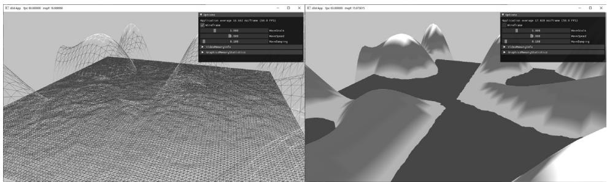


Figure 7.7. Screenshot of the “Waves” demo.


In this section, we show how to build the “Waves” demo shown in Figure 7.7. This demo constructs a triangle grid mesh procedurally and offsets the vertex heights to create a terrain. In addition, it uses another triangle grid to represent water, and animates the vertex heights to create waves. 

The graph of a “nice” real-valued function $y = f ( x , z )$ is a surface. We can approximate the surface by constructing a grid in the $x z$ -plane, where every quad is built from two triangles, and then applying the function to each grid point; see Figure 7.8. 

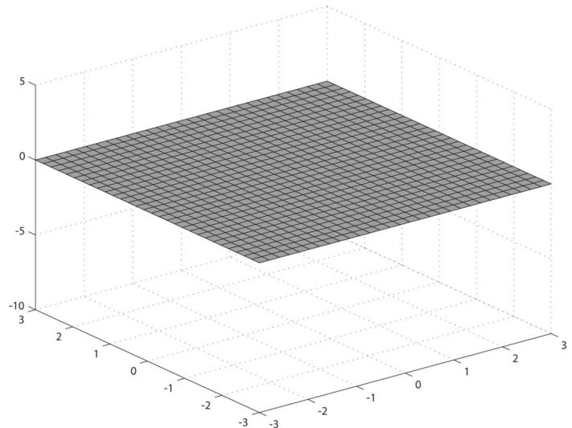


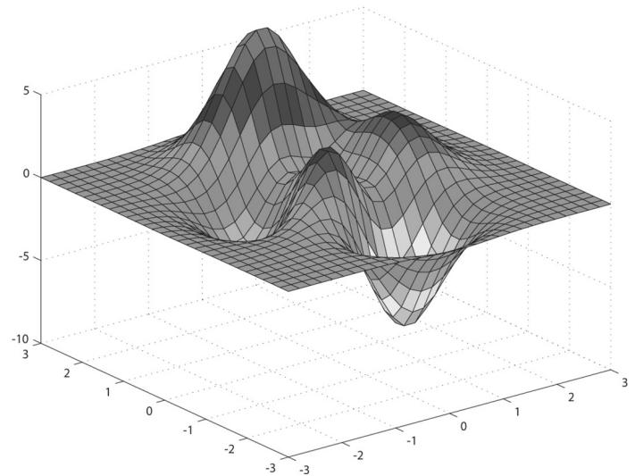


Figure 7.8. (Top) Lay down a grid in the xz-plane. (Bottom) For each grid point, apply the function $f ( x , z )$ to obtain the y-coordinate. The plot of the points $( x , f ( x , z ) , z )$ gives the graph of a surface.


# 7.7.1 Generating the Grid Vertices

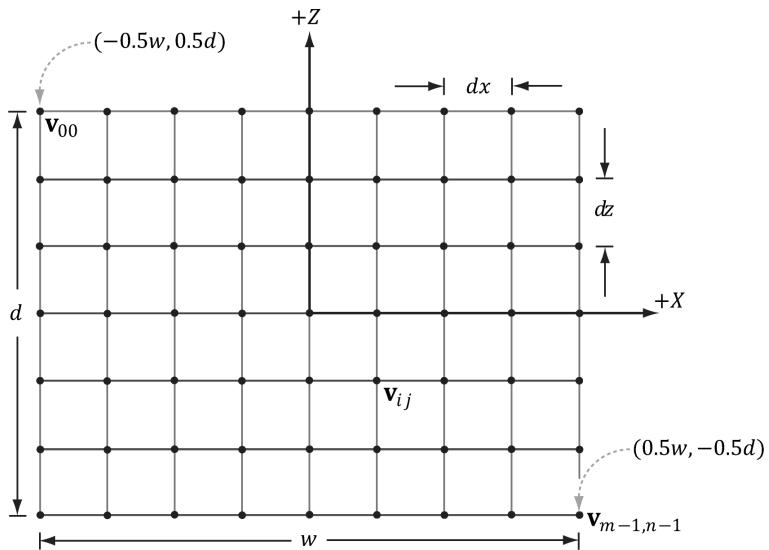


Figure 7.9. Grid construction.


So the main task is how to build the grid in the $_ { x z }$ -plane. A grid of $m \times n$ vertices induces $( m - 1 ) \times ( n - 1 )$ quads (or cells), as shown in Figure 7.9. Each cell will be covered by two triangles, so there are a total of $2 \cdot ( m - 1 ) \times ( n - 1 )$ triangles. If the grid has width $w$ and depth $d$ , the cell spacing along the $x$ -axis is $d x = w / \left( n - 1 \right)$ and the cell spacing along the $z$ -axis is $d z = d / \left( m - 1 \right)$ . To generate the vertices, we start at the upper-left corner and incrementally compute the vertex coordinates row-by-row. The coordinates of the ijth grid vertex in the $_ { x z }$ -plane are given by: 

$$
\mathbf {v} _ {i j} = \left[ \begin{array}{l l l} - 0. 5 w + j \cdot d x, & 0. 0, & 0. 5 d - i \cdot d z \end{array} \right]
$$

The following code generates the grid vertices: 

MeshGenData MeshGen::CreateGrid( float width, float depth, uint32_t m, uint32_t n)   
{ MeshGenData meshData; uint32_t vertexCount $=$ m\*n; uint32_t faceCount $\equiv$ (m-1)\* (n-1)\*2; // // Create the vertices. // float halfWidth $= 0.5f^{*}$ width; 

float halfDepth $= 0.5f^{*}$ depth;   
float dx $=$ width / (n-1);   
float dz $=$ depth / (m-1);   
float du $= 1.0f$ / (n-1);   
float dv $= 1.0f$ / (m-1);   
meshData.Contents.resize(vertexCount);   
for uint32_t i $= 0$ ; $\mathrm{i} <   \mathrm{m}; + + \mathrm{i})$ { float z $=$ halfDepth - i\*dz; for uint32_t j $= 0$ ; $\mathrm{j} <   \mathrm{n}; + + \mathrm{j})$ { float x $=$ -halfWidth + j\*dx; meshData.Contents[i\*n+j].Position $=$ XMFLOAT3(x,0.0f,z); meshData.Contents[i\*n+j].Normal $=$ XMFLOAT3(0.0f,1.0f, 0.0f); meshData.Contents[i\*n+j].TangentU $=$ XMFLOAT3(1.0f,0.0f, 0.0f); // Stretch texture over grid. meshData.Contents[i\*n+j].TexC.x $=$ j\*du; meshData.Contents[i\*n+j].TexC.y $=$ i\*dv; }   
} 

# 7.7.2 Generating the Grid Indices

After we have computed the vertices, we need to define the grid triangles by specifying the indices. To do this, we iterate over each quad, again row-by-row starting at the top-left, and compute the indices to define the two triangles of the quad; referring to Figure 7.10, for an $m \times n$ vertex grid, the linear array indices of the two triangles are computed as follows: 

$$
\Delta A B C = \left( \begin{array}{l l} i \cdot n + j, & i \cdot n + j + 1, (i + 1) \cdot n + j \end{array} \right)
$$

$$
\Delta C B D = \left(\left(i + 1\right) \cdot n + j, i \cdot n + j + 1, (i + 1) \cdot n + j + 1\right)
$$

The corresponding code: 

```cpp
meshData.Indices32resize(faceCount*3); // 3 indices per face  
// Iterate over each quad and compute indices.  
uint32_t k = 0;  
for (uint32_t i = 0; i < m-1; ++i)  
{ 
```

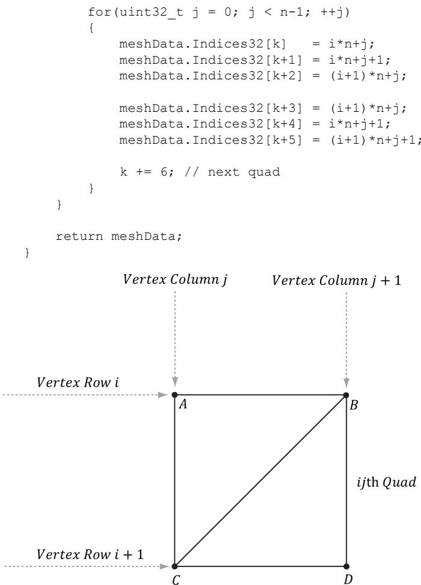


Figure 7.10. The indices of the ijth quad’s vertices.


# 7.7.3 Applying the Height Function

After we have created the grid, we can extract the vertex elements we want from the MeshGenData grid, turn the flat grid into a surface representing hills, and generate a color for each vertex based on the vertex altitude (y-coordinate). 

```cpp
struct ColorVertex
{
    DirectX::XMFLOAT3 Pos;
    DirectX::XMFLOAT4 Color;
}; 
```

ID3D12Device* device, ResourceUploadBatch& uploadBatch)   
{ MeshGen meshGen; MeshGenData grid $=$ meshGen.CreateGrid(160.0f, 160.0f, 50, 50); // Extract the vertex elements we are interested and apply the // height function to each vertex. In addition, color the // vertices based on their height so we have sandy looking // beaches, grassy low hills, and snow mountain peaks. std::vector<ColorVertex> verticesgrid.Vertices.size(); for(size_t i = 0; i < grid.Vertices.size(); ++i) { auto& p $=$ grid.Vertices[i].Position; vertices[i].Pos $=$ p; vertices[i].Pos.y $=$ GetHillsHeight(p.x, p.z); // Color the vertex based on its height. if(vertices[i].Pos.y < -10.0f) { // Sandy beach color. vertices[i].Color $=$ XMFLOAT4(1.0f, 0.96f, 0.62f, 1.0f); } else if(vertices[i].Pos.y < 5.0f) { // Light yellow-green. vertices[i].Color $=$ XMFLOAT4(0.48f, 0.77f, 0.46f, 1.0f); } else if(vertices[i].Pos.y < 12.0f) { // Dark yellow-green. vertices[i].Color $=$ XMFLOAT4(0.1f, 0.48f, 0.19f, 1.0f); } else if(vertices[i].Pos.y < 20.0f) { // Dark brown. vertices[i].Color $=$ XMFLOAT4(0.45f, 0.39f, 0.34f, 1.0f); } else { // White snow. vertices[i].Color $=$ XMFLOAT4(1.0f, 1.0f, 1.0f, 1.0f); } } const uint32_t indexCount $=$ (UINT)grid.Indices32.size(); const UINT indexElementByteSize $=$ sizeof(UINT16_t); const UINT vbByteSize $=$ (UINT)vertices.size() \* sizeof(ColorVertex); const UINT ibByteSize $=$ indexCount \* indexElementByteSize; 

std::vector<std::uint16_t> indices = grid.GetIndices16();   
auto geo $=$ std::make_unique<MeshGeometry>(); geo->Name $\equiv$ "landGeo"; geo->VertexBufferCPU.resize(vbByteSize); CopyMemory(geo->VertexBufferCPU.data(), vertices.data(), vbByteSize); geo->IndexBufferCPU.resize(ibByteSize); CopyMemory(geo->IndexBufferCPU.data(), indices.data(), ibByteSize); CreateStaticBuffer( device, uploadBatch, vertices.data(), vertices.size(), sizeof(ColorVertex), D3D12Resource_STATEvertex_AND_constant_buffer, &geo->VertexBufferGPU);   
CreateStaticBuffer( device, uploadBatch, indices.data(), indexCount, indexElementByteSize, D3D12Resource_STATE_INDEX_buffer, &geo->IndexBufferGPU); geo->VertexByteStride $\equiv$ sizeof(ColorVertex); geo->VertexBufferByteSize $\equiv$ vbByteSize; geo->IndexFormat $\equiv$ DXGI_FORMAT_R16_UID; geo->IndexBufferByteSize $\equiv$ ibByteSize; SubmeshGeometry submesh; submesh.IndexCount $\equiv$ (UINT)indices.size(); submesh.StartIndexLocation $\equiv 0$ . submesh.BaseVertexLocation $\equiv 0$ . submesh. VertexCount $\equiv$ vertices.size(); geo->DrawArgs["grid"] $\equiv$ submesh; return geo; 

The function $f ( x , z )$ we have used in this demo is given by: 

```cpp
float WavesApp::GetHillsHeight(float x, float z) const { return 0.3f*(z*sinf(0.1f*x) + x*cosf(0.1f*z)); } 
```

Its graph looks like somewhat like a terrain with hills and valleys (see Figure 7.7). 

# 7.7.4 Dynamic Vertex Buffers

So far we have stored our vertices in a default buffer resource. We use this kind of resource when we want to store static geometry. That is, geometry that we do not change—we set the data, and the GPU reads and draws the data. A dynamic 

vertex buffer is where we change the vertex data frequently, say per-frame. For example, suppose we are doing a wave simulation, and we solve the wave equation for the solution function $f ( x , z , t )$ . This function represents the wave height at each point in the $_ { x z }$ -plane at time $t .$ If we were to use this function to draw the waves, we would use a triangle grid mesh like we did with the peaks and valleys, and apply $f ( x , z , t )$ to each grid point in order to obtain the wave heights at the grid points. Because this function also depends on time $t$ (i.e., the wave surface changes with time), we would need to reapply this function to the grid points a short time later (say every 1 3/ 0 th of a second) to get a smooth animation. Thus, we need a dynamic vertex buffer in order to update the heights of the triangle grid mesh vertices as time passes. Another situation that leads to dynamic vertex buffers is particle systems with complex physics and collision detection. Each frame we will do the physics and collision detection on the CPU to find the new position of the particles. Because the particle positions are changing each frame, we need a dynamic vertex buffer in order to update the particle positions for drawing each frame. 

We have already seen an example of uploading data from the CPU to the GPU per-frame when we used upload buffers to update our constant buffer data. We can apply the same technique and use our UploadBuffer class, but instead of storing an array of constant buffers, we store an array of vertices: 

```cpp
std::unique_ptr<UploadBuffer< ColorVertex>> WavesVB = nullptr; 
```

```cpp
WavesVB = std::make_unique<UploadBuffer< ColorVertex >> (device, waveVertCount, false); 
```

Because we need to upload the new contents from the CPU to the wave’s dynamic vertex buffer every frame, the dynamic vertex buffer needs to be a frame resource. Otherwise, we could overwrite the memory before the GPU has finished processing the last frame. 

Every frame, we run the wave simulation and update the vertex buffer like so: 

```cpp
void WavesApp::UpdateWaves(const GameTimer& gt)  
{ // Every quarter second, generate a random wave. static float t_base = 0.0f; if((mTimer.TotalTime() - t_base) >= 0.25f) { t_base += 0.25f; int i = MathHelper::Rand(4, mWaves->RowCount() - 5); int j = MathHelper::Rand(4, mWaves->ColumnCount() - 5); float r = mWaveScale * MathHelper::RandF(0.3f, 0.6f); mWaves->Disturb(i, j, r); 
```

}   
// Update the wave simulation. mWaves->Update(gt.DeltaTime());   
// Update the wave vertex buffer with the new solution. auto currWavesVB $=$ mCurrFrameResource->WavesVB.get(); std::vector<ColorVertex> verts(mWaves->VertexCount()); for(int i $= 0$ ;i $<$ mWaves->VertexCount(); ++i) { verts[i].Pos $=$ mWaves->Position(i); verts[i].Color $=$ XMFLOAT4(DirectX::Colors::Blue); } currWavesVB->CopyData(verts.data(), verts.size()); // Set the dynamic VB of the wave renderitem to the current frame VB. mWavesRItem->Geo->VertexBufferGPU $=$ currWavesVB->Resource();   
} 


We save a reference to the wave render item (mWavesRitem) so that we can set its vertex buffer on the fly. We need to do this because its vertex buffer is a dynamic buffer and changes every frame. 

There is some overhead when using dynamic buffers (i.e., buffers in an upload heap), as the data must be read across the PCI-Express bus, which is slower for the GPU than reading directly from GPU memory (VRAM). Therefore, static buffers should be preferred to dynamic buffers, provided static buffers will work. Recent versions of Direct3D have introduced new features to lessen the need for dynamic buffers. For instance: 

1. simple animations may be done in a vertex shader 

2. it is possible, through render to texture or compute shaders and vertex texture fetch functionality, to implement a wave simulation like the one described above that runs completely on the GPU 

3. the geometry shader provides the ability for the GPU to create or destroy primitives, a task that would normally need to be done on the CPU without a geometry shader. 

4. the tessellation stages can add tessellate geometry on the GPU, a task that would normally need to be done on the CPU without hardware tessellation. 

Index buffers can be dynamic, too. However, in the “Waves” demo, the triangle topology remains constant and only the vertex heights change; therefore, only the vertex buffer needs to be dynamic. 

The “Waves” demo for this chapter uses a dynamic vertex buffer to implement a simple wave simulation like the one described at the beginning of this section. 

For this book, we are not concerned with the actual algorithm details for the wave simulation (see [Lengyel02] for that), but more with the process to illustrate dynamic buffers: update the simulation on CPU and then update the vertex data using an upload buffer. 


We mention again that this demo could be implemented on the GPU using more advanced methods such as render to texture functionality or the compute shader, and vertex texture fetch. Because we have not covered these topics yet, we do the wave simulation on the CPU and update the new vertices using dynamic vertex buffers. 

# 7.8 SUMMARY

1. Waiting for the GPU to finish executing all the commands in the queue every frame is inefficient because it causes both the CPU and GPU to idle at some point. A more efficient technique is to create frame resources—a circular array of the resources the CPU needs to modify each frame. This way, the CPU does not need to wait for the GPU to finish before moving on to the next frame; the CPU will just work with the next available (i.e., not in use by GPU) frame resource. If the CPU is always processing frames faster than the GPU, then eventually the CPU will have to wait at some point for the GPU to catch up, but this is the desired situation, as the GPU is being fully utilized; the extra CPU cycles can always be used for other parts of the game such as AI, physics, and game play logic. 

2. A root signature defines what resources need to be bound to the pipeline before issuing a draw call and how those resources get mapped to shader input registers. What resources need to be bound depends on what resources the bound shader programs expect. When the PSO is created, the root signature and shader programs combination will be validated. A root signature is specified as an array of root parameters. A root parameter can be a descriptor table, root descriptor, or root constant. A descriptor table specifies a contiguous range of descriptors in a heap. A root descriptor is used to bind a descriptor directly in the root signature (it does not need to be in a heap). Root constants are used to bind constant values directly in the root signature. For performance, there is a limit of sixty-four DWORDs that can be put in a root signature. Descriptor tables cost one DWORD each, root descriptors cost two DWORDs each, and root constants cost one DWORD for each 32-bit constant. The hardware automatically saves a snapshot of the root arguments 

for each draw call. Thus we are safe to change root arguments per draw call, however, we should also try to keep the root signatures small so there is less memory to copy. 

3. Dynamic vertex buffers are used when the contents of a vertex buffer needs to be updated frequently at runtime (e.g., every frame or every 1/30th of a second). We can use an UploadBuffer to implement dynamic vertex buffers, but instead of storing an array of constant buffers, we store an array of vertices. Because we need to upload the new contents from the CPU to the wave’s dynamic vertex buffer every frame, the dynamic vertex buffer needs to be a frame resource. There is some overhead when using dynamic buffers (i.e., buffers in an upload heap), as the data must be read across the PCI-Express bus, which is slower for the GPU than reading directly from GPU memory (VRAM). Therefore, static vertex buffers should be preferred to dynamic vertex buffers, provided static vertex buffers will work. Recent versions of Direct3D have introduced new features to lessen the need for dynamic buffers. 

# 7.9 EXERCISES

1. Modify the “Shape” demo to use GeometryGenerator::CreateGeosphere instead of GeometryGenerator::CreateSphere. Try with 0, 1, 2, and 3 subdivision levels. 

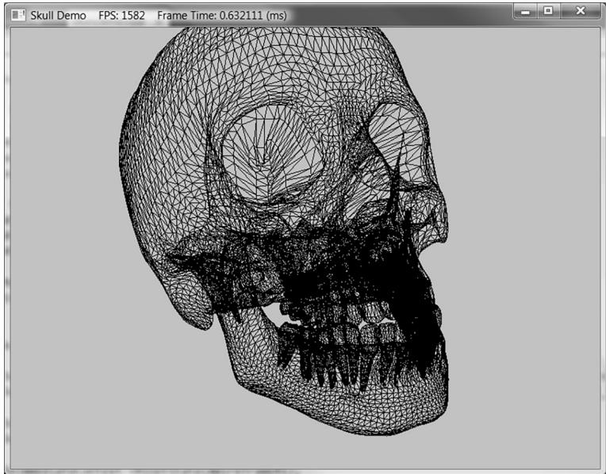


Figure 7.11. Example output from Exercise 4.


2. Modify the “Shapes” demo to use sixteen root constants to set the per-object world matrix instead of a descriptor table. 

3. Modify the “Shapes” demo to use descriptor tables instead of root constant buffers. 

4. In the downloadable materials, there a file called Models/Skull.txt. This file contains the vertex and index lists needed to render the skull in Figure 7.11. Study the file using a text editor like notepad, and modify the “Shapes” demo to load and render the skull mesh. 