# Chapter 8 Lighting
Consider Figure 8.1. On the left we have an unlit sphere, and on the right, we have a lit sphere. As you can see, the sphere on the left looks rather flat—maybe it is not even a sphere at all, but just a 2D circle! On the other hand, the sphere in the right does look 3D—the lighting and shading aid in our perception of the solid form and volume of the object. In fact, our visual perception of the world depends on light and its interaction with materials, and consequently, much of the problem of generating photorealistic scenes has to do with physically accurate lighting models. 

Of course, in general, the more accurate the model, the more computationally expensive it is; thus a balance must be reached between realism and speed. For example, 3D special FX scenes for films can be much more complex and utilize very realistic lighting models than a game because the frames for a film are 

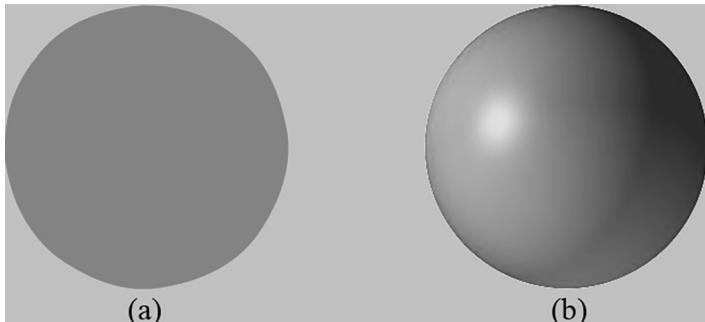


Figure 8.1. (a) An unlit sphere looks 2D. (b) A lit sphere looks 3D.


pre-rendered, so they can afford to take hours or days to process a frame. Games, on the other hand, are real-time applications, and therefore, the frames need to be drawn at a rate of at least 30 frames per second. 

Note that the lighting model explained and implemented in this book is largely based off the one described in [Möller08]. 

# Chapter Objectives:

1. To gain a basic understanding of the interaction between lights and materials 

2. To understand the differences between local illumination and global illumination 

3. To find out how we can mathematically describe the direction a point on a surface is “facing” so that we can determine the angle at which incoming light strikes the surface 

4. To learn how to correctly transform normal vectors 

5. To be able to distinguish between ambient, diffuse, and specular light 

6. To learn how to implement directional lights, point lights, and spotlights 

7. To understand how to vary light intensity as a function of depth by controlling attenuation parameters 

# 8.1 LIGHT AND MATERIAL INTERACTION

When using lighting, we no longer specify vertex colors directly; rather, we specify materials and lights, and then apply a lighting equation, which computes the vertex/pixel colors for us based on light/material interaction. This leads to a much more realistic coloring of the object (compare Figure $8 . 1 a$ and $8 . 1 b$ again). 

Materials can be thought of as the properties that determine how light interacts with a surface of an object. For example, the colors of light that a surface reflects and absorbs, as well as the reflectivity, transparency, and shininess, are all parameters that make up the material of the surface. In this chapter, however, we only concern ourselves with the colors of light a surface reflects and absorbs, and shininess. 

In our model, a light source can emit various intensities of red, green, and blue light; in this way, we can simulate many light colors. When light travels outwards from a source and collides with an object, some of that light may be absorbed and some may be reflected (for transparent objects, such as glass, some of the light passes through the medium, but we do not consider transparency here). The reflected light now travels along its new path and may strike other objects where some light is 

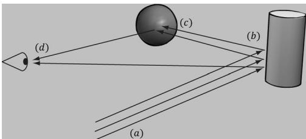


Figure 8.2. (a) Flux of incoming white light. (b) The light strikes the cylinder and some rays are absorbed and other rays are scatted toward the eye and sphere. (c) The light reflecting off the cylinder toward the sphere is absorbed or reflected again and travels into the eye. (d) The eye receives incoming light that determines what the eye sees.


again absorbed and reflected. A light ray may strike many objects before it is fully absorbed. Presumably, some light rays eventually travel into the eye (see Figure 8.2) and strike the light receptor cells (named cones and rods) on the retina. 

According to the trichromatic theory (see [Santrock03]), the retina contains three kinds of light receptors, each one sensitive to red, green, and blue light (with some overlap). The incoming RGB light stimulates its corresponding light receptors to varying intensities based on the strength of the light. As the light receptors are stimulated (or not), neural impulses are sent down the optic nerve toward the brain, where the brain generates an image in your head based on the stimulus of the light receptors. (Of course, if you close/cover your eyes, the receptor cells receive no stimulus and the brain registers this as black.) 

For example, consider Figure 8.2 again. Suppose that the material of the cylinder reflects $7 5 \%$ red light, $7 5 \%$ green light, and absorbs the rest, and the sphere reflects $2 5 \%$ red light and absorbs the rest. Also suppose that pure white light is being emitted from the light source. As the light rays strike the cylinder, all the blue light is absorbed and only $7 5 \%$ red and green light is reflected (i.e., a medium-high intensity yellow). This light is then scattered—some of it travels into the eye and some of it travels toward the sphere. The part that travels into the eye primarily stimulates the red and green cone cells to a semi-high degree; hence, the viewer sees the cylinder as a semi-bright shade of yellow. Now, the other light rays travel toward the sphere and strike it. The sphere reflects $2 5 \%$ red light and absorbs the rest; thus, the diluted incoming red light (medium-high intensity red) is diluted further and reflected, and all of the incoming green light is absorbed. This remaining red light then travels into the eye and primarily stimulates the red cone cells to a low degree. Thus the viewer sees the sphere as a dark shade of red. 

The lighting models we (and most real-time applications) adopt in this book are called local illumination models. With a local model, each object is lit independently of another object, and only the light directly emitted from light sources is taken into account in the lighting process (i.e., light that has bounced off other scene objects to strikes the object currently being lit is ignored). Figure 8.3 shows a consequence of this model. 

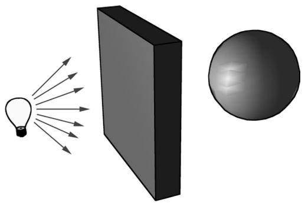


Figure 8.3. Physically, the wall blocks the light rays emitted by the light bulb and the sphere is in the shadow of the wall. However, in a local illumination model, the sphere is lit as if the wall were not there.


On the other hand, global illumination models light objects by taking into consideration not only the light directly emitted from light sources, but also the indirect light that has bounced off other objects in the scene. These are called global illumination models because they take everything in the global scene into consideration when lighting an object. Global illumination models are generally prohibitively expensive for real-time games (but come very close to generating photorealistic scenes). Finding realtime methods for approximating global illumination is an area of ongoing research; see, for example, voxel global illumination [http://on-demand. g putechconf.com/gtc/2014/presentations/S4552-rt-voxel-based-globalillumination-gpus.pdf]. Other popular methods are to precompute indirect lighting for static objects (e.g., walls, statues), and then use that result to approximate indirect lighting for dynamic objects (e.g., moving game characters). 

# 8.2 NORMAL VECTORS

A face normal is a unit vector that describes the direction a polygon is facing (i.e., it is orthogonal to all points on the polygon); see Figure 8.4a. A surface normal is a unit vector that is orthogonal to the tangent plane of a point on a surface; see Figure $8 . 4 b$ . Observe that surface normals determine the direction a point on a surface is “facing.” 

For lighting calculations, we need the surface normal at each point on the surface of a triangle mesh so that we can determine the angle at which light strikes the point on the mesh surface. To obtain surface normals, we specify the surface normals only at the vertex points (so-called vertex normals). Then, in order to obtain a surface normal approximation at each point on the surface of a triangle mesh, these vertex normals will be interpolated across the triangle during rasterization (recall §5.10.3 and see Figure 8.5). 

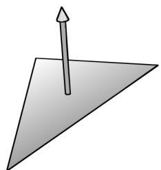


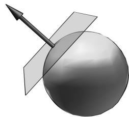


Figure 8.4. (a) The face normal is orthogonal to all points on the face. (b) The surface normal is the vector that is orthogonal to the tangent plane of a point on a surface.


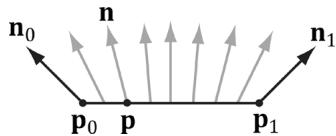


Figure 8.5. The vertex normals ${ \bf n } _ { 0 }$ and ${ \mathbf { n } } _ { 1 }$ are defined at the segment vertex points ${ \pmb P } _ { 0 }$ and $\pmb { \mathsf { P } } \tau$ . A normal vector n for a point p in the interior of the line segment is found by linearly interpolating (weighted average) between the vertex normals; that is, $\boldsymbol { \mathsf { n } } = \boldsymbol { \mathsf { n } } _ { 0 } + t \big ( \boldsymbol { \mathsf { n } } _ { 1 } - \boldsymbol { \mathsf { n } } _ { 0 } \big )$ , where t is such that $\pmb { \mathsf { p } } = \pmb { \mathsf { p } } _ { 0 } + t \bigl ( \pmb { \mathsf { p } } _ { 1 } - \pmb { \mathsf { p } } _ { 0 } \bigr )$ . Although we illustrated normal interpolation over a line segment for simplicity, the idea straightforwardly generalizes to interpolating over a 3D triangle.


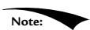


Interpolating the normal and doing lighting calculations per pixel is called pixel lighting or phong lighting. A less expensive, but less accurate, method is doing the lighting calculations per vertex. Then the result of the per vertex lighting calculation is output from the vertex shader and interpolated across the pixels of the triangle. Moving calculations from the pixel shader to the vertex shader is a common performance optimization at the sake of quality and sometimes the visual difference is very subtle making such optimizations very attractive. 

# 8.2.1 Computing Normal Vectors

To find the face normal of a triangle $\Delta { \bf p } _ { 0 } { \bf p } _ { 1 } { \bf p } _ { 2 }$ , we first compute two vectors that lie on the triangle’s edges: 

$$
\mathbf {u} = \mathbf {p} _ {1} - \mathbf {p} _ {0}
$$

$$
\mathbf {v} = \mathbf {p} _ {2} - \mathbf {p} _ {0}
$$

Then the face normal is: 

$$
\mathbf {n} = \frac {\mathbf {u} \times \mathbf {v}}{\left| \left| \mathbf {u} \times \mathbf {v} \right| \right|}
$$

Below is a function that computes the face normal of the front side (§5.10.2) of a triangle from the three vertex points of the triangle. 

```cpp
XMVECTOR ComputeNormal(FXMVECTOR p0, FXMVECTOR p1, FXMVECTOR p2)  
{ XMVECTOR u = p1 - p0; XMVECTOR v = p2 - p0; return XMVector3Normalize( XMVector3Cross(u,v)); } 
```

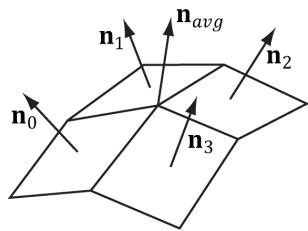


Figure 8.6. The middle vertex is shared by the neighboring four polygons, so we approximate the middle vertex normal by averaging the four polygon face normals.


For a differentiable surface, we can use calculus to find the normals of points on the surface. Unfortunately, a triangle mesh is not differentiable. The technique that is generally applied to triangle meshes is called vertex normal averaging. The vertex normal n for an arbitrary vertex v in a mesh is found by averaging the face normals of every polygon in the mesh that shares the vertex v. For example, in Figure 8.6, four polygons in the mesh share the vertex v; thus, the vertex normal for v is given by: 

$$
\mathbf {n} _ {\text {a v g}} = \frac {\mathbf {n} _ {0} + \mathbf {n} _ {1} + \mathbf {n} _ {2} + \mathbf {n} _ {3}}{\left| \left| \mathbf {n} _ {0} + \mathbf {n} _ {1} + \mathbf {n} _ {2} + \mathbf {n} _ {3} \right| \right|}
$$

In the above example, we do not need to divide by 4, as we would in a typical average, since we normalize the result. Note also that more sophisticated averaging schemes can be constructed; for example, a weighted average might be used where the weights are determined by the areas of the polygons (e.g., polygons with larger areas have more weight than polygons with smaller areas). 

The following pseudocode shows how this averaging can be implemented given the vertex and index list of a triangle mesh: 

```cpp
// Input:   
// 1. An array of vertices (mVertices). Each vertex has a   
// position component (pos) and a normal component (normal).   
// 2. An array of indices (mIndices).   
// For each triangle in the mesh:   
for (UINT i = 0; i < mNumTriangles; ++i)   
{ // indices of the ith triangle   
UINT i0 = mIndices[i*3+0];   
UINT i1 = mIndices[i*3+1];   
UINT i2 = mIndices[i*3+2];   
// vertices of ith triangle   
Vertex v0 = mVertices[i0];   
Vertex v1 = mVertices[i1];   
Vertex v2 = mVertices[i2];   
// compute face normal   
Vector3 e0 = v1(pos - v0(pos);   
Vector3 e1 = v2(pos - v0(pos);   
Vector3 faceNormal = Cross(e0, e1); 
```

```javascript
// This triangle shares the following three vertices,  
// so add this face normal into the average of these  
// vertex normals.  
mVertices[i0].normal += faceNormal;  
mVertices[i1].normal += faceNormal;  
mVertices[i2].normal += faceNormal;  
}  
// For each vertex v, we have summed the face normals of all  
// the triangles that share v, so now we just need to normalize.  
for (UINT i = 0; i < mNumVertices; ++i)  
mVertices[i].normal =Normalize(&mVertices[i].normal)); 
```

# 8.2.2 Transforming Normal Vectors

Consider Figure $8 . 7 a$ where we have a tangent vector $ { \mathbf { u } } =  { \mathbf { v } } _ { 1 } -  { \mathbf { v } } _ { 0 }$ orthogonal to a normal vector n. If we apply a non-uniform scaling transformation A, we see from Figure $8 . 7 b$ that the transformed tangent vector $\mathbf { u A } = \mathbf { v } _ { 1 } \mathbf { A } - \mathbf { v } _ { 0 } \mathbf { A }$ does not remain orthogonal to the transformed normal vector nA. 

So our problem is this: Given a transformation matrix A that transforms points and vectors (non-normal), we want to find a transformation matrix B that transforms normal vectors such that the transformed tangent vector is orthogonal to the transformed normal vector (i.e., $\mathbf { u A \cdot n B } = 0$ ). To do this, let us first start with something we know: we know that the normal vector n is orthogonal to the tangent vector u: 

<table><tr><td>u·n = 0</td><td>Tangent vector orthogonal to normal vector</td></tr><tr><td>unT = 0</td><td>Rewriting the dot product as a matrix multiplication</td></tr><tr><td>u(AA-1)nT = 0</td><td>Inserting the identity matrix I = AA-1</td></tr><tr><td>(uA)(A-1nT) = 0</td><td>Associative property of matrix multiplication</td></tr><tr><td>(uA)((A-1nT)T) = 0</td><td>Transpose property (A^T)T = A</td></tr><tr><td>(uA)(n(A-1)^T)T = 0</td><td>Transpose property (AB)^T = B^T A^T</td></tr><tr><td>uA·n(A-1)^T = 0</td><td>Rewriting the matrix multiplication as a dot product</td></tr><tr><td>uA·nB = 0</td><td>Transformed tangent vector orthogonal to transformed normal vector</td></tr></table>

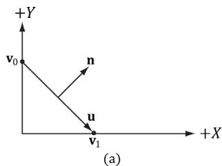


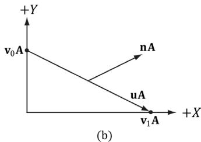


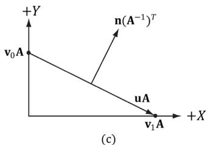


Figure 8.7. (a) The surface normal before transformation. (b) After scaling by 2 units on the $x$ -axis the normal is no longer orthogonal to the surface. (c) The surface normal correctly transformed by the inverse-transpose of the scaling transformation.


Thus $\mathbf { B } = ( \mathbf { A } ^ { - 1 } ) ^ { T }$ (the inverse transpose of A) does the job in transforming normal vectors so that they are perpendicular to its associated transformed tangent vector uA. 

Note that if the matrix is orthogonal $\boldsymbol { ( \mathbf { A } ^ { \textit { T } } = \mathbf { A } ^ { - 1 } }$ ), then $\mathbf { B } = ( \mathbf { A } ^ { - 1 } ) ^ { T } = ( \mathbf { A } ^ { T } ) ^ { T } = \mathbf { A }$ ; that is, we do not need to compute the inverse transpose, since A does the job in this case. In summary, when transforming a normal vector by a nonuniform or shear transformation, use the inverse-transpose. 

We implement a helper function in MathHelper.h for computing the inversetranspose: 

```objectivec
static XMMatrix InverseTranspose(CXMMatrix M)  
{  
    XMMatrix A = M;  
    A.r[3] = XMVectorSet(0.0f, 0.0f, 0.0f, 1.0f);  
    XMVECTOR det = XMMatrixDeterminant(A);  
    return XMMatrixTranspose(XMMatrixInverse(&det, A));  
} 
```

We clear out any translation from the matrix because we use the inverse-transpose to transform vectors, and translations only apply to points. However, from $\ S 3 . 2 . 1$ we know that setting $w = 0$ for vectors (using homogeneous coordinates) prevents vectors from being modified by translations. Therefore, we should not need to zero out the translation in the matrix. The problem is if we want to concatenate the inverse-transpose and another matrix that does not contain nonuniform scaling, say the view matrix ${ ( \mathbf { A } ^ { - 1 } ) ^ { T } } \mathbf { V }$ , the transposed translation in the fourth column of $( \mathbf { \dot { A } } ^ { - 1 } ) ^ { T }$ “leaks” into the product matrix causing errors. Hence, we zero out the translation as a precaution to avoid this error. The proper way would be to transform the normal by: $( ( \mathbf { A V } ) ^ { - 1 } ) ^ { T }$ . Below is an example of a scaling and translation matrix, and what the inverse-transpose looks like with a fourth column not $[ 0 , 0 , 0 , 1 ] ^ { T }$ : 

$$
\mathbf {A} = \left[ \begin{array}{c c c c} 1 & 0 & 0 & 0 \\ 0 & 0. 5 & 0 & 0 \\ 0 & 0 & 0. 5 & 0 \\ 1 & 1 & 1 & 1 \end{array} \right]
$$

$$
\left(\mathbf {A} ^ {- 1}\right) ^ {T} = \left[ \begin{array}{c c c c} 1 & 0 & 0 & - 1 \\ 0 & 2 & 0 & - 2 \\ 0 & 0 & 2 & - 2 \\ 0 & 0 & 0 & 1 \end{array} \right]
$$

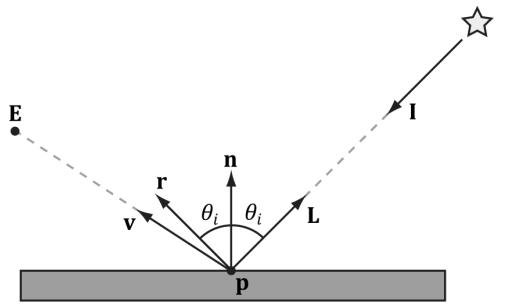


Figure 8.8. Important vectors involved in lighting calculations.


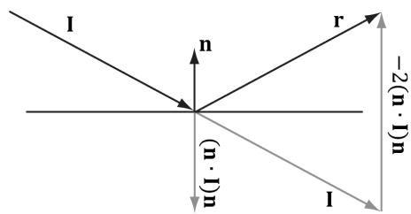


Figure 8.9. Geometry of reflection.


# 8.3 IMPORTANT VECTORS IN LIGHTING

In this section, we summarize some important vectors involved with lighting. Referring to Figure 8.8, E is the eye position, and we are considering the point p the eye sees along the line of site defined by the unit vector v. At the point p the surface has normal n, and the point is hit by a ray of light traveling with incident direction I. The light vector L is the unit vector that aims in the opposite direction of the light ray striking the surface point. Although it may be more intuitive to work with the direction the light travels I, for lighting calculations we work with the light vector L; in particular, for calculating Lambert’s Cosine Law, the vector L is used to evaluate $\mathbf { L } \cdot \mathbf { n } = \cos \theta _ { i }$ , where $\theta _ { i }$ is the angle between L and n. The reflection vector r is the reflection of the incident light vector about the surface normal n. The view vector (or to-eye vector) ${ \bf \nabla v } =$ normalize $\left( \mathbf { E } - \mathbf { p } \right)$ is the unit vector from the surface point p to the eye point E that defines the line of site from the eye to the point on the surface being seen. Sometimes we need to use the vector $- \mathbf { v }$ , which is the unit vector from the eye to the point on the surface we are evaluating the lighting of. 

The reflection vector is given by: $\mathbf { r } = \mathbf { I } - 2 ( \mathbf { n } \cdot \mathbf { I } ) \mathbf { n }$ ;  see Figure 8.9. (It is assumed that n is a unit vector.) However, we can actually use the HLSL intrinsic reflect function to compute r for us in a shader program. 

Observe that I, the incident vector, is the direction of the incoming light (i.e., opposite direction of the light vector L). 

# 8.4 LAMBERT’S COSINE LAW

We can think of light as a collection of photons traveling through space in a certain direction. Each photon carries some (light) energy. The amount of (light) energy emitted per second is called radiant flux. The density of radiant flux per area (called irradiance) is important because that will determine how much light an 

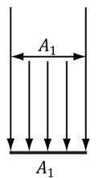


（a）


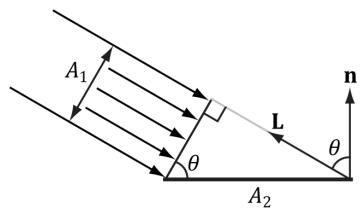


（b）


Figure 8.10. (a) A light beam with cross sectional area $A _ { 1 }$ strikes a surface head-on. (b) A light beam with cross sectional area $A _ { 1 }$ strikes a surface at an angle to cover a larger area $A _ { 2 }$ on the surface, thereby spreading the light energy over a larger area, thus making the light appear “dimmer.”


area on a surface receives (and thus how bright it will appear to the eye). Loosely, we can think of irradiance as the amount of light striking an area on a surface, or the amount of light passing through an imaginary area in space. 

Light that strikes a surface head-on (i.e., the light vector L equals the normal vector n) is more intense than light that glances a surface at an angle. Consider a small light beam with cross sectional area $A _ { 1 }$ with radiant flux $P$ passing through it. If we aim this light beam at a surface head-on (Figure 8.10a), then the light beam strikes the area $A _ { 1 }$ on the surface and the irradiance at $A _ { 1 }$ is $E _ { \mathrm { 1 } } = P / A _ { \mathrm 1 }$ . Now suppose we rotate the light beam so that it strikes the surface at an angle (Figure $8 . 1 0 b$ ), then the light beam covers the larger area $A _ { 2 }$ and the irradiance striking this area is $E _ { 2 } = P / A _ { 2 }$ .  By trigonometry, $A _ { 1 }$ and $A _ { 2 }$ are related by: 

$$
\cos \theta = \frac {A _ {1}}{A _ {2}} \Rightarrow \frac {1}{A _ {2}} = \frac {\cos \theta}{A _ {1}}
$$

Therefore, 

$$
E _ {2} = \frac {P}{A _ {2}} = \frac {P}{A _ {1}} \cos \theta = E _ {1} \cos \theta = E _ {1} (\mathbf {n} \cdot \mathbf {L})
$$

In other words, the irradiance striking area $A _ { 2 }$ is equal to the irradiance at the area $A _ { 1 }$ perpendicular to the light direction scaled by $\mathbf { n } \cdot \mathbf { L } = \cos \theta$ . This is called Lambert’s Cosine Law. To handle the case where light strikes the back of the surface (which results in the dot product being negative), we clamp the result with the max function: 

$$
f (\theta) = \max  (\cos \theta , 0) = \max  (\mathbf {L} \cdot \mathbf {n}, 0)
$$

Figure 8.11 shows a plot of $f ( \theta )$ to see how the intensity, ranging from 0.0 to 1.0 (i.e., $0 \%$ to $1 0 0 \%$ ), varies with $\theta$ . 

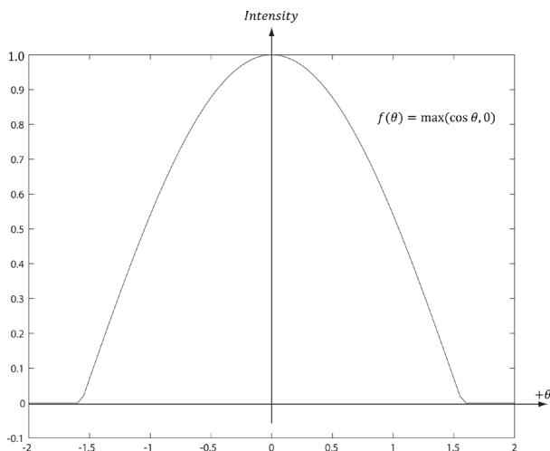


Figure 8.11. Plot of the function $f ( \theta ) = \mathsf { m a x } ( \mathsf { c o s } \ \theta , 0 ) = \mathsf { m a x } ( \mathsf { L } { \cdot } \mathsf { n } , 0 )$ for $- 2 \leq \theta \leq 2$ . Note that $\pi / 2 \approx 1 . 5 7$ .


# 8.5 DIFFUSE LIGHTING

Consider the surface of an opaque object, as in Figure 8.12. When light strikes a point on the surface, some of the light enters the interior of the object and interacts with the matter near the surface. The light will bounce around in the interior, where some of it will be absorbed and the remaining part scattered out of the surface in every direction; this is called a diffuse reflection. For simplification, we assume the light is scattered out at the same point the light entered. The amount of absorption and scattering out depends on the material; for example, wood, dirt, brick, tile, and stucco would absorb/scatter light differently (which is why the materials look different). In our approximation for modeling this kind of light/material interaction, we stipulate that the light scatters out equally in all directions above the surface; consequently, the reflected light will reach the eye no matter the viewpoint (eye 

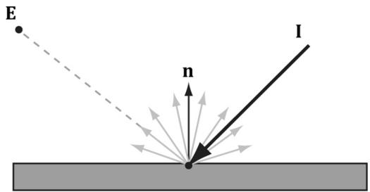


Figure 8.12. Incoming light scatters equally in every direction when striking a diffuse surface. The idea is that light enters the interior of the medium and scatters around under the surface. Some of the light will be absorbed and the remaining will scatter back out of the surface. Because it is difficult to model this subsurface scattering, we assume the re-emitted light scatters out equally in all directions above the surface about the point the light entered.


position). Therefore, we do not need to take the viewpoint into consideration (i.e., the diffuse lighting calculation is viewpoint independent), and the color of a point on the surface will always look the same no matter the viewpoint. 

We break the calculation of diffuse lighting into two parts. For the first part, we specify a light color and a diffuse albedo color. The diffuse albedo specifies the amount of incoming light that the surface reflects due to diffuse reflectance (by energy conservation, the amount not reflected is absorbed by the material). This is handled with a component-wise color multiplication (because light can be colored). For example, suppose some point on a surface reflects $5 0 \%$ incoming red light, $1 0 0 \%$ green light, and $7 5 \%$ blue light, and the incoming light color is $8 0 \%$ intensity white light. That is to say, the quantity of incoming light is given by $\mathbf { B } _ { L } = ( 0 . 8 , 0 . 8 , 0 . 8 )$ and the diffuse albedo is given by $\mathbf { m } _ { d } = ( 0 . 5 , 1 . 0 , 0 . 7 5 )$ ; then the amount of light reflected off the point is given by: 

$$
\mathbf {c} _ {d} = \mathbf {B} _ {L} \otimes \mathbf {m} _ {d} = (0. 8, 0. 8, 0. 8) \otimes (0. 5, 1. 0, 0. 7 5) = (0. 4, 0. 8, 0. 6)
$$

Note that the diffuse albedo components must be in the range 0.0 to 1.0 so that they describe the fraction of light reflected. 

The above formula is not quite correct, however. We still need to include Lambert’s cosine law (which controls how much of the original light the surface receives based on the angle between the surface normal and light vector). Let $\mathbf { B } _ { L }$ represent the quantity of incoming light, ${ \mathbf { m } } _ { d }$ be the diffuse albedo color, L be the light vector, and n be the surface normal. Then the amount of diffuse light reflected off a point is given by: 

$$
\mathbf {c} _ {d} = \max  (\mathbf {L} \cdot \mathbf {n}, 0) \cdot \mathbf {B} _ {L} \otimes \mathbf {m} _ {d} \tag {eq.8.1}
$$

# 8.6 AMBIENT LIGHTING

As stated earlier, our lighting model does not take into consideration indirect light that has bounced off other objects in the scenes. However, much light we see in the real world is indirect. For example, a hallway connected to a room might not be in the direct line of site with a light source in the room, but the light bounces off the walls in the room and some of it may make it into the hallway, thereby lightening it up a bit. As a second example, suppose we are sitting in a room with a teapot on a desk and there is one light source in the room. Only one side of the teapot is in the direct line of site of light source; nevertheless, the backside of the teapot would not be completely black. This is because some light scatters off the walls or other objects in the room and eventually strikes the backside of the teapot. 

To sort of hack this indirect light, we introduce an ambient term to the lighting equation: 

$$
\mathbf {c} _ {a} = \mathbf {A} _ {L} \otimes \mathbf {m} _ {d} \tag {eq.8.2}
$$

The color $\mathbf { A } _ { L }$ specifies the total amount of indirect (ambient) light a surface receives, which may be different than the light emitted from the source due to the absorption that occurred when the light bounced off other surfaces. The diffuse albedo ${ \mathbf { m } } _ { d }$ specifies the amount of incoming light that the surface reflects due to diffuse reflectance. We use the same value for specifying the amount of incoming ambient light the surface reflects; that is, for ambient lighting, we are modeling the diffuse reflectance of the indirect (ambient) light. All ambient light does is uniformly brighten up the object a bit—there is no real physics calculation at all. The idea is that the indirect light has scattered and bounced around the scene so many times that it strikes the object equally in every direction. 

# 8.7 SPECULAR LIGHTING

We used diffuse lighting to model diffuse reflection, where light enters a medium, bounces around, some light is absorbed, and the remaining light is scattered out of the medium in every direction. A second kind of reflection happens due to the Fresnel effect, which is a physical phenomenon. When light reaches the interface between two media with different indices of refraction some of the light is reflected and the remaining light is refracted (see Figure 8.13). The index of refraction is a physical property of a medium that is the ratio of the speed of light in a vacuum to the speed of light in the given medium. We refer to this light reflection process as specular reflection and the reflected light as specular light. Specular light is illustrated in Figure 8.14a. 

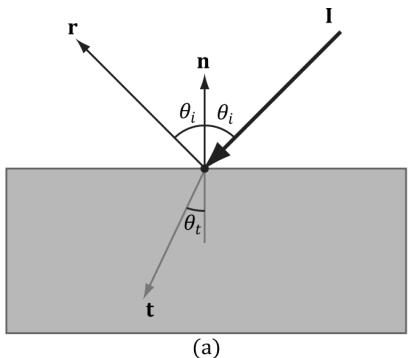


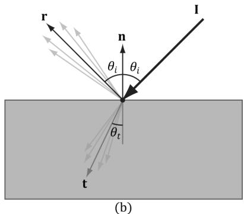


Figure 8.13. (a) The Fresnel effect for a perfectly flat mirror with normal n. The incident light I is split where some of it reflects in the reflection direction r and the remaining light refracts into the medium in the refraction direction t. All these vectors are in the same plane. The angle between the reflection vector and normal is always $\theta _ { i }$ , which is the same as the angle between the light vector ${ \bf L } = - { \bf I }$ and normal n. The angle $\theta _ { t }$ between the refraction vector and -n depends in the indices of refraction between the two mediums and is specified by Snell’s Law. (b) Most objects are not perfectly flat mirrors but have microscopic roughness. This causes the reflected and refracted light to spread about the reflection and refraction vectors.


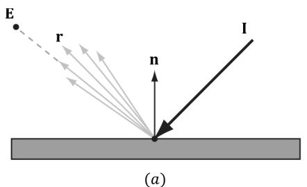


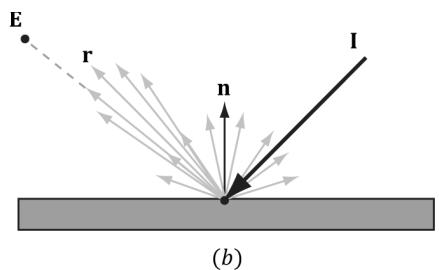


Figure 8.14. (a) Specular light of a rough surface spreads about the reflection vector r. (b) The reflected light that makes it into the eye is a combination of specular reflection and diffuse reflection.


If the refracted vector exits the medium (from the other side) and enters the eye, the object appears transparent. That is, light passes through transparent objects. Real-time graphics typically use alpha blending or a post process effect to approximate refraction in transparent objects, which we will explain later in this book. For now, we consider only opaque objects. 

For opaque objects, the refracted light enters the medium and undergoes diffuse reflectance. So we can see from Figure $8 . 1 4 b$ that for opaque objects, the amount of light that reflects off a surface and makes it into the eye is a combination of body reflected (diffuse) light and specular reflection. In contrast to diffuse light, specular light might not travel into the eye because it reflects in a specific direction; that is to say, the specular lighting calculation is viewpoint dependent. This means that as the eye moves about the scene, the amount of specular light it receives will change. 

# 8.7.1 Fresnel Effect

Let us consider a flat surface with normal n that separates two mediums with different indices of refraction. Due to the index of refraction discontinuity at the surface, when incoming light strikes the surface some reflects away from the surface and some refracts into the surface (see Figure 8.13). The Fresnel equations mathematically describe the percentage of incoming light that is reflected, $0 \leq { \bf R } _ { F } \leq 1$ .  By conservation of energy, if ${ \bf R } _ { F }$ is the amount of reflected light then $( 1 - { \bf R } _ { F } )$ is the amount of refracted light. The value $\mathbf { R } _ { F }$ is an RGB vector because the amount of reflection depends on the light color. 

How much light is reflected depends on the medium (some materials will be more reflective than others) and also on the angle $\theta _ { i }$ between the normal vector n and light vector L. Due to their complexity, the full Fresnel equations are not typically used in real-time rendering; instead, the Schlick approximation is used: 

$$
\mathbf {R} _ {F} (\theta_ {i}) = \mathbf {R} _ {F} (0 ^ {\circ}) + (1 - \mathbf {R} _ {F} (0 ^ {\circ})) (1 - \cos \theta_ {i}) ^ {5}
$$

${ \bf R } _ { F } ( 0 ^ { \circ } )$ is a property of the medium; below are some values for common materials [Möller08]: 

<table><tr><td>Medium</td><td>RF(0°)</td></tr><tr><td>Water</td><td>(0.02, 0.02, 0.02)</td></tr><tr><td>Glass</td><td>(0.08, 0.08, 0.08)</td></tr><tr><td>Plastic</td><td>(0.05, 0.05, 0.05)</td></tr><tr><td>Gold</td><td>(1.0, 0.71, 0.29)</td></tr><tr><td>Silver</td><td>(0.95, 0.93, 0.88)</td></tr><tr><td>Copper</td><td>(0.95, 0.64, 0.54)</td></tr></table>

Figure 8.15 shows a plot of the Schlick approximation for a couple different ${ \bf R } _ { F } ( 0 ^ { \circ } )$ . The key observation is that the amount of reflection increases as $\theta _ { i } \to 9 0 ^ { \circ }$ . Let us look at a real-world example. Consider Figure 8.16. Suppose we are standing a couple feet deep in a calm pond of relatively clear water. If we look down, we mostly see the bottom sand and rocks of the pond. This is because the light coming down from the environment that reflects into our eye forms a small angle $\theta _ { i }$ near $0 . 0 ^ { \circ }$ ; thus, the amount of reflection is low, and, by energy conservation, the amount of refraction high. On the other hand, if we look towards the horizon, we will see a strong reflection in the pond water. This is because the light coming down from the environment that makes it into our eye forms an angle $\theta _ { i }$ closer to $9 0 . 0 ^ { \circ }$ , thus increasing the amount of reflection. This behavior is often referred to as the Fresnel effect. To summarize the Fresnel effect briefly: the amount of reflected light depends on the material $( \mathbf { R } _ { F } ( 0 ^ { \circ } ) )$ and the angle between the normal and light vector. 

Metals absorb transmitted light [Möller08], which means they will not have body reflectance. Metals do not appear black, however, as they have high ${ \bf R } _ { F } ( 0 ^ { \circ } )$ 

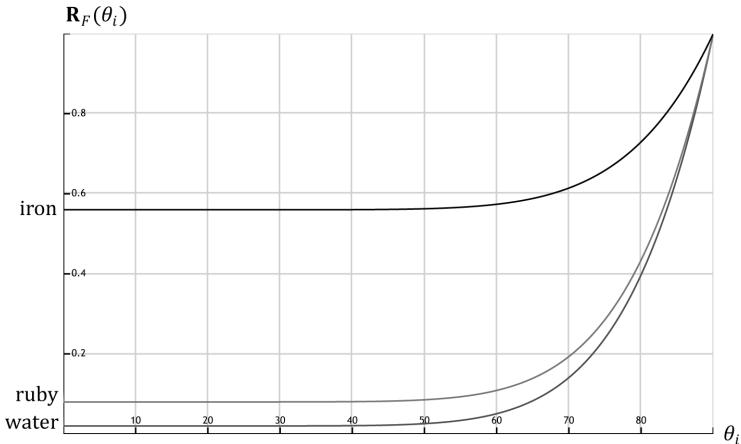


Figure 8.15. The Schlick approximation plotted for different materials: water, ruby, and iron.


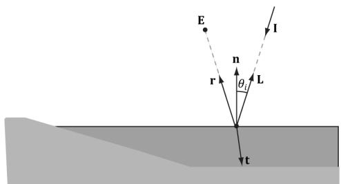


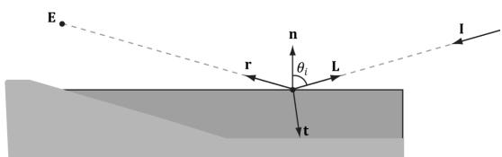


Figure 8.16. (a): Looking down in the pond, reflection is low and refraction high because the angle between L and n is small. (b) Look towards the horizon and reflection is high and refraction low because the angle between L and n is closer to $9 0 ^ { \circ }$ .


values which means they reflect a fair amount of specular light even at small incident angles near $0 ^ { \circ }$ . 

# 8.7.2 Roughness

Reflective objects in the real world tend not to be perfect mirrors. Even if an object’s surface appears flat, at the microscopic level we can think of it as having roughness. Referring to Figure 8.17, we can think of a perfect mirror as having no roughness and its micro-normals all aim in the same direction as the macro-normal. As the roughness increases, the direction of the micro-normals diverge from the macronormal, causing the reflected light to spread out into a specular lobe. 

To model roughness mathematically, we employ the microfacet model, where we model the microscopic surface as a collection of tiny flat elements called microfacets; the micro-normals are the normals to the microfacets. For a given view v and light vector L, we want to know the fraction of microfacets that reflect L into v; in other words, the fraction of microfacets with normal $\mathbf { h } =$ normalize $\mathbf { \tau } ( \mathbf { L } + \mathbf { v } )$ ; see Figure 8.18. This will tell us how much light is reflected 

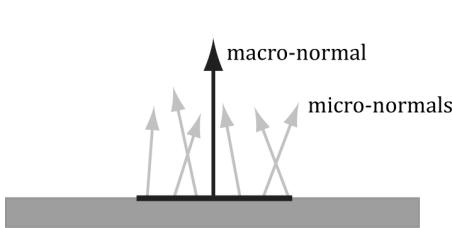


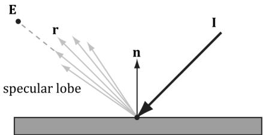


Figure 8.17. (a) The black horizontal bar represents the magnification of a small surface element. At the microscopic level, the area has many micro-normals that aim in different directions due to roughness at the microscopic level. The smoother the surface, the more aligned the micro-normals will be with the macro-normal; the rougher the surface, the more the micro-normals will diverge from the macro-normal. (b) This roughness causes the specular reflected light to spread out. The shape of the of the specular reflection is referred to as the specular lobe. In general, the shape of the specular lobe can vary based on the type of surface material being modeled.


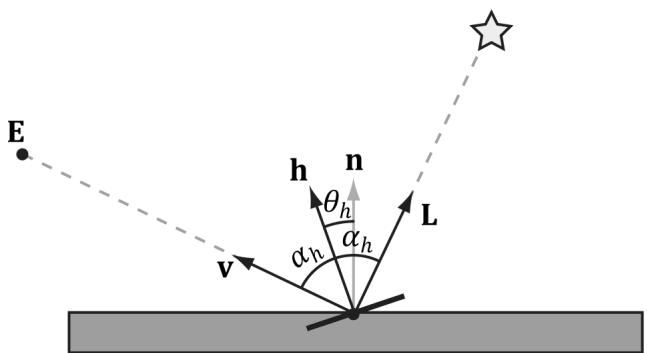


Figure 8.18. The microfacets with normal h reflect L into v.


into the eye from specular reflection—the more microfacets that reflect $\mathbf { L }$ into v the brighter the specular light the eye sees. 

The vector h is called the halfway vector as it lies halfway between $\mathbf { L }$ and v. Moreover, let us also introduce the angle $\theta _ { h }$ between the halfway vector $\mathbf { h }$ and the macro-normal n. 

We define the normalized distribution function $\rho ( \theta _ { h } ) \in [ 0 , 1 ]$ to denote the fraction of microfacets with normals h that make an angle $\theta _ { h }$ with the macronormal n. Intuitively, we expect that $\rho (  { \boldsymbol { \theta } } _ { h } )$ achieves its maximum when $\theta _ { h } = 0 ^ { \circ }$ . That is, we expect the microfacet normals to be biased towards the macronormal, and as $\theta _ { h }$ increases (as h diverges from the micro-normal n) we expect the fraction of microfacets with normal h to decrease. A popular controllable function to model $\rho (  { \boldsymbol { \theta } } _ { h } )$ that has the expectations just discussed is: 

$$
\begin{array}{l} \rho \left(\theta_ {h}\right) = \cos^ {m} \left(\theta_ {h}\right) \\ = \cos^ {m} (\mathbf {n} \cdot \mathbf {h}) \\ \end{array}
$$

Note that $\cos ( \theta _ { h } ) = \mathbf { n } \cdot \mathbf { h }$ provided both vectors and unit length. Figure 8.19 shows $\rho ( \theta _ { h } ) = \cos ^ { m } ( \theta _ { h } )$ for various m . Here m controls the roughness, which specifies the fraction of microfacets with normals h that make an angle $\theta _ { h }$ with the macro-normal n. As m decreases, the surface becomes rougher, and the microfacet normals increasingly diverge from the macro-normal. As m increases, the surface becomes smoother, and the microfacet normals increasingly converge to the macro-normal. 

We can combine $\rho (  { \boldsymbol { \theta } } _ { h } )$ with a normalization factor to obtain a new function that models the amount of specular reflection of light based on roughness: 

$$
\begin{array}{l} S \left(\theta_ {h}\right) = \frac {m + 8}{8} \cos^ {m} \left(\theta_ {h}\right) \\ = \frac {m + 8}{8} (\mathbf {n} \cdot \mathbf {h}) ^ {m} \\ \end{array}
$$

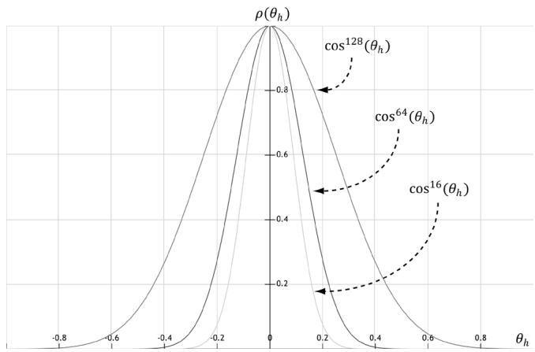


Figure 8.19. A function to model roughness.


Figure 8.20 shows this function for various m. Like before, m controls the roughness, but we have added the $\textstyle { \frac { m + 8 } { 8 } }$ normalization factor so that light energy is conserved; it is essentially controlling the height of the curve in Figure 8.20 so that the overall light energy is conserved as the specular lobe widens or narrows with m. For a smaller m, the surface is rougher and the specular lobe widens as light energy is more spread out; therefore, we expect the specular highlight to be dimmer since the energy has been spread out. On the other hand, for a larger m, the surface is smoother and the specular lobe is narrower; therefore, we expect the specular highlight to be brighter since the energy has been concentrated. Geometrically, m controls the spread of the specular lobe. To model smooth surfaces (like polished metal) you will use a large m, and for rougher surfaces you will use a small m. 

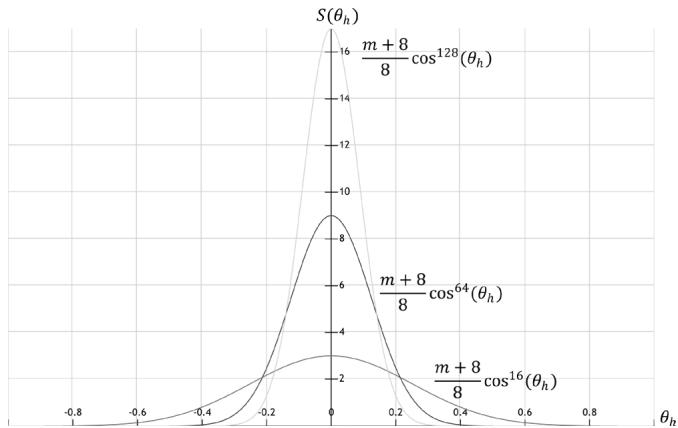


Figure 8.20. A function to model specular reflection of light due to roughness.


To conclude this section, let us combine Fresnel reflection and surface roughness. We are trying to compute how much light is reflected into the view direction v (see Figure 8.18). Recall that microfacets with normals h reflect light into v. Let $\alpha _ { h }$ be the angle between the light vector and half vector h, then ${ \bf R } _ { F } ( \alpha _ { h } )$ tells us the amount of light reflected about $\mathbf { h }$ into v due to the Fresnel effect. Multiplying the amount of reflected light ${ \bf R } _ { F } ( \alpha _ { h } )$ due to the Fresnel effect with the amount of light reflected due to roughness $S ( \theta _ { h } )$ gives us the amount of specular reflected light: Let $( \mathrm { m a x } ( \mathbf { L } \cdot \mathbf { n } , 0 ) \cdot \mathbf { B } _ { L } )$ represent the quantity of incoming light that strikes the surface point we are lighting, then the fraction of $( \mathrm { m a x } ( \mathbf { L } \cdot \mathbf { n } , 0 ) \cdot \mathbf { B } _ { { L } } )$ specularly reflected into the eye due to roughness and the Fresnel effect is given by: 

$$
\mathbf {c} _ {s} = \max  (\mathbf {L} \cdot \mathbf {n}, 0) \cdot \mathbf {B} _ {L} \otimes \mathbf {R} _ {F} \left(\alpha_ {h}\right) \frac {m + 8}{8} (\mathbf {n} \cdot \mathbf {h}) ^ {m} \tag {eq.8.3}
$$

Observe that if $\mathbf { L } \cdot \mathbf { n } \leq 0$ the light strikes the back of the surface we are computing; hence the front-side surface receives no light. 

# 8.8 LIGHTING MODEL RECAP

Bringing everything together, the total light reflected off a surface is a sum of ambient light reflectance, diffuse light reflectance and specular light reflectance: 

1. Ambient Light $\mathbf { c } _ { a }$ : Models the amount of light reflected off the surface due to indirect light. 

2. Diffuse Light $\mathbf { c } _ { d }$ : Models light that enters the interior of a medium, scatters around under the surface where some of the light is absorbed and the remaining light scatters back out of the surface. Because it is difficult to model this subsurface scattering, we assume the re-emitted light scatters out equally in all directions above the surface about the point the light entered. 

3. Specular Light $\mathbf { c } _ { s }$ : Models the light that is reflected off the surface due to the Fresnel effect and surface roughness. 

This leads to the lighting equation our shaders implement in this book: 

$$
\begin{array}{l} L i t C o l o r = \mathbf {c} _ {a} + \mathbf {c} _ {d} + \mathbf {c} _ {s} \\ = \mathbf {A} _ {L} \otimes \mathbf {m} _ {d} + \max  (\mathbf {L} \cdot \mathbf {n}, 0) \cdot \mathbf {B} _ {L} \otimes \left(\mathbf {m} _ {d} + \mathbf {R} _ {F} \left(\alpha_ {h}\right) \frac {m + 8}{8} (\mathbf {n} \cdot \mathbf {h}) ^ {m}\right) \quad (\text {e q . 8 . 4}) \\ \end{array}
$$

All of the vectors in this equation are assumed to be unit length. 

1. L: The light vector aims toward the light source. 

2. n: The surface normal. 

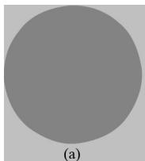


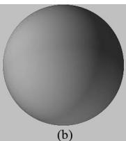


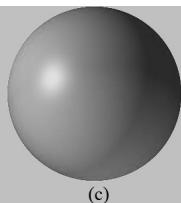


Figure 8.21. (a) Sphere colored with ambient light only, which uniformly brightens it. (b) Ambient and diffuse lighting combined. There is now a smooth transition from bright to dark due to Lambert’s cosine law. (c) Ambient, diffuse, and specular lighting. The specular lighting yields a specular highlight.


3. h: The halfway vector lies halfway between the light vector and view vector (vector from surface point being lit to the eye point). 

4. $\mathbf { A } _ { L }$ : Represent the quantity of incoming ambient light. 

5. $\mathbf { B } _ { L }$ : Represent the quantity of direct light that is diffusely and specularly reflected. 

6. $\mathbf { m } _ { d }$ : Specifies the amount of incoming diffuse light that the surface reflects due to diffuse reflectance. 

7. L⋅n: Lambert’s Cosine Law. 

8. $\alpha _ { h }$ : Angle between the half vector h and light vector L. 

9. ${ \bf R } _ { F } ( \alpha _ { h } )$ : Specifies the amount of light reflected about h into the eye due to the Fresnel effect. 

10. m: Controls the surface roughness. 

11. $( { \mathbf { n } } { \cdot } \mathbf { h } ) ^ { m }$ : Specifies the fraction of microfacets with normals h that make an angle $\theta _ { h }$ with the macro-normal n. 

12. $\textstyle { \frac { m + 8 } { 8 } }$ : Normalization factor to model energy conservation in the specular reflection. 


Figure 8.21 shows how these three components work together.


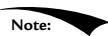


Equation 4 is a common and popular lighting equation, but it is just a model. Other lighting models have been proposed as well. 

# 8.9 IMPLEMENTING MATERIALS

In this section, we first show a way of sharing code between $\mathrm { C } { + + }$ and shader programs. We then discuss how we represent a material in this book in code. Finally, we show how we store are materials in an accessible way to shader programs. 

# 8.9.1 Shared Resources

Before we look at how we implement materials in this book, let us take a quick detour to see how we can share code between $\mathrm { C } { + + }$ and shader programs. In the demos from the previous chapter, we had $\mathrm { C } { + } { + }$ and HLSL code that were essentially mirrors of each other: 

```cpp
// C++
struct ObjectConstants
{
    DirectX::XMFLOAT4X4 World = MathHelper::Identity4x4();
};
struct PassConstants
{
    DirectX::XMFLOAT4X4 ViewProj = MathHelper::Identity4x4();
};
// HLSL cbuffer cbPerObject : register(b0)
{
    float4x4 gWorld;
};
cbuffer cbPerPass : register(b1)
{
    float4x4 gViewProj;
}; 
```

It is common to have structures, macros, and functions that we want to be shared between $\mathrm { C } { + + }$ and shader programs. Often the code is simple, like structures of data that we need to initialize on the $\mathrm { C } { + + }$ side and the data is consumed on the GPU in a shader. We might also have macros that we want to keep in sync between the $\mathrm { C } { + + }$ code and shader code, for example: 

```c
define NUM_RAY_TYPES2   
#define COLOR_RAY_TYPE0   
#define SHADOW_RAY_TYPE1 
```

So how can we avoid duplicating the code? We can define a header file Shaders/ SharedTypes.h that is included by both $\mathrm { C } { + + }$ code and shader code. We use macros to redefine some types based on whether we are compiling $\mathrm { C } { + } { + }$ code or shader code: 

```c
if HLSL_CODE
    #define DEFINE_CBUFFER(Name, Reg) cbuffer Name : register(Reg)
#elif __cplusplus
    #pragma once 
```

```cpp
include <cstdint> #include <DirectXMath.h> #define DEFINE_CBUFFER(Name, Reg) struct Name #define uint uint32_t #define uint2 DirectX::XMUINT2 #define uint3 DirectX::XMUINT3 #define uint4 DirectX::XMUINT4 #define int2 DirectX::XMINT2 #define int3 DirectX::XMINT3 #define int4 DirectX::XMINT4 #define float2 DirectX::XMFLOAT2 #define float3 DirectX::XMFLOAT3 #define float4 DirectX::XMFLOAT4 #define float4x4 DirectX::XMFLOAT4x4 #endif 
```


This allows us to write code like:


```cpp
struct MaterialData
{
    float4 DiffuseAlbedo;
    float3 FresnelR0;
    float Roughness;
    float DisplacementScale;
    uint DiffuseMapIndex;
    uint NormalMapIndex;
    uint GlossHeightAoMapIndex;
    // Used in texture mapping.
    float4x4 MatTransform;
    // Used in ray tracing demos only.
    float TransparencyWeight;
    float IndexOfRefraction;
}; 
```

that can be used in $\mathrm { C } { + + }$ code and HLSL code. For $\mathrm { C } { + + }$ , the vector and matrix types become the DirectX Math types. Also note that the way DEFINE_CBUFFER is defined allows us to write code that evaluates to a struct in $\mathrm { C } { + + }$ , but evaluates to the corresponding constant buffer in HLSL: 

```cpp
DEFINE_CBUFFER(PerObjectCB，b0)   
{ float4x4 gWorld; float4x4 gTexTransform; uint gMaterialIndex; float3 gMiscFloat3;   
}； 
```

```c
// In C++ expands to:  
struct PerObjectCB  
{ DirectX::XMFLOAT4X4 gWorld; DirectX::XMFLOAT4X4 gTexTransform;uint32_t gMaterialIndex; DirectX::XMFLOAT3 gMiscFloat3;}  
// In HLSL expands to:  
cbuffer PerObjectCB : register(b0)  
{float4x4 gWorld;float4x4 gTexTransform;uint gMaterialIndex;float3 gMiscFloat3;} 
```

Before including SharedTypes. $h$ in a shader (HLSL) file, we need to #define HLSL_ CODE 1 so that it knows we are compiling a shader: 

```c
// Must define HLSL_CODE 1 before #include "SharedTypess.h" in // HLSL code.   
#define HLSL_CODE 1   
#include "SharedTypes.h" 
```

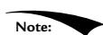


The same SharedTypes.h file is used for all the demos in this book. Therefore, it contains some structures and macros that pertain to demos in later chapters. We will discuss new relevant parts of SharedTypes.h as needed throughout the book. 

# 8.9.2 Material Data

Our material structure looks like this and is defined in d3dUtil.h: 

```cpp
struct Material
{
    // Unique material name for lookup.
    std::string Name;
    // Index into material buffer.
    int MatIndex = -1;
    // For bindless texturing.
    int AlbedoBindlessIndex = -1;
    int NormalBindlessIndex = -1;
    int GlossHeightAoBindlessIndex = -1;
    // Dirty flag indicating the material has changed and we need to update the buffer. Because we have a material buffer for each 
```

```cpp
// FrameResource, we have to apply the update to each
// FrameResource. Thus, when we modify a material
// we should set NumFramesDirty = gNumFrameResources
// so that each frame resource gets the update.
int NumFramesDirty = gNumFrameResources;
// Material constant buffer data used for shading.
DirectX::XMFLOAT4 DiffuseAlbedo = { 1.0f, 1.0f, 1.0f, 1.0f };
DirectX::XMFLOAT3 FresnelR0 = { 0.01f, 0.01f, 0.01f };
float Roughness = .25f;
// Used in advanced texturing displacement mapping.
float DisplacementScale = 1.0f;
// Used in texturing.
DirectX::XMFLOAT4X4 MatTransform = MathHelper::Identity4x4();
// Used in ray tracing demos only.
float TransparencyWeight = 0.0f;
float IndexOfRefraction = 0.0f;
}; 
```

Modeling real-world materials will require a combination of setting realistic values for the DiffuseAlbedo and FresnelR0, and some artistic tweaking. For example, metal conductors absorb refracted light [Möller08] that enters the interior of the metal, which means metals will not have diffuse reflection (i.e., the DiffuseAlbedo would be zero). However, to compensate for the fact that we are not doing $1 0 0 \%$ physical simulation of lighting, it may give better artistic results to give a low DiffuseAlbedo value rather than zero. The point is: we will try to use physically realistic material values but are free to tweak the values as we want if the end result looks better from an artistic point of view. 

In our material structure, roughness is specified in a normalized floating-point value in the [0, 1] range. A roughness of 0 would indicate a perfectly smooth surface, and a roughness of 1 would indicate the roughest surface physically possible. The normalized range makes it easier to author roughness and compare the roughness between different materials. For example, a material with a roughness of 0.6 is twice as rough as a material with roughness 0.3. In the shader code, we will use the roughness to derive the exponent m used in Equation 8.4. Note that with our definition of roughness, the shininess of a surface is just the inverse of the roughness: shininess r = −1 0 oughness ∈[ , 1]. 

A question now is at what granularity we should specify the material values? The material values may vary over the surface; that is, different points on the surface may have different material values. For example, consider a car model as shown in Figure 8.22, where the frame, windows, lights, and tires reflect and absorb light differently, and so the material values would need to vary over the car surface. 

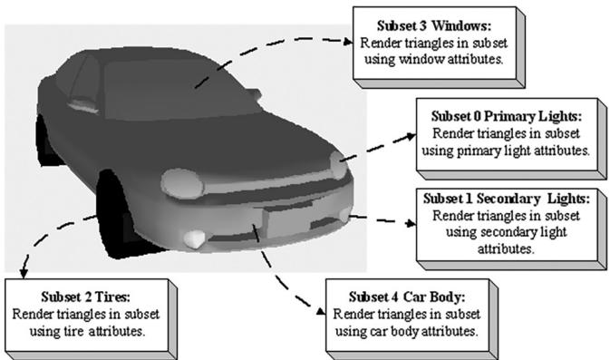


Figure 8.22. A car mesh divided into five material attribute groups.


To implement this variation, one solution might be to specify material values on a per vertex basis. These per vertex materials would then be interpolated across the triangle during rasterization, giving us material values for each point on the surface of the triangle mesh. However, as we saw from the “Waves” demo in Chapter 7, per vertex colors are still too coarse to realistically model fine details. Moreover, per vertex colors add additional data to our vertex structures, and we need to have tools to paint per vertex colors. Instead, the prevalent solution is to use texture mapping (Chapter 9). For this chapter, we allow material changes at the draw call frequency. To do this, we define the properties of each unique material and put them in a table: 

std::unordered_map<std::string, std::unique_ptr<Material>> mMaterials;   
void LitWavesApp::BuildMaterials()   
{ int matIndex $= 0$ .   
auto AddMaterial $\equiv$ [&matIndex,this] ( const std::string& name, const XMFLOAT4& diffuse, const XMFLOAT3& fresnel, float roughness)   
{ auto mat $=$ std::make_unique<Material>(); mat->Name $\equiv$ name; mat->MatIndex $\equiv$ matIndex; mat->DiffuseAlbedo $\equiv$ diffuse; mat->FresnelR0 $\equiv$ fresnel; mat->Roughness $\equiv$ roughness; // Ignore material properties that do not apply to this demo. mMaterials[name] $=$ std::move(mat); 

$\mathbf{++matIndex}$ }；  
AddMaterial("forestGreen",XMFLOAT4(Colors::ForestGreen)，XMFLOAT3(0.02f，0.02f，0.02f)，0.1f);  
AddMaterial("steelBlue",XMFLOAT4(Colors::SteelBlue)，XMFLOAT3(0.05f，0.05f，0.05f)，0.3f);  
AddMaterial("lightGray",XMFLOAT4(Colors::LightGray)，XMFLOAT3(0.02f，0.02f，0.02f)，0.2f);  
AddMaterial("skullMat",XMFLOAT4(1.0f，1.0f，1.0f，1.0f)，XMFLOAT3(0.05f，0.05f，0.05f)，0.3f);  
AddMaterial("lakeBlue",XMFLOAT4(0.2f，0.2f，0.8f，1.0f)，XMFLOAT3(0.05f，0.05f，0.05f），0.3f); 

Note how each material stores its index; this will be used when the material collection is flattened out into an array. The above table stores the material data in system memory. For the GPU to access the material data in a shader, we need to mirror the relevant data in a buffer. Similar to the per-pass constant buffer, we add a buffer of materials to each FrameResource: 

```cpp
// Defined in SharedTypes.h   
struct MaterialData   
{ float4 DiffuseAlbedo; float3 FresnelR0; float Roughness; float DisplacementScale; uint DiffuseMapIndex; uint NormalMapIndex; uint GlossHeightAoMapIndex; // Used in texture mapping. float4x4 MatTransform; // Used in ray tracing demos only. float TransparencyWeight; float IndexOfRefraction; }； 
```

```cpp
struct FrameResource {
public:
    ...
        std::unique_ptr<UploadBuffer<MaterialData>> MaterialBuffer = nullptr;
    ...
} ;
FrameResource::FrameResource(ID3D12Device* device,
    UINT passCount, UINT materialCount)
{
    ThrowIfFailed(device->CreateCommandAllocator(
        D3D12_COMMAND_LIST_TYPE_DIRECT,
        IID_PPV_args(CmdListAlloc.GetAddressOf());
    );
    PassCB = std::make_unique<UploadBuffer<PerPassCB>>(device, passCount, true);
    MaterialBuffer = std::make_unique<UploadBuffer<MaterialData>>(device, materialCount, false);
} 
```

The MaterialData structure contains a subset of the Material data; specifically, it contains just the data the shaders need for rendering. 

Note that the MaterialBuffer is a regular structured buffer, not a constant buffer. We could have used a constant buffer and set the material constants for each object like we do for per-object constant data. However, for more advanced effects it is convenient to have all the scene materials available in a shader in one large buffer and to just index into the buffer in the shader. To facilitate this, we add a Material* to our RenderItem structure, and when we go to create a render item, we also specify the material of the render item. Note that multiple render items can refer to the same Material object; for example, multiple render items might use the same “brick” material. 

```cpp
struct RenderItem
{
    [...]
    Material* Mat = nullptr;
    [...];
};
void LitWavesApp::AddRenderItem(RenderLayer layer, const DirectX::XM FLOAT4X4& world, Material* mat, MeshGeometry* geo, SubmeshGeometry& drawArgs)
{
    auto ritem = std::make_unique<RenderItem>();
    [...]
    ritem->Mat = mat;
    [...]; 
```

mRItemLayer[(int)layer].push_back(ritem.get()); mAllRItems.push_back(std::move(ritem));   
}   
void LitWavesApp::BuildRenderItems() { XMFLOAT4X4 worldTransform $=$ MathHelper::Identity4x4(); AddRenderItem( RenderLayer::Opaque, worldTransform, mMaterials["lakeBlue"].get(), mGeometries["waterGeo"].get(), mGeometries["waterGeo"]->DrawArgs["grid"]); mWavesRItem $=$ mLAllRItems.back().get(); AddRenderItem( RenderLayer::Opaque, worldTransform, mMaterials["forestGreen"].get(), mGeometries["landGeo"].get(), mGeometries["landGeo"]->DrawArgs["grid"]);   
} 


Then we add a material index value to the per-object constants, and we set it every frame like so:


```cpp
DEFINE_CBUFFER(PerObjectCB, b0)   
{ float4x4 gWorld; float4x4 gTexTransform; // used in texturing uint gMaterialIndex; uint PerObjectCB_pad0; uint PerObjectCB_pad1; uint PerObjectCB_pad2; };   
void LitWavesApp::UpdatePerObjectCB(const GameTimer& gt) { forauto& ri : mAllRItems) { XMStoreFloat4x4(&ri->ObjectConstants.gWorld, XMMatrixTranspose(XMLoadFloat4x4(&ri->World)); XMStoreFloat4x4(&ri->ObjectConstants.gTexTransform, XMMatrixTranspose(XMLoadFloat4x4(&ri->TexTransform)); ri->ObjectConstants.gMaterialIndex = ri->Mat->MatIndex; // Need to hold handle until we submit work to GPU. ri->MemHandleToObjectCB = mLinearAllocator->AllocateConstant(ri->ObjectConstants); } 
```

Because multiple shaders might need access to the material buffer, we define the material buffer in Shaders/Common.hlsl: 

StructuredBuffer<MaterialData> gMaterialData : register(t0); 

In a shader program, we can index into the buffer to get the material data based on the per-object material index: 

MaterialData matData $=$ gMaterialData[gMaterialIndex]; 

Adding the material buffer requires changes to our root signature. For the material buffer, we use another root descriptor: 

enum GFX_ROOT.Arg   
{ GFX_ROOT.Arg_OBJECT_CBV $= 0$ . GFX_ROOT.Arg_PASS_CBV, GFX_ROOT.Arg_MATERIAL_SRV, GFX_ROOT.Arg_COUNT   
};   
CD3DX12_ROOT_PARAMETER gfxRootParameters[GFX_ROOT.Arg_COUNT];   
gfxRootParameters[GFX_ROOT.Arg_OBJECT_CBV]. InitAsConstantBufferView(0); gfxRootParameters[GFX_ROOT.Arg_PASS_CBV]. InitAsConstantBufferView(1); gfxRootParameters[GFX_ROOT.Arg MATERIAL_SRV]. InitAsShaderResourceView(0);   
// A root signature is an array of root parameters.   
CD3DX12_ROOT_SIGNATURE_DESC rootSigDesc( GFX_ROOT.Arg_COUNT, gfxRootParameters, 0, nullptr, D3D12_ROOT_SIGNATURE_FLAGAllow_INPUT_ASSEMBLER_INPUT_LAYOUT); 

Because the material buffer is essentially global, like the per-pass objects, we only need to set it once per frame: 

ID3D12Resource\*matBuffer $\equiv$ mCurrFrameResource->MaterialBuffer-> Resource();   
mCommandList->SetGraphicsRootShaderResourceView( GFX_ROOT.Arg_MATERIAL_SRV, matBuffer->GetGPUVirtualAddress()); 

Most materials will be static, such as brick, stone, or wood material. However, we make it possible to change the properties of a material at runtime. This could be used to highlight or animate certain materials in the scene. In the UpdateMaterialBuffer function, the material data is copied into the material 

buffer whenever it is changed (“dirty”) so that the GPU material buffer data is kept up to date with the system memory material data: 

void LitWavesApp::UpdateMaterialBuffer(const GameTimer& gt)   
{ auto currMaterialBuffer $=$ mCurrFrameResource->MaterialBuffer.get(); forauto& e : mMaterials) { //Only update the buffer data if the data has changed. If the //buffer data changes, it needs to be updated for each //FrameResource. Material\*mat $\equiv$ e(second.get(); if(mat->NumFramesDirty>0) { XMMatrix matTransform $\equiv$ XMLoadFloat4x4(&mat->MatTransform); MaterialData matData; matData.DiffuseAlbedo $\equiv$ mat->DiffuseAlbedo; matData.FresnelR0 $\equiv$ mat->FresnelR0; matData.Roughness $\equiv$ mat->Roughness; currMaterialBuffer->CopyData(mat->MatIndex,matData); //Next FrameResource need to be updated too. mat->NumFramesDirty--; } 1 

We remind the reader that we need normal vectors at each point on the surface of a triangle mesh so that we can determine the angle at which light strikes a point on the mesh surface (for Lambert’s cosine law). To obtain a normal vector approximation at each point on the surface of the triangle mesh, we specify normals at the vertex level. These vertex normals will be interpolated across the triangle during rasterization. 

So far, we have discussed the components of light, but we have not discussed specific kinds of light sources. The next three sections describe how to implement parallel, point, and spotlights. 

# 8.10 PARALLEL LIGHTS

A parallel light (or directional light) approximates a light source that is very far away. Consequently, we can approximate all incoming light rays as parallel to each other (Figure 8.23). Moreover, because the light source is very far away, we can ignore the effects of distance and just specify the light intensity where the light strikes the scene. 

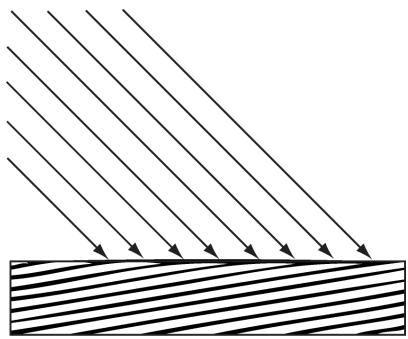


Figure 8.23. Parallel light rays striking a surface.


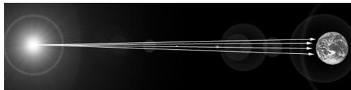


Figure 8.24. The figure is not drawn to scale, but if you select a small surface area on the Earth, the light rays striking that area are approximately parallel.


A parallel light source is defined by a vector, which specifies the direction the light rays travel. Because the light rays are parallel, they all use the same direction vector. The light vector, aims in the opposite direction the light rays travel. A common example of a light source that can accurately be modeled as a directional light is the sun (Figure 8.24). 

# 8.11 POINT LIGHTS

A good physical example of a point light is a lightbulb; it radiates spherically in all directions (Figure 8.25). In particular, for an arbitrary point P, there exists a light ray originating from the point light position Q traveling toward the point. As usual, we define the light vector to go in the opposite direction; that is, the direction from the point $\mathbf { P }$ to the point light source Q: 

$$
\mathbf {L} = \frac {\mathbf {Q} - \mathbf {P}}{\left\| \mathbf {Q} - \mathbf {P} \right\|}
$$

Essentially, the only difference between point lights and parallel lights is how the light vector is computed—it varies from point to point for point lights, but remains constant for parallel lights. 

# 8.11.1 Attenuation

Physically, light intensity weakens as a function of distance based on the inverse squared law. That is to say, the light intensity at a point a distance $d$ away from the light source is given by: 

$$
I (d) = \frac {I _ {0}}{d ^ {2}}
$$

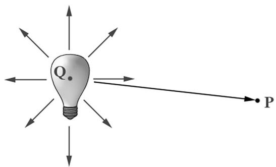


Figure 8.25. Point lights radiate in every direction; in particular, for an arbitrary point P there exists a light ray originating from the point source $\mathbf { Q }$ towards P.


where $I _ { 0 }$ is the light intensity at a distance $d = 1$ from the light source. This works well if you set up physically based light values and use HDR (high dynamic range) lighting and tonemapping. However, an easier formula to get started with, and the one we shall use in our demos, is a linear falloff function: 

$$
\operatorname {a t t} (d) = \operatorname {s a t u r a t e} \left(\frac {\text {f a l l o f f E n d} - d}{\text {f a l l o f f E n d} - \text {f a l l o f f S t a r t}}\right)
$$

A graph of this function is depicted in Figure 8.26. The saturate function clamps the argument to the range [0, 1]: 

$$
\operatorname {s a t u r a t e} (x) = \left\{ \begin{array}{l} x, 0 \leq x \leq 1 \\ 0, x <   0 \\ 1, x > 1 \end{array} \right.
$$

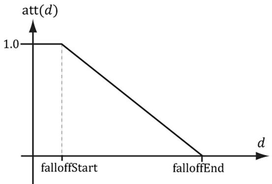


Figure 8.26. The attenuation factor that scales the light value stays at full strength (1.0) until the distance d reaches falloffStart, it then linearly decays to 0.0 as the distance reaches falloffEnd.


The formula for evaluating a point light is the same as Equation 8.4, but we must scale the light source value $\mathbf { B } _ { L }$ by the attenuation factor att $( d )$ . Note that attenuation does not affect ambient term, as the ambient term is used to model indirect light that has bounced around. 

Using our falloff function, a point whose distance from the light source is greater than or equal to falloffEnd receives no light. This provides a useful lighting optimization: in our shader programs, if a point is out of range, then we can return early and skip the lighting calculations with dynamic branching. 

# 8.12 SPOTLIGHTS

A good physical example of a spotlight is a flashlight. Essentially, a spotlight has a position Q, is aimed in a direction d, and radiates light through a cone (see Figure 8.27). 

To implement a spotlight, we begin as we do with a point light: the light vector is given by: 

$$
\mathbf {L} = \frac {\mathbf {Q} - \mathbf {P}}{\| \mathbf {Q} - \mathbf {P} \|}
$$

where $\mathbf { P }$ is the position of the point being lit and Q is the position of the spotlight. Observe from Figure 8.27 that $\mathbf { P }$ is inside the spotlight’s cone (and therefore receives light) if and only if the angle $\phi$ between $\mathbf { - L }$ and d is smaller than the cone angle $\phi _ { m a x }$ . Moreover, all the light in the spotlight’s cone should not be of equal intensity; the light at the center of the cone should be the most intense and the light intensity should fade to zero as $\phi$ increases from 0 to $\phi _ { m a x }$ . 

So how do we control the intensity falloff as a function of $\phi ,$ , and also how do we control the size of the spotlight’s cone? We can use a function with the same graph as in Figure 8.19, but replace $\theta _ { h }$ with $\phi$ and $m$ with s: 

$$
k _ {s p o t} (\phi) = \max  (\cos \phi , 0) ^ {s} = \max  (- \mathbf {L} \cdot \mathbf {d}, 0) ^ {s}
$$

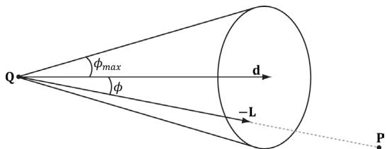


Figure 8.27. A spotlight has a position $\mathbf { Q }$ , is aimed in a direction d, and radiates light through a cone with angle $\phi _ { m a x }$ .


This gives us what we want: the intensity smoothly fades as $\phi$ increases; additionally, by altering the exponent s, we can indirectly control $\phi _ { m a x }$ (the angle the intensity drops to 0); that is to say, we can shrink or expand the spotlight cone by varying s. For example, if we set $s = 8$ , the cone has approximately a $4 5 ^ { \circ }$ half angle. 

The spotlight equation is just like Equation 8.4, except that we multiply the light source value $\mathbf { B } _ { L }$ by both the attenuation factor att $( d )$ and the spotlight factor $k _ { s p o t }$ to scale the light intensity based on where the point is with respect to the spotlight cone. 

We see that a spotlight is more expensive than a point light because we need to compute the additional $k _ { s p o t }$ factor and multiply by it. Similarly, we see that a point light is more expensive than a directional light because the distance $d$ needs to be computed (this is actually pretty expensive because distance involves a square root operation), and we need to compute and multiply by the attenuation factor. To summarize, directional lights are the least expensive light source, followed by point lights, followed by spotlights being the most expensive light source. 

# 8.13 LIGHTING IMPLEMENTATION

This section discusses the details for implementing directional, point, and spot lights. 

# 8.13.1 Light Structure

In SharedTypes.h, we define the following structure to support lights. This structure can represent directional, point, or spot lights. However, depending on the light type, some values will not be used; for example, a point light does not use the Direction data member. 

```cpp
struct Light
{
    float3 Strength;
    float FalloffStart; // point/spot light only
    float3 Direction; // directional/spot light only
    float FalloffEnd; // point/spot light only
    float3 Position; // point/spot light only
    float SpotPower; // spot light only
}; 
```

The order of data members listed in the Light structure (and also the MaterialConstants structure) is not arbitrary. They are cognizant of the HLSL structure packing rules. See Appendix B (“Structure Packing”) for details, but the main idea is that in HLSL, structure padding occurs so that elements are packed into 4D vectors, with the restriction that a single element cannot be split across two 4D vectors. This means the above structure gets nicely packed into three 4D vectors like this: 

```cpp
vector 1: (Strength.x, Strength.y, Strength.z, FalloffStart)  
vector 2: (Direction.x, Direction.y, Direction.z, FalloffEnd)  
vector 3: (Position.x, Position.y, Position.z, SpotPower) 
```

# On the other hand, if we wrote our Light structure like this

```cpp
struct Light
{
    DirectX::XMFLOAT3 Strength; // Light color
    DirectX::XMFLOAT3 Direction; // directional/spot light only
    DirectX::XMFLOAT3 Position; // point/spot light only
    float FalloffStart; // point/spot light only
    float FalloffEnd; // point/spot light only
    float SpotPower; // spot light only
}; 
```

# then it would get packed into four 4D vectors like this:

```cpp
vector 1: (Strength.x, Strength.y, Strength.z, empty)  
vector 2: (Direction.x, Direction.y, Direction.z, empty)  
vector 3: (Position.x, Position.y, Position.z, empty)  
vector 4: (FalloffStart, FalloffEnd, SpotPower, empty) 
```

The second approach takes up more data, but that is not the main problem. The more serious problem is that we have a $\mathrm { C } { + + }$ application side structure that mirrors the HLSL structure, but the $\mathrm { C } { + + }$ structure does not follow the same HLSL packing rules; thus, the $\mathrm { C } { + + }$ and HLSL structure layouts are likely not going to match unless you are careful with the HLSL packing rules and write them so that they do. If the $\mathrm { C } { + + }$ and HLSL structure layouts do not match, then we will get rendering bugs when we upload data from the CPU to GPU constant buffers using memcpy. 

# 8.13.2 Common Helper Functions

The below three functions, defined in LightingUtils.hlsl, contain code that is common to more than one type of light, and therefore we define in helper functions. 

1. CalcAttenuation: Implements a linear attenuation factor, which applies to point lights and spot lights. 

2. SchlickFresnel: The Schlick approximation to the Fresnel equations; it approximates the percentage of light reflected off a surface with normal n based on the angle between the light vector L and surface normal n due to the Fresnel effect. 

3. BlinnPhong: Computes the amount of light reflected into the eye; it is the sum of diffuse reflectance and specular reflectance. 

```cpp
float CalcAttenuation(float d, float falloffStart, float falloffEnd)  
{ // Linear falloff. return saturate((falloffEnd - falloffStart));  
}  
// Schlick gives an approximation to Fresnel reflectance  
// (see pg. 233 "Real-Time Rendering 3rd Ed.")  
// R0 = ((n-1)/(n+1))^2, where n is the index of refraction.  
float3 SchlickFresnel(float3 R0, float3 normal, float3 lightVec)  
{ float cosIncidentAngle = saturate.dot(normal, lightVec));  
float f0 = 1.0f - cosIncidentAngle;  
float3 reflectPercent = R0 + (1.0f - R0) * (f0*f0*f0*f0*f0);  
return reflectPercent;  
}  
struct Material  
{ float4 DiffuseAlbedo; float3 FresnelR0; // Shininess is inverse of roughness: Shininess = 1-roughness. float Shininess;  
};  
float3 BlinnPhong(float3 lightStrength, float3 lightVec, float3 normal, float3 toEye, Material mat)  
{ // Derive m from the shininess, which is derived from the roughness. const float m = mat.Shininess * 256.0f; float3 halfVec = normalize(toEye + lightVec); 
```

float roughnessFactor $=$ $(\mathfrak{m} + 8.0\mathrm{f})^{*}$ pow(max.dot(halfVec, normal), 0.0f), m) / 8.0f;   
float3 fresnelFactor $=$ SchlickFresnel(mat.FresnelR0, halfVec, lightVec);   
// Our spec formula goes outside [0,1] range, but we are doing // LDR rendering. So scale it down a bit. specAlbedo $=$ specAlbedo / (specAlbedo + 1.0f);   
return (mat.DiffuseAlbedo.rgb + specAlbedo) * lightStrength; 

The following intrinsic HLSL functions were used: dot, pow, and max, which are, respectively, the vector dot product function, power function, and maximum function. Descriptions of most of the HLSL intrinsic functions can be found in Appendix B, along with a quick primer on other HLSL syntax. One thing to note, however, is that when two vectors are multiplied with operator*, the multiplication is done component-wise. 

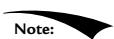


Our formula for computing the specular albedo allows for specular values to be greater than 1 which indicates very bright highlights. However, our render target expects color values to be in the low-dynamic-range (LDR) of [0, 1]. Values outside this range will simply get clamped to 1.0 since our render target requires color values to be in the [0, 1] range. Therefore, to get softer specular highlights without a sharp clamp, we need to need to scale down the specular albedo: 

```javascript
specAlbedo = specAlbedo / (specAlbedo + 1.0f); 
```

High-Dynamic-Range (HDR) lighting uses floating-point render targets that allows light values to go outside the range [0, 1], and then a tonemapping step is performed to remap the high-dynamic-range back to [0, 1] for display, while preserving the details that are important. HDR rendering and tonemapping is a subject on its own—see the textbook by [Reinhard10]. However, [Pettineo12] provides a good introduction and demo to experiment with. 

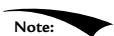


On the PC, HLSL functions are always inlined; therefore, there is no performance overhead for functions or parameter passing. 

# 8.13.3 Implementing Directional Lights

Given the eye position E and given a point $\mathbf { p }$ on a surface visible to the eye with surface normal n, and material properties, the following HLSL function outputs the amount of light, from a directional light source, that reflects into the to-eye 

direction $\mathbf { v } =$ normalize $\left( \mathbf { E } - \mathbf { p } \right)$ .  In our samples, this function will be called in a pixel shader to determine the color of the pixel based on lighting. 

```cpp
float3 ComputeDirectionalLight(Light L, Material mat, float3 normal, float3 toEye)  
{ // The light vector aims opposite the direction the light rays travel. float3 lightVec = -L.Direction; // Scale light down by Lambert's cosine law. float ndot1 = max.dot(lightVec, normal), 0.0f); float3 lightStrength = L.Strength * ndot1; return BlinnPhong(lightStrength, lightVec, normal, toEye, mat); } 
```

# 8.13.4 Implementing Point Lights

Given the eye position E and given a point p on a surface visible to the eye with surface normal n, and material properties, the following HLSL function outputs the amount of light, from a point light source, that reflects into the to-eye direction $\mathbf { v } =$ normalize $\left( \mathbf { E } - \mathbf { p } \right)$ .  In our samples, this function will be called in a pixel shader to determine the color of the pixel based on lighting. 

```cpp
float3 ComputePointLight(Light L, Material mat, float3 pos, float3 normal, float3 toEye)  
{ // The vector from the surface to the light. float3 lightVec = L.Position - pos; // The distance from surface to light. float d = length(lightVec); // Range test. if(d > L.FalloffEnd) return 0.0f; //Normalize the light vector. lightVec /= d; // Scale light down by Lambert's cosine law. float ndot1 = max.dot(lightVec, normal), 0.0f); float3 lightStrength = L.Strength * ndot1; // Attenuate light by distance. float att = CalcAttenuation(d, L.FalloffStart, L.FalloffEnd); lightStrength *= att; return BlinnPhong(lightStrength, lightVec, normal, toEye, mat); } 
```

# 8.13.5 Implementing Spotlights

Given the eye position E and given a point p on a surface visible to the eye with surface normal n, and material properties, the following HLSL function outputs the amount of light, from a spot light source, that reflects into the to-eye direction $\mathbf { v } =$ normalize $\left( \mathbf { E } - \mathbf { p } \right)$ .  In our samples, this function will be called in a pixel shader to determine the color of the pixel based on lighting. 

float3 ComputeSpotLight(Light L, Material mat, float3 pos, float3 normal, float3 toEye)   
{ // The vector from the surface to the light. float3 lightVec = L.Position - pos; // The distance from surface to light. float d = length(lightVec); // Range test. if(d > L.FalloffEnd) return 0.0f; //Normalize the light vector. lightVec $\equiv$ d; // Scale light down by Lambert's cosine law. float ndot1 = max.dot(lightVec, normal), 0.0f); float3 lightStrength $=$ L.Strength \* ndot1; // Attenuate light by distance. float att $=$ CalcAttenuation(d, L.FalloffStart, L.FalloffEnd); lightStrength $\ast =$ att; // Scale by spotlight float spotFactor $=$ pow(max.dot(-lightVec, L.Direction), 0.0f), L.SpotPower); lightStrength $\ast =$ spotFactor; return BlinnPhong(lightStrength, lightVec, normal, toEye, mat); 

# 8.13.6 Accumulating Multiple Lights

Lighting is additive, so supporting multiple lights in a scene simply means we need to iterate over each light source and sum its contribution to the point/pixel we are evaluating the lighting of. Our sample framework supports up to sixteen total lights. We can use any combination of directional, point, or spotlights, but the total must not exceed sixteen. Moreover, our code uses the convention that directional lights must come first in the light array, point lights come second, and spotlights come last. 

define MaxLights 16   
DEFINE_CBUFFER(PerPassCB, b1)   
{ int gNumDirLights; uint gNumPointLights; uint gNumSpotLights; uint PerPassCB_pad2; //Indices[0,gNumDirLights)are directional lights; //indices[gNumDirLights,gNumDirLights+gNumPointLights)are point lights; //indices[gNumDirLights+gNumPointLights, //gNumDirLights+gNumPointLights+gNumSpotLights) //are spot lights for a maximum of MaxLights per object. Light gLights[MaxLights];}; float4 ComputeLighting(Light gLights[MaxLights],Material mat, float3pos,float3normal,float3toEye, float3 shadowFactor) { float3 result $= 0$ .0f; int $\mathrm{i} = 0$ · for(i $= 0$ ;i $<$ gNumDirLights; $^{+ + i}$ { result $+ =$ shadowFactor[i] \*ComputeDirectionalLight( gLights[i],mat,normal,toEye); } for(i=gNumDirLights;i $<$ gNumDirLights+gNumPointLights; $^{+ + i}$ { result $+ =$ ComputePointLight(gLights[i],mat,pos,normaI, toEye); } for(i=gNumDirLights+gNumPointLights; i $<$ gNumDirLights+gNumPointLights+gNumSpotLights; $^{+ + i}$ { result $+ =$ ComputeSpotLight(gLights[i],mat,pos,normaI, toEye); } return float4(result,0.0f); 

The shadowFactor parameter will not be used until the chapter on shadowing. For now, we just set this to the vector (1, 1, 1), which makes the shadow factor have no effect in the equation. 

Putting the Light array in the per-pass constant buffer means we cannot have more than sixteen (the maximum number of lights we support) lights per rendering pass. This is more than sufficient for small demos. However, for large game worlds, this would not be enough, as you can imagine game levels with hundreds of lights spread throughout the level. One solution to this is to move the Light array to the per-object constant buffer. Then, for each object O, you do a search of the scene and find the lights that affect the object O, and bind those lights to the constant buffer. The lights that would affect O are the lights whose volumes (sphere for point light and cone for spotlight) intersect it. More advanced but popular strategies to support a large number of lights are to use deferred rendering or Forward+ rendering. We note, however, that while deferred rendering was popular when the target resolution was 1080p or less, it is becoming less popular with 4K screens becoming increasingly common, as the amount of memory and memory bandwidth required for deferred rendering becomes cost prohibitive. 

# 8.13.7 The Main HLSL File

The following code contains the vertex and pixel shaders used for the demo of this chapter. Note that Common.hlsl includes SharedTypes.h for the constant buffer definitions and LightingUtil.hlsl for the lighting functions. 

//BasicLit.hlsl1   
//   
//Include common HLSL code. #include"Shaders/Common.hlsl"   
struct VertexIn { float3PosL：POSITION; float3 NormalL：NORMAL;   
}；   
struct VertexOut { float4 PosH：SV POSITION; float3 PosW：POSITION2; float3 NormalW：NORMAL;   
}；   
VertexOut VS(VertexIn vin) { VertexOut vout $=$ (VertexOut)0.0f; //Transform to world space. float4 posW $=$ mul(float4(vin(PosL,1.0f)，gWorld); vout-posW $=$ posW.xyz; 

```cpp
// Assumes nonuniform scaling; otherwise, need to use
// inverse-transpose of world matrix.
vout.NormalW = mul(vin.NormalL, (float3x3)gWorld);
// Transform to homogeneous clip space.
vout(PosH = mul(posW, gViewProj);
return vout;
}
float4 PS(VertexOut pin) : SV_Target
{
    MaterialData.matData = gMaterialData[gMaterialIndex];
    float4 diffuseAlbedo = Data.DiffuseAlbedo;
    float3 fresnelR0 = Data.FresnelR0;
    float roughness = Data.Roughness;
    // Interpolating normal can unnormalize it, so renormalize it.
    float3 normalW = normalize(pin.NormalW);
    // Vector from point being lit to eye.
    float3 toEyeW = normalize(gEyePosW - pin(PosW));
    float4 ambient = gAmbientLight*diffuseAlbedo;
    const float shininess = (1.0f - roughness);
    Material mat = { diffuseAlbedo, fresnelR0, shininess };
    float4 directLight = ComputeLighting(gLights, mat, pin(PosW,
                     normalW, toEyeW);
    float4 litColor = ambient + directLight;
    // Common convention to take alpha from diffuse albedo.
    litColor.a = diffuseAlbedo.a;
    return litColor;
} 
```

# 8.14 LIGHTING DEMO

The lighting demo builds off the “Waves” demo from the previous chapter. It uses a three-point lighting system that is commonly used in film and photography to get better lighting than just one light source can provide. It consists of a primary light source called the key light, a secondary fill light usually aiming in the side direction from the key light, and a back light. We use three-point lighting to fake indirect lighting that gives better object definition than just using the ambient component for indirect lighting. For an outdoor scene in the daytime, the key light will be the sun. In our demo, all three lights are directional lights. To show that the lighting is 

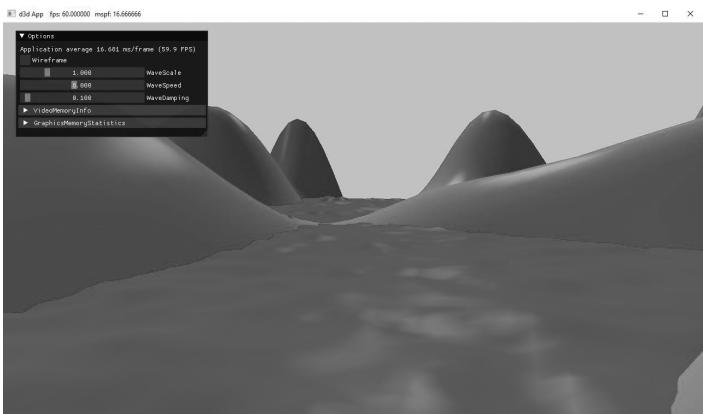


Figure 8.28. Screenshot of the lighting demo.


dynamic, we incrementally rotate the lights over time in the LitWavesApp::Update function from their starting orientation: 

void LitWavesApp::Update(const GameTimer& gt)   
{ ... mLightRotationAngle $+ =$ 0.1f\*gt.DeltaTime(); XMMatrix R $=$ XMMatrixRotationY(mLightRotationAngle); for(int $\mathrm{i} = 0$ .i<3;++i) { XMVECTOR lightDir $=$ XmlLoadFloat3(&mBaseLightDirections[i]); lightDir $=$ XMVector3TransformNormal(lightDir,R); XMStoreFloat3(&mRotatedLightDirections[i],lightDir); } ... 

# 8.14.1 Vertex Format

Lighting calculations require a surface normal. We define normals at the vertex level; these normals are then interpolated across the pixels of a triangle so that we may do the lighting calculations per pixel. Moreover, we no longer specify a vertex color. Instead, pixel colors are generated by applying the lighting equation for each pixel. To support vertex normals we modify our vertex structures like so: 

```cpp
struct ModelVertex
{
    DirectX::XMFLOAT3 Pos;
    DirectX::XMFLOAT3 Normal;
    DirectX::XMFLOAT2 TexC;
    DirectX::XMFLOAT3 TangentU;
}; 
```

```cpp
// Corresponding HLSL vertex structure in BasicLit.hlsl. Recall that  
// the shader vertex structure may use a subset of the vertex data.  
struct VertexIn  
{  
    float3 PosL : POSITION;  
    float3 NormalL : NORMAL;  
}; 
```

ModelVertex has two extra members we do not need yet, namely TexC and TangentU. We will use TexC in Chapter 9 for texturing, and TangentU will be used in Chapter 19 for normal mapping. We could have a leaner vertex structure defined per project with just the data we need, but we will ultimately converge to the ModelVertex structure most of the time (we will want texturing and normal mapping most of the time). Therefore, we define ModelVertex in d3dUtil.h so we can use it in multiple projects, and because it allows us to have utility code that uses it (e.g., d3dUtil::BuildShapeGeometry). 

When we add/change a vertex format, we need to update the input layout description: 

mInputLayout $=$ { {"POSITION",0，DXGI_FORMAT_R32G32B32_FLOAT，0，0, D3D12_INPUT_CLASSIFICATION_PER踮X_DATA，0}， {"NORMAL",0，DXGI_FORMAT_R32G32B32_FLOAT，0，12, D3D12_INPUT_CLASSIFICATION_PER踮X_DATA，0}， {"TEXCOORD",0，DXGI_FORMAT_R32G32_FLOAT，0，24, D3D12_INPUT_CLASSIFICATION_PER踮X_DATA，0}， {"TANGENT",0，DXGI_FORMAT_R32G32B32_FLOAT，0，32, D3D12_INPUT_CLASSIFICATION_PER踮X_DATA，0}， }； 

# 8.14.2 Normal Computation

The shape functions in the MeshGen class already create data with vertex normals, so nothing more is required for that. However, because we modify the heights of the grid in this demo to make it look like terrain, we need to generate the normal vectors for the terrain ourselves. 

Because our terrain surface is given by a function $y = f ( x , z )$ , we can compute the normal vectors directly using calculus, rather than the normal averaging technique described in $\ S 8 . 2 . 1$ . To do this, for each point on the surface, we form two tangent vectors in the $+ x -$ and $+ z -$ directions by taking the partial derivatives: 

$$
\begin{array}{l} \mathbf {T} _ {\mathbf {x}} = \left(1, \frac {\partial f}{\partial x}, 0\right) \\ \mathbf {T _ {z}} = \left(0, \frac {\partial f}{\partial z}, 1\right) \\ \end{array}
$$

These two vectors lie in the tangent plane of the surface point. Taking the cross product then gives the normal vector: 

$$
\begin{array}{l} \mathbf {n} = \mathbf {T _ {z}} \times \mathbf {T _ {x}} = \left| \begin{array}{c c c} \mathbf {i} & \mathbf {j} & \mathbf {k} \\ 0 & \frac {\partial f}{\partial z} & 1 \\ 1 & \frac {\partial f}{\partial x} & 0 \end{array} \right| \\ = \left(\left| \begin{array}{c c} \frac {\partial f}{\partial z} & 1 \\ \frac {\partial f}{\partial x} & 0 \end{array} \right|, - \left| \begin{array}{c c} 0 & 1 \\ 1 & 0 \end{array} \right|, \left| \begin{array}{c c} 0 & \frac {\partial f}{\partial z} \\ 1 & \frac {\partial f}{\partial x} \end{array} \right|\right) \\ = \left(- \frac {\partial f}{\partial x}, 1, - \frac {\partial f}{\partial z}\right) \\ \end{array}
$$

The function we used to generate the land mesh is as follows: 

$$
f (x, z) = 0. 3 z \cdot \sin (0. 1 x) + 0. 3 x \cdot \cos (0. 1 z)
$$

The partial derivatives are as follows: 

$$
\begin{array}{l} \frac {\partial f}{\partial x} = 0. 0 3 z \cdot \cos (0. 1 x) + 0. 3 \cos (0. 1 z) \\ \frac {\partial f}{\partial z} = 0. 3 \sin (0. 1 x) - 0. 0 3 x \cdot \sin (0. 1 z) \\ \end{array}
$$

The surface normal at a surface point $( x , f ( x , z ) , z )$ is thus given by: 

$$
\mathbf {n} (x, z) = \left(- \frac {\partial f}{\partial x}, 1, - \frac {\partial f}{\partial z}\right) = \left[ \begin{array}{c} - 0. 0 3 z \cdot \cos (0. 1 x) - 0. 3 \cos (0. 1 z) \\ 1 \\ - 0. 3 \sin (0. 1 x) + 0. 0 3 x \cdot \sin (0. 1 z) \end{array} \right] ^ {T}
$$

We note that this surface normal is not of the unit length, so it needs to be normalized before performing the lighting calculations. 

We do the above normal calculation at each vertex point to get the vertex normals: 

```cpp
// n = (-df/dx, 1, -df/dz)  
XMFLOAT3 n(-0.03f*z*cosf(0.1f*x) - 0.3f*cosf(0.1f*z), 1.0f, -0.3f*sinf(0.1f*x) + 0.03f*x*sinf(0.1f*z));  
XMVECTOR unitNormal = XMVector3Normalize(XMLoadFloat3(&n)); XMStoreFloat3(&n, unitNormal);  
return n; 
```

The normal vectors for the water surface are done in a similar way, except that we do not have a formula for the water. However, tangent vectors at each vertex point can be approximated using a finite difference scheme (see [Lengyel02] or any numerical analysis book). 

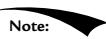


If you do not know much calculus, do not worry as it will not play a major role in this book. Right now, it is useful because we are using mathematical surfaces to generate our geometry so that we have some interesting objects to draw. Eventually, we will load 3D meshes from files that were exported from 3D modeling programs. 

# 8.15 SUMMARY

1. With lighting, we no longer specify per-vertex colors but instead define scene lights and per-vertex materials. Materials can be thought of as the properties that determine how light interacts with a surface of an object. The per-vertex materials are interpolated across the face of the triangle to obtain material values at each surface point of the triangle mesh. The lighting equations then compute a surface color the eye sees based on the interaction between the light and surface materials; other parameters are also involved, such as the surface normal and eye position. 

2. A surface normal is a unit vector that is orthogonal to the tangent plane of a point on a surface. Surface normals determine the direction a point on a surface is “facing.” For lighting calculations, we need the surface normal at each point on the surface of a triangle mesh so that we can determine the angle at which light strikes the point on the mesh surface. To obtain surface normals, we specify the surface normals only at the vertex points (so-called vertex normals). Then, in order to obtain a surface normal approximation at each point on the surface of a triangle mesh, these vertex normals will be interpolated across the triangle during rasterization. For arbitrary triangle 

meshes, vertex normals are typically approximated via a technique called normal averaging. If the matrix A is used to transform points and vectors (non-normal vectors), then $( \mathbf { A } ^ { - 1 } ) ^ { T }$ should be used to transform surface normals. 

3. A parallel (directional) light approximates a light source that is very far away. Consequently, we can approximate all incoming light rays as parallel to each other. A physical example of a directional light is the sun relative to the earth. A point light emits light in every direction. A physical example of a point light is a light bulb. A spotlight emits light through a cone. A physical example of a spotlight is a flashlight. 

4. A second kind of reflection happens due to the Fresnel effect, which is a physical phenomenon. When light reaches the interface between two media with different indices of refraction some of the light is reflected and the remaining light is refracted into the medium. How much light is reflected depends on the medium (some materials will be more reflective than others) and also on the angle $\theta _ { i }$ between the normal vector n and light vector L. Due to their complexity, the full Fresnel equations are not typically used in real-time rendering; instead, the Schlick approximation is used. 

5. Reflective objects in the real-world tend not to be perfect mirrors. Even if an object’s surface appears flat, at the microscopic level we can think of it as having roughness. We can think of a perfect mirror as having no roughness and its micro-normals all aim in the same direction as the macro-normal. As the roughness increases, the direction of the micro-normals diverge from the macro-normal causing the reflected light to spread out into a specular lobe. 

6. Ambient light models indirect light that has scattered and bounced around the scene so many times that it strikes the object equally in every direction, thereby uniformly brightening it up. Diffuse light models light that enters the interior of a medium and scatters around under the surface where some of the light is absorbed and the remaining light scatters back out of the surface. Because it is difficult to model this subsurface scattering, we assume the reemitted light scatters out equally in all directions above the surface about the point the light entered. Specular light models the light that is reflected off the surface due to the Fresnel effect and surface roughness. 

# 8.16 EXERCISES

1. Modify ImGUI UI of the “LitWaves” demo to include sliders to modify the light strength colors (see ImGui::SliderFloat3). Add a second slider to modify 

the gAmbientLight color. Finally, add additional sliders to dynamically update the roughness of the scene materials. 

2. Modify the “LitWaves” demo by removing the three directional lights and adding a spotlight that is always positioned with the camera and always aimed in the direction the camera is looking. In effect, this is modeling a flashlight the player is holding. Add an ImGUI checkbox to turn the flashlight on and off. Add ImGUI sliders to adjust the light strength and spotlight cone. 

3. Modify the “Shapes” demo from the previous chapter by adding materials and a three-point lighting system. 

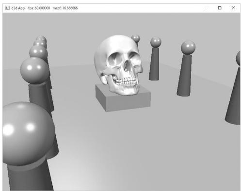


Figure 8.29. Screenshot of the solution to Exercise 3


4. Modify the solution to Exercise 3 by removing the three-point lighting, and adding a point centered about each sphere above the columns. 

5. Modify the solution to Exercise 3 by removing the three-point lighting, and adding a spotlight centered about each sphere above the columns and aiming down. 

6. One characteristic of cartoon styled lighting is the abrupt transition from one color shade to the next (in contrast with a smooth transition) as shown in Figure 8.30. This can be implemented by computing $k _ { d }$ and $k _ { s }$ in the usual way, but then transforming them by discrete functions like the following before using them in the pixel shader: 

$$
k _ {d} ^ {\prime} = f (k _ {d}) = \left\{ \begin{array}{l l} 0. 4 & \text {i f} - \infty <   k _ {d} \leq 0. 0 \\ 0. 6 & \text {i f} 0. 0 <   k _ {d} \leq 0. 5 \\ 1. 0 & \text {i f} 0. 5 <   k _ {d} \leq 1. 0 \end{array} \right.
$$

$$
k _ {s} ^ {\prime} = g (k _ {s}) = \left\{ \begin{array}{l l} 0. 0 & \text {i f} \quad 0. 0 \leq k _ {s} \leq 0. 1 \\ 0. 5 & \text {i f} \quad 0. 1 <   k _ {s} \leq 0. 8 \\ 0. 8 & \text {i f} \quad 0. 8 <   k _ {s} \leq 1. 0 \end{array} \right.
$$

Modify the lighting demo of this chapter to use this sort of toon shading. (Note: The functions $f$ and $g$ above are just sample functions to start with, and can be tweaked until you get the results you want.) 

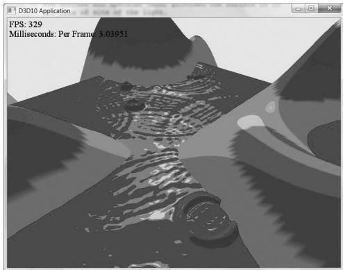


Figure 8.30. Screenshot of cartoon lighting
