# Chapter

# 10 Bl ending

Consider Figure 10.1. We start rendering the frame by first drawing the terrain followed by the wooden crate, so that the terrain and crate pixels are on the back buffer. We then draw the water surface to the back buffer using blending, so that the water pixels get blended with the terrain and crate pixels on back buffer in such a way that the terrain and crate shows through the water. In this chapter, we examine blending techniques which allow us to blend (combine) the pixels that we are currently rasterizing (so-called source pixels) with the pixels that were previously rasterized to the back buffer (so-called destination pixels). This technique enables us, among other things, to render semi-transparent objects such as water and glass. 


For the sake of discussion, we specifically mention the back buffer as the render target. However, we will show later that we can render to “off screen” render targets as well. Blending applies to these render targets just the same, and the destination pixels are the pixel values that were previously rasterized to these off screen render targets. 

# Chapter Objectives:

1. To understand how blending works and how to use it with Direct3D 

2. To learn about the different blend modes that Direct3D supports 

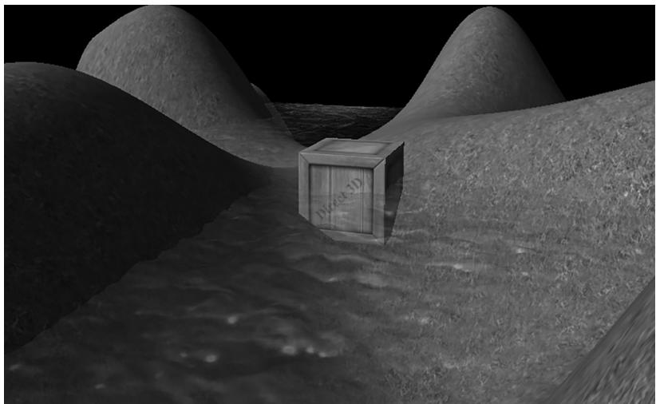


Figure 10.1. A semi-transparent water surface.


3. To find out how the alpha component can be used to control the transparency of a primitive 

4. To learn how we can prevent a pixel from being drawn to the back buffer altogether by employing the HLSL clip function 

# 10.1 THE BLENDING EQUATION

Let $\mathbf { C } _ { s r c }$ be the color output from the pixel shader for the ijth pixel we are currently rasterizing (source pixel), and let $\mathbf { C } _ { d s t }$ be the color of the ijth pixel currently on the back buffer (destination pixel). Without blending, $\mathbf { C } _ { s r c }$ would overwrite $\mathbf { C } _ { d s t }$ (assuming it passes the depth/stencil test) and become the new color of the ijth back buffer pixel. But with blending, $\mathbf { C } _ { s r c }$ and $\mathbf { C } _ { d s t }$ are blended together to get the new color C that will overwrite $\mathbf { C } _ { d s t }$ (i.e., the blended color C will be written to the ijth pixel of the back buffer). Direct3D uses the following blending equation to blend the source and destination pixel colors: 

$$
\mathbf {C} = \mathbf {C} _ {s r c} \otimes \mathbf {F} _ {s r c} \boxplus \mathbf {C} _ {d s t} \otimes \mathbf {F} _ {d s t}
$$

The colors $\mathbf { F } _ { s r c }$ (source blend factor) and $\mathbf { F } _ { d s t }$ (destination blend factor) may be any of the values described in $\ S 1 0 . 3$ , and they allow us modify the original source and destination pixels in a variety of ways, allowing for different effects to be achieved. The $\otimes$ operator means componentwise multiplication for color vectors as defined in $\ S 5 . 3 . 1$ ; the  operator may be any of the binary operators defined in $\$ 10.2$ . 

The above blending equation holds only for the RGB components of the colors. The alpha component is actually handled by a separate similar equation: 

$$
A = A _ {s r c} F _ {s r c} \boxplus A _ {d s t} F _ {d s t}
$$

The equation is essentially the same, but it is possible that the blend factors and binary operation are different. The motivation for separating RGB from alpha is simply so that we can process them independently, and hence, differently, which allows for a greater variety of possibilities. 

Note: 

Blending the alpha component is needed much less frequently than blending the RGB components. This is mainly because we do not care about the back buffer alpha values. Back buffer alpha values are only important if you have some algorithm that requires destination alpha values. 

# 10.2 BLEND OPERATIONS

The binary  operator used in the blending equation may be one of the following: 

typedef enum D3D12_BLEND_OP  
{  
    D3D12_BLEND_OP_ADD = 1, $\mathbf{C} = \mathbf{C}_{src} \otimes \mathbf{F}_{src} + \mathbf{C}_{dst} \otimes \mathbf{F}_{dst}$ D3D12_BLEND_OP_SUBTRACT = 2, $\mathbf{C} = \mathbf{C}_{dst} \otimes \mathbf{F}_{dst} - \mathbf{C}_{src} \otimes \mathbf{F}_{src}$ D3D12_BLEND_OP_REV_SUBTRACT = 3, $\mathbf{C} = \mathbf{C}_{src} \otimes \mathbf{F}_{src} - \mathbf{C}_{dst} \otimes \mathbf{F}_{dst}$ D3D12_BLEND_OP_MIN = 4, $\mathbf{C} = \min(\mathbf{C}_{src}, \mathbf{C}_{dst})$ D3D12_BLEND_OP_MAX = 5, $\mathbf{C} = \max(\mathbf{C}_{src}, \mathbf{C}_{dst})$ } D3D12_BLEND_OP; 

Note: 

The blend factors are ignored in the min/max operation. 

These same operators also work for the alpha blending equation. Also, you can specify a different operator for RGB and alpha. For example, it is possible to add the two RGB terms, but subtract the two alpha terms: 

$$
\mathbf {C} = \mathbf {C} _ {s r c} \otimes \mathbf {F} _ {s r c} + \mathbf {C} _ {d s t} \otimes \mathbf {F} _ {d s t}
$$

$$
A = A _ {d s t} F _ {d s t} - A _ {s r c} F _ {s r c}
$$

A feature recently added to Direct3D is the ability to blend the source color and destination color using a logic operator instead of the traditional blending equations above. The available logic operators are given below: 

typedef
enum D3D12_LOGIC_OP
\{ $\mathrm{D}3\mathrm{D}{12}\_ \mathrm{{LOGIC\_OP\_CLEAR}} = 0$ , $\mathrm{D}3\mathrm{D}{12}\_ \mathrm{{LOGIC\_OP\_SET}} = \left( {\mathrm{D}3\mathrm{D}{12}\_ \mathrm{{LOGIC\_OP\_CLEAR}} + 1}\right)$ , $\mathrm{D}3\mathrm{D}{12}\_ \mathrm{{LOGIC\_OP\_COPY}} = \left( {\mathrm{D}3\mathrm{D}{12}\_ \mathrm{{LOGIC\_OP\_SET}} + 1}\right)$ , $\mathrm{D}3\mathrm{D}{12}\_ \mathrm{{LOGIC\_OP\_COPY\_INVERTED}} = \left( {\mathrm{D}3\mathrm{D}{12}\_ \mathrm{{LOGIC\_OP\_COPY}} + 1}\right)$ , $\mathrm{D}3\mathrm{D}{12}\_ \mathrm{{LOGIC\_OP\_NOOP}} = \left( {\mathrm{D}3\mathrm{D}{12}\_ \mathrm{{LOGIC\_OP\_COPY\_INVERTED}} + 1}\right)$ , $\mathrm{D}3\mathrm{D}{12}\_ \mathrm{{LOGIC\_OP\_INVERT}} = \left( {\mathrm{D}3\mathrm{D}{12}\_ \mathrm{{LOGIC\_OP\_NOOP}} + 1}\right)$ , $\mathrm{D}3\mathrm{D}{12}\_ \mathrm{{LOGIC\_OP\_AND}} = \left( {\mathrm{D}3\mathrm{D}{12}\_ \mathrm{{LOGIC\_OP\_INVERT}} + 1}\right)$ , $\mathrm{D}3\mathrm{D}{12}\_ \mathrm{{LOGIC\_OP\_NAND}} = \left( {\mathrm{D}3\mathrm{D}{12}\_ \mathrm{{LOGIC\_OP\_AND}} + 1}\right)$ , $\mathrm{D}3\mathrm{D}{12}\_ \mathrm{{LOGIC\_OP\_OR}} = \left( {\mathrm{D}3\mathrm{D}{12}\_ \mathrm{{LOGIC\_OP\_NAND}} + 1}\right)$ , $\mathrm{D}3\mathrm{D}{12}\_ \mathrm{{LOGIC\_OP\_NOR}} = \left( {\mathrm{D}3\mathrm{D}{12}\_ \mathrm{{LOGIC\_OP\_OR}} + 1}\right)$ , $\mathrm{D}3\mathrm{D}{12}\_ \mathrm{{LOGIC\_OP\_XOR}} = \left( {\mathrm{D}3\mathrm{D}{12}\_ \mathrm{{LOGIC\_OP\_NOR}} + 1}\right)$ , $\mathrm{D}3\mathrm{D}{12}\_ \mathrm{{LOGIC\_OP\_EQUIV}} = \left( {\mathrm{D}3\mathrm{D}{12}\_ \mathrm{{LOGIC\_OP\_XOR}} + 1}\right)$ , $\mathrm{D}3\mathrm{D}{12}\_ \mathrm{{LOGIC\_OP\_AND\_REVERSE}} = \left( {\mathrm{D}3\mathrm{D}{12}\_ \mathrm{{LOGIC\_OP\_EQUIV}} + 1}\right)$ , $\mathrm{D}3\mathrm{D}{12}\_ \mathrm{{LOGIC\_OP\_AND\_INVERTED}} = \left( {\mathrm{D}3\mathrm{D}{12}\_ \mathrm{{LOGIC\_OP\_AND\_REVERSE}} + 1}\right)$ , $\mathrm{D}3\mathrm{D}{12}\_ \mathrm{{LOGIC\_OP\_OR\_REVERSE}} = \left( {\mathrm{D}3\mathrm{D}{12}\_ \mathrm{{LOGIC\_OP\_AND\_INVERTED}} + 1}\right)$ , $\mathrm{D}3\mathrm{D}{12}\_ \mathrm{{LOGIC\_OP\_OR\_INVERTED}} = \left( {\mathrm{D}3\mathrm{D}{12}\_ \mathrm{{LOGIC\_OP\_OR\_REVERSE}} + 1}\right)$ 

Note that you cannot use traditional blending and logic operator blending at the same time; you pick one or the other. Note also that in order to use logic operator blending the render target format must support—it should be a format of the UINT variety, otherwise you will get errors like the following: 

```cpp
D3D12 ERROR: ID3D12Device::CreateGraphicsPipelineState: The render target format at slot 0 is format (R8G8B8A8_UNORM). This format does not support logic ops. The Pixel Shader output signature indicates this output could be written, and the Blend State indicates logic op is enabled for this slot. [ STATE Creation ERROR #678: CREATEGRAPHICSPIPELINESTATE_ON-render_TARGET DOES_NOT_support_LOGICOPS] D3D12 WARNING: ID3D12Device::CreateGraphicsPipelineState: Pixel Shader output 'SV_Target0' has type that is NOT unsigned int, while the corresponding Output Merger RenderTarget slot [0] has logic op enabled. This happens to be well defined: the raw bits output from the Shader will simply be interpreted as UINT bits in the blender without any data conversion. This warning is to check that the application developer really intended to rely on this behavior. [ STATE Creation WARNING #677: CREATEGRAPHICSPIPELINESTATE_PS_OUTPUT_TYPE_MISMATCH] 
```

# 10.3 BLEND FACTORS

By setting different combinations for the source and destination blend factors along with different blend operators, dozens of different blending effects may be achieved. We will illustrate some combinations in $\$ 10.5$ , but you will need to experiment with others to get a feel of what they do. The following list describes the basic blend factors, which apply to both $\mathbf { F } _ { s r c }$ and $\mathbf { F } _ { d s t } .$ . See the D3D12_BLEND 

enumerated type in the SDK documentation for some additional advanced blend factors. Letting $\mathbf { C } _ { s r c } = ( r _ { s } , g _ { s } , b _ { s } )$ , $A _ { s r c } = a _ { s }$ (the RGBA values output from the pixel shader), $\mathbf { C } _ { d s t } = ( r _ { d } , g _ { d } , b _ { d } )$ , $A _ { d s t } = a _ { d }$ (the RGBA values already stored in the render target), F being either $\mathbf { F } _ { s r c }$ or $\mathbf { F } _ { d s t }$ and $F$ being either $F _ { s r c }$ or $F _ { d s t } ,$ we have: 

D3D12_BLEND_ZERO: $\mathbf{F} = (0,0,0)$ and $F = 0$ D3D12_BLEND_ONE: $\mathbf{F} = (1,1,1)$ and $F = 1$ D3D12_BLEND_SRC_COLOR: $\mathbf{F} = (r_s,g_s,b_s)$ D3D12_BLEND_INV_SRC_COLOR: $\mathbf{F} = (1 - r_s,1 - g_s,1 - b_s)$ D3D12_BLEND_SRC ALPHA: $\mathbf{F} = (a_s,a_s,a_s)$ and $F = a_{s}$ D3D12_BLEND_INV_SRC ALPHA: $\mathbf{F} = (1 - a_s,1 - a_s,1 - a_s)$ and $F = 1 - a_{s}$ D3D12_BLEND_DEST Coloring: $\mathbf{F} = (a_d,a_d,a_d)$ and $F = a_{d}$ D3D12_BLEND_INV_DEST Coloring: $\mathbf{F} = (1 - a_d,1 - a_d,1 - a_d)$ and $F = 1 - a_{d}$ D3D12_BLEND_DEST Coloring: $\mathbf{F} = (r_{db}g_{d},b_{d})$ D3D12_BLEND_INV_DEST Coloring: $\mathbf{F} = (1 - r_d,1 - g_d,1 - b_d)$ D3D12_BLEND_SRC_alphaSAT: $\mathbf{F} = (a_s',a_s',a_s')$ and $F = a_{s}'$ 

where $a _ { s } ^ { \prime } = \mathrm { c l a m p } ( a _ { s } , 0 , 1 )$ 

D3D12_BLEND_BLEND_FACTOR: $\textbf { F } = \left( r , g , b \right)$ and $F = a$ , where the color $( r , g , b , a )$ is supplied to the second parameter of the ID3D12GraphicsCommandList::OMSetBle ndFactor method. This allows you to specify the blend factor color to use directly; however, it is constant until you change the blend state. 

D3D12_BLEND_INV_BLEND_FACTOR: $\mathbf { F } = ( 1 - r , 1 - g , 1 - b )$ and $F = 1 { - } a$ , where the color $( r , g , b , a )$ is supplied by the second parameter of the ID3D12GraphicsCommand List::OMSetBlendFactor method. This allows you to specify the blend factor color to use directly; however, it is constant until you change the blend state. 

All of the above blend factors apply to the RGB blending equation. For the alpha blending equation, blend factors ending with _COLOR are not allowed. 


The clamp function is defined as: 

$$
\operatorname {c l a m p} (x, a, b) = \left\{ \begin{array}{l} x, a \leq x \leq b \\ a, x <   a \\ b, x > b \end{array} \right.
$$

# Note:

We can set the blend factor color with the following function: 

```cpp
void ID3D12GraphicsCommandList::OMSetBlendFactor(const FLOAT BlendFactor[4]); 
```

Passing a nullptr restores the default blend factor of (1, 1, 1, 1). 

# 10.4 BLEND STATE

We have talked about the blending operators and blend factors, but where do we set these values with Direct3D? As with other Direct3D state, the blend state is part of the PSO. Thus far we have been using the default blend state, which disables blending: 

```javascript
D3D12 grafICS_PIPELINE_STATE_DESC opaquePsoDesc; ZeroMemory(&opaquePsoDesc, sizeof(D3D12 grafICS_PIPELINE_STATE_DESC)); ... opaquePsoDesc.BlendState = CD3DX12_BLEND_DESC(D3D12_DEFAULT); 
```

To configure a non-default blend state we must fill out a D3D12_BLEND_DESC structure. The D3D12_BLEND_DESC structure is defined like so: 

```cpp
typedef struct D3D12 Blend_DESC {
    BOOL AlphaToCoverageEnable; // Default: False
    BOOL IndependentBlendEnable; // Default: False
    D3D11_RENDER_TARGET Blend_DESC RenderTarget[8];
} D3D11 Blend_DESC; 
```

1. AlphaToCoverageEnable: Specify true to enable alpha-to-coverage, which is a multisampling technique useful when rendering foliage or gate textures. Specify false to disable alpha-to-coverage. Alpha-to-coverage requires multisampling to be enabled (i.e., the back and depth buffer were created with multisampling). 

2. IndependentBlendEnable: Direct3D supports rendering to up to eight render targets simultaneously. When this flag is set to true, it means blending can be performed for each render target differently (different blend factors, different blend operations, blending disabled/enabled, etc.). If this flag is set to false, it means all the render targets will be blended the same way as described by the first element in the D3D12_BLEND_DESC::RenderTarget array. Multiple render targets are used for advanced algorithms; for now, assume we only render to one render target at a time. 

3. RenderTarget: An array of 8 D3D12_RENDER_TARGET_BLEND_DESC elements, where the ith element describes how blending is done for the ith simultaneous render target. If IndependentBlendEnable is set to false, then all the render targets use RenderTarget[0] for blending. 

The D3D12_RENDER_TARGET_BLEND_DESC structure is defined like so: 

```c
typedef struct D3D12weener_TARGET Blend DESC   
{ BOOL BlendEnable; // Default: False BOOL LogicEnable; // Default: False D3D12BlendSrcBlend; // Default: D3D12 Blend_ONE 
```

```c
D3D12_BLENDDestBlend; //Default:D3D12_BLEND_ZERO D3D12_BLEND_OP BlendOp; //Default:D3D12_BLEND_OP_ADD D3D12_BLENDSrcBlendAlpha; //Default:D3D12_BLEND_ONE D3D12_BLENDDestBlendAlpha; //Default:D3D12_BLEND_ZERO D3D12_BLEND_OP BlendOpAlpha; //Default:D3D12_BLEND_OP_ADD D3D12_LOGIC_OP LogicOp; //Default:D3D12_LOGIC_OP_NOOP UINT8RenderTargetWriteMask; //Default:D3D12_COLOR_WRITE_ENABLE_ALL } D3D12_RENDER_TARGET_BLEND_DESC; 
```

1. BlendEnable: Specify true to enable blending and false to disable it. Note that BlendEnable and LogicOpEnable cannot both be set to true; you either use regular blending or logic operator blending. 

2. LogicOpEnable: Specify true to enable a logic blend operation. Note that BlendEnable and LogicOpEnable cannot both be set to true; you either use regular blending or logic operator blending. 

3. SrcBlend: A member of the D3D12_BLEND enumerated type that specifies the source blend factor $\mathbf { F } _ { s r c }$ for RGB blending. 

4. DestBlend: A member of the D3D12_BLEND enumerated type that specifies the destination blend factor $\mathbf { F } _ { d s t }$ for RGB blending. 

5. BlendOp: A member of the D3D12_BLEND_OP enumerated type that specifies the RGB blending operator. 

6. SrcBlendAlpha: A member of the D3D12_BLEND enumerated type that specifies the destination blend factor $F _ { s r c }$ for alpha blending. 

7. DestBlendAlpha: A member of the D3D12_BLEND enumerated type that specifies the destination blend factor $F _ { d s t }$ for alpha blending. 

8. BlendOpAlpha: A member of the D3D12_BLEND_OP enumerated type that specifies the alpha blending operator. 

9. LogicOp: A member of the D3D12_LOGIC_OP enumerated type that specifies the logic operator to use for blending the source and destination colors. 

10. RenderTargetWriteMask: A combination of one or more of the following flags: 

```ocaml
typedef enum D3D12_COLOR_WRITE_ENABLE {
    D3D12_COLOR_WRITE_ENABLE_RED = 1,
    D3D12_COLOR_WRITE_ENABLE.Green = 2,
    D3D12_COLOR_WRITE_ENABLE_BLUE = 4,
    D3D12 Coloring.Write_ENABLE_alpha = 8,
    D3D12 Coloring.Write_ENABLE_ALL =
        (D3D12 Coloring.Write_ENABLE_RED | D3D12 Coloring.Write_ENABLE_green | D3D12 Coloring.Write_ENABLE.Blue | D3D12 Coloring.Write_ENABLE_alpha)
} D3D12 Coloring.Write_ENABLE; 
```

These flags control which color channels in the back buffer are written to after blending. For example, you could disable writes to the RGB channels, 

and only write to the alpha channel, by specifying D3D12_COLOR_WRITE_ENABLE_ ALPHA. This flexibility can be useful for advanced techniques. When blending is disabled, the color returned from the pixel shader is used with no write mask applied. 

Note: 

Blending is not free and does require additional per-pixel work, so only enable it if you need it, and turn it off when you are done. 

The following code shows example code of creating and setting a blend state: 

```cpp
D3D12graphicspipeline_STATE_DESC basePsoDesc = d3dUtil::InitDefaultPso( mBackBufferFormat, mDepthStencilFormat, mInputLayout, mRootSignature.Get(), mShaders["standardVS"].Get(), mShaders["opaquePS"].Get());  
D3D12graphicspipeline_STATE_DESC transparentPsoDesc = basePsoDesc;  
D3D12_RENDER_TARGET BlendDesc transparencyBlendDesc;  
transparencyBlendDesc.BlendEnable = true;  
transparencyBlendDesc.LogicEnable = false;  
transparencyBlendDesc SrcBlend = D3D12 Blend_SRC ALPHA;  
transparencyBlendDesc.DestBlend = D3D12 Blend_INV_SRC ALPHA;  
transparencyBlendDesc.BlendOp = D3D12 Blend_OP_ADD;  
transparencyBlendDescSrcBlendAlpha = D3D12 Blend_ONE;  
transparencyBlendDesc.DestBlendAlpha = D3D12 Blend_ZERO;  
transparencyBlendDesc.BlendOpAlpha = D3D12 Blend_OP_ADD;  
transparencyBlendDesc.LogicOp = D3D12_LOGIC_OP_NOOP;  
transparencyBlendDescRenderTargetWriteMask = D3D12_COLOR_WRITE_ENABLE_ALL;  
transparentPsoDesc.BlendState RenderTarget[0] = transparencyBlendDesc;  
ThrowIfFailed (md3dDevice->CreateGraphicsPipelineState (&transparentPsoDesc, IID_PP_V_args(&mPSOs["transparent]))); 
```

As with other PSOs, you should create them all at application initialization time, and then just switch between them as needed with the ID3D12GraphicsCommandLis t::SetPipelineState method. 

# 10.5 EXAMPLES

In the following subsections, we look at some blend factor combinations used to get specific effects. In these examples, we only look at RGB blending. Alpha blending is handled analogously. 

# 10.5.1 No Color Write

Suppose that we want to keep the original destination pixel exactly as it is and not overwrite it or blend it with the source pixel currently being rasterized. This can be useful, for example, if you just want to write to the depth/stencil buffer, and not the back buffer. To do this, set the source pixel blend factor to D3D12_BLEND_ZERO, the destination blend factor to D3D12_BLEND_ONE, and the blend operator to D3D12_BLEND_OP_ADD. With this setup, the blending equation reduces to: 

$$
\begin{array}{l} \mathbf {C} = \mathbf {C} _ {s r c} \otimes \mathbf {F} _ {s r c} \boxplus \mathbf {C} _ {d s t} \otimes \mathbf {F} _ {d s t} \\ \mathbf {C} = \mathbf {C} _ {s r c} \otimes (0, 0, 0) + \mathbf {C} _ {d s t} \otimes (1, 1, 1) \\ \mathbf {C} = \mathbf {C} _ {d s t} \\ \end{array}
$$

This is a contrived example; another way to implement the same thing would be to set the D3D12_RENDER_TARGET_BLEND_DESC::RenderTargetWriteMask member to 0, so that none of the color channels are written to. 

# 10.5.2 Adding/Subtracting

Suppose that we want to add the source pixels with the destination pixels (see Figure 10.2). To do this, set the source blend factor to D3D12_BLEND_ONE, the destination blend factor to D3D12_BLEND_ONE, and the blend operator to D3D12_ BLEND_OP_ADD. With this setup, the blending equation reduces to: 

$$
\begin{array}{l} \mathbf {C} = \mathbf {C} _ {s r c} \otimes \mathbf {F} _ {s r c} \boxplus \mathbf {C} _ {d s t} \otimes \mathbf {F} _ {d s t} \\ \mathbf {C} = \mathbf {C} _ {s r c} \otimes (1, 1, 1) + \mathbf {C} _ {d s t} \otimes (1, 1, 1) \\ \mathbf {C} = \mathbf {C} _ {s r c} + \mathbf {C} _ {d s t} \\ \end{array}
$$

We can subtract source pixels from destination pixels by using the above blend factors and replacing the blend operation with D3D12_BLEND_OP_SUBTRACT (Figure 10.3). 

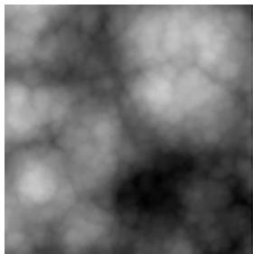


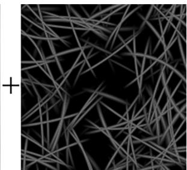


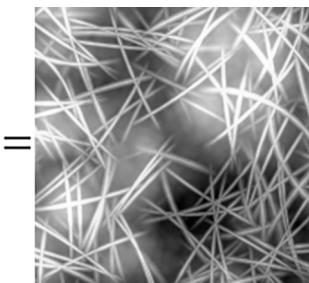


Figure 10.2. Adding source and destination color. Adding creates a brighter image since color is being added.


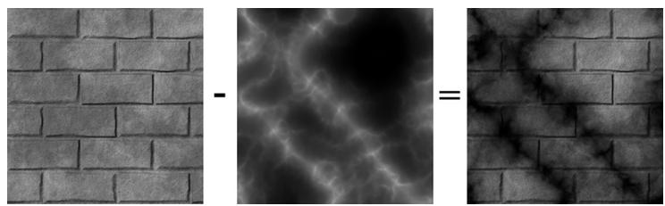


Figure 10.3. Subtracting source color from destination color. Subtraction creates a darker image since color is being removed.


# 10.5.3 Multiplying

Suppose that we want to multiply a source pixel with its corresponding destination pixel (see Figure 10.4). To do this, we set the source blend factor to D3D12_BLEND_ZERO, the destination blend factor to D3D12_BLEND_SRC_COLOR, and the blend operator to D3D12_BLEND_OP_ADD. With this setup, the blending equation reduces to: 

$$
\begin{array}{l} \mathbf {C} = \mathbf {C} _ {s r c} \otimes \mathbf {F} _ {s r c} \boxplus \mathbf {C} _ {d s t} \otimes \mathbf {F} _ {d s t} \\ \mathbf {C} = \mathbf {C} _ {s r c} \otimes (0, 0, 0) + \mathbf {C} _ {d s t} \otimes \mathbf {C} _ {s r c} \\ \mathbf {C} = \mathbf {C} _ {d s t} \otimes \mathbf {C} _ {s r c} \\ \end{array}
$$

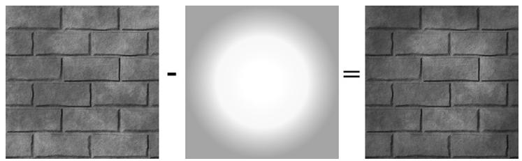


Figure 10.4. Multiplying source color and destination color.


# 10.5.4 Transparency

Let the source alpha component $a _ { s }$ be thought of as a percent that controls the opacity of the source pixel (e.g., 0 alpha means $0 \%$ opaque, 0.4 means $4 0 \%$ opaque, and 1.0 means $1 0 0 \%$ opaque). The relationship between opacity and transparency is simply $T = 1 - A$ , where $A$ is opacity and $T$ is transparency. For instance, if something is 0.4 opaque, then it is $1 - 0 . 4 { = } 0 . 6$ transparent. Now suppose that we want to blend the source and destination pixels based on the opacity of the source pixel. To do this, set the source blend factor to D3D12_BLEND_SRC_ALPHA and the destination blend factor to D3D12_BLEND_INV_SRC_ALPHA, and the blend operator to D3D12_BLEND_OP_ADD. With this setup, the blending equation reduces to: 

$$
\mathbf {C} = \mathbf {C} _ {s r c} \otimes \mathbf {F} _ {s r c} \boxplus \mathbf {C} _ {d s t} \otimes \mathbf {F} _ {d s t}
$$

$$
\mathbf {C} = \mathbf {C} _ {s r c} \otimes \left(a _ {s}, a _ {s}, a _ {s}\right) + \mathbf {C} _ {d s t} \otimes \left(1 - a _ {s}, 1 - a _ {s}, 1 - a _ {s}\right)
$$

$$
\mathbf {C} = a _ {s} \mathbf {C} _ {s r c} + \left(1 - a _ {s}\right) \mathbf {C} _ {d s t}
$$

For example, suppose $a _ { s } = 0 . 2 5$ , which is to say the source pixel is only $2 5 \%$ opaque. Then when the source and destination pixels are blended together, we expect the final color will be a combination of $2 5 \%$ of the source pixel and $7 5 \%$ of the destination pixel (the pixel “behind” the source pixel), since the source pixel is $7 5 \%$ transparent. The equation above gives us precisely this: 

$$
\mathbf {C} = a _ {s} \mathbf {C} _ {s r c} + \left(1 - a _ {s}\right) \mathbf {C} _ {d s t}
$$

$$
\mathbf {C} = 0. 2 5 \mathbf {C} _ {s r c} + 0. 7 5 \mathbf {C} _ {d s t}
$$

Using this blending method, we can draw transparent objects like the one in Figure 10.1. It should be noted that with this blending method, the order that you draw the objects matters. We use the following rule: 

Draw objects that do not use blending first. Next, sort the objects that use blending by their distance from the camera. Finally, draw the objects that use blending in a back-to-front order. 

The reason for the back-to-front draw order is so that objects are blended with the objects spatially behind them. For if an object is transparent, we can see through it to see the scene behind it. So it is necessary that all the pixels behind the transparent object have already been written to the back buffer, so that we can blend the transparent source pixels with the destination pixels of the scene behind it. 

For the blending method in $\ S 1 0 . 5 . 1$ , draw order does not matter since it simply prevents source pixel writes to the back buffer. For the blending methods discussed in $\ S 1 0 . 5 . 2$ and 10.5.3, we still draw non-blended objects first and blended objects last; this is because we want to first lay all the non-blended geometry onto the back buffer before we start blending. However, we do not need to sort the objects that use blending. This is because the operations are commutative. That is, if you start with a back buffer pixel color B, and then do n additive/subtractive/multiplicative blends to that pixel, the order does not matter: 

$$
\mathbf {B} ^ {\prime} = \mathbf {B} + \mathbf {C} _ {0} + \mathbf {C} _ {1} + \dots + \mathbf {C} _ {n - 1}
$$

$$
\mathbf {B} ^ {\prime} = \mathbf {B} - \mathbf {C} _ {0} - \mathbf {C} _ {1} - \dots - \mathbf {C} _ {n - 1}
$$

$$
\mathbf {B} ^ {\prime} = \mathbf {B} \otimes \mathbf {C} _ {0} \otimes \mathbf {C} _ {1} \otimes \dots \otimes \mathbf {C} _ {n - 1}
$$

# 10.5.5 Blending and the Depth Buffer

When blending with additive/subtractive/multiplicative blending, an issue arises with the depth test. For the sake of example, we will explain only with additive 

blending, but the same idea holds for subtractive/multiplicative blending. If we are rendering a set S of objects with additive blending, the idea is that the objects in S do not obscure each other; instead, their colors are meant to simply accumulate (see Figure 10.5). Therefore, we do not want to perform the depth test between objects in S; for if we did, without a back-to-front draw ordering, one of the objects in S would obscure another object in S, thus causing the pixel fragments to be rejected due to the depth test, which means that object’s pixel colors would not be accumulated into the blend sum. We can disable the depth test between objects in S by disabling writes to the depth buffer while rendering objects in S. Because depth writes are disabled, the depths of an object in S drawn with additive blending will not be written to the depth buffer; hence, this object will not obscure any later drawn object in S behind it due to the depth test. Note that we only disable depth writes while drawing the objects in S (the set of objects drawn with additive blending). Depth reads and the depth test are still enabled. This is so that non-blended geometry (which is drawn before blended geometry) will still obscure blended geometry behind it. For example, if you have a set of additively blended objects behind a wall, you will not see the blended objects because the solid wall obscures them. How to disable depth writes and, more generally, configure the depth test settings will be covered in the next chapter. 

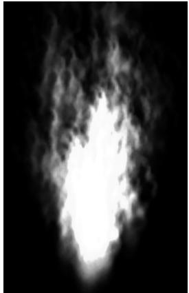


Figure 10.5. With additive blending, the intensity is greater near the source point where more particles are overlapping and being added together. As the particles spread out, the intensity weakens because there are less particles overlapping and being added together.


# 10.6 ALPHA CHANNELS

The example from $\ S 1 0 . 5 . 4$ showed that source alpha components can be used in RGB blending to control transparency. The source color used in the blending equation comes from the pixel shader. As we saw in the last chapter, we return 

the diffuse material’s alpha value as the alpha output of the pixel shader. Thus the alpha channel of the diffuse map is used to control transparency. 

float4 PS(VertexOut pin) : SV_Target   
{ MaterialData matData = gMaterialData[gMaterialIndex]; float4 diffuseAlbedo = matData.DiffuseAlbedo; float3 fresnelR0 = matData.FresnelR0; float roughness = matData.Roughness; uint diffuseMapIndex = matData.DiffuseMapIndex; //Dynamically look up the texture in the heap. Texture2D diffuseMap = ResourceDescriptorHeap[diffuseMapIndex]; diffuseAlbedo $\ast =$ diffuseMap_SAMPLE(GetAnisoWrapSampler(), pin. TexC); ... //Common convention to take alpha from diffuse albedo. litColor.a $=$ diffuseAlbedo.a; return litColor; 

You can generally add an alpha channel in any popular image editing software, such as Adobe Photoshop, and then save the image to an image format that supports an alpha channel like DDS. 

# 10.7 CLIPPING PIXELS

Sometimes we want to completely reject a source pixel from being further processed. This can be done with the intrinsic HLSL clip(x) function. This function can only be called in a pixel shader, and it discards the current pixel from further processing if $\textup { \textsf { x } } < \ 0$ . This function is useful to render wire fence textures, for example, like the one shown in Figure 10.6. That is, it is useful for rendering pixels were a pixel is either completely opaque or completely transparent. 

In the pixel shader, we grab the alpha component of the texture. If it is a small value close to 0, which indicates that the pixel is completely transparent, then we clip the pixel from further processing. 

```cpp
float4 PS(VertexOut pin) : SV_Target  
{ MaterialData matData = gMaterialData[gMaterialIndex]; float4 diffuseAlbedo = matData.DiffuseAlbedo; float3 fresnelR0 = matData.FresnelR0; float roughness = matData.Roughness; uint diffuseMapIndex = matData.DiffuseMapIndex; 
```

//Dynamically look up the texture in the heap. Texture2D diffuseMap $=$ DescriptorHeap[diffuseMapIndex]; diffuseAlbedo $\ast =$ diffuseMap_SAMPLE(GetAnisoWrapSampler(), pin. TexC);   
#ifdef ALPHA_TEST //Discard pixel if texture alpha $<  0.1$ .We do this test as soon //as possible in the shader so that we can potentially exit the //shader early,thereby skipping the rest of the shader code. clip(diffuseAlbedo.a-0.1f);   
endif ... //Common convention to take alpha from diffuse albedo. litColor.a $=$ diffuseAlbedo.a; return litColor;   
} 

Observe that we only clip if ALPHA_TEST is defined; this is because we might not want to invoke clip for some render items, so we need to be able to switch it on/ off by having specialized shaders. Moreover, there is a cost to using alpha testing, so we should only use it if we need it. 

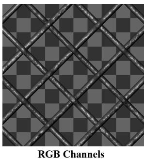


Figure 10.6. A wire fence texture with its alpha channel. The pixels with black alpha values will be rejected by the clip function and not drawn; hence, only the wire fence remains. Essentially, the alpha channel is used to mask out the non fence pixels from the texture.


Note that the same result can be obtained using blending, but this is more efficient. For one thing, no blending calculation needs to be done (blending can be disabled). Also, the draw order does not matter. And furthermore, by discarding a pixel early from the pixel shader, the remaining pixel shader instructions can be skipped (no point in doing the calculations for a discarded pixel). 

Due to filtering, the alpha channel can get blurred a bit, so you should leave some buffer room when clipping pixels. For example, clip pixels with alpha values close to 0, but not necessarily exactly zero. 

Figure 10.7 shows a screenshot of the “Blend” demo. It renders semi-transparent water using transparency blending, and renders the wire fenced box using the clip test. One other change worth mentioning is that, because we can now see through the box with the fence texture, we want to disable back face culling for alpha tested objects: 

```cpp
// PSO for alpha tested objects  
D3D12graphicspipeline_STATE_DESC alphaTestedPsoDesc = basePsoDesc;  
alphaTestedPsoDesc.PS = {  
    reinterpret_cast<BYTE*>(mShaders["alphaTestedPS"]->GetBufferPointer(), mShaders["alphaTestedPS"]->GetBufferSize())  
};  
alphaTestedPsoDesc.RasterizerState.CullMode = D3D12_CULL_MODE_NON;  
ThrowIfFailed Md3dDevice->CreateGraphicsPipelineState( &alphaTestedPsoDesc, IID_PPVALRS(&mPSOs["alphaTested"]), 
```

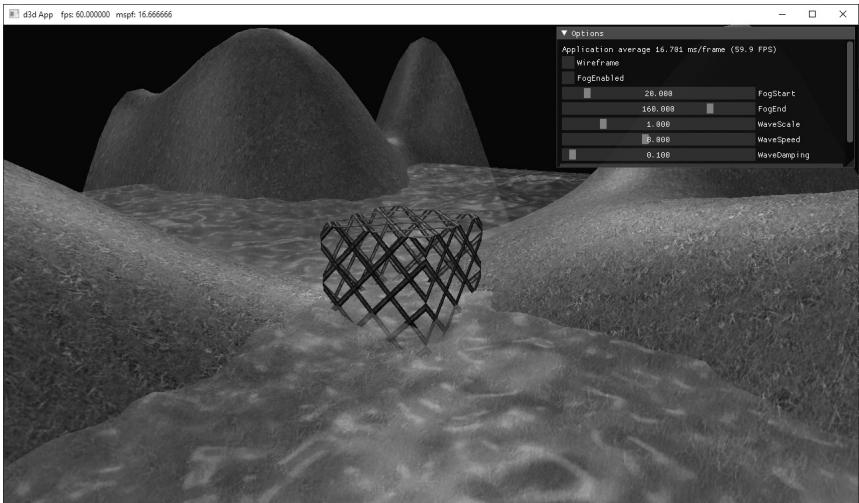


Figure 10.7. Screenshot of the “Blend” demo.


# 10.8 FOG

To simulate certain types of weather conditions in our games, we need to be able to implement a fog effect; see Figure 10.8. In addition to the obvious purposes of fog, fog provides some fringe benefits. For example, it can mask distant rendering artifacts and prevent popping. Popping refers to when an object that was previously behind the far plane all of a sudden comes in front of the frustum, 

due to camera movement, and thus becomes visible; so it seems to “pop” into the scene abruptly. By having a layer of fog in the distance, the popping is hidden. Note that if your scene takes place on a clear day, you may wish to still include a subtle amount of fog at far distances, because, even on clear days, distant objects such as mountains appear hazier and lose contrast as a function of depth, and we can use fog to simulate this atmospheric perspective phenomenon. 

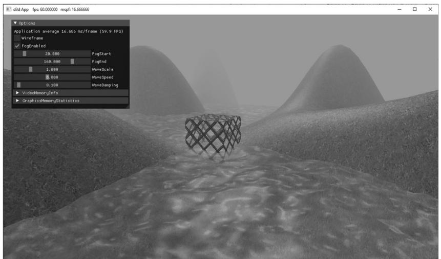


Figure 10.8. Screenshot of the “Blend” demo with fog enabled.


Our strategy for implementing fog works as follows: We specify a fog color, a fog start distance from the camera and a fog range (i.e., the range from the fog start distance until the fog completely hides any objects). Then the color of a point on a triangle is a weighted average of its usual color and the fog color: 

$$
\begin{array}{l} f o g g e d C o l o r = l i t C o l o r + s (f o g C o l o r - l i t C o l o r) \\ = (1 - s) \cdot l i t C o l o r + s \cdot f o g C o l o r \\ \end{array}
$$

The parameter s ranges from 0 to 1 and is a function of the distance between the camera position and the surface point. As the distance between a surface point and the eye increases, the point becomes more and more obscured by the fog. The parameter $s$ is defined as follows: 

$$
s = \text {s a t u r a t e} \left(\frac {\operatorname {d i s t} (\mathbf {p} , \mathbf {E}) - f o g S t a r t}{f o g R a n g e}\right)
$$

where $\mathrm { d i s t } ( \mathbf { p } , \mathbf { E } )$ is the distance between the surface point p and the camera position E. The saturate function clamps the argument to the range [0, 1]: 

$$
s a t u r a t e (x) = \left\{ \begin{array}{c} x, 0 \leq x \leq 1 \\ 0, x <   0 \\ 1, x > 1 \end{array} \right.
$$

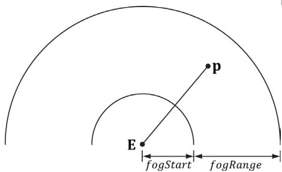


Figure 10.9. The distance of a point from the eye, and the fogStart and fogRange parameters.


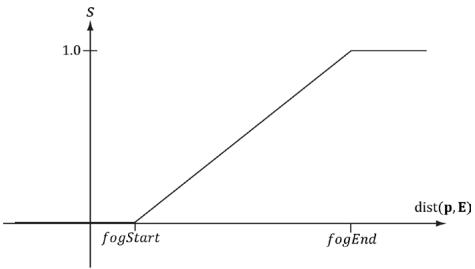


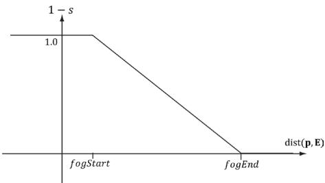


Figure 10.10. (Left): A plot of s (the fog color weight) as a function of distance. (Right): A plot of $\uparrow - s$ (the lit color weight) as a function of distance. As s increases, $\left( 1 - s \right)$ decreases the same amount.


Figure 10.10 shows a plot of s as a function of distance. We see that when dist(p, E) ≤ fogStart, $s { = } 0$ and the fogged color is given by: 

$$
f o g g e d C o l o r = l i t C o l o r
$$

In other words, the fog does not modify the color of vertices whose distance from the camera is less than fogStart. This makes sense based on the name “fogStart”; the fog does not start affecting the color until the distance from the camera is at least that of fogStart . 

Let $f o g E n d = f o g S t a r t + f o g R a n g e$ . When dist( , p E) , ≥ fogEnd $s { = } 1$ and the fogged color is given by: 

$$
f o g g e d C o l o r = f o g C o l o r
$$

In other words, the fog completely hides the surface point at distances greater than or equal to fogEnd —so all you see is the fog color. 

When $f o g S t a r t < \mathrm { d i s t } ( \mathbf { p } , \mathbf { E } ) < f o g E n d$ , we see that s linearly ramps up from 0 to 1 as dist( , p E) increases from fogStart to fogEnd . This means that as the distance increases, the fog color gets more and more weight while the original color gets less and less weight. This makes sense, of course, because as the distance increases, the fog obscures more and more of the surface point. 

The following shader code shows how fog is implemented. We compute the distance and interpolation at the pixel level, after we have computed the lit color. 

```cpp
// Include common HLSL code. #include "Shaders/Common.hls1"   
struct VertexIn { float3 PosL : POSITION; float3 NormalL : NORMAL; float2 TexC : TEXCOORD; } ;   
struct VertexOut { float4 PosH : SV POSITION; float3 PosW : POSITION0; float3 NormalW : NORMAL; float2 TexC : TEXCOORD; } ;   
VertexOut VS(VertexIn vin) { VertexOut vout = (VertexOut)0.0f; MaterialData matData = gMaterialData[gMaterialIndex]; // Transform to world space. float4 posW = mul(float4(vin(PosL, 1.0f), gWorld); vout_PosW = posW.xyz; // Assumes nonuniform scaling; otherwise, need to use // inverse-transpose of world matrix. vout.NormalW = mul(vin.NormalL, (float3x3)gWorld); // Transform to homogeneous clip space. vout_PosH = mul(posW, gViewProj); // Output vertex attributes for interpolation across triangle. 
```

float4 texC $=$ mul(float4(vin.TexC,0.0f,1.0f)，gTexTransform);vout.TexC $\equiv$ mul(texC，matData.MatTransform).xy;return vout;   
}   
float4 PS(VertexOut pin)：SV_Target{MaterialData matData $=$ gMaterialData[gMaterialIndex];float4 diffuseAlbedo $=$ matData.DiffuseAlbedo;float3 fresnelR0 $=$ matData.FresnelR0;float roughness $=$ matData.Roughness;uint diffuseMapIndex $=$ matData.DiffuseMapIndex; //Dynamically look up the texture in the heap.Texture2D diffuseMap $=$ ResourceDescriptorHeap[diffuseMapIndex];diffuseAlbedo $\ast =$ diffuseMap_SAMPLE(GetAnisoWrapSampler(),pin. TexC);#endif ALPHA_TEST//Discard pixel if texture alpha $<  0.1$ .We do this test as soon//as possible in the shader so that we can potentially exit the//shader early,thereby skipping the rest of the shader code. clip(diffuseAlbedo.a-0.1f);endif// Interpolating normal can unnormalize it,so renormalize it.float3 normalW $=$ normalize(pin.NormalW);// Vector from point being lit to eye.float3 toEyeW $=$ gEyePosW - pin(PosW;float distToEye $=$ length(toEyeW);toEyeW $= =$ distToEye; // normalize// Light terms.float4 ambient $=$ gAmbientLight\*diffuseAlbedo;const float shininess $= (1.0f$ -roughness);Material mat $=$ {diffuseAlbedo,fresnelR0, shininess $\}$ float4 directLight $=$ ComputeLighting(gLights,mat，pin(PosW, normalW,toEyeW);float4 litColor $=$ ambient + directLight;if( gFogEnabled）{float fogAmount $=$ saturate((distToEye-gFogStart)/ gFogRange);litColor $=$ lerpl(litColor,gFogColor,fogAmount);} //Common convention to take alpha from diffuse albedo. litColor.a $=$ diffuseAlbedo.a; 

```cpp
returnlitColor; 
```

Observe that in the fog calculation, we use the distToEye value that we also computed to normalize the toEyeW vector. A less optimal implementation would have been to write the following: 

```javascript
float3 toEye = normalize(gEyePosW - pin(PosW);  
float distToEye = distance(gEyePosW, pin(PosW); 
```

This essentially computes the length of the toEye vector twice, once in the normalize function, and again in the distance function. 

Some scenes may not want to use fog; therefore, we make fog optional and it is enabled by a constant gFogEnabled in the PerPassCB. Other per-pass constants for fog are as follows: 

```cpp
float4 gFogColor;  
float gFogStart;  
float gFogRange; 
```

In the application, we use ImGUI to toggle the fog on and off, and to adjust the fog start and end range. 

Recall that we define render-item layers so that we can draw render-items with different states. 

enum class RenderLayer : int {Opaque $= 0$ Transparent, AlphaTested, Debug, Sky, Count }; 

Thus far, we have drawn opaque objects and have not really needed multiple layers. But in this demo, we need to draw opaque objects, alpha blended objects, and alpha tested objects, each with a different PSO. Thus, our drawing code looks like this: 

```cpp
mCommandList->SetPipelineState( mDrawWireframe ? mPSOs["opaque_wireframe"].Get() : mPSOs["opaque"].Get(); DrawRenderItems(mCommandList.Get(), mRItemLayer[(int) RenderLayer::Opaque]);   
mCommandList->SetPipelineState( mDrawWireframe ? mPSOs["opaque_wireframe"].Get() : mPSOs["alphaTested"].Get()); 
```

```cpp
DrawRenderItems(mCommandList.Get(), mRItemLayer[(int) RenderLayer::AlphaTested]);  
mCommandList->SetPipelineState(mDrawWireframe ? mPSOs["opaque_wireframe"].Get() : mPSOs["transparent"].Get());  
DrawRenderItems(mCommandList.Get(), mRItemLayer[(int) RenderLayer::Transparent)]; 
```

# 10.9 SUMMARY

1. Blending is a technique which allows us to blend (combine) the pixels that we are currently rasterizing (so-called source pixels) with the pixels that were previously rasterized to the back buffer (so-called destination pixels). This technique enables us, among other things, to render semi-transparent objects such as water and glass. 

2. The blending equation is: 

$$
\mathbf {C} = \mathbf {C} _ {s r c} \otimes \mathbf {F} _ {s r c} \boxplus \mathbf {C} _ {d s t} \otimes \mathbf {F} _ {d s t}
$$

$$
A = A _ {s r c} F _ {s r c} \boxplus A _ {d s t} F _ {d s t}
$$

Note that RGB components are blended independently to alpha components. The  binary operator can be one of the operators defined by the D3D12_ BLEND_OP enumerated type. 

3. $\mathbf { F } _ { s r c } ,$ Fdst, Fsrc, and $F _ { d s t }$ are called blend factors, and they provide a means for customizing the blending equation. They can be a member of the D3D12_BLEND enumerated type. For the alpha blending equation, blend factors ending with _COLOR are not allowed. 

4. Source alpha information comes from the diffuse material. In our framework, the diffuse material is defined by a texture map, and the texture’s alpha channel stores the alpha information. 

5. Source pixels can be completely rejected from further processing using the intrinsic HLSL clip(x) function. This function can only be called in a pixel shader, and it discards the current pixel from further processing if $ { \mathrm { ~  ~ { ~ \cal ~ x ~ } ~ } } { } <  { \mathrm { ~  ~ { ~ \cal ~ O ~ } ~ } }$ . Among other things, this function is useful for efficiently rendering pixels were a pixel is either completely opaque or completely transparent (it is used to reject completely transparent pixels—pixels with an alpha value near zero). 

6. Use fog to model various weather effects and atmospheric perspective, to hide distant rendering artifacts, and to hide popping. In our linear fog model, we specify a fog color, a fog start distance from the camera and a fog range. The color of a point on a triangle is a weighted average of its usual color and the fog color: 

$$
\begin{array}{l} f o g g e d C o l o r = l i t C o l o r + s (f o g C o l o r - l i t C o l o r) \\ = (1 - s) \cdot l i t C o l o r + s \cdot f o g C o l o r \\ \end{array}
$$

The parameter s ranges from 0 to 1 and is a function of the distance between the camera position and the surface point. As the distance between a surface point and the eye increases, the point becomes more and more obscured by the fog. 

# 10.10 EXERCISES

1. Experiment with different blend operation and blend factor combinations. 

2. Modify the “Blend” demo by drawing the water first. Explain the results. 

3. Suppose $f o g S t a r t = 1 0$ and $f o g R a n g e = 2 0 0 .$ Compute foggedColor for when 

a) dist( , p E) = 160 

b) dist( , p E) = 110 

c) dist( , p E) = 60 

d) dist( , p E) = 30 

4. Verify the compiled pixel shader without ALPHA_TEST defined does not have a discard instruction, and the compiled pixel shader with ALPHA_TEST does, by looking at the generated shader assembly. The discard instruction corresponds to the HLSL clip instruction. 


Look at the DXC flags for how to output the generated assembly. 

5. Modify the “Blend” demo by creating and applying a blend render state that disables color writes to the red and green color channels. 