Chapter 

# 11 Stencil ing

The stencil buffer is an off-screen buffer we can use to achieve some special effects. The stencil buffer has the same resolution as the back buffer and depth buffer, such that the ijth pixel in the stencil buffer corresponds with the ijth pixel in the back buffer and depth buffer. Recall from $\ S 4 . 1 . 5$ that when a stencil buffer is specified, it comes attached to the depth buffer. As the name suggests, the stencil buffer works as a stencil and allows us to block the rendering of certain pixel fragments to the back buffer. 

For instance, when implementing a mirror, we need to reflect an object across the plane of the mirror; however, we only want to draw the reflection into the mirror. We can use the stencil buffer to block the rendering of the reflection unless it is being drawn into the mirror (see Figure 11.1). 

The stencil buffer (and also the depth buffer) state is configured by filling out a D3D12_DEPTH_STENCIL_DESC instance and assigning it to the D3D12_GRAPHICS PIPELINE_STATE_DESC::DepthStencilState field of a pipeline state object (PSO). Learning to use the stencil buffer effectively comes best by studying existing example application. Once you understand a few applications of the stencil buffer, you will have a better idea of how it can be used for your own specific needs. 

# Chapter Objectives:

1. To find out how to control the depth and stencil buffer state by filling out the D3D12_DEPTH_STENCIL_DESC field in a pipeline state object. 

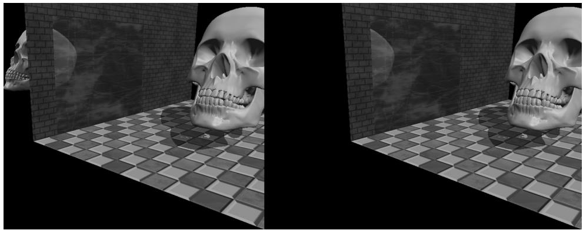


Figure 11.1. (Left) The reflected skull shows properly in the mirror. The reflection does not show through the wall bricks because it fails the depth test in this area. However, looking behind the wall we are able to see the reflection, thus breaking the illusion (the reflection should only show up through the mirror). (Right) By using the stencil buffer, we can block the reflected skull from being rendered unless it is being drawn in the mirror.


2. To learn how to implement mirrors by using the stencil buffer to prevent reflections from being drawn to non-mirror surfaces. 

3. To be able to identify double blending and understand how the stencil buffer can prevent it. 

4. To explain depth complexity and describe two ways the depth complexity of a scene can to measured. 

# 11.1 DEPTH/STENCIL FORMATS AND CLEARING

Recalling that the depth/stencil buffer is a texture, it must be created with certain data formats. The formats used for depth/stencil buffering are as follows: 

1. DXGI_FORMAT_D32_FLOAT_S8X24_UINT: Specifies a 32-bit floating-point depth buffer, with 8-bits (unsigned integer) reserved for the stencil buffer mapped to the [0, 255] range and 24-bits not used for padding. 

2. DXGI_FORMAT_D24_UNORM_S8_UINT: Specifies an unsigned 24-bit depth buffer mapped to the [0, 1] range with 8-bits (unsigned integer) reserved for the stencil buffer mapped to the [0, 255] range. 

In our D3DApp framework, when we create the depth buffer, we specify: 

```cpp
DXGI_FORMAT mDepthStencilFormat = DXGI_FORMAT_D24_UNORM_S8_UID; depthStencilDesc.Format = mDepthStencilFormat; 
```

Also, the stencil buffer should be reset to some value at the beginning of each frame. This is done with the following method (which also clears the depth buffer): 

```cpp
void ID3D12GraphicsCommandList::ClearDepthStencilView( D3D12_CPU DescriptorHandle DepthStencilView, D3D12_CLEAR_flags ClearFlags, FLOAT Depth, UINT8Stencil, UINT NumRects, const D3D12_RECT *pRects); 
```

1. DepthStencilView: Descriptor to the view of the depth/stencil buffer we want to clear. 

2. ClearFlags: Specify D3D12_CLEAR_FLAG_DEPTH to clear the depth buffer only; specify D3D12_CLEAR_FLAG_STENCIL to clear the stencil buffer only; specify D3D12_CLEAR_FLAG_DEPTH | D3D12_CLEAR_FLAG_STENCIL to clear both. 

3. Depth: The float-value to set each pixel in the depth buffer to; it must be a floating point number $x$ such that $0 \leq x \leq 1$ . 

4. Stencil: The integer-value to set each pixel of the stencil buffer to; it must be an integer n such that $0 \leq n \leq 2 5 5$ . 

5. NumRects: The number of rectangles in the array pRects points to. 

6. pRects: An array of D3D12_RECTs marking rectangular regions on the depth/ stencil buffer to clear; specify nullptr to clear the entire depth/stencil buffer. 

We have already been calling this method every frame in our demos. For example: 

```cpp
mCommandList->ClearDepthStencilView(DepthStencilView(), D3D12_CLEAR_FLAG_DEPTH | D3D12_CLEAR_FLAG_STENCIL, 1.0f, 0, 0, nullptr); 
```

# 11.2 THE STENCIL TEST

As previously stated, we can use the stencil buffer to block rendering to certain areas of the back buffer. The decision to block a particular pixel from being written is decided by the stencil test, which is given by the following: 

if( StencilRef & StencilReadMask $\leq$ Value & StencilReadMask) accept pixel else reject pixel 

The stencil test is performed as pixels get rasterized (i.e., during the outputmerger stage), assuming stenciling is enabled, and takes two operands: 

1. A left-hand-side (LHS) operand that is determined by ANDing an applicationdefined stencil reference value (StencilRef) with an application-defined masking value (StencilReadMask). 

2. A right-hand-side (RHS) operand that is determined by ANDing the entry already in the stencil buffer of the particular pixel we are testing (Value) with an application-defined masking value (StencilReadMask). 

Note that the StencilReadMask is the same for the LHS and the RHS. The stencil test then compares the LHS with the RHS as specified an application-chosen comparison function $\trianglelefteq$ , which returns a true or false value. We write the pixel to the back buffer if the test evaluates to true (assuming the depth test also passes). If the test evaluates to false, then we block the pixel from being written to the back buffer. And of course, if a pixel is rejected due to failing the stencil test, it is not written to the depth buffer either. 

The $\trianglelefteq$ operator is any one of the functions defined in the D3D12_COMPARISON_ FUNC enumerated type: 

```c
typedef enum D3D12_COMPARISON FUNC  
{  
    D3D12_COMPARISON NEVER = 1,  
    D3D12_COMPARISON LESS = 2,  
    D3D12_COMPARISON EQUAL = 3,  
    D3D12_COMPARISON LESS_EQUAL = 4,  
    D3D12_COMPARISON GREATER = 5,  
    D3D12_COMPARISON_NOT_EQUAL = 6,  
    D3D12_COMPARISON GREATER_EQUAL = 7,  
    D3D12_COMPARISON ALWAYS = 8,  
} D3D12_COMPARISON FUNC; 
```

1. D3D12_COMPARISON_NEVER: The function always returns false. 

2. D3D12_COMPARISON_LESS: Replace $\trianglelefteq$ with the $<$ operator. 

3. D3D12_COMPARISON_EQUAL: Replace $\trianglelefteq$ with the $=$ operator. 

4. D3D12_COMPARISON_LESS_EQUAL: Replace $\trianglelefteq$ with the $\leq$ operator. 

5. D3D12_COMPARISON_GREATER: Replace $\trianglelefteq$ with the $>$ operator. 

6. D3D12_COMPARISON_NOT_EQUAL: Replace $\trianglelefteq$ with the ! $=$ operator. 

7. D3D12_COMPARISON_GREATER_EQUAL: Replace $\trianglelefteq$ with the $\geq$ operator. 

8. D3D12_COMPARISON_ALWAYS: The function always returns true. 

# 11.3 DESCRIBING THE DEPTH/STENCIL STATE

The depth/stencil state is described by filling out a D3D12_DEPTH_STENCIL_DESC instance: 

```c
typedef struct D3D12_DEPTHStencil_DESC {  
    BOOL DepthEnable; // Default True  
    // Default: D3D11_DEPTH_WRITE_MASK_ALL  
    D3D12_DEPTH_WRITE_MASKDepthWriteMask; 
```

```c
// Default: D3D11_COMPARISON LESS  
D3D12_COMPARISON FUNC DepthFunc;  
BOOL StencilEnable; // Default: False  
UINT8 StencilReadMask; // Default: 0xff  
UINT8 StencilWriteMask; // Default: 0xff  
D3D12_DEPTH_STENCILOP_DESC FrontFace;  
D3D12_DEPTH_STENCILOP_DESC BackFace;  
} D3D12_DEPTH_STENCIL_DESC; 
```

# 11.3.1 Depth Settings

1. DepthEnable: Specify true to enable the depth buffering; specify false to disable it. 

When depth testing is disabled, the draw order matters, and a pixel fragment will be drawn even if it is behind an occluding object (review $\ S 4 . 1 . 5 \AA$ ). If depth buffering is disabled, elements in the depth buffer are not updated either, regardless of the DepthWriteMask setting. 

2. DepthWriteMask: This can be either D3D12_DEPTH_WRITE_MASK_ZERO or D3D12_ DEPTH_WRITE_MASK_ALL, but not both. Assuming DepthEnable is set to true, D3D12_DEPTH_WRITE_MASK_ZERO disables writes to the depth buffer, but depth testing will still occur. D3D12_DEPTH_WRITE_MASK_ALL enables writes to the depth buffer; new depths will be written provided the depth and stencil test both pass. The ability to control depth reads and writes becomes necessary for implementing certain special effects. 

3. DepthFunc: Specify one of the members of the D3D12_COMPARISON_FUNC enumerated type to define the depth test comparison function. Usually this is always D3D12_COMPARISON_LESS so that the usual depth test is performed, as described in $\ S 4 . 1 . 5$ . That is, a pixel fragment is accepted provided its depth value is less than the depth of the previous pixel written to the back buffer. But as you can see, Direct3D allows you to customize the depth test if necessary. 

# 11.3.2 Stencil Settings

1. StencilEnable: Specify true to enable the stencil test; specify false to disable it. 

2. StencilReadMask: The StencilReadMask used in the stencil test: 

if( StencilRef & StencilReadMask $\trianglelefteq$ Value & StencilReadMask) accept pixel else reject pixel 

The default does not mask any bits: 

```cpp
define D3D12_DEFAULT_STENCIL_READ_MASK (0xff) 
```

3. StencilWriteMask: When the stencil buffer is being updated, we can mask off certain bits from being written to with the write mask. For example, if you wanted to prevent the top 4 bits from being written to, you could use the write mask of 0x0f. The default value does not mask any bits: 

```cpp
define D3D12_DEFAULT_STENCIL_WRITE_MASK (0xff) 
```

4. FrontFace: A filled out D3D12_DEPTH_STENCILOP_DESC structure indicating how the stencil buffer works for front facing triangles. 

5. BackFace: A filled out D3D12_DEPTH_STENCILOP_DESC structure indicating how the stencil buffer works for back facing triangles. 

```c
typedef struct D3D12_DEPTH_STENCILOP_DESC {  
    D3D12_STENCIL_OP StencilFailOp; // Default: D3D12_STENCIL_OP_KEEP  
    D3D12_STENCIL_OP StencilDepthFailOp; // Default: D3D12_STENCIL_OP_KEEP  
    D3D12_STENCIL_OP StencilPassOp; // Default: D3D12_STENCIL_OP_KEEP  
    D3D12comparisonFUNC StencilFunc; // Default: D3D12comparison ALWAYS  
} D3D12_DEPTH_STENCILOP_DESC; 
```

1. StencilFailOp: A member of the D3D12_STENCIL_OP enumerated type describing how the stencil buffer should be updated when the stencil test fails for a pixel fragment. 

2. StencilDepthFailOp: A member of the D3D12_STENCIL_OP enumerated type describing how the stencil buffer should be updated when the stencil test passes but the depth test fails for a pixel fragment. 

3. StencilPassOp: A member of the D3D12_STENCIL_OP enumerated type describing how the stencil buffer should be updated when the stencil test and depth test both pass for a pixel fragment. 

4. StencilFunc: A member of the D3D12_COMPARISON_FUNC enumerated type to define the stencil test comparison function. 

typedef   
enum D3D12_STENCIL_OP   
{ D3D12_STENCIL_OP_KEEP $= 1$ D3D12_STENCIL_OP_ZERO $= 2$ D3D12_STENCIL_OP_REPLACE $= 3$ D3D12_STENCIL_OP_INCR_SAT $= 4$ D3D12_STENCIL_OP_DECR_SAT $= 5$ D3D12_STENCIL_OP_INVERT $= 6$ D3D12_STENCIL_OP_INCR $= 7$ D3D12_STENCIL_OP_DECR $= 8$ } D3D12_STENCIL_OP; 

1. D3D12_STENCIL_OP_KEEP: Specifies to not change the stencil buffer; that is, keep the value currently there. 

2. D3D12_STENCIL_OP_ZERO: Specifies to set the stencil buffer entry to zero. 

3. D3D12_STENCIL_OP_REPLACE: Specifies to replaces the stencil buffer entry with the stencil-reference value (StencilRef) used in the stencil test. Note that the StencilRef value is set by a separate function on the command list (§11.3.3). 

4. D3D12_STENCIL_OP_INCR_SAT: Specifies to increment the stencil buffer entry. If the incremented value exceeds the maximum value (e.g., 255 for an 8-bit stencil buffer), then we clamp the entry to that maximum. 

5. D3D12_STENCIL_OP_DECR_SAT: Specifies to decrement the stencil buffer entry. If the decremented value is less than zero, then we clamp the entry to zero. 

6. D3D12_STENCIL_OP_INVERT: Specifies to invert the bits of the stencil buffer entry. 

7. D3D12_STENCIL_OP_INCR: Specifies to increment the stencil buffer entry. If the incremented value exceeds the maximum value (e.g., 255 for an 8-bit stencil buffer), then we wrap to 0. 

8. D3D12_STENCIL_OP_DECR: Specifies to decrement the stencil buffer entry. If the decremented values is less than zero, then we wrap to the maximum allowed value. 

Note: 

Observe that the stenciling behavior for front facing and back facing triangles can be different. The BackFace settings are irrelevant in the case that we do not render back facing polygons due to back face culling. However, sometimes we do need to render back facing polygons for certain graphics algorithms, or for transparent geometry (like the wire fence box, where we could see through the box to see the back sides). In these cases, the BackFace settings are relevant. 

# 11.3.3 Creating and Binding a Depth/Stencil State

Once we have fully filled out a D3D12_DEPTH_STENCIL_DESC instance describing our depth/stencil state, we can assign it to the D3D12_GRAPHICS_PIPELINE_STATE DESC::DepthStencilState field of a PSO. Any geometry drawn with this PSO will be rendered with the depth/stencil settings of the PSO. 

One detail we have not mentioned yet is how to set the stencil reference value. The stencil reference value is set with the ID3D12GraphicsCommandList::OMSetStenc ilRef method, which takes a single unsigned integer parameter; for example, the following sets the stencil reference value to 1: 

mCommandList->OMSetStencilRef(1); 

# 11.4 IMPLEMENTING PLANAR MIRRORS

Many surfaces in nature serve as mirrors and allow us to see the reflections of objects. This section describes how we can simulate mirrors for our 3D applications. Note that for simplicity, we reduce the task of implementing mirrors to planar surfaces only. For instance, a shiny car can display a reflection; however, a car’s body is smooth, round, and not planar. Instead, we render reflections such as those that are displayed in a shiny marble floor or those that are displayed in a mirror hanging on a wall—in other words, mirrors that lie on a plane. 

Implementing mirrors programmatically requires us to solve two problems. First, we must learn how to reflect an object about an arbitrary plane so that we can draw the reflection correctly. Second, we must only display the reflection in a mirror, that is, we must somehow “mark” a surface as a mirror and then, as we are rendering, only draw the reflected object if it is in a mirror. Refer back to Figure 11.1, which first introduced this concept. 

The first problem is easily solved with some analytical geometry, and is discussed in Appendix C. The second problem can be solved using the stencil buffer. 

# 11.4.1 Mirror Overview


When we draw the reflection, we also need to reflect the light source across the mirror plane. Otherwise, the lighting in the reflection would not be accurate. 

Figure 11.2 shows that to draw a reflection of an object, we just need to reflect it over the mirror plane. However, this introduces the problem shown in Figure 11.1. Namely, the reflection of the object (the skull in this case) is just another object in our scene, and if nothing is occluding it, then the eye will see it. However, the reflection should only be seen through the mirror. We can solve this problem 

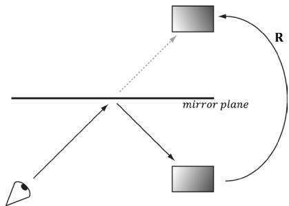


Figure 11.2. The eye sees the box reflection through the mirror. To simulate this, we reflect the box across the mirror plane and render the reflected box as usual.


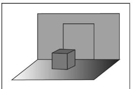


Back buffer


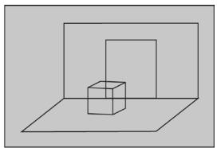


Stencil buffer


Figure 11.3. The floor, walls, and skull to the back buffer and the stencil buffer cleared to 0 (denoted by light gray color). The black outlines drawn on the stencil buffer illustrate the relationship between the back buffer pixels and the stencil buffer pixels—they do not indicate any data drawn on the stencil buffer.


using the stencil buffer because the stencil buffer allows us to block rendering to certain areas on the back buffer. Thus we can use the stencil buffer to block the rendering of the reflected skull if it is not being rendered into the mirror. The following outlines the step of how this can be accomplished: 

1. Render the floor, walls, and skull to the back buffer as normal (but not the mirror). Note that this step does not modify the stencil buffer. 

2. Clear the stencil buffer to 0. Figure 11.3 shows the back buffer and stencil buffer at this point (where we substitute a box for the skull to make the drawing simpler). 

3. Render the mirror only to the stencil buffer. We can disable color writes to the back buffer by creating a blend state that sets 

```cpp
D3D12 RENDER TARGET BLEND DESC::RenderTargetWriteMask = 0; 
```

and we can disable writes to the depth buffer by setting 

```cpp
D3D12_DEPTH_STENCIL_DESC::DepthWriteMask = D3D12_DEPTH_WRITE_MASK_ZERO; 
```

When rendering the mirror to the stencil buffer, we set the stencil test to always succeed (D3D12_COMPARISON_ALWAYS) and specify that the stencil buffer entry should be replaced (D3D12_STENCIL_OP_REPLACE) with 1 (StencilRef) if the test passes. If the depth test fails, we specify D3D12_STENCIL_OP_KEEP so that the stencil buffer is not changed if the depth test fails (this can happen, for example, if the skull obscures part of the mirror). Since we are only rendering the mirror to the stencil buffer, it follows that all the pixels in the stencil buffer will be 0 except for the pixels that correspond to the visible part of the mirror—they will have a 1. Figure 11.4 shows the updated stencil buffer. Essentially, we are marking the visible pixels of the mirror in the stencil buffer. 

It is important to draw the mirror to the stencil buffer after we have drawn the skull so that pixels of the mirror occluded by the skull fail the depth test, and thus do not modify the stencil buffer. We do not want to turn on parts of the stencil buffer that are occluded; otherwise the reflection will show through the skull. 

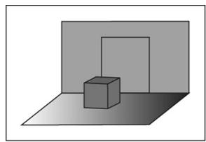


Back Buffer


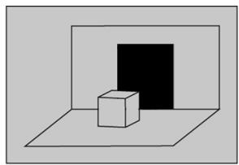


Stencil Buffer


Figure 11.4: Rendering the mirror to the stencil buffer, essentially marking the pixels in the stencil buffer that correspond to the visible parts of the mirror. The solid black area on the stencil buffer denotes stencil entries set to 1. Note that the area on the stencil buffer occluded by the box does not get set to 1 since it fails the depth test (the box is in front of that part of the mirror).


4. Now we render the reflected skull to the back buffer and stencil buffer. But recall that we only will render to the back buffer if the stencil test passes. This time, we set the stencil test to only succeed if the value in the stencil buffer equals 1; this is done using a StencilRef of 1, and the stencil operator D3D12_ COMPARISON_EQUAL. In this way, the reflected skull will only be rendered to areas that have a 1 in their corresponding stencil buffer entry. Since the areas in the stencil buffer that correspond to the visible parts of the mirror are the only entries that have a 1, it follows that the reflected skull will only be rendered into the visible parts of the mirror. 

5. Finally, we render the mirror to the back buffer as normal. However, in order for the skull reflection to show through (which lies behind the mirror), we need to render the mirror with transparency blending. If we did not render the mirror with transparency, the mirror would simply occlude the reflection since its depth is less than that of the reflection. To implement this, we simply need to define a new material instance for the mirror; we set the alpha channel of the diffuse component to 0.6 to make the mirror $6 0 \%$ opaque, and we render the mirror with the transparency blend state as described in the last chapter (§10.5.4). 

```javascript
matLib.AddMaterial("icemirror", texLib["iceMap"], texLib["defaultNormalMap"], texLib["defaultGlossHeightAoMap"], XMFLOAT4(1.0f, 1.0f, 1.0f, 0.6f), // diffuse XMFLOAT3(0.1f, 0.1f, 0.1f), 0.5f); 
```

These settings give the following blending equation: 

$$
\mathbf {C} = 0. 6 \cdot \mathbf {C} _ {s r c} + 0. 4 \cdot \mathbf {C} _ {d s t}
$$

Assuming we have laid down the reflected skull pixels to the back buffer, we see $6 0 \%$ of the color comes from the mirror (source) and $4 0 \%$ of the color comes from the skull (destination). 

# 11.4.2 Defining the Mirror Depth/Stencil States

To implement the previously described algorithm, we need two PSOs. The first is used when drawing the mirror to mark the mirror pixels on the stencil buffer. The second is used to draw the reflected skull so that it is only drawn into the visible parts of the mirror. 

```objectivec
//   
// PSO for marking stencil mirrors.   
//   
// Turn off render target writes.   
CD3DX12_BLEND_DESC mirrorBlendState(D3D12_DEFAULT);   
mirrorBlendState RenderTarget[0].RenderTargetWriteMask = 0;   
D3D12_DEPTH_STENCIL_DESC mirrorDSS;   
mirrorDSS.DepthEnable = true;   
mirrorDSS.DepthWriteMask = D3D12_DEPTH_WRITE_MASK_ZERO;   
mirrorDSS.DepthFunc = D3D12_COMPARISONFUNC LESS;   
mirrorDSS.StencilEnable = true;   
mirrorDSS.StencilReadMask = 0xff;   
mirrorDSS.StencilWriteMask = 0xff;   
mirrorDSS.FrontFace.StencilFailOp = D3D12_STENCIL_OP_KEEP;   
mirrorDSS.FrontFace.StencilDepthFailOp = D3D12_STENCIL_OP_KEEP;   
mirrorDSS.FrontFace.StencilPassOp = D3D12_STENCIL_OP_REPLACE;   
mirrorDSS.FrontFace.StencilFunc = D3D12_COMPARISON FUNC_ALWAYS;   
// We are not rendering backfacing polygons,   
// so these settings do not matter.   
mirrorDSS.BackFace.StencilFailOp = D3D12_STENCIL_OP_KEEP;   
mirrorDSS.BackFace.StencilDepthFailOp = D3D12_STENCIL_OP_KEEP;   
mirrorDSS.BackFace.StencilPassOp = D3D12_STENCIL_OP_REPLACE;   
mirrorDSS.BackFace.StencilFunc = D3D12_COMPARISON FUNC_ALWAYS;   
D3D12graphics_pipeLINE_STATE_DESC markMirrorsPsoDesc = opaquePsoDesc;   
markMirrorsPsoDesc.BlendState = mirrorBlendState;   
markMirrorsPsoDesc.DepthStencilState = mirrorDSS;   
ThrowIfFailed Md3dDevice->CreateGraphicsPipelineState( &markMirrorsPsoDesc, IID_PP_V Critics(&mPSOs["markStencilMirrors"]));   
//   
// PSO for stencil reflections.   
//   
D3D12_DEPTH_STENCIL_DESC reflectionsDSS;   
reflectionsDSS.DepthEnable = true;   
reflectionsDSS.DepthWriteMask = D3D12_DEPTH_WRITE_MASK_ALL;   
reflectionsDSS.DepthFunc = D3D12_COMPARISONFUNC LESS;   
reflectionsDSS.StencilEnable = true;   
reflectionsDSS.StencilReadMask = 0xff;   
reflectionsDSS.StencilWriteMask = 0xff; 
```

```cpp
reflectionsDSS.FrontFace.StencilFailOp = D3D12_STENCIL_OP_KEEP;
reflectionsDSS.FrontFace.StencilDepthFailOp = D3D12_STENCIL_OP_KEEP;
reflectionsDSS.FrontFace.StencilPassOp = D3D12_STENCIL_OP_KEEP;
reflectionsDSS.FrontFace.StencilFunc = D3D12comparisonFUNCTION EQUAL;
// We are not rendering backfacing polygons,
// so these settings do not matter.
reflectionsDSS.BackFace.StencilFailOp = D3D12_STENCIL_OP_KEEP;
reflectionsDSS.BackFace.StencilDepthFailOp = D3D12_STENCIL_OP_KEEP;
reflectionsDSS.BackFace.StencilPassOp = D3D12_STENCIL_OP_KEEP;
reflectionsDSS.BackFace.StencilFunc = D3D12comparisonFUNCTION EQUAL;
D3D12_DRAWINGS_PIPELINE_STATE_DESC drawReflectionsPsoDesc = opaquePsoDesc;
drawReflectionsPsoDesc.DepthStencilState = reflectionsDSS;
drawReflectionsPsoDesc.RasterizerState.CullMode = D3D12_CULL_MODE_BACK;
drawReflectionsPsoDesc.RasterizerState.FrontCounterClockwise = true;
ThrowIfFailed Md3dDevice->CreateGraphicsPipelineState(&drawReflectionsPsoDesc, IID_PPVALista["drawStencilReflections"]); 
```

# 11.4.3 Drawing the Scene

The following code outlines our draw method. We have omitted irrelevant details, such as setting constant buffer values, for brevity and clarity (see the example code for the full details). 

```cpp
// Draw opaque items--floors, walls, skull. mCommandList->SetPipelineState( mDrawWireframe ? mPSOs["opaque_wireframe"].Get(): mPSOs["opaque"].Get(); DrawRenderItems(mCommandList.Get(), mRItemLayer[(int) RenderLayer::Opaque]); // Mark the visible mirror pixels in the stencil buffer // with the value 1 mCommandList->OMSetStencilRef(1); mCommandList->SetPipelineState(mPSOs["markStencilMirrors"].Get()); DrawRenderItems(mCommandList.Get(), mRItemLayer[(int) RenderLayer::Mirrors]); // Draw the reflection into the mirror only (only for // pixels where the stencil buffer is 1). Note that we // must supply a different per-pass constant buffer- // one with the lights reflected. UINT passCBByteSize = d3dUtil::CalcConstantBufferByteSize(sizeof (PerPassCB)); mCommandList->SetGraphicsRootConstantBufferView( GFX_ROOT.Arg_PASS_CBV, passCB->GetGPUVirtualAddress() + 1 * passCBByteSize); 
```

```cpp
mCommandList->SetPipelineState(mPSOs["drawStencilReflections"] Get());   
DrawRenderItems(mCommandList.Get(), mRItemLayer[(int) RenderLayer::Reflected]);   
// Restore main pass constants and stencil ref.   
mCommandList->SetGraphicsRootConstantBufferView( GFX_ROOT.Arg_PASS_CBV, passCB->GetGPUVirtualAddress());   
mCommandList->OMSetStencilRef(0);   
// Draw mirror with transparency so reflection blends through.   
mCommandList->SetPipelineState(mPSOs["transparent"].Get());   
DrawRenderItems(mCommandList.Get(), mRItemLayer[(int) RenderLayer::Transparent]);   
// Draw shadows   
mCommandList->SetPipelineState(mPSOs["shadow"].Get());   
DrawRenderItems(mCommandList.Get(), mRItemLayer[(int) RenderLayer::Shadow]); 
```

One point to note in the above code is how we change the per-pass constant buffer when drawing the RenderLayer::Reflected layer. This is because the scene lighting also needs to get reflected when drawing the reflection. The lights are stored in a per-pass constant buffer, so we create an additional per-pass constant buffer that stores the reflected scene lighting. The per-pass constant buffer used for drawing reflections is set in the following method: 

PassConstants StencilApp::mMainPassCB;   
PassConstants StencilApp::mReflectedPassCB;   
void StencilApp::UpdateReflectedPassCB(const GameTimer& gt)   
{ mReflectedPassCB $\equiv$ mMainPassCB; //xy plane XMVECTOR mirrorPlane $=$ XMVectorSet(0.0f, 0.0f, 1.0f, 0.0f); XMMATRIX R $\equiv$ XMMatrixReflect(mirrorPlane); //Reflect the lighting. for(int i = 0; i < 3; ++i) { XMVECTOR lightDir $\equiv$ XmlLoadFloat3(&mMainPassCBLights[i].Direction); XMVECTOR reflectedLightDir $\equiv$ XMVector3TransformNormal(lightDir, R); XMStoreFloat3(&mReflectedPassCBLights[i].Direction, reflectedLightDir); } //Reflected pass stored in index 1 auto currPassCB $\equiv$ mCurrFrameResource->PassCB.get(); currPassCB->CopyData(1, mReflectedPassCB); 

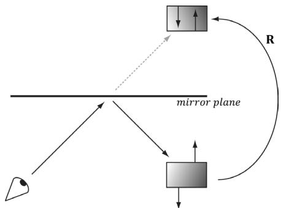


Figure 11.5. The polygon normals do not get reversed with reflection, which makes them inward facing after reflection.


# 11.4.4 Winding Order and Reflections

When a triangle is reflected across a plane, its winding order does not reverse, and thus, its face normal does not reverse. Hence, outward facing normals become inward facing normals (see Figure 11.5), after reflection. To correct this, we tell Direct3D to interpret triangles with a counterclockwise winding order as frontfacing and triangles with a clockwise winding order as back-facing (this is the opposite of our usual convention—§5.10.2). This effectively reflects the normal directions so that they are outward facing after reflection. We reverse the winding order convention by setting the following rasterizer properties in the PSO: 

drawReflectionsPsoDesc.RasterizerState.FrontCounterClockwise $=$ true; 

# 11.5 IMPLEMENTING PLANAR SHADOWS

# Note:

Portions of this section appeared in the book by Frank D. Luna, Introduction to 3D Game Programming with DirectX 9.0c: A Shader Approach, 2006: Jones and Bartlett Learning, Burlington, MA. www.jblearning.com. Reprinted with permission. 

Shadows aid in our perception of where light is being emitted in a scene and ultimately makes the scene more realistic. In this section, we will show how to implement planar shadows; that is, shadows that lie on a plane (see Figure 11.6). 

To implement planar shadows, we must first find the shadow an object casts to a plane and model it geometrically so that we can render it. This can easily be done with some 3D math. We then render the triangles that describe the shadow with a black material at $5 0 \%$ transparency. Rendering the shadow like this can introduce 

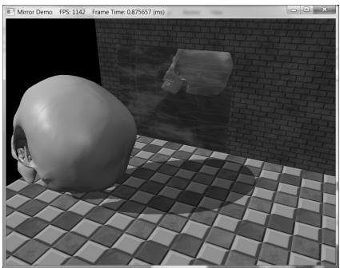


Figure 11.6. The main light source casts a planar shadow in the “Mirror” demo.


some rendering artifacts called “double blending,” which we explain in a few sections; we utilize the stencil buffer to prevent double blending from occurring. 

# 11.5.1 Parallel Light Shadows

Figure 11.7 shows the shadow an object casts with respect to a parallel light source. Given a parallel light source with direction L, the light ray that passes through a vertex p is given by $\mathbf { r } ( t ) = \mathbf { p } + t \mathbf { L }$ . The intersection of the ray $\mathbf { r } ( t )$ with the shadow plane $( \mathbf { n } , d )$ gives s. (The reader can read more about rays and planes in Appendix C.) The set of intersection points found by shooting a ray through each of the object’s vertices with the plane defines the projected geometry of the shadow. For a vertex p, its shadow projection is given by 

$$
\mathbf {s} = \mathbf {r} \left(t _ {s}\right) = \mathbf {p} - \frac {\mathbf {n} \cdot \mathbf {p} + d}{\mathbf {n} \cdot \mathbf {L}} \mathbf {L} \tag {eq.11.1}
$$

The details of the ray/plane intersection test are given in Appendix C. Equation 11.1 can be written in terms of matrices. 

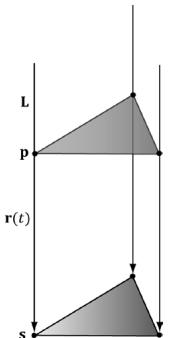


Figure 11.7. The shadow cast with respect to a parallel light source.


$$
\mathbf {s} ^ {\prime} = \left[ \begin{array}{c c c c} p _ {x} & p _ {y} & p _ {z} & 1 \end{array} \right] \left[ \begin{array}{c c c c} \mathbf {n} \cdot \mathbf {L} - L _ {x} n _ {x} & - L _ {y} n _ {x} & - L _ {z} n _ {x} & 0 \\ - L _ {x} n _ {y} & \mathbf {n} \cdot \mathbf {L} - L _ {y} n _ {y} & - L _ {z} n _ {y} & 0 \\ - L _ {x} n _ {z} & - L _ {y} n _ {z} & \mathbf {n} \cdot \mathbf {L} - L _ {z} n _ {z} & 0 \\ - L _ {x} d & - L _ {y} d & - L _ {z} d & \mathbf {n} \cdot \mathbf {L} \end{array} \right]
$$

We call the preceding $4 \times 4$ matrix the directional shadow matrix and denote it by ${ \pmb S } _ { d i r }$ . To see how this matrix is equivalent to Equation 11.1, we just need to perform the multiplication. First, however, observe that this equation modifies the $w$ -component so that $s _ { w } = \mathbf { n } \cdot \mathbf { L }$ . Thus, when the perspective divide (§5.6.3.4) takes place, each coordinate of s will be divided by $\mathbf { n } \cdot \mathbf { L }$ ; this is how we get the division by $\mathbf { n } \cdot \mathbf { L }$ in Equation 11.1 using matrices. Now doing the matrix multiplication to obtain the ith coordinate $s _ { i } ^ { \prime }$ for $i \in \{ 1 , 2 , 3 \}$ , followed by the perspective divide we obtain: 

$$
\begin{array}{l} s _ {i} ^ {\prime} = \frac {(\mathbf {n} \cdot \mathbf {L}) p _ {i} - L _ {i} n _ {x} p _ {x} - L _ {i} n _ {y} p _ {y} - L _ {i} n _ {z} p _ {z} - L _ {i} d}{\mathbf {n} \cdot \mathbf {L}} \\ = \frac {(\mathbf {n} \cdot \mathbf {L}) p _ {i} - (\mathbf {n} \cdot \mathbf {p} + d) L _ {i}}{\mathbf {n} \cdot \mathbf {L}} \\ = p _ {i} - \frac {\mathbf {n} \cdot \mathbf {p} + d}{\mathbf {n} \cdot \mathbf {L}} L _ {i} \\ \end{array}
$$

This is exactly the ith coordinate of s in Equation 11.1, so $\mathbf { \boldsymbol { s } } = \mathbf { \boldsymbol { s } } ^ { \prime }$ 

To use the shadow matrix, we combine it with our world matrix. However, after the world transform, the geometry has not really been projected on to the shadow plane yet because the perspective divide has not occurred yet. A problem arises if $s _ { { \scriptscriptstyle w } } = { \bf n } \cdot { \bf L } < 0$ because this makes the $w$ -coordinate negative. Usually in the perspective projection process we copy the $z$ -coordinate into the w-coordinate, and a negative $w$ -coordinate would mean the point is not in the view volume and thus is clipped away (clipping is done in homogeneous space before the divide). This is a problem for planar shadows because we are now using the $w$ -coordinate to implement shadows, in addition to the perspective divide. Figure 11.8 shows a valid situation where $\mathbf { n \cdot L } < 0$ , but the shadow will not show up. 

To fix this, instead of using the light ray direction L, we should use the vector towards the infinitely far away light source $\tilde { \mathbf { L } } = - \mathbf { L }$ . Observe that $\mathbf { r } ( t ) = \mathbf { p } + t \mathbf { L }$ and $\mathbf { r } ( t ) = \mathbf { p } + t \tilde { \mathbf { L } }$ define the same 3D line, and the intersection point between the line and the plane will be the same (the intersection parameter $t _ { s }$ will be different to compensate for the sign difference between $\tilde { \bf L }$ and L). So using $\tilde { \bf L } = - { \bf L }$ gives us the same answer, but with $\mathbf { n \cdot L } > 0$ , which avoids the negative $w$ -coordinate. 

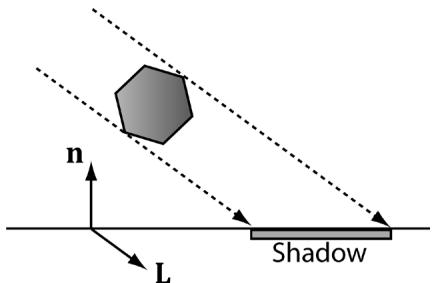


Figure 11.8. A situation where $\mathbf { n \cdot L } < 0$ .


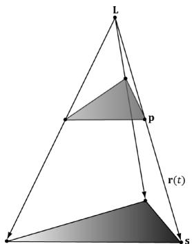


Figure 11.9. The shadow cast with respect to a point light source.


# 11.5.2 Point Light Shadows

Figure 11.9 shows the shadow an object casts with respect to a point light source whose position is described by the point L. The light ray from a point light through any vertex $\mathbf { p }$ is given by $\mathbf { r } ( t ) = \mathbf { p } + t ( \mathbf { p } - \mathbf { L } )$ . The intersection of the ray $\mathbf { r } ( t )$ with the shadow plane $( \mathbf { n } , d )$ gives s. The set of intersection points found by shooting a ray through each of the object’s vertices with the plane defines the projected geometry of the shadow. For a vertex p, its shadow projection is given by 

$$
\mathbf {s} = \mathbf {r} \left(t _ {s}\right) = \mathbf {p} - \frac {\mathbf {n} \cdot \mathbf {p} + d}{\mathbf {n} \cdot (\mathbf {p} - \mathbf {L})} (\mathbf {p} - \mathbf {L}) \tag {eq.11.2}
$$

Equation 11.2 can also be written by a matrix equation: 

$$
\mathbf {S} _ {p o i n t} = \left[ \begin{array}{c c c c} \mathbf {n} \cdot \mathbf {L} + d - L _ {x} n _ {x} & - L _ {y} n _ {x} & - L _ {z} n _ {x} & - n _ {x} \\ - L _ {x} n _ {y} & \mathbf {n} \cdot \mathbf {L} + d - L _ {y} n _ {y} & - L _ {z} n _ {y} & - n _ {y} \\ - L _ {x} n _ {z} & - L _ {y} n _ {z} & \mathbf {n} \cdot \mathbf {L} + d - L _ {z} n _ {z} & - n _ {z} \\ - L _ {x} d & - L _ {y} d & - L _ {z} d & \mathbf {n} \cdot \mathbf {L} \end{array} \right]
$$

To see how this matrix is equivalent to Equation 11.2, we just need to perform the multiplication the same way we did in the previous section. Note that the last column has no zeros and gives: 

$$
\begin{array}{l} s _ {w} = - p _ {x} n _ {x} - p _ {y} n _ {y} - p _ {z} n _ {z} + \mathbf {n} \cdot \mathbf {L} \\ = - \mathbf {p} \cdot \mathbf {n} + \mathbf {n} \cdot \mathbf {L} \\ = - \mathbf {n} \cdot (\mathbf {p} - \mathbf {L}) \\ \end{array}
$$

This is the negative of the denominator in Equation 11.2, but we can negate the denominator if we also negate the numerator. 

Note: 

Notice that L serves different purposes for point and parallel lights. For point lights we use L to define the position of the point light. For parallel lights we use L to define the direction towards the infinitely far away light source (i.e., the opposite direction the parallel light rays travel). 

# 11.5.3 General Shadow Matrix

Using homogeneous coordinates, it is possible to create a general shadow matrix that works for both point and directional lights. 

1. If $L _ { \phantom { } _ { w } } = 0$ then L describes the direction towards the infinitely far away light source (i.e., the opposite direction the parallel light rays travel). 

2. If $L _ { \phantom { } _ { w } } = 1$ then L describes the location of the point light. 

Then we represent the transformation from a vertex p to its projection s with the following shadow matrix: 

$$
\mathbf {S} = \left[ \begin{array}{c c c c} \mathbf {n} \cdot \mathbf {L} + d L _ {w} - L _ {x} n _ {x} & - L _ {y} n _ {x} & - L _ {z} n _ {x} & - L _ {w} n _ {x} \\ - L _ {x} n _ {y} & \mathbf {n} \cdot \mathbf {L} + d L _ {w} - L _ {y} n _ {y} & - L _ {z} n _ {y} & - L _ {w} n _ {y} \\ - L _ {x} n _ {z} & - L _ {y} n _ {z} & \mathbf {n} \cdot \mathbf {L} + d L _ {w} - L _ {z} n _ {z} & - L _ {w} n _ {z} \\ - L _ {x} d & - L _ {y} d & - L _ {z} d & \mathbf {n} \cdot \mathbf {L} \end{array} \right]
$$

It is easy to see that S reduced to $\mathbf { S } _ { d i r }$ if $L _ { \phantom { } _ { w } } = 0$ and S reduces to $\mathbf { S } _ { p o i n t }$ for $L _ { W } = 1$ 

The DirectX math library provides the following function to build the shadow matrix given the plane we wish to project the shadow into and a vector describing a parallel light if $w = 0$ or a point light if $w = 1$ : 

inline XMMATRIX XM_CALLCONV XMMatrixShadow( FXMVECTOR ShadowPlane, FXMVECTOR LightPosition); 

For further reading, both [Blinn96] and [Möller02] discuss planar shadows. 

# 11.5.4 Using the Stencil Buffer to Prevent Double Blending

When we flatten out the geometry of an object onto the plane to describe its shadow, it is possible (and in fact likely) that two or more of the flattened triangles will overlap. When we render the shadow with transparency (using blending), these areas that have overlapping triangles will get blended multiple times and thus appear darker. Figure 11.10 shows this. 

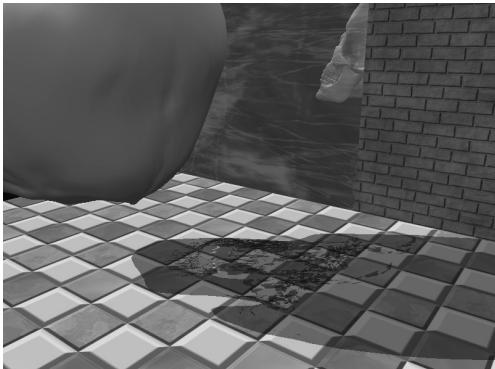


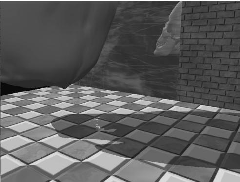


Figure 11.10. Notice the darker “acne” areas of the shadow in the left image; these correspond to areas where parts of the flattened skull overlapped, thus causing a “double blend.” The image on the right shows the shadow rendered correctly, without double blending.


We can solve this problem using the stencil buffer. 

1. Assume the stencil buffer pixels where the shadow will be rendered have been cleared to 0. This is true in our mirror demo because we are only casting a shadow onto the ground plane, and we only modified the mirror stencil buffer pixels. 

2. Set the stencil test to only accept pixels if the stencil buffer has an entry of 0. If the stencil test passes, then we increment the stencil buffer value to 1. 

The first time we render a shadow pixel, the stencil test will pass because the stencil buffer entry is 0. However, when we render this pixel, we also increment the corresponding stencil buffer entry to 1. Thus, if we attempt to overwrite to an area that has already been rendered to (marked in the stencil buffer with a value of 1), the stencil test will fail. This prevents drawing over the same pixel more than once, and thus prevents double blending. 

# 11.5.5 Shadow Code

We define a shadow material used to color the shadow that is just a $5 0 \%$ transparent black material: 

```javascript
matLib.AddMaterial("shadowMat", texLib["defaultDiffuseMap"], texLib["defaultNormalMap"], texLib["defaultGlossHeightAoMap"], XMFLOAT4(0.0f, 0.0f, 0.0f, 0.5f), // diffuse XMFLOAT3(0.01f, 0.01f, 0.01f), 0.0f); 
```

In order to prevent double blending we set up the following PSO with depth/ stencil state: 

```cpp
// We are going to draw shadows with transparency, so base it off  
// the transparency description.  
D3D12_DEPTH_STENCIL_DESC shadowDSS;  
shadowDSS.DepthEnable = true;  
shadowDSS.DepthWriteMask = D3D12_DEPTH_WRITE_MASK_ALL;  
shadowDSS.DepthFunc = D3D12_COMPARISON FUNC LESS;  
shadowDSS.StencilEnable = true;  
shadowDSS.StencilReadMask = 0xff;  
shadowDSS.StencilWriteMask = 0xff;  
shadowDSS.FrontFace.StencilFailOp = D3D12_STENCIL_OP_KEEP;  
shadowDSS.FrontFace.StencilDepthFailOp = D3D12_STENCIL_OP_KEEP;  
shadowDSS.FrontFace.StencilPassOp = D3D12_STENCIL_OP_INCR;  
shadowDSS.FrontFace.StencilFunc = D3D12_COMPARISON FUNC_EQUAL;  
// We are not rendering backfacing polygons, so these settings do not matter.  
shadowDSS.BackFace.StencilFailOp = D3D12_STENCIL_OP_KEEP;  
shadowDSS.BackFace.StencilDepthFailOp = D3D12_STENCIL_OP_KEEP;  
shadowDSS.BackFace.StencilPassOp = D3D12_STENCIL_OP_INCR;  
shadowDSS.BackFace.StencilFunc = D3D12_COMPARISON FUNC_EQUAL;  
D3D12_DRAWINGS_PIPELINE_STATE_DESC shadowPsoDesc = transparentPsoDesc;  
shadowPsoDesc.DepthStencilState = shadowDSS;  
ThrowIfFailed Md3dDevice->CreateGraphicsPipelineState(&shadowPsoDesc, IID_PPV_args(&shadow["shadow])). 
```

We then draw the skull shadow with the shadow PSO with a StencilRef value of 0: 

```cpp
// Draw shadows  
mCommandList->OMSetStencilRef(0);  
mCommandList->SetPipelineState(mPSOs["shadow"].Get());  
DrawRenderItems(mCommandList.Get(), mRItemLayer[(int) RenderLayer::Shadow]); 
```

where the skull shadow render-item’s world matrix is computed like so: 

```cpp
// Update shadow world matrix.  
XMVECTOR shadowPlane = XMVectorSet(0.0f, 1.0f, 0.0f, 0.0f); // xz plane  
XMVECTOR toMainLight = -XMLoadFloat3(&mMainPassCBLights[0].Direction);  
XMMATRIX S = XMMatrixShadow(shadowPlane, toMainLight);  
XMMatrix shadowOffsetY = XMMatrixTranslation(0.0f, 0.001f, 0.0f);  
XMStoreFloat4x4(&mShadowedSkullRItem->World, skullWorld * S * shadowOffsetY); 
```

Note that we offset the projected shadow mesh along the y-axis by a small amount to prevent $z \cdot$ -fighting so the shadow mesh does not intersect the floor mesh, but lies slightly above it. If the meshes did intersect, then due to limited precision of the depth buffer, we would see flickering artifacts as the floor and shadow mesh pixels compete to be visible. 

1. The stencil buffer is an off-screen buffer we can use to block the rendering of certain pixel fragments to the back buffer. The stencil buffer is shared with the depth buffer and thus has the same resolution as the depth buffer. Valid depth/stencil buffer formats are DXGI_FORMAT_D32_FLOAT_S8X24_UINT and DXGI_FORMAT_D24_UNORM_S8_UINT. 

2. The decision to block a particular pixel from being written is decided by the stencil test, which is given by the following: 

if( StencilRef & StencilReadMask $\trianglelefteq$ Value & StencilReadMask) accept pixel else reject pixel 

where the $\trianglelefteq$ operator is any one of the functions defined in the D3D12_ COMPARISON_FUNC enumerated type. The StencilRef, StencilReadMask, StencilReadMask, and comparison operator $\trianglelefteq$ are all application-defined quantities set with the Direct3D depth/stencil API. The Value quantity is the current value in the stencil buffer. 

3. The depth/stencil state is part of a PSO description. Specifically, the depth/ stencil state is configured by filling out the D3D12_GRAPHICS_PIPELINE_STATE_ DESC::DepthStencilState field, where DepthStencilState is of type D3D12_ DEPTH_STENCIL_DESC. 

4. The stencil reference value is set with the ID3D12GraphicsCommandList::OMSetSt encilRef method, which takes a single unsigned integer parameter specifying the stencil reference value. 

# 11.7 EXERCISES

1. Prove that the general shadow matrix S reduced to ${ \pmb S } _ { d i r }$ if $L _ { \phantom { } _ { w } } = 0$ and S reduces to $\mathbf { S } _ { p o i n t }$ for $L _ { \scriptscriptstyle W } = 1$ . 

2. Prove that $\begin{array} { r } { \dot { \mathbf { s } } = \mathbf { p } - \frac { \mathbf { n } \cdot \mathbf { p } + d } { \mathbf { n } \cdot ( \mathbf { p } - \mathbf { L } ) } ( \mathbf { p } - \mathbf { L } ) = \mathbf { p } \mathbf { S } _ { p o i n t } } \end{array}$ by doing the matrix multiplication for each component, as was done in $\$ 123.1$ for directional lights. 

3. Modify the “Mirror” demo to produce the “Left” image in Figure 11.1. 

4. Modify the “Mirror” demo to produce the “Left” image in Figure 11.10. 

5. Modify the “Mirror” demo in the following way. First draw a wall with the following depth settings: 

depthStencilDesc.DepthEnable $=$ false;   
depthStencilDesc.DepthWriteMask $\equiv$ D3D12_DEPTH_WRITE_MASK_ALL;   
depthStencilDesc.DepthFunc $=$ D3D12_COMPARISON LESS; 

Next, draw the skull behind the wall with the depth settings: 

```cpp
depthStencilDesc.DepthEnable = true;  
depthStencilDesc.DepthWriteMask = D3D12_DEPTH_WRITE_MASK_ALL;  
depthStencilDesc.DepthFunc = D3D12_COMPARISON LESS; 
```

Does the wall occlude the skull? Explain. What happens if you use the following to draw the wall instead? 

```cpp
depthStencilDesc.DepthEnable = true;  
depthStencilDesc.DepthWriteMask = D3D12_DEPTH_WRITE_MASK_ALL;  
depthStencilDesc.DepthFunc = D3D12_COMPARISON LESS; 
```

Note that this exercise does not use the stencil buffer, so that should be disabled. 

6. Modify the “Mirror” demo by not reversing the triangle winding order convention. Does the reflected teapot render correctly? 

7. Depth complexity refers to the number of pixel fragments that compete, via the depth test, to be written to a particular entry in the back buffer. For example, a pixel we have drawn may be overwritten by a pixel that is closer to the camera (and this can happen several times before the closest pixel is actually figured out once the entire scene has been drawn). The pixel in Figure 11.11 has a depth complexity of 3 since three pixel fragments compete for the pixel. 

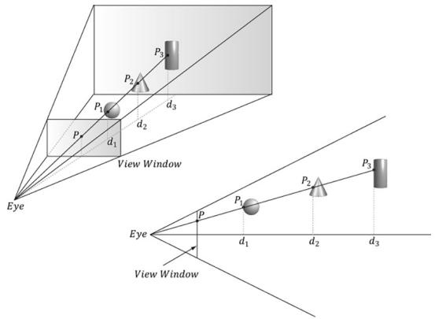


Figure 11.11. Multiple pixel fragments competing to be rendering to a single pixel on the projection window. In this scene, the pixel $P$ has a depth complexity of 3.


Potentially, the graphics card could fill a pixel several times each frame. This overdraw has performance implications, as the graphics card is wasting time processing pixels that eventually get overridden and are never seen. 

Consequently, it is useful to measure the depth complexity in a scene for performance analysis. 

We can measure the depth complexity as follows: Render the scene and use the stencil buffer as a counter; that is, each pixel in the stencil buffer is originally cleared to zero, and every time a pixel fragment is processed, we increment its count with D3D12_STENCIL_OP_INCR. The corresponding stencil buffer entry should always be incremented for every pixel fragment no matter what, so use the stencil comparison function D3D12_COMPARISON_ ALWAYS. Then, for example, after the frame has been drawn, if the ijth pixel has a corresponding entry of five in the stencil buffer, then we know that that five pixel fragments were processed for that pixel during that frame (i.e., the pixel has a depth complexity of five). Note that when counting the depth complexity, technically you only need to render the scene to the stencil buffer. 

To visualize the depth complexity (stored in the stencil buffer), proceed as follows: 

a. Associate a color $\mathbf { c } _ { k }$ for each level of depth complexity $k$ . For example, blue for a depth complexity of one, green for a depth complexity of two, red for a depth complexity of three, and so on. (In very complex scenes where the depth complexity for a pixel could get very large, you probably do not want to associate a color for each level. Instead, you could associate a color for a range of disjoint levels. For example, pixels with depth complexity 1-5 are colored blue, pixels with depth complexity 6-10 are colored green, and so on.) 

b. Set the stencil buffer operation to D3D12_STENCIL_OP_KEEP so that we do not modify it anymore. (We modify the stencil buffer with D3D12_STENCIL_OP_ INCR when we are counting the depth complexity as the scene is rendered, but when writing the code to visualize the stencil buffer, we only need to read from the stencil buffer and we should not write to it.) 

c. For each level of depth complexity $k$ 

i). Set the stencil comparison function to D3D12_COMPARISON_EQUAL and set the stencil reference value to $k$ . 

ii). draw a quad of color $\mathbf { c } _ { k }$ that covers the entire projection window. Note that this will only color the pixels that have a depth complexity of $k$ because of the preceding set stencil comparison function and reference value. 

With this setup, we have colored each pixel based on its depth complexity uniquely, and so we can easily study the depth complexity of the scene. For this exercise, render the depth complexity of the scene used in the “Blend” demo from Chapter 10. Figure 11.12 shows a sample screenshot. 

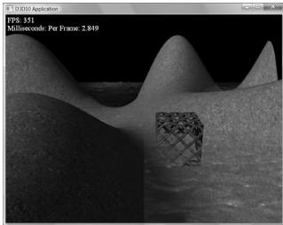


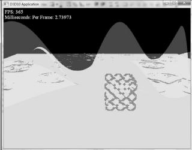


Figure 11.12. Sample screenshot of the solution to exercise 8.


Note: 

The depth test occurs in the output merger stage of the pipeline, which occurs after the pixel shader stage. This means that a pixel fragment is processed through the pixel shader, even if it may ultimately be rejected by the depth test. However, modern hardware does an “early z-test” where the depth test is performed before the pixel shader. This way, a rejected pixel fragment will be discarded before being processed by a potentially expensive pixel shader. To take advantage of this optimization, you should try to render your non-blended game objects in front-to-back order with respect to the camera; in this way, the nearest objects will be drawn first, and objects behind them will fail the early z-test and not be processed further. This can be a significant performance benefit if your scene suffers from lots overdraw due to a high depth complexity. We are not able to control the early z-test through the Direct3D API; the graphics driver is the one that decides if it is possible to perform the early z-test. For example, if a pixel shader modifies the pixel fragment’s depth value, then the early z-test is not possible, as the pixel shader must be executed before the depth test since the pixel shader modifies depth values. 

Note: 

We mentioned the ability to modify the depth of a pixel in the pixel shader. How does that work? A pixel shader can actually output a structure, not just a single color vector as we have been doing thus far: 

```cpp
struct PixelOut
{
    float4 color : SV_Target;
    float depth : SV_Depth;
};  
PixelOut PS(VertexOut pin)
{
    PixelOut pout;
    // ... usual pixel work
    pout.Color = float4(litColor, alpha); 
```

```cpp
// set pixel depth in normalized [0, 1] range  
pout.depth = pin(PosH.z - 0.05f;  
return pout; 
```

The z-coordinate of the SV_Position element (pin.PosH.z) gives the unmodified pixel depth value. Using the special system value semantic SV_Depth, the pixel shader can output a modified depth value. 

8. Another way to implement depth complexity visualization is to use additive blending. First clear the back buffer black and disable the depth test. Next, set the source and destination blend factors both to D3D12_BLEND_ONE, and the blend operation to D3D12_BLEND_OP_ADD so that the blending equation looks like $\mathbf { C } = \mathbf { C } _ { s r c } + \mathbf { C } _ { d s t }$ . Observe that with this formula, for each pixel, we are accumulating the colors of all the pixel fragments written to it. Now render all the objects in the scene with a pixel shader that outputs a low intensity color like ( . 0 05 0, .05, . 0 05 .) The more overdraw a pixel has, the more of these low intensity colors will be summed in, thus increasing the brightness of the pixel. If a pixel was overdrawn ten times, for example, then it will have a color intensity of ( . 0 5, . 0 5, . 0 5). Thus by looking at the intensity of each pixel after rendering the scene, we obtain an idea of the scene depth complexity. Implement this version of depth complexity measurement using the “Blend” demo from Chapter 9 as a test scene. 

9. Explain how you can count the number of pixels that pass the depth test. Explain how you can count the number of pixels that fail the depth test? 

10. Modify the “Mirror” demo to reflect the floor into the mirror in addition to the skull. 

11. Remove the vertical offset from the world matrix of the shadow render-item so that you can see z-fighting. 