# Chapter 13 The Compute Shader

Chapter 

# 13 The Compute Shader

GPUs have been optimized to process a large amount of memory from a single location or sequential locations (so-called streaming operation); this is in contrast to a CPU designed for random memory accesses [Boyd10]. Moreover, because vertices and pixels can be independently processed, GPUs have been architected to be massively parallel; for example, a GeForce RTX 4070 has 46 streaming multiprocessors that each have 128 CUDA cores for a total of 5888 CUDA cores. 

Obviously, graphics benefit from this GPU architecture, as the architecture was designed for graphics. However, many non-graphical applications can benefit from the massive amount of computational power a GPU can provide with its parallel architecture. For example, computer vision, machine learning, signal processing, and computational physics are fields that use GPUs in non-graphical ways. Using the GPU for non-graphical applications is called general purpose GPU (GPGPU) programming. Not all algorithms are ideal for a GPU implementation; GPUs need data-parallel algorithms to take advantage of the parallel architecture of the GPU. That is, we need a large amount of data elements that will have similar operations performed on them so that the elements can be processed in parallel. Graphical operations like shading pixels are a good example, as each pixel fragment being drawn is operated on by the pixel shader. As another example, if you look at the code for our wave simulation from the previous chapters, you will see that in the update step, we perform a calculation on each grid element. So, this too is a good candidate for a GPU implementation, as each grid element can 

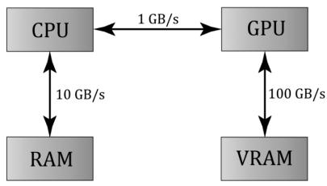


Figure 13.1. Image has been redrawn from [Boyd10]. The relative memory bandwidth speeds between CPU and RAM, CPU and GPU, and GPU and VRAM. These numbers are just illustrative numbers to show the order of magnitude difference between the bandwidths. Observe that transferring memory between CPU and GPU is the bottleneck.


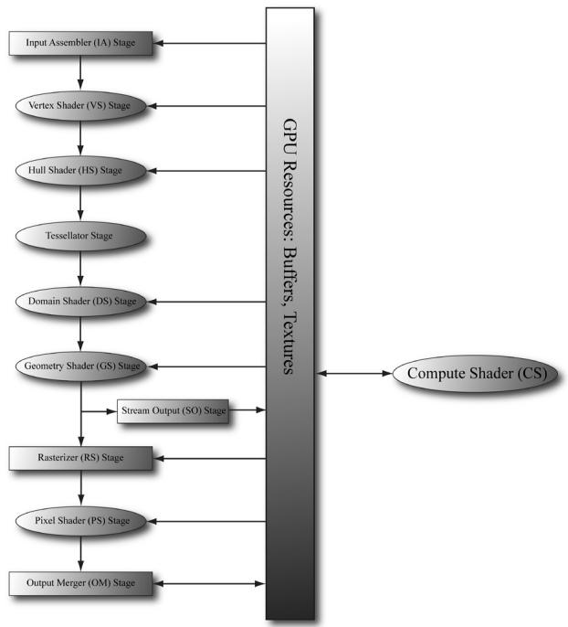


Figure 13.2. The compute shader is not part of the rendering pipeline but sits off to the side. The compute shader can read and write to GPU resources. The compute shader can be mixed with graphics rendering, or used alone for GPGPU programming.


be updated in parallel by the GPU. Particle systems provide yet another example, where the physics of each particle can be computed independently, provided we take the simplification that the particles do not interact with each other. 

For GPGPU programming, the user generally needs to access the computation results back on the CPU (for example, the result of a large calculation). This requires copying the result from video memory to system memory, which is slow (see Figure 13.1), but may be a negligible issue compared to the speed up from doing the computation on the GPU. Furthermore, the CPU need not be blocked while waiting for the result; it can continue doing other work until the transfer is completed. For graphics, we typically use the computation result as an input to the rendering pipeline, so no transfer from GPU to CPU is needed. For example, we can blur a texture with a compute shader, and then bind a shader resource view to that blurred texture to a shader as input for rendering. As another example, we can update a buffer of particles on the GPU using a compute shader, and then use the updated particle buffer as input for rendering the particles. 

The previous example has an obvious dependency. We must update the particles in a compute shader before drawing them. However, sometimes we can overlap compute and graphical work to achieve higher GPU utilization and better 

performance. For example, it is common for particles to not participate in shadow mapping. Therefore, we could theoretically update particles on the GPU and render shadow maps on the GPU at the same time. For this to work, the GPU must be underutilized, which is to say, rendering the shadow maps does not utilize all the GPU cores, and so it has spare cores available to update the particles concurrently. Overlapping compute and graphics work is an advanced technique called async compute. For this, we create another command queue called the compute queue (created with type D3D12_COMMAND_LIST_TYPE_COMPUTE). We then feed the compute queue work and the graphics queue work and execute the commands in parallel. Just like with CPU multithreading, you want the compute and graphics workloads to be independent so that they can be executed in parallel. Generally, you might have a hunch of good opportunities to apply async compute. However, for this kind of technique, you will want to verify in a GPU profiler which areas of a frame are underutilized and where you can execute work in parallel. Finally, we do not use async compute in this book as we consider it an advanced topic, but you should at least be familiar with the concept as it is likely used in commercial engines. 

The Compute Shader is a programmable shader Direct3D exposes that is not directly part of the rendering pipeline. Instead, it sits off to the side and can read from GPU resources and write to GPU resources (Figure 13.2). Essentially, the Compute Shader allows us to access the GPU to implement data-parallel algorithms without drawing anything. As mentioned, this is useful for GPGPU programming, but there are still many graphical effects that can be implemented on the compute shader as well鈥攕o it is still very relevant for a graphics programmer. And as already mentioned, because the Compute Shader is part of Direct3D, it reads from and writes to Direct3D resources, which enables us to bind the output of a compute shader directly to the rendering pipeline. 

# Chapter Objectives:

1. To learn how to program compute shaders. 

2. To obtain a basic high-level understanding of how the hardware processes thread groups, and the threads within them. 

3. To discover which Direct3D resources can be set as an input to a compute shader and which Direct3D resources can be set as an output to a compute shader. 

4. To understand the various thread IDs and their uses. 

5. To learn about shared memory and how it can be used for performance optimizations. 

6. To find out where to obtain more detailed information about GPGPU programming. 

# 13.1 THREADS AND THREAD GROUPS

In GPU programming, the number of threads desired for execution is divided up into a grid of thread groups. A thread group is executed on a single multiprocessor. Therefore, if you had a GPU with 64 multiprocessors, you should break up your problem into at least 64 thread groups so that each multiprocessor has work to do. (With high multiprocessor counts in high-end modern GPUs, you may not be able to divide your workload into that many thread groups, in which case you will be underutilizing your GPU. This is basically the motivation for async compute.) For better performance, you would want at least two thread groups per multiprocessor since a multiprocessor can switch to processing the threads in a different group to hide stalls [Fung10] (a stall can occur, for example, if a shader needs to wait for a texture operation result before it can continue to the next instruction). 

Each thread group gets shared memory that all threads in that group can access; a thread cannot access shared memory in a different thread group. Thread synchronization operations can take place amongst the threads in a thread group, but different thread groups cannot be synchronized. In fact, we have no control over the order in which different thread groups are processed. This makes sense as the thread groups can be executed on different multiprocessors. 

A thread group consists of $n$ threads. The hardware divides these threads up into warps (32 threads per warp), and a warp is processed by the multiprocessor in SIMD32 (i.e., the same instructions are executed for the 32 threads simultaneously). Each CUDA core processes a thread so a CUDA core is like an SIMD 鈥渓ane.鈥?In Direct3D, you can specify a thread group size with dimensions that are not multiples of 32, but for performance reasons, the thread group dimensions should always be multiples of the warp size [Fung10]. 

Thread group sizes of 64-128 seems to be a good starting point that should work well for various hardware. Then experiment with other sizes. Changing the number of threads per group will change the number of groups dispatched. 

Note: 

NVIDIA hardware uses warp sizes of 32 threads. ATI uses 鈥渨avefront鈥?sizes of sixty-four threads, and recommends the thread group size should always be a multiple of the wavefront size [Bilodeau10]. Also, the warp size or wavefront size can change in future generations of hardware. 

In Direct3D, thread groups are launched via the following method call: 

```cpp
void ID3D12GraphicsCommandList::Dispatch(  
    UINT ThreadGroupCountX,  
    UINT ThreadGroupCountY,  
    UINT ThreadGroupCountZ); 
```

This enables you to launch a 3D grid of thread groups; however, in this book we will only be concerned with 2D grids of thread groups. The following example call 

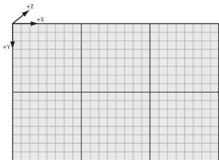


Figure 13.3. Dispatching a grid of $3 \times 2$ thread groups. Each thread group has $8 \times 8$ threads.


launches three groups in the $x$ direction and two groups in the y direction for a total of $3 \times 2 = 6$ thread groups (see Figure 13.3). 


If you submit consecutive dispatch commands on the CPU, they are not guaranteed to execute in order on the GPU. In fact, they could be executed in parallel. This is to utilize more of the GPU. However, if several dispatches are reading and writing to the same resource then you have a race condition. Therefore, you will need to use D3D12_RESOURCE_UAV_BARRIERs to synchronize. 

# 13.2 A SIMPLE COMPUTE SHADER

Below is a simple compute shader that sums two textures, assuming all the textures are the same size. This shader is not very interesting, but it illustrates the basic syntax of writing a compute shader. 

```cpp
cbuffer cbSettings   
{ // Compute shader can access values in constant buffers. uint gIndexA; uint gIndexB; uint gOutputIndex;   
}锛?  
// The number of threads in the thread group. The threads in a   
// group can be arranged in a 1D, 2D, or 3D grid layout. [numthreads(16, 16, 1)]   
void CS(int3 dispatchThreadID : SV_DispatchThreadID) // Thread ID   
{ // Data sources and outputs. Texture2D gInputA = ResourceDescriptorHeap[gIndexA]; Texture2D gInputB = ResourceDescriptorHeap[gIndexB]; RWTexture2D gOutput = ResourceDescriptorHeap[gOutputIndex]; // Sum the xyth texels and store the result in the xyth texel of   
// gOutput. gOutput[dispatchThreadID.xy] = 
```

gInputA[dispatchThreadID.xy] $^+$ gInputB[dispatchThreadID.xy];   
} 

A compute shader consists of the following components: 

1. Global variable access via constant buffers. 

2. Input and output resources, which are discussed in the next section. 

3. The [numthreads(X, Y, Z)] attribute, which specifies the number of threads in the thread group as a 3D grid of threads. 

4. The shader body that has the instructions to execute for each thread. 

5. Thread identification system value parameters (discussed in $\$ 13.4$ ). 

Observe that we can define different topologies of the thread group; for example, a thread group could be a single line of $X$ threads [numthreads(X, 1, 1)] or a single column of Y threads [numthreads(1, Y, 1)]. 2D thread groups of $X \times Y$ threads can be made by setting the $z$ -dimension to 1 like this [numthreads(X, Y, 1)]. The topology you choose will be dictated by the problem you are working on. As mentioned in the previous section, the total thread count per group should be a multiple of the warp size (thirty-two for NVIDIA cards) or a multiple of the wavefront size (sixty-four for ATI cards). A multiple of the wavefront size is also a multiple of the warp size, so choosing a multiple of the wavefront size works for both types of cards. 

# 13.2.1 Compute PSO

To enable a compute shader, we use a special 鈥渃ompute pipeline state description.鈥?This structure has far fewer fields than D3D12_GRAPHICS_PIPELINE_STATE_DESC because the compute shader sits to the side of the graphics pipeline, so all the graphics pipeline state does not apply to compute shaders and thus does not need to be set. Below shows an example of creating a compute pipeline state object: 

```cpp
D3D12.Compute_PIPELINE_STATE_DESC wavesUpdatePSO = {};  
wavesUpdatePSO.pRootSignature = mWavesRootSignature.Get();  
wavesUpdatePSO.CS = {  
    reinterpret_cast<BYTE*>(mShaders["wavesUpdateCS"]->GetBufferPointer(), mShaders["wavesUpdateCS"]->GetBufferSize()  
};  
wavesUpdatePSOFLAGS = D3D12 pipelinesState_STATE_FLAG_NONE;  
ThrowIfFailed.md3dDevice->CreateComputePipelineState(&wavesUpdatePSO, IID_PPV.ArgS(&mPSOs["wavesUpdate"]), 
```

The root signature defines what parameters the shader expects as input (CBVs, SRVs, etc.). The CS field is where we specify the compute shader. The following code shows an example of compiling a compute shader to bytecode: 

```cpp
std::vector< LPCWSTR> csUpdateWavesArgs = std::vector< LPCWSTR> { L"-E", L"UpdateWavesCS", L"-T", L"cs_6_6" COMMA_DEBUG_args }; mShaders["wavesUpdateCS"] = d3dUtil::CompileShader( L"Shaders\WaveSim.hlsl", csUpdateWavesArgs); 
```

# 13.3 DATA INPUT AND OUTPUT RESOURCES

Two types of resources can be bound to a compute shader: buffers and textures. We have worked with buffers already such as vertex and index buffers, and constant buffers. We are also familiar with texture resources from Chapter 9. 

# 13.3.1 Texture Inputs

The compute shader defined in the previous section defined two input texture resources that were indexed directly from the CBV/UAV/SRV descriptor heap: 

```javascript
Texture2D gInputA = DescriptorHeap[gIndexA]; Texture2D gInputB = DescriptorHeap[gIndexB]; 
```

This is the same way we access shader resources in the other shaders (e.g., vertex and pixel shaders). 

# 13.3.2 Texture Outputs and Unordered Access Views (UAVs)

The compute shader defined in the previous section defined one output resource: 

```cpp
RWTexture2D gOutput = ResourceDescriptorHeap[gOutputIndex]; 
```

Outputs are treated specially and have the special prefix to their type 鈥淩W,鈥?which stands for read-write, and as the name implies, you can read and write to elements in this resource in the compute shader. In contrast, the textures gInputA and gInputB are read-only. Also, it is necessary to specify the type and dimensions of the output with the template angle brackets syntax <float4>. If our output was a 2D integer like DXGI_FORMAT_R8G8_SINT, then we would have instead written: 

```cpp
RWTexture2D<int2> gOutput; 
```

Binding an output resource is different than an input, however. To bind a resource that we will write to in a compute shader, we need to bind it using a new view type called an unordered access view (UAV), which is represented in code by a descriptor handle and described in code by the D3D12_UNORDERED_ACCESS_VIEW_ DESC structure. This is created in a similar way to a shader resource view. Here is an example that creates a UAV to a texture resource: 

```javascript
D3D12.Resource_DESC texDesc; ZeroMemory(&texDesc, sizeof(D3D12.Resource_DESC)); 
```

```c
texDesc.Dimension = D3D12_RESOURCE_DIMENSION-textSTANCE2D;
texDesc Alignment = 0;
texDesc.Width = mWidth;
texDesc.Height = mHeight;
texDesc.DepthOrArraySize = 1;
texDesc.MipLevels = 1;
texDesc.Format = mFormat;
texDesc_SAMPLEDesc.Count = 1;
texDesc_SAMPLEDesc.Quality = 0;
texDesc Layout = D3D12-textTURE_LAYOUT_unknown;
texDescFLAGS = D3D12.Resource_FLAG Allowsunordered_ACCESS;
ThrowIfFailed-md3dDevice->CreateCommittedResource(
    &CD3DX12_HEAPProperties(D3D12_HEAP_TYPE_DEFAULT),
    D3D12_HEAP_FLAG_NONE,
    &texDesc,
    D3D12.Resource_STATEGENERIC_READ,
    nullptr,
    IID_PPV.ArgS(&mBlurMap0));
CbvSrvUavHeap& heap = CbvSrvUavHeap::Get();
uint32_t mSrvIndex = heap.NextFreeIndex();
uint32_t mUavIndex = heap.NextFreeIndex();
const UINT mipLevels = 1;
CreateSrv2d-md3dDevice, mBlurMap0.Get(), mFormat,
mipLevels, heap.CpuHandle(mSrvIndex);
const UINT mipSlice = 0;
CreateUav2d-md3dDevice, mBlurMap0.Get(), mFormat,
mipSlice, heap.CpuHandle(mUavIndex);
inline void CreateSrv2d(ID3D12Device* device, ID3D12Resource* resource,
DXGI_format format, UINT mipLevels,
CD3DX12_CPU DescriptorHandle hDescriptor)
{
    D3D12_SHADERRESOURCE_MODE_desc srvDesc = {};
srvDesc.Shader4ComponentMapping = D3D12_DEFAULT_SHADER_4 Component_
MAPPING;
srvDesc.ViewDimension = D3D12_SRV_DIMENSION-textSTANCE2D;
srvDesc.Texture2D MostDetailedMip = 0;
srvDesc.Texture2DResourceMinLODClamp = 0.0f;
srvDesc.Format = format;
srvDesc.Texture2D.MipLevels = mipLevels;
device->CreateShaderResourceView(resource, &srvDesc, hDescriptor);
} inline void CreateUav2d(ID3D12Device* device, ID3D12Resource* resource,
DXGI_format format, UINT mipSlice,
CD3DX12_CPU DescriptorHandle hDescriptor)
{
    D3D12_UNORDERED_ACCESS(View_DESC uavDesc = {}, 
uavDesc.Format = format; 
```

```cpp
uavDesc.ViewDimension = D3D12_UAV_DIMENSION-textURE2D;  
uavDesc.Texture2D.MipSlice = mipSlice;  
device->CreateUnorderedAccessView(resource, nullptr, &uavDesc, hDescriptor); 
```

Observe that if a texture is going to be bound as UAV, then it must be created with the D3D12_RESOURCE_FLAG_ALLOW_UNORDERED_ACCESS flag; in the above example, the texture will be bound as a UAV and as a SRV (but not simultaneously). This is common, as we often use the compute shader to perform some operation on a texture (so the texture will be bound to the compute shader as a UAV), and then after, we want to texture geometry with it, so it will be bound to the vertex or pixel shader as a SRV. 

Recall that a descriptor heap of type D3D12_DESCRIPTOR_HEAP_TYPE_CBV_SRV_UAV can mix CBVs, SRVs, and UAVs all in the same heap. Therefore, we can put UAV descriptors in that heap and index them directly in the shader provided we use a root signature with the flag D3D12_ROOT_SIGNATURE_FLAG_CBV_SRV_UAV_HEAP_ DIRECTLY_INDEXED. Incidentally, we use the following root signature for all of our compute work: 

enum compute_root_arg   
{ COMPUTE_ROOTArg_DISPATCH_CBV $= 0$ 锛?COMPUTE_ROOTArg_PASS_CBV, COMPUTE_ROOTArgPASSExtra_CBV, COMPUTE_ROOTArg_COUNT   
}锛?  
// Root parameter can be a table, root descriptor or root constants. CD3DX12_ROOT_PARAMETER computeRootParameters[COMPUTE_ROOT.Arg_ COUNT]锛?//Performance TIP: Order from most frequent to least frequent. computeRootParameters[COMPUTE_ROOT.Arg_DISPATCH_CBV]. InitAsConstantBufferView(0); computeRootParameters[COMPUTE_ROOT.Arg_PASS_CBV]. InitAsConstantBufferView(1); computeRootParameters[COMPUTE_ROOT.Arg_PASSExtra_CBV]. InitAsConstantBufferView(2); //A root signature is an array of root parameters. CD3DX12_ROOT_SIGNATURE_DESC computeRootSigDesc( COMPUTE_ROOT.Arg_COUNT, computeRootParameters, 0,nullptr锛?/static samplers D3D12_ROOT_SIGNATURE_FLAG_CBV_SRV_UAV_HEAP_DIRECTLY_INDEXED | D3D12_ROOT_SIGNATURE_FLAG_SAMPLER_HEAP_DIRECTLY_INDEXED)锛?hr $=$ D3D12NormalizeRootSignature( &computeRootSigDesc锛孌3D_ROOT_SIGNATURE_VERSION_1, serializedRootSig.GetAddressOf(),errorBlob.GetAddressOf()); 

```cpp
if(errorBlob != nullptr)   
{ ::OutputDebugStringA((char*)errorBlob->GetBufferPointer());   
}   
ThrowIfFailed(hr);   
ThrowIfFailed (md3dDevice->CreateRootSignature(0, serializedRootSig->GetBufferPointer(), serializedRootSig->GetBufferSize(), IID_PPV Arguments(mComputeRootSignature.GetAddressOf())); 
```

Basically, all of our compute shaders allow for three root CBVs. The first CBV is for constants that are specific to the given compute shader we are executing. The second CBV is the constant buffer to the usual per-pass constant buffer we use for rendering. Some compute shaders will need access to some of that data such as the render target dimensions, scene light values, or the eye position. Finally, the third CBV is an extra constant buffer in case a compute shader needs it. Again, the idea is to provide flexibility so that we can use the same root signature for all of our compute shaders, but at the same time to not make the root signature overweight; three CBVs is still a small root signature. 

As with other shaders we have been writing, textures and buffer resources are accessed by indexing the heap directly via ResourceDescriptorHeap. 

# 13.3.3 Indexing and Sampling Textures

The elements of the textures can be accessed using 2D indices using the bracket operator. In the compute shader defined in $\$ 13.2$ , we index the texture based on the dispatch thread ID (thread IDs are discussed in $\ S 1 3 . 4 \AA ,$ ). Each thread is given a unique dispatch ID. 

```cpp
[numthreads(16, 16, 1)]  
void CS(int3 dispatchThreadID : SV_DispatchThreadID)  
{ // Data sources and outputs. Texture2D gInputA = DescriptorHeap[gIndexA]; Texture2D gInputB = DescriptorHeap[gIndexB]; RWTexture2D gOutput = DescriptorHeap[gOutputIndex]; // Sum the xyth texels and store the result in the xyth texel of // gOutput. gOutput[dispatchThreadID.xy] = gInputA[dispatchThreadID.xy] + gInputB[dispatchThreadID.xy]; } 
```

Assuming that we dispatched enough thread groups to cover the texture (i.e., so there is one thread being executed for one texel), then this code sums the texture images and stores the result in the texture gOutput. 

The behavior of out-of-bounds indices are well defined in a compute shader. Out-of-bounds reads return 0, and out-of-bounds writes result in no-ops [Boyd08]. 

Because the compute shader is executed on the GPU, it has access to the usual GPU tools. For example, we can sample textures using texture filtering. There are two issues, however. First, we cannot use the Sample method, but instead must use the SampleLevel method. SampleLevel takes an additional third parameter that specifies the mipmap level of the texture; 0 takes the top most level, 1 takes the second mip level, etc., and fractional values are used to interpolate between two mip levels of linear mip filtering is enabled. On the other hand, Sample automatically selects the best mipmap level to use based on how many pixels on the screen the texture will cover. Since compute shaders are not used for rendering directly, it does not know how to automatically select a mipmap level like this, and therefore, we must explicitly specify the level with SampleLevel in a compute shader. The second issue is that when we sample a texture, we use normalized texture-coordinates in the range $[ 0 , 1 ] ^ { 2 }$ instead of integer indices. However, the texture size (width, height) can be set to a constant buffer variable, and then normalized texture coordinates can be derived from the integer indices $( x , y )$ : 

$$
u = \frac {x + 0 . 5}{w i d t h}
$$

$$
\nu = \frac {y + 0 . 5}{h e i g h t}
$$

Note that we offset by half a texel so that the uvs coincide with the texel centers. If we are using point-sampling then this is not an issue, but if we are using bilinear filtering, we will get interpolated values at the grid points when we should be getting exact values at the grid points. 

The following code shows a compute shader using integer indices, and a second equivalent version using texture coordinates and SampleLevel, where it is assumed the texture size is $5 1 2 \times 5 1 2$ and we only need the top level mip: 

```cpp
//   
// VERSION 1: Using integer indices.   
//   
cbuffer cbUpdateSettings   
{ float gWaveConstant0; float gWaveConstant1; float gWaveConstant2; 
```

```cpp
float gDisturbMag; int2 gDisturbIndex; uint gIndexA; uint gIndexB; uint gOutputIndex;   
};   
[numthreads(16, 16, 1)] void CS(int3 dispatchThreadID : SV_DispatchThreadID) { // Data sources and outputs. Texture2D gInputA = ResourceDescriptorHeap[gIndexA]; Texture2D gInputB = ResourceDescriptorHeap[gIndexB]; RWTexture2D gOutput = ResourceDescriptorHeap[gOutputIndex]; int x = dispatchThreadID.x; int y = dispatchThreadID.y; gNextSolOutput[int2(x,y)] = gWaveConstants0*gPrevSolInput[int2(x,y)].r + gWaveConstants1*gCurrSolInput[int2(x,y)].r + gWaveConstants2*( gCurrSolInput[int2(x,y+1)].r + gCurrSolInput[int2(x,y-1)].r + gCurrSolInput[int2(x+1,y)].r + gCurrSolInput[int2(x-1,y)].r); }   
//   
// VERSION 2: Using SampleLevel and texture coordinates.   
// cbuffer cbUpdateSettings { float gWaveConstant0; float gWaveConstant1; float gWaveConstant2; float gDisturbMag; int2 gDisturbIndex; uint gIndexA; uint gIndexB; uint gOutputIndex; }; [numthreads(16, 16, 1)] void CS(int3 dispatchThreadID : SV_DispatchThreadID) { // Data sources and outputs. Texture2D gInputA = ResourceDescriptorHeap[gIndexA]; 
```

```cpp
Texture2D gInputB = DescriptorHeap[gIndexB]; RWTexture2D gOutput = DescriptorHeap[gOutputIndex]; // Equivalently using SampleLevel() instead of operator []; float x = dispatchThreadID.x + 0.5f; float y = dispatchThreadID.y + 0.5f; float2 c = float2(x,y)/512.0f; float2 t = float2(x,y-1)/512.0; float2 b = float2(x,y+1)/512.0; float2 l = float2(x-1,y)/512.0; float2 r = float2(x+1,y)/512.0; gNextSolOutput[int2(x,y)] = gWaveConstants0*gPrevSolInput.SampleLevel(GetPointClampSampler(), c, 0.0f).r + gWaveConstants1*gCurrSolInput.SampleLevel(GetPointClampSampler(), c, 0.0f).r + gWaveConstants2*( gCurrSolInput.SampleLevelToPointClampSampler(), b, 0.0f).r + gCurrSolInput.SampleLevel(GetPointClampSampler(), t, 0.0f).r + gCurrSolInput.SampleLevel(GetPointClampSampler(), r, 0.0f).r + gCurrSolInput.SampleLevel(GetPointClampSampler(), 1, 0.0f).r); } 
```

# 13.3.4 Structured Buffer Resources

The following examples show how structured buffers are defined in the HLSL: 

```cpp
struct Data
{
    float3 v1;
    float2 v2;
}; 
```

A structured buffer is simply a buffer of elements of the same type鈥攅ssentially an array. As you can see, the type can be a user-defined structure in the HLSL. 

A structured buffer used as an SRV can be created just like we have been creating our vertex and index buffers. A structured buffer used as a UAV is almost created the same way, except that we must specify the flag D3D12_RESOURCE_FLAG_ ALLOW_UNORDERED_ACCESS, and it is good practice to put it in the D3D12_RESOURCE_ STATE_UNORDERED_ACCESS state. 

```cpp
struct Data
{
    XMFLOAT3 v1;
    XMFLOAT2 v2;
};
// Generate some data.
std::vector<std>A(DataA(DataDataElements);
std::vector<std>A(dataB鐨勬暟鎹瓺ataElements);
for(int i = 0; i < NumDataElements; ++i)
{
    float x = static_cast<std>(i);
    dataA[i].v1 = XMFLOAT3(x, x, x);
    dataA[i].v2 = XMFLOAT2(x, 0);
    dataB[i].v1 = XMFLOAT3(-x, x, 0.0f);
    dataB[i].v2 = XMFLOAT2(0, -x);
}
UINT64 byteSize = dataA.size() * sizeof(Data);
// Create some buffers with initial data to be used as SRVs.
CreateStaticBuffer(
    md3dDevice.Get(), *mUploadBatch,
    dataA.data(), dataA.size(), sizeof(Data),
    D3D12Resource_STATEGENERIC_READ, &mInputBufferA);
CreateStaticBuffer(
    md3dDevice.Get(), *mUploadBatch,
    dataB.data(), dataB.size(), sizeof(Data),
    D3D12Resource_STATEGENERIC_READ, &mInputBufferB);
// Create the buffer that will be a UAV.
ThrowIfFailed.md3dDevice->CreateCommittedResource(
    &CD3DX12_heap.Properties(D3D12_heap_TYPE_DEFAULT),
    D3D12_heap_FLAG_NONE,
    &CD3DX12Resource_DESC::Buffer(byteSize, D3D12Resource_FLAGALLOWunordered_ACCESS),
    D3D12Resource_STATEunordered_ACCESS,
    nullptr,
    IID_PPV_args(&mOutputBuffer));
} 
```

Structured buffers are bound to the pipeline just like textures. We create SRVs or UAV descriptors to them and pass them as arguments to root parameters that take descriptor tables or index them directly in the shader via ResourceDescriptorHeap. 

```c
inline void CreateBufferUav( ID3D12Device* device, UINT64 firstElement, UINT elementCount, UINT elementByteSize, UINT64 counterOffset, ID3D12Resource* resource, ID3D12Resource* counterResource, CD3DX12_CPU describinger hDescriptor) { D3D12_UNORDERED_ACCESS(View_DESC uavDesc; uavDesc.Format = DXGI_format UNKNOWN; // structured buffer uavDesc.ViewDimension = D3D12_UAV_DIMENSIONBUFFER; 
```

uavDesc.Bufferer.FirstElement $=$ firstElement; uavDesc.Bufferer.NumElements $\equiv$ elementCount; uavDesc.Bufferer.StructureByteStride $\equiv$ elementByteSize; uavDesc.BufferercounterOffsetInBytes $\equiv$ counterOffset; uavDesc/DDer.Flags $\equiv$ D3D12buffer_UAV_FLAG_NON; device->CreateUnorderedAccessView resource, counterResource, &uavDesc,hDescriptor);   
}   
inline void CreateBufferSrv( ID3D12Device\* device,UINT64firstElement, UINT elementCount,UINT elementByteSize, ID3D12Resource\* resource,CD3DX12_CPU describingSORHANDLE hDescriptor) { D3D12_SHADER_RESOURCE_VIEW_DESC srvDesc $\equiv$ {}锛?srvDesc.Format $\equiv$ DXGI_FORMAT_UNKNOW; // structured buffer srvDesc.ViewDimension $\equiv$ D3D12_SRV_DIMENSION_BUFFERER; srvDesc.Shader4ComponentMapping $\equiv$ D3D12_DEFAULT_SHADER_4 ComponentMAPPING; srvDesc-DDer.FirstElement $\equiv$ firstElement; srvDesc-DDer.NumElements $\equiv$ elementCount; srvDesc-DDer.StructureByteStride $\equiv$ elementByteSize; srvDesc-DDer.Contents $\equiv$ D3D12 Bufferer_SRV_FLAG_NONE; device->CreateShaderResourceView resource, &srvDesc,hDescriptor);   
}   
void VecAddCS::BuildComputeDescriptors() { CbvSrvUavHeap& cbvSrvUavHeap $\equiv$ CbvSrvUavHeap::Get(); mBufferIndexA $=$ cbvSrvUavHeap.NextFreeIndex(); mBufferIndexB $=$ cbvSrvUavHeap.NextFreeIndex(); mBufferOutputIndex $\equiv$ cbvSrvUavHeap.NextFreeIndex(); const UINT64firstElement $= 0$ CreateBufferSrv( md3dDevice.Get(), firstElement, NumDataElements, sizeof(Data), mInputBufferA.Get(), cbvSrvUavHeap.CpuHandle(mBufferIndexA)); CreateBufferSrv( md3dDevice.Get(), firstElement, NumDataElements, sizeof(Data), mInputBufferB.Get(), cbvSrvUavHeap.CpuHandle(mBufferIndexB)); CreateBufferUav( md3dDevice.Get(), firstElement, NumDataElements, 

```javascript
sizeof(Data), 0, // counterOffset mOutputBuffer.Get(), nullptr, // counterResource cbvSrvUavHeap.CpuHandle(mBufferOutputIndex)); } 
```

# Note:

There is also such a thing called a raw buffer, which is basically a byte array of data. Byte offsets are used and the data can then be casted to the proper type. This could be useful for storing different data types in the same buffer, for example. To be a raw buffer, the resource must be created with the DXGI_ FORMAT_R32_TYPELESS format, and when creating the UAV we must specify the D3D12_BUFFER_UAV_FLAG_RAW flag. We do not use raw buffers in this book; see the SDK documentation for further details. 

# 13.3.5 Copying CS Results to System Memory

Typically, when we use the compute shader to process a texture, we will display that processed texture on the screen; therefore, we visually see the result to verify the accuracy of our compute shader. With structured buffer calculations, and GPGPU computing in general, we might not display our results at all. So, the question is how do we get our results from GPU memory (remember when we write to a structured buffer via a UAV, that buffer is stored in GPU memory) back to system memory. The required way is to create system memory buffer with heap properties D3D12_HEAP_TYPE_READBACK. Then we can use the ID3D12GraphicsCommandList::Cop yResource method to copy the GPU resource to the system memory resource. The system memory resource must be the same type and size as the resource we want to copy. Finally, we can map the system memory buffer with the mapping API to read it on the CPU. From there we can then copy the data into a system memory array for further processing on the CPU side, save the data to file, or what have you. 

# Note:

CopyResource does not execute immediately; it is a command put on the GPU command queue. It is only valid to read the destination data after the copy completes on the GPU timeline. We can either block the CPU and wait for the GPU to complete or use fences to check when the work is done. 

We have included a structured buffer demo for this chapter called 鈥淰ecAdd,鈥?which simply sums the corresponding vector components stored in two structured buffers: 

```cpp
struct Data
{
    float3 v1;
    float2 v2;
}; 
```

```objectivec
cbuffer DispatchCB : register(b0)  
{  
    uint gBufferIndexA;  
    uint gBufferIndexB;  
    uint gBufferIndexOutput;  
    uint DispatchCB_Pad0;  
};  
[numthreads(32, 1, 1)]  
void CS(int3 dtid : SV_DispatchThreadID)  
{  
    StructuredBuffer< data> gInputA = ResourceDescriptorHeap[gBufferIndexA];  
    StructuredBuffer< data> gInputB = ResourceDescriptorHeap[gBufferIndexB];  
    RWStructuredBuffer< data> gOutput = ResourceDescriptorHeap[gBufferIndexOutput];  
    gOutput[dtid.x].v1 = gInputA[dtid.x].v1 + gInputB[dtid.x].v1;  
    gOutput[dtid.x].v2 = gInputA[dtid.x].v2 + gInputB[dtid.x].v2;  
} 
```

For simplicity, the structured buffers only contain thirty-two elements; therefore, we only have to dispatch one thread group (since one thread group processes thirty-two elements). After the compute shader completes its work for all threads in this demo, we copy the results to system memory and save them to file. The following code shows how to create the system memory buffer and how to copy the GPU results to CPU memory: 

```cpp
// Create the buffer that we will read back on the CPU. ComPtr<ID3D12Resource> mReadBackBuffer = nullptr; ThrowIfFailed(md3dDevice->CreateCommittedResource(
    &CD3DX12_heapProperties(D3D12_heap_TYPE_READBACK),
    D3D12_heap_FLAG_NONE,
    &CD3DX12_RESOURCE_DESC::Buffer(bytesize),
    D3D12.Resource_STATE_copy_DEST,
    nullptr,
    IID_PPV.ArgS(&mReadBackBuffer));
void VecAddCS::DoComputeWork()
{
    CbvSrvUavHeap& cbvSrvUavHeap = CbvSrvUavHeap::Get();
    SamplerHeap& samHeap = SamplerHeap::Get();
    // Reuse the memory associated with command recording.
    // We can only reset when the associated command lists
    // have finished execution on the GPU.
    ThrowIfFailed(mDirectCmdListAlloc->Reset());
    // A command list can be reset after it has been added
    // to the command queue via ExecuteCommandList. 
```

```cpp
// Reusing the command list reuses memory.   
ThrowIfFailed(mCommandList->Reset(mDirectCmdListAlloc.Get(), mPSOs["vecAdd"].Get()));   
ID3D12DescriptorHeap\* descriptorHeaps[] = { cbvSrvUavHeap.GetD3dHeap(), samHeap.GetD3dHeap();   
mCommandList->SetDescriptorHeaps(_countof(descriptorHeaps), descriptorHeaps);   
mCommandList->SetComputeRootSignature(mComputeRootSignature.Get());   
DispatchCB dispatchConstants;   
dispatchConstants.gBufferIndexA = mBufferIndexA;   
dispatchConstants.gBufferIndexB = mBufferIndexB;   
dispatchConstants.gBufferIndexOutput = mBufferOutputIndex;   
// Need to hold handle until we submit work to GPU. GraphicsMemory& linearAllocator = GraphicsMemory::Get(md3dDevice. Get());   
GraphicsResource memHandle = linearAllocator AllocateConstant(dispa tchConstants);   
mCommandList->SetComputeRootConstantBufferView( COMPUTE_ROOTArg_DISPATCH_CBV, memHandle.GpuAddress());   
mCommandList->Dispatch(1, 1, 1);   
// Schedule to copy the data to the default buffer to the readback buffer.   
mCommandList->ResourceBarrier(1, &CD3DX12RESOURCE_BARRIER::Transition(mOutputBuffer.Get(), D3D12.Resource_STATE_COMMON, D3D12RESOURCE_STATE_copy_SOURCE)); 
```


mCommandList->CopyResource(mReadBackBuffer.Get(), mOutputBuffer. Get());


mCommandList->ResourceBarrier(1, &CD3DX12_RESOURCE_BARRIER::Transition(mOutputBuffer.Get(), D3D12_RESOURCE_STATE_copy_SOURCE, D3D12_RESOURCE_STATE_common)); //Done recording commands. ThrowIfFailed(mCommandList->Close()); //Add the command list to the queue for execution. ID3D12CommandList\* cmdLists[] $=$ { mCommandList.Get(); mCommandQueue->ExecuteCommandLists(_countof(cmdLists), cmdLists); 


// Wait for the work to finish. FlushCommandQueue();


```cpp
// Map the data so we can read it on CPU. Data*鐨勬暟鎹瓺ata = nullptr; ThrowIfFailed(mReadBackBuffer->Map(0, nullptr, reinterpret_cast<void**>(&mappedData)); std:: ofstream fout("results.txt"); for(int i = 0; i < NumDataElements; ++i) { cout << "(" + mappedData[i].v1.x << ", " << mappedData[i].v1.y << ", " << mappedData[i].v1.z << ", " << mappedData[i].v2.x << ", " << mappedData[i].v2.y << ")" << std::endl; } mReadBackBuffer->Unmap(0, nullptr); } 
```

In the demo, we fill the two input buffers with the following initial data: 

std::vector鏁版嵁A锛圢umDataElements锛?   
std::vector鏁版嵁B锛圢umDataElements锛?   
for(int $\mathrm{i} = 0$ 锛沬 $<$ NumDataElements锛?+i锛?{ dataA[i].v1 $=$ XMFLOAT3(i锛宨锛宨); dataA[i].v2 $=$ XMFLOAT2(i锛?); dataB[i].v1 $=$ XMFLOAT3(-i锛宨锛?.0f); dataB[i].v2 $=$ XMFLOAT2(0锛?i);   
} 

The resulting text file contains the following data, which confirms that the compute shader is working as expected. 

```cpp
(0, 0, 0, 0, 0)  
(0, 2, 1, 1, -1)  
(0, 4, 2, 2, -2)  
(0, 6, 3, 3, -3)  
(0, 8, 4, 4, -4)  
(0, 10, 5, 5, -5)  
(0, 12, 6, 6, -6)  
(0, 14, 7, 7, -7)  
(0, 16, 8, 8, -8)  
(0, 18, 9, 9, -9)  
(0, 20, 10, 10, -10)  
(0, 22, 11, 11, -11)  
(0, 24, 12, 12, -12)  
(0, 26, 13, 13, -13)  
(0, 28, 14, 14, -14)  
(0, 30, 15, 15, -15)  
(0, 32, 16, 16, -16)  
(0, 34, 17, 17, -17)  
(0, 36, 18, 18, -18)  
(0, 38, 19, 19, -19) 
```

```cpp
(0, 40, 20, 20, -20)  
(0, 42, 21, 21, -21)  
(0, 44, 22, 22, -22)  
(0, 46, 23, 23, -23)  
(0, 48, 24, 24, -24)  
(0, 50, 25, 25, -25)  
(0, 52, 26, 26, -26)  
(0, 54, 27, 27, -27)  
(0, 56, 28, 28, -28)  
(0, 58, 29, 29, -29)  
(0, 60, 30, 30, -30)  
(0, 62, 31, 31, -31) 
```


From Figure 13.1, we see that copying between CPU and GPU memory is the slowest, as it has to go over the PCI-Express bus. You should be careful about how much data you are transferring and how often. Furthermore, in practice, you would not want to block the CPU waiting for the GPU to finish processing commands as we do in the 鈥淰ecAddCS鈥?demo. 

# 13.4 THREAD IDENTIFICATION SYSTEM VALUES

# Consider Figure 13.4.

1. Each thread group is assigned an ID by the system; this is called the group $I D$ and has the system value semantic SV_GroupID. If $G _ { x } \times G _ { y } \times G _ { z }$ are the number of thread groups dispatched, then the group ID ranges from (0, 0, 0) to $\left( G _ { x } - 1 \times G _ { y } - 1 \times G _ { z } - 1 \right)$ . 

2. Inside a thread group, each thread is given a unique ID relative to its group. If the thread group has size $X \times Y \times Z ,$ then the group thread IDs will range 

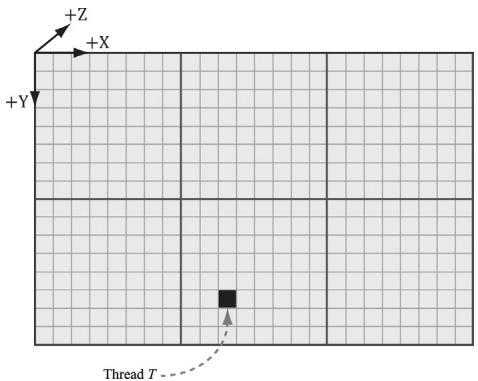


Figure 13.4. Consider the marked thread T. Thread $T$ has thread group ID (1, 1, 0). It has group thread ID (2, 5, 0). It has dispatch thread ID $( 1 , 1 , 0 ) \otimes ( 8 , 8 , 0 ) + ( 2 , 5 , 0 ) = ( 1 0 , 1 3 , 0 )$ . It has group index ID $5 \cdot 8 + 2 = 4 2$ .


from (0, 0, 0) to $( X - 1 , Y - 1 , Z - 1 )$ . The system value semantic for the group thread ID is SV_GroupThreadID. 

3. A Dispatch call dispatches a grid of thread groups. The dispatch thread ID uniquely identifies a thread relative to all the threads generated by a Dispatch call. In other words, whereas the group thread ID uniquely identifies a thread relative to its thread group, the dispatch thread ID uniquely identifies a thread relative to the union of all the threads from all the thread groups dispatched by a Dispatch call. Let, ThreadGroupSize $=$ (X,Y,Z)be the thread group size, then the dispatch thread ID can be derived from the group ID and the group thread ID as follows: 

```javascript
dispatchThreadID.xyz = groupID.xyz * ThreadGroupSize.xyz + groupThreadID.xyz; 
```

The dispatch thread ID has the system value semantic SV_DispatchThreadID. If $3 \times 2$ thread groups are dispatched, where each thread group is $1 0 \times 1 0$ , then a total of 60 threads are dispatched and the dispatch thread IDs will range from (0,聽0, 0) to (29, 19, 0). 

4. A linear index version of the group thread ID is given to us by Direct3D through the SV_GroupIndex system value; it is computed as: 

```javascript
groupIndex = groupThreadID.z*ThreadGroupSize.x*ThreadGroupSize.y + 
    groupThreadID.y*ThreadGroupSize.x + 
    groupThreadID.x; 
```

Note: 

Regarding the indexing coordinate order, the first coordinate gives the x-position (or column) and the second coordinate gives the y-position (or row). This is in contrast to common matrix notation, where $M _ { i j }$ denotes the element in the ith row and jth column. 

So why do we need these thread ID values. Well a compute shader generally takes some input data structure and outputs to some data structure. We can use the thread ID values as indexes into these data structures: 

```cpp
[numthreads(16, 16, 1)]  
void CS(int3 dispatchThreadID : SV_DispatchThreadID)  
{ // Data sources and outputs. Texture2D gInputA = ResourceDescriptorHeap[gIndexA]; Texture2D gInputB = ResourceDescriptorHeap[gIndexB]; RWTexture2D gOutput = ResourceDescriptorHeap[gOutputIndex]; // Use dispatch thread ID to index into output and input textures. gOutput[dispatchThreadID.xy] = gInputA[dispatchThreadID.xy] + gInputB[dispatchThreadID.xy]; } 
```

The SV_GroupThreadID is useful for indexing into thread local storage memory (搂13.6). 

# 13.5 APPEND AND CONSUME BUFFERS

Suppose we have a buffer of particles defined by the structure: 

```cpp
struct Particle
{
    float3 Position;
    float3 Velocity;
    float3 Acceleration;
}; 
```

and we want to update the particle positions based on their constant acceleration and velocity in the compute shader. Moreover, suppose that we do not care about the order the particles are updated nor the order they are written to the output buffer. Consume and append structured buffers are ideal for this scenario, and they provide the convenience that we do not have to worry about indexing: 

```cs
struct Particle {
    float3 Position;
    float3 Velocity;
    float3 Acceleration;
};
float TimeStep = 1.0f / 60.0f;
[numthreads(16, 16, 1)] 
void CS()
{
    ConsumeStructuredBuffer<Particle> gInput = DescriptorHeap[gInputIndex];
    AppendStructuredBuffer<Particle> gOutput = DescriptorHeap[gOutputIndex];
    // Consume a data element from the input buffer.
    Particle p = gInput.Consume();
    p.Velocity += p.Acceleration*TimeStep;
    p.Position += p.Velocity*TimeStep;
    // Append normalized vector to output buffer.
    gOutput.Add(p);
} 
```

Once a data element is consumed, it cannot be consumed again by a different thread; one thread will consume exactly one data element. And again, we emphasize that the order elements are consumed and appended are unknown; 

therefore, it is generally not the case that the ith element in the input buffer gets written to the ith element in the output buffer. Internally, consume and append buffers have a buffer associated with them that stores a counter. The counter is atomically incremented/decremented based on append/consume. 


Append structured buffers do not dynamically grow. They must still be large enough to store all the elements you will append to it. 

# 13.6 SHARED MEMORY AND SYNCHRONIZATION

Thread groups are given a section of so-called shared memory or thread local storage. Accessing this memory is fast and can be thought of being as fast as a hardware cache. In the compute shader code, shared memory is declared like so: 

groupshared float4 gCache[256]; 

The array size can be whatever you want, but the maximum size of group shared memory is 32kb. Because the shared memory is local to the thread group, it is indexed with the SV_ThreadGroupID; so, for example, you might give each thread in the group access to one slot in the shared memory. 

Using too much shared memory can lead to performance issues [Fung10], as the following example illustrates. Suppose a multiprocessor supports 32kb of shared memory, and your compute shader requires 20kb of shared memory. This means that only one thread group will fit on the multiprocessor because there is not enough memory left for another thread group [Fung10], as $2 0 \mathrm { k b } +$ $2 0 \mathrm { k b } = 4 0 \mathrm { k b } > 3 2 \mathrm { k b }$ . This limits the parallelism of the GPU, as a multiprocessor cannot switch off between thread groups to hide latency (recall from $\$ 13.1$ that at least two thread groups per multiprocessor is recommended). Thus, even though the hardware technically supports 32kb of shared memory, performance improvements can be achieved by using less. 

A common application of shared memory is to store texture values in it. Certain algorithms, such as blurs, require fetching the same texel multiple times. Sampling textures is actually one of the slower GPU operations because memory bandwidth and memory latency have not improved as much as the raw computational power of GPUs [M枚ller08]. A thread group can avoid redundant texture fetches by preloading all the needed texture samples into the shared memory array. The algorithm then proceeds to look up the texture samples in the shared memory array, which is very fast. Suppose we implement this strategy with the following erroneous code: 

groupshared float4 gCache[256]; 

[numthreads(256, 1, 1)] 

void CS(int3 groupThreadID : SV_GroupThreadID, int3 dispatchThreadID : SV_DispatchThreadID)   
{ Texture2D gInput $=$ ResourceDescriptorHeap[gInputIndex]; RWTexture2D<float4> gOutput $=$ ResourceDescriptorHeap[gOutputIndex]; // Each thread samples the texture and stores the /value in shared memory. gCache[groupId.x] $=$ gInput[dispatchThreadID.xy]; // Do computation work: Access elements in shared memory // that other threads stored: // BAD!! Left and right neighbor threads might not have // finished sampling the texture and storing it in shared memory. float4 left $=$ gCache[groupId.x - 1]; float4 right $=$ gCache[groupId.x + 1]; 

A problem arises with this scenario because we have no guarantee that all the threads in the thread group finish at the same time. Thus a thread could go to access a shared memory element that is not yet initialized because the neighboring threads responsible for initializing those elements have not finished yet. To fix this problem, before the compute shader can continue, it must wait until all the threads have done their texture loading into shared memory. This is accomplished by a synchronization command: 

groupshared float4 gCache[256];   
[numthreads(256,1,1)]   
void CS(int3 groupThreadID:SV_GroupThreadID, int3 dispatchThreadID:SV_DispatchThreadID)   
{ Texture2D gInput $=$ ResourceDescriptorHeap[gInputIndex]; RWTexture2D<float4> gOutput $=$ ResourceDescriptorHeap[gOutputIndex]; //Each thread samples the texture and stores the /value in shared memory. gCache[groupId.x] $\equiv$ gInput[dispatchThreadID.xy]; //Wait for all threads in group to finish. GroupMemoryBarrierWithGroupSync(); //Safe now to read any element in the shared memory //and do computation work. float4left $=$ gCache[groupId.x-1]; float4right $=$ gCache[groupId.x+1]; ... } 

# 13.7 BLUR DEMO

In this section, we explain how to implement a blur algorithm on the compute shader. We begin by describing the mathematical theory of blurring. Then we discuss the technique of technique of render-to-texture, which our demo uses to generate a source image to blur. Finally, we review the code for a compute shader implementation and discuss how to handle certain details that make the implementation a little tricky. 

# 13.7.1 Blurring Theory

The blurring algorithm we use is described as follows: For each pixel $P _ { i j }$ in the source image, compute the weighted average of the $m \times n$ matrix of pixels centered about the pixel $P _ { i j }$ (see Figure 13.5); this weighted average becomes the ijth pixel in the blurred image. Mathematically, 

$$
\operatorname {B l u r} \left(P _ {i j}\right) = \sum_ {r = - a c = - b} ^ {a} \sum_ {w _ {r c}} P _ {i + r, j + c} \text {f o r} \sum_ {r = - a c = - b} ^ {a} \sum_ {w _ {r c}} ^ {b} w _ {r c} = 1
$$

where $m = 2 a + 1$ and $n = 2 b + 1$ . By forcing m and $n$ to be odd, we ensure that the $m \times n$ matrix always has a natural 鈥渃enter.鈥?We call $^ a$ the vertical blur radius and $^ { b }$ the horizontal blur radius. If $a = b$ , then we just refer to the blur radius without having to specify the dimension. The $m \times n$ matrix of weights is called the blur kernel. Observe also that the weights must sum to 1. If the sum of the weights is 

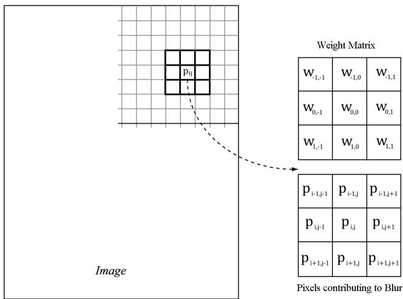


Figure 13.5. To blur the pixel $P _ { i j }$ we compute the weighted average of the $m \times n$ matrix of pixels centered about the pixel. In this example, the matrix is a square $3 \times 3$ matrix, with blur radius $a = b = 1$ . Observe that the center weight $W _ { 0 0 }$ aligns with the pixel $P _ { i j }$ .


less than one, the blurred image will appear darker as color has been removed. If the sum of the weights is greater than one, the blurred image will appear brighter as color has been added. 

There are various ways to compute the weights so long as they sum to 1. A wellknown blur operator found in many image editing programs is the Gaussian blur, which obtains its weights from the Gaussian function $\scriptstyle { \overline { { G } } } ( x ) = \exp \left( - { \frac { x ^ { 2 } } { 2 \sigma ^ { 2 } } } \right)$ . A graph of this function is shown in Figure 13.6 for different $\sigma .$ 

Let us suppose we are doing a $1 \times 5$ Gaussian blur (i.e., a 1D blur in the horizontal direction), and let $\sigma = 1$ . Evaluating $G ( x )$ for $x = - 2 , - 1 , 0 , 1 , 2$ we have: 

$$
G (- 2) = \exp \left(- \frac {(- 2) ^ {2}}{2}\right) = e ^ {- 2}
$$

$$
G (- 1) = \exp \left(- \frac {(- 1) ^ {2}}{2}\right) = e ^ {- \frac {1}{2}}
$$

$$
G (0) = \exp (0) = 1
$$

$$
G (1) = \exp \left(- \frac {1 ^ {2}}{2}\right) = e ^ {- \frac {1}{2}}
$$

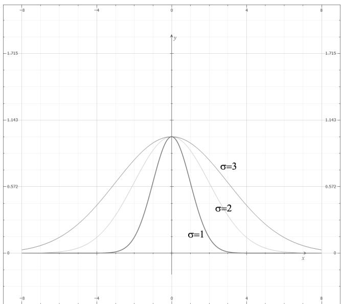


Figure 13.6. Plot of $G ( x )$ for $\sigma = 1$ , 2, 3. Observe that a larger 蟽 flattens the curve out and gives more weight to the neighboring points.


$$
G (2) = \exp \left(- \frac {2 ^ {2}}{2}\right) = e ^ {- 2}
$$

However, these values are not the weights because they do not sum to 1: 

$$
\begin{array}{l} \sum_ {x = - 2} ^ {x = 2} G (x) = G (- 2) + G (- 1) + G (0) + G (1) + G (2) \\ = 1 + 2 e ^ {- \frac {1}{2}} + 2 e ^ {- 2} \\ \approx 2. 4 8 3 7 3 \\ \end{array}
$$

If we normalize the above equation by dividing by the sum $\scriptstyle \sum _ { x = - 2 } ^ { x = 2 } G ( x )$ -2 , then we obtain weights based on the Gaussian function that sum to 1: 

$$
\frac {G (- 2) + G (- 1) + G (0) + G (1) + G (2)}{\sum_ {x = - 2} ^ {x = 2} G (x)} = 1
$$

Therefore, the Gaussian blur weights are: 

$$
w _ {- 2} = \frac {G (- 2)}{\sum_ {x = - 2} ^ {x = 2} G (x)} = \frac {e ^ {- 2}}{1 + 2 e ^ {- \frac {1}{2}} + 2 e ^ {- 2}} \approx 0. 0 5 4 5
$$

$$
w _ {- 1} = \frac {G (- 1)}{\sum_ {x = - 2} ^ {x = 2} G (x)} = \frac {e ^ {- \frac {1}{2}}}{1 + 2 e ^ {- \frac {1}{2}} + 2 e ^ {- 2}} \approx 0. 2 4 4 2
$$

$$
w _ {0} = \frac {G (0)}{\sum_ {x = - 2} ^ {x = 2} G (x)} = \frac {1}{1 + 2 e ^ {- \frac {1}{2}} + 2 e ^ {- 2}} \approx 0. 4 0 2 6
$$

$$
w _ {1} = \frac {G (1)}{\sum_ {x = - 2} ^ {x = 2} G (x)} = \frac {e ^ {- \frac {1}{2}}}{1 + 2 e ^ {- \frac {1}{2}} + 2 e ^ {- 2}} \approx 0. 2 4 4 2
$$

$$
w _ {2} = \frac {G (2)}{\sum_ {x = - 2} ^ {x = 2} G (x)} = \frac {e ^ {- 2}}{1 + 2 e ^ {- \frac {1}{2}} + 2 e ^ {- 2}} \approx 0. 0 5 4 5
$$

The Gaussian blur is known to be separable, which means it can be broken up into two 1D blurs as follows. 

1. Blur the input image I using a 1D horizontal blur: $I _ { H } = B l u r _ { H } ( I )$ . 

2. Blur the output from the previous step using a 1D vertical blur: $B l u r ( I ) =$ $B l u r _ { V } ( I _ { H } )$ . 

Written more succinctly, we have: 

$$
\operatorname {B l u r} (I) = \operatorname {B l u r} _ {V} (\operatorname {B l u r} _ {H} (I))
$$

Suppose that the blur kernel is a $9 \times 9$ matrix, so that we needed a total of 81 samples to do the 2D blur. By separating the blur into two 1D blurs, we only need $9 + 9 = 1 8$ samples. Typically, we will be blurring textures; as mentioned in this chapter, fetching texture samples is expensive, so reducing texture samples by separating a blur is a welcome improvement. Even if a blur is not separable (some blur operators are not), we can often make the simplification and assume it is for the sake of performance, as long as the final image looks accurate enough. 

# 13.7.2 Render-to-Texture

So far in our programs, we have been rendering to the back buffer. But what is the back buffer? If we review our D3DApp code, we see that the back buffer is just a texture in the swap chain: 

```cpp
Microsoft::WRL::ComPtr<ID3D12Resource> mSwapChainBuffer[SwapChainBuffer  
rCount];  
for (UINT i = 0; i < SwapChainBufferCount; i++)  
{  
    ThrowIfFailed(mSwapChain->GetBuffer(  
        i, IID_PPVALRS(&mSwapChainBuffer[i])));  
    md3dDevice->CreateRenderTargetView(  
        mSwapChainBuffer[i].Get(),  
        nullptr,  
        mRtvHeap.CpuHandle(i));  
} 
```

We instruct Direct3D to render to the back buffer by binding a render target view of the back buffer to the OM stage of the rendering pipeline: 

```cpp
// Specify the buffers we are going to render to.  
mCommandList->OMSetRenderTargets(1, &CurrentBackBufferView(), true, &DepthStencilView()); 
```

The contents of the back buffer are eventually displayed on the screen when the back buffer is presented via the IDXGISwapChain::Present method. 

A texture that will be used as a render target must be created with the flag D3D12_RESOURCE_FLAG_ALLOW_RENDER_TARGET. 

If we think about this code, there is nothing that stops us from creating another texture, creating a render target view to it, and binding it to the OM stage of the rendering pipeline. Thus, we will be drawing to this different 鈥渙ff-screen鈥?texture (possible with a different camera) instead of the back buffer. This technique is known as render-to-off-screen-texture or simply render-to-texture. The only difference is that since this texture is not the back buffer, it does not get displayed to the screen during presentation. 

Consequently, render-to-texture might seem worthless at first as it does not get presented to the screen. But, after we have rendered-to-texture, we can bind the back buffer back to the OM stage, and resume drawing geometry to the back buffer. We can texture geometry with the texture we generated during the render-to-texture period. This strategy is used to implement a variety of special effects. For example, you can render-to-texture the scene from a bird鈥檚 eye view to a texture. Then, when drawing to the back buffer, you can draw a quad in the lower-right corner of the screen with the bird鈥檚 eye view texture to simulate a radar system (see Figure 13.7). Other render-to-texture techniques include: 

1. Shadow mapping 

2. Screen Space Ambient Occlusion 

3. Dynamic reflections with cube maps 

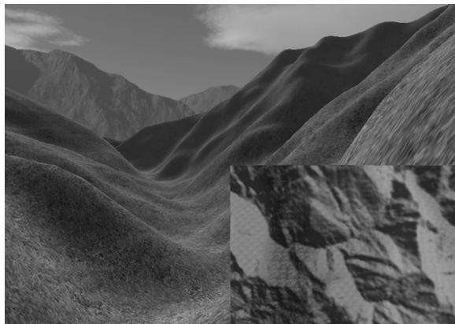


Figure 13.7. A camera is placed above the player from a bird鈥檚 eye view and renders the scene into an off-screen texture. When we draw the scene from the player鈥檚 eye to the back buffer, we map the texture onto a quad in the bottom-right corner of the screen to display the radar map.


Using render-to-texture, implementing a blurring algorithm on the GPU would work the following way: render our normal demo scene to an off-screen texture. This texture will be the input into our blurring algorithm that executes on the compute shader. After the texture is blurred, we will draw a full screen quad to the back buffer with the blurred texture applied so that we can see the blurred result to test our blur implementation. The steps are outlined as follows: 

1. Draw scene as usual to an off-screen texture. 

2. Blur the off-screen texture using a compute shader program. 

3. Restore the back buffer as the render target and draw a full screen quad with the blurred texture applied. 

Using render-to-texture to implement a blur works well and is the required approach if we want to render the scene to a different sized texture than the back buffer. However, if we make the assumption that our off-screen textures match the format and size of our back buffer, instead of redirecting rendering to our off-screen texture, we can render to the back buffer as usual, and then do a CopyResource to copy the back-buffer contents to our off-screen texture. Then we can do our compute work on our off-screen textures, and finally copy the blurred result back to the back buffer to produce the final screen output. 

// Copy the input (back-buffer in this example) to BlurMap0. cmdList->CopyResource(mBlurMap0.Get(), input); 

// Do blur work... 

// Copy the blurred result to the back buffer mCommandList->CopyResource(CurrentBackBuffer(), mBlurFilter->Output()); 

This is the technique we will use to implement our blur demo, but Exercise 6 asks you to implement a different filter using render-to-texture. 

Note: 

The above process requires us to draw with the usual rendering pipeline, switch to the compute shader and do compute work, and finally switch back to the usual rendering pipeline. In general, try to avoid switching back and forth between rendering and doing compute work, as there is overhead due to a context switch [NVIDIA10]. For each frame, try to do all compute work, and then do all rendering work. Sometimes it is impossible; for example, in the process described above, we need to render the scene to a texture, blur it with the compute shader, and then render the blurred results. However, try to minimize the number of switches. 

# 13.7.3 Blur Implementation Overview

We assume that the blur is separable, so we break the blur down into computing two 1D blurs鈥攁 horizontal one and a vertical one. Implementing this requires two texture buffers where we can read and write to both; therefore, we need a SRV and UAV to both textures. Let us call one of the textures A and the other texture B. The blurring algorithm proceeds as follows: 

1. Bind the SRV to A as an input to the compute shader (this is the input image that will be horizontally blurred). 

2. Bind the UAV to B as an output to the compute shader (this is the output image that will store the blurred result). 

3. Dispatch the thread groups to perform the horizontal blur operation. After this, texture B stores the horizontally blurred result $B l u r _ { H } ( I )$ , where $I$ is the image to blur. 

4. Bind the SRV to B as an input to the compute shader (this is the horizontally blurred image that will next be vertically blurred). 

5. Bind the UAV to A as an output to the compute shader (this is the output image that will store the final blurred result). 

6. Dispatch the thread groups to perform the vertical blur operation. After this, texture A stores the final blurred result $B l u r ( I )$ , where $I$ is the image to blur. 

This logic implements the separable blur formula $B l u r ( I ) \ = \ B l u r _ { V } ( B l u r _ { H } ( I ) )$ . Observe that both texture A and texture B serve as an input and an output to the compute shader at some point, but not simultaneously. (It is Direct3D error to bind a resource as an input and output at the same time.) The combined horizontal and vertical blur passes constitute one complete blur pass. The resulting image can be blurred further by performing another blur pass on it. We can repeatedly blur an image until the image is blurred to the desired level. 

The texture we render the scene to has the same resolution as the window client area. Therefore, we need to rebuild the off-screen texture, as well as the second texture buffer B used in the blur algorithm. We do this on the OnResize method: 

```cpp
void BlurApp::OnResize()
{
    D3DApp::OnResize();
    // The window resized, so update the aspect ratio and recompute the projection matrix.
    XMMatrix P = XMMatrixPerspectiveFovLH(0.25f*MathHelper::Pi, AspectRatio(), 1.0f, 1000.0f);
    XMStoreFloat4x4(&mProj, P); 
```

```cpp
if(CbvSrvUavHeap::Get().Is Initialized())
{
    mBlurFilter->OnResize(mClientWidth, mClientHeight);
}
void BlurFilter::OnResize(UINT newWidth, UINT newHeight)
{
    if((mWidth != newWidth) || (mHeight != newHeight))
    {
        mWidth = newWidth;
        mHeight = newHeight;
        BuildResources();
        // New resource, so we need new descriptors to that resource.
        BuildDescriptors();
    }
} 
```

The mBlur variable is an instance of a BlurFilter helper class we make. This class encapsulates the texture resources to textures A and B, encapsulates SRVs and UAVs to the textures, and provides a method that kicks off the actual blur operation on the compute shader, the implementation of which we will see in a moment. 

Note: 

Blurring is an expensive operation and the time it takes is a function of the image size being blurred. Often, when rendering the scene to an off-screen texture, the off-screen texture will be made a quarter of the size of the back buffer. For example, if the back buffer is $8 0 0 \times 6 0 0 .$ , the off-screen texture will be $4 0 0 \times 3 0 0$ . This speeds up the drawing to the off-screen texture (less pixels to fill); moreover, it speeds up the blur (less pixels to blur), and there is additional blurring performed by the magnification texture filter when the texture is stretched from a quarter of the screen resolution to the full screen resolution. 

Suppose our image has width w and height h. As we will see in the next section when we look at the compute shader, for the horizontal 1D blur, our thread group is a horizontal line segment of 256 threads, and each thread is responsible for blurring one pixel in the image. Therefore, we need to dispatch $\begin{array} { r } { c e i l { \left( \frac { w } { 2 5 6 } \right) } } \end{array}$ thread groups in the $x$ -direction and $h$ thread groups in the y-direction in order for each pixel in the image to be blurred. If 256 does not divide evenly into $w$ , the last horizontal thread group will have extraneous threads (see Figure (13.8)). There is not really anything we can do about this since the thread group size is fixed. We take care of out-of-bounds with clamping checks in the shader code. 

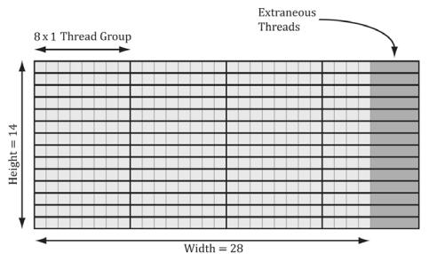


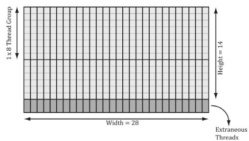


Figure 13.8. Consider a $2 8 \times 1 4$ texture, where our horizontal thread groups are $8 \times 1$ and our vertical thread groups are $1 \times 8$ ( $( X \times Y$ format). For the horizontal pass, in order to cover all the pixels we need to dispatch $e i l ( \stackrel { . . } { 8 } ) = c e i l ( \stackrel { 2 8 } { 8 } ) = 4$ thread groups in the $x$ -direction and 14 thread groups in the y-direction. Since 28 is not a multiple of 8, we end of with extraneous threads that do not do any work in the right-most thread groups. For the vertical pass, in order to cover all the pixels we need to dispatch $\begin{array} { r } { c e i l { \left( \frac { h } { 8 } \right) } = c e i l { \left( \frac { 1 4 } { 8 } \right) } = 2 } \end{array}$ thread groups in the y-direction and 28 thread groups in the $x$ -direction. Since 14 is not a multiple of 8, we end up with extraneous threads that do not do any work in the bottom-most thread groups. The same concepts apply to a larger texture with thread groups of size 256.


The situation is similar for the vertical 1D blur. Again, our thread group is a vertical line segment of 256 threads, and each thread is responsible for blurring one pixel in the image. Therefore, we need to dispatch $\begin{array} { r } { c e i l { \left( \frac { h } { 2 5 6 } \right) } } \end{array}$ thread groups in the y-direction and w thread groups in the $x$ -direction in order for each pixel in the image to be blurred. 

The code below figures out how many thread groups to dispatch in each direction, and kicks off the actual blur operation on the compute shader: 

DEFINE_CBUFFER(BlurDispatchCB, b0)   
{ float4 gWeightVec[8]; // $8^{*}4 = 32$ floats for max blur radius of 15. int gBlurRadius; uint gBlurInputIndex; uint gBlurOutputIndex; uint BlurDispatchCB_Pad0;   
};   
void BlurFilter::Execute(ID3D12GraphicsCommandList\* cmdList, ID3D12RootSignature\* rootSig, ID3D12Resource\* passCB, ID3D12PipelineState\* horzBlurPSO, ID3D12PipelineState\* vertBlurPSO, ID3D12Resource\* input, int blurCount, float blurSigma)   
{ auto weights $\equiv$ CalcGaussWeights(blurSigma); int blurRadius $\equiv$ (int)weights.size() / 2; cmdList->SetComputeRootSignature(rootSig); 

cmdList->SetComputeRootConstantBufferView(   
COMPUTE_ROOT.Arg_PASS_CBV,   
passCB->GetGPUVirtualAddress());   
BlurDispatchCB blurCB;   
ZeroMemory(blurCB.gWeightVec, sizeof(blurCB.gWeightVec));   
CopyMemory(blurCB.gWeightVec, weights.data(), weights.size() \* sizeof(float));   
blurCB.gBlurRadius = blurRadius;   
blurCB.gBlurInputIndex $=$ mBlur0SrvIndex;   
blurCB.gBlurOutputIndex $=$ mBlur1UavIndex;   
GraphicsMemory& linearAllocator $=$ GraphicsMemory::Get(md3dDevice);   
mHorzPassConstants $=$ linearAllocator AllocateConstant(blurCB);   
// Swap input/output for vertical blur pass.   
blurCB.gBlurInputIndex $=$ mBlur1SrvIndex;   
blurCB.gBlurOutputIndex $=$ mBlur0UavIndex;   
mVertPassConstants $=$ linearAllocator AllocateConstant(blurCB);   
cmdList->ResourceBarrier(1, &CD3DX12RESOURCE_   
BARRIER::Transition(input, D3D12RESOURCE_STATE_RENDER_TARGET, D3D12RESOURCE_STATE_copy_SOURCE));   
cmdList->ResourceBarrier(1, &CD3DX12RESOURCE_   
BARRIER::Transition(mBlurMap0.Get(), D3D12RESOURCE_STATEGENERIC_READ, D3D12RESOURCE_STATE.copy_DEST));   
// Copy the input (back-buffer in this example) to BlurMap0.   
cmdList->CopyResource(mBlurMap0.Get(), input);   
cmdList->ResourceBarrier(1, &CD3DX12RESOURCE_   
BARRIER::Transition(mBlurMap0.Get(), D3D12RESOURCE_STATE.copy_DEST, D3D12RESOURCE_STATEGENERIC_READ));   
for(int i $= 0$ ;i $<$ blurCount; ++i) { // // Horizontal Blur pass. // cmdList->ResourceBarrier(1, &CD3DX12RESOURCE_   
BARRIER::Transition(mBlurMap1.Get(), D3D12RESOURCE_STATEGENERIC_READ, D3D12RESOURCE_STATE_UNORDERED_ ACCESS));   
cmdList->SetComputeRootConstantBufferView(   
COMPUTE_ROOT.Arg Dispatch_CBV,   
mHorzPassConstants.GpuAddress());   
cmdList->SetPipelineState(horzBlurPSO); 

```cpp
// How many groups do we need to dispatch to cover a row of pixels, where each // group covers 256 pixels (the 256 is defined in the ComputeShader). UINT numGroupsX = (UINT)ceilf(mWidth / 256.0f); cmdList->Dispatch(numGroupsX, mHeight, 1); cmdList->ResourceBarrier(1, &CD3DX12RESOURCE_BARRIER::Transition(mBlurMap0.Get(), D3D12.Resource_STATEGENERIC_READ, D3D12.Resource_STATE_UNORDERED_ACCESS)); cmdList->ResourceBarrier(1, &CD3DX12RESOURCE_BARRIER::Transition(mBlurMap1.Get(), D3D12.Resource_STATE_UNORDERED_ACCESS, D3D12.Resource_STATEGENERIC_READ)); // // Vertical Blur pass. // cmdList->SetComputeRootConstantBufferView(COMPUTE_ROOTArg_DISPATCH_CBV, mVertPassConstants.GpuAddress()); cmdList->SetPipelineState(vertBlurPSO); // How many groups do we need to dispatch to cover a column of pixels, where each // group covers 256 pixels (the 256 is defined in the ComputeShader). UINT numGroupsY = (UINT)ceilf(mHeight / 256.0f); cmdList->Dispatch(mWidth, numGroupsY, 1); cmdList->ResourceBarrier(1, &CD3DX12RESOURCE_BARRIER::Transition(mBlurMap0.Get(), D3D12.Resource_STATE_UNORDERED_ACCESS, D3D12.Resource_STATEGENERIC_READ)); } 
```

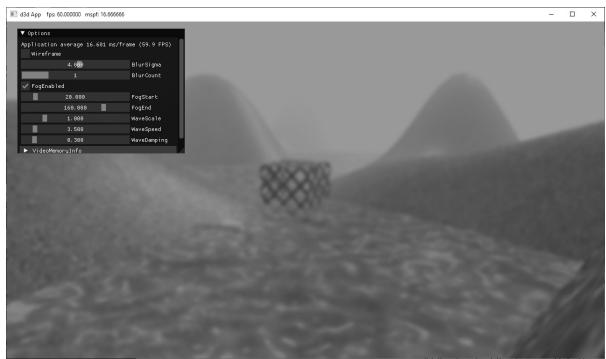


Figure 13.9. Screenshot of the blur demo. We have ImGUI controls for setting the blur sigma parameter and the number of blur iterations.


# 13.7.4 Compute Shader Program

In this section, we look the compute shader program that actually does the blurring. We will only discuss the horizontal blur case. The vertical blur case is analogous, but the situation transposed. 

As mentioned in the previous section, our thread group is a horizontal line segment of 256 threads, and each thread is responsible for blurring one pixel in the image. An inefficient first approach is to just implement the blur algorithm directly. That is, each thread simply performs the weighted average of the row matrix (row matrix because we are doing the 1D horizontal pass) of pixels centered about the pixel the thread is processing. The problem with this approach is that it requires fetching the same texel multiple times (see Figure 13.10). 

We can optimize by following the strategy described in $\$ 13.6$ and take advantage of shared memory. Each thread can read in a texel value and store it in shared memory. After all the threads are done reading their texel values into shared memory, the threads can proceed to perform the blur, but where it reads the texels from the shared memory, which is fast to access. The only tricky thing about this is that a thread group of $n = 2 5 6$ threads requires $n + 2 R$ texels to perform the blur, where $R$ is the blur radius (Figure 13.11). 

The solution is simple; we allocate $n + 2 R$ elements of shared memory, and have 2R threads lookup two texel values. The only thing that is tricky about this is that it requires a little more book keeping when indexing into the shared memory; we no longer have the ith group thread ID corresponding to the ith element in the shared memory. Figure 13.12 shows the mapping from threads to shared memory for $R = 4$ . 

Finally, the last situation to discuss is that the left-most thread group and the right-most thread group can index the input image out-of-bounds, as shown in Figure 13.13. 

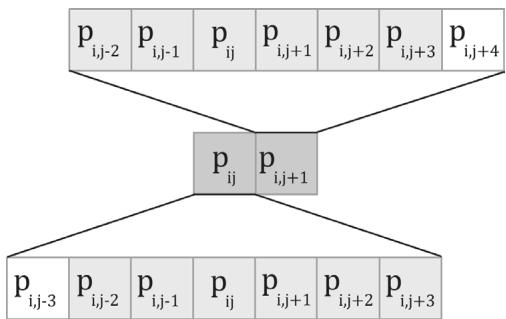


Figure 13.10. Consider just two neighboring pixels in the input image, and suppose that the blur kernel is 1 $\times 7$ . Observe that six out of the eight unique pixels are sampled twice鈥攐nce for each pixel.


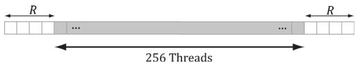


Figure 13.11. Pixels near the boundaries of the thread group will read pixels outside the thread group due to the blur radius.


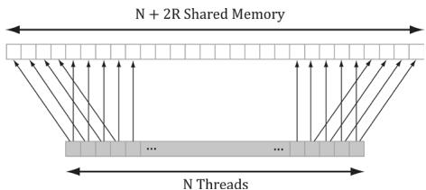


Figure 13.12. In this example, $R = 4$ . The four leftmost threads each read two texel values and store them into shared memory. The four rightmost threads each read two texel values and store them into shared memory. Every other thread just reads one texel value and stores it in shared memory. This gives us all the texel values we need to blur $N$ pixels with blur radius R.


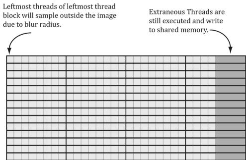


Figure 13.13. Situations where we can read outside the bounds of the image.


Reading from an out-of-bounds index is not illegal鈥攊t is defined to return 0 (and writing to an out-of-bounds index results in a no-op). However, we do not want to read 0 when we go out-of-bounds, as it means 0 colors (i.e., black) will make their way into the blur at the boundaries. Instead, we want to implement something analogous to the clamp texture address mode, where if we read an out-of-bounds value, it returns the same value as the boundary texel. This can be implemented by clamping the indices: 

```cpp
// Clamp out of bound samples that occur at image borders. // Note: Need int cast since subtracting. int x = max((int)dispatchThreadID.x - gBlurRadius, 0); gCache[groupId.x] = gInput[uint2(x, dispatchThreadID.y)]; 
```

# The full shader code is shown below:

// Include common HLSL code. #include "Shaders/Common.hls1" static const int gMaxBlurRadius = 15;   
#define N 256 #define CacheSize $(\mathrm{N} + 2^{*}\mathrm{gMax}$ BlurRadius) groupshared float4 gCache[CacheSize]; [numthreads(N, 1, 1)] void HorzBlurCS( uint3 groupThreadID : SV_GroupThreadID, uint3 dispatchThreadID : SV_DispatchThreadID) { Texture2D gInput $=$ ResourceDescriptorHeap[gBlurInputInd ex]; RWTexture2D<float4> gOutput $=$ ResourceDescriptorHeap[gBlurOutputInd dex]; uint2 imgDims; gInput.GetDimensions(imgDims.x, imgDims.y); 

```objectivec
// Fill local thread storage to reduce bandwidth. To blur
// N pixels, we will need to load N + 2*BlurRadius pixels
// due to the blur radius.
// This thread group runs N threads. To get the extra
// 2*BlurRadius pixels, have 2*BlurRadius threads
// sample an extra pixel.
if (groupId.x < gBlurRadius)
{
    // Clamp out of bound samples that occur at image borders.
    // Note: Need int cast since subtracting.
    int x = max((int) dispatchThreadID.x - gBlurRadius, 0);
    gCache[groupId.x] = gInput[uint2(x, dispatchThreadID.y)];
}
if (groupId.x >= N-gBlurRadius)
{
    // Clamp out of bound samples that occur at image borders.
    int x = min(dispatchThreadID.x + gBlurRadius, imgDims.x-1);
    gCache[groupId.x+2*gBlurRadius] = gInput[uint2(x, dispatchThreadID.y)];
}
// Clamp out of bound samples that occur at image borders.
gCache[groupId.x+gBlurRadius] = gInput[min(dispatchThreadID.xy, imgDims-1)];
// Wait for all threads to finish.
GroupMemoryBarrierWithGroupSync();
// Now blur each pixel.
// float4BlurColor = float4(0, 0, 0, 0);
for (int i = -gBlurRadius; i <= gBlurRadius; ++i)
{
    int k = groupThreadID.x + gBlurRadius + i;
    int float4Index = (i+gBlurRadius) / 4;
    int slotIndex = (i+gBlurRadius) & 0x3;
    float weight = gWeightVec[float4Index][slotIndex];
    blurColor += weight*gCache[k];
}
gOutput[dispatchThreadID.xy] = blurColor;
}
[numthreads(1, N, 1)]
void VertBlurCS(zuint3 groupThreadID : SV_GroupThreadID,
                    uint3 dispatchThreadID : SV_DispatchThreadID) 
```

```cpp
Texture2D gInput = ResourceDescriptorHeap[gBlurInputIndex];  
RWTexture2D<float4> gOutput = ResourceDescriptorHeap[gBlurOutputIndex];  
uint2 imgDims;  
gInput.GetDimensions(imgDims.x, imgDims.y);  
// Fill local thread storage to reduce bandwidth. To blur  
// N pixels, we will need to load N + 2*BlurRadius pixels  
// due to the blur radius.  
// This thread group runs N threads. To get the extra  
// 2*BlurRadius pixels, have 2*BlurRadius threads  
// sample an extra pixel.  
if(groupThreadID.y < gBlurRadius)  
{ // Clamp out of bound samples that occur at image borders. // Note: Need int cast since subtracting. int y = max((int)dispatchThreadID.y - gBlurRadius, 0);  
gCache[gGroupThreadID.y] = gInput[uint2(dispatchThreadID.x, y)];  
}  
if(gGroupThreadID.y >= N-gBlurRadius)  
{ // Clamp out of bound samples that occur at image borders. int y = min(dispatchThreadID.y + gBlurRadius, imgDims.y-1);  
gCache[gGroupThreadID.y+2*gBlurRadius] = gInput[uint2(dispatchThreadID.x, y)];  
}  
// Clamp out of bound samples that occur at image borders.  
gCache[gGroupThreadID.y+gBlurRadius] = gInput[min(dispatchThreadID.xy, imgDims-1)];  
// Wait for all threads to finish.  
GroupMemoryBarrierWithGroupSync();  
// Now blur each pixel.  
// float4 blurColor = float4(0, 0, 0, 0);  
for(int i = -gBlurRadius; i <= gBlurRadius; ++i)  
{ int k = groupThreadID.y + gBlurRadius + i; int float4Index = (i+gBlurRadius) / 4; int slotIndex = (i+gBlurRadius) & 0x3; float weight = gWeightVec[float4Index][slotIndex]; blurColor += weight*gCache[k]; 
```

```cpp
}  
gOutput[dispatchThreadID.xy] = blurColor; 
```

For the last line 

```cpp
gOutput[dispatchThreadID.xy] = blurColor; 
```

it is possible in the right-most thread group to have extraneous threads that do not correspond to an element in the output texture (Figure 13.13). That is, the dispatchThreadID.xy will be an out-of-bounds index for the output texture. However, we do not need to worry about handling this case, as an out-of-bound write results in a no-op. 

# 13.8 SUMMARY

1. The ID3D12GraphicsCommandList::Dispatch API call dispatches a grid of thread groups. Each thread group is a 3D grid of threads; the number of threads per thread group is specified by the [numthreads $( \mathrm { x } , \mathrm { y } , \mathrm { z } )$ ]attribute in the compute shader. For performance reasons, the total number of threads should be a multiple of the warp size (thirty-two for NVIDIA hardware) or a multiple of the wavefront size (sixty-four ATI hardware). 

2. To ensure parallelism, at least two thread groups should be dispatched per multiprocessor. So if your hardware has sixteen multiprocessors, then at least thirty-two thread groups should be dispatched so a multiprocessor always has work to do. Future hardware will likely have more multiprocessors, so the number of thread groups should be even higher to ensure your program scales well to future hardware. 

3. Once thread groups are assigned to a multiprocessor, the threads in the thread groups are divided into warps of thirty-two threads on NVIDIA hardware. The multiprocessor than works on a warp of threads at a time in an SIMD fashion (i.e., the same instruction is executed for each thread in the warp). If a warp becomes stalled, say to fetch texture memory, the multiprocessor can quickly switch and execute instructions for another warp to hide this latency. This keeps the multiprocessor always busy. You can see why there is the recommendation of the thread group size being a multiple of the warp size; if it were not then when the thread group is divided into warps, there will be warps with threads that are not doing anything. 

4. Texture resources can be accessed by the compute shader for input by creating a SRV to the texture and binding it to the compute shader. A read-write texture (RWTexture) is a texture the compute shader can read and write output to. To set a texture for reading and writing to the compute shader, a UAV (unordered access view) to the texture is created and bound to the compute shader. Texture elements can be indexed with operator [] notation, or sampled via texture coordinates and sampler state with the SampleLevel method. 

5. A structured buffer is a buffer of elements that are all the same type, like an array. The type can be a user-defined type defined by a struct for example. Read-only structured buffers are defined in the HLSL like this: 

StructuredBuffer<DataType> gInputA; 

Read-write structured buffers are defined in the HLSL like this: 

RWStructuredBuffer<DataType> gOutput; 

Read-only buffer resources can be accessed by the compute shader for input by create a SRV to a structured buffer and binding it to the compute shader. Read-write buffer resources can be accessed by the compute shader for reading and writing by creating a UAV to a structured buffer and binding it to the compute shader. 

6. Various thread IDs are passed into the compute shader via the system values. These IDs are often used to index into resources and shared memory. 

7. Consume and append structured buffers are defined in the HLSL like this: 

ConsumeStructuredBuffer<DataType> gInput; AppendStructuredBuffer<DataType> gOutput; 

Consume and append structured buffers are useful if you do not care about the order in which data elements are processed and written to the output buffer, as it allows you to avoid indexing syntax. Note that append buffers do not automatically grow, and they must have be large enough to store all the data elements you will append to it. Internally, consume and append buffers have a buffer associated with them that stores a counter. The counter is atomically incremented/decremented based on append/consume. 

8. Thread groups are given a section of so-called shared memory or thread local storage. Accessing this memory is fast and can be thought of being as fast as a hardware cache. This shared memory cache can be useful for optimizations or needed for algorithm implementations. In the compute shader code, shared memory is declared like so: 

groupshared float4 gCache[N]; 

The array size N can be whatever you want, but the maximum size of group shared memory is 32kb. Assuming a multiprocessor supports the maximum of $3 2 \mathrm { k b }$ for shared memory, for performance, a thread group should not use more than 16kb of shared memory; otherwise it is impossible to fit two thread groups on a single multiprocessor. 

9. Avoid switching between compute processing and rendering when possible, as there is overhead required to make the switch. In general, for each frame try to do all of your compute work first, then do all of your rendering work. 

# 13.9 EXERCISES

1. Write a compute shader that inputs a structured buffer of sixty-four 3D vectors with random magnitudes contained in [1, 10]. The compute shader computes the length of the vectors and outputs the result into a floating-point buffer. Copy the results to CPU memory and save the results to file. Verify that all the lengths are contained in [1, 10]. 

2. Redo the previous exercise using typed buffers; that is, Buffer<float3> for the input buffer and Buffer<float> for the output buffer. 

3. Assume that in the previous exercises that we do not care the order in which the vectors are normalized. Redo Exercise 1 using Append and Consume buffers. 

4. Research the bilateral blur technique and implement it on the compute shader. Redo the 鈥淏lur鈥?demo using the bilateral blur. 

5. So far in our demos we have done a 2D wave equation on the CPU with the Waves class in Waves.h/.cpp. Port this to a GPU implementation. Use textures of floats to store the previous, current, and next height solutions. 

Use the compute shader to perform the wave update computations. A separate compute shader with a single thread can be used to disturb the water to generate initial waves. After you have updated the grid heights, you can render a triangle grid with the same vertex resolution as the wave textures (so there is a texel corresponding to each grid vertex). Then in the vertex shader, you can sample the solution texture to offset the heights (this is called displacement mapping) and estimate the normal. 

```c
VertexOut VS(VERTEXin vin)  
{ VertexOut vout = (VertexOut)0.0f; 
```

```cpp
if WAVES_VS
    uint wavesBufferIndex = gMiscUint3.x;
    uint wavesGridWidth = gMiscUint3.y;
    uint wavesGridDepth = gMiscUint3.z;
    float wavesGridSpatialStep = gMiscFloat4.x;
    Texture2D<float> currSolInput = DescriptorHeap[wavesBufferIndex];
    uint gridY = vertexId / wavesGridWidth;
    uint gridX = vertexId % wavesGridWidth;
    float waveHeight = currSolInput[uint2(gridX,gridY)].r;
    vin(PosL.y += waveHeight);
    // Estimate normal using finite difference.
    float 1 = currSolInput[uint2(clamp(gridX-1,0,
                     wavesGridWidth),gridY)].r;
    float r = currSolInput[uint2(clamp(gridX+1,0,
                     wavesGridWidth),gridY)].r;
    float t = currSolInput[uint2(clamp(gridY-1,0,
                     wavesGridDepth)).r;
    float b = currSolInput[uint2(gridX,clamp(gridY+1,0,
                     wavesGridDepth)).r;
    vin.NormalL = normalize(float3(-r+1,
                            2.0f*wavesGridSpatialStep,b-t));
}
endif
// Transform to world space.
float4 posW = mul(float4(vin(PosL,1.0f),gWorld);
voutPosW = posW.xyz;
// Assumes nonuniform scaling; otherwise, need to use
// inverse-transpose of world matrix.
vout.NormalW = mul(vin.NormalL,(float3x3)gWorld);
// Transform to homogeneous clip space.
vout-posH = mul(posW,gViewProj);
// Output vertex attributes for interpolation across triangle.
float4 texC = mul(float4(vin.TexC,0.0f,1.0f),gTexTransform);
vout.TexC = mul(texC,gMatTransform).xy;
return vout;
} 
```

Compare your performance results (time per frame) to a CPU implementation with $5 1 2 \times 5 1 2$ grid points in release mode. 

6. The Sobel Operator measures edges in an image. For each pixel, it estimates the magnitude of the gradient. A pixel with a large gradient magnitude means the color difference between the pixel and its neighbors has high variation, and so 

that pixel must be on an edge. A pixel with a small gradient magnitude means the color difference between the pixel and its neighbors has low variation, and so that pixel is not on an edge. Note that the Sobel Operator does not return a binary result (on edge or not on edge); it returns a grayscale value in the range [0, 1] that denotes an edge 鈥渟teepness鈥?amount, where 0 denotes no edge (the color is not changing locally about a pixel) and 1 denotes a very steep edge or discontinuity (the color is changing a lot locally about a pixel). The inverse Sobel image $( 1 - c )$ is often more useful, as white denotes no edge and black denotes edges (see Figure 13.14). 

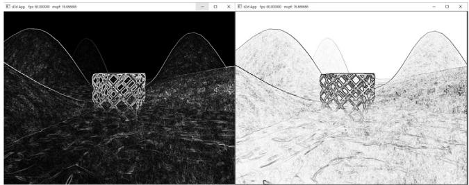


Figure 13.14. Left: In image after applying Sobel Operator, the white pixels denote edges. In the inverse image of the Sobel Operator, the black pixels denote edge.


If you color multiply the original image by the inverse of the image generated by the Sobel Operator, then you get a stylized cartoon/comic book like effect by making edges look like black pen strokes (see Figure 13.15). You can take this stylized cartoon/comic book effect even further by first blurring聽 the original image to wash out details, then applying the Sobel Operator on the聽blurred image to build the edge detection image, and finally multiplying the blurred image by the inverse of the edge detection image. 

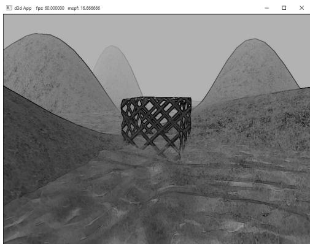


Figure 13.15. Multiplying the original image by the inverse of the edge detection image to produce a stylized look where edge look like black pen strokes.


Use render-to-texture and a compute shader to implement the Sobel Operator. After you have generated the edge detection image, multiply the original image with the inverse of the image generated by the Sobel Operator to get the results shown in Figure 13.15. The necessary shader code is included below: 

```cpp
//  
// Performs edge detection using Sobel operator.  
// 
```

```cpp
// Approximates luminance ("brightness") from an RGB value.   
// These weights are derived from experiment based on eye   
// sensitivity to different wavelengths of light. float CalcLuminance(float3 color) { return dot(color, float3(0.299f, 0.587f, 0.114f));   
}   
[numthreads(16, 16, 1)]   
void SobelCS(int3 dispatchThreadID : SV_DispatchThreadID) { Texture2D gInput = ResourceDescriptorHeap[gInputIndex]; RWTexture2D<float4> gOutput = ResourceDescriptorHeap[gOutputIndex]; // Sample the pixels in the neighborhood of this pixel. float4 c[3][3]; for (int i = 0; i < 3; ++i) { for (int j = 0; j < 3; ++j) { int2 xy = dispatchThreadID.xy + int2(-1 + j, -1 + i); c[i][j] = gInput[xy]; }   
}   
// For each color channel, estimate partial x derivative   
// using Sobel scheme. float4 Gx = -1.0f*c[0][0] - 2.0f*c[1][0] - 1.0f*c[2][0] + 1.0f*c[0][2] + 2.0f*c[1][2] + 1.0f*c[2][2];   
// For each color channel, estimate partial y derivative   
// using Sobel scheme. float4 Gy = -1.0f*c[2][0] - 2.0f*c[2][1] - 1.0f*c[2][1] + 1.0f*c[0][0] + 2.0f*c[0][1] + 1.0f*c[0][2];   
// Gradient is (Gx, Gy). For each color channel, compute magnitude   
// get maximum rate of change. float4 mag = sqrt(Gx*Gx + Gy*Gy);   
// Make edges black, and nonedges white. mag = 1.0f - saturate(CalcLuminance(mag.rgb)); 
```

```cpp
gOutput[dispatchThreadID.xy] = mag;   
}   
//**********   
// Combines two images.   
//********** 
```

```objectivec
static const float2 gTexCoords[6] = { float2(0.0f, 1.0f), float2(0.0f, 0.0f), float2(1.0f, 0.0f), float2(0.0f, 1.0f), float2(1.0f, 0.0f), float2(1.0f, 1.0f) };   
struct VertexOut { float4 PosH : SV POSITION; float2 TexC : TEXCOORD; } ;   
VertexOut VS (uint vid : SV_VertexID) { VertexOut vout; vout.TexC = gTexCoords[vid]; // Map [0,1]^2 to NDC space. vout(PosH = float4(2.0f*vout.TexC.x - 1.0f, 1.0f - 2.0f*vout.TexC.y, 0.0f, 1.0f); return vout; }   
float4 PS (VertexOut pin) : SV_Target { Texture2D gBaseMap = ResourceDescriptorHeap[gBaseMapIndex]; Texture2D gEdgeMap = ResourceDescriptorHeap[gEdgeMapIndex]; float4 c = gBaseMap_SAMPLELevel(GetPointClampSampler(), pin.TexC, 0.0f); float4 e = gEdgeMap/sampleLevel(GetPointClampSampler(), pin.TexC, 0.0f); // Multiple edge map with original image. return c*e; } 
```
