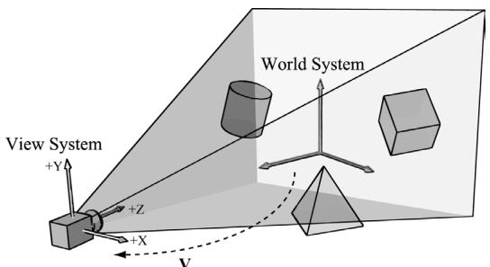

# Chapter 15 Building a First Person Camera


# III Topics

n this part, we focus on applying Direct3D to implement various rendering effects to make our scenes more realistic, such as sky rendering, ambient occlusion, character animation, environment mapping, normal mapping, shadow mapping, particle systems, and ray tracing. A brief description of the chapters in this part follows. 

Chapter 15, Building a First Person Camera: In this chapter, we show how to design a camera system that behaves more as you would expect in a firstperson game. We show how to control the camera via keyboard and mouse input. 

Chapter 16, Instancing and Frustum Culling: Instancing is a hardwaresupported technique that optimizes the drawing of the same geometry multiple times with different properties (such as at different positions in the scene and with different colors). Frustum culling is an optimization technique where we discard an entire object from being submitted to the rendering pipeline if it lies completely outside the virtual camera鈥檚 field of view. We also show how to compute the bounding box and sphere of a mesh. 

Chapter 17, Picking: This chapter shows how to determine the particular 3D object (or 3D primitive) that the user has selected with the mouse.聽Picking is often a necessity in 3D games and applications where the user interacts with the 3D world with the mouse. 

Chapter 18, Cube Mapping: In this chapter, we show how to reflect environments onto arbitrary meshes with environment mapping; in addition, we use an environment map to texture a sky-sphere. 

Chapter 19, Normal Mapping: This chapter shows how to get more detailed real-time lighting results by using normal maps, which are textures that store normal vectors. This gives surface normals at a finer granularity than per-vertex normals, resulting in more realistic lighting. 

Chapter 20, Shadow Mapping: Shadow mapping is a real-time shadowing technique, which shadows arbitrary geometry (it is not limited to planar shadows). In addition, we learn how projective texturing works. 

Chapter 21, Ambient Occlusion: Lighting plays an important role in making our scenes look realistic. In this chapter, we improve the ambient term of our lighting equation by estimating how occluded a point in our scene is from incoming light. 

Chapter 22, Quaternions: In this chapter, we study mathematical objects called quaternions. We show that unit quaternions represent rotations and can be interpolated in a simple way, thereby giving us a way to interpolate rotations. Once we can interpolate rotations, we can create 3D animations. 

Chapter 23, Character Animation: This chapter covers the theory of character animation and shows how to animate a typical human game character with a complex walking animation. 

Chapter 24, Terrain Rendering: This chapter shows how to create, texture, light, and render 3D terrains using heightmaps, tessellation, and a multi-texturing technique. 

Chapter 25, Particle Systems: In this chapter, we learn how to model systems that consist of many small particles that all behave in a similar manner.聽 For example, particle systems can be used to model snow and rain, fire and smoke, rocket trails, sprinklers, and fountains. 

Chapter 26, Mesh Shaders: Mesh and Amplification shaders effectively replace the geometry pipeline (input assembler, vertex shader, tessellation shaders, and geometry shader) with compute-based shaders that more accurately model the underlying hardware. This both simplifies the pipeline and provides more flexibility. 

Chapter 27, Ray Tracing: Ray tracing is an alternative method of generating 3D scenes. The ray tracing algorithm has been around for a long time, but only recently has it gotten direct GPU accelerated support. This chapter introduces the fundamentals of ray tracing as well as the DirectX ray tracing APIs. 

# Chapter

# 15 Buil ding a First Person Cam era

In this short chapter, we design a camera system that behaves more as you would expect in a first-person game. This camera system will replace the orbiting camera system we have been using thus far in the demos. 

# Chapter Objectives:

1. To review the mathematics of the view space transformation. 

2. To be able to identify the typical functionality of a first person camera. 

3. To learn how to implement a first person camera. 

# 15.1 VIEW TRANSFORM REVIEW

View space is the coordinate system attached to the camera as shown in Figure 15.1. The camera sits at the origin looking down the positive $z$ -axis, the $x$ -axis aims to the right of the camera, and the y-axis aims above the camera. Instead of describing our scene vertices relative to the world space, it is convenient for later stages of the rendering pipeline to describe them relative to the camera coordinate system. The change of coordinate transformation from world space to view space is called the view transform, and the corresponding matrix is called the view matrix. 




Figure 15.1. The camera coordinate system. Relative to its own coordinate system, the camera sits at the origin looking down the positive $Z$ -axis.


If $\mathbf { Q } _ { w } = ( Q _ { x } , Q _ { y } , Q _ { z } , 1 )$ , $\mathbf { u } _ { w } = ( u _ { x } , u _ { y } , u _ { z } , 0 )$ , $\mathbf { v } _ { w } = ( \nu _ { x } , \nu _ { y } , \nu _ { z } , 0 )$ , and $\begin{array} { r } { \mathbf { w } _ { w } = ( w _ { x } , } \end{array}$ $w _ { y } , w _ { z } , 0 )$ describe, respectively, the origin, $x \mathrm { - } , y \mathrm { - }$ , and $z$ -axes of view space with homogeneous coordinates relative to world space, then we know from $\ S 3 . 4 . 3$ that the change of coordinate matrix from view space to world space is: 

$$
\mathbf {W} = \left[ \begin{array}{c c c c} u _ {x} & u _ {y} & u _ {z} & 0 \\ v _ {x} & v _ {y} & v _ {z} & 0 \\ w _ {x} & w _ {y} & w _ {z} & 0 \\ Q _ {x} & Q _ {y} & Q _ {z} & 1 \end{array} \right]
$$

However, this is not the transformation we want. We want the reverse transformation from world space to view space. But recall from $\$ 3.4.5$ that reverse transformation is just given by the inverse. Thus $\mathbf { W } ^ { - 1 }$ transforms from world space to view space. 

The world coordinate system and view coordinate system generally differ by position and orientation only, so it makes intuitive sense that ${ \bf W } = { \bf R } { \bf T } $ (i.e., the world matrix can be decomposed into a rotation followed by a translation). This form makes the inverse easier to compute: 

$$
\begin{array}{l} \mathbf {V} = \mathbf {W} ^ {- 1} = (\mathbf {R T}) ^ {- 1} = \mathbf {T} ^ {- 1} \mathbf {R} ^ {- 1} = \mathbf {T} ^ {- 1} \mathbf {R} ^ {T} \\ = \left[ \begin{array}{c c c c} 1 & 0 & 0 & 0 \\ 0 & 1 & 0 & 0 \\ 0 & 0 & 1 & 0 \\ - Q _ {x} & - Q _ {y} & - Q _ {z} & 1 \end{array} \right] \left[ \begin{array}{c c c c} u _ {x} & v _ {x} & w _ {x} & 0 \\ u _ {y} & v _ {y} & w _ {y} & 0 \\ u _ {z} & v _ {z} & w _ {z} & 0 \\ 0 & 0 & 0 & 1 \end{array} \right] = \left[ \begin{array}{c c c c} u _ {x} & v _ {x} & w _ {x} & 0 \\ u _ {y} & v _ {y} & w _ {y} & 0 \\ u _ {z} & v _ {z} & w _ {z} & 0 \\ - \mathbf {Q} \cdot \mathbf {u} & - \mathbf {Q} \cdot \mathbf {v} & - \mathbf {Q} \cdot \mathbf {w} & 1 \end{array} \right] \\ \end{array}
$$

So the view matrix has the form: 

$$
\mathbf {V} = \left[ \begin{array}{c c c c} u _ {x} & v _ {x} & w _ {x} & 0 \\ u _ {y} & v _ {y} & w _ {y} & 0 \\ u _ {z} & v _ {z} & w _ {z} & 0 \\ - \mathbf {Q} \cdot \mathbf {u} & - \mathbf {Q} \cdot \mathbf {v} & - \mathbf {Q} \cdot \mathbf {w} & 1 \end{array} \right]
$$

As with all change-of-coordinate transformations, we are not moving anything in the scene. The coordinates change because we are using the camera space frame of reference instead of the world space frame of reference. 

# 15.2 THE CAMERA CLASS

To encapsulate our camera related code, we define and implement a Camera class. The data of the camera class stores two key pieces of information. The position, right, up, and look vectors of the camera defining, respectively, the origin, $x$ -axis, y-axis, and $z$ -axis of the view space coordinate system in world coordinates, and the properties of the frustum. You can think of the lens of the camera as defining the frustum (its field of view and near and far planes). Most of the methods are trivial (e.g., simple access methods). See the comments below for an overview of the methods and data members. We review selected methods in the next section. 

```cpp
class Camera   
{   
public: Camera(); \~Camera(); //Get/Setworld camera position. DirectX::XMVECTOR GetPosition()const; DirectX::XMFLOAT3 GetPosition3f()const;void SetPosition(float x, float y, float z);void SetPosition(const DirectX::XMFLOAT3& v); //Get camera basis vectors.DirectX::XMVECTOR GetRight()const; DirectX::XMFLOAT3 GetRight3f()const; DirectX::XMVECTOR GetUp()const; DirectX::XMFLOAT3 GetUp3f()const; DirectX::XMVECTOR GetLook()const; DirectX::XMFLOAT3 GetLook3f()const; //Get frustum properties.floatGetNearZ()const;floatGetFarz()const;floatGetAspect()const; 
```

```cpp
float GetFovY(const; float GetFovX(const; // Get near and far plane dimensions in view space coordinates. float GetNearWindowWidth(const; float GetNearWindowHeight(const; float GetFarWindowWidth(const; float GetFarWindowHeight(const; // Set frustum. void SetLens(floatfovY, float aspect, float zn, float zf); // Define camera space via LookAt parameters. void LookAt(DirectX::FXMVECTOR pos, DirectX::FXMVECTOR target, DirectX::FXMVECTOR worldUp); void LookAt(const DirectX::XMFLOAT3& pos, const DirectX::XMFLOAT3& target, const DirectX::XMFLOAT3& up); // Get View/Proj matrices. DirectX::XMMatrix GetView()const; DirectX::XMMatrix GetProj()const; DirectX::XMFLOAT4X4 GetView4x4f()const; DirectX::XMFLOAT4X4 GetProj4x4f()const; // Strafe/Walk the camera a distance d. void Strafe(floatd); void Walk(floatd); // Rotate the camera. void Pitch(float angle); void RotateY(float angle); // After modifying camera position/orientation, call to rebuild // the view matrix. void UpdateViewMatrix();   
private: // Camera coordinate system with coordinates // relative to world space. DirectX::XMFLOAT3 mPosition = { 0.0f, 0.0f, 0.0f }; DirectX::XMFLOAT3 mRight = { 1.0f, 0.0f, 0.0f }; DirectX::XMFLOAT3 mUp = { 0.0f, 1.0f, 0.0f }; DirectX::XMFLOAT3 mLook = { 0.0f, 0.0f, 1.0f }; // Cache frustum properties. float mNearZ = 0.0f; float mFarZ = 0.0f; float mAspect = 0.0f; float mFovY = 0.0f; float mNearWindowHeight = 0.0f; float mFarWindowHeight = 0.0f; 
```

```cpp
bool mViewDirty = true; // Cache View/Proj matrices. DirectX::XMFLOAT4X4 mView = MathHelper::Identity4x4(); DirectX::XMFLOAT4X4 mProj = MathHelper::Identity4x4();}; 
```


The Camera.h/Camera.cpp files are in the Common directory. 

# 15.3 SELECTED METHOD IMPLEMENTATIONS

Many of the camera class methods are trivial get/set methods that we will omit here. However, we will review a few of the important ones in this section. 

# 15.3.1 XMVECTOR Return Variations

First, we want to remark that we provide XMVECTOR return variations for many of the 鈥済et鈥?methods; this is just for convenience so that the client code does not need to convert if they need an XMVECTOR: 

```cpp
XMVECTOR Camera::GetPosition()const { return XmlLoadFloat3(&mPosition);   
}   
XMFLOAT3 Camera::GetPosition3f()const { return mPosition;   
} 
```

# 15.3.2 SetLens

We can think of the frustum as the lens of our camera, for it controls our field of view. We cache the frustum properties and build the projection matrix is the SetLens method: 

```cpp
void Camera::SetLens(floatfovY, float aspect, float zn, float zf)  
{ // cache properties mFovY =fovY; mAspect = aspect; mNearZ =zn; mFarZ =zf; mNearWindowHeight = 2.0f * mNearZ * tanf(0.5f*mFovY); mFarWindowHeight = 2.0f * mFarZ * tanf(0.5f*mFovY); 
```

```cpp
XMMMATRIX P = XMMatrixPerspectiveFovLH(mFovY, mAspect, mNearZ, mFarZ);  
XMStoreFloat4x4(&mProj, P); 
```

# 15.3.3 Derived Frustum Info

As we just saw, we cache the vertical field of view angle, but additionally provide a method that derives the horizontal field of view angle. Moreover, we provide methods to return the width and height of the frustum at the near and far planes, which are sometimes useful to know. The implementations of these methods are just trigonometry, and if you have trouble following the equations, then review $\ S 5 . 6 . 3$ : 

```cpp
float Camera::GetFovX() const { float halfWidth = 0.5f*GetNearWindowWidth(); return 2.0f*atan(halfWidth / mNearZ); } float Camera::GetNearWindowWidth() const { return mAspect * mNearWindowHeight; } float Camera::GetNearWindowHeight() const { return mNearWindowHeight; } float Camera::GetFarWindowWidth() const { return mAspect * mFarWindowHeight; } float Camera::GetFarWindowHeight() const { return mFarWindowHeight; } 
```

# 15.3.4 Transforming the Camera

For a first person camera, ignoring collision detection, we want to be able to: 

1. Move the camera along its look vector to move forwards and backwards. This can be implemented by translating the camera position along its look vector. 

2. Move the camera along its right vector to strafe right and left. This can be implemented by translating the camera position along its right vector. 

3. Rotate the camera around its right vector to look up and down. This can be implemented by rotating the camera鈥檚 look and up vectors around its right vector using the XMMatrixRotationAxis function. 

4. Rotate the camera around the world鈥檚 y-axis (assuming the y-axis corresponds to the world鈥檚 鈥渦p鈥?direction) vector to look right and left. This can be implemented by rotating all the basis vectors around the world鈥檚 $y$ -axis using the XMMatrixRotationY function. 

void Camera::Walk(float d)   
{ //mPosition $+ =$ d*mLook XMVECTOR s $=$ XMVectorReplicate(d); XMVECTOR l $=$ XMLoadFloat3(&mLook); XMVECTOR p $=$ XMLoadFloat3(&mPosition); XMStoreFloat3(&mPosition, XMVectorMultiplyAdd(s, l, p));   
void Camera::Strafe(float d)   
{ // mPosition $+ =$ d*mRight XMVECTOR s $=$ XMVectorReplicate(d); XMVECTOR r $=$ XMLoadFloat3(&mRight); XMVECTOR p $=$ XMLoadFloat3(&mPosition); XMStoreFloat3(&mPosition, XMVectorMultiplyAdd(s, r, p));   
}   
void Camera::Pitch(float angle)   
{ // Rotate up and look vector about the right vector. XMMatrix R $=$ XMMatrixRotationAxis(XLOADFloat3(&mRight), angle); XMStoreFloat3(&mUp, XMVector3TransformNormal(XLOADFloat3(&mUp), R)); XMStoreFloat3(&mLook, XMVector3TransformNormal(XLOADFloat3(&mLook), R));   
}   
void Camera::RotateY(float angle)   
{ // Rotate the basis vectors about the world y-axis. XMMatrix R $=$ XMMatrixRotationY(angle); XMStoreFloat3(&mRight, XMVector3TransformNormal(XLOADFloat3(&mRightht), R)); XMStoreFloat3(&mUp, XMVector3TransformNormal(XLOADFloat3(&mUp), R)); XMStoreFloat3(&mLook, XMVector3TransformNormal(XLOADFloat3(&mLook), R));   
} 

# 15.3.5 Building the View Matrix

The first part of the UpdateViewMatrix method reorthonormalizes the camera鈥檚 right, up, and look vectors. That is to say, it makes sure they are mutually orthogonal to each other and unit length. This is necessary because after several rotations, numerical errors can accumulate and cause these vectors to become non-orthonormal. When this happens, the vectors no longer represent a rectangular coordinate system, but a skewed coordinate system, which is not what we want. The second part of this method just plugs the camera vectors into Equation 15.1 to compute the view transformation matrix. 

```cpp
void Camera::UpdateViewMatrix()
{
    if (mViewDirty)
    {
        XMVECTOR R = XMLoadFloat3(&mRight);
        XMVECTOR U = XMLoadFloat3(&mUp);
        XMVECTOR L = XMLoadFloat3(&mLook);
        XMVECTOR P = XMLoadFloat3(&mPosition);
        // Keep camera's axes orthogonal to each other and of unit length.
        L = XMVector3Normalize(L);
        U = XMVector3Normalize(XMVector3Cross(L, R));
        // U, L already ortho-normal, so no need to normalize
        // cross product.
        R = XMVector3Cross(U, L);
        // Fill in the view matrix entries.
        float x = -XMVectorGetX(XMVector3Dot(P, R));
        float y = -XMVectorGetX(XMVector3Dot(P, U));
        float z = -XMVectorGetX(XMVector3Dot(P, L));
        XMStoreFloat3(&mRight, R);
        XMStoreFloat3(&mUp, U);
        XMStoreFloat3(&mLook, L);
        mView(0, 0) = mRight.x;
        mView(1, 0) = mRight.y;
        mView(2, 0) = mRight.z;
        mView(3, 0) = x;
        mView(0, 1) = mUp.x;
        mView(1, 1) = mUp.y;
        mView(2, 1) = mUp.z;
        mView(3, 1) = y;
        mView(0, 2) = mLook.x;
        mView(1, 2) = mLook.y;
        mView(2, 2) = mLook.z;
        mView(3, 2) = z; 
```

```matlab
mView(0, 3) = 0.0f;  
mView(1, 3) = 0.0f;  
mView(2, 3) = 0.0f;  
mView(3, 3) = 1.0f;  
mViewDirty = false; 
```

# 15.4 DEMO COMMENTS

We do not have a single 鈥淐amera鈥?demo application, but all demos from now on will use the Camera class described in the previous sections, instead of the orbiting camera model. This section outlines the changes needed to use the new camera style. First, we can remove all the old variables from our application class that were related to the orbital camera system such as mPhi, mTheta, mRadius, mView, and mProj. We will add a member variable: 

Camera mCamera; 

When the window is resized, we know longer rebuild the projection matrix explicitly, and instead delegate the work to the Camera class with SetLens: 

```cpp
void TestApp::OnResize()  
{  
    D3DApp::OnResize();  
    mCamera.SetLens(0.25f*MathHelper::Pi, AspectRatio(), 1.0f, 1000.0f);  
} 
```

In the OnKeyboardInput method, we handle keyboard input to move the camera. In typical first-person shooter fashion, we use the 鈥淲,鈥?鈥淪,鈥?鈥淎,鈥?and 鈥淒鈥?keys to move forward, backward, strafe left, and strafe right, respectively. 

```cpp
void TestApp::OnKeyboardInput(const GameTimer& gt)  
{  
    const float dt = gt.DeltaTime();  
    if(GetAsyncKeyState('W') & 0x8000)  
        mCamera.Walk(10.0f*dt);  
    if(GetAsyncKeyState('S') & 0x8000)  
        mCamera.Walk(-10.0f*dt);  
    if(GetAsyncKeyState('A') & 0x8000)  
        mCameraStrafe(-10.0f*dt);  
    if(GetAsyncKeyState('D') & 0x8000)  
        mCameraStrafe(10.0f*dt);  
    mCamera.UpdateViewMatrix();  
} 
```

In the OnMouseMove method, when the left mouse button is down, we rotate the camera鈥檚 look direction: 

```cpp
void TestApp::OnMouseMove(WPARAM btwState, int x, int y)  
{  
    ImGuiIO& io = ImGui::GetIO();  
if(!io WantCaptureMouse)  
{  
    if((btnState & MK_LBUTTON) != 0)  
{  
        // Make each pixel correspond to a quarter of a degree. float dx = XMConvertToRadians(0.25f * (float)(x - mLLastMousePos.x)); float dy = XMConvertToRadians(0.25f * (float)(y - mLLastMousePos.y));  
        mCamera.Pitch(dy);  
        mCamera RotateY(dx);  
    }  
    mLLastMousePos.x = x;  
    mLLastMousePos.y = y;  
} 
```

Finally, for rendering, the view and projection matrices can be accessed from the camera instance: 

XMMatrix view $=$ mCamera.View(); XMMatrix proj $=$ mCamera.Proj(); 

# 15.5 PSO LIB

Similar to what we did in Chapter 9 with textures and materials, we are going to use a simple library for PSOs. For this, we implement a utility class PsoLib in Common/PsoLib.h/.cpp. We are going to put all the PSOs used for the demo application of Part III in this library so that we do not have to duplicate PSO definitions across demo applications. As with TextureLib, this class is mostly a wrapper around an unordered map of PSOs so that we can look up a PSO by name. Creating the PSOs now comes from calling the PsoLib::Init method: 

```cpp
void TestApp::BuildPSOs()
{
    PsoLib::GetLib().Init(
        md3dDevice.Get(), mBackBufferFormat, mDepthStencilFormat, SsaoAmbientMapFormat,
        //...
    )
} 
```

```javascript
SceneNormalMapFormat, mRootSignature.Get(); } 
```

We can look up a PSO by using the overloaded indexing operator: 

```cpp
PsoLib& psoLib = PsoLib::GetLib();  
mCommandList->SetPipelineState(psoLib["opaque"]); 
```

# 15.6 SUMMARY

1. We define the camera coordinate system by specifying its position and orientation. The position is specified by a position vector relative to the world coordinate system, and the orientation is specified by three orthonormal vectors relative to the world coordinate system: a right, up, and look vector. Moving the camera amounts to moving the camera coordinate system relative to the world coordinate system. 

2. We included projection related quantities in the camera class, as the perspective projection matrix can be thought of as the 鈥渓ens鈥?of the camera by controlling the field of view, and near and far planes. 

3. Moving forward and backwards can be implemented simply by translating the camera position along its look vector. Strafing right and left can be implemented simply by translating the camera position along its right vector. Looking up and down can be achieved by rotating the camera鈥檚 look and up vectors around its right vector. Looking left and right can be implemented by rotating all the basis vectors around the world鈥檚 y-axis. 

# 15.7 EXERCISES

1. Given the world space axes and origin in world coordinates: ${ \bf i } = ( 1 , 0 , 0 ) , { \bf j } =$ (0, 1, 0), $\mathbf { k } = ( 0 , 0 , 1 )$ , and ${ \mathbf O } = ( 0 , 0 , 0 )$ , and the view space axes and origin in world coordinates: $\mathbf { u } = ( u _ { x } , u _ { y } , u _ { z } )$ , $\mathbf { v } = ( \nu _ { x } , \nu _ { y } , \nu _ { z } )$ , $\mathbf { w } = ( w _ { x } , w _ { y } , w _ { z } )$ , and $\mathbf { Q } = ( Q _ { x } ,$ $Q _ { y } , Q _ { z } )$ , derive the view matrix form 

$$
\mathbf {V} = \left[ \begin{array}{c c c c} u _ {x} & v _ {x} & w _ {x} & 0 \\ u _ {y} & v _ {y} & w _ {y} & 0 \\ u _ {z} & v _ {z} & w _ {z} & 0 \\ - \mathbf {Q} \cdot \mathbf {u} & - \mathbf {Q} \cdot \mathbf {v} & - \mathbf {Q} \cdot \mathbf {w} & 1 \end{array} \right]
$$

using the dot product. (Remember, to find the change of coordinate matrix from world space to view space, you just need to describe the world space axes and origin with coordinates relative to view space. Then these coordinates become the rows of the view matrix.) 

2. Modify the camera demo to support 鈥渞oll.鈥?This is where the camera rotates around its look vector. This could be useful for an aircraft game. 
