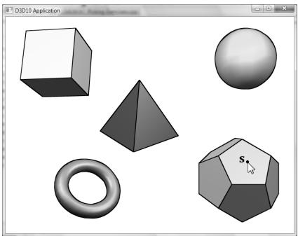
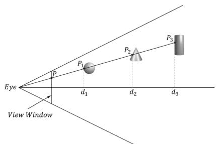
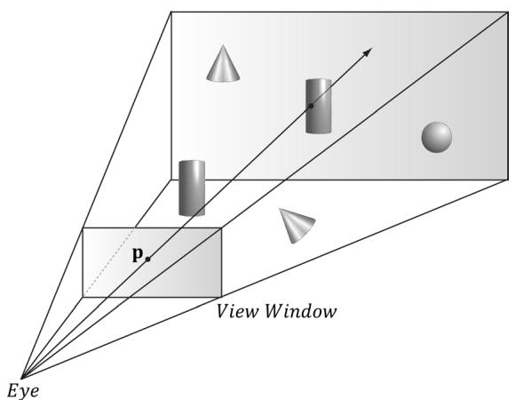
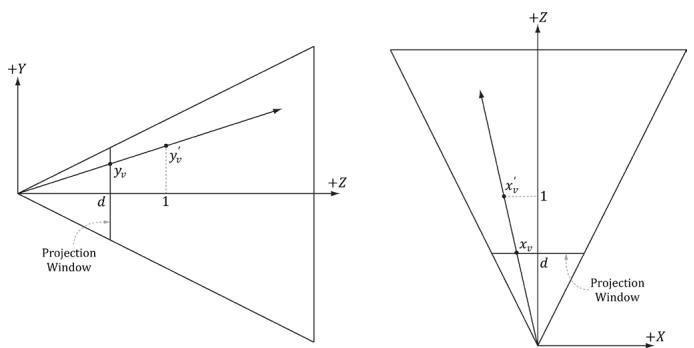
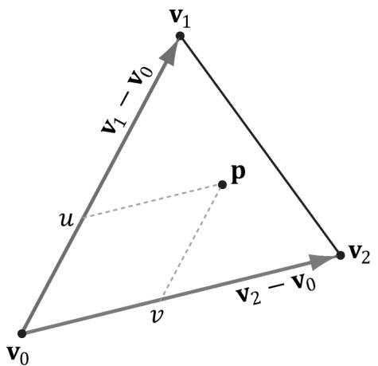
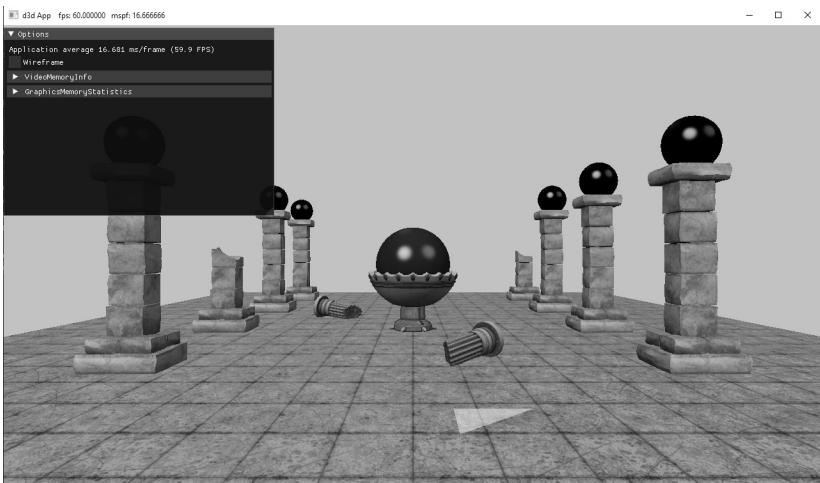
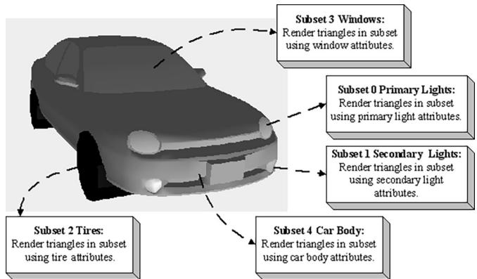

# Chapter

# 17 Picking

In this chapter, we have the problem of determining the 3D object (or primitive) the user picked with the mouse cursor (see Figure 17.1). In other words, given the 2D screen coordinates of the mouse cursor, can we determine the 3D object that was projected onto that point? To solve this problem, in some sense, we must work backwards; that is to say, we typically transform from 3D space to screen space, but here we transform from screen space back to 3D space. Of course, we already have a slight problem: a 2D screen point does not correspond to a unique 3D point (i.e., more than one 3D point could be projected onto the same 2D projection window point—see Figure 17.2). Thus, there is some ambiguity in determining which object is really picked. However, this is not such a big problem, as the closest object to the camera is usually the one we want. 




Figure 17.1. The user picking the dodecahedron.





Figure 17.2. A side view of the frustum. Observe that several points in 3D space can get projected onto a point on the projection window.





Figure 17.3. A ray shooting through p will intersect the object whose projection surrounds p. Note that the projected point p on the projection window corresponds to the clicked screen point s.


Consider Figure 17.3, which shows the viewing frustum. Here p is the point on the projection window that corresponds to the clicked screen point s. Now, we see that if we shoot a picking ray, originating at the eye position, through p, we will intersect the object whose projection surrounds p, namely the cylinder in this example. Therefore, our strategy is as follows: Once we compute the picking ray, we can iterate through each object in the scene and test if the ray intersects it. The object that the ray intersects is the object that was picked by the user. As mentioned, the ray may intersect several scene objects (or none—nothing was picked), if the objects are along the ray’s path but with different depth values, for example. In this case, we can just take the intersected object nearest to the camera as the picked object. 

# Chapter Objectives:

1. To learn how to implement the picking algorithm and to understand how it works. We break picking down into the following four steps: 

(a) Given the clicked screen point s, find its corresponding point on the projection window and call it p. 

(b) Compute the picking ray in view space. That is the ray originating at the origin, in view space, which shoots through p. 

(c) Transform the picking ray and the models to be tested with the ray into the same space. 

(d) Determine the object the picking ray intersects. The nearest (from the camera) intersected object corresponds to the picked screen object. 

# 17.1 SCREEN TO PROJECTION WINDOW TRANSFORM

The first task is to transform the clicked screen point to normalized device coordinates (see $\ S 5 . 4 . 3 . 3 )$ . Recall that the viewport matrix transforms vertices from normalized device coordinates to screen space; it is given below: 

$$
\mathbf {M} = \left[ \begin{array}{c c c c} \frac {W i d t h}{2} & 0 & 0 & 0 \\ 0 & - \frac {H e i g h t}{2} & 0 & 0 \\ 0 & 0 & M a x D e p t h - M i n D e p t h & 0 \\ T o p L e f t X + \frac {W i d t h}{2} & T o p L e f t Y + \frac {H e i g h t}{2} & M i n D e p t h & 1 \end{array} \right]
$$

The variables of the viewport matrix refer to those of the D3D12_VIEWPORT structure: 

```cpp
typedef struct D3D12_VIEWPORT  
{  
    FLOAT TopLeftX;  
    FLOAT TopLeftY;  
    FLOAT Width;  
    FLOAT Height;  
    FLOAT MinDepth;  
    FLOAT MaxDepth;  
} D3D12_VIEWPORT; 
```

Generally, for a game, the viewport is the entire backbuffer and the depth buffer range is 0 to 1. Thus, TopLeft $X = 0$ , TopLeft $Y = 0$ , MinDepth $= 0$ , MaxDepth $=$ 1, Width $\ c = w$ , and $H e i g h t = h .$ , where $w$ and $h$ , are the width and height of the backbuffer, respectively. Assuming this is indeed the case, the viewport matrix simplifies to: 

$$
\mathbf {M} = \left[ \begin{array}{c c c c} w / 2 & 0 & 0 & 0 \\ 0 & - h / 2 & 0 & 0 \\ 0 & 0 & 1 & 0 \\ w / 2 & h / 2 & 0 & 1 \end{array} \right]
$$

Now let ${ \bf p } _ { n d c } = ( x _ { n d c } , y _ { n d c } , z _ { n d c } , 1 )$ be a point in normalized device space (i.e., $- 1 \leq$ $x _ { n d c } \leq 1 , - 1 \leq y _ { n d c } \leq 1$ , and $0 \leq z _ { n d c } \leq 1$ ). Transforming $\mathbf { p } _ { n d c }$ to screen space yields: 

$$
\left[ x _ {n d c}, y _ {n d c}, z _ {n d c}, 1 \right] \left[ \begin{array}{c c c c} w / 2 & 0 & 0 & 0 \\ 0 & - h / 2 & 0 & 0 \\ 0 & 0 & 1 & 0 \\ w / 2 & h / 2 & 0 & 1 \end{array} \right] = \left[ \frac {x _ {n d c} w + w}{2}, \frac {- y _ {n d c} h + h}{2}, z _ {n d c}, 1 \right]
$$

The coordinate The coordinate $z _ { n d c }$ is just used by the depth buffer and we are not concerned with is just used by the depth buffer and we are not concerned with any depth coordinates for picking. The 2D screen point any depth coordinates for picking. The 2D screen point $\mathbf { p } _ { s } = ( x _ { s } , y _ { s } )$ corresponding corresponding to to $\mathbf { p } _ { n d c }$ is just the transformed is just the transformed $x \cdot$ - and y-coordinates: - and y-coordinates: 

$$
x _ {s} = \frac {x _ {n d c} w + w}{2}
$$

$$
y _ {s} = \frac {- y _ {n d c} h + h}{2}
$$

The above equation gives us the screen point The above equation gives us the screen point $\mathbf { p } _ { s }$ in terms of the normalized device in terms of the normalized device point point $\mathbf { p } _ { n d c }$ and the viewport dimensions. However, in our picking situation, we are and the viewport dimensions. However, in our picking situation, we are initially given the screen point initially given the screen point $\mathbf { p } _ { s }$ and the viewport dimensions, and we want to and the viewport dimensions, and we want to find find $\mathbf { p } _ { n d c }$ . Solving the above equations for . Solving the above equations for $\mathbf { p } _ { n d c }$ yields: yields: 

$$
x _ {n d c} = \frac {2 x _ {s}}{w} - 1
$$

$$
y _ {n d c} = - \frac {2 y _ {s}}{h} + 1
$$

We now have the clicked point in NDC space. But to shoot the picking ray, we We now have the clicked point in NDC space. But to shoot the picking ray, we really want the screen point in view space. Recall from really want the screen point in view space. Recall from $\ S 5 . 6 . 3 . 3$ that we mapped that we mapped the projected point from view space to NDC space by dividing the the projected point from view space to NDC space by dividing the $x$ -coordinate -coordinate by the aspect ratio r: by the aspect ratio r: 

$$
- r \leq x ^ {\prime} \leq r
$$

$$
- 1 \leq x ^ {\prime} / r \leq 1
$$

Thus, to get back to view space, we just need to multiply the Thus, to get back to view space, we just need to multiply the $x$ -coordinate in NDC -coordinate in NDC space by the aspect ratio. The clicked point in view space is thus: space by the aspect ratio. The clicked point in view space is thus: 

$$
x _ {v} = r \left(\frac {2 s _ {x}}{w} - 1\right)
$$

$$
y _ {v} = - \frac {2 s _ {y}}{h} + 1
$$




Figure 17.4. By similar triangles, $\begin{array} { r } { \frac { y _ { * } } { d } = \frac { y _ { * } ^ { \prime } } { 1 } } \end{array}$ and $\begin{array} { r } { \frac { x _ { * } } { d } = \frac { x _ { * } ^ { \prime } } { 1 } } \end{array}$ .


The projected y-coordinate in view space is the same in NDC space. This is because we chose the height of the projection window in view space to cover the interval [–1, 1]. 

Now recall from $\ S 5 . 6 . 3 . 1$ that the projection window lies at a distance $d = \cot \left( { \frac { \alpha } { 2 } } \right)$ from the origin, where $\alpha$ is the vertical field of view angle. So we could shoot the picking ray through the point $( x _ { \nu } , y _ { \nu } , d )$ on the projection window. However, this requires that we compute $\scriptstyle d = \cot \left( { \frac { \alpha } { 2 } } \right)$ .  A simpler way is to observe from Figure 17.4 that: 

$$
x _ {v} ^ {\prime} = \frac {x _ {v}}{d} = \frac {x _ {v}}{\cot \left(\frac {\alpha}{2}\right)} = x _ {v} \cdot \tan \left(\frac {\alpha}{2}\right) = \left(\frac {2 s _ {x}}{w} - 1\right) r \tan \left(\frac {\alpha}{2}\right)
$$

$$
y _ {v} ^ {\prime} = \frac {y _ {v}}{d} = \frac {y _ {v}}{\cot \left(\frac {\alpha}{2}\right)} = y _ {v} \cdot \tan \left(\frac {\alpha}{2}\right) = \left(- \frac {2 s _ {y}}{h} + 1\right) \tan \left(\frac {\alpha}{2}\right)
$$

Recalling that rewrite this as: $\mathbf { P } _ { 0 0 } = { \frac { 1 } { r \tan \left( { \frac { \alpha } { 2 } } \right) } }$ and $\mathbf { P } _ { 1 1 } = { \frac { 1 } { \tan \left( { \frac { \alpha } { 2 } } \right) } }$ in the projection matrix, we can 

$$
x _ {v} ^ {\prime} = \left(\frac {2 s _ {x}}{w} - 1\right) / \mathbf {P} _ {0 0}
$$

$$
y _ {v} ^ {\prime} = \left(- \frac {2 s _ {y}}{h} + 1\right) / \mathbf {P} _ {1 1}
$$

Thus, we can shoot our picking ray through the point $( x _ { \nu } ^ { \prime } , y _ { \nu } ^ { \prime } , 1 )$ instead. Note that this yields the same picking ray as the one shot through the point $( x _ { \nu } , y _ { \nu } , d )$ . The code that computes the picking ray in view space is given below: 

```cpp
void PickingApp::Pick(int sx, int sy)  
{  
XMFLOAT4X4 P = mCamera.GetProj4x4f();  
// Compute picking ray in view space. float vx = (+2.0f*sx / mClientWidth - 1.0f) / P(0, 0); float vy = (-2.0f*sy / mClientHeight + 1.0f) / P(1, 1);  
// Ray definition in view space. XMVECTOR rayOrigin = XMVectorSet(0.0f, 0.0f, 0.0f, 1.0f); XMVECTOR rayDir = XMVectorSet(vx, vy, 1.0f, 0.0f); 
```

Note that the ray originates from the origin in view space since the eye sits at the origin in view space. 

# 17.2 WORLD/LOCAL SPACE PICKING RAY

So far we have the picking ray in view space, but this is only useful if our objects are in view space as well. Because the view matrix transforms geometry from world space to view space, the inverse of the view matrix transforms geometry from view space to world space. If $\mathbf { r } _ { \nu } ( t ) = \mathbf { q } + t \mathbf { u }$ is the view space picking ray and V is the view matrix, then the world space picking ray is given by: 

$$
\begin{array}{l} \mathbf {r} _ {w} (t) = \mathbf {q} \mathbf {V} ^ {- 1} + t \mathbf {u} \mathbf {V} ^ {- 1} \\ = \mathbf {q} _ {w} + t \mathbf {u} _ {w} \\ \end{array}
$$

Note that the ray origin q is transformed as a point (i.e., 4th coordinate is 1) and the ray direction u is transformed as a vector (i.e., 4th coordinate is 0). 

A world space picking ray can be useful in some situations where you have some objects defined in world space. However, most of the time, the geometry of an object is defined relative to the object’s own local space. Therefore, to perform the ray/object intersection test, we must transform the ray into the local space of the object. If W is the world matrix of an object, the matrix $\mathbf { W } ^ { - 1 }$ transforms geometry from world space to the local space of the object. Thus the local space picking ray is: 

$$
\begin{array}{l} \mathbf {r} _ {L} (t) = \mathbf {q} _ {w} \mathbf {W} ^ {- 1} + t \mathbf {u} _ {w} \mathbf {W} ^ {- 1} \\ = \mathbf {q} _ {L} + t \mathbf {u} _ {L} \\ \end{array}
$$

Generally, each object in the scene has its own local space. Therefore, the ray must be transformed to the local space of each scene object to do the intersection test. 

One might suggest transforming the meshes into world space and doing the intersection test there. However, this is too expensive. A mesh may contain thousands of vertices, and all those vertices need to be transformed into world space. It is much more efficient to just transform the ray into the local space of each object. 

The following code shows how the picking ray is transformed from view space to the local space of an object: 

```cpp
XMMatrix V = mCamera.GetView();  
XMMatrix invView = XMMatrixInverse(&XMMatrixDeterminant(V), V);  
// Assume nothing is picked to start, so the picked  
// render-item is invisible.  
mPickedRItem->Visible = false;  
float minWorldDist = MathHelper::Infinity;  
// Check if we picked an opaque render item. A real app might keep a  
// separate "picking list" of objects that can be selected.  
for (auto ri : mRItemLayer[(int)RenderLayer::Opaque])  
{  
    auto geo = ri->Geo;  
    // Skip invisible render-items.  
    if (ri->Visible == false)  
        continue;  
    XMMatrix W = XMLoadFloat4x4(&ri->World);  
    XMMatrix invWorld = XMMatrixInverse(&XMMatrixDeterminant(W), W);  
    // Tranform ray from view space to the local space of the mesh.  
    XMMatrix toLocal = XMMatrixMultiply(invView, invWorld);  
    XMVECTOR rayOriginL = XMVector3TransformCoord(roginV, toLocal);  
    XMVECTOR rayDirL = XMVector3TransformNormal(rodirV, toLocal);  
    // Make the ray direction unit length for the intersection tests.  
rayDirL = XMVector3Normalize(rodirL); 
```

The XMVector3TransformCoord and XMVector3TransformNormal functions take 3D vectors as parameters, but note that with the XMVector3TransformCoord function there is an understood $w = 1$ for the fourth component. On the other hand, with the XMVector3TransformNormal function there is an understood $w = 0$ for the fourth component. Thus we can use XMVector3TransformCoord to transform points and we can use XMVector3TransformNormal to transform vectors. 

# 17.3 RAY/MESH INTERSECTION

Once we have the picking ray and a mesh in the same space, we can perform the intersection test to see if the picking ray intersects the mesh. The following code iterates through each triangle in the mesh and does a ray/triangle intersection test. If the ray intersects one of the triangles, then it must have hit the mesh the triangle belongs to. Otherwise, the ray misses the mesh. Typically, we want the nearest triangle intersection, as it is possible for a ray to intersect several triangles in the scene and even in the same mesh. 

```cpp
// If we did not hit the bounding box, then it is impossible that  
// we hit the Mesh, so do not waste effort doing ray/triangle  
// tests.  
float boxDist = 0.0f;  
if (ri->Bounds.Intersects(roOriginL, rayDirL, boxDist))  
{  
// NOTE: For the demo, we know what to cast the vertex/index data to  
// (we force 16-bit indices). If we were mixing formats, some  
// metadata would be needed to figure out what to cast it to.  
ModelVertex* vertices = (ModelVertex*) geo->VertexBufferCPU.data();  
uint16_t* indices = (uint16_t*) geo->IndexBufferCPU.data();  
UINT triCount = ri->IndexCount / 3;  
// Find the nearest ray/triangle intersection.  
for (UINT i = 0; i < triCount; ++i)  
{  
// Indices for this triangle.  
UINT i0 = ri->BaseVertexLocation + indices[ri->StartIndexLocation + i * 3 + 0];  
UINT i1 = ri->BaseVertexLocation + indices[ri->StartIndexLocation + i * 3 + 1];  
UINT i2 = ri->BaseVertexLocation + indices[ri->StartIndexLocation + i * 3 + 2];  
// Vertices for this triangle.  
XMVECTOR v0 = XMLoadFloat3(&vertices[i0].Pos);  
XMVECTOR v1 = XMLoadFloat3(&vertices[i1].Pos);  
XMVECTOR v2 = XMLoadFloat3(&vertices[i2].Pos);  
// We have to iterate over all the triangles of all the  
// objects whose bounds we hit in order to find the  
// nearest intersection.  
float t = FLT_MAX;  
if (TriangleTests::Intersects(roOriginL, rayDirL, v0, v1, v2, t))  
{  
XMVECTOR hitPosL = rayOriginL + t * rayDirL;  
XMVECTOR hitPosW = XMVector3TransformCoord(hitPosL, W); 
```

```c
// Take hit position closest to the camera. Do this in world
// space, as we want the nearest hit across all objects in the
// scene, not just the current mesh.
float t_world = XMVectorGetX(XMVector3Length(hitPosW - mCamera.
Position));
if(t_world < minWorldDist)
{
// This is the new nearest picked triangle.
minWorldDist = t_world;
UINT pickedTriangle = i;
mPickedRItem->Visible = true;
// Propagate properties from selected geometry.
mPickedRItem->BaseVertexLocation = ri->BaseVertexLocation;
mPickedRItem->World = ri->World;
mPickedRItem->TexTransform = ri->TexTransform;
mPickedRItem->Geo = ri->Geo;
mPickedRItem->PrimitiveType = ri->PrimitiveType;
// Offset to the picked triangle in the mesh index buffer.
mPickedRItem->IndexCount = 3;
mPickedRItem->StartIndexLocation = ri->StartIndexLocation + 3 * pickedTriangle;
}
} 
```

Observe that for picking, we use the system memory copy of the mesh geometry stored in the MeshGeometry class. This is because we cannot access a vertex/index buffer for reading that is going to be drawn by the GPU. It is common to store system memory copies of geometry for things like picking and collision detection. Often, a simplified “collision” version of the mesh is stored for these purposes to save memory and computation. 

# 17.3.1 Ray/AABB Intersection

Observe that we first use the DirectX collision library function BoundingBox::Intersects to see if the ray intersects the bounding box of the mesh. This is analogous to the frustum culling optimization in the previous chapter. Performing a ray intersection test for every triangle in the scene adds up in computation time. Even for meshes not near the picking ray, we would still have to iterate over each triangle to conclude the ray misses the mesh; this is wasteful and inefficient. A popular strategy is to approximate the mesh with a simple bounding volume, like a sphere or box. Then, instead of intersecting the ray with the mesh, we first intersect the ray with the bounding volume. If the ray misses the 

bounding volume, then the ray necessarily misses the triangle mesh and so there is no need to do further calculations. If the ray intersects the bounding volume, then we do the more precise ray/mesh test. Assuming that the ray will miss most bounding volumes in the scene, this saves us many ray/triangle intersection tests. The BoundingBox::Intersects function returns true if the ray intersects the box and false otherwise; it is prototyped as follows: 

```cpp
bool XM_CALLCONV  
BoundingBox::Intersects(  
    FXMVECTOR Origin, // ray origin  
    FXMVECTOR Direction, // ray direction (must be unit length)  
    float& Dist); const // ray intersection parameter 
```

Given the ray $\mathbf { r } ( t ) = \mathbf { q } + t \mathbf { u }$ , the last parameter outputs the ray parameter $t _ { 0 }$ that yields the actual intersection point p: 

$$
\mathbf {p} = \mathbf {r} (t _ {0}) = \mathbf {q} + t _ {0} \mathbf {u}
$$

# 17.3.2 Ray/Sphere Intersection

There is also a ray/sphere intersection test given in the DirectX collision library: 

```cpp
bool XM_CALLCONV BoundingSphere::Intersects(FXMVECTOROrigin, FXMVECTORDirection, float&Dist); const 
```

To give a flavor of these tests, we show how to derive the ray/sphere intersection test. The points p on the surface of a sphere with center c and radius $r$ satisfy the equation: 

$$
\left| \left| \mathbf {p} - \mathbf {c} \right| \right| = r
$$

Let $\mathbf { r } ( t ) = \mathbf { q } + t \mathbf { u }$ be a ray. We wish to solve for $t _ { 1 }$ and $t _ { 2 }$ such that $\mathbf { r } ( t _ { 1 } )$ and $\mathbf { r } ( t _ { 2 } )$ satisfy the sphere equation (i.e., the parameters $t _ { 1 }$ and $t _ { 2 }$ along the ray that yields the intersection points). 

$$
r = \left| \left| \mathbf {r} (t) - \mathbf {c} \right| \right|
$$

$$
r ^ {2} = (\mathbf {r} (t) - \mathbf {c}) \cdot (\mathbf {r} (t) - \mathbf {c})
$$

$$
r ^ {2} = (\mathbf {q} + t \mathbf {u} - \mathbf {c}) \cdot (\mathbf {q} + t \mathbf {u} - \mathbf {c})
$$

$$
r ^ {2} = (\mathbf {q} - \mathbf {c} + t \mathbf {u}) \cdot (\mathbf {q} - \mathbf {c} + t \mathbf {u})
$$

For notational convenience, let $\mathbf { m } = \mathbf { q } - \mathbf { c }$ 

$$
(\mathbf {m} + t \mathbf {u}) \cdot (\mathbf {m} + t \mathbf {u}) = r ^ {2}
$$

$$
\mathbf {m} \cdot \mathbf {m} + 2 t \mathbf {m} \cdot \mathbf {u} + t ^ {2} \mathbf {u} \cdot \mathbf {u} = r ^ {2}
$$

$$
t ^ {2} \mathbf {u} \cdot \mathbf {u} + 2 t \mathbf {m} \cdot \mathbf {u} + \mathbf {m} \cdot \mathbf {m} - r ^ {2} = 0
$$

This is just a quadratic equation with: 

$$
a = \mathbf {u} \cdot \mathbf {u}
$$

$$
b = 2 (\mathbf {m} \cdot \mathbf {u})
$$

$$
c = \mathbf {m} \cdot \mathbf {m} - r ^ {2}
$$

If the ray direction is unit length, then $a = \mathbf { u } \cdot \mathbf { u } = 1$ . If the solution has imaginary components, the ray misses the sphere. If the two real solutions are the same, the ray intersects a point tangent to the sphere. If the two real solutions are distinct, the ray pierces two points of the sphere. A negative solution indicates an intersection point “behind” the ray. The smallest positive solution gives the nearest intersection parameter. 

# 17.3.3 Ray/Triangle Intersection

For performing a ray/triangle intersection test, we use the DirectX collision library function TriangleTests::Intersects: 

```cpp
bool XM_CALLCONV  
TriangleTests::Intersects(  
    FXMVECTOR Origin, // ray origin  
    FXMVECTOR Direction, // ray direction (unit length)  
    FXMVECTOR V0, // triangle vertex v0  
    GXMVECTOR V1, // triangle vertex v1  
    HXMVECTOR V2, // triangle vertex v2  
    float& Dist); // ray intersection parameter 
```

Let $\mathbf { r } ( t ) = \mathbf { q } + t \mathbf { u }$ be a ray and ${ \bf T } ( u , \nu ) = { \bf v } _ { 0 } + u ( { \bf v } _ { 1 } - { \bf v } _ { 0 } ) + \nu ( { \bf v } _ { 2 } - { \bf v } _ { 0 } )$ for $u \geq 0$ , $\nu \geq 0$ , $u + \nu \leq 1$ be a triangle (see Figure 17.5). We wish to simultaneously solve for $t , u , \nu$ such that $\mathbf { r } ( t ) = \mathbf { T } ( u , \nu )$ (i.e., the point the ray and triangle intersect): 

$$
\mathbf {r} (t) = \mathbf {T} (u, v)
$$

$$
\mathbf {q} + t \mathbf {u} = \mathbf {v} _ {0} + u \left(\mathbf {v} _ {1} - \mathbf {v} _ {0}\right) + v \left(\mathbf {v} _ {2} - \mathbf {v} _ {0}\right)
$$

$$
- t \mathbf {u} + u \left(\mathbf {v} _ {1} - \mathbf {v} _ {0}\right) + v \left(\mathbf {v} _ {2} - \mathbf {v} _ {0}\right) = \mathbf {q} - \mathbf {v} _ {0}
$$




Figure 17.5. The point $\boldsymbol { \mathsf { P } }$ in the plane of the triangle has coordinates $( u , v )$ relative to the skewed coordinate system with origin $\pmb { v } _ { 0 }$ and axes ${ \pmb v } _ { 1 } - { \pmb v } _ { 0 }$ and ${ \pmb v } _ { 2 } - { \pmb v } _ { 0 }$ .


For notational convenience, let $\mathbf { e } _ { 1 } = \mathbf { v } _ { 1 } - \mathbf { v } _ { 0 } , \mathbf { e } _ { 2 } = \mathbf { v } _ { 2 } - \mathbf { v } _ { 0 } ,$ and $\mathbf { m } = \mathbf { q } - \mathbf { v } _ { 0 }$ : 

$$
- t \mathbf {u} + u \mathbf {e} _ {1} + v \mathbf {e} _ {2} = \mathbf {m}
$$

$$
\left[ \begin{array}{c c c} \uparrow & \uparrow & \uparrow \\ - \mathbf {u} & \mathbf {e} _ {1} & \mathbf {e} _ {2} \\ \downarrow & \downarrow & \downarrow \end{array} \right] \left[ \begin{array}{l} t \\ u \\ v \end{array} \right] = \left[ \begin{array}{l} \uparrow \\ \mathbf {m} \\ \downarrow \end{array} \right]
$$

Consider the matrix equation $\mathbf { A x } = \mathbf { b } $ , where A is invertible. Then Cramer’s Rule tells us that xi = det ${ \mathbf A _ { i } } /$ det A, where $\mathbf { A } _ { i }$ is found by swapping the ith column vector in A with b. Therefore, 

$$
t = \det  \left[ \begin{array}{c c c} \uparrow & \uparrow & \uparrow \\ \mathbf {m} & \mathbf {e} _ {1} & \mathbf {e} _ {2} \\ \downarrow & \downarrow & \downarrow \end{array} \right] / \det  \left[ \begin{array}{c c c} \uparrow & \uparrow & \uparrow \\ - \mathbf {u} & \mathbf {e} _ {1} & \mathbf {e} _ {2} \\ \downarrow & \downarrow & \downarrow \end{array} \right]
$$

$$
u = \det  \left[ \begin{array}{c c c} \uparrow & \uparrow & \uparrow \\ - \mathbf {u} & \mathbf {m} & \mathbf {e} _ {2} \\ \downarrow & \downarrow & \downarrow \end{array} \right] / \det  \left[ \begin{array}{c c c} \uparrow & \uparrow & \uparrow \\ - \mathbf {u} & \mathbf {e} _ {1} & \mathbf {e} _ {2} \\ \downarrow & \downarrow & \downarrow \end{array} \right]
$$

$$
\nu = \det  \left[ \begin{array}{c c c} \uparrow & \uparrow & \uparrow \\ - \mathbf {u} & \mathbf {e} _ {1} & \mathbf {m} \\ \downarrow & \downarrow & \downarrow \end{array} \right] / \det  \left[ \begin{array}{c c c} \uparrow & \uparrow & \uparrow \\ - \mathbf {u} & \mathbf {e} _ {1} & \mathbf {e} _ {2} \\ \downarrow & \downarrow & \downarrow \end{array} \right]
$$

↑ ↑ ↑  Using the fact that det ( ) a b c a = ⋅ b c × we can reformulate this as: ↓ ↓ ↓  

$$
t = - \mathbf {m} \cdot \left(\mathbf {e} _ {1} \times \mathbf {e} _ {2}\right) / \mathbf {u} \cdot \left(\mathbf {e} _ {1} \times \mathbf {e} _ {2}\right)
$$

$$
u = \mathbf {u} \cdot (\mathbf {m} \times \mathbf {e} _ {2}) / \mathbf {u} \cdot (\mathbf {e} _ {1} \times \mathbf {e} _ {2})
$$

$$
\nu = \mathbf {u} \cdot \left(\mathbf {e} _ {1} \times \mathbf {m}\right) / \mathbf {u} \cdot \left(\mathbf {e} _ {1} \times \mathbf {e} _ {2}\right)
$$

To optimize the computations a bit, we can use the fact that every time we swap columns in a matrix, the sign of the determinant changes: 

$$
t = \mathbf {e} _ {2} \cdot (\mathbf {m} \times \mathbf {e} _ {1}) / \mathbf {e} _ {1} \cdot (\mathbf {u} \times \mathbf {e} _ {2})
$$

$$
u = \mathbf {m} \cdot \left(\mathbf {u} \times \mathbf {e} _ {2}\right) / \mathbf {e} _ {1} \cdot \left(\mathbf {u} \times \mathbf {e} _ {2}\right)
$$

$$
\nu = \mathbf {u} \cdot \left(\mathbf {m} \times \mathbf {e} _ {1}\right) / \mathbf {e} _ {1} \cdot \left(\mathbf {u} \times \mathbf {e} _ {2}\right)
$$

And note the common cross products that can be reused in the calculations: $\mathbf { m } \times \mathbf { e } _ { 1 }$ and $\mathbf { u } \times \mathbf { e } _ { 2 }$ . 

# 17.4 DEMO APPLICATION

The demo for this chapter renders a scene and allows the user to pick a triangle by pressing the right mouse button, and the selected triangle is rendered using a “highlight” material (see Figure 17.6). To render the triangle with a highlight, we need a render-item for it. Unlike the previous render-items in this book where we defined them at initialization time, this render-item can only be partially filled out at initialization time. This is because we do not yet know which triangle will be picked, and so we do not know the starting index location and world matrix. In addition, a triangle does not need to always be picked. Therefore, we have added a Visible property to the render-item structure. An invisible render-item will not be drawn. The following code, which is part of the PickingApp::Pick method, shows how we fill out the remaining render-item properties based on the selected triangle: 

```cpp
// Cache a pointer to the render-item of the picked
// triangle in the PickingApp class.
RenderItem* mPickedRItem;
// We have to iterate over all the triangles of all the objects
// whose bounds we hit in order to find the nearest intersection.
float t = FLT_MAX;
if (TriangleTests::Intersects (rayOriginL, rayDirL, v0, v1, v2, t))
{
XMVECTOR hitPosL = rayOriginL + t * rayDirL; 
```

```cpp
XMVECTOR hitPosW = XMVector3TransformCoord(hitPosL, W); // Take hit position closest to the camera. Do this in world space, as // we want the nearest hit across all objects in the scene, not just // the current mesh. float t_world = XMVectorGetX(XMVector3Length(hitPosW - mCamera. GetPosition()); if(t_world < minWorldDist) { // This is the new nearest picked triangle. minWorldDist = t_world; UINT pickedTriangle = i; mPickedRItem->Visible = true; // Propagate properties from selected geometry. mPickedRItem->BaseVertexLocation = ri->BaseVertexLocation; mPickedRItem->World = ri->World; mPickedRItem->TexTransform = ri->TexTransform; mPickedRItem->Geo = ri->Geo; mPickedRItem->PrimitiveType = ri->PrimitiveType; // Offset to the picked triangle in the mesh index buffer. mPickedRItem->IndexCount = 3; mPickedRItem->StartIndexLocation = ri->StartIndexLocation + 3 * pickedTriangle; } } 
```

This render-item is drawn after we draw our opaque render-items. It uses a special highlight PSO, which uses transparency blending and sets the depth test comparison function to D3D12_COMPARISON_FUNC_LESS_EQUAL. This is needed because the picked triangle will be drawn twice, the second time with the highlighted material. The second time the triangle is drawn the depth test would fail if the comparison function was just D3D12_COMPARISON_FUNC_LESS. 

```cpp
DrawRenderItems(mCommandList.Get(), mRItemLayer[(int) RenderLayer::Opaque]);  
mCommandList->SetPipelineState(mPSOs["highlight"].Get());  
DrawRenderItems(mCommandList.Get(), mRItemLayer[(int) RenderLayer::Highlight]); 
```

# 17.4.1 New Scene Models

Figure 17.6 shows some new 3D models in our typical scene. From now on, this scene will be our default test scene as we add new effects. This section briefly describes the model format. 




Figure 17.6. The picked triangle is highlighted yellow.


The new models have been designed to be relatively simple: a list of vertices, indices, and one set of textures per model. The models are in the Book\bin\ Models directory and have a .m3d extension. This is a simple format designed for the demos of this book. If you open up one of the . $\mathrm { . m } 3 \mathrm { d }$ files in a text editor, you will see that there is a brief header, a material list (that we ignore—we assign the material in the code), a subset table that specifies the vertex and face range corresponding to a given subset (these models only have 1—a model would have more if it was more complicated and different subsets needed to be drawn with different materials), a list of vertices, and a list of indices. 

```cpp
**********m3d-File-Header**********  
#Materials 1  
#Vertices 5814  
#Triangles 6728  
#Bones 0  
#AnimationClips 0  
**********Materials**********  
MaterialName Default  
Diffuse 1 1 1  
FresnelR0 0.1 0.1 0.1  
Roughness 0.3  
AlphaClip 0  
AlbedoMap DefaultAlbedoMap  
NormalMap DefaultNormalMap  
**********SubsetTable**********  
SubsetID: 0 VertexStart: 0 VertexCount: 5814 FaceStart: 0 FaceCount: 6728 
```




Figure 17.7. A car broken up by its subsets. Here, only the materials per subset differ, but different textures can also be added. In addition, the render states may differ; for example, the glass windows may be rendered with alpha blending for transparency.


```cpp
**********Vertices**********  
Position: -0.0667566 0.246518 0.186381  
Tangent: 0.56964 -0.0596746 0.819725 1  
Normal: -0.804516 0.163528 0.570975  
Tex-Coords: 0.40199 0.82407  
Position: -0.0700356 0.237517 0.181911  
Tangent: 0.449951 -0.244817 0.858841 1  
Normal: -0.888559 -0.219085 0.403069  
Tex-Coords: 0.398586 0.831752  
...  
**********Triangles**********  
0 1 2  
2 1 3  
4 5 6 
```

Let us elaborate on subsets: A subset is a group of triangles in a mesh that can all be rendered using the same material. Here, the term material is the same effect, textures, and render states. Figure 17.7 illustrates how a mesh representing a car may be divided into several subsets. 

There is a subset corresponding to each material and the ith subset corresponds to the ith material. The ith subset defines a contiguous block of geometry that should be rendered with the ith material. 

```cpp
\*\*\*\*\*\*\*\*\*\*\*\*\*\*\*\*\*\*\*\*\*\*\*\*\*\*\*\*\*\*\*\*\*\*\*\*\*\*\*\*\*\*\*\*\*\*\*\*\*\*\*\*\*\*\*\*\*\*\*\*\*\*\*\*\*\*\*\*\*\*\*\*\*\*\*\*\*\*\*\*\*\*\*\*\*\*\*\*\*\*\*\*\*\*\*\*\*\*\*\*\* SubsetID:0 VertexStart:0 VertexCount:1600 FaceStart:0 FaceCount: 800   
SubsetID:1 VertexStart:1600 VertexCount:658 FaceStart:800 FaceCount:874 
```

In the above example, the first 800 triangles of the mesh (which reference vertices 0-1599) should be rendered with material 0, and the next 874 triangles of the mesh (which reference vertices 1600-2257) should be rendered with material 1. 

```cpp
struct Subset {
    Subset() : 
        Id(-1), 
        VertexStart(0), VertexCount(0), FaceStart(0), FaceCount(0) 
    {
        }
    UINT Id; 
    UINT VertexStart; 
    UINT VertexCount; 
    UINT FaceStart; 
    UINT FaceCount; 
```

We have a utility in Common\LoadM3d.h\.cpp that will extract the data from the . $\mathrm { . m } 3 \mathrm { d }$ file. This is simple text parsing, so we will not go into details here, but it is similar to how we have been loading the skull geometry data from a text file. 

```cpp
bool M3DLoader::LoadM3d(
    const std::string& filename,
    std::vector<vertex>& vertices,
    std::vector<ushort>& indices,
    std::vector<Subset>& subsets,
    std::vector<M3dMaterial>& mats); 
```

From this data, we can create a MeshGeometry pointer to the model data using the following utility function: 

```cpp
std::unique_ptr<MeshGeometry> d3dUtil::LoadSimpleModelGeometry(
ID3D12Device* device,
		 DirectX::ResourceUploadBatch& uploadBatch,
	 const std::string& filename,
	 const std::string& geoName) 
```

This operates in the same way as the following: 

```cpp
std::unique_ptr<MeshGeometry> d3dUtil::BuildShapeGeometry(ID3D12Device* device, DirectX::ResourceUploadBatch& uploadBatch, bool useIndex32) 
```

and 

```cpp
std::unique_ptr<MeshGeometry> d3dUtil::BuildSkullGeometry(
ID3D12Device* device, DirectX::ResourceUploadBatch& uploadBatch) 
```

which we have already been using. It essentially creates and populates the vertex and index buffers, and fills out the MeshGeometry properties for rendering. 

Because we are loading more geometric data in our demos now, we have added a helper function to the application class that is responsible for creating all the MeshGeometry instances: 

```cpp
void PickingApp::LoadGeometry()   
{ std::unique_ptr<MeshGeometry> shapeGeo = d3dUtil::BuildShapeGeometry( md3dDevice.Get(), *mUploadBatch.get()); if(shapeGeo != nullptr) { mGeometries[shapeGeo->Name] = std::move(shapeGeo); } std::unique_ptr<MeshGeometry> skullGeo = d3dUtil::BuildSkullGeometry( md3dDevice.Get(), *mUploadBatch.get()); if(skullGeo != nullptr) { mGeometries[skullGeo->Name] = std::move(skullGeo); } std::unique_ptr<MeshGeometry> columnSquare = d3dUtil::LoadSimpleMod elGeometry( md3dDevice.Get(), *mUploadBatch.get(), "Models/columnSquare.m3d", "columnSquare"); if(columnSquare != nullptr) { mGeometries[coln] Square->Name] = std::move(columnSquare); } std::unique_ptr<MeshGeometry> columnSquareBroken = d3dUtil::LoadSim pleModelGeometry( md3dDevice.Get(), *mUploadBatch.get(), "Models/columnSquareBroken.m3d", "columnSquareBroken"); if(columnSquareBroken != nullptr) { mGeometries[coln] SquareBroken->Name] = std::move(columnSquareBroken); } ... 
```

Creating render items is done just like before: 

```javascript
bool isLeftColumnBroken = (i == 2);
bool isRightColumnBroken = (i == 0 || i == 4); 
```

std::string columnNameLeft $=$ isLeftColumnBroken ? "columnSquareBroken" : "columnSquare";   
std::string columnNameRight $=$ isRightColumnBroken ? "columnSquareBroken" : "columnSquare";   
XMStoreFloat4x4(&texTransform, XMMatrixScaling(1.0f, 1.0f, 1.0f));   
XMStoreFloat4x4(&worldTransform, XMMatrixTranslation(-5.0f, 0.0f, -10.0f + i * 5.0f));   
AddRenderItem(RenderLayer::Opaque, worldTransform, texTransform, matLib["columnSquare"], mGeometries[columnNameLeft].get(), mGeometries[columnNameLeft]->DrawArgs["subset0"]);   
XMStoreFloat4x4(&texTransform, XMMatrixScaling(1.0f, 1.0f, 1.0f));   
XMStoreFloat4x4(&worldTransform, XMMatrixTranslation(+5.0f, 0.0f, -10.0f + i * 5.0f));   
AddRenderItem(RenderLayer::Opaque, worldTransform, texTransform, matLib["columnSquare"], mGeometries[columnNameRight].get(), mGeometries[columnNameRight]->DrawArgs["subset0"]); 

# 17.5 SUMMARY

1. Picking is the technique used to determine the 3D object that corresponds to the 2D projected object displayed on the screen that the user clicked on with the mouse. 

2. The picking ray is found by shooting a ray, originating at the origin of the view space, through the point on the projection window that corresponds to the clicked screen point. 

3. We can transform a ray $\mathbf { r } ( t ) = \mathbf { q } + t \mathbf { u }$ by transforming its origin q and direction u by a transformation matrix. Note that the origin is transformed as a point $( w = 1 )$ ) and the direction is treated as a vector $\left( w = 0 \right)$ ). 

4. To test if a ray has intersected an object, we perform a ray/triangle intersection test for every triangle in the object. If the ray intersects one of the triangles, then it must have hit the mesh the triangle belongs to. Otherwise, the ray misses the mesh. Typically, we want the nearest triangle intersection, as it is possible for a ray to intersect several mesh triangles if the triangles overlap with respect to the ray. 

5. A performance optimization for ray/mesh intersection tests is to first perform an intersection test between the ray and a bounding volume that approximates the mesh. If the ray misses the bounding volume, then the ray necessarily misses the triangle mesh and so there is no need to do further calculations. If the ray intersects the bounding volume, then we do the more precise ray/mesh 

test. Assuming that the ray will miss most bounding volumes in the scene, this saves us many ray/triangle intersection tests. 

# 17.6 EXERCISES

1. Modify the “Picking” demo to use a bounding sphere for the mesh instead of an AABB. 

2. Research the algorithm for doing a ray/AABB intersection test. 

3. If you had thousands of objects in a scene, you would still have to do thousands of ray/bounding volume tests for picking. Research octrees, and explain how they can be used to reduce ray/bounding volume intersection tests. Incidentally, the same general strategy works for reducing frustum/ bounding volume intersection tests for frustum culling. 