# Chapter

# 18 Cube Mapp ing

In this chapter, we study cube maps, which are basically arrays of six textures interpreted in a special way. With cube mapping, we can easily texture a sky or model reflections. 

# Chapter Objectives:

1. To learn what cube maps are and how to sample them in HLSL code. 

2. To discover how to create cube maps with the DirectX texturing tools. 

3. To find out how we can use cube maps to model reflections. 

4. To understand how we can texture a sphere with cube maps to simulate a sky and distant mountains. 

# 18.1 CUBE MAPPING

The idea of cube mapping is to store six textures and to visualize them as the faces of a cube—hence the name cube map—centered and axis aligned about some coordinate system. Since the cube texture is axis aligned, each face corresponds with a direction along the three major axes; therefore, it is natural to a reference a particular face on a cube map based on the axis direction $( \pm X , \pm Y , \pm Z )$ that intersects the face. 

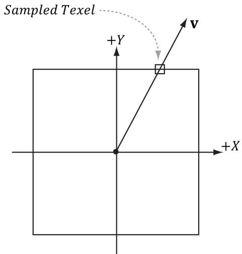


Figure 18.1. We illustrate in 2D for simplicity; in 3D the square becomes a cube. The square denotes the cube map centered and axis-aligned with some coordinate system. We shoot a vector v from the origin. The texel v intersects is the sampled texel. In this illustration, $\pmb { v }$ intersects the cube face corresponding to the $+ Y$ axis.


In Direct3D, a cube map is represented by a texture array with six elements such that 

1. index 0 refers to the $+ \mathrm { X }$ face 

2. index 1 refers to the $- \mathrm { X }$ face 

3. index 2 refers to the $+ \mathrm { Y }$ face 

4. index 3 refers to the $- \mathrm { Y }$ face 

5. index 4 refers to the $+ Z$ face 

6. index 5 refers to the $^ { - 2 }$ face 

In contrast to 2D texturing, we can no longer identify a texel with 2D texture coordinates. To identify a texel in a cube map, we use 3D texture coordinates, which define a 3D lookup vector v originating at the origin. The texel of the cube map that v intersects (see Figure 18.1) is the texel used for sampling. The concepts of texture filtering discussed in Chapter 9 applies in the case v intersects a point between texel samples. 


The magnitude of the lookup vector is unimportant, only the direction matters. Two vectors with the same direction but different magnitudes will sample the same point in the cube map. 

In the HLSL, a cube texture is represented by the TextureCube type. The following code fragment illustrates how we sample a cube map: 

```javascript
SamplerState GetLinearWrapSampler() { 
```

return SamplerDescriptorHeap[SAM_LINEAR.WRAP];   
} TextureCube gCubeMap $=$ ResourceDescriptorHeap[gSkyBoxIndex]; float3 $\mathbf{r} =$ float3(x,y,z); // some lookup vector float4 reflectionColor $=$ gCubeMap.Sample(GetLinearWrapSampler(),r); 


The lookup vector should be in the same space the cube map is relative to. For example, if the cube map is relative to the world space (i.e., the cube faces are axis aligned with the world space axes), then the lookup vector should have world space coordinates. 

# 18.2 ENVIRONMENT MAPS

The primary application of cube maps is environment mapping. The idea is to position a camera at the center of some object O in the scene with a $9 0 ^ { \circ }$ field of view angle (both vertically and horizontally). Then have the camera look down the positive $x$ -axis, negative $x$ -axis, positive y-axis, negative y-axis, positive $z$ -axis, and negative $z$ -axis, and to take a picture of the scene (excluding the object O) from each of these six viewpoints. Because the field of view angle is $9 0 ^ { \circ }$ , these six images will have captured the entire surrounding environment (see Figure 18.2) from the perspective of the object O. We then store these six images of the surrounding environment in a cube map, which leads to the name environment map. In other words, an environment map is a cube map where the cube faces store the surrounding images of an environment. 

The above description suggests that we need to create an environment map for each object that is to use environment mapping. While this would be more accurate, it also requires more texture memory. A compromise would be to use 

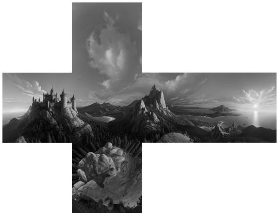


Figure 18.2. An example of an environment map after “unfolding” the cube map. Imagine refolding these six faces into a 3D box, and then imagine being at the center of the box. From every direction you look, you see the surrounding environment.


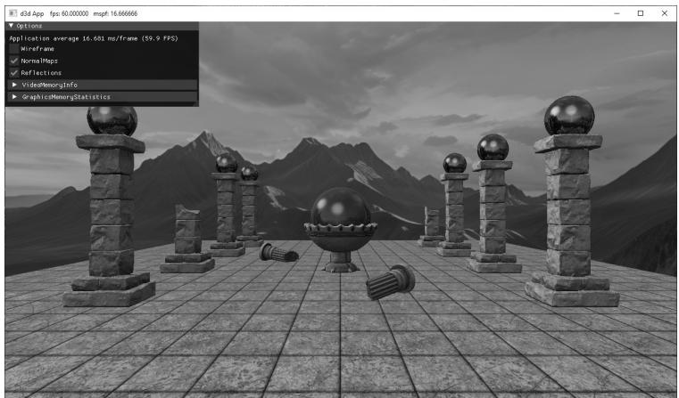


Figure 18.3. Screenshot of the “CubeAndNormalMaps” demo


a few environment map “probes” that capture the environment at key points in the scene. Then objects will sample the environment map closest to them. This simplification usually works well in practice because with curved objects inaccurate reflections are hard to notice. Another simplification often taken with environment mapping is to omit certain objects from the scene. For example, the environment map in Figure 18.2 only captures the distant “background” information of the sky and mountains that are very far away. Local scene objects are omitted. Although the background environment map is, in some sense, incomplete, it works well in practice to create specular reflections. In order to capture local objects, we would have to use Direct3D to render the six images of our environment map; this is discussed in $\$ 18.5$ . In the demo for this chapter (Figure 18.3), all the objects in the scene share the same environment map shown in Figure 18.2. 


We use the same demo for this chapter and the next on normal mapping. The effect of normal maps can be toggled on and off from the GUI options. 

If the axis directions the camera looked down to build the environment map images were the world space axes, then the environment map is said to be generated relative to the world space. You could, of course, capture the environment from a different orientation (say the local space of an object). However, the lookup vector coordinates must be in the space the cube map is relative to. 

Because cube maps just store texture data, their contents can be pre-generated by an artist (just like the 2D textures we’ve been using). Consequently, we do not need to use real-time rendering to compute the images of a cube map. That is, we can create a scene in a 3D world editor, and then pre-render the six cube map face images in the editor. For outdoor environment maps with distant terrains and sky, the program Terragen (http://www.planetside.co.uk/) is commonly used, and it can create photorealistic outdoor scenes. Another option for rapid prototyping 

is to use AI software to generate cube maps such as https://skybox.blockadelabs. com/. The environment map shown in Figure 18.2 was made using https://skybox. blockadelabs.com/. 

Once you have created the six cube map images using some program, we need to create a cube map texture, which stores all six. The DDS texture image format we have been using readily supports cube maps, and we can use the texassemble tool to build a cube map from six images. Below is an example of how to create a cube map using texassemble (taken from the texassemble documentation): 

texassemble -cube -w 256 -h 256 -o cubemap.dds lobbyxposjpg lobbyxneg. jpg lobbyypos.jpg lobbyyneg.jpg lobbyzpos.jpg lobbyzneg.jpg 


NVIDIA’s texture exporter tool can also be used for generating cube maps from individual images (https://developer.nvidia.com/nvidia-texture-tools-exporter). 

# 18.2.1 Loading and Using Cube Maps in Direct3D

As mentioned, a cube map is represented in Direct3D by a texture array with six elements. Our DDS texture loading code (DirectX::CreateDDSTextureFromFileEx) already supports loading cube maps, and we can load the texture like any other. The loading code will detect that the DDS file contains a cube map, and will create a texture array with six elements and load the face data into each element. 

```cpp
std::vector<std::string> texNames = { "skyCubeMap" }; std::vector<std::wstring> texFilenames = { L"Textures/grasscube1024.dds" }; for(int i = 0; i < (int) texNames.size(); ++i) { auto texMap = std::make_unique<Texture>(); texMap->Name = texNames[i]; texMap->Filename = texFilenames[i]; ThrowIfFailed(DirectX::CreateDDSTextureFromFileEx device, uploadBatch, texMap->Filename.c_str(), 0, D3D12Resource_FLAG_NONE, DDSloader_DEFAULT, &texMap->Resource, nullptr, &texMap->IsCubeMap)); mTextures[TEXmap->Name] = std::moveTEXmap); } 
```

Note that CreateDDSTextureFromFileEx will output whether the DDS file stores a cube map via the last parameter. 

When we create an SRV to a cube map texture resource, we specify the dimension D3D12_SRV_DIMENSION_TEXTURECUBE and use the TextureCube property of the SRV description: 

```cpp
inline void CreateSrvCube(ID3D12Device* device, ID3D12Resource* resource, DXGI_FORMAT format, UINT mipLevels, CD3DX12_CPU DescriptorHandle hDescriptor) { D3D12_SHADER_RESOURCE_DEVCView_DESC srvDesc = {}; srvDesc.Shader4ComponentMapping = D3D12_DEFAULT_SHADER_4 ComponentMapping; srvDesc.ViewDimension = D3D12_SRV_DIMENSION-textTURECUBE; srvDesc.TextureCube.MostDetailedMip = 0; srvDesc.TextureCube.ResourceMinLODClamp = 0.0f; srvDesc.Format = format; srvDesc.TextureCube.MipLevels = mipLevels; device->CreateShaderResourceView(resource, &srvDesc, hDescriptor); } 
```

# 18.3 TEXTURING A SKY

We can use an environment map to texture a sky. We create a large sphere that surrounds the entire scene. To create the illusion of distant mountains far in the horizon and a sky, we texture the sphere using an environment map by the method shown in Figure 18.4. In this way, the environment map is projected onto the sphere’s surface. 

We assume that the sky sphere is infinitely far away (i.e., it is centered about the world space but has infinite radius), and so no matter how the camera moves in the world, we never appear to get closer or farther from the surface of the sky sphere. To implement this infinitely faraway sky, we simply center the sky sphere about the camera in world space so that it is always centered about the camera. Consequently, as the camera moves, we are getting no closer to the surface of the sphere. If we did not do this, and we let the camera move closer to the sky surface, the whole illusion would break down, as the trick we use to simulate the sky would be obvious. 

The shader file for the sky is given below: 

```cpp
include"Shaders/Common.hlsl"   
struct VertexIn { float3PosL ：POSITION; float3 NormalL：NORMAL; float2TexC ：TEXCOORD; }； 
```

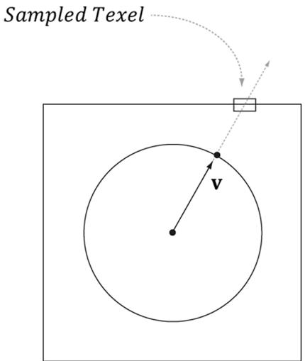


Figure 18.4. We illustrate in 2D for simplicity; in 3D the square becomes a cube and the circle becomes a sphere. We assume that the sky and environment map are centered about the same origin. Then to texture a point on the surface of the sphere, we use the vector from the origin to the surface point as the lookup vector into the cube map. This projects the cube map onto the sphere.


```cpp
struct VertexOut {
    float4 PosH : SV POSITION;
    float3 PosL : POSITION;
};
VertexOut VS(VertexIn vin)
{
    VertexOut vout;
    // Use local vertex position as cubemap lookup vector.
    voutPosL = vinPosL;
    // Transform to world space.
    float4 posW = mul(float4(vinPosL, 1.0f), gWorld);
    // Always center sky about camera.
    posW.xyz += gEyePosW;
    // Set z = w so that z/w = 1 (i.e., skydome always on far plane).
    voutPosH = mul(posW, gViewProj).xyww;
    return vout;
}
float4 PS(VertexOut pin) : SV_Target
{
    TextureCube gCubeMap = ResourceDescriptorHeap[gSkyBoxIndex];
    return gCubeMap_SAMPLE(GetLinearWrapSampler(), pinPosL);
} 
```

The sky shader programs are significantly different than the shader programs for drawing our objects (DefaultGeo/DefaultPS.hlsl). However, it shares the same root signature so that we do not have to change root signatures in the middle of drawing. 

# Note:

In the past, applications would draw the sky first and use it as a replacement to clearing the render target and depth/stencil buffer. However, the “ATI Radeon HD 2000 Programming Guide” (http://developer.amd.com/media/ gpu_assets/ATI_Radeon_HD_2000_programming_guide.pdf) now advises against this for the following reasons. First, the depth/stencil buffer needs to be explicitly cleared for internal hardware depth optimizations to perform well. The situation is similar with render targets. Second, typically most of the sky is occluded by other geometry such as buildings and terrain. Therefore, if we draw the sky first, then we are wasting resources by drawing pixels that will only get overridden later by geometry closer to the camera. Therefore, it is now recommended to always clear, and to draw the sky last. 

Drawing the sky requires different shader programs, and hence a new PSO. Therefore, we draw the sky as a separate layer in our drawing code: 

```cpp
// Draw opaque render-items.  
mCommandList->SetPipelineState(mPSOs["opaque"].Get());  
DrawRenderItems(mCommandList.Get(), mRItemLayer[(int) RenderLayer::Opaque]);  
// Draw the sky render-item.  
mCommandList->SetPipelineState(mPSOs["sky"].Get());  
DrawRenderItems(mCommandList.Get(), mRItemLayer[(int) RenderLayer::Sky]); 
```

In addition, rendering the sky requires some different render states. In particular, because the camera lies inside the sphere, we need to disable back face culling (or making counterclockwise triangles front facing would also work), and we need to change the depth comparison function to LESS_EQUAL so that the sky will pass the depth test: 

D3D12_Drawings_PIPELINE_STATE_DESC skyPsoDesc = opaquePsoDesc; // The camera is inside the sky sphere, so just turn off culling. skyPsoDesc.RasterizerState.CullMode = D3D12_CULL_MODE_NONE; // Make sure the depth function is LESS_EQUAL and not just LESS. // Otherwise, the normalized depth values at $z = 1$ (NDC) will // fail the depth test if the depth buffer was cleared to 1. skyPsoDesc.DepthStencilState.DepthFunc = D3D12_COMPARISONFUNC_LESS_EQUAL; skyPsoDesc.pRootSignature = mRootSignature.Get(); skyPsoDesc.VS = d3dUtil::ByteCodeFromBlob(mShaders["skyVS"]); 

skyPsoDesc.PS $=$ d3dUtil::ByteCodeFromBlob(mShaders["skyPS"]); ThrowIfFailed(md3dDevice->CreateGraphicsPipelineState( &skyPsoDesc, IID_PPV_ARGS(&mPSOs["sky"]))); 

# 18.4 MODELING REFLECTIONS

In Chapter 8 we learned that specular highlights come from light sources where the emitted light strikes a surface and can reflect into the eye based on the Fresnel effect and surface roughness. However, due to light scattering and bouncing, light really strikes a surface from all directions above the surface, not just along the rays from direct light sources. We have modeled indirect diffuse light with our ambient term in our lighting equation. In this section, we show how to use environment maps to model specular reflections coming from the surrounding environment. By specular reflections, we mean that we are just going to look at the light that is reflected off a surface due to the Fresnel effect. An advanced topic we do not discuss uses cube maps to compute diffuse lighting from the surrounding environment as well (e.g., see https://developer.nvidia.com/gpugems/gpugems2/part-ii-shadinglighting-and-shadows/chapter-10-real-time-computation-dynamic). 

When we render a scene about a point O to build an environment map, we are recording light values coming in from all directions about the point O. In other words, the environment map stores the light values coming in from every direction about the point O, and we can think of every texel on the environment map as a source of light. We use this data to approximate specular reflections of light coming from the surrounding environment. To see this, consider Figure 18.5. Light from the environment comes in with incident direction I and reflects off the surface (due to the Fresnel effect) and enters the eye in the direction ${ \bf \nabla v } =$ $\mathbf { E } - \mathbf { p }$ . The light from the environment is obtained by sampling the environment cube map with the lookup vector $\mathbf { r } = \mathrm { r e f l e c t } ( - \mathbf { v } , \mathbf { n } )$ . This makes the surface have mirror like properties: the eye looks at $\mathbf { p }$ and sees the environment reflected off p. 

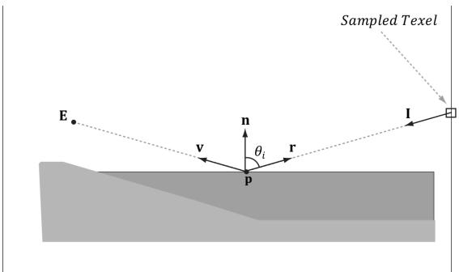


Figure 18.5. Here E is the eye point, and n is the surface normal at the point p. The texel that stores the light that reflects off p and enters the eye is obtained by sampling the cube map with the vector r.


We compute the reflection vector per-pixel and then use it to sample the environment map: 

const float shininess $=$ glossHeightAo.x \* (1.0f - roughness);   
// Add in specular reflections.   
if( gReflectionsEnabled )   
{ TextureCube gCubeMap $=$ ResourceDescriptorHeap[gSkyBoxIndex]; float3 r $=$ reflect(-toEyeW,bumpedNormalW); float4 reflectionColor $=$ gCubeMap/sample(GetLinearWrapSampler(), r); float3 fresnelFactor $=$ SchlickFresnel(fresnelR0,bumpedNormalW,r); litColor.rgb $+ =$ ambientAccess\*shininess \* fresnelFactor \* reflectionColor.rgb;   
} 

Because we are talking about reflections, we need to apply the Fresnel effect, which determines how much light is reflected from the environment into the eye based on the material properties of the surface and the angle between the light vector (reflection vector) and normal. In addition, we scale the amount of reflection based on the shininess of the material—a rough material should have a low amount of reflection, but still some reflection. Another new component we introduce is the additional glossHeightAo.x factor, which provides another way to scale the shininess, but coming from a texture. This is to obtain per-texel granularity to control the shininess. 

Figure 18.6 shows that reflections via environment mapping do not work well for flat surfaces. 

This is because the reflection vector does not tell the whole story, as it does not incorporate position; we really need a reflection ray and to intersect the ray with the environment map. A ray has position and direction, whereas a vector just has direction. From the figure, we see that the two reflection rays, $\mathbf { q } ( t ) = \mathbf { p } + t \mathbf { r }$ and $\mathbf { q } ^ { \prime } ( t ) = \mathbf { p } ^ { \prime } + t \mathbf { r }$ , intersect different texels of the cube map, and thus should be colored differently. However, because both rays have the same direction vector r, and the direction vector r is solely used for the cube map lookup, the same texel gets mapped to p and $ { \mathbf { p } } ^ { \prime }$ when the eye is at E and $\mathbf { E ^ { \prime } }$ , respectively. For flat objects this defect of environment mapping is very noticeable. For curvy surfaces, this shortcoming of environment mapping goes largely unnoticed, since the curvature of the surface causes the reflection vector to vary. 

One solution is to associate some proxy geometry with the environment map. For example, suppose we have an environment map for a square room. We can associate an axis-aligned bounding box with the environment map that has approximately the same dimensions as the room. Figure 18.7 then shows how we can do a ray intersection with the box to compute the vector v which gives a better 

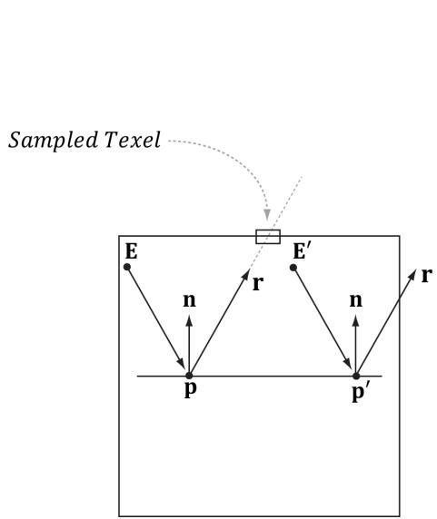


Figure 18.6. The reflection vector corresponding to two different points p and $\mathsf { p ^ { \prime } }$ when the eye is at positions E and $\mathbf { E ^ { \prime } }$ , respectively.


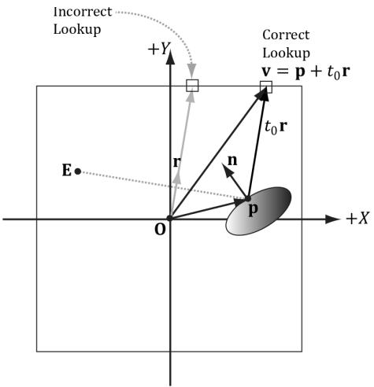


Figure 18.7. In steading of using the reflection vector r for the cube map lookup, we use the intersection point $\pmb { \mathsf { v } } = \pmb { \mathsf { p } } + t _ { 0 } \pmb { \mathsf { r } }$ between the ray and the box. Note that the point p is made relative to the center of the bounding box proxy geometry so that the intersection point can be used as a lookup vector for the cube map.


lookup vector than the reflection vector r. If the bounding box associated with the cube map is input into the shader (e.g., via a constant buffer), then the ray/ box intersection test can be done in the pixel shader, and we can compute the improved lookup vector in the pixel shader to sample the cube map. 

The following function shows how the cube map look up vector can be computed. 

float3 BoxCubeMapLookup(float3 rayOrigin, float3 unitRayDir, float3 boxCenter, float3 boxExtents)   
{ // Based on slab method as described in Real-Time Rendering 16.7.1 // (3rd edition).   
// Make relative to the box center. float3 p = rayOrigin - boxCenter;   
// The ith slab ray/plane intersection formulas for AABB are:   
// t1 $=$ (-dot(n_i,p) $^+$ h_i)/dot(n_i,d) $=$ (-p_i+h_i)/d_i   
// t2 $=$ (-dot(n_i,p)-h_i)/dot(n_i,d) $=$ (-p_i-h_i)/d_i   
// Vectorize and do ray/plane formulas for every slab together. float3 t1 $=$ (-p+boxExtents)/unitRayDir; float3 t2 $=$ (-p-boxExtents)/unitRayDir;   
// Find max for each coordinate. Because we assume the ray is   
// inside the box, we only want the max intersection parameter. float3 tmax $=$ max(t1,t2); 

// Take minimum of all the tmax components: float $t = \min (\min (t\max .x,t\max .y),t\max .z)$ // This is relative to the box center so it can be used as a // cube map lookup vector. return p + t\*unitRayDir;   
} 

# 18.5 DYNAMIC CUBE MAPS

So far we have described static cube maps, where the images stored in the cube map are premade and fixed. This works for many situations and is relatively inexpensive. However, suppose that we want animated actors moving in our scene. With a pre-generated cube map, you cannot capture these animated objects, which means we cannot reflect animated objects. To overcome this limitation, we can build the cube map at runtime. That is, every frame you position the camera in the scene that is to be the origin of the cube map, and then render the scene six times into each cube map face along each coordinate axis direction (see Figure 18.8). Since the cube map is rebuilt every frame, it will capture animated objects in the environment, and the reflection will be animated as well (see Figure 18.9). 

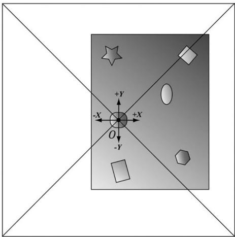


Figure 18.8. The camera is placed at position O in the scene, centered about the object we want to generate the dynamic cube map relative to. We render the scene six times along each coordinate axis direction with a field of view angle of $9 0 ^ { \circ }$ so that the image of the entire surrounding environment is captured.


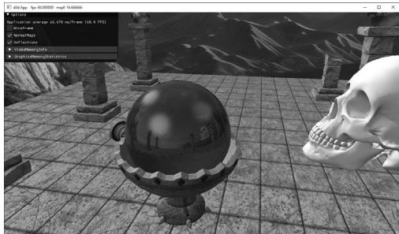


Figure 18.9. Screenshot showing dynamic reflections. The skull orbits the center sphere, and its reflection in the sphere animates accordingly. Moreover, because we are drawing the cube maps ourselves, we can model the reflections of the local objects as well, such as the columns, spheres, and floor.


Rendering a cube map dynamically is expensive. It requires rendering the scene to six render targets! Therefore, try to minimize the number of dynamic cube maps needed in a scene. For example, perhaps only use dynamic reflections for key objects in your scene that you want to show off or accentuate. Then use static cube maps for the less important objects, where dynamic reflections would probably go unnoticed or not be missed. Normally, low resolution cube maps are used for dynamic cube maps, such as $5 1 2 x 5 1 2$ to save on pixel processing (i.e., fill rate); of course, it will depend on the desired quality and performance budget. 

# 18.5.1 Dynamic Cube Map Helper Class

To help render to a cube map dynamically, we create the following CubeRenderTarget class, which encapsulates the actual ID3D12Resource object of the cube map, the various descriptors to the resource, and other useful data for rendering to the cube map: 

class CubeRenderTarget   
{   
public: CubeRenderTarget(ID3D12Device* device, UINT width, UINT height, DXGI_format format); CubeRenderTarget(const CubeRenderTarget& rhs) $\equiv$ delete; CubeRenderTarget& operator=(const CubeRenderTarget& rhs) $\equiv$ delete; ~CubeRenderTarget() $=$ default; UINT Width(const; UINT Height(const int faceIndex); ID3D12Resource\* Resource(); uint32_t BindlessIndex(const; CD3DX12_GPU DescriptorHandle Srv(); CD3DX12_CPU DescriptorHandle Rtv(int faceIndex); D3D12_VIEWPORT Viewport(const; D3D12_RECT ScissorRect(const; void BuildDescriptors(CD3DX12_CPU DescriptorHandle hCpuRtv[6]); void OnResize(UINT newWidth, UINT newHeight);   
private: void BuildDescriptors(); void BuildResource();   
private: ID3D12Device\* md3dDevice $\equiv$ nullptr; 

D3D12_VIEWPORT mViewport; D3D12_RECT mScissorRect;   
UINT mWidth $= 0$ .   
UINT mHeight $= 0$ .   
DXGI_FORMAT mFormat $\equiv$ DXGI_FORMAT_R8G8B8A8_UNORM; uint32_t mBindlessIndex $= -1$ . CD3DX12_CPU DescriptorHandle mhCpuSrv; CD3DX12_GPU DescriptorHandle mhGpuSrv; CD3DX12_CPU DescriptorHandle mhCpuRtv[6]; Microsoft::WRL::ComPtr<ID3D12Resource> mCubeMap $\equiv$ nullptr;   
}; 

# 18.5.2 Building the Cube Map Resource

Creating a cube map texture is done by creating a texture array with six elements (one for each face). Because we are going to render to the cube map, we must set the D3D12_RESOURCE_FLAG_ALLOW_RENDER_TARGET flag. Below is the method that builds the cube map resource: 

void CubeRenderTarget::BuildResource()   
{ D3D12.Resource_DESC texDesc; ZeroMemory(&texDesc,sizeof(D3D12.Resource_DESC)); texDesc.Dimension $=$ D3D12.Resource_DIMENSION TextURE2D; texDesc Alignment $= 0$ texDesc.Width $\equiv$ mWidth; texDesc.Height $\equiv$ mHeight; texDesc.DepthOrArraySize $= 6$ texDesc.MipLevels $= 1$ texDesc.Format $=$ mFormat; texDesc_SAMPLEDesc.Count $= 1$ texDesc_SAMPLEDesc.Quality $= 0$ texDesc.layout $=$ D3D12.TextURE_LAYOUT_unknown; texDesc Flags $=$ D3D12.Resource_FLAG_OPEN_RENDER_TARGET; ThrowIfFailed(md3dDevice->CreateCommittedResource( &CD3DX12_heap.Properties(D3D12_heap_TYPE_DEFAULT), D3D12_heap_FLAG_NONE, &texDesc, D3D12RESOURCE_STATEGENERIC_READ, nullptr, IID_PPV Arguments(&mCubeMap));   
} 

# 18.5.3 Extra Descriptor Heap Space

Rendering to a cube map requires six additional render target views, one for each face, and one additional depth/stencil buffer. Therefore, we must override the D3 

DApp::CreateRtvAndDsvDescriptorHeaps method and allocate these additional descriptors: 

enum RtvOffsets   
{ // Start after swapchain buffers. RTV_CUBEFACE0 $\equiv$ D3DApp::SwapChainBufferCount, RTV_CUBE_FACE1, RTV_CUBE_FACE2, RTV_CUBE_FACE3, RTV_CUBE_FACE4, RTV_CUBE_FACE5, RTV_COUNT };   
enum DsvOffsets { DSV_MAINVIEW $= 0$ DSV_DYNAMIC_CUBEMAP, DSV_COUNT };   
void DynamicCubeMap::CreateRtvAndDsvDescriptorHeaps() { mRtvHeap Init (md3dDevice.Get(), D3D12 Descriptor_TYPE_RTV, RTV_COUNT); mDsvHeapInit(md3dDevice.Get(), D3D12 Descriptor_TYPE_DSV, DSV_COUNT); } 

In addition, we will need one extra SRV so that we can bind the cube map as a shader input after it has been generated. 

The descriptor handles are passed into the CubeRenderTarget::BuildDescriptors method which saves a copy of the handles and then actually creates the views: 

void CubeRenderTarget::BuildDescriptors( CD3DX12_CPU describingSOR_handle hCpuRtv[6])   
{ CbvSrvUavHeap&bindlessHeap $\equiv$ CbvSrvUavHeap::Get(); mBindlessIndex $=$ bindlessHeap.NextFreeIndex(); // Save references to the descriptors. mhCpuSrv $=$ bindlessHeap.CpuHandle(mBindlessIndex); mhGpuSrv $=$ bindlessHeap.GpuHandle(mBindlessIndex); for(int $\mathrm{i} = 0$ .i<6;++i) mhCpuRtv[i] $\equiv$ hCpuRtv[i]; //Create the descriptors BuildDescriptors(); 

# 18.5.4 Building the Descriptors

In the previous section, we allocated heap space for our descriptors and cached references to the descriptors, but we did not actually create any descriptors to resources. We now need to create an SRV to the cube map resource so that we can sample it in a pixel shader after it is built, and we also need to create a render target view to each element in the cube map texture array, so that we can render onto each cube map face one-by-one. The following method creates the necessary views: 

```cs
void CubeRenderTarget::BuildDescriptors()
{
    D3D12_SHADER_RESOURCE_DEVCrsvDesc = {};
    svrDesc.Shader4ComponentMapping = D3D12_DEFAULT_SHADER_4_component_
        MAPPING;
    svrDesc.Format = mFormat;
    svrDesc.ViewDimension = D3D12_SRV_DIMENSION-textTRECUBE;
    svrDesc.TexturedCube.MostDetailedMip = 0;
    svrDesc.TexturedCube.MipLevels = 1;
    svrDesc.TexturedCube.ResourceMinLODclamp = 0.0f;
    // Create SRV to the entire cubemap resource.
    md3dDevice->CreateShaderResourceView(mCubeMap.Get(), &srvDesc,
        mhCpuSrv);
    // Create RTV to each cube face.
    for (int i = 0; i < 6; ++i)
        {
            D3D12_RENDER_TARGET_DEVC_rtvDesc;
            rtvDesc.ViewDimension = D3D12_RTV.dimension_textTRECURE2DARRAY;
            rtvDesc.Format = mFormat;
            rtvDesc.Texture2DArray.MipSlice = 0;
            rtvDesc.Texture2DArray.PlaneSlice = 0;
            // Render target to ith element.
            rtvDesc.Texture2DArray.FirstArraySlice = i;
            // Only view one element of the array.
            rtvDesc.Texture2DArray.Size = 1;
            // Create RTV to ith cubemap face.
            md3dDevice->CreateRenderTargetView(mCubeMap.Get(), &rtvDesc,
                mhCpuRtv[i]);
        }
    }
} 
```

# 18.5.5 Building the Depth Buffer

Generally, the cube map faces will have a different resolution than the main back buffer. Therefore, for rendering to the cube map faces, we need a depth buffer with 

dimensions that matches the resolution of a cube map face. However, because we render to the cube faces one at a time, we only need one depth buffer for the cube map rendering. We build an additional depth buffer and DSV with the following code: 

void DynamicCubeMapApp::BuildCubeDepthStencil()   
{ // Create the depth/stencil buffer and view. D3D12Resource_DESC depthStencilDesc; depthStencilDesc.Dimension $=$ D3D12_RESOURCE_DIMENSION-textTURE2D; depthStencilDesc Alignment $= 0$ . depthStencilDesc.Width $=$ CubeMapSize; depthStencilDesc.Height $=$ CubeMapSize; depthStencilDesc.DepthOrArraySize $= 1$ . depthStencilDesc.MipLevels $= 1$ . depthStencilDesc.Format $=$ mDepthStencilFormat; depthStencilDesc/sampleDesc.Count $= 1$ . depthStencilDesc/sampleDesc.Quality $= 0$ . depthStencilDesc LZayout $\equiv$ D3D12 TextURE LAYOUT UNKNOWN; depthStencilDescFLAGS $\equiv$ D3D12 RESOURCE_FLAG ALLOW_DEPTH_STENCIL; D3D12_CLEAR_VALUE optClear; optClear.Format $=$ mDepthStencilFormat; optClear.DepthStencil.Depth $= 1.0f$ . optClear.DepthStencil.Stencil $= 0$ ; ThrowIfFailed (md3dDevice->CreateCommittedResource ( &CD3DX12_heap_propertyss(D3D12_heap_TYPE_DEFAULT), D3D12_heap_FLAG_NON, &depthStencilDesc, D3D12.Resource_STATE_COMMON, &optClear, IID_PPV_args(mCubeDepthStencilBuffer.GetAddressOf())); // Create descriptor to mip level O of entire resource using /the format of the resource. md3dDevice->CreateDepthStencilView( mCubeDepthStencilBuffer.Get(), nullptr, mCubeDSV); // Transition the resource from its initial state to be used as a /depth buffer. mCommandList->ResourceBarrier(1, &CD3DX12.Resource_BARRIER::Transition( mCubeDepthStencilBuffer.Get(), D3D12.Resource_STATE_COMMON, D3D12.Resource_STATEDEPTH_WRITE));   
} 

# 18.5.6 Cube Map Viewport and Scissor Rectangle

Because the cube map faces will have a different resolution than the main back buffer, we need to define a new viewport and scissor rectangle that covers a cube map face: 

```cpp
CubeRenderTarget::CubeRenderTarget(ID3D12Device* device,  
    UINT width, UINT height,  
    DXGI_format format)  
{  
    md3dDevice = device;  
    mWidth = width;  
    mHeight = height;  
    mFormat = format;  
    mViewport = {0.0f, 0.0f, (float)width, (float)height, 0.0f, 1.0f};  
    mScissorRect = {0, 0, width, height};  
    BuildResource();  
}  
D3D12(ViewPORT CubeRenderTarget::Viewport() const  
{  
    return mViewport;  
}  
D3D12_RECT CubeRenderTarget::ScissorRect() const  
{  
    return mScissorRect; 
```

# 18.5.7 Setting up the Cube Map Camera

Recall that to generate a cube map idea is to position a camera at the center of some object O in the scene with a $9 0 ^ { \circ }$ field of view angle (both vertically and horizontally). Then have the camera look down the positive $x$ -axis, negative $x$ -axis, positive y-axis, negative y-axis, positive $z$ -axis, and negative $z$ -axis, and to take a picture of the scene (excluding the object O) from each of these six viewpoints. To facilitate this, we generate six cameras, one for each face, centered at the given position $( x , y , z )$ : 

```cpp
Camera mCubeMapCamera[6];  
void DynamicCubeMapApp::BuildCubeFaceCamera(float x, float y, float z)  
{ // Generate the cube map about the given position.  
XMFLOAT3 center(x, y, z);  
XMFLOAT3 worldUp(0.0f, 1.0f, 0.0f);  
// Look along each coordinate axis.  
XMFLOAT3 targets[6] = {  
    XMFLOAT3(x + 1.0f, y, z), // +X  
    XMFLOAT3(x - 1.0f, y, z), // -X  
    XMFLOAT3(x, y + 1.0f, z), // +Y  
    XMFLOAT3(x, y - 1.0f, z), // -Y  
    XMFLOAT3(x, y, z + 1.0f), // +Z 
```

XMFLOAT3(x, y, z - 1.0f) // -Z   
}；   
// Use world up vector (0,1,0) for all directions except $+Y / - Y$ // In these cases, we are looking down $+Y$ or $-Y$ , so we need   
// a different "up" vector.   
XMFLOAT3 ups[6] = { XMFLOAT3(0.0f, 1.0f, 0.0f), // +X XMFLOAT3(0.0f, 1.0f, 0.0f), // -X XMFLOAT3(0.0f, 0.0f, -1.0f), // +Y XMFLOAT3(0.0f, 0.0f, +1.0f), // -Y XMFLOAT3(0.0f, 1.0f, 0.0f), // +Z XMFLOAT3(0.0f, 1.0f, 0.0f) // -Z   
};   
for(int i = 0; i < 6; ++i) { mCubeMapCamera[i].LookAt(center, targets[i], ups[i]); mCubeMapCamera[i].SetLens(0.5f*XM.PI, 1.0f, 0.1f, 1000.0f); mCubeMapCamera[i].UpdateViewMatrix();   
} 

Because rendering to each cube map face utilizes a different camera, each cube face needs its own set of PassConstants. This is easy enough, as we just increase our PassConstants count by six when we create our frame resources. 

void DynamicCubeMap::BuildFrameResources()   
{ constexpr UINT mainPassCount $= 1$ . constexpr UINT cubeMapPassCount $= 6$ constexpr UINT passCount $=$ mainPassCount $^+$ cubeMapPassCount; for(int $\mathrm{i} = 0$ ;i $<$ gNumFrameResources; ++i) { mFrameResources.push_back( std::make_unique<FrameResource>(md3dDevice.Get(), passCount， (UINT)mAllRItems.size(), MaterialLib::GetLib().GetMaterialCount()); }   
} 

Element 0 will correspond to our main rendering pass, and elements 1-6 will correspond to our cube map faces. 

We implement the following method to set the constant data for each cube map face: 

```cpp
void DynamicCubeMapApp::UpdateCubeMapFacePassCBs()  
{  
    for (int i = 0; i < 6; ++i)  
    {  
        PassConstants cubeFacePassCB = mMainPassCB;  
    }  
} 
```

XMMatrix view $=$ mCubeMapCamera[i].GetView(); XMMatrix proj $=$ mCubeMapCamera[i].GetProj();   
XMMatrix viewProj $=$ XMMatrixMultiply_view,proj); XMMatrix invView $=$ XMMatrixInverse(&XMMatrixDeterminant.view), view); XMMatrix invProj $=$ XMMatrixInverse(&XMMatrixDeterminant(proj), proj); XMMatrix invViewProj $=$ XMMatrixInverse(&XMMatrixDeterminant.view Proj),viewProj);   
XMStoreFloat4x4(&cubeFacePassCB.View,XMMatrixTranspose/view)); XMStoreFloat4x4(&cubeFacePassCB.InvView, XMMatrixTranspose(微观))； XMStoreFloat4x4(&cubeFacePassCB.Proj,XMMatrixTranspose(proj)); XMStoreFloat4x4(&cubeFacePassCB.InvProj, XMMatrixTranspose(微观))； XMStoreFloat4x4(&cubeFacePassCB.ViewProj, XMMatrixTranspose(微观))； XMStoreFloat4x4(&cubeFacePassCB.InvProj,XMMatrixTranspose(微观))； cubeFacePassCB.EyePosW $=$ mCubeMapCamera[i].GetPosition3f(); cubeFacePassCBRenderTargetSize $\equiv$ XMFLOAT2((float)CubeMapSize,(float)CubeMapSize); cubeFacePassCB.InvRenderTargetSize $\equiv$ XMFLOAT2(1.0f/CubeMapSize,1.0f/CubeMapSize); auto currPassCB $=$ mCurrFrameResource->PassCB.get(); // Cube map pass cbuffers are stored in elements 1-6. currPassCB->CopyData(1+i,cubeFacePassCB); 

# 18.5.8 Drawing into the Cube Map

For this demo we have three render layers: 

```cpp
enum class RenderLayer : int
{
Opaque = 0,
OpaqueDynamicReflectors,
Sky,
Count
}; 
```

The OpaqueDynamicReflectors layer contains the center sphere in Figure () which will use the dynamic cube map to reflect local dynamic objects. Our first step is to draw the scene to each face of the cube map, but not including the center sphere; this means we just need to render the opaque and sky layers to the cube map: 

```cpp
void DynamicCubeMapApp::DrawSceneToCubeMap() 
```

```cpp
mCommandList->>RSServletports(1, &mDynamicCubeMap->Viewport()); mCommandList->>RSSetScissorRects(1, &mDynamicCubeMap->ScissorRect()); // Change to RENDER_TARGET. mCommandList->>ResourceBarrier(1, &CD3DX12Resource_BARRIER::Transition(mDynamicCubeMap->Resource(), D3D12Resource_STATEGENERIC_READ, D3D12Resource_STATE_RENDER_TARGET)); UINT passCBByteSize = d3dUtil::CalcConstantBufferByteSize(sizeof(Pass Constants)); // For each cube map face. for(int i = 0; i < 6; ++i) { // Clear the back buffer and depth buffer. mCommandList->>ClearRenderTargetView(mDynamicCubeMap->Rtv(i), Colors::LightSteelBlue, 0, nullptr); mCommandList->>ClearDepthStencilView(mCubeDSV, D3D12_CLEAR_FLAG_DEPTH | D3D12_CLEAR_FLAG_STENCIL, 1.0f, 0, 0, nullptr); // Specify the buffers we are going to render to. mCommandList->>OMSetRenderTargets(1, &mDynamicCubeMap->Rtv(i), true, &mCubeDSV); // Bind the pass constant buffer for this cube map face so we use // the right view/proj matrix for this cube face. auto passCB = mCurrFrameResource->PassCB->Resource(); D3D12_GPU_VIRTUAL_ADDRESS passCBAddress = passCB->GetGPUVirtualAddress() + (1+i) *passCBByteSize; mCommandList->>SetGraphicsRootConstantBufferView(1, passCBAddress); DrawRenderItems(mCommandList.Get(), mRItemLayer[(int) RenderLayer::Opaque]); mCommandList->>SetPipelineState(mPSOs["sky"].Get()); DrawRenderItems(mCommandList.Get(), mRItemLayer[(int) RenderLayer::Sky]); mCommandList->>SetPipelineState(mPSOs["opaque"].Get()); } // Change back to GENERIC_READ so we can read the // texture in a shader. mCommandList->>ResourceBarrier(1, &CD3DX12Resource_BARRIER::Transition(mDynamicCubeMap->Resource(), D3D12Resource_STATE_RENDER_TARGET, D3D12Resource_STATEGENERIC_READ)); 
```

Finally, after we rendered the scene to the cube map, we set our main render targets and draw the scene as normal, but with the dynamic cube map applied to the center sphere: 

```cpp
DrawSceneToCubeMap();   
// Set main render target settings.   
mCommandList->RSServletports(1, &mScreenViewport);   
mCommandList->RSSetScissorRects(1, &mScissorRect);   
// Indicate a state transition on the resource usage.   
mCommandList->ResourceBarrier(1, &CD3DX12_RESOURCE_BARRIER::Transition( CurrentBackBuffer(), D3D12.Resource_STATE_present, D3D12.Resource_STATEweenTarget));   
// Clear the back buffer and depth buffer.   
mCommandList->ClearRenderTargetView(CurrentBackBufferView(), Colors::LightSteelBlue, 0, nullptr);   
mCommandList->ClearDepthStencilView( DepthStencilView(), D3D12_CLEAR_FLAG_DEPTH | D3D12_CLEAR_FLAG_STENCIL, 1.0f, 0, 0, nullptr);   
// Specify the buffers we are going to render to.   
mCommandList->OMSetRenderTargets(1, &CurrentBackBufferView(), true, &DepthStencilView());;   
auto passCB = mCurrFrameResource->PassCB->Resource();   
mCommandList->SetGraphicsRootConstantBufferView(1, passCB->GetGPUVirtualAddress());   
// Use the dynamic cube map for the dynamic reflectors layer. CD3DX12_GPU DescriptorHandle dynamicTexDescriptor( mSrvDescriptorHeap->GetGPUDescriptorHandleForHeapStart());   
dynamicTexDescriptor Offset(mSkyTexHeapIndex + 1, mCbvSrvDescriptorSize);   
mCommandList->SetGraphicsRootDescriptorTable(3, dynamicTexDescriptor);   
DrawRenderItems(mCommandList.Get(), mRItemLayer[(int)RenderLayer::OpaqueDynamicReflectors]);   
// Use the static "background" cube map for the other objects (including the sky)   
mCommandList->SetGraphicsRootDescriptorTable(3, skyTexDescriptor);   
DrawRenderItems(mCommandList.Get(), mRItemLayer::Opaque)]; 
```

```cpp
mCommandList->>SetPipelineState(mPSOs["sky"].Get());  
DrawRenderItems(mCommandList.Get(), mRItemLayer[(int) RenderLayer::Sky]);  
// Indicate a state transition on the resource usage.  
mCommandList->>ResourceBarrier(1, &CD3DX12_RESOURCE_BARRIER::Transition(CurrentBackBuffer(), D3D12.Resource_STATE_render_TARGET, D3D12.Resource_STATE_present)); 
```

# 18.6 DYNAMIC CUBE MAPS WITH THE GEOMETRY SHADER

In the previous section, we redrew the scene six times to generate the cube map— once for each cube map face. Draw calls are not free, and we should work to minimize them. There is a Direct3D 10 sample called “CubeMapGS,” which uses the geometry shader to render a cube map by drawing the scene only once. In this section, we highlight the main ideas of how this sample works. Note that even though we show the Direct3D 10 code, the same strategy can be used in Direct3D 12 and porting the code is straightforward. 

First, it creates a render target view to the entire texture array (not each individual face texture): 

```cpp
// Create the 6-face render target view  
D3D10-render_TARGET.View_DESC DescRT;  
DescRT.Format = dstex.Format;  
DescRT.ViewDimension = D3D10_RTV_DIMENSION-textURE2DARRAY;  
DescRT.Texture2DArray.FirstArraySlice = 0;  
DescRT.Texture2DArray.Size = 6;  
DescRT.Texture2DArray.MipSlice = 0;  
V_RETURN(pd3dDevice->CreateRenderTargetView(g_pEnvMap, &DescRT, &g_pEnvMapRTV)); 
```

Moreover, this technique requires a cube map of depth buffers (one for each face). The depth stencil view to the entire texture array of depth buffers is creates as follows: 

```c
// Create the depth stencil view for the entire cube  
D3D10_DEPTHStencil(View_DESC DescDS;  
DescDS.Format = DXGI_format_D32_FLOAT;  
DescDS.ViewDimension = D3D10_DSV_DIMENSION-textURE2DARRAY;  
DescDS.Texture2DArray.FirstArraySlice = 0;  
DescDS.Texture2DArray.Size = 6;  
DescDS.Texture2DArray.MipSlice = 0;  
V_RETURN(pd3dDevice->CreateDepthStencilView(g_pEnvMapDepth, &DescDS, &g_pEnvMapDSV)); 
```

It then binds this render target and depth stencil view to the OM stage of the pipeline: 

```c
ID3D10RenderTargetView\* aRTViews[1] = { g_pEnvMapRTV};  
pd3dDevice->OMSetRenderTargets(sizeof(aRTViews)/sizeof(aRTViews[0]), aRTViews, g_pEnvMapDSV); 
```

That is, we have bound a view to an array of render targets and a view to an array of depth stencil buffers to the OM stage, and we are going to render to each array slice simultaneously. 

Now, the scene is rendered once and an array of six view matrices (one to look in the corresponding direction of each cube map face) is available in the constant buffers. The geometry shader replicates the input triangle six times, and assigns the triangle to one of the six render target array slices. Assigning a triangle to a render target array slice is done by setting the system value SV_RenderTargetArrayIndex. This system value is an integer index, which can only be set as an output from the geometry shader, and that specifies the render target array slice the primitive should be rendered onto. This system value can only be used if the render target view is a view to an array resource. 

```cpp
struct PS_CUBEMAP_IN
{
    float4 Pos : SV_POSITION; // Projection coord
    float2 Tex : TEXCOORD0; // Texture coord
    uint RTIndex : SV_RenderTargetArrayIndex;
};
[ maxvertexcount(18) ]
void GS_CubeMap( triangle GS_CUBEMAP_IN input[3],
                    inoturn TriangleStream<PS_CUBEMAP_IN> CubeMapStream )
{
    // For each triangle
    for( int f = 0; f < 6; ++f )
        {
            // Compute screen coordinates
            PS_CUBEMAP_IN output;
        }
    // Assign the ith triangle to the ith render target.
    output.RTIndex = f;
    // For each vertex in the triangle
    for( int v = 0; v < 3; v++ )
        {
            // Transform to the view space of the ith cube face.
            output(Pos = mul(input[v].Pos, g_mViewCM[f]);
            // Transform to homogeneous clip space.
            output(Pos = mul(input.Proj));
        }
} 
```

output.Tex $\equiv$ input[v].Tex; CubeMapStream.Addend(output）; } CubeMapStream RestartStrip(); 1 

Thus, we see that we have rendered the scene to each cube map face by rendering the scene only once instead of six times. 


We have summarized the main idea of this sample, but refer to the “CubeMapGS” Direct3D 10 sample for the full source code to fill in any details. 

This strategy is interesting and demonstrates simultaneous render targets and the SV_RenderTargetArrayIndex system value; however, it is not a definite win. There are two issues that make this method unattractive: 

1. It uses the geometry shader to output a large set of data. Recall from Chapter 12 that we mentioned the geometry shader acts inefficiently when outputting a large set of data. Therefore, using a geometry shader for this purpose could hurt performance. 

2. In a typical scene, a triangle will not overlap more than one cube map face (see again Figure 18.9). Therefore, the act of replicating a triangle and rendering it onto each cube face when it will be clipped by five out of six of the faces is wasteful. Admittedly, our demo for this chapter also renders the entire scene to each cube map face for simplicity. However, in real applications (non-demo), we would use frustum culling (Chapter 16), and only render the objects visible to a particular cube map face. Frustum culling at the object level cannot be done by a geometry shader implementation. 

On the other hand, a situation where this strategy does work well would be rendering a mesh that surrounds the scene. For example, suppose that you had a dynamic sky system where the clouds moved and the sky color changed based on the time of day. Because the sky is changing, we cannot use a prebaked cube map texture to reflect the sky, so we have to use a dynamic cube map. Since the sky mesh surrounds the entire scene, it is visible by all six cube map faces. Therefore, the second bullet point above does not apply, and the geometry shader method could be a win by reducing draw calls from six to one, assuming usage of the geometry shader does not hurt performance too much. 

# 18.7 DYNAMIC CUBE MAPS WITH THE VERTEX SHADER AND INSTANCING

We mentioned in the previous section that the SV_RenderTargetArrayIndex system value can only be set as an output from the geometry shader. This was historically true, but hardware added the support to replicate geometry to multiple render targets without a geometry shader. This is an optional feature, not guaranteed by all Direct3D 12 devices, and support for it can be queried from the D3D12_FEATURE_DATA_D3D12_OPTIONS:: VPAndRTArrayIndexFromAny ShaderFeedingRasterizerSupportedWithoutGSEmulation member. To get this structure filled out, you would write the following: 

```cpp
D3D12_FEATURE_DATA_D3D12_OPTIONS optionalFeatures;  
md3dDevice->CheckFeatureSupport(  
    D3D12_FEATURE_D3D12_OPTIONS, &optionalFeatures, Sizeof(optionalFeatures);  
if(  
    optionalFeatures.  
    VPAndRTArrayIndexFromAnyShaderFeedingRasterizerSupported WithoutGSEmulation)  
{  
    ...  
} 
```

When Direct3D 12 first came out, this feature was not widely available, but at the time of this second edition printing, it should be common on modern cards that also support ray tracing. 

So how does this help us? It means we can write this system value from a vertex shader. If we combine this with instancing, we can instance an object 6 times (one for each cube face), use the instance ID to index the cube face’s view and projection matrix, and then write the instance ID to the SV_ RenderTargetArrayIndex vertex attribute. Exercise 5 asks you to implement this technique. 

With this method, you can also do object frustum culling on the CPU. For example, if, after frustum culling, an object is only visible to two cube map faces then you would instance the object only two times. However, now there is no longer a one-to-one relationship between the instance ID and the cube map face index, so you will need a mapping from the instance ID to the cube map face index. This could be an indirection array stored in a constant buffer or from an instance buffer (i.e., a buffer that stores instance data that varies per-instance). 

1. A cube map consists of six textures that we visualize as the faces of a cube. In Direct3D 12, a cube map can be represented by the ID3D12Resource interface as a texture array with six elements. In the HLSL, a cube map is represented by the TextureCube type. To identify a texel in a cube map, we use 3D texture coordinates, which define a 3D lookup vector v originating at the center of the cube map. The texel of the cube map that v intersects is the texel corresponding to the 3D coordinates of v. 

2. An environment map captures the surrounding environment about a point with six images. These images can then be stored in a cube map. With environment maps we can easily texture a sky or approximate reflections. 

3. Cube maps can be made from six individual images using the texassemble tool. Cube maps can then be saved to file with the DDS image format. Because cube maps store six 2D textures, which can consume a lot of memory, a compressed DDS format should be used. 

4. Prebaked cube maps do not capture objects that move or objects in the scene that did not exist when the cube map was generated. To overcome this limitation, we can build the cube map at runtime. That is, every frame you position the camera in the scene that is to be the origin of the cube map, and then render the scene six times into each cube map face along each coordinate axis direction. Since the cube map is rebuilt every frame, it will capture animated objects and every object in the environment. Dynamic cube maps are expensive and their use should be minimized to key objects. 

5. To avoid rendering the scene geometry six times to generate a dynamic cube map, we can use a geometry shader to amplify each triangle six times, and assign them to their corresponding cube map face via the SV_ RenderTargetArrayIndex system value. This technique requires a cube map of depth buffers, and a view of the entire colored cube map array and the entire depth cube map array. If hardware supports writing to SV_ RenderTargetArrayIndex in the vertex shader, we can omit the geometry shader, use instancing to amplify the geometry 6 times, one for each cube map face, and then specify which render target the vertex shader output should go via the SV_RenderTargetArrayIndex system value. 

# 18.9 EXERCISES

1. Experiment with different FresnelR0 and Roughness material values in the “Cube Map” demo. Also try to make the cylinders and box reflective. 

2. Find six images that capture an environment (either find cube map images online or use a program like Terragen or https://skybox.blockadelabs.com/ to make them), and assemble them into a cube map using the texassemble tool. Test your cube map out in the “Cube Map” demo. 

3. A dielectric is a transparent material that refracts light; see Figure 18.10. When a ray strikes a dielectric, some light reflects and some light refracts based on Snell’s Law of Refraction. The indices of refraction $n _ { 1 }$ and $n _ { 2 }$ determine how much the light bends: 

1. If $\mathbf { n } 1 = \mathbf { n } 2$ , then $\theta _ { 1 } = \theta _ { 2 }$ (no bending). 

2. If $\mathtt { n 2 } > \mathtt { n 1 }$ , then $\theta _ { 2 } < \theta _ { 1 }$ (ray bends toward normal). 

3. If $\mathbf { n } 1 > \mathbf { n } 2$ , then $\theta _ { 2 } > \theta _ { 1 }$ (ray bends away from normal). 

Thus, in Figure 18.10, $\mathrm { n } 2 > \mathrm { n } 1$ since the ray bends toward the normal when we enter the block. Physically, the light ray refracts again when leaving the block, but for real-time graphics, typically only the first refraction is modeled. The HLSL provides the intrinsic refract function to calculate the refraction vector: 

float3 refract(float3 incident, float3 normal, float eta); 

The incident vector is the incoming light ray vector $\mathbf { \dot { v } } _ { 0 }$ in Figure 18.10), and the normal vector is the outward surface normal (n in Figure 18.10). The third 

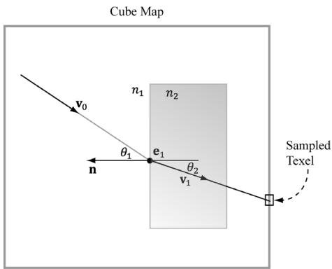


Figure 18.10. The incident vector $\pmb { v } _ { 0 }$ travels through a medium with index of refraction $n _ { 1 }$ . The ray strikes a transparent material with index of refraction $n _ { 2 }$ , and refracts into the vector $\mathbf { v } _ { 1 }$ . We use the refracted vector $\pmb { v } _ { 1 }$ as a look up into the cube map. This is almost like alpha blending transparency, except alpha blending transparency does not bend the incident vector.


parameter is the ratio of the indices of refraction $n _ { 1 } / n _ { 2 }$ . The index of refraction of a vacuum is 1.0; some other index of refactions: water—1.33; glass—1.51. For this exercise, modify the “Cube Map” demo to do refraction instead of reflection (see Figure 18.11); you may need to adjust the Material::Reflect values. Try out eta $= ~ 1 . 0$ , eta $= ~ 0 . 9 5$ , eta $\ c = ~ 0 . 9$ . 

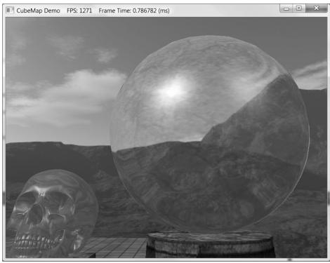


Figure 18.11. “Cube Demo” with refraction instead of reflection.


4. Just like with specular highlights from light sources, roughness will cause the specular reflections to spread out. Thus rougher surfaces will have blurry reflections as multiple samples from the environment map will average and scatter into the same direction into the eye. Research techniques for modeling blurry reflections with environment maps. 

5. Reimplement the “DynamicCubeMap” demo using the technique described in $\$ 18.7$ . Check that your GPU supports this feature using the ID3D12Device ::CheckFeatureSupport API. If it is not supported, use the geometry shader technique described in $\$ 18.6$ . 