# Chapter

# 20 Shadow Mapp ing

Shadows indicate to the observer where light originates and helps convey the relative locations of objects in a scene. This chapter provides an introduction to the basic shadow mapping algorithm, which is a popular method for modeling dynamic shadows in games and 3D applications. For an introductory book, we focus only on the basic shadow mapping algorithm; more sophisticated shadowing techniques, such as cascading shadow maps [Engel06] which give better quality results, are built by extending the basic shadow mapping algorithm. 

# Chapter Objectives:

1. To discover the basic shadow mapping algorithm. 

2. To learn how projective texturing works. 

3. To find out about orthographic projections. 

4. To understand shadow map aliasing problems and common strategies for fixing them. 

# 20.1 RENDERING SCENE DEPTH

The shadow mapping algorithm relies on rendering the scene depth from the viewpoint of the light source—this is essentially a variation of render-to-texture, 

which was first described in $\$ 13.7.2$ . By “rendering scene depth” we mean building the depth buffer from the viewpoint of the light source. Thus, after we have rendered the scene from the viewpoint of the light source, we will know the pixel fragments nearest to the light source—such fragments cannot be in shadow. In this section we review a utility class called ShadowMap that helps us store the scene depth from the perspective of the light source. It simply encapsulates a depth/stencil buffer, necessary views, and viewport. A depth/stencil buffer used for shadow mapping is called a shadow map. 

class ShadowMap   
{   
public: ShadowMap(ID3D12Device* device, UINT width, UINT height); ShadowMap(const ShadowMap& rhs) $\equiv$ delete; ShadowMap& operator=(const ShadowMap& rhs) $\equiv$ delete; ~ShadowMap() $\equiv$ default; UINT Width(const; UINT Height(const; ID3D12Resource\* Resource(); uint32_t BindlessIndex(const; CD3DX12_GPU DescriptorHandle Srv(const; CD3DX12_CPU DescriptorHandle Dsv(const; D3D12_VIEWPORT Viewport(const; D3D12_RECT ScissorRect(const; uint32_t BuildDescriptors(CD3DX12_CPU DescriptorHandle hCpuDsv); void OnResize(UINT newWidth, UINT newHeight);   
private: void BuildDescriptors(); void BuildResource();   
private: ID3D12Device\* md3dDevice $=$ nullptr; D3D12(ViewPORT mViewport; D3D12_RECT mScissorRect; UINT mWidth $= 0$ ; UINT mHeight $= 0$ . DXGI_FORMAT mFormat $\equiv$ DXGI_FORMAT_R24G8_TYPELESS; uint32_t mBindlessIndex $= -1$ CD3DX12_CPU DescriptorHandle mhCpuSrv; CD3DX12_CPU DescriptorHandle mhGpuSrv; CD3DX12_CPU DescriptorHandle mhCpuDsv; 

```cpp
Microsoft::WRL::ComPtr<ID3D12Resource> mShadowMap = nullptr; 
```

The constructor creates the texture of the specified dimensions and viewport. The resolution of the shadow map affects the quality of our shadows, but at the same time, a high resolution shadow map is more expensive to render into and requires more memory. 

```cpp
ShadowMap::ShadowMap(ID3D12Device* device, UINT width, UINT height)  
{ md3dDevice = device; mWidth = width; mHeight = height; mViewport = {0.0f, 0.0f, (float)width, (float)height, 0.0f, 1.0f mScissorRect = {0, 0, (int)width, (int)height}; BuildResource();  
}  
void ShadowMap::BuildResource()  
{ D3D12RESOURCE_DESC texDesc; ZeroMemory(&texDesc, sizeof(D3D12RESOURCE_DESC)); texDesc.Dimension = D3D12RESOURCE_DIMENSION一篇文章2D; texDesc Alignment = 0; texDesc.Width = mWidth; texDesc.Height = mHeight; texDesc.DepthOrArraySize = 1; texDesc.MipLevels = 1; texDesc.Format = mFormat; texDesc_SAMPLEDesc.Count = 1; texDesc_SAMPLEDesc.Quality = 0; texDesc Layout = D3D12一篇文章下一篇 Unknown; texDesc Flags = D3D12RESOURCE_FLAG_OPEN_depth_STENCIL; D3D12_CLEAR_VALUE optClear; optClear.Format = DXGI_FORMAT_D24_UNORM_S8_UID; optClear.DepthStencil.Depth = 1.0f; optClear.DepthStencil.Stencil = 0; auto heapProperties = CD3DX12_HEAP_PROPERTIES(D3D12_HEAP_TYPE_DEFAULT); ThrowIfFailed.md3dDevice->CreateCommittedResource( &heapProperties, D3D12_HEAP_FLAG_NONE, &texDesc, D3D12_RESOURCE_STATE.Generic_READ, &optClear, IID_PPV.ArgS(&mShadowMap));  
} 
```

uint32_t ShadowMap::BuildDescriptors(CD3DX12_CPU Descriptor HANDLE hCpuDsv)   
{ CbvSrvUavHeap&bindlessHeap $\equiv$ CbvSrvUavHeap::Get(); mBindlessIndex $=$ bindlessHeap.NextFreeIndex(); // Save references to the descriptors. mhCpuSrv $=$ bindlessHeap.CpuHandle(mBindlessIndex); mhGpuSrv $=$ bindlessHeap.GpuHandle(mBindlessIndex); mhCpuDsv $=$ hCpuDsv; // Create the descriptors BuildDescriptors(); return mBindlessIndex;   
}   
void ShadowMap::BuildDescriptors()   
{ // Create SRV to resource so we can sample the shadow /map in a shader program. CreateSrv2d(mid3dDevice,mShadowMap.Get(),DXGI_FORMAT_R24_UNORM_X8_ TYPELESS, 1，mhCpuSrv); //CreateDSVto resource so we can render to the shadow map. CreateDsv(mid3dDevice,mShadowMap.Get(),D3D12_DSV_FLAG_NONE, DXGI_FORMAT_D24_UNORM_S8_UID,0，mhCpuDsv); 

As we will see, the shadow mapping algorithm requires two render passes. In the first one, we render the scene depth from the viewpoint of the light into the shadow map; in the second pass, we render the scene as normal to the back buffer from our “player” camera, but use the shadow map as a shader input to implement the shadowing algorithm. We provide a method to access the shader resource and its views: 

```cpp
ID3D12Resource\* ShadowMap::Resource()   
{ return mShadowMap.Get();   
}   
uint32_t ShadowMap::BindlessIndex()const   
{ return mBindlessIndex;   
}   
CD3DX12_GPU_DESCRIPTOR_handle ShadowMap::Srv()const   
{ return mhGpuSrv; 
```

```cpp
CD3DX12_CPU Descriptor HANDLE ShadowMap::Dsv() const  
{ return mhCpuDsv; } 
```

# 20.2 ORTHOGRAPHIC PROJECTIONS

So far in this book we have been using a perspective projection. The key property of perspective projection is that objects are perceived as getting smaller as their distance from the eye increases. This agrees with how we perceive things in real life. Another type of projection is an orthographic projection. Such projections are primarily used in 3D science or engineering applications, where it is desirable to have parallel lines remain parallel after projection. However, orthographic projections will enable us to model shadows that parallel lights generate. With an orthographic projection, the viewing volume is a box axis-aligned with the view space with width $w$ , height $h$ , near plane n and far plane $f$ that looks down the positive $z$ -axis of view space (see Figure 20.1). These numbers, defined relative to the view space coordinate system, define the box view volume. 

With an orthographic projection, the lines of projection are parallel to the view space $z$ -axis (Figure 20.2). And we see that the 2D projection of a vertex $( x , y , z )$ is just $( x , y )$ . 

As with perspective projection, we want to maintain relative depth information, and we want normalized device coordinates. To transform the view volume from view space to NDC space, we need to rescale and shift to map the view space view volume $\textstyle { \left[ - { \frac { w } { 2 } } , { \frac { w } { 2 } } \right] \times \left[ - { \frac { h } { 2 } } , { \frac { h } { 2 } } \right] \times \left[ n , f \right] }$ to the NDC space view volume $[ - 1 , 1 ] \times$ $[ - 1 , \ 1 ] \ \times \ [ 0 , \ 1 ]$ . We can determine this mapping by working coordinate-bycoordinate. For the first two coordinates, it is easy to see that the intervals differ only by a scaling factor: 

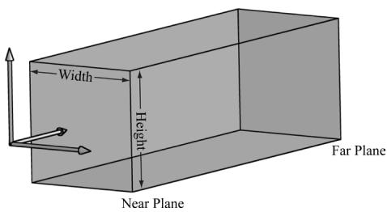


Figure 20.1. The orthographic viewing volume is a box that is axis aligned with the view coordinate system.


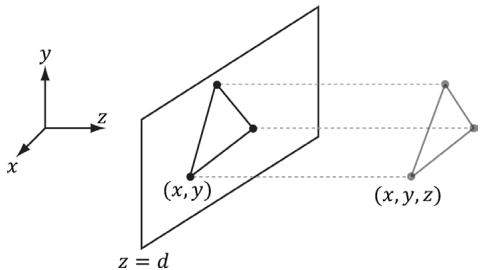


Figure 20.2. The orthographic projection of points onto the projection plane. The lines of projection are parallel to the view space z-axis with an orthographic projection.


$$
\frac {2}{w} \cdot \left[ - \frac {w}{2}, \frac {w}{2} \right] = [ - 1, 1 ]
$$

$$
\frac {2}{h} \cdot \left[ - \frac {h}{2}, \frac {h}{2} \right] = \left[ - 1, 1 \right]
$$

For the third coordinate, we need to map $[ n , f ] \to [ 0 , 1 ]$ . We assume the mapping takes the form $g ( z ) = a z + b$ (i.e., a scaling and translation). We have the conditions $g ( n ) = 0$ and $g ( f ) = 1$ , which allow us to solve for $^ a$ and $^ { b }$ : 

$$
a n + b = 0
$$

$$
a f + b = 1
$$

The first equation implies $b = - a n$ . Plugging this into the second equation we get: 

$$
a f - a n = 1
$$

$$
a = \frac {1}{f - n}
$$

And so: 

$$
- \frac {n}{f - n} = b
$$

Thus, 

$$
g (z) = \frac {z}{f - n} - \frac {n}{f - n}
$$

The reader may wish to graph $g ( z )$ over the domain $[ n , f ]$ for various $n$ and $f$ such that $f > n$ . 

Finally, the orthographic transformation from view space coordinates $( x , y , z )$ to NDC space coordinates $( x ^ { \prime } , y ^ { \prime } , z ^ { \prime } )$ is: 

$$
x ^ {\prime} = \frac {2}{w} x
$$

$$
y ^ {\prime} = \frac {2}{h} y
$$

$$
z ^ {\prime} = \frac {z}{f - n} - \frac {n}{f - n}
$$

Or in terms of matrices: 

$$
\left[ x ^ {\prime}, y ^ {\prime}, z ^ {\prime}, 1 \right] = \left[ x, y, z, 1 \right] \left[ \begin{array}{c c c c} \frac {2}{w} & 0 & 0 & 0 \\ 0 & \frac {2}{h} & 0 & 0 \\ 0 & 0 & \frac {1}{f - n} & 0 \\ 0 & 0 & \frac {n}{n - f} & 1 \end{array} \right]
$$

The $4 \times 4$ matrix in the above equation is the orthographic projection matrix. 

Recall that with the perspective projection transform, we had to split it into two parts: a linear part described by the projection matrix, and a nonlinear part described by the divide by w. In contrast, the orthographic projection transformation is completely linear—there is no divide by w. Multiplying by the orthographic projection matrix takes us directly into NDC coordinates. 

# 20.3 PROJECTIVE TEXTURE COORDINATES

Projective texturing is so called because it allows us to project a texture onto arbitrary geometry, much like a slide projector. Figure 20.3 shows an example of projective texturing. 

Projective texturing can be useful on its own for modeling slide projector lights, but as we will see in $\ S 2 0 . 4 .$ , it is also used as an intermediate step for shadow mapping. 

The key to projective texturing is to generate texture coordinates for each pixel in such a way that the applied texture looks like it has been projected onto 

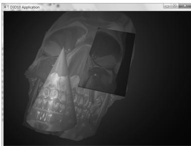


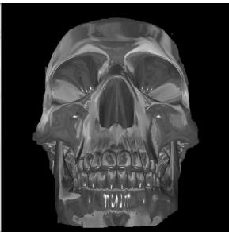


Figure 20.3. The skull texture (right) is projected onto the scene geometry (left).


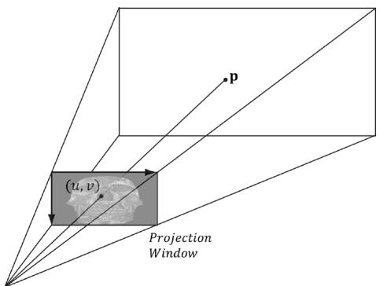


Figure 20.4. The texel identified by the coordinates $( u , v )$ relative to the texture space on the projection window is projected onto the point p by following the line of sight from the light origin to the point p.


the geometry. We will call such generated texture coordinates projective texture coordinates. 

From Figure 20.4, we see that the texture coordinates $( u , \nu )$ identify the texel that should be projected onto the 3D point p. But the coordinates $( u , \nu )$ precisely identify the projection of p on the projection window, relative to a texture space coordinate system on the projection window. So the strategy of generating projective texture coordinates is as follows: 

1. Project the point p onto the light’s projection window and transform the coordinates to NDC space. 

2. Transform the projected coordinates from NDC space to texture space, thereby effectively turning them into texture coordinates. 

Step 1 can be implemented by thinking of the light projector as a camera. We define a view matrix V and projection matrix P for the light projector. Together, these matrices essentially define the position, orientation, and frustum of the light projector in the world. The matrix V transforms coordinates from world space to the coordinate system of the light projector. Once the coordinates are relative to the light coordinate system, the projection matrix, along with the homogeneous divide, are used to project the vertices onto the projection plane of the light. Recall from $\ S 5 . 6 . 3 . 5$ that after the homogeneous divide, the coordinates are in NDC space. 

Step 2 is accomplished by transforming from NDC space to texture space via the following change of coordinate transformation: 

$$
\begin{array}{l} u = 0. 5 x + 0. 5 \\ \nu = - 0. 5 y + 0. 5 \\ \end{array}
$$

Here, $u , \nu \in [ 0 , 1 ]$ provided $x , y \in \left[ - 1 , 1 \right]$ . We scale the y-coordinate by a negative to invert the axis because the positive $\boldsymbol { y }$ -axis in NDC coordinates goes in the direction opposite to the positive $\nu$ -axis in texture coordinates. The texture space transformations can be written in terms of matrices (recall Exercise 21 from Chapter 3): 

$$
\left[ \begin{array}{l l l l} x, & y, & 0, & 1 \end{array} \right] \left[ \begin{array}{c c c c} 0. 5 & 0 & 0 & 0 \\ 0 & - 0. 5 & 0 & 0 \\ 0 & 0 & 1 & 0 \\ 0. 5 & 0. 5 & 0 & 1 \end{array} \right] = \left[ \begin{array}{l l l l} u, & v, & 0, & 1 \end{array} \right]
$$

Let us call the above matrix T for “texture matrix” that transforms from NDC space to texture space. We can form the composite transform VPT that takes us from world space directly to texture space. After we multiply by this transform, we still need to do the perspective divide to complete the transformation; see Chapter 5 Exercise 8 for why we can do the perspective divide after doing the texture transform. 

# 20.3.1 Code Implementation

The code for generating projective texture coordinates is shown below: 

```cpp
struct VertexOut
{
    float4 PosH : SV POSITION;
    float3 PosW : POSITION;
    float3 TangentW : TANGENT;
    float3 NormalW : NORMAL;
    float2 Tex : TEXCOORD0;
    float4 ProjTex : TEXCOORD1;
};
VertexOut VS(VERTEXIn vin)
{
    VertexOut vout;
    [... ]
    // Transform to light's projective space.
    vout ProjTex = mul(float4(vIn(posL, 1.0f), gLightWorldViewProjTexture);
    [... ]
    return vout;
} 
```

float4 PS(VertexOut pin) : SV_Target   
{ // Complete projection by doing division by w. pin.ProjTex.xyz $=$ pin.ProjTex.w; // Depth in NDC space. float depth $=$ pin.ProjTex.z; // Sample the texture using the projective tex-coords. float4 c $=$ gTextureMap_SAMPLE(sampler, pin.ProjTex.xy); [...] 

# 20.3.2 Points Outside the Frustum

In the rendering pipeline, geometry outside the frustum is clipped. However, when we generate projective texture coordinates by projecting the geometry from the point of view of the light projector, no clipping is done—we simply project vertices. Consequently, geometry outside the projector’s frustum receives projective texture coordinates outside the [0, 1] range. Projective texture coordinates outside the [0, 1] range function just like normal texture coordinates outside the [0, 1] range based on the enabled address mode (see (§9.6) used when sampling the texture. 

Generally, we do not want to texture any geometry outside the projector’s frustum because it does not make sense (such geometry receives no light from the projector). Using the border color address mode with a zero color is a common solution. Another strategy is to associate a spotlight with the projector so that anything outside the spotlight’s field of view cone is not lit (i.e., the surface receives no projected light). The advantage of using a spotlight is that the light intensity from the projector is strongest at the center of the spotlight cone, and can smoothly fade out as the angle $\phi$ between $\mathbf { - L }$ and d increases (where L is the light vector to the surface point and d is the direction of the spotlight). 

# 20.3.3 Orthographic Projections

So far we have illustrated projective texturing using perspective projections (frustum shaped volumes). However, instead of using a perspective projection for the projection process, we could have used an orthographic projection. In this case, the texture is projected in the direction of the $z$ -axis of the light through a box. 

Everything we have talked about with projective texture coordinates also applies when using an orthographic projection, except for a couple things. First, with an orthographic projection, the spotlight strategy used to handle points 

outside the projector’s volume does not work. This is because a spotlight cone approximates the volume of a frustum to some degree, but it does not approximate a box. However, we can still use texture address modes to handle points outside the projector’s volume. This is because an orthographic projection still generates NDC coordinates and a point $( x , y , z )$ is inside the volume if and only if: 

$$
\begin{array}{l} - 1 \leq x \leq 1 \\ - 1 \leq y \leq 1 \\ 0 \leq z \leq 1 \\ \end{array}
$$

Second, with an orthographic projection, we do not need to do the divide by $w$ ; that is, we do not need the line: 

// Complete projection by doing division by w. pin.ProjTex.xyz / $=$ pin.ProjTex.w; 

This is because after an orthographic projection, the coordinates are already in NDC space. This is faster, because it avoids the per-pixel division required for perspective projection. On the other hand, leaving in the division does not hurt because it divides by 1 (an orthographic projection does not change the w-coordinate, so w will be 1). If we leave the division by $w$ in the shader code, then the shader code works for both perspective and orthographic projections uniformly. Though, the tradeoff for this uniformity is that you do a superfluous division with an orthographic projection. 

# 20.4 SHADOW MAPPING

# 20.4.1 Algorithm Description

The idea of the shadow mapping algorithm is to render-to-texture the scene depth from the viewpoint of the light into a depth buffer called a shadow map. After this is done, the shadow map will contain the depth values of all the visible pixels from the perspective of the light. (Pixels occluded by other pixels will not be in the shadow map because they will fail the depth test and either be overwritten or never written.) 

To render the scene from the viewpoint of the light, we need to define a light view matrix that transforms coordinates from world space to the space of the light and a light projection matrix, which describes the volume that light emits through in the world. This can be either a frustum volume (perspective projection) or box volume (orthographic projection). A frustum light volume can be used to model 

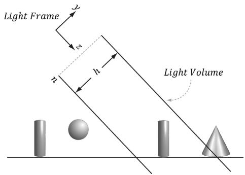


Figure 20.5. Parallel light rays travel through the light volume, so only a subset of the scene inside the volume receives light. If the light source needs to strike the entire scene, we can set the light volume size to contain the entire scene.


spotlights by embedding the spotlight cone inside the frustum. A box light volume can be used to model parallel lights. However, the parallel light is now bounded and only passes through the box volume; therefore, it may only strike a subset of the scene (see Figure 20.5). For a light source that strikes the entire scene (such as the sun), we can make the light volume large enough to contain the entire scene. 

Once we have built the shadow map, we render the scene as normal from the perspective of the “player” camera. For each pixel $\boldsymbol { p }$ rendered, we also compute its depth from the light source, which we denote by $d ( p )$ . In addition, using projective texturing, we sample the shadow map along the line of sight from the light source to the pixel $\boldsymbol { p }$ to get the depth value $s ( \boldsymbol p )$ stored in the shadow map; this value is the depth of the pixel closest to the light along the line of sight from the position of the light to $\boldsymbol { p }$ . Then, from Figure 20.6, we see that a pixel $\boldsymbol { p }$ is in shadow if and only if $d ( p ) > s ( p )$ . Hence a pixel is not in shadow if and only if $d ( p ) \leq s ( p )$ . 

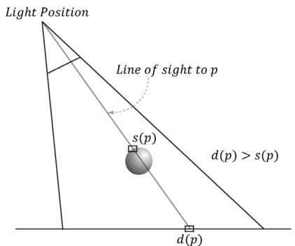


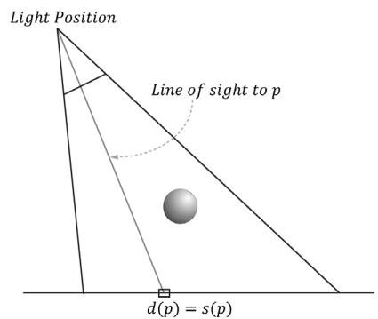


Figure 20.6. On the left, the depth of the pixel $\boldsymbol { p }$ from the light is $d ( p )$ . However, the depth of the pixel nearest to the light along the same line of sight has depth $s ( \boldsymbol p )$ , and $d ( p ) > s ( p )$ . We conclude, therefore, that there is an object in front of $\dot { p }$ from the perspective of the light and so $\boldsymbol { p }$ is in shadow. On the right, the depth of the pixe $\boldsymbol { p }$ from the light is $d ( p )$ and it also happens to be the pixel nearest to the light along the line of sight, that is, $s ( \boldsymbol { p } ) = d ( \boldsymbol { p } )$ , so we conclude $\boldsymbol { p }$ is not in shadow.


The depth values compared are in NDC coordinates. This is because the shadow map, which is a depth buffer, stores the depth values in NDC coordinates. How this is done exactly will be clear when we look at the code. 

# 20.4.2 Biasing and Aliasing

The shadow map stores the depth of the nearest visible pixels with respect to its associated light source. However, the shadow map only has some finite resolution. So each shadow map texel corresponds to an area of the scene. Thus, the shadow map is just a discrete sampling of the scene depth from the light perspective. This causes aliasing issues known as shadow acne (see Figure 20.7). 

Figure 20.8 shows a simple diagram to explain why shadow acne occurs. A simple solution is to apply a constant bias to offset the shadow map depth. Figure 20.9 shows how this corrects the problem. 

Too much biasing results in an artifact called peter-panning, where the shadow appears to become detached from the object (see Figure 20.10). 

Unfortunately, a fixed bias does not work for all geometry. In particular, Figure 20.11 shows that triangles with large slopes (with respect to the light source) need a larger bias. It is tempting to choose a large enough depth bias to handle all slopes. However, as Figure 20.10 showed, this leads to peter-panning. 

What we want is a way to measure the polygon slope with respect to the light source, and apply more bias for larger sloped polygons. Fortunately, graphics hardware has intrinsic support for this via the so-called slope-scaled-bias rasterization state properties: 

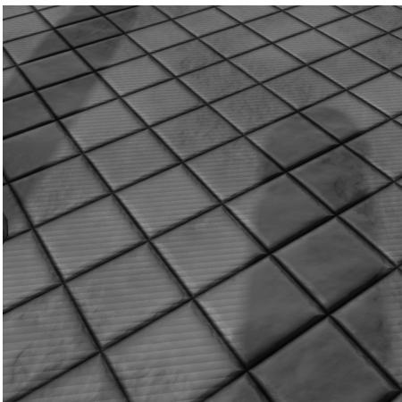


Figure 20.7. Notice the aliasing on the floor plane with the “stair-stepping” alternation between light and shadow. This aliasing error is often called shadow acne.


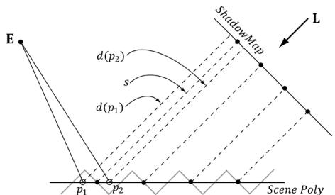


Figure 20.8. The shadow map samples the depth of the scene. Observe that due to finite resolution of the shadow map, each shadow map texel corresponds to an area of the scene. The eye E sees two points on the scene $\ b { p } _ { 1 }$ and $\pmb { \mathscr { p } } _ { 2 }$ that correspond to different screen pixels. However, from the viewpoint of the light, both points are covered by the same shadow map texel (that is, $s ( p _ { 1 } ) = s ( p _ { 2 } ) = s ,$ ). When we do the shadow map test, we have $d ( p _ { 1 } ) > s$ and $d ( p _ { 2 } ) \leq s$ . Thus, $\ b { p } _ { 1 }$ will be colored as if it were in shadow, and $\pmb { \mathscr { p } } _ { 2 }$ will be colored as if it were not in shadow. This causes the shadow acne.


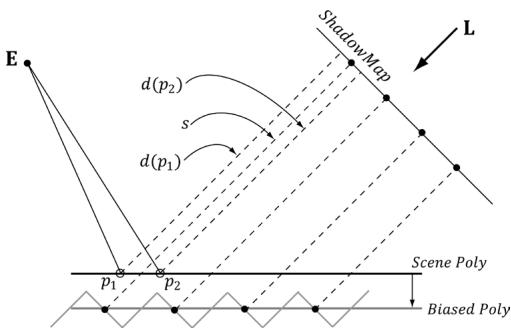


Figure 20.9. By biasing the depth values in the shadow map, no false shadowing occurs. We have that $d ( p _ { 1 } ) \leq s$ and $d ( p _ { 2 } ) \leq s$ . Finding the right depth bias is usually done by experimentation.


```cpp
typedef struct D3D12_RASTERIZER_DESC {  
    [...]  
    INT DepthBias;  
    FLOAT DepthBiasClamp;  
    FLOAT SlopeScaledDepthBias;  
    [...]  
} D3D12_RASTERIZER_DESC; 
```

1. DepthBias: A fixed bias to apply; see comments below for how this integer value is used for a UNORM depth buffer format. 

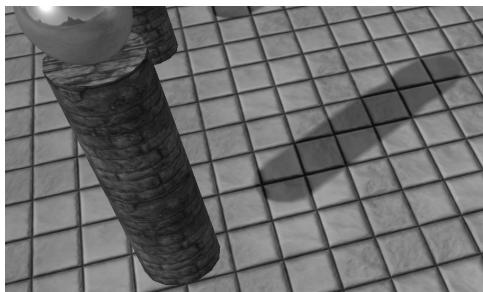


Figure 20.10. Peter-panning—the shadow becomes detached from the column due to a large depth bias.


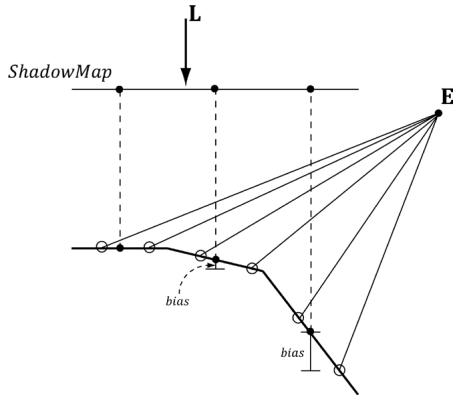


Figure 20.11. Polygons with large slopes, relative to the light source, require more bias than polygons with small slopes relative to the light source.


2. DepthBiasClamp: A maximum depth bias allowed. This allows us to set a bound on the depth bias, for we can imagine that for very steep slopes, the bias slopescaled-bias would be too much and cause peter-panning artifacts. 

3. SlopeScaledDepthBias: A scale factor to control how much to bias based on the polygon slope; see comments below for the formula. 

Note that we apply the slope-scaled-bias when we are rendering the scene to the shadow map. This is because we want to bias based on the polygon slope with respect to the light source. Consequently, we are biasing the shadow map values. In our demo we use the values: 

```cpp
// [From MSDN]
// If the depth buffer currently bound to the output-merger stage
// has a UNORM format or no depth buffer is bound the bias value
// is calculated like this:
// Bias = (float)DepthBias * r + SlopeScaledDepthBias * MaxDepthSlope;
// where r is the minimum representable value > 0 in the
// depth-buffer format converted to float32.
// [/End MSDN]
// For a 24-bit depth buffer, r = 1 / 2^24.
// Example: DepthBias = 100000 => Actual DepthBias = 100000/2^24 =
	.006
// These values are highly scene dependent, and you will need
// to experiment with these values for your scene to find the
// best values.
D3D12graphics_pipeLINE_STATE_DESC smapPsoDesc = opaquePsoDesc;
smapPsoDesc.RasterizerState.DepthBias = 100000;
smapPsoDesc.RasterizerState.DepthBiasClamp = 0.0f;
smapPsoDesc.RasterizerState.SlopeScaledDepthBias = 1.0f; 
```

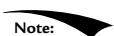


Depth bias happens during rasterization (after clipping), so does not affect geometry clipping. 


For the complete details of depth bias, search the SDK documentation for “Depth Bias,” and it will give all the rules for how it is applied, and how it works for floating-point depth buffers. 

# 20.4.3 PCF Filtering

The projective texture coordinates $( u , \nu )$ used to sample the shadow map generally will not coincide with a texel in the shadow map. Usually, it will be between four 

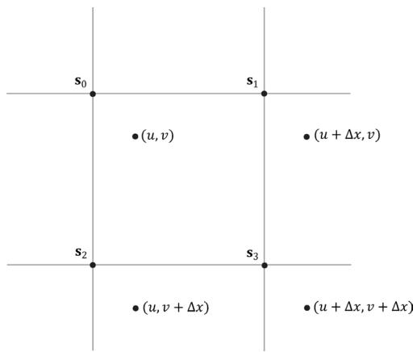


Figure 20.12. Taking four shadow map samples.


texels. With color texturing, this is solved with bilinear interpolation (§9.5.1). However, [Kilgard01] points out that we should not average depth values, as it can lead to incorrect results about a pixel being flagged in shadow. (For the same reason, we also cannot generate mipmaps for the shadow map.) Instead of interpolating the depth values, we interpolate the results—this is called percentage closer filtering (PCF). That is, we use point filtering (MIN_MAG_MIP_POINT) and sample the texture with coordinates $( u , \nu )$ , $( u + \Delta x , \nu )$ , $( u , \nu + \Delta x )$ , $( u + \Delta x , \nu +$ $\Delta x )$ ), where Δx = 1/SHADOW_MAP_SIZE. Since we are using point sampling, these four points will hit the nearest four texels ${ \bf s } _ { 0 } , { \bf s } _ { 1 } , { \bf s } _ { 2 } ,$ and $\mathbf { s } _ { 3 }$ , respectively, surrounding $( u , \nu )$ , as shown in Figure 20.12. We then do the shadow map test for each of these sampled depths and bilinearly interpolate the shadow map results: 

```cpp
static const float SMAP_SIZE = 2048.0f;   
static const float SMAP_DX = 1.0f / SMAP_SIZE;   
...   
// Sample shadow map to get nearest depth to light. float s0 = gShadowMap/sample(gShadowSam, projTexC.xy).r; float s1 = gShadowMap/sample(gShadowSam, projTexC.xy + float2(SMAP_DX, 0)).r; float s2 = gShadowMap/sample(gShadowSam, projTexC.xy + float2(0, SMAP_DX)).r; float s3 = gShadowMap/sample(gShadowSam, projTexC.xy + float2(SMAP_DX, SMAP_DX)).r;   
// Is the pixel depth <= shadow map value? float result0 = depth <= s0; float result1 = depth <= s1; float result2 = depth <= s2; 
```

```cpp
float result3 = depth <= s3;  
// Transform to texel space.  
float2 texelPos = SMAP_SIZE*projTexC.xy;  
// Determine the interpolation amounts.  
float2 t = frac( texelPos );  
// Interpolate results.  
return lerp( lerp(result0, result1, t.x), lerp(result2, result3, t.x), t.y); 
```

In this way, it is not an all-or-nothing situation; a pixel can be partially in shadow. For example, if two of the samples are in shadow and two are not in shadow, then the pixel is $5 0 \%$ in shadow. This creates a smoother transition from shadowed pixels to non-shadows pixels (see Figure 20.13). 


The HLSL frac function returns the fractional part of a floating-point number (i.e., the mantissa). For example, if SMAP_SIZE = 1024 and projTex.xy $=$ (0.23, 0.68), then texelPos $=$ (235.52, 696.32) and frac(texelPos) $=$ (0.52, 0.32). These fractions tell us how much to interpolate between the samples. The HLSL lerp(x, y, s) function is the linear interpolation function and returns $\mathbf { x } + s \left( \mathbf { y } - \mathbf { x } \right) = ( 1 - s ) \mathbf { x } + s \mathbf { y } .$ 

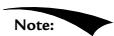


Even with our filtering, the shadows are still very hard and the aliasing artifacts can still be unsatisfactory close up. More aggressive methods can be used; see [Uralsky05], for example. We also note that using a higher-resolution shadow map helps, but can be cost prohibitive. 

The main disadvantage of PCF filtering as described above is that it requires four texture samples. Sampling textures is one of the more expensive operations on a modern GPU because memory bandwidth and memory latency have 

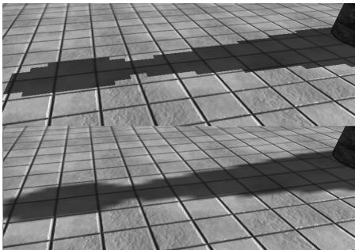


Figure 20.13. In the top image, observe the “stair-stepping” artifacts on the shadow boundary. On the bottom image, these aliasing artifacts are smoothed out a bit with filtering.


not improved as much as the raw computational power of GPUs [Möller08]. Fortunately, Direct3D $1 1 +$ graphics hardware has built in support for PCF via the SampleCmpLevelZero method: 

```cpp
Texture2D gShadowMap : register(t1);   
SamplerComparisonState gsamShadow : register(s6);   
// Complete projection by doing division by w.   
shadowPosH.xyz /= shadowPosH.w;   
// Depth in NDC space.   
float depth = shadowPosH.z;   
// Automatically does a 4-tap PCF.   
gShadowMap/sampleCmpLevelZero(gsamShadow, shadowPosH.xy, depth).r; 
```

The LevelZero part of the method name means that it only looks at the top mipmap level, which is fine because that is what we want for shadow mapping (we do not generate a mipmap chain for the shadow map). This method does not use a typical sampler object, but instead uses a so-called comparison sampler. This is so that the hardware can do the shadow map comparison test, which needs to be done before filtering the results. For PCF, you need to use the filter D3D12_FILTER_ COMPARISON_MIN_MAG_LINEAR_MIP_POINT and set the comparison function to LESS_ EQUAL (LESS also works since we bias the depth). The first and second parameters are the comparison sampler and texture coordinates, respectively. The third parameter is the value to compare against the shadow map samples. So settings the compare value to depth, and the comparison function to LESS_EQUAL we are doing the comparisons: 

```cpp
float result0 = depth <= s0;  
float result1 = depth <= s1;  
float result2 = depth <= s2;  
float result3 = depth <= s3; 
```

Then the hardware bilinearly interpolates the results to finish the PCF. 

The following code shows how we describe the comparison sampler for shadow mapping: 

```cpp
// In DescriptorUtil.cpp, SamplerHeap::Init  
const D3D12_SAMPLER_DESC shadow = InitSamplerDesc(  
    D3D12_FILTERcomparisonMIN_MAG_LINEAR_MIP_POINT, // filter  
    D3D12-textURE_ADDRESS_MODE Borders, // addressU  
    D3D12-textURE_ADDRESS_MODE Borders, // addressV  
    D3D12-textURE_ADDRESS_MODE Borders, // addressW  
    0.0f, // mipLODBias  
    16, // maxAnisotropy 
```

D3D12comparisonFUNC LESS EQUAL, XMFLOAT4(0.0f，0.0f，0.0f，0.0f));   
D3D12Sampler_DESC SamplerHeap::InitSamplerDesc( D3D12_FILTER filter, D3D12-textURE_ADDRESS_MODE addressU, D3D12-textURE_ADDRESS_MODE addressV, D3D12-textURE_ADDRESS_MODE addressW, FLOAT mipLODBias, UINT maxAnisotropy, D3D12comparisonFUNC comparisonFunc, const XMFLOAT4& borderColor, FLOAT minLOD, FLOAT maxLOD)   
{ D3D12Sampler_DESC desc; desc.Filter $=$ filter; desc.AddressU $=$ addressU; desc.AddressV $=$ addressV; desc.AddressW $=$ addressW; desc.MipLODBias $=$ mipLODBias; desc.MaxAnisotropy $=$ maxAnisotropy; desc.ComparisonFunc $=$ comparisonFunc; desc.BorderColor[0] $=$ borderColor.x; desc.BorderColor[1] $=$ borderColor.y; desc.BorderColor[2] $=$ borderColor.z; desc.BorderColor[3] $=$ borderColor.w; desc.MinLOD $=$ minLOD; desc.MaxLOD $=$ maxLOD; return desc; 


From the SDK documentation, only the following formats support comparison filters: R32_FLOAT_X8X24_TYPELESS, R32_FLOAT, R24_UNORM_X8_TYPELESS, R16_ UNORM. 

So far in this section, we used a 4-tap PCF kernel. Larger kernels can be used to make the edges of shadows larger and even smoother, at the expense of extra SampleCmpLevelZero calls. In our demo, we call SampleCmpLevelZero in a $3 \times 3$ box filter pattern. Since each SampleCmpLevelZero call performs a 4-tap PCF, we are using $4 \times 4$ unique sample points from the shadow map (based on our pattern there is some overlap of sample points). Using large filtering kernels can cause the shadow acne problem to return; we explain why and describe a solution in $\$ 20.5$ . 

An observation is that PCF really only needs to be performed at the shadow edges. Inside the shadow, there is no blending, and outside the shadow there is no blending. Based on this observation, methods have been devised to only do PCF at the shadow edges. [Isidoro06b] describes one way to do this. Such a technique 

requires a dynamic branch in the shader code: “If we are on a shadow edge, do expensive PCF, otherwise just take one shadow map sample.” 

Note that the extra expense of doing such a method makes it only worthwhile if your PCF kernel is large (say $5 \times 5$ or greater); however, this is just general advice and you will need to profile to verify the cost/benefit. 

One final remark is that your PCF kernel need not be a box filter grid. Many articles have been written about randomly picking points to be in the PCF kernel. 

# 20.4.4 Building the Shadow Map

The first step in shadow mapping is building the shadow map. To do this, we create a ShadowMap instance: 

```cpp
mShadowMap = std::make_unique<shadowMap>(md3dDevice.Get(), 2048, 2048); 
```

We then define a light view matrix and projection matrix (representing the light frame and view volume). The light view matrix is derived from the primary light source, and the light view volume is computed to fit the bounding sphere of the entire scene. 

DirectX::BoundingSphere mSceneBounds;   
ShadowMapApp::ShadowMapApp(HINSTANCE hInstance) : D3DApp(hInstance)   
{ // Estimate the scene bounding sphere manually since we know // how the scene was constructed. The grid is the "widest object" // with a width of 20 and depth of 30.0f, and centered at the world // space origin. In general, you need to loop over every world space // vertex position and compute the bounding sphere. mSceneBoundsCENTER $=$ XMFLOAT3(0.0f, 0.0f, 0.0f); mSceneBounds Radius $=$ sqrtf(10.0f*10.0f + 15.0f*15.0f);   
}   
void ShadowMapApp::Update(const GameTimer& gt)   
{ [...] // Animate the lights (and hence shadows). // mLightRotationAngle $+ =$ 0.1f\*gt.DeltaTime(); XMMATRIX R $=$ XMMatrixRotationY(mLightRotationAngle); for(int i $= 0$ ; i $<  3$ ++i) 

```cpp
{ XMVECTOR lightDir = XmlLoadFloat3(&mBaseLightDirections[i]); lightDir = XMVector3TransformNormal(lightDir, R); XMStoreFloat3(&mRotatedLightDirections[i], lightDir); } AnimateMaterials(gt); UpdatePerObjectCB(gt); UpdateMaterialBuffer(gt); UpdateShadowTransform(gt); UpdateMainPassCB(gt); UpdateShadowPassCB(gt); } void ShadowMapApp::UpdateShadowTransform(const GameTimer& gt) { // Only the first "main" light casts a shadow. XMVECTOR lightDir = XmlLoadFloat3(&mRotatedLightDirections[0]); XMVECTOR lightPos = -2.0f*mSceneBounds.Radius*lightDir; XMVECTOR targetPos = XmlLoadFloat3(&mSceneBoundsCENTER); XMVECTOR lightUp = XMVectorSet(0.0f, 1.0f, 0.0f, 0.0f); XMMatrix lightView = XMMatrixLookAtLH(lightPos, targetPos, lightUp); XMStoreFloat3(&mLightPosW, lightPos); // Transform bounding sphere to light space. XMFLOAT3 sphereCenterLS; XMStoreFloat3(&sphereCenterLS, XMVector3TransformCoord(targetPos, lightView)); // Ortho frustum in light space encloses scene. float l = sphereCenterLS.x - mSceneBounds.Radius; float b = sphereCenterLS.y - mSceneBounds.Radius; float n = sphereCenterLS.z - mSceneBounds.Radius; float r = sphereCenterLS.x + mSceneBounds.Radius; float t = sphereCenterLS.y + mSceneBounds.Radius; float f = sphereCenterLS.z + mSceneBounds.Radius; mLightNearZ = n; mLightFarZ = f; XMMatrix lightProj = XMMatrixOrthographicOffCenterLH(l, r, b, t, n, f); // Transform NDC space [-1,+1]^2 to texture space [0,1]^2 XMMatrix T( 0.5f, 0.0f, 0.0f, 0.0f, 0.0f, -0.5f, 0.0f, 0.0f, 0.0f, 0.0f, 1.0f, 0.0f, 0.5f, 0.5f, 0.0f, 1.0f); XMMatrix S = lightView*lightProj*T; XMStoreFloat4x4(&mLightView, lightView); XMStoreFloat4x4(&mLightProj, lightProj); 
```

XMMStoreFloat4x4(&mShadowTransform, S);   
}   
void ShadowMapApp::UpdateShadowPassCB(const GameTimer& gt)   
{ XMMatrix view $=$ XMLHttpRequest4x4(&mLightView); XMMatrix proj $=$ XMLHttpRequest4x4(&mLightProj); XMMatrix viewProj $=$ XMMatrixMultiply.view,proj); XMMatrix invView $=$ XMMatrixInverse(&XMMatrixDeterminant.view), view); XMMatrix invProj $=$ XMMatrixInverse(&XMMatrixDeterminant(proj), proj); XMMatrix invViewProj $=$ XMMatrixInverse( &XMMatrixDeterminant.viewProj)，viewProj); UINT w $=$ mShadowMap->Width(); UINT h $=$ mShadowMap->Height(); XMStoreFloat4x4(&mShadowPassCB.gView,XMMatrixTranspose.view)); XMStoreFloat4x4(&mShadowPassCB.gInvView, XMMatrixTranspose.invView); XMStoreFloat4x4(&mShadowPassCB.gProj,XMMatrixTranspose(proj)); XMStoreFloat4x4(&mShadowPassCB.gInvProj, XMMatrixTranspose.invProj); XMStoreFloat4x4(&mShadowPassCB.gViewProj, XMMatrixTranspose.viewProj)); XMStoreFloat4x4(&mShadowPassCB.gInvViewProj，XMMatrixTranspose(inv ViewProj)); mShadowPassCB.gEyePosW $=$ mLightPosW; mShadowPassCB.gRenderTargetSize $=$ XMFLOAT2((float)w,(float)h); mShadowPassCB.gInvRenderTargetSize $=$ XMFLOAT2(1.0f/w,1.0f/h); mShadowPassCB.gNearZ $=$ mLightNearZ; mShadowPassCB.gFarZ $=$ mLightFarZ; auto currPassCB $=$ mCurrFrameResource->PassCB.get(); currPassCB->CopyData(1,mShadowPassCB); 

# Rendering the scene into the shadow map is done like so:

```cpp
void ShadowMapApp::DrawSceneToShadowMap()
{
    PsoLib& psoLib = PsoLib::GetLib();
    mCommandList->RSServletports(1, &mShadowMap->Viewport());
    mCommandList->RSSetScissorRects(1, &mShadowMap->ScissorRect());
    // Change to DEPTH_WRITE.
    mCommandList->ResourceBarrier(1, &CD3DX12_RESOURCE_
        BARRIER::Transition(
            mShadowMap->Resource(), D3D12_RESOURCE_STATEGENERIC_READ,
            D3D12_RESOURCE_STATEDEPTH_WRITE));
} 
```

```cpp
UINT passCBByteSize = d3dUtil::CalcConstantBufferByteSize(sizeof(P erPassCB)); // Clear the back buffer and depth buffer. mCommandList->ClearDepthStencilView(mShadowMap->Dsv(), D3D12_CLEAR_FLAG_DEPTH | D3D12_CLEAR_FLAG_STENCIL, 1.0f, 0, 0, nullptr); // Set null render target because we are only going to draw to // depth buffer. Setting a null render target will disable color // writes. Note the active PSO also must specify a render target // count of 0. mCommandList->OMSetRenderTargets(0, nullptr, false, &mShadowMap->Dsv()); // Bind the pass constant buffer for the shadow map pass. auto passCB = mCurrFrameResource->PassCB->Resource(); D3D12_GPU_VIRTUAL_ADDRESS passCBAddress = passCB->GetGPUVirtualAddress() + 1*passCBByteSize; mCommandList->SetGraphicsRootConstantBufferView(GFX_ROOT.Arg_PASS_ CBV, passCBAddress); mCommandList->SetPipelineState(psoLib["shadow_opaque"]); DrawRenderItems(mCommandList.Get(), mRItemLayer[(int) RenderLayer::Opaque]); // Change back to GENERIC_READ so we can read the texture in a shader. mCommandList->ResourceBarrier(1, &CD3DX12_RESOURCE_ BARRIER::Transition( mShadowMap->Resource(), D3D12.Resource_STATE_DEPTH_WRITE, D3D12.Resource_STATE.Generic_READ)); 
```

Observe that we set a null render target, which essentially disables color writes. This is because when we render the scene to the shadow map, all we care about is the depth values of the scene relative to the light source. Graphics cards are optimized for only drawing depth; a depth only render pass is significantly faster than drawing color and depth. The active pipeline state object must also specify a render target count of 0: 

```cpp
D3D12graphics_PIPELINE_STATE_DESC smapPsoDesc = basePsoDesc;  
smapPsoDesc.RasterizerState.DepthBias = 10000; //100000;  
smapPsoDesc.RasterizerState.DepthBiasClamp = 0.0f;  
smapPsoDesc.RasterizerState.SlopeScaledDepthBias = 1.0f;  
smapPsoDesc.pRootSignature = rootSig;  
smapPsoDesc.VS = d3Util::ByteCodeFromBlob(shaderLib["shadowVS"]);  
smapPsoDesc.PS = d3Util::ByteCodeFromBlob(shaderLib["shadowOpaquePS"]); 
```

// shadow map pass does not have render target.   
smapPsoDesc.RTVFormats[0] $=$ DXGI_FORMAT_UNKNOWN; // depth pass only   
smapPsoDesc.NumRenderTargets $= 0$ -   
ThrowIfFailed(device->CreateGraphicsPipelineState( &smapPsoDesc, IID_PPV_args(&mPSOs["shadowOpaque"])); 

The shader programs we use for rendering the scene from the perspective of the light is quite simple because we are only building the shadow map, so we do not need to do any complicated pixel shader work. 

```cpp
// Include common HLSL code. #include "Shaders/Common.hls1"   
struct VertexIn { float3 PosL : POSITION; float2 TexC : TEXCOORD; #if SKINNED float3 BoneWeights : WEIGHTS; uint4 BoneIndices : BONEINDICES; #endif } ;   
struct VertexOut { float4 PosH : SV POSITION; float2 TexC : TEXCOORD; } ;   
VertexOut VS (VertexIn vin) { VertexOut vout = (VertexOut)0.0f; MaterialData matData = gMaterialData[gMaterialIndex]; #if SKINNED ApplySkinningShadows( vin.BoneWeights, vin.BoneIndices, vin(PosL); #endif // Transform to world space. float4 posW = mul(float4(vin(PosL, 1.0f), gWorld); // Transform to homogeneous clip space. voutPosH = mul(posW, gViewProj); // Output vertex attributes for interpolation across triangle. float4 texC = mul(float4(vin.TexC, 0.0f, 1.0f), gTexTransform); vout.TexC = mul(texC, matData.MatTransform).xy; return vout; }   
// This is only used for alpha cut out geometry, so that shadows 
```

```cpp
// show up correctly. Geometry that does not need to sample a
// texture can use a NULL pixel shader for depth pass.
void PS(VertexOut pin)
{
#ifndef ALPHA_TEST
    // Fetch the material data.
    MaterialData.matData = gMaterialData[gMaterialIndex];
    float4 diffuseAlbedo = matData.DiffuseAlbedo;
    uint diffuseMapIndex = matData.DiffuseMapIndex;
    // Dynamically look up the texture in the array.
    Texture2D diffuseMap = ResourceDescriptorHeap[diffuseMapIndex];
    diffuseAlbedo *= diffuseMap_SAMPLE(GetAnisoWrapSampler(), pin.
        TexC);
    clip(diffuseAlbedo.a - 0.1f);
} 
```

Notice that the pixel shader does not return a value because we only need to output depth values. The pixel shader is solely used to clip pixel fragments with zero or low alpha values, which we assume indicate complete transparency. For example, consider the tree leaf texture in Figure 20.14; here, we only want to draw the pixels with white alpha values to the shadow map. To facilitate this, we provide two techniques: one that does the alpha clip operation, and one that does not. If the alpha clip does not need to be done, then we can bind a null pixel shader, which would be even faster than binding a pixel shader that only samples a texture and performs a clip operation. 


Although not shown for brevity, the shaders for rendering the depth for tessellated geometry are slightly more involved. When drawing tessellated geometry into the shadow map, we need to tessellate the geometry the same way we tessellate it 

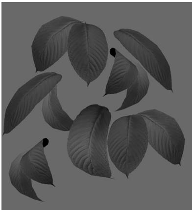


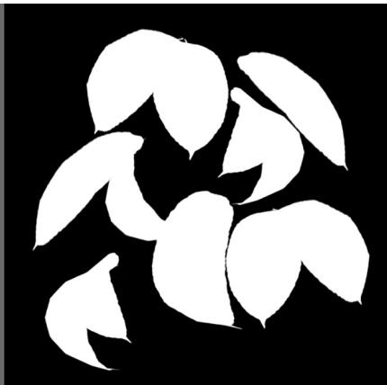


Figure 20.14. Leaf texture.


when being drawn into the back buffer (i.e., based on the distance to the player’s eye). This is for consistency; the geometry the eye sees should be the same that the light sees. That being said, if the tessellated geometry is not displaced too much, the displacement might not even be noticeable in the shadows; therefore, a possible optimization may be not to tessellate the geometry when rendering the shadow map. This optimization trades accuracy for speed. 

# 20.4.5 The Shadow Factor

The shadow factor is a new factor we add to the lighting equation. The shadow factor is a scalar in the range 0 to 1. A value of 0 indicates a point is in shadow, and a value of 1 indicates a point is not in shadow. With PCF (§20.4.3), a point can also be partially in shadow, in which case the shadow factor will be between 0 and 1. The CalcShadowFactor implementation is in Common.hlsl. 

float CalcShadowFactor(float4 shadowPosH)   
{ Texture2D gShadowMap $=$ ResourceDescriptorHeap[gSunShadowMapIndex]; // Complete projection by doing division by w. shadowPosH.xyz $\equiv$ shadowPosH.w; // Depth in NDC space. float depth $=$ shadowPosH.z; uint width, height, numMips; gShadowMap.GetDimensions(0, width, height, numMips); //Texel size. float dx $= 1.0f$ / (float)width; float percentLit $= 0.0f$ const float2 offsets[9] $=$ { float2(-dx,-dx)，float2(0.0f，-dx)，float2(dx，-dx)， float2(-dx，0.0f)，float2(0.0f，0.0f)，float2(dx，0.0f)， float2(-dx，+dx)，float2(0.0f，+dx)，float2(dx，+dx) }; [unroll] for(int i $= 0$ ;i<9；++i) { percentLit $+ =$ gShadowMapSAMPLECmpLevelZero(GetShadowSampler(), shadowPosH.xy + offsets[i], depth).r; } return percentLit/9.0f; 

In our model, the shadow factor will be multiplied against the direct lighting (diffuse and specular) terms: 

// Only the first light casts a shadow. float3 shadowFactor $=$ float3(1.0f, 1.0f, 1.0f); if( gShadowsEnabled ) { shadowFactor[0] $=$ CalcShadowFactor(pin.ShadowPosH); } const float shininess $=$ glossHeightAo.x \* (1.0f - roughness); Material mat $=$ { diffuseAlbedo, fresnelR0, shininess }; float4 directLight $=$ ComputeLighting(gLights, mat, pin(PosW, bumpedNormalW,toEyeW,shadowFactor); float4 ComputeLighting(Light gLights[MaxLights],Material mat, float3 pos, float3 normal, float3 toEye, float3 shadowFactor) { float3 result $= 0$ .0f; int i $= 0$ for(i $= 0$ ;i $<$ gNumDirLights; ++i) { result $+ =$ shadowFactor[i] \* ComputeDirectionalLight( gLights[i],mat,normal,toEye); } for(i $=$ gNumDirLights; i $<$ gNumDirLights+gNumPointLights; ++i) { result $+ =$ ComputePointLight(gLights[i],mat,pos,normal, toEye); } for(i $=$ gNumDirLights + gNumPointLights; i < gNumDirLights + gNumPointLights + gNumSpotLights; ++i) { result $+ =$ ComputeSpotLight(gLights[i],mat,pos,normal, toEye); } return float4(result,0.0f); } 

The shadow factor does not affect ambient light since that is indirect light, and it also does not affect reflective light coming from the environment map. 

# 20.4.6 The Shadow Map Test

After we have built the shadow map by rendering the scene from the perspective of the light, we can sample the shadow map in our main rendering pass to determine if a pixel is in shadow or not. The key issue is computing $d ( p )$ and $s ( \boldsymbol p )$ for each pixel $\boldsymbol { p }$ . The value $d ( p )$ is found by transforming the point to the NDC space of the light; then the $z$ -coordinate gives the normalized depth value of the point from the light source. The value $s ( \boldsymbol p )$ is found by projecting the shadow map onto the scene through the light’s view volume using projective texturing. Note that with this setup, both $d ( p )$ and $s ( \boldsymbol p )$ are measured in the NDC space of the light, so they can be compared. The transformation matrix gShadowTransform transforms from world space to the shadow map texture space (§20.3). 

```cpp
struct VertexOut
{
    float4 PosH : SV POSITION;
    float4 ShadowPosH : POSITION0;
    float4 SsaoPosH : POSITION1;
    float3 PosW : POSITION2;
    float3 NormalW : NORMAL;
    float3 TangentW : TANGENT;
    float2 TexC : TEXCOORD;
};
// In vertex shader
if( gShadowsEnabled )
{
    // Generate projective tex-coords to project shadow map onto scene.
    vout.ShadowPosH = mul(posW, gShadowTransform);
}
};
// In pixel shader
float3 shadowFactor = float3(1.0f, 1.0f, 1.0f);
if( gShadowsEnabled )
{
    shadowFactor[0] = CalcShadowFactor(pin.ShadowPosH);
} 
```

The gShadowTransform matrix is stored as a per-pass constant. 

# 20.4.7 Rendering the Shadow Map

For this demo, we also render the shadow map onto a quad that occupies the lower-right corner of the screen. This allows us to see what the shadow map looks like for each frame. Recall that the shadow map is just a depth buffer texture and we can create an SRV to it so that it can be sampled in a shader program. The shadow map is rendered as a grayscale image since it stores a one-dimensional 

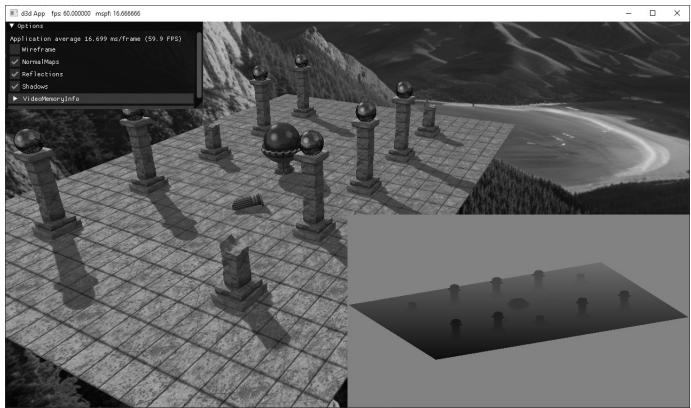


Figure 20.15. Screenshot of the shadow map demo.


value at each pixel (a depth value). Figure 20.15 shows a screenshot of the “Shadow Map” demo. 

# 20.5 LARGE PCF KERNELS

In this section, we discuss problem occurs when using a large PCF kernel. Our demos do not use a large PCF kernel, so this section is in some sense optional, but it introduces some interesting ideas. 

Refer to Figure 20.16, where we are computing the shadow test for a pixel $\boldsymbol { p }$ visible by the eye. With no PCF, we compute the distance $d = d ( p )$ of and compare it to the corresponding shadow map value $s _ { 0 } = s ( \boldsymbol { p } )$ . With PCF, we also compare neighboring shadow map values $s _ { - 1 }$ and $s _ { 1 }$ against $d .$ . However, it is not valid to compare $d$ with $s _ { - 1 }$ and $s _ { 1 }$ . The texels $s _ { - 1 }$ and $s _ { 1 }$ describe the depths of different areas of the scene that may or may not be on the same polygon as $\boldsymbol { p }$ . 

The scenario in Figure 20.16 actually results in an error in the PCF. Specifically, when we do the shadow map test we compute: 

$$
l i t _ {0} = d \leq s _ {0} (t r u e)
$$

$$
l i t _ {- 1} = d \leq s _ {- 1} (t r u e)
$$

$$
l i t _ {1} = d \leq s _ {1} (f a l s e)
$$

When the results are interpolated, we get that $\boldsymbol { p }$ is is $1 / 3 ^ { \mathrm { r d } }$ in shadow, which is incorrect as nothing is occluding $\boldsymbol { p }$ . 

Observe from Figure 20.16 that more depth biasing would fix the error. However, in this example, we are only sampling the next door neighbor texels in the shadow map. If we widen the PCF kernel, then even more biasing is needed. 

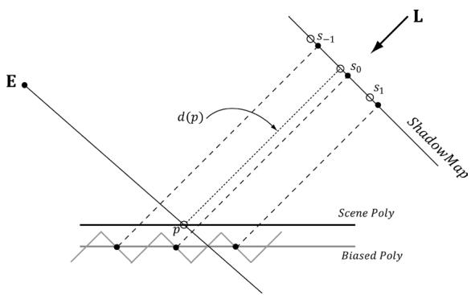


Figure 20.16. Comparing the depth $d ( p )$ with $s _ { 0 }$ is correct, since the texel $s _ { 0 }$ covers the scene area $\boldsymbol { p }$ is contained in. However, it is not correct to compare $d ( p )$ with $s _ { - 1 }$ and $s _ { \uparrow }$ , as those texels cover areas of the scene that are unrelated to $\boldsymbol { p }$ .


Thus for small PCF kernels, simply doing the depth bias as explained in $\ S 2 0 . 4 . 2$ is enough to counter this problem and it is nothing to worry about. But for large PCF kernels such as $5 \times 5$ or $9 \times 9$ , which are used to make soft shadows, this can become a real problem. 

# 20.5.1 The DDX and DDY Functions

Before we can look at an approximate solution to this problem, we first need to discuss the ddx and ddy HLSL functions. These functions estimate ${ \hat { c } } { \bf p } / { \hat { c } } x$ and ${ \hat { c } } { \bf p } / { \hat { c } } y$ , respectively, where $x$ is the screen space $x$ -axis and $\boldsymbol { y }$ is the screen space $\boldsymbol { y }$ -axis. With these functions you can determine how per pixel quantities p vary from pixel to pixel. Examples of what the derivative functions could be used for: 

1. Estimate how colors are changing pixel by pixel. 

2. Estimate how depths are changing pixel by pixel. 

3. Estimate how normals are changing pixel by pixel. 

How the hardware estimates these partial derivatives is not complicated. The hardware processes pixels in $2 \times 2$ quads at a time in parallel. Then the partial derivative in the $x$ -direction can be estimated by the forward difference equation $q _ { x + 1 , y } - q _ { x , y }$ (estimates how the quantity $q$ changes from pixel $( x , y )$ to pixel $( x + 1 ,$ y)), and similarly for the partial derivative in the y direction. 

# 20.5.2 Solution to the Large PCF Kernel Problem

The solution we describe is from [Tuft10]. The strategy is to make the assumption the neighboring pixels of $\boldsymbol { p }$ lie on the same plane as $\boldsymbol { p }$ . This assumption is not always true, but it is the best we have to work with. 

Let $\mathbf { p } = \left( u , ~ \nu , ~ z \right)$ be the coordinates in light space. The coordinates $\textstyle ( u , \nu )$ are used to index into the shadow map, and the value $z$ is the distance from the light source used in the shadow map test. We can compute the vectors $\begin{array} { r } { \frac { { \hat { \sigma } } \mathbf { p } } { { \hat { \sigma } } x } = \left( \frac { { \hat { \sigma } } u } { { \hat { \sigma } } x } , \frac { { \hat { \sigma } } \nu } { { \hat { \sigma } } x } , \frac { { \hat { \sigma } } z } { { \hat { \sigma } } x } \right) } \end{array}$ and $\begin{array} { r } { \frac { { \hat { \sigma } } \mathbf { p } } { \hat { \sigma } y } = \left( \frac { \hat { \sigma } u } { \hat { \sigma } y } , \frac { \hat { \sigma } \nu } { \hat { \sigma } y } , \frac { \hat { \sigma } z } { \hat { \sigma } y } \right) } \end{array}$ , with ddx and ddy, which lie in the tangent plane of the polygon. This tells us how we move in light space when we move in screen space. In particular, if we move $( \Delta x , \Delta y )$ units in screen space, we move $\begin{array} { r } { \Delta x \Big ( \frac { \hat { \sigma } u } { \hat { \sigma } x } , \frac { \hat { \sigma } \nu } { \hat { \sigma } x } , \frac { \hat { \sigma } z } { \hat { \sigma } x } \Big ) + \Delta y \Big ( \frac { \hat { \sigma } u } { \hat { \sigma } y } , \frac { \hat { \sigma } \nu } { \hat { \sigma } y } , \frac { \hat { \sigma } z } { \hat { \sigma } y } \Big ) } \end{array}$ units in light space in the directions of the tangent vectors. Ignoring the depth term for the moment, if we move $( \Delta x , \Delta y )$ units in screen space, we move $\begin{array} { r } { \Delta x \Big ( \frac { \hat { \sigma } u } { \hat { \sigma } x } , \frac { \hat { \sigma } \nu } { \hat { \sigma } x } \Big ) + \Delta y \Big ( \frac { \hat { \sigma } u } { \hat { \sigma } y } , \frac { \hat { \sigma } \nu } { \hat { \sigma } y } \Big ) } \end{array}$ units in light space on the uvplane; this can be expressed by the matrix equation: 

$$
\left[ \Delta x, \Delta y \right] \left[ \begin{array}{l l} \frac {\partial u}{\partial x} & \frac {\partial v}{\partial x} \\ \frac {\partial u}{\partial y} & \frac {\partial v}{\partial y} \end{array} \right] = \Delta x \left(\frac {\partial u}{\partial x}, \frac {\partial v}{\partial x}\right) + \Delta y \left(\frac {\partial u}{\partial y}, \frac {\partial v}{\partial y}\right) = \left[ \Delta u, \Delta v \right]
$$

Therefore, 

$$
\begin{array}{l} \left[ \Delta x, \Delta y \right] = \left[ \Delta u, \Delta v \right] \left[ \begin{array}{l l} \frac {\partial u}{\partial x} & \frac {\partial v}{\partial x} \\ \frac {\partial u}{\partial y} & \frac {\partial v}{\partial y} \end{array} \right] ^ {- 1} \tag {eq.20.1} \\ = \left[ \Delta u, \Delta v \right] \frac {1}{\frac {\partial u}{\partial x} \frac {\partial v}{\partial y} - \frac {\partial v}{\partial x} \frac {\partial u}{\partial y}} \left[ \begin{array}{c c} \frac {\partial v}{\partial y} & - \frac {\partial v}{\partial x} \\ - \frac {\partial u}{\partial y} & \frac {\partial u}{\partial x} \end{array} \right] \\ \end{array}
$$

Note: 

Recall from Chapter 2 that 

$$
\left[ \begin{array}{c c} A _ {1 1} & A _ {1 2} \\ A _ {2 1} & A _ {2 2} \end{array} \right] ^ {- 1} = \frac {1}{A _ {1 1} A _ {2 2} - A _ {1 2} A _ {2 1}} \left[ \begin{array}{c c} A _ {2 2} & - A _ {1 2} \\ - A _ {2 1} & A _ {1 1} \end{array} \right]
$$

This new equation tells us that if we move $( \Delta u , \Delta \nu )$ units in light space on the uv-plane, then we move $( \Delta x , \Delta y )$ units in screen space. So why is Equation 20.1 important to us? Well, when we build our PCF kernel, we offset our texture coordinates to sample neighboring values in the shadow map: 

// Texel size. const float dx = SMAP_DX; float percentLit $= 0.0f$ . const float2 offsets[9] $\equiv$ float2(-dx,-dx)，float2(0.0f，-dx)，float2(dx，-dx), float2(-dx,0.0f)，float2(0.0f，0.0f)，float2(dx，0.0f), float2(-dx，+dx)，float2(0.0f，+dx)，float2(dx，+dx) }； //3x3 box filter pattern. Each sample does a 4-tap PCF. [unroll] for(int i $= 0$ ;i $<  9$ ++i) { percentLit $+ =$ shadowMapSAMPLECmpLevelZero(samShadow, shadowPosH.xy $^+$ offsets[i],depth).r; } 

In other words, we know how much we are displacing in light space in the uvplane—we know $( \Delta u , \Delta \nu )$ . Equation 20.1 tells us that when we move $( \Delta u , \Delta \nu )$ units in light space we are moving $( \Delta x , \Delta y )$ in screen space. 

Now, let us return to the depth term we have been ignoring. If we move $( \Delta x , \Delta y )$ units in screen space, then the light space depth moves by $\begin{array} { r } { \Delta z = \Delta x \frac { \hat { \sigma } z } { \hat { \sigma } x } + \Delta y \frac { \hat { \sigma } z } { \hat { \sigma } y } } \end{array}$ . Thus, when we offset our texture coordinates to do the PCF, we can modify the depth value used in the depth test accordingly: $z ^ { \prime } { = } z + \Delta z$ (see Figure 20.17). 

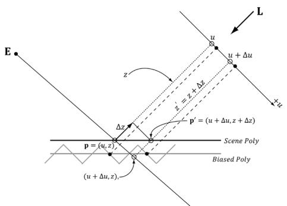


Figure 20:17. We illustrate in 2D for simplicity. If we offset from ${ \sf p } = ( u , z )$ by $\Delta u$ in the $\boldsymbol { u }$ -direction to get $( u + \Delta u , z )$ , then we need to offset by $\Delta z$ in order to remain on the polygon to get $\mathsf { p } ^ { \prime } = \left( u + \Delta u , z + \Delta z \right)$ .


Let us summarize: 

1. In our PCF implementation, we offset our texture coordinates to sample neighboring values in the shadow map. So for each sample, we know $( \Delta u , \Delta \nu )$ 

2. We can use Equation 20.1 to find the screen space offset $( \Delta x , \Delta y )$ when we offset $( \Delta u , \Delta \nu )$ units in light space. 

3. With $( \Delta x , \Delta y )$ solved for, apply $\begin{array} { r } { \Delta z = \Delta x \frac { \partial z } { \partial x } + \Delta y \frac { \partial z } { \partial y } } \end{array}$ to figure out the light space depth change. 

The “CascadedShadowMaps11” demo in the DirectX 11 SDK implements this method in the CalculateRightAndUpTexelDepthDeltas and CalculatePCFPercentLit functions. 

# 20.5.3 An Alternative Solution to the Large PCF Kernel Problem

This solution presented in [Isidoro06] is in the same spirit as the previous section, but takes a slightly different approach. 

Let ${ \bf p } = ( u , \nu , z )$ be the coordinates in light space. The coordinates $( u , \nu )$ are used to index into the shadow map, and the value $z$ is the distance from the light source used in the shadow map test. We can compute $\begin{array} { r } { \frac { { \hat { \sigma } } \mathbf { p } } { { \hat { \sigma } } x } = \left( \frac { { \hat { \sigma } } u } { { \hat { \sigma } } x } , \frac { { \hat { \sigma } } \nu } { { \hat { \sigma } } x } , \frac { { \hat { \sigma } } z } { { \hat { \sigma } } x } \right) } \end{array}$ and $\begin{array} { r } { \frac { { \hat { \sigma } } \mathbf { p } } { \hat { \sigma } y } = \left( \frac { \hat { \sigma } u } { \hat { \sigma } y } , \frac { \hat { \sigma } \nu } { \hat { \sigma } y } , \frac { \hat { \sigma } z } { \hat { \sigma } y } \right) } \end{array}$ with ddx and ddy. 

In particular, the fact that we can take these derivatives means $u = u \left( x , y \right)$ , $\nu = \nu$ $( x , y )$ and $z = z \left( x , y \right)$ are all functions of $x$ and y. However, we can also think of $z$ as a function of $u$ and $\nu$ —that is, $z = z \left( u , \nu \right)$ ; as we move in light space in the u- and $\nu$ -directions, the depth $z$ changes along the polygon plane. By the chain rule, we have: 

$$
\frac {\partial z}{\partial x} = \frac {\partial z}{\partial u} \frac {\partial u}{\partial x} + \frac {\partial z}{\partial v} \frac {\partial v}{\partial x}
$$

$$
\frac {\partial z}{\partial y} = \frac {\partial z}{\partial u} \frac {\partial u}{\partial y} + \frac {\partial z}{\partial v} \frac {\partial v}{\partial y}
$$

Or in matrix notation: 

$$
\left[ \begin{array}{l l} \frac {\partial z}{\partial x} & \frac {\partial z}{\partial y} \end{array} \right] = \left[ \begin{array}{l l} \frac {\partial z}{\partial u} & \frac {\partial z}{\partial v} \end{array} \right] \left[ \begin{array}{l l} \frac {\partial u}{\partial x} & \frac {\partial u}{\partial y} \\ \frac {\partial v}{\partial x} & \frac {\partial v}{\partial y} \end{array} \right]
$$

Taking the inverse yields: 

$$
\begin{array}{l} \left[ \begin{array}{c c} \frac {\partial z}{\partial u} & \frac {\partial z}{\partial \nu} \end{array} \right] = \left[ \begin{array}{c c} \frac {\partial z}{\partial x} & \frac {\partial z}{\partial y} \end{array} \right] \left[ \begin{array}{c c} \frac {\partial u}{\partial x} & \frac {\partial u}{\partial y} \\ \frac {\partial \nu}{\partial x} & \frac {\partial \nu}{\partial y} \end{array} \right] ^ {- 1} \\ = \frac {\left[ \frac {\partial z}{\partial x} \quad \frac {\partial z}{\partial y} \right]}{\frac {\partial u}{\partial x} \frac {\partial v}{\partial y} - \frac {\partial u}{\partial y} \frac {\partial v}{\partial x}} \left[ \begin{array}{c c} \frac {\partial v}{\partial y} & - \frac {\partial u}{\partial y} \\ - \frac {\partial v}{\partial x} & \frac {\partial u}{\partial x} \end{array} \right] \\ \end{array}
$$

We now have solved for $\begin{array} { r } { \frac { \hat { \sigma } z } { \hat { \sigma } u } } \end{array}$ and $\frac { \hat { \sigma } z } { \hat { \sigma } \nu }$ directly (everything on the right-side of the equation is known). If we move $( \Delta u , \Delta \nu )$ units in light space on the uv-plane, then the light space depth moves by $\begin{array} { r } { \Delta z = \Delta u \frac { \partial z } { \partial u } + \Delta \nu \frac { \partial z } { \partial \nu } } \end{array}$ . 

So with this approach, we do not have to transform to screen space, but can stay in light space—the reason being that we figured out directly how depth changes when $u$ and $\nu$ change, whereas in the previous section, we only knew how depth changed when $x$ and y changed in screen space. 

# 20.6 SUMMARY

1. The back buffer need not always be the render target; we can render to a different texture. Rendering to texture provides an efficient way for the GPU to update the contents of a texture at runtime. After we have rendered to a texture, we can bind the texture as a shader input and map it onto geometry. Many special effects require render to texture functionality like shadow maps, water simulations, and general purpose GPU programming. 

2. With an orthographic projection, the viewing volume is a box (see Figure 20.1) with width $w$ , height $h _ { \ast }$ , near plane n and far plane f, and the lines of projection are parallel to the view space $z$ -axis. Such projections are primarily used in 3D science or engineering applications, where it is desirable to have parallel lines remain parallel after projection. However, we can use orthographic projections to model shadows that parallel lights generate. 

3. Projective texturing is so called because it allows us to project a texture onto arbitrary geometry, much like a slide projector. The key to projective texturing 

is to generate texture coordinates for each pixel in such a way that the applied texture looks like it has been projected onto the geometry. Such texture coordinates are called projective texture coordinates. We obtain the projective texture coordinates for a pixel by projecting it onto the projection plane of the projector, and then mapping it to the texture coordinate system. 

4. Shadow mapping is a real-time shadowing technique, which shadows arbitrary geometry (it is not limited to planar shadows). The idea of shadow mapping is to render the depth of the scene from the light’s viewpoint into a shadow map; thus, after which, the shadow map stores the depth of all pixels visible from the light’s perspective. We then render the scene again from the camera’s perspective, and we project the shadow map onto the scene using projective texturing. Let $s ( \boldsymbol p )$ be the depth value projected onto a pixel $\boldsymbol { p }$ from the shadow map and let $d ( p )$ be the depth of the pixel from the light source. Then $\boldsymbol { p }$ is in shadow if $d ( p ) > s ( p )$ ; that is, if the depth of the pixel is greater than the projected pixel depth $s ( \boldsymbol p )$ , then there must exist a pixel closer to the light which occludes $\boldsymbol { p }$ , thereby casting $\boldsymbol { p }$ in shadow. 

5. Aliasing is the biggest challenge with shadow maps. The shadow map stores the depth of the nearest visible pixels with respect to its associated light source. However, the shadow map only has some finite resolution. So each shadow map texel corresponds to an area of the scene. Thus, the shadow map is just a discrete sampling of the scene depth from the light perspective. This causes aliasing issues known as shadow acne. Using the graphics hardware intrinsic support for slope-scaled-bias (in the rasterization render state) is a common strategy to fix shadow acne. The finite resolution of the shadow map also causes aliasing at the shadow edges. PCF is a popular solution to this. More advanced solutions utilized for the aliasing problem are cascaded shadow maps and variance shadow maps. 

# 20.7 EXERCISES

1. Write a program that simulates a slide projector by projecting a texture onto the scene. Experiment with both perspective and orthographic projections. 

2. Modify the solution to the previous exercise by using texture address modes so that points outside the projector’s frustum do not receive light. 

3. Modify the solution to Exercise 1 by using a spotlight so that points outside the spotlight cone do not receive any light from the projector. 

4. Modify this chapter’s demo application by using a perspective projection. Note that the slope-scaled-bias that worked for an orthographic projection might not work well for a perspective projection. When using a perspective projection, notice that the depth map is heavily biased to white (1.0). Does this make sense considering the graph in Figure 5.25? 

5. Experiment with the following shadow map resolutions: $4 0 9 6 \times 4 0 9 6 , 1 0 2 4 \times$ 1024, 512 × 512, 256 × 256. 

6. Derive the matrix that maps the box $[ l , r ] \times [ b , t ] \ [ n , f ]  [ - 1 , 1 ] \times [ - 1 , 1 ] \times$ [0, 1]. This is an “off center” orthographic view volume (i.e., the box is not centered about the view space origin). In contrast, the orthographic projection matrix derived in $\ S 2 0 . 2$ is an “on center” orthographic view volume. 

7. In Chapter 17 we learned about picking with a perspective projection matrix. Derive picking formulas for an off-centered orthographic projection. 

8. Modify the “Shadow Demo” to use a single point sampling shadow test (i.e., no PCF). You should observe hard shadows and jagged shadow edges. 

9. Turn off the slope-scaled-bias to observe shadow acne. 

10. Modify the slope-scaled-bias to have a very large bias to observe the peterpanning artifact. 

11. An orthographic projection can be used to generate the shadow map for directional lights, and a perspective projection can be used to generate the shadow map for spotlights. Explain how cube maps and six $9 0 ^ { \circ }$ field of view perspective projections can be used to generate the shadow map for a point light. (Hint: Recall how dynamic cube maps were generated in Chapter 18.) Explain how the shadow map test would be done with a cube map. 

12. The shadow map generation shader only requires the vertex position, and optionally the texture coordinates if there is an alpha mask. However, we supply the same vertex data we do in our main draw pass. This works but wastes memory bandwidth. The GPU will read cache lines of data at a time which will include the normal, tangent vector, and other vertex data the shader does not need. Optimize this by splitting the vertex attributes across multiple vertex buffer slots; see Exercise 2 in Chapter 6. You can take it a step further by also splitting the position and texture coordinates, and only provide the texture coordinates to the shadow map generation pass if the geometry is alpha tested. 