# 22 Quaternions Chapter

In Chapter 1, we introduced a new class of mathematical objects called vectors. In particular, we learned that a 3D vector consists of an ordered 3-tuple of real numbers, and we defined operators on vectors that are useful geometrically. Likewise, in Chapter 2 we introduced matrices, which are rectangular tables of real numbers with operations defined on them that are useful; for example, we saw how matrices can represent linear and affine transformations, and how matrix multiplication corresponds to transformation composition. In this chapter, we learn about another type of mathematical objects called quaternions. We will see that a unit quaternion can be used to represent a 3D rotation, and has convenient interpolation properties. For readers looking for a comprehensive treatment of quaternions (and rotations), we like the book devoted to the topic by [Kuipers99]. 

# Chapter Objectives:

1. To review the complex numbers and recall how complex number multiplication performs a rotation in the plane. 

2. To obtain an understanding of quaternions and the operations defined on them. 

3. To discover how the set of unit quaternions represent 3D rotations. 

4. To find out how to convert between the various rotation representations. 

5. To learn how to interpolate between unit quaternions, and understand that this is geometrically equivalent to interpolating between 3D orientations. 

6. To become familiar with the DirectX Math library’s quaternion functions and classes. 

# 22.1 REVIEW OF THE COMPLEX NUMBERS

The quaternions can be viewed as a generalization of the complex numbers; this motivates us to study complex numbers before quaternions. In particular, our main goal in this section is to show that multiplying a complex number p (thought of as a 2D vector or point) by a unit complex number results in a rotation of p. We will then show in $\ S 2 2 . 3$ that a special quaternion product involving a unit quaternion results in a 3D rotation of a vector or point p. 

# 22.1.1 Definitions

There are different ways to introduce complex numbers. We introduce them in such a way that they immediately cause us to think of complex numbers as 2D points or vectors. 

An ordered pair of real numbers $\mathbf { z } = ( a , b )$ is a complex number. The first component is called the real part and the second component is called the imaginary part. Moreover, equality, addition, subtraction, multiplication and division are defined as follows: 

1. $( a , b ) = ( c , d )$ if and only if $\alpha = c$ and $b = d$ . 

2. $( a , b ) \pm ( c , d ) = ( a \pm c , b \pm d )$ . 

3. $( a , b ) ( c , d ) = ( a c - b d , a d + b c )$ . 

4. ${ \frac { \left( a , b \right) } { \left( c , d \right) } } = \left( { \frac { a c + b d } { c ^ { 2 } + d ^ { 2 } } } , { \frac { b c - a d } { c ^ { 2 } + d ^ { 2 } } } \right) { \mathrm { i f } } \ ( c , d ) \neq ( 0 , 0 ) .$ 

It is easy to verify that the usual arithmetic properties of real numbers also hold for complex arithmetic (e.g., commutativity, associativity, distributive laws); see Exercise 1. 

If a complex number is of the form $( x , 0 )$ , then it is customary to identify it by the real number $x$ and write $x = ( x , 0 )$ ; thus any real number can be thought of as a complex number with a zero imaginary component. Observe then that a real number times a complex number is given by $x ( a , b ) = ( x , 0 ) ( a , b ) = ( x a , x b ) = ( a , b )$ $( x , 0 ) = ( a , b ) x ,$ which is reminiscent of scalar-vector multiplication. 

We define the imaginary unit $i = ( 0 , 1 )$ . Using our definition of complex multiplication, observe that $i ^ { 2 } = ( 0 , 1 ) ( 0 , 1 ) = ( - 1 , 0 ) = - 1$ , which implies $i = \sqrt { - 1 }$ . This tells us that $i$ solves the equation $x ^ { 2 } = - 1$ . 

The complex conjugate of a complex number $\mathbf { z } = ( a , b )$ is denoted by $\overline { { \mathbf { z } } }$ and given by $\overline { { \mathbf { z } } } = \left( a , - b \right)$ . A simple way to remember the complex division formula is to multiply the numerator and denominator by the conjugate of the denominator so that the denominator becomes a real number: 

$$
\frac {(a , b)}{(c , d)} = \frac {(a , b)}{(c , d)} \frac {(c , - d)}{(c , - d)} = \frac {(a c + b d , b c - a d)}{c ^ {2} + d ^ {2}} = \left(\frac {a c + b d}{c ^ {2} + d ^ {2}}, \frac {b c - a d}{c ^ {2} + d ^ {2}}\right)
$$

Next, we show that a complex number $( a , b )$ can be written in the form $a + i b$ . We have $a = ( a , 0 )$ , $b = ( b , 0 )$ and $i = ( 0 , 1 )$ , so 

$$
a + i b = (a, 0) + (0, 1) (b, 0) = (a, 0) + (0, b) = (a, b)
$$

Using the form $\textit { a } + i \textit { b }$ , we can recast the formulas for addition, subtraction, multiplication and division as follows: 

1. $a + i b \pm c + i d = ( a \pm c ) + i ( b \pm d ) .$ 

2. $( a + i b ) ( c + i d ) = ( a c - b d ) + i ( a d + b c ) .$ 

3. $\frac { a + i b } { c + i d } = \frac { a c + b d } { c ^ { 2 } + d ^ { 2 } } + i \frac { b c - a d } { c ^ { 2 } + d ^ { 2 } } \mathrm { i f } \left( c , d \right) \neq \left( 0 , 0 \right) .$ 

Furthermore, in this form, the complex conjugate of $\mathbf { z } = { \boldsymbol { a } } + i { \boldsymbol { b } }$ is given by ${ \overline { { \mathbf { z } } } } = a - i b$ . 

# 22.1.2 Geometric Interpretation

The ordered pair form $a + i b = ( a , b )$ of a complex number naturally suggests that we think of a complex number geometrically as a 2D point or vector in the complex plane. In fact, our definition of complex number addition matches our definition of vector addition; see Figure 22.1. We will give a geometric interpretation to complex number multiplication in the next section. 

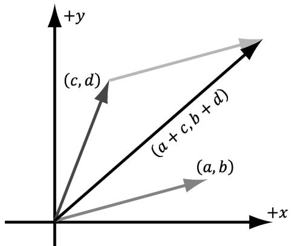


Figure 22.1. Complex addition is reminiscent of vector addition in the plane.


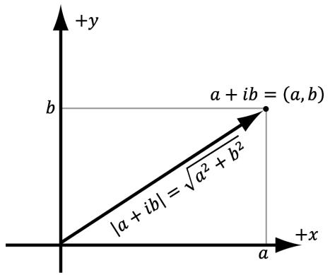


Figure 22.2. The magnitude of a complex number.


The absolute value, or magnitude, of the complex number $a + i b$ is defined as the length of the vector it represents (Figure 22.2), which we know is given by: 

$$
\left| a + i b \right| = \sqrt {a ^ {2} + b ^ {2}}
$$

We say that a complex number is a unit complex number if it has a magnitude of one. 

# 22.1.3 Polar Representation and Rotations

Because complex numbers can be viewed as just points or vectors in the 2D complex plane, we can just as well express their components using polar coordinates (see Figure 22.3): 

$$
\begin{array}{l} r = \left| a + i b \right| \\ a + i b = r \cos \theta + i r \sin \theta = r (\cos \theta + i \sin \theta) \\ \end{array}
$$

The right-hand-side of the equation is called the polar representation of the complex number $a + i b$ . 

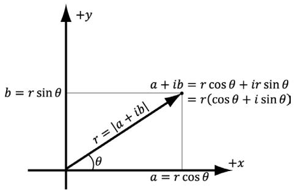


Figure 22.3. Polar representation of a complex number.


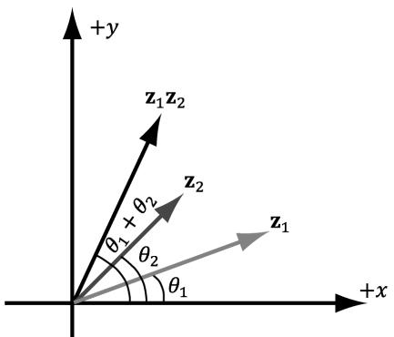


Figure 22.4. $\begin{array} { r } { \mathbf z _ { 1 } = r _ { 1 } ( \cos \theta _ { 1 } + i \sin \theta _ { 1 } , } \end{array}$ ), ${ \bf z } _ { 2 } = ( \cos \theta _ { 2 } + i \sin \theta _ { 2 } )$ . The product ${ \bf z } _ { 1 } { \bf z } _ { 2 }$ rotates $\mathbf { z } _ { 1 }$ by the angle $\theta _ { 2 }$ .


Let us multiply two complex numbers in polar form. Let ${ \bf z } _ { 1 } = r _ { 1 } ( \cos \theta _ { \scriptscriptstyle 1 } + i \sin \theta _ { \scriptscriptstyle 1 } )$ and $\mathbf z _ { 2 } = r _ { 2 } ( \cos \theta _ { 2 } + i \sin \theta _ { 2 } )$ . Then 

$$
\begin{array}{l} \mathbf {z} _ {1} \mathbf {z} _ {2} = r _ {1} r _ {2} (\cos \theta_ {1} \cos \theta_ {2} - \sin \theta_ {1} \sin \theta_ {2} + i (\cos \theta_ {1} \sin \theta_ {2} + \sin \theta_ {1} \cos \theta_ {2})) \\ = r _ {1} r _ {2} \left(\cos \left(\theta_ {1} + \theta_ {2}\right) + i \sin \left(\theta_ {1} + \theta_ {2}\right)\right) \\ \end{array}
$$

where we employed the trigonometric identities 

$$
\sin (\alpha + \beta) = \sin \alpha \cos \beta + \cos \alpha \sin \beta
$$

$$
\cos (\alpha + \beta) = \cos \alpha \cos \beta - \sin \alpha \sin \beta
$$

Thus, geometrically, the product ${ \bf z } _ { 1 } { \bf z } _ { 2 }$ is the complex number representing the vector with magnitude $r _ { 1 } r _ { 2 }$ and which makes an angle $\theta _ { 1 } + \theta _ { 2 }$ with the real axis. In particular, if $r _ { 2 } = 1$ , then $\mathbf { z } _ { 1 } \mathbf { z } _ { 2 } = r _ { 1 } ( \cos ( \theta _ { 1 } + \theta _ { 2 } ) + i \sin ( \theta _ { 1 } + \theta _ { 2 } ) )$ , which, geometrically, rotates $\mathbf { z } _ { 1 }$ by the angle $\theta _ { 2 }$ ; see Figure 22.4. Therefore, multiplying $^ a$ complex number $\mathbf { z } _ { 1 }$ (thought of as a 2D vector or point) by a unit complex number $\mathbf { z } _ { 2 }$ results in a rotation of ${ \bf \dot { z } } _ { 1 }$ . 

# 22.2 QUATERNION ALGEBRA

# 22.2.1 Definition and Basic Operations

An ordered 4-tuple of real numbers $\mathbf { q } = ( x , y , z , w ) = ( q _ { 1 } , q _ { 2 } , q _ { 3 } , q _ { 4 } )$ is a quaternion. This is commonly abbreviated as $\mathbf { q } = ( \mathbf { u } , \boldsymbol { w } ) = ( x , y , z , w )$ , and we call ${ \bf u } =$ $( x , y , z )$ the imaginary vector part and $w$ the real part. Moreover, equality, addition, subtraction, multiplication, and division are defined as follows: 

1. $( { \mathbf { u } } , a ) = ( { \mathbf { v } } , b )$ if and only if $\mathbf { u } = \mathbf { v }$ and $a = b$ 

2. $( \mathbf { u } , a ) \pm ( \mathbf { v } , b ) = ( \mathbf { u } \pm \mathbf { v } , a \pm b )$ 

3. $( \mathbf { u } , a ) ( \mathbf { v } , b ) = ( a \mathbf { v } + b \mathbf { u } + \mathbf { u } \times \mathbf { v } , a b - \mathbf { u } \cdot \mathbf { v } )$ 

The definition of multiplication may seem “weird,” but these operations are definitions, so we can define them however we want—and this definition turns out to be useful. The definition of matrix multiplication may have seemed weird at first, but it turned out to be useful. 

Let $\mathbf { p } = ( \mathbf { u } , p _ { 4 } ) = ( p _ { 1 } , p _ { 2 } , p _ { 3 } , p _ { 4 } )$ and $\begin{array} { r } { \mathbf q = ( \mathbf v , q _ { 4 } ) = ( q _ { 1 } , q _ { 2 } , q _ { 3 } , q _ { 4 } ) } \end{array}$ . Then $\mathbf { u } \times \mathbf { v } { } = ( p _ { 2 } q _ { 3 } -$ $p _ { 3 } q _ { 2 } , p _ { 3 } q _ { 1 } - p _ { 1 } q _ { 3 } , p _ { 1 } q _ { 2 } - p _ { 2 } q _ { 1 } )$ and $\mathbf { u \cdot v } = p _ { 1 } q _ { 1 } + p _ { 2 } q _ { 2 } + p _ { 3 } q _ { 3 }$ . Now, in component form, the quaternion product $\mathbf { r } = \mathbf { p q }$ takes on the form: 

$$
\begin{array}{l} r _ {1} = p _ {4} q _ {1} + q _ {4} p _ {1} + p _ {2} q _ {3} - p _ {3} q _ {2} = q _ {1} p _ {4} - q _ {2} p _ {3} + q _ {3} p _ {2} + q _ {4} p _ {1} \\ r _ {2} = p _ {4} q _ {2} + q _ {4} p _ {2} + p _ {3} q _ {1} - p _ {1} q _ {3} = q _ {1} p _ {3} + q _ {2} p _ {4} - q _ {3} p _ {1} + q _ {4} p _ {2} \\ r _ {3} = p _ {4} q _ {3} + q _ {4} p _ {3} + p _ {1} q _ {2} - p _ {2} q _ {1} = - q _ {1} p _ {2} + q _ {2} p _ {1} + q _ {3} p _ {4} + q _ {4} p _ {3} \\ r _ {4} = p _ {4} q _ {4} - p _ {1} q _ {1} - p _ {2} q _ {2} - p _ {3} q _ {3} = - q _ {1} p _ {1} - q _ {2} p _ {2} - q _ {3} p _ {3} + q _ {4} p _ {4} \\ \end{array}
$$

This can be written as a matrix product: 

$$
\mathbf {p q} = \left[ \begin{array}{c c c c} p _ {4} & - p _ {3} & p _ {2} & p _ {1} \\ p _ {3} & p _ {4} & - p _ {1} & p _ {2} \\ - p _ {2} & p _ {1} & p _ {4} & p _ {3} \\ - p _ {1} & - p _ {2} & - p _ {3} & p _ {4} \end{array} \right] \left[ \begin{array}{l} q _ {1} \\ q _ {2} \\ q _ {3} \\ q _ {4} \end{array} \right]
$$

Note: 

If you prefer row vector-matrix multiplication, simply take the transpose: 

$$
\left(\left[ \begin{array}{c c c c} p _ {4} & - p _ {3} & p _ {2} & p _ {1} \\ p _ {3} & p _ {4} & - p _ {1} & p _ {2} \\ - p _ {2} & p _ {1} & p _ {4} & p _ {3} \\ - p _ {1} & - p _ {2} & - p _ {3} & p _ {4} \end{array} \right] \left[ \begin{array}{l} q _ {1} \\ q _ {2} \\ q _ {3} \\ q _ {4} \end{array} \right]\right) ^ {T} = \left[ \begin{array}{l} q _ {1} \\ q _ {2} \\ q _ {3} \\ q _ {4} \end{array} \right] ^ {T} \left[ \begin{array}{l l l l} p _ {4} & - p _ {3} & p _ {2} & p _ {1} \\ p _ {3} & p _ {4} & - p _ {1} & p _ {2} \\ - p _ {2} & p _ {1} & p _ {4} & p _ {3} \\ - p _ {1} & - p _ {2} & - p _ {3} & p _ {\cdot 4} \end{array} \right] ^ {T}
$$

# 22.2.2 Special Products

Let $\mathbf { i } = ( 1 , 0 , 0 , 0 )$ , ${ \bf j } = ( 0 , 1 , 0 , 0 )$ , $\mathbf { k } = ( 0 , 0 , 1 , 0 )$ be quaternions. Then we have the special products, some of which are reminiscent of the behavior of the cross product: 

$$
\begin{array}{l} \mathbf {i} ^ {2} = \mathbf {j} ^ {2} = \mathbf {k} ^ {2} = \mathbf {i j k} = - 1 \\ \mathbf {i j} = \mathbf {k} = - \mathbf {j i} \\ \mathbf {j k} = \mathbf {i} = - \mathbf {k j} \\ \mathbf {k i} = \mathbf {j} = - \mathbf {i k} \\ \end{array}
$$

These equations follow directly from our definition of quaternion multiplication. For example, 

$$
\mathbf {i j} = \left[ \begin{array}{c c c c} 0 & 0 & 0 & 1 \\ 0 & 0 & - 1 & 0 \\ 0 & 1 & 0 & 0 \\ - 1 & 0 & 0 & 0 \end{array} \right] \left[ \begin{array}{l} 0 \\ 1 \\ 0 \\ 0 \end{array} \right] = \left[ \begin{array}{l} 0 \\ 0 \\ 1 \\ 0 \end{array} \right] = \mathbf {k}
$$

# 22.2.3 Properties

Quaternion multiplication is not commutative; for instance, $\ S 2 2 . 2 . 2$ showed that ij = -ji. Quaternion multiplication is associative, however; this can be seen from the fact that quaternion multiplication can be written using matrix multiplication and matrix multiplication is associative. The quaternion $\mathbf { e } = ( 0 , 0 , 0 , 1 )$ serves as a multiplicative identity: 

$$
\mathbf {p e} = \mathbf {e p} = \left[ \begin{array}{c c c c} p _ {4} & - p _ {3} & p _ {2} & p _ {1} \\ p _ {3} & p _ {4} & - p _ {1} & p _ {2} \\ - p _ {2} & p _ {1} & p _ {4} & p _ {3} \\ - p _ {1} & - p _ {2} & - p _ {3} & p _ {4} \end{array} \right] \left[ \begin{array}{l} 0 \\ 0 \\ 0 \\ 1 \end{array} \right] = \left[ \begin{array}{c c c c} 1 & 0 & 0 & 0 \\ 0 & 1 & 0 & 0 \\ 0 & 0 & 1 & 0 \\ 0 & 0 & 0 & 1 \end{array} \right] \left[ \begin{array}{l} p _ {1} \\ p _ {2} \\ p _ {3} \\ p _ {4} \end{array} \right] = \left[ \begin{array}{l} p _ {1} \\ p _ {2} \\ p _ {3} \\ p _ {4} \end{array} \right]
$$

We also have that quaternion multiplication distributes over quaternion addition: $\mathbf { p ( q + r ) } = \mathbf { p q } + \mathbf { p r }$ and $( \mathbf { q } + \mathbf { r } ) \mathbf { p } = \mathbf { q } \mathbf { p } + \mathbf { r } \mathbf { p }$ . To see this, write the quaternion multiplication and addition in matrix form, and note that matrix multiplication distributes over matrix addition. 

# 22.2.4 Conversions

We relate real numbers, vectors (or points), and quaternions in the following way: Let $s$ be a real number and let $\mathbf { u } = ( x , y , z )$ be a vector. Then 

1. $s = ( 0 , 0 , 0 , s )$ 

2. $\mathbf { u } = ( x , y , z ) = ( \mathbf { u } , 0 ) = ( x , y , z , 0 )$ 

In other words, any real number can be thought of as a quaternion with a zero vector part, and any vector can be thought of as a quaternion with zero real part. In particular, note that for the identity quaternion, $1 = ( 0 , 0 , 0 , 1 )$ . A quaternion with zero real part is called a pure quaternion. 

Observe, using the definition of quaternion multiplication, that a real number times a quaternion is just “scalar multiplication” and it is commutative: 

$$
s \left(p _ {1}, p _ {2}, p _ {3}, p _ {4}\right) = (0, 0, 0, s) \left(p _ {1}, p _ {2}, p _ {3}, p _ {4}\right) = \left[ \begin{array}{l l l l} s & 0 & 0 & 0 \\ 0 & s & 0 & 0 \\ 0 & 0 & s & 0 \\ 0 & 0 & 0 & s \end{array} \right] \left[ \begin{array}{l} p _ {1} \\ p _ {2} \\ p _ {3} \\ p _ {4} \end{array} \right] = \left[ \begin{array}{l} s p _ {1} \\ s p _ {2} \\ s p _ {3} \\ s p _ {4} \end{array} \right]
$$

Similarly, 

$$
(p _ {1}, p _ {2}, p _ {3}, p _ {4}) s = (p _ {1}, p _ {2}, p _ {3}, p _ {4}) (0, 0, 0, s) = \left[ \begin{array}{c c c c} p _ {4} & - p _ {3} & p _ {2} & p _ {1} \\ p _ {3} & p _ {4} & - p _ {1} & p _ {2} \\ - p _ {2} & p _ {1} & p _ {4} & p _ {3} \\ - p _ {1} & - p _ {2} & - p _ {3} & p _ {4} \end{array} \right] \left[ \begin{array}{l} 0 \\ 0 \\ 0 \\ s \end{array} \right] = \left[ \begin{array}{l} s p _ {1} \\ s p _ {2} \\ s p _ {3} \\ s p _ {4} \end{array} \right]
$$

# 22.2.5 Conjugate and Norm

The conjugate of a quaternion $\mathbf { q } = ( q _ { 1 } , q _ { 2 } , q _ { 3 } , q _ { 4 } ) = ( \mathbf { u } , q _ { 4 } )$ is denoted by ${ \mathfrak { q } } ^ { * }$ and defined by 

$$
\mathbf {q} ^ {\star} = - q _ {1} - q _ {2} - q _ {3} + q _ {4} = (- \mathbf {u}, q _ {4})
$$

In other words, we just negate the imaginary vector part of the quaternion; compare this to the complex number conjugate. The conjugate has the following properties: 

1. $( \mathbf { p } \mathbf { q } ) ^ { * } = \mathbf { q } ^ { * } \mathbf { p } ^ { * }$ 

2. $( { \bf p } + { \bf q } ) ^ { * } = { \bf p } ^ { * } + { \bf q } ^ { * }$ 

3. $( \mathbf { q } ^ { * } ) ^ { * } = \mathbf { q }$ 

4. $( s \mathbf { q } ) ^ { * } = s \mathbf { q } ^ { * }$ for $s \in \mathbb R$ 

5. 

6. $\begin{array} { l } { { \bf q } + { \bf q } ^ { * } = ( { \bf u } , q _ { 4 } ) + ( - { \bf u } , q _ { 4 } ) = ( 0 , 2 q _ { 4 } ) = 2 q _ { 4 } } \\ { { \bf q } { \bf q } ^ { * } = { \bf q } \mathrm { \bf \Omega } ^ { * } { \bf q } = q _ { 1 } ^ { 2 } + q _ { 2 } ^ { 2 } + q _ { 3 } ^ { 2 } + q _ { 4 } ^ { 2 } = { \left\| { \bf u } \right\| } ^ { 2 } + q _ { 4 } ^ { 2 } } \end{array}$ 

In particular, note that ${ \bf q } + { \bf q } ^ { * }$ and $\mathbf { q q } ^ { * } = \mathbf { q } ^ { * } \mathbf { q }$ evaluate to real numbers. 

The norm (or magnitude) of a quaternion is defined by: 

$$
\left\| \mathbf {q} \right\| = \sqrt {\mathbf {q q} ^ {\star}} = \sqrt {q _ {1} ^ {2} + q _ {2} ^ {2} + q _ {3} ^ {2} + q _ {4} ^ {2}} = \sqrt {\left\| \mathbf {u} \right\| ^ {2} + q _ {4} ^ {2}}
$$

We say that a quaternion is a unit quaternion if it has a norm of one. The norm has the following properties: 

1. q q * = 

2. $\left\| \mathbf { p q } \right\| = \left\| \mathbf { p } \right\| \left\| \mathbf { q } \right\|$ 

In particular, property 2 tells us that the product of two unit quaternions is a unit quaternion; also if $\left\| \mathbf { p } \right\| = 1$ , then $\left\| \mathbf { p q } \right\| = \left\| \mathbf { \bar { q } } \right\|$ . 

The conjugate and norm properties can be derived straightforwardly from the definitions. For example, 

$$
(\mathbf {q} ^ {*}) ^ {*} = (- \mathbf {u}, q _ {4}) ^ {*} = (\mathbf {u}, q _ {4}) = \mathbf {q}
$$

$$
\begin{array}{l} \left\| \mathbf {q} ^ {\star} \right\| = \left\| (- \mathbf {u}, q _ {4}) \right\| = \sqrt {\left\| - \mathbf {u} \right\| ^ {2} + q _ {4} ^ {2}} = \sqrt {\left\| \mathbf {u} \right\| ^ {2} + q _ {4} ^ {2}} = \left\| \mathbf {q} \right\| \\ \left\| \mathbf {p q} \right\| ^ {2} = (\mathbf {p q}) (\mathbf {p q}) ^ {*} \\ = \mathbf {p q q} ^ {*} \mathbf {p} ^ {*} \\ = \mathbf {p} \| \mathbf {q} \| ^ {2} \mathbf {p} ^ {*} \\ = \mathbf {p p} ^ {\star} \| \mathbf {q} \| ^ {2} \\ = \left\| \mathbf {p} \right\| ^ {2} \left\| \mathbf {q} \right\| ^ {2} \\ \end{array}
$$

The reader ought to try and derive the other properties (see Exercises). 

# 22.2.6 Inverses

As with matrices, quaternion multiplication is not commutative, so we cannot define a division operator. (We like to reserve division only for when multiplication is commutative so that we have: $\begin{array} { r } { \frac { a } { b } = a b ^ { - 1 } = b ^ { - 1 } a . } \end{array}$ .) However, every nonzero quaternion has an inverse. (The zero quaternion has zeros for all its components.) Let $\mathbf { q } = ( q _ { 1 } , q _ { 2 } , q _ { 3 } , q _ { 4 } ) = ( \mathbf { u } , q _ { 4 } )$ be a nonzero quaternion, then the inverse is denoted by $\mathbf { q } ^ { - 1 }$ and given by: 

$$
\mathbf {q} ^ {- 1} = \frac {\mathbf {q} ^ {*}}{\| \mathbf {q} \| ^ {2}}
$$

It is easy to check that this is indeed the inverse, for we have: 

$$
\mathbf {q q} ^ {- 1} = \frac {\mathbf {q q} ^ {\star}}{\| \mathbf {q} \| ^ {2}} = \frac {\| \mathbf {q} \| ^ {2}}{\| \mathbf {q} \| ^ {2}} = 1 = (0, 0, 0, 1)
$$

$$
\mathbf {q} ^ {- 1} \mathbf {q} = \frac {\mathbf {q} ^ {*} \mathbf {q}}{\| \mathbf {q} \| ^ {2}} = \frac {\| \mathbf {q} \| ^ {2}}{\| \mathbf {q} \| ^ {2}} = 1 = (0, 0, 0, 1)
$$

Observe that if $\mathbf { q }$ is a unit quaternion, then $\left\| \mathbf { q } \right\| ^ { 2 } = 1$ and so $\mathbf { q } ^ { - 1 } = \mathbf { q } ^ { * }$ 

The following properties hold for the quaternion inverse: 

1. ( ) q q − − = 1 1 

2. $\left( \mathbf { p } \mathbf { q } \right) ^ { - 1 } = \mathbf { q } ^ { - 1 } \mathbf { p } ^ { - 1 }$ 

# 22.2.7 Polar Representation

If $\mathbf { q } = ( q _ { 1 } , q _ { 2 } , q _ { 3 } , q _ { 4 } ) = ( \mathbf { u } , q _ { 4 } )$ is a unit quaternion, then 

$$
\left\| \mathbf {q} \right\| ^ {2} = \left\| \mathbf {u} \right\| ^ {2} + q _ {4} ^ {2} = 1
$$

This implies $q _ { 4 } ^ { 2 } \leq 1 \Leftrightarrow \left| q _ { 4 } \right| \leq 1 \Leftrightarrow - 1 \leq q _ { 4 } \leq 1$ . Figure 22.5 shows there exists an angle $\theta \in [ 0 , \pi ]$ such that $q _ { 4 } = \cos \theta$ .  Employing the trigonometric identity $\sin ^ { 2 } { \theta } + \cos ^ { 2 } { \theta } = 1 ,$ we have that 

$$
\sin^ {2} \theta = 1 - \cos^ {2} \theta = 1 - q _ {4} ^ {2} = \| \mathbf {u} \| ^ {2}
$$

This implies 

$$
\left\| \mathbf {u} \right\| = \left| \sin \theta \right| = \sin \theta \text {f o r} \theta \in [ 0, \pi ]
$$

Note that the graph of sin $\theta$ is positive for $\theta \in [ 0 , \pi ]$ , which is why |sin $\theta | = \sin \theta$ for for $\theta \in [ 0 , \pi ]$ . 

Now label the unit vector in the same direction as u by n: 

$$
\mathbf {n} = \frac {\mathbf {u}}{\| \mathbf {u} \|} = \frac {\mathbf {u}}{\sin \theta}
$$

Hence, $\mathbf { u } = \sin \theta \mathbf { n }$ and, we may therefore write the unit quaternion $\mathbf { q } = ( \mathbf { u } , \ q _ { 4 } )$ in the following polar representation, where n is a unit vector aiming in the same direction as u: 

$$
\mathbf {q} = (\sin \theta \mathbf {n}, \cos \theta) \quad f o r \theta \in [ 0, \pi ]
$$

For example, suppose we are given the quaternion $\begin{array} { r } { \mathbf q = \left( 0 , \frac { 1 } { 2 } , 0 , \frac { \sqrt { 3 } } { 2 } \right) } \end{array}$ . To convert to polar representation, we find $\begin{array} { r } { \theta = \operatorname { a r c c o s } { \frac { \sqrt { 3 } } { 2 } } = { \frac { \pi } { 6 } } } \end{array}$ , $\mathbf { n } = { \frac { \left( 0 , { \frac { 1 } { 2 } } , 0 \right) } { \sin { \frac { \pi } { 6 } } } } = ( 0 , 1 , 0 )$ . So $\begin{array} { r } { \mathbf q = ( \sin \frac { \pi } { 6 } ( 0 , 1 , 0 ) , \cos \frac { \pi } { 6 } ) } \end{array}$ . 


The restriction of $\theta \in [ 0 , \pi ]$ is for when converting a quaternion ${ \bf q } = ( q _ { 1 } , q _ { 2 } ,$ $q _ { 3 } , q _ { 4 } )$ to polar representation. That is, we need the angle restriction in order 

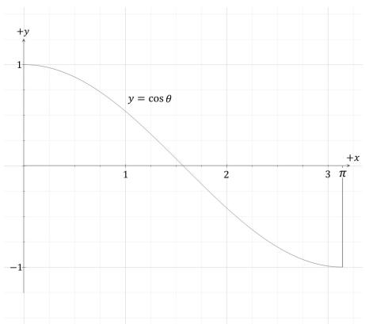


Figure 22.5. For a number y $\in [ - 1 , 1 ]$ there exists an angle $\theta$ such that y = cos θ


to associate a unique angle with the quaternion ${ \bf q } = ( q _ { 1 } , q _ { 2 } , q _ { 3 } , q _ { 4 } )$ . Nothing stops us, however, from constructing a quaternion ${ \bf q } = ( s i n \ \theta { \bf n } , c o s \ \theta )$ from any angle θ, but observe that ${ \bf q } = ( s i n ( \theta + 2 \pi n ) { \bf n } , c o s ( \theta + 2 \pi n ) )$ for all integers n. So the quaternion does not have a unique polar representation without the angle restriction $\theta \in [ 0 , \pi ]$ . 

Observe that substituting $- \theta$ for $\theta$ is equivalent to negating the vector part of the quaternion: 

$$
(\mathbf {n} \sin (- \theta), \cos (- \theta)) = (- \mathbf {n} \sin \theta , \cos \theta) = \mathbf {p} ^ {\star}
$$

In the next section we will see that n represents the axis of rotation, and so we can rotate in the other direction by negating the axis of rotation. 

# 22.3 UNIT QUATERNIONS AND ROTATIONS

# 22.3.1 Rotation Operator

Let $\mathbf { q } = ( \mathbf { u } , \boldsymbol { w } )$ be a unit quaternion and let v be a 3D point or vector. Then we can think of v as the pure quaternion $\mathbf { p } = ( \mathbf { v } , 0 )$ . Also recall that since q is a unit quaternion, we have that $\mathbf { q } ^ { - 1 } = \mathbf { q } ^ { * }$ . Recall the formula for quaternion multiplication: 

$$
(\mathbf {m}, a) (\mathbf {n}, b) = (a \mathbf {n} + b \mathbf {m} + \mathbf {m} \times \mathbf {n}, a b - \mathbf {m} \cdot \mathbf {n})
$$

Now consider the product: 

$$
\begin{array}{l} \mathbf {q p q} ^ {- 1} = \mathbf {q p q} ^ {*} \\ = (\mathbf {u}, w) (\mathbf {v}, 0) (- \mathbf {u}, w) \\ = (\mathbf {u}, w) (w \mathbf {v} - \mathbf {v} \times \mathbf {u}, \mathbf {v} \cdot \mathbf {u}) \\ \end{array}
$$

Simplifying this is a little lengthy, so we will do the real part and vector part separately. We make the symbolic substitutions: 

$$
\begin{array}{l} a = w \\ b = \mathbf {v} \cdot \mathbf {u} \\ \mathbf {m} = \mathbf {u} \\ \mathbf {n} = w \mathbf {v} - \mathbf {v} \times \mathbf {u} \\ \end{array}
$$

Real Part 

$$
\begin{array}{l} a b - \mathbf {m} \cdot \mathbf {n} \\ = w (\mathbf {v} \cdot \mathbf {u}) - \mathbf {u} \cdot (w \mathbf {v} - \mathbf {v} \times \mathbf {u}) \\ = w (\mathbf {v} \cdot \mathbf {u}) - \mathbf {u} \cdot w \mathbf {v} + \mathbf {u} \cdot (\mathbf {v} \times \mathbf {u}) \\ = w (\mathbf {v} \cdot \mathbf {u}) - w (\mathbf {v} \cdot \mathbf {u}) + 0 \\ = 0 \\ \end{array}
$$

Note that $\mathbf { u } \cdot ( \mathbf { v } \times \mathbf { u } ) = 0$ because $( \mathbf { v } \times \mathbf { u } )$ is orthogonal to u by the definition of the cross product. 

Vector Part 

$$
\begin{array}{l} a \mathbf {n} + b \mathbf {m} + \mathbf {m} \times \mathbf {n} = w (w \mathbf {v} - \mathbf {v} \times \mathbf {u}) + (\mathbf {v} \cdot \mathbf {u}) \mathbf {u} + \mathbf {u} \times (w \mathbf {v} - \mathbf {v} \times \mathbf {u}) \\ = w ^ {2} \mathbf {v} - w \mathbf {v} \times \mathbf {u} + (\mathbf {v} \cdot \mathbf {u}) \mathbf {u} + \mathbf {u} \times w \mathbf {v} + \mathbf {u} \times (\mathbf {u} \times \mathbf {v}) \\ = w ^ {2} \mathbf {v} + \mathbf {u} \times w \mathbf {v} + (\mathbf {v} \cdot \mathbf {u}) \mathbf {u} + \mathbf {u} \times w \mathbf {v} + \mathbf {u} \times (\mathbf {u} \times \mathbf {v}) \\ = w ^ {2} \mathbf {v} + 2 (\mathbf {u} \times w \mathbf {v}) + (\mathbf {v} \cdot \mathbf {u}) \mathbf {u} + \mathbf {u} \times (\mathbf {u} \times \mathbf {v}) \\ = w ^ {2} \mathbf {v} + 2 (\mathbf {u} \times w \mathbf {v}) + (\mathbf {v} \cdot \mathbf {u}) \mathbf {u} + (\mathbf {u} \cdot \mathbf {v}) \mathbf {u} - (\mathbf {u} \cdot \mathbf {u}) \mathbf {v} \\ = \left(w ^ {2} - \mathbf {u} \cdot \mathbf {u}\right) \mathbf {v} + 2 w (\mathbf {u} \times \mathbf {v}) + 2 (\mathbf {u} \cdot \mathbf {v}) \mathbf {u} \\ = \left(w ^ {2} - \mathbf {u} \cdot \mathbf {u}\right) \mathbf {v} + 2 (\mathbf {u} \cdot \mathbf {v}) \mathbf {u} + 2 w (\mathbf {u} \times \mathbf {v}) \\ \end{array}
$$

Where we applied the triple product identity $\mathbf { a } \times ( \mathbf { b } \times \mathbf { c } ) = ( \mathbf { a } \cdot \mathbf { c } ) \mathbf { b } - ( \mathbf { a } \cdot \mathbf { b } ) \mathbf { c }$ to $\mathbf { u } \times ( \mathbf { u } \times \mathbf { v } )$ . 

We have shown: 

$$
\mathbf {q p q} ^ {*} = \left(\left(w ^ {2} - \mathbf {u} \cdot \mathbf {u}\right) \mathbf {v} + 2 (\mathbf {u} \cdot \mathbf {v}) \mathbf {u} + 2 w (\mathbf {u} \times \mathbf {v}), 0\right) \tag {eq.22.1}
$$

Observe that this results in a vector or point since the real component is zero (which is necessary if this operator is to rotate a vector or point—it must evaluate to a vector or point). Therefore, in the subsequent equations, we drop the real component. 

Now, because q is a unit quaternion, it can be written as 

$$
\mathbf {q} = (\sin \theta \mathbf {n}, \cos \theta) \quad \text {f o r} \quad \| \mathbf {n} \| = 1 \quad \text {a n d} \quad \theta \in [ 0, \pi ]
$$

Substituting this into Equation 22.1 yields: 

$$
\begin{array}{l} \mathbf {q p q} ^ {*} = \left(\cos^ {2} \theta - \sin^ {2} \theta\right) \mathbf {v} + 2 (\sin \theta \mathbf {n} \cdot \mathbf {v}) \sin \theta \mathbf {n} + 2 \cos \theta (\sin \theta \mathbf {n} \times \mathbf {v}) \\ = (\cos^ {2} \theta - \sin^ {2} \theta) \mathbf {v} + 2 \sin^ {2} \theta (\mathbf {n} \cdot \mathbf {v}) \mathbf {n} + 2 \cos \theta \sin \theta (\mathbf {n} \times \mathbf {v}) \\ \end{array}
$$

To simplify this further, we apply the trigonometric identities: 

$$
\begin{array}{l} \cos^ {2} \theta - \sin^ {2} \theta = \cos (2 \theta) \\ 2 \cos \theta \sin \theta = \sin (2 \theta) \\ \cos (2 \theta) = 1 - 2 \sin^ {2} \theta \\ \end{array}
$$

$$
\begin{array}{l} \begin{array}{l} \mathbf {q p q} ^ {*} = (\cos^ {2} \theta - \sin^ {2} \theta) \mathbf {v} + 2 \sin^ {2} \theta (\mathbf {n} \cdot \mathbf {v}) \mathbf {n} + 2 \cos \theta \sin \theta (\mathbf {n} \times \mathbf {v}) \\ = \cos (2 \theta) \mathbf {v} + (1 - \cos (2 \theta)) (\mathbf {r} _ {\mathrm {x}} \cdot \mathbf {v}) \mathbf {r} _ {\mathrm {z}} + \sin (2 \theta) (\mathbf {r} _ {\mathrm {y}} \times \mathbf {v}) \end{array} \tag {eq.22.2} \\ = \cos (2 \theta) \mathbf {v} + (1 - \cos (2 \theta)) (\mathbf {n} \cdot \mathbf {v}) \mathbf {n} + \sin (2 \theta) (\mathbf {n} \times \mathbf {v}) \\ \end{array}
$$

Now, compare Equation 22.2 with the axis-angle rotation Equation 3.5 to see that this is just the rotation formula $\mathbf { R } _ { \mathbf { n } } ( \mathbf { v } )$ ; that is, it rotates the vector (or point) v about the axis n by an angle 2θ. 

$$
\mathbf {R} _ {\mathbf {n}} (\mathbf {v}) = \cos \theta \mathbf {v} + (1 - \cos \theta) (\mathbf {n} \cdot \mathbf {v}) \mathbf {n} + \sin \theta (\mathbf {n} \times \mathbf {v})
$$

Consequently, we define the quaternion rotation operator by: 

$$
\begin{array}{l} R _ {\mathbf {q}} (\mathbf {v}) = \mathbf {q} \mathbf {v} \mathbf {q} ^ {- 1} \\ = \mathbf {q} \mathbf {v} \mathbf {q} ^ {*} \tag {eq.22.3} \\ = \cos (2 \theta) \mathbf {v} + (1 - \cos (2 \theta)) (\mathbf {n} \cdot \mathbf {v}) \mathbf {n} + \sin (2 \theta) (\mathbf {n} \times \mathbf {v}) \\ \end{array}
$$

We have shown that the quaternion rotation operator $R _ { \mathbf { q } } \left( \mathbf { v } \right) = \mathbf { q v } \mathbf { q } ^ { - 1 }$ rotates a vector (or point) v about the axis n by an angle 2θ. 

So suppose you are given an axis n and angle $\theta$ to rotate about the axis n. You construct the corresponding rotation quaternion by: 

$$
\mathbf {q} = \left(\sin \left(\frac {\theta}{2}\right) \mathbf {n}, \cos \left(\frac {\theta}{2}\right)\right)
$$

Then apply the formula $R _ { \mathbf { q } } ( \mathbf { v } )$ . The division by 2 is to compensate for the 2θ because we want to rotate by the angle $\theta$ , not $2 \theta$ . 

# 22.3.2 Quaternion Rotation Operator to Matrix

Let $\mathbf { q } = ( \mathbf { u } , w ) = ( q _ { 1 } , q _ { 2 } , q _ { 3 } , q _ { 4 } )$ be a unit quaternion. From Equation 22.1, we know 

$$
\mathbf {r} = R _ {\mathbf {q}} (\mathbf {v}) = \mathbf {q v q} ^ {*} = (w ^ {2} - \mathbf {u} \cdot \mathbf {u}) \mathbf {v} + 2 (\mathbf {u} \cdot \mathbf {v}) \mathbf {u} + 2 w (\mathbf {u} \times \mathbf {v})
$$

Note that $q _ { 1 } ^ { 2 } + q _ { 2 } ^ { 2 } + q _ { 3 } ^ { 2 } + q _ { 4 } ^ { 2 } = 1$ implies that $q _ { 4 } ^ { 2 } - 1 = - q _ { 1 } ^ { 2 } - q _ { 2 } ^ { 2 } - q _ { 3 } ^ { 2 }$ , and so 

$$
\begin{array}{l} \left(w ^ {2} - \mathbf {u} \cdot \mathbf {u}\right) \mathbf {v} = \left(q _ {4} ^ {2} - q _ {1} ^ {2} - q _ {2} ^ {2} - q _ {3} ^ {2}\right) \mathbf {v} \\ = (2 q _ {4} ^ {2} - 1) \mathbf {v} \\ \end{array}
$$

The three terms in $R _ { \mathbf { q } } ( \mathbf { v } )$ can be written in terms of matrices: 

$$
(w ^ {2} - \mathbf {u} \cdot \mathbf {u}) \mathbf {v} = \left[ \begin{array}{c c c} v _ {x} & v _ {y} & v _ {z} \end{array} \right] \left[ \begin{array}{c c c} 2 q _ {4} ^ {2} - 1 & 0 & 0 \\ 0 & 2 q _ {4} ^ {2} - 1 & 0 \\ 0 & 0 & 2 q _ {4} ^ {2} - 1 \end{array} \right]
$$

$$
\begin{array}{l} 2 (\mathbf {u} \cdot \mathbf {v}) \mathbf {u} = \left[ \begin{array}{c c c} 2 q _ {1} (\mathbf {u} \cdot \mathbf {v}) & 2 q _ {2} (\mathbf {u} \cdot \mathbf {v}) & 2 q _ {3} (\mathbf {u} \cdot \mathbf {v}) \end{array} \right] \\ = \left[ \begin{array}{l l l} v _ {x} & v _ {y} & v _ {z} \end{array} \right] \left[ \begin{array}{l l l} 2 q _ {1} ^ {2} & 2 q _ {1} q _ {2} & 2 q _ {1} q _ {3} \\ 2 q _ {1} q _ {2} & 2 q _ {2} ^ {2} & 2 q _ {2} q _ {3} \\ 2 q _ {1} q _ {3} & 2 q _ {2} q _ {3} & 2 q _ {3} ^ {2} \end{array} \right] \\ 2 w (\mathbf {u} \times \mathbf {v}) = \left[ \begin{array}{c c c} v _ {x} & v _ {y} & v _ {z} \end{array} \right] \left[ \begin{array}{c c c} 0 & 2 q _ {4} q _ {3} & - 2 q _ {4} q _ {2} \\ - 2 q _ {4} q _ {3} & 0 & 2 q _ {4} q _ {1} \\ 2 q _ {4} q _ {2} & - 2 q _ {4} q _ {1} & 0 \end{array} \right] \\ \end{array}
$$

Summing the terms yields: 

$$
R _ {\mathbf {q}} (\mathbf {v}) = \mathbf {v} \mathbf {Q} = \left[ \begin{array}{c c c} \nu_ {x} & \nu_ {y} & \nu_ {z} \end{array} \right] \left[ \begin{array}{c c c} 2 q _ {1} ^ {2} + 2 q _ {4} ^ {2} - 1 & 2 q _ {1} q _ {2} + 2 q _ {3} q _ {4} & 2 q _ {1} q _ {3} - 2 q _ {2} q _ {4} \\ 2 q _ {1} q _ {2} - 2 q _ {3} q _ {4} & 2 q _ {2} ^ {2} + 2 q _ {4} ^ {2} - 1 & 2 q _ {2} q _ {3} + 2 q _ {1} q _ {4} \\ 2 q _ {1} q _ {3} + 2 q _ {2} q _ {4} & 2 q _ {2} q _ {3} - 2 q _ {1} q _ {4} & 2 q _ {3} ^ {2} + 2 q _ {4} ^ {2} - 1 \end{array} \right]
$$

Here, we use the formula for writing the cross product as a vector-matrix product. The unit length property $q _ { 1 } ^ { 2 } + q _ { 2 } ^ { 2 } + \overline { { { q } } } _ { 3 } ^ { 2 } + q _ { 4 } ^ { 2 } = 1$ of q implies: 

$$
\begin{array}{l} 2 q _ {1} ^ {2} + 2 q _ {4} ^ {2} = 2 - 2 q _ {2} ^ {2} - 2 q _ {3} ^ {2} \\ 2 q _ {2} ^ {2} + 2 q _ {4} ^ {2} = 2 - 2 q _ {1} ^ {2} - 2 q _ {3} ^ {2} \\ 2 q _ {3} ^ {2} + 2 q _ {4} ^ {2} = 2 - 2 q _ {1} ^ {2} - 2 q _ {2} ^ {2} \\ \end{array}
$$

We can, therefore, rewrite this matrix equation as: 

$$
R _ {\mathbf {q}} (\mathbf {v}) = \mathbf {v} \mathbf {Q} = \left[ \begin{array}{l l l} v _ {x} & v _ {y} & v _ {z} \end{array} \right] \left[ \begin{array}{l l l} 1 - 2 q _ {2} ^ {2} - 2 q _ {3} ^ {2} & 2 q _ {1} q _ {2} + 2 q _ {3} q _ {4} & 2 q _ {1} q _ {3} - 2 q _ {2} q _ {4} \\ 2 q _ {1} q _ {2} - 2 q _ {3} q _ {4} & 1 - 2 q _ {1} ^ {2} - 2 q _ {3} ^ {2} & 2 q _ {2} q _ {3} + 2 q _ {1} q _ {4} \\ 2 q _ {1} q _ {3} + 2 q _ {2} q _ {4} & 2 q _ {2} q _ {3} - 2 q _ {1} q _ {4} & 1 - 2 q _ {1} ^ {2} - 2 q _ {2} ^ {2} \end{array} \right] (\mathbf {e q}. 2 2. 4)
$$

Note: 

Many graphics books use matrix-column vector ordering for transforming vectors. Hence you will see the transpose of the matrix Q in many graphics books for the perform $R _ { \mathbf { q } } ( \mathbf { v } ) = \mathbf { Q } ^ { T } \mathbf { v } ^ { T }$ . 

# 22.3.3 Matrix to Quaternion Rotation Operator

Given the rotation matrix 

$$
\mathbf {R} = \left[ \begin{array}{c c c} R _ {1 1} & R _ {1 2} & R _ {1 3} \\ R _ {2 1} & R _ {2 2} & R _ {2 3} \\ R _ {3 1} & R _ {3 2} & R _ {3 3} \end{array} \right]
$$

we want to find the quaternion $\mathbf { q } = ( q _ { 1 } , q _ { 2 } , q _ { 3 } , q _ { 4 } )$ such that if we build the Equation 22.4 matrix Q from q we get R. So our strategy is to set: 

$$
\left[ \begin{array}{l l l} R _ {1 1} & R _ {1 2} & R _ {1 3} \\ R _ {2 1} & R _ {2 2} & R _ {2 3} \\ R _ {3 1} & R _ {3 2} & R _ {3 3} \end{array} \right] = \left[ \begin{array}{l l l} 1 - 2 q _ {2} ^ {2} - 2 q _ {3} ^ {2} & 2 q _ {1} q _ {2} + 2 q _ {3} q _ {4} & 2 q _ {1} q _ {3} - 2 q _ {2} q _ {4} \\ 2 q _ {1} q _ {2} - 2 q _ {3} q _ {4} & 1 - 2 q _ {1} ^ {2} - 2 q _ {3} ^ {2} & 2 q _ {2} q _ {3} + 2 q _ {1} q _ {4} \\ 2 q _ {1} q _ {3} + 2 q _ {2} q _ {4} & 2 q _ {2} q _ {3} - 2 q _ {1} q _ {4} & 1 - 2 q _ {1} ^ {2} - 2 q _ {2} ^ {2} \end{array} \right]
$$

and solve for $q _ { 1 } , q _ { 2 } , q _ { 3 } , q _ { 4 }$ . Note that we are given R, so all the elements on the lefthand-side of the equation are known. 

We start by summing the diagonal elements (which is called the trace of a matrix): 

$$
\begin{array}{l} \operatorname {t r a c e} (\mathbf {R}) = R _ {1 1} + R _ {2 2} + R _ {3 3} \\ = 1 - 2 q _ {2} ^ {2} - 2 q _ {3} ^ {2} + 1 - 2 q _ {1} ^ {2} - 2 q _ {3} ^ {2} + 1 - 2 q _ {1} ^ {2} - 2 q _ {2} ^ {2} \\ = 3 - 4 q _ {1} ^ {2} - 4 q _ {2} ^ {2} - 4 q _ {3} ^ {2} \\ = 3 - 4 \left(q _ {1} ^ {2} + q _ {2} ^ {2} + q _ {3} ^ {2}\right) \\ = 3 - 4 \left(1 - q _ {4} ^ {2}\right) \\ = - 1 + 4 q _ {4} ^ {2} \\ \end{array}
$$

$$
\therefore q _ {4} = \frac {\sqrt {\operatorname {t r a c e} (\mathbf {R}) + 1}}{2}
$$

Now we combine diagonally opposite elements to solve for $q _ { 1 } , q _ { 2 } , q _ { 3 }$ (because we eliminate terms): 

$$
\begin{array}{l} R _ {2 3} - R _ {3 2} = 2 q _ {2} q _ {3} + 2 q _ {1} q _ {4} - 2 q _ {2} q _ {3} + 2 q _ {1} q _ {4} \\ = 4 q _ {1} q _ {4} \\ \end{array}
$$

$$
\therefore q _ {1} = \frac {R _ {2 3} - R _ {3 2}}{4 q _ {4}}
$$

$$
\begin{array}{l} R _ {3 1} - R _ {1 3} = 2 q _ {1} q _ {3} + 2 q _ {2} q _ {4} - 2 q _ {1} q _ {3} + 2 q _ {2} q _ {4} \\ = 4 q _ {2} q _ {4} \\ \end{array}
$$

$$
\therefore q _ {2} = \frac {R _ {3 1} - R _ {1 3}}{4 q _ {4}}
$$

$$
\begin{array}{l} R _ {1 2} - R _ {2 1} = 2 q _ {1} q _ {2} + 2 q _ {3} q _ {4} - 2 q _ {1} q _ {2} + 2 q _ {3} q _ {4} \\ = 4 q _ {3} q _ {4} \\ \end{array}
$$

$$
\therefore q _ {3} = \frac {R _ {1 2} - R _ {2 1}}{4 q _ {4}}
$$

If $q _ { 4 } = 0$ then these equations are undefined. In this case, we will find the largest diagonal element of R to divide by, and choose other combinations of matrix elements. Suppose $R _ { 1 1 }$ is the maximum diagonal: 

$$
\begin{array}{l} R _ {1 1} - R _ {2 2} - R _ {3 3} = 1 - 2 q _ {2} ^ {2} - 2 q _ {3} ^ {2} - 1 + 2 q _ {1} ^ {2} + 2 q _ {3} ^ {2} - 1 + 2 q _ {1} ^ {2} + 2 q _ {2} ^ {2} \\ = - 1 + 4 q _ {1} ^ {2} \\ \therefore q _ {1} = \frac {\sqrt {R _ {1 1} - R _ {2 2} - R _ {3 3} + 1}}{2} \\ R _ {1 2} + R _ {2 1} = 2 q _ {1} q _ {2} + 2 q _ {3} q _ {4} + 2 q _ {1} q _ {2} - 2 q _ {3} q _ {4} \\ = 4 q _ {1} q _ {2} \\ \therefore q _ {2} = \frac {R _ {1 2} + R _ {2 1}}{4 q _ {1}} \\ R _ {1 3} + R _ {3 1} = 2 q _ {1} q _ {3} - 2 q _ {2} q _ {4} + 2 q _ {1} q _ {3} + 2 q _ {2} q _ {4} \\ = 4 q _ {1} q _ {3} \\ \therefore q _ {3} = \frac {R _ {1 3} + R _ {3 1}}{4 q _ {1}} \\ R _ {2 3} - R _ {3 2} = 2 q _ {2} q _ {3} + 2 q _ {1} q _ {4} - 2 q _ {2} q _ {3} + 2 q _ {1} q _ {4} \\ = 4 q _ {1} q _ {4} \\ \therefore q _ {4} = \frac {R _ {2 3} - R _ {3 2}}{4 q _ {1}} \\ \end{array}
$$

A similar pattern is taken if $R _ { 2 2 }$ or $R _ { 3 3 }$ is the maximum diagonal. 

# 22.3.4 Composition

Suppose p and $\mathbf { q }$ are unit quaternions with corresponding rotational operators given by $R _ { \mathbf { p } }$ and $R _ { \mathbf { q } } ,$ respectively. Letting $\mathbf { v } ^ { \prime } = R _ { \mathbf { p } } ( \mathbf { v } )$ , the composition is given by: 

$$
R _ {\mathbf {q}} \left(R _ {\mathbf {p}} (\mathbf {v})\right) = R _ {\mathbf {q}} \left(\mathbf {v} ^ {\prime}\right) = \mathbf {q} \mathbf {v} ^ {\prime} \mathbf {q} ^ {- 1} = \mathbf {q} \left(\mathbf {p} \mathbf {v} \mathbf {p} ^ {- 1}\right) \mathbf {q} ^ {- 1} = (\mathbf {q p}) \mathbf {v} \left(\mathbf {p} ^ {- 1} \mathbf {q} ^ {- 1}\right) = (\mathbf {q p}) \mathbf {v} \left(\mathbf {q p}\right) ^ {- 1}
$$

Because p and q are both unit quaternions, the product pq is also a unit quaternion since $\left\| \mathbf { p q } \right\| = \left\| \mathbf { p } \right\| \left\| \mathbf { q } \right\| = 1 ;$ thus, the quaternion product pq also represents a rotation; namely, the net rotation given by the composition $R _ { \mathbf { q } } ( R _ { \mathbf { p } } ( \mathbf { v } ) )$ . 

# 22.4 QUATERNION INTERPOLATION

Since quaternions are 4-tuples of real numbers, geometrically, we can visualize them as 4D vectors. In particular, unit quaternions are 4D unit vectors that lie on the 4D unit sphere. With the exception of the cross product (which is only defined for 3D vectors), our vector math generalizes to 4-space—and even $n$ -space. Specifically, the dot product holds for quaternions. Let $\mathbf { p } = ( \mathbf { u } , s )$ and $\mathbf { q } = ( \mathbf { v } , t )$ , then: 

$$
\mathbf {p} \cdot \mathbf {q} = \mathbf {u} \cdot \mathbf {v} + s t = \| \mathbf {p} \| \| \mathbf {q} \| \cos \theta
$$

where $\theta$ is the angle between the quaternions. If the quaternions $\mathbf { p }$ and $\mathbf { q }$ are unit length, then $\mathbf { p } \cdot \mathbf { q } = \cos \theta$ . The dot product allows us to talk about the angle between two quaternions, as a measure of how “close” they are to each other on the unit sphere. 

For the purposes of animation, we want to interpolate from one orientation to another orientation. To interpolate quaternions, we want to interpolate on the arc of the unit sphere so that our interpolated quaternion is also a unit quaternion. To derive such a formula, consider Figure 22.6, where we want to interpolate between a to b by an angle tθ. We want to find weights $c _ { 1 }$ and $c _ { 2 }$ such that $\mathbf { p } = c _ { 1 } \mathbf { a } + c _ { 2 } \mathbf { b }$ , where $\left\| \dot { \mathbf { p } } \right\| = \left\| \mathbf { a } \right\| = \left\| \mathbf { b } \right\|$ . We setup two equations for the two unknowns as follows: 

$$
\mathbf {a} \cdot \mathbf {p} = c _ {1} \mathbf {a} \cdot \mathbf {a} + c _ {2} \mathbf {a} \cdot \mathbf {b}
$$

$$
\cos (t \theta) = c _ {1} + c _ {2} \cos (\theta)
$$

$$
\mathbf {p} \cdot \mathbf {b} = c _ {1} \mathbf {a} \cdot \mathbf {b} + c _ {2} \mathbf {b} \cdot \mathbf {b}
$$

$$
\cos ((1 - t) \theta) = c _ {1} \cos (\theta) + c _ {2}
$$

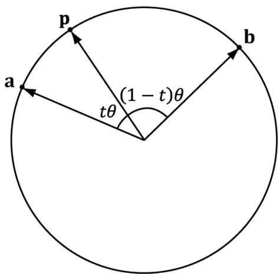


Figure 22.6. Interpolating along the 4D unit sphere from a to b by an angle tθ. The angle between a and b is $\theta$ , the angle between a and p is tθ, and the angle between p and b is $( 1 - t ) \theta$ .


This yields the matrix equation: 

$$
\left[ \begin{array}{c c} 1 & \cos (\theta) \\ \cos (\theta) & 1 \end{array} \right] \left[ \begin{array}{c} c _ {1} \\ c _ {2} \end{array} \right] = \left[ \begin{array}{c} \cos (t \theta) \\ \cos ((1 - t) \theta) \end{array} \right]
$$

Consider the matrix equation $\mathbf { A } \mathbf { x } = \mathbf { b }$ , where A is invertible. Then Cramer’s Rule tells us that $\boldsymbol { x } _ { i } = \operatorname* { d e t } \mathbf { A } _ { i }$ /  A det , where $\mathbf { A } _ { i }$ is found by swapping the ith column vector in A with b. Therefore: 

$$
c _ {1} = \frac {\operatorname* {d e t} \left[ \begin{array}{c c} \cos (t \theta) & \cos (\theta) \\ \cos ((1 - t) \theta) & 1 \end{array} \right]}{\operatorname* {d e t} \left[ \begin{array}{c c} 1 & \cos (\theta) \\ \cos (\theta) & 1 \end{array} \right]} = \frac {\cos (t \theta) - \cos (\theta) \cos ((1 - t) \theta)}{1 - \cos^ {2} (\theta)}
$$

$$
c _ {2} = \frac {\operatorname* {d e t} \left[ \begin{array}{l l} 1 & \cos (t \theta) \\ \cos (\theta) & \cos ((1 - t) \theta) \end{array} \right]}{\operatorname* {d e t} \left[ \begin{array}{l l} 1 & \cos (\theta) \\ \cos (\theta) & 1 \end{array} \right]} = \frac {\cos ((1 - t) \theta) - \cos (\theta) \cos (t \theta)}{1 - \cos^ {2} (\theta)}
$$

From the trigonometric Pythagorean identity and addition formulas, we have: 

$$
1 - \cos^ {2} (\theta) = \sin^ {2} (\theta)
$$

$$
\cos ((1 - t) \theta) = \cos (\theta - t \theta) = \cos (\theta) \cos (t \theta) + \sin (\theta) \sin (t \theta)
$$

$$
\sin ((1 - t) \theta) = \sin (\theta - t \theta) = \sin (\theta) \cos (t \theta) - \cos (\theta) \sin (t \theta)
$$

Therefore, 

$$
\begin{array}{l} c _ {1} = \frac {\cos (t \theta) - \cos (\theta) [ \cos (\theta) \cos (t \theta) + \sin (\theta) \sin (t \theta) ]}{\sin^ {2} (\theta)} \\ = \frac {\cos (t \theta) - \cos (\theta) \cos (\theta) \cos (t \theta) - \cos (\theta) \sin (\theta) \sin (t \theta)}{\sin^ {2} (\theta)} \\ = \frac {\cos (t \theta) \left(1 - \cos^ {2} (\theta)\right) - \cos (\theta) \sin (\theta) \sin (t \theta)}{\sin^ {2} (\theta)} \\ = \frac {\cos (t \theta) \sin^ {2} (\theta) - \cos (\theta) \sin (\theta) \sin (t \theta)}{\sin^ {2} (\theta)} \\ = \frac {\sin (\theta) \cos (t \theta) - \cos (\theta) \sin (t \theta)}{\sin (\theta)} \\ = \frac {\sin ((1 - t) \theta)}{\sin (\theta)} \\ \end{array}
$$

and 

$$
\begin{array}{l} c _ {2} = \frac {\cos (\theta) \cos (t \theta) + \sin (\theta) \sin (t \theta) - \cos (\theta) \cos (t \theta)}{\sin^ {2} (\theta)} \\ = \frac {\sin (t \theta)}{\sin (\theta)} \\ \end{array}
$$

Thus we define the spherical interpolation formula: 

$$
\operatorname {s l e r p} (\mathbf {a}, \mathbf {b}, t) = \frac {\sin ((1 - t) \theta) \mathbf {a} + \sin (t \theta) \mathbf {b}}{\sin \theta} \quad \text {f o r} \quad t \in [ 0, 1 ]
$$

Thinking of unit quaternions as 4D unit vectors allows us to solve for the angle between the quaternions: $\theta = \operatorname { a r c c o s } ( \mathbf { a } \cdot \mathbf { b } )$ . 

If θ, the angle between a and b is near zero, sinq is near zero, and the division can cause problems due to finite numerical precision. In this case, perform linear interpolation between the quaternions and normalize the result, which is actually a good approximation for small $\theta$ (see Figure 22.7). 

Observe from Figure 22.8 that linear interpolation followed by projecting the interpolated quaternion back on to the unit sphere results in a nonlinear rate of rotation. Thus is you used linear interpolation for large angles, the speed of rotation will speed up and slow down. This effect is often undesirable, and one reason why spherical interpolation is preferred (which rotates at a constant speed). 

We now point out an interesting property of quaternions. Note that since $( s \mathbf { q } ) ^ { * } = s \mathbf { q } ^ { * }$ and scalar-quaternion multiplication is commutative, we have that: 

$$
\begin{array}{l} R _ {- \mathbf {q}} (\mathbf {v}) = - \mathbf {q} \mathbf {v} (- \mathbf {q}) ^ {\star} \\ = (- 1) \mathbf {q} \mathbf {v} (- 1) \mathbf {q} ^ {*} \\ = \mathbf {q} \mathbf {v} \mathbf {q} ^ {\star} \\ \end{array}
$$

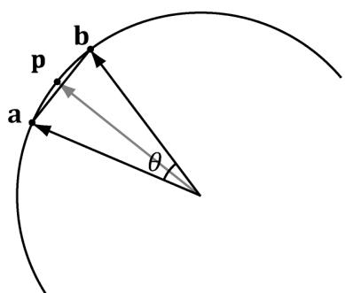


Figure 22.7. For small angles $\theta$ between a and b, linear interpolation is a good approximation for spherical interpolation. However, when using linear interpolation, the interpolated quaternion no longer lies on the unit sphere, so you must normalize the result to project it back on to the unit sphere.


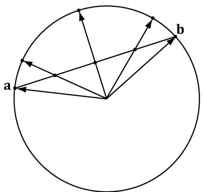


Figure 22.8. Linear interpolation results in nonlinear interpolation over the unit sphere after normalization. This means the rotation speeds up and slows down as it interpolates, rather than moving at a constant speed.


We therefore have q and $\mathbf { - q }$ representing the same rotation. To see this another way, if $\scriptstyle \mathbf { q } = \left( \mathbf { n } \sin { \frac { \theta } { 2 } } , \bar { \cos { \frac { \theta } { 2 } } } \right)$ ,  then 

$$
\begin{array}{l} - \mathbf {q} = \left(- \mathbf {n} \sin \frac {\theta}{2}, - \cos \frac {\theta}{2}\right) \\ = \left(- \mathbf {n} \sin \left(\pi - \frac {\theta}{2}\right), \cos \left(\pi - \frac {\theta}{2}\right)\right) \\ = \left(- \mathbf {n} \sin \left(\frac {2 \pi - \theta}{2}\right), \cos \left(\frac {2 \pi - \theta}{2}\right)\right) \\ \end{array}
$$

That is, $R _ { \mathbf { q } }$ rotates $\theta$ about the axis n, and $R _ { - \mathbf { q } }$ rotates $2 \pi - \theta$ about the axis -n. Geometrically, a unit quaternion $\mathbf { q }$ on the 4D unit sphere and its polar opposite $\mathbf { - q }$ represent the same orientation. Figure 22.9 shows that these two rotations take us to the same place. However, we see that one will take the shorter angle around and the other will take the longer angle around. 

Because b and $- \mathbf { b }$ representing the same orientation, we have two choices for interpolation: slerp(a, b, t) or slerp(a, -b, t). One will interpolate between the orientations in the most direct way that minimizes spinning (analogous to Figure $2 2 . 9 a )$ ), and one will take the long way around (analogous to Figure $2 2 . 9 b )$ . Referring to Figure 22.10, we want to choose b or $- \mathbf { b }$ based on which one interpolates over a shorter arc on the 4D unit sphere. Choosing the shorter arc results in interpolating through the most direct path; choosing the longer arc results in extra spinning of the object [Eberly01], as it rotates the long way around. 

From [Watt92], to find the quaternion that gives the shortest arc around the 4D unit sphere, we compare $| | { \bf { a } } - { \bf { b } } | | ^ { 2 }$ and $| | \mathbf { a } - ( - \mathbf { b } ) | | ^ { 2 } = | | \mathbf { a } + \mathbf { b } | | ^ { 2 }$ . If $| | { \mathbf a } + { \mathbf b } | | ^ { 2 } <$ $| | { \bf { a } } - { \bf { b } } | | ^ { 2 }$ then we choose $- \mathbf { b }$ for interpolation instead of b because -b is closer to a, and thus will give the shorter arc. 

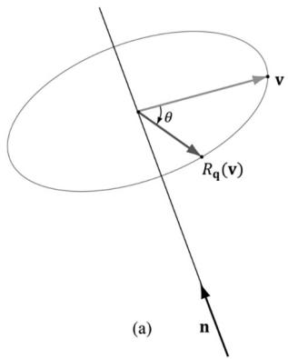


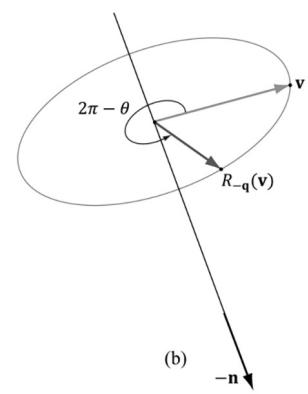


Figure 22.9. $R _ { \mathfrak { q } }$ rotates $\theta$ about the axis n, and $R _ { - \mathbf { q } }$ rotates $2 \pi - \theta$ about the axis -n.


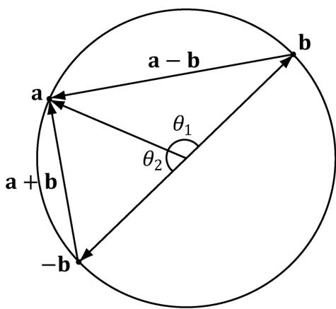


Figure 22.10. Interpolating from a to b results in interpolating over the larger arc $\theta _ { 1 }$ on the 4D unit sphere, whereas interpolating from a to -b results in interpolating over the shorter arc $\theta _ { 2 }$ on the 4D unit sphere. We want to choose the shortest arc on the 4D unit sphere.


The following is C# code, but illustrates the idea:


// Linear interpolation (for small theta).   
public static Quaternion LerpAndNormalize(Quaternion p,Quaternion q, float s)   
{ //Normalize to make sure it is a unit quaternion. returnNormalize((1.0f-s)*p+s*q);   
}   
public static Quaternion Slerp(Quaternion p,Quaternion q,float s)   
{ //Recall that q and -q represent the same orientation,but interpolating // between the two is different: One will take the shortest arc and one //will take the long arc.To find the shortest arc, compare the magnitude //of $\mathfrak{p}\text{-}\mathfrak{q}$ with the magnitude $\mathrm{p - (-q) = p + q}$ if(LengthSq(p-q)>LengthSq(p+q)) $\mathrm{q} = -\mathrm{q};$ float cosPhi $=$ DotP(p,q); //For very small angles,use linear interpolation. if(cosPhi>(1.0f-0.001)) return LerpAndNormalize(p,q,s); //Find the angle between the two quaternions. float phi $=$ (float)Math.Acos(cosPhi); float sinPhi $=$ (float)Math.Sin(phi); 

```cpp
// Interpolate along the arc formed by the intersection of the 4D unit sphere and // the plane passing through p, q, and the origin of the unit sphere. return ((float)Math.Sin(phi* (1.0-s)) / sin Phi) *p + ((float) Math. Sin (phi* s) / sin Phi) *q; } 
```

# 22.5 DIRECTX MATH QUATERNION FUNCTIONS

The DirectX math library supports quaternions. Because the “data” of a quaternion is four real numbers, DirectX math uses the XMVECTOR type for storing quaternions. Then some of the common quaternion functions defined are: 

// Returns the quaternion dot product $\mathbf{Q}_1\cdot \mathbf{Q}_2$ XMVECTOR XMQuaternionDot(XMVECTOR Q1, XMVECTOR Q2); 

// Returns the identity quaternion $(0,0,0,1)$ XMVECTOR XMQuaternionIdentity(); 

// Returns the conjugate of the quaternion $\mathbf{Q}$ XMVECTOR XMQuaternionConjugate(XMVECTOR Q); 

// Returns the norm of the quaternion $\mathbf{Q}$ XMVECTOR XMQuaternionLength(XMVECTOR Q); 

```cpp
// Normalizes a quaternion by treating it as a 4D vector.  
XMVECTOR XMQuaternionNormalize(XMVECTOR Q); 
```

//Computesthequaternionproduct $\mathbf{Q}_1\mathbf{Q}_2$ XMVECTORXMQuaternionMultiply(XMVECTORQ1，XMVECTORQ2); 

```cpp
// Returns a quaternions from axis-angle rotation representation.  
XMVECTOR XMQuaternionRotationAxis(XMVECTOR Axis, FLOAT Angle); 
```

```cpp
// Returns a quaternions from axis-angle rotation representation, where the axis // vector is normalized—this is faster than XMQuaternionRotationAxis.  
XMVector XMQuaternionRotationNormal(XMVECTOR NormalAxis, FLOAT Angle); 
```

```cpp
// Returns a quaternion from a rotation matrix.  
XMVECTOR XMQuaternionRotationMatrix(XMMatrix M); 
```

```c
// Returns a rotation matrix from a unit quaternion.  
XMMatrix XMMatrixRotationQuaternion(XMVECTOR Quaternion); 
```

// Extracts the axis and angle rotation representation from the quaternion Q. 

VOID XMQuaternionToAxisAngle(XMVECTOR *pAxis, FLOAT *pAngle, XMVECTOR Q); 

// Returns slerp $( \mathbf { Q } _ { 1 } , \mathbf { Q } _ { 2 } , t )$ 

XMVECTOR XMQuaternionSlerp(XMVECTOR Q0, XMVECTOR Q1, FLOAT t); 

# 22.6 ROTATION DEMO

For this chapter’s demo, we animate a skull mesh around a simple scene. The position, orientation, and scale of the mesh are animated. We use quaternions to represent the orientation of the skull, and use slerp to interpolate between orientations. We use linear interpolation to interpolate between position and scale. This demo also serves as an animation “warm up” to the next chapter on character animation. 

A common form of animation is called key frame animation. A key frame specifies the position, orientation, and scale of an object at an instance in time. In our demo (in AnimationHelper.h/.cpp), we define the following key frame structure: 

```objectivec
struct Keyframe
{
    Keyframe();
    ~Keyframe;
    float TimePos;
    XMFLOAT3 Translation;
    XMFLOAT3 Scale;
    XMFLOAT4 RotationQuat;
}; 
```

An animation is a list of key frames sorted by time: 

```cpp
struct BoneAnimation
{
    float GetStartTime() const;
    float GetEndTime() const;
    void Interpolate(float t, XMFLOAT4X4& M) const;
    std::vector<Keyframe> Keyframes;
}; 
```

The reason for using the term “bone” will be made clear in the next Chapter. For now, you can just think of animating a single bone as animating a single object. The method GetStartTime just returns the time of the first key frame. For example, maybe the object does not start animating until after ten seconds relative to some timeline. Similarly, the method GetEndTime returns the time of the last key frame. This is useful to know when the animation ends, and we can stop animating it. 

We now have a list of key frames, which define the rough overall look of the animation. So how will the animation look at time between the key frames? This is where interpolation comes in. For times $t$ between two key frames, say $K _ { i }$ and $K _ { i + 1 }$ , we interpolate between the two key frames $K _ { i }$ and $K _ { i + 1 }$ . 

```cpp
void BoneAnimation::Interpolate(float t, XM FLOAT4X4& M) const
{
// t is before the animation started, so just return the first key frame.
if( t <= Keyframes.front().TimePos )
{
XMVECTOR S = XMLoadFloat3(&Keyframes.front().Scale);
XMVECTOR P = XMLoadFloat3(&Keyframes.front().Translation);
XMVECTOR Q = XMLoadFloat4(&Keyframes.front().RotationQuat);
XMVECTOR zero = XMVectorSet(0.0f, 0.0f, 0.0f, 1.0f);
XMStoreFloat4x4(&M, XMMatrixAffineTransformation(S, zero, Q, P));
}
// t is after the animation ended, so just return the last key frame.
else if( t >= Keyframes.back().TimePos )
{
XMVECTOR S = XMLoadFloat3(&Keyframes.back().Scale);
XMVECTOR P = XMLoadFloat3(&Keyframes.back().Translation);
XMVECTOR Q = XMLoadFloat4(&Keyframes.back().RotationQuat);
XMVECTOR zero = XMVectorSet(0.0f, 0.0f, 0.0f, 1.0f);
XMStoreFloat4x4(&M, XMMatrixAffineTransformation(S, zero, Q, P));
}
// t is between two key frames, so interpolate.
else
{
for( UINT i = 0; i < Keyframes.size()-1; ++i)
{
if( t >= Keyframes[i].TimePos && t <= Keyframes[i+1].TimePos )
{
float lerpPercent = (t - Keyframes[i].TimePos) /
(Keyframes[i+1].TimePos - Keyframes[i].TimePos);
XMVECTOR s0 = XMLoadFloat3(&Keyframes[i].Scale);
XMVECTOR s1 = XMLoadFloat3(&Keyframes[i+1].Scale);
XMVECTOR p0 = XMLoadFloat3(&Keyframes[i].Translation);
XMVECTOR p1 = XMLoadFloat3(&Keyframes[i+1].Translation);
XMVECTOR q0 = XMLoadFloat4(&Keyframes[i].RotationQuat);
XMVECTOR q1 = XMLoadFloat4(&Keyframes[i+1].RotationQuat);
XMVECTOR S = XMVectorLerp(s0, s1, lerpPercent);
XMVECTOR P = XMVectorLerp(p0, p1, lerpPercent);
XMVECTOR Q = XMQuaternionSlerp(q0, q1, lerpPercent);
XMVECTOR zero = XMVectorSet(0.0f, 0.0f, 0.0f, 1.0f);
XMStoreFloat4x4(&M, XMMatrixAffineTransformation(S, zero, Q, P)); 
```

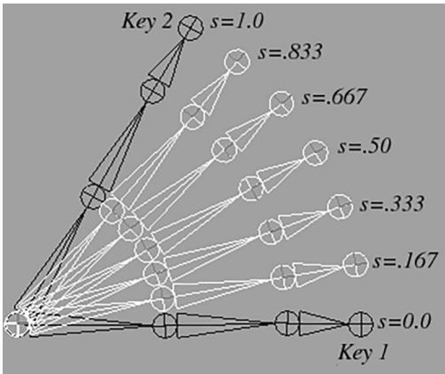


Figure 22.11. Key frame interpolation. The key frames define the “key” poses of the animation. The interpolated values represent the values between the key frames.


```cpp
break; } 1 1 1 
```


Figure 22.11 shows the in-between frames generated by interpolating from Key 1 to Key 2.


Figure 22.11 appeared in the book by Frank D. Luna, Introduction to 3D Game Programming with DirectX 9.0c: A Shader Approach, 2006: Jones and Bartlett Learning, Burlington, MA. www.jblearning.com. Reprinted with permission.


After interpolation, we construct a transformation matrix because ultimately we use matrices for transformations in our shader programs. The XMMatrixAffineTransformation function is declared as follows: 

```sql
XMMATRIX XMMatrixAffineTransformation(XMVECTOR Scaling, XMVECTOR RotationOrigin, XMVECTOR RotationQuaternion, XMVECTOR Translation); 
```

Now that our simple animation system is in place, the next part of our demo is to define some key frames: 

//Member data   
float mAnimTimePos $= 0$ .0f; BoneAnimation mSkullAnimation;   
// 

```cpp
// In constructor, define the animation keyframes
//  
void QuatApp::DefineSkullAnimation()
{
//  
// Define the animation keyframes
//  
XMVectorOR q0 = XMQuaternionRotationAxis(XMVectorSet(0.0f, 1.0f, 0.0f, 0.0f), XMConvertToRadians(30.0f));
XMVectorOR q1 = XMQuaternionRotationAxis(XMVectorSet(1.0f, 1.0f, 2.0f, 0.0f), XMConvertToRadians(45.0f));
XMVectorOR q2 = XMQuaternionRotationAxis(XMVectorSet(0.0f, 1.0f, 0.0f, 0.0f), XMConvertToRadians(-30.0f));
XMVectorOR q3 = XMQuaternionRotationAxis(XMVectorSet(1.0f, 0.0f, 0.0f, 0.0f), XMConvertToRadians(70.0f));  
mSkullAnimation.Keyframes resize(5);  
mSkullAnimation.Keyframes[0].TimePos = 0.0f;  
mSkullAnimation.Keyframes[0].Translation = XMFLOAT3(-7.0f, 0.0f, 0.0f);  
mSkullAnimation.Keyframes[0].Scale = XMFLOAT3(0.25f, 0.25f, 0.25f);  
XMStoreFloat4(&mSkullAnimation.Keyframes[0].RotationQuat, q0);  
mSkullAnimation.Keyframes[1].TimePos = 2.0f;  
mSkullAnimation.Keyframes[1].Translation = XMFLOAT3(0.0f, 2.0f, 10.0f);  
mSkullAnimation.Keyframes[1].Scale = XMFLOAT3(0.5f, 0.5f, 0.5f);  
XMStoreFloat4(&mSkullAnimation.Keyframes[1].RotationQuat, q1);  
mSkullAnimation.Keyframes[2].TimePos = 4.0f;  
mSkullAnimation.Keyframes[2].Translation = XMFLOAT3(7.0f, 0.0f, 0.0f);  
mSkullAnimation.Keyframes[2].Scale = XMFLOAT3(0.25f, 0.25f, 0.25f);  
XMStoreFloat4(&mSkullAnimation.Keyframes[2].RotationQuat, q2);  
mSkullAnimation.Keyframes[3].TimePos = 6.0f;  
mSkullAnimation.Keyframes[3].Translation = XMFLOAT3(0.0f, 1.0f, -10.0f);  
mSkullAnimation.Keyframes[3].Scale = XMFLOAT3(0.5f, 0.5f, 0.5f);  
XMStoreFloat4(&mSkullAnimation.Keyframes[3].RotationQuat, q3);  
mSkullAnimation.Keyframes[4].TimePos = 8.0f;  
mSkullAnimation.Keyframes[4].Translation = XMFLOAT3(-7.0f, 0.0f, 0.0f);  
mSkullAnimation.Keyframes[4].Scale = XMFLOAT3(0.25f, 0.25f, 0.25f);  
XMStoreFloat4(&mSkullAnimation.Keyframes[4].RotationQuat, q0); 
```

Our key frames position the skull at different locations in the scene, at different orientations, and at different scales. You can have fun experimenting with this demo by adding your own key frames or changing the key frame values. For 


Figure 22.12. Screenshot of the quaternion demo.


example, you can set all the rotations and scaling to identity, to see what the animation looks like when only position is animated. 

The last step to get the animation working is to perform the interpolation to get the new skull world matrix, which changes over time: 

void QuatApp::UpdateScene(float dt)   
{ // Increase the time position. mAnimTimePos $+=$ dt; if(mAnimTimePos $>=$ mSkullAnimation.getTime()) { // Loop animation back to beginning. mAnimTimePos $= 0.0f$ . } // Get the skull's world matrix at this time instant. mSkullAnimation.Interpolate(mAnimTimePos, mSkullWorld); 

The skull’s world matrix is now changing every frame in order to animate the skull. 

# 22.7 SUMMARY

1. An ordered 4-tuple of real numbers $\mathbf { q } = ( x , y , z , w ) = ( q _ { 1 } , q _ { 2 } , q _ { 3 } , q _ { 4 } )$ is a quaternion. This is commonly abbreviated as $\mathbf { q } = ( \mathbf { u } , \boldsymbol { w } ) = ( x , y , z , w )$ , and we call $\mathbf { u } = ( x , y , z )$ the imaginary vector part and $w$ the real part. Moreover, equality, addition, subtraction, multiplication and division are defined as follows: 

a. $( { \mathbf { u } } , a ) = ( { \mathbf { v } } , b )$ if and only if $\mathbf { u } = \mathbf { v }$ and $a = b$ 

b. $( \mathbf { u } , a ) \pm ( \mathbf { v } , b ) = ( \mathbf { u } \pm \mathbf { v } , a \pm b )$ 

c. $( \mathbf { u } , a ) ( \mathbf { v } , b ) = ( a \mathbf { v } + b \mathbf { u } + \mathbf { u } \times \mathbf { v } , a b - \mathbf { u } \cdot \mathbf { v } )$ 

2. Quaternion multiplication is not commutative, but it is associative. The quaternion $\mathbf { e } = ( 0 , 0 , 0 , 1 )$ serves as a multiplicative identity. Quaternion multiplication distributes over quaternion addition: $\mathbf { p ( q + r ) } = \mathbf { p q } + \mathbf { p r }$ and $( \mathbf { q } + \mathbf { r } ) \mathbf { p } = \mathbf { q } \mathbf { p } + \mathbf { r } \mathbf { p } .$ 

3. We can convert a real number $s$ to quaternion space by writing $s = ( 0 , 0 , 0 , s )$ , and we can convert a vector u to quaternion space by writing $\mathbf { u } = ( \mathbf { u } , 0 )$ . A quaternion with zero real part is called a pure quaternion. It is then possible to multiply a scalar and a quaternion, and the result is $s ( p _ { 1 } , p _ { 2 } , p _ { 3 } , p _ { 4 } ) = ( s p _ { 1 } ,$ $s p _ { 2 } , s p _ { 3 } , s p _ { 4 } ) = ( p _ { 1 } , p _ { 2 } , p _ { 3 } , p _ { 4 } ) s$ . The special case of scalar multiplication is commutative. 

4. The conjugate of a quaternion $\mathbf { q } = ( q _ { 1 } , q _ { 2 } , q _ { 3 } , q _ { 4 } ) = ( \mathbf { u } , q _ { 4 } )$ is denoted by ${ \mathfrak { q } } ^ { * }$ and defined by $\mathbf { q } ^ { * } = - q _ { 1 } - q _ { 2 } - q _ { 3 } + q _ { 4 } = ( - \mathbf { u } , q _ { 4 } )$ .  The norm (or magnitude) of a quaternion is defined by: $\left| \left| \mathbf { q } \right| \right| = { \sqrt { \mathbf { q q } ^ { * } } } = { \sqrt { q _ { 1 } ^ { 2 } + q _ { 2 } ^ { 2 } + q _ { 3 } ^ { 2 } + q _ { 4 } ^ { 2 } } } = { \sqrt { \left| \left| \mathbf { \Omega } \mathbf { u } \right| \right| ^ { 2 } + q _ { 4 } ^ { 2 } } }$ .  We say that a quaternion is a unit quaternion if it has a norm of one. 

5. Let $\mathbf { q } = ( q _ { 1 } , q _ { 2 } , q _ { 3 } , q _ { 4 } ) = ( \mathbf { u } , q _ { 4 } )$ be a nonzero quaternion, then the inverse is denoted by $\mathbf { q } ^ { - 1 }$ and given by: $\mathbf { q } ^ { - 1 } = \frac { \mathbf { q } ^ { * } } { \left\| \mathbf { q } \right\| ^ { 2 } }$ If $\mathbf { q }$ is a unit quaternion, then $\mathbf { q } ^ { - 1 } = \mathbf { q } ^ { * }$ . 

6. A unit quaternion $\mathbf { q } = ( \mathbf { u } , \ q _ { 4 } )$ can be written in the polar representation ${ \bf q } = ( \sin \theta { \bf n } , \cos \theta )$ , where $\mathbf { n }$ is a unit vector. 

7. If $\mathbf { q }$ is a unit quaternion, then ${ \bf q } = ( \sin \theta { \bf n } , \cos \theta )$ for $\lvert \lvert \mathbf { n } \rvert \rvert = 1$ and $\theta \in [ 0 , \pi ]$ . The quaternion rotation operator is defined by $R _ { \mathbf { q } } ^ { } ( \mathbf { v } ) = \mathbf { q v q } ^ { - 1 } = \mathbf { q v q } ^ { * }$ and rotates the point/vector v around the axis n by an angle 2q. $R _ { \mathbf { q } }$ has a matrix representation, and any rotation matrix can be converted to a quaternion representing the rotation. 

8. A common task in animation is to interpolate between two orientations. Representing each orientation by a unit quaternion, we can use spherical interpolation to interpolate the unit quaternions to find the interpolated orientation. 

# 22.8 EXERCISES

1. Perform the indicated complex number operation. 

a. $( 3 + 2 i ) + ( - 1 + i )$ 

b. $( 3 + 2 i ) - ( - 1 + i )$ 

c. $\left( 3 + 2 i \right) \left( - 1 + i \right)$ 

d. $4 ( - 1 + i )$ 

e. $( 3 + 2 i ) / ( - 1 + i )$ 

f. $( 3 + 2 i ) ^ { * }$ 

g. $\left| 3 + 2 i \right|$ 

2. Write the complex number $( - 1 , 3 )$ in polar notation. 

3. Rotate the vector (2, 1) $3 0 ^ { \circ }$ using complex number multiplication. 

4. Show using the definition of complex division that $\frac { a + i \bar { b } } { a + i b } { = 1 }$ . 

5. Let $\mathbf { z } = { \boldsymbol { a } } + i { \boldsymbol { b } }$ . Show $\left| \mathbf { z } \right| ^ { 2 } = \mathbf { z } \overline { { \mathbf { z } } }$ 

6. Let M be a $2 \times 2$ matrix. Prove that det $\mathbf M = 1$ and $\mathbf { M } ^ { - 1 } = \mathbf { M } ^ { T }$ if and only if $\mathbf { M } = { \left[ \begin{array} { l l } { \cos \theta } & { \sin \theta } \\ { - \sin \theta } & { \cos \theta } \end{array} \right] }$ That is,ifand only ifMis arotation matrix.This gives us a way of testing if a matrix is a rotation matrix. 

7. Let $\pmb { \mathrm { p } } = ( 1 , 2 , 3 , 4 )$ and $\mathbf { q } = ( 2 , - 1 , 1 , - 2 )$ be quaternions. Perform the indicated quaternion operations. 

a. $\mathbf { p } + \mathbf { q }$ 

b. $\mathbf { p } - \mathbf { q }$ 

c. pq 

d. $\boldsymbol { \mathbf { p } } ^ { * }$ 

e. ${ \mathfrak { q } } ^ { * }$ 

f. p*p 

g. ||p|| 

h. ||q|| 

i. $\mathbf { p } ^ { - 1 }$ 

j. $\mathbf { q } ^ { - 1 }$ 

8. Write the unit quaternion $\begin{array} { r } { \mathbf q = \left( \frac { 1 } { 2 } , \frac { 1 } { 2 } , 0 , \frac { 1 } { \sqrt { 2 } } \right) } \end{array}$ in polar notation. 

9. Write the unit quaternion $\begin{array} { r } { \mathbf q = \left( \frac { \sqrt { 3 } } { 2 } , 0 , 0 , - \frac { 1 } { 2 } \right) } \end{array}$ in polar notation. 

10. Find the unit quaternion that rotates $4 5 ^ { \circ }$ about the axis (1, 1, 1). 

11. Find the unit quaternion that rotates ${ { 6 0 } ^ { \circ } }$ about the axis $( 0 , 0 , - 1 )$ . 

12. Let $\begin{array} { r } { \mathbf p = \left( \frac { 1 } { 2 } , 0 , 0 , \frac { \sqrt { 3 } } { 2 } \right) } \end{array}$ and $\begin{array} { r } { \mathbf q = \left( \frac { \sqrt { 3 } } { 2 } , 0 , 0 , \frac { 1 } { 2 } \right) } \end{array}$ . Compute ${ \mathrm { s l e r p } } \left( \mathbf { p } , \mathbf { q } , { \frac { 1 } { 2 } } \right)$ and verify it is a unit quaternion. 

13. Show that a quaternion $( x , y , z , w )$ . can be written in the form $x \mathbf { i } + y \mathbf { j } + z \mathbf { k } + w$ 

14. Prove that $\mathbf { q } \mathbf { q } ^ { * } = \mathbf { q } ^ { * } \mathbf { q } = q _ { 1 } ^ { 2 } + q _ { 2 } ^ { 2 } + q _ { 3 } ^ { 2 } + q _ { 4 } ^ { 2 } = | | \textbf { u } | | ^ { 2 } + q _ { 4 } ^ { 2 }$ 

15. Let $\mathbf { p } = ( \mathbf { u } , 0 )$ and $\mathbf { q } = ( \mathbf { v } , 0 )$ be pure quaternions (i.e., real part 0). Show $\mathbf { p q } = ( \mathbf { p } \times \mathbf { q } , - \mathbf { p } \cdot \mathbf { q } )$ . 

16. Prove the following properties: 

a. $( \mathbf { p } \mathbf { q } ) ^ { * } = \mathbf { q } ^ { * } \mathbf { p } ^ { * }$ 

b. $( \mathbf { p } + \mathbf { q } ) ^ { * } = \mathbf { p } ^ { * } + \mathbf { q } ^ { * }$ 

c. $( s \mathbf { q } ) ^ { * } = s \mathbf { q } ^ { * }$ for $s \in \mathbb R$ 

d. ${ \bf q } { \bf q } ^ { * } = { \bf q } ^ { * } { \bf q } = q _ { 1 } ^ { 2 } + q _ { 2 } ^ { 2 } + q _ { 3 } ^ { 2 } + q _ { 4 } ^ { 2 }$ 

e. $\left\| \mathbf { p q } \right\| = \left\| \mathbf { p } \right\| \left\| \mathbf { q } \right\|$ 

17. Prove a ⋅ ${ \frac { \sin ( ( 1 - t ) \theta ) \mathbf { a } + \sin ( t \theta ) \mathbf { b } } { \sin \theta } } = \cos ( t \theta )$ algebraically. 

18. Let a, b, c be 3D vectors. Prove the identities: 

a. $\mathbf { a } \times ( \mathbf { b } \times \mathbf { c } ) = ( \mathbf { a } \cdot \mathbf { c } ) \mathbf { b } - ( \mathbf { a } \cdot \mathbf { b } ) { \boldsymbol { c } }$ 

b. $( \mathbf { a } \times \mathbf { b } ) \times \mathbf { c } = - ( \mathbf { c } \cdot \mathbf { b } ) \mathbf { a } + ( \mathbf { c } \cdot \mathbf { a } ) \mathbf { b }$ 