# Chapter 24 Terrain Rendering

# Chapter

# 24 Terrain Rendering

Terrain rendering starts off with a flat grid of triangles. Then we adjust the heights (i.e., the y-coordinates) of the vertices in such a way that the mesh models smooth transitions from mountain to valley, thereby simulating a terrain (top of Figure聽24.1). Of course, we apply a texture to render sandy beaches, grassy hills, rocky cliffs, and snowy mountains (bottom of Figure 24.1). 

# Chapter Objectives:

1. To learn how to generate height info for a terrain that results in smooth transitions between mountains and valleys 

2. To find out how to texture the terrain 

3. To apply hardware tessellation to render the terrain with continuous level of detail 

4. To discover a way to keep the camera or other objects planted on the terrain surface 

# 24.1 HEIGHTMAPS

We use a heightmap to describe the hills and valleys of our terrain. A heightmap is a matrix, where each element specifies the height of a particular vertex in the 

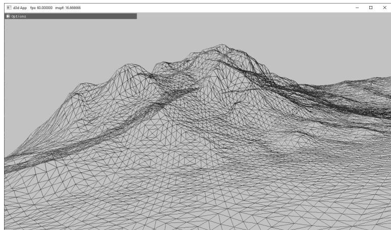


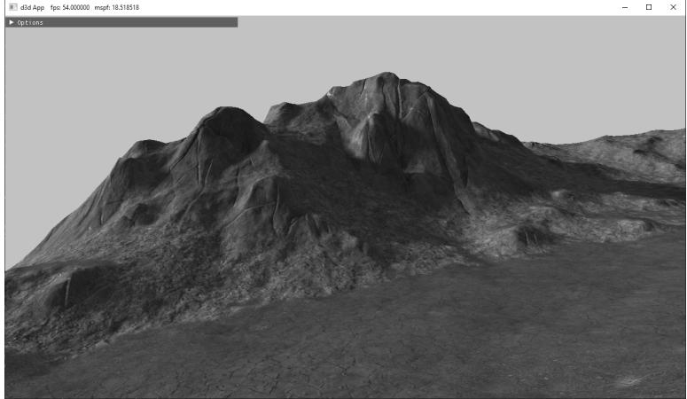


Figure 24.1. (Top) A triangle grid with smooth height transitions used to create hills and valleys. (Bottom) A lit and textured terrain.


terrain grid. That is, there exists an entry in the heightmap for each grid vertex, and the ijth heightmap entry provides the height for the ijth vertex. Typically, a heightmap is graphically represented as a grayscale map in an image editor, where black denotes the smallest height, white denotes the largest height, and shades of gray represent in-between heights. Figure 24.2 shows a couple of examples of heightmaps and the corresponding terrains they construct. 

When we store our heightmaps on disk, we usually allocate two bytes per element (16-bit RAW) in the heightmap, so the height can range from 0 to 65535. The range 0 to 65535 is enough to preserve the transition between heights of our terrain, but in our application, we often want to remap the range to the world unit scale given by HeightOffset and HeightScale: 

constexpr float MaxUShort $=$ static_cast<float>( std::numeric_limits<uint16_t>::max()); 

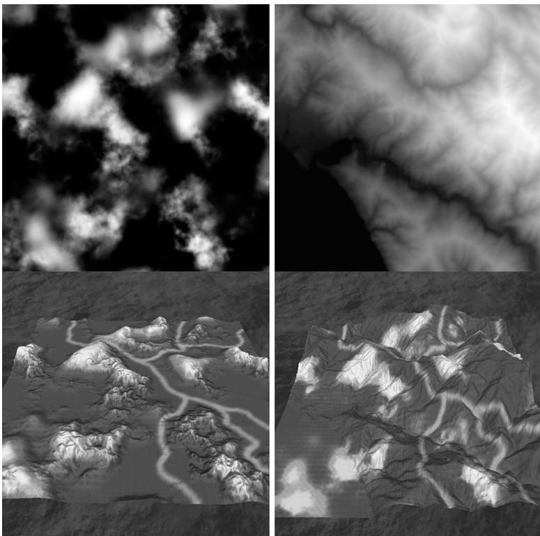


Figure 24.2. Examples of heightmaps. Observe how the heights, as described by the heightmaps, build different terrain surfaces.


```cpp
for (UINT i = 0; i < in.size(); ++i)  
{  
    float heightUnorm = heightMap[i] / MaxUShort;  
    mHeightmap[i] = mInfo.HeightScale * heightUnorm + mInfo. HeightOffset;  
} 
```

# 24.1.1 Creating a Heightmap

Heightmaps can be generated procedurally, hand painted in a specialized terrain sculpting tool or in an image editor, algorithmically derived from an image, or obtained from some range scanning device. Often you might start by procedurally generating a terrain to get a rough baseline of the terrain you want, and then proceed to manually sculpt key gameplay areas of your terrain. World Creator (https://www.world-creator.com/), Terragen (https://planetside.co.uk/), and World Machine (https://www.world-machine.com/) are some examples of specialized terrain tools that will output heightmaps. Many popular 3D engines also include their own terrain editors. 

# 24.1.2 Loading a RAW File

Since a 16-bit RAW file is nothing more than a contiguous block of bytes (where every two bytes is a heightmap entry), we can easily read in the block of memory with one std::ifstream::read call, as is done in this next method: 

```cpp
void Terrain::LoadHeightmapRaw16()
{
    // A 16-bit height for each vertex
    std::vector<std> in(mInfo.HeightmapWidth * mInfo.
        HeightmapHeight);
    // Open the file.
    std::filesystem::path absolutePath = std::filesystem::absolute(
        mInfo.HeightMapFilename);
    std::ifstream inFile;
    inFile.open(absolutePath, std::ios_base::binary);
    if (inFile)
    {
        // Read the RAW bytes.
        inFile.read(
            (char*)&in[0],
            (std::streamsize)(in.size() * sizeof(xint16_t));
        // Done with file.
        inFile.close();
    }
    constexpr float MaxUShort = static_cast(float>(std::numeric闄愬害<uint16_t>::max));
    // Copy the array data into a float array and scale it.
    mHeightmapresize(in.size(), 0);
    for (UINT i = 0; i < in.size(); ++i)
    {
        float heightUnorm = in[i] / MaxUShort;
        mHeightmap[i] = mInfo.HeightScale * heightUnorm + mInfo.
        HeightOffset;
    }
} 
```

Note: 

You do not have to use the RAW format to store your heightmaps; you can use any format that suits your needs. The RAW format is just one example of a format that we can use. We decided to use the RAW format because many image editors can export to this format and it is very easy to load the data in a RAW file into our program demos. 

The mInfo variable is a member of the Terrain class is an instance of the following structure which describes various properties of the terrain: 

```cpp
struct InitInfo
{
    InitInfo()
    {
        ZeroMemory(this, sizeof(InitInfo));
    }
    // Filename of RAW heightmap data.
    std::wstring HeightMapFilename;
    // Scale and offset to apply to heights after they have been loaded from the heightmap.
    float HeightScale;
    float HeightOffset;
    // Dimensions of the heightmap.
    UINT HeightMapWidth;
    UINT HeightMapHeight;
    // The world spacing between heightmap samples.
    float CellSpacing;
    // The number of material layers.
    UINT NumLayers;
}; 
```

# 24.1.3 Heightmap Shader Resource View

As we will see in the next section, to support tessellation and displacement mapping, we need to sample the heightmap in our shader programs. Hence, we must create a shader resource and view to the heightmap. 

void Terrain::BuildHeightMapTexture(DirectX::ResourceUploadBatch& uploadBatch)   
{ D3D12_SUBRESOURCE_DATA subResourceData $=$ {}; subResourceData.pData $=$ mHeightmap.data(); subResourceData.RowPitch $=$ mInfo.HeightmapWidth*sizeof(float); subResourceData.SlicePitch $= 0$ - ThrowIfFailed(CreateTextureFromMemory(md3dDevice, uploadBatch, mInfo.HeightmapWidth, mInfo.HeightmapHeight, DXGI_FORMAT_R32_FLOAT, subResourceData, &mHeightMapTexture, false, D3D12_RESOURCE_STATE_NON_PIXL_SHADER_RESOURCE));   
}   
void Terrain::BuildDescriptors()   
{ CbvSrvUavHeap& heap $=$ CbvSrvUavHeap::Get(); 

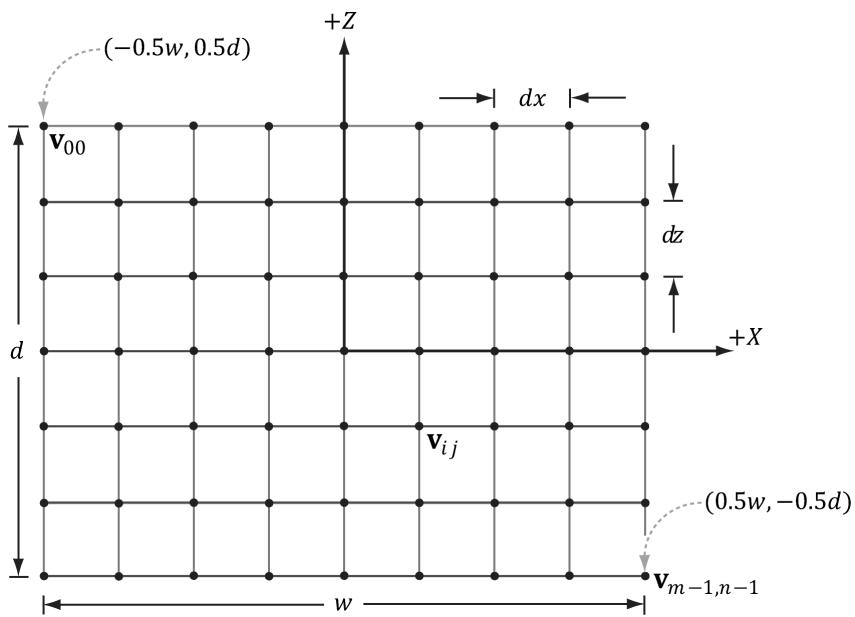


Figure 24.3. Grid properties


```javascript
mHeightMapSrvIndex = heap.NextFreeIndex();  
CreateSrv2d(m3dDevice, mHeightMapTexture.Get(), DXGI_FORMAT_R32_FLOAT, 1, heap.CpuHandle(mHeightMapSrvIndex)); 
```

# 24.2 TERRAIN TESSELLATION

Terrains cover large areas, and consequently, the number of triangles needed to build them is large. Generally, a level of detail (LOD) system is needed for terrains. That is, parts of the terrain further away from the camera do not need as many triangles because the detail goes unnoticed; see Figure 24.4. 

Our strategy for terrain tessellation is as follows: 

1. Lay down a grid of quad patches. 

2. Tessellate the patches based on their distance from the camera. 

3. Bind the heightmap as a shader resource. In the domain shader, perform displacement mapping from the heightmap to offset the generated vertices to their proper heights. 

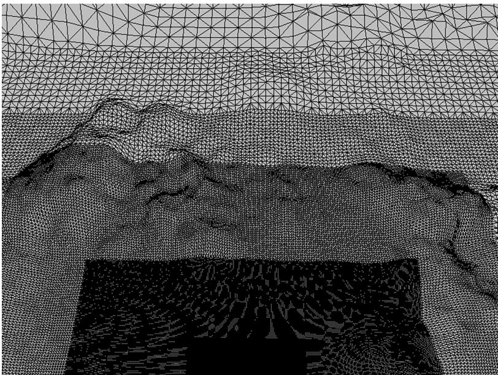


Figure 24.4. The level of detail decreases with distance from the camera.


# 24.2.1 Grid Construction

Suppose our heightmap has dimensions $( 2 ^ { m } + 1 ) \times ( 2 ^ { n } + 1 )$ . The most detailed terrain we can create from this heightmap would be a grid of $( 2 ^ { m } + 1 ) \times ( 2 ^ { n } + 1 )$ vertices; therefore, this represents our maximum tessellated terrain grid, which we shall refer to as $T _ { 0 }$ . The cell spacing between vertices of $T _ { 0 }$ is given by the InitInfo::CellSpacing property. That is, when we refer to cells, we are talking about cells of the most tessellated grid $T _ { 0 }$ . 

We divide the terrain into a grid of patches such that each patch covers blocks of $3 3 \times 3 3$ vertices of $T _ { 0 }$ (see Figure 24.5). For each patch, the maximum tessellation factor is 64 (this is a hardware limit), so we can divide a patch into $6 4 \times 6 4$ cells with $6 5 \times 6 5$ vertices. Because the patch only covers $3 3 \times 3 3$ in the heightmap, there is not enough heightmap data for $6 5 \times 6 5$ vertices; however, as shown in $\ S 2 4 . 4 . 1$ , the material layers have heightmaps where we get extra heightmap detail from the materials. If a patch has tessellation factor 1, then the patch is not subdivided and is merely rendered as two triangles. Therefore, the grid of patches can be thought of as the most coarsely tessellated version of the terrain. The patch vertex grid dimensions are calculated by the following code: 

static const int CellsPerPatch $\qquad = \quad 3 2$ ; 

// Divide heightmap into patches such that each 

// patch has CellsPerPatch. 

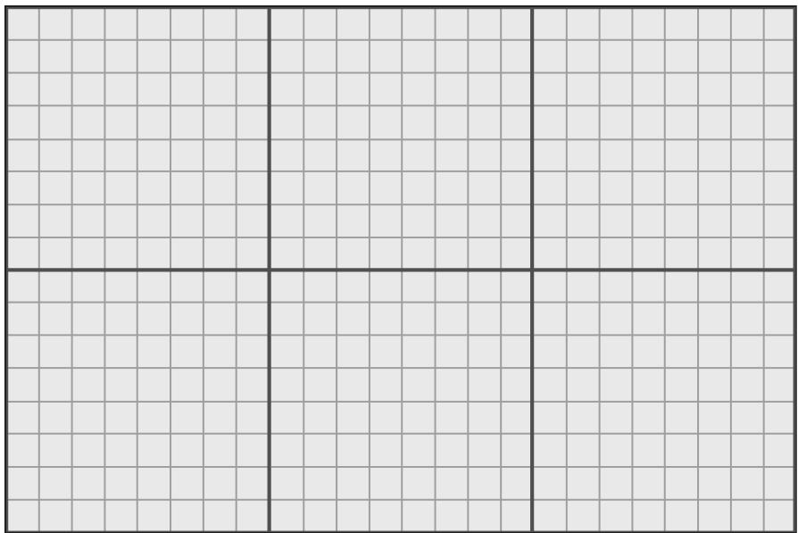


Figure 24.5. For illustration purposes, we use smaller numbers. The maximum tessellated terrain grid has $1 7 \times 2 5$ vertices and $1 6 \times 2 4$ cells. We divide the grid into a grid of patches such that each patch covers $8 \times 8$ cells or $9 \times 9$ vertices. This induces a $2 \times 3$ grid of patches.


```cpp
mNumPatchVertRows = ((mInfo.HeightmapHeight-1) / CellsPerPatch) + 1;  
mNumPatchVertCols = ((mInfo.HeightmapWidth-1) / CellsPerPatch) + 1; 
```

And the total number of patch vertices and quad patch primitives are calculated by: 

```cpp
mNumPatchVertices = mNumPatchVertRows * mNumPatchVertCols;  
mNumPatchQuadFaces = (mNumPatchVertRows-1) * (mNumPatchVertCols-1); 
```

For the terrain patch grid, we only need the 2D vertices since we will compute the height of the terrain vertices in the shaders by sampling the heightmap. However, for reasons that will be explained in $\ S 2 4 . 3$ , we also want to store the minimum and maximum y-coordinate of each patch. Therefore, we represent a patch vertex by an XMFLOAT4 as follows: (x, z, patchMinY, patchMaxY). 

Code to generate the quad patch vertex and index buffer follows: 

```cpp
float Terrain::GetWidth()const   
{ // Total terrain width. return (mInfo.HeightmapWidth-1)*mInfo.CellSpacing;   
}   
float Terrain::GetDepth()const   
{ // Total terrain depth. return (mInfo.HeightmapHeight-1)*mInfo.CellSpacing; 
```

}   
void Terrain::BuildQuadPatchVB(DirectX::ResourceUploadBatch& uploadBatch)   
{ std::vector<XMFLOAT4> patchVertices(mNumPatchVertRows*mNumPatchVert_Cols); float halfWidth $=$ 0.5f*GetWidth(); float halfDepth $=$ 0.5f*GetDepth(); float patchWidth $=$ GetWidth() / (mNumPatchVertCols-1); float patchDepth $=$ GetDepth() / (mNumPatchVertRows-1); for(UINT i $= 0$ ; i $<$ mNumPatchVertRows; ++i) { float z $=$ halfDepth - i\*patchDepth; for(UINT j $= 0$ ; j $<$ mNumPatchVertCols; ++j) { float x $=$ -halfWidth + j\*patchWidth; // xy: Patch 2d point position in xz-plane. patchVertices[i*mNumPatchVertCols+j] $=$ XMFLOAT4(x, z, 0.0f, 0.0f); } } // Store axis-aligned bounding box y-bounds in // upper-left patch corner. for(UINT i $= 0$ ; i $<$ mNumPatchVertRows-1; ++i) { for(UINT j $= 0$ ; j $<$ mNumPatchVertCols-1; ++j) { UINT patchID $=$ i\* (mNumPatchVertCols-1)+j; // zw: Patch axis y-bounds. patchVertices[i*mNumPatchVertCols+j].z = mPatchBoundsY[patchID].x; patchVertices[i*mNumPatchVertCols+j].w = mPatchBoundsY[patchID].y; } } CreateStaticBuffer(m3dDevice, uploadBatch, patchVertices.data(), patchVertices.size(), sizeof(XMFLOAT4), D3D12_RESOURCE_STATEVertex_X_ANDCONSTANT_BUFFER, mQuadPatchVB.GetAddressOf(), D3D12.Resource_FLAG_NONE); }   
void Terrain::BuildQuadPatchIB(DirectX::ResourceUploadBatch& uploadBatch)   
{ 

```c
// 4 indices per quad face
std::vector<UINT> indices(mNumPatchQuadFaces*4);
// Iterate over each quad and compute indices.
int k = 0;
for (UINT i = 0; i < mNumPatchVertRows-1; ++i)
{
    for (UINT j = 0; j < mNumPatchVertCols-1; ++j)
        {
            // Top row of 2x2 quad patch
            indices[k] = i*mNumPatchVertCols+j;
            indices[k+1] = i*mNumPatchVertCols+j+1;
            // Bottom row of 2x2 quad patch
            indices[k+2] = (i+1)*mNumPatchVertCols+j;
            indices[k+3] = (i+1)*mNumPatchVertCols+j+1;
            k += 4; // next quad
        }
}
CreateStaticBuffer (md3dDevice, uploadBatch,
                indices.data(), indices.size(), sizeof(UINT),
                D3D12Resource_STATE_INDEX_BUFFERER,
                mQuadPatchIB.GetAddressOf(), D3D12Resource_FLAG_NONE); 
```

# 24.2.2 Terrain Vertex Shader

Since we are using tessellation, the vertex shader operates per control point. Our vertex shader is almost a simple pass-through shader, except that we do displacement mapping for the patch control points by reading the heightmap value. This puts the y-coordinates of the control points at the proper height. The reason for doing this is that in the hull shader, we are going to compute the聽distance between each patch and the eye; having the patch corners offset to the proper height makes this distance calculation more accurate than having the patch in the $_ { x z }$ -plane. 

```cpp
struct VertexOut
{
    float3 PosW : POSITION;
    float2 TexC : TEXCOORD0;
    float2 BoundsY : TEXCOORD1;
};
VertexOut VS(float4 vin : POSITION)
{
    VertexOut vout;
    float2 bottomLeft = -0.5f*gTerrainWorldSize; 
```

```cpp
float3 posL = float3(vin.x, 0.0f, vin.y);  
float2 texC = (posL.xz - bottomLeft) / gTerrainWorldSize;  
texC.y = 1.0f - texC.y;  
// Remap [0,1] ->[halfTexel, 1.0f - halfTexel] so that  
// vertices coincide with texel centers. Texel centers  
// are offset half a texel from the top-left  
// corner of the texel.  
float2 halfTexel = 0.5f * gTerrainTexelSizeUV;  
texC = halfTexel + texC * (1.0f - 2*halfTexel);  
// Displace the patch corners to world space. This is to make  
// the eye to patch distance calculation more accurate.  
Texture2D heightMap = ResourceDescriptorHeap[gHeightMapSrvIndex];  
posL.y = heightMapSAMPLELevel(GetLinearClampSampler(), texC, 0).r;  
vout-posW = mul(float4(posL, 1.0f), gTerrainWorld).xyz;  
vout.TexC = texC;  
vout.BoundsY = vin.zw;  
return vout; 
```

# 24.2.3 Tessellation Factors

The hull shader constant function is responsible for calculating the tessellation factors for each patch that indicate how much to subdivide each patch. In addition, we can use the hull shader constant function to do frustum culling on the GPU. We will explain GPU based patch frustum culling in $\ S 2 4 . 3$ . 

We calculate the distance between the eye position and the midpoint of each patch edge to derive the edge tessellation factors. For the interior tessellation factors, we calculate the distance between the eye position and the midpoint of the patch. We use the following code to derive the tessellation factor from the distance: 

// When distance is minimum, the tessellation is maximum.  
// When distance is maximum, the tessellation is minimum.  
float gTerrainMinTessDist;  
float gTerrainMaxTessDist;  
// Exponents for power of 2 tessellation. The tessellation  
// range is [2^ (gMinTess), 2^ (gMaxTess)]. Since the maximum  
// tessellation is 64, this means gMaxTess can be at most 6  
// since $2^{\wedge}6 = 64$ , and gMinTess must be at least 0 since $2^{\wedge}0 = 1$ .  
float gTerrainMinTess;  
float gTerrainMaxTess;  
float CalcTessFactor(float3 p)  
{ 

```cpp
float d = distance(p, gEyePosW);  
float s = saturate((d - gTerrainMinTessDist) / (gTerrainMaxTessDist - gTerrainMinTessDist));  
return pow(2, (lerp(gTerrainMaxTess, gTerrainMinTess, s))); 
```

We use power of 2 because this means at each finer level of detail, the number of subdivisions doubles. For example, say we are at a level of detail of $2 ^ { 3 } = 8$ . The next refinement doubles the number of subdivisions to $2 ^ { 4 } = 1 6$ , and the coarser level of detail is half the number of subdivisions $2 ^ { 2 } = 4$ . Using the power of 2 function spreads out the levels of detail better with distance. 

Now in the constant hull shader function, we apply this function to the patch midpoint, and the patch edge midpoints to compute the tessellation factors: 

```cpp
struct PatchTess {
    float EdgeTess[4] : SV_TessFactor;
    float InsideTess[2] : SV_InsideTessFactor;
};
PatchTess ConstantHS(InputPatch<vertexOut, 4> patch,
                    uint patchID : SV_PrimitiveID)
{
    PatchTess pt;
    // 
    // Frustum cull
    // 
    [... Omit frustum culling code]
    // 
    // Do normal tessellation based on distance.
    // 
    else
    {
        // It is important to do the tess factor calculation 
        // based on the edge properties so that edges shared 
        // by more than one patch will have the same 
        // tessellation factor. Otherwise, gaps can appear. 
        // Compute midpoint on edges, and patch center 
        float3 e0 = 0.5f*(patch[0].PosW + patch[2].PosW);
        float3 e1 = 0.5f*(patch[0].PosW + patch[1].PosW);
        float3 e2 = 0.5f*(patch[1].PosW + patch[3].PosW);
        float3 e3 = 0.5f*(patch[2].PosW + patch[3].PosW);
        float3 c = 0.25f*(patch[0].PosW + patch[1].PosW + 
            patch[2].PosW + patch[3].PosW);
        pt EdgeTess[0] = CalcTessFactor(e0); 
```

pt.EddgTess[1] $=$ CalcTessFactor(e1); pt.EddgTess[2] $=$ CalcTessFactor(e2); pt.EddgTess[3] $=$ CalcTessFactor(e3); pt.InsiderTess[0] $=$ CalcTessFactor(c); pt.InsiderTess[1] $=$ pt.InsiderTess[0]; return pt; } 

# 24.2.4 Displacement Mapping

Recall that the domain shader is like the vertex shader for tessellation. The domain shader is evaluated for each generated vertex. Our task in the domain shader is to use the parametric $( u , \nu )$ coordinates of the tessellated vertex positions to interpolate the control point data to derive the actual vertex positions and texture coordinates. In addition, we sample the terrain heightmap and material heightmaps to perform displacement mapping. 

```cpp
struct DomainOut
{
    float4 PosH : SV_POSITION;
    float3 PosW : POSITION0;
    float2 TexC : TEXCOORD0;
}
// Shader variation if not drawing into shadow map.
#if !IS_SHADOW_PASS
    float4 ShadowPosH : POSITION1;
#endif
};
[domain("quad")] DomainOut DS(PatchTess patchTess, float2 uv : SV_DomainLocation, const OutputPatch<HullOut, 4> quad)
{
    DomainOut dout;
    // Bilinear interpolation.
    dout(PosW = lerp( lerp(quad[0].PosW, quad[1].PosW, uv.x), lerp(quad[2].PosW, quad[3].PosW, uv.x), uv.y);
    doutTEXC = lerp( lerp(quad[0].TexC, quad[1].TexC, uv.x), lerp(quad[2].TexC, quad[3].TexC, uv.x), uv.y);
} 
```

```cpp
// Displacement mapping
// 
if( gUseTerrainHeightMap )
{
    Texture2D heightMap = DescriptorHeap[gHeightMapSrvIndex];
    cout(PosW.y = heightMapSAMPLELevel(
        GetLinearClampSampler(), dout.tex, 0).r;
}
// Add in displacements from materials (Section 24.4.1).
if( gUseMaterialDisplacement )
{
    float materialDisplacement = CalcBlendedDisplacement(dout.tex);
    cout(PosW.y += materialDisplacement;
}
// Project to homogeneous clip space.
dout(PosH = mul(float4(dout(PosW, 1.0f), gViewProj);
// Shader variation if not drawing into shadow map.
#if !IS_SHADOW_PASS
dout.ShadowPosH = mul(float4(dout(PosW, 1.0f), gShadowTransform);
#endif
return dout;
} 
```

# 24.2.5 Tangent and Normal Vector Estimation

We estimate the tangent vectors (one in the $+ x$ direction and one in the $- z$ direction) on the fly in the pixel shader from the heightmap using central differences (see Figure 24.6): 

$$
\mathbf {T _ {x}} (x, z) = \left(1, \frac {\partial h}{\partial x}, 0\right) \approx \left(1, \frac {h (x + h , z) - h (x - h , z)}{2 h}, 0\right)
$$

$$
\mathbf {T} _ {- z} (x, z) = \left(0, - \frac {\partial h}{\partial z}, - 1\right) \approx \left(0, \frac {h (x , z - h) - h (x , z + h)}{2 h}, - 1\right)
$$

We take the negative $z$ direction because that direction corresponds to the texture space $\nu$ -axis; these vectors also help form the tangent space for normal mapping. Once we have estimates of the tangent vectors in the positive $x \cdot$ - and negative $z \mathrm { . }$ -directions, we compute the normal via the cross product: 

```cpp
void EstimateTangentFrame(float2 texC, out float3 outTangentW, out float3 outBitangentW, 
```

out float3 outNormalW)   
{ // // Estimate normal and tangent using central differences. // float2 leftTexC $=$ texC $^+$ float2(-gTerrainTexelSizeUV.x,0.0f); float2 rightTexC $=$ texC $^+$ float2(+gTerrainTexelSizeUV.x,0.0f); float2 bottomTexC $=$ texC $^+$ float2(0.0f锛?gTerrainTexelSizeUV.y); float2 topTexC $=$ texC $^+$ float2(0.0f锛?gTerrainTexelSizeUV.y); Texture2D heightMap $=$ ResourceDescriptorHeap[gHeightMapSrvIndex]; float leftY $=$ heightMapSAMPLELevel GetLinearClampSampler(),leftTexC,0).r; float rightY $=$ heightMapSAMPLELevel (GetLinearClampSampler(),rightTexC,0).r; float bottomY $=$ heightMapSAMPLELevel (GetLinearClampSampler(),bottomTexC,0).r; float topY $=$ heightMapSAMPLELevel (GetLinearClampSampler(),topTexC,0).r; outTangentW $=$ normalize(float3( 2.0f\*gTerrainWorldCellSpacing.x, rightY - leftY, 0.0f)); outBitangentW $=$ normalize(float3( 0.0f, bottomY - topY, -2.0f\*gTerrainWorldCellSpacing.y)); outNormalW $=$ cross(outTangentW,outBitangentW); 

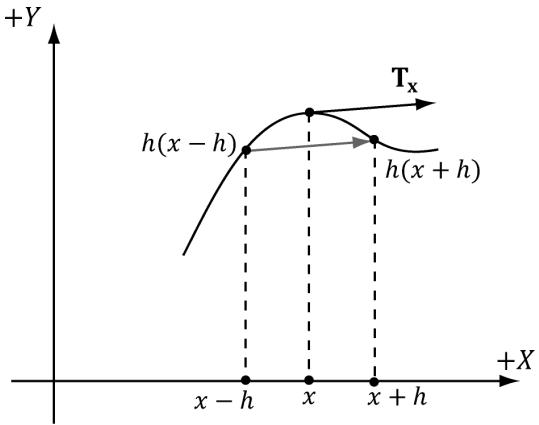


Figure 24.6. Central differences. The difference $\frac { h ( x + h ) - h ( x - h ) } { 2 h }$ gives the slope of the tangent vector in the $x$ -direction. We use this difference as an estimate for the tangent vector at point x.


where 

```javascript
drawCB.gTerrainTexelSizeUV.x = 1.0f / mInfo.HeightmapWidth;  
drawCB.gTerrainTexelSizeUV.y = 1.0f / mInfo.HeightmapHeight; 
```

# 24.3 FRUSTUM CULLING PATCHES

Terrains generally cover a vast area and many of our patches will not be seen by the camera. This suggests that frustum culling will be a good optimization. If a patch has tessellation factors of all zero, then the GPU discards the patch from further processing; this means effort is not wasted tessellating a patch only for those triangles to later on be culled in the clipping stage. 

In order to do frustum culling, we need two ingredients: we need the view frustum planes, and we need a bounding volume about each patch. Exercise聽 2 of Chapter 16 explained how to extract the view frustum planes. Code that implements the solution to this exercise is as follows (implemented in MathHelper.h/MathHelper.cpp): 

```cpp
void MathHelper::ExtractFrustumPlanes(const Matrix& M, XMFLOAT4 outPlanes[6])  
{ Plane planes[6]; // // Left planes[0].x = M(0, 3) + M(0, 0); planes[0].y = M(1, 3) + M(1, 0); planes[0].z = M(2, 3) + M(2, 0); planes[0].w = M(3, 3) + M(3, 0); // Right planes[1].x = M(0, 3) - M(0, 0); planes[1].y = M(1, 3) - M(1, 0); planes[1].z = M(2, 3) - M(2, 0); planes[1].w = M(3, 3) - M(3, 0); // Bottom planes[2].x = M(0, 3) + M(0, 1); planes[2].y = M(1, 3) + M(1, 1); planes[2].z = M(2, 3) + M(2, 1); planes[2].w = M(3, 3) + M(3, 1); 
```

//   
// Top   
//   
planes[3].x $=$ M(0,3)-M(0,1); planes[3].y $=$ M(1,3)-M(1,1); planes[3].z $=$ M(2,3)-M(2,1); planes[3].w $=$ M(3,3)-M(3,1);   
//   
// Near   
//   
planes[4].x $=$ M(0,2); planes[4].y $=$ M(1,2); planes[4].z $=$ M(2,2); planes[4].w $=$ M(3,2);   
// Far   
//   
planes[5].x $=$ M(0,3)-M(0,2); planes[5].y $=$ M(1,3)-M(1,2); planes[5].z $=$ M(2,3)-M(2,2); planes[5].w $=$ M(3,3)-M(3,2);   
//Normalize the plane equations. for(int i $= 0$ ;i<6;++i) { planes[i].Normalize(); outPlanes[i] $\equiv$ planes[i]; } 

Next, we need a bounding volume about each patch. Since each patch is rectangular, we choose an axis-aligned bounding box as our bounding volume. The patch control points inherently encode the x- and $z \mathrm { . }$ -coordinate bounds since we construct the patches as rectangles in the $_ { x z }$ -plane. What about the y-coordinate bounds? To obtain the $\boldsymbol { y }$ -coordinate bounds, we must do a preprocessing step. Each patch covers $n \times n$ elements of the heightmap. For each patch, we scan the heightmap entries covered by the patch, and compute the minimum and maximum y-coordinates. We then store these values in the top-left control point of the patch, so that we have access to the $y$ -bounds of the patch in the constant hull shader. The following code shows us computing the $y$ -bounds for each patch: 

```cpp
// x-stores minY, y-stores maxY.  
std::vector< DirectX::XMFLOAT2> mPatchBoundsY;  
void Terrain::CalcAllPatchBoundsY()  
{  
    mPatchBoundsY resize(mNumPatchQuadFaces); 
```

```cpp
// For each patch
for (UINT i = 0; i < mNumPatchVertRows-1; ++i)
{
    for (UINT j = 0; j < mNumPatchVertCols-1; ++j)
    {
        CalcPatchBoundsY(i, j);
    }
} 
```

```cpp
mPatchBoundsY[patchID].y; } 1 [] 
```

Now in the constant hull shader, we can construct our axis-aligned bound box, and perform box/frustum intersection test to see if the box lies outside the frustum. We use a different box/plane intersection test than we explained in Chapter 16. It is actually a special case of the OBB/plane test described in Exercise聽 4 of Chapter聽 16. Because the box is axis-aligned, the formula for the radius $r$ simplifies as follows: 

$$
a _ {0} \mathbf {r} _ {0} = (a _ {0}, 0, 0)
$$

$$
a _ {1} \mathbf {r} _ {1} = (0, a _ {1}, 0)
$$

$$
a _ {2} \mathbf {r} _ {2} = (0, 0, a _ {2})
$$

$$
\begin{array}{l} r = \left| a _ {0} \mathbf {r} _ {0} \cdot \mathbf {n} \right| + \left| a _ {1} \mathbf {r} _ {1} \cdot \mathbf {n} \right| + \left| a _ {2} \mathbf {r} _ {2} \cdot \mathbf {n} \right| \\ = a _ {0} \left| n _ {x} \right| + a _ {1} \left| n _ {y} \right| + a _ {2} \left| n _ {z} \right| \\ \end{array}
$$

We like this test over the one in $\ S 1 6 . 2 . 4 . 3$ because it does not contain conditional statements. 

```javascript
// In PerPassCB  
float4 gWorldFrustumPlanes[6];  
// Returns true if the box is completely behind (in negative half space) of plane.  
bool AabbBehindPlaneTest(float3 center, float3 extents, float4 plane) { float3 n = abs(plane.xyz); // This is always positive. float r = dot(extents, n); // signed distance from center point to plane. float s = dot(float4(center, 1.0f), plane); // If the center point of the box is a distance of e or more behind the plane (in which case s is negative since it is behind the plane), // then the box is completely in the negative half space of the plane. return (s + r) < 0.0f; } 
```

```javascript
// Returns true if the box is completely outside the frustum.   
bool AabbOutsideFrustumTest(float3 center, float3 extents, float4 frustumPlanes[6])   
{ for(int i = 0; i < 6; ++i) { // If the box is completely behind any of the frustum planes // then it is outside the frustum. if(AabbBehindPlaneTest(center, extents, frustumPlanes[i])) { return true; } } return false;   
}   
PatchTess ConstantHS(InputPatch<VertexOut, 4> patch, uint patchID : SV_PrimitiveID) { PatchTess pt; // // Frustum cull // // We store the patch BoundsY in the first control point. float minY = patch[0].BoundsY.x; float maxY = patch[0].BoundsY.y; // Build axis-aligned bounding box. patch[2] is lower-left corner // and patch[1] is upper-right corner. float3 vMin = float3(patch[2].PosW.x, minY, patch[2].PosW.z); float3 vMax = float3(patch[1].PosW.x, maxY, patch[1].PosW.z); float3 boxCenter = 0.5f*(vMin + vMax); // Inflate box a bit to compensate for material layer // displacement mapping which we did not account for // when we computed the patch bounds. float3 boxExtents = 0.5f*(vMax - vMin) + float3(1, 1, 1); if(AabbOutsideFrustumTest.boxCenter, boxExtents, gWorldFrustumPlanes)) { pt.EdgEiss[0] = 0.0f; pt.EdgEiss[1] = 0.0f; pt.EdgEiss[2] = 0.0f; pt.EdgEiss[3] = 0.0f; pt.InsiderTess[0] = 0.0f; pt.InsiderTess[1] = 0.0f; 
```

```cpp
return pt;   
1   
//   
// Do normal tessellation based on distance.   
//   
else   
{ [..]   
} 
```

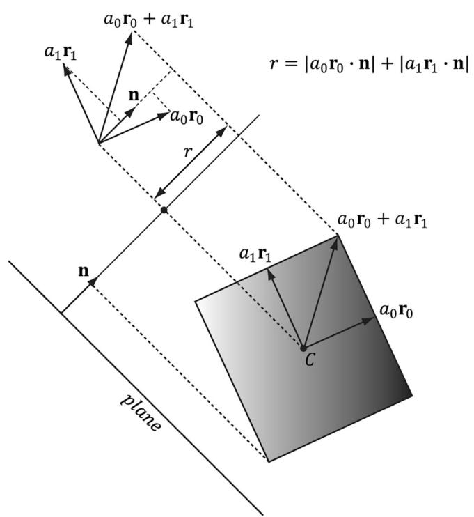


Figure 24.7. OBB/plane intersection test. We can use the same test for an AABB since an AABB is a special case of an OBB. Moreover, the formula for r simplifies in the case of an AABB.


# 24.4 TEXTURING

Recall $\ S 9 . 1 1$ , where we tiled a grass texture over hills. We tiled the texture to increase the resolution (i.e., to increase the number of texel samples that covered a triangle on the land mass). We want to do the same thing here; however, we do not want to be limited to a single grass texture. We would like to create terrains depicting sand, grass, dirt, rock, and snow, all at the same time. You might suggest 

creating one large texture that contains the sand, grass, and dirt, and stretch it over the terrain. But this would lead us back to the resolution problem鈥攖he terrain geometry is so large, we would require an impractically large texture to have enough color samples to get a decent resolution. Instead, we take a multitexturing approach that works like transparency alpha blending. 

The idea is to have a separate texture for each terrain layer (e.g., one for grass, dirt, and rock) These textures will be tiled over the terrain for high resolution. For the sake of example, suppose we have three terrain layers (grass, dirt, and rock); then these layers are then combined as shown in Figure 24.8. 

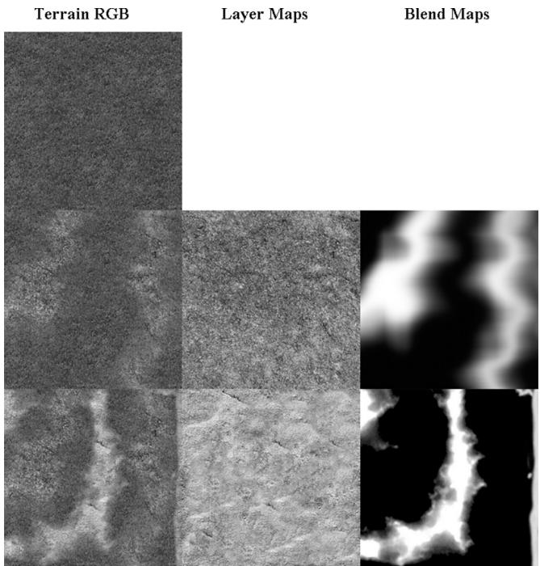


Figure 24.8. (Top) First lay down the 0th layer (grass) as the current terrain color. (Middle) Now blend the current terrain color with the 1st layer (dirt) via the transparency alpha blending equation; the blend map supplies the source alpha component. (Bottom) Finally, blend the current terrain color with the 2nd layer (rock) via the transparency alpha blending equation; the blend map supplies the source alpha component.


The above process should be reminiscent of transparency alpha blending. The blend map, which stores the source alpha of the layer we are writing, indicates the opacity of the source layer, thereby allowing us to control how much of the source layer overwrites the existing terrain color. This enables us to color some parts of the terrain with grass, some parts with dirt, and others with snow, or various blends of all three. 

Although Figure 24.8 illustrates blending with color maps, we can use the same blend map to blend other textures and values of the material such as normal maps and height maps. In this way we blend entire material layers. In our code, we support up to eight material layers. To combine up to eight layers, we require seven grayscale blend maps. We can pack these seven grayscale blend maps into two RGBA textures. We also have to modify our terrain constant buffer to have eight material indices (one for each layer). 

The following terrain pixel shader code shows how our texture blending is implemented. Essentially, we combine the layers and the 鈥渂lended material鈥?is used as our material for shading. 

void CalcBlendedMaterialData(float2 texC, out float4 outAlbedo, out float3 outNormalSample, out float3 outFresnelR0, out float3 outGlossHeightAo)   
{ outAlbedo $=$ float4(0.0f, 0.0f, 0.0f, 0.0f); outNormalSample $\equiv$ float3(0.0f, 0.0f, 0.0f); outFresnelR0 $=$ float3(0.0f, 0.0f, 0.0f); outGlossHeightAo $=$ float3(0.0f, 0.0f, 0.0f); // Sample the blend map. Texture2D blendMap0 $=$ ResourceDescriptorHeap[gBlendMap0SrvIndex]; Texture2D blendMap1 $=$ ResourceDescriptorHeap[gBlendMap1SrvIndex]; float4 blend0 $=$ blendMap0.SampleLevel(GetLinearClampSampler(), texC, 0.0f); float4 blend1 $=$ blendMap1.SampleLevel(GetLinearClampSampler(), texC, 0.0f); float blendPercents[8] $=$ { 1.0f, blendO.y, blendO.z, blendO.w, blend1.x, blend1.y, blend1.z, blend1.w }; // Accumulate the layers. for(int i = 0; i < gNumTerrainLayers; ++i) { // cbuffer packs 8 material indices into 2 uint4s: // uint4 gTerrainLayerMaterialIndices[2]; uint matVectorIndex $= \mathrm{i} / 4$ . uint matIndexInVector $= \mathrm{i}\% 4$ . uint matIndex $=$ gTerrainLayerMaterialIndices [matVectorIndex] [matIndexInVector]; // Fetch the material data. MaterialData matData $=$ gMaterialData[matIndex]; float4 diffuseAlbedo $=$ matData.DiffuseAlbedo; float3 fresnelR0 $=$ matData.FresnelR0; float roughness $=$ matData.Roughness; uint diffuseMapIndex $=$ matData.DiffuseMapIndex; 

uint normalMapIndex = matData.NormalMapIndex;  
uint glossHeightAoMapIndex = matData.GlossHeightAoMapIndex;  
float2 layerTexC = mul(float4(texC, 0.0f, 1.0f), matData. MatTransform).xy;  
// Dynamically look up the texture in the array. Texture2D diffuseMap = ResourceDescriptorHeap[diffuseMapIndex]; Texture2D normalMap = ResourceDescriptorHeap[normalMapIndex]; Texture2D glossHeightAoMap = ResourceDescriptorHeap[glossHeight AoMapIndex]; diffuseAlbedo $\ast =$ diffuseMap_SAMPLE( GetAnisoWrapSampler(), layerTexC); float3 normalMapSample = normalMap_SAMPLE( GetAnisoWrapSampler(), layerTexC).rgb; float3 glossHeightAo = glossHeightAoMap/sample( GetAnisoWrapSampler(), layerTexC).rgb; glossHeightAo.x $\ast =$ (1.0f - roughness); // Blend each material component. outAlbedo $=$ lerp(outAlbedo, diffuseAlbedo, blendPercents[i]); outNormalSample $=$ lerp(outNormalSample, normalMapSample, blendPercents[i]); outFresnelR0 $=$ lerp(outFresnelR0, fresnelR0, blendPercents[i]); outGlossHeightAo $=$ lerp(outGlossHeightAo, glossHeightAo, blendPercents[i]); }   
}   
float4 PS(DomainOut pin) : SV_Target { float4 diffuseAlbedo; float3 normalMapSample; float3 fresnelR0; float3 glossHeightAo; CalcBlendedMaterialData(pin.TexC, diffuseAlbedo, normalMapSample, fresnelR0, glossHeightAo); float3 tangentW; float3 bitangentW; float3 normalW; EstimateTangentFrame(pin.TexC, tangentW, bitangentW, normalW); float3 bumpedNormalW $=$ normalW; if( gNormalMapsEnabled ) { bumpedNormalW $=$ NormalSampleToWorldSpace(normalMapSample, normalW, tangentW); } 

// Vector from point being lit to eye. float3 toEyeW = normalize(gEyePosW - pin(PosW); // Light terms. float4 ambient = gAmbientLight*diffuseAlbedo; ambient $\ast =$ glossHeightAo.z; // Only the first light casts a shadow. float3 shadowFactor $=$ float3(1.0f, 1.0f, 1.0f); if( gShadowsEnabled ) { shadowFactor[0] $=$ CalcShadowFactor(pin.ShadowPosH); } const float shininess $=$ glossHeightAo.x; Material mat $=$ { diffuseAlbedo, fresnelR0, shininess }; float4 directLight $=$ ComputeLighting(gLights, mat, pin(PosW, bumpedNormalW, toEyeW, shadowFactor); float4 litColor $=$ ambient + directLight; // Add in specular reflections. if( gReflectionsEnabled ) { TextureCube gCubeMap $=$ ResourceDescriptorHeap[gSkyBoxIndex]; float3 r $=$ reflect(-toEyeW,bumpedNormalW); float4 reflectionColor $=$ gCubeMap. Sample(GetLinearWrapSampler(), r); float3 fresnelFactor $=$ SchlickFresnel(fresnelR0,bumpedNormalW,r); litColor.rgb $+ =$ shininess \* fresnelFactor \*reflectionColor. rgb; } // Common convention to take alpha from diffuse albedo. litColor.a $=$ diffuseAlbedo.a; return litColor; 

Unlike the layer textures, the blend maps are not tiled, as we stretch them over the entire terrain surface. This is necessary since we use the blend map to mark regions of the terrain where we want a particular texture to show through, so the blend map must be global and cover the whole terrain. You might wonder whether this is acceptable or if excessive magnification occurs. Indeed, magnification will occur and the blend maps will be distorted by the texture filtering when it is stretched over the entire terrain, but the blend maps are not where we get our details from (we get them from the tiled textures). The blend maps merely mark the general regions of the terrain where (and how much) a particular texture contributes. If the blend maps get a distorted and blurred, it 

will not significantly affect the end result鈥攑erhaps a bit of dirt will blend in with a bit of grass, for example, and this actually provides a smoother transition between layers. 

# 24.4.1 Material Displacement

Recall that materials can also store heightmaps, which describe the elevation differences between different parts of the material being modeled. We can perform a similar blending strategy for material heightmaps and offset the tessellated vertices by the blended material height in the domain shader. Since the terrain materials are tiled, we can get heightmap details at a much higher granularity than the heightmap provided we tessellate enough. We will not repeat all the code, but CalcBlendedDisplacement is very similar to CalcBlendedMaterialData except that we blend the heightmaps. 

// Dynamically look up the texture in the array. Texture2D glossHeightAoMap = ResourceDescriptorHeap[glossHeightAoMapIndex]; float layerHeight = glossHeightAoMapSAMPLELevel(GetAnisoWrapSampler(), layerTexC, 0.0f).g; layerHeight $\text{鍗亇 =$ matData.DisplacementScale; height $=$ lerp( height, layerHeight, blendPercents[i]); 

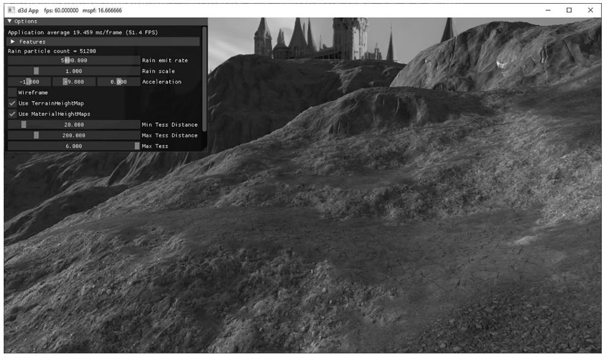


Figure 24.9. Screenshot of the 鈥淭errain鈥?demo


We apply the result in the domain shader to the tessellated vertices: 

float materialDisplacement $=$ CalcBlendedDisplacement(dout.TexC); dout.PosW.y $+ =$ materialDisplacement; 

# 24.5 TERRAIN HEIGHT

A common task is to get the height, on the CPU, of the terrain surface given the $x \cdot$ - and $z$ -coordinates. This is useful for placing objects on the surface of the terrain or for placing the camera slighting above the terrain surface to simulate the player walking on the terrain. 

The heightmap gives us the height of a terrain vertex at the grid points. However, we need the heights of the terrain between vertices. Therefore, we have to do an interpolation to form a continuous surface $y = h ( x , z )$ representing the terrain given the discrete heightmap sampling. Since the terrain is approximated by a triangle mesh, it makes sense to use linear interpolation so that our height function agrees with the underlying terrain mesh geometry. 

To begin to solve this, our first goal is to determine which cell the $x \cdot$ - and $z \mathrm { . }$ -coordinates lie in. (Note: We assume the coordinates $x$ and $z$ are relative to the local space of the terrain.) The following code does this; it tells us the row and column of the cell the $x \cdot$ - and $z$ -coordinates are located. 

```javascript
// Transform from terrain local space to "cell" space. float c = (x + 0.5f*width()) / mInfo.CellSpacing; float d = (z - 0.5f*depth()) / -mInfo.CellSpacing; // Get the row and column we are in. int row = (int)floorf(d); int col = (int)floorf(c); 
```

Figure 24.10ab explains what this code does. Essentially, we are transforming to a new coordinate system where the origin is at the upper-left most terrain vertex, the positive $z$ -axis goes down, and each unit is scaled to that it corresponds to one cell space. Now in this coordinate system, it is clear by Figure $2 4 . 1 0 b$ that the row and column of the cell is just given by floor(z) and floor(x), respectively. In the figure example, the point is in row 4 and column 1 (using zero based indices). (Recall that floor(t) evaluates to the greatest integer less than or equal to t.) Observe also that row and col also give the indices of the upper-left vertex of the聽cell. 

Now that we know the cell we are in, we obtain the heights of the four cell vertices from the heightmap: 

```c
// Grab the heights of the cell we are in.  
// A\*-B 
```

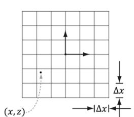


(a锛?


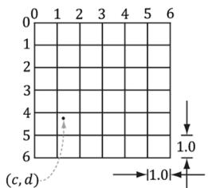


(b)


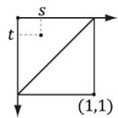


(c)


Figure 24.10. (a) The point in the $x z$ -plane relative to the terrain coordinate system has coordinates $( x , z )$ . (b) We pick a new coordinate where the origin is the upper-left most grid vertex, the positive $z$ -axis goes down, and each unit is scaled to that it corresponds to one cell space. The point has coordinates $( c , d )$ relative to this coordinate system. This transformation involves a translation and scaling. Once in this new coordinate system, finding the row and column of the cell we are in is trivial. (c) We introduce a third coordinate system, which has its origin at the upper-left vertex of the cell the point is in. The point has coordinates $( s , t )$ relative to this coordinate system. Transforming the coordinates into this system involves only a simple translation to offset the coordinates. Observe that if $s + t \leq 1$ we are in the 鈥渦pper鈥?triangle, otherwise we are in the 鈥渓ower鈥?triangle.


```javascript
// | |  
// | |  
// C\*---*D  
float A = mHeightmap[row*mInfo.HeightmapWidth + col];  
float B = mHeightmap[row*mInfo.HeightmapWidth + col + 1];  
float C = mHeightmap[(row+1)*mInfo.HeightmapWidth + col];  
float D = mHeightmap[(row+1)*mInfo.HeightmapWidth + col + 1]; 
```

At this point, we know the cell we are in and we know the heights of the four vertices of that cell. Now we need to find the height (y-coordinate) of the terrain surface at the particular x- and $z$ -coordinates. This is a little tricky since the cell can be slanted in a couple of directions; see Figure 24.11. 

In order to find the height, we need to know which triangle of the cell we are in (recall our cells are rendered as two triangles). To find the triangle we are in, we are going to change our coordinates so that the coordinates $( c , d )$ are described relative to the cell coordinate system (see Figure 24.10c). This simple change of coordinates involves only translations and is done as follows: 

float $\mathrm { ~ { ~ \bf ~ s ~ } ~ } = \mathrm { ~ { ~ \bf ~ C ~ } ~ } - \mathrm { ~ { ~ \bf ~ } ~ }$ (float)col; 

float $\mathrm { ~ t ~ } = \mathrm { ~ d ~ } -$ (float)row; 

Then, if $s + t \leq 1$ we are in the 鈥渦pper鈥?triangle 鈭咥BC, else we are in the 鈥渓ower鈥?triangle 鈭咲CB. 

Now we explain how to find the height if we are in the 鈥渦pper鈥?triangle. The process is similar for the 鈥渓ower鈥?triangle, and, of course, the code for both follows. To find the height if we are in the 鈥渦pper鈥?triangle, we first construct two vectors, $\mathbf { u } = ( \Delta x , B - A , 0 )$ and $\mathbf { v } = ( 0 , C - A , - \Delta z )$ , on the sides of the triangle originating 

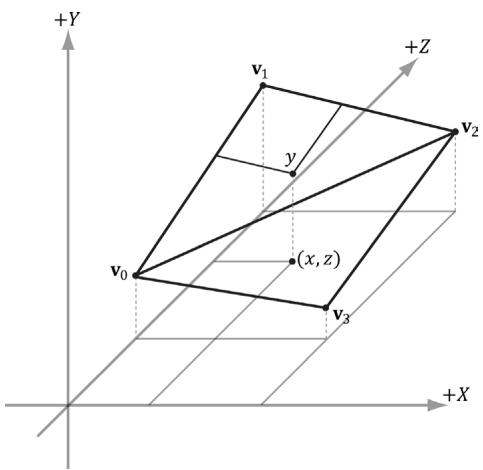


Figure 24.11. The height (y-coordinate) of the terrain surface at the particular $x -$ and z-coordinates.


from the terminal point Q, as Figure $2 4 . 1 2 a$ shows. Then we linearly interpolate along u by s, and we linearly interpolate along v by $t$ . Figure $2 4 . 1 2 b$ illustrates these interpolations. The $\boldsymbol { y }$ -coordinate of the point $\mathbf { Q } + s \mathbf { u } + t \mathbf { v }$ gives the height based on the given x- and $z$ -coordinates (recall the geometric interpretation of vector addition to see this). 

Note that since we are only concerned about the interpolated height value, we can interpolate the y-components and ignore the other components. Thus, 

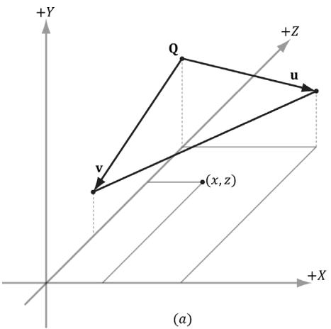


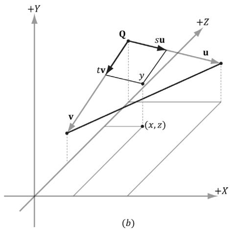


Figure 24.12. (a) Computing two vectors on the upper-triangle edges. (b) The height is the y-coordinate of the vector.


the height is obtained by the sum $A + s u _ { y } + t \nu _ { y }$ . Thus the conclusion of the Terrain::GetHeight code is as follows: 

```cpp
// If upper triangle ABC.  
if(s + t <= 1.0f)  
{ float uy = B - A; float vy = C - A; return A + s*uy + t*vy; } else // lower triangle DCB. { float uy = C - D; float vy = B - D; return D + (1.0f-s)*uy + (1.0f-t)*vy; } 
```

# 24.6 SUMMARY

1. We can model terrains using triangle grids, where the height of each vertex is specified in such a way that hills and valleys are simulated. 

2. A heightmap is a matrix where each element specifies the height of a particular vertex in the terrain grid. There exists an entry in the heightmap for each grid vertex, and the ijth heightmap entry provides the height for the ijth vertex. A heightmap is commonly represented visually as a grayscale map, where black denotes the smallest height, white denotes the largest height, and shades of gray represent in-between heights. 

3. Terrains cover large areas, and consequently, the number of triangles needed to build them is large. If we use a uniformly tessellated grid, the screen space triangle density of the terrain will increase with distance due to the nature of perspective projection. This is actually the opposite of what we want: we want the triangle density to be large near the camera where the details will be noticed, and the triangle density to be smaller far away from the camera where the details will go unnoticed. We can use hardware tessellation to implement continuous level of detail based on the distance from the camera. The overall strategy for terrain tessellation can be summarized as follows: 

a. Lay down a grid of quad patches. 

b. Tessellate the patches based on their distance from the camera. 

c. Bind the heightmap as a shader resource. In the domain shader, perform displacement mapping from the heightmap to offset the generated vertices to their proper heights. 

4. We can implement frustum culling on the GPU to cull quad patches outside the frustum. This is done in the constant hull shader function by setting all the tessellation factors to 0 for patches outside the frustum. 

5. We texture the terrain by blending layers over each other (e.g., grass, dirt, rock, and snow). Blend maps are used to control the amount each layer contributes to the final terrain image. 

6. The heightmap gives us the height of a terrain vertex at the grid points, but we also need the heights of the terrain between vertices. Therefore, we have to do interpolation to form a continuous surface $y = h ( x , z )$ representing the terrain given the discrete heightmap sampling. Since the terrain is approximated by a triangle mesh, it makes sense to use linear interpolation so that our height function agrees with the underlying terrain mesh geometry. Having the height function of the terrain is useful for placing objects on the surface of the terrain, or for placing the camera slighting above the terrain surface to simulate the player walking on the terrain. 

# 24.7 EXERCISES

1. Use the GetHeight function to keep the camera grounded to the terrain but offset on the world y-axis so that the camera is above ground. 

2. Generally, some parts of a terrain will be rough and hilly with numerous details, and other parts will be flat and smooth. It is common to bias tessellation so that patches that contain high-frequency regions are more tessellated so that the extra details show up. Likewise, flat areas do not need as much tessellation; for example, a flat quad patch does not need to be subdivided at all. Research ways to calculate a roughness factor per patch. The SDK sample 鈥淒etailTessellation11鈥?would be a good starting point, which calculates a density map that indicates areas of the displacement map that has high-frequency regions. 

3. Try generating your own height maps and using them in the Terrain demo. Try authoring your own blend map. 

4. We use continuous level of detail with the fractional_even tessellation mode. For debugging purposes, make the following changes to the CalcTessFactor function to make it easier to see the different LOD levels of the terrain. 

```cpp
float CalcTessFactor(float3 p)   
{ //maxnorminxzplane(useful to see detail levels 
```

```javascript
// from a bird's eye). float d = max(abs(p.x - gEyePosW.x), abs(p.z - gEyePosW.z)); float s = saturate((d - gMinDist) / (gMaxDist - gMinDist)); return pow(2, round(lerp(gMaxTess, gMinTess, s)) ); } 
```

We have made two changes. First, we use the max norm in the $_ { x z }$ -plane to measure distance. This allows us to zoom out to a bird鈥檚 eye view without affecting the distance (since y-coord is ignored). Second, we round the exponent to an integer so that the tessellation factor is always an integer power of 2. This gives us exactly seven discrete LOD levels: $2 ^ { 0 } , 2 ^ { 1 } , . . . , 2 ^ { 6 }$ . For this exercise, make the above changes to the CalcTessFactor function, and zoom out to see something like Figure 24.7. It might help to disable drawing the sky and to draw the terrain black in wireframe mode. 
