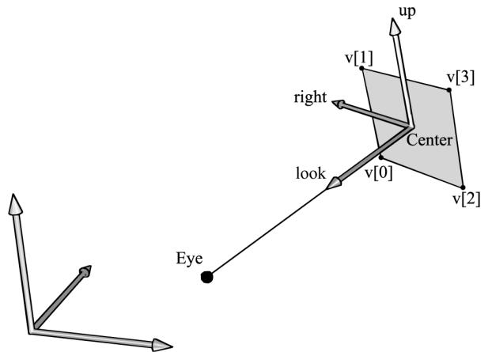
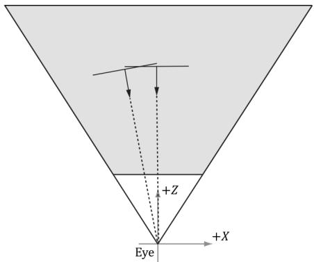
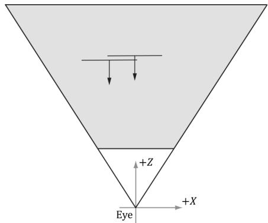
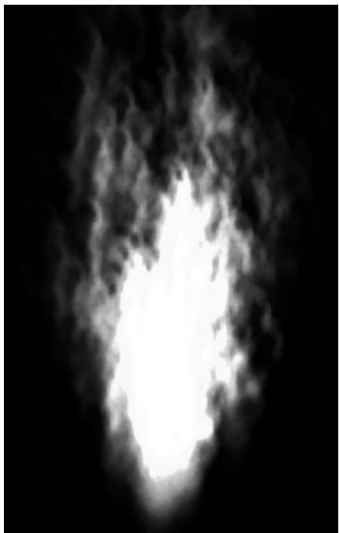
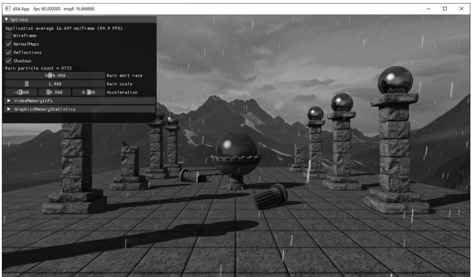
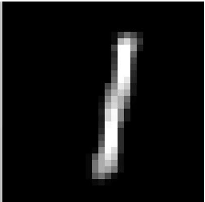
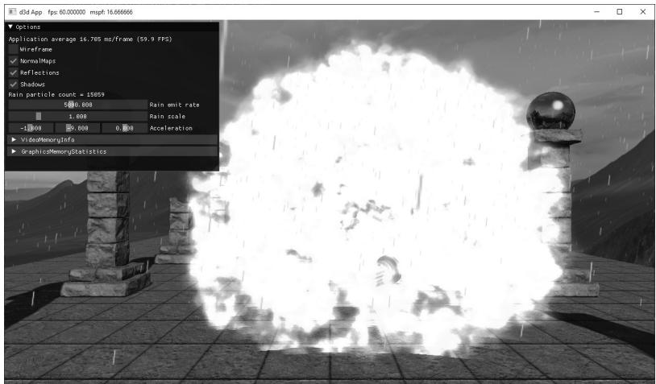
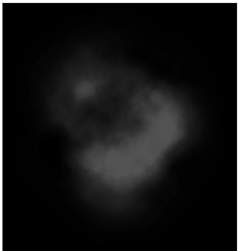

# Chapter

# 25 Particl e System s

In this chapter, we concern ourselves with the task of modeling a collection of particles (usually small) that all behave in a similar yet somewhat random manner; we call such a collection of particles a particle system. Particle systems can be used to simulate a wide range of phenomena such as fire, rain, smoke, explosions, sprinklers, magic spell effects, and projectiles. 

# Chapter Objectives:

1. To learn how to store, update, and render particles efficiently using the compute shader 

2. To find out how we can make our particles move in a physically realistic way using basic physics concepts 

3. To design a flexible particle system framework that makes it easy to create new custom particle systems 

# 25.1 PARTICLE REPRESENTATION

A particle is a very small object that is usually mathematically modeled as a point. It follows then that a point primitive (D3D_PRIMITIVE_TOPOLOGY_POINTLIST) would be a good candidate to display particles. However, point primitives are rasterized 

as a single pixel. This does not give us much flexibility, as we would like to have particles of various sizes and even map entire textures onto these particles. Therefore, we will want to represent a particle by two triangles to form a quad that faces the camera (see Figure 25.1). 




Figure 25.1. The world and billboard frames. The billboard faces the eye position E.


Note that for additive blended particles where sort order does not matter, you can have the particles completely oriented towards the camera. For transparent particles, it is better to orientate the quads parallel to the $x y$ -plane in view space looking down the negative $z$ -axis. This is so that all points on the particle quad have the same depth value. This makes the particles easy to sort by $z$ -coordinate with respect to the camera in view space, and you do not get depth sorting artifacts from intersecting particles (Figure 25.2). 




(a)





(b)


Figure 25.2. (a) Particles aimed at the camera can intersect which causes incorrect sorting. (b) Particles parallel to the xy-plane in view space have unambiguous sorting.


# 25.2 PARTICLE MOTION

We would like our particles to move in a somewhat physically realistic way. Recall that average speed is defined by distance over time. If you traveled 40 miles in 30 minutes, then you averaged $8 0 ~ \mathrm { { m p h } = 4 0 ~ m ~ / ~ 0 . 5 ~ h }$ . Velocity is similar, but velocity is a vector valued quantity and cares about the direction of travel, not just the distance. The average velocity of a particle is defined by the change in position $\mathfrak { p } _ { n + 1 } - \mathfrak { p } _ { n }$ over some time interval $\Delta t = t _ { n + 1 } - t _ { n }$ : 

$$
\mathbf {v} _ {n} = \frac {\mathbf {p} _ {n + 1} - \mathbf {p} _ {n}}{\Delta t}
$$

Put another way, if we start at position ${ \bf { p } } _ { n }$ and travel with velocity $\mathbf { v } _ { n }$ for $\Delta t$ seconds, then we end up at position $\mathbf { p } _ { n + 1 }$ : 

$$
\mathbf {p} _ {n + 1} = \mathbf {p} _ {n} + \Delta t \mathbf {v} _ {n}
$$

Similarly, the average acceleration of a particle is defined as the change in velocity over some time interval: 

$$
\mathbf {a} = \frac {\mathbf {v} _ {n + 1} - \mathbf {v} _ {n}}{\Delta t}
$$

Put another way, if we start with velocity position $\mathbf { v } _ { n }$ and apply an acceleration a for $\Delta t$ seconds, then we end up with a velocity $\mathbf { v } _ { n + 1 }$ : 

$$
\mathbf {v} _ {n + 1} = \mathbf {v} _ {n} + \Delta t \mathbf {a}
$$

If we make $\Delta t$ small, say $1 / 6 0 ^ { \mathrm { t h } }$ of a second, then the average velocity approximates the instantaneous velocity and the average acceleration approximates the instantaneous acceleration, and we get something that looks like smooth continuous motion. 

Recall that forces cause accelerations: $\mathbf { F } _ { \mathrm { n e t } } = m \mathbf { a }$ , where $\mathbf { F } _ { \mathrm { n e t } }$ is the sum of all the forces acting on a mass m. A game could model various forces such as gravity, wind, and springs. However, for our purposes, we specify the net acceleration as a simple constant per frame for each particle system. We assume particles in a system have the same mass, and we can include the mass in the acceleration vector. The acceleration can change frame-to-frame, but for a given frame, it is constant a = Fnet . $\begin{array} { r } { \mathbf { a } = \frac { \mathbf { F } _ { \mathrm { n e t } } } { m } } \end{array}$ Given this, and given that we initialize a particle’s initial position $\mathbf { p } _ { 0 }$ and initial velocity $\mathbf { v } _ { 0 }$ , we can use the following formulas to update a particle’s position and velocity each frame: 

$$
\begin{array}{l} \mathbf {v} _ {n + 1} = \mathbf {v} _ {n} + \Delta t \mathbf {a} \\ \mathbf {p} _ {n + 1} = \mathbf {p} _ {n} + \Delta t \mathbf {v} _ {n} \\ \end{array}
$$

# 25.3 RANDOMNESS

In a particle system, we want the particles to behave similarly, but not exactly the same; in other words, we want to add some randomness to the system. For example, if we are modeling raindrops, we do not want the rain drops to fall in exactly the same way; we want them to fall from different positions, at slightly different angles, and at slightly different speeds. To facilitate randomness functionality required for particle systems, we use the RandF functions implemented in Random.h/.cpp and MathHelper.h/.cpp: 

class Random   
{   
public: Random() { if(_initialized $= =$ false) { // Use non-deterministic generator to seed the // faster Mersenne twister. auto seed $=$ _randDevice(); _mt.seed(seed); _initialized $=$ true; } int Uniform(int a, int b) { std::uniform_int_distribution<int> dist(a, b); return dist(_mt); } float Uniform(float a, float b) { std::uniform_real_distribution<int> dist(a, b); return dist(_mt); } double Uniform(double a, double b) { std::uniform_real_distribution<double> dist(a, b); return dist(_mt); } private: static bool _initialized; static std::random_device _randDevice; static std::mt19937 _mt; }; // Returns random float in [0, 1). 

```c
static float RandF()
{
    Random r;
    return r.uniform(0.0f, 1.0f);
}
// Returns random float in [a, b).
static float RandF(float a, float b)
{
    Random r;
    return r.uniform(a, b);
}
static int Rand(int a, int b)
{
    Random r;
    return r.uniform(a, b);
} 
```

The above functions work for $\mathrm { C } { + } { + }$ code, but we also need random numbers in the shader code. Generating random numbers in a shader is trickier since we do not have a shader random number generator. So, we create a 2D texture with four components (DXGI_FORMAT_R8G8B8A8_UNORM) and fill the texture with random 4D vectors with coordinates in the interval [0, 1). The texture is sampled with the wrap address mode, so that we can use unbounded texture coordinates outside the normalized texture interval [0, 1]. The shader code then samples this texture to get a random number. There are different ways to sample the random texture. If each particle has a different $x$ -coordinate, we could use the $x$ -coordinate as a texture coordinate to get a random number. However, this will not work very well if many of the particles have the same $x$ -coordinate, as then they would all sample the same value in the texture, which would not be very random. Another approach is to use the current game time value as a texture coordinate. This way, particles generated at different times would get different random values. However, this means particles generated at the same time will have the same values. This can be a problem if the particle system needs to emit several particles at once. When generating many particles at the same time, we can add a different texture coordinate offset value to the game time so that we sample different points on the texture map, and hence get different random values. For example, if we were looping 20 times to create 20 particles, we could use the loop index (appropriately scaled) to offset the texture coordinate used to sample the random texture. This way, we would get 20 different random values. 

The following code shows how to generate a random texture: 

```cpp
ComPtr<ID3D12Resource> d3dUtil::CreateRandomTexture(
ID3D12Device* device, ResourceUploadBatch& resourceUpload,
size_t width, size_t height) 
```

{ std::vector<XMCOLOR> initData(width \* height); for(int i = 0; i < height; ++i) { for(int j = 0; j < width; ++j) { // Random vector in [0,1). DirectX::XMFLOAT4 v( MathHelper::RandF(), MathHelper::RandF(), MathHelper::RandF(), MathHelper::RandF()); initData[i \* width + j] = XMCOLOR(v.x, v.y, v.z, v.w); } D3D12_SUBRESOURCE_DATA subResourceData = {}; subResourceData.pData = initData.data(); subResourceData.RowPitch = width \* sizeof(XMCOLOR); subResourceData.SlicePitch = subResourceData.RowPitch \* width; ComPtr<ID3D12Resource> randomTex; ThrowIfFailedCreateInfoFromMemory(device, resourceUpload, width, height, DXGI_FORMAT_R8G8B8A8_UNORM, subResourceData, &randomTex)); return randomTex; } auto randomTex $=$ std::make_unique<Texture>(); randomTex->Name $=$ "randomTex1024"; randomTex->Filename $=$ L"; randomTex->IsCubeMap $=$ false; randomTex->Resource $=$ d3dUtil::CreateRandomTexture( device, uploadBatch, 1024, 1024); mTextures[randTex->Name] $=$ std::move(randomTex); mRandomTexBindlessIndex $=$ texLib["randomTex1024"]->BindlessIndex; 

Note that for a random texture, we only need one mipmap level. To sample a texture with only one mipmap, we use the SampleLevel intrinsic function. This function allows us to explicitly specify the mipmap level we want to sample. The first parameter to this function is the sampler; the second parameter is the texture coordinates (only one for a 1D texture); the third parameter is the mipmap level (which should be 0 in the case of a texture with only one mipmap level). 

# 25.4 BLENDING AND PARTICLE SYSTEMS

Particle systems are usually drawn with some form of blending. For effects like fire and magic spells, we want the color intensity to brighten at the location of the particles. For this effect, additive blending works well. That is, we just add the source and destination colors together. However, particles are also typically transparent; therefore, we must scale the source particle color by its opacity; that is, we use the blend parameters: 

SrcBlend $=$ D3D12_BLEND_SRC_alpha; DestBlend $=$ D3D12_BLEND_ONE; BlendOp $=$ D3D12_BLEND_OP_ADD; 

This gives the blending equation: 

$$
\mathbf {C} = a _ {s} \mathbf {C} _ {s r c} + \mathbf {C} _ {d s t}
$$

In other words, the amount of color the source particle contributes to the sum is determined by its opacity: the opaquer the particle is, the more color it contributes. An alternative approach is to premultiply the texture with its opacity (described by the alpha channel) so that the texture color is diluted based on its opacity. Then we use the diluted texture. In this case, we can use the blend parameters: 

SrcBlend $=$ D3D12_BLEND_ONE; DestBlend $=$ D3D12_BLEND_ONE; BlendOp $=$ D3D12_BLEND_OP_ADD; 

This is because we essentially precomputed $a _ { s } \mathbf { C } _ { s r c }$ and included it directly in the texture data. 

Additive blending also has the nice effect of brightening up areas proportional to the particle concentration there (due to additive accumulation of the colors); thus, areas where the concentration is denser appear extra bright, which is usually what we want (see Figure 25.3). 

For things like smoke, additive blending does not work because adding the colors of a bunch of overlapping smoke particles would eventually brighten up the smoke so that it is no longer dark. Blending with the subtraction operator (D3D12_ BLEND_OP_REV_SUBTRACT) would work better for smoke, where the smoke particles would subtract color from the destination. In this way, higher concentrations of smoke particles would result in blacker color, giving the illusion of thick smoke, whereas lower concentrations of smoke particles would result in a mild tint, giving the illusion of thin smoke. However, while this works well for black smoke, it does not work well for light gray smoke, or steam. Another possibility for smoke is to use transparency blending, where we just think of smoke particles as semi-transparent objects and use transparency blending to render them. The 




Figure 25.3. With additive blending, the intensity is greater near the source point where more particles are overlapping and being added together. As the particles spread out, the intensity weakens because there are fewer particles overlapping and being added together.


main problem with transparency blending is sorting the particles in a system in back-to-front order with respect to the eye. Due to the random nature of particle systems, this rule can sometimes be broken without noticeable rendering errors. 

# 25.5 GPU PARTICLE SYSTEM

There are different ways to design and implement particle systems. The main requirement is being able to support different kinds of particle systems that look and move differently. For example, a game might have fire, rain, smoke, explosions, sprinklers, magic spell effects, and projectile type particle systems. One method would be to essentially create custom optimized code for each kind of particle system that defines its look and motion. For example, you might have a separate FireSystem and ExplosionSystem, each with its own separate update and draw implementation. Another approach would be to build a generalized framework that can handle common scenarios. Of course, there are tradeoffs between generality and performance as well as code maintenance. Our approach is somewhat in the middle. We have one general particle system that can be used 

to instantiate different types of particle systems, but it is by no means flexible enough to support every type of particle system. 

As we work through the following subsections, it is helpful to keep in mind a high-level outline of what needs to happen in each frame. 

# 1. For each frame

a) Update existing particles and free particles that die off. 

b) Emit new particles if needed. 

c) Render particles that are alive. 

# 25.5.1 Compute-Based

Particle systems generally emit and destroy particles over time. The seemingly natural way to do this would be to use a dynamic vertex buffer (i.e., upload heap) and keep track of spawning and killing particles on the CPU. Then the vertex buffer would be filled with the currently living particles and drawn. This works, but it burdens the CPU with the work and requires the GPU to read memory across PCI Express. Furthermore, we apply the same update calculations of all particles. Doing the same operation to thousands of data elements is something the GPU excels at. Therefore, we will implement our particle system entirely on the GPU, using compute shaders to update, create, and destroy particles. 

# 25.5.2 Particle Structure

Our particles will be stored in a structured buffer on the GPU. We use the following structure to represent a particle: 

```cpp
struct Particle {
    float3 Position;
    float3 Velocity;
    float2 Size;
    float4 Color;
    float Lifetime;
    float Age;
    float Rotation;
    float RotationSpeed;
    float DragScale;
    uint BindlessTextureIndex;
}; 
```

Position: The current position of the particle 

Velocity: The current velocity of the particle 

Size: The current size of the particle 

Color: The current color of the particle. This is multiplied with the texture color. 

Lifetime: The age at which the particle dies. Besides using the condition Age $> =$ Lifetime to destroy a particle, we can also use Age and Lifetime to fade in a particle at its birth and fade out a particle near its death. 

• Age: The age of the particle 

Rotation: The current rotation of the particle. The particle quad rotates in its 2D plane. 

• RotationSpeed: The rotation speed 

DragScale: A coefficient to control the amount of drag applied to the particle. Specify 0 to disable drag. The drag force is the resistance when traveling in a fluid (such as air), and is a function of the size, shape, and speed or the particle. We essentially encode the size/shape into the DragScale variable. 

BindlessTextureIndex: Index to the texture that will be mapped onto the particle quad for rendering. Different particles can have different textures to get more variation. 

# 25.5.3 Particle Buffers

To store a collection of particles on the GPU, we need a structured buffer. So that we do not have to resize the buffer at runtime (which would be slow), we allocate a buffer with a “max particle” count, which can vary from instance-to-instance. Given a snapshot in time, only some of the particles in the particle buffer will be alive. In addition, because particles have random lifetimes, there is no guarantee that living particles will be contiguous in the particle buffer. Therefore, we also maintain an alive buffer, which indexes into the particle buffer. The alive buffer list is cleared and rebuilt each frame so that we have a contiguous list of living particles to update/draw. Furthermore, when we go to create particles, we need to know which particles in the particle buffer are free (dead) so that we can emit new particles in free slots. The free buffer is used like a stack data structure that stores the indices of all the free particles. When a particle is destroyed, its index is pushed at the end of the free buffer. When a particle is created, we pop the index from the back of the free buffer. 

One implementation detail is that we have to ping-pong the alive buffers by maintaining a previous alive buffer and a current alive buffer. During a frame update, particles may be created, destroyed, or just updated, and we need to repopulate the current alive buffer from scratch, so it has a contiguous list of living particles to draw. But to do that, we need to know which particles were alive last frame. Basically, during an update, we read from the previous alive buffer while 

building the current alive buffer. After a frame update, we swap the current and previous alive buffers to get ready for the next frame. 

Below are the buffers required for our particle system. 

```cpp
// Stores the actual particle data.   
Microsoft::WRL::ComPtr<ID3D12Resource> mParticleBuffer = nullptr;   
// Stores indices to free particles.   
Microsoft::WRL::ComPtr<ID3D12Resource> mFreeIndexBuffer = nullptr;   
// Stores indices to previous alive particles.   
Microsoft::WRL::ComPtr<ID3D12Resource> mPrevAliveIndexBuffer = nullptr;   
// Stores indices of alive particles to draw. During update, we kill off   
// particles, so need a new updated list of alive particles to draw.   
Microsoft::WRL::ComPtr<ID3D12Resource> mCurrAliveIndexBuffer = nullptr;   
// Also need buffers to keep track of the alive and free counts.   
Microsoft::WRL::ComPtr<ID3D12Resource> mFreeCountBuffer = nullptr;   
Microsoft::WRL::ComPtr<ID3D12Resource> mPrevAliveCountBuffer = nullptr;   
Microsoft::WRL::ComPtr<ID3D12Resource> mCurrAliveCountBuffer = nullptr; 
```

Note that all these buffers, except the counts (which are just a single uint32_t), are created with a “max particle” count. 

Let us summarize the particle system program flow with respect to the buffers: 

Init counter for gCurrAliveIndexBuffer to 0 as we rebuild the list every frame   
Every frame \*Update prev particles and append alive particles to gCurrAliveIndexBuffer. \*Emit new particles to gCurrAliveIndexBuffer. \*Draw gCurrAliveCount particles \*Set gPrevAliveCount $= 0$ to prepare for next frame. This is effectively clearing the counter for gCurrAliveIndexBuffer in the next frame because of the swap below. We clear it because in the update and emit we rebuild the current list so that we have a contiguous list of alive particles to draw. \*Swap for next frame: current becomes previous, and prev becomes the new current. swap(gPrevAliveIndexBuffer, gCurrAliveIndexBuffer) swap(gPrevAliveCount, gCurrAliveCount) 

# 25.5.4 Emitting Particles

A particle system has one or more emitters. An emitter can be thought of as the source of creating new particles in the system. This could be the back of a rocket when modeling a rocket trail, the center of an explosion, or points on a ring from a magic spell effect. A particle system may have several emitters, and even particles themselves can be designated as emitters to emit more child particles. 

Every frame (or at some discrete update interval), we want to check if we should emit new particles. For example, in the rain particle system, we have a rain emit rate (particles per second), and when enough time has passed to fill at least one thread group (128 particles), we emit new rain particles. For the explosion particle system, we emit all the particles at once based on an explosion event (right mouse click in the demo). 

To get some flexibility on how particles are emitted, we have the following constant buffer, which defines parameters to control how particles get emitted. Different particle system types would have different values. 

```cpp
DEFINE_CBUFFER(ParticleEmitCB, b0)  
{  
    float3 gEmitBoxMin;  
    float gMinLifetime;  
    float3 gEmitBoxMax;  
    float gMaxLifetime;  
    float3 gEmitDirectionMin;  
    float gMinInitialSpeed;  
    float3 gEmitDirectionMax;  
    float gMaxInitialSpeed;  
    float4 gEmitColorMin;  
    float4 gEmitColorMax;  
    float gMinRotation;  
    float gMaxRotation;  
    float gMinRotationSpeed;  
    float gMaxRotationSpeed;  
    float2 gMinScale;  
    float2 gMaxScale;  
    float gDragScale;  
    uint gEmitCount;  
    uint gBindlessTextureIndex;  
    uint ParticleEmitCB_pad0;  
    float4 gEmitRandomValues;  
}; 
```

gEmitBoxMin/gEmitBoxMax: The box where to emit new particles. A new particle is randomly positioned inside the box when it is created. This emit shape might not work for every application, but the code could be extended to work with different emit shapes. 

gMinLifetime/gMaxLifetime: The lifetime range of newly created particles. Particles get a random lifetime in this range. 

gEmitDirectionMin/gEmitDirectionMax: A box in space that controls the initial direction of particles. Vectors are randomly generated inside this box and then normalized. 

gMinInitialSpeed/gMaxInitialSpeed: The speed range of newly created particles. Particles get a random speed in this range. 

gEmitColorMin/ gEmitColorMax: The color range of newly created particles. Particles get a random color in this range. 

gMinRotation/gMaxRotation: The rotation range of newly created particles. Particles get a random rotation in this range. 

gMinRotationSpeed/gMaxRotationSpeed: The rotation speed range of newly created particles. Particles get a random rotation speed in this range. 

gMinScale/gMaxScale: The scale of newly created particles. Particles get a random scale in this range. 

gDragScale: Scale factor used for controlling the drag of particles. This is a single value, but could be modified to be a range, as well. 

• gEmitCount: The number of particles to emit in the given update. 

gBindlessTextureIndex: The texture index to assign to emitted particles during this update. This is a single index but could be modified to select randomly from a few different texture indices to give more variation. 

gEmitRandomValues: A vector filled with random values basically to seed random values generated in the shader when particles are emitted. 

The emit compute shader is implemented as follows: 

```cpp
// Remap [0,1) -> [a, b)
float Remap(float value, float a, float b)
{
    float range = b - a;
    return range * value + a;
}
void InitParticle(void index, inout Particle p)
{
    Texture2D randVecMap = DescriptorHeap[gRandomTexIndex];
    uint randTexWidth;
    uint randTexHeight;
    randVecMap.GetDimensions[randTexWidth, randTexHeight);
    // Random per index.
    float randOffset = index / float[randTexWidth);
    float2 tex0 = gEmitRandomValues.xy + randOffset;
    float2 tex1 = gEmitRandomValues.zw + randOffset;
    float2 tex2 = (1.0f - gEmitRandomValues.xy) + randOffset; 
```

```matlab
float4 rand0 = randVecMapSAMPLELevel(GetLinearWrapSampler(), tex0, 0.0f).rgba;   
float4 rand1 = randVecMapSAMPLELevel(GetLinearWrapSampler(), tex1, 0.0f).rgba;   
float4 rand2 = randVecMapSAMPLELevel(GetLinearWrapSampler(), tex2, 0.0f).rgba;   
float3 initialPosition;   
initialPosition.x = Remap[rand0.x, gEmitBoxMin.x, gEmitBoxMax.x);   
initialPosition.y = Remap[rand0.y, gEmitBoxMin.y, gEmitBoxMax.y);   
initialPosition.z = Remap[rand0.z, gEmitBoxMin.z, gEmitBoxMax.z);   
float initialSpeed = Remap[rand0.w, gMinInitialSpeed, gMaxInitialSpeed);   
float3 direction;   
direction.x = Remap[rand1.x, gEmitDirectionMin.x, gEmitDirectionMax.x);   
direction.y = Remap[rand1.y, gEmitDirectionMin.y, gEmitDirectionMax.y);   
direction.z = Remap[rand1.z, gEmitDirectionMin.z, gEmitDirectionMax.z);   
direction = normalize(direction);   
float3 initialVelocity = initialSpeed * direction;   
float4 color = lerp(gEmitColorMin, gEmitColorMax, rand0);   
p.Position = initialPosition;   
p.Velocity = initialVelocity;   
p.Color = color;   
p.Lifetime = Remap[rand1.w, gMinLifetime, gMaxLifetime);   
p.Age = 0.0f;   
p.Size.x = Remap[rand2.x, gMinMaxScale.x, gMinMaxScale.x);   
p.Size.y = Remap[rand2.y, gMinMaxScale.y, gMinMaxScale.y);   
p.Rotation = Remap[rand2.z, gMinRotation, gMaxRotation);   
p.RotationSpeed = Remap[rand2.w, gMinRotationSpeed, gMaxRotationSpeed);   
p.DragScale = gDragScale;   
p.BindlessTextureIndex = gBindlessTextureIndex;   
}   
[numthreads(128, 1, 1)]   
void ParticlesEmitCS uint3 groupThreadID : SV_GroupThreadID, uint3 dispatchThreadID : SV_DispatchThreadID)   
{ RWStructuredBuffer<Particle> particleBuffer = ResourceDescriptorHeap[gParticleBufferUavIndex]; RWStructuredBuffer<uint> freeIndexBuffer = ResourceDescriptorHeap[gFreeIndexBufferUavIndex]; RWStructuredBuffer<uint> freeCountBuffer = ResourceDescriptorHeap[gFreeCountUavIndex]; RWStructuredBuffer<uint> currAliveIndexBuffer = ResourceDescriptorHeap[gCurrAliveIndexBufferUavIndex]; 
```

// Can only emit particles that we have space for. uint emitCount $=$ min(gEmitCount, freeCountBuffer[0]); if(delayThreadID.x < emitCount) { uint freeIndex $=$ freeIndexBuffer.DecrementCounter(); uint particleIndex $=$ freeIndexBuffer[freeIndex]; InitParticle(delayThreadID.x, particleBuffer[particleIndex]); // Append particle index to alive list uint oldIndex $=$ currAliveIndexBuffer.IncrementCounter(); currAliveIndexBuffer[oldIndex] $=$ particleIndex; } 

Some new HLSL code we have not discussed are the DecrementCounter/ IncrementCounter methods. When we create a UAV to a buffer, we can associate the counter buffers we created. 

```cpp
CreateBufferUav (md3dDevice, 0, mMaxParticleCount, sizeof (uint32_t), 0, mFreeIndexBuffer.Get(), mFreeCountBuffer.Get(), heap.CpuHandle (mFreeIndexBufferUavIndex));  
CreateBufferUav (md3dDevice, 0, mMaxParticleCount, sizeof (uint32_t), 0, mPrevAliveIndexBuffer.Get(), mPrevAliveCountBuffer.Get(), heap.CpuHandle (mPrevAliveIndexBufferUavIndex));  
CreateBufferUav (md3dDevice, 0, mMaxParticleCount, sizeof (uint32_t), 0, mCurrAliveIndexBuffer.Get(), mCurrAliveCountBuffer.Get(), heap.CpuHandle (mCurrAliveIndexBufferUavIndex)); 
```

# where

```javascript
inline void CreateBufferUav( ID3D12Device* device, UINT64 firstElement, UINT elementCount, UINT elementByteSize, UINT64 counterOffset, ID3D12Resource* resource, ID3D12Resource* counterResource, CD3DX12_CPU_DESCRIPTOR_handle hDescriptor) { D3D12_UNORDERED_ACCESS.View_DESC uavDesc; uavDesc.Format = DXGI_format_unknown; // structured buffer uavDesc.ViewDimension = D3D12_UAV_DIMENSIONBUFFER; uavDesc.Buffer.FirstElement = firstElement; uavDesc.Buffer.NumElements = elementCount; uavDesc.Buffer.StructureByteStride = elementByteSize; uavDesc.BuffercounterOffsetInBytes = counterOffset; uavDesc.BufferFLAGS = D3D12_BUFFER_UAV_FLAG_NONE; 
```

```javascript
device->CreateUnorderedAccessView(resource, counterResource, &uavDesc, hDescriptor); 
```

Then we can use the DecrementCounter/IncrementCounter methods to atomically decrement and increment the associated counter buffer. 

# 25.5.5 Updating Particles

Every frame (or at some discrete update interval), we need to update our particles. This includes updating their position based on physics (§25.2), and aging particles so that they naturally die out when they reach their lifetime. We could animate more particle properties here, but since we store the age and lifetime, we can defer animating particle properties as a function of age until we draw the particle. 

void UpdateParticle(inout Particle p)   
{ // Simulate a drag effect where the particle slows down over time. // This effect can be controlled with the gDragScale constant. float speedSquared $=$ dot(p.Velocity, p.Velocity); float3 drag $=$ float3(0.0f, 0.0f, 0.0f); if(speedSquared $>0.001\mathrm{f}$ { drag $=$ -p.DragScale \* speedSquared \* normalize(p.Velocity); } // Add in global acceleration due to wind, gravity, etc. float3 acceleration $=$ drag $^+$ gAcceleration; p.Position $= \mathbb{P}.$ Velocity \* gDeltaTime; p.Velocity $= =$ acceleration \* gDeltaTime; p.Rotation $= =$ p.RotationSpeed \* gDeltaTime; p.Age $= =$ gDeltaTime;   
}   
[numthreads(128, 1, 1)]   
void ParticlesUpdateCS( uint3 groupThreadID : SV_GroupThreadID, dispatchThreadID : SV_DispatchThreadID)   
{ RWStructuredBuffer<Particle> particleBuffer $=$ ResourceDescriptorHeap[gParticleBufferUavIndex]; RWStructuredBuffer<uint> freeIndexBuffer ResourceDescriptorHeap[gFreeIndexBufferUavIndex]; RWStructuredBuffer<uint> currAliveIndexBuffer ResourceDescriptorHeap[gCurrAliveIndexBufferUavIndex]; RWStructuredBuffer<uint> prevAliveIndexBuffer ResourceDescriptorHeap[gPrevAliveIndexBufferUavIndex]; 

```cpp
RWStructuredBuffer<uint>prevAliveCountBuffer = ResourceDescriptorHeap[gPrevAliveCountUavIndex];  
if(dispatchThreadID.x < prevAliveCountBuffer[0])  
{ uint particleIndex = prevAliveIndexBuffer[dispatchThreadID.x]; UpdateParticle(particleBuffer[particleIndex]); if(particleBuffer[particleIndex].Age >= particleBuffer[particleIndex].Lifetime) { //Particle died, append to free list. uint oldIndex = freeIndexBuffer.IncrementCounter(); freeIndexBuffer[oldIndex] = particleIndex; } else { //Particle is still alive, append to the current alive list. uint oldIndex = currAliveIndexBuffer.IncrementCounter(); currAliveIndexBuffer[oldIndex] = particleIndex; } } 
```

# 25.5.6 Post Update: Prepare for Indirect Draw/Dispatch

When we issue a draw call on the CPU, we specify various arguments like the index count and instance count we want to draw: 

```javascript
cmdList->DrawIndexedInstanced(ri->IndexCount, 1, ri->StartIndexLocation, ri->BaseVertexLocation, 0); 
```

Likewise, when we issue a dispatch, we need to specify how many thread groups to dispatch: 

```cpp
UINT numGroupsX = (UINT)ceilf(emitConstants.gEmitCount / 128.0f);  
cmdList->Dispatch(numGroupsX, 1, 1); 
```

However, because particles are created and destroyed on the GPU, we do not know how many particles to update or draw on the CPU. We do have this information on the GPU in the mCurrAliveCountBuffer buffer. We could read this buffer back on the CPU so that we could issue a draw call. This would be inefficient, however, as copying memory for GPU to CPU is generally slow and we would have to wait for the result thus stalling the GPU timeline while the CPU waits for the read to be completed. 

Fortunately, there is an API mechanism to issue a draw call using information from a GPU buffer. This is called draw indirect or dispatch indirect. The idea of draw/dispatch indirect is to have a GPU buffer called a command buffer that stores 

the arguments we would pass to a draw/dispatch call. We sometimes refer to the elements in the command buffer as indirect commands. 

# 25.5.6.1 Command Signature

Because there is flexibility in what arguments we can supply to an indirect draw command, the first step is to define the command signature which describes the data we will be supplying for each indirect draw/dispatch command. This is done by filling out an array of D3D12_INDIRECT_ARGUMENT_DESC, one for each argument type, and then filling out a D3D12_COMMAND_SIGNATURE_DESC and calling CreateCommandSignature. For our particle system demo, we need two command signatures: one for dispatching particles and one for drawing particles. In each case, the command signature has only one argument that describes either the dispatch arguments or the draw indexed arguments: 

```cpp
voidParticlesCSApp::BuildCommandSignatures()
{
    //Describe the data of each indirectargument. The order
    //here must match the actual data. This can be more
    //complicated to set root constants and change vertex buffer
    //views, for example.
    */
    typedef struct D3D12_DISPATCHArgUMENTS
        {
            UINT ThreadGroupCountX;
            UINT ThreadGroupCountY;
            UINT ThreadGroupCountZ;
        }
        D3D12_DISPATCHArgUMENTS);
    */
    D3D12 INDIRECTArgument_DESC indirectDispatchArgs[1];
    indirectDispatchArgs[0].Type = D3D12 INDIRECTArgument_TYPE_
        dispatch;
    D3D12_COMMAND_SIGNATURE_DESC indirectDispatchDesc;
    indirectDispatchDesc.ByteStride = sizeof(D3D12_DISPATCH.ArgUMENTS);
    indirectDispatchDesc.NumArgumentDescs = 1;
    indirectDispatchDesc.pArgumentDescs = indirectDispatchArgs;
    indirectDispatchDesc NodeMask = 0; // used for multiple GPUs
    ThrowIfFailed(fd3dDevice->CreateCommandSignature(
        &indirectDispatchDesc,
        nullptr, // root args not changing
        IID_PPV_args(mIndirectDispatch.GetAddressOf()));));
    */
    typedef struct D3D12_DRAW_INDEXED.ArgUMENTS
        {
            UINT IndexCountPerInstance;
            UINT InstanceCount; 
```

```cpp
UINT StartIndexLocation;  
INT BaseVertexLocation;  
UINT StartInstanceLocation;  
} D3D12_DRAW_INDEXED.ArgUMENTS;  
\*/  
D3D12 INDIRECTArgUMENT_DESC indirectDrawIndexedArgs[1];  
indirectDrawIndexedArgs[0].Type = D3D12 INDIRECTArgUMENT_TYPE_DRAW_INDEXED;  
D3D12_COMMAND_SIGNATURE_DESC indirectDrawIndexedDesc;  
indirectDrawIndexedDesc.ByteStride = sizeof(D3D12_DRAW_INDEXED.ArgUMENTS);  
indirectDrawIndexedDesc.NumArgumentDescs = 1;  
indirectDrawIndexedDesc.pArgumentDescs = indirectDrawIndexedArgs;  
indirectDrawIndexedDesc.NodeMask = 0; // used for multiple GPUs  
ThrowIfFailed(fd3dDevice->CreateCommandSignature(&indirectDrawIndexedDesc, nullptr, // root args not changing IID_PPV_args(mIndirectDrawIndexed.GetAddressOf())); 
```

# 25.5.6.2 Command Buffer

The command buffer is a GPU buffer that stores the actual indirect commands. The layout of each element must match the layout described by the indirect command signature. In our particle system case, we only need indirect draw/ dispatch to do the particle system update and particle system draw; therefore, we only need one indirect dispatch and one indirect draw indexed command per particle system. We pack both commands into a buffer that can store 8 uint32_t: 

```cpp
// Buffer stores args for 1 draw-indexed indirect and 1 dispatch  
// indirect. The first 5 UINTs store D3D12_DRAW_INDEXED.ArgUMENTS, the  
// next 3 store D3D12_DISPATCH.ArgUMENTS. 
```

```cpp
Microsoft::WRL::ComPtr<ID3D12Resource> mIndirectArgsBuffer = nullptr;  
std::array<int32_t, 8> initIndirect{0,0,0,0,0,0,0,0};  
CreateStaticBuffer Md3dDevice, uploadBatch,  
initIndirect.data(), initIndirect.size(), sizeof(std::uint32_t), D3D12_RESOURCE_STATE_INDIRECT.ArgUMENT,  
mIndirectArgsBuffer.GetAddressOf(), D3D12.Resource_FLAG ALLOW_UNORDERED_ACCESS); 
```

This buffer can be written to in any way the D3D12 API supports. It can be filled out on the CPU or written to on the GPU from a compute shader via a UAV. For indirect draw/dispatch, we normally write to it on the GPU. After we have finished a frame update for a particle system, we know how many particles are alive and need to be drawn (and updated next frame). Therefore, at the end of a frame update, we dispatch a CS with a single thread to copy the data into the 

indirect draw command buffer. Such a small thread group will underutilize the GPU, but it is better than copying GPU memory to CPU memory. We also use this opportunity to reset the alive buffer count in preparation for the next frame. 

```cpp
[numthreads(1, 1, 1)]  
void PostUpdateCS( uint3 groupThreadID : SV_GroupThreadID, uint3 dispatchThreadID : SV_DispatchThreadID)  
{ RWStructuredBuffer<int>prevAliveCountBuffer = ResourceDescriptorHeap[gPrevAliveCountUavIndex]; RWStructuredBuffer<int>currAliveCountBuffer = ResourceDescriptorHeap[gCurrAliveCountUavIndex]; RWStructuredBuffer<int> indirectArgsBuffer = ResourceDescriptorHeap[gIndirectArgsUavIndex]; // This is effectively clearing counter for // gCurrAliveIndexBuffer in the next frame // because after drawing, we swap(prevAlive, currAlive) buffer; prevAliveCountBuffer[0] = 0; /* Update draw indirect args. typedef struct D3D12_DRAW_INDEXED.ArgUMENTS { UINT IndexCountPerInstance; UINT InstanceCount; UINT StartIndexLocation; INT BaseVertexLocation; UINT StartInstanceLocation; } D3D12_DRAW_INDEXED.ArgUMENTS; */ indirectArgsBuffer[0] = currAliveCountBuffer[0] * 6; indirectArgsBuffer[1] = 1; indirectArgsBuffer[2] = 0; indirectArgsBuffer[3] = 0; indirectArgsBuffer[4] = 0; } Update dispatch indirect args. typedef struct D3D12_DISPATCH.ArgUMENTS { UINT ThreadGroupCountX; UINT ThreadGroupCountY; UINT ThreadGroupCountZ; } D3D12_DISPATCH.ArgUMENTS; */ uint numThreadGroupsX = (currAliveCountBuffer[0] + 127) / 128; indirectArgsBuffer[5] = numThreadGroupsX; indirectArgsBuffer[6] = 1; indirectArgsBuffer[7] = 1; } 
```

# 25.5.6.3 Execute Indirect

After filling our command buffer, we can tell the GPU to issue the draw/dispatch calls using the ExecuteIndirect method: 

```cpp
void ID3D12GraphicsCommandList::ExecuteIndirect(
ID3D12CommandSignature *pCommandSignature,
UINT MaxCommandCount,
ID3D12Resource *pArgumentBuffer,
UINT64 ArgumentBufferOffset,
ID3D12Resource *pCountBuffer,
UINT64 CountBufferOffset
); 
```

1. pCommandSignature: Pointer to the command signature that describes the arguments of each indirect command 

2. MaxCommandCount: The maximum number of indirect commands to execute. If pCountBuffer is null, then this is the actual number of commands to execute. 

3. pArgumentBuffer: Pointer to the command buffer that stores the draw/dispatch arguments 

4. ArgumentBufferOffset: Offset into the command buffer from where to start reading command data 

5. pCountBuffer: Pointer to a buffer that stores the number of indirect commands to execute. This can be null, in which case MaxCommandCount is used. 

6. CountBufferOffset: Offset into the count buffer from where to start reading the count data. This might be used if we store multiple counts in one buffer. 

In our particle system demo, we need to do only one indirect dispatch to update the particles per frame. Therefore, our command buffer only contains one dispatch command. Similarly, we only need one indirect draw command per frame. Also recall that we pack the dispatch arguments and draw arguments into the same buffer. Therefore, for the indirect dispatch we need to offset by 5 UINTs to get to the start of the dispatch arguments. Thus, for updating the particle system, we call ExecuteIndirect like so: 

```cpp
const uint32_t numCommands = 1;  
const uint32_t argOffset = 5 * sizeof(UINT);  
cmdList->ExecuteIndirect( updateParticlesCommandSig, numCommands, mIndirectArgsBuffer.Get(), argOffset, nullptr, 0); 
```

To draw the particle system, we call it as follows: 

```c
const uint32_t numCommands = 1;  
const uint32_t argOffset = 0; 
```

```javascript
cmdList->ExecuteIndirect( drawParticlesCommandSig, numCommands, mIndirectArgsBuffer.Get(), argOffset, nullptr, 0); 
```

As mentioned, the last two parameters are used for specifying GPU buffer data that stores the number of indirect commands we want to process. In our case, we just need to do one update dispatch and one draw per particle system. However, other draw indirect/dispatch scenarios might need to issue more dispatch/draw calls. The next section outlines one such scenario. 

# 25.5.6.4 More on Indirect Draw/Dispatch

Our particle system use case is simple in that we only need commands to store D3D12_DISPATCH_ARGUMENTS and D3D12_DRAW_INDEXED_ARGUMENTS data. However, the API supports more flexibility. The draw “arguments” can be more than just the arguments needed for Dispatch or DrawIndexedInstanced: we can also set vertex buffer views, root constants, and root descriptors. Here is a slightly more complicated example from the “Indirect drawing and GPU culling demo” (https:// learn.microsoft.com/en-us/windows/win32/direct3d12/indirect-drawing-and-gpuculling-), where a root constant buffer view is also passed per indirect draw. 

// Data structure to match the command signature used for ExecuteIndirect.   
struct IndirectCommand   
{ D3D12_GPU_VIRTUAL_ADDRESS cbv; D3D12_DRAW.ArgUMENTS drawArguments;   
}；   
// Each command consists of a CBV update and a DrawInstanced call.   
D3D12_INDIRECT.ArgUMENT_DESC argumentDescs[2] $=$ {}; argumentDescs[0].Type $=$ D3D12_INDIRECT.ArgUMENT_TYPE_constant_buffer VIEW; argumentDescs[0].ConstantBufferViewRootParameterIndex $=$ Cbv; argumentDescs[1].Type $=$ D3D12_INDIRECT.ArgUMENT_TYPE_DRAW;   
D3D12_COMMAND_SIGNATURE_DESC commandSignatureDesc $=$ {}; commandSignatureDesc.pArgumentDescs $=$ argumentDescs; commandSignatureDesc.NumArgumentDescs $=$ _countof(argumentDescs); commandSignatureDesc.ByteStride $=$ sizeof(IndirectCommand);   
ThrowIfFailed(m_device->CreateCommandSignature( &commandSignatureDesc, m_rootSignature.Get(), IID_PPV_args(&m_commandSignature)); 

We recommend the reader study the “Indirect drawing and GPU culling demo” at some point. Briefly, the idea is to do object/frustum culling on the GPU in a compute shader. Because we do not know on the CPU which objects get culled 

or not, we need indirect draw. At initialization time, the CPU will populate an input command buffer for all the objects that could be drawn for a frame (visible or not). We also allocate an output command buffer and a count buffer to store the draw commands of visible objects and the number of visible objects. Then for each frame, a compute shader is dispatched where each thread will correspond to a draw call in the input command buffer and do a culling test. If the object is not culled, the draw command is appended to the output command buffer and the count is incremented. Finally, we can use ExecuteIndirect with the output command buffer and the count buffer to draw the visible objects. 

For reference, we show the D3D12_INDIRECT_ARGUMENT_DESC structure to see what kind of arguments we can pass to an indirect draw/dispatch. 

```c
typedef struct D3D12 INDIRECTArgumentUMENT_DESC  
{ D3D12 INDIRECTArgumentUMENT_TYPE Type; union { struct { UINT Slot; } VertexBuffer; struct { UINT RootParameterIndex; UINT DestOffsetIn32BitValues; UINT Num32BitValuesToSet; } Constant; struct { UINT RootParameterIndex; } ConstantBufferView; struct { UINT RootParameterIndex; } ShaderResourceView; struct { UINT RootParameterIndex; } UnorderedAccessView; } D3D12 INDIRECTArgumentUMENT_DESC; 
```

# 25.5.7 Drawing

We mentioned in $\ S 2 0 . 1$ that we will represent a particle with a camera facing quad. One might suggest that we could still use D3D_PRIMITIVE_TOPOLOGY_POINTLIST when issuing a draw call, and then use a geometry shader to expand the point into a camera facing quad. This works, but geometry shaders are generally avoided for 

performance and mesh shaders (Chapter 26) would be the modern replacement. In any case, we can get by without geometry shaders or mesh shaders for now. 

We use the technique described in [Bilodeau14]. We define an index buffer that constructs two triangles per particle as if we were building a quad out of four vertices. 

```cpp
std::vector<uint32_t> indices(mMaxParticleCount * 6);  
for uint32_t i = 0; i < mMaxParticleCount; ++i)  
{  
    indices[i*6+0] = i * 4 + 0;  
    indices[i*6+1] = i * 4 + 1;  
    indices[i*6+2] = i * 4 + 2;  
    indices[i*6+3] = i * 4 + 2;  
    indices[i*6+4] = i * 4 + 1;  
    indices[i*6+5] = i * 4 + 3;  
}  
CreateStaticBuffer(  
    md3dDevice, uploadBatch,  
    indices.data(),  
    indices.size(),  
    sizeof uint32_t),  
    D3D12_RESOURCE_STATE_INDEX_BUFFERER, &mGeoIndexBuffer); 
```

We do not provide a vertex buffer, that is, we set: 

```c
cmdList->IASetVertexBuffers(0, 0, nullptr); 
```

When we issue a draw call this will kick off the vertex shader for the number of vertices being drawn (determined by how many indices are being drawn). In the vertex shader, we use the SV_VertexID to deduce the index of the particle and the quad corner of the vertex. Then we can construct the vertex directly in the vertex shader using the Particle data. 

```objectivec
struct VertexOut
{
    float4 PosH : SV POSITION;
    float4 Color : COLOR;
    float2 TexC : TEXCOORD;
    float Fade : FADE;
    nointerpolation uint TexIndex : INDEX;
};
VertexOut VS( uint vertexId : SV VertexID)
{
    RWStructuredBuffer< uint> currAliveIndexBuffer = ResourceDescriptorHeap[gParticleCurrAliveBufferIndex];
    RWStructuredBuffer<Particle> particleBuffer = ResourceDescriptorHeap[gParticleBufferIndex];
    VertexOut vout = (VertexOut)0.0f; 
```

// Every 4 vertices are used to draw one particle quad. uint drawQuadIndex $=$ vertexId / 4; uint vertIndex $=$ vertexId % 4; 

uint particleIndex $=$ currAliveIndexBuffer[drawQuadIndex]; Particle particle $=$ particleBuffer[particleIndex]; 

float normalizedLifetime $=$ particle.Age / particle.Lifetime; 

```cpp
// https://www.slideshare.net/DevCentralAMD/  
// vertex-shader-tricks-bill-bilodeau  
//  
// 0*----*1 -vertexIndex 0 and 2 are even so will have x = -0.5  
// | | -in binary onlyVERTIndex (2 = 10b) and (3 = 11b)  
// | | have the 2nd bit set, and hence y = +0.5  
// 2*----*3 
```

```cpp
float3 quadVert;  
quadVert.x = (vertexIndex % 2) == 0 ? -0.5f : +0.5f;  
quadVert.y = (vertexIndex & 2) == 0 ? +0.5f : -0.5f;  
quadVert.z = 0.0f; 
```

```javascript
// Remap [-0.5f, 0.5f] -> [0,1], and flip y-axis for tex-coords.  
vout.TexC.x = quadVert.x + 0.5f;  
vout.TexC.y = 1.0f - (quadVert.y + 0.5f); 
```

```cpp
// Rotate in 2d.  
float sinRotation;  
float cosRotation;  
sincos(particle.Rotation, sinRotation, cosRotation);  
float2x2 rotation2d = float2x2(cosRotation, sinRotation, -sinRotation, cosRotation);  
float2 rotatedQuadVert = mul(quadVert.xy, rotation2d); 
```

// Fade particle size in starting at $75\%$ of initial size. float2 size = particle.Size * (0.75f + 0.25f * normalizedLifetime); 

// Fade particles in and out with: $f(t) = 4^{\star}t^{\star}(1 - t)$ .  
// Then $f(0) = f(1) = 0$ , and the maximum is given  
// at $f(0.5) = 1.0$ .  
vout.Fade = 4.0f * normalizedLifetime * (1 - normalizedLifetime); 

```cpp
//  
// Transform to world so that billboard faces the camera.  
// 
```

```matlab
float3 look = normalize(gEyePosW.xyz - particle.Position);  
float3 right = normalize(cross(float3(0,1,0), look));  
float3 up = cross(look, right); 
```

```cpp
float2 posL = size * rotatedQuadVert;  
float3 posW = particle.Position - posL.x * right + posL.y * up; 
```

```javascript
vout_PosH = mul(float4(posW, 1.0f), gViewProj); 
```

```cpp
voutTEXIndex = particle.BindlessTextureIndex;
vout.Color = particle.Color;
return vout;
}
float4 PSAddBlend(VERTEX out pin) : SV_Target
{
    Texture2D texMap = ResourceDescriptorHeap[pin.TexIndex];
    float4 color = texMap_SAMPLE(GetLinearWrapSampler(), pin.TexC);
    color *= pin.Color;
    color.rgb *= color.a*pin.Fade;
    return color;
} 
```

# 25.5.8 Application Update and Draw

To conclude this section, we show the $\mathrm { C } { + + }$ code for doing the particle system update and draw. This is mainly to tie everything together to show the flow of execution at a high level. 

void ParticleSystem::Update( const GameTimer& gt, const XMFOAT3& acceleration, ID3D12GraphicsCommandList* cmdList, ID3D12CommandSignature* updateParticlesCommandSig, ID3D12PipelineState* updateParticlesPso, ID3D12PipelineState* emitParticlesPso, ID3D12PipelineState* postUpdateParticlesPso, ID3D12Resource* particleCountReadback)   
{ GraphicsMemory& linearAllocator $\equiv$ GraphicsMemory::Get (md3dDevice); CbvSrvUavHeap& heap $=$ CbvSrvUavHeap::Get(); ParticleUpdateCB updateConstants; updateConstants.gAcceleration $\equiv$ acceleration; updateConstants.gParticleBufferUavIndex $\equiv$ mParticleBufferUavIndex; updateConstants.gFreeIndexBufferUavIndex $\equiv$ mFreeIndexBufferUavIndex; updateConstants.gPrevAliveIndexBufferUavIndex $\equiv$ mPrevAliveIndexBufferUavIndex; updateConstants.gCurrAliveIndexBufferUavIndex $\equiv$ mCurrAliveIndexBufferUavIndex; updateConstants.gFreeCountUavIndex $\equiv$ mFreeCountUavIndex; updateConstants.gPrevAliveCountUavIndex $\equiv$ mPrevAliveCountUavIndex; updateConstants.gCurrAliveCountUavIndex $\equiv$ mCurrAliveCountUavIndex; updateConstants.gIndirectArgsUavIndex $\equiv$ mIndirectArgsUavIndex; // Put bindless indices in our "extra" CB slot. 

mMemHandleUpdateCB $=$ linearAllocator AllocateConstant (updateConstants);   
cmdList->SetComputeRootConstantBufferView( COMPUTE_ROOT.Arg_PASSExtra_CBV, mMemHandleUpdateCB.GpuAddress());   
//   
// Update   
// Input: previous alive particle list.   
// Output: particles still alive to currently alive list.   
//   
cmdList->SetPipelineState updateParticlesPso);   
const uint32_t numCommands $= 1$ .   
const uint32_t argOffset $= 5$ \* sizeof(UINT);   
cmdList->ExecuteIndirect( updateParticlesCommandSig, numCommands, mIndirectArgsBuffer.Get(), argOffset, nullptr,0);   
//   
// Append new particles to the currently alive list.   
//   
cmdList->SetPipelineState(emitParticlesPso);   
for(UINT i $= 0$ ;i $<$ mEmitInstances.size(); $+ + \mathrm{i}$ { const ParticleEmitCB& emitConstants $=$ mEmitInstances[i]; // Need to hold handle until we submit work to GPU. GraphicsResource memHandle $=$ linearAllocator.AllocateConstant(emitConstants); cmdList->SetComputeRootConstantBufferView( COMPUTE_ROOT.Arg_DISPFCH_CBV, memHandle.GpuAddress());UINT numGroupsX $=$ (UINT)ceil(emitConstants.gEmitCount / 128.0f); cmdList->Dispatch(numGroupsX,1,1); mMemHandlesToEmitCB.emplace_back(std::moveMemHandle));   
}   
if(particleCountReadback != nullptr) { ScopedBarrier readbackBarrier(cmdList, CD3DX12RESOURCE_BARRIER::Transition( mCurrAliveCountBuffer.Get(), 

```cpp
D3D12Resource_STATE_UNORDERED_ACCESS, D3D12Resource_STATE_copy_SOURCE) }; cmdList->CopyResource( particleCountReadback, mCurrAliveCountBuffer.Get(); } // // Post update CS ScopedBarrier indirectArgsBarrier(cmdList, { CD3DX12_RESOURCE_BARRIER::Transition( mIndirectArgsBuffer.Get(), D3D12.Resource_STATE_INDIRECTArgUMENT, D3D12.Resource_STATE_UNORDERED_ACCESS) }); cmdList->SetComputeRootConstantBufferView ( COMPUTE_ROOT_arg_DISPFATCH_CBV, mMemHandleUpdateCB.GpuAddress()); cmdList->SetPipelineState(postUpdateParticlesPso); cmdList->Dispatch(1, 1, 1); } void ParticleSystem::Draw( ID3D12GraphicsCommandList* cmdList, ID3D12CommandSignature* drawParticlesCommandSig, ID3D12PipelineState* drawParticlesPso) { cmdList->SetPipelineState drawParticlesPso); D3D12_INDEXBUFFERVIEW ibv; ibv_bufferLocation = mGeoIndexBuffer->GetGPUVirtualAddress(); ibv.Format = DXGI_format_R32_UID; ibv.SizeInBytes = sizeof(std::uint32_t) * mMaxParticleCount * 6; cmdList->IASetVertexBuffers(0, 0, nullptr); cmdList->IASetIndexBuffer(&ibv); cmdList->IASetPrimitiveTopology(D3D_PRIMITIVE_TOPOLOGY_TRIANGLELIST); ParticleDrawCB drawCB; drawCB.gParticleBufferIndex = GetParticleBufferUavIndex(); drawCB.gParticleCurrAliveBufferIndex = GetCurrAliveIndexBufferUavIndex(); GraphicsMemory& linearAllocator = GraphicsMemory::Get(md3dDevice); mMemHandleDrawCB = linearAllocator AllocateConstant(showCB); cmdList->SetGraphicsRootConstantBufferView( GFX_ROOT.Arg_OBJECT_CBV, mMemHandleDrawCB.GpuAddress()); 
```

// Draw the current particles.   
const uint32_t numCommands $= 1$ .   
const uint32_t argOffset $= 0$ cmdList->ExecuteIndirect( drawParticlesCommandSig, numCommands, mIndirectArgsBuffer.Get(), argOffset, nullptr, 0);   
//   
// Swap: current becomes prev for next update.   
//   
std::swap( mPrevAliveIndexBufferUavIndex, mCurrAliveIndexBufferUavIndex);   
std::swap( mPrevAliveCountUavIndex, mCurrAliveCountUavIndex);   
} 

# 25.6 DEMO

In this section, we describe how to use the particle system framework we developed to implement a rain and explosion particle system. Because our framework uses a general update system, customizing each particle system amounts to tweaking the emit constants and textures. 

# 25.6.1 Rain




Figure 25.4. Screenshot of the rain particle system





Figure 25.5. The rain particle RGB and alpha channel


For the rain particle system, we use a texture shown in Figure 25.5. We also use transparency blending, but because the rain particles are small and spread out, any errors from blending out-of-order rain particles are hard to notice and we therefore ignore such errors. Rain would typically fall over a large area of a game world. However, most of that will not be visible to the player. Therefore, we always spawn rain particles in a box above the current camera position. Other than that, most of the emit constants like scale and lifetime were just adjusted for the scene by experimenting. The acceleration due to gravity brings the particles falling, and a wind component puts them up a slight angle. The GUI controls let you adjust the acceleration in real-time. 

void ParticlesCSApp::EmitRainParticles(const GameTimer& gt)   
{ TextureLib& texLib $=$ TextureLib::GetLib(); Vector3 camPos $=$ mCamera.GetPosition(); static float rainParticlesToEmit $= 0.0f$ . rainParticlesToEmit $+ =$ gt.DeltaTime() \* mRainEmitRate; // Wait until we have enough particles to fill one thread group. if(rainParticlesToEmit $>128.0f$ 1 uint32_t numParticlesEmitted $=$ static cast<uint32_t>(rainParticlesToEmit); ParticleEmitCB rainParticles; rainParticles.gEmitBoxMin $=$ camPos $^+$ Vector3(-40.0f,8.0f, -40.0f); rainParticles.gEmitBoxMax $=$ camPos $^+$ Vector3(+40.0f,10.0f, +40.0f); rainParticles.gMinLifetime $= 2.5\mathrm{f}$ . rainParticles.gMaxLifetime $= 3.5\mathrm{f}$ 

rainParticles.gEmitDirectionMin $=$ Vector3(-1.0f, -4.0f, -1.0f);   
rainParticles.gEmitDirectionMax $=$ Vector3(+1.0f, -3.0f, +1.0f);   
rainParticles.gEmitColorMin $=$ Vector4(1.0f, 1.0f, 1.0f, 1.0f);   
rainParticles.gEmitColorMax $=$ Vector4(1.0f, 1.0f, 1.0f, 1.0f);   
rainParticles.gMinInitialSpeed $= 0.0\mathrm{f}$ .   
rainParticles.gMaxInitialSpeed $= 0.0\mathrm{f}$ .   
rainParticles.gMinRotation $= 0.0\mathrm{f}$ .   
rainParticles.gMaxRotation $= 0.0\mathrm{f}$ .   
rainParticles.gMinRotationSpeed $= 0.0\mathrm{f}$ .   
rainParticles.gMaxRotationSpeed $= 0.0\mathrm{f}$ .   
rainParticles.gMinScale $=$ mRainScale \* Vector2(0.1f, 0.2f);   
rainParticles.gMaxScale $=$ mRainScale \* Vector2(0.2f, 0.3f);   
rainParticles.gDragScale $= 0.0\mathrm{f}$ .   
rainParticles.gEmitCount $=$ numParticlesEmitted;   
rainParticles.gBindlessTextureIndex $=$ texLib["rainParticle"]->BindlessIndex;   
rainParticles.gEmitRandomValues.x $=$ MathHelper::RandF();   
rainParticles.gEmitRandomValues.y $=$ MathHelper::RandF();   
rainParticles.gEmitRandomValues.z $=$ MathHelper::RandF();   
rainParticles.gEmitRandomValues.w $=$ MathHelper::RandF();   
mRainParticleSystem->Emit(rainParticles);   
rainParticlesToEmit $-- =$ numParticlesEmitted; 

# 25.6.2 Explosion




Figure 25.6. Screenshot of the explosion particle system





Figure 25.7. The explosion particle


For the explosion particle system, we use a texture shown in Figure 25.7. We use additive blending this time so that when the center of the explosion, where more particles are concentrated, looks more intense. As the particles spread out spherically, the intensity will drop as the energy is dispersed. 

An explosion starts at a small volume, perhaps, the volume where a grenade goes off. Therefore, the emit box is just a small box about the spawn position. We want the explosion to shoot particles off in every direction of the sphere; therefore, we set the emit direction to be a cube. One thing to note about the explosion system is we do use the DragScale property. This allows us to give the particles a high initial speed that we would expect from a powerful explosion but for the particles to also quickly stop basically clamping the radius of the explosion in a natural way. Without the drag, the particles would just shoot off into space until they die. The other emit constants were just adjusted for the scene by experimenting. 

Unlike rain, which might fall continuously for an entire game level, an explosion particle system is likely to be triggered based on some event. To simulate this, we will trigger an explosion when the user clicks the right mouse button. We use this to get the picking ray, and then we choose a random position along that ray to spawn the explosion. 

```cpp
// In OnMouseDown()
if((btnState & MK_RBUTTON) != 0)
{
    if(mSpawnExplosion == false)
    {
        MathHelper::CalcPickingRay(
            Vector2(static_cast<float>(x), static_cast<float>(y)), 
```

Vector2(static_cast<float>(mClientWidth), static_cast<float>(mClientHeight)), mCamera.GetView4x4f(), mCamera.GetProj4x4f(), mWorldRayPos, mWorldRayDir); mSpawnExplosion = true; }   
}   
void ParticlesCSApp::EmitExplosionParticles(const GameTimer& gt) TextureLib& texLib $\equiv$ TextureLib::GetLib(); Vector3 spawnPos $=$ mWorldRayPos $^+$ mWorldRayDir \* MathHelper::RandF(5.0f, 20.0f); uint32_t numParticlesEmitted $\equiv$ MathHelper::Rand(2000, 3000); if (mSpawnExplosion) { ParticleEmitCB explosionParticles; explosionParticles.gEmitBoxMin $\equiv$ spawnPos $^+$ Vector3(-0.1f, -0.1f, -0.1f); explosionParticles.gEmitBoxMax $\equiv$ spawnPos $^+$ Vector3(+0.1f, 0.1f, +0.1f); explosionParticles.gMinLifetime $\equiv$ 0.2f; explosionParticles.gMaxLifetime $\equiv$ 0.7f; explosionParticles.gEmitDirectionMin $\equiv$ Vector3(-1.0f, -1.0f, -1.0f); explosionParticles.gEmitDirectionMax $\equiv$ Vector3(+1.0f, +1.0f, +1.0f); explosionParticles.gEmitColorMin $\equiv$ Vector4(0.0f, 0.0f, 0.0f, 1.0f); explosionParticles.gEmitColorMax $\equiv$ Vector4(1.0f, 1.0f, 1.0f, 1.0f); explosionParticles.gMinInitialSpeed $\equiv$ 10.0f; explosionParticles.gMaxInitialSpeed $\equiv$ 50.0f; explosionParticles.gMinRotation $\equiv$ 0.0f; explosionParticles.gMaxRotation $\equiv$ 2.0f\*MathHelper::Pi; explosionParticles.gMinRotationSpeed $\equiv$ 1.0f; explosionParticles.gMaxRotationSpeed $\equiv$ 5.0f; explosionParticles.gMinScale $\equiv$ Vector2(0.4f); explosionParticles.gMaxScale $\equiv$ Vector2(0.8f); explosionParticles.gDragScale $\equiv$ 1.0f; explosionParticles.gEmitCount $\equiv$ numParticlesEmitted; explosionParticles.gBindlessTextureIndex $=$ texLib["explosionParticle"]->BindlessIndex; 

```cpp
explosionParticles.gEmitRandomValues.x = MathHelper::RandF();
explosionParticles.gEmitRandomValues.y = MathHelper::RandF();
explosionParticles.gEmitRandomValues.z = MathHelper::RandF();
explosionParticles.gEmitRandomValues.w = MathHelper::RandF();
mExplosionParticleSystem->Emit(explosionParticles);
mSpawnExplosion = false;
} 
```

# 25.7 SUMMARY

1. A particle system is a collection of particles (usually small) that all behave in a similar, yet somewhat random, manner. Particle systems can be utilized to simulate a wide range of phenomena such as fire, rain, smoke, explosions, sprinklers, and magic spell effects. 

2. We model our particles by points for the purposes of motion calculations and by small quads that face the camera for rendering. This means that we get the efficiency of only having to apply physics to one point instead of four quad vertices and get the ability to have different sized particles with textures mapped onto them. 

3. If we specify the acceleration vector a as a constant value per frame, and initialize a particle’s initial position ${ \bf p } _ { 0 }$ and initial velocity $\mathbf { v } _ { 0 }$ , then we can estimate a particle’s new velocity and new position for the next frame with the following formulas: 

$$
\begin{array}{l} \mathbf {v} _ {n + 1} = \mathbf {v} _ {n} + \Delta t \mathbf {a} \\ \mathbf {p} _ {n + 1} = \mathbf {p} _ {n} + \Delta t \mathbf {v} _ {n} \\ \end{array}
$$

If we make Dt small, say $1 / 6 0 ^ { \mathrm { t h } }$ of a second, then the average velocity approximates the instantaneous velocity and the average acceleration approximates the instantaneous acceleration, and we get something that looks like smooth continuous motion. 

4. Use additive blending when you want the intensity of a particle system to be proportional with the particle density. Use transparency blending for transparent particles. Not sorting a transparent particle system in back-tofront order may or may not be a problem (i.e., the problems may or may not be noticeable). Commonly for particle systems, depth writes are disabled so that particles do not obscure each other. The depth test, however, is still enabled so that non-particle objects do obscure particles. 

5. We use a compute shader to implement the particle systems. In this way, the GPU is doing all the work to create and update the particles. This requires a structured buffer of particles, as well as some other “bookkeeping” buffers to track which particles are alive, and which elements in the buffer are essentially dead so that the memory can be reused for newly created particles. 

6. For rendering, we draw two triangles to form a quad for each particle. Because particles are created and destroyed on the GPU, we do not know how many particles to draw on the CPU. To overcome this, we use the draw indirect API, which enables us to fill out a GPU buffer from the GPU with the arguments we would pass to a draw/dispatch call. Then we can execute the draw/dispatch using the arguments in the GPU buffer. Thus, because we know how many particles to draw on the GPU, we can have a compute shader fill out the indirect draw buffer arguments. 

# 25.8 EXERCISES

1. Implement a fountain particle system. The particles should originate from a source point and emit randomly through a cone into the air. Eventually, gravity should make them fall back to the ground. Note: Give the particles a high enough initial velocity magnitude to initially overcome gravity. 

2. Modify Exercise 1 by passing a ground plane to the compute shaders via a buffer (constant or structured). When the particles intersect the ground plane, have them reflect off the ground plane like a bouncing ball. 

3. For particle systems that use transparency blending and require proper backto-front sorting, we need to sort the particles on the GPU. One GPU-friendly sorting algorithm is called bitonic sort. Implement bitonic sort or integrate an  open-source implementation to sort particles in back-to-front order on the GPU. 

4. Implement a smoke particle system where the particles use transparency blending. Use the result of Exercise 3 to sort the particles correctly. 