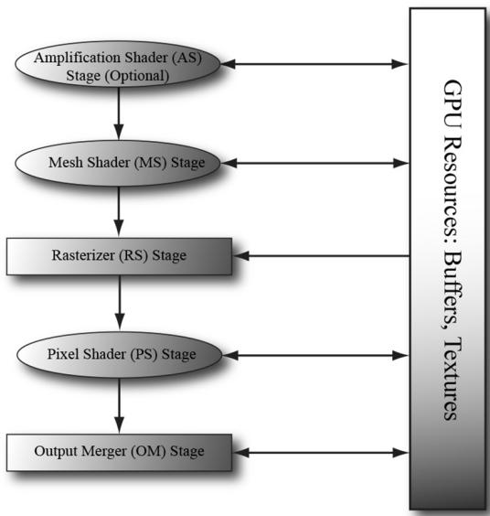
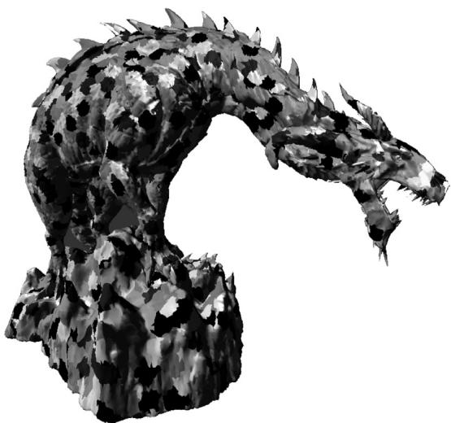
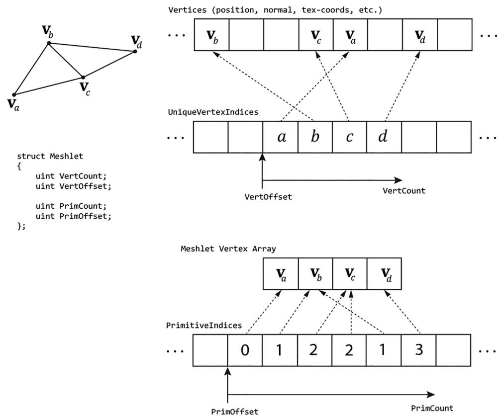
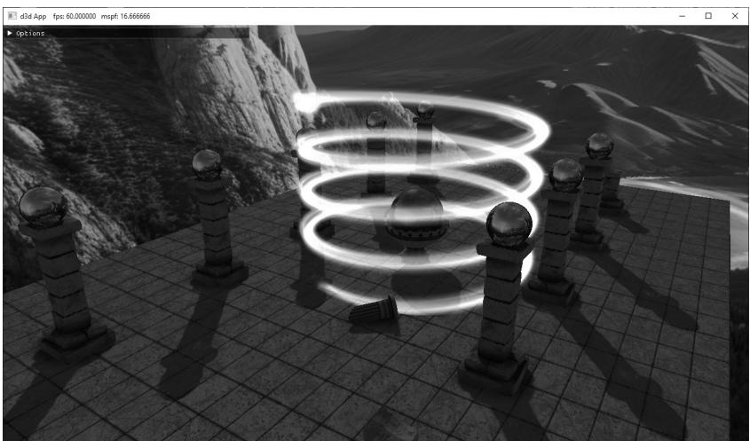
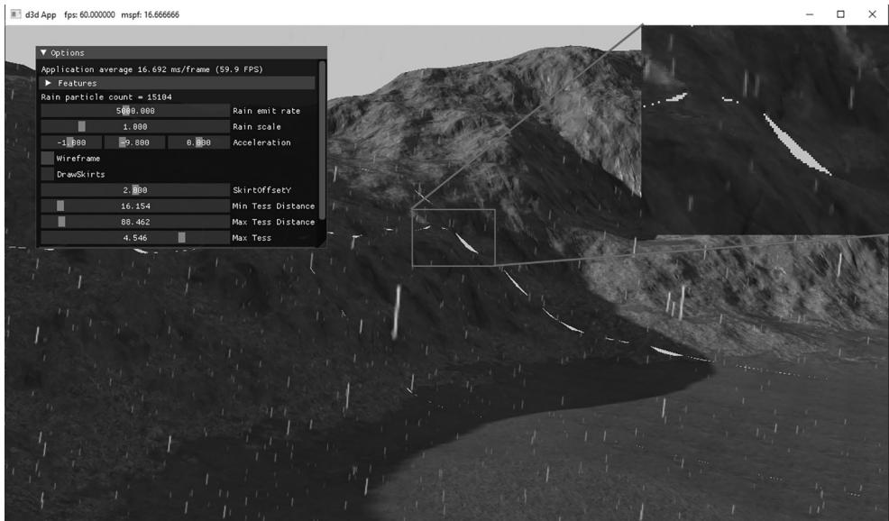
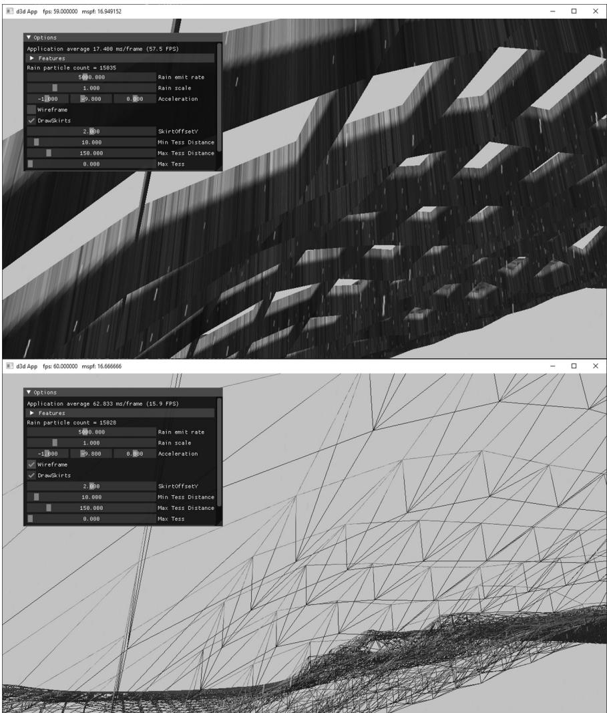
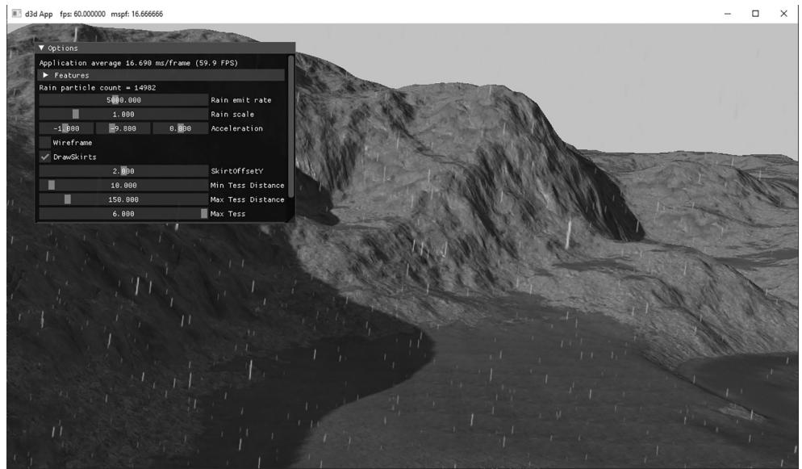

# Chapter

# 26 Amplification and Mesh Shaders

If you think about it, a compute shader can basically do what a vertex shader does. We could dispatch a thread per vertex input and write to an output buffer that contains the output vertices. Observe that with the compute shader model, we do not need an input layout; the computer shader is written to expect a certain input type. Taking this idea further, you might suggest that we could also have the compute shader write out vertex indices to an index buffer that form triangles (or lines). Then we could issue a draw call to draw the geometry. A compute shader has quite a bit of flexibility: If each thread group were processing a local patch of geometry, you could implement culling at patch granularity, or given a single geometric primitive, you could write out multiple vertices and indices to generate additional geometry, thus emulating the geometry shader. 

Mesh shaders formalize the above ideas as part of the DirectX API. One difference from the above is with an actual compute shader, we still need to issue a draw call. Mesh shaders are special in that they link directly to the rendering pipeline. In other words, the output of the mesh shader is fed directly to the rasterizer. 

Besides being an interesting idea, why would we do this? Here are a few key motivations: 

1. It removes several fixed function stages, thus simplifying the rendering pipeline (see Figure 26.1). 

2. By removing fixed function stages and replacing them with a programmable compute-shader-like model, we gain flexibility. For example, we can cull at 




Figure 26.1. Mesh shaders, and optionally amplification shaders, create a simplified rendering pipeline.


mesh shader granularity, or support multiple sets of indices (i.e., position indices, normal indices, and texture coordinate indices). 

3. The geometry shader stage typically has poor performance, but mesh shaders allow us to do geometry shader type work in an efficient way. 

4. It models how modern GPUs work, which is essentially computer-shaderbased. 

# Chapter Objectives:

1. To learn how to write mesh and amplification shaders in HLSL 

2. To discover how to configure pipeline state objects that use mesh and amplification shaders with the new stream API 

3. To find out how we can use mesh shaders to do limited geometry amplification, such as implementing point sprites 

4. To understand how amplification shaders work, and how they can be used to implement geometric tessellation 

# 26.1 MESH SHADERS AND MESHLETS

A mesh shader is like a special compute shader. Typically, it inputs buffers of vertices and indices, possibly creates new vertices and indices, does some 

per-vertex work, does some per-primitive work, and outputs the resulting vertex and primitive list for rasterization. To process a large mesh, it requires many mesh shader groups. The subset of geometry a mesh shader group processes is called a meshlet. For performance, it is best if the geometry in a meshlet is “locally nearby” and contiguous spatially. This is so vertices can be shared to get an efficient index list and for frustum culling at meshlet granularity. 

You could implement your own algorithm to divide a mesh up into meshlets, but Microsoft has published open source code for doing this, which is available at https://learn.microsoft.com/en-us/samples/microsoft/directx-graphics-samples/ d3d12-mesh-shader-samples-win32/ [MSMeshlet]. Figure 2 shows a dragon mesh broken up into color coded meshlets. The “Meshlet Viewer” source code is also available at [MSMeshlet]. 


We use mesh shader group and mesh shader instance interchangeably. When it is implied that we are talking about mesh shaders, we will also use thread group to mean mesh shader group. 

# 26.1.1 Shader Definition Details

Below is a skeleton of a mesh shader with some implementation details omitted. 

```c
struct PrimitiveOut
{
    float Area : AREA;
    bool TwoSided : TWO_SIDED;
    bool Cull : SV_CullPrimitive;
};
struct VertexOut
{
    float4 PosH : SV_POSITION;
    float3 PosW : POSITION0;
    float2 TexC : TEXCOORD0;
};
#define MAX_MS_VERTS 256
#define MAX_MS_TRIS 128
[outputtopology("triangle")] [numthreads(64, 1, 1)]
void MS(
    uint3.groupId : SV_GroupID,
    uint3.groupThreadId : SV_GroupThreadID,
    uint3.dispatchThreadId : SV_DispatchThreadID,
    out vertices VertexOut outVertices[MAX_MS_VERTS],
    out indices uint3 outnumberIndices[MAX_MS_TRIS], 
```

out primitives PrimitiveOut outPrimitiveInfo[MAX_MS_TRIS])   
{ // Figure out actual number of vertices and primitives // we are going to output. const uint numVertices $=$ ...; const uint numTris $=$ ..; SetMeshOutputCounts(numVertices, numTris); const uint vertIndex $=$ ..; VertexOut vout $=$ ..; outVertices[vertIndex] $=$ vout; const uint primitiveIndex $=$ .. outIndices[primitiveIndex] $=$ uint3(i0,i1,i2); PrimitiveOut pout $=$ ..; outPrimitiveInfo[primitiveIndex] $=$ pout; 

Because a mesh shader links to the rasterizer, we need to specify the kind of primitive we are outputting. This can either be “triangle” or “line,” and this is done with one of the following attributes: 

```cpp
[outputtopology("triangle")]  
[outputtopology("line")] 
```

As mentioned earlier, a mesh shader is basically a special compute shader, so we specify the thread group size with the [numthreads(X, Y, Z)] attribute just like we would with a compute shader. The number of threads per thread group must be less than or equal to 128. Furthermore, we get access to the usual compute shader system values: 

```cpp
uint3groupId:SV_GroupID,  
uint3groupId :SV_GroupThreadID,  
uint3dispatchThreadId:SV_DispatchThreadID, 
```

A mesh shader has three special out parameters (although the primitives one is optional): 

1. vertices: An array of user-defined vertices of the output meshlet. This would typically be similar to the data we would output from a vertex shader; in particular, this must at least contain an element with the SV_POSITION semantic. The array size specified is the maximum number of vertices the mesh shader instance will output (but it can output less). You should specify the smallest value you need for the array size and observe that there is a hard limit that it cannot exceed 256. 

2. indices: An array of indices per primitive of the output meshlet. For triangles the index type is uint3 and for lines it is uint2. These output indices are relative to the output vertex array; in other words, they are relative to the output 

meshlet. The array size specified is the maximum number of primitives the mesh shader instance will output (but it can output less). You should specify the smallest value you need for the array size and observe that there is a hard limit that it cannot exceed of 256. 

3. primitives: An array of user-defined primitive data of the output meshlet. These values require semantics and are propagated to the pixel shader. The array size should match the size of the indices array. This output parameter is optional. 

Note that the total number of bytes output per mesh shader instance must be $< =$ 32 KB. 

The SetMeshOutputCounts function is a special intrinsic function that specifies the actual number of vertices and primitives the mesh shader group outputs. Although it looks like this function is called for every thread, it is essentially a function called once for the entire thread group. The function must be called before writing to the output arrays, and it can only be called once per mesh shader. Moreover, you must not call it based on divergent flow control or call it in one uniform branch and write to the outputs in a separate uniform branch. The specification gives several examples of valid and invalid ways to call this function. 

Finally, there is a restriction on setting the output indices: we must assign an entire uint3 at a time. That is, the following would be illegal: 

```cpp
outIndices[primIndex].x = 0;  
outIndices[primIndex].y = 1;  
outIndices[primIndex].z = 2; 
```

# 26.1.2 Common Data Structure for Triangle Meshes

Note: 

The code in this section is based on the D3D12MeshletRender sample from [MSMeshlet]. 

Throughout this book, for rendering a single piece of geometry we had an index list and vertex list for the entire mesh; these lists could be quite large for meshes with tens of thousands of triangles or more. With meshlets, the mesh is broken up into meshlets and each meshlet is processed by a mesh shader. Recall that each mesh shader outputs its own vertex list (meshlet vertex list) and index list (meshlet index list) to draw the geometry of a meshlet. Moreover, the meshlet indices are relative to the meshlet vertex list; therefore, the global indices will not work as meshlet indices. This motivates a small change in the data structures used to represent a mesh in memory when using meshlets. 




Figure 26.2. A screenshot from the Microsoft open source “Meshlet Viewer” sample application


An initial approach would be to just divide the mesh up into a collection of meshlets, where each meshlet has its own vertex list and corresponding index list that is relative to its vertex list. Then each mesh shader will process a meshlet and output the meshlet vertices and indices. This works, however, if we consider a typical mesh as in Figure 26.2, we observe that the vertices at the boundaries of meshlets are shared amongst multiple meshlets. So, if we implement it as just described, there will be a lot of redundancy in the vertex data. 

Fixing this requires another level of indirection and motivates the following data structure for describing a mesh with meshlets. 

```cpp
struct Meshlet
{
    // Range of vertex indices that indirectly
    // specify the vertices of the meshlet.
    uint VertCount;
    uint VertOffset;
    // Range in PrimitiveIndices that specify
    // the indices for the meshlet.
    uint PrimCount;
    uint PrimOffset;
}; 
```

```cpp
// Vertex indices for all meshlets in the mesh.  
ByteAddressBuffer UniqueVertexIndices : register(t2);  
// Unique vertex array for all meshlets in the mesh  
StructuredBuffer<Vertex> Vertices : register(t0); 
```

Basically, we now have an array of Meshlet info that specifies the vertex list and primitive list of the meshlet relative to a larger vertex and primitive buffer. Because a meshlet corresponds to a thread group, we use the SV_GroupID to index the Meshlets buffer: 

```cs
[NumThreads(128, 1, 1)]  
[OutputTopology("triangle")]  
void main(  
    uint gtid : SV_GroupThreadID,  
    uint gid : SV_GroupID,  
    out indices uint3 tris[126],  
    out vertices VertexOut Verts[64]  
)  
{  
    Meshlet m = Meshlets[MeshInfo.MeshletOffset + gid];  
    SetMeshOutputCounts(m.VertCount, m.PrimCount);  
} 
```

We use the local group thread ID to index the primitive data. The indices stored in PrimitiveIndices are already meshlet indices (i.e., indices relative to the meshlet vertex array) so they can be written to the output indices directly: 

```cpp
if (gtid < m.PrimCount)  
{ tris[gtid] = UnpackPrimitive(PrimitiveIndices[m.PrimOffset + gtid]); } 
```

where, 

```cpp
uint3 UnpackPrimitive uint primitive)   
{ // Unpacks a 10 bits per index triangle from a 32-bit uint. return uint3(primitive & 0x3FF, (primitive >> 10) & 0x3FF, (primitive >> 20) & 0x3FF);   
} 
```

# Note:

Because a meshlet is relatively small in the sense that it does not have a lot of vertices, a common pattern is to use 10-bit indices, and so we can pack three indices into a single uint. The UnpackPrimitive does the bit operations to extract the three 10-bit indices from a uint. 

The next step is to get the vertex data. As illustrated in Figure 26.3, to avoid duplicating vertex data across meshlets, each meshlet points to an array of vertex 




Figure 26.3. A meshlet with 4 vertices and 6 triangle indices. The 4 vertex indices $( a , b , c , d )$ indirectly give the 4 vertices of the meshlet $( \pmb { v } _ { a } , \pmb { v } _ { b } , \pmb { v } _ { c } , \pmb { v } _ { d } )$ by indexing the global vertex buffer that stores vertices for all meshlets in the mesh. The 6 primitive indices are relative to the meshlet vertex array $( \mathbf { v } _ { a } , \mathbf { v } _ { b } , \mathbf { v } _ { c } , \mathbf { v } _ { d } )$ .


indices instead of an array of vertices. So, for each vertex in the meshlet, we fetch the vertex index, and then use this to index into the vertex buffer: 

```cpp
uint GetVertexIndex(Meshlet m, uint localIndex)  
{  
    localIndex = m.VertOffset + localIndex;  
    if (MeshInfo.IndexBytes == 4) // 32-bit Vertex Indices  
    {  
        return UniqueVertexIndices.Load(localIndex * 4);  
    }  
else // 16-bit Vertex Indices  
{  
    // Byte address must be 4-byte aligned.  
    uint wordOffset = (localIndex & 0x1);  
    uint byteOffset = (localIndex / 2) * 4; 
```

// Grab the pair of 16-bit indices, shift & mask off // proper 16-bits. uint indexPair $=$ UniqueVertexIndices.Load(byteOffset); uint index $=$ (indexPair $\gg$ (wordOffset \* 16)) & 0xffff; return index; } if (gtid < m.VertCount) { uint vertexIndex $=$ GetVertexIndex(m, gtid); Vertex v $=$ Vertices[vertexIndex]; VertexOut vout; vout.PositionVS $=$ mul(float4(v.Position, 1), Globals. WorldView).xyz; vout.PositionHS $=$ mul(float4(v.Position, 1), Globals. WorldViewProj); vout.Normal $=$ mul(float4(v.Normal, 0), Globals.Worldl).xyz; vout.MeshletIndex $=$ gid; // group ID verts[gtid] $=$ vout; } 

Observe that when using 16-bit indices, each 32-bit value packs two 16-bit indices so some bookkeeping needs to be done to handle that extraction. 

Note: 

The data structure described here is common for drawing generic triangle meshes with meshlets, and it is just one example. As we will see later in this Chapter, for rendering point sprites and terrain, we do not follow this data structure because the input geometry is not a triangle mesh. 

# 26.1.3 Mesh Shader and PSO

To define the pipeline state object (PSO) for mesh shaders, use the new D3D12_ PIPELINE_STATE_STREAM_DESC API. This requires a version 5 interface of the device (ID3D12Device5). Using this API reduces the boilerplate properties of the PSO where defaults will suffice. The first step is to define a structure with the fields of the PSO we are interested in using the CD3DX12_PIPELINE_STATE_STREAM_ helper structs: 

```c
// Define the members we are interested in setting. Non-specified PSO  
// properties will use defaults.  
struct ParticlesPsoStream  
{ CD3DX12_PIPELINE_STATE_STREAM_ROOT_SIGNATURE pRootSignature; CD3DX12_PIPELINE_STATE_STREAM_MS MS; 
```

```c
CD3DX12_PIPELINE_STATE_STREAM_PS PS;  
CD3DX12_PIPELINE_STATE_STREAM_RENDER_TARGET_FORMATS RTVFormats;  
CD3DX12_PIPELINE_STATE_STREAM_DEPTHStencil_format DSVFormat;  
CD3DX12_PIPELINE_STATE_STREAM Blend_DESC BlendDesc;  
CD3DX12_PIPELINE_STATE_STREAMDepthStencil DepthStencilDesc; 
```

Then, we fill out our user-defined PSO structure like we would a usual PSO description. 

```cpp
DXGI_FORMAT particlesPsoFormats[8] =  
{  
    backBufferFormat,  
    DXGI_FORMAT_UNKNOWN,  
    DXGI_FORMAT_UNKNOWN,  
    DXGI_FORMAT_UNKNOWN,  
    DXGI_FORMAT_UNKNOWN,  
    DXGI_FORMAT_UNKNOWN,  
    DXGI_FORMAT_UNKNOWN,  
    DXGI_FORMAT_UNKNOWN,  
}；  
D3D12_RENDER_TARGET Blend_DESC particlesAddBlendDesc;  
particlesAddBlendDesc.BlendEnable = true;  
particlesAddBlendDesc.LogicEnable = false;  
particlesAddBlendDescSrcBlend = D3D12 Blend_ONE;  
particlesAddBlendDesc.DestBlend = D3D12 Blend_ONE;  
particlesAddBlendDesc.BlendOp = D3D12 Blend_OP_ADD;  
particlesAddBlendDescSrcBlendAlpha = D3D12 Blend_ONE;  
particlesAddBlendDesc.DestBlendAlpha = D3D12 Blend_ZERO;  
particlesAddBlendDesc.BlendOpAlpha = D3D12 Blend_OP_ADD;  
particlesAddBlendDesc.LogicOp = D3D12_LOGIC_OP_NOOP;  
particlesAddBlendDesc RenderTargetWriteMask = D3D12_COLOR_WRITE_ENABLE_ALL;  
CD3DX12 Blend_DESC blendDesc = CD3DX12 Blend_DESC(D3D12_DEFAULT);  
blendDescRenderTarget[0] = particlesAddBlendDesc;  
CD3DX12_DEPTHStencil_DESC depthStencilDesc = CD3DX12_DEPTHStencil_DESC(D3D12_DEFAULT);  
depthStencilDesc.DepthWriteMask = D3D12_DEPTH_WRITE_MASK_ZERO;  
ParticlesPsoStream psoStream;  
psoStream.pRootSignature = rootSig;  
psoStream.MS = d3dUtil::ByteCodeFromBlob(shaderLib["helixParticles MS"]);  
psoStream.PS = d3dUtil::ByteCodeFromBlob(shaderLib["helixParticles PS"]);  
psoStream.RTVFormats = CD3DX12_RT Formatting_ARRAY(particlesPsoFormats, 1);  
psoStream.DSVFormat = depthStencilFormat;  
psoStream.BlendDesc = blendDesc;  
psoStream.DepthStencilDesc = depthStencilDesc; 
```

Finally, we create the PSO with this CreatePipelineState overload: 

```javascript
D3D12_PIPELINE_STATE_STREAM_DESC streamDesc = {}; streamDesc.pPipelineStateSubobjectStream = &psoStream; streamDesc.SizeInBytes = sizeof(ParticlesPsoStream); 
```

# 26.1.4 Dispatching Mesh Shaders

Dispatching mesh shader groups is analogous to dispatching compute shader groups, and is done with the DispatchMesh API: 

```cpp
PsoLib& psoLib = PsoLib::GetLib();  
cmdList->SetPipelineState(psoLib["helixParticles_ms"]);  
const UINT numMeshGroupX = a;  
const UINT numMeshGroupY = b;  
const UINT numMeshGroupZ = c;  
cmdList->DispatchMesh(numMeshGroupX, numMeshGroupY, numMeshGroupZ); 
```

# 26.2 MESH SHADER POINT SPRITES

Point sprites refer to when we represent an entity as a single point, but then expand it to a 2D quad that faces the camera to give the object area. This is essentially what we did in Chapter 12 with the “Tree Billboard” demo using the geometry shader. In this section, we show how to emulate point sprite functionality using a mesh shader to render a simple helix particle system (Figure 26.4). In contrast to the “Tree Billboard” demo, we are not going to store a list of points on the CPU. 




Figure 26.4. Screenshot of the “ParticlesMS” demo where we use a mesh shader to procedural generate and animate a helix-shaped particle system.


Instead, we are going to dispatch mesh shader groups, and the geometry will be completely created in the mesh shader based on the thread ID. 

# 26.2.1 Mesh Shader Group Counts

Each thread in a mesh shader will output one quad: 4 vertices and 2 triangles. Recall that we cannot output more than 256 vertices and more than 256 primitives per mesh shader. Therefore, we make our mesh shader group size equal to 64: 

// We process 64 points per mesh shader group. When expanding to quads, // we have $(64*4) = 256$ vertices and $(64*2) = 128$ triangles. #define MAX_POINT_SPRITES 64 #define MAX_MS_VERTS (MAX_POINT_SPRITES $\star$ 4) #define MAX_MS_TRIS (MAX_POINT_SPRITES $\star$ 2) [outputtopology("triangle")] [numthreads(MAX_POINT_SPRITES, 1, 1)] 

To draw N particles, we need to dispatch ceil(N/64) groups. To keep things simple, in the demo we make $N$ a multiple of the group thread count: 

const uint NumParticlesPerGroup = 64;   
const uint NumMeshShaderGroups = 20;   
const uint TotalParticles = NumParticlesPerGroup * NumMeshShaderGroups;   
void ParticlesMsApp::DrawHelixParticles(ID3D12GraphicsCommandList6\* cmdList)   
{ GraphicsResource cbHandle $=$ mLinearAllocator->AllocateConstant( mHelixParticleConstants); cmdList->SetGraphicsRootConstantBufferView( GFX_ROOT.Arg_OBJECT_CBV, cbHandle.GpuAddress()); PsoLib& psoLib $=$ PsoLib::GetLib(); cmdList->SetPipelineState(psoLib["helixParticles_ds"]); cmdList->DispatchMesh(NumMeshShaderGroups,1,1);   
} 

# 26.2.2 Helix Particle Motion

The parametric equation of a helix is given by the following: 

$$
\begin{array}{l} x = r \cos (\omega t) \\ z = r \sin (\omega t) \\ y = t h \\ \end{array}
$$

where $t \in [ 0 , 1 ] .$ , $r$ is the radius of the helix, $h$ is the height of the helix, and $\omega$ is the angular frequency (controls how many times the helix circles around as $t$ goes from 0 to 1). The $x \cdot$ - and $y$ -coordinate formulas are the parametric equations for a 

circle. The formula $y = t h$ is what makes it a helix: as t goes from 0 to 1, the height y of the point on the helix goes from 0 to $h$ . 

Now we can generate particles along the helix curve by evaluating the above equations for each particle using equally spaced $t$ positions: 

```javascript
// Parameterize the particle along the helix based on dispatchThreadId. const uint globalParticleId = dispatchThreadId.x; const float t = globalParticleId / (float)gHelixParticleCount; 
```

This generates equally spaced particles on the helix, but there will be no motion. If we rotate the helix about the y-axis over time, it actually looks like the particles are “flowing” down the helix and it gives a neat magical spell type effect. This rotation is achieved by offsetting $t$ (for the $x \cdot$ - and $z$ -coordinates only) by the total time and some speed factor to control how fast the rotation happens: 

```cpp
// Generate position along the helix and rotate with time.  
const float x = gHelixRadius * cos(gHelixAngularFrequency * (t + gHelixSpeed*gTotalTime));  
const float z = gHelixRadius * sin(gHelixAngularFrequency * (t + gHelixSpeed*gTotalTime));  
const float y = gHelixHeight * t;  
// Use gHelixOrigin to translate the helix.  
const float3 centerW = gHelixOrigin + float3(x, y, z); 
```

Note that we use the following constant buffer to control the various properties of the helix: 

```cpp
DEFINE_CBUFFER(HelixParticlesCB, b0)  
{  
    float4 gHelixColorTint;  
    float3 gHelixOrigin;  
    uint gHelixParticleCount;  
    float gHelixRadius;  
    float gHelixHeight;  
    float gHelixAngularFrequency;  
    float gHelixParticleSize;  
    float gHelixSpeed;  
    uint gHelixTextureId;  
    uint2 gHelixParticles_Pad0;  
}; 
```

# 26.2.3 Shader Code

The mesh shader for the helix particles can be broken down into three sections: 

1. Generate the position along the helix based on thread ID and time. This was shown in the previous section. 

2. Expand the point to a point sprite/billboard, that is, a quad that faces the camera. The math to do this is the same as it was in Chapter 12 for the “Tree Billboard” demo. 

3. Output the geometry of the meshlet by writing the vertices and indices. Writing the vertices and indices of a quad is simple; the main thing to remember is that each thread in the group is writing its own quad, so we need to offset into the vertex and index array accordingly. 

struct VertexOut {
    float4 PosH: SV POSITION;
    float3 PosW: POSITION0;
    float2 TexC: TEXCOORD0;
};
// We process 64 points per mesh shader group. When expanding to quad
// we have $(64*4) = 256$ vertices and $(64*2) = 128$ triangles.
#define MAX_POINT_SPRITES 64
#define MAX_MS_VERTS (MAX_POINT_SPRITES * 4)
#define MAX_MS_TRIS (MAX_POINT_SPRITES * 2)
[outputtopology("triangle")] [numthreads(MAX_POINT_SPRITES, 1, 1)];
void MS(
    uint3.groupId: SV_GroupID,
    uint3.groupThreadId: SV_GroupThreadID,
    uint3.dispatchThreadId: SV_DispatchThreadID,
    out vertices VertexOut outVertices[MAX_MS_VERTS],
    out indices uint3 outIndices[MAX_MS_TRIS])
{
    // We always dispatch full groups in this demo.
    SetMeshOutputCounts(MAX_MS_VERTS, MAX_MS_TRIS);
    // Animate position along the helix.
    // Parameterize the particle along the helix based
    // on dispatchThreadId.
    const uint globalParticleId = dispatchThreadId.x;
    const float t = globalParticleId / (float)gHelixParticleCount;
    const float pi = 3.141592f;
    // Generate position along the helix and animate with time.
    const float x = gHelixRadius * cos(gHelixAngularFrequency *
        (t + gHelixSpeed*gTotalTime));
    const float z = gHelixRadius * sin(gHelixAngularFrequency *
        (t + gHelixSpeed*gTotalTime));
    const float y = gHelixHeight * t;
    const float3 centerW = gHelixOrigin + float3(x, y, z); 

//   
// Compute the local coordinate system of the sprite relative   
// to the world space.   
//   
float3 up $=$ float3(0.0f, 1.0f, 0.0f);   
float3 look $=$ gEyePosW - centerW;   
look $=$ normalize(look);   
float3 right $=$ normalize(cross(up, look));   
up $=$ cross(look, right);   
//   
// Expand the particle quad to face the camera.   
//   
float halfWidth $=$ 0.5f*gHelixParticleSize;   
float4 v[4];   
v[0] $=$ float4(centerW + halfWidth\*right - halfWidth\*up, 1.0f);   
v[1] $=$ float4(centerW + halfWidth\*right + halfWidth\*up, 1.0f);   
v[2] $=$ float4(centerW - halfWidth\*right - halfWidth\*up, 1.0f);   
v[3] $=$ float4(centerW - halfWidth\*right + halfWidth\*up, 1.0f);   
float2 texC[4] = { float2(0.0f, 1.0f), float2(0.0f, 0.0f), float2(1.0f, 1.0f), float2(1.0f, 0.0f) };   
//   
// Generate the meshlet vertices/indices.   
// Vertices/indices are relative to meshlet this group outputs.   
//   
const uint localParticleId $\equiv$ groupThreadId.x;   
for(int i $= 0$ ; i $<  4$ ; ++i) { VertexOut vout; vout_PosH $=$ mul(v[i], gViewProj); vout_PosW $=$ v[i].xyz; vout.TexC $=$ texC[i]; outVertices[localParticleId\*4+i] $=$ vout; }   
// Index to ith particle vertices. const uint3 baseVertexIndex $\equiv$ 4 \* localParticleId;   
outIndices[localParticleId\*2+0] $=$ baseVertexIndex + uint3(0, 1, 2); outIndices[localParticleId\*2+1] $=$ baseVertexIndex + uint3(1, 3, 2); 

The pixel shader for this demo is just a texture sample and color tint: 

```cpp
float4 PS(VertexOut pin) : SV_Target{ 
```

Texture2D particleTexture $=$ ResourceDescriptorHeap[gHelixTextureId]; float4 textureColor $=$ particleTexture. Sample(GetLinearWrapSampler(), pin.TexC); return textureColor \* gHelixColorTint;   
1 

# 26.3 AMPLIFICATION SHADER

We have seen that a mesh shader processes a meshlet; it can do per-vertex things and per-primitive things, and even do a limited form of geometric expansion. The geometric expansion is limited because there are hard limits on how many vertices and indices that we can output per mesh shader group. How do we do things like tessellation? As Figure 26.1 suggests, the answer is with the amplification shader. 

The amplification shader is another special compute shader. Each amplification shader group can dispatch a grid of child mesh shaders, thus amplifying geometry. Furthermore, each amplification shader group can have its own shared memory, often called a payload, that the amplification shader group can write to and propagate to its child mesh shaders. Below is a skeleton of an amplification shader and associated mesh shader with some implementation details omitted. 

```cpp
struct AmpShaderPayload
{
    // user-defined data, but must be <= 16KB;
};
// Each thread group gets its own shared memory instance.
groupshared AmpShaderPayload gPayload;
[numthreads(8, 8, 1)]void AS(
    uint3.groupId: SV_GroupID,
    uint3.groupThreadId: SV_GroupThreadID,
    uint3.dispatchThreadID: SV_DispatchThreadID)
{
    uint dispatchX = ...
    uint dispatchY = ...
    uint dispatchZ = ...
    // ...do work per thread. Store any info in gPayload.
    // This call is per group, not per thread. Each group can
    // dispatch a grid of child mesh shaders. Each child mesh
    // Shader receives a copy of the payload data.
    DispatchMesh(decpatchX, dispatchY, dispatchZ, gPayload);
} 
```

```cpp
// Corresponding child mesh shaders receives payload as an input parameter.   
[outputtopology("triangle")]   
[numthreads(8, 8, 1)]   
void MS( uint3groupId : SV_GroupID, uint3.groupThreadId : SV_GroupThreadID, in payload AmpShaderPayload payload, out vertices VertexOut outVertices [MAX_MS_VERTS], out indices uint3 outIndices [MAX_MS_TRIS]) { [...] } 
```

It is important to realize that the DispatchMesh call is per group, not per thread. Basically, the threads of an amplification shader group do some arbitrary work but must work to figure out how many mesh shaders to dispatch. Again, this is per-group, so different amplification shader groups can dispatch a different grid of child mesh shaders and have different payload instances. Observe in the example above that the mesh shader receives the payload from the amplification shader as an input parameter. The payload size is limited to 16 KB. 

# 26.4 TERRAIN AMPLIFICATION AND MESH SHADER DEMO

In this demo, we show how to use amplification and mesh shaders to implement terrain tessellation with dynamic level-of-detail. Although we could basically replicate the hull shader, tessellator, and domain shader to implement the terrain like we did in Chapter 24, it would be quite complex for an introductory book. Instead, we take a similar but simpler approach. 

# 26.4.1 Quad Patch Amplification Shader

As with the terrain implementation in Chapter 24, we are still going to initially divide the terrain into a grid of quad patches. Each amplification shader group processes 8x8 quad patches, and we dispatch enough groups to have a thread per quad patch. For the sake of discussion, it is helpful to define a patch group. We use this to refer to the 8x8 quad patches an amplification shader group processes. Now we can say that we will dispatch a grid of patch groups to process all the quad patches of the terrain. 

For each patch group, we precompute a bounding box at initialization time and store them in a structured buffer. We can then frustum cull in the amplification shader on a patch group granularity. For LOD, we use the distance between the 

patch group center position and the camera position to calculate the number of times to subdivide each quad patch into a grid of cells (the cells are the actual quads we draw as two triangles). Because we can only emit so much geometry per mesh shader, the number of quad patch subdivisions determine how many mesh shader instances we must dispatch per quad patch to get the required triangle density. In other words, each quad patch requires a grid of mesh shader instances where the grid size depends on the tessellation factor. To summarize, we dispatch a grid of amplification shaders to process the quad patches. Each amplification shader group dispatches a grid of mesh shaders. Each mesh shader can do a limited form of subdivision and output the meshlet geometry. Note that in our implementation, the level of detail is specified at the amplification shader group granularity. Consequently, all child mesh shaders will have the same LOD. 

As far as payload data, given a quad patch in the patch group, we want to know its global index across all thread groups (so that we can index into the quad patch vertex buffer). We store the global index for each quad patch in the patch group, but it could have alternatively been calculated if we just stored the group ID since we know each group is 8x8. Furthermore, because each quad patch is divided into a grid of mesh shader instances, we store the mesh shader grid size (NumMeshletsPerQuadPatchSide) and the number of cells per mesh shader in the payload. Finally, for computing the tessellated positions in the mesh shader, it is useful to store the meshlet and cell sizes over the quad patch UV space. 

The following amplification shader implements the discussion so far: 

uint CalcNumSubdivisions(float3 p)   
{ //float d $=$ distance(p,gEyePosW); float $\mathrm{d} =$ max( max(abs(p.x-gEyePosW.x),abs(p.y-gEyePosW.y)), abs(p.z-gEyePosW.z)); float s $=$ saturate((d - gTerrainMinTessDist)/ (gTerrainMaxTessDist - gTerrainMinTessDist)); return (uint)(lerp(gTerrainMaxTess, gTerrainMinTess, s) + 0.5f);   
1   
// Amplification payload can be up to 16KB   
struct PatchPayload   
{ uint NumMeshletsPerQuadPatchSide; uint MeshletCellsPerSide; float MeshletSizeInUVs; float CellSpacingInUVs; // Maps thread group index k in 8x8 to global quad patch index // relative to entire terrain. uint4 QuadPatchIndex[64];   
}; 

```c
define MAX_MS_CELLS_PER_SIDE 8  
#define MAX_MS_TRIS (MAX_MS_CELLS_PER_SIDE * MAX_MS_CELLS_PER_SIDE * 2)  
#define MAX_MS_VERTS ((MAX_MS_CELLS_PER_SIDE + 1) * (MAX_MS_CELLS_PER_SIDE + 1)) 
```

```cpp
groupshared PatchPayload gPayload;   
//   
// Each thread processes a quad patch.   
//   
[numthreads(8, 8, 1)]   
void TerrainAS( uint3groupId : SV_GroupID, uint3.groupThreadId : SV_GroupThreadID, uint3 dispatchThreadID : SV_DispatchThreadID)   
{ // Only set to nonzero if it passes frustum culling. uint dispatchX = 0; uint dispatchY = 0; uint dispatchZ = 0; StructuredBuffer<Bounds> groupBoundsBuffer = ResourceDescriptorHeap[gTerrainGroupBoundsSrvIndex]; const Bounds groupBounds = groupBoundsBuffer[groupId.y * gNumAmplificationGroupsX + groupId.x]; const float3 vMinL = groupBoundsCenter - groupBounds.Exteents; const float3 vMaxL = groupBoundsCENTER + groupBounds.Exteents; // Assumes no rotation. const float3 vMinW = mul(float4(vMinL, 1.0f), gTerrainWorld).xyz; const float3 vMaxW = mul(float4(vMaxL, 1.0f), gTerrainWorld).xyz; const float3 boxCenter = 0.5f*(vMinW + vMaxW); // Inflate box a bit to compensate for material layer displacement // mapping which we did not account for when we computed the // patch bounds. const float3 boxExtents = 0.5f*(vMaxW - vMinW) + float3(1, 1, 1); // Cull at group granularity. if(!AabbOutsideFrustumTest.boxCenter, boxExtents, gWorldFrustumPlanes)) { const uint numPatchSubdivisions = CalcNumSubdivisions.boxCenter); // For each quad patch in the group, store the global // quad patch index across all groups. gPayload.QuadPatchIndex[groupId.y*8+groupThreadId.x].xy = dispatchThreadID.xy; const uint patchCellsPerSide = min( (lu << numPatchSubdivisions), MAX_QUAD_CELLS_PER_SIDE); 
```

```proto
// Each mesh shader group has 8x8 threads, so based on
// the required tessellation level, we need to dispatch a
// grid of mesh shaders per quad patch. Also note we can
// only output up to 256 vertices and 256 primitives
// per mesh shader.
const uint numMeshletsPerQuadPatchSide =
(patchCellsPerSide + (MAX_MS_CELLS_PER_SIDE - 1)) / MAX_MS_
CELLS_PER_SIDE;
gPayload.NumMeshletsPerQuadPatchSide = numMeshletsPerQuadPatchSide;
gPayload.MeshletCellsPerSide = numMeshletsPerQuadPatchSide > 1 ?
    MAX_MS_CELLS_PER_SIDE : patchCellsPerSide;
// Meshlet and cell sizes in UV space [0,1] over the input
// quad patch.
gPayload.MeshletSizeInUVs = 1.0f / numMeshletsPerQuadPatchSide;
gPayload.CellSpacingInUVs =
    gPayload.MeshletSizeInUVs / gPayload.MeshletCellsPerSide;
// Each amplification group processes a grid of quad patches, and
// each quad patch has a grid of meshes.
const uint quadPatchesPerSide = 8;
dispatchX = quadPatchesPerSide * numMeshletsPerQuadPatchSide;
dispatchY = quadPatchesPerSide * numMeshletsPerQuadPatchSide;
dispatchZ = 1;
}
// Dispatch child mesh shaders groups.
DispatchMesh(dispatchX, dispatchY, dispatchZ, gPayload);
} 
```

# 26.4.2 Quad Patch Mesh Shader

The corresponding mesh shader looks complicated, but it is mostly bookkeeping. Each quad patch is divided into grid of meshlets, and each meshlet is divided into a group of cells (actual quads we break into two triangles for rendering). The first thing to do is set the number of vertices and primitives the mesh shader will output. This comes from the payload.MeshletCellsPerSide. 

```cpp
const uint cellsPerSide = payload.MeshletCellsPerSide;  
const uint vertsPerSide = cellsPerSide + 1;  
const uint numVerts = vertsPerSide * vertsPerSide;  
const uint numCells = cellsPerSide * cellsPerSide;  
SetMeshOutputCounts(numVerts, numCells * 2); 
```

The second thing to do is determine which quad patch we are in relative to the terrain so we can sample the four vertices. We know from payload. NumMeshletsPerQuadPatchSide how many meshlets were dispatched per quad patch in the patch group, and we can get the mesh shader group ID relative to the 

DispatchMesh call via the SV_GroupID parameter. Therefore, the quad patch index (relative to the patch group this mesh shader was dispatched from) is given by 

```typescript
uint2 localQuadPatchIndex = groupId.xy / payload. NumMeshletsPerQuadPatchSide; 
```

Then recall that payload.QuadPatchIndex gives us the mapping from local quad patch index to the global quad patch index relative to the terrain, and from that we can sample the quad patch vertices: 

const uint2 globalQuadPatchIndex = payload.QuadPatchIndex[localQuadPatchIndex.y * 8 + localQuadPatchIndex.x].xy;   
const uint index0 = globalQuadPatchIndex.y * gNumQuadVerticesPerTerrainSide + globalQuadPatchIndex.x;   
const uint index1 = globalQuadPatchIndex.y * gNumQuadVerticesPerTerrainSide + globalQuadPatchIndex.x + 1;   
const uint index2 = (globalQuadPatchIndex.y+1) \* gNumQuadVerticesPerTerrainSide + globalQuadPatchIndex.x;   
const uint index3 = (globalQuadPatchIndex.y+1) \* gNumQuadVerticesPerTerrainSide + globalQuadPatchIndex.x + 1;   
StructuredBuffer<float4>vertexBuffer $=$ ResourceDescriptorHeap[gTerrainVerticesSrvIndex];   
const float2 v0 = vertexBuffer[index0].xy;   
const float2 v1 = vertexBuffer[index1].xy;   
const float2 v2 = vertexBuffer[index2].xy;   
const float2 v3 = vertexBuffer[index3].xy; 

The rest is having each thread in the mesh shader process at least one vertex (some threads have to process more than one vertex) and a single cell in the mesh shader. 

```cpp
[outputtopology("triangle")]  
[numthreads(8, 8, 1)]  
void TerrainMS()  
    uint3.groupId: SV_GroupID,  
    uint3.groupThreadId: SV_GroupThreadID,  
    in payload PatchPayload payload,  
    out vertices VertexOut outVertices[MAX_MS_VERTS],  
    out indices uint3 outIndices[MAX_MS_TRIS])  
{  
    const uint cellsPerSide = payload.MeshletCellsPerSide;  
    const uint vertSPerSide = cellsPerSide + 1;  
    const uint numVertices = vertSPerSide * vertSPerSide;  
    const uint numCells = cellsPerSide * cellsPerSide;  
    SetMeshOutputCounts(numVertices, numCells * 2);  
    //  
    // Get the quad patch vertices this meshlet came from. 
```

// Figure out which quad patch this meshlet came from. Recall that // each amplification group processes a grid of quad patches, and // each quad patch has a grid of meshlets. 

const uint2 localQuadPatchIndex $=$ groupId.xy / payload. NumMeshletsPerQuadPatchSide; 

const uint2 globalQuadPatchIndex $=$ payload.QuadPatchIndex[localQuadPatchIndex.y * 8 + localQuadPatchIndex.x].xy; 

const uint index0 $=$ globalQuadPatchIndex.y * gNumQuadVertsPerTerrainSide $^ +$ globalQuadPatchIndex.x; const uint index1 $=$ globalQuadPatchIndex.y * gNumQuadVertsPerTerrainSide $^ +$ globalQuadPatchIndex.x + 1; const uint index2 $=$ (globalQuadPatchIndex. $\tt y + 1$ ) * gNumQuadVertsPerTerrainSide $^ +$ globalQuadPatchIndex.x; const uint index3 $=$ (globalQuadPatchIndex. $\tt y + 1$ ) * gNumQuadVertsPerTerrainSide $^ +$ globalQuadPatchIndex.x + 1; 

StructuredBuffer<float4> vertexBuffer $=$ ResourceDescriptorHeap[gTerrainVerticesSrvIndex]; const float2 v0 $=$ vertexBuffer[index0].xy; const float2 v1 $=$ vertexBuffer[index1].xy; const float2 v2 $=$ vertexBuffer[index2].xy; const float2 v3 $=$ vertexBuffer[index3].xy; 

// // Process cell vertices. We have a thread per cell, but we have // Square(cellsPerSide + 1) many vertices. So the last row/column // of threads has to process two vertices. // 

const uint cellX $=$ groupThreadId.x; const uint cellY $=$ groupThreadId.y; 

// Note: May not utilize the whole group if cellsPerSide < [numthreads(8, 8, 1)]. 

if( cellX < cellsPerSide && cellY $<$ cellsPerSide ) { 

const float meshletSizeInUVs $=$ payload.MeshletSizeInUVs; const float cellSpacingInUVs $=$ payload.CellSpacingInUVs; 

// Meshlet index relative to the quad patch it comes from. const uint2 meshletIndex $=$ groupId.xy % payload. NumMeshletsPerQuadPatchSide; 

// Offset inside the patch for this meshlet. const float patchOffsetU $=$ meshletIndex.x * meshletSizeInUVs; const float patchOffsetV $=$ meshletIndex.y * meshletSizeInUVs; 

// Offset to the vertex in meshlet relative to the patch. const float vertU $=$ patchOffsetU $^ +$ cellX * cellSpacingInUVs; const float vertV $=$ patchOffsetV $^ +$ cellY * cellSpacingInUVs; 

// Bilinear interpolation. 

float2 vertPos $=$ lerp( lerp(v0.xy, v1.xy, vertU), lerp(v2.xy, v3.xy, vertU), vertV); const uint vindex $=$ cellY \* VertsPerSide + cellX; outVertices[vindex] $=$ ProcessVertex( vertPos); // Some threads need to process an extra vertex to // handle right/bottom edge. // Remember, a quad patch can be covered by several meshlets. if(cellX $= =$ (cellsPerSide-1)) // right edge { const uint nextVertIndex $=$ vindex + 1; float2 nextVert $=$ lerp( lerp(v0.xy, v1.xy, vertU + cellSpacingInUVs), lerp(v2.xy, v3.xy, vertU + cellSpacingInUVs), vertV); outVertices[nextVertIndex] $=$ ProcessVertex( nextVert ); } if(cellY $= =$ (cellsPerSide-1)) // bottom edge { const uint nextVertIndex $=$ (cellY+1) \* VertsPerSide + cellX; float2 nextVert $=$ lerp( lerp(v0.xy, v1.xy, vertU), lerp(v2.xy, v3.xy, vertU), vertV + cellSpacingInUVs); outVertices[nextVertIndex] $=$ ProcessVertex( nextVert ); } if(cellX $= = 0\& \&$ cellY $= = 0$ // bottom-right vertex. { const uint lastVertIndex $=$ numVertices - 1; const float meshletRightEdgeU $=$ patchOffsetU + cellsPerSide \* cellSpacingInUVs; const float meshletBottomEdgeV $=$ patchOffsetV + cellsPerSide \* cellSpacingInUVs; float2 lastVert $=$ lerp( lerp(v0.xy, v1.xy, meshletRightEdgeU), lerp(v2.xy, v3.xy, meshletRightEdgeU), meshletBottomEdgeV); outVertices[lastVertIndex] $=$ ProcessVertex( lastVert ); } } // Process meshlet cell indices. These are relative to outVertices. 

```cpp
if( cellX < cellsPerSide && cellY < cellsPerSide ) { const uint i0 = cellY * voltsPerSide + cellX; const uint i1 = cellY * voltsPerSide + cellX + 1; const uint i2 = (cellY+1) * voltsPerSide + cellX; const uint i3 = (cellY+1) * voltsPerSide + cellX + 1; const uint cellIndex = cellY * cellsPerSide + cellX; outIndices[cellIndex*2 + 0] = uint3(i0, i1, i2); outIndices[cellIndex*2 + 1] = uint3(i2, i1, i3); } 
```

# 26.4.3 Skirts

At this point, if we were to run the code, the terrain would mostly work. We do get high triangle density for patch groups near the camera, and the amount of tessellation drops off with distance. However, because patch groups have discrete LODs (levels-of-detail), cracks appear between mesh groups with different LODs (see Figure 26.5)). 

Because the cracks are not too large, especially near the camera where the triangle count is large, an old trick called “skirts” can work. Basically, the idea of skirts is to add vertical geometry around the patch group boundaries with the same terrain texture at the patch group boundaries. This fills in the 




Figure 26.5. Cracks appearing when the LOD does not match at the edges of meshlets.





Figure 26.6. Skirt geometry hangs around the boundary of each meshlet to hide cracks.


cracks, and because the cracks are small to begin with, it is barely noticeable in the demo. 

The skirt geometry has its own separate amplification and mesh shader. It uses the same quad patch vertex buffer as the terrain quad patches. We omit the code here since it is similar enough to the quad patch amplification and mesh shaders that the code should be clear enough to follow. 




Figure 26.7. Screenshot of the Terrain Mesh Shader demo


We could implement continuous level-of-detail to make the boundaries between group patches match up, and morph smoothly like the hardware tessellator does in the Chapter 24 terrain demo. This is more complicated work and would be an interesting exercise. 

# 26.4.4 Demo Options

• Skirts can be toggled on and off to observe the cracks without them. 

• The SkirtOffsetY value allows you to tweak how far down the skirts go. This would likely need to be tweaked per scene based on the heightmap. 

• The wireframe mode makes it easy to see how skirts drop down to fill in the cracks. 

• As with the terrain demo, we can adjust distances and number of subdivisions. 

# 26.5 SUMMARY

1. Amplification and mesh shaders provide more flexibility and simplify the old geometry pipeline by replacing it with compute-based shaders that more accurately model the underlying hardware. 

2. We can dispatch a grid of amplification shader groups, where each group can do work and then dispatch a grid of mesh shaders, thus amplifying geometry. This can be used, for example, to implement hardware tessellation. 

3. We can dispatch a grid of mesh shader groups, where each group can output vertices, indices (and optionally per-primitive attributes) that are fed to the rasterizer. The number of threads per thread group must be less than or equal to 128. The number of vertices output per mesh shader cannot exceed 256, and the number of indices output per mesh shader cannot exceed 256. Furthermore, the total number of bytes output per mesh shader instance must be $< = 3 2 \mathrm { K B }$ . 

4. A model is subdivided into meshlets. Each mesh shader group processes a meshlet. For performance, it is best if the geometry in a meshlet is “locally nearby” and contiguous spatially. This is so vertices can be shared to get an efficient index list, and for frustum culling at meshlet granularity. 

5. For performance, care should be taken that an amplification or mesh shader group is as fully utilized as practical. That is, it is not good to dispatch a shader group where most of the threads are idle. 

# 26.6 EXERCISES

1. Write a mesh shader that outputs a box. The mesh shader should not input any geometry data—the box in local space should be completely generated in the mesh shader. 

2. Write a mesh shader that subdivides a dodecahedron into a sphere. 

3. Add UI controls to the “ParticlesMS” demo to control the helix properties: origin, radius, height, angular frequency, size, speed, and the number of meshlets dispatched to change the particle count. 

4. Reimplement the billboard tree demo from Chapter 12 using mesh shaders instead of vertex and geometry shaders. 

5. When we use mesh shaders, we no longer have access to the instancing API of DirectX. But instancing can be achieved by dispatching DispatchMesh(NumMeshlets * NumInstances, 1, 1) and then in the shader by doing the following: 

uint meshletIndex $=$ GroupID % gNumMeshlets; uint instanceIndex $=$ GroupID / gNumMeshlets; 

Instance data can be obtained from a buffer. Write a demo that uses mesh shaders to instance simple piece of geometry (meshlet) $N$ times. The meshlet geometry can be a box or pyramid, for example. Note that a mesh is unlikely 

to divide into an integer number of mesh shader groups. Therefore, the last mesh shader group will be underutilized (i.e., not every thread has work to do), possibly by a large amount. Instancing amplifies the underutilization since those underutilized groups will also be instanced. For large meshes, this inefficiency can often be ignored, but it is important to be aware of when instancing smaller meshes. [Hargreaves2024] describes a solution to this problem. 

6. Recall $\$ 18.7$ , where we render to a dynamic cube map in a single pass using instancing, a vertex shader and the SV_RenderTargetArrayIndex system value. A mesh shader can output vertices with the SV_RenderTargetArrayIndex system value provided the D3D12_FEATURE_DATA_D3D12_OPTIONS:: VPAndRTArrayIndex FromAnyShaderFeedingRasterizerSupportedWithoutGSEmulation option is supported by the hardware. Reimplement the “DynamicCubeMap” demo from Chapter 18 using a single draw call per-object using mesh shaders and SV_RenderTargetArrayIndex. 

7. Modify the terrain mesh shader demo to tessellate triangle patches instead of quad patches. Build skirt geometry for the triangle patches. 