# 27 Ray Tracing Chapter

So far what we have been doing in this book is generically called rasterization. We define triangles in 3D space, project them on the screen, interpolate vertex attributes in a perspective-correct way, and then color the pixels. Ray tracing is an alternative approach, which has only recently received hardware acceleration support. With ray tracing, instead of projecting, we discretize the view window based on window resolution and cast one or more rays per pixel to “sample” the 3D world (see Figure 27.1). For each ray, we find the nearest intersection point, 

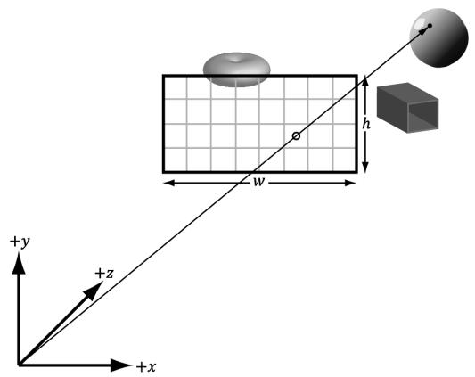


Figure 27.1. The view window discretized into a grid. A ray cast from the eye through a pixel into the scene to sample the 3D world.


determine the surface attributes at the intersection point (e.g., normal and texture coordinates), and then generate a color. Some effects are more natural with ray tracing, such as reflections and shadows. 

Some games have full ray traced renderers such as Portal with RTX. More popular large games already have a large investment in rasterization, but support hybrid ray tracing where a mix of rasterization and ray tracing is used. Although the ray tracing algorithm is old, real-time hardware accelerated ray tracing is relatively new, and it will take a while to determine what works and what does not. We use “RTX” to refer to the DirectX ray tracing API and system. 

# Chapter Objectives:

1. To learn how to write a classical recursive ray tracer using geometric primitives 

2. To discover the various new shader types involved with ray tracing 

3. To understand how to define your scene in a way that the GPU can efficiently ray trace against the scene 

4. To find out how to implement hybrid ray tracing techniques where we combine rasterization methods with ray tracing effects 

# 27.1 BASIC RAY TRACING CONCEPTS

In this section, we describe some theoretical concepts of writing a classical recursive ray tracer with mirror-like reflections and refractions. 

# 27.1.1 Rays

Recall that the vector equation $\mathbf { r } ( t ) = \mathbf { p } + t \mathbf { v }$ for $t \in \left( - \infty , \infty \right)$ represents a line. If we restrict $t$ to the interval $[ 0 , \infty )$ , then the equation represents a ray (Figure 27.2). 

In ray tracing, we are concerned with rays, so when we do our ray/object intersection tests, we should look for intersection parameters in the interval $[ 0 , \infty )$ . However, due to the realities of finite floating-point arithmetic, this interval does not work well in practice. 

As we show in later sections, to implement some techniques like reflections and shadows, we often shoot rays into the scene that originate from the surface of an object. If we allowed intersection parameters in the interval $[ 0 , t _ { m i n } )$ where $t _ { m i n }$ is relatively small, then we might get self intersections (see Figure 27.3). 

We also specify a $t _ { m a x }$ value, so that rays cannot intersect points too far away. Therefore, we look for intersection parameters in the interval $[ t _ { m i n } , t _ { m a x } )$ . To form an analogy with rasterization engines, we can think of $t _ { m i n }$ and $t _ { m a x }$ as working 

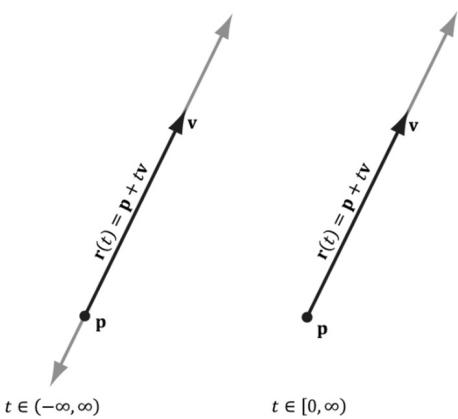


Figure 27.2. A line is shown on the left, and a ray is shown on the right.


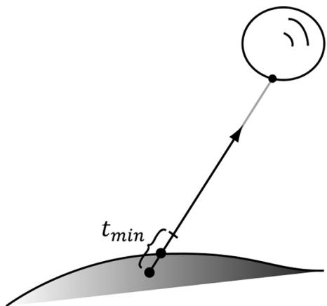


Figure 27.3. The numerical intersection point lies slightly beneath the real surface due to floatingpoint errors.


similar to the “near” and “far” planes on the view frustum, respectively. The actual values used for $t _ { m i n }$ and $t _ { m a x }$ are scene dependent. In other words, you need to adjust them based on the scene. 

# 27.1.2 View Rays

With ray tracing, we discretize the view window based on window resolution and cast a ray through each pixel to “sample” the 3D world. For simplicity, let us only consider a scene with opaque objects. For each ray, we find the nearest point in the scene the ray intersects. We obtain the normal and texture coordinates at that point and use that information to shade the point the ray “sees.” This calculated shade becomes the pixel color for the corresponding ray. For a scene with transparent surfaces things are more complicated, and it would be handled by refraction (see $\ S 2 7 . 1 . 4 )$ . 

There is nothing that forces us to cast rays into the scene only from the camera position through the view window. Given any position p and direction v, we can cast a ray $\mathbf { r } ( t ) = \mathbf { p } + t \mathbf { v }$ into the scene, find the point it intersects, and compute a color value that indicates what the point p sees in the direction v. This general way of thinking about ray casting is important for understanding reflections and refractions in the next two sections. 

# 27.1.3 Reflection

Some surfaces have mirror-like properties. For example, you can see reflections on a polished car. Adding mirror-like reflections to a ray tracer is quite simple; 

Figure 27.4 shows the situation. Suppose the surface the point $\mathbf { e } _ { 1 }$ coincides with acts like a mirror to some degree. Due to the mirror properties, the eye at $\mathbf { e } _ { 0 }$ looking down the view ray $\mathbf { r } _ { 0 }$ toward $\mathbf { e } _ { 1 }$ sees what an eye positioned at $\mathbf { e } _ { 1 }$ looking down the reflected ray $\mathbf { r } _ { 1 }$ sees. Figuring out what an eye at $\mathbf { e } _ { 1 }$ sees looking down the ray $\mathbf { r } _ { 1 }$ is easy, as we just cast the ray $\mathbf { r } ( t ) = \mathbf { e } _ { 1 } + t \mathbf { r } _ { 1 }$ into the scene and shade the intersection point. 

If many of the scene objects behave like mirrors, it is possible that the reflected ray will itself reflect off another mirror like surface. In this case, we then need to cast another reflection ray into the scene from $\mathbf { e } _ { 2 }$ in the reflected direction $\mathbf { r } _ { 2 }$ . This might seem complicated, but it is actually just recursively ray casting. The depth of the recursion can potentially become large, and not much is gained by following the reflection trail too deep. Therefore, it is common to set a maximum recursion depth for reflections. 

Usually, a surface is not a perfect mirror. When we intersect a mirror like surface, we compute the shaded color value there and cast the reflection ray into the scene. Then we do some sort of blend between the shaded surface and the reflection color. 

// Compute the shade at the intersection point. float4 litColor $=$ ambient $^+$ directLight;   
//Cast out reflection ray. float3 reflectionDir $=$ reflect(WorldRayDirection(), bumpedNormalW); float4 reflectionColor $=$ CastColorRay hitPosW, reflectionDir, rayPayload.RecursionDepth + 1); float3 fresnelFactor $=$ SchlickFresnel(fresnelR0,bumpedNormalW, reflectionDir); float3 reflectionAmt $=$ shininess \*fresnelFactor;   
//Add reflection contribution. litColor.rgb $+ =$ reflectionAmt \*reflectionColor.rgb; 

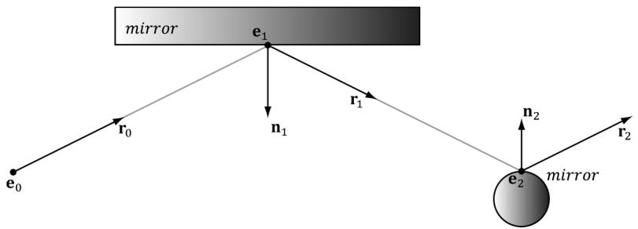


Figure 27.4. Ray traced reflections. The view ray $\mathbf { \boldsymbol { r } } ( t ) = \mathbf { \boldsymbol { e } } _ { 0 } + t \mathbf { \boldsymbol { r } } _ { 0 }$ strikes a mirror like surface at point $\pmb { e } _ { 1 }$ . To determine what the reflected color is, we cast a reflection ray $\mathbf { r } ( t ) = \mathbf { e } _ { 1 } + t \mathbf { r } _ { 1 }$ into the scene. The reflection ray hits the surface at point $\pmb { e } _ { 2 }$ . If the surface at $\pmb { e } _ { 2 }$ also has mirror properties, then we can cast a secondary reflection ray $\mathbf { r } ( t ) = \mathbf { e } _ { 2 } + t \mathbf { r } _ { 2 }$ .


# 27.1.4 Refraction

A dielectric is a transparent material that refracts light (i.e., light can pass through the physical medium). Refraction is the reason why when you look through a glass cup, say on a table, the table behind it looks offset. Essentially, when a ray enters a new physical medium the speed of light changes, which causes a change in direction of the light ray. A typical surface will have both reflection and refraction, the amount being determined by the Fresnel equations. How light refracts from one medium to another is specified by Snell’s Law of Refraction. As mentioned, refraction occurs at the interface between a change of indices of refraction (i.e., a change in physical medium). Observe in Figure 27.5 that outside the block, the medium has an index of refraction $n _ { \mathrm { 1 : } }$ , and inside the block, the medium has an index of refraction $n _ { 2 }$ . The indices of refraction are physical constants based on the physical medium (e.g., air, water, and glass). 

The refract function (which is an intrinsic HLSL function) computes the refraction direction and has the following prototype: 

```javascript
float3 refract(float3 incident, float3 normal, float indexOfRefractionRatio); 
```

The first parameter is the direction vector of the incoming ray (and should be of unit length as the implementation of refract depends on it), and the second parameter is the (unit) surface normal such that dot(incident, normal) $< ~ 0$ (i.e., out of the two possible surface normals, always choose the one that most opposes the incident vector). (The normal chosen is important because the angles measured between the normal and incident vector in Figure 27.5 depend on it; for example, the angle between ${ \bf n } _ { 1 }$ and $\mathbf { v } _ { 0 }$ is different than the angle between $\mathbf { - n } _ { 1 }$ and $\mathbf { v } _ { 0 }$ .) The parameter $n _ { 1 }$ is the index of refection of the source medium the ray is leaving, and $n _ { 2 }$ is the index of refection of the destination medium the ray is entering. The index of refraction of a vacuum is 1.0. Some other index of 

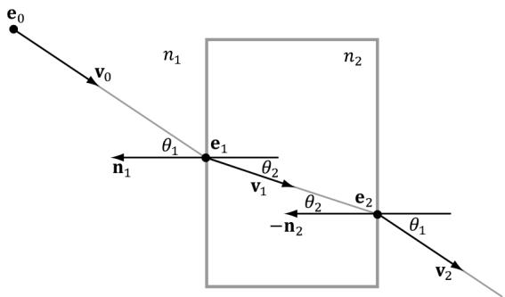


Figure 27.5. Refraction, notice how the ray bends when it enters and leaves the block.


refactions are as follows: water $= 1 . 3 3$ , and glass $= 1 . 5 1$ . The third parameter is the ratio $n _ { 1 } / n _ { 2 }$ . 

In Figure 27.5, we would call the refract function like so: 

$$
\mathbf {v} _ {1} = \operatorname {r e f r a c t} \left(\mathbf {v} _ {0}, \mathbf {n} _ {1}, n _ {1}, n _ {2}\right);
$$

$$
\mathbf {v} _ {2} = \operatorname {r e f r a c t} (\mathbf {v} _ {1}, - \mathbf {n} _ {2}, n _ {2}, n _ {1});
$$

The indices of refraction determine how much the light bends: 

1. If $n _ { 1 } = n _ { 2 }$ , then $\theta _ { 1 } = \theta _ { 2 }$ (no bending). 

2. If $n _ { 2 } > n _ { 1 }$ , then $\theta _ { 2 } < \theta _ { 1 }$ (ray bends toward normal). 

3. If $n _ { 1 } > n _ { 2 }$ , then $\theta _ { 2 } > \theta _ { 1 }$ (ray bends away from normal). 

Thus, in Figure 27.5, $n _ { 2 } > n _ { 1 }$ , since the ray bends toward the normal when we enter the block and bends away from the normal when the ray leaves the block. 

Refraction with ray tracing is done just like reflection. When we intersect an object that is refractive, we can cast out a refraction ray into the scene. As with reflections, if the surface the refraction ray hits is also refractive then this process can continue in a recursive fashion up to some specified recursion limit. Furthermore, a surface is usually not solely refractive. Typically, when we intersect a refractive surface, we compute the shaded color value there and cast the refraction ray into the scene. Then we do some sort of blend between the shaded surface and the refraction color. 

```cpp
if( transparencyScale > 0.0f )  
{ float3 refractionAmt = transparencyScale * (1.0f - reflectionAmt); float3 refractDir = refract(WorldRayDirection(), bumpedNormalW, indexOfRefraction); float4 refractColor = CastColorRay(hitPosW, refractDir, rayPayload.RecursionDepth + 1); litColor.rgb = lerp(litColor.rgb, refractColor.rgb, refractionAmt); } 
```

# 27.1.5 Shadows

Consider Figure 27.6. We cast a ray r from the eye; it intersects a surface in the scene at point p. To see if p is in shadow, we cast a shadow ray from p to the light source L. If the shadow ray intersects another object in the scene, then the point p is in shadow with respect to the light L; it receives no diffuse or specular light (but does receive ambient light because ambient light models indirect light). With multiple light sources, a shadow ray must be cast for each light (a ray may be in shadow with respect to one light, but not another). 

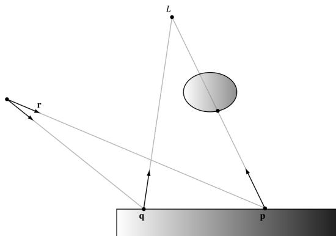


Figure 27.6. Note that the shadow ray is always directed in the same direction as the light vector. The point p is in shadow because its shadow ray intersects an object in the scene, whereas the point q is not in shadow because its shadow ray misses all objects in the scene.


Figure 27.7 shows that if the shadow ray intersects a scene object, we must compare the distance $t _ { 0 }$ from $\mathbf { p }$ to the intersection point with the distance $d$ from p to the light source. If $t _ { 0 } > d$ , then the point is not really in shadow because the object lies behind the light source. Note that if the ray’s direction vector is of unit length, then the intersection parameter gives the distance from p to the intersection point. 

If the light source is a directional light (which is often used to model sun shadows), then it is infinitely far away, and we do not need to do this additional distance test. It is sufficient just to test if the shadow ray hits an object in the scene or not. 

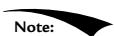


Handling shadows with transparent objects is trickier. For example, consider Figure 27.6 again, but suppose the object blocking the light is transparent. Since the object is transparent, some light passes through it, so the point is 

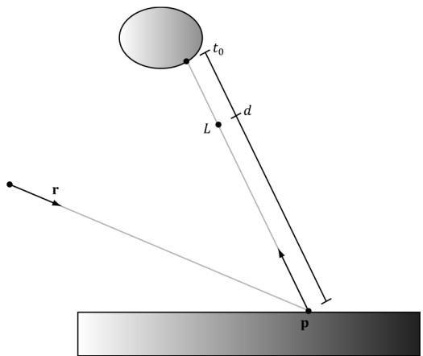


Figure 27.7. Comparing the intersection distance and the light distance from p


only “partially” in shadow. Consequently, it should receive some light, but of a weaker intensity proportional to how transparent the object is. When several transparent objects line up and block the light, then each object successively weakens the light based on its transparency level. We do not implement this behavior, but it is an improvement that can be added to the ray tracer if desired. 

# 27.1.6 Ray/Object Intersection Examples

One of the fundamental calculations of ray tracing is intersecting a ray with an object in the scene. Even though for game development we would primarily be interested in intersecting rays against triangle meshes, we should still know how to intersect rays against fundamental mathematical shapes. In the following subsections, we derive the formulas for intersecting a ray against various mathematical shapes. 

When doing ray/object intersection tests, we transform the ray from view space to world space first. Then for each object, we transform the ray from world space to the object’s local space. We then do the ray/object intersection test in that local space. For an object O, let M be the matrix that transforms geometry from O’s local space to the world space. Then the matrix ${ { \bf { M } } ^ { - 1 } }$ transforms geometry from the world space to O’s local space. Let $\mathbf { r } ( t ) = \mathbf { p } + t \mathbf { v }$ be a ray relative to the world space, then that same ray relative to O’s local space is given by 

$$
\mathbf {r} ^ {\prime} (t) = \mathbf {M} ^ {- 1} \mathbf {r} (t) = \mathbf {M} ^ {- 1} \mathbf {p} + t \mathbf {M} ^ {- 1} \mathbf {v} = \mathbf {p} ^ {\prime} + t \mathbf {v} ^ {\prime}
$$

Observe from the equation above that $t$ remains invariant under the transformation from world space to local space (and vice-versa). That is, for some fixed $t _ { 0 } , \mathbf { r } ( t _ { 0 } ) = \mathbf { p } + t _ { 0 } \mathbf { v }$ is a point on the ray in world space. The same point relative to the local space is given by $\mathbf { r } ^ { \prime } ( t _ { 0 } ) = \mathbf { p } ^ { \prime } + t _ { 0 } \mathbf { v } ^ { \prime } .$ . In other words, the same parameter $t _ { 0 }$ works in either space. This works because when we apply ${ { \bf { M } } ^ { - 1 } }$ to v, the vector v gets stretched or compressed to account for any difference in scale between the two spaces. In particular, this means that if $t _ { 0 }$ is an intersection parameter corresponding to an intersection point, then $t _ { 0 }$ can be used in both world space and local space. That is, $\mathbf { r } ^ { \prime } ( t _ { 0 } )$ gives the intersection point relative to the local space, and $\mathbf { r } ( t _ { 0 } )$ gives the intersection point relative to the world space. (Note that for this to work, it is necessary to allow the direction vectors of the rays to be of non-unit length.) 

One of the advantages of this strategy is that the ray intersection test is simplified because the object takes on a simpler mathematical form relative to its local coordinate system than relative to the world coordinate system. For example, the ray-ellipsoid intersection test for an ellipsoid with arbitrary position and orientation in the world space is much more complicated than intersecting a ray with a unit sphere centered at the origin (see Figures 27.8 and 27.9). 

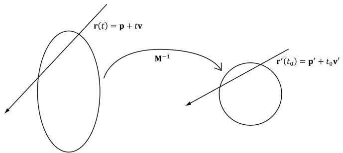


Figure 27.8. Transforming a ray from world space into the local space of the ellipse, where the ellipse looks like a circle.


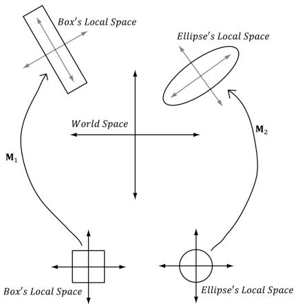


Figure 27.9. (Left) Transforming a ray from world space into the local space of a rectangle where the rectangle is an axis aligned square. (Right) Transforming a ray from world space into the local space of an ellipse where the ellipse is an axis aligned circle.


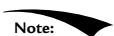


If you use nonuniform scaling in the world matrix, then to transform normals you will need to use the inverse-transpose. 

```cpp
float3x3 toWorld = (float3x3)ObjectToWorld4x3();  
float3x3 toWorldInvTranspose = transpose(inverse(toWorld)); 
```

```javascript
float3 normalW = normalize(mul(attr.Normal, toWorldInvTranspose)); 
```

# 27.1.6.1 Ray/Quad

Let $R$ be a rectangle of width w and depth $d$ centered at the origin and coinciding with the $x z$ -plane of its local coordinate system. We wish to determine if a ray $\mathbf { r } ( t ) =$ $\mathbf { p } + t \mathbf { v }$ intersects the rectangle, and if it does, we wish to find the intersection point (see Figure 27.10). The first step in solving this problem is to find the intersection point of the ray and the plane of the rectangle. Because we are working in the local 

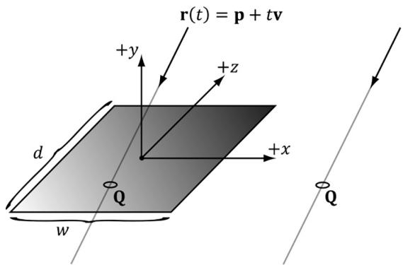


Figure 27.10. Ray/rectangle intersection


coordinate system of the rectangle, the plane of the rectangle is just the $_ { x z }$ -plane, which has a very simple form: 

$$
y = 0
$$

Plugging our ray into this equation and solving for $t$ yields the following: 

$$
(\mathbf {r} (t)) _ {y} = 0
$$

$$
p _ {y} + t v _ {y} = 0
$$

$$
t = - \frac {p _ {y}}{v _ {y}}
$$

Thus, the ray/plane intersection point is $\mathbf { Q } = \mathbf { r } \left( - \frac { \hat { p } _ { y } } { \nu _ { y } } \right) = \mathbf { p } - \frac { \hat { p } _ { y } } { \nu _ { y } } \mathbf { v } .$ p v− p y . Now if $Q _ { x } \in \left[ - \frac { w } { 2 } , \frac { w } { 2 } \right]$ 2, and Q z ∈ $Q _ { z } \in \left[ - \frac { d } { 2 } , \frac { d } { 2 } \right] ,$ then the ray intersects the rectangle and v $\mathbf { Q }$ is the intersection point, otherwise the ray misses the rectangle. 

# 27.1.6.2 Ray/Cylinder

Let $C$ be a cylinder with radius $r ,$ , centered at the origin of its local coordinate system, and aligned with the $y$ -axis. We wish to determine if a ray $\mathbf { r } ( t ) = \mathbf { p } + t \mathbf { v }$ intersects the cylinder, and if it does, we wish to find the nearest intersection point (as a ray may intersect a cylinder twice, just like the sphere). The set of all points x on the cylinder $C$ satisfy the following equation (see Figure 27.11): 

$$
x ^ {2} + z ^ {2} = r ^ {2}
$$

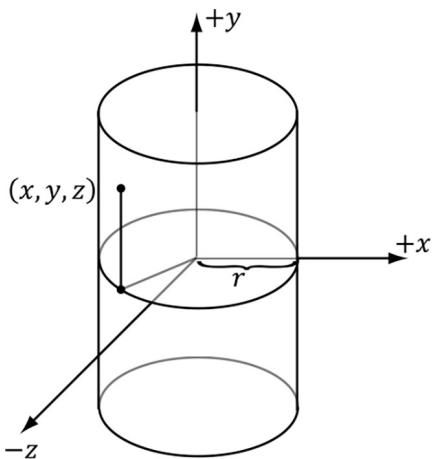


Figure 27.11. Ray/cylinder intersection


In other words, the y-coordinate does not matter—a point is on the cylinder so long as its $( x , z )$ coordinates lie on the circle $x ^ { 2 } + z ^ { 2 } = r ^ { 2 }$ in the $_ { x z }$ -plane. Another way to think of the cylinder is by starting with the circle $x ^ { 2 } + z ^ { 2 } = r ^ { 2 }$ in the $x z$ -plane and then shifting it up and down to “sweep out” the cylinder. 

Plugging in the ray equation, component-by-component, into the equation of C leads to the following quadratic equation in $t \colon$ 

$$
\left(p _ {x} + t \nu_ {x}\right) ^ {2} + \left(p _ {z} + t \nu_ {z}\right) ^ {2} = r ^ {2}
$$

$$
p _ {x} ^ {2} + 2 t p _ {x} v _ {x} + t ^ {2} v _ {x} ^ {2} + p _ {z} ^ {2} + 2 t p _ {z} v _ {z} + t ^ {2} v _ {z} ^ {2} - r ^ {2} = 0
$$

$$
\left(v _ {x} ^ {2} + v _ {z} ^ {2}\right) t ^ {2} + 2 \left(p _ {x} v _ {x} + p _ {z} v _ {z}\right) t + \left(p _ {x} ^ {2} + p _ {z} ^ {2} - r ^ {2}\right) = 0
$$

$$
A t ^ {2} + B t + C = 0
$$

where $A = \nu _ { x } ^ { 2 } + \nu _ { z } ^ { 2 }$ , $B { = } 2 \big ( P _ { x } \nu _ { x } { + } P _ { z } \nu _ { z } \big )$ ,  and $C = p _ { x } ^ { 2 } + p _ { z } ^ { 2 } - r ^ { 2 }$ . Applying the quadratic formula yields the following: 

$$
t _ {1, 2} = \frac {- B \pm \sqrt {B ^ {2} - 4 A C}}{2 A}
$$

1. If $B ^ { 2 } - 4 A C < 0$ , then $t _ { 1 }$ and $t _ { 2 }$ have imaginary components and this means the ray missed the cylinder completely. 

2. If $B ^ { 2 } - 4 A C = 0$ , then $t _ { 1 } = t _ { 2 } ,$ and this means the ray intersects the cylinder at one point (a tangent point) and the intersection point is given by $\mathbf { Q } = \mathbf { r } ( t _ { 1 } )$ . 

3. If $B ^ { 2 } - 4 A C > 0$ , then $t _ { 1 }$ and $t _ { 2 }$ are distinct, and this means the ray intersects the cylinder in two places. The two intersection points are $\mathbf Q _ { 1 } = \mathbf r ( t _ { 1 } )$ and $\mathbf Q _ { 2 } = \mathbf r ( t _ { 2 } )$ . 

The $y$ -axis aligned cylinder described by the equation $x ^ { 2 } + z ^ { 2 } = r ^ { 2 }$ is an infinite cylinder; that is, there is no bound on its height. We can make the cylinder finite by ignoring intersections with a y-coordinate above or below a certain threshold. The following implementation does this; moreover, we can ray trace disks to cap the top and bottom of the cylinder. 

//   
// The cylinder is centered at the origin, aligned with $+\mathrm{y}$ axis,   
// has radius 1 and length 2 in local space.   
//   
bool RayCylinderIntersection(float3 rayOriginL, float3 rayDirL, out float3 normal, out float3 tangentU, out float2 texC, out float t_hit)   
{ normal $= 0.0f$ tangentU $= 0.0f$ texC $= 0.0f$ t_hit $= 0.0f$ const float3 anchor $=$ float3(0.0f, -1.0f, 0.0f); const float3 axis $=$ float3(0.0f, 1.0f, 0.0f); const float radius $= 1.0f$ const float cylLength $= 2.0f$ const float a $=$ rayDirL.x \* rayDirL.x + rayDirL.z \* rayDirL.z; // a $= = 0$ means rayirection and cylinder.Axis must be parallel // (their cross product is zero). if(abs(a) < 0.0001f) return false;   
// The 2 in the b' $= 2b$ can get factored out of the discriminant /sqrt(2^2*b^2 - 4ac) $= 2$ sqrt(b*b - ac), // and then the 2 gets canceled with the 2a. const float b $=$ rayOriginL.x \* rayDirL.x + rayOriginL.z \* rayDirL.z; const float c $=$ rayOriginL.x\*rayOriginL.x + rayOriginL.z - radius\*radius; const float disc $= \mathrm{b}^{*}\mathrm{b} - \mathrm{a}^{*}\mathrm{c}$ .   
if disc $<  0.0f$ return false;   
const float t1 $= (-b + \operatorname {sqrt}(\operatorname {disc})) / a;$ const float t2 $= (-b - \operatorname {sqrt}(\operatorname {disc})) / a;$ 

t_hit $=$ min(t1,t2);   
//Skip intersections behind the ray or intersection   
//farther than a closer intersection we found. if(t_hit $<$ RayTMin() || t_hit $> =$ RayTCurrent()) return false;   
const float3 hitPoint $=$ rayOriginL $^+$ t_hit \* rayDirL;   
const float3 u $=$ hitPoint - anchor;   
//Project onto unit cylinder axis to make sure we intersected   
//the finite cylinder. const float k $=$ dot(axis,u); if(k <= 0.0f || k >= cylLength) return false;   
const float3 projU $=$ k\*axis;   
const float3 perpU $=$ u - projU;   
normal $=$ normalize(perpU);   
const float theta $=$ atan2-hitPoint.z, hitPoint.x);   
//Parameterize unit circle: // x(t) $=$ cos(t) // y(t) $= 0$ // z(t) $=$ sin(t) // dx/dt $=$ -sin(t) // dy/dt $= 0$ // dz/dt $= +\cos (t)$ tangentU.x $=$ -sin(theta); tangentU.y $= 0.0f;$ tangentU.z $= +\cos (\theta a t a)$ tangentU $=$ normalize(tangentU);   
const float Pi $= 3.1415926$ texC.x $=$ theta / (2.0f \* Pi); texC.y $=$ (hitPoint.y - 1.0f) / -cylLength; return true; 

# 27.1.6.3 Ray/Box

Let $B$ be a cube with width $w$ (extents w/2) centered at the origin of its local coordinate system. We can think of the box as the intersection of three slabs, where a slab is the region of space bounded between two parallel planes. In our case, the slabs are parallel to the coordinate axes, and we label them with an index (see Figure 27.12). 

Now consider Figure 27.13 (we dropped the coordinate system axes to make the picture less convoluted), and pay attention to the difference between ${ \bf r } _ { 1 } ( t )$ and 

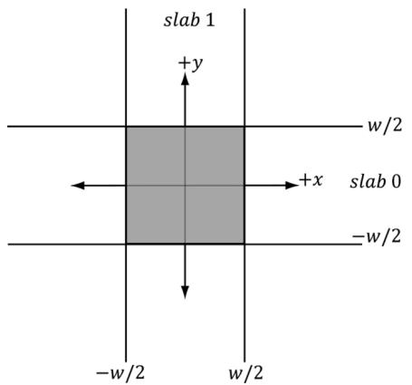


Figure 27.12. A cube defined by the intersection of slabs


${ \bf r } _ { 2 } ( t )$ , as one hits the cube and the other misses. Let $t _ { 0 }$ and $\overline { { t } } _ { 0 }$ be the smallest ray intersection parameters for slab 0 and slab 1, respectively, and let $t _ { 1 }$ and $\overline { { t _ { \scriptscriptstyle 1 } } }$ be the largest ray intersection parameters for slab 0 and slab 1, respectively. Define the terms so that 

$$
t _ {m i n} = \max  \left\{t _ {0}, \bar {t _ {0}} \right\}
$$

$$
t _ {m a x} = \min  \left\{t _ {1}, \overline {{t}} _ {1} \right\}
$$

Observe from the figure that if $t _ { m i n } > t _ { m a x } ,$ then the ray misses the box. Also note that if $t _ { m a x } < \mathrm { \sf { M I N \_ T } }$ , then the box is behind the ray, so the ray misses the box (Figure 27.14). Although we illustrated the method in 2D, the strategy naturally generalizes to 3D. We just have an additional slab to check against. 

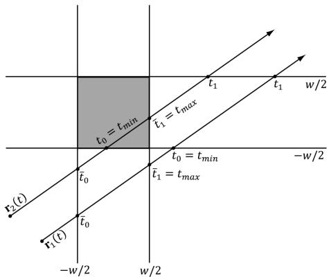


Figure 27.13. Ray/box intersection test


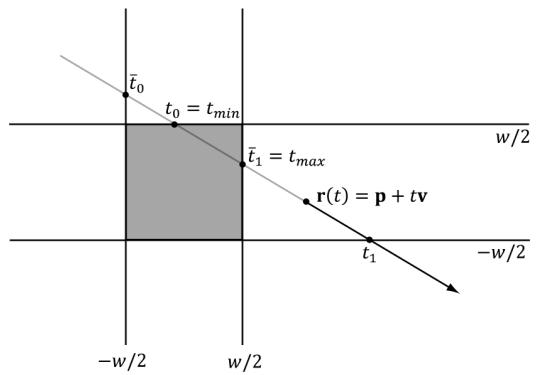


Figure 27.14. The box is behind the ray.


The ray intersection test with the slab planes takes on a very simple form since the slab planes are axis-aligned and the box dimensions are the same. The two plane equations for the ith slab are as follows: 

$$
x _ {i} = - w / 2
$$

$$
x _ {i} = w / 2
$$

Plugging in our ray equation $\mathbf { r } ( t ) = \mathbf { p } + t \mathbf { v }$ and solving for $t _ { : }$ , we obtain the intersection parameters for the two planes of the ith slab: 

$$
p _ {i} + t _ {0} v _ {i} = - \frac {w}{2} \Rightarrow t _ {0} = \frac {- \frac {w}{2} - p _ {i}}{v _ {i}}
$$

$$
p _ {i} + t _ {1} v _ {i} = + \frac {w}{2} \Rightarrow t _ {1} = \frac {\frac {w}{2} - p _ {i}}{v _ {i}}
$$

If the ray lies inside the box, then $t _ { m i n }$ will be behind the ray. In this case, we want to return $t _ { m a x }$ as the nearest intersection point: 

```cpp
t0 = tmin < MIN_T ? tmax : tmin; 
```

Another possible situation is if the ray is parallel to a slab (Figure 27.15b). If the ray lies inside the slab, then we can continue to the next slab. If the ray lies outside the slab, then the ray misses the box. To determine if a ray lies inside a slab, all we need to do is check if its origin point is bounded between the slab. 

```cpp
// The box is [-1, 1]^3 in local space.  
bool RayAABBIntersection(float3 rayOriginL, float3 rayDirL, out float3 normal, out float3 tangentU, out float2 texC, out float t_hit) 
```

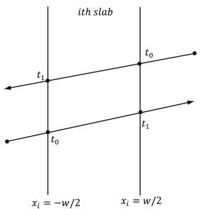


(a)


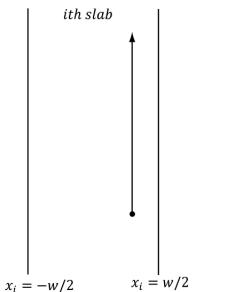


(b)


Figure 27.15. (a) The smallest and largest ray intersection parameters of a slab depend on the direction the ray strikes the slab; (b) The case where the ray is parallel to a slab.


normal $= 0.0f$ tangentU $= 0.0f$ texC $= 0.0f$ t_hit $= 0.0f$ // Simplified version of the Slabs method; see page 572 of   
// Real Time Rendering 2nd Edition.   
float tmin $= -1.0e9f$ float tmax $= +1.0e9f$ const float3 extents $=$ float3(1.0f, 1.0f, 1.0f);   
// For each slab (a slab is simply two parallel planes,   
// grouped for faster computations).   
for(int i = 0; i < 3; ++i)   
{ const float e $=$ rayOriginL[i]; const float f $=$ rayDirL[i]; const float invF $= 1.0\mathrm{f}/\mathrm{f}$ if(abs(f) > 1.0e-8f) // ray not parallel to slab planes. { float tmin_i $=$ (-e + extents[i]) \* invF; float tmax_i $=$ (-e - extents[i]) \* invF; if(tmin_i > tmax_i) { float temp $=$ tmin_i; tmin_i $=$ tmax_i; tmax_i $=$ temp; } tmin $=$ max(tmin, tmin_i); tmax $=$ min(tmax, tmax_i); // Did the ray miss? if(tmin > tmax) return false; } else // ray is parallel to slab planes { // If the ray is parallel and lies between the slabs, // we can continue to the next slab, otherwise the // ray misses and we are done. If the ray origin // lies outside the slab, then the ray misses. if(e<-extents[i] || e>extents[i]) return false; } 

t_hit $=$ tmin;   
//Skip intersections behind the ray or intersection   
//farther than a closer intersection we found. if(t_hit $<$ RayTMin() || t_hit $> =$ RayTCurrent()) return false;   
// Figure out normal and texture coordinates.   
//Basically a cube map look up.   
// Relative to local space of box. float3 q $=$ rayOriginL $^+$ t_hit \* rayDirL; int faceIndex $= 0$ . texC $=$ CubeLookup(q, faceIndex);   
switch(faceIndex)   
{ case 0: normal $=$ float3(1.0f, 0.0f, 0.0f); tangentU $=$ float3(0.0f, 0.0f, 1.0f); break;   
case 1: normal $=$ float3(-1.0f, 0.0f, 0.0f); tangentU $=$ float3(0.0f, 0.0f, -1.0f); break;   
case 2: normal $=$ float3(0.0f, 1.0f, 0.0f); tangentU $=$ float3(1.0f, 0.0f, 0.0f); break;   
case 3: normal $=$ float3(0.0f, -1.0f, 0.0f); tangentU $=$ float3(-1.0f, 0.0f, 0.0f); break;   
case 4: normal $=$ float3(0.0f, 0.0f, 1.0f); tangentU $=$ float3(-1.0f, 0.0f, 0.0f); break;   
case 5: normal $=$ float3(0.0f, 0.0f, -1.0f); tangentU $=$ float3(1.0f, 0.0f, 0.0f); break; default: break;   
}   
return true; 

# 27.1.6.4 Ray/Triangle

For the mathematics of the ray/triangle intersection test, refer to $\ S 1 7 . 3 . 3$ , and note that DXR has built-in support for ray/triangle intersection, so we do not need a HLSL implementation. 

# 27.2 OVERVIEW OF THE RAY TRACING SHADERS

For now, let us ignore the CPU side of the ray tracing API and focus on the shaders. GPU ray tracing introduces five new shaders. The example implementations of these shaders are from the demo “IntroRayTracing.” 

# 27.2.1 Ray Generation

The ray generation shader is where we spawn our initial rays. It looks similar to a compute shader where we dispatch a grid of threads. Typically, we would dispatch a thread per pixel, construct a ray from the eye through each pixel, and then call the intrinsic function TraceRay to cast the ray into the scene which will return a filled out payload structure with the ray traced color value. We then write the color to an output image UAV. 

```cpp
// Scene data structures will be discussed later, but this basically  
// stores the scene geometry in an efficient way the GPU can intersect  
// a ray against.  
RaytracingAccelerationStructure gSceneTlas : register(t1);  
struct LocalRootConstants{uint MaterialIndex;uint PrimitiveType;float2 TexScale;}  
// Per geometry constants we can access when we intersect  
// an object. This is similar to per-object constants.  
ConstantBuffer<LocalRootConstants> gLocalConstants : register(b0);  
// Identify different types of rays.#define NUM_RAYTYPES 2#define COLOR_RAY_TYPE 0#define SHADOW_RAY_TYPE 1  
struct ColorRayPayload{float4 Color;uint RecursionDepth;} 
```

```javascript
float4 CastColorRay(float3 rayOrigin, float3 rayDir, uint recursionDepth)   
{ // At the maximum recursion depth, TraceRay() calls result // in the device going into removed state. if( recursionDepth >= MAX_RECURSION_DEPTH ) { return float4(0.0f, 0.0f, 0.0f, 0.0f); } RayDesc rayDesc; rayDesc.Oriin = rayOrigin; rayDesc.Direction = rayDir; rayDesc.TMin = 0.001f; rayDesc.TMax = 100000.0f; // Custom data we attach to ray. ColorRayPayload payload; payload.Color = float4(0, 0, 0, 0); payload.RecursionDepth = recursionDepth; // Can be used to filter out geometry instances from raytracing. // Only the lower 8-bits are used. // This value could come from a constant buffer to filter out // different groups of instances. uint instanceof = 0xFFFFFF; // Parameters for indexing shader binding table (SBT). uint rayOffset = COLOR_RAY_TYPE; uint rayStride = NUM_RAYTYPES; uint missRayOffset = COLOR_RAY_TYPE; TraceRay(gSceneTlas, RAY_FLAG_CULLBack_FACING_TRIANGLES, instanceof, rayOffset, rayStride, missRayOffset, rayDesc, payload); return payload.Color;   
} [shader("raygeneration")] void RaygenShader() { uint2 rayIndex = DispatchRaysIndex().xy; uint2 imageSize = DispatchRaysDimensions().xy; float2 screenPos = rayIndex + 0.5f; // offset to pixel center. // Remap to NDC space [-1, 1]. float2 posNdc = (screenPos / imageSize) * 2.0f - 1.0f; posNdc.y = -posNdc.y; // +y up // Transform NDC to world space. float4 posW = mul(float4(posNdc, 0.0f, 1.0f), gViewProj); posW.xyz /= posW.w; 
```

```objectivec
float3 rayOriginW = gEyePosW;  
float3 rayDirW = normalize(posW.xyz - rayOriginW);  
uint currentRecursionDepth = 0;  
float4 color = CastColorRay( rayOriginW, rayDirW, currentRecursionDepth );  
// Write the raytraced color to the output texture.  
RWTemperature2D<float4> outputImage = DescriptorHeap[gRayTraceImageIndex];  
outputImage[rayIndex] = color; 
```

As we will see later in this chapter, on the $\mathrm { C } { + + }$ side we will call DispatchRays to dispatch a grid of rays. In the shader, we can use the intrinsic function DispatchRaysDimensions to get the grid dimensions and the intrinsic function DispatchRaysIndex to get the ray index we are processing. If we dispatch a ray for each pixel in an image, then these correspond to the image dimensions and pixel index. 

uint2rayIndex $=$ DispatchRaysIndex().xy; uint2 imageSize $=$ DispatchRaysDimensions().xy; 

The RayDesc type is a built-in HLSL structure for defining a ray: 

```cpp
RayDesc rayDesc;  
rayDescOrigin = rayOrigin;  
rayDesc.Direction = rayDir;  
rayDesc Tmin = 0.001f;  
rayDesc Tmax = 100000.0f; 
```

The members TMin and TMax make the ray finite. Typically, you want TMin $> 0$ so that you do not get self-intersections when casting a ray off a surface. TMax would be a practical distance where such far intersections can be ignored (similar to a far clip plane). 

The TraceRay function casts the ray into the scene where the ray tracing system calls other shaders based on whether the ray hits or misses geometry in the scene (these other shaders are discussed in the subsequent sections). The ray payload is user-defined data that is attached to the ray throughout its lifetime. As we will soon see, when the ray is traversing the scene, it may hit an object, and we want to store the color of the object at the hit position, or we may want to store if the hit position is in shadow. We can write this data to the payload data. After traversing the scene, TraceRay returns, and we can access the data in the payload to output our results (e.g., pixel color). Note that the payload byte size is expected to be small, around 32-64 bytes or less; it should not be hundreds of bytes or more. 

Also observe that we cast different types of rays: the two common ones being color and shadow rays. Because different ray types have different shader callbacks (because they need to do different things when they hit or miss geometry), we have to identify them differently to TraceRay: 

define NUM_RAYTYPES2   
#define COLOR_RAY_TYPE0   
#define SHADOW_RAY_TYPE1   
// Parameters for indexing shader binding table (SBT).   
uint rayOffset $=$ COLOR_RAY_TYPE;   
uint rayStride $=$ NUM_RAY_TYPEPS;   
uint missRayOffset $=$ COLOR_RAY_TYPE;   
TraceRay(gSceneTlas, RAY_FLAG_CULLBack_FACING_TRIANGLESS,   
instanceMask, rayOffset, rayStride, missRayOffset, rayDesc, payload); 

As the comment indicates, these IDs and stride are used to correctly index the shader binding table (§27.3) so that the ray can select the right hit/miss callback shaders. 

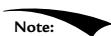


Casting a ray through each pixel is the typical pattern for drawing a scene with ray tracing. However, that is not the only way we might utilize ray tracing. For example, given images of the scene depth and scene normal vectors of the nearest visible pixels (as we built for SSAO), we can reconstruct the 3D positions and cast random rays about the hemisphere at each pixel and use ray tracing to estimate the ambient occlusion. 

# 27.2.2 Intersection

The intersection shader is used to write custom code to intersect geometry. DXR has built-in functionality for intersecting triangles, so we do not need to implement ray/triangle intersection code. (§27.6 will explain the demo that ray traces against triangles.) But for other shapes like spheres, cylinders, or other mathematical implicit surfaces, we have to write our own intersection shader that does the math. If a ray intersects the bounding box of a primitive, then the intersection shader is called. We have access to the ray and local constants of the geometry whose bounding box was intersected. From that, we intersection test the ray against the geometry, report a hit (unless the ray misses), and output any intersection attributes. Intersection attributes would be user-defined data we need to shade the pixel like the normal and texture-coordinates at the hit position. This data is propagated to the closest-hit and any-hit shaders. As with the ray payload 

data, the intersection attributes data structure should be kept as small as possible, such as 32-64 bytes or less, but not hundreds of bytes. 

In the example code below, we pass a primitive type ID per object via the local constants. Then based on the primitive type, we execute the appropriate intersection test function, which determines if there is an intersection and, if there is an intersection, outputs the intersection attributes. Finally, if we did intersect geometry, we call the intrinsic ReportHit function to let DXR know we hit something. If we do not report a hit, it means we missed this object. The anyhit or closest-hit shader will not be called for this object along this ray. 

```cpp
struct GeoAttributes {
    float3 Normal;
    float3 TangentU;
    float2 TexC;
};
[shade("intersection")]void PrimitiveIntersectionShader()
{
    // Use intrinsic functions to get the ray in object space.
    float3 rayOriginL = ObjectRayOrigin();
    float3 rayDirL = ObjectRayDirection();
    uint primitiveType = gLocalConstants.PrimitiveType;
    float3 normal;
    float3 tangentU;
    float2 texC;
    float t_hit;
bool hitResult = false;
switch (primitiveType)
{
    case GEO_TYPE_BOX:
        hitResult = RayAABBIntersection(roOriginL, rayDirL, normal, tangentU, texC, t_hit);
        break;
    case GEO_TYPE_SPHERE:
        hitResult = RaySpheresIntersection(roOriginL, rayDirL, normal, tangentU, texC, t_hit);
        break;
    case GEO_TYPE_CYLINDER:
        hitResult = RayCylinderIntersection(roOriginL, rayDirL, normal, tangentU, texC, t_hit);
        break;
    case GEO_TYPE_DISK:
        hitResult = RayDiskIntersection(roOriginL, rayDirL, normal, tangentU, texC, t_hit);
        break;
} 
```

```cpp
default:
    break;
}
GeoAttributes attr = (GeoAttributes)0;
if (hitResult)
{
    attr.Normal = normal;
    attr.TangentU = tangentU;
    attrTEXC = texC;
    ReportHit(t_hit, /*hitKind*/ 0, attr);
} 
```

Note that depending on your primitive and application, you may want to call ReportHit multiple times in an intersection shader if the ray intersects multiple parts of the geometry and you care about more than the closest hit. 

# 27.2.3 Any-Hit

The any-hit shader is called each time the ray hits geometry (not just the closest hit). For opaque geometry, we often only care about the closest-hit since the nearest geometry occludes any geometry behind it. When casting a shadow ray toward a directional light, we only care about an any-hit since if we hit anything, it means we have an occluding object in front of the light source. Besides shadows, we also care about any hits if we are rendering transparent geometry (as opposed to only caring about the closest hit). 

In this shader, we have access to the ray payload data as well as the intersection attributes. We can also call TraceRay from an any-hit shader. For example, if you hit an object after a transparent object, you may want to cast additional reflection or shadow rays. Two useful intrinsic functions are 

1. IgnoreHit(): This function aborts the any-hit shader. It also causes ReportHit in the intersection shader to return false. 

2. AcceptHitAndEndSearch(): This function is particularly useful for shadows. If we hit anything along a shadow ray, we can accept the hit and end the search (no need to keep intersecting against other objects), as we know the position is occluded from the light source. 

We do not require an any hit shader in our ray tracing demos, but here is an example from the MS DirectX documentation: 

```objectivec
[shade("anyhit")]  
void anyhit_main( inout MyPayload payload, in MyAttributes attr ) { 
```

float3 hitLocation $=$ ObjectRayOrigin(） $^+$ ObjectRayDirection(）\* RayTCurrent(); float alpha $\equiv$ computeAlpha-hitLocation,attr，...); //Processing shadow and only care if a hit is registered? if(TerminateShadowRay(alpha)) AcceptHitAndEndSearch();//aborts function // Save alpha contribution and ignoring hit? if(SaveAndIgnore(payload，RayTCurrent(),alpha,attr，...) IgnoreHit); //aborts function //do something else //return to accept and update closest hit   
1 

# 27.2.4 Closest-Hit

For opaque geometry, when we cast a ray it may intersect several objects along its way, but we only care about the closest-hit. This is the analog to using the depth buffer for rasterization. Because the objects are opaque, the closest visible object occludes the geometry behind it. The closest hit shader is called after all any-hit shaders are executed, and it is the shader that closely resembles the pixel shader. That is, this is where we typically do our lighting calculations. We have access to the ray payload and intersection attributes. Furthermore, we can trace more rays recursively here such as reflection, refraction, or shadow rays. 

The following code snippet is long, but much of it should be familiar from our default pixel shader we have been using for Part III of this book. Of course, the interesting parts are that we cast a shadow ray for shadows instead of using shadow mapping, and we cast reflection and refraction rays instead of sampling cube maps. Furthermore, this is recursive up to our specified recursion depth. For example, we even see shadows in the reflections. 

```cpp
// The MAX_RECURSIONDEPTH indicates how much stack space is  
// needed for a ray. Keep this as low as possible.  
//  
// From the spec:  
// https://microsoft.github.io/DirectX-Specs/d3d/Raytracing.html  
// Recursion depth must be [0, 31], and at the max recursion depth  
// calling TraceRay() results in the device going into removed state.  
//  
// Depth 0 is the first ray spawn.  
#define MAX_RECURSION_DEPTH 3 // primary----> shadow  
// L----> reflect ---> shadow  
// L----> reflect 
```

```cpp
struct ColorRayPayload
{
    float4 Color;
    uint RecursionDepth;
};
struct ShadowRayPayload
{
    bool Hit;
};
struct LocalRootConstants
{
    uint MaterialIndex;
    uint PrimitiveType;
    float2 TexScale;
};
RaytracingAccelerationStructure gSceneTlas : register(t1);
ConstantBuffer<LocalRootConstants> gLocalConstants : register(b0);
bool CastShadowRay(float3 rayOrigin, float3 rayDir, uint recursionDepth)
{
    // At the maximum recursion depth, TraceRay() calls result in // the device going into removed state.
    if( recursionDepth >= MAX_RECURSIONDEPTH )
        {
            return false;
        }
    RayDesc rayDesc;
    rayDescOrigin = rayOrigin;
    rayDesc.Direction = rayDir;
    rayDesc.TMin = 0.001f;
    rayDesc.TMax = 100000.0f;
    // Custom data we attach to ray.
    ShadowRayPayload payload;
    // Assume hit, miss shader sets to false.
    payload.Hit = true;
    // For shadows we just care if we hit something.
    // So optimize the ray trace.
    const uint shadowRayFlags =
        RAY_FLAG_ACCEPT_FIRST_HIT_AND_END_SEARCH | RAY_FLAG_force_OPAQUE | RAY_FLAG_SKIP_CLOSEST_HIT_SHADER;
    // Can be used to filter out geometry instances from raytracing.
    // Only the lower 8-bits are used.
    // This value could come from a constant buffer to filter out 
```

// different groups of instances. uint instanceMask $=$ 0xFFFFFF; // Parameters for indexing shader binding table (SBT). uint rayOffset $=$ SHADOW Rays_TYPE; uint rayStride $=$ NUM_RAYTYPES; uint missRayOffset $=$ SHADOW Rays_TYPE; TraceRay(gSceneTlas, RAY_FLAG_CULLBack_FACING_TRIANGLESHADOWRayFlags, instanceMask, rayOffset, rayStride, missRayOffset, rayDesc, payload); return payload.Hit;   
}   
float4 CastColorRay(float3 rayOrigin, float3 rayDir, uint recursionDepth)   
{ // At the maximum recursion depth, TraceRay() calls result in // the device going into removed state. if( recursionDepth $\rightharpoondown$ MAX_RECURSION_DEPTH ) { return float4(0.0f, 0.0f, 0.0f, 0.0f); } RayDesc rayDesc; rayDesc.Oriin $=$ rayOrigin; rayDesc.Direction $=$ rayDir; rayDesc.TMin $= 0.001\mathrm{f}$ . rayDesc.TMax $= 100000.0f$ .   
// Custom data we attach to ray. ColorRayPayload payload; payload.Color $=$ float4(0, 0, 0, 0); payload.RecursionDepth $=$ recursionDepth;   
// Can be used to filter out geometry instances from raytracing. // Only the lower 8-bits are used. // This value could come from a constant buffer to filter out different   
// groups of instances. uint instanceMask $=$ 0xFFFFFF;   
// Parameters for indexing shader binding table (SBT). uint rayOffset $=$ COLOR Rays_TYPE; uint rayStride $=$ NUM_RAYTYPES; uint missRayOffset $=$ COLOR Rays_TYPE;   
TraceRay(gSceneTlas, RAY_FLAG_CULL_BACK_FACING_TRIANGLESHADOW Rays_TYPE; instanceMask, rayOffset, rayStride, missRayOffset, rayDesc, payload); 

```javascript
return payload.Color;   
}   
[shade("closesthit")]   
void ClosestHit(inout ColorRayPayload rayPayload, in GeoAttributes attr)   
{ // This is very similar code to our "Default.hlsl" pixel // shader that shades models. // Use intrinsic functions to get the ray in world space, // as well as the intersection parameter. const float t = RayTCurrent(); float3 hitPosW = WorldRayOrigin() + t * WorldRayDirection(); // Fetch the material data. uint materialIndex = gLocalConstants.MaterialIndex; MaterialData matData = gMaterialData[materialIndex]; float4 diffuseAlbedo = matData.DiffuseAlbedo; float3 fresnelR0 = matData.FresnelR0; float roughness = matData.Roughness; float transparencyScale = matData.TransparencyWeight; float indexOfRefraction = matData.IndexOfRefraction; uint diffuseMapIndex = matData.DiffuseMapIndex; uint normalMapIndex = matData.NormalMapIndex; uint glossHeightAoMapIndex = matData.GlossHeightAoMapIndex; float2 texScale = gLocalConstants.TexScale; float2 texC = attr.TexC * texScale; // Dynamically look up the texture in the array. Texture2D diffuseMap = ResourceDescriptorHeap[diffuseMapIndex]; diffuseAlbedo *= diffuseMapSAMPLELevel(GetAnisoWrapSampler(), texC, 0.0f); if( diffuseAlbedo.a < 0.1f ) { return; } float3x3 toWorld = (float3x3)ObjectToWorld4x3(); float3x3 toWorldInvTranspose = transpose(inverse(toWorld)); float3 normalW = normalize(mul(att.Normal, toWorldInvTranspose)); float3 tangentW = mul(att.TangentU, toWorld); Texture2D normalMap = ResourceDescriptorHeap[normalMapIndex]; float3 normalMapSample = normalMapSAMPLELevel(GetAnisoWrapSampler(), texC, 0.0f).rgb; float3 bumpedNormalW = NormalSampleToWorldSpace(normalMapSample, normalW, tangentW); 
```

```cpp
Texture2D glossHeightAoMap = DescriptorHeap[glossHeightAoMapIndex];  
float3 glossHeightAo = glossHeightAoMap/sampleLevel(GetAnisoWrapSampler(), texC, 0.0f).rgb; // Uncomment to turn off normal mapping. // bumpedNormalW = normalW;  
// Vector from point being lit to eye.  
float3 toEyeW = normalize(gEyePosW - hitPosW);  
// Light terms.  
float4 ambient = gAmbientLight*diffuseAlbedo;  
ambient *= glossHeightAo.z;  
// Only the first light casts a shadow and we assume  
// it is a directional light.  
float3 lightVec = -gLights[0].Direction;  
// Instead of sampling shadow map, cast a shadow ray.  
bool shadowRayHit = CastShadowRay(hitPosW, lightVec, rayPayload.RecursionDepth + 1);  
float3 shadowFactor = float3(1.0f, 1.0f, 1.0f);  
shadowFactor[0] = shadowRayHit ? 0.0f : 1.0f;  
const float shininess = glossHeightAo.x * (1.0f - roughness);  
Material mat = { diffuseAlbedo, fresnelR0, shininess };  
float4 directLight = ComputeLighting(gLights, mat, hitPosW, bumpedNormalW, toEyeW, shadowFactor);  
float4 litColor = ambient + directLight;  
// Instead of sampling cube map, cast a reflection ray.  
// Observe we capture local reflections!  
float3 reflectionDir = reflect(WorldRayDirection(), bumpedNormalW);  
float4 reflectionColor = CastColorRay(hitPosW, reflectionDir, rayPayload.RecursionDepth + 1);  
float3 fresnelFactor = SchlickFresnel(fresnelR0, bumpedNormalW, reflectionDir);  
float3 reflectionAmt = shininess * fresnelFactor;  
litColor.rgb += reflectionAmt * reflectionColor.rgb;  
// Refraction  
if(transparencyScale > 0.0f)  
{ float3 refractionAmt = transparencyScale * (1.0f - reflectionAmt); float3 refractDir = refract(WorldRayDirection(), bumpedNormalW, indexOfRefraction); float4 refractColor = CastColorRay(hitPosW, refractDir, rayPayload.RecursionDepth + 1); litColor.rgb = lerp(litColor.rgb, refractColor.rgb, refractionAmt); } 
```

rayPayload.Color $=$ litersColor; 

Some important points to consider are as follows: 

1. We mentioned any hit shaders are useful for shadow rays; however, we can actually specify flags to basically get the same optimization without using an any hit shader: 

```cpp
// For shadows we just care if we hit something. // So optimize the ray trace. const uint shadowRayFlags = RAY_FLAG_ACCEPT_FIRST_HIT_AND_END_SEARCH | RAY_FLAG FORCE_OPAQUE | RAY_FLAG_SKIP_CLOSEST_HIT_SHADER; 
```

In addition, these flags indicate to skip the closest hit shader for shadows as well. We initialize the shadow payload.Hit to true, assuming the point is in shadow. Then if the shadow ray does not intersect anything in the scene, the miss shader gets called and sets payload.Hit to false. 

2. We can ignore back facing triangles (analogous to back face culling) in TraceRay with RAY_FLAG_CULL_BACK_FACING_TRIANGLES. There is also the flag RAY_FLAG_CULL_FRONT_FACING_TRIANGLES. 

# 27.2.5 Miss

The miss shader is called for a ray if it does not intersect anything in the scene. Typically, this is used to set a background color or sample a skybox. 

```cpp
[shade("miss")]  
void Color_MissShader(inout ColorRayPayload rayPayload)  
{ TextureCube gCubeMap = ResourceDescriptorHeap[gSkyBoxIndex]; rayPayload.Color = gCubeMap/sampleLevel(GetLinearWrapSampler(), WorldRayDirection(), 0.0f); } // If shadow ray misses, then we must not be in shadow. [shade("miss")]  
void Shadow_MissShader(inout ShadowRayPayload rayPayload) { rayPayload.Hit = false; } 
```

# 27.2.6 Ray Tracing .lib

Because ray tracing involves many shaders working together, the API dictates that we compile the bytecode as a ray tracing library. In particular, when we dispatch 

rays, we do not know which objects the rays will intersect. Different objects may require different intersection or closest-hit shaders, for example. So we essentially need to provide all possible shaders that could be executed in a dispatch. This is simple enough with DXC by specifying lib_6_6 as the compilation target. 

std::vector< LPCWSTR> rtArgs $=$ std::vector< LPCWSTR> { L"-T",L"lib_6_6"COMMA_DEBUG Arguments};   
mShaders["rayTracingLib"] $=$ d3dUtil::CompileShader( L"Shaders\RayTracing.hls1",rtArgs); 

# 27.3 SHADER BINDING TABLE

With rasterization, we draw meshes one-by-one, and can specify a different pipeline state object (PSO) if the objects need to be drawn with different shaders or state. For example, 

```cpp
SetTerrainPSO();   
DrawTerrainMesh();   
SetStaticOpaqueMeshPSO();   
DrawStaticOpaqueMeshes();   
SetParticlesPSO();   
DrawParticles(); 
```

Ray tracing is more complicated because when view rays are generated, we do not know which geometries they will intersect, and each geometry may require a distinct set of shader programs. Furthermore, different rays (color versus shadow) also require different shader programs. Therefore, RTX needs to know all possible shaders that might need to be run per ray dispatch. This information is specified by the shader binding table (SBT). The SBT is just a GPU buffer of shader records that we fill out. There is an implicit agreement that it has been filled out correctly such that it matches how the scene and ray tracing pipeline is configured for the dispatch. This would be a source of bugs if not filled out correctly. As a reminder, a scene is composed of instances of models, where each model is made up of at least one geometry. Furthermore, we might have multiple types of rays being cast (e.g., primary color and shadow rays). Therefore, each geometry will have an entry for each ray type. From [RTGEMS2], the general formula is as follows: 

```cpp
HG_index = I_offset + R_offset + R_stride * G_id  
HG_byteOffset = HG_stride * HG_index 
```

Where 

```cpp
I_offset: Index to the starting record in the shimmer table for the instance.  
R_offset: ray index from [0, RayTypeCount).  
G_id: instance geometry index from [0, GeometryCount.instanceId)).  
R_stride: The ray type count.  
HG_stride: byte size between shimmer records 
```

To understand the formula, it is a bit easier to start with a common example and then modify it as needed. Suppose we have 3 instances, where instance 1 has 1 geometry, instances 2 and 3 have 2 geometries, and suppose we are casting two types of rays: primary and shadow. Then R_stride $= 2$ and R_offset in $\{ 0 , 1 \}$ and our shader table looks like this: 

ShaderRecord shaderTable[NUM_ENTRIES];   
instanceOffset0 $= 0$ .   
ShaderRecord\* instance0 $=$ shaderTable[instanceOffset0];   
instance0[0]: ShaderRecord for { Instance0, Geo0, Ray0 (primary) }   
instance0[1]: ShaderRecord for { Instance0, Geo0, Ray1 (shadow) }   
instanceOffset1 $= 2$ .   
ShaderRecord\* instancel $=$ shaderTable[instanceOffset1];   
instance1[0]: ShaderRecord for { Instance1, Geo0, Ray0 (primary) }   
instance1[1]: ShaderRecord for { Instance1, Geo0, Ray1 (shadow) }   
instance1[2]: ShaderRecord for { Instance1, Geo1, Ray0 (primary) }   
instance1[3]: ShaderRecord for { Instance1, Geo1, Ray1 (shadow) }   
instanceOffset2 $= 6$ .   
ShaderRecord\* instance2 $=$ shaderTable[instanceOffset2];   
instance2[0]: ShaderRecord for { Instance2, Geo0, Ray0 (primary) }   
instance2[1]: ShaderRecord for { Instance2, Geo0, Ray1 (shadow) }   
instance2[2]: ShaderRecord for { Instance2, Geo1, Ray0 (primary) }   
instance2[3]: ShaderRecord for { Instance2, Geo1, Ray1 (shadow) } 

Note that because, in general, the number of geometries per distinct instances can vary, so we must manually specify I_offset for each instance. We will see how this is done in $\ S 2 7 . 5 . 2 . 2$ , where we add the instances to the scene. We have also seen that the ray index comes from the HLSL TraceRay function. There is also a miss shader table; however, it is much simpler because you do not need an entry per geometry. 

For our demo, we only have one geometry per model, and thus our SBT simplifies a bit: 

```cpp
void ProceduralRayTracer::BuildShaderBindingTables()
{
    ComPtr<ID3D12StateObjectProperties> stateObjectProperties;
    ThrowIfFailed(mdxrStateObject.As(&stateObjectProperties));
} 
```

```c
const uint32_t shaderIdentifierSize = D3D12_SHADER_IDENTITY_SIZE_IN_BYTE;   
//   
// Ray gen shader table   
//   
void* rayGenShaderIdentifier = stateObjectProperties->GetShaderIdentifier(RaygenShaderName); uint32_t numShaderRecords = 1;   
uint32_t shaderRecordSize = shaderIdentifierSize; ShaderTable rayGenShaderTable(mdxrDevice, numShaderRecords, shaderRecordSize, L"RayGenShaderTable"); rayGenShaderTable.push_back(ShaderRecord( rayGenShaderIdentifier, shaderIdentifierSize)); mRayGenShaderTable = rayGenShaderTable资源共享();   
//   
// Miss Shader table: two entries, one for color rays and   
// one for shadow rays.   
//   
void* colorMissShaderIdentifier = stateObjectProperties->GetShaderIdentifier(ColorMissShaderName);   
void* shadowMissShaderIdentifier = stateObjectProperties->GetShaderIdentifier(ShadowMissShaderName); numShaderRecords = 2;   
shaderRecordSize = shaderIdentifierSize; ShaderTable missShaderTable(mdxrDevice, numShaderRecords, shaderRecordSize, L"MissShaderTable"); missShaderTable.push_back(ShaderRecord( colorMissShaderIdentifier, shaderIdentifierSize)); missShaderTable.push_back(ShaderRecord( shadowMissShaderIdentifier, shaderIdentifierSize)); mMissShaderTableStrideInBytes = missShaderTable. GetShaderRecordSize(); mMissShaderTable = missShaderTable资源共享();   
//   
// Hit group shader table   
//   
// To keep things simple, all our objects use the same hit group   
// shaders. In general, different objects might use different hit   
// group shaders.   
void* hitGroupShaderIdentifier = stateObjectProperties->GetShaderIdentifier(HitGroupName);   
struct LocalRootArguments { uint32_t MaterialIndex; 
```

uint32_t PrimitiveType; XMFLOAT2 TexScale;   
}；   
// Again, for simplicity, we assume in this demo that each   
// instance only has one geometry. numShaderRecords $=$ RayCount \* mInstances.size(); shaderRecordSize $=$ shaderIdentifierSize + sizeof(LocalRootArguments); ShaderTable hitGroupShaderTable(mdxrDevice, numShaderRecords, shimmerRecordSize,L"HitGroupShaderTable");   
// for each instance in the scene, add SBT entries for each   
// ray type for each geometry (assumed 1 in our code).   
for uint32_toodInstance $= 0$ ;instanceIndex $<$ mInstances.size(); ++instanceIndex) { for uint32_trayTypeIndex $= 0$ ;rayTypeIndex $<$ RayCount; ++rayTypeIndex) { // Use same root args for primary and shadow rays,but // could be different in general. LocalRootArguments rootArguments; rootArguments.MaterialIndex $=$ mInstances[instanceIndex]. MaterialIndex; rootArguments.PrimitiveType $=$ mInstances[instanceIndex]. PrimitiveType; rootArguments.TexScale $=$ mInstances[instanceIndex].TexScale; hitGroupShaderTable.push_back(ShaderRecord( hitGroupShaderIdentifier, shimmerIdentifierSize, &rootArguments, sizeof(LocalRootArguments))）; }   
}   
mHitGroupShaderTableStrideInBytes $=$ hitGroupShaderTable. GetShaderRecordSize(); mHitGroupShaderTable $=$ hitGroupShaderTable.GetResource(); 

We define what is meant by a hit group in the next section, but it specifies the shaders involved with ray hits. Observe that for the hitGroupShaderTable, each entry specifies the shader hit group for the entry, and some local root arguments. 

Local root arguments are a way to associate constant data on a per-object basis. It is similar to per-object constant buffer data and allows us to access extra data about the object we intersected that we might need for shading, such as its material index. We will talk more about this in the next section. 

# 27.4 RAY TRACING STATE OBJECT

Ray tracing has its own state object, which is its analog to a pipeline state object. The state object is a collection of sub-objects that configure the various aspects of the ray tracing system. The key components are as follows: 

1. The CD3DX12_DXIL_LIBRARY_SUBOBJECT sub-object contains the shader bytecode of the library with the ray tracing shaders. Furthermore, we can explicitly export the functions in the shader library that we care about for the RTX state object we are defining. In this way we essentially filter out shaders in the library that are not relevant. 

2. The CD3DX12_HIT_GROUP_SUBOBJECT sub-object defines a hit group, which specifies the shaders involved with ray hits, and whether we are intersecting triangles or primitives. An RTX state object can have multiple hit group subobjects. 

3. The CD3DX12_RAYTRACING_SHADER_CONFIG_SUBOBJECT sub-object defines the number of bytes needed for the ray payload structures. Since we use multiple payload structures, we take the maximum byte size of them. 

4. The CD3DX12_LOCAL_ROOT_SIGNATURE_SUBOBJECT sub-object configures the local root signature. We briefly discussed local root arguments in the previous section. The local root signature is like the root signatures we have been using thus far in the book, but they define additional “local” shader parameters whose arguments vary per shader table entry. In particular, this is how we pass per-object arguments. The data would be similar to per-object constants, except that the world transform is not needed because it is baked into the acceleration structure already. 

```c
struct LocalRootArguments
{
    uint32_t MaterialIndex;
    uint32_t PrimitiveType;
    XMFLOAT2 TexScale;
};
const UINT numRootParams = 1;
const UINT num32BitValues = 4; // see LocalRootArguments
const UINTShaderRegister = 0;
CD3DX12_ROOT_PARAMETER rayTraceRootParameters[1];
rayTraceRootParameters[0].InitAsConstants(num32BitValues,ShaderRegister);
CD3DX12_ROOT_SIGNATURE_DESC rtLocalRootSigDesc(
    numRootParams,
    rayTraceRootParameters); 
```

rtLocalRootSigDescFLAGS $\equiv$ D3D12_ROOT_SIGNATURE_FLAG_LOCAL_ROOTSIGNATURE;   
ComPtr<ID3DBlob> serializedRootSig $=$ nullptr;   
ComPtr<ID3DBlob> errorBlob $=$ nullptr;   
HRESULT hr $=$ D3D12SerializerRootSignature( &rtLocalRootSigDesc，D3D_ROOT_SIGNATURE_VERSION_1, serializedRootSig↘GetAddressOf(),errorBlob↘GetAddressOf()); 

5. The CD3DX12_GLOBAL_ROOT_SIGNATURE_SUBOBJECT sub-object configures the global root signature, which is similar to the root signatures we have been using so far with the exception of per-object constants, which come from the local root signature. Here we would specify the scene constants, global material buffer, and, in the case of ray tracing, the acceleration structure (§27.5.2) that defines our scene geometry to DXR. 

```cpp
// Define shader parameters global to all ray-trace shaders.  
CD3DX12_ROOT_PARAMETER rayTraceRootParameters[RT_ROOT.Arg_COUNT];  
rayTraceRootParameters[RT_ROOT.Arg_PASS_CBV].InitAsConstantBufferView(1);  
rayTraceRootParameters[RT_ROOT.Arg_MATERIAL_SRV].InitAsShaderResourceView(0);  
rayTraceRootParameters[RT_ROOT.Arg_ACCELERATIONSTRUCT_SRV].InitAsShaderResourceView(1);  
CD3DX12_ROOT_SIGNATURE_DESC rtGlobalRootSigDesc(RT_ROOT.Arg_COUNT, rayTraceRootParameters, 0, nullptr, // static samplers D3D12_ROOT_SIGNATURE_FLAG_CBV_SRV_UAV_HEAP_DIRECTLY_INDEXED | D3D12_ROOT_SIGNATURE_FLAG_SAMPLER_HEAP_DIRECTLY_INDEXED);  
ComPtr<ID3DBlob> serializedRootSig = nullptr;  
ComPtr<ID3DBlob> errorBlob = nullptr;  
HRESULT hr = D3D12SerializerRootSignature(&rtGlobalRootSigDesc, D3D_ROOT_SIGNATURE_VERSION_1, serializedRootSig.GetAddressOf(), errorBlob.GetAddressOf()); 
```

6. The CD3DX12_RAYTRACING_PIPELINE_CONFIG_SUBOBJECT sub-object is currently used to set the maximum recursion depth for ray tracing. This tells DXR how much stack space it needs to allocate to support the amount of recursion. This should be kept low, and only specify the what you actually need. In our demos, we specify 3. 

The following code shows how we fill out the pipeline state in the “IntroRayTracing” demo. 

```c
static constexpr wchar_t* HitGroupName = L"HitGroup0";  
static constexpr wchar_t* RaygenShaderName = L"RaygenShader"; 
```

static constexpr wchar_t\* ClosestHitShaderName $\equiv$ L"ClosestHit";   
static constexpr wchar_t\* ColorMissShaderName $\equiv$ L"Color_MissShader";   
static constexpr wchar_t\* ShadowMissShaderName $\equiv$ L"Shadow_MissShader";   
static constexpr wchar_t\* IntersectionShaderName $\equiv$ L"PrimitiveIntersectionShader";   
void ProceduralRayTracer::BuildRayTraceStateObject()   
{ CD3DX12_STATE_OBJECT_DESC raytracingPipeline { D3D12_STATE_OBJECT_TYPE_RAYTRACING_PIPELINE }; // // Set the compiled DXIL library code that contains our ray tracing // shaders and define which shaders to export from the library. // If we omit explicit exports, all will be exported. // auto lib $=$ raytracingPipeline.CreateSubobject<CD3DX12_DXILlibrariesSUBOBJECT>(); //where mShaderLib is the compiled D3D12_SHADER_BYTECODE. lib->SetDXILLibrary(&mShaderLib); lib->DefineExport(RaygenShaderName); lib->DefineExport(ClosestHitShaderName); lib->DefineExport(ColorMissShaderName); lib->DefineExport(ShadowMissShaderName); lib->DefineExport(IntersectionShaderName); // Define a hit group, which basically specifies the shaders // involved with ray hits. // SetHitGroupExport: Give the hit group a name so we can // refer to it by name in other parts of the DXR API. // SetHitGroupType: Either // D3D12_HIT_GROUP_TYPE_PROCEDURAL_PRIMITIVE or // D3D12_HIT_GROUP_TYPE_TRIANGLE; // The API has some automatic functionality for triangles. // For example, there is a built-in ray-triangle intersection. // SetClosestHitShaderImport: Sets the closest hit shader for // this hit group. // SetAnyHitShaderImport: Sets the any hit shader for // this hit group. // SetIntersectionShaderImport: Sets the intersection shader // for this hit group. // Note that if your ray tracing program does not use one of // the hit shader types, then it does not need to set it. // auto hitGroup $=$ raytracingPipeline.CreateSubobject<CD3DX12_HITGROUP_SUBOBJECT>(); hitGroup->SetHitGroupExport(HitGroupName); hitGroup->SetHitGroupType(D3D12_HIT_GROUP_TYPE_PROCEDURALPRIMITIVE); 

```cpp
hitGroup->SetClosestHitShaderImport(ClosestHitShaderName);
hitGroup->SetIntersectionShaderImport(IntersectionShaderName);
// hitGroup->SetAnyHitShaderImport(); Not used in this demo
// Define the size of the payload and attribute structures.
// This is application defined and the smaller the better
// for performance.
auto shaderConfig =
raytracingPipeline.CreateSubobject<CD3DX12_RAYTRACING_SHADER_CONFIG_SUBOBJECT>(); 
UINT payloadSize = std::max(sizeof(ColorRayPayload), sizeof(ShadowRayPayload));
UINT attributeSize = sizeof(GeoAttributes);
shaderConfig->Config(payloadSize, attributeSize);
// Set local root signature, and associate it with hit group.
// auto localRootSignature =
raytracingPipeline.CreateSubobject<CD3DX12_LOCAL_ROOT_SIGNATURE_SUBOBJECT>();
localRootSignature->SetRootSignature(mLocalRootSig.Get());
auto rootSignatureAssociation =
raytracingPipeline.CreateSubobject<CD3DX12_SUBOBJECT_TOEXPORTS_ASSOCIATION_SUBOBJECT>();
rootSignatureAssociation->SetSubobjectToAssociate(*localRootSignature);
rootSignatureAssociation->AddExport(HitGroupName);
// Set the global root signature.
// auto globalRootSignature =
raytracingPipeline.CreateSubobject<CD3DX12GLOBAL_ROOT_SIGNATURE_SUBOBJECT>();
globalRootSignature->SetRootSignature(mGlobalRootSig.Get());
// Set max recursion depth. For internal driver optimizations,
// specify the lowest number you need.
// auto pipelineConfig =
raytracingPipeline.CreateSubobject<CD3DX12_RAYTRACING_PIPELINE_CONFIG_SUBOBJECT>();
const UINT maxRecursionDepth = MAX_RECURSION_DEPTH;
pipelineConfig->Config(maxRecursionDepth);
ThrowIfFailed(mdxrDevice->CreateStateObject(raytracingPipeline, IID_PPV Arguments(&mdxrStateObject)); 
```

# 27.5 CLASSICAL RAY TRACER DEMO

We will render a scene similar to the one we have used throughout this book. However, instead of breaking the cylinders, spheres, ground quad up into triangles, we ray trace them directly as mathematical shapes. We support recursive-mirror-like reflections and refractions, and shadows. It is classical in the sense that the original algorithm was described in the 1980s. Although rendering inorganic objects like cylinders and spheres in not that useful for games, it is an interesting and classical warm up to ray tracing. (On a personal note, the author implemented a CPU ray tracer as a hobby exercise about $^ { 2 0 + }$ years ago, and it took minutes to render a single image. It is fun to see ray tracing running in real-time!) 

# 27.5.1 Scene Management

Before getting into the details, it helps to have an understanding of how we will structure the scene. Our scene is built up out of primitives, which, in the context of ray tracing, are basically mathematical shapes. The API does not care about what shape other than that it has a bounding box. Recall that DXR tells us if we intersect the bounding box, so then it is up to us in the intersection shader to write the ray/shape intersection code. Each instance is a sphere, cylinder, box, or quad defined in local space $[ - 1 , 1 ] ^ { 3 }$ . 

Each instance in our scene is represented with the following structure: 

```c
// PrimitiveType  
#define GEO_TYPE_BOX 0  
#define GEO_TYPE_SPHERE 1 
```

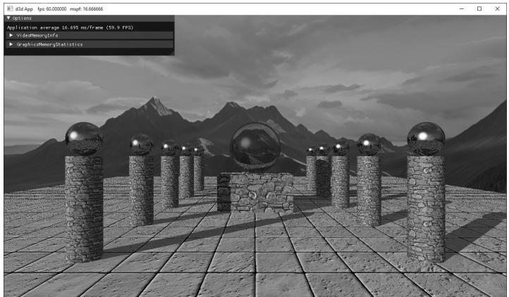


Figure 27.16. Screenshot from the “IntroRayTracing” demo. Each shape in the scene is procedurally ray traced—there are no triangle primitives in the scene. The center sphere is refractive, and the column spheres are reflective.


```cpp
define GEO_TYPE_CYLINDER 2
#define GEO_TYPE_DISK 3
struct RTInstance
{
    DirectX::XMFLOAT4X4 Transform;
    uint32_t MaterialIndex = 0;
    uint32_t PrimitiveType = 0;
    DirectX::XMFLOAT2 TexScale = {1.0f, 1.0f};
}; 
```

The primitive type is used in the intersection shader so that we can branch and run the appropriate ray/shape intersection code (see $\ S 2 7 . 2 . 2 $ ). This simplifies things a bit in that we can use a single intersection shader for all of our different primitive types. 

We maintain a list of the instances and provide several methods for adding instances to the scene. 

std::vector<RTInstance> mInstances;   
void ProceduralRayTracer::AddBox( const DirectX::XMFLOAT4X4& worldTransform, XMFLOAT2 texScale, UINT materialIndex)   
{ // The box is [-1, 1]^3 in local space. RTInstance inst; inst.Transform $=$ worldTransform; inst.TexScale $\equiv$ texScale; inst.MaterialIndex $\equiv$ materialIndex; inst.PrimitiveType $\equiv$ GEO_TYPE_BOX; mInstances.push_backinst);   
}   
void ProceduralRayTracer::AddCylinder( const DirectX::XMFLOAT4X4& worldTransform, XMFLOAT2 texScale, UINT materialIndex)   
{ // The cylinder is centered at the origin, aligned with $+\mathrm{y}$ axis, // has radius 1 and length 2 in local space. RTInstance inst; inst.Transform $=$ worldTransform; inst.TexScale $\equiv$ texScale; inst.MaterialIndex $\equiv$ materialIndex; inst.PrimitiveType $\equiv$ GEO_TYPE_CYLINDER; mInstances.push_backinst); 

```cpp
void ProceduralRayTracer::AddDisk(
    const DirectX::XMFLOAT4X4& worldTransform,
    XMFLOAT2 texScale,
    UINT materialIndex)
{
    // The disk is centered at the origin, with normal aimed down
    // the +y-axis, and has radius 1 in local space.
    RTInstance inst;
    inst.Transform = worldTransform;
    inst.TexScale = texScale;
    inst.MaterialIndex = materialIndex;
    inst.PrimitiveType = GEO_TYPE_DISK;
    mInstances.push_back.inst);
}
void ProceduralRayTracer::AddSphere(
    const DirectX::XMFLOAT4X4& worldTransform,
    XMFLOAT2 texScale,
    UINT materialIndex)
{
    // The sphere is centered at origin with radius 1 in local space.
    RTInstance inst;
    inst.Transform = worldTransform;
    inst.TexScale = texScale;
    inst.MaterialIndex = materialIndex;
    inst.PrimitiveType = GEO_TYPE_SPHERE;
    mInstances.push_back.inst);
} 
```

Once we have added all of our instances, we are ready to build our acceleration structures. Note that our demo is not designed to add or remove instances dynamically, but that is certainly possible in RTX (see Exercise 3). 

# 27.5.2 Acceleration Structures

Casting rays into a complex scene is expensive. A brute force approach would be to do an intersection test against every geometric primitive in the scene looking for the closest hit or any hit. Obviously for a scene with millions of primitives this would be very costly. In general, for a large data search we do not want to do a linear search but a binary search. If we are going to do a search often, we can put the data in a binary search tree. Similarly, there are 3D spatial data structures that allow us to do spatial queries in logarithmic time. Quadtrees, Octrees, KD-Trees, and bounding volume hierarchies (BVH) are some examples. GPU ray tracing APIs actually hide the internal data structure used so it is a black box, but BVHs 

have turned out to be the standard for ray tracing. It is hidden so you cannot make any assumptions about it, and the driver can update it or substitute an improved algorithm. Since we do not know the actual implementation, we will refer to it simply as an acceleration structure. Note that we make DirectX API calls to build acceleration structures on the GPU; this is for speed and because the end result data structures need to be one the GPU anyway. 

# 27.5.2.1 Bottom Level Acceleration Structures

A bottom level acceleration structure (BLAS) is an acceleration structure per model. Think of a triangle mesh that forms a car model. You have one BLAS for the car. You can then instance the car model several times. A car is made up of one or more geometries. You can think of a geometry as a mesh that needs to be rendered with a specific material and shader. For example, the car body might be one geometry, the wheels another geometry, and the windows another geometry. 

In addition to triangle meshes, we can also ray trace against geometric primitives. A model could be formed by several geometric shapes, as well. As mentioned, our first ray tracing demo only renders mathematical shapes: quads, cylinders, and spheres. 

AccelerationStructureBuffers ProceduralRayTracer::BuildPrimitiveBias()
{
    // For procedural primitive geometry, DXR just cares about the
    // bounding box. The actual intersection will be done in the
    // intersection shader. All of our primitive objects (sphere, box,
    // cylinder) are defined in $[-1,1]^3$ in local space. Therefore, we
    // only need one geometry that we will instance multiple times
    // and branch based on primitive type.
    const uint32_t numGeometries = 1;
    // Bounds of each geometry is needed for BLAS.
    D3D12_RAYTRACING_AABB bounds;
    bounds.MinX = -1.0f;
    bounds.MinY = -1.0f;
    bounds.MinZ = -1.0f;
    bounds.MaxX = +1.0f;
    bounds.MaxY = +1.0f;
    bounds.MaxZ = +1.0f;
    mGeoBoundsBuffer = std::make_unique<UploadBuffer<D3D12_RAYTRACING_AABB>(mdxrDevice, 1, false);
    mGeoBoundsBuffer->CopyData(0, bounds);
    D3D12_GPU_VIRTUAL_ADDRESS boundsBasePtr =
        mGeoBoundsBuffer->Resource()->GetGPUVirtualAddress(); 

```cpp
D3D12_RAYTRACINGGEOMETRY_DESC geoDesc[1];  
geoDesc[0].Type = D3D12_RAYTRACINGGEOMETRY_TYPE_PROCEDURAL_PRIMITIVE_AABBS;  
geoDesc[0].Flags = D3D12_RAYTRACINGGEOMETRY_FLAG_OPAQUE;  
geoDesc[0].AABBs.AABBCount = 1;  
geoDesc[0].AABBs.AABBs.StartAddress = boundsBasePtr;  
geoDesc[0].AABBs.AABBs.StrideInBytes = sizeof(D3D12_RAYTRACING_AABB);  
//  
// BLAS is built from N geometries.  
//  
D3D12 BuildsRAYTRACINGAccelerATIONSTRUCTURE_DESC biasDesc = {};  
biasDesc.Inputs.Type = D3D12_RAYTRACINGAccelerATIONSTRUCTURE_TYPE_bottom_LEVEL;  
biasDesc.Inputs.DescsLayout = D3D12_ELEMENTS_LAYOUTArray;  
biasDesc.Inputs Flags = D3D12_RAYTRACINGAccelerATIONSTRUCTURE Builds_FLAG_PREFER_FAST_TRACE;  
biasDesc.Inputs.NumDescs = numGeometries;  
biasDesc.Inputs.pGeometryDescs = geoDesc;  
// Query some info that is device dependent for building the BLAS.  
D3D12_RAYTRACINGAccelerATIONSTRUCTURE_PREBUILD_INFO prebuildInfo = {};  
mdxrDevice->GetRaytracingAccelerationStructurePrebuildInfo(&biasDesc.Inputs, &prebuildInfo);  
assert(prebuildInfo.DataMaxSizeInBytes > 0);  
ComPtr<ID3D12Resource> scratch;  
AllocateUAVBuffer(mdxrDevice, prebuildInfo.ScratchDataSizeInBytes, &scratch, D3D12_RESOURCE_STATE_UNORDERED_ACCESS, L"ScratchResource");  
ComPtr<ID3D12Resource> bias;  
AllocateUAVBuffer(mdxrDevice, prebuildInfo. ResultDataMaxSizeInBytes, &blas, D3D12_RESOURCE_STATE_RAYTRACINGAccelerATIONSTRUCTURE, L"BottomLevelAccelerationStructure");  
biasDesc.ScratchAccelerationStructureData = scratch->GetGPUVirtualAddress();  
biasDesc.DestAccelerationStructureData = bias->GetGPUVirtualAddress();  
mdxrCmdList->BuildRaytracingAccelerationStructure(&biasDesc, 0, nullptr);  
AccelerationStructureBuffers bottomLevelASBuffers;  
bottomLevelASBuffers.accelerationStructure = bias; 
```

bottomLevelASBuffers.scrape $=$ scratch; bottomLevelASBuffers.ResultDataMaxSizeInBytes $=$ prebuildInfo.ResultDataMaxSizeInBytes; return bottomLevelASBuffers;   
} 

There are currently two kinds of RTX geometry types: D3D12_RAYTRACING_ GEOMETRY_TYPE_PROCEDURAL_PRIMITIVE_AABBS and D3D12_RAYTRACING_GEOMETRY_ TYPE_TRIANGLES. The triangles geometry type will be used in the next demo. The flag D3D12_RAYTRACING_GEOMETRY_FLAG_OPAQUE treats the geometry as opaque, which allows for some optimizations in that we only need to know the closest hit, and not multiple any hits, which we might need for semi-transparent geometry. 

# 27.5.2.2 Top Level Acceleration Structures

While each model gets its own BLAS, the top level acceleration structure (TLAS) is essentially the acceleration structure for the scene. The TLAS defines instances to one or more BLAS structures. 

```cpp
ComPtr<ID3D12Resource> ProceduralRayTracer::BuildInstanceBuffer( D3D12_GPU_VIRTUAL_ADDRESS blasGpuAddress)   
{ std::vector<D3D12_RAYTRACINGINSTANCE_DESC>instanceDescs; instanceDescs resize(mInstances.size()); // Instances of BLAS structures. Here we only have // one BLAS, but a TLAS can contain instances of // different BLASes. for uint32_t i = 0; i < mInstances.size(); ++i) { instanceofDescs[i].InstanceMask = 1; instanceofDescs[i].InstanceContributionToHitGroupIndex = i * RayCount * NumGeometriesPerInstance; // instance offset for SBT instanceofDescs[i].AccelerationStructure = biasGpuAddress; instanceofDescs[i].InstanceId = i; // for shader SV InstanceID instanceofDescs[i].Flags = D3D12_RAYTRACINGINSTANCE_FLAG_NONE; XMMATRIX worldTransform = XmlLoadFloat4x4(&mInstances[i]. Transform); XMStoreFloat3x4(reinterpret_cast<XMFLOAT3X4*>(instanceDescs[i].Transform), worldTransform); } UINT64BufferSize = static cast<UINT64>(instanceDescs.size() * sizeof(D3D12_RAYTRACINGINSTANCE_DESC)); ComPtr<ID3D12Resource>instanceBuffer; AllocateUploadBuffer(mdxrDevice, instanceofDescs.data(), 
```

bufferSize, &instanceBuffer, L"InstanceDescs"); return instanceof;   
}   
AccelerationStructureBuffers ProceduralRayTracer::BuildTlas( D3D12_GPU_VIRTUAL_ADDRESS blasGpuAddress)   
{ // TLAS defines instances to one or more BLAS structures. // Here we only have one BLAS. D3D12 BuildsRAYTRACING_ACCELERATIONSTRUCTURE_DESC tlasDesc = {}; tlasDesc.Inputs.Type $=$ D3D12RAYTRACING_ACCELERATIONSTRUCTURE TYPE_TOP_LEVEL; tlasDesc.Inputs.DescsLayout $\equiv$ D3D12_ELEMENTS_LAYOUT_ARRAY; tlasDesc.InputsFlags $=$ D3D12RAYTRACING_ACCELERATIONSTRUCTURE Builds_FLAG_PREFER_FAST_TRACE; tlasDesc.Inputs.NumDescs $\equiv$ mInstances.size(); D3D12RAYTRACING_ACCELERATIONSTRUCTURE_PREBUILD_INFO prebuildInfo $=$ {}; mdxrDevice->GetRaytracingAccelerationStructurePrebuildInfo( &tlasDesc.Inputs, &prebuildInfo); assert(prebuildInfo.DataMaxSizeInBytes $>0$ );   
ComPtr<ID3D12Resource> scratch; AllocateUAVBuffer(mdxrDevice, prebuildInfo.ScratchDataSizeInBytes, &scratch, D3D12RESOURCE_STATE_UNORDERED_ACCESS, L"ScratchResource");   
ComPtr<ID3D12Resource> tlas; AllocateUAVBuffer(mdxrDevice, prebuildInfo.ResultDataMaxSizeInBytes, &tlas, D3D12RESOURCE_STATERAYTRACING_ACCELERATIONSTRUCTURE, L"TopLevelAccelerationStructure"); ComPtr<ID3D12Resource> instanceBuffer $\equiv$ BuildInstanceBuffer(blasGp uAddress); tlasDesc.Inputs InstanceDescs $\equiv$ instanceof->GetGPUVirtualAddress(); tlasDesc.DestAccelerationStructureData $\equiv$ tlas->GetGPUVirtualAddress(); tlasDesc.ScratchAccelerationStructureData $\equiv$ scratch->GetGPUVirtualAddress(); mdxrCmdList->BuildRaytracingAccelerationStructure(&tlasDesc, 0, nullptr); 

AccelerationStructureBuffers tlasBuffers; tlasBuffers.accelerationStructure $=$ tlas; tlasBuffers.instanceDesc $=$ instanceof; tlasBuffersscratch $=$ scratch; tlasBuffers.DataMaxSizeInBytes $=$ prebuildInfo. ResultDataMaxSizeInBytes; return tlasBuffers; 

# 27.5.2.3 Top Level Acceleration Structures

The following code puts things together to enqueue the work on the command queue to build the BLAS and TLAS: 

// From Microsoft utility code "DirectXRayTracingHelper.h"   
struct AccelerationStructureBuffers   
{ Microsoft::WRL::ComPtr<ID3D12Resource> scratch; Microsoft::WRL::ComPtr<ID3D12Resource> accelerationStructure; // Used only for top-level AS Microsoft::WRL::ComPtr<ID3D12Resource> instanceDesc; UINT64 ResultDataMaxSizeInBytes;   
}；   
void ProceduralRayTracer::ExecuteBuildAccelerationStructureCommands( ID3D12CommandQueue* commandQueue)   
{ BuildShaderBindingTables(); AccelerationStructureBuffers primitiveBlas $=$ BuildPrimitiveBlas(); mdxrCmdList->ResourceBarrier(1, &CD3DX12RESOURCE_BARRIER::UAV( primitiveBlas.accelerationStructure.Get()); AccelerationStructureBuffers tlas $=$ BuildTlas( primitiveBlas.accelerationStructure->GetGPUVirtualAddress()); // Build acceleration structures on GPU and wait until it is done. ThrowIfFailed(mdxrCmdList->Close()); ID3D12CommandList\*commandLists[] $=$ { mdxrCmdList }; commandQueue->ExecuteCommandLists(ARRAYSIZE commandedLists), commandLists); // Need to finish building on GPU before / AccelerationStructureBuffers goes out / of scope. D3DApp::GetApp()->FlushCommandQueue(); // Building uses intermediate resources, but we only need to save / the final results for rendering. mPrimitiveBlas $=$ primitiveBlas.accelerationStructure; mSceneTlas $=$ tlas.accelerationStructure;   
} 

# 27.5.6 Dispatching Rays

Finally, we dispatch ray tracing on the GPU with the DispatchRays method. This requires filling out a D3D12_DISPATCH_RAYS_DESC instance where we specify the dimensions of the ray dispatch and specify the SBT. 

```cpp
void ProceduralRayTracer::Draw(ID3D12Resource* passCB, ID3D12Resource* matBuffer)   
{ mdxrCmdList->SetComputeRootSignature( mGlobalRootSig.Get(); mdxrCmdList->SetComputeRootConstantBufferView( RT_ROOTArg_PASS_CBV, passCB->GetGPUVirtualAddress()); mdxrCmdList->SetComputeRootShaderResourceView( RT_ROOTArg_MATERIAL_SRV, matBuffer->GetGPUVirtualAddress()); mdxrCmdList->SetComputeRootShaderResourceView( RT_ROOTArg_ACCELERATION structuresRV, mSceneTlas->GetGPUVirtualAddress()); // Specify dimensions and SBT spans. D3D12_DISPATCH_RAYS_DESC dispatchDesc = {}; dispatchDesc.HitGroupTable.StartAddress = mHitGroupShaderTable->GetGPUVirtualAddress(); dispatchDesc.HitGroupTable.SizeInBytes = mHitGroupShaderTable->GetDesc().Width; dispatchDesc.HitGroupTable.StrideInBytes = mHitGroupShaderTableStrideInBytes; dispatchDesc.MissShaderTable.StartAddress = mMissShaderTable->GetGPUVirtualAddress(); dispatchDesc.MissShaderTable.SizeInBytes = mMissShaderTable->GetDesc().Width; dispatchDesc.MissShaderTable.StrideInBytes = mMissShaderTableStrideInBytes; dispatchDesc.RayGenerationShaderRecord.StartAddress = mRayGenShaderTable->GetGPUVirtualAddress(); dispatchDesc.RayGenerationShaderRecord.SizeInBytes = mRayGenShaderTable->GetDesc().Width; dispatchDesc.Width = mWidth; dispatchDesc.Height = mHeight; dispatchDesc.Depth = 1; mdxrCmdList->SetPipelineState1 (mdxrStateObject.Get()); mdxrCmdList->DispatchRays (&dispatchDesc); 
```

# 27.6 HYBRID RAY TRACER DEMO

This demo is more practical from a game development standpoint. We will ray trace against triangle meshes, and we will do hybrid ray tracing where we do rasterization but use ray tracing for reflections and shadows. 

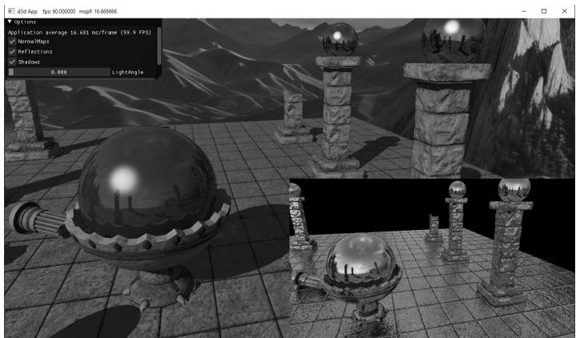


Figure 27.17. Screenshot from the “HybridRayTracing” demo showing real-time local reflections. The bottom-right view shows the generated reflection map.


# 27.6.1 Hybrid Strategy

This section describes how we combine ray tracing with rasterization to implement shadows and reflections. The plan is as follows: 

1. Use rasterization to render the depth and scene normals of the nearest visible pixels. This is exactly what we did for SSAO, except we render the normal mapped normals instead of the geometric normals to the render target. 

2. Use ray tracing and in the ray generation shader, sample the scene depth and normal render targets from step 1 to reconstruct the world position and world normals at each visible pixel. Now trace out a shadow ray and reflection ray into the scene. We store the results in an RGBA image, where RGB stores the reflection color and A stores the shadow result. After this step, we have an image that stores the reflection color and shadow test result at each visible pixel on screen. 

3. Render the scene with rasterization again using D3D12_COMPARISON_FUNC_EQUAL so that we do not process hidden pixels (just like we did after we computed the SSAO map), and instead of doing shadow mapping or reflections from a cube map, we sample the data we generated in step 2. 

# 27.6.2 Scene Management

For hybrid ray tracing, we have our normal geometry buffers for rasterization, but we also need to build a BLAS for each model and a TLAS so that we can also ray trace the scene triangles. It is up to the driver whether the geometry is duplicated. Thus, in our demo we have essentially two scene representations: one 

for rasterization and one for ray tracing. For representing a model for ray tracing, we define the following type: 

// In our demo, we have one geometry per model. However, a model could   
// be built from multiple geometries. For example, a car model could   
// be made from different geometries for the wheels, body,   
// seats, windows, etc.   
struct RTModelDef   
{ ID3D12Resource\* VertexBuffer $=$ nullptr; ID3D12Resource\* IndexBuffer $=$ nullptr; UINT VertexBufferBindlessIndex $= -1$ .   
UINT IndexBufferBindlessIndex $= -1$ .   
DXGI_FORMAT IndexFormat $\equiv$ DXGI_FORMAT_R16_UID;   
DXGI_FORMAT VertexFormat $\equiv$ DXGI_FORMAT_R32G32B32 FLOAT;   
UINT IndexCount $= 0$ .   
UINT VertexCount $= 0$ .   
UINT StartIndexLocation $= 0$ .   
UINT BaseVertexLocation $= 0$ .   
UINT VertexSizeInBytes $= 0$ .   
UINT IndexSizeInBytes $= 2$ ..   
}； 

One item that might be unexpected is the addition of the vertex/index bindless indices. With rasterization, we call IASetVertexBuffers and IASetIndexBuffer to bind the buffers used in the draw call. We do not have that with ray tracing. Instead, we create SRVs to the vertex and index buffers and store their corresponding heap index. Then in the SBT, we store the bindless indices and offsets for each entry in the local root arguments. 

for uint32_tDUCTIndex $= 0$ ;instanceIndex $\text{一}$ mInstances.size(); ++instanceIndex)   
{ for uint32_trayTypeIndex $= 0$ ;rayTypeIndex $<$ RayCount; ++rayTypeIndex) { LocalRootArguments rootArguments; const RTModelDef& model $=$ mModels[mInstances[instanceIndex]. ModelName]; rootArguments.MaterialIndex $=$ mInstances[instanceIndex]. MaterialIndex; rootArguments.VezteBufferBindlessIndex $=$ model. VertexBufferBindlessIndex; rootArguments.VezteBufferOffset $=$ model.BaseVertexLocation; rootArguments.IndexBufferBindlessIndex $=$ model. IndexBufferBindlessIndex; rootArguments.IndexBufferOffset $=$ model.StartIndexLocation; rootArguments.TexScale $=$ mInstances[instanceIndex].TexScale; hitGroupShaderTable.push_back(ShaderRecord( hitGroupShaderIdentifier, 

```javascript
shaderIdentifierSize,
& rootArguments,
sizeof(LocalRootArguments)); 
```

In this way, when we intersect a triangle in the shader, we can access the vertex and index buffers, and offset to the appropriate positions based on the geometry. 

```cpp
[shade("closesthit")]  
void ClosestHit(  
    inout ColorRayPayload rayPayload,  
    in BuiltInTriangleIntersectionAttributes attr)  
{  
    // For simplicity, we use 32-bit indices in this demo.  
    // But you can use a ByteAddressBuffer and pack  
    // two 16-bit indices per dword.  
    StructuredBuffer<RTVertex> vertexBuffer =  
        ResourceDescriptorHeap[gLocalConstants.  
            VertexBufferBindlessIndex];  
    StructuredBuffer<int> indexBuffer =  
        ResourceDescriptorHeap[gLocalConstants.  
            IndexBufferBindlessIndex];  
    // Get the vertices of the triangle we hit.  
    uint triangleID = PrimitiveIndex();  
    uint index0 = indexBuffer[gLocalConstants.IndexBufferOffset + triangleID * 3 + 0];  
    uint index1 = indexBuffer[gLocalConstants.IndexBufferOffset + triangleID * 3 + 1];  
    uint index2 = indexBuffer[gLocalConstants.IndexBufferOffset + triangleID * 3 + 2];  
    RTVertex v0 = vertexBuffer[gLocalConstants.IndexBufferOffset + index0];  
    RTVertex v1 = vertexBuffer[gLocalConstants.IndexBufferOffset + index1];  
    RTVertex v2 = vertexBuffer[gLocalConstants.IndexBufferOffset + index2]; 
```

The ray tracing scene maintains collections of models and a list of instances. We construct the models using the same geometry buffers we use for rendering with rasterization. 

```rust
std::unordered_map<std::string, RTModelDef> mModels; 
```

```javascript
// For simplicity, we use 32-bit indices in this demo.  
// But you can use a ByteAddressBuffer and pack two  
// 16-bit indices per dword.  
auto MakeRtModel = [];  
const MeshGeometry* geo,  
const SubmeshGeometry& drawArgs,  
uint32_t vbIndex, 
```

```rust
uint32_t ibIndex) ->HybridRayTracer::RTModelDef
{
    HybridRayTracer::RTModelDef model;
    model. VertexBuffer = geo->VertexBufferGPU.Get();
    model. IndexBuffer = geo->IndexBufferGPU.Get();
    model. VertexBufferBindlessIndex = vbIndex;
    model. IndexBufferBindlessIndex = ibIndex;
    model. IndexFormat = DXGI_format_R32_UID;
    model. VertexFormat = DXGI_format_R32G32B32_FLOAT;
    model. IndexCount = drawArgs.IndexCount;
    model. VertexCount = drawArgs. VertexCount;
    model. StartIndexLocation = drawArgs.StartIndexLocation;
    model. BaseVertexLocation = drawArgs.BaseVertexLocation;
    model. VertexSizeInBytes = sizeof(RTVertex);
    model. IndexSizeInBytes = sizeof( uint32_t);
    return model;
};
// Define RTModelDefs to the same geometry
// we use for rasterization.
HybridRayTracer::RTModelDef grid = MakeRtModel(
    mGeometries["shapeGeo"].get(), mGeometries["shapeGeo"]
    >DrawArgs["grid"]
    mShapeVertexBufferBindlessIndex,
    mShapeIndexBufferBindlessIndex);
HybridRayTracer::RTModelDef sphere = MakeRtModel(
    mGeometries["shapeGeo"].get(), mGeometries["shapeGeo"]
    >DrawArgs["sphere"]
    mShapeVertexBufferBindlessIndex,
    mShapeIndexBufferBindlessIndex);
HybridRayTracer::RTModelDef orbBaseModel = MakeRtModel(
    mGeometries["orbBase"].get(), mGeometries["orbBase"]
    >DrawArgs["subset0"]
    mOrbBaseVertexBufferBindlessIndex,
    mOrbBaseIndexBufferBindlessIndex);
HybridRayTracer::RTModelDef columnRoundBrokenModel = MakeRtModel(
    mGeometries["columnRoundBroken"].get(), mGeometries["columnRoundBroken"]
    ->DrawArgs["subset0"]
    mColumnRoundBrokenVertexBufferBindlessIndex,
    ColumnRoundBrokenIndexBufferBindlessIndex);
HybridRayTracer::RTModelDef columnSquareBrokenModel = MakeRtModel(
    mGeometries["columnSquareBroken"].get(), mGeometries["columnSquareBroken"]
    ->DrawArgs["subset0"]
    mColumnSquareBrokenVertexBufferBindlessIndex,
    mColumnSquareBrokenIndexBufferBindlessIndex);
HybridRayTracer::RTModelDef columnSquareModel = MakeRtModel(
    mGeometries["columnSquare"].get(), mGeometries["columnSquare"]
    ->DrawArgs["subset0"]
    mColumnSquareVertexBufferBindlessIndex,
    mColumnSquareIndexBufferBindlessIndex); 
```

```cpp
mRayTracer->AddModel("sphereModel", sphere);  
mRayTracer->AddModel("orbBaseModel", orbBaseModel);  
mRayTracer->AddModel("columnRoundBrokenModel", columnRoundBrokenModel);  
mRayTracer->AddModel("columnSquareBrokenModel", columnSquareBrokenModel);  
mRayTracer->AddModel("columnSquareModel", columnSquareModel); 
```

An instance just refers to a model along with per-instance data. 

```cpp
struct RTInstance
{
    std::string ModelName;
    DirectX::XMFLOAT4X4 Transform;
    uint32_t MaterialIndex;
    DirectX::XMFLOAT2 TexScale;
}; 
```

Now, at the same time we add a render item for rasterization rendering, we add the corresponding instance to the scene for ray tracing. For example, 

```cpp
XMStoreFloat4x4(&worldTransform, XMMatrixScaling(6.0f, 6.0f, 6.0f));  
XMStoreFloat4x4(&texTransform, XMMatrixScaling(1.0f, 1.0f, 1.0f));  
AddRenderItem(RenderLayer::Opaque, worldTransform, texTransform, matLib["orbBase"], mGeometries["orbBase"].get(), mGeometries["orbBase"]->DrawArgs["subset0"]);  
mRayTracer->AddInstance("orbBaseModel", worldTransform, XMFLOAT2(1.0f, 1.0f), matLib["orbBase"]->MatIndex); 
```

```cpp
XMStoreFloat4x4(&worldTransform, XMMatrixScaling(2.0f, 2.0f, 2.0f) * XMMatrixTranslation(0.0f, 1.75f, 0.0f));  
texTransform = MathHelper::Identity4x4();  
AddRenderItem(RenderLayer::Opaque, worldTransform, texTransform, matLib["mirror1"], mGeometries["shapeGeo"].get(), mGeometries["shapeGeo"]->DrawArgs["sphere"]);  
mRayTracer->AddInstance("sphereModel", worldTransform, XMFLOAT2(1.0f, 1.0f), matLib["mirror1"]->MatIndex); 
```

# 27.6.3 Acceleration Structures

Building the acceleration structures for triangle meshes is similar to doing it for primitives, so we do not show all the code. However, one difference occurs when building the BLAS because filling out the D3D12_RAYTRACING_GEOMETRY_DESC for triangle meshes is different than primitive shapes. With primitive shapes, RTX only cares about the bounding boxes. With triangles, we need to specify the vertex and index data via buffers: 

```cpp
HybridRayTracer::ModelBiasList HybridRayTracer::BuildBlases()
{
    constexpr uint32_t numGeometries = 1; 
```

D3D12_RAYTRACINGGEOMETRY_DESC geoDesc[numGeometries];   
std::unordered_map<std::string,AccelerationStructureBuffers>   
biasBuffers(mModels.size());   
for(const auto& [name, modelDef] : mModels)   
{ const int indexByteOffset = modelDef.StartIndexLocation \* modelDef.IndexSizeInBytes; const int vertexByteOffset $=$ modelDef.BaseVertexLocation \* modelDef. VertexSizeInBytes; geoDesc[0].Type $=$ D3D12_RAYTRACINGGEOMETRY_TYPE_TRIANGLE; geoDesc[0].Flags $=$ D3D12_RAYTRACINGGEOMETRY_FLAG_OPAQUE; geoDesc[0].Triangles.IndexBuffer $=$ modelDef.IndexBuffer->GetGPUVirtualAddress() + indexByteOffset; geoDesc[0].Triangles.IndexCount $=$ modelDef.IndexCount; geoDesc[0].Triangles.IndexFormat $=$ modelDef.IndexFormat; geoDesc[0].Triangles. VertexFormat $=$ modelDef. VertexFormat; geoDesc[0].Triangles. VertexCount $=$ modelDef. VertexCount; geoDesc[0].Triangles. VertexBuffer.StartAddress $=$ modelDef. VertexBuffer->GetGPUVirtualAddress() + vertexByteOffset; geoDesc[0].Triangles. VertexBuffer.StrideInBytes $=$ modelDef. VertexSizeInBytes; // This transform (if used) is used to transform the geometry / relative to its model. A separate instance/world transform / will be applied on top of that to transform the entire model instance. geoDesc[0].Triangles.Transform3x4 $= 0$ .   
// BLAS is built from N geometries.   
// D3D12 buildsRAYTRACING_ACCELERATIONSTRUCTURE_DESC biasDesc = {};   
biasDesc.Inputs.Type $=$ D3D12RAYTRACING_ACCELERATIONSTRUCTURE TYPE BOTTOM_LEVEL;   
biasDesc.Inputs.DescsLayout $=$ D3D12_ELEMENTS_LAYOUT_ARRAY;   
biasDesc.InputsFLAGS $=$ D3D12RAYTRACING_ACCELERATIONSTRUCTURE Builds_FLAG_PREFER_ FAST_TRACE;   
biasDesc.Inputs.NumDescs $=$ numGeometries;   
biasDesc.Inputs.pGeometryDescs $=$ geoDesc;   
// Query some info that is device dependent for building the BLAS. D3D12_RAYTRACING_ACCELERATIONSTRUCTURE_PREBUILD_INFO prebuildInfo $= \{\}$ mdxrDevice->GetRaytracingAccelerationStructurePrebuildInfo( &biasDesc.Inputs, &prebuildInfo); assert(prebuildInfo.ResultDataMaxSizeInBytes > 0); 

```cpp
ComPtr<ID3D12Resource> scratch;   
AllocateUAVBuffer(mdxrDevice, prebuildInfo.ScratchDataSizeInBytes, &scratch, D3D12RESOURCE_STATE_UNORDERED_ACCESS, L"ScratchResource");   
ComPtr<ID3D12Resource> bias;   
AllocateUAVBuffer(mdxrDevice, prebuildInfo. ResultDataMaxSizeInBytes, &blas, D3D12RESOURCE_STATE_RAYTRACING_ACCELERATIONSTRUCTURE, L"BottomLevelAccelerationStructure");   
biasDesc.ScratchAccelerationStructureData = scratch->GetGPUVirtualAddress();   
biasDesc.DestAccelerationStructureData = bias->GetGPUVirtualAddress();   
mdxrCmdList->BuildRaytracingAccelerationStructure(&blasDesc, 0, nullptr);   
AccelerationStructureBuffers bottomLevelASBuffers; bottomLevelASBuffers.accelerationStructure = bias; bottomLevelASBuffers.scatch = scratch; bottomLevelASBuffers.ResultDataMaxSizeInBytes = prebuildInfo.ResultDataMaxSizeInBytes;   
biasBuffers[name] = bottomLevelASBuffers;   
}   
return biasBuffers; 
```

# 27.6.4 Ray Tracing Shaders

Recall that in the first step, we render the scene depth and scene normals of the nearest visible pixels to render targets using rasterization. The next step is to use ray tracing to generate a corresponding reflection/shadow map at each pixel, where RGB stores the reflection color and A stores the shadow result. For the ray generation shader, we dispatch a thread for each pixel in the image. We reconstruct the world position from the depth map, similar to how we did it for SSAO, and use that position, along with the sampled normal vector to cast a shadow ray and a reflection ray. 

float NdcDepthToViewDepth(float z_nde)   
{ //z_nde $=$ A+B/viewZ,where gProj[2,2] $\equiv$ A and gProj[3,2]=B. float viewZ $=$ gProj[3][2]/(z_nde-gProj[2][2]); return viewZ;   
} 

[shader("raygeneration")]   
void RaygenShader()   
{ uint2 rayIndex $=$ DispatchRaysIndex().xy; uint2 imageSize $=$ DispatchRaysDimensions().xy; float2 screenPos $=$ rayIndex $+0.5\mathrm{f}$ //offset to pixel center. //Remap to NDC space[-1,1]. float2 posNdc $=$ (screenPos / imageSize) $\star 2.0\mathrm{f}-1.0\mathrm{f};$ posNdc.y $=$ -posNdc.y; // $^+$ yup //Transform NDC to view space. float4 rayDirV $=$ mul(float4(posNdc,0.0f,1.0f),gInvProj); rayDirV.xyz $=$ rayDirV.w; Texture2D depthMap $=$ ResourceDescriptorHeap[gSceneDepthMapIndex]; Texture2D normalMap $=$ ResourceDescriptorHeap[gSceneNormalMapIndex]; float depthNdc $=$ depthMap.Load(int3(index.x,rayIndex.y,0)).r; float3 bumpedNormalW $=$ normalMap.Load(int3(index.x,rayIndex.y, 0)).xyz; float4 result $=$ float4(0.0f,0.0f,0.0f,0.0f); float shadowFactor $= 1.0f$ . //Filter pixels that never got written. if(depthNdc<1.0f） { // // Reconstruct 3D world space position and normal. // float depthV $=$ NdcDepthToViewDepth(depthNdc); //Scale by t such that t\*rayDirV.z $=$ depthV float3 posV $=$ (depthV / rayDirV.z) \* rayDirV.xyz; float3 posW $=$ mul(float4(posV,1.0f)，gInvView).xyz; uint currentRecursionDepth $= 0$ ： //Cast primary shadow ray from reconstructed position. //Only the first light casts a shadow and we assume //it is a directional light. float3 lightVec $=$ -gLights[O].Direction; // Cast shadow ray. bool shadowRayHit $=$ CastShadowRay(posW,lightVec, currentRecursionDepth); shadowFactor $=$ shadowRayHit?0.0f:1.0f; 

```javascript
// Cast primary reflection ray from reconstructed position. // float3 rayOriginW = gEyePosW; float3 rayDirW = normalize(posW - rayOriginW); float3 reflectionDirW = reflect(rayDirW, bumpedNormalW); float4 reflectionColor = CastColorRay(posW, reflectionDirW, currentRecursionDepth); result.rgb = reflectionColor.rgb; } RWTexture2D<float4> reflectionMap = ResourceDescriptorHeap[gReflectionMapUavIndex]; reflectionMap[rayIndex] = float4(result.rgb, shadowFactor); } 
```

Note that the implementations for CastShadowRay and CastColorRay are in $\ S 2 7 . 2 . 4 $ , and recall that we set flags to skip the any hit and closest hit shaders for shadow rays. 

When the ray hits the closest triangle, the closest hit shader is called. DXR has built-in support for triangles, and therefore we do not need an intersection shader for ray tracing triangles. Furthermore, for triangles, we do not need to define a custom geometric attributes structure; instead DXR defines the following: 

```cpp
struct BuiltInTriangleIntersectionAttributes {
    float2 barycentrics;
}; 
```

Barycentric coordinates (see Appendix C.3) are essentially coordinates relative to the triangle vertices. 

Once we have hit a triangle, we use the intrinsic PrimitiveIndex() to get the triangle that was hit. From that, the vertex/index buffer bindless indices and the vertex/index offsets we can obtain the triangle vertices. Then we use the barycentric coordinates to interpolate the vertex attributes at the hit location and shade the point as usual. We recursively cast out another shadow and reflection ray. Note that because we skip the closest hit shaders for shadow rays, it means the closest-hit shader is just being called for reflection rays. 

```cpp
[shade("closeesthit")]  
void ClosestHit(  
    inout ColorRayPayload rayPayload,  
    in BuiltInTriangleIntersectionAttributes attr)  
{ // For simplicity, we use 32-bit indices in this demo.  
    // But you can use a ByteAddressBuffer and pack  
    // two 16-bit indices per dword.  
    StructuredBuffer<RTVertex> vertexBuffer =  
        ResourceDescriptorHeap[gLocalConstants. 
```

VertexBufferBindlessIndex];   
StructuredBuffer<uint> indexBuffer = ResourceDescriptorHeap[gLocalConstants. IndexBufferBindlessIndex];   
// Get the vertices of the triangle we hit.   
uint triangleID $\equiv$ PrimitiveIndex();   
uint index0 $\equiv$ indexBuffer[gLocalConstants.IndexBufferOffset + triangleID \* 3 + 0];   
uint index1 $\equiv$ indexBuffer[gLocalConstants.IndexBufferOffset + triangleID \* 3 + 1];   
uint index2 $\equiv$ indexBuffer[gLocalConstants.IndexBufferOffset + triangleID \* 3 + 2];   
RTVertex v0 $=$ vertexBuffer[gLocalConstants.IndexBufferOffset + index0];   
RTVertex v1 $=$ vertexBuffer[gLocalConstants.IndexBufferOffset + index1];   
RTVertex v2 $=$ vertexBuffer[gLocalConstants.IndexBufferOffset + index2];   
// Use the barycentric coordinates to interpolate the   
// vertex attributes at the hit point.   
float3 baryCoords $\equiv$ float3( 1.0 - attr.barycentrics.x - attr.barycentrics.y, attr.barycentrics.x, attr.barycentrics.y);   
float3 normalL $\equiv$ baryCoords.x \* v0.Normal + baryCoords.y \* v1.Normal + baryCoords.z \* v2.Normal;   
float3 tangentL $\equiv$ baryCoords.x \* v0.TangentU + baryCoords.y \* v1.TangentU + baryCoords.z \* v2.TangentU;   
float2 texCoords $\equiv$ baryCoords.x \* v0.TexC + baryCoords.y \* v1.TexC + baryCoords.z \* v2.TexC;   
const float t $\equiv$ RayTCurrent();   
float3 hitPosW $\equiv$ WorldRayOrigin() $^+$ t \* WorldRayDirection();   
// Fetch the material data.   
uint materialIndex $\equiv$ gLocalConstants.MaterialIndex;   
MaterialData matData $\equiv$ gMaterialData[materialIndex];   
float4 diffuseAlbedo $\equiv$ matData.DiffuseAlbedo;   
float3 fresnelR0 $\equiv$ matData.FresnelR0;   
float roughness $\equiv$ matData.Roughness;   
float transparencyScale $\equiv$ matData.TransparencyWeight;   
float indexOfRefraction $\equiv$ matData.IndexOfRefraction;   
uint diffuseMapIndex $\equiv$ matData.DiffuseMapIndex;   
uint normalMapIndex $\equiv$ matData.NormalMapIndex;   
uint glossHeightAoMapIndex $\equiv$ matData.GlossHeightAoMapIndex; 

float2 texScale = gLocalConstants.TexScale;   
float2 texC $=$ texCoords \* texScale;   
// Dynamically look up the texture in the array. Texture2D diffuseMap $=$ ResourceDescriptorHeap[diffuseMapIndex]; diffuseAlbedo $\ast =$ diffuseMap_SAMPLELevel(GetAnisoWrapSampler(), texC, 0.0f);   
if( diffuseAlbedo.a < 0.1f ) { return; }   
float3x3 toWorld $=$ (float3x3)ObjectToWorld4x3();   
float3 normalW $=$ normalize(mul(normalL, toWorld)); float3 tangentW $=$ mul(tangentL, toWorld);   
Texture2D normalMap $=$ ResourceDescriptorHeap[normalMapIndex]; float3 normalMapSample $=$ normalMap_SAMPLELevel( GetAnisoWrapSampler(), texC, 0.0f).rgb; float3 bumpedNormalW $=$ NormalSampleToWorldSpace( normalMapSample, normalW, tangentW);   
Texture2D glossHeightAoMap $=$ ResourceDescriptorHeap[glossHeightAo MapIndex]; float3 glossHeightAo $=$ glossHeightAoMap/sampleLevel( GetAnisoWrapSampler(), texC, 0.0f).rgb; // Uncomment to turn off normal mapping. //bumpedNormalW $=$ normalW;   
// Vector from point being lit to eye. float3 toEyeW $=$ normalize(gEyePosW - hitPosW);   
// Light terms. float4 ambient $=$ gAmbientLight\*diffuseAlbedo; ambient $\ast =$ glossHeightAo.z;   
// Only the first light casts a shadow and we assume   
// it is a directional light. float3 lightVec $=$ -gLights[0].Direction;   
// Instead of doing shadow mapping, cast a shadow ray. bool shadowRayHit $=$ CastShadowRay(hitPosW, lightVec, rayPayload. RecursionDepth + 1); float3 shadowFactor $=$ float3(1.0f, 1.0f, 1.0f); shadowFactor[0] $=$ shadowRayHit ? 0.0f : 1.0f;   
const float shininess $=$ glossHeightAo.x \* (1.0f - roughness); Material mat $=$ { diffuseAlbedo, fresnelR0, shininess }; float4 directLight $=$ ComputeLighting(gLights, mat, hitPosW, bumpedNormalW, toEyeW, shadowFactor); 

float4 litColor $=$ ambient $^+$ directLight; //Instead of sampling cube map, cast a reflection ray. //Observe we capture local reflections! float3 reflectionDir $=$ reflect(WorldRayDirection(), bumpedNormalW); float4 reflectionColor $=$ CastColorRay hitPosW, reflectionDir, rayPayload.ReursionDepth + 1); float3 fresnelFactor $=$ SchlickFresnel(fresnelR0,bumpedNormalW, reflectionDir); float3 reflectionAmt $=$ shininess \*fresnelFactor; litColor.rgb $+ =$ reflectionAmt \*reflectionColor.rgb; rayPayload.Color $=$ litColor;   
}   
[shader("miss")]   
void Color_MissShader(inout ColorRayPayload rayPayload)   
{ TextureCube gCubeMap $=$ ResourceDescriptorHeap[gSkyBoxIndex]; rayPayload.Color $=$ gCubeMap_SAMPLELevel( GetLinearWrapSampler(), WorldRayDirection(), 0.0f);   
}   
[shader("miss")]   
void Shadow_MissShader(inout ShadowRayPayload rayPayload)   
{ rayPayload.Hit $=$ false; 

# 27.6.5 Rasterization Pixel Shader

In the final step, once the screen reflection/shadow map is generated by ray tracing, we rasterize the scene again using D3D12_COMPARISON_FUNC_EQUAL so that we do not process hidden pixels (just like we did after we computed the SSAO map). Instead of doing shadow mapping or reflections from a cube map, we sample the data we generated in step 2. 

float4 PS(VertexOut pin) : SV_Target   
{ // Fetch the material data. MaterialData.matData = gMaterialData[gMaterialIndex]; float4 diffuseAlbedo = matData.DiffuseAlbedo; float3 fresnelR0 =.matData.FresnelR0; float roughness $=$ matData.Roughness; uint diffuseMapIndex $=$ matData.DiffuseMapIndex; uint normalMapIndex $=$ matData.NormalMapIndex; uint glossHeightAoMapIndex $=$ matData.GlossHeightAoMapIndex; //Dynamically look up the texture in the array. Texture2D diffuseMap $=$ ResourceDescriptorHeap[diffuseMapIndex]; diffuseAlbedo $\star =$ diffuseMap.Sample(GetAnisoWrapSampler(), pin. TexC); 

```cpp
def Alpha_TEST
// Discard pixel if texture alpha < 0.1. We do this test as soon
// as possible in the Shader so that we can potentially exit the
// Shader early, thereby skipping the rest of the Shader code.
clip(diffuseAlbedo.a - 0.1f);
endif
// Interpolating normal can unnormalize it, so renormalize it.
pin.NormalW = normalize(pin.NormalW);
float3 bumpedNormalW = pin.NormalW;
if(gNormalMapsEnabled)
{
Texture2D normalMap = DescriptorHeap[normalMapIndex];
float3 normalMapSample = normalMap_SAMPLE(
	GetAnisoWrapSampler(), pin.TexC).rgb;
 bumpedNormalW = NormalSampleToWorldSpace(
	normalMapSample, pin.NormalW, pin.TangentW);
}
Texture2D glossHeightAoMap = DescriptorHeap[glossHeightAoM
apIndex];
float3 glossHeightAo = glossHeightAoMap.
Sample(GetAnisoWrapSampler(), pin.TexC).rgb;
// Vector from point being lit to eye.
float3 toEyeW = normalize(gEyePosW - pin(PosW);
float ambientAccess = 1.0f;
// Light terms.
float4 ambient = ambientAccess*gAmbientLight*diffuseAlbedo;
ambient *= glossHeightAo.z;
Texture2D reflectionMap = DescriptorHeap[gReflectionMapSrv
Index];
pin.ProjTexH /= pin.ProjTexH.w;
float4 rayTracedData = reflectionMap_SAMPLE(
	GetLinearClampSampler(), pin.ProjTexH.xy);
// Only the first light casts a shadow.
float3 shadowFactor = float3(1.0f, 1.0f, 1.0f);
if(gShadowsEnabled)
{
// Ray traced shadow result stored in the alpha channel.
shadowFactor = rayTracedData.a;
}
const float shininess = glossHeightAo.x * (1.0f - roughness);
Material mat = { diffuseAlbedo, fresnelR0, shininess };
float4 directLight = ComputeLighting(gLights, mat, pin(PosW,
bumpedNormalW, toEyeW, shadowFactor); 
```

float4 litColor $=$ ambient $^+$ directLight;   
// Add in specular reflections.   
if( gReflectionsEnabled )   
{ float3 r $=$ reflect(-toEyeW,bumpedNormalW); float3 reflectionColor $=$ rayTracedData.rgb; float3 fresnelFactor $=$ SchlickFresnel(fresnelR0,bumpedNormalW,r); litColor.rgb $+ =$ ambientAccess\*shininess \* fresnelFactor \* reflectionColor.rgb;   
}   
// Common convention to take alpha from diffuse albedo. litColor.a $=$ diffuseAlbedo.a; return litColor; 

# 27.8 DYNAMIC SCENES/OBJECTS

In the ray tracing demos, we worked with a static scene. However, objects could move, or need to be added or removed from the scene dynamically. In these cases, the TLAS is changing and either needs to be updated or rebuilt. Similarly, sometimes we need to animate the vertices of a mesh such as for skinned meshes, waves, or wind effects. In these cases, the BLAS of the object needs to be rebuilt or updated. 

Whether to update or do a full rebuild depends on your specific situation. [https://developer.nvidia.com/blog/best-practices-using-nvidia-rtx-ray-tracing/] suggests to always rebuild the TLAS. For BLASes, the advice is to do updates, and every so often do a full rebuild, as updates can hurt performance over time. Ideally, you can do the rebuild or update using async compute. 

When we fill out the D3D12_BUILD_RAYTRACING_ACCELERATION_STRUCTURE_INPUTS structure, there is a Flags member that indicates how we want to build the acceleration structure: 

typedef   
enum D3D12_RAYTRACING_ACCELERATIONSTRUCTURE Builds_FLAGS   
{ D3D12_RAYTRACING_ACCELERATIONSTRUCTURE Builds_FLAG_NON $= 0$ ， D3D12_RAYTRACING_ACCELERATIONSTRUCTURE Builds_FLAG Allows_UPDATE $= 0\mathrm{x}1,$ （20 $D3D12\_ RAYTRACING\_ ACCELERATION\_ STRUCTURE\_ BUILD\_ FLAG\_ ALLOW\_ COMPACTION$ $= 0\times 2$ ， D3D12_RAYTRACING_ACCELERATIONSTRUCTURE Builds_FLAG}}>FREFAST_ TRACE $= 0\times 4$ ， D3D12_RAYTRACING_ACCELERATIONSTRUCTURE Builds_FLAG}>FREFAST_ BUILD $= 0\times 8$ 

D3D12_RAYTRACING_ACCELERATIONSTRUCTURE Builds_FLAG_MINIMIZE_MEMORY $= 0\mathrm{x}10$ D3D12_RAYTRACING_ACCELERATIONSTRUCTURE Builds_FLAG_PERFORM_UPDATE $= 0\mathrm{x}20$ } D3D12_RAYTRACING_ACCELERATIONSTRUCTURE Builds_FLAGS; 

1. *FLAG_ALLOW_UPDATE: Indicates that the acceleration structure will be updated. This may result in more memory usage as additional information will be created to support updates. This flag may only be set on the first build or when the first build set it. 

2. *FLAG_ALLOW_COMPACTION: Allows us to use ID3D12GraphicsCommandList4::Co pyRaytracingAccelerationStructure with D3D12_RAYTRACING_ACCELERATION_ STRUCTURE_COPY_MODE_COMPACT, which would result in an equivalent acceleration structure but with a possibly smaller memory footprint. 

3. *FLAG_PREFER_FAST_TRACE: Optimizes the build for ray tracing speed. Typical for static objects or TLAS. 

4. *FLAG_PREFER_FAST_BUILD: Optimizes the build for build speed. Typical for objects whose vertices are changing often (e.g., animated mesh). 

5. *FLAG_MINIMIZE_MEMORY: Optimizes the build for reducing memory footprint. 

6. *FLAG_PERFORM_UPDATE: Indicates we are doing an update rather than a new build or rebuild. The D3D12_BUILD_RAYTRACING_ACCELERATION_STRUCTURE_INPUTS structure has a D3D12_GPU_VIRTUAL_ADDRESS SourceAccelerationStructureData; member, where we can set the acceleration structure we want to update. In other words, doing an update uses the same API as doing a build from scratch, but we specify the update flag and the existing acceleration structure. 

The exercises ask you to extend the raytracing demos to support acceleration structure updates. 

# 27.9 OVERVIEW OF DISTRIBUTION RAY TRACING

It is common to think of a pixel as a point; after all, we identify a pixel by its screen coordinates $( x , y )$ . However, a pixel really covers an area, and an entire volume of the 3D scene is viewed through a single pixel (see Figure 27.18). When we cast one ray per pixel, we are sampling one point of the 3D scene out of infinitely many other points that should also contribute to the color of the pixel. To get a better approximation, we cast several rays per pixel and compute the colors at their intersection points with the scene. We then average all of these colors together to compute the final pixel color. In other words, we sample the 3D scene at several 

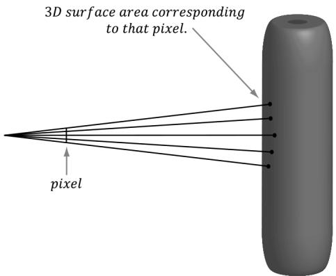


Figure 27.18. When the eye looks through a single pixel on the view window, it sees an entire volume of the 3D scene, not just a single point of the 3D scene. By casting several rays per pixel, we obtain more samples of the 3D scene, and thus a better approximation of it.


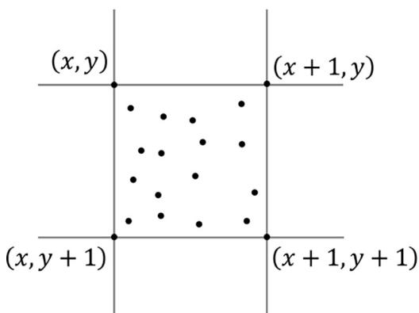


Figure 27.19. For each pixel, we create a jittered grid of sub-pixels and shoot a ray through each sub-pixel.


points in order to compute the pixel color, rather than at one point. This technique is called distribution ray tracing or super sampling. 

As noted earlier, to implement super sampling we need to cast several rays per pixel. An initial approach is to partition a uniform grid over a pixel and shoot a ray through each point on the grid (often called a sub-pixel to keep with the idea of shooting a ray through a pixel). However, the uniform pattern can introduce noticeable visual artifacts [Shirley05]. An alternative approach is to take random samples over the pixel, but the problem with this is that you may not get an even distribution unless you take many samples (e.g., the random points may clump together). A solution is a hybrid approach: we start with a uniform grid and randomly jitter the grid points slightly. Now we have an approximately random uniform distribution over the pixel (Figure 27.19), which works well in practice. 

In the distribution ray tracing algorithm, we shoot multiple rays per pixel and average the contribution of each to get the final pixel color. Other than this, the rest of the ray tracer runs exactly the same way. However, we can take the idea of casting multiple rays and integrate it into other parts of the ray tracer to achieve other special effects. In particular, we now show how to achieve soft shadows. 

Soft shadows arise from an area light source (see Figure $2 7 . 2 0 a )$ ). You can think of every point on an area light as being a point of light—so an area light is a collection of point lights packed densely together—thus every point on the area light emits a light ray in every direction. 

Now, there are three ways to categorize a surface point with respect to an area light. 

1. A point p on the umbra receives no light from the area light source because no point on the area light is visible to p. 

2. A point p on the anti-umbra receives all light from the area light source since every point on the area light is visible to p. 

3. A point p on the penumbra receives some light from the area light source because some points on the area light source are visible to p. 

Observe that as we move a point p from $^ a$ to $^ { b }$ in the penumbra, more points on the area light become visible to p; thus, the intensity of light in the penumbra varies, as shown in Figure $2 7 . 2 0 b$ . The penumbra gives rise to soft shadows, a gradual transition from unshadowed region to shadowed region. We can approximate this effect using the ideas of distribution ray tracing. 

We now describe how to implement soft shadows using distribution ray tracing. In distribution ray tracing, we shoot $N$ rays through a pixel P. These rays 

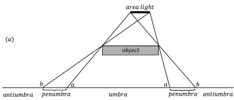


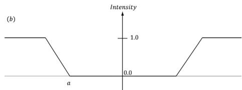


Figure 27.20. (a) The geometry of soft shadows; (b) The intensity of light the surface receives varies in the penumbra.


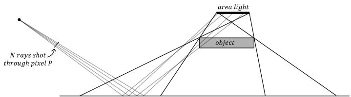


Figure 27.21. Soft shadows implemented using distribution ray tracing


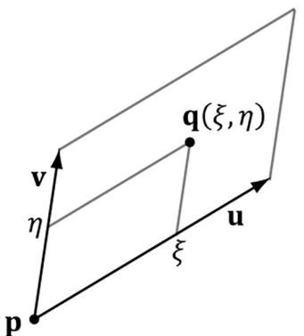


Figure 27.22. Parametric equation of a rectangle


intersect points in the scene, and we calculate a color at each of these intersection points, the average of which becomes the color for $P$ . For each of the intersected points, a shadow ray is cast, each of which targets a random point on the area light. When the intersection points fall in the penumbra (Figure 27.21), some of the intersection points are in shadow and the others are not. Hence, the average color of all the sub-pixels associated with $P$ is partially shadowed. The amount of shadow depends on where the intersection points fall in the penumbra. The closer they are to the umbra, the more likely most of the points are in shadow when the shadow rays target random points on the area light. As the intersection points move away from the umbra towards the anti-umbra, the amount of shadow gradually lessens, as it becomes less likely for a shadow ray to hit the object. Thus, in the penumbra, there is a gradual transition from fully shadowed to fully lit, which is the exact characteristic we want to simulate to produce soft shadows. 

All that is left to discuss is how, for each sub-pixel, to choose a random point on the area light. In this section, we only consider rectangle lights (see Figure 27.22). Any point q on the rectangle is given by the following: 

$$
\mathbf {q} (\xi , \eta) = \mathbf {p} + \xi \mathbf {u} + \eta \mathbf {v} \quad \text {f o r} \quad \xi , \eta \in [ 0, 1 ]
$$

To generate a random point on the rectangle, we just need to generate random 8 $; \eta \in [ 0 , 1 ]$ 

However, random sampling suffers from the possibility that the random samples will clump together and produce empty regions (i.e., not be a uniform distribution) unless thousands of samples are taken. Therefore, we can employ the same trick we did for super sampling: we use a semi-random jittered grid on the rectangle light. Then, for each pixel, the sub-pixel shadow rays target a random point on the jittered grid in a one-to-one fashion (i.e., no two sub-pixel shadow rays target the same jittered point on the area light grid). 

# 27.10 SUMMARY

1. With ray tracing, we discretize the view window based on window resolution and cast a ray through each pixel to “sample” the 3D world. If we consider only opaque objects, for each ray, we find the nearest point in the scene the ray intersects. We obtain the normal and texture coordinates at that point and use that information to shade the point the ray “sees.” This calculated shade becomes the pixel color for the corresponding ray. 

2. The ray generation shader is where we spawn our initial view rays. A typical thread in this shader casts a ray into the scene from the eye through its corresponding pixel in the output image. The miss shader is called for a ray if it does not intersect anything in the scene; usually, this is used to set a background color or sample a skybox. The any hit shader is called each time the ray hits geometry (not just the closest hit). The closest hit shader is called after all any hit shaders are executed. For opaque geometry, this shader indicates the point in the scene the eye sees, and so it is where we do our shading calculations that resemble what we typically do in a pixel shader. Finally, the intersection shader is used to implement custom ray/ shape intersection calculations. This is so that you can ray trace against custom shapes like spheres, cylinders, or other mathematically implicit surfaces. 

3. In HLSL, a ray is defined by the RayDesc type, which includes the ray origin, direction, $t _ { \mathrm { m i n } } ,$ and $t _ { \mathrm { m a x } }$ . A ray is cast into the scene with the intrinsic TraceRay function. We can get the ray index of the current thread and the number of rays dispatched from the following intrinsic functions: 

4. In the any hit, closest hit, or intersection shaders, we can get the ray world position and direction, respectively, with the WorldRayOrigin() and WorldRayDirection() intrinsic functions. There are also intrinsic functions ObjectRayOrigin() and ObjectRayDirection() to get the ray in object space. We can get the ray parameter t at the current hit point using the RayTCurrent() function. 

5. Once a ray is cast into the scene via TraceRay, several of the ray tracing shaders may execute on it. We need to be able to propagate data from one shader stage to another, and also back to the original shader that invoked TraceRay. The ray payload facilitates this. The ray payload is user-defined data that is attached to the ray throughout its lifetime. Note that the payload byte size is expected to be small, about 32-64 bytes or less; it should not be hundreds of bytes or more. 

6. When view rays are generated, we do not know which geometries they will intersect, and each geometry may require a distinct set of shader programs. Furthermore, different rays (color versus shadow) also require different shader programs. Therefore, RTX needs to know all possible shaders that might need to be run per ray dispatch. This information is specified by the shader binding table (SBT). The SBT is just a GPU buffer of shader records that we fill out. Each model instance will have multiple entries in the table: one for each geometry, and each geometry will have an entry for each ray type. In this way, if a given ray type intersects a geometry of any instance in the scene, there is an entry in the table for it. 

7. A bottom level acceleration structure (BLAS) is an acceleration structure per model. Consider a triangle mesh that forms a car model. You have one BLAS for the car. You can then instance the car model several times. A car model is made up of one or more geometries. You can think a geometry has a mesh that needs to be rendered with a specific material and shader. For example, the car body might be one geometry, the wheels another geometry, and the windows another geometry. In addition to triangle meshes, we can also ray trace against geometric primitives. A model could be formed by several geometric shapes, as well. 

While each model gets its own BLAS, the top level acceleration structure (TLAS) is essentially the acceleration structure for the scene. The TLAS defines instances to one or more BLASs. 

8. Due to performance or having a large investment in rasterization, a graphics engine may not be able to utilize $1 0 0 \%$ ray tracing. Combining rasterization with ray tracing is referred to as hybrid ray tracing. For example, we can use ray tracing for shadows and reflections. One way to do this is to rasterize the scene depth and normals to an off screen render target like we did for 

SSAO. Switching to ray tracing, in the ray generation shader, sample the scene depth and normal render targets to reconstruct the world position and world normals at each visible pixel. Now cast a shadow ray and reflection ray into the scene. We store the results in an RGBA image where RGB stores the reflection color and A stores the shadow result. Finally, render the scene with rasterization again using D3D12_COMPARISON_FUNC_EQUAL so that we do not process hidden pixels (just like we did after we computed the SSAO map). Instead of doing shadow mapping or reflections from a cube map, we sample the data we generated via ray tracing. 

9. Although shadowing, refraction, and reflection are quite natural to do with ray tracing, it alone does not really improve image quality over rasterization. For example, casting one shadow ray still gives hard shadows, and we cannot get blurry reflections with one reflection ray. To remedy this, we can cast multiple rays per pixel, and average the result. This improves quality and enables soft shadows and blurry reflections, but comes at the obvious cost of being more expensive. 

# 27.11 EXERCISES

1. Write your own implementation of the refract function. 

2. Let $D$ be a disk with radius $r$ centered about the $y$ -axis coinciding with the $y = h$ plane, relative to its local coordinate system. Determine if a ray $\mathbf { r } ( t ) = \mathbf { p } +$ tv intersects the disk, and if it does, find a formula for the intersection point (see Figure 27.23). 

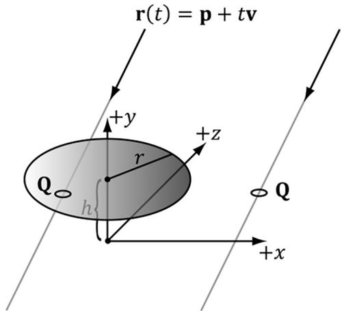


Figure 27.23. Ray/disk intersection


3. Let S be a sphere with radius $r$ centered at the origin of its local coordinate system. We wish to determine if a ray $\mathbf { r } ( t ) = \mathbf { p } + t \mathbf { v }$ intersects the sphere, and if it does, find a formula for the nearest intersection point (as a ray may intersect a sphere twice; see Figure 27.24). 

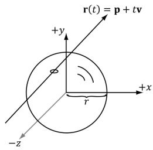


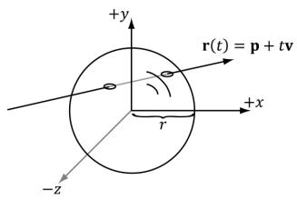


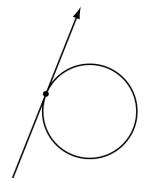


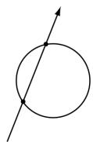


Figure 27.24. Ray/sphere intersection


4. Modify the hybrid ray tracing demo to implement refractions. You can generate a refraction map just like how we did reflections. 

5. Rasterization uses the screen space gradient operators ddx and ddy to estimate the mip level when sampling a texture. With ray tracing we do not have this, and in our closest hit shader, we use SampleLevel. Therefore, you will notice some texture aliasing in the demos of this chapter. Research texture filtering methods for ray tracing (for example, ray differentials and ray cones). 

6. Modify one of the ray tracing demos to animate an instance in the scene and to be able add/remove an object from the scene. For example, you could animate one of the objects as we did in the quaternion demo. This will require updating or rebuilding the TLAS (look into both). 

7. Modify the hybrid ray tracing demo to support animated vertices: either skinned mesh or animated waves. This will require updating the BLAS. Note that you could use a compute shader to do the vertex skinning or animate the waves. 

8. Recall that with ambient occlusion we shoot out random rays about the hemisphere of a point to estimate occlusion. Modify the hybrid ray tracing demo to implement ambient occlusion using DXR. 

9. As we saw with SSAO, when we take random samples, we get noise artifacts. Noise is a common problem in ray tracing because we can only case a finite number of rays. Research ray tracing denoising algorithms and try to implement one or integrate an existing denoising library. 

10. Implement soft shadows using distribution ray tracing. 