Appendix A

# Introduction to Windows Programming

To use the Direct3D API (Application Programming Interface), it is necessary to create a Windows (Win32) application with a main window, upon which we will render our 3D scenes. This appendix serves as an introduction to writing Windows applications using the native Win32 API. Loosely, the Win32 API is a set of low-level functions and structures exposed to us in the C programming language that enables us to create Windows applications. For example, to define a window class, we fill out an instance of the Win32 API WNDCLASS structure; to create a window, we use the Win32 API CreateWindow function; to notify Windows to show a particular window, we use the Win32 API function ShowWindow.

Windows programming is a huge subject, and this appendix introduces only the amount necessary for us to use Direct3D. For readers interested in learning more about Windows programming with the Win32 API, the book Programming Windows by Charles Petzold, now in its fifth edition, is the standard text on the subject. Another invaluable resource when working with Microsoft technologies is the MSDN library, which is usually included with Microsoft’s Visual Studio but can also be read online at www.msdn.microsoft.com. In general, if you come upon a Win32 function or structure that you would like to know more about, go to MSDN and search for that function or structure for its full documentation. If we mention a Win32 function or structure in this appendix and do not elaborate on it, it is an implicit suggestion that the reader look the function up in MSDN.

# Appendix Objectives:

1. To learn and understand the event driven programming model used in Windows programming.   
2. To learn the minimal code necessary to create a Windows application that is necessary to use Direct3D.


To avoid confusion, we will use a capital ‘W’ to refer to Windows the OS and we will use a lower case ‘w’ to refer to a particular window running in Windows.

# A.1 OVERVIEW

As the name suggests, one of the primary themes of Windows programming is programming windows. Many of the components of a Windows application are windows, such as, the main application window, menus, toolbars, scroll bars, buttons, and other dialog controls. Therefore, a Windows application typically consists of several windows. These next subsections provide a concise overview of Windows programming concepts we should be familiar with before beginning a more complete discussion.

# A.1.1 Resources

In Windows, several applications can run concurrently. Therefore, hardware resources such as CPU cycles, memory, and even the monitor screen must be shared amongst multiple applications. In order to prevent chaos from ensuing due to several applications accessing/modifying resources without any organization, Windows applications do not have direct access to hardware. One of the main jobs of Windows is to manage the presently instantiated applications and handle the distribution of resources amongst them. Thus, in order for our application to do something that might affect another running application, it must go through Windows. For example, to display a window you must call the Win32 API function ShowWindow; you cannot write to video memory directly.

# A.1.2 Events, the Message Queue, Messages, and the Message Loop

A Windows application follows an event-driven programming model. Typically, a Windows application sits and waits1 for something to happen—an event. An event

can be generated in a number of ways; some common examples are key presses, mouse clicks, and when a window is created, resized, moved, closed, minimized, maximized, or becomes visible.

When an event occurs, Windows sends a message to the application the event occurred for, and adds the message to the application’s message queue, which is simply a priority queue that stores messages for an application. The application constantly checks the message queue for messages in a message loop and, when it receives one, it dispatches the message to the window procedure of the particular window the message is for. (Remember, an application can contain several windows within it.) Every window has with it an associated function called a window procedure.2 Window procedures are functions we implement which contain code that is to be executed in response to specific messages. For instance, we may want to destroy a window when the Escape key is pressed. In our window procedure we would write:

```javascript
case WM_KEYDOWN: if( wParam == VK_ESCAPE ) DestroyWindow(ghMainWnd); return 0; 
```

The messages a window does not handle should be forwarded to the default window procedure, which then handles the message. The Win32 API supplies the default window procedure, which is called DefWindowProc.

To summarize, the user or an application does something to generate an event. The OS finds the application the event was targeted towards, and it sends that application a message in response. The message is then added to the application’s message queue. The application is constantly checking its message queue for messages. When it receives a message, the application dispatches it to the window procedure of the window the message is targeted for. Finally, the window procedure executes instructions in response to the message.

Figure (A.1) summarizes the event driven programming model.

# A.1.3 GUI

Most Windows programs present a GUI (Graphical User Interface) that users can work from. A typical Windows application has one main window, a menu, toolbar, and perhaps some other controls. Figure A.2 shows and identifies some common GUI elements. For Direct3D game programming, we do not need a fancy GUI. In fact, all we need is a main window, where the client area will be used to render our 3D worlds.

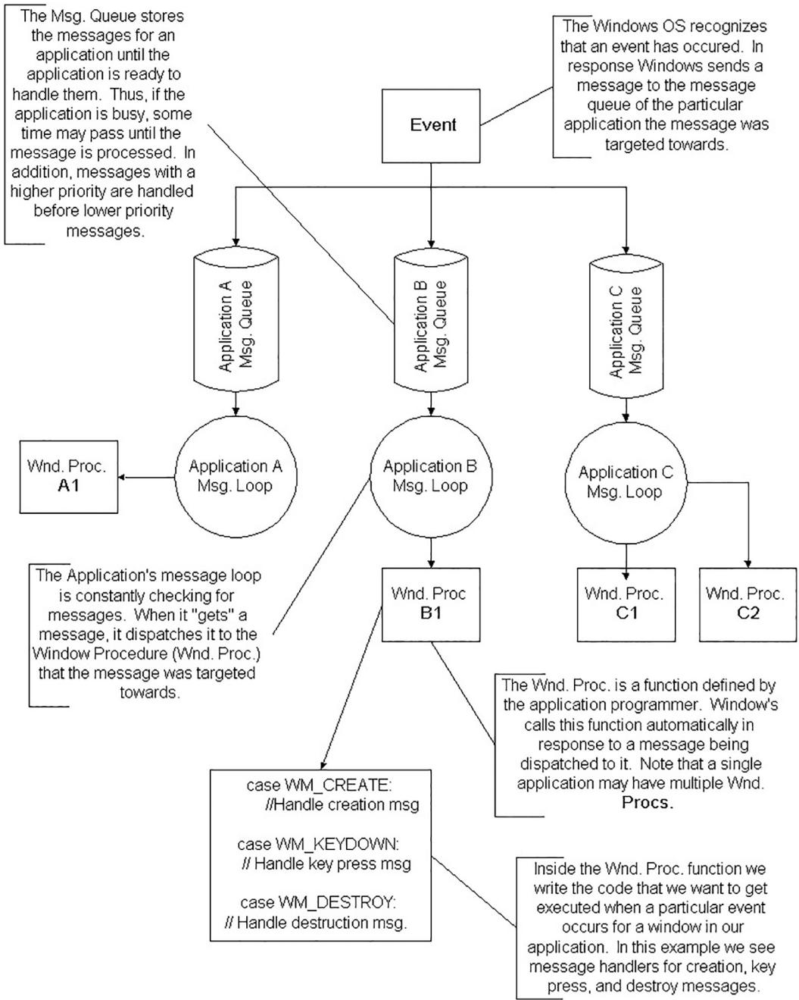  
A.1. The event driven programming model.

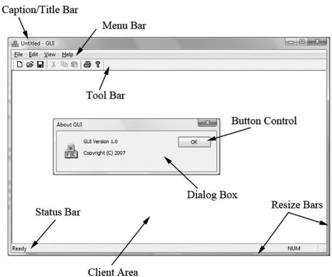  
A.2. The A typical Windows application GUI. The client area is the entire large white rectangular space of the application. Typically, this area is where the user views most of the program output. When we program our Direct3D applications, we render our 3D scenes into the client area of a window.

# A.1.4 Unicode

Essentially, Unicode (http://unicode.org/) uses 16-bit values to represent a character. This allows us to represent a larger character set to support international characters, and other symbols. For Unicode in $\mathrm { C } { + + }$ , we use the wide-characters type wchar_t. In 32- and 64-bit Windows, a wchar_t is 16-bits. When using wide characters, we must prefix a string literal with a capital L; for example:

```javascript
const wchar t* wcstrPtr = L"Hello, World!"; 
```

The L tells the compiler to treat the string literal as a string of wide-characters (i.e., as wchar_t instead of char). The other important issue is that we need to use the wide-character versions of the string functions. For example, to get the length of a string we need to use wcslen instead of strlen; to copy a string we need to use wcscpy instead of strcpy; to compare two strings we need to use wcscmp instead of strcmp. The wide-character versions of these functions work with wchar_t pointers instead of char pointers. The $\mathrm { C } { + + }$ standard library also provides a wide-character version of its string class: std::wstring. The Windows header file WinNT.h also defines:

```cpp
typedef wchar_t WCHAR; // wc, 16-bit UNICODE character 
```

# A.2 BASIC WINDOWS APPLICATION

Below is the code to a fully functional, yet simple, Windows program. Follow the code as best you can, and read the explanatory comments. The next section will

explain the code a bit at a time. It is recommended that you create a project with your development tool, type the code in by hand, compile it and execute it as an exercise. Note that for Visual $\mathrm { C } { + + }$ , you must create a “Win32 application project,” not a “Win32 console application project.”

```solidity
//   
// Win32Basic.cpp by Frank Luna (C) 2008 All Rights Reserved.   
//   
// Illustrates the minimal amount of the Win32 code needed for   
// Direct3D programming.   
//   
// Include the windows header file; this has all the Win32 API   
// structures, types, and function declarations we need to program   
// Windows.   
#include <windows.h>   
// The main window handle; this is used to identify a   
// created window.   
HWND ghMainWnd = 0;   
// Wraps the code necessary to initialize a Windows   
// application. Function returns true if initialization   
// was successful, otherwise it returns false.   
bool InitWindowsApp(HINSTANCE instanceHandle, int show);   
// Wraps the message loop code.   
int Run();   
// The window procedure handles events our window receives.   
LRESULT callback   
WndProc(HWND hWnd, UINT msg, WPARAM wParam, LPARAM lParam);   
// Windows equivalent to main()   
int WINAPI   
WinMain(HINSTANCE hInstance, HINSTANCE hPrevInstance, PSTR pCmdLine, int nShowCmd)   
{ // First call our wrapper function (InitWindowsApp) to create   
// and initialize the main application window, passing in the   
// hInstance and nShowCmd values as arguments. if(!InitWindowsApp(hInstance, nShowCmd)) return 0;   
// Once our application has been created and initialized we   
// enter the message loop. We stay in the message loop until   
// a WM_QUIT message is received, indicating the application   
// should be terminated. return Run();   
}   
bool InitWindowsApp(HINSTANCE instanceHandle, int show) 
```

// The first task to creating a window is to describe some of its // characteristics by filling out a WNDCLASS structure. WNDCLASS wc;

```cpp
wc.style = CS_HREDRAW | CS_VREDRAW;  
wc.lpfnWndProc = WndProc;  
wc.cbClsExtra = 0;  
wc.cbWndExtra = 0;  
wc.hInstance = instanceof;  
wc.hIcon = LoadIcon(0, IDI_APPLICATION);  
wc.hCursor = LoadCursor(0, IDCArrow);  
wc.hbrBackground = (HBRUSH)GetStockObject(WHITE_BRUSH);  
wc.lpszClassName = 0;  
wc.lpszClassName = L"BasicWndClass"; 
```

```cpp
// Next, we register this WNDCLASS instance with Windows so  
// that we can create a window based on it.  
if(!RegisterClass(&wc))  
{  
    MessageBox(0, L"RegisterClass Failed", 0, 0);  
    return false;  
}  
// With our WNDCLASS instance registered, we can create a  
// window with the CreateWindow function. This function  
// returns a handle to the window it creates (an HWND).  
// If the creation failed, the handle will have the value  
// of zero. A window handle is a way to refer to the window,  
// which is internally managed by Windows. Many of the Win32 API  
// functions that operate on windows require an HWND so that  
// they know what window to act on. 
```

ghMainWnd $=$ CreateWindow( L"BasicWndClass",//RegisteredWNDCLASS instance to use. L"Win32Basic",//window title WS_OVERLAPPEDWINDOW, // style flags CW_USEDEFAULT, // x-coordinate CWUSEDEFAULT, // y-coordinate CWUSEDEFAULT, // width CWUSEDEFAULT, // height 0, // parent window 0, // menu handle instanceof, // app instance 0); // extra creation parameters

```c
if(ghMainWnd == 0)  
{ MessageBox(0, L"CreateWindow Failed", 0, 0); return false; } 
```

// Even though we just created a window, it is not initially // shown. Therefore, the final step is to show and update the

// window we just created, which can be done with the following // two function calls. Observe that we pass the handle to the // window we want to show and update so that these functions know // which window to show and update. ShowWindow(ghMainWnd, show); UpdateWindow(ghMainWnd); return true;   
}   
int Run() { MSG msg $=$ {0}; // Loop until we get a WM_QUIT message. The function // GetMessage will only return 0 (false) when a WM_QUIT message // is received, which effectively exits the loop. The function // returns -1 if there is an error. Also, note that GetMessage // puts the application thread to sleep until there is a // message. BOOL bRet $= 1$ while( $(\mathrm{bRet} =$ GetMessage(&msg,0,0,0)) $! = 0$ ） { if(bRet $= = -1$ { MessageBox(0,L"GetMessage Failed",L"Error",MB_OK); break; } else { TranslateMessage(&msg); DispatchMessage(&msg); } } return (int)msg.wParam;   
}   
LRESULT callback WndProc(HWND hWnd, UINT msg, WPARAM wParam, LPARAM lParam) { // Handle some specific messages. Note that if we handle a // message, we should return 0. switch( msg ) { // In the case the left mouse button was pressed, // then display a message box. case WM_LBUTTONDOWN: MessageBox(0,L"Hello, World",L"Hello",MB_OK); return 0; // In the case the escape key was pressed, then // destroy the main application window. case WM_KEYDOWN: if(wParam $= =$ VK_ESCAPE)

```javascript
DestroyWindow(ghMainWnd); return 0; // In the case of a destroy message, then send a // quit message, which will terminate the message loop. case WM Destroy: PostQuitMessage(0); return 0; } // Forward any other messages we did not handle above to the // default window procedure. Note that our window procedure // must return the return value of DefWindowProc. return DefWindowProc(hWnd, msg, wParam, lParam); 
```

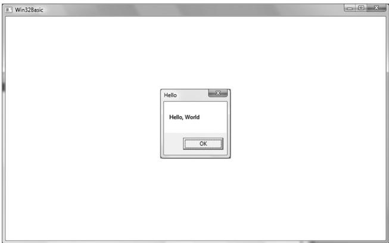  
A.3. A screenshot of the above program. Note that the message box appears when you press the left mouse button in the window’s client area. Also try exiting the program by pressing the Escape key.

# A.3 EXPLAINING THE BASIC WINDOWS APPLICATION

We will examine the code from top to bottom, stepping into any function that gets called along the way. Refer back to the code listing in the “Basic Windows Application” section throughout the following subsections.

# A.3.1 Includes, Global Variables, and Prototypes

The first thing we do is include the windows.h header file. By including the windows.h file we obtain the structures, types, and function declarations needed for using the basic elements of the Win32 API.

```cpp
include <windows.h> 
```

The second statement is an instantiation of a global variable of type HWND. This stands for “handle to a window” or “window handle.” In Windows programming, we often use handles to refer to objects maintained internally by Windows. In this sample, we will use an HWND to refer to our main application window maintained by Windows. We need to hold onto the handles of our windows because many calls to the API require that we pass in the handle of the window we want the API call to act on. For example, the call UpdateWindow takes one argument that is of type HWND that is used to specify the window to update. If we did not pass in a handle to it, the function would not know which window to update.

```cpp
HWND ghMainWnd = 0; 
```

The next three lines are function declarations. Briefly, InitWindowsApp creates and initializes our main application window; Run encapsulates the message loop for our application; and WndProc is our main window’s window procedure. We will examine these functions in more detail when we come to the point where they are called.

```cpp
bool InitWindowsApp(HINSTANCE instanceHandle, int show);  
int Run();  
LRESULT callback  
WndProc(HWND hWnd, UINT msg, WPARAM wParam, LPARAM lParam); 
```

# A.3.2 WinMain

WinMain is the Windows equivalent to the main function in normal $\mathrm { C } { + + }$ programming. WinMain is prototyped as follows:

```cpp
int WINAPI  
WinMain(HINSTANCE hInstance, HINSTANCE hPrevInstance, PSTR pCmdLine, int nShowCmd) 
```

1. hInstance: Handle to the current application instance. It serves as a way of identifying and referring to this application. Remember there may be several Windows applications running concurrently, so it is useful to be able to refer to each one.   
2. hPrevInstance: Not used in Win32 programming and is zero.   
3. pCmdLine: The command line argument string used to run the program.   
4. nCmdShow: Specifies how the application should be displayed. Some common commands that show the window in its current size and position, maximized, and minimized, respectively, are SW_SHOW, SW_SHOWMAXIMIZED, and SW_ SHOWMINIMIZED. See the MSDN library for a complete list of show commands.

If WinMain succeeds, it should return the wParam member of the WM_QUIT message. If the function exits without entering the message loop, it should return zero. The WINAPI identifier is defined as:

```cpp
define WINAPI __cdecl 
```

This specifies the calling convention of the function, which means how the function arguments get placed on the stack.

# A.3.3 WNDCLASS and Registration

Inside WinMain we call the function InitWindowsApp. As you can guess, this function does all the initialization of our program. Let us take a closer look at this function and its implementation. InitWindowsApp returns either true or false: true if the initialization was a success and false otherwise. In the WinMain definition, we pass as arguments a copy of our application instance and the show command variable into InitWindowsApp. Both are obtained from the WinMain parameter list.

```cpp
if(!InitWindowsApp(hInstance, nShowCmd)) 
```

The first task at hand in initialization of a window is to describe some basic properties of the window by filling out a WNDCLASS (window class) structure. Its definition is:

```c
typedef struct_WNDCLASS{ UINT style; WNDPROC lpfnWndProc; int cbClsExtra; int cbWndExtra; HANDLE hInstance; HICON hIcon; HCURSOR hCursor; HBRUSH hbrBackground; LPCTSTR lpszMenuName; LPCTSTR lpszClassName; } WNDCLASS; 
```

1. style: Specifies the class style. In our example we use CS_HREDRAW combined with CS_VREDRAW. These two bit flags indicate that the window is to be repainted when either the horizontal or vertical window size is changed. For the complete list of the various styles with description, see the MSDN library.

```javascript
wc.style = CS_HREDRAW | CS_VREDRAW; 
```

2. lpfnWndProc: Pointer to the window procedure function to associate with this  instance. Windows that are created based on this instance will use this window procedure. Thus, to create two windows with the same window procedure, you just create the two windows based on the same WNDCLASS instance. If you want to create two windows with different window procedures, you will need to fill out a different WNDCLASS instance

for each of the two windows. The window procedure function is explained in section A.3.6.

wc.lpfnWndProc $=$ WndProc;

3. cbClsExtra and cbWndExtra: These are extra memory slots you can use for your own purpose. Our program does not require any extra space and therefore sets both of these to zero.

wc.cbClsExtra $\qquad = \quad 0$ ; wc.cbWndExtra $\qquad = \quad 0$ ;

4. hInstance: This field is a handle to the application instance. Recall the application instance handle is originally passed in through WinMain.

wc.hInstance $=$ instanceHandle;

5. hIcon: Here you specify a handle to an icon to use for the windows created using this window class. You can use your own designed icon, but there are several built-in icons to choose from; see the MSDN library for details. The following uses the default application icon:

wc.hIcon $=$ LoadIcon(0, IDI_APPLICATION);

6. hCursor: Similar to hIcon, here you specify a handle to a cursor to use when the cursor is over the window’s client area. Again, there are several builtin cursors; see the MSDN library for details. The following code uses the standard “arrow” cursor.

wc.hCursor $=$ LoadCursor(0, IDC_ARROW);

7. hbrBackground: This field is used to specify a handle to brush which specifies the background color for the client area of the window. In our sample code, we call the Win32 function GetStockObject, which returns a handle to a prebuilt white colored brush; see the MSDN library for other types of built in brushes.

wc.hbrBackground $=$ (HBRUSH)GetStockObject(WHITE_BRUSH);

8. lpszMenuName: Specifies the window’s menu. Since we have no menu in our application so, we set this to zero.

wc.lpszMenuName $\qquad = \quad 0$ ;

9. lpszClassName: Specifies the name of the window class structure we are creating. This can be anything you want. In our application, we named it

“BasicWndClass”. The name is simply used to identify the class structure so that we can reference it later by its name.

wc.lpszClassName $=$ L"BasicWndClass";

Once we have filled out a WNDCLASS instance, we need to register it with Windows so that we can create windows based on it. This is done with the RegisterClass function which takes a pointer to a WNDCLASS structure. This function returns zero upon failure.

```cpp
if(!RegisterClass(&wc))  
{  
    MessageBox(0, L"RegisterClass Failed", 0, 0);  
    return false;  
} 
```

# A.3.4 Creating and Displaying the Window

After we have registered a WNDCLASS variable with Windows, we can create a window based on that class description. We can refer to a registered WNDCLASS instance via the class name we gave it (lpszClassName). The function we use to create a window is the CreateWindow function, which is declared as follows:

```sql
HWND CreateWindow(
    LPCTSTR lpClassName,
    LPCTSTR lpWindowName,
    DWORD dwStyle,
    int x,
    int y,
    int nWidth,
    int nHeight,
    HWND hWndParent,
    HMENU hMenu,
    HANDLE hInstance,
    LPVOID lpParam
); 
```

1. lpClassName: The name of the registered WNDCLASS structure that describes some of the properties of the window we want to create.   
2. lpWindowName: The name we want to give our window; this is also the name that appears in the window’s caption bar.   
3. dwStyle: Defines the style of the window. WS_OVERLAPPEDWINDOW is a combination of several flags: WS_OVERLAPPED, WS_CAPTION, WS_SYSMENU, WS_ THICKFRAME, WS_MINIMIZEBOX, and WS_MAXIMIZEBOX. The names of these flags describe the characteristics of the window they produce. See the MSDN library for the complete list of styles.

4. x: The $x$ position at the top left corner of the window relative to the screen. You can specify CW_USEDEFAULT for this parameter, and Windows will choose an appropriate default.   
5. y: The y position at the top left corner of the window relative to the screen. You can specify CW_USEDEFAULT for this parameter, and Windows will choose an appropriate default.   
6. nWidth: The width of the window in pixels. You can specify CW_USEDEFAULT for this parameter, and Windows will choose an appropriate default.   
7. nHeight: The height of the window in pixels. You can specify CW_USEDEFAULT for this parameter, and Windows will choose an appropriate default.   
8. hWndParent: Handle to a window that is to be the parent of this window. Our window has no relationship with any other windows, and therefore we set this value to zero.   
9. hMenu: A handle to a menu. Our program does not use a menu, so we specify 0 for this field.   
10. hInstance: Handle to the application the window will be associated with.   
11. lpParam: A pointer to user-defined data that you want to be available to a WM_CREATE message handler. The WM_CREATE message is sent to a window when it is being created, but before CreateWindow returns. A window handles the WM_CREATE message if it wants to do something when it is created (e.g., initialization).


When we specify the $( x , y )$ coordinates of the window’s position, they are relative to the upper-left corner of the screen. Also, the positive x-axis runs to the right as usual but the positive y-axis runs downward. Figure (A.4) shows this coordinate system, which is called screen coordinates, or screen space.

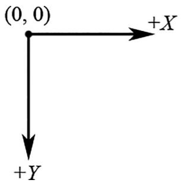  
A.4. Screen space.

CreateWindow returns a handle to the window it creates (an HWND). If the creation failed, the handle will have the value of zero (null handle). Remember that the handle is a way to refer to the window, which is managed by Windows. Many of the API calls require a HWND so that it knows what window to act on.

ghMainWnd $=$ CreateWindow(L"BasicWndClass",L"Win32Basic", WS_OVERLAPPEDWINDOW, CW_USEDEFAULT, CW_USEDEFAULT, CW_USEDEFAULT, CW_USEDEFAULT, 0,0,instanceHandle，0); if(ghMainWnd $\equiv = 0$ ） { MessageBox(0,L"CreateWindowFAILED",0,0); return false; }

The last two function calls in the InitWindowsApp function have to do with displaying the window. First we call ShowWindow and pass in the handle of our newly created window so that Windows knows which window to show. We also pass in an integer value that defines how the window is to be initially shown (e.g., minimized, maximized, etc.). This value should be nShowCmd, which is a parameter of WinMain. After showing the window, we should refresh it. UpdateWindow does this; it takes one argument that is a handle to the window we wish to update.

```javascript
ShowWindow(ghMainWnd, show); UpdateWindow(ghMainWnd); 
```

If we made it this far in InitWindowsApp, then the initialization is complete; we return true to indicate everything went successfully.

# A.3.5 The Message Loop

Having successfully completed initialization we can begin the heart of the program—the message loop. In our Basic Windows Application, we have wrapped the message loop in a function called Run.

```cpp
int Run()
{
    MSG msg = {0};
    BOOL bRet = 1;
    while ( (bRet = GetMessage(&msg, 0, 0, 0)) != 0 )
        {
            if (bRet == -1)
            {
                MessageBox(0, L"GetMessage Failed", L"Error", MB_OK);
            break;
        }
    else
        break;
} 
```

```javascript
{ TranslateMessage(&msg); DispatchMessage(&msg); } return (int) msg.wParam; 
```

The first thing done in Run is an instantiation of a variable called msg of type MSG, which is the structure that represents a Windows message. Its definition is as follows:

```sql
typedef struct tagMSG{ HWND hwnd; UINT message; WPARAM wParam; LPARAM lParam; DWORD time; POINT pt; } MSG; 
```

1. hwnd: The handle to the window whose window procedure is to receive the message.   
2. message: A predefined constant value identifying the message (e.g., WM_QUIT).   
3. wParam: Extra information about the message. This is dependent upon the specific message.   
4. lParam: Extra information about the message. This is dependent upon the specific message.   
5. time: The time the message was posted.   
6. pt: The $( x , y )$ coordinates of the mouse cursor, in screen coordinates, when the message was posted.

Next, we enter the message loop. The GetMessage function retrieves a message from the message queue, and fills out the msg argument with the details of the message. The second, third, and fourth parameters of GetMessage may be set to zero, for our purposes. If an error occurs in GetMessage, then GetMessage returns -1. If a WM_QUIT message is received, then GetMessage returns 0, thereby terminating the message loop. If GetMessage returns any other value, then two more functions get called: TranslateMessage and DispatchMessage. TranslateMessage has Windows perform some keyboard translations; specifically, virtual key to character messages. DispatchMessage finally dispatches the message off to the appropriate window procedure.

If the application successfully exits via a WM_QUIT message, then the WinMain function should return the wParam of the WM_QUIT message (exit code).

# A.3.6 The Window Procedure

We mentioned previously that the window procedure is where we write the code that we want to execute in response to a message our window receives. In the Basic Windows Application program, we name the window procedure WndProc and it is prototyped as:

LRESULT CALLBACK

WndProc(HWND hWnd, UINT msg, WPARAM wParam, LPARAM lParam);

This function returns a value of type LRESULT (defined as an integer), which indicates the success or failure of the function. The CALLBACK identifier specifies that the function is a callback function, which means that Windows will be calling this function outside of the code space of the program. As you can see from the Basic Windows Application source code, we never explicitly call the window procedure ourselves—Windows calls it for us when the window needs to process a message.

The window procedure has four parameters in its signature:

1. hWnd: The handle to the window receiving the message.   
2. msg: A predefined value that identifies the particular message. For example, a quit message is defined as WM_QUIT. The prefix WM stands for “Window Message.” There are over a hundred predefined window messages; see the MSDN library for details.   
3. wParam: Extra information about the message which is dependent upon the specific message.   
4. lParam: Extra information about the message which is dependent upon the specific message.

Our window procedure handles three messages: WM_LBUTTONDOWN, WM_KEYDOWN, and WM_DESTROY messages. A WM_LBUTTONDOWN message is sent when the user clicks the left mouse button on the window’s client area. A WM_KEYDOWN message is sent to a window in focus when a key is pressed. A WM_DESTROY message is sent when a window is being destroyed.

Our code is quite simple; when we receive a WM_LBUTTONDOWN message we display a message box that prints out “Hello, World”:

```cpp
case WM_LBUTTONDOWN:  
    MessageBox(0, L"Hello, World", L"Hello", MB_OK);  
    return 0; 
```

When our window gets a WM_KEYDOWN message, we test if the Escape key was pressed, and if it was, we destroy the main application window using the DestroyWindow function. The wParam passed into the window procedure specifies the virtual key code of the specific key that was pressed. Think of virtual key codes as an identifier for a particular key. The Windows header files have a list of virtual key code constants we can use to then test for a particular key; for example to test if the escape key was pressed, we use the virtual key code constant VK_ESCAPE.

```javascript
case WM_KEYDOWN: if( wParam == VK_ESCAPE ) DestroyWindow(ghMainWnd); return 0; 
```

Remember, the wParam and lParam parameters are used to specify extra information about a particular message. For the WM_KEYDOWN message, the wParam specifies the virtual key code of the specific key that was pressed. The MSDN library will specify the information the wParam and lParam parameters carry for each Windows message.

When our window gets destroyed, we post a WM_QUIT message with the PostQuitMessage function (which terminates the message loop):

```javascript
case WMDESTROY: PostQuitMessage(0); return 0; 
```

At the end of our window procedure, we call another function named DefWindowProc. This function is the default window procedure. In our Basic Windows Application program, we only handle three messages; we use the default behavior specified in DefWindowProc for all the other messages we receive but do not necessarily need to handle ourselves. For example, the Basic Windows Application program can be minimized, maximized, resized, and closed. This functionality is provided to us through the default window procedure, as we did not handle the messages to perform this functionality.

# A.3.7 The MessageBox Function

There is one last API function we have not yet covered, and that is the MessageBox function. This function is a very handy way to provide the user with information and to get some quick input. The declaration to the MessageBox function looks like this:

```cpp
int MessageBox( HWND hWnd, // Handle of owner window, may specify null. LPCTSTR lpText, // Text to put in the message box. LPCTSTR lpCaption, // Text to put for the title of the message box. UINT uType // Style of the message box. ); 
```

The return value for the MessageBox function depends on the type of message box. See the MSDN library for a list of possible return values and styles; one possible style is a Yes/No message box; see Figure A.5.

  
A.5. Yes/No message box.

# A.4 A BETTER MESSAGE LOOP

Games are very different application than traditional Windows applications such as office type applications and web browsers. Typically, games do not sit around waiting for a message, but are constantly being updated. This presents a problem, because if there are no messages in the message queue, the function GetMessage puts the thread to sleep and waits for a message. For a game, we do not want this behavior; if there are no Windows messages to be processed, then we want to run our own game code. The fix is to use the PeekMessage function instead of GetMessage. The PeekFunction message returns immediately if there are no messages. Our new message loop is as follows:

```cpp
int Run()
{
    MSG msg = {0};
    while(msg.message != WM_QUIT)
    {
        // If there are Window messages then process them.
        if( PeekMessage( &msg, 0, 0, 0, PM_REMOVE ))
        {
            TranslateMessage( &msg );
            DispatchMessage( &msg );
        }
        // Otherwise, do animation/game stuff.
        else
        {
            }
        }
    return (int)msg.wParam;
} 
```

After we instantiate msg, we enter into an endless loop. We first call the API function PeekMessage, which checks the message queue for a message. See MSDN for the parameter descriptions. If there is a message it returns true and we handle the message. If there are no messages, PeekMessage returns false and we execute our own specific game code.

# A.5 SUMMARY

1. To use Direct3D we must create a Windows application that has a main window onto which we can render our 3D scenes. Furthermore, for games we create a special message loop that checks for messages. If there are messages, it processes them; otherwise, it executes our game logic.   
2. Several Windows applications can be running concurrently, and therefore Windows must manage resource between them and direct messages to the applications for which they were intended. Messages are sent to an application’s message queue when an event (key press, mouse click, timer, etc.) has occurred for that application.   
3. Every Windows application has a message queue in which messages an application receives are stored. The application’s message loop constantly checks the queue for messages and dispatches them off to their intended window procedure. Note that a single application can have several windows within it.   
4. The window procedure is a special callback function we implement that Windows calls when a window in our application receives a message. In the window procedure, we write the code we want to be executed when a window in our application receives a particular message. Messages we do not specifically handle are forwarded to a default window procedure for default handling.

# A.6 EXERCISES

1. Modify the program in $\ S \mathrm { A } . 2$ to use a different icon, cursor, and background color. (Hint: Look up the LoadIcon, LoadCursor, and GetStockObject functions in MSDN.)   
2. Modify the program in $\ S \mathrm { A } . 2$ by handling the WM_CLOSE message. This message is sent to a window or application indicating that the window or application

should close. Use the message box function to ask the user if they really want to exit by displaying a Yes/No styled message box. If the user chooses “Yes,” then destroy the window; otherwise do not destroy the window. You could also use this technique to ask the user if they want to save their work before closing.

3. Modify the program in $\ S \mathrm { A } . 2$ by handling the WM_CREATE message. This message is sent to a window when it is being created, but before CreateWindow returns. Output a message, via the message box function, indicating that the window has been created.   
4. Look up the Sleep function in MSDN and summarize, in your own words, what the function does.   
5. Look up the messages WM_SIZE and WM_ACTIVATE in MSDN and summarize, in your own words, when the messages are sent.

# Hi gh Level Sha der La ngua ge Ref erence

# B.1 VARIABLE TYPES

# B.1.1 Scalar Types

1. bool: True or false value. Note that the HLSL provides the true and false keywords like in $\mathrm { C } { + + }$ .   
2. int: 32-bit signed integer.   
3. half: 16-bit floating point number.   
4. float: 32-bit floating point number.   
5. double: 64-bit floating point number.

Note:

Some platforms might not support int, half, and double. If this is the case these types will be emulated using float.

# B.1.2 Vector Types

1. float2: 2D vector, where the components are of type float.   
2. float3: 3D vector, where the components are of type float.   
3. float4: 4D vector, where the components are of type float.


You can create vectors where the components are of a type other than float. For example: int2, half3, bool4.

We can initialize a vector using an array like syntax or constructor like syntax:

```cpp
float3 v = {1.0f, 2.0f, 3.0f};  
float2 w = float2(x, y);  
float4 u = float4(w, 3.0f, 4.0f); // u = (w.x, w.y, 3.0f, 4.0f) 
```

We can access a component of a vector using an array subscript syntax. For example, to set the ith component of a vector vec we would write:

$\operatorname{vec}[i] = 2.0f;$

In addition, we can access the components of a vector vec, as we would access the members of a structure, using the defined component names x, y, z, w, r, g, b, and a.

$\begin{array}{rl} & \mathrm{vec.x = vec.r = 1.0f;}\\ & \mathrm{vec.y = vec.g = 2.0f;}\\ & \mathrm{vec.z = vec.b = 3.0f;}\\ & \mathrm{vec.w = vec.a = 4.0f;} \end{array}$

The names r, g, b, and a refer to the exact same component as the names x, y, z, and $\mathtt { w }$ , respectively. When using vectors to represent colors, the RGBA notation is more desirable since it reinforces the fact that the vector is representing a color.

# B.1.2.1 Swizzles

Consider the vector $\mathbf { u } = ( u _ { x } , u _ { y } , u _ { z } , u _ { w } )$ and suppose we want to copy the components of u to a vector v such that $\mathbf { v } = ( u _ { \boldsymbol { w } } , u _ { \boldsymbol { y } } , u _ { \boldsymbol { y } } , u _ { \boldsymbol { x } } )$ . The most immediate solution would be to individually copy each component of $\mathbf { u }$ over to v as necessary. However, the HLSL provides a special syntax for doing these kinds of out of order copies called swizzles:

```hcl
float4 u = {1.0f, 2.0f, 3.0f, 4.0f};  
float4 v = {0.0f, 0.0f, 5.0f, 6.0f};  
v = u.wyyx; // v = {4.0f, 2.0f, 2.0f, 1.0f} 
```

Another example:

```cpp
float4 u = {1.0f, 2.0f, 3.0f, 4.0f};  
float4 v = {0.0f, 0.0f, 5.0f, 6.0f};  
v = u.wzyx; // v = {4.0f, 3.0f, 2.0f, 1.0f} 
```

When copying vectors, we do not have to copy every component over. For example, we can only copy the x- and y-components over as this code snippet illustrates:

```javascript
float4 u = {1.0f, 2.0f, 3.0f, 4.0f}; 
```

```cpp
float4 v = {0.0f, 0.0f, 5.0f, 6.0f};  
v.xy = u; // v = {1.0f, 2.0f, 5.0f, 6.0f} 
```

# B.1.3 Matrix Types

We can define an $m \times n$ matrix, where m and n are between 1 and 4, using the following syntax:

floatmxn matmxn;

# ☞	Examples:

1. float2x2: $2 \times 2$ matrix, where the entries are of type float.   
2. float3x3: $3 \times 3$ matrix, where the entries are of type float.   
3. float $4 \times 4$ : $4 \times 4$ matrix, where the entries are of type float.   
4. float3x4: $3 \times 4$ matrix, where the entries are of type float.


You can create matrices where the components are of a type other than float. For example: int2x2, half3x3, bool4x4.

We can access an entry in a matrix using a double array subscript syntax. For example, to set the ijth entry of a matrix M we would write:

```javascript
M[i][j] = value; 
```

In addition, we can refer to the entries of a matrix M as we would access the members of a structure. The following entry names are defined:

One-Based Indexing:

```cpp
M._11 = M._12 = M._13 = M._14 = 0.0f;  
M._21 = M._22 = M._23 = M._24 = 0.0f;  
M._31 = M._32 = M._33 = M._34 = 0.0f;  
M._41 = M._42 = M._43 = M._44 = 0.0f; 
```

Zero-Based Indexing:

```cpp
M._m00 = M._m01 = M._m02 = M._m03 = 0.0f;  
M._m10 = M._m11 = M._m12 = M._m13 = 0.0f;  
M._m20 = M._m21 = M._m22 = M._m23 = 0.0f;  
M._m30 = M._m31 = M._m32 = M._m33 = 0.0f; 
```

Sometimes we want to refer to a particular row vector in a matrix. We can do so using a single array subscript syntax. For example, to extract the ith row vector in a $3 \times 3$ matrix M, we would write:

float3ithRow $=$ M[i]；//get theith row vector in M

In this next example, we insert three vectors into the first, second and third row of a matrix:

```cpp
float3 N = normalize(pIn.normalW);  
float3 T = normalize(pIn.tangentW - dot(pIn.tangentW, N) * N);  
float3 B = cross(N, T);  
float3x3 TBN;  
TBN[0] = T; // sets row 1  
TBN[1] = B; // sets row 2  
TBN[2] = N; // sets row 3 
```

We can also construct a matrix from vectors:

```matlab
float3 N = normalize(pIn.normalW);  
float3 T = normalize(pIn.tangentW - dot(pIn.tangentW, N) * N);  
float3 B = cross(N, T);  
float3x3 TBN = float3x3(T, B, N); 
```


Instead of using float4 and float4x4 to represent 4D vectors and $4 \times 4$ matrices, you can equivalently use the vector and matrix type:

```cpp
vector u = {1.0f, 2.0f, 3.0f, 4.0f};  
matrix M; // 4x4 matrix 
```

# B.1.4 Arrays

We can declare an array of a particular type using familiar $\mathrm { C } { + + }$ syntax, for example:

```cpp
float M[4][4];  
half p[4];  
float3 v[12]; // 12 3D vectors 
```

# B.1.5 Structures

Structures are defined exactly as they are in $\mathrm { C } { + + }$ . However, structures in the HLSL cannot have member functions. Here is an example of a structure in the HLSL:

```cpp
struct SurfaceInfo {
    float3 pos;
    float3 normal;
    float4 diffuse;
    float4 spec;
}; 
```

# B.1.6 The typedef Keyword

The HLSL typedef keyword functions exactly the same as it does in $\mathrm { C } { + } { + }$ . For example, we can give the name point to the type vector<float, $\Im >$ using the following syntax:

typedef float3 point;

Then instead of writing:

float3 myPoint;

We can just write:

point myPoint;

Here is another example showing how to use the typedef keyword with the HLSL const keyword (which works as in $\mathrm { C } { + + }$ ):

typedef const float CFLOAT;

# B.1.7 Variable Prefixes

The following keywords can prefix a variable declaration.

1. static: Essentially the opposite of extern; this means that the shader variable will not be exposed to the $\mathrm { C } { + + }$ application.

static float3 v = {1.0f, 2.0f, 3.0f};

2. uniform: This means that the variable does not change per vertex/pixel—it is constant for all vertices/pixels until we change it at the $\mathrm { C } { + + }$ application level. Uniform variables are initialized from outside the shader program (e.g., by the $\mathrm { C } { + + }$ application).   
3. extern: This means that the $\mathrm { C } { + + }$ application can see the variable (i.e., the variable can be accessed outside the shader file by the $\mathrm { C } { + + }$ application code. Global variables in a shader program are, by default, uniform and extern.   
4. const: The const keyword in the HLSL has the same meaning it has in $\mathrm { C } { + + }$ That is, if a variable is prefixed with the const keyword then that variable is constant and cannot be changed.

const float pi $= \ 3 . 1 4 \mathrm { f }$ ;

# B.1.8 Casting

The HLSL supports a very flexible casting scheme. The casting syntax in the HLSL is the same as in the C programming language. For example, to cast a float to a matrix we write:

float $\mathrm { ~ \underline { ~ } { ~ f ~ } ~ } = \mathrm { ~ \underline { ~ } { ~ 5 ~ } ~ } . 0 \mathrm { ~ f ~ }$ ; float4x4 m = (float4x4)f; // copy f into each entry of m.

What this scalar-matrix cast does is copy the scalar into each entry of the matrix. Consider the following example:

```matlab
float3 n = float3(...);  
float3 v = 2.0f\*n - 1.0f; 
```

The $2 . 0 \mathrm { f } ^ { \star } \mathrm { n }$ is just scalar-vector multiplication, which is well defined. However, to make this a vector equation, the scalar 1.0f is augmented to the vector (1.0f, 1.0f, 1.0f). So the above statement is like:

```javascript
float3 v = 2.0f\*n - float3(1.0f, 1.0f, 1.0f); 
```

For the examples in this book, you will be able to deduce the meaning of the cast from the syntax. For a complete list of casting rules, search the SDK documentation index for “Casting and Conversion”).

# B.2 KEYWORDS AND OPERATORS

# B.2.1 Keywords

For reference, here is a list of the keywords the HLSL defines:

```javascript
asrm, bool, compile, const, decl, do, double, else, extern, false, float, for, half, if, in, inline, inout, int, matrix, out, pass, pixelshader, return, sampler, shared, static, string, struct, technique, texture, true, typedef, uniform, vector, vertexshader, void, volatile, while 
```

This next set of keywords displays identifiers that are reserved and unused, but may become keywords in the future:

```cpp
auto, break, case, catch, char, class, const_cast, continue, default, delete, dynamic_cast, enum, explicit, friend, goto, long, mutable, namespace, new, operator, private, protected, public, register, reinterpret_cast, short, signed, sizeof, static_cast, switch, template, this, throw, try, typename, union, unsigned, using, virtual 
```

# B.2.2 Operators

HLSL supports many familiar $\mathrm { C } { + } { + }$ operators. With a few exceptions noted below, they are used exactly the same way as they are in $\mathrm { C } { + + }$ . The following table, lists the HLSL operators:

<table><tr><td>[ ]</td><td>.</td><td>&gt;</td><td>&lt;</td><td>&lt;=</td><td>&gt;=</td></tr><tr><td>!=</td><td>==</td><td>!</td><td>&amp;&amp;</td><td>||</td><td>? :</td></tr><tr><td>+</td><td>+=</td><td>-</td><td>--=</td><td>*</td><td>*=</td></tr><tr><td>/</td><td>/=</td><td>%</td><td>%=</td><td>++</td><td>--</td></tr><tr><td>=</td><td>()</td><td>,</td><td></td><td></td><td></td></tr></table>

Although the operators’ behavior is very similar to $\mathrm { C } { + + }$ , there are some differences. First of all, the modulus $\%$ operator works on both integer and floating-point types. And in order to use the modulus operator, both the left hand side value and right hand side value must have the same sign (e.g., both sides must be positive or both sides must be negative).

Secondly, observe that many of the HLSL operations work on a per component basis. This is due to the fact that vectors and matrices are built into the language and these types consist of several components. By having the operations work on a component level, operations such as vector/matrix addition, vector/matrix subtraction, and vector/matrix equality tests can be done using the same operators we use for scalar types. See the following examples.

Note:

The operators behave as expected for scalars, that is, in the usual $C + +$ way.

```cpp
float4 u = {1.0f, 0.0f, -3.0f, 1.0f};  
float4 v = {-4.0f, 2.0f, 1.0f, 0.0f};  
// adds corresponding components  
float4 sum = u + v; // sum = (-3.0f, 2.0f, -2.0f, 1.0f) 
```

Incrementing a vector increments each component:

```cpp
// before increment: sum = (-3.0f, 2.0f, -2.0f, 1.0f)  
sum++; // after increment: sum = (-2.0f, 3.0f, -1.0f, 2.0f) 
```

Multiplying vectors component wise:

```cpp
float4 u = {1.0f, 0.0f, -3.0f, 1.0f};  
float4 v = {-4.0f, 2.0f, 1.0f, 0.0f};  
// multiply corresponding components  
float4 product = u * v; // product = (-4.0f, 0.0f, -3.0f, 0.0f) 
```

Note:

If you have two matrices:

float4x4 A; float4x4 B;

The syntax $\tt { A } ^ { \star } \tt { B }$ does componentwise multiplication, not matrix multiplication. You need to use the mul function for matrix multiplication.

Comparison operators are also done per component and return a vector or matrix where each component is of type bool. The resulting “bool” vector contains the results of each compared component. For example:

```cpp
float4 u = { 1.0f, 0.0f, -3.0f, 1.0f};  
float4 v = {-4.0f, 0.0f, 1.0f, 1.0f};  
float4 b = (u == v); // b = (false, true, false, true) 
```

Finally, we conclude by discussing variable promotions with binary operations:

1. For binary operations, if the left hand side and right hand side differ in dimension, then the side with the smaller dimension is promoted (cast) to have the same dimension as the side with the larger dimension. For example, if $_ \textrm { x }$ is of type float and y is of type float3, in the expression $( { \textbf { x } } + { \textbf { \textit { y } } } )$ , the variable $_ \textrm { x }$ is promoted to float3 and the expression evaluates to a value of type float3. The promotion is done using the defined cast, in this case we are casting Scalar-to-Vector, therefore, after $_ \textrm { x }$ is promoted to float3, $\begin{array} { r } {  { { \mathchoice { \mathrm {  ~ \displaystyle ~ x ~ } } { \mathrm {  ~ \textstyle ~ x ~ } } { \mathrm {  ~ \scriptstyle ~ x ~ } } { \mathrm {  ~ \scriptscriptstyle ~ x ~ } } } } = \quad (  { { \mathchoice { \mathrm {  ~ \displaystyle ~ x ~ } } { \mathrm {  ~ \textstyle ~ x ~ } } { \mathrm {  ~ \scriptstyle ~ x ~ } } { \mathrm {  ~ \scriptscriptstyle ~ x ~ } } } } ,  { { \mathchoice { \mathrm {  ~ \displaystyle ~ x ~ } } { \mathrm {  ~ \textstyle ~ x ~ } } { \mathrm {  ~ \scriptstyle ~ x ~ } } { \mathrm {  ~ \scriptscriptstyle ~ x ~ } } } } , } \end{array}$ x) as the Scalar-to-Vector cast defines. Note that the promotion is not defined if the cast is not defined. For example, we can’t promote float2 to float3 because there exists no such defined cast.   
2. For binary operations, if the left hand side and right hand side differ in type. Then the side with the lower type resolution is promoted (cast) to have the same type as the side with the higher type resolution. For example, if $_ \textrm { x }$ is of type int and y is of type half, in the expression $( { \textbf { x } } + { \textbf { \textit { y } } } )$ , the variable $_ \textrm { x }$ is promoted to a half and the expression evaluates to a value of type half.

# B.3 PROGRAM FLOW

The HLSL supports many familiar $\mathrm { C } { + } { + }$ statements for selection, repetition, and general program flow. The syntax of these statements is exactly like $\mathrm { C } { + + }$ .

The Return Statement:

return (expression);

The If and If…Else Statements:

```c
if(condition)   
{ statement(s);   
}   
if(condition)   
{ statement(s);   
} else   
{ statement(s); 
```

The for statement:

```cpp
for(initial; condition; increment)  
{ statement(s); } 
```

The while statement:

```javascript
while(condition) { statement(s); } 
```

The do…while statement:

```cpp
do  
{statement(s);}while(condition); 
```

# B.4 FUNCTIONS

# B.4.1 User Defined Functions

Functions in the HLSL have the following properties:

1. Functions use a familiar $\mathrm { C } { + + }$ syntax.   
2. Parameters are always passed by value.   
3. Recursion is not supported.   
4. Functions are always inlined.

Furthermore, the HLSL adds some extra keywords that can be used with functions. For example, consider the following function written in the HLSL:

```cpp
bool foo(in const bool b, // input bool
out int r1, // output int
inout float r2) // input/output float
{
if (b) // test input value
{
r1 = 5; // output a value through r1
}
else
{
r1 = 1; // output a value through r1
}
// since r2 is inout we can use it as an input
// value and also output a value through it
r2 = r2 * r2 * r2;
return true;
} 
```

The function is almost identical to a $\mathrm { C } { + } { + }$ function except for the in, out, and inout keywords.

1. in: Specifies that the argument (particular variable we pass into a parameter) should be copied to the parameter before the function begins. It is not necessary to explicitly specify a parameter as in because a parameter is in by default. For example, the following are equivalent:

```cpp
float square(in float x)  
{  
    return x * x;  
} 
```

And without explicitly specifying in:

```cpp
float square(float x)  
{  
    return x * x;  
} 
```

2. out: Specifies that the parameter should be copied to the argument when the function returns. This is useful for returning values through parameters. The out keyword is necessary because the HLSL doesn’t allow us to pass by reference or to pass a pointer. We note that if a parameter is marked as out the argument is not copied to the parameter before the function begins. In other words, an out parameter can only be used to output data—it can’t be used for input.

```cpp
void square(in float x, out float y)  
{  
    y = x * x;  
} 
```

Here we input the number to be squared through $_ \textrm { x }$ and return the square of $_ \textrm { x }$ through the parameter y.

3. inout: Shortcut that denotes a parameter as both in and out. Specify inout if you wish to use a parameter for both input and output.

```cpp
void square (inout float x)  
{  
    x = x * x;  
} 
```

Here we input the number to be squared through $_ \textrm { x }$ and also return the square of $_ \textrm { x }$ through $_ \textrm { x }$ .

# B.4.2 Built-in Functions

The HLSL has a rich set of built in functions that are useful for 3D graphics. The following table describes an abridged list of them.

<table><tr><td>S. No.</td><td>Function</td><td>Description</td></tr><tr><td>1.</td><td>abs(x)</td><td>Returns |x|.</td></tr><tr><td>2.</td><td>ceil(x)</td><td>Returns the smallest integer ≥ x.</td></tr><tr><td>3.</td><td>cos(x)</td><td>Returns the cosine of x, where x is in radians.</td></tr><tr><td>4.</td><td>clamp(x, a, b)</td><td>Clamps x to the range [a, b] and returns the result.</td></tr><tr><td>5.</td><td>clip(x)</td><td>This function can only be called in a pixel shader, and it discards the current pixel from further processing if x &lt; 0.</td></tr><tr><td>6.</td><td>cross(u, v)</td><td>Returns u × v.</td></tr><tr><td>7.</td><td>ddx(p)</td><td>Estimates screen space partial derivative ∂p/∂x. This allows you can determine how per pixel quantities p vary from pixel to pixel in the screen space x-direction.</td></tr><tr><td>8.</td><td>ddy(p)</td><td>Estimates screen space partial derivative ∂p/∂y. This allows you can determine how per pixel quantities p vary from pixel to pixel in the screen space y-direction.</td></tr><tr><td>9.</td><td>degrees(x)</td><td>Converts x from radians to degrees.</td></tr><tr><td>10.</td><td>determinant(M)</td><td>Returns the determinant of a matrix.</td></tr><tr><td>11.</td><td>distance(u, v)</td><td>Returns the distance ||v - u|| between the points u and v.</td></tr><tr><td>12.</td><td>dot(u, v)</td><td>Returns u · v.</td></tr><tr><td>13.</td><td>floor(x)</td><td>Returns the greatest integer ≤ x.</td></tr><tr><td>14.</td><td>frac(x)</td><td>This function returns the fractional part of a floating-point number (i.e., the mantissa). For example, if x = (235.52, 696.32) and frac(x) = (0.52, 0.32).</td></tr><tr><td>15.</td><td>length(v)</td><td>Returns ||v|.</td></tr><tr><td>16.</td><td>lerp(u, v, t)</td><td>Linearly interpolates between u and v based on the parameter t ∈ [0, 1].</td></tr><tr><td>17.</td><td>log(x)</td><td>Returns ln(x).</td></tr><tr><td>18.</td><td>log10(x)</td><td>Returns log10(x).</td></tr><tr><td>19.</td><td>log2(x)</td><td>Returns log2(x).</td></tr><tr><td>20.</td><td>max(x, y)</td><td>Returns x if x ≥ y, else returns y.</td></tr><tr><td>21.</td><td>min(x, y)</td><td>Returns x if x ≤ y, else returns y.</td></tr><tr><td>22.</td><td>mul(M, N)</td><td>Returns the matrix product MN. Note that the matrix product MN must be defined. If M is a vector, it is treated as a row vector so that the vector-matrix product is defined. Likewise, if N is a vector, it is treated as a column vector so that the matrix-vector product is defined.</td></tr><tr><td>23.</td><td>normalize(v)</td><td>Returns v/||v|.</td></tr><tr><td>24.</td><td>pow(b, n)</td><td>Returns b".</td></tr><tr><td>25.</td><td>radians(x)</td><td>Converts x from degrees to radians.</td></tr><tr><td>26.</td><td>saturate(x)</td><td>Returns clamp(x, 0.0, 1.0).</td></tr><tr><td>27.</td><td>sin(x)</td><td>Returns the sine of x, where x is in radians.</td></tr><tr><td>28.</td><td>sincos(in x, out s, out c)</td><td>Returns the sine and cosine of x, where x is in radians.</td></tr><tr><td>29.</td><td>sqrt(x)</td><td>Returns sqrt(x).</td></tr><tr><td>30.</td><td>reflect(v, n)</td><td>Computes the reflection vector given the incident vector v and the surface normal n.</td></tr><tr><td>31.</td><td>refract(v, n, eta)</td><td>Computes the refraction vector given the incident vector v, the surface normal n, and the ratio of the two indices of refraction of the two materials eta.</td></tr><tr><td>32.</td><td>rsqrt(x)</td><td>Returns sqrt(x).</td></tr><tr><td>33.</td><td>tan(x)</td><td>Returns the tangent of x, where x is in radians.</td></tr><tr><td>34.</td><td>transpose(M)</td><td>Returns the transpose MT.</td></tr><tr><td>35.</td><td>Texture2D::Sample(S, texC)</td><td>Returns a color from a 2D texture map based on the SamplerState object s, and 2D texture coordinates texC.</td></tr><tr><td>36.</td><td>Texture2D::SampleLevel(S, texC, mipLevel)</td><td>Returns a color from a 2D texture map based on the SamplerState object s, 2D texture coordinates texC, and mipmap level mipLevel. This function differs from Texture2D::Sample in that the third parameter manually specifies the mipmap level to use. For example, we would specify 0 to access the topmost mipmap LOD.</td></tr><tr><td>37.</td><td>TextureCube::Sample(S, v)</td><td>Returns a color from a cube map based on the SamplerState object s, and 3D lookup vector v.</td></tr><tr><td>38.</td><td>Texture2DArray::Sample(S, texC)</td><td>Returns a color from a 2D texture array based on the SamplerState object s (recall a sampler state specifies texture filters and texture address modes), and 3D texture coordinates texC, where the first two coordinates are the usual 2D texture coordinates, and the third coordinate specifies the array index.</td></tr></table>


Most of the functions are overloaded to work with all the built-in types that the function makes sense for. For instance, abs makes sense for all scalar types and so is overloaded for all of them. As another example, the cross product cross only makes sense for 3D vectors so it is only overloaded for 3D vectors of any type (e.g., 3D vectors of ints, floats, doubles etc.). On the other hand, linear interpolation, lerp, makes sense for scalars, 2D, 3D, and 4D vectors and therefore is overloaded for all types.


If you pass in a non-scalar type into a “scalar” function, that is a function that traditionally operates on scalars (e.g., cos(x)), the function will act per component. For example, if you write:

```javascript
float3 v = float3(0.0f, 0.0f, 0.0f);  
v = cos(v); 
```

Then the function will act per component: $\mathbf { v } = ( \cos ( x ) , \cos ( y ) , \cos ( z ) )$ .


For further reference, the complete list of the built in HLSL functions can be found in the DirectX documentation. Search the index for “HLSL Intrinsic Functions”).

# B.4.3 Constant Buffer Packing

In the HLSL, constant buffer padding occurs so that elements are packed into 4D vectors, with the restriction that a single element cannot be split across two 4D vectors. Consider the following example:

```cpp
// HLSL  
cbuffer cb : register(b0)  
{  
    float3 Pos;  
    float3 Dir;  
}; 
```

If we have to pack the data into 4D vectors, you might think it is done like this:

```cpp
vector 1: (Pos.x, Pos.y, Pos.z, Dir.x)  
vector 2: (Dir.y, Dir.z, empty, empty) 
```

However, this splits the element dir across two 4D vectors, which is not allowed by the HLSL rules—an element is not allowed to straddle a 4D vector boundary. Therefore, it has to be packed like this in shader memory:

```cpp
vector 1: (Pos.x, Pos.y, Pos.z, empty)  
vector 2: (Dir.x, Dir.y, Dir.z, empty) 
```

Now suppose our $\mathrm { C } { + + }$ structure that mirrors the constant buffer was defined like so:

```c
// C++  
struct Data  
{  
    XMFLOAT3 Pos;  
    XMFLOAT3 Dir;  
}; 
```

If we did not pay attention to these packing rules, and just blindly called copied the bytes over when writing to the constant buffer with a memcpy, then we would end up with the incorrect first situation and the constant values would be wrong:

```cpp
vector 1: (Pos.x, Pos.y, Pos.z, Dir.x)  
vector 2: (Dir.y, Dir.z, empty, empty) 
```

Thus we must define our $\mathrm { C } { + } { + }$ structures so that the elements copy over correctly into the HLSL constants based on the HLSL packing rules; we use “pad” variables for this. We redefine the constant buffer to make the padding explicit:

```cpp
cbuffer cb : register(b0)  
{  
    float3 Pos;  
    float __pad0;  
    float3 Dir;  
    float __pad1;  
}; 
```

Now we can define a $\mathrm { C } { + + }$ structure that matches the constant buffer exactly:

```c
// C++
struct Data
{
    XMFLOAT3 Pos;
    float __pad0;
    XMFLOAT3 Dir;
    float __pad1;
}; 
```

If we do a memcpy now, the data gets copied over correctly to the constant buffer:

```cpp
vector 1: (Pos.x, Pos.y, Pos.z, __pad0)  
vector 2: (Dir.x, Dir.y, Dir.z, __pad1) 
```

We use padding variables in our constant buffers when needed in this book. In addition, when possible we order our constant buffer elements to reduce empty space to avoid padding. For example, we define our Light structure as follows so that we do not need to pad the w-coordinates—the structure elements are ordered so that the scalar data naturally occupies the $w$ -coordinates:

```objectivec
struct Light {
    DirectX::XMFLOAT3 Strength;
    float FalloffStart = 1.0f;
    DirectX::XMFLOAT3 Direction;
    float FalloffEnd = 10.0f;
    DirectX::XMFLOAT3 Position;
    float SpotPower = 64.0f;
}; 
```

When written to a constant buffer, these data elements will tightly pack three 3D vectors:

```cpp
vector 1: (Strength.x, Strength.y, Strength.z, FalloffStart)  
vector 2: (Direction.x, Direction.y, Direction.z, FalloffEnd)  
vector 3: (Position.x, Position.y, Position.z, SpotPower) 
```

# Note:

You should define your $C { + + }$ constant buffer data structures to match the memory layout of the constant buffer in shader memory so that you can do a simple memory copy.

Just to make the HLSL packing/padding clearer, let us look at a few more examples of how HLSL constants are packed. If we have a constant buffer like this:

```cpp
cbuffer cb : register(b0)  
{  
    float3 v;  
    float s;  
    float2 p;  
    float3 q;  
}; 
```

The structure would be padded and the data will be packed into three 4D vectors like so:

```cpp
vector 1: (v.x, v.y, v.z, s)  
vector 2: (p.x, p.y, empty, empty)  
vector 3: (q.x, q.y, q.z, empty) 
```

Here we can put the scalar $\boldsymbol { \mathsf { S } }$ in the fourth component of the first vector. However, are are not able to fit all of $\mathbb { q }$ in the remaining slots of vector 2, so $\mathbb { q }$ has to get its own vector.

As another example, consider the constant buffer:

```cpp
cbuffer cb : register(b0)  
{  
    float2 u;  
    float2 v;  
    float a0;  
    float a1;  
    float a2;  
}; 
```

This would be padded and packed like so:

```cpp
vector 1: (u.x, u.y, v.x, v.y)  
vector 2: (a0, a1, a2, empty) 
```


Arrays are handled differently. From the SDK documentation, “every element in an array is stored in a four-component vector.” So for example, if you have an array of float2:

float2 TexOffsets[8];

you might assume that two float2 elements will be packed into one float4 slot, as the examples above suggest. However, arrays are the exception, and the above is equivalent to:

float4 TexOffsets[8];

Therefore, from the $C { + + }$ code you would need to set an array of 8 XMFLOAT4s, not an array of 8 XMFLOAT2s for things to work properly. Each element wastes two floats of storage since we really just wanted a float2 array. The SDK documentation points out that you can use casting and additional address computation instructions to make it more memory efficient:

```cpp
float4 array[4];  
static float2 aggressivePackArray[8] = (float2[8])array; 
```

# Some Ana lyti c Geometry

In this appendix, we use vectors and points as building blocks for more complicated geometry. These topics are used in the book, but not as frequently as vectors, matrices, and transformations; hence, we have put them in an appendix, rather than the main text.

# C.1 RAYS, LINES AND SEGMENTS

A line can be described by a point ${ \bf p } _ { 0 }$ on the line and a vector u that aims parallel to the line (see Figure C.1). The vector line equation is:

$$
\mathbf {p} (t) = \mathbf {p} _ {0} + t \mathbf {u} \text {f o r} t \in \mathbb {R}
$$

By plugging in different values for t (t can be any real number) we obtain different points on the line.

If we restrict $t$ to nonnegative numbers, then the graph of the vector line equation is a ray with origin ${ \bf p } _ { 0 }$ and direction u (see Figure C.2).

Now suppose we wish to define a line segment by the endpoints ${ \bf p } _ { 0 }$ and $\mathbf { p } _ { 1 }$ . We first construct the vector $ { \mathbf { u } } =  { \mathbf { p } } _ { 1 } -  { \mathbf { p } } _ { 0 }$ from $\mathbf { p } _ { 0 }$ to $\mathbf { p } _ { 1 }$ ; see Figure C.3. Then, for $t \in [ 0 , 1 ] ,$ the graph of the equation $\mathbf { p } ( t ) = \mathbf { p } _ { 0 } + t \mathbf { u } = \mathbf { p } _ { 0 } + t ( \mathbf { p } _ { 1 } - \mathbf { p } _ { 0 } )$ is the line segment defined by ${ \bf p } _ { 0 }$ and $\mathbf { p } _ { 1 }$ . Note that if you go outside the range $t \in [ 0 , 1 ] ,$ then you get a point on the line that coincides with the segment, but which is not on the segment.

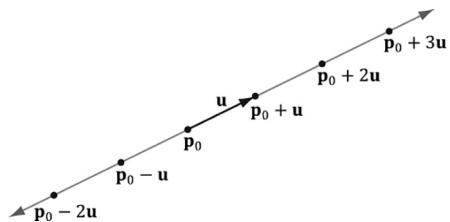  
Figure C.1. A line described by a point ${ \pmb P } 0$ on the line and a vector u that aims parallel to the line. We can generate points on the line by plugging in any real number t.

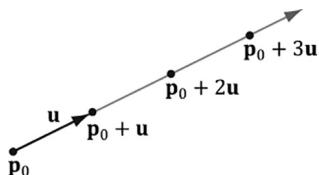  
Figure C.2. A ray described by an origin ${ \sf P } 0$ and direction u. We can generate points on the ray by plugging in scalars for t that are greater than or equal to zero.

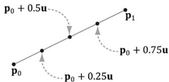  
Figure C.3. We generate points on the line segment by plugging in different values for t in [0, 1]. For example, the midpoint of the line segment is given at $t = 0 . 5$ . Also note that if $\dot { t } = 0$ , we get the endpoint ${ \pmb P } _ { 0 }$ and if $t = 1$ , we get the endpoint $\pmb { \mathsf { P } } \tau$ .

# C.2 PARALLELOGRAMS

Let $\mathbf { q }$ be a point, and $\mathbf { u }$ and $\mathbf { v }$ be two vectors that are not scalar multiples of one another (i.e., $\mathbf { u } \neq k \mathbf { v }$ for any scalar $k$ ). Then the graph of the following function is a parallelogram (see Figure C.4):

$$
\mathbf {p} (s, t) = \mathbf {q} + s \mathbf {u} + t \mathbf {v} \text {f o r} s, t \in [ 0, 1 ]
$$

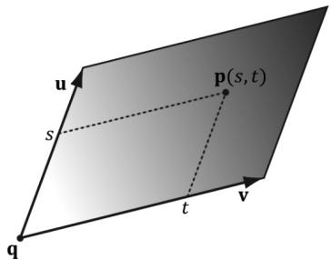  
Figure C.4. Parallelogram. By plugging in different s, $t \in [ 0 , 1 ]$ we generate different points on the parallelogram.

The reason for the $\mathbf { \ddot { u } } \neq k \mathbf { v }$ for any scalar $k ^ { \dprime }$ requirement can be seen as follows: If $\mathbf { u } = k \mathbf { v }$ then we could write:

$$
\begin{array}{l} \mathbf {p} (s, t) = \mathbf {q} + s \mathbf {u} + t \mathbf {v} \\ = \mathbf {q} + s k \mathbf {v} + t \mathbf {v} \\ = \mathbf {q} + (s k + t) \mathbf {v} \\ = \mathbf {q} + \bar {\mathbf {v}} \mathbf {v} \\ \end{array}
$$

which is just the equation of a line. In other words, we only have one degree of freedom. To get a 2D shape like a parallelogram, we need two degrees of freedom, so the vectors u and v must not be scalar multiples of each another.

# C.3 TRIANGLES

The vector equation of a triangle is similar to that of the parallelogram equation, except that we restrict the domain of the parameters further:

$$
\mathbf {p} (s, t) = \mathbf {p} _ {0} + s \mathbf {u} + t \mathbf {v} \text {f o r} s \geq 0, t \geq 0, s + t \leq 1
$$

Observe from Figure C.5 that if any of the conditions on s and $t$ do not hold, then $\mathbf { p } ( s , t )$ will be a point “outside” the triangle, but on the plane of the triangle.

We can obtain the above parametric equation of a triangle given three points defining a triangle. Consider a triangle defined by three vertices $\mathbf { p } _ { 0 } , \mathbf { p } _ { 1 } , \mathbf { p } _ { 2 }$ . Then for s t ≥ ≥ 0 0 , , $s + t \leq 1$ a point on the triangle can be given by:

$$
\mathbf {p} (s, t) = \mathbf {p} _ {0} + s \left(\mathbf {p} _ {1} - \mathbf {p} _ {0}\right) + t \left(\mathbf {p} _ {2} - \mathbf {p} _ {0}\right)
$$

We can take this further and distribute the scalars:

$$
\begin{array}{l} \mathbf {p} (s, t) = \mathbf {p} _ {0} + s \mathbf {p} _ {1} - s \mathbf {p} _ {0} + t \mathbf {p} _ {2} - t \mathbf {p} _ {0} \\ = (1 - s - t) \mathbf {p} _ {0} + s \mathbf {p} _ {1} + t \mathbf {p} _ {2} \\ = r \mathbf {p} _ {0} + s \mathbf {p} _ {1} + t \mathbf {p} _ {2} \\ \end{array}
$$

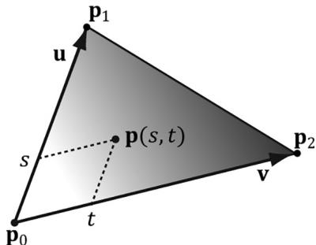  
Figure C.5. Triangle. By plugging in different s, t such that $s \geq 0$ , $t \geq 0$ , $s + t \leq 1$ , we generate different points on the triangle.

where we have let $r = ( 1 - s - t )$ . The coordinates $( r , s , t )$ are called barycentric coordinates. Note that $r + s + t = 1$ and the barycentric combination $\mathbf { p } ( r , s , t ) = r \mathbf { p } _ { 0 } +$ $s { \bf p } _ { 1 } + t { \bf p } _ { 2 }$ expresses the point p as a weighted average of the vertices of the triangle. There are interesting properties of barycentric coordinates, but we do not need them for this book; the reader may wish to further research barycentric coordinates.

# C.4 PLANES

A plane can be viewed as an infinitely thin, infinitely wide, and infinitely long sheet of paper. A plane can be specified with a vector n and a point ${ \bf p } _ { 0 }$ on the plane. The vector n, not necessarily unit length, is called the plane’s normal vector and is perpendicular to the plane; see Figure C.6. A plane divides space into a positive half-space and a negative half-space. The positive half space is the space in front of the plane, where the front of the plane is the side the normal vector emanates from. The negative half space is the space behind the plane.

By Figure C.6, we see that the graph of a plane is all the points $\mathbf { p }$ that satisfy the plane equation:

$$
\mathbf {n} \cdot (\mathbf {p} - \mathbf {p} _ {0}) = 0
$$

When describing a particular plane, the normal n and a known point $\mathbf { p } _ { 0 }$ on the plane are fixed, so it is typical to rewrite the plane equation as:

$$
\mathbf {n} \cdot (\mathbf {p} - \mathbf {p} _ {0}) = \mathbf {n} \cdot \mathbf {p} - \mathbf {n} \cdot \mathbf {p} _ {0} = \mathbf {n} \cdot \mathbf {p} + d = 0
$$

where $d = - \mathbf { n } \cdot \mathbf { p } _ { 0 }$ . If $\mathbf { n } = ( a , b , c )$ and ${ \bf p } = ( x , y , z )$ , then the plane equation can be written as:

$$
a x + b y + c z + d = 0
$$

If the plane’s normal vector n is of unit length, then $d = - \mathbf { n } \cdot \mathbf { p } _ { 0 }$ gives the shortest signed distance from the origin to the plane (see Figure C.7).

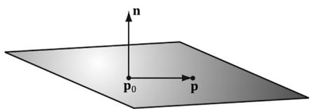  
Figure C.6. A plane defined by a normal vector n and a point ${ \sf P } 0$ on the plane. If $\mathsf { \Pi } _ { \mathsf { P 0 } }$ is a point on the plane, then the point $\mathsf { P }$ is also on the plane if and only if the vector $\mathsf { P } ^ { - } \mathsf { P } 0$ is orthogonal to the plane’s normal vector.

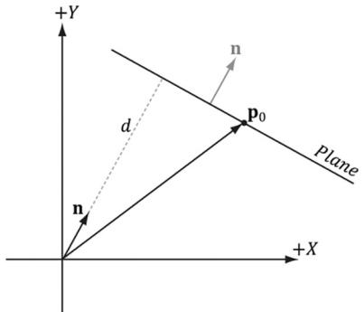  
Figure C.7. Shortest distance from a plane to the origin.


To make the pictures easier to draw, we sometimes draw our figures in 2D and use a line to represent a plane. A line, with a perpendicular normal, can be thought of as a 2D plane since the line divides the 2D space into a positive half space and negative half space.

# C.4.1 DirectX Math Planes

When representing a plane in code, it suffices to store only the normal vector n and the constant $d$ . It is useful to think of this as a 4D vector, which we denote as $( \mathbf { n } , d ) = ( a , b , c , d )$ . Therefore, because the XMVECTOR type stores a 4-tuple of floating-point values, the DirectX Math library overloads the XMVECTOR type to also represent planes.

# C.4.2 Point/Plane Spatial Relation

Given any point p, observe from Figure C.6 and Figure C.8 that

1. If $\mathbf { n } \cdot ( \mathbf { p } - \mathbf { p } _ { 0 } ) = \mathbf { n } \cdot \mathbf { p } + d > 0$ then $\mathbf { p }$ is in front of the plane.   
2. If $\mathbf { n } \cdot ( \mathbf { p } - \mathbf { p } _ { 0 } ) = \mathbf { n } \cdot \mathbf { p } + d < 0$ then $\mathbf { p }$ is behind the plane.   
3. If $\mathbf { n } \cdot ( \mathbf { p } - \mathbf { p } _ { 0 } ) = \mathbf { n } \cdot \mathbf { p } + d = 0$ then $\mathbf { p }$ is on the plane.

These tests are useful for testing the spatial location of points relative to a plane.

This next DirectX Math function evaluates $\mathbf { n } \cdot \mathbf { p } + d$ for a particular plane and point:

XMVECTOR XMPlaneDotCoord(/ Returns $\mathbf{n}\cdot \mathbf{p} + d$ replicated in each coordinate XMVECTOR P, // plane XMVECTOR V); // point with $w = 1$ // Test the locality of a point relative to a plane.   
XMVECTOR p $=$ XMVectorSet(0.0f, 1.0f, 0.0f, 0.0f);   
XMVECTOR v $=$ XMVectorSet(3.0f, 5.0f, 2.0f);   
float x $=$ XMVectorGetX(XMPlaneDotCoord(p, v));

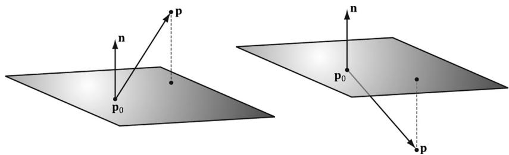  
Figure C.8. Point/plane spatial relation.

```cpp
if( x approximately equals 0.0f ) // v is coplanar to the plane.  
if( x > 0 ) // v is in positive half-space.  
if( x < 0 ) // v is in negative half-space. 
```

# Note:

We say approximately equals due to floating point imprecision.

A similar function is:

XMVECTOR XMPlaneDotNormal(XMVECTOR Plane, XMVECTOR Vec);

This returns the dot product of the plane normal vector and the given 3D vector.

# C.4.3 Construction

Besides directly specifying the plane coefficients $( \mathbf { n } , d ) = ( a , b , c , d )$ , we can calculate these coefficients in two other ways. Given the normal $\mathbf { n }$ and a known point on the plane $\mathbf { p } _ { 0 }$ we can solve for the $d$ component:

$$
\mathbf {n} \cdot \mathbf {p} _ {0} + d = 0 \Rightarrow d = - \mathbf {n} \cdot \mathbf {p} _ {0}
$$

The DirectX Math library provides the following function to construct a plane from a point and normal in this way:

```sql
XMVECTOR XMPlaneFromPointNormal(XMVECTOR Point, XMVECTOR Normal);
```

The second way we can construct a plane is by specifying three distinct points on the plane.

Given the points $\mathbf { p } _ { 0 } , \mathbf { p } _ { 1 } , \mathbf { p } _ { 2 }$ , we can form two vectors on the plane:

$$
\mathbf {u} = \mathbf {p} _ {1} - \mathbf {p} _ {0}
$$

$$
\mathbf {v} = \mathbf {p} _ {2} - \mathbf {p} _ {0}
$$

From that we can compute the normal of the plane by taking the cross product of the two vectors on the plane. (Remember the left hand thumb rule.)

$$
\mathbf {n} = \mathbf {u} \times \mathbf {v}
$$

Then, we compute $d = - \mathbf { n } \cdot \mathbf { p } _ { 0 }$

The DirectX Math library provides the following function to compute a plane given three points on the plane:

```sql
XMVECTOR XMPlaneFromPoints( XMVECTOR Point1, XMVECTOR Point2, XMVECTOR Point3);
```

# C.4.4 Normalizing a Plane

Sometimes we might have a plane and would like to normalize the normal vector. At first thought, it would seem that we could just normalize the normal vector as we would any other vector. But recall that the $d$ component also depends on the normal vector: $d = - \mathbf { n } \cdot \mathbf { p } _ { 0 }$ . Therefore, if we normalize the normal vector, we must also recalculate $d .$ . This is done as follows:

$$
d ^ {\prime} = \frac {d}{\left| \left| \mathbf {n} \right| \right|} = - \frac {\mathbf {n}}{\left| \left| \mathbf {n} \right| \right|} \cdot \mathbf {p} _ {0}
$$

Thus, we have the following formula to normalize the normal vector of the plane $( \mathbf { n } , d )$ :

$$
\frac {1}{| | \mathbf {n} | |} (\mathbf {n}, d) = \left(\frac {\mathbf {n}}{| | \mathbf {n} | |}, \frac {d}{| | \mathbf {n} | |}\right)
$$

We can use the following DirectX Math function to normalize a plane’s normal vector:

XMVECTOR XMPlaneNormalize(XMVECTOR P);

# C.4.5 Transforming a Plane

[Lengyel02] shows that we can transform a plane $( \mathbf { n } , d )$ by treating it as a 4D vector and multiplying it by the inverse-transpose of the desired transformation matrix. Note that the plane’s normal vector must be normalized first. We use the following DirectX Math function to do this:

XMVECTOR XMPlaneTransform(XMVECTOR P, XMMATRIX M);

Sample Code:

```c
XMMatrix T(...); // Initialize T to a desired transformation.  
XMMatrix invT = XMMatrixInverse(XMMatrixDeterminant(T), T);  
XMMatrix invTransposeT = XMMatrixTranspose(invT);  
XMVector p = (...); // Initialize Plane.  
p = XMPlaneNormalize(p); // make sure normal is normalized.  
XMVector transformedPlane = XMPlaneTransform(p, &invTransposeT); 
```

# C.4.6 Nearest Point on a Plane to a Given Point

Suppose we have a point $\mathbf { p }$ in space and we would like to find the point $\mathbf { q }$ on the plane $( \mathbf { n } , d )$ that is closest to p. From Figure C.9, we see that

$$
\mathbf {q} = \mathbf {p} - \operatorname {p r o j} _ {\mathbf {n}} \left(\mathbf {p} - \mathbf {p} _ {0}\right)
$$

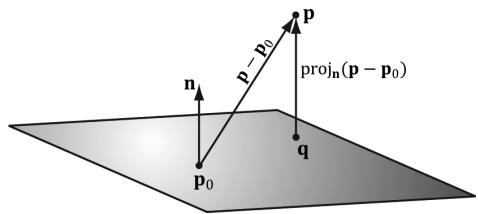  
Figure C.9. The nearest point on a plane to a point p. The point ${ \pmb P } 0$ is a point on the plane.

Assuming $\lvert \lvert \mathbf { n } \rvert \rvert = 1$ so that proj n $( \mathbf { p } - \mathbf { p } _ { 0 } ) = [ ( \mathbf { p } - \mathbf { p } _ { 0 } ) \cdot \mathbf { n } ] \mathbf { n }$ , we can rewrite this as:

$$
\begin{array}{l} \mathbf {q} = \mathbf {p} - \left[ \left(\mathbf {p} - \mathbf {p} _ {0}\right) \cdot \mathbf {n} \right] \mathbf {n} \\ = \mathbf {p} - (\mathbf {p} \cdot \mathbf {n} - \mathbf {p} _ {0} \cdot \mathbf {n}) \mathbf {n} \\ = \mathbf {p} - (\mathbf {p} \cdot \mathbf {n} + d) \mathbf {n} \\ \end{array}
$$

# C.4.7 Ray/Plane Intersection

Given a ray $\mathbf { p } ( t ) = \mathbf { p } _ { 0 } + t \mathbf { u }$ and the equation of a plane $\mathbf { n } \cdot \mathbf { p } + d = 0$ , we would like to know if the ray intersects the plane and also the point of intersection. To do this, we plug the ray into the plane equation and solve for the parameter $t$ that satisfies the plane equation, thereby giving us the parameter that yields the intersection point:

<table><tr><td>n·p(t) + d = 0</td><td>Plug ray into plane equation</td></tr><tr><td>n·(p0+tu) + d = 0</td><td>Substitute</td></tr><tr><td>n·p0+tn·u + d = 0</td><td>Distributive property</td></tr><tr><td>tn·u = -n·p0 - d</td><td>Add -n·p0 - d to both sides</td></tr><tr><td>t = -n·p0 - d/n·u</td><td>Solve for t</td></tr></table>

If $\mathbf { n } \cdot \mathbf { u } = 0$ then the ray is parallel to the plane and there are either no solutions or infinite many solutions (infinite if the ray coincides with the plane). If $t$ is not in the interval $[ 0 , \infty )$ , the ray does not intersect the plane, but the line coincident with the ray does. If $t$ is in the interval $[ 0 , \infty )$ , then the ray does intersect the plane and the intersection point is found by evaluating the ray equation at $\begin{array} { r } { t _ { 0 } = \frac { - \mathbf { n } \cdot \bar { \mathbf { p } _ { 0 } } - d } { \mathbf { n } \cdot \mathbf { u } } } \end{array}$

The ray/plane intersection test can be modified to a segment/plane test. Given two points defining a line segment $\mathbf { p }$ and ${ \bf q } ,$ then we form the ray $\mathbf { r } ( t ) = \mathbf { p } + t ( \mathbf { q } - \mathbf { p } )$ . We use this ray for the intersection test. If $t \in [ 0 , 1 ] ,$ then the

segment intersects the plane, otherwise it does not. The DirectX Math library provides the following function:

```sql
XMVECTOR XMPlaneIntersectLine( XMVECTOR P, XMVECTOR LinePoint1, XMVECTOR LinePoint2); 
```

# C.4.8 Reflecting Vectors

Given a vector I we wish to reflect it about a plane with normal n. Because vectors do not have positions, only the plane normal is involved when reflecting a vector. Figure C.10 shows the geometric situation, from which we conclude the reflection vector is given by:

$$
\mathbf {r} = \mathbf {I} - 2 (\mathbf {n} \cdot \mathbf {I}) \mathbf {n}
$$

# C.4.9 Reflecting Points

Points reflect differently from vectors since points have position. Figure C.11 shows that the reflected point $\mathbf { q }$ is given by:

$$
\mathbf {q} = \mathbf {p} - 2 \operatorname {p r o j} _ {\mathbf {n}} \left(\mathbf {p} - \mathbf {p} _ {0}\right)
$$

# C.4.10 Reflection Matrix

Let $( { \bf n } , d ) = ( n _ { x } , n _ { y } , n _ { z } , d )$ be the coefficients of a plane, where $d = - \mathbf { n } \cdot \mathbf { p } _ { 0 }$ . Then, using homogeneous coordinates, we can reflect both points and vectors about this plane using a single $4 \times 4$ reflection matrix:

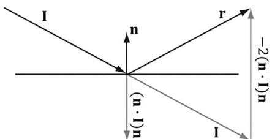  
Figure C.10. Geometry of vector reflection.

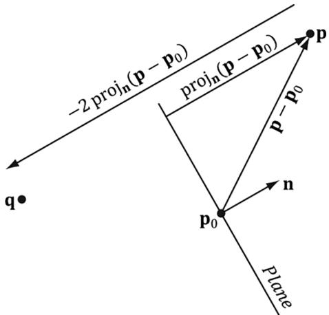  
Figure C.11. Geometry of point reflection.

$$
\mathbf {R} = \left[ \begin{array}{l l l l} 1 - 2 n _ {x} n _ {x} & - 2 n _ {x} n _ {y} & - 2 n _ {x} n _ {z} & 0 \\ - 2 n _ {x} n _ {y} & 1 - 2 n _ {y} n _ {y} & - 2 n _ {y} n _ {z} & 0 \\ - 2 n _ {x} n _ {z} & - 2 n _ {y} n _ {z} & 1 - 2 n _ {z} n _ {z} & 0 \\ - 2 d n _ {x} & - 2 d n _ {y} & - 2 d n _ {z} & 1 \end{array} \right]
$$

This matrix assumes the plane is normalized so that

$$
\begin{array}{l} \operatorname {p r o j} _ {\mathbf {n}} \left(\mathbf {p} - \mathbf {p} _ {0}\right) = [ \mathbf {n} \cdot (\mathbf {p} - \mathbf {p} _ {0}) ] \mathbf {n} \\ = [ \mathbf {n} \cdot \mathbf {p} - \mathbf {n} \cdot \mathbf {p} _ {0} ] \mathbf {n} \\ = [ \mathbf {n} \cdot \mathbf {p} + d ] \mathbf {n} \\ \end{array}
$$

If we multiply a point by this matrix, we get the point reflection formula:

$$
\begin{array}{l} [ p _ {x}, p _ {y}, p _ {z}, 1 ] \left[ \begin{array}{l l l l} 1 - 2 n _ {x} n _ {x} & - 2 n _ {x} n _ {y} & - 2 n _ {x} n _ {z} & 0 \\ - 2 n _ {x} n _ {y} & 1 - 2 n _ {y} n _ {y} & - 2 n _ {y} n _ {z} & 0 \\ - 2 n _ {x} n _ {z} & - 2 n _ {y} n _ {z} & 1 - 2 n _ {z} n _ {z} & 0 \\ - 2 d n _ {x} & - 2 d n _ {y} & - 2 d n _ {z} & 1 \end{array} \right] \\ = \left[ \begin{array}{c} p _ {x} - 2 p _ {x} n _ {x} n _ {x} - 2 p _ {y} n _ {x} n _ {y} - 2 p _ {z} n _ {x} n _ {z} - 2 d n _ {x} \\ - 2 p _ {x} n _ {x} n _ {y} + p _ {y} - 2 p _ {y} n _ {y} n _ {y} - 2 p _ {z} n _ {y} n _ {z} - 2 d n _ {y} \\ - 2 p _ {x} n _ {x} n _ {z} - 2 p _ {y} n _ {y} n _ {z} + p _ {z} - 2 p _ {z} n _ {z} n _ {z} - 2 d n _ {z} \\ 1 \end{array} \right] ^ {T} \\ = \left[ \begin{array}{c} p _ {x} \\ p _ {y} \\ p _ {z} \\ 1 \end{array} \right] ^ {T} + \left[ \begin{array}{c} - 2 n _ {x} (p _ {x} n _ {x} + p _ {y} n _ {y} + p _ {z} n _ {z} + d) \\ - 2 n _ {y} (p _ {x} n _ {x} + p _ {y} n _ {y} + p _ {z} n _ {z} + d) \\ - 2 n _ {z} (p _ {x} n _ {x} + p _ {y} n _ {y} + p _ {z} n _ {z} + d) \\ 0 \end{array} \right] ^ {T} \\ = \left[ \begin{array}{c} p _ {x} \\ p _ {y} \\ p _ {z} \\ 1 \end{array} \right] ^ {T} + \left[ \begin{array}{c} - 2 n _ {x} (\mathbf {n} \cdot \mathbf {p} + d) \\ - 2 n _ {y} (\mathbf {n} \cdot \mathbf {p} + d) \\ - 2 n _ {z} (\mathbf {n} \cdot \mathbf {p} + d) \\ 0 \end{array} \right] ^ {T} \\ = \mathbf {p} - 2 [ \mathbf {n} \cdot \mathbf {p} + d ] \mathbf {n} \\ = \mathbf {p} - 2 \operatorname {p r o j} _ {\mathbf {n}} \left(\mathbf {p} - \mathbf {p} _ {0}\right) \\ \end{array}
$$

And similarly, if we multiply a vector by this matrix, we get the vector reflection formula:

$$
[ \nu_ {x}, \nu_ {y}, \nu_ {z}, 0 ] \left[ \begin{array}{l l l l} 1 - 2 n _ {x} n _ {x} & - 2 n _ {x} n _ {y} & - 2 n _ {x} n _ {z} & 0 \\ - 2 n _ {x} n _ {y} & 1 - 2 n _ {y} n _ {y} & - 2 n _ {y} n _ {z} & 0 \\ - 2 n _ {x} n _ {z} & - 2 n _ {y} n _ {z} & 1 - 2 n _ {z} n _ {z} & 0 \\ - 2 d n _ {x} & - 2 d n _ {y} & - 2 d n _ {z} & 1 \end{array} \right] = \mathbf {v} - 2 (\mathbf {n} \cdot \mathbf {v}) \mathbf {n}
$$

The following DirectX Math function can be used to construct the above reflection matrix given a plane:

XMMATRIX XMMatrixReflect(XMVECTOR ReflectionPlane);

# C.5 EXERCISES

1. Let $\pmb { \mathrm { p } } ( t ) = ( 1 , 1 ) + t ( 2 , 1 )$ be a ray relative to some coordinate system. Plot the points on the ray at $t = 0 . 0 , 0 . 5 , 1 . 0 , 2 . 0$ , and 5.0.   
2. Let ${ \bf p } _ { 0 }$ and $\mathbf { p } _ { 1 }$ define the endpoints of a line segment. Show that the equation for a line segment can also be written as ${ \bf p } ( t ) = ( 1 - t ) { \bf p } _ { 0 } + t { \bf p } _ { 1 }$ for $t \in [ 0 , 1 ]$ .   
3. For each part, find the vector line equation of the line passing through the two points.

(a) $\mathbf { p } _ { 1 } = ( 2 , - 1 ) , \mathbf { p } _ { 2 } = ( 4 , 1 )$   
(b) $\pmb { \mathrm { p } } _ { 1 } = ( 4 , - 2 , 1 ) , \pmb { \mathrm { p } } _ { 2 } = ( 2 , 3 , 2 )$

4. Let $\mathbf { L } ( t ) = \mathbf { p } + t \mathbf { u }$ define a line in 3-space. Let $\mathbf { q }$ be any point in 3-space. Prove that the distance from $\mathbf { q }$ to the line can be written as:

$$
d = \frac {\left| \left| (\mathbf {q} - \mathbf {p}) \times \mathbf {u} \right| \right|}{\left| \left| \mathbf {u} \right| \right|}
$$

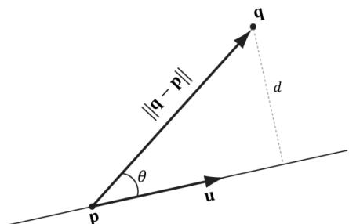  
Figure C.12. Distance from q to the line.

5. Let $\mathbf { L } ( t ) = ( 4 , 2 , 2 ) + t ( 1 , 1 , 1 )$ be a line. Find the distance from the following points to the line:

(a) $\mathbf { q } = ( 0 , 0 , 0 )$   
(b) $\mathbf { q } = ( 4 , 2 , 0 )$   
(c) $\mathbf { q } = ( 0 , 2 , 2 )$

6. Let $\mathbf { p } _ { 0 } ^ { } = ( 0 , 1 , 0 ) ;$ , ${ \mathfrak { p } } _ { 1 } = ( - 1 , 3 , 6 )$ , and $\mathsf { p } _ { 2 } = ( 8 , 5 , 3 )$ be three points. Find the plane these points define.   
7. Let $\textstyle \left( { \frac { 1 } { \sqrt { 3 } } } , { \frac { 1 } { \sqrt { 3 } } } , { \frac { 1 } { \sqrt { 3 } } } , - 5 \right)$ be a plane. Define the locality of the following points relative to the plane: $( 3 { \sqrt { 3 } } , 5 { \sqrt { 3 } } , 0 )$ , $( 2 { \sqrt { 3 } } , { \sqrt { 3 } } , 2 { \sqrt { 3 } } )$ , and $( { \sqrt { 3 } } , - { \sqrt { 3 } } , 0 )$ .   
8. Let $\left( - { \frac { 1 } { \sqrt { 2 } } } , { \frac { 1 } { \sqrt { 2 } } } , 0 , { \frac { 5 } { \sqrt { 2 } } } \right)$ be a plane. Find the point on the plane nearest to the point $( 0 , 1 , 0 )$ .   
9. Let $\left( - { \frac { 1 } { \sqrt { 2 } } } , { \frac { 1 } { \sqrt { 2 } } } , 0 , { \frac { 5 } { \sqrt { 2 } } } \right)$ be a plane. Find the reflection of the point ( , 0 1 0, ) about the plane.   
10. Let $\textstyle \left( { \frac { 1 } { \sqrt { 3 } } } , { \frac { 1 } { \sqrt { 3 } } } , { \frac { 1 } { \sqrt { 3 } } } , - 5 \right)$ be a plane, and let $\mathbf { r } ( t ) = ( - 1 , 1 , - 1 ) + t ( 1 , 0 , 0 )$ be a ray. Find the point at which the ray intersects the plane. Then write a short program using the XMPlaneIntersectLine function to verify your answer.

Appendix D

# Soluti ons to

# Selected Exerci ses

Solutions (including figures) to selected exercises in the text may be found in the companion files. All companion files for this title are available by visiting the website for the book at HYPERLINK "https://sciendo.com/publisher/Mercury_ Learning_and_Information"sciendo.com/book/9781683929161 and by clicking on the “COMPANION FILES” tab.

# Bib li ograp hy a nd Further Rea di ng

[Angel00] Angel, Edward. Interactive Computer Graphics: A Top-Down Approach with OpenGL, Second Edition, Addison-Wesley, 2000.   
[ATI1] ATI. “Dark Secrets of Shader Development or What Your Mother Never Told You About Shaders.” Presentation available at http://amd-dev.wpengine.netdna-cdn. com/wordpress/media/2012/10/Dark_Secrets_of_shader_Dev-Mojo.pdf   
[Bilodeau10] Bilodeau, Bill. “Efficient Compute Shader Programming,” Game Developers Conference, AMD slide presentation, 2010. http://developer.amd.com/ gpu_assets/Efficient%20Compute%20Shader%20Programming.pps   
[Bilodeau10b] Bilodeau, Bill. “Direct3D 11 Tutorial: Tessellation,” Game Developers Conference, AMD slide presentation, 2010. http://developer.amd.com/gpu_assets/ Direct3D%2011%20Tessellation%20Tutorial.ppsx   
[Birtwistle23] Birtwistle, Charlie and Francois Durand. “Task Graph Renderer At Activision,” Rendering Engine Architecture Conference, 2023.   
[Blinn78] Blinn, James F., and Martin E. Newell. “Clipping using Homogeneous Coordinates.” In Computer Graphics (SIGGRAPH ’78 Proceedings), pages 245–251, New York, 1978.   
[Blinn96] Blinn, Jim, Jim Blinn’s Corner: A Trip Down the Graphics Pipeline, Morgan Kaufmann Publishers, Inc, San Francisco CA, 1996.   
[Boyd08] Boyd, Chas. “DirectX 11 Compute Shader,” Siggraph slide presentation, 2008. http://s08.idav.ucdavis.edu/boyd-dx11-compute-shader.pdf

[Boyd10] Boyd, Chas. “DirectCompute Lecture Series 101: Introduction to DirectCompute,” 2010. http://channel9.msdn.com/Blogs/gclassy/DirectCompute-Lecture-Series-101-Introduction-to-DirectCompute   
[Brennan02] Brennan, Chris. “Accurate Reflections and Refractions by Adjusting for Object Distance,” Direct3D ShaderX: Vertex and Pixel Shader Tips and Tricks. Wordware Publishing Inc., 2002.   
[Burg10] Burg, John van der. “Building an Advanced Particle System.” Gamasutra, June 2000. http://www.gamasutra.com/features/20000623/vanderburg_01.htm   
[Cebenoyan14] Cebenoyan, Cem. “Advanced Visual Effects with DirectX 11: Real Virtual Texturing - Taking Advantage of DirectX 11.2 Tiled Resources,” Game Developers Conference, 2014. https://www.gdcvault.com/play/1020621/Advanced-Visual-Effects-with-DirectX   
[Crawfis12] Crawfis, Roger. “Modern GPU Architecture.” Course notes available at http://web.cse.ohio-state.edu/~crawfis/cse786/ReferenceMaterial/CourseNotes/ Modern%20GPU%20Architecture.ppt   
[De berg00] de Berg, M., M. van Kreveld, M. Overmars, and O. Schwarzkopf. Computational Geometry: Algorithms and Applications Second Edition. Springer-Verlag Berlin Heidelberg, 2000.   
[Dietrich] Dietrich, Sim. “Texture Space Bump Maps.” http://developer.nvidia.com/ object/texture_space_bump_mapping.html   
[Dunlop03] Dunlop, Robert. “FPS Versus Frame Time,” 2003. http://www.mvps.org/ directx/articles/fps_versus_frame_time.htm   
[DirectXMath] DirectXMath Online Documentation, Microsoft Corporation. http:// msdn.microsoft.com/en-us/library/windows/desktop/hh437833(v=vs.85).aspx   
[DXSDK] Microsoft DirectX June 2010 SDK Documentation, Microsoft Corporation.   
[Eberly01] Eberly, David H., 3D Game Engine Design, Morgan Kaufmann Publishers, Inc, San Francisco CA, 2001.   
[Engel02] Engel, Wolfgang (Editor). Direct3D ShaderX: Vertex and Pixel Shader Tips and Tricks, Wordware Publishing, Plano TX, 2002.   
[Engel04] Engel, Wolfgang (Editor). ShaderX2: Shader Programming Tips & Tricks with DirectX 9, Wordware Publishing, Plano TX, 2004.   
[Engel06] Engel, Wolfgang (Editor). ShaderX5: Shader Advanced Rendering Techniques, Charles River Media, Inc., 2006.   
[Engel08] Engel, Wolfgang (Editor). ShaderX6: Shader Advanced Rendering Techniques, Charles River Media, Inc., 2008.   
[Farin98] Farin, Gerald, and Dianne Hansford. The Geometry Toolbox: For Graphics and Modeling. AK Peters, Ltd., 1998.

[Fernando03] Fernando, Randima, and Mark J. Kilgard. The CG Tutorial: The Definitive Guide to Programmable Real-Time Graphics. Addison-Wesley, 2003.   
[Fraleigh95] Fraleigh, John B., and Raymond A. Beauregard. Linear Algebra $3 ^ { r d }$ Edition. Addison-Wesley, 1995.   
[Friedberg03] Friedberg, Stephen H., Arnold J. Insel, and Lawrence E. Spence. Linear Algebra Fourth Edition. Pearson Education, Inc., 2003.   
[Fung10] Fung, James. “DirectCompute Lecture Series 210: GPU Optimizations and Performance,” 2010. http://channel9.msdn.com/Blogs/gclassy/DirectCompute-Lecture-Series-210-GPU-Optimizations-and-Performance   
[Giesen11] Giesen, Fabian. “Texture tiling and swizzling,” 2011. https://fgiesen. wordpress.com/2011/01/17/texture-tiling-and-swizzling/   
[Halliday01] Halliday, David, Robert Resnick, and Jearl Walker. Fundamentals of Physics: Sixth Edition. John Wiley & Sons, Inc., 2001.   
[Hargreaves2024] Hargreaves, Shawn. “Reinventing the Geometry Pipeline: Mesh Shaders in DirectX 12.” https://www.youtube.com/watch?v $^ \prime { = }$ CFXKTXtil34   
[Hausner98] Hausner, Melvin. A Vector Space Approach to Geometry. Dover Publications, Inc., 1998. www.doverpublications.com   
[Hoffmann75] Hoffmann, Banesh. About Vectors. Dover Publications, Inc., 1975. www. doverpublications.com   
[Isidoro06] Isidoro, John R. “Shadow Mapping: GPU-based Tips and Techniques,” Game Developers Conference, ATI slide presentation, 2006. http://developer.amd. com/media/gpu_assets/Isidoro-ShadowMapping.pdf   
[Isidoro06b] Isidoro, John R. “Edge Masking and Per-Texel Depth Extent Propagation for Computation Culling During Shadow Mapping,” ShaderX 5: Advanced Rendering Techniques. Charles River Media, 2007.   
[Kilgard99] Kilgard, Mark J., “Creating Reflections and Shadows Using Stencil Buffers,” Game Developers Conference, NVIDIA slide presentation, 1999. http://developer. nvidia.com/docs/IO/1407/ATT/stencil.ppt   
[Kilgard01] Kilgard, Mark J. “Shadow Mapping with Today’s OpenGL Hardware,” Computer Entertainment Software Association's CEDEC, NVIDIA presentation, 2001. http://developer.nvidia.com/object/cedec_shadowmap.html   
[Kryachko05] Kryachko, Yuri. “Using Vertex Texture Displacement for Realistic Water Rendering,” GPU Gems 2: Programming Techniques for High-Performance Graphics and General Purpose Computation. Addison-Wesley, 2005.   
[Kuipers99] Kuipers, Jack B. Quaternions and Rotation Sequences: A Primer with Applications to Orbits, Aerospace, and Virtual Reality. Princeton University Press, 1999.

[Lengyel02] Lengyel, Eric. Mathematics for 3D Game Programming and Computer Graphics. Charles River Media, Inc., 2002.   
[Microsoft22] Microsoft Documentation. “Block Compression (Direct3D 10),” 2022. https://learn.microsoft.com/en-us/windows/win32/direct3d10/d3d10-graphicsprogramming-guide-resources-block-compression   
[Möller08] Möller, Tomas, and Eric Haines. Real-Time Rendering: Third Edition. AK Peters, Ltd., 2008.   
[Mortenson99] Mortenson, M.E. Mathematics for Computer Graphics Applications. Industrial Press, Inc., 1999.   
[NVIDIA05] Antialiasing with Transparency, NVIDIA Corporation, 2005. ftp:// download.nvidia.com/developer/SDK/Individual_Samples/DEMOS/Direct3D9/src/ AntiAliasingWithTransparency/docs/AntiAliasingWithTransparency.pdf   
[NVIDIA08] GPU Programming Guide GeForce 8 and 9 Series, NVIDIA Corporation, 2008. http://developer.download.nvidia.com/GPU_Programming_Guide/GPU_ Programming_Guide_G80.pdf   
[NVIDIA09] NVIDIA’s Next Generation CUDA Compute Architecture: Fermi, NVIDIA Corporation, 2009. http://www.nvidia.com/content/PDF/fermi_white_ papers/NVIDIA_Fermi_Compute_Architecture_Whitepaper.pdf   
[NVIDIA10] DirectCompute Programming Guide, NVIDIA Corporation, 2007- 2010. http://developer.download.nvidia.com/compute/DevZone/docs/html/ DirectCompute/doc/DirectCompute_Programming_Guide.pdf   
[Odonnell17] O’Donnell, Yuriy. “FrameGraph: Extensible Rendering Architecture in Frostbite,” Game Developers Conference, 2017. https://www.gdcvault.com/ play/1024612/FrameGraph-Extensible-Rendering-Architecture-in   
[Oliveira10] Oliveira, Gustavo. “Designing Fast Cross-Platform SIMD Vector Libraries,” 2010. http://www.gamasutra.com/view/feature/4248/designing_fast_crossplatform_ simd_.php   
[Parent02] Parent, Rick. Computer Animation: Algorithms and Techniques. Morgan Kaufmann Publishers, 2002. www.mkp.com   
[Pelzer04] Pelzer, Kurt. “Rendering Countless Blades of Waving Grass,” GPU Gems: Programming Techniques, Tips, and Tricks for Real-Time Graphics. Addison-Wesley, 2004.   
[Pettineo12] Pettineo, Matt. “A Closer Look at Tone Mapping,” 2012. https:// mynameismjp.wordpress.com/2010/04/30/a-closer-look-at-tone-mapping/   
[Pettineo22] Pettineo, Matt. “GPU Memory Pools in D3D12,” 2022. https://therealmjp. github.io/posts/gpu-memory-pool/

[Petzold99] Petzold, Charles, Programming Windows, Fifth Edition, Microsoft Press, Redmond WA, 1999.   
[Pharr04] Pharr, Matt, and Greg Humphreys. Physically Based Rendering: From Theory to Implementation. Morgan Kaufmann Publishers, 2004. www.mkp.com   
[Prosise99] Prosise, Jeff, Programming Windows with MFC, Second Edition, Microsoft Press, Redmond WA, 1999.   
[Reed12] Reed, Nathan. “Understanding BCn Texture Compression Formats,” 2012. https://www.reedbeta.com/blog/understanding-bcn-texture-compressionformats/#bc2-bc3-and-bc5   
[Reinhard10] Reinhard, Erik, et al. High Dynamic Range Imaging, Second Edition, Morgan Kaufmann, 2010.   
[Sandy14] Sandy, Matt. “Massive virtual textures for games: Direct3D Tiled Resources,” Microsoft Build Conference, 2014. https://www.youtube.com/ watch?v=QB0VKmk5bmI   
[Santrock03] Santrock, John W. Psychology 7. The McGraw-Hill Companies, Inc., 2003.   
[Savchenko00] Savchenko, Sergei, 3D Graphics Programming: Games and Beyond, Sams Publishing, 2000.   
[Sawicki21] Sawicki, Adam. “Efficient Use of GPU Memory in Modern Games,” Digital Dragons, 2021. https://www.youtube.com/watch?v=ML0YC77bSOc   
[Schneider03] Schneider, Philip J., and David H. Eberly. Geometric Tools for Computer Graphics. Morgan Kaufmann Publishers, 2003. www.mkp.com   
[Shirley05] Shirley, Peter. Fundamentals of Computer Graphics, 2nd ed. AK Peters, Ltd., 2005.   
[Snook03] Snook, Greg. Real-Time 3D Terrain Engines using $C { + + }$ and DirectX9. Charles River Media, Inc., 2003.   
[Story10] Story, Jon, and Cem Cebenoyan, “Tessellation Performance,” Game Developers Conference, NVIDIA slide presentation, 2010. http://developer.download.nvidia. com/presentations/2010/gdc/Tessellation_Performance.pdf   
[Sutherland74] Sutherland, I. E., and G. W. Hodgeman. Reentrant Polygon Clipping. Communications of the ACM, 17(1):32-42, 1974.   
[Thibieroz13] Thibieroz, Nick and Holger Gruen. “DirectX Performance Reloaded.” Presentation at Game Developers Conference 2013.   
[Tuft10] Tuft, David. “Cascaded Shadow Maps,” 2010. http://msdn.microsoft.com/enus/library/ee416307%28v=vs.85%29.aspx

[Uralsky05] Uralsky, Yuri. “Efficient Soft-Edged Shadows Using Pixel Shader Branching,” GPU Gems 2: Programming Techniques for High-Performance Graphics and General Purpose Computation. Addison-Wesley, 2005.   
[Verth04] Verth, James M. van, and Lars M. Bishop. Essential Mathematics for Games & Interactive Applications: A Programmer’s Guide. Morgan Kaufmann Publishers, 2004. www.mkp.com   
[Vlachos01] Vlachos, Alex, Jörg Peters, Chas Boyd, and Jason L. Mitchell, “Curved PN Triangles,” ACM Symposium on Interactive 3D Graphics 2001, pp. 159-166, 2001. (http://alex.vlachos.com/graphics/CurvedPNTriangles.pdf)   
[Watt92] Watt, Alan, and Mark Watt, Advanced Animation and Rendering Techniques: Theory and Practice, Addison-Wesley, 1992.   
[Watt00] Watt, Alan, 3D Computer Graphics, Third Edition, Addison-Wesley, 2000.   
[Watt01] Watt, Alan, and Fabio Policarpo, 3D Games: Real-time Rendering and Software Technology, Addison-Wesley, 2001.   
[Weinreich98] Weinreich, Gabriel, Geometrical Vectors. The University of Chicago Press, Chicago, 1998.   
[Whatley05] Whatley, David. “Toward Photorealism in Virtual Botany,” GPU Gems 2: Programming Techniques for High-Performance Graphics and General Purpose Computation. Addison-Wesley, 2005.   
[Wloka03] Wloka, Matthias. “Batch, Batch, Batch: What Does It Really Mean?” Presentation at Game Developers Conference 2003. http://developer.nvidia.com/ docs/IO/8230/BatchBatchBatch.pdf

# Index

#

acceleration structures, 959–961

adding/subtracting, blending, 445–446

address modes, texturing, 413–415

adjacent triangles, 188–189

adjoint of matrix, 47

Adobe Photoshop, 180

affine transformations

definition and matrix representation, 69

geometric interpretation of, 72–73

homogeneous coordinates, 68

scaling and rotation, 72

translation, 69–71

algebra, quaternions

conjugate and norm, 762–763

conversions, 761–762

definition and basic operations, 759–760

inverses, 763

polar representation, 764–765

properties, 761

special products, 760–761

alive buffer, 854

alpha channels, 448–449

alpha component, 182

ambient lighting, 350–351

ambient occlusion

ambient occlusion map, 752–753

ambient occlusion pass

calculation, 744

generate potential occluding points, 743

generate random samples, 742–743

implementation, 744–748

occlusion test, 743–744

reconstruct view space position, 740–741

blur pass, 748–752

screen space ambient occlusion

render normals and depth pass, 738–740

via ray casting, 734–737

amplification shader, mesh shaders and meshlets, 896–897

analytic geometry

parallelograms, 1018–1019

planes

construction, 1022

DirectX math planes, 1021

nearest point on a plane to given point, 1023–1024

normalizing a plane, 1023

point/plane spatial relation, 1021–1022

ray/plane intersection, 1024–1025

reflecting points, 1025

reflecting vectors, 1025

reflection matrix, 1025–1027

transforming a plane, 1023

rays, lines and segments, 1017–1018

triangle, 1019–1020

animation, 792

anisotropic filtering, 412–413

any-hit shader, 931–932

append and consume buffers, 528–529

attenuation, 369–371

axis-aligned bounding box (AABB), 603

# B

back buffer, 97

backface culling, 211–212

Bernstein basis functions, 569

Bézier curve, 567–569

biasing and aliasing, shadow mapping, 709–711

bilinear interpolation, 410

Blender, 179–180

blend factors, 440–441

blending

alpha channels, 448–449

blend factors, 440–441

blend state, 442–444

clipping pixels, 449–451

equation, 438–439

examples

adding/subtracting, 445–446

blending and depth buffer, 447–448

multiplying, 446

no color write, 445

transparency, 446–447

fog, 451–457

operations, 439–440

particle systems and, 851–852

semi-transparent water surface, 438

blend maps, 835

blend state, 442–444

blur demo

blurring theory, 531–534

Compute Shader program, 542–546

implementation, 537–541

render-to-texture, 534–536

blurring theory, 531–534

bone matrix palette, 795–796

bone offset transforms, 803

bottom level acceleration structure (BLAS), 949–951

BoundingBox::Intersects function, 630

BoundingFrustum class, 611

bounding volume hierarchies (BVH), 948–949

bounding volumes and frustums

bounding boxes, 603–605

DirectX math collision, 603

frustums, 608–614

rotations and axis-aligned bounding boxes, 605–607

spheres, 607–608

box demo, 269–283

bounding boxes, 603–605

buffer helper, 244–249

BufferLocation, 226

buffers, 186, 223–228

#

camera class, 583–585

camera system

camera class, 583–585

demo comments, 589–590

PSOs LIB, 590–591

selected method implementations

building view matrix, 588–589

derived Frustum info, 586

SetLens, 585–586

transforming, 586–587

XMVECTOR return variations, 585

view transform review, 581–583

cap geometry, 312–313

cbPerObiect，241

CD3DX12_DXIL_LIBRARY_SUBOBJECT sub-object, 942

CD3DX12_HIT_GROUP_SUBOBJECT sub-object, 942

CD3DX12_LOCAL_ROOT_SIGNATURE_SUBOBJECT sub-object, 942

CD3DX12_RAYTRACING_SHADER_CONFIG_SUBOBJECT subobject, 942

change-of-coordinate transformations, 583

character animation

demo, 807–810

frame hierarchies, 786–789

loading animation data from file

animation data, 803–806

bone offset transforms, 803

header, 800

hierarchy, 803

materials, 801

M3DLoader, 806–807

subsets, 801–802

vertex data and triangles, 802

skinned meshes

animating the skeleton, 791–793

bones to-root transform, 790–791

definitions, 789–790

final transform, calculation, 793–795

offset transform, 791

vertex blending, 795–800

checking feature support, Direct3D 12, 110

ChooseColor dialog box, 180

classical ray tracer demo

acceleration structures, 948–953

scene management, 946–948

ClearDepthStencilView method, 168

method, 168

clipping, 208–210

pixels, 449–451

closest hit shader, 932–937

cofactor matrix of A, 47

color operations, 181–182

column vectors, 38

COM, see Component Object Model (COM)

command queue and command lists, CPU/GPU

interaction, 115–119

committed resources, 111

common data structure for triangle meshes, 885–889

compiling shaders, 258–262

Component Object Model (COM), 94–95

compute-based, GPU particle system, 853

Compute PSO, 512–513

compute queue, 116

computer color

32-bit color, 182–184

128-bit color, 182

color operations, 181–182

Compute Shader

append and consume buffers, 528–529

blur demo

blurring theory, 531–534

Compute Shader program, 542–546

implementation, 537–541

render-to-texture, 534–536

data input and output resources

copying CS results to system memory, 522–526

indexing and sampling textures, 516–519

structured buffer resources, 519–522

texture inputs, 513

texture outputs and unordered access views (UAVs), 513–516

definition, 509

program, 542–546

shared memory and synchronization, 529–530

simple Compute Shader, 511

Compute PSO, 512–513

thread identification system values, 526–528

threads and thread groups, 510–511

constant buffers

creating, 241–243

descriptors, 249–253

packing, 1013–1016

root signature and descriptor tables, 253–257

updating, 243–244

upload buffer helper, 244–249

values, 690

constant buffer view (CBV), 242, 255

constant vectors, 23–24

control point patch list, 189

coordinate matrix vs. transformations matrix, 80–81

coordinate systems, 5–6

coordinate transformations, change of

associativity and change of, 78–79

inverses and change of coordinate matrices, 79–80

matrix representation, 77–78

points, 76–77

vectors, 76

copying CS results to system memory, 522–526

copy queue, 116

CPU/GPU interaction

command queue and command lists, 115–119

multithreading with commands, 123–124

resource transitions, 122–123

synchronization, 119–121

crate demo, texturing

texture coordinates, 427–428

updated HLSL, 428–430

create command queue and command list, 126–127

create device, 124–126

create fence, 126

CreateStaticBuffer，224

creating

enabling and

creating SRV descriptors, 404–407

loading DDS files, 398–399

SRV heap and bindless texturing, 407–409

texture and material lib, 400–404

samplers, 415–422

cross product, 14–16

orthogonalization with, 16–17

pseudo 2D cross product, 16

cube mapping, 641–643

dynamic cube maps

camera, 658–660

depth buffer, 656–657

descriptors, 656

drawing, 660–663

dynamic cube map helper class, 653–654

extra descriptor heap space, 654–655

with geometry shader, 663–665

resource, 654

with vertex shader and instancing, 666

viewport and scissor rectangle, 657–658

environment maps, 643–646

loading and using cube maps in Direct3D, 645–646

modeling reflections, 649–652

texturing a sky, 646–649

cubic Bézier surfaces, 570–572

cylinder mesh generation, 309–313

# D

data input and output resources, Compute Shader copying CS results to system memory, 522–52

indexing and sampling textures, 516–519

structured buffer resources, 519–522

texture inputs, 513

texture outputs and unordered access views (UAVs), 513–516

D3DApp class, 148–151

D3DApp::MsgProc, 154

D3D12_BLEND_DESC structure, 442

D3D12_INPUT_ELEMENT_DESC structure, 220

D3D12_RESOURCE_DESC structure, 133–135

DDS files, creating, 397–398

DDS format, 395–397

D3D12_VERTEX_BUFFER_VIEW_DESC structure, 226

Dear ImGui (ImGUI), 159

debugging direct3D applications, 170–171

DefWindowProc, 981

demo application framework, 148–170

D3DApp class, 148–151

frame statistics, 155–156

framework methods, 152–154

ImGUI, 158–162

“Init Direct3D” Demo, 162–169

message handler, 156–158

new scene models, 634–639

non-framework methods, 151–152

depth buffer, 447–448

depth buffering, 98–100

DepthOrArraySize, 499

depth/stencil state

buffer and view, 133–137

creating and binding, 465

depth settings, 463

formats and clearing, 460–461

stencil settings, 463–465

descriptor heaps, 101–102, 130–132

descriptor table, 255

DestDescriptor, 133

determinant of matrix

definition, 45–47

matrix minors, 45

dielectric, 913

diffuse albedo color, 350

diffuse lighting, 349–350

diffuse reflection, 349

digital scanners, 179–180

Direct3D 12 device, 94

MinimumFeatureLevel, 125

pAdapter, 125

ppDevice, 125

riid, 125

Direct3D initialization

checking feature support, 110

common heap types, 113–114

Component Object Model (COM), 94–95

create command queue and command list, 126–127

create device, 124–126

create fence, 126

debugging direct3D applications, 170–171

demo application framework, 148–170

depth buffering, 98–100

depth/stencil buffer and view, 133–137

descriptor heaps, 130–132

Direct3D 12, 94

DirectX Graphics Infrastructure (DXGI), 106–109

feature levels, 105–106

loading and using cube maps in, 645–646

multisampling in, 104–105

render target view, 132–133

residency, 110–111

resources, 111–113

resources and descriptors, 100–102

scissor rectangle, 139–140

swap chain, 127–130

swap chain and page flipping, 97–98

textures formats, 95–97

timing and animation, 140–147

viewport, 138–139

directional lights implementation, 375–376

DirectX collision library, 603, 605

DirectX Graphics Infrastructure (DXGI), 106–109

DirectX Math matrices

collision, 603

functions, 52–53

library, 19

matrix types, 50–52

sample program, 53–55

transformation functions, 81–82

DirectX Math vector, 18–19

constant vectors, 23–24

floating-point error, 30–31

loading and storage methods, 21

min/max functions, 25

overloaded operators, 24

parameter passing, 21–23

radians and degrees, 25

setter functions, 25–26

vector functions, 26–30

vector types, 19–21

DirectX Shader Compiler (DXC), 258

DirectXTK texture loading code, 499–500

dispatching, mesh shaders and meshlets, 891

dispatching rays, 954

displacement mapping, 687

domain shader, 691–693

hull shader, 688–691

primitive type, 687

vertex shader, 687–688

display adapter, 106–107

display mode, 108

distribution ray tracing, 969–973

domain shader, 561–562, 691–693

dot product, 10–12

double blending, 473

double buffering, 97

DrawIndexedInstanced parameters, 297

drawing, GPU particle system, 867–870

drawing in Direct3D

box demo, 269–283

compiling shaders, 258–262

constant buffers

creating, 241–243

descriptors, 249–253

root signature and descriptor tables, 253–257

updating, 243–244

upload buffer helper, 244–249

frame resources, 292–295

geometry helper structure, 268–269

indices and index buffers, 228–232

linear allocator, 295–296

pipeline state object, 263–268

pixel shader, 238–240

rasterizer state, 262–263

render items, 297–298

root signatures

descriptor tables, 300–303

example, 305–306

root constants, 303–305

root descriptors, 303

root parameters, 299–300

versioning, 306–307

shape geometry

cylinder mesh generation, 309–313

geosphere mesh generation, 314–318

sphere mesh generation, 313–314

shapes demo

drawing the scene, 325–327

render items, 322–323

root constant buffer views, 323–325

vertex and index buffers, 319–321

vertex buffers, 223–228

vertex shader, 232–235

input layout description and input signature linking, 235–238

vertices and input layouts, 219–222

waves demo

dynamic vertex buffers, 333–336

grid indices generation, 330–331

grid vertices generation, 329–330

height function application, 331–333

drawing instanced data, 594–595

DXGI_SWAP_CHAIN_DESC structure, 127–128

dynamic cube maps

camera, 658–660

depth buffer, 656–657

descriptors, 656

drawing, 660–663

dynamic cube map helper class, 653–654

extra descriptor heap space, 654–655

with geometry shader, 663–665

resource, 654

with vertex shader and instancing, 666

viewport and scissor rectangle, 657–658

dynamic scenes/objects, 968–969

dynamic vertex buffers, 333–336

# E

emitting particles, GPU particle system, 855–860

environment maps, 643–646

event-driven programming model, 980–981

events, message queue, messages, and message loop, 980–981

ExecuteCommandLists method, 117

explosion, particle systems, 875–878

# F

face normal, 342

feature levels, 105–106

filters, texturing

anisotropic filtering, 412–413

magnification, 409–411

minification, 411–412

floating-point error, 30–31

fog, 451–457

fogStart, 453–454

4D vector, 182

FPS vs. Frame Time, 156

frame

hierarchies, character animation, 786–789

of reference, 4

resources, 292–295

statistics, 155–156

frames being rendered per second (FPS), 155

framework methods, 152–154

free buffer, 854

Fresnel effect, 352–354

front buffer, 97

frustum, 200–202, 608–614; see also instancing and

frustum culling

culling, 614–617

patches, terrain rendering, 828–833

#

geometry helper structure, 268–269

geometry shader

programming geometry shaders, 486–491

stage, rendering pipeline, 208

texture arrays, 499–500

loading, 501

sampling, 500–501

texture subresources, 502

tree billboards demo, 491–494

HLSL file, 495–498

SV_PrimitiveID, 498–499

vertex structure, 494

geosphere mesh generation, 314–318

GPU memory, 110

GPU particle system

application update and draw, 870–873

compute-based, 853

drawing, 867–870

emitting particles, 855–860

particle buffers, 854–855

particle structure, 853–854

post update, 861–867

updating particles, 860–861

Gram-Schmidt Orthogonalization process, 14

Gram-Schmidt process, 16, 677

Graphical User Interface (GUI), 981–983

graphics cards, 719

graphics processing unit (GPU), 94

indices generation, 330–331

texture coordinate generation, 431–433

vertices generation, 329–330

group counts, mesh shaders and meshlets, 892

GS in TreeSprite.hlsl, 491

gWorldViewProj, 241

# H

halfway vector, 355

hardware instancing

drawing instanced data, 594–595

instance data, 595–600

instanced buffer, creation, 601–602

header, 800

heap, 111

types, 113–114

height, terrain rendering, 839–842

height function application, waves demo, 331–333

heightmaps, 685, 813–815

creating, 815

RAW file, 816–817

shader resource view, 817–818

helix particle motion, 892–893

High-Dynamic-Range (HDR) lighting, 375

high level shader language reference

arrays, 1004

casting, 1005–1006

matrix types, 1003

scalar types, 1001

structures, 1004

typedef keyword, 1005

variable prefixes, 1005

vector types, 1001–1003

HLSL

built-in functions, 1011–1013

keywords, 1006

HLSL file, 495–498

homogeneous clip space, 206

homogeneous coordinates, 68–69

homogeneous divide, 204

hull shader, 688–691

constant hull shader, 556–558

control point hull shader, 558–560

hybrid ray tracer demo

acceleration structures, 959–961

hybrid strategy, 955

rasterization pixel shader, 966–968

ray tracing shaders, 961–966

scene management, 955–959

hybrid strategy, 955

# I

IASetVertexBuffers method, 227

ID3D12CommandAllocator::Reset method, 119

ID3D12CommandQueue::ExecuteCommandList(C), 119

ID3D12GraphicsCommandList::OMSetRenderTargets

method, 168–169

ID3D12Pageable resources, 110

identity

matrix, 43–44

transformation, 69

IDXGIAdapter interface, 107

IDXGIFactory::CreateSwapChain method, 129

IDXGIFactory interface, 106–107

IDXGIOutput interface, 107

IDXGISwapChain::Present method, 169

IDXGISwapChain::ResizeBuffers method, 154

IID_PPV_ARGS helper macro, 116–117

ImGUI, 158–162

index buffers, 228–232

indices, 189–191

index buffers and, 228–232

indirect draw/dispatch, GPU particle system

command buffer, 863–864

command signature, 862–863

execute indirect, 865–866

root constant buffer, 866–867

“Init Direct3D” Demo, 162–169

inout modifier, 487

input assembler stage

indices, 189–191

primitive topology, 186–189

vertices, 185–186

instance data, 595–600

instanced buffer, creation, 601–602

instancing and frustum culling, 194

bounding volumes and frustums

bounding boxes, 603–605

DirectX math collision, 603

frustums, 608–614

rotations and axis-aligned bounding boxes, 605–607

spheres, 607–608

hardware instancing

drawing instanced data, 594–595

instance data, 595–600

instanced buffer, creation, 601–602

interpolation, quaternions, 771–776

intersection

attributes, 929–930

shader, 929–931

inverse of matrix, 48–50

irradiance, 347–348

#

key frame animation, 777–779

# L

Lambert’s Cosine Law, 347–349

large PCF kernels

alternative solution to, 729–730

DDX and DDY functions, 726

solution to, 726–729

left-handed coordinate system, 6–7

left-hand-thumb rule, 15

level of detail (LOD) system, 207, 818

light and material interaction, 340–342

ambient lighting, 350–351

demo

normal computation, 382–384

vertex format, 381–382

diffuse lighting, 349–350

implementation

common helper functions, 374–375

directional lights implementation, 375–376

light structure, 372–373

Main HLSL file, 379–380

multiple lights accumulation, 377–379

point lights implementation, 376

spotlights, 377

implementing materials

material data, 361–368

shared resources, 359–361

Lambert’s Cosine Law, 347–349

light and material interaction, 340–342

model recap, 357–358

normal vectors

computing, 343–345

transforming, 345–347

parallel lights, 368–369

point lights

attenuation, 369–371

specular lighting

Fresnel effect, 352–354

roughness, 354–357

spotlights, 371–372

vectors in, 347

linear allocator, 295–296

linear filtering, 412

linear transformation, 62

definition, 62

matrix representation, 62–63

rotation, 65–68

scaling, 63–65

line list, 187–188

line strip, 187–188

loading animation data from file

animation data, 803–806

bone offset transforms, 803

header, 800

hierarchy, 803

materials, 801

M3DLoader, 806–807

subsets, 801–802

vertex data and triangles, 802

local coordinate system, 192–199

local illumination models, 341

local root arguments, 941

local space and world space, 192–196

low-poly mesh, 207

# M

magnification, 409–411

Main HLSL file, 379–380

mapping shader code, 679–685

MaterialBuffer, 365

MaterialLib, 401

MatrixAlgebra

adjoint of, 47

definition, 38–40

determinant

definition, 45–47

matrix minors, 45

directx math matrices

DirectX math matrix sample program, 53–55

functions, 52–53

matrix types, 50–52

identity matrix, 43–44

inverse of, 48–50

matrix multiplication, 40–41

associativity, 42

definition, 40–41

vector-matrix multiplication, 41–42

transpose of matrix, 42–43

matrix minors, 45

matrix multiplication, 40–41

associativity, 42

definition, 40–41

vector-matrix multiplication, 41–42

matrix representation, linear transformation, 62–63

matrix vs. change of coordinate matrix, 80–81

memory aliasing, 112

MeshGen::CreateSphere code, 313

meshlet indices, 885, 887

mesh shaders and meshlets

amplification shader, 896–897

common data structure for triangle meshes, 885–889

definition, 883–885

dispatching, 891

pipeline state object (PSO), 889–891

point sprites

group counts, 892

helix particle motion, 892–893

shader code, 893–896

terrain amplification and mesh shader demo demo options, 906

quad patch amplification shader, 897–900

quad patch mesh shader, 900–904

skirts, 904–906

MessageBox function, 996–997

message handler, 156–158

message loop, 981, 997–998

microfacet model, 354

“Microsoft Basic Render Driver,” 107–108

minification, 411–412

MinimumFeatureLevel, 125

min/max functions, 25

mip slice, 502

miss shader, 937

modeling reflections, 649–652

model recap, lighting, 357–358

modulation or componentwise multiplication, 180

Mudbox, 179–180

multiplying, blending, 446

multisampling theory, 102–105

multithreading with commands, CPU/GPU interaction, 123–124

#

non-framework methods, 151–152

normalized depth value, 205–206

normalized device coordinates (NDC), 202–203

normal mapping, 95–96

displacement mapping

domain shader, 691–693

hull shader, 688–691

primitive type, 687

vertex shader, 687–688

mapping shader code, 679–685

motivation, 672

normal maps, 673–675

tangent space and object space, transforming

between, 678–679

texture/tangent space, 675–677

vertex tangent space, 677

normal vectors

computing, 343–345

transforming, 345–347

N-patches scheme, 558

NumBuffers, 227

#

offset transformation, 791

128-bit color, 182

operators, 1006–1008

orbital camera system, 589

oriented bounding box (OBB), 605

orthogonalization, 13–14

with cross product, 16–17

orthogonal matrix, 66

orthogonal projection, 12

orthographic projection matrix, 703

output merger (OM) stage, 214

overloaded operators, 24

# P

pAdapter, 125

parallel lights, 368–369

parallelograms, 1018–1019

parameter passing, 21–23

particle buffers, GPU particle system, 854–855

particle motion, 847

particle structure, GPU particle system, 853–854

particle systems

blending and particle systems, 851–852

demo

explosion, 875–878

rain, 873–875

GPU particle system

application update and draw, 870–873

compute-based, 853

drawing, 867–870

emitting particles, 855–860

particle buffers, 854–855

particle structure, 853–854

post update, 861–867

updating particles, 860–861

particle motion, 847

randomness, 848–850

representation, 845–846

pass-through shader, 558

patch geometry, 573–575

patch group, 897

payload, 896

pDesc, 133

percentage closer filtering (PCF), 711–716

large PCF kernels

alternative solution to, 729–730

DDX and DDY functions, 726

solution to, 726–729

per-pass constant buffer, 471

perspective correct interpolation, 212

perspective divide, 204

perspective projection matrix, 206

perspective projection transformation, 200

peter-panning, 709

picking

demo application, new scene models, 634–639

ray/mesh intersection

ray/AABB intersection, 629–630

ray/sphere intersection, 630–631

ray/triangle intersection, 631–633

screen to projection window transform, 623–626

world/local space picking ray, 626–627

PickingApp::Pick method, 633

pipeline state object (PSO), 263–268, 491

mesh shaders and meshlets, 889–891

pixel shader, 238–240, 377, 449

stage, rendering pipeline, 213

placed resources, 111–112

planar mirrors, implementation

drawing the scene, 470–472

mirror, 466–468

mirror depth/stencil states, 469–470

winding order and reflections, 472

planar shadow, implementation

general shadow matrix, 476

parallel light shadows, 473–475

point light shadows, 475–476

shadow code, 477–478

stencil buffer to prevent double blending, 476–477

planes

construction, 1022

DirectX math planes, 1021

nearest point on a plane to given point, 1023–1024

normalizing a plane, 1023

point/plane spatial relation, 1021–1022

ray/plane intersection, 1024–1025

reflecting points, 1025

reflecting vectors, 1025

reflection matrix, 1025–1027

transforming a plane, 1023

PN triangles, 558

points, 17–18

filtering, 412

lights, 369–371, 376

list, 187–188

point sprites, mesh shaders and meshlets

group counts, 892

helix particle motion, 892–893

shader code, 893–896

popping, 451–452

position vector, 17

post update, GPU particle system, 861–867

ppDevice, 125

presenting, 97

pResource, 133

primitive topology, 186–189

primitive types, 555, 687

program flow, 1008–1009

programming geometry shaders, 486–491

projecting vertices, 202

projection and homogeneous clip space, 199–207

frustum, 200–202

normalized depth value, 205–206

normalized device coordinates (NDC), 202–203

projecting vertices, 202

projection equations with matrix, 203–204

XMMatrixPerspectiveFovLH, 206–207

projection equations with matrix, 203–204

projection space, 206

projective texture coordinates

code implementation, 705–706

orthographic projections, 706–707

points outside the frustum, 706

projective texturing, 724

pseudo 2D cross product, 16

PSOs LIB, 590–591

pViews, 227

Pythagorean theorem, 9

# Q

quad patch amplification shader, 897–900

quad patch mesh shader, 900–904

quad patch tessellation examples, 560

quaternions

algebra

conjugate and norm, 762–763

conversions, 761–762

definition and basic operations, 759–760

inverses, 763

polar representation, 764–765

properties, 761

special products, 760–761

complex numbers

definitions, 756–757

geometric interpretation, 757–758

polar representation and rotations, 758–759

DirectX math quaternion functions, 776–777

interpolation, 771–776

rotation demo, 777–781

unit quaternions and rotations

composition, 770

matrix to quaternion rotation operator, 768–770

quaternion rotation operator to matrix, 767–768

rotation operator, 765–767

# R

radians and degrees, 25

radiant flux, 347–348

rain, particle systems, 873–875

randomness, particle systems, 848–850

rasterization pixel shader, 966–968

rasterization stage, rendering pipeline

backface culling, 211–212

vertex attribute interpolation, 212–213

viewport transform, 210–211

rasterizer state, 262–263

ray/mesh intersection

ray/AABB intersection, 629–630

ray/sphere intersection, 630–631

ray/triangle intersection, 631–633

ray/object intersection examples, 916–926

ray/box, 919–925

ray/cylinder, 918–921

ray/quad, 917–918

ray/triangle, 926

rays, 910–911

casting, ambient occlusion via, 734–737

generation shader, 926–929

lines and segments, 1017–1018

payload, 928

ray tracing

any-hit shader, 931–932

classical ray tracer demo

acceleration structures, 948–953

scene management, 946–948

closest hit shader, 932–937

concepts

ray/object intersection examples, 916–926

rays, 910–911

reflection, 911–912

refraction, 913–914

shadows, 914–916

view rays, 911

dispatching rays, 954

distribution, 969–973

dynamic scenes/objects, 968–969

hybrid ray tracer demo

acceleration structures, 959–961

hybrid strategy, 955

rasterization pixel shader, 966–968

ray tracing shaders, 961–966

scene management, 955–959

intersection shader, 929–931

library, 937–938

miss shader, 937

ray generation shader, 926–929

ray tracing library, 937–938

shader binding table, 938–941

shaders, 961–966

state object, 942–945

reflection, 911–912

refract function, 913

refraction, 913–914

rendering pipeline

basic computer color

32-bit color, 182–184

128-bit color, 182

color operations, 181–182

clipping, 208–210

definition, 175

3D illusion, 176–179

geometry shader stage, 208

input assembler stage

indices, 189–191

primitive topology, 186–189

vertices, 185–186

model representation, 179–180

output merger (OM) stage, 214

pixel shader stage, 213

rasterization stage

backface culling, 211–212

vertex attribute interpolation, 212–213

viewport transform, 210–211

stages, 184–185

tessellation stages, 207–208

vertex shader stage

local space and world space, 192–196

projection and homogeneous clip space, 199–207

view space, 196–199

render items, 297–298, 322–323

render target view, 132–133

DestDescriptor, 133

pDesc, 133

pResource, 133

render-to-texture, 391, 534–536

representation, particle systems, 845–846

reserved resources, 112–113

residency, 110–111

resources, 980

descriptors, 392

and descriptors, Direct3Dinitialization, 100–102

GPUs programming, 111–113

committed resources, 111

placed resources, 111–112

reserved resources, 112–113

transitions, CPU/GPU interaction, 122–123

right-handed coordinate systems, 6–7

rigid body transformation, 72

riid, 125

root arguments, 306

root constant, 255

buffer views, 323–325

root descriptor, 255

root parameter, 255

root signatures, 254

descriptor tables, 253–257, 300–303

example, 305–306

root constants, 303–305

root descriptors, 303

root parameters, 299–300

versioning, 306–307

rotations

and axis-aligned bounding boxes, 605–607

demo, quaternions, 777–781

roughness, 362

specular lighting, 354–357

row vectors, 38

# S

sampler objects, texturing

creating samplers, 415–422

static samplers, 423–425

sampling textures in shader, 425–427

scalar multiplication, 7, 180

geometric interpretation of, 8

scaling and rotation, affine transformations, 72

scaling matrix, 64

scene management, 955–959

Schlick approximation, 352–353

scissor rectangle, 139–140

screen to projection window transform, 623–626

selected method implementations

building view matrix, 588–589

derived Frustum info, 586

SetLens, 585–586

transforming, 586–587

XMVECTOR return variations, 585

self intersections, 910

semi-transparent water surface, 438

SetLens, 585–586

SetMeshOutputCounts function, 885

setter functions, 25–26

shader binding table (SBT), 938–941

shader code, 893–896

shadow, 914–916

shadow acne, 709

ShadowMap, 698

shadow mapping

algorithm description, 707–709

biasing and aliasing, 709–711

building, 716–722

large PCF kernels

alternative solution to, 729–730

DDX and DDY functions, 726

solution to, 726–729

orthographic projections, 701–703

PCF filtering, 711–716

projective texture coordinates

code implementation, 705–706

orthographic projections, 706–707

points outside the frustum, 706

rendering scene depth, 697–701

rendering the shadow map, 724–725

shadow factor, 722–723

test, 724

shape geometry

cylinder mesh generation, 309–313

geosphere mesh generation, 314–318

sphere mesh generation, 313–314

shapes demo

drawing the scene, 325–327

render items, 322–323

root constant buffer views, 323–325

vertex and index buffers, 319–321

shared memory and synchronization, Compute Shader, 529–530

simple Compute Shader, 511

Compute PSO, 512–513

Simple Math, 82–83

SizeInBytes, 226

skinned meshes

animating the skeleton, 791–793

bones to-root transform, 790–791

definitions, 789–790

final transform, calculation, 793–795

offset transform, 791

skirts, 904–906

slope-scaled-bias, 709

Snell’s Law of Refraction, 913

specular lighting

Fresnel effect, 352–354

roughness, 354–357

specular reflection, 351

sphere mesh generation, 313–314

spheres, 607–608

spotlights, 371–372, 377

square matrix, 45

standard basis vectors, 62–63

StartSlot, 227

state object, 942–945

static samplers, 423–425

stenciling

depth/stencil formats and clearing, 460–461

depth/stencil state

creating and binding, 465

depth settings, 463

stencil settings, 463–465

planar mirrors, implementation

drawing the scene, 470–472

mirror, 466–468

mirror depth/stencil states, 469–470

winding order and reflections, 472

planar shadow, implementation

general shadow matrix, 476

parallel light shadows, 473–475

point light shadows, 475–476

shadow code, 477–478

stencil buffer to prevent double blending, 476–477

stencil test, 461–462

stencil reference value, 461

stencil test, 461–462

stream type, 487

StrideInBytes, 226

structured buffer resources, 519–522

subsets, 636, 801–802

supersampling, 102–103, 969–973

surface normal, 342

SV_PrimitiveID, 498–499

swap chain, 127–130

page flipping and, 97–98

synchronization, CPU/GPU interaction, 119–121

# T

tangent space and object space, transforming between, 678–679

terrain amplification and mesh shader demo

demo options, 906

quad patch amplification shader, 897–900

quad patch mesh shader, 900–904

skirts, 904–906

terrain rendering

frustum culling patches, 828–833

height, 839–842

heightmaps, 813–815

creating, 815

RAW file, 816–817

shader resource view, 817–818

tessellation

displacement mapping, 825–826

factors, 823–825

grid construction, 819–822

tangent and normal vector estimation, 826–828

vertex shader, 822–823

texturing, 833–838

material displacement, 838–839

tessellation stages, 207–208

Bézier curve, 567–569

cubic Bézier surface evaluation code, 571–572

cubic Bézier surfaces, 570–571

domain shader, 561–562

Hull shader

constant hull shader, 556–558

control point hull shader, 558–560

patch geometry, 573–575

primitive types, 555

vertex shader and, 555

quad patch tessellation examples, 560

rendering pipeline, 207–208

terrain rendering

displacement mapping, 825–826

factors, 823–825

grid construction, 819–822

tangent and normal vector estimation, 826–828

vertex shader, 822–823

tessellating a quad, 562–567

triangle patch tessellation examples, 561

texassemble, 645

texture

animation, 433–434

atlas, 394

coordinates, 392–395

inputs, 513

mapping, 489

matrix, 705

outputs and unordered access views (UAVs), 513–516

and resource recap, 390–391

tangent space, 675–677

tiling, 433

texture arrays, 499–500

loading, 501

sampling, 500–501

texture subresources, 502

texture data sources

creating DDS files, 397–398

DDS format, 395–397

textured hills and waves demo

grid texture coordinate generation, 431–433

texture animation, 433–434

texture tiling, 433

textures

formats, 95–97

address modes, 413–415

crate demo

texture coordinates, 427–428

updated HLSL, 428–430

creating and enabling

creating SRV descriptors, 404–407

loading DDS files, 398–399

SRV heap and bindless texturing, 407–409

texture and material lib, 400–404

anisotropic filtering, 412–413

magnification, 409–411

minification, 411–412

sampler objects

creating samplers, 415–422

static samplers, 423–425

sampling textures in shader, 425–427

terrain rendering, 833–838

material displacement, 838–839

texture and resource recap, 390–391

texture coordinates, 392–395

texture data sources

creating DDS files, 397–398

DDS format, 395–397

textured hills and waves demo

grid texture coordinate generation, 431–433

texture animation, 433–434

texture tiling, 433

transforming textures, 430–431

texturing a sky, 646–649

32-bit color, 182–184

thread identification system values, 526–528

threads and thread groups, Compute Shader, 510–511

3D illusion, 176–179

3D modelers, 179

3D Studio Max, 179

three-point lighting system, 380–381

timing and animation, 140–147

GameTimer class, 141–142

performance timer, 140–141

time elapsed between frames, 142–144

total time, 144–147

top level acceleration structure (TLAS), 951–953

transformations

affine transformations

definition and matrix representation, 69

geometric interpretation of, 72–73

homogeneous coordinates, 68

scaling and rotation, 72

translation, 69–71

composition of, 74

coordinate transformations, change of

associativity and change of, 78–79

inverses and change of coordinate matrices, 79–80

matrix representation, 77–78

points, 76–77

vectors, 76

DirectX Math transformation functions, 81–82

linear transformation, 62

definition, 62

matrix representation, 62–63

rotation, 65–68

scaling, 63–65

matrix vs. change of coordinate matrix, 80–81

Simple Math, 82–83

transforming textures, 430–431

transition resource barriers, 122

translation matrix, 70

transparency, blending, 446–447

transpose of matrix, 42–43

tree billboards demo, 491–494

HLSL file, 495–498

SV_PrimitiveID, 498–499

vertex structure, 494

triangle, 1019–1020

list, 188

mesh approximation, 179

patch tessellation examples, 561

strip, 187–188

trichromatic theory, 341

triple buffering, 97

typeless formats, 96, 391

# U

Unicode, 983

unit quaternions and rotations

composition, 770

matrix to quaternion rotation operator, 768–770

quaternion rotation operator to matrix, 767–768

rotation operator, 765–767

UpdateViewMatrix method, 588

updating particles, GPU particle system, 860–861

upload buffer helper, 244–249

user defined functions, 1009–1010

#

variable-rate shading (VRS), 104

vector

addition, geometric interpretation of, 8

and coordinate systems, 5–6

coordinate transformations, change of, 76

definition, 4

on 2D plane, 4

functions, 26–30

left-handed vs. right-handed coordinate systems, 6–7

length and unit, 9–10

in lighting, 347

-matrix multiplications, 41–42, 74, 79

operations, 7

scalar multiplication, geometric interpretation of, 8

types, 19–21

-valued quantities, 4

vector addition, geometric interpretation of, 8

vertex shader stage, rendering pipeline

local space and world space, 192–196

projection and homogeneous clip space, 199–207

view space, 196–199

vertex/vertices, 185–186

attribute interpolation, 212–213

blending, 795–800

buffers, 186, 223–228

data and triangles, 802

and index buffers, 319–321

and input layouts, 219–222

normal averaging, 344

normals, 342

shader, 232–235, 687–688

input layout description and input signature

linking, 235–238

structure, 494

tangent space, 677

video memory (VRAM), 111

view matrix, 581

viewport, 138–139

viewport transform, 210–211

view rays, 911

view space, 196–199

view transform, 581–583

voxel global illumination, 342

VS, see vertex shader

#

waves demo

dynamic vertex buffers, 333–336

grid indices generation, 330–331

grid vertices generation, 329–330

height function application, 331–333

width, 223

Window procedure, 981, 995–996

“Windows/Win32 Application”

Windows programming

application, 983–987

“Basic Windows Application” section

creating and displaying Window, 991–993

includes, global variables, and prototypes, 987–988

MessageBox function, 996–997

message loop, 993–995

Window procedure, 995–996

WinMain, 988–989

WNDCLASS and registration, 989–991

events, message queue, messages, and the message loop, 980–981

Graphical User Interface (GUI), 981–983

message loop, 997–998

resources, 980

Unicode, 983

Windows Runtime Library (WRL), 95

WinMain, 988–989

WM_ACTIVATE message, 156

WNDCLASS and registration, 989–991

WoodCreate01.dds, 399

world/local space picking ray, 626–627

world matrix, 193

world transform, 193

#

XMCOLOR class, 184

XMMatrixPerspectiveFovLH, 206–207

XMMatrixRotationAxis function, 587

XMVECTOR, 19–24, 27

parameters, 52–53

XMVECTOR return variations, 585

XNA collision library, 609

#

z-buffering, 98